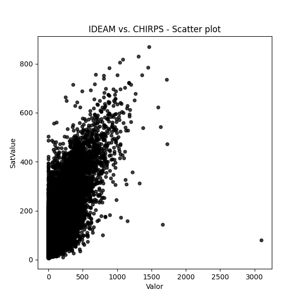
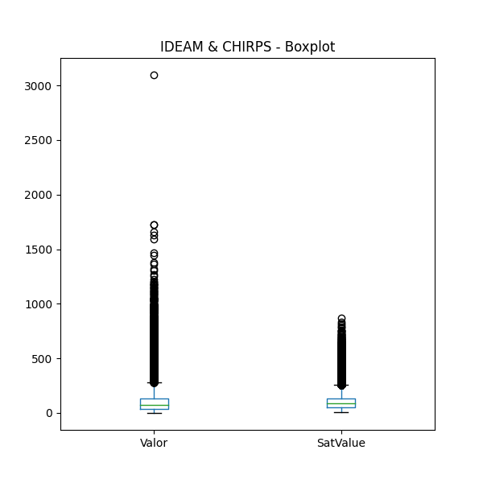
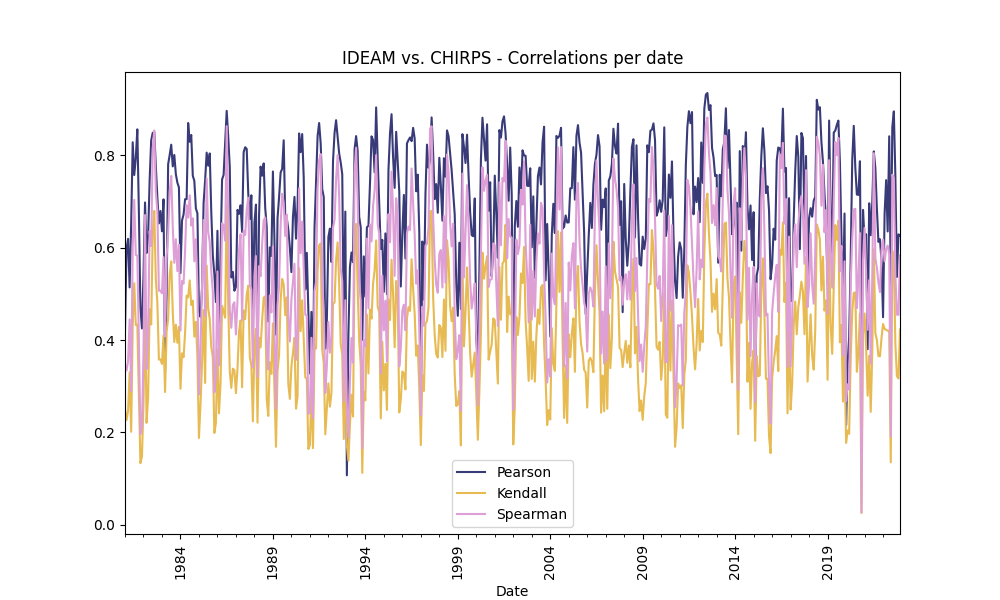
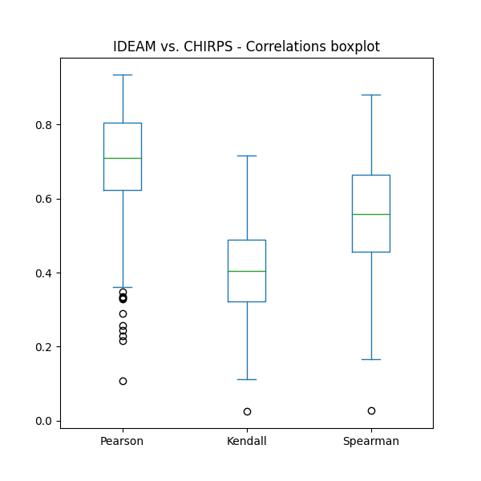
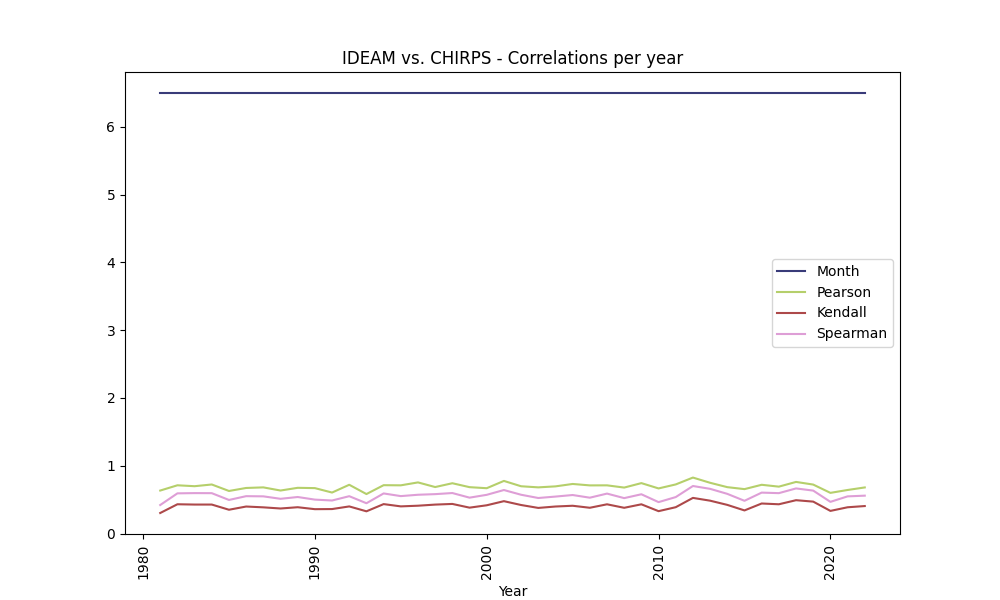
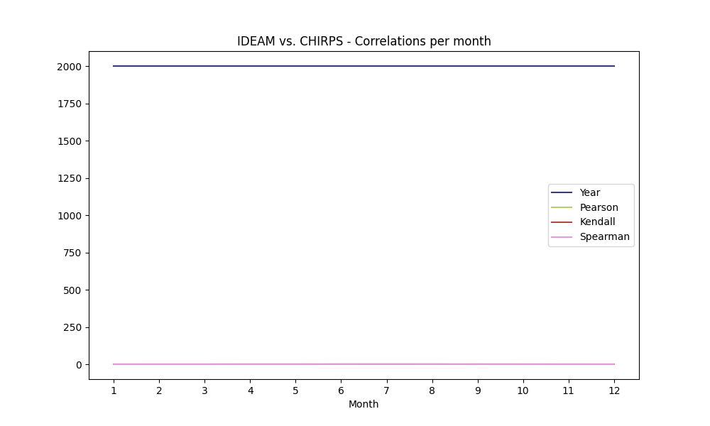

## Obtención de series de datos discretos climatológicos satelitales y correlación con datos terrestres, IDEAM vs. CHIRPS

* Archivo de resultados: C:\JLGC\R.LTWB\.datasets\CHIRPS/RemoteSensingRainChirps.md
* Fecha y hora de inicio de ejecución: 2023-09-05 16:31:52.723530
* Python versión: 3.11.5 (tags/v3.11.5:cce6ba9, Aug 24 2023, 14:38:34) [MSC v.1936 64 bit (AMD64)]
* Python rutas: ['C:\\JLGC\\R.LTWB\\.src', 'C:\\Python311\\python311.zip', 'C:\\Python311\\DLLs', 'C:\\Python311\\Lib', 'C:\\Python311']
* matplotlib versión: 3.7.2
* Encuentra este script en https://github.com/rcfdtools/R.LTWB/tree/main/Section03/RemoteSensing
* Cláusulas y condiciones de uso en https://github.com/rcfdtools/R.LTWB/blob/main/LICENSE.md
* Créditos: r.cfdtools@gmail.com

### General dataframe information

* IDEAM records: 124066
* Filtered records for Etiqueta == "PTPM_TT_M": 124066 (100.0%)

### General IDEAM vs. CHIRPS - Plots

Processed .csv file [IDEAMJoinedChirps.csv](IDEAMJoinedChirps.csv)

### Correlation Analysis

The correlation methods used for the analysis are:

* [Pearson correlation coefficient](https://en.wikipedia.org/wiki/Pearson_correlation_coefficient)  
* [Kendall rank correlation coefficient](https://en.wikipedia.org/wiki/Kendall_rank_correlation_coefficient)  
* [Spearman’s rank correlation coefficient](https://en.wikipedia.org/wiki/Spearman%27s_rank_correlation_coefficient)  

#### Correlation values for the date records

The following table, shows the monthly average correlation values obtained from the IDEAM records and the correspondent Chirps values.
Get the table [IDEAMJoinedChirpsCorrelationDate.csv](IDEAMJoinedChirpsCorrelationDate.csv) 

| Date                |   Year |   Month |   Pearson |   Kendall |   Spearman |
|:--------------------|-------:|--------:|----------:|----------:|-----------:|
| 1981-01-01 00:00:00 |   1981 |       1 |  0.419918 | 0.250842  |  0.347598  |
| 1981-02-01 00:00:00 |   1981 |       2 |  0.597558 | 0.226811  |  0.334027  |
| 1981-03-01 00:00:00 |   1981 |       3 |  0.61891  | 0.246499  |  0.353963  |
| 1981-04-01 00:00:00 |   1981 |       4 |  0.513873 | 0.330119  |  0.444711  |
| 1981-05-01 00:00:00 |   1981 |       5 |  0.650954 | 0.201455  |  0.289206  |
| 1981-06-01 00:00:00 |   1981 |       6 |  0.828029 | 0.431666  |  0.600569  |
| 1981-07-01 00:00:00 |   1981 |       7 |  0.757106 | 0.522965  |  0.70325   |
| 1981-08-01 00:00:00 |   1981 |       8 |  0.794013 | 0.432258  |  0.584161  |
| 1981-09-01 00:00:00 |   1981 |       9 |  0.855983 | 0.433233  |  0.582619  |
| 1981-10-01 00:00:00 |   1981 |      10 |  0.679604 | 0.279826  |  0.401193  |
| 1981-11-01 00:00:00 |   1981 |      11 |  0.470576 | 0.133522  |  0.196361  |
| 1981-12-01 00:00:00 |   1981 |      12 |  0.425021 | 0.148228  |  0.212105  |
| 1982-01-01 00:00:00 |   1982 |       1 |  0.538333 | 0.262504  |  0.373448  |
| 1982-02-01 00:00:00 |   1982 |       2 |  0.697717 | 0.482528  |  0.670448  |
| 1982-03-01 00:00:00 |   1982 |       3 |  0.588234 | 0.220799  |  0.336994  |
| 1982-04-01 00:00:00 |   1982 |       4 |  0.624753 | 0.277021  |  0.414668  |
| 1982-05-01 00:00:00 |   1982 |       5 |  0.746916 | 0.466596  |  0.635601  |
| 1982-06-01 00:00:00 |   1982 |       6 |  0.832263 | 0.433663  |  0.60353   |
| 1982-07-01 00:00:00 |   1982 |       7 |  0.848418 | 0.632664  |  0.815318  |
| 1982-08-01 00:00:00 |   1982 |       8 |  0.849706 | 0.679426  |  0.853409  |
| 1982-09-01 00:00:00 |   1982 |       9 |  0.776329 | 0.532328  |  0.72021   |
| 1982-10-01 00:00:00 |   1982 |      10 |  0.709158 | 0.481177  |  0.678416  |
| 1982-11-01 00:00:00 |   1982 |      11 |  0.652356 | 0.357727  |  0.506732  |
| 1982-12-01 00:00:00 |   1982 |      12 |  0.679298 | 0.358304  |  0.507068  |
| 1983-01-01 00:00:00 |   1983 |       1 |  0.635299 | 0.348242  |  0.501212  |
| 1983-02-01 00:00:00 |   1983 |       2 |  0.704482 | 0.410014  |  0.579366  |
| 1983-03-01 00:00:00 |   1983 |       3 |  0.333591 | 0.287542  |  0.407449  |
| 1983-04-01 00:00:00 |   1983 |       4 |  0.499157 | 0.418015  |  0.578353  |
| 1983-05-01 00:00:00 |   1983 |       5 |  0.780428 | 0.446064  |  0.631581  |
| 1983-06-01 00:00:00 |   1983 |       6 |  0.800587 | 0.540424  |  0.720084  |
| 1983-07-01 00:00:00 |   1983 |       7 |  0.822747 | 0.570179  |  0.755086  |
| 1983-08-01 00:00:00 |   1983 |       8 |  0.775775 | 0.460507  |  0.645316  |
| 1983-09-01 00:00:00 |   1983 |       9 |  0.800534 | 0.395567  |  0.567194  |
| 1983-10-01 00:00:00 |   1983 |      10 |  0.758952 | 0.433335  |  0.618231  |
| 1983-11-01 00:00:00 |   1983 |      11 |  0.740421 | 0.394134  |  0.549179  |
| 1983-12-01 00:00:00 |   1983 |      12 |  0.730356 | 0.428453  |  0.606112  |
| 1984-01-01 00:00:00 |   1984 |       1 |  0.544746 | 0.294552  |  0.420405  |
| 1984-02-01 00:00:00 |   1984 |       2 |  0.658584 | 0.371239  |  0.528057  |
| 1984-03-01 00:00:00 |   1984 |       3 |  0.671524 | 0.362702  |  0.521868  |
| 1984-04-01 00:00:00 |   1984 |       4 |  0.704892 | 0.415134  |  0.59359   |
| 1984-05-01 00:00:00 |   1984 |       5 |  0.704897 | 0.496248  |  0.691982  |
| 1984-06-01 00:00:00 |   1984 |       6 |  0.869727 | 0.492195  |  0.665192  |
| 1984-07-01 00:00:00 |   1984 |       7 |  0.829105 | 0.528924  |  0.713179  |
| 1984-08-01 00:00:00 |   1984 |       8 |  0.843749 | 0.475782  |  0.64788   |
| 1984-09-01 00:00:00 |   1984 |       9 |  0.755493 | 0.485308  |  0.663509  |
| 1984-10-01 00:00:00 |   1984 |      10 |  0.744433 | 0.407458  |  0.570299  |
| 1984-11-01 00:00:00 |   1984 |      11 |  0.684799 | 0.439384  |  0.618397  |
| 1984-12-01 00:00:00 |   1984 |      12 |  0.674098 | 0.363425  |  0.514159  |
| 1985-01-01 00:00:00 |   1985 |       1 |  0.46293  | 0.188075  |  0.282522  |
| 1985-02-01 00:00:00 |   1985 |       2 |  0.450182 | 0.261471  |  0.37951   |
| 1985-03-01 00:00:00 |   1985 |       3 |  0.511801 | 0.349419  |  0.516402  |
| 1985-04-01 00:00:00 |   1985 |       4 |  0.695799 | 0.465067  |  0.659707  |
| 1985-05-01 00:00:00 |   1985 |       5 |  0.745291 | 0.307156  |  0.452274  |
| 1985-06-01 00:00:00 |   1985 |       6 |  0.80561  | 0.561166  |  0.749352  |
| 1985-07-01 00:00:00 |   1985 |       7 |  0.777248 | 0.468701  |  0.633447  |
| 1985-08-01 00:00:00 |   1985 |       8 |  0.803829 | 0.445307  |  0.612058  |
| 1985-09-01 00:00:00 |   1985 |       9 |  0.676226 | 0.385368  |  0.548788  |
| 1985-10-01 00:00:00 |   1985 |      10 |  0.582981 | 0.362833  |  0.504501  |
| 1985-11-01 00:00:00 |   1985 |      11 |  0.542363 | 0.198909  |  0.286843  |
| 1985-12-01 00:00:00 |   1985 |      12 |  0.482241 | 0.220736  |  0.321087  |
| 1986-01-01 00:00:00 |   1986 |       1 |  0.636427 | 0.37921   |  0.548409  |
| 1986-02-01 00:00:00 |   1986 |       2 |  0.418448 | 0.24131   |  0.3451    |
| 1986-03-01 00:00:00 |   1986 |       3 |  0.581779 | 0.30574   |  0.443842  |
| 1986-04-01 00:00:00 |   1986 |       4 |  0.747477 | 0.473874  |  0.65298   |
| 1986-05-01 00:00:00 |   1986 |       5 |  0.757308 | 0.46193   |  0.647656  |
| 1986-06-01 00:00:00 |   1986 |       6 |  0.828395 | 0.448338  |  0.615164  |
| 1986-07-01 00:00:00 |   1986 |       7 |  0.895943 | 0.694102  |  0.863007  |
| 1986-08-01 00:00:00 |   1986 |       8 |  0.840246 | 0.4776    |  0.654607  |
| 1986-09-01 00:00:00 |   1986 |       9 |  0.774283 | 0.331848  |  0.463202  |
| 1986-10-01 00:00:00 |   1986 |      10 |  0.53545  | 0.296317  |  0.426479  |
| 1986-11-01 00:00:00 |   1986 |      11 |  0.547521 | 0.338094  |  0.475802  |
| 1986-12-01 00:00:00 |   1986 |      12 |  0.506697 | 0.334709  |  0.481596  |
| 1987-01-01 00:00:00 |   1987 |       1 |  0.514649 | 0.284968  |  0.411998  |
| 1987-02-01 00:00:00 |   1987 |       2 |  0.681753 | 0.338091  |  0.485381  |
| 1987-03-01 00:00:00 |   1987 |       3 |  0.673032 | 0.418539  |  0.593363  |
| 1987-04-01 00:00:00 |   1987 |       4 |  0.691579 | 0.442333  |  0.628771  |
| 1987-05-01 00:00:00 |   1987 |       5 |  0.633952 | 0.297812  |  0.443569  |
| 1987-06-01 00:00:00 |   1987 |       6 |  0.806469 | 0.463997  |  0.636126  |
| 1987-07-01 00:00:00 |   1987 |       7 |  0.817228 | 0.445343  |  0.627424  |
| 1987-08-01 00:00:00 |   1987 |       8 |  0.813547 | 0.497691  |  0.681569  |
| 1987-09-01 00:00:00 |   1987 |       9 |  0.717141 | 0.517606  |  0.707999  |
| 1987-10-01 00:00:00 |   1987 |      10 |  0.662055 | 0.363346  |  0.518733  |
| 1987-11-01 00:00:00 |   1987 |      11 |  0.713271 | 0.345633  |  0.509428  |
| 1987-12-01 00:00:00 |   1987 |      12 |  0.4473   | 0.224087  |  0.340553  |
| 1988-01-01 00:00:00 |   1988 |       1 |  0.653327 | 0.387079  |  0.538642  |
| 1988-02-01 00:00:00 |   1988 |       2 |  0.693066 | 0.424038  |  0.581766  |
| 1988-03-01 00:00:00 |   1988 |       3 |  0.335    | 0.221076  |  0.320247  |
| 1988-04-01 00:00:00 |   1988 |       4 |  0.669063 | 0.405034  |  0.559905  |
| 1988-05-01 00:00:00 |   1988 |       5 |  0.77533  | 0.383947  |  0.537937  |
| 1988-06-01 00:00:00 |   1988 |       6 |  0.755692 | 0.442456  |  0.6076    |
| 1988-07-01 00:00:00 |   1988 |       7 |  0.782193 | 0.491576  |  0.658872  |
| 1988-08-01 00:00:00 |   1988 |       8 |  0.685932 | 0.494519  |  0.665093  |
| 1988-09-01 00:00:00 |   1988 |       9 |  0.643986 | 0.27103   |  0.387681  |
| 1988-10-01 00:00:00 |   1988 |      10 |  0.440162 | 0.235713  |  0.336346  |
| 1988-11-01 00:00:00 |   1988 |      11 |  0.600467 | 0.352115  |  0.496561  |
| 1988-12-01 00:00:00 |   1988 |      12 |  0.58206  | 0.326993  |  0.459704  |
| 1989-01-01 00:00:00 |   1989 |       1 |  0.764732 | 0.436171  |  0.602352  |
| 1989-02-01 00:00:00 |   1989 |       2 |  0.614641 | 0.292251  |  0.417255  |
| 1989-03-01 00:00:00 |   1989 |       3 |  0.411725 | 0.168879  |  0.251522  |
| 1989-04-01 00:00:00 |   1989 |       4 |  0.663428 | 0.332864  |  0.474829  |
| 1989-05-01 00:00:00 |   1989 |       5 |  0.708886 | 0.368595  |  0.516243  |
| 1989-06-01 00:00:00 |   1989 |       6 |  0.762626 | 0.485987  |  0.648822  |
| 1989-07-01 00:00:00 |   1989 |       7 |  0.770332 | 0.532238  |  0.716553  |
| 1989-08-01 00:00:00 |   1989 |       8 |  0.832252 | 0.52046   |  0.697595  |
| 1989-09-01 00:00:00 |   1989 |       9 |  0.66511  | 0.453733  |  0.625229  |
| 1989-10-01 00:00:00 |   1989 |      10 |  0.664166 | 0.492459  |  0.671219  |
| 1989-11-01 00:00:00 |   1989 |      11 |  0.638828 | 0.304414  |  0.449725  |
| 1989-12-01 00:00:00 |   1989 |      12 |  0.59953  | 0.272628  |  0.397017  |
| 1990-01-01 00:00:00 |   1990 |       1 |  0.546987 | 0.343272  |  0.487846  |
| 1990-02-01 00:00:00 |   1990 |       2 |  0.666352 | 0.37209   |  0.525289  |
| 1990-03-01 00:00:00 |   1990 |       3 |  0.709855 | 0.404682  |  0.565084  |
| 1990-04-01 00:00:00 |   1990 |       4 |  0.619451 | 0.251411  |  0.357078  |
| 1990-05-01 00:00:00 |   1990 |       5 |  0.689104 | 0.278462  |  0.398825  |
| 1990-06-01 00:00:00 |   1990 |       6 |  0.847123 | 0.555351  |  0.728306  |
| 1990-07-01 00:00:00 |   1990 |       7 |  0.806581 | 0.419197  |  0.587973  |
| 1990-08-01 00:00:00 |   1990 |       8 |  0.845769 | 0.48606   |  0.656419  |
| 1990-09-01 00:00:00 |   1990 |       9 |  0.750864 | 0.404108  |  0.553395  |
| 1990-10-01 00:00:00 |   1990 |      10 |  0.509386 | 0.319431  |  0.454807  |
| 1990-11-01 00:00:00 |   1990 |      11 |  0.588693 | 0.316477  |  0.452658  |
| 1990-12-01 00:00:00 |   1990 |      12 |  0.4634   | 0.164275  |  0.240135  |
| 1991-01-01 00:00:00 |   1991 |       1 |  0.327716 | 0.172894  |  0.243172  |
| 1991-02-01 00:00:00 |   1991 |       2 |  0.46098  | 0.296697  |  0.404755  |
| 1991-03-01 00:00:00 |   1991 |       3 |  0.289006 | 0.166024  |  0.231093  |
| 1991-04-01 00:00:00 |   1991 |       4 |  0.642631 | 0.37835   |  0.505909  |
| 1991-05-01 00:00:00 |   1991 |       5 |  0.741965 | 0.382258  |  0.525438  |
| 1991-06-01 00:00:00 |   1991 |       6 |  0.841616 | 0.549254  |  0.729559  |
| 1991-07-01 00:00:00 |   1991 |       7 |  0.86965  | 0.604907  |  0.789465  |
| 1991-08-01 00:00:00 |   1991 |       8 |  0.825561 | 0.609021  |  0.80252   |
| 1991-09-01 00:00:00 |   1991 |       9 |  0.726948 | 0.378883  |  0.5227    |
| 1991-10-01 00:00:00 |   1991 |      10 |  0.709444 | 0.35105   |  0.465573  |
| 1991-11-01 00:00:00 |   1991 |      11 |  0.381392 | 0.195965  |  0.285441  |
| 1991-12-01 00:00:00 |   1991 |      12 |  0.44136  | 0.250426  |  0.344019  |
| 1992-01-01 00:00:00 |   1992 |       1 |  0.623152 | 0.306123  |  0.438747  |
| 1992-02-01 00:00:00 |   1992 |       2 |  0.64114  | 0.255895  |  0.372663  |
| 1992-03-01 00:00:00 |   1992 |       3 |  0.568799 | 0.285917  |  0.405921  |
| 1992-04-01 00:00:00 |   1992 |       4 |  0.786328 | 0.477784  |  0.642843  |
| 1992-05-01 00:00:00 |   1992 |       5 |  0.847961 | 0.481449  |  0.660456  |
| 1992-06-01 00:00:00 |   1992 |       6 |  0.875748 | 0.573324  |  0.74749   |
| 1992-07-01 00:00:00 |   1992 |       7 |  0.839871 | 0.611304  |  0.800229  |
| 1992-08-01 00:00:00 |   1992 |       8 |  0.803766 | 0.522155  |  0.709774  |
| 1992-09-01 00:00:00 |   1992 |       9 |  0.784197 | 0.391752  |  0.554502  |
| 1992-10-01 00:00:00 |   1992 |      10 |  0.758842 | 0.368751  |  0.526851  |
| 1992-11-01 00:00:00 |   1992 |      11 |  0.427932 | 0.185777  |  0.26753   |
| 1992-12-01 00:00:00 |   1992 |      12 |  0.677988 | 0.341729  |  0.48625   |
| 1993-01-01 00:00:00 |   1993 |       1 |  0.107206 | 0.173108  |  0.255183  |
| 1993-02-01 00:00:00 |   1993 |       2 |  0.411756 | 0.138883  |  0.188741  |
| 1993-03-01 00:00:00 |   1993 |       3 |  0.558517 | 0.216464  |  0.313137  |
| 1993-04-01 00:00:00 |   1993 |       4 |  0.589518 | 0.281797  |  0.404254  |
| 1993-05-01 00:00:00 |   1993 |       5 |  0.568399 | 0.234409  |  0.350981  |
| 1993-06-01 00:00:00 |   1993 |       6 |  0.813119 | 0.580996  |  0.762404  |
| 1993-07-01 00:00:00 |   1993 |       7 |  0.841365 | 0.651293  |  0.815896  |
| 1993-08-01 00:00:00 |   1993 |       8 |  0.809314 | 0.513527  |  0.701586  |
| 1993-09-01 00:00:00 |   1993 |       9 |  0.666698 | 0.399271  |  0.523322  |
| 1993-10-01 00:00:00 |   1993 |      10 |  0.643829 | 0.345679  |  0.484383  |
| 1993-11-01 00:00:00 |   1993 |      11 |  0.400468 | 0.112495  |  0.166019  |
| 1993-12-01 00:00:00 |   1993 |      12 |  0.58106  | 0.28803   |  0.39962   |
| 1994-01-01 00:00:00 |   1994 |       1 |  0.49403  | 0.269319  |  0.386291  |
| 1994-02-01 00:00:00 |   1994 |       2 |  0.644044 | 0.454898  |  0.61951   |
| 1994-03-01 00:00:00 |   1994 |       3 |  0.647205 | 0.327821  |  0.468526  |
| 1994-04-01 00:00:00 |   1994 |       4 |  0.738177 | 0.466096  |  0.650427  |
| 1994-05-01 00:00:00 |   1994 |       5 |  0.840829 | 0.446331  |  0.61341   |
| 1994-06-01 00:00:00 |   1994 |       6 |  0.833024 | 0.522051  |  0.690377  |
| 1994-07-01 00:00:00 |   1994 |       7 |  0.762742 | 0.551007  |  0.723027  |
| 1994-08-01 00:00:00 |   1994 |       8 |  0.903401 | 0.615537  |  0.80024   |
| 1994-09-01 00:00:00 |   1994 |       9 |  0.791798 | 0.47264   |  0.650677  |
| 1994-10-01 00:00:00 |   1994 |      10 |  0.693552 | 0.459355  |  0.630155  |
| 1994-11-01 00:00:00 |   1994 |      11 |  0.596941 | 0.230423  |  0.328091  |
| 1994-12-01 00:00:00 |   1994 |      12 |  0.61669  | 0.396303  |  0.539267  |
| 1995-01-01 00:00:00 |   1995 |       1 |  0.504198 | 0.291155  |  0.421014  |
| 1995-02-01 00:00:00 |   1995 |       2 |  0.630779 | 0.34853   |  0.485045  |
| 1995-03-01 00:00:00 |   1995 |       3 |  0.49909  | 0.248688  |  0.354091  |
| 1995-04-01 00:00:00 |   1995 |       4 |  0.767936 | 0.487407  |  0.672154  |
| 1995-05-01 00:00:00 |   1995 |       5 |  0.847117 | 0.443417  |  0.611666  |
| 1995-06-01 00:00:00 |   1995 |       6 |  0.888699 | 0.573782  |  0.764504  |
| 1995-07-01 00:00:00 |   1995 |       7 |  0.795418 | 0.499301  |  0.680585  |
| 1995-08-01 00:00:00 |   1995 |       8 |  0.72926  | 0.384409  |  0.538756  |
| 1995-09-01 00:00:00 |   1995 |       9 |  0.850649 | 0.527759  |  0.706927  |
| 1995-10-01 00:00:00 |   1995 |      10 |  0.7861   | 0.491963  |  0.668381  |
| 1995-11-01 00:00:00 |   1995 |      11 |  0.721445 | 0.243335  |  0.34304   |
| 1995-12-01 00:00:00 |   1995 |      12 |  0.515808 | 0.270258  |  0.382392  |
| 1996-01-01 00:00:00 |   1996 |       1 |  0.629397 | 0.331812  |  0.463938  |
| 1996-02-01 00:00:00 |   1996 |       2 |  0.714031 | 0.328341  |  0.476291  |
| 1996-03-01 00:00:00 |   1996 |       3 |  0.576312 | 0.293143  |  0.421158  |
| 1996-04-01 00:00:00 |   1996 |       4 |  0.825647 | 0.44717   |  0.630937  |
| 1996-05-01 00:00:00 |   1996 |       5 |  0.832594 | 0.471231  |  0.645725  |
| 1996-06-01 00:00:00 |   1996 |       6 |  0.83844  | 0.462999  |  0.638138  |
| 1996-07-01 00:00:00 |   1996 |       7 |  0.830373 | 0.574816  |  0.771151  |
| 1996-08-01 00:00:00 |   1996 |       8 |  0.85923  | 0.511091  |  0.695398  |
| 1996-09-01 00:00:00 |   1996 |       9 |  0.836241 | 0.457119  |  0.628668  |
| 1996-10-01 00:00:00 |   1996 |      10 |  0.721887 | 0.366043  |  0.521871  |
| 1996-11-01 00:00:00 |   1996 |      11 |  0.75792  | 0.38831   |  0.550834  |
| 1996-12-01 00:00:00 |   1996 |      12 |  0.632161 | 0.296292  |  0.423815  |
| 1997-01-01 00:00:00 |   1997 |       1 |  0.22815  | 0.172699  |  0.236892  |
| 1997-02-01 00:00:00 |   1997 |       2 |  0.613196 | 0.32385   |  0.472102  |
| 1997-03-01 00:00:00 |   1997 |       3 |  0.487104 | 0.289734  |  0.430803  |
| 1997-04-01 00:00:00 |   1997 |       4 |  0.714884 | 0.434975  |  0.60407   |
| 1997-05-01 00:00:00 |   1997 |       5 |  0.822911 | 0.441266  |  0.608412  |
| 1997-06-01 00:00:00 |   1997 |       6 |  0.772848 | 0.471324  |  0.644167  |
| 1997-07-01 00:00:00 |   1997 |       7 |  0.789984 | 0.677995  |  0.857089  |
| 1997-08-01 00:00:00 |   1997 |       8 |  0.881769 | 0.679372  |  0.862698  |
| 1997-09-01 00:00:00 |   1997 |       9 |  0.803703 | 0.49223   |  0.665661  |
| 1997-10-01 00:00:00 |   1997 |      10 |  0.704891 | 0.410574  |  0.572836  |
| 1997-11-01 00:00:00 |   1997 |      11 |  0.737535 | 0.369307  |  0.519706  |
| 1997-12-01 00:00:00 |   1997 |      12 |  0.675425 | 0.362069  |  0.502302  |
| 1998-01-01 00:00:00 |   1998 |       1 |  0.794436 | 0.432551  |  0.586527  |
| 1998-02-01 00:00:00 |   1998 |       2 |  0.733206 | 0.426151  |  0.594645  |
| 1998-03-01 00:00:00 |   1998 |       3 |  0.658211 | 0.363199  |  0.513601  |
| 1998-04-01 00:00:00 |   1998 |       4 |  0.793468 | 0.487655  |  0.66829   |
| 1998-05-01 00:00:00 |   1998 |       5 |  0.753401 | 0.376683  |  0.524369  |
| 1998-06-01 00:00:00 |   1998 |       6 |  0.853631 | 0.615988  |  0.801458  |
| 1998-07-01 00:00:00 |   1998 |       7 |  0.841035 | 0.573101  |  0.763625  |
| 1998-08-01 00:00:00 |   1998 |       8 |  0.803126 | 0.473903  |  0.654281  |
| 1998-09-01 00:00:00 |   1998 |       9 |  0.767205 | 0.441177  |  0.602637  |
| 1998-10-01 00:00:00 |   1998 |      10 |  0.719007 | 0.470061  |  0.651876  |
| 1998-11-01 00:00:00 |   1998 |      11 |  0.671421 | 0.324483  |  0.452279  |
| 1998-12-01 00:00:00 |   1998 |      12 |  0.519982 | 0.257122  |  0.358558  |
| 1999-01-01 00:00:00 |   1999 |       1 |  0.452398 | 0.261196  |  0.379838  |
| 1999-02-01 00:00:00 |   1999 |       2 |  0.610675 | 0.289829  |  0.410502  |
| 1999-03-01 00:00:00 |   1999 |       3 |  0.467222 | 0.171974  |  0.246865  |
| 1999-04-01 00:00:00 |   1999 |       4 |  0.845524 | 0.575931  |  0.760327  |
| 1999-05-01 00:00:00 |   1999 |       5 |  0.818049 | 0.386307  |  0.535487  |
| 1999-06-01 00:00:00 |   1999 |       6 |  0.783129 | 0.460583  |  0.631333  |
| 1999-07-01 00:00:00 |   1999 |       7 |  0.844496 | 0.557156  |  0.735146  |
| 1999-08-01 00:00:00 |   1999 |       8 |  0.755133 | 0.469928  |  0.643255  |
| 1999-09-01 00:00:00 |   1999 |       9 |  0.67722  | 0.371571  |  0.529999  |
| 1999-10-01 00:00:00 |   1999 |      10 |  0.626967 | 0.320681  |  0.468046  |
| 1999-11-01 00:00:00 |   1999 |      11 |  0.624714 | 0.346394  |  0.490526  |
| 1999-12-01 00:00:00 |   1999 |      12 |  0.706456 | 0.372944  |  0.522638  |
| 2000-01-01 00:00:00 |   2000 |       1 |  0.401654 | 0.284326  |  0.406602  |
| 2000-02-01 00:00:00 |   2000 |       2 |  0.362003 | 0.184134  |  0.258859  |
| 2000-03-01 00:00:00 |   2000 |       3 |  0.548618 | 0.288745  |  0.418873  |
| 2000-04-01 00:00:00 |   2000 |       4 |  0.790577 | 0.413771  |  0.586035  |
| 2000-05-01 00:00:00 |   2000 |       5 |  0.881141 | 0.589216  |  0.773737  |
| 2000-06-01 00:00:00 |   2000 |       6 |  0.834211 | 0.532745  |  0.723024  |
| 2000-07-01 00:00:00 |   2000 |       7 |  0.788369 | 0.560228  |  0.745115  |
| 2000-08-01 00:00:00 |   2000 |       8 |  0.866871 | 0.581553  |  0.757738  |
| 2000-09-01 00:00:00 |   2000 |       9 |  0.679544 | 0.357403  |  0.514693  |
| 2000-10-01 00:00:00 |   2000 |      10 |  0.741531 | 0.374662  |  0.530236  |
| 2000-11-01 00:00:00 |   2000 |      11 |  0.538203 | 0.390608  |  0.531665  |
| 2000-12-01 00:00:00 |   2000 |      12 |  0.594099 | 0.446794  |  0.609332  |
| 2001-01-01 00:00:00 |   2001 |       1 |  0.75582  | 0.442976  |  0.604885  |
| 2001-02-01 00:00:00 |   2001 |       2 |  0.674429 | 0.373497  |  0.514848  |
| 2001-03-01 00:00:00 |   2001 |       3 |  0.577785 | 0.305776  |  0.430522  |
| 2001-04-01 00:00:00 |   2001 |       4 |  0.854319 | 0.557774  |  0.741443  |
| 2001-05-01 00:00:00 |   2001 |       5 |  0.838239 | 0.44383   |  0.605005  |
| 2001-06-01 00:00:00 |   2001 |       6 |  0.873115 | 0.565735  |  0.750631  |
| 2001-07-01 00:00:00 |   2001 |       7 |  0.884157 | 0.571025  |  0.743421  |
| 2001-08-01 00:00:00 |   2001 |       8 |  0.84726  | 0.649428  |  0.831289  |
| 2001-09-01 00:00:00 |   2001 |       9 |  0.780138 | 0.417439  |  0.576589  |
| 2001-10-01 00:00:00 |   2001 |      10 |  0.701466 | 0.494017  |  0.661848  |
| 2001-11-01 00:00:00 |   2001 |      11 |  0.816567 | 0.455628  |  0.623974  |
| 2001-12-01 00:00:00 |   2001 |      12 |  0.714026 | 0.454693  |  0.621663  |
| 2002-01-01 00:00:00 |   2002 |       1 |  0.243373 | 0.174172  |  0.249608  |
| 2002-02-01 00:00:00 |   2002 |       2 |  0.646908 | 0.257928  |  0.365304  |
| 2002-03-01 00:00:00 |   2002 |       3 |  0.700932 | 0.449679  |  0.617326  |
| 2002-04-01 00:00:00 |   2002 |       4 |  0.645105 | 0.410972  |  0.58657   |
| 2002-05-01 00:00:00 |   2002 |       5 |  0.773453 | 0.448426  |  0.604894  |
| 2002-06-01 00:00:00 |   2002 |       6 |  0.715035 | 0.544004  |  0.725124  |
| 2002-07-01 00:00:00 |   2002 |       7 |  0.810534 | 0.523336  |  0.693145  |
| 2002-08-01 00:00:00 |   2002 |       8 |  0.799507 | 0.601498  |  0.786905  |
| 2002-09-01 00:00:00 |   2002 |       9 |  0.798757 | 0.441745  |  0.611287  |
| 2002-10-01 00:00:00 |   2002 |      10 |  0.733876 | 0.383926  |  0.540357  |
| 2002-11-01 00:00:00 |   2002 |      11 |  0.733357 | 0.311624  |  0.438175  |
| 2002-12-01 00:00:00 |   2002 |      12 |  0.77164  | 0.504836  |  0.649352  |
| 2003-01-01 00:00:00 |   2003 |       1 |  0.600671 | 0.315832  |  0.444386  |
| 2003-02-01 00:00:00 |   2003 |       2 |  0.710937 | 0.396475  |  0.549946  |
| 2003-03-01 00:00:00 |   2003 |       3 |  0.534483 | 0.309999  |  0.450981  |
| 2003-04-01 00:00:00 |   2003 |       4 |  0.649994 | 0.410642  |  0.56899   |
| 2003-05-01 00:00:00 |   2003 |       5 |  0.754602 | 0.466093  |  0.630746  |
| 2003-06-01 00:00:00 |   2003 |       6 |  0.773377 | 0.434657  |  0.6087    |
| 2003-07-01 00:00:00 |   2003 |       7 |  0.736797 | 0.513802  |  0.696861  |
| 2003-08-01 00:00:00 |   2003 |       8 |  0.827571 | 0.519313  |  0.68472   |
| 2003-09-01 00:00:00 |   2003 |       9 |  0.861583 | 0.390652  |  0.544672  |
| 2003-10-01 00:00:00 |   2003 |      10 |  0.52913  | 0.314617  |  0.446656  |
| 2003-11-01 00:00:00 |   2003 |      11 |  0.651167 | 0.21599   |  0.307991  |
| 2003-12-01 00:00:00 |   2003 |      12 |  0.545992 | 0.24819   |  0.358369  |
| 2004-01-01 00:00:00 |   2004 |       1 |  0.407758 | 0.227947  |  0.321074  |
| 2004-02-01 00:00:00 |   2004 |       2 |  0.62751  | 0.425926  |  0.587146  |
| 2004-03-01 00:00:00 |   2004 |       3 |  0.694836 | 0.348926  |  0.494542  |
| 2004-04-01 00:00:00 |   2004 |       4 |  0.6315   | 0.33327   |  0.477348  |
| 2004-05-01 00:00:00 |   2004 |       5 |  0.841668 | 0.476946  |  0.65114   |
| 2004-06-01 00:00:00 |   2004 |       6 |  0.837513 | 0.635463  |  0.816959  |
| 2004-07-01 00:00:00 |   2004 |       7 |  0.842157 | 0.504087  |  0.682578  |
| 2004-08-01 00:00:00 |   2004 |       8 |  0.859217 | 0.632848  |  0.817741  |
| 2004-09-01 00:00:00 |   2004 |       9 |  0.641075 | 0.403909  |  0.556144  |
| 2004-10-01 00:00:00 |   2004 |      10 |  0.644893 | 0.231199  |  0.342748  |
| 2004-11-01 00:00:00 |   2004 |      11 |  0.669681 | 0.34497   |  0.480352  |
| 2004-12-01 00:00:00 |   2004 |      12 |  0.654251 | 0.220611  |  0.317207  |
| 2005-01-01 00:00:00 |   2005 |       1 |  0.654548 | 0.412023  |  0.567685  |
| 2005-02-01 00:00:00 |   2005 |       2 |  0.728373 | 0.36315   |  0.507354  |
| 2005-03-01 00:00:00 |   2005 |       3 |  0.728604 | 0.41459   |  0.5826    |
| 2005-04-01 00:00:00 |   2005 |       4 |  0.817462 | 0.446865  |  0.609696  |
| 2005-05-01 00:00:00 |   2005 |       5 |  0.703741 | 0.331083  |  0.468687  |
| 2005-06-01 00:00:00 |   2005 |       6 |  0.841945 | 0.523397  |  0.710842  |
| 2005-07-01 00:00:00 |   2005 |       7 |  0.865118 | 0.560184  |  0.739895  |
| 2005-08-01 00:00:00 |   2005 |       8 |  0.827112 | 0.439907  |  0.612997  |
| 2005-09-01 00:00:00 |   2005 |       9 |  0.805716 | 0.391606  |  0.553701  |
| 2005-10-01 00:00:00 |   2005 |      10 |  0.717243 | 0.371646  |  0.519364  |
| 2005-11-01 00:00:00 |   2005 |      11 |  0.631839 | 0.335387  |  0.480246  |
| 2005-12-01 00:00:00 |   2005 |      12 |  0.456436 | 0.329589  |  0.466973  |
| 2006-01-01 00:00:00 |   2006 |       1 |  0.548417 | 0.25401   |  0.375162  |
| 2006-02-01 00:00:00 |   2006 |       2 |  0.627716 | 0.355395  |  0.499323  |
| 2006-03-01 00:00:00 |   2006 |       3 |  0.69681  | 0.36144   |  0.513806  |
| 2006-04-01 00:00:00 |   2006 |       4 |  0.642444 | 0.353334  |  0.50434   |
| 2006-05-01 00:00:00 |   2006 |       5 |  0.735367 | 0.330329  |  0.472463  |
| 2006-06-01 00:00:00 |   2006 |       6 |  0.78143  | 0.506402  |  0.676913  |
| 2006-07-01 00:00:00 |   2006 |       7 |  0.8012   | 0.605191  |  0.788584  |
| 2006-08-01 00:00:00 |   2006 |       8 |  0.84356  | 0.527634  |  0.699844  |
| 2006-09-01 00:00:00 |   2006 |       9 |  0.819174 | 0.458224  |  0.636086  |
| 2006-10-01 00:00:00 |   2006 |      10 |  0.638523 | 0.242952  |  0.370799  |
| 2006-11-01 00:00:00 |   2006 |      11 |  0.703866 | 0.323152  |  0.461632  |
| 2006-12-01 00:00:00 |   2006 |      12 |  0.687799 | 0.245963  |  0.348718  |
| 2007-01-01 00:00:00 |   2007 |       1 |  0.728132 | 0.417649  |  0.559603  |
| 2007-02-01 00:00:00 |   2007 |       2 |  0.367317 | 0.251125  |  0.356649  |
| 2007-03-01 00:00:00 |   2007 |       3 |  0.74492  | 0.454907  |  0.609087  |
| 2007-04-01 00:00:00 |   2007 |       4 |  0.754445 | 0.339169  |  0.490438  |
| 2007-05-01 00:00:00 |   2007 |       5 |  0.781138 | 0.403763  |  0.560551  |
| 2007-06-01 00:00:00 |   2007 |       6 |  0.857271 | 0.612737  |  0.792964  |
| 2007-07-01 00:00:00 |   2007 |       7 |  0.819615 | 0.548576  |  0.749368  |
| 2007-08-01 00:00:00 |   2007 |       8 |  0.803514 | 0.531539  |  0.726069  |
| 2007-09-01 00:00:00 |   2007 |       9 |  0.868316 | 0.515204  |  0.686251  |
| 2007-10-01 00:00:00 |   2007 |      10 |  0.649118 | 0.382974  |  0.529186  |
| 2007-11-01 00:00:00 |   2007 |      11 |  0.700421 | 0.378343  |  0.536643  |
| 2007-12-01 00:00:00 |   2007 |      12 |  0.460323 | 0.341487  |  0.476501  |
| 2008-01-01 00:00:00 |   2008 |       1 |  0.737706 | 0.372314  |  0.527524  |
| 2008-02-01 00:00:00 |   2008 |       2 |  0.619294 | 0.398056  |  0.542533  |
| 2008-03-01 00:00:00 |   2008 |       3 |  0.560717 | 0.350588  |  0.4878    |
| 2008-04-01 00:00:00 |   2008 |       4 |  0.612802 | 0.388068  |  0.548452  |
| 2008-05-01 00:00:00 |   2008 |       5 |  0.722869 | 0.340781  |  0.487594  |
| 2008-06-01 00:00:00 |   2008 |       6 |  0.817702 | 0.502927  |  0.657604  |
| 2008-07-01 00:00:00 |   2008 |       7 |  0.834491 | 0.576037  |  0.73685   |
| 2008-08-01 00:00:00 |   2008 |       8 |  0.621914 | 0.3713    |  0.506039  |
| 2008-09-01 00:00:00 |   2008 |       9 |  0.821381 | 0.428441  |  0.577709  |
| 2008-10-01 00:00:00 |   2008 |      10 |  0.664801 | 0.314157  |  0.45494   |
| 2008-11-01 00:00:00 |   2008 |      11 |  0.564641 | 0.246098  |  0.35447   |
| 2008-12-01 00:00:00 |   2008 |      12 |  0.561222 | 0.269244  |  0.390251  |
| 2009-01-01 00:00:00 |   2009 |       1 |  0.623806 | 0.227274  |  0.331339  |
| 2009-02-01 00:00:00 |   2009 |       2 |  0.59697  | 0.278491  |  0.387329  |
| 2009-03-01 00:00:00 |   2009 |       3 |  0.619336 | 0.306949  |  0.430302  |
| 2009-04-01 00:00:00 |   2009 |       4 |  0.821297 | 0.419914  |  0.57958   |
| 2009-05-01 00:00:00 |   2009 |       5 |  0.806522 | 0.520999  |  0.705367  |
| 2009-06-01 00:00:00 |   2009 |       6 |  0.852965 | 0.520635  |  0.698918  |
| 2009-07-01 00:00:00 |   2009 |       7 |  0.855344 | 0.638077  |  0.81768   |
| 2009-08-01 00:00:00 |   2009 |       8 |  0.868789 | 0.594485  |  0.772573  |
| 2009-09-01 00:00:00 |   2009 |       9 |  0.832441 | 0.509243  |  0.6605    |
| 2009-10-01 00:00:00 |   2009 |      10 |  0.669285 | 0.385753  |  0.520677  |
| 2009-11-01 00:00:00 |   2009 |      11 |  0.679491 | 0.379035  |  0.510957  |
| 2009-12-01 00:00:00 |   2009 |      12 |  0.702373 | 0.396026  |  0.538783  |
| 2010-01-01 00:00:00 |   2010 |       1 |  0.677403 | 0.313963  |  0.441227  |
| 2010-02-01 00:00:00 |   2010 |       2 |  0.70289  | 0.358244  |  0.502612  |
| 2010-03-01 00:00:00 |   2010 |       3 |  0.860277 | 0.501921  |  0.679911  |
| 2010-04-01 00:00:00 |   2010 |       4 |  0.624985 | 0.238717  |  0.352562  |
| 2010-05-01 00:00:00 |   2010 |       5 |  0.645681 | 0.231725  |  0.352351  |
| 2010-06-01 00:00:00 |   2010 |       6 |  0.758232 | 0.493542  |  0.668569  |
| 2010-07-01 00:00:00 |   2010 |       7 |  0.707812 | 0.333857  |  0.463884  |
| 2010-08-01 00:00:00 |   2010 |       8 |  0.786488 | 0.484798  |  0.648452  |
| 2010-09-01 00:00:00 |   2010 |       9 |  0.62496  | 0.321447  |  0.457511  |
| 2010-10-01 00:00:00 |   2010 |      10 |  0.528171 | 0.168983  |  0.254854  |
| 2010-11-01 00:00:00 |   2010 |      11 |  0.490776 | 0.209435  |  0.309604  |
| 2010-12-01 00:00:00 |   2010 |      12 |  0.580831 | 0.30631   |  0.432313  |
| 2011-01-01 00:00:00 |   2011 |       1 |  0.611198 | 0.296001  |  0.430218  |
| 2011-02-01 00:00:00 |   2011 |       2 |  0.596671 | 0.3022    |  0.433496  |
| 2011-03-01 00:00:00 |   2011 |       3 |  0.491504 | 0.209578  |  0.301708  |
| 2011-04-01 00:00:00 |   2011 |       4 |  0.595844 | 0.324725  |  0.457809  |
| 2011-05-01 00:00:00 |   2011 |       5 |  0.778814 | 0.357273  |  0.504308  |
| 2011-06-01 00:00:00 |   2011 |       6 |  0.861708 | 0.56159   |  0.746526  |
| 2011-07-01 00:00:00 |   2011 |       7 |  0.895192 | 0.545763  |  0.733323  |
| 2011-08-01 00:00:00 |   2011 |       8 |  0.869314 | 0.503757  |  0.686064  |
| 2011-09-01 00:00:00 |   2011 |       9 |  0.893413 | 0.451342  |  0.60882   |
| 2011-10-01 00:00:00 |   2011 |      10 |  0.672122 | 0.383764  |  0.530463  |
| 2011-11-01 00:00:00 |   2011 |      11 |  0.732047 | 0.336575  |  0.471289  |
| 2011-12-01 00:00:00 |   2011 |      12 |  0.698542 | 0.392075  |  0.552251  |
| 2012-01-01 00:00:00 |   2012 |       1 |  0.750589 | 0.488893  |  0.678269  |
| 2012-02-01 00:00:00 |   2012 |       2 |  0.654957 | 0.377594  |  0.531305  |
| 2012-03-01 00:00:00 |   2012 |       3 |  0.827493 | 0.419668  |  0.573757  |
| 2012-04-01 00:00:00 |   2012 |       4 |  0.740087 | 0.395729  |  0.557682  |
| 2012-05-01 00:00:00 |   2012 |       5 |  0.900762 | 0.587222  |  0.77003   |
| 2012-06-01 00:00:00 |   2012 |       6 |  0.931162 | 0.695756  |  0.864813  |
| 2012-07-01 00:00:00 |   2012 |       7 |  0.934614 | 0.716791  |  0.881544  |
| 2012-08-01 00:00:00 |   2012 |       8 |  0.897902 | 0.630792  |  0.804401  |
| 2012-09-01 00:00:00 |   2012 |       9 |  0.90846  | 0.570644  |  0.761616  |
| 2012-10-01 00:00:00 |   2012 |      10 |  0.815921 | 0.460998  |  0.653246  |
| 2012-11-01 00:00:00 |   2012 |      11 |  0.794573 | 0.50028   |  0.691986  |
| 2012-12-01 00:00:00 |   2012 |      12 |  0.754789 | 0.466629  |  0.648335  |
| 2013-01-01 00:00:00 |   2013 |       1 |  0.757291 | 0.531789  |  0.728949  |
| 2013-02-01 00:00:00 |   2013 |       2 |  0.567341 | 0.415595  |  0.581606  |
| 2013-03-01 00:00:00 |   2013 |       3 |  0.757717 | 0.412187  |  0.573856  |
| 2013-04-01 00:00:00 |   2013 |       4 |  0.711171 | 0.387892  |  0.548388  |
| 2013-05-01 00:00:00 |   2013 |       5 |  0.812749 | 0.518324  |  0.704515  |
| 2013-06-01 00:00:00 |   2013 |       6 |  0.828871 | 0.651326  |  0.84261   |
| 2013-07-01 00:00:00 |   2013 |       7 |  0.901577 | 0.654187  |  0.841327  |
| 2013-08-01 00:00:00 |   2013 |       8 |  0.771901 | 0.533663  |  0.724893  |
| 2013-09-01 00:00:00 |   2013 |       9 |  0.854498 | 0.492987  |  0.675576  |
| 2013-10-01 00:00:00 |   2013 |      10 |  0.745439 | 0.390945  |  0.549485  |
| 2013-11-01 00:00:00 |   2013 |      11 |  0.62881  | 0.308398  |  0.44829   |
| 2013-12-01 00:00:00 |   2013 |      12 |  0.647329 | 0.520801  |  0.69455   |
| 2014-01-01 00:00:00 |   2014 |       1 |  0.669458 | 0.537458  |  0.728876  |
| 2014-02-01 00:00:00 |   2014 |       2 |  0.697399 | 0.371429  |  0.524595  |
| 2014-03-01 00:00:00 |   2014 |       3 |  0.397323 | 0.196259  |  0.292819  |
| 2014-04-01 00:00:00 |   2014 |       4 |  0.808839 | 0.503378  |  0.685298  |
| 2014-05-01 00:00:00 |   2014 |       5 |  0.593419 | 0.437317  |  0.616714  |
| 2014-06-01 00:00:00 |   2014 |       6 |  0.819884 | 0.537002  |  0.741881  |
| 2014-07-01 00:00:00 |   2014 |       7 |  0.786851 | 0.614403  |  0.815483  |
| 2014-08-01 00:00:00 |   2014 |       8 |  0.849767 | 0.56949   |  0.75544   |
| 2014-09-01 00:00:00 |   2014 |       9 |  0.687238 | 0.309907  |  0.444202  |
| 2014-10-01 00:00:00 |   2014 |      10 |  0.639576 | 0.393987  |  0.556381  |
| 2014-11-01 00:00:00 |   2014 |      11 |  0.691188 | 0.251146  |  0.365368  |
| 2014-12-01 00:00:00 |   2014 |      12 |  0.573138 | 0.351627  |  0.499198  |
| 2015-01-01 00:00:00 |   2015 |       1 |  0.676683 | 0.378061  |  0.558481  |
| 2015-02-01 00:00:00 |   2015 |       2 |  0.257318 | 0.181998  |  0.26572   |
| 2015-03-01 00:00:00 |   2015 |       3 |  0.539984 | 0.365622  |  0.52244   |
| 2015-04-01 00:00:00 |   2015 |       4 |  0.557678 | 0.321737  |  0.456737  |
| 2015-05-01 00:00:00 |   2015 |       5 |  0.705464 | 0.323371  |  0.450761  |
| 2015-06-01 00:00:00 |   2015 |       6 |  0.798044 | 0.511171  |  0.70751   |
| 2015-07-01 00:00:00 |   2015 |       7 |  0.858283 | 0.576743  |  0.771993  |
| 2015-08-01 00:00:00 |   2015 |       8 |  0.808824 | 0.455072  |  0.633365  |
| 2015-09-01 00:00:00 |   2015 |       9 |  0.718013 | 0.316104  |  0.45312   |
| 2015-10-01 00:00:00 |   2015 |      10 |  0.732726 | 0.315931  |  0.457092  |
| 2015-11-01 00:00:00 |   2015 |      11 |  0.680075 | 0.191665  |  0.301043  |
| 2015-12-01 00:00:00 |   2015 |      12 |  0.531564 | 0.155215  |  0.218981  |
| 2016-01-01 00:00:00 |   2016 |       1 |  0.563381 | 0.316906  |  0.460016  |
| 2016-02-01 00:00:00 |   2016 |       2 |  0.640957 | 0.351672  |  0.501747  |
| 2016-03-01 00:00:00 |   2016 |       3 |  0.617183 | 0.377732  |  0.537251  |
| 2016-04-01 00:00:00 |   2016 |       4 |  0.788761 | 0.408572  |  0.562826  |
| 2016-05-01 00:00:00 |   2016 |       5 |  0.816562 | 0.332821  |  0.460691  |
| 2016-06-01 00:00:00 |   2016 |       6 |  0.814684 | 0.595409  |  0.801988  |
| 2016-07-01 00:00:00 |   2016 |       7 |  0.798976 | 0.584429  |  0.772186  |
| 2016-08-01 00:00:00 |   2016 |       8 |  0.900784 | 0.654643  |  0.826661  |
| 2016-09-01 00:00:00 |   2016 |       9 |  0.764109 | 0.482403  |  0.651984  |
| 2016-10-01 00:00:00 |   2016 |      10 |  0.772453 | 0.523829  |  0.705048  |
| 2016-11-01 00:00:00 |   2016 |      11 |  0.447837 | 0.241332  |  0.342295  |
| 2016-12-01 00:00:00 |   2016 |      12 |  0.706977 | 0.449422  |  0.623804  |
| 2017-01-01 00:00:00 |   2017 |       1 |  0.484838 | 0.249579  |  0.34272   |
| 2017-02-01 00:00:00 |   2017 |       2 |  0.484581 | 0.304232  |  0.445044  |
| 2017-03-01 00:00:00 |   2017 |       3 |  0.658667 | 0.432803  |  0.622217  |
| 2017-04-01 00:00:00 |   2017 |       4 |  0.765748 | 0.483274  |  0.650223  |
| 2017-05-01 00:00:00 |   2017 |       5 |  0.841518 | 0.412408  |  0.55761   |
| 2017-06-01 00:00:00 |   2017 |       6 |  0.796301 | 0.471227  |  0.650693  |
| 2017-07-01 00:00:00 |   2017 |       7 |  0.596672 | 0.496306  |  0.695327  |
| 2017-08-01 00:00:00 |   2017 |       8 |  0.848084 | 0.526406  |  0.711839  |
| 2017-09-01 00:00:00 |   2017 |       9 |  0.836867 | 0.504664  |  0.672619  |
| 2017-10-01 00:00:00 |   2017 |      10 |  0.651374 | 0.412634  |  0.565084  |
| 2017-11-01 00:00:00 |   2017 |      11 |  0.798365 | 0.578957  |  0.767595  |
| 2017-12-01 00:00:00 |   2017 |      12 |  0.541265 | 0.309949  |  0.471083  |
| 2018-01-01 00:00:00 |   2018 |       1 |  0.664109 | 0.380493  |  0.520693  |
| 2018-02-01 00:00:00 |   2018 |       2 |  0.685412 | 0.455656  |  0.630865  |
| 2018-03-01 00:00:00 |   2018 |       3 |  0.666962 | 0.36543   |  0.5201    |
| 2018-04-01 00:00:00 |   2018 |       4 |  0.701889 | 0.335943  |  0.47865   |
| 2018-05-01 00:00:00 |   2018 |       5 |  0.709847 | 0.423167  |  0.587747  |
| 2018-06-01 00:00:00 |   2018 |       6 |  0.919843 | 0.650224  |  0.839888  |
| 2018-07-01 00:00:00 |   2018 |       7 |  0.898662 | 0.639413  |  0.826865  |
| 2018-08-01 00:00:00 |   2018 |       8 |  0.903843 | 0.616056  |  0.798794  |
| 2018-09-01 00:00:00 |   2018 |       9 |  0.828645 | 0.507193  |  0.690568  |
| 2018-10-01 00:00:00 |   2018 |      10 |  0.785286 | 0.580452  |  0.779219  |
| 2018-11-01 00:00:00 |   2018 |      11 |  0.715871 | 0.463608  |  0.63307   |
| 2018-12-01 00:00:00 |   2018 |      12 |  0.659263 | 0.485854  |  0.681463  |
| 2019-01-01 00:00:00 |   2019 |       1 |  0.522175 | 0.313912  |  0.456863  |
| 2019-02-01 00:00:00 |   2019 |       2 |  0.87497  | 0.604817  |  0.789175  |
| 2019-03-01 00:00:00 |   2019 |       3 |  0.674251 | 0.43175   |  0.588934  |
| 2019-04-01 00:00:00 |   2019 |       4 |  0.589199 | 0.369996  |  0.51334   |
| 2019-05-01 00:00:00 |   2019 |       5 |  0.848983 | 0.518465  |  0.698923  |
| 2019-06-01 00:00:00 |   2019 |       6 |  0.853311 | 0.648809  |  0.828601  |
| 2019-07-01 00:00:00 |   2019 |       7 |  0.865707 | 0.616891  |  0.79976   |
| 2019-08-01 00:00:00 |   2019 |       8 |  0.874897 | 0.658183  |  0.837482  |
| 2019-09-01 00:00:00 |   2019 |       9 |  0.784762 | 0.395083  |  0.549252  |
| 2019-10-01 00:00:00 |   2019 |      10 |  0.623733 | 0.432281  |  0.603741  |
| 2019-11-01 00:00:00 |   2019 |      11 |  0.484481 | 0.266738  |  0.36656   |
| 2019-12-01 00:00:00 |   2019 |      12 |  0.673822 | 0.39579   |  0.570318  |
| 2020-01-01 00:00:00 |   2020 |       1 |  0.215871 | 0.177311  |  0.267905  |
| 2020-02-01 00:00:00 |   2020 |       2 |  0.348882 | 0.204368  |  0.304204  |
| 2020-03-01 00:00:00 |   2020 |       3 |  0.406715 | 0.196988  |  0.292526  |
| 2020-04-01 00:00:00 |   2020 |       4 |  0.576247 | 0.361955  |  0.52159   |
| 2020-05-01 00:00:00 |   2020 |       5 |  0.789371 | 0.461212  |  0.6206    |
| 2020-06-01 00:00:00 |   2020 |       6 |  0.863564 | 0.501833  |  0.682467  |
| 2020-07-01 00:00:00 |   2020 |       7 |  0.772749 | 0.503091  |  0.683999  |
| 2020-08-01 00:00:00 |   2020 |       8 |  0.714842 | 0.331349  |  0.46915   |
| 2020-09-01 00:00:00 |   2020 |       9 |  0.714078 | 0.374213  |  0.537019  |
| 2020-10-01 00:00:00 |   2020 |      10 |  0.786947 | 0.457245  |  0.631486  |
| 2020-11-01 00:00:00 |   2020 |      11 |  0.33113  | 0.0256923 |  0.0272945 |
| 2020-12-01 00:00:00 |   2020 |      12 |  0.681544 | 0.413252  |  0.571778  |
| 2021-01-01 00:00:00 |   2021 |       1 |  0.616708 | 0.457536  |  0.642622  |
| 2021-02-01 00:00:00 |   2021 |       2 |  0.62901  | 0.385693  |  0.542947  |
| 2021-03-01 00:00:00 |   2021 |       3 |  0.380212 | 0.279381  |  0.422151  |
| 2021-04-01 00:00:00 |   2021 |       4 |  0.695989 | 0.365931  |  0.529604  |
| 2021-05-01 00:00:00 |   2021 |       5 |  0.626778 | 0.244454  |  0.348836  |
| 2021-06-01 00:00:00 |   2021 |       6 |  0.69753  | 0.372353  |  0.535135  |
| 2021-07-01 00:00:00 |   2021 |       7 |  0.808212 | 0.596152  |  0.804401  |
| 2021-08-01 00:00:00 |   2021 |       8 |  0.772596 | 0.415107  |  0.577278  |
| 2021-09-01 00:00:00 |   2021 |       9 |  0.683786 | 0.400172  |  0.556364  |
| 2021-10-01 00:00:00 |   2021 |      10 |  0.612464 | 0.365239  |  0.524362  |
| 2021-11-01 00:00:00 |   2021 |      11 |  0.618215 | 0.364893  |  0.503834  |
| 2021-12-01 00:00:00 |   2021 |      12 |  0.570892 | 0.40425   |  0.593228  |
| 2022-01-01 00:00:00 |   2022 |       1 |  0.449317 | 0.434737  |  0.617558  |
| 2022-02-01 00:00:00 |   2022 |       2 |  0.672494 | 0.424098  |  0.570371  |
| 2022-03-01 00:00:00 |   2022 |       3 |  0.746086 | 0.422084  |  0.597192  |
| 2022-04-01 00:00:00 |   2022 |       4 |  0.634953 | 0.420088  |  0.604314  |
| 2022-05-01 00:00:00 |   2022 |       5 |  0.84096  | 0.42004   |  0.585737  |
| 2022-06-01 00:00:00 |   2022 |       6 |  0.520221 | 0.135403  |  0.191302  |
| 2022-07-01 00:00:00 |   2022 |       7 |  0.860188 | 0.593629  |  0.757829  |
| 2022-08-01 00:00:00 |   2022 |       8 |  0.894863 | 0.565467  |  0.750383  |
| 2022-09-01 00:00:00 |   2022 |       9 |  0.752825 | 0.391152  |  0.540303  |
| 2022-10-01 00:00:00 |   2022 |      10 |  0.536455 | 0.322007  |  0.454967  |
| 2022-11-01 00:00:00 |   2022 |      11 |  0.628745 | 0.31696   |  0.454446  |
| 2022-12-01 00:00:00 |   2022 |      12 |  0.625793 | 0.422856  |  0.582936  |

#### Average correlations per method

The values shown below, correspond to the average correlation values in each date processed.
Get the table [IDEAMJoinedChirpsCorrelationDateMean.csv](IDEAMJoinedChirpsCorrelationDateMean.csv) 

|          |        0 |
|:---------|---------:|
| Pearson  | 0.694017 |
| Kendall  | 0.405011 |
| Spearman | 0.557488 |

#### Average yearly correlation and method

This table shows the average correlation values obtained for each method in every year in the record set.
Get the table [IDEAMJoinedChirpsCorrelationYear.csv](IDEAMJoinedChirpsCorrelationYear.csv) 

|   Year |   Month |   Pearson |   Kendall |   Spearman |
|-------:|--------:|----------:|----------:|-----------:|
|   1981 |     6.5 |  0.634295 |  0.303119 |   0.420814 |
|   1982 |     6.5 |  0.711957 |  0.432061 |   0.592987 |
|   1983 |     6.5 |  0.698528 |  0.427706 |   0.596597 |
|   1984 |     6.5 |  0.723837 |  0.427696 |   0.59571  |
|   1985 |     6.5 |  0.628042 |  0.351184 |   0.495541 |
|   1986 |     6.5 |  0.672498 |  0.398589 |   0.551487 |
|   1987 |     6.5 |  0.680998 |  0.386621 |   0.548743 |
|   1988 |     6.5 |  0.63469  |  0.369631 |   0.51253  |
|   1989 |     6.5 |  0.674688 |  0.38839  |   0.53903  |
|   1990 |     6.5 |  0.670297 |  0.359568 |   0.500651 |
|   1991 |     6.5 |  0.604856 |  0.361311 |   0.48747  |
|   1992 |     6.5 |  0.719644 |  0.400163 |   0.551105 |
|   1993 |     6.5 |  0.582604 |  0.327996 |   0.447127 |
|   1994 |     6.5 |  0.713536 |  0.434315 |   0.591666 |
|   1995 |     6.5 |  0.711375 |  0.400834 |   0.55238  |
|   1996 |     6.5 |  0.754519 |  0.410697 |   0.572327 |
|   1997 |     6.5 |  0.686033 |  0.427116 |   0.581395 |
|   1998 |     6.5 |  0.742344 |  0.43684  |   0.597679 |
|   1999 |     6.5 |  0.684332 |  0.382041 |   0.529497 |
|   2000 |     6.5 |  0.668902 |  0.417015 |   0.571326 |
|   2001 |     6.5 |  0.776444 |  0.477651 |   0.642177 |
|   2002 |     6.5 |  0.697706 |  0.421012 |   0.572337 |
|   2003 |     6.5 |  0.681359 |  0.378022 |   0.524418 |
|   2004 |     6.5 |  0.696005 |  0.398842 |   0.545415 |
|   2005 |     6.5 |  0.731511 |  0.409952 |   0.568337 |
|   2006 |     6.5 |  0.710526 |  0.380336 |   0.528973 |
|   2007 |     6.5 |  0.711211 |  0.431456 |   0.589442 |
|   2008 |     6.5 |  0.678295 |  0.379834 |   0.522647 |
|   2009 |     6.5 |  0.744052 |  0.431407 |   0.5795   |
|   2010 |     6.5 |  0.665709 |  0.330245 |   0.463654 |
|   2011 |     6.5 |  0.724697 |  0.38872  |   0.538023 |
|   2012 |     6.5 |  0.825942 |  0.525916 |   0.701415 |
|   2013 |     6.5 |  0.748725 |  0.484841 |   0.659504 |
|   2014 |     6.5 |  0.684507 |  0.422783 |   0.585522 |
|   2015 |     6.5 |  0.655388 |  0.341058 |   0.483104 |
|   2016 |     6.5 |  0.719388 |  0.443264 |   0.603875 |
|   2017 |     6.5 |  0.692023 |  0.43187  |   0.596004 |
|   2018 |     6.5 |  0.761636 |  0.491957 |   0.66566  |
|   2019 |     6.5 |  0.722524 |  0.47106  |   0.633579 |
|   2020 |     6.5 |  0.600162 |  0.334042 |   0.467501 |
|   2021 |     6.5 |  0.642699 |  0.387597 |   0.548397 |
|   2022 |     6.5 |  0.680242 |  0.40571  |   0.558945 |

#### Average monthly correlation and method

This table shows the average correlation values obtained in every month in the record set.
Get the table [IDEAMJoinedChirpsCorrelationMonth.csv](IDEAMJoinedChirpsCorrelationMonth.csv) 

|   Month |   Year |   Pearson |   Kendall |   Spearman |
|--------:|-------:|----------:|----------:|-----------:|
|       1 | 2001.5 |  0.553308 |  0.323594 |   0.456864 |
|       2 | 2001.5 |  0.605165 |  0.340588 |   0.477701 |
|       3 | 2001.5 |  0.586151 |  0.322663 |   0.458491 |
|       4 | 2001.5 |  0.693927 |  0.400946 |   0.559898 |
|       5 | 2001.5 |  0.762284 |  0.404545 |   0.560472 |
|       6 | 2001.5 |  0.816302 |  0.520712 |   0.696377 |
|       7 | 2001.5 |  0.820122 |  0.563785 |   0.744089 |
|       8 | 2001.5 |  0.821781 |  0.52721  |   0.703017 |
|       9 | 2001.5 |  0.768581 |  0.427945 |   0.588607 |
|      10 | 2001.5 |  0.672462 |  0.380006 |   0.532201 |
|      11 | 2001.5 |  0.624534 |  0.309843 |   0.436998 |
|      12 | 2001.5 |  0.603591 |  0.338297 |   0.475138 |

