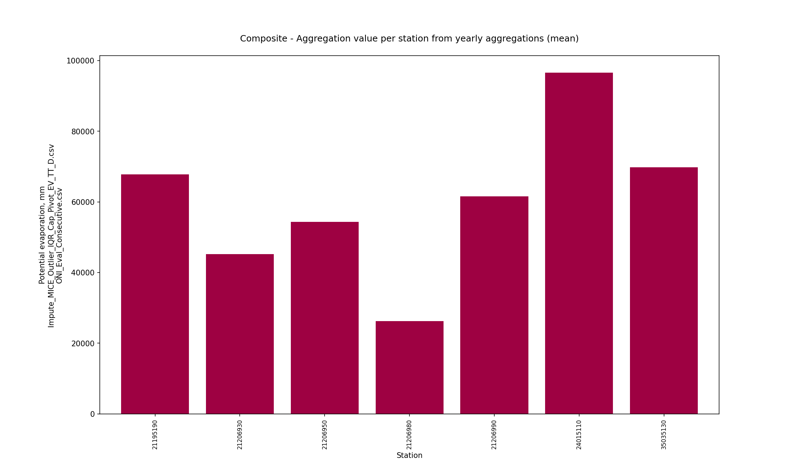
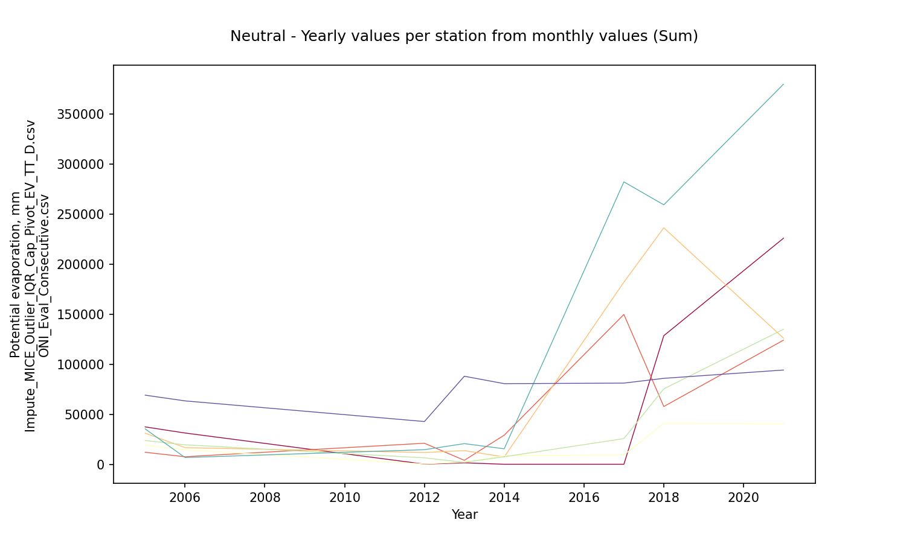
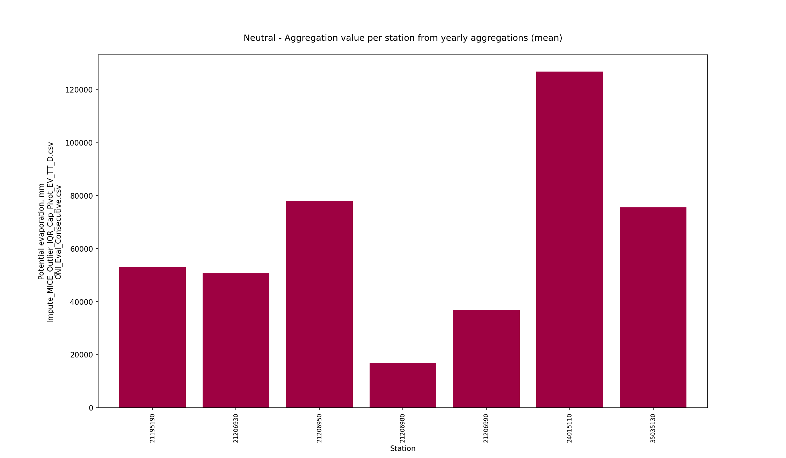
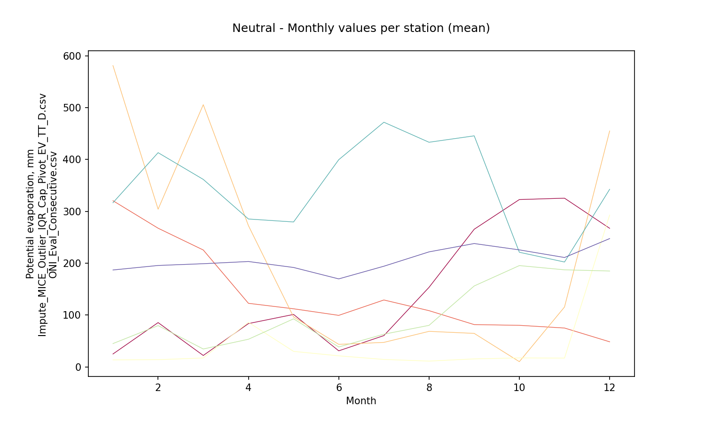
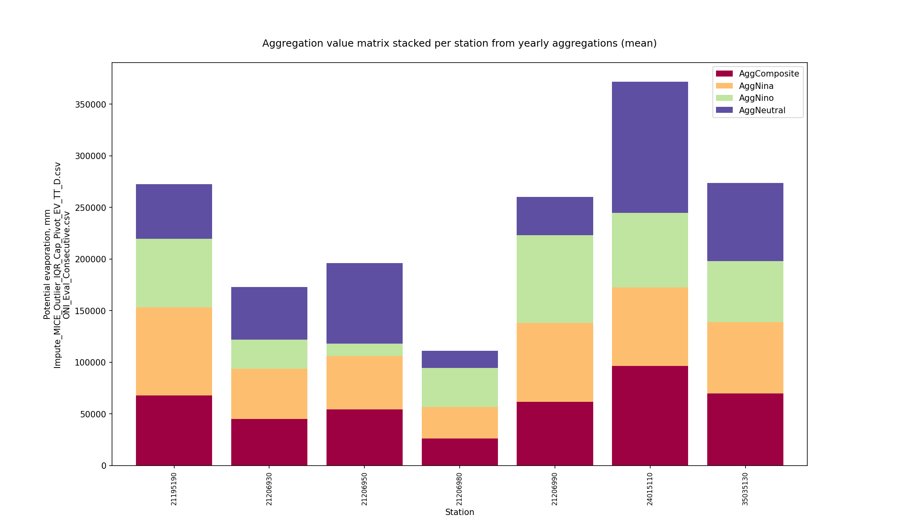
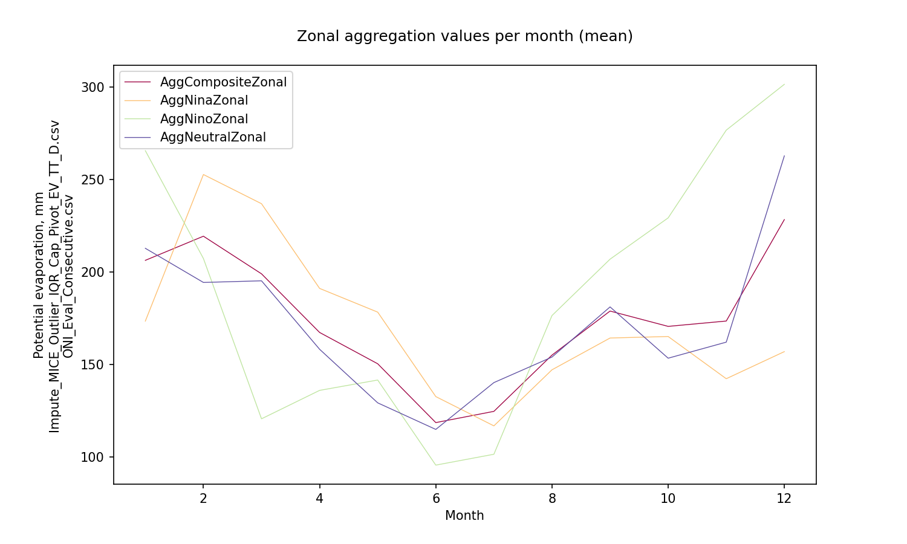

# Statistical aggregations for hydro-climatological composite series and yearly events Niño, Niña and Neutral

For further information about the NOAA - Oceanic Niño Index (ONI) classifier for climatological yearly events Niño, Niña and Neutral, check this activity https://github.com/rcfdtools/R.LTWB/tree/main/Section03/ENSOONI

* Station records file: [Impute_MICE_Outlier_IQR_Cap_Pivot_EV_TT_D.csv](../IDEAM_Impute/Impute_MICE_Outlier_IQR_Cap_Pivot_EV_TT_D.csv)
* ENSO-ONI year file: [ONI_Eval_Consecutive.csv](../ENSOONI/ONI_Eval_Consecutive.csv)
* Stations: 8
* Records: 6574
* Daily serie: False
* Aggregation function: Sum
* Execution date: 2023-09-23 12:22:15.671395
* Python version: 3.11.5 (tags/v3.11.5:cce6ba9, Aug 24 2023, 14:38:34) [MSC v.1936 64 bit (AMD64)]
* Python path: ['C:\\JLGC\\R.LTWB\\.src', 'C:\\Python311\\python311.zip', 'C:\\Python311\\DLLs', 'C:\\Python311\\Lib', 'C:\\Python311']
* matplotlib version: 3.6.0
* pandas version: 2.1.0
* Instructions & script: https://github.com/rcfdtools/R.LTWB/tree/main/Section03/Agg
* License: https://github.com/rcfdtools/R.LTWB/blob/main/LICENSE.md
* Credits: r.cfdtools@gmail.com

## Composite - Yearly values per station from monthly values (Sum)

|   Year |   21195190 |   21206930 |   21206950 |    21206980 |   21206990 |   24015110 |   35035130 |
|-------:|-----------:|-----------:|-----------:|------------:|-----------:|-----------:|-----------:|
|   2004 |    153.069 |        0   |    101.931 |     47.7462 |    157.704 |    188.621 |    192.954 |
|   2005 |  37360.2   |    11975   |  31120     |  19188.3    |  23712.7   |  35370.3   |  69088.8   |
|   2006 |  31237.8   |     7532   |  16613     |  14510      |  19448     |   6714     |  63362     |
|   2007 |  26681.8   |     7914   |   5450     |  24024      |   2346     |  20744     |  75740     |
|   2008 |  47846.6   |    25490   |  15356     |  12274      |  25610     |  24628     |  69206     |
|   2009 |  23451     |    20316   |  11583     |  20697      |  17481     |  20333     |  57870     |
|   2010 |  34468     |    29377   |  17234     |  19153      |  34633     |  25471     |  72235     |
|   2011 |   3263     |    25658   |  16789     |      0      |  16692     |  10593     |      0     |
|   2012 |    134     |    21009   |  11762     |    291      |   6433     |  14562     |  42730     |
|   2013 |   1445     |     3947   |  13643     |   2164      |   1910     |  20630     |  88008     |
|   2014 |      0     |    29068   |   7324     |   8412      |   7522     |  15465     |  80598     |
|   2015 |      0     |    22178   |  20999     |   3180      |  20407     |   1371     |  85024     |
|   2016 |      0     |    17013   |  49922     |   7816      |  26161     |  72643     |  96390.6   |
|   2017 |      0     |   149784   | 182101     |   9410      |  25661     | 282334     |  81148.4   |
|   2018 | 128546     |    57745   | 236408     |  40837.8    |  75373     | 259390     |  85912.1   |
|   2019 | 241817     |    70658   |  15123     | 126051      | 302618     | 267872     |  93652.3   |
|   2020 | 160807     |   139262   | 157937     | 100877      | 105152     | 273948     |  93281.5   |
|   2021 | 225981     |   124054   | 126074     |  40379.8    | 134946     | 380009     |  94205.7   |
|   2022 | 323984     |    95199.2 |  97789.6   |  49409.6    | 323957     | 102351     |  76550.4   |

Composite - Aggregation value per station from yearly aggregations (mean)

|              |   21195190 |   21206930 |   21206950 |   21206980 |   21206990 |   24015110 |   35035130 |
|:-------------|-----------:|-----------:|-----------:|-----------:|-----------:|-----------:|-----------:|
| AggComposite |    67746.1 |    45167.3 |    54385.8 |    26248.5 |    61590.5 |    96558.8 |    69747.1 |

Composite - Aggregation value per station from yearly aggregations (std - standard deviation)

|                 |   21195190 |   21206930 |   21206950 |   21206980 |   21206990 |   24015110 |   35035130 |
|:----------------|-----------:|-----------:|-----------:|-----------:|-----------:|-----------:|-----------:|
| StdAggComposite |      99111 |    47595.9 |    70322.9 |    34197.8 |      95640 |     124988 |    28099.6 |

Composite - Monthly values per station (mean)

|   Month |   21195190 |   21206930 |   21206950 |   21206980 |   21206990 |   24015110 |   35035130 |
|--------:|-----------:|-----------:|-----------:|-----------:|-----------:|-----------:|-----------:|
|       1 |   165.025  |   198.946  |   347.555  |   103.411  |    122.199 |    305.721 |    200.26  |
|       2 |   207.31   |   307.793  |   201.617  |    83.4126 |    129.244 |    401.434 |    203.634 |
|       3 |   176.884  |   188.841  |   298.384  |   114.786  |    135.559 |    271.756 |    205.873 |
|       4 |   191.425  |    75.6857 |   206.002  |    85.1465 |    204.546 |    209.894 |    197.508 |
|       5 |   215.396  |    80.7168 |   132.362  |    83.5683 |    202.674 |    143.99  |    192.989 |
|       6 |   112.928  |    95.1796 |    45.8951 |    15.3981 |    179.011 |    205.995 |    174.614 |
|       7 |    90.1662 |   111.306  |    43.7071 |    16.4283 |    184.185 |    240.912 |    184.823 |
|       8 |   132.414  |   147.998  |    66.7619 |    14.5484 |    202.676 |    316.478 |    203.582 |
|       9 |   215.524  |    93.0352 |    69.0257 |    36.9898 |    215.833 |    400.813 |    219.977 |
|      10 |   293.196  |    94.5502 |    45.1221 |    31.7153 |    213.294 |    314.082 |    201.229 |
|      11 |   300.718  |    95.9481 |    77.785  |    93.8586 |    193.124 |    228.439 |    223.543 |
|      12 |   250.826  |    87.1434 |   348.556  |   229.442  |    151.971 |    318.014 |    211.428 |

Composite - Zonal monthly values (mean)

|   Month |   AggCompositeZonal |
|--------:|--------------------:|
|       1 |             206.16  |
|       2 |             219.206 |
|       3 |             198.869 |
|       4 |             167.173 |
|       5 |             150.242 |
|       6 |             118.431 |
|       7 |             124.504 |
|       8 |             154.923 |
|       9 |             178.742 |
|      10 |             170.456 |
|      11 |             173.345 |
|      12 |             228.197 |

## ENSO-ONI Events - Yearly values per station from monthly values (Sum)

* Records in ENSO-ONI file: 74
* ENSO-ONI eventMark unique values: [-1  1  0]

### Niña events analysis (24 years identified)

|   Id |   YR |   NinaCount |   NinoCount |   NeutralCount | Event   |   EventMark |   EventLabel |
|-----:|-----:|------------:|------------:|---------------:|:--------|------------:|-------------:|
|    0 | 1950 |           7 |           0 |              5 | Niña    |          -1 |            7 |
|    4 | 1954 |           8 |           1 |              3 | Niña    |          -1 |            8 |
|    5 | 1955 |          12 |           0 |              0 | Niña    |          -1 |           12 |
|    6 | 1956 |           8 |           0 |              4 | Niña    |          -1 |            8 |
|   14 | 1964 |           8 |           2 |              2 | Niña    |          -1 |            8 |
|   20 | 1970 |           6 |           1 |              5 | Niña    |          -1 |            6 |
|   21 | 1971 |          12 |           0 |              0 | Niña    |          -1 |           12 |
|   23 | 1973 |           8 |           3 |              1 | Niña    |          -1 |            8 |
|   24 | 1974 |           7 |           0 |              5 | Niña    |          -1 |            7 |
|   25 | 1975 |          12 |           0 |              0 | Niña    |          -1 |           12 |
|   35 | 1985 |           6 |           0 |              6 | Niña    |          -1 |            6 |
|   38 | 1988 |           8 |           2 |              2 | Niña    |          -1 |            8 |
|   39 | 1989 |           5 |           0 |              7 | Niña    |          -1 |            5 |
|   45 | 1995 |           5 |           3 |              4 | Niña    |          -1 |            5 |
|   48 | 1998 |           6 |           4 |              2 | Niña    |          -1 |            6 |
|   49 | 1999 |          12 |           0 |              0 | Niña    |          -1 |           12 |
|   50 | 2000 |          12 |           0 |              0 | Niña    |          -1 |           12 |
|   57 | 2007 |           6 |           1 |              5 | Niña    |          -1 |            6 |
|   58 | 2008 |           6 |           0 |              6 | Niña    |          -1 |            6 |
|   60 | 2010 |           7 |           3 |              2 | Niña    |          -1 |            7 |
|   61 | 2011 |           5 |           0 |              7 | Niña    |          -1 |            5 |
|   66 | 2016 |           5 |           4 |              3 | Niña    |          -1 |            5 |
|   70 | 2020 |           5 |           1 |              6 | Niña    |          -1 |            5 |
|   72 | 2022 |          12 |           0 |              0 | Niña    |          -1 |           12 |

Niña - Table aggregations (Sum)

|   Year |   21195190 |   21206930 |   21206950 |   21206980 |   21206990 |   24015110 |   35035130 |
|-------:|-----------:|-----------:|-----------:|-----------:|-----------:|-----------:|-----------:|
|   2007 |    26681.8 |     7914   |     5450   |    24024   |       2346 |      20744 |    75740   |
|   2008 |    47846.6 |    25490   |    15356   |    12274   |      25610 |      24628 |    69206   |
|   2010 |    34468   |    29377   |    17234   |    19153   |      34633 |      25471 |    72235   |
|   2011 |     3263   |    25658   |    16789   |        0   |      16692 |      10593 |        0   |
|   2016 |        0   |    17013   |    49922   |     7816   |      26161 |      72643 |    96390.6 |
|   2020 |   160807   |   139262   |   157937   |   100877   |     105152 |     273948 |    93281.5 |
|   2022 |   323984   |    95199.2 |    97789.6 |    49409.6 |     323957 |     102351 |    76550.4 |

Niña - Aggregation value per station from yearly aggregations (mean)

|         |   21195190 |   21206930 |   21206950 |   21206980 |   21206990 |   24015110 |   35035130 |
|:--------|-----------:|-----------:|-----------:|-----------:|-----------:|-----------:|-----------:|
| AggNina |    85292.9 |      48559 |    51496.8 |    30507.6 |    76364.4 |    75768.3 |    69057.7 |

Niña - Aggregation value per station from yearly aggregations (std - standard deviation)

|            |   21195190 |   21206930 |   21206950 |   21206980 |   21206990 |   24015110 |   35035130 |
|:-----------|-----------:|-----------:|-----------:|-----------:|-----------:|-----------:|-----------:|
| StdAggNina |     118392 |    49115.6 |    56686.3 |    34780.7 |     114024 |    93463.2 |    32181.2 |

Niña - Monthly values per station (mean)

|   Month |   21195190 |   21206930 |   21206950 |   21206980 |   21206990 |   24015110 |   35035130 |
|--------:|-----------:|-----------:|-----------:|-----------:|-----------:|-----------:|-----------:|
|       1 |    201.992 |    71.9263 |   226.304  |   128.394  |   152.682  |   238.018  |    193.779 |
|       2 |    328.157 |   348.712  |   170.754  |   184.308  |   181.015  |   356.211  |    198.762 |
|       3 |    350.941 |   187.68   |   173.493  |   273.133  |   229.267  |   229.161  |    213.768 |
|       4 |    258.298 |    31.7952 |   179.662  |   120.532  |   368.219  |   191.648  |    186.759 |
|       5 |    295.967 |    77.0046 |   219.295  |   143.327  |   276.682  |    44.4147 |    190.417 |
|       6 |    254.895 |   104.433  |    50.9742 |    12.6619 |   255.219  |    72.1571 |    177.158 |
|       7 |    154.246 |   103.793  |    39.1916 |    24.1152 |   248.986  |    70.9493 |    175.383 |
|       8 |    165.057 |   197.308  |    86.8717 |    22.9493 |   241.926  |   134.194  |    180.488 |
|       9 |    206.682 |   110.219  |    79.2088 |    10.4714 |   220.042  |   325.224  |    197.311 |
|      10 |    204.115 |   128.171  |    80.6459 |    25.3134 |   185.76   |   365.977  |    164.88  |
|      11 |    221.752 |   129.829  |    41.1899 |    31.3524 |   114.824  |   222.295  |    233.871 |
|      12 |    167.651 |   117.153  |   340.655  |    28.625  |    34.8333 |   250.764  |    157.952 |

Niña - Zonal monthly values (mean)

|   Month |   AggNinaZonal |
|--------:|---------------:|
|       1 |        173.3   |
|       2 |        252.56  |
|       3 |        236.778 |
|       4 |        190.987 |
|       5 |        178.158 |
|       6 |        132.5   |
|       7 |        116.666 |
|       8 |        146.971 |
|       9 |        164.166 |
|      10 |        164.98  |
|      11 |        142.159 |
|      12 |        156.805 |

### Niño events analysis (19 years identified)

|   Id |   YR |   NinaCount |   NinoCount |   NeutralCount | Event   |   EventMark |   EventLabel |
|-----:|-----:|------------:|------------:|---------------:|:--------|------------:|-------------:|
|    1 | 1951 |           2 |           7 |              3 | Niño    |           1 |            7 |
|    3 | 1953 |           0 |          11 |              1 | Niño    |           1 |           11 |
|    7 | 1957 |           0 |           9 |              3 | Niño    |           1 |            9 |
|    8 | 1958 |           0 |           7 |              5 | Niño    |           1 |            7 |
|   13 | 1963 |           0 |           7 |              5 | Niño    |           1 |            7 |
|   15 | 1965 |           1 |           7 |              4 | Niño    |           1 |            7 |
|   19 | 1969 |           0 |           5 |              7 | Niño    |           1 |            5 |
|   22 | 1972 |           1 |           8 |              3 | Niño    |           1 |            8 |
|   32 | 1982 |           0 |           8 |              4 | Niño    |           1 |            8 |
|   33 | 1983 |           3 |           6 |              3 | Niño    |           1 |            6 |
|   37 | 1987 |           0 |          12 |              0 | Niño    |           1 |           12 |
|   41 | 1991 |           0 |           7 |              5 | Niño    |           1 |            7 |
|   42 | 1992 |           0 |           6 |              6 | Niño    |           1 |            6 |
|   47 | 1997 |           1 |           8 |              3 | Niño    |           1 |            8 |
|   52 | 2002 |           0 |           7 |              5 | Niño    |           1 |            7 |
|   54 | 2004 |           0 |           5 |              7 | Niño    |           1 |            5 |
|   59 | 2009 |           3 |           5 |              4 | Niño    |           1 |            5 |
|   65 | 2015 |           0 |          10 |              2 | Niño    |           1 |           10 |
|   69 | 2019 |           0 |           5 |              7 | Niño    |           1 |            5 |

Niño - Table aggregations (Sum)

|   Year |   21195190 |   21206930 |   21206950 |    21206980 |   21206990 |   24015110 |   35035130 |
|-------:|-----------:|-----------:|-----------:|------------:|-----------:|-----------:|-----------:|
|   2004 |    153.069 |          0 |    101.931 |     47.7462 |    157.704 |    188.621 |    192.954 |
|   2009 |  23451     |      20316 |  11583     |  20697      |  17481     |  20333     |  57870     |
|   2015 |      0     |      22178 |  20999     |   3180      |  20407     |   1371     |  85024     |
|   2019 | 241817     |      70658 |  15123     | 126051      | 302618     | 267872     |  93652.3   |

Niño - Aggregation value per station from yearly aggregations (mean)

|         |   21195190 |   21206930 |   21206950 |   21206980 |   21206990 |   24015110 |   35035130 |
|:--------|-----------:|-----------:|-----------:|-----------:|-----------:|-----------:|-----------:|
| AggNino |    66355.3 |      28288 |    11951.7 |    37493.9 |    85165.9 |    72441.2 |    59184.8 |

Niño - Aggregation value per station from yearly aggregations (std - standard deviation)

|            |   21195190 |   21206930 |   21206950 |   21206980 |   21206990 |   24015110 |   35035130 |
|:-----------|-----------:|-----------:|-----------:|-----------:|-----------:|-----------:|-----------:|
| StdAggNino |     117492 |    29979.5 |    8802.72 |    59733.1 |     145243 |     130614 |    42179.9 |

Niño - Monthly values per station (mean)

|   Month |   21195190 |   21206930 |   21206950 |   21206980 |   21206990 |   24015110 |   35035130 |
|--------:|-----------:|-----------:|-----------:|-----------:|-----------:|-----------:|-----------:|
|       1 |   452.247  |  171.237   |    7.86022 | 284.574    |    256.785 |  434.645   |    250.946 |
|       2 |   247.274  |  318.917   |    0.22619 |  30.369    |    139.298 |  477.321   |    236.619 |
|       3 |   183.484  |   93.8602  |   37.129   |   5.34409  |    186.14  |  131.688   |    205.714 |
|       4 |   322.978  |   52.8111  |   90.2444  |   0.244444 |    225.789 |   51.6333  |    207.247 |
|       5 |   331.817  |    5.63441 |   25.3871  |  87.0215   |    323.054 |   14.957   |    202.293 |
|       6 |     0      |   62.2667  |   40.3     |   5.76667  |    375.867 |    2.22222 |    181.661 |
|       7 |    19.9355 |   81.4301  |   44.5806  |   3.73118  |    355.849 |   21.7849  |    181.884 |
|       8 |     0      |  138.29    |   14.9032  |   3.76344  |    437.774 |  430.624   |    208.786 |
|       9 |   103.011  |   83.3556  |   56.8222  | 156.128    |    365.278 |  457.9     |    225.064 |
|      10 |   422.323  |   54.2581  |   55.4516  |  84.7327   |    325.247 |  440.957   |    220.853 |
|      11 |   419.244  |   72.6778  |   62.4889  | 444.496    |    391.511 |  312.533   |    232.91  |
|      12 |   398.586  |  120.266   |   85.8184  | 523.351    |    334.167 |  407.879   |    239.252 |

Niño - Zonal monthly values (mean)

|   Month |   AggNinoZonal |
|--------:|---------------:|
|       1 |       265.471  |
|       2 |       207.146  |
|       3 |       120.48   |
|       4 |       135.85   |
|       5 |       141.452  |
|       6 |        95.4405 |
|       7 |       101.314  |
|       8 |       176.306  |
|       9 |       206.794  |
|      10 |       229.117  |
|      11 |       276.552  |
|      12 |       301.331  |

### Neutral events analysis (31 years identified)

|   Id |   YR |   NinaCount |   NinoCount |   NeutralCount | Event   |   EventMark |   EventLabel |
|-----:|-----:|------------:|------------:|---------------:|:--------|------------:|-------------:|
|    2 | 1952 |           0 |           1 |             11 | Neutral |           0 |           11 |
|    9 | 1959 |           0 |           3 |              9 | Neutral |           0 |            9 |
|   10 | 1960 |           0 |           0 |             12 | Neutral |           0 |           12 |
|   11 | 1961 |           0 |           0 |             12 | Neutral |           0 |           12 |
|   12 | 1962 |           0 |           0 |             12 | Neutral |           0 |           12 |
|   16 | 1966 |           0 |           4 |              8 | Neutral |           0 |            8 |
|   17 | 1967 |           1 |           0 |             11 | Neutral |           0 |           11 |
|   18 | 1968 |           3 |           3 |              6 | Neutral |           0 |            6 |
|   26 | 1976 |           3 |           4 |              5 | Neutral |           0 |            5 |
|   27 | 1977 |           0 |           4 |              8 | Neutral |           0 |            8 |
|   28 | 1978 |           0 |           1 |             11 | Neutral |           0 |           11 |
|   29 | 1979 |           0 |           2 |             10 | Neutral |           0 |           10 |
|   30 | 1980 |           0 |           1 |             11 | Neutral |           0 |           11 |
|   31 | 1981 |           1 |           0 |             11 | Neutral |           0 |           11 |
|   34 | 1984 |           3 |           0 |              9 | Neutral |           0 |            9 |
|   36 | 1986 |           0 |           4 |              8 | Neutral |           0 |            8 |
|   40 | 1990 |           0 |           0 |             12 | Neutral |           0 |           12 |
|   43 | 1993 |           0 |           4 |              8 | Neutral |           0 |            8 |
|   44 | 1994 |           0 |           4 |              8 | Neutral |           0 |            8 |
|   46 | 1996 |           3 |           0 |              9 | Neutral |           0 |            9 |
|   51 | 2001 |           2 |           0 |             10 | Neutral |           0 |           10 |
|   53 | 2003 |           0 |           2 |             10 | Neutral |           0 |           10 |
|   55 | 2005 |           2 |           2 |              8 | Neutral |           0 |            8 |
|   56 | 2006 |           3 |           4 |              5 | Neutral |           0 |            5 |
|   62 | 2012 |           3 |           0 |              9 | Neutral |           0 |            9 |
|   63 | 2013 |           0 |           0 |             12 | Neutral |           0 |           12 |
|   64 | 2014 |           0 |           2 |             10 | Neutral |           0 |           10 |
|   67 | 2017 |           3 |           0 |              9 | Neutral |           0 |            9 |
|   68 | 2018 |           4 |           3 |              5 | Neutral |           0 |            5 |
|   71 | 2021 |           4 |           0 |              8 | Neutral |           0 |            8 |
|   73 | 2023 |           1 |           1 |             10 | Neutral |           0 |           10 |

Neutral - Table aggregations (Sum)

|   Year |   21195190 |   21206930 |   21206950 |   21206980 |   21206990 |   24015110 |   35035130 |
|-------:|-----------:|-----------:|-----------:|-----------:|-----------:|-----------:|-----------:|
|   2005 |    37360.2 |      11975 |      31120 |    19188.3 |    23712.7 |    35370.3 |    69088.8 |
|   2006 |    31237.8 |       7532 |      16613 |    14510   |    19448   |     6714   |    63362   |
|   2012 |      134   |      21009 |      11762 |      291   |     6433   |    14562   |    42730   |
|   2013 |     1445   |       3947 |      13643 |     2164   |     1910   |    20630   |    88008   |
|   2014 |        0   |      29068 |       7324 |     8412   |     7522   |    15465   |    80598   |
|   2017 |        0   |     149784 |     182101 |     9410   |    25661   |   282334   |    81148.4 |
|   2018 |   128546   |      57745 |     236408 |    40837.8 |    75373   |   259390   |    85912.1 |
|   2021 |   225981   |     124054 |     126074 |    40379.8 |   134946   |   380009   |    94205.7 |

Neutral - Aggregation value per station from yearly aggregations (mean)

|            |   21195190 |   21206930 |   21206950 |   21206980 |   21206990 |   24015110 |   35035130 |
|:-----------|-----------:|-----------:|-----------:|-----------:|-----------:|-----------:|-----------:|
| AggNeutral |      53088 |    50639.3 |    78130.6 |    16899.1 |    36875.7 |     126809 |    75631.6 |

Neutral - Aggregation value per station from yearly aggregations (std - standard deviation)

|               |   21195190 |   21206930 |   21206950 |   21206980 |   21206990 |   24015110 |   35035130 |
|:--------------|-----------:|-----------:|-----------:|-----------:|-----------:|-----------:|-----------:|
| StdAggNeutral |    82304.7 |    56247.6 |      90815 |    15840.4 |    45846.9 |     153498 |    16625.4 |

Neutral - Monthly values per station (mean)

|   Month |   21195190 |   21206930 |   21206950 |   21206980 |   21206990 |   24015110 |   35035130 |
|--------:|-----------:|-----------:|-----------:|-----------:|-----------:|-----------:|-----------:|
|       1 |    24.9712 |   320.48   |   581.035  |    13.615  |    45.0566 |    316.614 |    186.923 |
|       2 |    85.5068 |   267.45   |   304.099  |    13.9792 |    79.7009 |    413.1   |    195.629 |
|       3 |    22.1099 |   225.475  |   505.633  |    17.2731 |    34.5968 |    361.551 |    199.025 |
|       4 |    83.579  |   122.668  |   272.459  |    86.0226 |    53.3667 |    285.208 |    203.261 |
|       5 |   101.238  |   112.121  |    96.4121 |    29.9842 |    92.7742 |    279.506 |    191.752 |
|       6 |    31.0543 |    99.425  |    43.5491 |    21.4042 |    38.5083 |    399.517 |    169.744 |
|       7 |    60.4331 |   129.085  |    47.3306 |    14.4637 |    63.1089 |    471.802 |    194.186 |
|       8 |   153.508  |   108.492  |    68.6129 |    11.2419 |    80.1694 |    433.173 |    221.838 |
|       9 |   265.453  |    81.6292 |    64.6917 |    15.5167 |   156.108  |    445.546 |    237.901 |
|      10 |   322.72   |    80.2419 |    10.1653 |    17.4355 |   195.403  |    221.097 |    225.675 |
|      11 |   325.367  |    75.0292 |   115.542  |    17.0625 |   187.242  |    202.279 |    210.994 |
|      12 |   267.263  |    48.4516 |   455.024  |   292.947  |   184.935  |    342.524 |    247.457 |

Neutral - Zonal monthly values (mean)

|   Month |   AggNeutralZonal |
|--------:|------------------:|
|       1 |           212.671 |
|       2 |           194.209 |
|       3 |           195.095 |
|       4 |           158.081 |
|       5 |           129.113 |
|       6 |           114.743 |
|       7 |           140.058 |
|       8 |           153.862 |
|       9 |           180.978 |
|      10 |           153.248 |
|      11 |           161.931 |
|      12 |           262.658 |

## Yearly aggregation matrix values per station from yearly values (mean) and zonal monthly values (mean)

Yearly matrix values per station (required for spatial interpolations) File: [Agg_Impute_MICE_Outlier_IQR_Cap_Pivot_EV_TT_D.csv](Agg_Impute_MICE_Outlier_IQR_Cap_Pivot_EV_TT_D.csv)

|   Station |   AggComposite |   AggNina |   AggNino |   AggNeutral |
|----------:|---------------:|----------:|----------:|-------------:|
|  21195190 |        67746.1 |   85292.9 |   66355.3 |      53088   |
|  21206930 |        45167.3 |   48559   |   28288   |      50639.3 |
|  21206950 |        54385.8 |   51496.8 |   11951.7 |      78130.6 |
|  21206980 |        26248.5 |   30507.6 |   37493.9 |      16899.1 |
|  21206990 |        61590.5 |   76364.4 |   85165.9 |      36875.7 |
|  24015110 |        96558.8 |   75768.3 |   72441.2 |     126809   |
|  35035130 |        69747.1 |   69057.7 |   59184.8 |      75631.6 |

Yearly matrix standard deviations per station File: [Agg_Std_Impute_MICE_Outlier_IQR_Cap_Pivot_EV_TT_D.csv](Agg_Std_Impute_MICE_Outlier_IQR_Cap_Pivot_EV_TT_D.csv)

|   Station |   StdAggComposite |   StdAggNina |   StdAggNino |   StdAggNeutral |
|----------:|------------------:|-------------:|-------------:|----------------:|
|  21195190 |           99111   |     118392   |    117492    |         82304.7 |
|  21206930 |           47595.9 |      49115.6 |     29979.5  |         56247.6 |
|  21206950 |           70322.9 |      56686.3 |      8802.72 |         90815   |
|  21206980 |           34197.8 |      34780.7 |     59733.1  |         15840.4 |
|  21206990 |           95640   |     114024   |    145243    |         45846.9 |
|  24015110 |          124988   |      93463.2 |    130614    |        153498   |
|  35035130 |           28099.6 |      32181.2 |     42179.9  |         16625.4 |

Monthly zonal values

|   Month |   AggCompositeZonal |   AggNinaZonal |   AggNinoZonal |   AggNeutralZonal |
|--------:|--------------------:|---------------:|---------------:|------------------:|
|       1 |             206.16  |        173.3   |       265.471  |           212.671 |
|       2 |             219.206 |        252.56  |       207.146  |           194.209 |
|       3 |             198.869 |        236.778 |       120.48   |           195.095 |
|       4 |             167.173 |        190.987 |       135.85   |           158.081 |
|       5 |             150.242 |        178.158 |       141.452  |           129.113 |
|       6 |             118.431 |        132.5   |        95.4405 |           114.743 |
|       7 |             124.504 |        116.666 |       101.314  |           140.058 |
|       8 |             154.923 |        146.971 |       176.306  |           153.862 |
|       9 |             178.742 |        164.166 |       206.794  |           180.978 |
|      10 |             170.456 |        164.98  |       229.117  |           153.248 |
|      11 |             173.345 |        142.159 |       276.552  |           161.931 |
|      12 |             228.197 |        156.805 |       301.331  |           262.658 |

