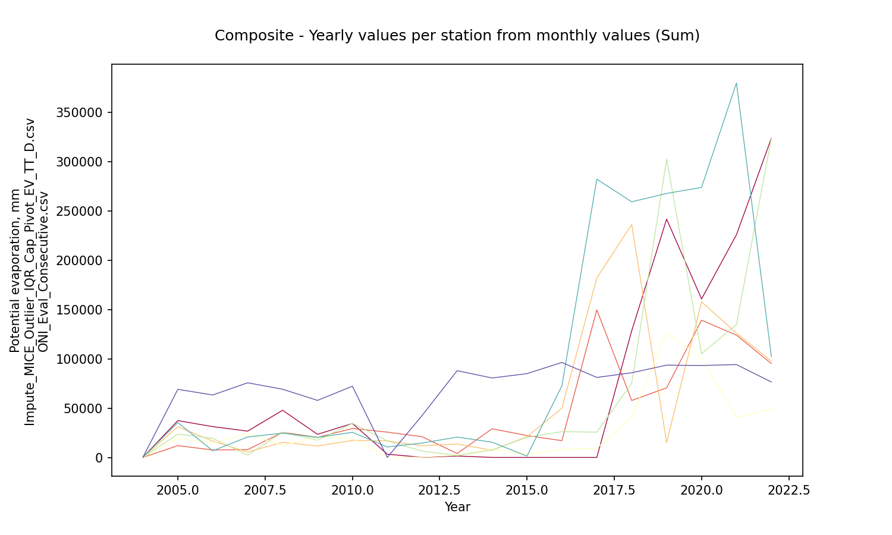
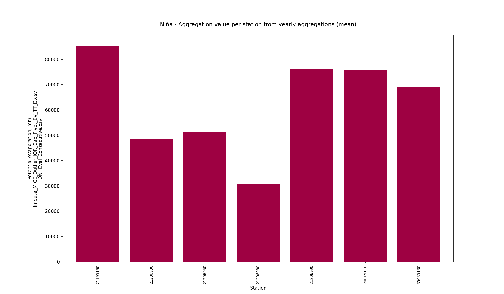

# Statistical aggregations for hydro-climatological composite series and yearly events Niño, Niña and Neutral

For further information about the NOAA - Oceanic Niño Index (ONI) classifier for climatological yearly events Niño, Niña and Neutral, check this activity https://github.com/rcfdtools/R.LTWB/tree/main/Section03/ENSOONI

* Station records file: [Impute_MICE_Outlier_IQR_Cap_Pivot_EV_TT_D.csv](../IDEAM_Impute/Impute_MICE_Outlier_IQR_Cap_Pivot_EV_TT_D.csv)
* ENSO-ONI year file: [ONI_Eval_Consecutive.csv](../ENSOONI/ONI_Eval_Consecutive.csv)
* Stations: 9
* Records: 6574
* Daily serie: False
* Aggregation function: Sum
* Execution date: 2023-09-22 09:57:03.193195
* Python version: 3.11.5 (tags/v3.11.5:cce6ba9, Aug 24 2023, 14:38:34) [MSC v.1936 64 bit (AMD64)]
* Python path: ['C:\\JLGC\\R.LTWB\\.src', 'C:\\Python311\\python311.zip', 'C:\\Python311\\DLLs', 'C:\\Python311\\Lib', 'C:\\Python311']
* matplotlib version: 3.6.0
* pandas version: 2.1.0
* Instructions & script: https://github.com/rcfdtools/R.LTWB/tree/main/Section03/Agg
* License: https://github.com/rcfdtools/R.LTWB/blob/main/LICENSE.md
* Credits: r.cfdtools@gmail.com

## Composite - Yearly values per station from monthly values (Sum)

|   Year |   21195190 |   21206930 |   21206950 |    21206980 |   21206990 |   21255160 |   24015110 |   35035130 |
|-------:|-----------:|-----------:|-----------:|------------:|-----------:|-----------:|-----------:|-----------:|
|   2004 |    150.104 |        0   |    101.765 |     48.2596 |    152.111 |    26.4822 |    187.371 |    192.647 |
|   2005 |  37227.2   |    11975   |  30827.2   |  19164.8    |  23561.1   | 16966.8    |  34612.1   |  69859.2   |
|   2006 |  31240.2   |     7532   |  16613     |  14510      |  19448     | 16542      |   6714     |  63362     |
|   2007 |  26686.8   |     7914   |   5450     |  24024      |   2346     |  7455      |  20744     |  75740     |
|   2008 |  47847.8   |    25490   |  15356     |  12274      |  25610     |  3867      |  24628     |  69206     |
|   2009 |  23451     |    20316   |  11583     |  20697      |  17481     |  9008      |  20333     |  57870     |
|   2010 |  34468     |    29377   |  17234     |  19153      |  34633     |  8050      |  25471     |  72235     |
|   2011 |   3263     |    25658   |  16789     |      0      |  16692     |     0      |  10593     |      0     |
|   2012 |    134     |    21009   |  11762     |    291      |   6433     |  5798      |  14562     |  42730     |
|   2013 |   1445     |     3947   |  13643     |   2164      |   1910     | 12480      |  20630     |  88008     |
|   2014 |      0     |    29068   |   7324     |   8412      |   7522     |  6390      |  15465     |  80598     |
|   2015 |      0     |    22178   |  20999     |   3180      |  20407     | 58916      |   1371     |  85024     |
|   2016 |      0     |    17013   |  49922     |   7816      |  26161     |     0      |  72643     |  96369.1   |
|   2017 |      0     |   149784   | 182101     |   9410      |  25661     |     0      | 282334     |  81454.3   |
|   2018 | 128546     |    57745   | 236408     |  40837.8    |  75373     |     0      | 259390     |  86504.5   |
|   2019 | 241817     |    70658   |  15123     | 126051      | 302618     |    19.7    | 267872     |  94229.1   |
|   2020 | 160807     |   139262   | 157937     | 100877      | 105152     |    39.4    | 273948     |  95224.4   |
|   2021 | 225981     |   124054   | 126074     |  40379.8    | 134946     |  1846.95   | 380009     |  96241.1   |
|   2022 | 323984     |    95199.2 |  98152.8   |  49409.6    | 323957     |  9119.39   | 102351     |  76799.7   |

Composite - Aggregation value per station from yearly aggregations (mean)

|              |   21195190 |   21206930 |   21206950 |   21206980 |   21206990 |   21255160 |   24015110 |   35035130 |
|:-------------|-----------:|-----------:|-----------:|-----------:|-----------:|-----------:|-----------:|-----------:|
| AggComposite |    67739.4 |    45167.3 |    54389.5 |    26247.3 |    61582.3 |    8238.14 |    96518.8 |    70086.7 |

Composite - Aggregation value per station from yearly aggregations (std - standard deviation)

|                 |   21195190 |   21206930 |   21206950 |   21206980 |   21206990 |   21255160 |   24015110 |   35035130 |
|:----------------|-----------:|-----------:|-----------:|-----------:|-----------:|-----------:|-----------:|-----------:|
| StdAggComposite |    99113.2 |    47595.9 |    70340.9 |    34198.1 |    95643.6 |    13491.5 |     125009 |    28348.8 |

Composite - Monthly values per station (mean)

|   Month |   21195190 |   21206930 |   21206950 |   21206980 |   21206990 |   21255160 |   24015110 |   35035130 |
|--------:|-----------:|-----------:|-----------:|-----------:|-----------:|-----------:|-----------:|-----------:|
|       1 |   164.889  |   198.946  |   347.547  |   103.435  |    121.937 |    18.9416 |    305.662 |    202.464 |
|       2 |   207.306  |   307.793  |   201.615  |    83.4171 |    129.233 |    10.563  |    401.424 |    206.83  |
|       3 |   176.889  |   188.841  |   298.359  |   114.791  |    135.559 |    13.7606 |    271.76  |    207.96  |
|       4 |   191.324  |    75.6857 |   205.47   |    85.0692 |    204.546 |    26.7584 |    208.551 |    197.675 |
|       5 |   215.442  |    80.7168 |   132.599  |    83.5683 |    202.674 |    12.0131 |    144.758 |    192.563 |
|       6 |   112.884  |    95.1796 |    45.7445 |    15.3981 |    179.011 |    23.819  |    205.207 |    173.743 |
|       7 |    90.1681 |   111.306  |    43.9259 |    16.4283 |    184.185 |    17.753  |    240.912 |    184.073 |
|       8 |   132.414  |   147.998  |    67.011  |    14.5484 |    202.676 |    31.0838 |    316.478 |    203.618 |
|       9 |   215.525  |    93.0352 |    69.1607 |    36.9898 |    215.833 |    31.9766 |    400.813 |    220.986 |
|      10 |   293.198  |    94.5502 |    45.2219 |    31.7153 |    213.294 |    37.8592 |    314.082 |    201.704 |
|      11 |   300.721  |    95.9481 |    77.7872 |    93.8586 |    193.124 |    32.7711 |    228.439 |    224.668 |
|      12 |   250.821  |    87.1434 |   348.44   |   229.443  |    151.961 |    27.8775 |    318.011 |    215.07  |

Composite - Zonal monthly values (mean)

|   Month |   AggCompositeZonal |
|--------:|--------------------:|
|       1 |             182.978 |
|       2 |             193.523 |
|       3 |             175.99  |
|       4 |             149.385 |
|       5 |             133.042 |
|       6 |             106.373 |
|       7 |             111.094 |
|       8 |             139.478 |
|       9 |             160.54  |
|      10 |             153.953 |
|      11 |             155.915 |
|      12 |             203.596 |

## ENSO-ONI Events - Yearly values per station from monthly values (Sum)

* Records in ENSO-ONI file: 74
* ENSO-ONI eventMark unique values: [-1  1  0]

### Niña events analysis (24 years identified)

|   Id |   YR |   NinaCount |   NinoCount |   NeutralCount | Event   |   EventMark |   EventLabel |
|-----:|-----:|------------:|------------:|---------------:|:--------|------------:|-------------:|
|    0 | 1950 |           7 |           0 |              5 | Niña    |          -1 |            7 |
|    4 | 1954 |           8 |           1 |              3 | Niña    |          -1 |            8 |
|    5 | 1955 |          12 |           0 |              0 | Niña    |          -1 |           12 |
|    6 | 1956 |           8 |           0 |              4 | Niña    |          -1 |            8 |
|   14 | 1964 |           8 |           2 |              2 | Niña    |          -1 |            8 |
|   20 | 1970 |           6 |           1 |              5 | Niña    |          -1 |            6 |
|   21 | 1971 |          12 |           0 |              0 | Niña    |          -1 |           12 |
|   23 | 1973 |           8 |           3 |              1 | Niña    |          -1 |            8 |
|   24 | 1974 |           7 |           0 |              5 | Niña    |          -1 |            7 |
|   25 | 1975 |          12 |           0 |              0 | Niña    |          -1 |           12 |
|   35 | 1985 |           6 |           0 |              6 | Niña    |          -1 |            6 |
|   38 | 1988 |           8 |           2 |              2 | Niña    |          -1 |            8 |
|   39 | 1989 |           5 |           0 |              7 | Niña    |          -1 |            5 |
|   45 | 1995 |           5 |           3 |              4 | Niña    |          -1 |            5 |
|   48 | 1998 |           6 |           4 |              2 | Niña    |          -1 |            6 |
|   49 | 1999 |          12 |           0 |              0 | Niña    |          -1 |           12 |
|   50 | 2000 |          12 |           0 |              0 | Niña    |          -1 |           12 |
|   57 | 2007 |           6 |           1 |              5 | Niña    |          -1 |            6 |
|   58 | 2008 |           6 |           0 |              6 | Niña    |          -1 |            6 |
|   60 | 2010 |           7 |           3 |              2 | Niña    |          -1 |            7 |
|   61 | 2011 |           5 |           0 |              7 | Niña    |          -1 |            5 |
|   66 | 2016 |           5 |           4 |              3 | Niña    |          -1 |            5 |
|   70 | 2020 |           5 |           1 |              6 | Niña    |          -1 |            5 |
|   72 | 2022 |          12 |           0 |              0 | Niña    |          -1 |           12 |

Niña - Table aggregations (Sum)

|   Year |   21195190 |   21206930 |   21206950 |   21206980 |   21206990 |   21255160 |   24015110 |   35035130 |
|-------:|-----------:|-----------:|-----------:|-----------:|-----------:|-----------:|-----------:|-----------:|
|   2007 |    26686.8 |     7914   |     5450   |    24024   |       2346 |    7455    |      20744 |    75740   |
|   2008 |    47847.8 |    25490   |    15356   |    12274   |      25610 |    3867    |      24628 |    69206   |
|   2010 |    34468   |    29377   |    17234   |    19153   |      34633 |    8050    |      25471 |    72235   |
|   2011 |     3263   |    25658   |    16789   |        0   |      16692 |       0    |      10593 |        0   |
|   2016 |        0   |    17013   |    49922   |     7816   |      26161 |       0    |      72643 |    96369.1 |
|   2020 |   160807   |   139262   |   157937   |   100877   |     105152 |      39.4  |     273948 |    95224.4 |
|   2022 |   323984   |    95199.2 |    98152.8 |    49409.6 |     323957 |    9119.39 |     102351 |    76799.7 |

Niña - Aggregation value per station from yearly aggregations (mean)

|         |   21195190 |   21206930 |   21206950 |   21206980 |   21206990 |   21255160 |   24015110 |   35035130 |
|:--------|-----------:|-----------:|-----------:|-----------:|-----------:|-----------:|-----------:|-----------:|
| AggNina |    85293.8 |      48559 |    51548.7 |    30507.6 |    76364.4 |    4075.83 |    75768.3 |    69367.7 |

Niña - Aggregation value per station from yearly aggregations (std - standard deviation)

|            |   21195190 |   21206930 |   21206950 |   21206980 |   21206990 |   21255160 |   24015110 |   35035130 |
|:-----------|-----------:|-----------:|-----------:|-----------:|-----------:|-----------:|-----------:|-----------:|
| StdAggNina |     118392 |    49115.6 |    56735.9 |    34780.7 |     114024 |    4127.38 |    93463.2 |    32438.7 |

Niña - Monthly values per station (mean)

|   Month |   21195190 |   21206930 |   21206950 |   21206980 |   21206990 |   21255160 |   24015110 |   35035130 |
|--------:|-----------:|-----------:|-----------:|-----------:|-----------:|-----------:|-----------:|-----------:|
|       1 |    201.996 |    71.9263 |   226.304  |   128.394  |   152.682  |   13.8045  |   238.018  |    195.915 |
|       2 |    328.158 |   348.712  |   170.754  |   184.308  |   181.015  |    6.77797 |   356.211  |    203.946 |
|       3 |    350.944 |   187.68   |   173.493  |   273.133  |   229.267  |   18.034   |   229.161  |    218.973 |
|       4 |    258.3   |    31.7952 |   179.662  |   120.532  |   368.219  |    3.11299 |   191.648  |    186.126 |
|       5 |    295.97  |    77.0046 |   219.295  |   143.327  |   276.682  |   12.7176  |    44.4147 |    190.802 |
|       6 |    254.899 |   104.433  |    51.1519 |    12.6619 |   255.219  |   22.0579  |    72.1571 |    175.8   |
|       7 |    154.248 |   103.793  |    39.7541 |    24.1152 |   248.986  |    9.09878 |    70.9493 |    173.503 |
|       8 |    165.059 |   197.308  |    87.512  |    22.9493 |   241.926  |    3.18389 |   134.194  |    179.638 |
|       9 |    206.684 |   110.219  |    79.5561 |    10.4714 |   220.042  |   13.9763  |   325.224  |    197.656 |
|      10 |    204.118 |   128.171  |    80.9024 |    25.3134 |   185.76   |    9.16546 |   365.977  |    165.166 |
|      11 |    221.754 |   129.829  |    41.1956 |    31.3524 |   114.824  |   12.7024  |   222.295  |    234.558 |
|      12 |    167.653 |   117.153  |   340.354  |    28.625  |    34.8333 |    9.12335 |   250.764  |    158.853 |

Niña - Zonal monthly values (mean)

|   Month |   AggNinaZonal |
|--------:|---------------:|
|       1 |        153.63  |
|       2 |        222.485 |
|       3 |        210.086 |
|       4 |        167.424 |
|       5 |        157.527 |
|       6 |        118.547 |
|       7 |        103.056 |
|       8 |        128.971 |
|       9 |        145.479 |
|      10 |        145.572 |
|      11 |        126.064 |
|      12 |        138.42  |

### Niño events analysis (19 years identified)

|   Id |   YR |   NinaCount |   NinoCount |   NeutralCount | Event   |   EventMark |   EventLabel |
|-----:|-----:|------------:|------------:|---------------:|:--------|------------:|-------------:|
|    1 | 1951 |           2 |           7 |              3 | Niño    |           1 |            7 |
|    3 | 1953 |           0 |          11 |              1 | Niño    |           1 |           11 |
|    7 | 1957 |           0 |           9 |              3 | Niño    |           1 |            9 |
|    8 | 1958 |           0 |           7 |              5 | Niño    |           1 |            7 |
|   13 | 1963 |           0 |           7 |              5 | Niño    |           1 |            7 |
|   15 | 1965 |           1 |           7 |              4 | Niño    |           1 |            7 |
|   19 | 1969 |           0 |           5 |              7 | Niño    |           1 |            5 |
|   22 | 1972 |           1 |           8 |              3 | Niño    |           1 |            8 |
|   32 | 1982 |           0 |           8 |              4 | Niño    |           1 |            8 |
|   33 | 1983 |           3 |           6 |              3 | Niño    |           1 |            6 |
|   37 | 1987 |           0 |          12 |              0 | Niño    |           1 |           12 |
|   41 | 1991 |           0 |           7 |              5 | Niño    |           1 |            7 |
|   42 | 1992 |           0 |           6 |              6 | Niño    |           1 |            6 |
|   47 | 1997 |           1 |           8 |              3 | Niño    |           1 |            8 |
|   52 | 2002 |           0 |           7 |              5 | Niño    |           1 |            7 |
|   54 | 2004 |           0 |           5 |              7 | Niño    |           1 |            5 |
|   59 | 2009 |           3 |           5 |              4 | Niño    |           1 |            5 |
|   65 | 2015 |           0 |          10 |              2 | Niño    |           1 |           10 |
|   69 | 2019 |           0 |           5 |              7 | Niño    |           1 |            5 |

Niño - Table aggregations (Sum)

|   Year |   21195190 |   21206930 |   21206950 |    21206980 |   21206990 |   21255160 |   24015110 |   35035130 |
|-------:|-----------:|-----------:|-----------:|------------:|-----------:|-----------:|-----------:|-----------:|
|   2004 |    150.104 |          0 |    101.765 |     48.2596 |    152.111 |    26.4822 |    187.371 |    192.647 |
|   2009 |  23451     |      20316 |  11583     |  20697      |  17481     |  9008      |  20333     |  57870     |
|   2015 |      0     |      22178 |  20999     |   3180      |  20407     | 58916      |   1371     |  85024     |
|   2019 | 241817     |      70658 |  15123     | 126051      | 302618     |    19.7    | 267872     |  94229.1   |

Niño - Aggregation value per station from yearly aggregations (mean)

|         |   21195190 |   21206930 |   21206950 |   21206980 |   21206990 |   21255160 |   24015110 |   35035130 |
|:--------|-----------:|-----------:|-----------:|-----------:|-----------:|-----------:|-----------:|-----------:|
| AggNino |    66354.5 |      28288 |    11951.7 |      37494 |    85164.5 |    16992.5 |    72440.8 |    59328.9 |

Niño - Aggregation value per station from yearly aggregations (std - standard deviation)

|            |   21195190 |   21206930 |   21206950 |   21206980 |   21206990 |   21255160 |   24015110 |   35035130 |
|:-----------|-----------:|-----------:|-----------:|-----------:|-----------:|-----------:|-----------:|-----------:|
| StdAggNino |     117493 |    29979.5 |     8802.8 |      59733 |     145244 |    28268.1 |     130614 |    42337.9 |

Niño - Monthly values per station (mean)

|   Month |   21195190 |   21206930 |   21206950 |   21206980 |   21206990 |   21255160 |   24015110 |   35035130 |
|--------:|-----------:|-----------:|-----------:|-----------:|-----------:|-----------:|-----------:|-----------:|
|       1 |   452.247  |  171.237   |    7.86022 | 284.574    |    256.785 |   27.6129  |  434.645   |    256.478 |
|       2 |   247.274  |  318.917   |    0.22619 |  30.369    |    139.298 |    1.54762 |  477.321   |    240.027 |
|       3 |   183.484  |   93.8602  |   37.129   |   5.34409  |    186.14  |   11.2151  |  131.688   |    204.399 |
|       4 |   322.978  |   52.8111  |   90.2444  |   0.244444 |    225.789 |   50.3333  |   51.6333  |    205.331 |
|       5 |   331.817  |    5.63441 |   25.3871  |  87.0215   |    323.054 |   19.7097  |   14.957   |    199.954 |
|       6 |     0      |   62.2667  |   40.3     |   5.76667  |    375.867 |   21.7556  |    2.22222 |    176.231 |
|       7 |    19.9355 |   81.4301  |   44.5806  |   3.73118  |    355.849 |   42.7097  |   21.7849  |    176.665 |
|       8 |     0      |  138.29    |   14.9032  |   3.76344  |    437.774 |  117.323   |  430.624   |    205.757 |
|       9 |   103.011  |   83.3556  |   56.8222  | 156.128    |    365.278 |  115.02    |  457.9     |    225.364 |
|      10 |   422.323  |   54.2581  |   55.4516  |  84.7327   |    325.247 |  113.388   |  440.957   |    222.556 |
|      11 |   419.244  |   72.6778  |   62.4889  | 444.496    |    391.511 |  128.688   |  312.533   |    239.1   |
|      12 |   398.554  |  120.266   |   85.8167  | 523.356    |    334.108 |   90.919   |  407.866   |    247.775 |

Niño - Zonal monthly values (mean)

|   Month |   AggNinoZonal |
|--------:|---------------:|
|       1 |       236.43   |
|       2 |       181.872  |
|       3 |       106.657  |
|       4 |       124.92   |
|       5 |       125.942  |
|       6 |        85.5511 |
|       7 |        93.3358 |
|       8 |       168.554  |
|       9 |       195.36   |
|      10 |       214.864  |
|      11 |       258.842  |
|      12 |       276.083  |

### Neutral events analysis (31 years identified)

|   Id |   YR |   NinaCount |   NinoCount |   NeutralCount | Event   |   EventMark |   EventLabel |
|-----:|-----:|------------:|------------:|---------------:|:--------|------------:|-------------:|
|    2 | 1952 |           0 |           1 |             11 | Neutral |           0 |           11 |
|    9 | 1959 |           0 |           3 |              9 | Neutral |           0 |            9 |
|   10 | 1960 |           0 |           0 |             12 | Neutral |           0 |           12 |
|   11 | 1961 |           0 |           0 |             12 | Neutral |           0 |           12 |
|   12 | 1962 |           0 |           0 |             12 | Neutral |           0 |           12 |
|   16 | 1966 |           0 |           4 |              8 | Neutral |           0 |            8 |
|   17 | 1967 |           1 |           0 |             11 | Neutral |           0 |           11 |
|   18 | 1968 |           3 |           3 |              6 | Neutral |           0 |            6 |
|   26 | 1976 |           3 |           4 |              5 | Neutral |           0 |            5 |
|   27 | 1977 |           0 |           4 |              8 | Neutral |           0 |            8 |
|   28 | 1978 |           0 |           1 |             11 | Neutral |           0 |           11 |
|   29 | 1979 |           0 |           2 |             10 | Neutral |           0 |           10 |
|   30 | 1980 |           0 |           1 |             11 | Neutral |           0 |           11 |
|   31 | 1981 |           1 |           0 |             11 | Neutral |           0 |           11 |
|   34 | 1984 |           3 |           0 |              9 | Neutral |           0 |            9 |
|   36 | 1986 |           0 |           4 |              8 | Neutral |           0 |            8 |
|   40 | 1990 |           0 |           0 |             12 | Neutral |           0 |           12 |
|   43 | 1993 |           0 |           4 |              8 | Neutral |           0 |            8 |
|   44 | 1994 |           0 |           4 |              8 | Neutral |           0 |            8 |
|   46 | 1996 |           3 |           0 |              9 | Neutral |           0 |            9 |
|   51 | 2001 |           2 |           0 |             10 | Neutral |           0 |           10 |
|   53 | 2003 |           0 |           2 |             10 | Neutral |           0 |           10 |
|   55 | 2005 |           2 |           2 |              8 | Neutral |           0 |            8 |
|   56 | 2006 |           3 |           4 |              5 | Neutral |           0 |            5 |
|   62 | 2012 |           3 |           0 |              9 | Neutral |           0 |            9 |
|   63 | 2013 |           0 |           0 |             12 | Neutral |           0 |           12 |
|   64 | 2014 |           0 |           2 |             10 | Neutral |           0 |           10 |
|   67 | 2017 |           3 |           0 |              9 | Neutral |           0 |            9 |
|   68 | 2018 |           4 |           3 |              5 | Neutral |           0 |            5 |
|   71 | 2021 |           4 |           0 |              8 | Neutral |           0 |            8 |
|   73 | 2023 |           1 |           1 |             10 | Neutral |           0 |           10 |

Neutral - Table aggregations (Sum)

|   Year |   21195190 |   21206930 |   21206950 |   21206980 |   21206990 |   21255160 |   24015110 |   35035130 |
|-------:|-----------:|-----------:|-----------:|-----------:|-----------:|-----------:|-----------:|-----------:|
|   2005 |    37227.2 |      11975 |    30827.2 |    19164.8 |    23561.1 |   16966.8  |    34612.1 |    69859.2 |
|   2006 |    31240.2 |       7532 |    16613   |    14510   |    19448   |   16542    |     6714   |    63362   |
|   2012 |      134   |      21009 |    11762   |      291   |     6433   |    5798    |    14562   |    42730   |
|   2013 |     1445   |       3947 |    13643   |     2164   |     1910   |   12480    |    20630   |    88008   |
|   2014 |        0   |      29068 |     7324   |     8412   |     7522   |    6390    |    15465   |    80598   |
|   2017 |        0   |     149784 |   182101   |     9410   |    25661   |       0    |   282334   |    81454.3 |
|   2018 |   128546   |      57745 |   236408   |    40837.8 |    75373   |       0    |   259390   |    86504.5 |
|   2021 |   225981   |     124054 |   126074   |    40379.8 |   134946   |    1846.95 |   380009   |    96241.1 |

Neutral - Aggregation value per station from yearly aggregations (mean)

|            |   21195190 |   21206930 |   21206950 |   21206980 |   21206990 |   21255160 |   24015110 |   35035130 |
|:-----------|-----------:|-----------:|-----------:|-----------:|-----------:|-----------:|-----------:|-----------:|
| AggNeutral |    53071.7 |    50639.3 |      78094 |    16896.2 |    36856.8 |    7502.97 |     126715 |    76094.6 |

Neutral - Aggregation value per station from yearly aggregations (std - standard deviation)

|               |   21195190 |   21206930 |   21206950 |   21206980 |   21206990 |   21255160 |   24015110 |   35035130 |
|:--------------|-----------:|-----------:|-----------:|-----------:|-----------:|-----------:|-----------:|-----------:|
| StdAggNeutral |    82308.3 |    56247.6 |    90836.7 |    15839.9 |    45853.2 |    7017.98 |     153562 |    16984.8 |

Neutral - Monthly values per station (mean)

|   Month |   21195190 |   21206930 |   21206950 |   21206980 |   21206990 |   21255160 |   24015110 |   35035130 |
|--------:|-----------:|-----------:|-----------:|-----------:|-----------:|-----------:|-----------:|-----------:|
|       1 |    24.6604 |   320.48   |   581.018  |    13.6693 |    44.4678 |   20.1849  |    316.48  |    187.94  |
|       2 |    85.4974 |   267.45   |   304.094  |    13.9893 |    79.676  |   17.2764  |    413.077 |    196.988 |
|       3 |    22.118  |   225.475  |   505.577  |    17.2834 |    34.5968 |   10.9759  |    361.561 |    199.659 |
|       4 |    83.3487 |   122.668  |   271.262  |    85.8485 |    53.3667 |   38.6076  |    282.186 |    204.91  |
|       5 |   101.339  |   112.121  |    96.9451 |    29.9842 |    92.7742 |    8.51048 |    281.235 |    191.332 |
|       6 |    30.9522 |    99.425  |    43.0547 |    21.4042 |    38.5083 |   26.1338  |    397.746 |    171.01  |
|       7 |    60.4359 |   129.085  |    47.3306 |    14.4637 |    63.1089 |   15.9667  |    471.802 |    196.098 |
|       8 |   153.506  |   108.492  |    68.6129 |    11.2419 |    80.1694 |   23.1566  |    433.173 |    223.798 |
|       9 |   265.453  |    81.6292 |    64.6917 |    15.5167 |   156.108  |   16.5857  |    445.546 |    239.758 |
|      10 |   322.722  |    80.2419 |    10.1653 |    17.4355 |   195.403  |   34.6429  |    221.097 |    225.854 |
|      11 |   325.369  |    75.0292 |   115.542  |    17.0625 |   187.242  |   14.3625  |    202.279 |    210.603 |
|      12 |   267.262  |    48.4516 |   455.024  |   292.947  |   184.935  |   20.3169  |    342.524 |    251.638 |

Neutral - Zonal monthly values (mean)

|   Month |   AggNeutralZonal |
|--------:|------------------:|
|       1 |           188.613 |
|       2 |           172.256 |
|       3 |           172.156 |
|       4 |           142.775 |
|       5 |           114.28  |
|       6 |           103.529 |
|       7 |           124.786 |
|       8 |           137.769 |
|       9 |           160.661 |
|      10 |           138.445 |
|      11 |           143.436 |
|      12 |           232.887 |

## Yearly aggregation matrix values per station from yearly values (mean) and zonal monthly values (mean)

Yearly matrix values per station (required for spatial interpolations) File: [Agg_Impute_MICE_Outlier_IQR_Cap_Pivot_EV_TT_D.csv](Agg_Impute_MICE_Outlier_IQR_Cap_Pivot_EV_TT_D.csv)

|   Station |   AggComposite |   AggNina |   AggNino |   AggNeutral |
|----------:|---------------:|----------:|----------:|-------------:|
|  21195190 |       67739.4  |  85293.8  |   66354.5 |     53071.7  |
|  21206930 |       45167.3  |  48559    |   28288   |     50639.3  |
|  21206950 |       54389.5  |  51548.7  |   11951.7 |     78094    |
|  21206980 |       26247.3  |  30507.6  |   37494   |     16896.2  |
|  21206990 |       61582.3  |  76364.4  |   85164.5 |     36856.8  |
|  21255160 |        8238.14 |   4075.83 |   16992.5 |      7502.97 |
|  24015110 |       96518.8  |  75768.3  |   72440.8 |    126715    |
|  35035130 |       70086.7  |  69367.7  |   59328.9 |     76094.6  |

Yearly matrix standard deviations per station File: [Agg_Std_Impute_MICE_Outlier_IQR_Cap_Pivot_EV_TT_D.csv](Agg_Std_Impute_MICE_Outlier_IQR_Cap_Pivot_EV_TT_D.csv)

|   Station |   StdAggComposite |   StdAggNina |   StdAggNino |   StdAggNeutral |
|----------:|------------------:|-------------:|-------------:|----------------:|
|  21195190 |           99113.2 |    118392    |     117493   |        82308.3  |
|  21206930 |           47595.9 |     49115.6  |      29979.5 |        56247.6  |
|  21206950 |           70340.9 |     56735.9  |       8802.8 |        90836.7  |
|  21206980 |           34198.1 |     34780.7  |      59733   |        15839.9  |
|  21206990 |           95643.6 |    114024    |     145244   |        45853.2  |
|  21255160 |           13491.5 |      4127.38 |      28268.1 |         7017.98 |
|  24015110 |          125009   |     93463.2  |     130614   |       153562    |
|  35035130 |           28348.8 |     32438.7  |      42337.9 |        16984.8  |

Monthly zonal values

|   Month |   AggCompositeZonal |   AggNinaZonal |   AggNinoZonal |   AggNeutralZonal |
|--------:|--------------------:|---------------:|---------------:|------------------:|
|       1 |             182.978 |        153.63  |       236.43   |           188.613 |
|       2 |             193.523 |        222.485 |       181.872  |           172.256 |
|       3 |             175.99  |        210.086 |       106.657  |           172.156 |
|       4 |             149.385 |        167.424 |       124.92   |           142.775 |
|       5 |             133.042 |        157.527 |       125.942  |           114.28  |
|       6 |             106.373 |        118.547 |        85.5511 |           103.529 |
|       7 |             111.094 |        103.056 |        93.3358 |           124.786 |
|       8 |             139.478 |        128.971 |       168.554  |           137.769 |
|       9 |             160.54  |        145.479 |       195.36   |           160.661 |
|      10 |             153.953 |        145.572 |       214.864  |           138.445 |
|      11 |             155.915 |        126.064 |       258.842  |           143.436 |
|      12 |             203.596 |        138.42  |       276.083  |           232.887 |

