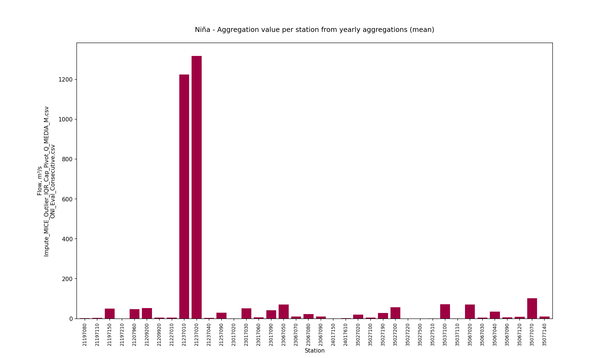
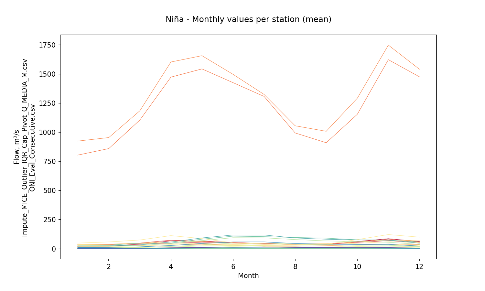
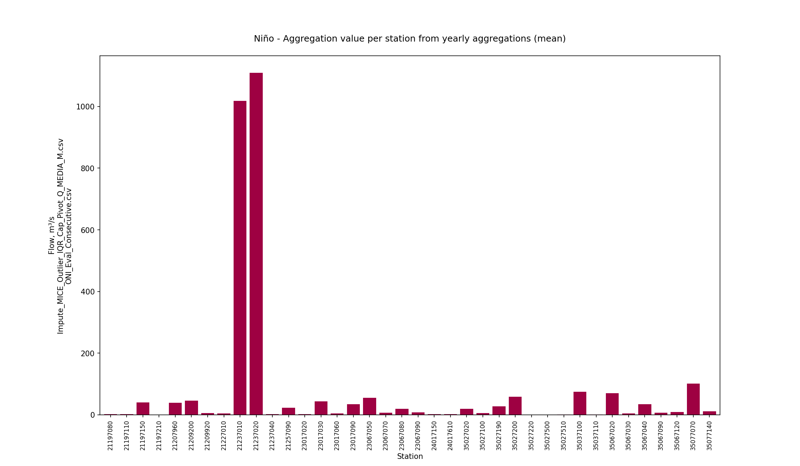
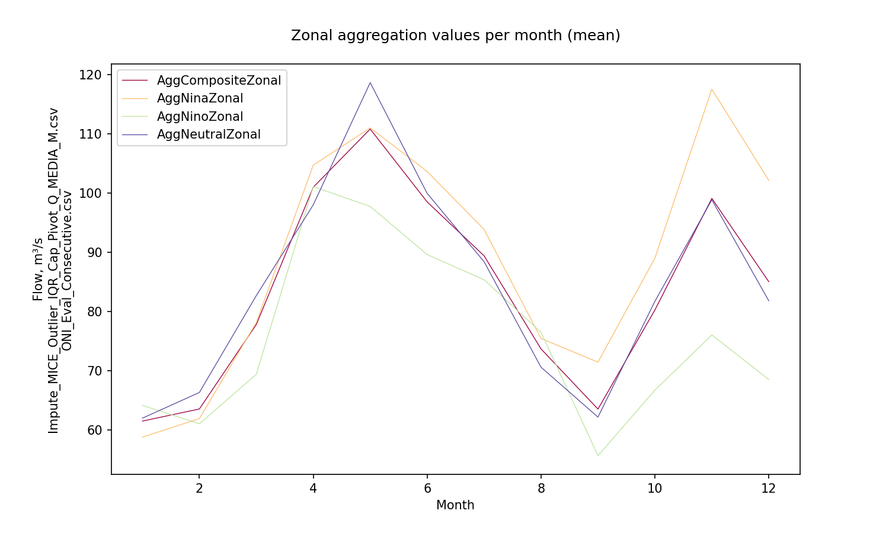

# Statistical aggregations for hydro-climatological composite series and yearly events Niño, Niña and Neutral

For further information about the NOAA - Oceanic Niño Index (ONI) classifier for climatological yearly events Niño, Niña and Neutral, check this activity https://github.com/rcfdtools/R.LTWB/tree/main/Section03/ENSOONI

* Station records file: [Impute_MICE_Outlier_IQR_Cap_Pivot_Q_MEDIA_M.csv](../IDEAM_Impute/Impute_MICE_Outlier_IQR_Cap_Pivot_Q_MEDIA_M.csv)
* ENSO-ONI year file: [ONI_Eval_Consecutive.csv](../ENSOONI/ONI_Eval_Consecutive.csv)
* Stations: 39
* Records: 516
* Daily serie: False
* Aggregation function: Mean
* Execution date: 2023-09-23 12:24:51.410949
* Python version: 3.11.5 (tags/v3.11.5:cce6ba9, Aug 24 2023, 14:38:34) [MSC v.1936 64 bit (AMD64)]
* Python path: ['C:\\JLGC\\R.LTWB\\.src', 'C:\\Python311\\python311.zip', 'C:\\Python311\\DLLs', 'C:\\Python311\\Lib', 'C:\\Python311']
* matplotlib version: 3.6.0
* pandas version: 2.1.0
* Instructions & script: https://github.com/rcfdtools/R.LTWB/tree/main/Section03/Agg
* License: https://github.com/rcfdtools/R.LTWB/blob/main/LICENSE.md
* Credits: r.cfdtools@gmail.com

## Composite - Yearly values per station from monthly values (Mean)

|   Year |   21197080 |   21197110 |   21197150 |   21197210 |   21207960 |   21209200 |   21209920 |   21227010 |   21237010 |   21237020 |   21237040 |   21257090 |   23017020 |   23017030 |   23017060 |   23017090 |   23067050 |   23067070 |   23067080 |   23067090 |   24017150 |   24017610 |   35027020 |   35027100 |   35027190 |   35027200 |   35027220 |   35027500 |   35027510 |   35037100 |   35037110 |   35067020 |   35067030 |   35067040 |   35067090 |   35067120 |   35077070 |   35077140 |
|-------:|-----------:|-----------:|-----------:|-----------:|-----------:|-----------:|-----------:|-----------:|-----------:|-----------:|-----------:|-----------:|-----------:|-----------:|-----------:|-----------:|-----------:|-----------:|-----------:|-----------:|-----------:|-----------:|-----------:|-----------:|-----------:|-----------:|-----------:|-----------:|-----------:|-----------:|-----------:|-----------:|-----------:|-----------:|-----------:|-----------:|-----------:|-----------:|
|   1980 |   1.04117  |    2.77842 |    29.0239 |  0.121377  |    31.4375 |    33.7528 |    4.73553 |    3.05792 |    940.333 |   1009.33  |   1.8595   |   18.8659  |   0.33825  |    34.7708 |    4.40943 |    32.4859 |    38.5442 |    5.39556 |    11.6771 |   11.8357  |  11.3789   |   1.03842  |    18.7847 |    4.76417 |    27.4661 |    45.7183 |  0.107894  |  0.0769591 |   0.904343 |   111.453  |   0.280917 |    39.2525 |    4.31658 |    23.4215 |    4.72725 |    4.88567 |    101.54  |    7.21622 |
|   1981 |   1.75066  |    3.15575 |    44.3833 |  0.140516  |    41.5367 |    54.7697 |    4.97434 |    5.5285  |   1174.9   |   1302.93  |   4.84483  |   25.9204  |   0.452167 |    54.7417 |    5.60129 |    40.9101 |    74.8933 |    9.13075 |    24.8978 |   11.6473  |   7.4866   |   1.45208  |    15.4483 |    6.88083 |    25.0263 |    41.6483 |  0.126396  |  0.074217  |   0.993443 |    92.4492 |   0.36525  |    47.8916 |    4.25442 |    23.9938 |    5.28167 |    5.70825 |    101.487 |    9.51968 |
|   1982 |   2.24795  |    4.0195  |    59.4067 |  0.145136  |    49.115  |    54.0025 |    4.70164 |    5.88483 |   1435.27  |   1588.42  |   5.02467  |   32.205   |   0.514    |    59.6542 |    6.01552 |    45.2282 |    93.0258 |    8.47875 |    22.4872 |    9.48842 |   7.60558  |   1.88008  |    22.15   |    4.9475  |    30.2248 |    43.2763 |  0.11717   |  0.0810275 |   1.16918  |   121.252  |   0.354083 |    55.415  |    4.0235  |    29.3952 |    6.11633 |    4.02917 |    101.513 |   12.1632  |
|   1983 |   1.36887  |    2.45392 |    36.5575 |  0.130697  |    40.5858 |    43.534  |    4.70261 |    4.58883 |   1025.54  |   1140.24  |   2.72958  |   22.4107  |   0.484    |    32.1917 |    4.75229 |    34.7273 |    51.0465 |    6.71392 |    17.2623 |    6.91558 |   0.933417 |   1.11058  |    24.1017 |    5.39083 |    29.2735 |    38.5982 |  0.118963  |  0.0850791 |   1.05243  |   100.588  |   0.33825  |    60.9033 |    3.65308 |    24.9558 |    7.6745  |    5.33293 |    101.518 |   11.9563  |
|   1984 |   2.10711  |    3.929   |    48.875  |  0.136691  |    38.9725 |    58.1615 |    4.51523 |    5.6     |   1420.23  |   1612.81  |   9.32183  |   32.5162  |   0.62975  |    59.0545 |    6.46794 |    47.0477 |    97.8433 |   13.4517  |    28.6275 |   12.1184  |   0.713417 |   0.748417 |    21.1017 |    4.4975  |    26.0923 |    47.1292 |  0.10458   |  0.0513801 |   0.839861 |    81.535  |   0.429    |    59.5908 |    4.03817 |    25.6826 |    5.48158 |    6.69234 |    101.456 |    7.79983 |
|   1985 |   1.50436  |    3.681   |    43.6066 |  0.127513  |    33.2092 |    42.3447 |    4.49669 |    4.63292 |   1017.25  |   1102.56  |   5.32067  |   21.7866  |   0.793583 |    38.885  |    5.2765  |    38.8362 |    60.3183 |    8.8465  |    16.4952 |   13.4988  |   1.03342  |   0.861917 |    21.0058 |    2.885   |    23.4093 |    42.3323 |  0.149224  |  0.0760343 |   1.05534  |    81.5967 |   0.275833 |    53.633  |    4.312   |    29.6052 |    5.832   |    5.78976 |    101.486 |    9.67817 |
|   1986 |   2.04831  |    4.66908 |    50.4142 |  0.134005  |    58.4492 |    53.7374 |    4.72918 |    6.89136 |   1366.25  |   1478.82  |   6.21708  |   28.9929  |   0.43675  |    47.9937 |    5.68826 |    42.4911 |    69.2208 |   12.3402  |    23.2355 |   14.7503  |   1.23183  |   1.69175  |    19.9691 |    5.32583 |    29.4441 |    53.1658 |  0.197226  |  0.0980066 |   1.28945  |    72.1333 |   0.23125  |    77.839  |    3.58017 |    38.3942 |    6.25342 |   10.0858  |    101.473 |   11.6138  |
|   1987 |   1.37688  |    3.30692 |    33.6083 |  0.123018  |    42.225  |    44.9953 |    4.34782 |    4.27    |    935.667 |    993.575 |   4.79236  |   18.752   |   0.316833 |    40.1058 |    5.08666 |    37.3405 |    56.2208 |    7.83575 |    19.8433 |    6.13667 |   1.235    |   1.20583  |    15.205  |    3.59417 |    23.5791 |    52.5217 |  0.201167  |  0.0858882 |   1.14114  |    54.3303 |   0.325    |    77.1153 |    3.07083 |    40.1167 |    5.73583 |    8.26367 |    101.46  |   10.2316  |
|   1988 |   1.80709  |    4.42783 |    42.4592 |  0.144931  |    43.5567 |    56.7933 |    4.2509  |    6.83408 |   1190.9   |   1327.11  |   5.54683  |   27.6117  |   0.345    |    52.5354 |    5.90315 |    44.3529 |    82.8267 |    9.12717 |    25.5827 |    7.79051 |   1.04533  |   0.981167 |    13.4788 |    3.63917 |    24.4146 |    36.675  |  0.0858333 |  0.0854494 |   1.29233  |    55.346  |   0.397667 |    53.8486 |    2.5315  |    27.4753 |    4.38625 |    5.29498 |    101.435 |   21.7771  |
|   1989 |   1.54392  |    3.70808 |    35.475  |  0.511034  |    35.9342 |    49.1833 |    4.45328 |    5.58175 |   1231.44  |   1371.26  |   4.39617  |   30.2025  |   0.397417 |    45.0067 |    6.2769  |    42.1847 |    59.7481 |   11.1348  |    23.4792 |    6.716   |   0.774417 |   0.939583 |    11.7984 |    4.25333 |    22.8622 |    46.8825 |  0.112667  |  0.0665979 |   0.845463 |    54.0649 |   0.414083 |    50.2053 |    3.61517 |    24.1687 |    4.97908 |    6.75625 |    101.449 |    7.53144 |
|   1990 |   1.50272  |    2.29617 |    33.7992 |  0.127524  |    36.265  |    44.7672 |    4.46822 |    3.07683 |   1103.28  |   1221.2   |   3.75     |   11.32    |   0.462417 |    45.95   |    5.58133 |    39.1289 |    69.9583 |    8.19817 |    20.0773 |    9.34972 |   0.883833 |   1.12592  |    12.8933 |    4.48833 |    24.545  |    48.0733 |  0.119333  |  0.0586937 |   0.855684 |    56.657  |   0.34275  |    52.4616 |    3.62008 |    25.9511 |    4.82958 |    6.94573 |    101.446 |    8.28036 |
|   1991 |   1.65512  |    2.80425 |    47.2628 |  0.118571  |    37.1183 |    54.4872 |    4.59854 |    4.94617 |   1067.88  |   1198.38  |   2.31392  |   12.4382  |   0.397083 |    33.4875 |    3.42317 |    31.9646 |    62.8567 |    6.00875 |    24.1025 |    9.67706 |   0.766833 |   0.819    |    13.2467 |    4.38    |    27.7669 |    50.8783 |  0.130889  |  0.086307  |   1.16688  |    61.8134 |   0.31375  |    55.5665 |    3.72    |    26.9503 |    4.62575 |    7.38917 |    101.459 |   14.2062  |
|   1992 |   0.941783 |    1.00092 |    23.6588 |  0.125303  |    33.8617 |    32.3221 |    4.32994 |    3.851   |    783.583 |    876.3   |   2.468    |    7.63525 |   0.399333 |    31.63   |    3.98783 |    29.227  |    39.67   |    3.96183 |    11.6927 |    5.85184 |   0.289    |   0.561083 |    11.2117 |    3.22917 |    21.2066 |    40.8345 |  0.0784167 |  0.0604051 |   0.782759 |    54.6195 |   0.40075  |    44.878  |    3.64408 |    22.2504 |    4.50867 |    5.62869 |    101.464 |   10.293   |
|   1993 |   1.74404  |    2.4275  |    52.1058 |  0.110462  |    34.465  |    49.7876 |    4.77814 |    4.3345  |   1178.59  |   1206.12  |   4.45802  |   12.2182  |   0.311333 |    33.075  |    4.08175 |    33.0073 |    56.6117 |    5.42392 |    20.4017 |    9.26588 |   0.712833 |   0.888833 |    13.3858 |    4.64167 |    28.3893 |    58.1    |  0.129667  |  0.0786479 |   1.01416  |    58.3942 |   0.407    |    67.5526 |    4.57142 |    33.4086 |    5.55417 |    9.02363 |    101.463 |   10.6133  |
|   1994 |   1.40067  |    3.40833 |    43.7725 |  0.0751667 |    42.5208 |    49.0325 |    5.08381 |    6.02861 |   1299.74  |   1374.75  |   3.04192  |   24.6014  |   0.424833 |    50.8195 |    5.04975 |    39.2623 |    73.8025 |    9.425   |    20.875  |   10.109   |   0.985083 |   1.30917  |    16.6467 |    6.8825  |    33.4237 |    53.3008 |  0.146583  |  0.0668723 |   0.920147 |    72.4033 |   0.316917 |    67.8907 |    4.86333 |    33.7583 |    5.76083 |    8.10096 |    101.469 |    7.08333 |
|   1995 |   1.46542  |    3.61917 |    40.85   |  0.0845    |    37.8117 |    40.5668 |    4.03237 |    4.00067 |    982.783 |   1114.53  |   1.80325  |   20.3306  |   0.445667 |    44.8377 |    5.68208 |    40.5721 |    66.0675 |    5.43333 |    18.3275 |    8.26331 |   0.785583 |   0.413083 |    12.32   |    3.41917 |    24.5675 |    34.7108 |  0.0976667 |  0.0383307 |   0.594487 |    60.2891 |   0.236333 |    42.0117 |    2.67667 |    21.322  |    4.15083 |    4.46575 |    101.451 |    3.69333 |
|   1996 |   1.87358  |    3.34583 |    46.0708 |  0.0681667 |    44.1742 |    43.1736 |    4.38003 |    4.84583 |   1239.42  |   1355.04  |   2.429    |   18.8208  |   0.419333 |    40.3311 |    5.8573  |    41.4468 |    70.9333 |   10.9783  |    18.5583 |    9.31885 |   0.936667 |   0.9325   |    18.5618 |    4.24667 |    30.1519 |    55.6775 |  0.0953333 |  0.0490436 |   0.690658 |    73.378  |   0.444667 |    67.5642 |    3.62083 |    33.3721 |    6.61667 |    8.48756 |    101.472 |    4.7325  |
|   1997 |   1.45833  |    2.125   |    34.9483 |  0.05      |    29.07   |    38.6774 |    4.50457 |    4.9323  |    981.592 |   1042.77  |   0.831917 |   14.9699  |   0.31875  |    31.5067 |    4.281   |    31.7276 |    41.036  |    5.55833 |    14.6667 |    6.89546 |   0.65     |   0.941667 |    17.8103 |    3.725   |    20.4782 |    44.3533 |  0.0916667 |  0.0732915 |   0.882282 |    69.3822 |   0.39325  |    50.8795 |    3.975   |    24.7339 |    6.60833 |    6.25409 |    101.483 |   10.6083  |
|   1998 |   1.50833  |    2.25    |    40.0964 |  0.0666667 |    32.4258 |    46.2305 |    4.81306 |    5.05569 |   1012.61  |   1114.45  |   1.89058  |   16.2651  |   0.88475  |    39.01   |    5.40583 |    36.857  |    53.0417 |    5.14167 |    19.7333 |    8.47323 |   1.225    |   1.05     |    16.8235 |    4.72836 |    28.082  |    62.0592 |  0.0583333 |  0.0573183 |   0.717404 |    68.2302 |   0.409    |    70.8877 |    5.10833 |    34.4572 |    5.65    |    9.60312 |    101.479 |    8.55833 |
|   1999 |   3.30416  |    3.59183 |    56.1417 |  0.0868333 |    41.7292 |    55.2315 |    4.43035 |    7.05642 |   1522.52  |   1668.42  |   4.62425  |   33.4846  |   1.34733  |    59.7234 |    9.062   |    54.0034 |    83.9817 |   32.3545  |    26.739  |   12.8527  |   1.87292  |   1.53475  |    45.5206 |    4.06983 |    29.4952 |    75.5517 |  0.14175   |  0.0783298 |   0.793871 |   132.17   |   0.352167 |    97.8378 |    3.88683 |    46.8229 |   22.7847  |   12.564   |    101.542 |    3.17708 |
|   2000 |   1.66992  |    3.33617 |    43.405  |  0.0801972 |    39.2833 |    43.9773 |    4.71913 |    7.53617 |   1321.75  |   1439.51  |   1.72967  |   22.0745  |   0.88075  |    54.9968 |    7.29983 |    45.0295 |    56.5075 |    7.46725 |    17.5208 |    9.57071 |   1.07675  |   1.17283  |    15.8612 |    4.93333 |    26.7643 |    72.1308 |  0.117667  |  0.0746209 |   0.952208 |    58.864  |   0.324917 |    80.9749 |    4.21008 |    38.6393 |    3.70283 |   11.5141  |    101.466 |    8.8442  |
|   2001 |   1.34408  |    1.98233 |    30.724  |  0.0438618 |    24.1625 |    42.8736 |    4.57607 |    6.20908 |    906.633 |    980.583 |   1.22562  |    8.71967 |   1.06506  |    36.4992 |    4.61852 |    34.1228 |    53.9567 |    6.69125 |    18.2999 |    7.50319 |   0.544083 |   0.738167 |    12.7969 |    4.17917 |    23.1958 |    70.3292 |  0.07325   |  0.0563781 |   0.766641 |    47.0466 |   0.376733 |    74.3033 |    4.32    |    35.2109 |    3.94096 |   11.213   |    101.45  |   10.8024  |
|   2002 |   1.50733  |    2.53733 |    41.8624 |  0.0746397 |    48.0225 |    52.1574 |    5.48077 |    5.798   |    979.05  |   1074.36  |   1.39433  |   11.7578  |   0.909083 |    40.2175 |    4.89703 |    35.7839 |    54.3958 |    5.78667 |    20.3883 |    8.38698 |   0.891667 |   1.57825  |    24.3016 |    6.57225 |    28.735  |   113.172  |  0.15625   |  0.0976467 |   1.19407  |    46.3349 |   0.51624  |   121.341  |    6.29317 |    57.1208 |    9.42282 |   19.7017  |    101.461 |   16.0281  |
|   2003 |   1.3933   |    3.32342 |    42.7891 |  0.0843041 |    34.3617 |    46.5884 |    4.85724 |    5.46258 |    853.667 |    953.217 |   1.26267  |   10.9827  |  16.1163   |    37.7559 |    3.97196 |    33.3417 |    52.9717 |    4.093   |    18.3589 |    7.42676 |   0.652917 |   1.74167  |    14.8813 |    4.9355  |    25.7807 |    89.3338 |  0.09575   |  0.069081  |   0.912969 |    47.3844 |   0.449237 |    94.552  |    4.89633 |    44.8731 |    4.99375 |   14.8723  |    101.457 |   13.4732  |
|   2004 |   1.64106  |    3.05875 |    42.5859 |  0.102623  |    39.8123 |    51.9635 |    5.56858 |    4.39425 |    958.058 |   1018.12  |   1.31158  |    7.11858 |  17.4103   |    37.1092 |    4.43879 |    36.2638 |    69.8142 |    6.2399  |    22.1506 |    8.45419 |   0.798917 |   2.79688  |    19.8414 |    7.08298 |    33.7492 |    71.4661 |  0.140331  |  0.0620055 |   0.865073 |    72.1105 |   0.411196 |    87.2055 |    7.00717 |    43.0322 |    6.91545 |   11.6295  |    101.477 |    7.0782  |
|   2005 |   1.57139  |    3.11275 |    40.5266 |  0.117748  |    33.1625 |    50.3772 |    5.14969 |    4.84617 |   1019.63  |   1129.77  |   2.79749  |   24.5719  |   0.590167 |    47.8498 |    5.26683 |    39.7906 |    76.5863 |    8.56675 |    22.0931 |    9.27232 |   0.8265   |   2.51967  |    21.9001 |    6.23492 |    23.4327 |    58.1226 |  0.0731667 |  0.0483531 |   0.649089 |    69.3607 |   0.358707 |    70.9043 |    6.01617 |    34.7041 |    8.65925 |    9.15595 |    101.46  |    8.73908 |
|   2006 |   2.17304  |    3.63567 |    63.8218 |  0.124064  |    54.1175 |    65.0134 |    5.58845 |    4.19725 |   1194.76  |   1304.62  |   4.61726  |   20.4038  |   0.35525  |    50.1235 |    4.93569 |    41.5626 |    98.0699 |    9.00558 |    28.0342 |   11.4813  |   1.6385   |   4.36663  |    24.6473 |    9.22717 |    28.0903 |    62.9596 |  0.146119  |  0.0767784 |   1.11935  |    77.6241 |   0.388962 |    80.2299 |    5.5995  |    39.7673 |    8.53958 |   10.0717  |    101.458 |   13.6537  |
|   2007 |   1.55725  |    2.88308 |    48.9529 |  0.151766  |   109.864  |    54.6728 |    4.67083 |    6.68933 |   1152.02  |   1272.53  |   3.2345   |   21.7131  |   0.46475  |    45.1344 |    5.62093 |    40.1489 |    69.2841 |   13.8396  |    24.5942 |   10.3842  |   0.84275  |   1.69983  |    17.0857 |    4.12975 |    28.1168 |    57.3809 |  0.0469167 |  0.0641146 |   0.858837 |    65.6772 |   0.353334 |    69.111  |    4.71633 |    33.675  |    6.08808 |    8.87996 |    101.463 |   12.3962  |
|   2008 |   2.89892  |    5.19175 |    72.5148 |  0.133583  |    62.0717 |    69.7968 |    4.8748  |    7.3121  |   1554.33  |   1665.17  |   2.93917  |   34.3015  |   2.21869  |    58.1712 |    6.78867 |    48.2508 |    83.9367 |   13.1855  |    33.0283 |   13.8414  |   1.24317  |   3.117    |    20.909  |    5.43092 |    31.287  |    61.3296 |  0.101667  |  0.0769332 |   0.920052 |    75.7108 |   0.388043 |    77.693  |    4.85533 |    38.0409 |    6.44408 |    9.62276 |    101.467 |   11.8797  |
|   2009 |   1.48875  |    1.76808 |    34.1408 |  0.13056   |    44.7742 |    41.1148 |    4.56719 |    3.6935  |   1162.02  |   1200.42  |   2.83342  |   33.6583  |   0.68175  |    50.4379 |    5.19617 |    36.1046 |    50.5467 |   10.3085  |    17.0047 |    8.57944 |   0.738167 |   1.36442  |    19.1669 |    5.33092 |    21.9016 |    51.6116 |  0.0760833 |  0.0559268 |   0.656167 |    69.8334 |   0.354601 |    58.958  |    3.70483 |    28.887  |    6.03525 |    7.58855 |    101.478 |    9.30983 |
|   2010 |   1.69833  |    3.06217 |    62.4657 |  0.135438  |    50.6959 |    57.2749 |    4.30176 |    6.62292 |   1258.52  |   1273.94  |   2.67833  |   37.9263  |   0.6585   |    58.9411 |    6.97842 |    45.3248 |    81.895  |   10.7132  |    26.6993 |   10.9372  |   1.286    |   4.6683   |    16.0536 |    3.67412 |    29.6782 |    54.2687 |  0.0781667 |  0.0563938 |   0.8665   |    49.5067 |   0.33484  |    66.8516 |    3.42533 |    32.7808 |    5.6555  |    8.54831 |    101.432 |    8.57692 |
|   2011 |   4.07117  |    7.12117 |    86.6441 |  0.142418  |    64.5105 |    74.0457 |    5.20127 |    5.47997 |   1689.85  |   1755.86  |   5.66773  |   38.9908  |   0.734917 |    71.2677 |    6.14908 |    53.1944 |   132.185  |   14.42    |    33.0129 |   14.7958  |   2.59918  |   8.19997  |    20.4731 |    6.92745 |    31.6152 |    60.5741 |  0.08225   |  0.0539303 |   1.01656  |    67.9898 |   0.366081 |    81.706  |    5.64343 |    41.0298 |    6.24933 |    9.75522 |    101.42  |   15.487   |
|   2012 |   2.4025   |    3.72525 |    62.7759 |  0.113522  |    40.182  |    51.8944 |    5.3227  |    4.07009 |   1184.38  |   1123.27  |   1.82083  |   20.9422  |   0.588417 |    47.9302 |    5.81225 |    42.7002 |    80.4436 |    5.68333 |    19.0567 |    8.4941  |   1.32858  |   2.39513  |    25.7232 |    9.80117 |    32.1947 |    66.4037 |  0.0986667 |  0.0656255 |   0.910175 |    87.5347 |   0.411495 |    83.0451 |    4.24767 |    40.981  |    8.35517 |   10.5576  |    101.486 |   13.154   |
|   2013 |   1.522    |    2.23843 |    45.8842 |  0.120353  |    32.0439 |    50.5796 |    4.58638 |    5.31825 |   1077.13  |   1029.13  |   1.44958  |   18.3272  |   0.333417 |    41.1318 |    5.97475 |    39.2766 |    58.0483 |    8.20072 |    23.0129 |    8.75234 |   0.677418 |   0.952    |    25.2037 |    8.00842 |    24.0135 |    51.0832 |  0.0733333 |  0.0590824 |   0.655071 |    87.3743 |   0.360557 |    60.5724 |    2.2525  |    29.1488 |    8.83566 |    7.45413 |    101.496 |    8.62825 |
|   2014 |   1.73233  |    2.46026 |    54.1208 |  0.112069  |    21.1447 |    54.7995 |    4.73739 |    7.26806 |   1176.23  |   1186.6   |   3.16032  |   18.3081  |   0.800333 |    43.3204 |    6.26542 |    41.7283 |    67.9892 |    2.82307 |    24.4527 |    9.96625 |   0.467333 |   0.879    |    19.951  |    5.75537 |    26.4064 |    55.8723 |  0.0765833 |  0.0617383 |   0.809867 |    70.8991 |   0.37407  |    68.4105 |    4.11598 |    33.0737 |    6.77258 |    8.58901 |    101.469 |   10.1205  |
|   2015 |   0.841417 |    1.32244 |    22.6016 |  0.0915689 |    15.5533 |    36.2786 |    5.25816 |    4.15413 |    825.942 |    908.239 |   1.40979  |    8.289   |   0.392667 |    29.7517 |    3.78658 |    28.6996 |    37.375  |    3.51856 |    12.6303 |    5.99151 |   0.41225  |   0.762    |    18.6894 |    5.91977 |    29.9088 |    67.2665 |  0.0684167 |  0.0661854 |   0.770339 |    72.6571 |   0.405413 |    77.7308 |    6.2045  |    37.9459 |    6.41522 |   10.6358  |    101.499 |   10.2133  |
|   2016 |   1.7366   |    1.80399 |    44.6522 |  0.0918025 |    37.7389 |    52.7259 |    6.24492 |    1.96327 |    943.6   |    971.908 |   1.61536  |   11.7677  |   2.44153  |    37.8679 |    2.99924 |    29.3251 |    65.2276 |    5.99948 |    18.3861 |    7.56137 |   0.373196 |   0.807791 |    21.4564 |    6.77177 |    38.6877 |    82.4355 |  0.0606703 |  0.0526976 |   0.712155 |    76.801  |   0.439543 |   100.062  |    9.99476 |    49.7949 |    8.02841 |   13.7514  |    101.491 |   14.2532  |
|   2017 |   1.47428  |    2.86243 |    73.2818 |  0.117512  |    45.391  |    71.3289 |    5.07254 |    3.36715 |   1355.71  |   1190.19  |   3.15362  |   20.06    |   0.788504 |    46.5419 |    4.80009 |    38.6393 |    83.8356 |    9.38449 |    29.7336 |   11.0916  |   1.45874  |   1.41119  |    22.1968 |    6.4766  |    31.1961 |    63.6144 |  0.0801955 |  0.0393082 |   0.911499 |    78.3835 |   0.394205 |    78.749  |    6.34851 |    39.2035 |    7.48535 |   10.0484  |    101.471 |    5.16675 |
|   2018 |   2.2122   |    3.12026 |    68.3027 |  0.111175  |    48.6487 |    64.756  |    5.86029 |    3.53528 |   1165.14  |   1225.72  |   2.05763  |   25.2254  |   0.424406 |    48.4978 |    5.40999 |    39.5555 |    69.69   |   10.4984  |    29.7474 |   11.1107  |   1.5394   |   1.31199  |    29.4939 |    6.72035 |    34.8151 |    73.2716 |  0.130374  |  0.0916973 |   1.13698  |   100.587  |   0.419864 |    90.4902 |    6.62847 |    44.4815 |   12.2729  |   11.8609  |    101.514 |   11.0545  |
|   2019 |   1.81419  |    2.37079 |    60.6035 |  0.134021  |    41.1961 |    48.7343 |    4.49637 |    5.20014 |   1046.16  |   1161.51  |   0.765132 |   82.4378  |   0.357101 |    84.6838 |    4.40263 |    33.2598 |    48.4723 |    4.58768 |    26.3354 |   10.506   |   0.820849 |   1.68124  |    28.4931 |    3.9742  |    30.1914 |    66.2111 |  0.22083   |  0.127234  |   1.11799  |    98.472  |   0.403105 |    79.197  |    5.13953 |    38.2347 |   13.0998  |   10.4686  |    101.524 |    9.34433 |
|   2020 |   0.826362 |    2.32    |    23.9044 |  0.126458  |    32.5222 |    40.7068 |    5.00655 |    3.61761 |    871.93  |    981.024 |   1.1684   |   68.9152  |   0.262491 |    69.2047 |    3.47946 |    26.7    |    17.1203 |    4.61912 |    14.4101 |    7.19373 |   0.430097 |   1.0104   |    16.5729 |    3.29841 |    26.2866 |    61.0389 |  0.20857   |  0.0978506 |   1.04592  |    70.485  |   0.393484 |    66.3617 |    4.91468 |    32.2695 |    5.78789 |    9.26844 |    101.509 |    7.67881 |
|   2021 |   1.99082  |    4.54054 |    55.7339 |  0.11585   |    49.1536 |    61.7514 |    4.95449 |    6.01173 |   1392.53  |   1300.08  |   2.31492  |   22.7596  |   0.288236 |    45.0834 |    5.15876 |    39.4385 |    58.3609 |   10.4752  |    27.519  |   10.9525  |   1.63884  |   2.20876  |    21.6027 |    6.03914 |    31.4656 |    66.5101 |  0.279085  |  0.129921  |   1.60639  |    81.7627 |   0.421988 |    80.5504 |    5.36506 |    39.374  |    6.3892  |   10.4378  |    101.495 |    9.76991 |
|   2022 |   2.27454  |    4.08517 |    61.2659 |  0.126022  |    47.6811 |    61.8107 |    5.50837 |    5.90552 |   1387.07  |   1379.45  |   4.32136  |   26.0096  |   0.328599 |    52.1099 |    6.54311 |    46.248  |    85.4103 |   10.6735  |    27.1527 |   11.5968  |   3.23186  |   2.17647  |    21.7156 |    6.32221 |    29.1545 |    58.8448 |  0.135152  |  0.0756926 |   1.0501   |    81.9687 |   0.382678 |    73.8094 |    5.33389 |    36.2797 |    7.18864 |    9.07233 |    101.472 |    8.72475 |

Composite - Aggregation value per station from yearly aggregations (mean)

|              |   21197080 |   21197110 |   21197150 |   21197210 |   21207960 |   21209200 |   21209920 |   21227010 |   21237010 |   21237020 |   21237040 |   21257090 |   23017020 |   23017030 |   23017060 |   23017090 |   23067050 |   23067070 |   23067080 |   23067090 |   24017150 |   24017610 |   35027020 |   35027100 |   35027190 |   35027200 |   35027220 |   35027500 |   35027510 |   35037100 |   35037110 |   35067020 |   35067030 |   35067040 |   35067090 |   35067120 |   35077070 |   35077140 |
|:-------------|-----------:|-----------:|-----------:|-----------:|-----------:|-----------:|-----------:|-----------:|-----------:|-----------:|-----------:|-----------:|-----------:|-----------:|-----------:|-----------:|-----------:|-----------:|-----------:|-----------:|-----------:|-----------:|-----------:|-----------:|-----------:|-----------:|-----------:|-----------:|-----------:|-----------:|-----------:|-----------:|-----------:|-----------:|-----------:|-----------:|-----------:|-----------:|
| AggComposite |    1.75563 |     3.1363 |     47.118 |   0.121155 |    41.8734 |    50.9482 |    4.83559 |    5.10816 |    1148.51 |    1223.82 |    3.08356 |    23.8746 |    1.37697 |    46.7427 |    5.31824 |    39.0068 |    66.3667 |    8.64465 |    21.9159 |    9.64663 |    1.58286 |    1.65222 |    19.5461 |    5.29616 |    27.8271 |    58.2958 |   0.116983 |  0.0717924 |   0.941985 |    74.1035 |   0.373423 |    70.1403 |    4.61198 |    34.3903 |    6.85663 |    8.97672 |    101.476 |    10.1188 |

Composite - Aggregation value per station from yearly aggregations (std - standard deviation)

|                 |   21197080 |   21197110 |   21197150 |   21197210 |   21207960 |   21209200 |   21209920 |   21227010 |   21237010 |   21237020 |   21237040 |   21257090 |   23017020 |   23017030 |   23017060 |   23017090 |   23067050 |   23067070 |   23067080 |   23067090 |   24017150 |   24017610 |   35027020 |   35027100 |   35027190 |   35027200 |   35027220 |   35027500 |   35027510 |   35037100 |   35037110 |   35067020 |   35067030 |   35067040 |   35067090 |   35067120 |   35077070 |   35077140 |
|:----------------|-----------:|-----------:|-----------:|-----------:|-----------:|-----------:|-----------:|-----------:|-----------:|-----------:|-----------:|-----------:|-----------:|-----------:|-----------:|-----------:|-----------:|-----------:|-----------:|-----------:|-----------:|-----------:|-----------:|-----------:|-----------:|-----------:|-----------:|-----------:|-----------:|-----------:|-----------:|-----------:|-----------:|-----------:|-----------:|-----------:|-----------:|-----------:|
| StdAggComposite |   0.598339 |    1.08956 |    14.1121 |  0.0664271 |    14.4372 |    9.63717 |   0.464686 |    1.30742 |    209.894 |    216.762 |    1.77691 |    14.3569 |    3.47031 |    11.6337 |    1.14853 |    6.18363 |    19.9525 |    4.74712 |    5.36784 |    2.30763 |    2.13704 |     1.3644 |    6.05166 |     1.5756 |    3.91117 |    14.9637 |  0.0482076 |  0.0195686 |   0.205184 |    19.3131 |  0.0555127 |    16.9108 |    1.38485 |    7.97647 |    3.15575 |    2.99894 |  0.0270884 |    3.42298 |

Composite - Monthly values per station (mean)

|   Month |   21197080 |   21197110 |   21197150 |   21197210 |   21207960 |   21209200 |   21209920 |   21227010 |   21237010 |   21237020 |   21237040 |   21257090 |   23017020 |   23017030 |   23017060 |   23017090 |   23067050 |   23067070 |   23067080 |   23067090 |   24017150 |   24017610 |   35027020 |   35027100 |   35027190 |   35027200 |   35027220 |   35027500 |   35027510 |   35037100 |   35037110 |   35067020 |   35067030 |   35067040 |   35067090 |   35067120 |   35077070 |   35077140 |
|--------:|-----------:|-----------:|-----------:|-----------:|-----------:|-----------:|-----------:|-----------:|-----------:|-----------:|-----------:|-----------:|-----------:|-----------:|-----------:|-----------:|-----------:|-----------:|-----------:|-----------:|-----------:|-----------:|-----------:|-----------:|-----------:|-----------:|-----------:|-----------:|-----------:|-----------:|-----------:|-----------:|-----------:|-----------:|-----------:|-----------:|-----------:|-----------:|
|       1 |   1.15801  |    2.41539 |    26.6084 |  0.132157  |    33.0536 |    35.1995 |    3.51344 |    2.67749 |    861.206 |    951.11  |   1.80201  |    17.0872 |   0.949624 |    39.0961 |    5.60355 |    37.7825 |    56.871  |    7.48091 |   17.7764  |    7.63135 |   0.823209 |   0.674396 |    6.94444 |    1.73362 |    9.8211  |    26.183  |  0.0418807 |  0.0209122 |   0.370159 |    33.6429 |   0.210887 |    22.7044 |    1.63383 |    11.4603 |    2.09716 |    2.76478 |    101.958 |    4.26583 |
|       2 |   1.30896  |    2.70643 |    29.4153 |  0.131578  |    33.2198 |    36.7924 |    3.56113 |    3.53942 |    896.449 |    967.774 |   2.68462  |    19.3755 |   1.30288  |    41.1296 |    5.60437 |    38.7492 |    62.2282 |    8.9385  |   18.0931  |    7.67716 |   1.11007  |   0.577185 |    7.52908 |    1.8997  |    9.64156 |    27.2796 |  0.0496795 |  0.0214069 |   0.393974 |    34.6854 |   0.192462 |    24.467  |    1.6697  |    12.2657 |    2.59644 |    3.0352  |    101.413 |    4.48139 |
|       3 |   1.87311  |    3.52071 |    43.2084 |  0.142856  |    40.8539 |    50.6569 |    3.82074 |    5.16848 |   1110.71  |   1169.75  |   3.43966  |    23.3378 |   1.34965  |    48.6755 |    5.60673 |    41.9545 |    81.3922 |   10.675   |   26.4065  |   10.5315  |   1.37829  |   1.12898  |   11.8815  |    2.70148 |   12.3085  |    30.4137 |  0.0584082 |  0.0302229 |   0.499513 |    43.4798 |   0.19934  |    34.8799 |    2.19658 |    16.8256 |    4.97206 |    3.85816 |    101.412 |    5.24527 |
|       4 |   2.62937  |    4.71092 |    76.1513 |  0.133745  |    50.5478 |    73.2997 |    4.59502 |    8.77651 |   1405.58  |   1507.16  |   6.19025  |    31.5453 |   1.43727  |    59.4632 |    6.32948 |    49.1521 |   110.521  |   12.6943  |   36.7699  |   14.6779  |   2.03918  |   2.03789  |   17.0425  |    4.79449 |   21.5883  |    48.7648 |  0.0887889 |  0.0477517 |   0.813788 |    56.3227 |   0.339515 |    62.5051 |    4.23626 |    30.3093 |    6.36044 |    7.31522 |    101.414 |    9.00461 |
|       5 |   2.547    |    4.28994 |    73.0013 |  0.114256  |    54.7912 |    73.6018 |    5.53454 |    9.4169  |   1514.94  |   1629.5   |   5.19669  |    36.2604 |   1.84721  |    61.695  |    6.46316 |    48.243  |    99.3121 |   10.6282  |   34.0417  |   15.2205  |   2.20834  |   2.36425  |   27.0162  |    7.80102 |   34.5622  |    73.7478 |  0.152453  |  0.0841155 |   1.18292  |    90.8293 |   0.498566 |    95.6189 |    6.56366 |    46.5142 |    9.80973 |   11.9881  |    101.479 |   11.8378  |
|       6 |   1.71461  |    2.91705 |    48.484  |  0.0721722 |    43.7642 |    54.5809 |    6.56571 |    5.38183 |   1340.41  |   1385.88  |   1.7965   |    26.7397 |   1.25432  |    44.4837 |    4.60395 |    34.9892 |    48.7077 |    6.53936 |   17.8866  |    9.62092 |   1.62422  |   2.02451  |   32.3331  |    9.0154  |   47.7923  |   100.644  |  0.200822  |  0.151539  |   1.69873  |   117.011  |   0.548843 |   126.464  |    8.68982 |    61.5319 |   11.158   |   16.9696  |    101.564 |   17.3586  |
|       7 |   1.14068  |    1.70687 |    37.1813 |  0.0630159 |    37.0759 |    43.8419 |    6.68682 |    3.36708 |   1212.87  |   1232.98  |   0.954949 |    17.822  |   1.10828  |    32.6648 |    3.40759 |    27.1852 |    28.7938 |    4.91466 |   10.5077  |    6.12408 |   1.28111  |   1.76318  |   31.985   |    9.34717 |   52.9224  |   105.132  |  0.227533  |  0.147989  |   1.84363  |   124.282  |   0.537631 |   133.174  |    8.7336  |    65.4907 |   11.2483  |   17.8979  |    101.592 |   19.2411  |
|       8 |   0.896286 |    1.39373 |    30.5184 |  0.104902  |    32.8969 |    36.2692 |    5.97358 |    3.10233 |    977.249 |   1006.97  |   0.906114 |    15.616  |   1.18303  |    32.0106 |    3.33884 |    25.8315 |    22.8613 |    3.99404 |    8.07355 |    4.75544 |   1.19896  |   1.18362  |   27.8275  |    7.95997 |   44.2136  |    89.5093 |  0.183078  |  0.136569  |   1.38254  |   107.856  |   0.479707 |   104.656  |    6.8248  |    51.1635 |    9.20603 |   14.8586  |    101.566 |   15.3699  |
|       9 |   0.857973 |    1.68011 |    28.4568 |  0.122147  |    30.8994 |    32.1821 |    4.99337 |    5.04404 |    817.788 |    892.969 |   1.67251  |    17.8312 |   1.27967  |    36.1962 |    3.77841 |    27.6652 |    25.6252 |    4.27268 |    9.4255  |    4.74492 |   1.18531  |   0.913576 |   22.0943  |    5.45306 |   31.8812  |    65.3649 |  0.115832  |  0.0803476 |   0.932654 |    88.974  |   0.433514 |    75.9309 |    4.97993 |    36.8955 |    8.05837 |   10.149   |    101.529 |   11.02    |
|      10 |   2.14791  |    4.03783 |    56.107  |  0.123584  |    44.2725 |    52.7194 |    4.59464 |    6.11497 |   1052.84  |   1179.46  |   3.38542  |    25.9663 |   1.47077  |    51.2763 |    5.54152 |    40.5684 |    66.6157 |    8.94374 |   23.4828  |   10.1297  |   2.11494  |   2.51717  |   18.7508  |    4.93268 |   27.8735  |    52.6995 |  0.10489   |  0.0623926 |   0.825955 |    74.6751 |   0.389253 |    63.6382 |    4.05487 |    31.4113 |    6.46054 |    7.82626 |    102.019 |    9.40619 |
|      11 |   2.74653  |    4.95448 |    71.5869 |  0.172484  |    57.4626 |    70.2838 |    4.39458 |    5.14613 |   1372.63  |   1470.57  |   5.47233  |    30.4522 |   1.90277  |    62.7551 |    6.82139 |    50.3958 |   107.893  |   12.8637  |   34.071   |   13.891   |   2.45769  |   2.85733  |   17.9256  |    4.84124 |   25.0114  |    45.6153 |  0.11395   |  0.0490386 |   0.82932  |    65.2052 |   0.371393 |    58.7285 |    3.48506 |    29.3794 |    6.00504 |    6.73822 |    100.916 |    8.75166 |
|      12 |   2.04715  |    3.30208 |    44.6975 |  0.140964  |    43.6434 |    51.9508 |    3.79347 |    3.56274 |   1219.44  |   1291.71  |   3.50168  |    24.462  |   1.43816  |    51.4668 |    6.71986 |    45.5647 |    85.5793 |   11.7906  |   26.4561  |   10.7551  |   1.57296  |   1.78454  |   13.2228  |    3.0741  |   16.3093  |    34.1954 |  0.066474  |  0.0292245 |   0.530632 |    52.2794 |   0.27997  |    38.9171 |    2.27567 |    19.4367 |    4.30756 |    4.31956 |    100.847 |    5.4437  |

Composite - Zonal monthly values (mean)

|   Month |   AggCompositeZonal |
|--------:|--------------------:|
|       1 |             61.487  |
|       2 |             63.526  |
|       3 |             77.8039 |
|       4 |            100.984  |
|       5 |            110.813  |
|       6 |             98.5046 |
|       7 |             89.4011 |
|       8 |             73.6716 |
|       9 |             63.5125 |
|      10 |             80.2518 |
|      11 |             99.0986 |
|      12 |             85.024  |

## ENSO-ONI Events - Yearly values per station from monthly values (Mean)

* Records in ENSO-ONI file: 74
* ENSO-ONI eventMark unique values: [-1  1  0]

### Niña events analysis (24 years identified)

|   Id |   YR |   NinaCount |   NinoCount |   NeutralCount | Event   |   EventMark |   EventLabel |
|-----:|-----:|------------:|------------:|---------------:|:--------|------------:|-------------:|
|    0 | 1950 |           7 |           0 |              5 | Niña    |          -1 |            7 |
|    4 | 1954 |           8 |           1 |              3 | Niña    |          -1 |            8 |
|    5 | 1955 |          12 |           0 |              0 | Niña    |          -1 |           12 |
|    6 | 1956 |           8 |           0 |              4 | Niña    |          -1 |            8 |
|   14 | 1964 |           8 |           2 |              2 | Niña    |          -1 |            8 |
|   20 | 1970 |           6 |           1 |              5 | Niña    |          -1 |            6 |
|   21 | 1971 |          12 |           0 |              0 | Niña    |          -1 |           12 |
|   23 | 1973 |           8 |           3 |              1 | Niña    |          -1 |            8 |
|   24 | 1974 |           7 |           0 |              5 | Niña    |          -1 |            7 |
|   25 | 1975 |          12 |           0 |              0 | Niña    |          -1 |           12 |
|   35 | 1985 |           6 |           0 |              6 | Niña    |          -1 |            6 |
|   38 | 1988 |           8 |           2 |              2 | Niña    |          -1 |            8 |
|   39 | 1989 |           5 |           0 |              7 | Niña    |          -1 |            5 |
|   45 | 1995 |           5 |           3 |              4 | Niña    |          -1 |            5 |
|   48 | 1998 |           6 |           4 |              2 | Niña    |          -1 |            6 |
|   49 | 1999 |          12 |           0 |              0 | Niña    |          -1 |           12 |
|   50 | 2000 |          12 |           0 |              0 | Niña    |          -1 |           12 |
|   57 | 2007 |           6 |           1 |              5 | Niña    |          -1 |            6 |
|   58 | 2008 |           6 |           0 |              6 | Niña    |          -1 |            6 |
|   60 | 2010 |           7 |           3 |              2 | Niña    |          -1 |            7 |
|   61 | 2011 |           5 |           0 |              7 | Niña    |          -1 |            5 |
|   66 | 2016 |           5 |           4 |              3 | Niña    |          -1 |            5 |
|   70 | 2020 |           5 |           1 |              6 | Niña    |          -1 |            5 |
|   72 | 2022 |          12 |           0 |              0 | Niña    |          -1 |           12 |

Niña - Table aggregations (Mean)

|   Year |   21197080 |   21197110 |   21197150 |   21197210 |   21207960 |   21209200 |   21209920 |   21227010 |   21237010 |   21237020 |   21237040 |   21257090 |   23017020 |   23017030 |   23017060 |   23017090 |   23067050 |   23067070 |   23067080 |   23067090 |   24017150 |   24017610 |   35027020 |   35027100 |   35027190 |   35027200 |   35027220 |   35027500 |   35027510 |   35037100 |   35037110 |   35067020 |   35067030 |   35067040 |   35067090 |   35067120 |   35077070 |   35077140 |
|-------:|-----------:|-----------:|-----------:|-----------:|-----------:|-----------:|-----------:|-----------:|-----------:|-----------:|-----------:|-----------:|-----------:|-----------:|-----------:|-----------:|-----------:|-----------:|-----------:|-----------:|-----------:|-----------:|-----------:|-----------:|-----------:|-----------:|-----------:|-----------:|-----------:|-----------:|-----------:|-----------:|-----------:|-----------:|-----------:|-----------:|-----------:|-----------:|
|   1985 |   1.50436  |    3.681   |    43.6066 |  0.127513  |    33.2092 |    42.3447 |    4.49669 |    4.63292 |   1017.25  |   1102.56  |    5.32067 |    21.7866 |   0.793583 |    38.885  |    5.2765  |    38.8362 |    60.3183 |    8.8465  |    16.4952 |   13.4988  |   1.03342  |   0.861917 |    21.0058 |    2.885   |    23.4093 |    42.3323 |  0.149224  |  0.0760343 |   1.05534  |    81.5967 |   0.275833 |    53.633  |    4.312   |    29.6052 |    5.832   |    5.78976 |    101.486 |    9.67817 |
|   1988 |   1.80709  |    4.42783 |    42.4592 |  0.144931  |    43.5567 |    56.7933 |    4.2509  |    6.83408 |   1190.9   |   1327.11  |    5.54683 |    27.6117 |   0.345    |    52.5354 |    5.90315 |    44.3529 |    82.8267 |    9.12717 |    25.5827 |    7.79051 |   1.04533  |   0.981167 |    13.4788 |    3.63917 |    24.4146 |    36.675  |  0.0858333 |  0.0854494 |   1.29233  |    55.346  |   0.397667 |    53.8486 |    2.5315  |    27.4753 |    4.38625 |    5.29498 |    101.435 |   21.7771  |
|   1989 |   1.54392  |    3.70808 |    35.475  |  0.511034  |    35.9342 |    49.1833 |    4.45328 |    5.58175 |   1231.44  |   1371.26  |    4.39617 |    30.2025 |   0.397417 |    45.0067 |    6.2769  |    42.1847 |    59.7481 |   11.1348  |    23.4792 |    6.716   |   0.774417 |   0.939583 |    11.7984 |    4.25333 |    22.8622 |    46.8825 |  0.112667  |  0.0665979 |   0.845463 |    54.0649 |   0.414083 |    50.2053 |    3.61517 |    24.1687 |    4.97908 |    6.75625 |    101.449 |    7.53144 |
|   1995 |   1.46542  |    3.61917 |    40.85   |  0.0845    |    37.8117 |    40.5668 |    4.03237 |    4.00067 |    982.783 |   1114.53  |    1.80325 |    20.3306 |   0.445667 |    44.8377 |    5.68208 |    40.5721 |    66.0675 |    5.43333 |    18.3275 |    8.26331 |   0.785583 |   0.413083 |    12.32   |    3.41917 |    24.5675 |    34.7108 |  0.0976667 |  0.0383307 |   0.594487 |    60.2891 |   0.236333 |    42.0117 |    2.67667 |    21.322  |    4.15083 |    4.46575 |    101.451 |    3.69333 |
|   1998 |   1.50833  |    2.25    |    40.0964 |  0.0666667 |    32.4258 |    46.2305 |    4.81306 |    5.05569 |   1012.61  |   1114.45  |    1.89058 |    16.2651 |   0.88475  |    39.01   |    5.40583 |    36.857  |    53.0417 |    5.14167 |    19.7333 |    8.47323 |   1.225    |   1.05     |    16.8235 |    4.72836 |    28.082  |    62.0592 |  0.0583333 |  0.0573183 |   0.717404 |    68.2302 |   0.409    |    70.8877 |    5.10833 |    34.4572 |    5.65    |    9.60312 |    101.479 |    8.55833 |
|   1999 |   3.30416  |    3.59183 |    56.1417 |  0.0868333 |    41.7292 |    55.2315 |    4.43035 |    7.05642 |   1522.52  |   1668.42  |    4.62425 |    33.4846 |   1.34733  |    59.7234 |    9.062   |    54.0034 |    83.9817 |   32.3545  |    26.739  |   12.8527  |   1.87292  |   1.53475  |    45.5206 |    4.06983 |    29.4952 |    75.5517 |  0.14175   |  0.0783298 |   0.793871 |   132.17   |   0.352167 |    97.8378 |    3.88683 |    46.8229 |   22.7847  |   12.564   |    101.542 |    3.17708 |
|   2000 |   1.66992  |    3.33617 |    43.405  |  0.0801972 |    39.2833 |    43.9773 |    4.71913 |    7.53617 |   1321.75  |   1439.51  |    1.72967 |    22.0745 |   0.88075  |    54.9968 |    7.29983 |    45.0295 |    56.5075 |    7.46725 |    17.5208 |    9.57071 |   1.07675  |   1.17283  |    15.8612 |    4.93333 |    26.7643 |    72.1308 |  0.117667  |  0.0746209 |   0.952208 |    58.864  |   0.324917 |    80.9749 |    4.21008 |    38.6393 |    3.70283 |   11.5141  |    101.466 |    8.8442  |
|   2007 |   1.55725  |    2.88308 |    48.9529 |  0.151766  |   109.864  |    54.6728 |    4.67083 |    6.68933 |   1152.02  |   1272.53  |    3.2345  |    21.7131 |   0.46475  |    45.1344 |    5.62093 |    40.1489 |    69.2841 |   13.8396  |    24.5942 |   10.3842  |   0.84275  |   1.69983  |    17.0857 |    4.12975 |    28.1168 |    57.3809 |  0.0469167 |  0.0641146 |   0.858837 |    65.6772 |   0.353334 |    69.111  |    4.71633 |    33.675  |    6.08808 |    8.87996 |    101.463 |   12.3962  |
|   2008 |   2.89892  |    5.19175 |    72.5148 |  0.133583  |    62.0717 |    69.7968 |    4.8748  |    7.3121  |   1554.33  |   1665.17  |    2.93917 |    34.3015 |   2.21869  |    58.1712 |    6.78867 |    48.2508 |    83.9367 |   13.1855  |    33.0283 |   13.8414  |   1.24317  |   3.117    |    20.909  |    5.43092 |    31.287  |    61.3296 |  0.101667  |  0.0769332 |   0.920052 |    75.7108 |   0.388043 |    77.693  |    4.85533 |    38.0409 |    6.44408 |    9.62276 |    101.467 |   11.8797  |
|   2010 |   1.69833  |    3.06217 |    62.4657 |  0.135438  |    50.6959 |    57.2749 |    4.30176 |    6.62292 |   1258.52  |   1273.94  |    2.67833 |    37.9263 |   0.6585   |    58.9411 |    6.97842 |    45.3248 |    81.895  |   10.7132  |    26.6993 |   10.9372  |   1.286    |   4.6683   |    16.0536 |    3.67412 |    29.6782 |    54.2687 |  0.0781667 |  0.0563938 |   0.8665   |    49.5067 |   0.33484  |    66.8516 |    3.42533 |    32.7808 |    5.6555  |    8.54831 |    101.432 |    8.57692 |
|   2011 |   4.07117  |    7.12117 |    86.6441 |  0.142418  |    64.5105 |    74.0457 |    5.20127 |    5.47997 |   1689.85  |   1755.86  |    5.66773 |    38.9908 |   0.734917 |    71.2677 |    6.14908 |    53.1944 |   132.185  |   14.42    |    33.0129 |   14.7958  |   2.59918  |   8.19997  |    20.4731 |    6.92745 |    31.6152 |    60.5741 |  0.08225   |  0.0539303 |   1.01656  |    67.9898 |   0.366081 |    81.706  |    5.64343 |    41.0298 |    6.24933 |    9.75522 |    101.42  |   15.487   |
|   2016 |   1.7366   |    1.80399 |    44.6522 |  0.0918025 |    37.7389 |    52.7259 |    6.24492 |    1.96327 |    943.6   |    971.908 |    1.61536 |    11.7677 |   2.44153  |    37.8679 |    2.99924 |    29.3251 |    65.2276 |    5.99948 |    18.3861 |    7.56137 |   0.373196 |   0.807791 |    21.4564 |    6.77177 |    38.6877 |    82.4355 |  0.0606703 |  0.0526976 |   0.712155 |    76.801  |   0.439543 |   100.062  |    9.99476 |    49.7949 |    8.02841 |   13.7514  |    101.491 |   14.2532  |
|   2020 |   0.826362 |    2.32    |    23.9044 |  0.126458  |    32.5222 |    40.7068 |    5.00655 |    3.61761 |    871.93  |    981.024 |    1.1684  |    68.9152 |   0.262491 |    69.2047 |    3.47946 |    26.7    |    17.1203 |    4.61912 |    14.4101 |    7.19373 |   0.430097 |   1.0104   |    16.5729 |    3.29841 |    26.2866 |    61.0389 |  0.20857   |  0.0978506 |   1.04592  |    70.485  |   0.393484 |    66.3617 |    4.91468 |    32.2695 |    5.78789 |    9.26844 |    101.509 |    7.67881 |
|   2022 |   2.27454  |    4.08517 |    61.2659 |  0.126022  |    47.6811 |    61.8107 |    5.50837 |    5.90552 |   1387.07  |   1379.45  |    4.32136 |    26.0096 |   0.328599 |    52.1099 |    6.54311 |    46.248  |    85.4103 |   10.6735  |    27.1527 |   11.5968  |   3.23186  |   2.17647  |    21.7156 |    6.32221 |    29.1545 |    58.8448 |  0.135152  |  0.0756926 |   1.0501   |    81.9687 |   0.382678 |    73.8094 |    5.33389 |    36.2797 |    7.18864 |    9.07233 |    101.472 |    8.72475 |

Niña - Aggregation value per station from yearly aggregations (mean)

|         |   21197080 |   21197110 |   21197150 |   21197210 |   21207960 |   21209200 |   21209920 |   21227010 |   21237010 |   21237020 |   21237040 |   21257090 |   23017020 |   23017030 |   23017060 |   23017090 |   23067050 |   23067070 |   23067080 |   23067090 |   24017150 |   24017610 |   35027020 |   35027100 |   35027190 |   35027200 |   35027220 |   35027500 |   35027510 |   35037100 |   35037110 |   35067020 |   35067030 |   35067040 |   35067090 |   35067120 |   35077070 |   35077140 |
|:--------|-----------:|-----------:|-----------:|-----------:|-----------:|-----------:|-----------:|-----------:|-----------:|-----------:|-----------:|-----------:|-----------:|-----------:|-----------:|-----------:|-----------:|-----------:|-----------:|-----------:|-----------:|-----------:|-----------:|-----------:|-----------:|-----------:|-----------:|-----------:|-----------:|-----------:|-----------:|-----------:|-----------:|-----------:|-----------:|-----------:|-----------:|-----------:|
| AggNina |    1.99045 |    3.64867 |    50.1738 |   0.143512 |    47.7882 |    53.2401 |    4.78602 |    5.59203 |    1224.04 |    1316.98 |    3.35259 |    29.3843 |   0.871712 |     51.978 |     5.9618 |    42.2163 |    71.2536 |    10.9254 |    23.2258 |    10.2483 |    1.27283 |    2.04522 |    19.3625 |    4.60592 |    28.1729 |    57.5868 |   0.105467 |  0.0681639 |    0.90866 |    71.3357 |      0.362 |    70.3567 |    4.65888 |    34.7401 |     6.9234 |    8.92046 |    101.469 |    10.1612 |

Niña - Aggregation value per station from yearly aggregations (std - standard deviation)

|            |   21197080 |   21197110 |   21197150 |   21197210 |   21207960 |   21209200 |   21209920 |   21227010 |   21237010 |   21237020 |   21237040 |   21257090 |   23017020 |   23017030 |   23017060 |   23017090 |   23067050 |   23067070 |   23067080 |   23067090 |   24017150 |   24017610 |   35027020 |   35027100 |   35027190 |   35027200 |   35027220 |   35027500 |   35027510 |   35037100 |   35037110 |   35067020 |   35067030 |   35067040 |   35067090 |   35067120 |   35077070 |   35077140 |
|:-----------|-----------:|-----------:|-----------:|-----------:|-----------:|-----------:|-----------:|-----------:|-----------:|-----------:|-----------:|-----------:|-----------:|-----------:|-----------:|-----------:|-----------:|-----------:|-----------:|-----------:|-----------:|-----------:|-----------:|-----------:|-----------:|-----------:|-----------:|-----------:|-----------:|-----------:|-----------:|-----------:|-----------:|-----------:|-----------:|-----------:|-----------:|-----------:|
| StdAggNina |   0.865311 |    1.34158 |    16.2054 |   0.109349 |    20.5597 |    10.3902 |   0.575618 |     1.6079 |    249.171 |    251.621 |     1.6003 |    13.9189 |   0.684501 |    10.7783 |    1.50656 |    7.78721 |    25.2398 |    6.97432 |    5.91201 |    2.71559 |   0.798956 |    2.09541 |    8.24873 |    1.31119 |    4.11992 |    13.9425 |  0.0432743 |  0.0155105 |   0.179007 |    20.2481 |  0.0553464 |     16.954 |    1.80149 |    7.95551 |    4.70874 |    2.67113 |  0.0322044 |    4.81012 |

Niña - Monthly values per station (mean)

|   Month |   21197080 |   21197110 |   21197150 |   21197210 |   21207960 |   21209200 |   21209920 |   21227010 |   21237010 |   21237020 |   21237040 |   21257090 |   23017020 |   23017030 |   23017060 |   23017090 |   23067050 |   23067070 |   23067080 |   23067090 |   24017150 |   24017610 |   35027020 |   35027100 |   35027190 |   35027200 |   35027220 |   35027500 |   35027510 |   35037100 |   35037110 |   35067020 |   35067030 |   35067040 |   35067090 |   35067120 |   35077070 |   35077140 |
|--------:|-----------:|-----------:|-----------:|-----------:|-----------:|-----------:|-----------:|-----------:|-----------:|-----------:|-----------:|-----------:|-----------:|-----------:|-----------:|-----------:|-----------:|-----------:|-----------:|-----------:|-----------:|-----------:|-----------:|-----------:|-----------:|-----------:|-----------:|-----------:|-----------:|-----------:|-----------:|-----------:|-----------:|-----------:|-----------:|-----------:|-----------:|-----------:|
|       1 |    1.05177 |    2.33361 |    19.5918 |  0.122577  |    33.1969 |    34.7877 |    3.47657 |    2.74054 |    804.679 |    925.187 |    1.63971 |    18.653  |   0.435934 |    36.9264 |    5.42868 |    36.2184 |    49.2986 |    7.96989 |    17.5439 |    7.48672 |   0.652858 |   0.786678 |    6.13481 |    1.50869 |    9.13045 |    26.2949 |  0.0330641 |  0.0262252 |   0.407879 |    32.4081 |   0.191477 |    22.9229 |    1.52704 |    11.2882 |    1.75028 |    2.80879 |    101.419 |    5.46992 |
|       2 |    1.31484 |    3.15615 |    24.4752 |  0.125322  |    35.8476 |    37.0184 |    3.57884 |    3.79868 |    860.772 |    955.495 |    2.42597 |    19.8041 |   0.56407  |    39.7454 |    5.4422  |    38.3089 |    59.1038 |    9.21626 |    17.945  |    7.60925 |   0.737261 |   0.764427 |    6.38171 |    1.60551 |    9.01301 |    26.784  |  0.0424494 |  0.0238593 |   0.428317 |    30.5405 |   0.167748 |    24.4098 |    1.61991 |    11.9364 |    1.97729 |    2.98829 |    101.409 |    5.68385 |
|       3 |    1.89086 |    3.58074 |    39.4541 |  0.143912  |    43.9909 |    49.2998 |    3.93359 |    3.56024 |   1105.65  |   1185.08  |    3.15099 |    26.5582 |   0.578364 |    49.1857 |    5.95403 |    42.6229 |    75.7563 |   13.7106  |    24.7601 |   10.1715  |   0.986886 |   1.77057  |   14.3143  |    2.28297 |   11.7852  |    29.0223 |  0.0547077 |  0.0381498 |   0.550233 |    49.2816 |   0.168223 |    33.6216 |    2.16116 |    16.88   |    6.24872 |    3.57761 |    101.423 |    6.20599 |
|       4 |    2.07522 |    4.87523 |    68.2823 |  0.136457  |    47.1854 |    74.0281 |    4.47368 |    8.76756 |   1474.39  |   1604.33  |    6.14129 |    34.0978 |   0.720223 |    59.6456 |    6.58056 |    49.6776 |   113.279  |   16.0273  |    37.6249 |   15.1336  |   1.13865  |   1.76284  |   15.3646  |    3.51739 |   20.1504  |    45.0479 |  0.0664923 |  0.0444123 |   0.802073 |    49.5222 |   0.331238 |    58.3826 |    4.13892 |    28.1863 |    5.65265 |    6.81036 |    101.402 |    9.27757 |
|       5 |    2.21607 |    4.42042 |    65.5311 |  0.114234  |    56.8211 |    65.1839 |    5.44473 |    9.86034 |   1544.99  |   1658.58  |    5.20312 |    39.3079 |   1.99319  |    61.7918 |    5.9897  |    45.1929 |    87.7953 |   11.6684  |    29.5431 |   13.9342  |   1.31644  |   2.67155  |   24.2827  |    6.63996 |   33.2424  |    70.6488 |  0.136216  |  0.0870991 |   1.17797  |    82.7877 |   0.504584 |    93.4192 |    6.33136 |    46.0401 |    8.487   |   11.6078  |    101.477 |   11.9849  |
|       6 |    1.83853 |    3.75926 |    54.0877 |  0.0778664 |    50.8377 |    54.3441 |    6.08837 |    5.50476 |   1427.03  |   1498.48  |    2.24231 |    31.3925 |   0.505517 |    47.9791 |    4.60686 |    36.4434 |    51.7502 |    9.04717 |    19.0005 |   10.4403  |   1.03671  |   2.33486  |   28.6829  |    7.02349 |   49.1359  |    95.2523 |  0.187616  |  0.12391   |   1.50545  |   108.612  |   0.545176 |   118.474  |    8.22589 |    58.8668 |    9.91707 |   15.946   |    101.55  |   15.6796  |
|       7 |    1.53889 |    2.08694 |    43.5635 |  0.0823023 |    46.8553 |    45.8121 |    6.018   |    4.45359 |   1308.53  |   1325.7   |    1.1129  |    21.9185 |   0.33563  |    38.1215 |    3.74767 |    30.3154 |    42.5219 |    7.77239 |    13.8117 |    6.97735 |   0.979654 |   2.48898  |   26.9849  |    6.93269 |   49.0659  |    94.1975 |  0.201205  |  0.127865  |   1.57059  |   104.473  |   0.466185 |   118.501  |    7.41578 |    59.2405 |    9.06919 |   15.8357  |    101.552 |   16.4356  |
|       8 |    1.1953  |    1.90998 |    35.9473 |  0.186626  |    39.7398 |    36.7783 |    5.32646 |    4.36894 |    994.974 |   1056.59  |    1.32605 |    21.6671 |   0.511143 |    41.7603 |    4.17126 |    30.5929 |    35.4454 |    6.33844 |    10.472  |    5.38015 |   0.842202 |   1.10658  |   24.6746  |    5.95827 |   40.9071  |    79.3577 |  0.132284  |  0.11035   |   1.11376  |    97.2937 |   0.472874 |    92.8999 |    5.87304 |    45.5091 |    8.92294 |   12.7799  |    101.539 |   12.2292  |
|       9 |    1.24138 |    2.21786 |    38.2234 |  0.193071  |    39.2788 |    37.77   |    5.21881 |    7.22941 |    910.937 |   1009.3   |    2.10113 |    26.778  |   0.727523 |    44.3624 |    4.88787 |    34.1336 |    38.0633 |    6.94501 |    12.637  |    5.67156 |   0.901141 |   0.995429 |   24.4359  |    5.45541 |   34.2688  |    67.7366 |  0.105463  |  0.0742159 |   0.869453 |    91.4664 |   0.377823 |    82.0695 |    5.69429 |    39.9954 |    9.68676 |   10.7631  |    101.525 |   10.5848  |
|      10 |    3.18239 |    5.07913 |    63.1301 |  0.13282   |    55.3878 |    60.2315 |    4.99275 |    7.11409 |   1155.12  |   1293.17  |    4.07479 |    34.3434 |   0.984156 |    58.7864 |    7.17415 |    48.0083 |    79.2975 |   12.9023  |    27.6853 |   11.3071  |   2.41034  |   2.65991  |   20.439   |    5.21211 |   31.7883  |    61.9598 |  0.0979658 |  0.0560269 |   0.792907 |    77.2585 |   0.423041 |    75.8665 |    5.61409 |    37.0599 |    7.28029 |    9.69737 |    101.472 |   10.1209  |
|      11 |    3.3966  |    6.2581  |    86.9147 |  0.245775  |    69.7392 |    83.0651 |    4.9411  |    5.8946  |   1624.25  |   1749.42  |    6.66079 |    41.7405 |   2.23667  |    77.114  |    8.88989 |    60.4045 |   122.393  |   15.3357  |    37.9014 |   15.7365  |   2.63982  |   4.09852  |   22.5166  |    5.58577 |   30.4934  |    56.2559 |  0.137216  |  0.0672256 |   1.05289  |    73.5129 |   0.407973 |    75.8012 |    4.82921 |    37.8402 |    7.7909  |    8.8818  |    101.433 |   10.8151  |
|      12 |    2.94361 |    4.10665 |    62.8847 |  0.161176  |    54.5775 |    60.5619 |    3.93936 |    3.81161 |   1477.17  |   1542.42  |    4.15203 |    36.3505 |   0.868121 |    68.3173 |    8.66873 |    54.6765 |   100.339  |   14.1714  |    29.7847 |   13.131   |   1.63204  |   3.10231  |   18.1376  |    3.54873 |   19.0943  |    38.4837 |  0.0709198 |  0.0386269 |   0.632391 |    58.8718 |   0.287661 |    47.9119 |    2.47589 |    24.0382 |    6.29771 |    5.3487  |    101.422 |    7.44635 |

Niña - Zonal monthly values (mean)

|   Month |   AggNinaZonal |
|--------:|---------------:|
|       1 |        58.7771 |
|       2 |        61.9016 |
|       3 |        78.1424 |
|       4 |       104.712  |
|       5 |       111.011  |
|       6 |       103.646  |
|       7 |        93.8634 |
|       8 |        75.4317 |
|       9 |        71.4454 |
|      10 |        89.0083 |
|      11 |       117.545  |
|      12 |       102.155  |

### Niño events analysis (19 years identified)

|   Id |   YR |   NinaCount |   NinoCount |   NeutralCount | Event   |   EventMark |   EventLabel |
|-----:|-----:|------------:|------------:|---------------:|:--------|------------:|-------------:|
|    1 | 1951 |           2 |           7 |              3 | Niño    |           1 |            7 |
|    3 | 1953 |           0 |          11 |              1 | Niño    |           1 |           11 |
|    7 | 1957 |           0 |           9 |              3 | Niño    |           1 |            9 |
|    8 | 1958 |           0 |           7 |              5 | Niño    |           1 |            7 |
|   13 | 1963 |           0 |           7 |              5 | Niño    |           1 |            7 |
|   15 | 1965 |           1 |           7 |              4 | Niño    |           1 |            7 |
|   19 | 1969 |           0 |           5 |              7 | Niño    |           1 |            5 |
|   22 | 1972 |           1 |           8 |              3 | Niño    |           1 |            8 |
|   32 | 1982 |           0 |           8 |              4 | Niño    |           1 |            8 |
|   33 | 1983 |           3 |           6 |              3 | Niño    |           1 |            6 |
|   37 | 1987 |           0 |          12 |              0 | Niño    |           1 |           12 |
|   41 | 1991 |           0 |           7 |              5 | Niño    |           1 |            7 |
|   42 | 1992 |           0 |           6 |              6 | Niño    |           1 |            6 |
|   47 | 1997 |           1 |           8 |              3 | Niño    |           1 |            8 |
|   52 | 2002 |           0 |           7 |              5 | Niño    |           1 |            7 |
|   54 | 2004 |           0 |           5 |              7 | Niño    |           1 |            5 |
|   59 | 2009 |           3 |           5 |              4 | Niño    |           1 |            5 |
|   65 | 2015 |           0 |          10 |              2 | Niño    |           1 |           10 |
|   69 | 2019 |           0 |           5 |              7 | Niño    |           1 |            5 |

Niño - Table aggregations (Mean)

|   Year |   21197080 |   21197110 |   21197150 |   21197210 |   21207960 |   21209200 |   21209920 |   21227010 |   21237010 |   21237020 |   21237040 |   21257090 |   23017020 |   23017030 |   23017060 |   23017090 |   23067050 |   23067070 |   23067080 |   23067090 |   24017150 |   24017610 |   35027020 |   35027100 |   35027190 |   35027200 |   35027220 |   35027500 |   35027510 |   35037100 |   35037110 |   35067020 |   35067030 |   35067040 |   35067090 |   35067120 |   35077070 |   35077140 |
|-------:|-----------:|-----------:|-----------:|-----------:|-----------:|-----------:|-----------:|-----------:|-----------:|-----------:|-----------:|-----------:|-----------:|-----------:|-----------:|-----------:|-----------:|-----------:|-----------:|-----------:|-----------:|-----------:|-----------:|-----------:|-----------:|-----------:|-----------:|-----------:|-----------:|-----------:|-----------:|-----------:|-----------:|-----------:|-----------:|-----------:|-----------:|-----------:|
|   1982 |   2.24795  |    4.0195  |    59.4067 |  0.145136  |    49.115  |    54.0025 |    4.70164 |    5.88483 |   1435.27  |   1588.42  |   5.02467  |   32.205   |   0.514    |    59.6542 |    6.01552 |    45.2282 |    93.0258 |    8.47875 |    22.4872 |    9.48842 |   7.60558  |   1.88008  |    22.15   |    4.9475  |    30.2248 |    43.2763 |  0.11717   |  0.0810275 |   1.16918  |   121.252  |   0.354083 |    55.415  |    4.0235  |    29.3952 |    6.11633 |    4.02917 |    101.513 |   12.1632  |
|   1983 |   1.36887  |    2.45392 |    36.5575 |  0.130697  |    40.5858 |    43.534  |    4.70261 |    4.58883 |   1025.54  |   1140.24  |   2.72958  |   22.4107  |   0.484    |    32.1917 |    4.75229 |    34.7273 |    51.0465 |    6.71392 |    17.2623 |    6.91558 |   0.933417 |   1.11058  |    24.1017 |    5.39083 |    29.2735 |    38.5982 |  0.118963  |  0.0850791 |   1.05243  |   100.588  |   0.33825  |    60.9033 |    3.65308 |    24.9558 |    7.6745  |    5.33293 |    101.518 |   11.9563  |
|   1987 |   1.37688  |    3.30692 |    33.6083 |  0.123018  |    42.225  |    44.9953 |    4.34782 |    4.27    |    935.667 |    993.575 |   4.79236  |   18.752   |   0.316833 |    40.1058 |    5.08666 |    37.3405 |    56.2208 |    7.83575 |    19.8433 |    6.13667 |   1.235    |   1.20583  |    15.205  |    3.59417 |    23.5791 |    52.5217 |  0.201167  |  0.0858882 |   1.14114  |    54.3303 |   0.325    |    77.1153 |    3.07083 |    40.1167 |    5.73583 |    8.26367 |    101.46  |   10.2316  |
|   1991 |   1.65512  |    2.80425 |    47.2628 |  0.118571  |    37.1183 |    54.4872 |    4.59854 |    4.94617 |   1067.88  |   1198.38  |   2.31392  |   12.4382  |   0.397083 |    33.4875 |    3.42317 |    31.9646 |    62.8567 |    6.00875 |    24.1025 |    9.67706 |   0.766833 |   0.819    |    13.2467 |    4.38    |    27.7669 |    50.8783 |  0.130889  |  0.086307  |   1.16688  |    61.8134 |   0.31375  |    55.5665 |    3.72    |    26.9503 |    4.62575 |    7.38917 |    101.459 |   14.2062  |
|   1992 |   0.941783 |    1.00092 |    23.6588 |  0.125303  |    33.8617 |    32.3221 |    4.32994 |    3.851   |    783.583 |    876.3   |   2.468    |    7.63525 |   0.399333 |    31.63   |    3.98783 |    29.227  |    39.67   |    3.96183 |    11.6927 |    5.85184 |   0.289    |   0.561083 |    11.2117 |    3.22917 |    21.2066 |    40.8345 |  0.0784167 |  0.0604051 |   0.782759 |    54.6195 |   0.40075  |    44.878  |    3.64408 |    22.2504 |    4.50867 |    5.62869 |    101.464 |   10.293   |
|   1997 |   1.45833  |    2.125   |    34.9483 |  0.05      |    29.07   |    38.6774 |    4.50457 |    4.9323  |    981.592 |   1042.77  |   0.831917 |   14.9699  |   0.31875  |    31.5067 |    4.281   |    31.7276 |    41.036  |    5.55833 |    14.6667 |    6.89546 |   0.65     |   0.941667 |    17.8103 |    3.725   |    20.4782 |    44.3533 |  0.0916667 |  0.0732915 |   0.882282 |    69.3822 |   0.39325  |    50.8795 |    3.975   |    24.7339 |    6.60833 |    6.25409 |    101.483 |   10.6083  |
|   2002 |   1.50733  |    2.53733 |    41.8624 |  0.0746397 |    48.0225 |    52.1574 |    5.48077 |    5.798   |    979.05  |   1074.36  |   1.39433  |   11.7578  |   0.909083 |    40.2175 |    4.89703 |    35.7839 |    54.3958 |    5.78667 |    20.3883 |    8.38698 |   0.891667 |   1.57825  |    24.3016 |    6.57225 |    28.735  |   113.172  |  0.15625   |  0.0976467 |   1.19407  |    46.3349 |   0.51624  |   121.341  |    6.29317 |    57.1208 |    9.42282 |   19.7017  |    101.461 |   16.0281  |
|   2004 |   1.64106  |    3.05875 |    42.5859 |  0.102623  |    39.8123 |    51.9635 |    5.56858 |    4.39425 |    958.058 |   1018.12  |   1.31158  |    7.11858 |  17.4103   |    37.1092 |    4.43879 |    36.2638 |    69.8142 |    6.2399  |    22.1506 |    8.45419 |   0.798917 |   2.79688  |    19.8414 |    7.08298 |    33.7492 |    71.4661 |  0.140331  |  0.0620055 |   0.865073 |    72.1105 |   0.411196 |    87.2055 |    7.00717 |    43.0322 |    6.91545 |   11.6295  |    101.477 |    7.0782  |
|   2009 |   1.48875  |    1.76808 |    34.1408 |  0.13056   |    44.7742 |    41.1148 |    4.56719 |    3.6935  |   1162.02  |   1200.42  |   2.83342  |   33.6583  |   0.68175  |    50.4379 |    5.19617 |    36.1046 |    50.5467 |   10.3085  |    17.0047 |    8.57944 |   0.738167 |   1.36442  |    19.1669 |    5.33092 |    21.9016 |    51.6116 |  0.0760833 |  0.0559268 |   0.656167 |    69.8334 |   0.354601 |    58.958  |    3.70483 |    28.887  |    6.03525 |    7.58855 |    101.478 |    9.30983 |
|   2015 |   0.841417 |    1.32244 |    22.6016 |  0.0915689 |    15.5533 |    36.2786 |    5.25816 |    4.15413 |    825.942 |    908.239 |   1.40979  |    8.289   |   0.392667 |    29.7517 |    3.78658 |    28.6996 |    37.375  |    3.51856 |    12.6303 |    5.99151 |   0.41225  |   0.762    |    18.6894 |    5.91977 |    29.9088 |    67.2665 |  0.0684167 |  0.0661854 |   0.770339 |    72.6571 |   0.405413 |    77.7308 |    6.2045  |    37.9459 |    6.41522 |   10.6358  |    101.499 |   10.2133  |
|   2019 |   1.81419  |    2.37079 |    60.6035 |  0.134021  |    41.1961 |    48.7343 |    4.49637 |    5.20014 |   1046.16  |   1161.51  |   0.765132 |   82.4378  |   0.357101 |    84.6838 |    4.40263 |    33.2598 |    48.4723 |    4.58768 |    26.3354 |   10.506   |   0.820849 |   1.68124  |    28.4931 |    3.9742  |    30.1914 |    66.2111 |  0.22083   |  0.127234  |   1.11799  |    98.472  |   0.403105 |    79.197  |    5.13953 |    38.2347 |   13.0998  |   10.4686  |    101.524 |    9.34433 |

Niño - Aggregation value per station from yearly aggregations (mean)

|         |   21197080 |   21197110 |   21197150 |   21197210 |   21207960 |   21209200 |   21209920 |   21227010 |   21237010 |   21237020 |   21237040 |   21257090 |   23017020 |   23017030 |   23017060 |   23017090 |   23067050 |   23067070 |   23067080 |   23067090 |   24017150 |   24017610 |   35027020 |   35027100 |   35027190 |   35027200 |   35027220 |   35027500 |   35027510 |   35037100 |   35037110 |   35067020 |   35067030 |   35067040 |   35067090 |   35067120 |   35077070 |   35077140 |
|:--------|-----------:|-----------:|-----------:|-----------:|-----------:|-----------:|-----------:|-----------:|-----------:|-----------:|-----------:|-----------:|-----------:|-----------:|-----------:|-----------:|-----------:|-----------:|-----------:|-----------:|-----------:|-----------:|-----------:|-----------:|-----------:|-----------:|-----------:|-----------:|-----------:|-----------:|-----------:|-----------:|-----------:|-----------:|-----------:|-----------:|-----------:|-----------:|
| AggNino |    1.48561 |    2.43344 |    39.7488 |   0.111467 |    38.3031 |     45.297 |    4.77784 |     4.7012 |    1018.25 |     1109.3 |    2.35224 |    22.8793 |    2.01644 |    42.7978 |    4.56979 |    34.5752 |    54.9509 |     6.2726 |    18.9604 |    7.89847 |    1.37652 |    1.33646 |    19.4743 |    4.92243 |    27.0014 |     58.199 |   0.127289 |  0.0800906 |   0.981665 |    74.6721 |    0.38324 |    69.9264 |    4.58506 |    33.9657 |    7.01436 |    8.81108 |    101.485 |    11.0393 |

Niño - Aggregation value per station from yearly aggregations (std - standard deviation)

|            |   21197080 |   21197110 |   21197150 |   21197210 |   21207960 |   21209200 |   21209920 |   21227010 |   21237010 |   21237020 |   21237040 |   21257090 |   23017020 |   23017030 |   23017060 |   23017090 |   23067050 |   23067070 |   23067080 |   23067090 |   24017150 |   24017610 |   35027020 |   35027100 |   35027190 |   35027200 |   35027220 |   35027500 |   35027510 |   35037100 |   35037110 |   35067020 |   35067030 |   35067040 |   35067090 |   35067120 |   35077070 |   35077140 |
|:-----------|-----------:|-----------:|-----------:|-----------:|-----------:|-----------:|-----------:|-----------:|-----------:|-----------:|-----------:|-----------:|-----------:|-----------:|-----------:|-----------:|-----------:|-----------:|-----------:|-----------:|-----------:|-----------:|-----------:|-----------:|-----------:|-----------:|-----------:|-----------:|-----------:|-----------:|-----------:|-----------:|-----------:|-----------:|-----------:|-----------:|-----------:|-----------:|
| StdAggNino |   0.384635 |   0.874441 |    12.4323 |  0.0289146 |    9.53105 |    7.60103 |   0.444693 |   0.727783 |    174.141 |    192.754 |    1.45616 |    21.8095 |    5.10864 |    16.6277 |   0.727006 |    4.55619 |    15.9615 |    2.00933 |    4.73603 |     1.6249 |    2.08121 |   0.634774 |    5.11966 |     1.2661 |    4.44026 |    21.3863 |  0.0501465 |  0.0204128 |    0.19423 |    22.9216 |  0.0562837 |    21.7928 |    1.34059 |    10.4394 |    2.43282 |    4.33673 |  0.0243708 |    2.46278 |

Niño - Monthly values per station (mean)

|   Month |   21197080 |   21197110 |   21197150 |   21197210 |   21207960 |   21209200 |   21209920 |   21227010 |   21237010 |   21237020 |   21237040 |   21257090 |   23017020 |   23017030 |   23017060 |   23017090 |   23067050 |   23067070 |   23067080 |   23067090 |   24017150 |   24017610 |   35027020 |   35027100 |   35027190 |   35027200 |   35027220 |   35027500 |   35027510 |   35037100 |   35037110 |   35067020 |   35067030 |   35067040 |   35067090 |   35067120 |   35077070 |   35077140 |
|--------:|-----------:|-----------:|-----------:|-----------:|-----------:|-----------:|-----------:|-----------:|-----------:|-----------:|-----------:|-----------:|-----------:|-----------:|-----------:|-----------:|-----------:|-----------:|-----------:|-----------:|-----------:|-----------:|-----------:|-----------:|-----------:|-----------:|-----------:|-----------:|-----------:|-----------:|-----------:|-----------:|-----------:|-----------:|-----------:|-----------:|-----------:|-----------:|
|       1 |   1.20881  |   2.47071  |    25.7249 |  0.151997  |    35.9225 |    33.5995 |    3.37765 |    2.52519 |    903.847 |   1017.21  |   1.14425  |    17.9482 |    2.09559 |    40.7761 |    5.53938 |    37.2106 |    52.4149 |    6.30717 |   16.3439  |    7.23429 |    1.02735 |   0.609727 |    8.21734 |    1.44837 |    9.91518 |    22.3708 |  0.0505373 |  0.0234162 |   0.390712 |    37.8448 |   0.224103 |    19.6605 |    1.25542 |    10.4318 |    2.74762 |    2.148   |    101.424 |    4.17368 |
|       2 |   1.10881  |   1.74622  |    23.1361 |  0.141595  |    30.428  |    33.2749 |    3.44256 |    2.81473 |    871.458 |    920.177 |   2.62501  |    21.2374 |    2.01146 |    43.2759 |    5.5742  |    37.3858 |    60.603  |    6.29766 |   17.1727  |    6.81135 |    1.01291 |   0.389296 |    8.37097 |    1.59348 |    9.01313 |    24.4001 |  0.0572733 |  0.0225361 |   0.382228 |    36.5542 |   0.193586 |    21.7945 |    1.49641 |    11.1465 |    3.52506 |    2.70262 |    101.416 |    4.31864 |
|       3 |   1.75824  |   3.10093  |    38.1629 |  0.148431  |    38.6811 |    45.3549 |    3.51592 |    5.99988 |    967.209 |   1052.43  |   2.30813  |    25.2381 |    2.07826 |    48.0152 |    5.22428 |    39.2157 |    72.2088 |    8.28447 |   25.2414  |    9.77963 |    1.06071 |   0.634853 |    9.49547 |    1.72006 |   10.0548  |    24.3952 |  0.0461574 |  0.0211628 |   0.384025 |    38.4548 |   0.187722 |    28.6647 |    1.82954 |    13.0965 |    3.91059 |    2.89634 |    101.41  |    4.59132 |
|       4 |   3.65755  |   5.20279  |    91.7155 |  0.146295  |    63.7584 |    74.5922 |    4.48016 |    8.83457 |   1371.88  |   1504.23  |   5.01493  |    35.6258 |    2.17593 |    62.465  |    6.27998 |    50.463  |   107.987  |   11.7138  |   38.7915  |   13.9581  |    2.14625 |   1.92412  |   19.6763  |    4.5061  |   22.6232  |    45.9242 |  0.0956124 |  0.0510167 |   0.840425 |    64.0374 |   0.286184 |    58.9166 |    3.99526 |    29.7381 |    7.51401 |    6.30186 |    101.426 |    8.82979 |
|       5 |   1.98905  |   3.1884   |    58.3323 |  0.12241   |    50.0202 |    63.8051 |    5.31496 |    8.55611 |   1305.18  |   1450.55  |   3.42808  |    35.9017 |    2.16788 |    56.7158 |    5.5578  |    42.8075 |    79.4616 |    8.17984 |   30.3749  |   12.3969  |    2.04425 |   1.79387  |   26.6455  |    6.79644 |   31.8962  |    66.3265 |  0.150058  |  0.0802242 |   1.04871  |    89.0478 |   0.498332 |    84.2903 |    6.51218 |    40.0622 |    9.54837 |   10.3646  |    101.488 |   11.2767  |
|       6 |   1.46193  |   1.89267  |    38.6829 |  0.0689571 |    39.3766 |    50.9173 |    6.50958 |    5.74265 |   1209.96  |   1217.79  |   1.06501  |    27.913  |    2.04274 |    44.8911 |    4.13448 |    31.5895 |    40.0075 |    4.82124 |   16.1209  |    8.33789 |    1.21126 |   1.59799  |   32.4976  |    8.57183 |   43.6105  |   102.321  |  0.21079   |  0.168849  |   1.7763   |   113.433  |   0.595708 |   126.734  |    8.85828 |    60.6191 |   11.8688  |   16.9884  |    101.564 |   19.0938  |
|       7 |   0.961911 |   0.955499 |    34.3034 |  0.0493021 |    31.3209 |    43.9054 |    7.15618 |    2.70518 |   1104.66  |   1129.61  |   0.895658 |    18.5952 |    1.90331 |    31.6991 |    2.82656 |    23.4238 |    19.8898 |    2.54867 |    8.25314 |    5.18073 |    1.08957 |   1.49013  |   35.851   |    9.99412 |   57.7081  |   118.465  |  0.248729  |  0.172674  |   2.12937  |   137.109  |   0.572937 |   159.109  |   10.1415  |    77.7905 |   13.7742  |   20.4081  |    101.623 |   24.7619  |
|       8 |   0.749986 |   0.619199 |    25.1711 |  0.0564905 |    27.9616 |    35.5301 |    6.44073 |    2.5332  |   1001.55  |   1041.92  |   0.62464  |    15.5826 |    1.80778 |    29.6843 |    2.6138  |    21.9138 |    16.8907 |    2.04105 |    5.90683 |    4.23905 |    1.08927 |   1.62106  |   30.998   |    8.46784 |   51.3505  |   107.991  |  0.230296  |  0.184289  |   1.69839  |   116.343  |   0.515467 |   124.745  |    7.97676 |    59.4406 |   10.0091  |   17.7688  |    101.588 |   20.4761  |
|       9 |   0.605797 |   1.04102  |    18.4742 |  0.0883108 |    26.5049 |    28.2309 |    4.9447  |    4.30864 |    680.462 |    787.45  |   1.17433  |    14.3917 |    1.8559  |    30.9141 |    2.95842 |    21.937  |    17.2089 |    2.42451 |    6.83163 |    3.74368 |    1.08179 |   0.932759 |   20.7348  |    5.08557 |   31.0608  |    65.488  |  0.140839  |  0.0911044 |   1.0634   |    86.2264 |   0.511836 |    73.8106 |    4.88418 |    35.866  |    7.79178 |    9.95677 |    101.532 |   12.314   |
|      10 |   1.14681  |   2.46066  |    36.0269 |  0.111739  |    34.7012 |    40.3977 |    4.29957 |    4.97194 |    849.794 |    997.533 |   2.63862  |    21.3585 |    1.9991  |    40.6064 |    4.33223 |    32.9709 |    47.7209 |    5.40685 |   16.3375  |    6.1101  |    1.95185 |   2.36904  |   17.3179  |    4.03158 |   23.4305  |    48.5101 |  0.110478  |  0.0712314 |   0.847284 |    69.6535 |   0.387595 |    59.4074 |    3.10177 |    28.5899 |    6.32839 |    7.03755 |    101.481 |    9.67052 |
|      11 |   1.85948  |   3.99147  |    53.4669 |  0.126356  |    43.7674 |    53.3485 |    4.10022 |    4.39205 |   1010.89  |   1134.05  |   3.91907  |    22.9029 |    2.09404 |    47.6771 |    5.00228 |    39.651  |    74.4129 |    8.70579 |   25.8821  |    9.16843 |    1.59617 |   1.70415  |   14.6684  |    4.16566 |   20.131   |    40.0012 |  0.11744   |  0.0485049 |   0.730604 |    60.9471 |   0.353186 |    48.7617 |    2.75327 |    24.15   |    4.56221 |    5.52076 |    101.445 |    7.934   |
|      12 |   1.31892  |   2.53178  |    33.7883 |  0.125722  |    37.1942 |    40.6077 |    3.75181 |    3.03022 |    942.139 |   1058.69  |   3.38921  |    17.8568 |    1.96532 |    36.8537 |    4.79405 |    36.3335 |    70.6047 |    8.54021 |   20.2682  |    7.82147 |    1.20681 |   0.970482 |    9.2189  |    2.68814 |   13.2226  |    32.1961 |  0.0692612 |  0.0260794 |   0.488519 |    46.4146 |   0.272222 |    33.2223 |    2.21618 |    16.6575 |    2.59217 |    3.63918 |    101.424 |    5.03117 |

Niño - Zonal monthly values (mean)

|   Month |   AggNinoZonal |
|--------:|---------------:|
|       1 |        64.1321 |
|       2 |        61.0292 |
|       3 |        69.3896 |
|       4 |       101.1    |
|       5 |        97.7347 |
|       6 |        89.6066 |
|       7 |        85.3495 |
|       8 |        76.4823 |
|       9 |        55.6348 |
|      10 |        66.7164 |
|      11 |        76.0264 |
|      12 |        68.5042 |

### Neutral events analysis (31 years identified)

|   Id |   YR |   NinaCount |   NinoCount |   NeutralCount | Event   |   EventMark |   EventLabel |
|-----:|-----:|------------:|------------:|---------------:|:--------|------------:|-------------:|
|    2 | 1952 |           0 |           1 |             11 | Neutral |           0 |           11 |
|    9 | 1959 |           0 |           3 |              9 | Neutral |           0 |            9 |
|   10 | 1960 |           0 |           0 |             12 | Neutral |           0 |           12 |
|   11 | 1961 |           0 |           0 |             12 | Neutral |           0 |           12 |
|   12 | 1962 |           0 |           0 |             12 | Neutral |           0 |           12 |
|   16 | 1966 |           0 |           4 |              8 | Neutral |           0 |            8 |
|   17 | 1967 |           1 |           0 |             11 | Neutral |           0 |           11 |
|   18 | 1968 |           3 |           3 |              6 | Neutral |           0 |            6 |
|   26 | 1976 |           3 |           4 |              5 | Neutral |           0 |            5 |
|   27 | 1977 |           0 |           4 |              8 | Neutral |           0 |            8 |
|   28 | 1978 |           0 |           1 |             11 | Neutral |           0 |           11 |
|   29 | 1979 |           0 |           2 |             10 | Neutral |           0 |           10 |
|   30 | 1980 |           0 |           1 |             11 | Neutral |           0 |           11 |
|   31 | 1981 |           1 |           0 |             11 | Neutral |           0 |           11 |
|   34 | 1984 |           3 |           0 |              9 | Neutral |           0 |            9 |
|   36 | 1986 |           0 |           4 |              8 | Neutral |           0 |            8 |
|   40 | 1990 |           0 |           0 |             12 | Neutral |           0 |           12 |
|   43 | 1993 |           0 |           4 |              8 | Neutral |           0 |            8 |
|   44 | 1994 |           0 |           4 |              8 | Neutral |           0 |            8 |
|   46 | 1996 |           3 |           0 |              9 | Neutral |           0 |            9 |
|   51 | 2001 |           2 |           0 |             10 | Neutral |           0 |           10 |
|   53 | 2003 |           0 |           2 |             10 | Neutral |           0 |           10 |
|   55 | 2005 |           2 |           2 |              8 | Neutral |           0 |            8 |
|   56 | 2006 |           3 |           4 |              5 | Neutral |           0 |            5 |
|   62 | 2012 |           3 |           0 |              9 | Neutral |           0 |            9 |
|   63 | 2013 |           0 |           0 |             12 | Neutral |           0 |           12 |
|   64 | 2014 |           0 |           2 |             10 | Neutral |           0 |           10 |
|   67 | 2017 |           3 |           0 |              9 | Neutral |           0 |            9 |
|   68 | 2018 |           4 |           3 |              5 | Neutral |           0 |            5 |
|   71 | 2021 |           4 |           0 |              8 | Neutral |           0 |            8 |
|   73 | 2023 |           1 |           1 |             10 | Neutral |           0 |           10 |

Neutral - Table aggregations (Mean)

|   Year |   21197080 |   21197110 |   21197150 |   21197210 |   21207960 |   21209200 |   21209920 |   21227010 |   21237010 |   21237020 |   21237040 |   21257090 |   23017020 |   23017030 |   23017060 |   23017090 |   23067050 |   23067070 |   23067080 |   23067090 |   24017150 |   24017610 |   35027020 |   35027100 |   35027190 |   35027200 |   35027220 |   35027500 |   35027510 |   35037100 |   35037110 |   35067020 |   35067030 |   35067040 |   35067090 |   35067120 |   35077070 |   35077140 |
|-------:|-----------:|-----------:|-----------:|-----------:|-----------:|-----------:|-----------:|-----------:|-----------:|-----------:|-----------:|-----------:|-----------:|-----------:|-----------:|-----------:|-----------:|-----------:|-----------:|-----------:|-----------:|-----------:|-----------:|-----------:|-----------:|-----------:|-----------:|-----------:|-----------:|-----------:|-----------:|-----------:|-----------:|-----------:|-----------:|-----------:|-----------:|-----------:|
|   1980 |    1.04117 |    2.77842 |    29.0239 |  0.121377  |    31.4375 |    33.7528 |    4.73553 |    3.05792 |    940.333 |   1009.33  |    1.8595  |   18.8659  |   0.33825  |    34.7708 |    4.40943 |    32.4859 |    38.5442 |    5.39556 |    11.6771 |   11.8357  |  11.3789   |   1.03842  |    18.7847 |    4.76417 |    27.4661 |    45.7183 |  0.107894  |  0.0769591 |   0.904343 |   111.453  |   0.280917 |    39.2525 |    4.31658 |    23.4215 |    4.72725 |    4.88567 |    101.54  |    7.21622 |
|   1981 |    1.75066 |    3.15575 |    44.3833 |  0.140516  |    41.5367 |    54.7697 |    4.97434 |    5.5285  |   1174.9   |   1302.93  |    4.84483 |   25.9204  |   0.452167 |    54.7417 |    5.60129 |    40.9101 |    74.8933 |    9.13075 |    24.8978 |   11.6473  |   7.4866   |   1.45208  |    15.4483 |    6.88083 |    25.0263 |    41.6483 |  0.126396  |  0.074217  |   0.993443 |    92.4492 |   0.36525  |    47.8916 |    4.25442 |    23.9938 |    5.28167 |    5.70825 |    101.487 |    9.51968 |
|   1984 |    2.10711 |    3.929   |    48.875  |  0.136691  |    38.9725 |    58.1615 |    4.51523 |    5.6     |   1420.23  |   1612.81  |    9.32183 |   32.5162  |   0.62975  |    59.0545 |    6.46794 |    47.0477 |    97.8433 |   13.4517  |    28.6275 |   12.1184  |   0.713417 |   0.748417 |    21.1017 |    4.4975  |    26.0923 |    47.1292 |  0.10458   |  0.0513801 |   0.839861 |    81.535  |   0.429    |    59.5908 |    4.03817 |    25.6826 |    5.48158 |    6.69234 |    101.456 |    7.79983 |
|   1986 |    2.04831 |    4.66908 |    50.4142 |  0.134005  |    58.4492 |    53.7374 |    4.72918 |    6.89136 |   1366.25  |   1478.82  |    6.21708 |   28.9929  |   0.43675  |    47.9937 |    5.68826 |    42.4911 |    69.2208 |   12.3402  |    23.2355 |   14.7503  |   1.23183  |   1.69175  |    19.9691 |    5.32583 |    29.4441 |    53.1658 |  0.197226  |  0.0980066 |   1.28945  |    72.1333 |   0.23125  |    77.839  |    3.58017 |    38.3942 |    6.25342 |   10.0858  |    101.473 |   11.6138  |
|   1990 |    1.50272 |    2.29617 |    33.7992 |  0.127524  |    36.265  |    44.7672 |    4.46822 |    3.07683 |   1103.28  |   1221.2   |    3.75    |   11.32    |   0.462417 |    45.95   |    5.58133 |    39.1289 |    69.9583 |    8.19817 |    20.0773 |    9.34972 |   0.883833 |   1.12592  |    12.8933 |    4.48833 |    24.545  |    48.0733 |  0.119333  |  0.0586937 |   0.855684 |    56.657  |   0.34275  |    52.4616 |    3.62008 |    25.9511 |    4.82958 |    6.94573 |    101.446 |    8.28036 |
|   1993 |    1.74404 |    2.4275  |    52.1058 |  0.110462  |    34.465  |    49.7876 |    4.77814 |    4.3345  |   1178.59  |   1206.12  |    4.45802 |   12.2182  |   0.311333 |    33.075  |    4.08175 |    33.0073 |    56.6117 |    5.42392 |    20.4017 |    9.26588 |   0.712833 |   0.888833 |    13.3858 |    4.64167 |    28.3893 |    58.1    |  0.129667  |  0.0786479 |   1.01416  |    58.3942 |   0.407    |    67.5526 |    4.57142 |    33.4086 |    5.55417 |    9.02363 |    101.463 |   10.6133  |
|   1994 |    1.40067 |    3.40833 |    43.7725 |  0.0751667 |    42.5208 |    49.0325 |    5.08381 |    6.02861 |   1299.74  |   1374.75  |    3.04192 |   24.6014  |   0.424833 |    50.8195 |    5.04975 |    39.2623 |    73.8025 |    9.425   |    20.875  |   10.109   |   0.985083 |   1.30917  |    16.6467 |    6.8825  |    33.4237 |    53.3008 |  0.146583  |  0.0668723 |   0.920147 |    72.4033 |   0.316917 |    67.8907 |    4.86333 |    33.7583 |    5.76083 |    8.10096 |    101.469 |    7.08333 |
|   1996 |    1.87358 |    3.34583 |    46.0708 |  0.0681667 |    44.1742 |    43.1736 |    4.38003 |    4.84583 |   1239.42  |   1355.04  |    2.429   |   18.8208  |   0.419333 |    40.3311 |    5.8573  |    41.4468 |    70.9333 |   10.9783  |    18.5583 |    9.31885 |   0.936667 |   0.9325   |    18.5618 |    4.24667 |    30.1519 |    55.6775 |  0.0953333 |  0.0490436 |   0.690658 |    73.378  |   0.444667 |    67.5642 |    3.62083 |    33.3721 |    6.61667 |    8.48756 |    101.472 |    4.7325  |
|   2001 |    1.34408 |    1.98233 |    30.724  |  0.0438618 |    24.1625 |    42.8736 |    4.57607 |    6.20908 |    906.633 |    980.583 |    1.22562 |    8.71967 |   1.06506  |    36.4992 |    4.61852 |    34.1228 |    53.9567 |    6.69125 |    18.2999 |    7.50319 |   0.544083 |   0.738167 |    12.7969 |    4.17917 |    23.1958 |    70.3292 |  0.07325   |  0.0563781 |   0.766641 |    47.0466 |   0.376733 |    74.3033 |    4.32    |    35.2109 |    3.94096 |   11.213   |    101.45  |   10.8024  |
|   2003 |    1.3933  |    3.32342 |    42.7891 |  0.0843041 |    34.3617 |    46.5884 |    4.85724 |    5.46258 |    853.667 |    953.217 |    1.26267 |   10.9827  |  16.1163   |    37.7559 |    3.97196 |    33.3417 |    52.9717 |    4.093   |    18.3589 |    7.42676 |   0.652917 |   1.74167  |    14.8813 |    4.9355  |    25.7807 |    89.3338 |  0.09575   |  0.069081  |   0.912969 |    47.3844 |   0.449237 |    94.552  |    4.89633 |    44.8731 |    4.99375 |   14.8723  |    101.457 |   13.4732  |
|   2005 |    1.57139 |    3.11275 |    40.5266 |  0.117748  |    33.1625 |    50.3772 |    5.14969 |    4.84617 |   1019.63  |   1129.77  |    2.79749 |   24.5719  |   0.590167 |    47.8498 |    5.26683 |    39.7906 |    76.5863 |    8.56675 |    22.0931 |    9.27232 |   0.8265   |   2.51967  |    21.9001 |    6.23492 |    23.4327 |    58.1226 |  0.0731667 |  0.0483531 |   0.649089 |    69.3607 |   0.358707 |    70.9043 |    6.01617 |    34.7041 |    8.65925 |    9.15595 |    101.46  |    8.73908 |
|   2006 |    2.17304 |    3.63567 |    63.8218 |  0.124064  |    54.1175 |    65.0134 |    5.58845 |    4.19725 |   1194.76  |   1304.62  |    4.61726 |   20.4038  |   0.35525  |    50.1235 |    4.93569 |    41.5626 |    98.0699 |    9.00558 |    28.0342 |   11.4813  |   1.6385   |   4.36663  |    24.6473 |    9.22717 |    28.0903 |    62.9596 |  0.146119  |  0.0767784 |   1.11935  |    77.6241 |   0.388962 |    80.2299 |    5.5995  |    39.7673 |    8.53958 |   10.0717  |    101.458 |   13.6537  |
|   2012 |    2.4025  |    3.72525 |    62.7759 |  0.113522  |    40.182  |    51.8944 |    5.3227  |    4.07009 |   1184.38  |   1123.27  |    1.82083 |   20.9422  |   0.588417 |    47.9302 |    5.81225 |    42.7002 |    80.4436 |    5.68333 |    19.0567 |    8.4941  |   1.32858  |   2.39513  |    25.7232 |    9.80117 |    32.1947 |    66.4037 |  0.0986667 |  0.0656255 |   0.910175 |    87.5347 |   0.411495 |    83.0451 |    4.24767 |    40.981  |    8.35517 |   10.5576  |    101.486 |   13.154   |
|   2013 |    1.522   |    2.23843 |    45.8842 |  0.120353  |    32.0439 |    50.5796 |    4.58638 |    5.31825 |   1077.13  |   1029.13  |    1.44958 |   18.3272  |   0.333417 |    41.1318 |    5.97475 |    39.2766 |    58.0483 |    8.20072 |    23.0129 |    8.75234 |   0.677418 |   0.952    |    25.2037 |    8.00842 |    24.0135 |    51.0832 |  0.0733333 |  0.0590824 |   0.655071 |    87.3743 |   0.360557 |    60.5724 |    2.2525  |    29.1488 |    8.83566 |    7.45413 |    101.496 |    8.62825 |
|   2014 |    1.73233 |    2.46026 |    54.1208 |  0.112069  |    21.1447 |    54.7995 |    4.73739 |    7.26806 |   1176.23  |   1186.6   |    3.16032 |   18.3081  |   0.800333 |    43.3204 |    6.26542 |    41.7283 |    67.9892 |    2.82307 |    24.4527 |    9.96625 |   0.467333 |   0.879    |    19.951  |    5.75537 |    26.4064 |    55.8723 |  0.0765833 |  0.0617383 |   0.809867 |    70.8991 |   0.37407  |    68.4105 |    4.11598 |    33.0737 |    6.77258 |    8.58901 |    101.469 |   10.1205  |
|   2017 |    1.47428 |    2.86243 |    73.2818 |  0.117512  |    45.391  |    71.3289 |    5.07254 |    3.36715 |   1355.71  |   1190.19  |    3.15362 |   20.06    |   0.788504 |    46.5419 |    4.80009 |    38.6393 |    83.8356 |    9.38449 |    29.7336 |   11.0916  |   1.45874  |   1.41119  |    22.1968 |    6.4766  |    31.1961 |    63.6144 |  0.0801955 |  0.0393082 |   0.911499 |    78.3835 |   0.394205 |    78.749  |    6.34851 |    39.2035 |    7.48535 |   10.0484  |    101.471 |    5.16675 |
|   2018 |    2.2122  |    3.12026 |    68.3027 |  0.111175  |    48.6487 |    64.756  |    5.86029 |    3.53528 |   1165.14  |   1225.72  |    2.05763 |   25.2254  |   0.424406 |    48.4978 |    5.40999 |    39.5555 |    69.69   |   10.4984  |    29.7474 |   11.1107  |   1.5394   |   1.31199  |    29.4939 |    6.72035 |    34.8151 |    73.2716 |  0.130374  |  0.0916973 |   1.13698  |   100.587  |   0.419864 |    90.4902 |    6.62847 |    44.4815 |   12.2729  |   11.8609  |    101.514 |   11.0545  |
|   2021 |    1.99082 |    4.54054 |    55.7339 |  0.11585   |    49.1536 |    61.7514 |    4.95449 |    6.01173 |   1392.53  |   1300.08  |    2.31492 |   22.7596  |   0.288236 |    45.0834 |    5.15876 |    39.4385 |    58.3609 |   10.4752  |    27.519  |   10.9525  |   1.63884  |   2.20876  |    21.6027 |    6.03914 |    31.4656 |    66.5101 |  0.279085  |  0.129921  |   1.60639  |    81.7627 |   0.421988 |    80.5504 |    5.36506 |    39.374  |    6.3892  |   10.4378  |    101.495 |    9.76991 |

Neutral - Aggregation value per station from yearly aggregations (mean)

|            |   21197080 |   21197110 |   21197150 |   21197210 |   21207960 |   21209200 |   21209920 |   21227010 |   21237010 |   21237020 |   21237040 |   21257090 |   23017020 |   23017030 |   23017060 |   23017090 |   23067050 |   23067070 |   23067080 |   23067090 |   24017150 |   24017610 |   35027020 |   35027100 |   35027190 |   35027200 |   35027220 |   35027500 |   35027510 |   35037100 |   35037110 |   35067020 |   35067030 |   35067040 |   35067090 |   35067120 |   35077070 |   35077140 |
|:-----------|-----------:|-----------:|-----------:|-----------:|-----------:|-----------:|-----------:|-----------:|-----------:|-----------:|-----------:|-----------:|-----------:|-----------:|-----------:|-----------:|-----------:|-----------:|-----------:|-----------:|-----------:|-----------:|-----------:|-----------:|-----------:|-----------:|-----------:|-----------:|-----------:|-----------:|-----------:|-----------:|-----------:|-----------:|-----------:|-----------:|-----------:|-----------:|
| AggNeutral |    1.73801 |     3.1673 |    49.2447 |   0.109687 |    39.4549 |    52.6192 |    4.90943 |    4.98051 |    1169.36 |    1221.34 |    3.32123 |    20.1976 |    1.37916 |    45.0817 |    5.27507 |    39.2187 |    69.5422 |     8.3203 |    22.7033 |     10.247 |    1.95008 |    1.53952 |    19.7327 |     6.0614 |    28.0628 |    58.9063 |   0.119641 |  0.0695435 |   0.943655 |    75.9088 |   0.376309 |    70.1028 |    4.59196 |    34.3778 |    6.70831 |     9.1217 |    101.476 |    9.52341 |

Neutral - Aggregation value per station from yearly aggregations (std - standard deviation)

|               |   21197080 |   21197110 |   21197150 |   21197210 |   21207960 |   21209200 |   21209920 |   21227010 |   21237010 |   21237020 |   21237040 |   21257090 |   23017020 |   23017030 |   23017060 |   23017090 |   23067050 |   23067070 |   23067080 |   23067090 |   24017150 |   24017610 |   35027020 |   35027100 |   35027190 |   35027200 |   35027220 |   35027500 |   35027510 |   35037100 |   35037110 |   35067020 |   35067030 |   35067040 |   35067090 |   35067120 |   35077070 |   35077140 |
|:--------------|-----------:|-----------:|-----------:|-----------:|-----------:|-----------:|-----------:|-----------:|-----------:|-----------:|-----------:|-----------:|-----------:|-----------:|-----------:|-----------:|-----------:|-----------:|-----------:|-----------:|-----------:|-----------:|-----------:|-----------:|-----------:|-----------:|-----------:|-----------:|-----------:|-----------:|-----------:|-----------:|-----------:|-----------:|-----------:|-----------:|-----------:|-----------:|
| StdAggNeutral |   0.363271 |   0.754939 |    12.3556 |  0.0255832 |    9.74771 |    9.21785 |   0.392209 |    1.27173 |    165.498 |      173.7 |    2.03213 |    6.42934 |    3.68352 |    6.88042 |   0.711983 |    3.82713 |    15.2271 |     2.8404 |    4.85213 |    1.81842 |    2.82797 |   0.894089 |    4.79181 |     1.6652 |    3.55206 |    11.6052 |  0.0514285 |  0.0213596 |   0.235333 |    16.9992 |   0.056824 |    14.3974 |    1.09385 |     6.6683 |    2.03079 |    2.37861 |  0.0239365 |    2.60022 |

Neutral - Monthly values per station (mean)

|   Month |   21197080 |   21197110 |   21197150 |   21197210 |   21207960 |   21209200 |   21209920 |   21227010 |   21237010 |   21237020 |   21237040 |   21257090 |   23017020 |   23017030 |   23017060 |   23017090 |   23067050 |   23067070 |   23067080 |   23067090 |   24017150 |   24017610 |   35027020 |   35027100 |   35027190 |   35027200 |   35027220 |   35027500 |   35027510 |   35037100 |   35037110 |   35067020 |   35067030 |   35067040 |   35067090 |   35067120 |   35077070 |   35077140 |
|--------:|-----------:|-----------:|-----------:|-----------:|-----------:|-----------:|-----------:|-----------:|-----------:|-----------:|-----------:|-----------:|-----------:|-----------:|-----------:|-----------:|-----------:|-----------:|-----------:|-----------:|-----------:|-----------:|-----------:|-----------:|-----------:|-----------:|-----------:|-----------:|-----------:|-----------:|-----------:|-----------:|-----------:|-----------:|-----------:|-----------:|-----------:|-----------:|
|       1 |   1.2096   |    2.44519 |    32.6058 |  0.127483  |    31.189  |    36.4976 |    3.62511 |    2.72152 |    879.114 |    930.875 |   2.33021  |    15.3433 |    0.64885 |    39.7571 |    5.77877 |    39.3485 |    65.4839 |    7.81787 |   18.8327  |    7.98649 |   0.830951 |   0.626586 |    6.79627 |    2.08288 |    10.3008 |    28.4257 |  0.043448  |  0.0152497 |   0.32826  |    32.0355 |   0.217907 |    24.3946 |    1.94814 |    12.2227 |    1.96946 |    3.10748 |    102.705 |    3.38563 |
|       2 |   1.4267   |    2.94343 |    37.095  |  0.130321  |    32.8819 |    38.7662 |    3.61981 |    3.78064 |    939.47  |   1006.41  |   2.92222  |    17.9043 |    1.4445  |    40.8946 |    5.74895 |    39.9248 |    65.6515 |   10.3363  |   18.7707  |    8.25907 |   1.4594   |   0.546373 |    7.90698 |    2.31565 |    10.5145 |    29.4247 |  0.0506624 |  0.0188094 |   0.374442 |    36.7672 |   0.210998 |    26.1446 |    1.81433 |    13.2057 |    2.51051 |    3.27493 |    101.413 |    3.64559 |
|       3 |   1.92951  |    3.73056 |    49.2117 |  0.138628  |    39.7418 |    54.9524 |    3.91924 |    5.91125 |   1202.34  |   1229.53  |   4.35567  |    19.6717 |    1.50429 |    48.6822 |    5.57033 |    43.1083 |    91.3878 |    9.77482 |   28.399   |   11.2711  |   1.87678  |   0.931942 |   11.4474  |    3.62673 |    14.0929 |    35.1737 |  0.0687729 |  0.0295942 |   0.530639 |    42.0381 |   0.230641 |    39.6569 |    2.44844 |    19.0622 |    4.62777 |    4.66415 |    101.404 |    4.89768 |
|       4 |   2.43204  |    4.28254 |    72.7602 |  0.123966  |    45.09   |    71.9433 |    4.75959 |    8.748   |   1372.64  |   1433.38  |   6.94658  |    27.0663 |    1.54358 |    57.4869 |    6.16445 |    47.9423 |   109.924  |   10.7013  |   34.8696  |   14.7632  |   2.67416  |   2.32133  |   16.738   |    5.96402 |    22.0741 |    53.3916 |  0.101961  |  0.0483538 |   0.806621 |    56.8974 |   0.378545 |    67.9045 |    4.45926 |    32.3096 |    6.20597 |    8.32717 |    101.417 |    8.89915 |
|       5 |   3.14535  |    4.86163 |    87.7758 |  0.109291  |    56.1281 |    86.136  |    5.73859 |    9.59804 |   1619.75  |   1716.25  |   6.2725   |    34.1092 |    1.5377  |    64.6625 |    7.38468 |    53.9369 |   120.4    |   11.3155  |   39.7815  |   17.9464  |   3.00231  |   2.47381  |   29.3687  |    9.31799 |    37.218  |    80.6934 |  0.166546  |  0.0841729 |   1.26878  |    98.1725 |   0.494028 |   104.253  |    6.77581 |    50.8259 |   10.9982  |   13.276   |    101.475 |   12.0663  |
|       6 |   1.77264  |    2.88801 |    50.1152 |  0.0697083 |    40.9439 |    57.004  |    6.97126 |    5.0657  |   1352.77  |   1401.02  |   1.89679  |    22.4038 |    1.35491 |    41.5162 |    4.88858 |    35.9358 |    51.6581 |    5.63881 |   18.0993  |    9.76774 |   2.33353  |   2.04378  |   35.0716  |   10.8357  |    49.3028 |   103.813  |  0.205003  |  0.16245   |   1.80165  |   125.73   |   0.523056 |   132.513  |    8.9477  |    64.1626 |   11.6887  |   17.7544  |    101.574 |   17.6042  |
|       7 |   0.940223 |    1.87044 |    33.976  |  0.0563959 |    32.9867 |    42.2707 |    6.92018 |    2.9265  |   1204.6   |   1224.03  |   0.868328 |    14.1632 |    1.22338 |    29.011  |    3.49816 |    27.0493 |    23.5578 |    4.13786 |    9.31575 |    6.0369  |   1.63263  |   1.36553  |   33.5114  |   10.8297  |    52.9973 |   105.489  |  0.235058  |  0.148556  |   1.88137  |   131.849  |   0.571623 |   128.738  |    8.89819 |    62.8353 |   11.3995  |   17.9678  |    101.605 |   18.0493  |
|       8 |   0.753122 |    1.46553 |    29.5637 |  0.0709238 |    30.5905 |    36.325  |    6.19142 |    2.46498 |    948.615 |    947.018 |   0.751507 |    10.93   |    1.32383 |    25.8493 |    3.13448 |    24.5223 |    16.7223 |    3.3641  |    7.53224 |    4.58512 |   1.54348  |   0.976215 |   28.3422  |    9.20648 |    42.424  |    86.1109 |  0.19373   |  0.127798  |   1.39858  |   110.885  |   0.463169 |   101.522  |    6.86107 |    50.5031 |    8.93542 |   14.6968  |    101.574 |   14.6922  |
|       9 |   0.713879 |    1.65242 |    26.961  |  0.0876609 |    27.0677 |    30.2506 |    4.84778 |    3.79371 |    829.261 |    866.97  |   1.64357  |    12.9744 |    1.35698 |    33.0725 |    3.4166  |    26.1348 |    21.0944 |    3.32365 |    8.51282 |    4.63608 |   1.46958  |   0.83819  |   21.1039  |    5.67581 |    30.5254 |    63.4451 |  0.108614  |  0.078543  |   0.901907 |    88.7146 |   0.428967 |    72.4521 |    4.48284 |    35.1135 |    6.95476 |    9.78879 |    101.531 |   10.5676  |
|      10 |   1.9551   |    4.19175 |    62.9157 |  0.123639  |    41.4762 |    54.4066 |    4.46532 |    6.03639 |   1097.37  |   1202.21  |   3.30562  |    22.2668 |    1.52639 |    51.9556 |    5.01071 |    39.4247 |    68.299  |    8.0263  |   24.5807  |   11.6705  |   1.98486  |   2.49667  |   18.3135  |    5.26602 |    27.5438 |    48.0573 |  0.10686   |  0.0619421 |   0.838624 |    75.7347 |   0.363986 |    56.7128 |    3.4246  |    28.7422 |    5.90371 |    6.85295 |    102.773 |    8.68873 |
|      11 |   2.78301  |    4.52907 |    70.7385 |  0.143669  |    56.2834 |    70.6921 |    4.1494  |    5.0248  |   1398     |   1459.33  |   5.4972   |    26.286  |    1.52617 |    60.8015 |    6.32424 |    49.1775 |   117.076  |   13.4821  |   36.0962  |   15.3416  |   2.84252  |   2.59668  |   16.3453  |    4.67502 |    23.73   |    40.7701 |  0.0937216 |  0.0352194 |   0.715757 |    61.3459 |   0.354069 |    51.5404 |    2.8868  |    25.9945 |    5.49777 |    5.81501 |    100.19  |    7.64641 |
|      12 |   1.79495  |    3.14704 |    37.2186 |  0.134559  |    39.0803 |    52.1852 |    3.70546 |    3.6946  |   1188.45  |   1239.11  |   3.06458  |    19.2519 |    1.55936 |    47.291  |    6.38096 |    44.1189 |    83.251  |   11.9251  |   27.6486  |   10.7     |   1.75075  |   1.25709  |   11.847   |    2.9408  |    16.0295 |    32.0818 |  0.0613129 |  0.0238337 |   0.477221 |    50.7359 |   0.278722 |    35.4012 |    2.15629 |    17.5561 |    3.80796 |    3.93491 |    100.048 |    4.13818 |

Neutral - Zonal monthly values (mean)

|   Month |   AggNeutralZonal |
|--------:|------------------:|
|       1 |           61.9783 |
|       2 |           66.3153 |
|       3 |           82.6828 |
|       4 |           98.0128 |
|       5 |          118.652  |
|       6 |           99.9433 |
|       7 |           88.4064 |
|       8 |           70.585  |
|       9 |           62.1567 |
|      10 |           81.7127 |
|      11 |           98.8513 |
|      12 |           81.7956 |

## Yearly aggregation matrix values per station from yearly values (mean) and zonal monthly values (mean)

Yearly matrix values per station (required for spatial interpolations) File: [Agg_Impute_MICE_Outlier_IQR_Cap_Pivot_Q_MEDIA_M.csv](Agg_Impute_MICE_Outlier_IQR_Cap_Pivot_Q_MEDIA_M.csv)

|   Station |   AggComposite |      AggNina |      AggNino |   AggNeutral |
|----------:|---------------:|-------------:|-------------:|-------------:|
|  21197080 |      1.75563   |    1.99045   |    1.48561   |    1.73801   |
|  21197110 |      3.1363    |    3.64867   |    2.43344   |    3.1673    |
|  21197150 |     47.118     |   50.1738    |   39.7488    |   49.2447    |
|  21197210 |      0.121155  |    0.143512  |    0.111467  |    0.109687  |
|  21207960 |     41.8734    |   47.7882    |   38.3031    |   39.4549    |
|  21209200 |     50.9482    |   53.2401    |   45.297     |   52.6192    |
|  21209920 |      4.83559   |    4.78602   |    4.77784   |    4.90943   |
|  21227010 |      5.10816   |    5.59203   |    4.7012    |    4.98051   |
|  21237010 |   1148.51      | 1224.04      | 1018.25      | 1169.36      |
|  21237020 |   1223.82      | 1316.98      | 1109.3       | 1221.34      |
|  21237040 |      3.08356   |    3.35259   |    2.35224   |    3.32123   |
|  21257090 |     23.8746    |   29.3843    |   22.8793    |   20.1976    |
|  23017020 |      1.37697   |    0.871712  |    2.01644   |    1.37916   |
|  23017030 |     46.7427    |   51.978     |   42.7978    |   45.0817    |
|  23017060 |      5.31824   |    5.9618    |    4.56979   |    5.27507   |
|  23017090 |     39.0068    |   42.2163    |   34.5752    |   39.2187    |
|  23067050 |     66.3667    |   71.2536    |   54.9509    |   69.5422    |
|  23067070 |      8.64465   |   10.9254    |    6.2726    |    8.3203    |
|  23067080 |     21.9159    |   23.2258    |   18.9604    |   22.7033    |
|  23067090 |      9.64663   |   10.2483    |    7.89847   |   10.247     |
|  24017150 |      1.58286   |    1.27283   |    1.37652   |    1.95008   |
|  24017610 |      1.65222   |    2.04522   |    1.33646   |    1.53952   |
|  35027020 |     19.5461    |   19.3625    |   19.4743    |   19.7327    |
|  35027100 |      5.29616   |    4.60592   |    4.92243   |    6.0614    |
|  35027190 |     27.8271    |   28.1729    |   27.0014    |   28.0628    |
|  35027200 |     58.2958    |   57.5868    |   58.199     |   58.9063    |
|  35027220 |      0.116983  |    0.105467  |    0.127289  |    0.119641  |
|  35027500 |      0.0717924 |    0.0681639 |    0.0800906 |    0.0695435 |
|  35027510 |      0.941985  |    0.90866   |    0.981665  |    0.943655  |
|  35037100 |     74.1035    |   71.3357    |   74.6721    |   75.9088    |
|  35037110 |      0.373423  |    0.362     |    0.38324   |    0.376309  |
|  35067020 |     70.1403    |   70.3567    |   69.9264    |   70.1028    |
|  35067030 |      4.61198   |    4.65888   |    4.58506   |    4.59196   |
|  35067040 |     34.3903    |   34.7401    |   33.9657    |   34.3778    |
|  35067090 |      6.85663   |    6.9234    |    7.01436   |    6.70831   |
|  35067120 |      8.97672   |    8.92046   |    8.81108   |    9.1217    |
|  35077070 |    101.476     |  101.469     |  101.485     |  101.476     |
|  35077140 |     10.1188    |   10.1612    |   11.0393    |    9.52341   |

Yearly matrix standard deviations per station File: [Agg_Std_Impute_MICE_Outlier_IQR_Cap_Pivot_Q_MEDIA_M.csv](Agg_Std_Impute_MICE_Outlier_IQR_Cap_Pivot_Q_MEDIA_M.csv)

|   Station |   StdAggComposite |   StdAggNina |   StdAggNino |   StdAggNeutral |
|----------:|------------------:|-------------:|-------------:|----------------:|
|  21197080 |         0.598339  |    0.865311  |    0.384635  |       0.363271  |
|  21197110 |         1.08956   |    1.34158   |    0.874441  |       0.754939  |
|  21197150 |        14.1121    |   16.2054    |   12.4323    |      12.3556    |
|  21197210 |         0.0664271 |    0.109349  |    0.0289146 |       0.0255832 |
|  21207960 |        14.4372    |   20.5597    |    9.53105   |       9.74771   |
|  21209200 |         9.63717   |   10.3902    |    7.60103   |       9.21785   |
|  21209920 |         0.464686  |    0.575618  |    0.444693  |       0.392209  |
|  21227010 |         1.30742   |    1.6079    |    0.727783  |       1.27173   |
|  21237010 |       209.894     |  249.171     |  174.141     |     165.498     |
|  21237020 |       216.762     |  251.621     |  192.754     |     173.7       |
|  21237040 |         1.77691   |    1.6003    |    1.45616   |       2.03213   |
|  21257090 |        14.3569    |   13.9189    |   21.8095    |       6.42934   |
|  23017020 |         3.47031   |    0.684501  |    5.10864   |       3.68352   |
|  23017030 |        11.6337    |   10.7783    |   16.6277    |       6.88042   |
|  23017060 |         1.14853   |    1.50656   |    0.727006  |       0.711983  |
|  23017090 |         6.18363   |    7.78721   |    4.55619   |       3.82713   |
|  23067050 |        19.9525    |   25.2398    |   15.9615    |      15.2271    |
|  23067070 |         4.74712   |    6.97432   |    2.00933   |       2.8404    |
|  23067080 |         5.36784   |    5.91201   |    4.73603   |       4.85213   |
|  23067090 |         2.30763   |    2.71559   |    1.6249    |       1.81842   |
|  24017150 |         2.13704   |    0.798956  |    2.08121   |       2.82797   |
|  24017610 |         1.3644    |    2.09541   |    0.634774  |       0.894089  |
|  35027020 |         6.05166   |    8.24873   |    5.11966   |       4.79181   |
|  35027100 |         1.5756    |    1.31119   |    1.2661    |       1.6652    |
|  35027190 |         3.91117   |    4.11992   |    4.44026   |       3.55206   |
|  35027200 |        14.9637    |   13.9425    |   21.3863    |      11.6052    |
|  35027220 |         0.0482076 |    0.0432743 |    0.0501465 |       0.0514285 |
|  35027500 |         0.0195686 |    0.0155105 |    0.0204128 |       0.0213596 |
|  35027510 |         0.205184  |    0.179007  |    0.19423   |       0.235333  |
|  35037100 |        19.3131    |   20.2481    |   22.9216    |      16.9992    |
|  35037110 |         0.0555127 |    0.0553464 |    0.0562837 |       0.056824  |
|  35067020 |        16.9108    |   16.954     |   21.7928    |      14.3974    |
|  35067030 |         1.38485   |    1.80149   |    1.34059   |       1.09385   |
|  35067040 |         7.97647   |    7.95551   |   10.4394    |       6.6683    |
|  35067090 |         3.15575   |    4.70874   |    2.43282   |       2.03079   |
|  35067120 |         2.99894   |    2.67113   |    4.33673   |       2.37861   |
|  35077070 |         0.0270884 |    0.0322044 |    0.0243708 |       0.0239365 |
|  35077140 |         3.42298   |    4.81012   |    2.46278   |       2.60022   |

Monthly zonal values

|   Month |   AggCompositeZonal |   AggNinaZonal |   AggNinoZonal |   AggNeutralZonal |
|--------:|--------------------:|---------------:|---------------:|------------------:|
|       1 |             61.487  |        58.7771 |        64.1321 |           61.9783 |
|       2 |             63.526  |        61.9016 |        61.0292 |           66.3153 |
|       3 |             77.8039 |        78.1424 |        69.3896 |           82.6828 |
|       4 |            100.984  |       104.712  |       101.1    |           98.0128 |
|       5 |            110.813  |       111.011  |        97.7347 |          118.652  |
|       6 |             98.5046 |       103.646  |        89.6066 |           99.9433 |
|       7 |             89.4011 |        93.8634 |        85.3495 |           88.4064 |
|       8 |             73.6716 |        75.4317 |        76.4823 |           70.585  |
|       9 |             63.5125 |        71.4454 |        55.6348 |           62.1567 |
|      10 |             80.2518 |        89.0083 |        66.7164 |           81.7127 |
|      11 |             99.0986 |       117.545  |        76.0264 |           98.8513 |
|      12 |             85.024  |       102.155  |        68.5042 |           81.7956 |

