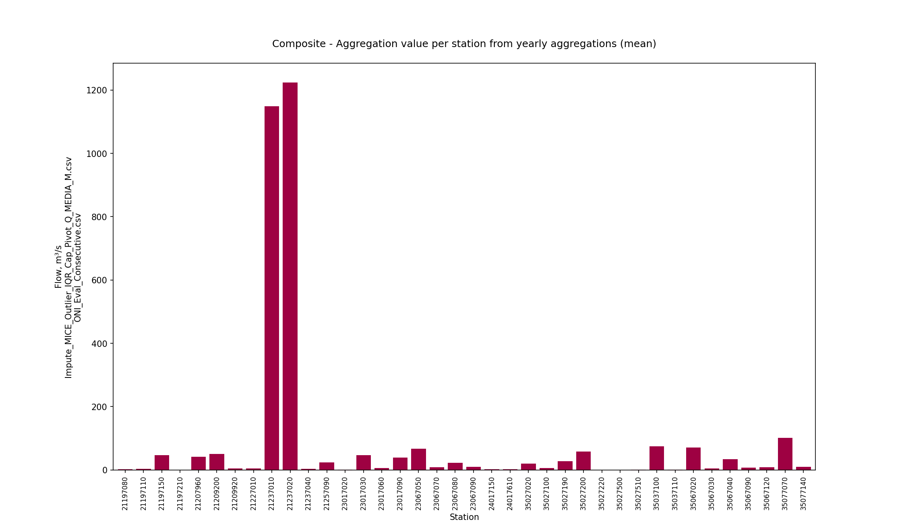
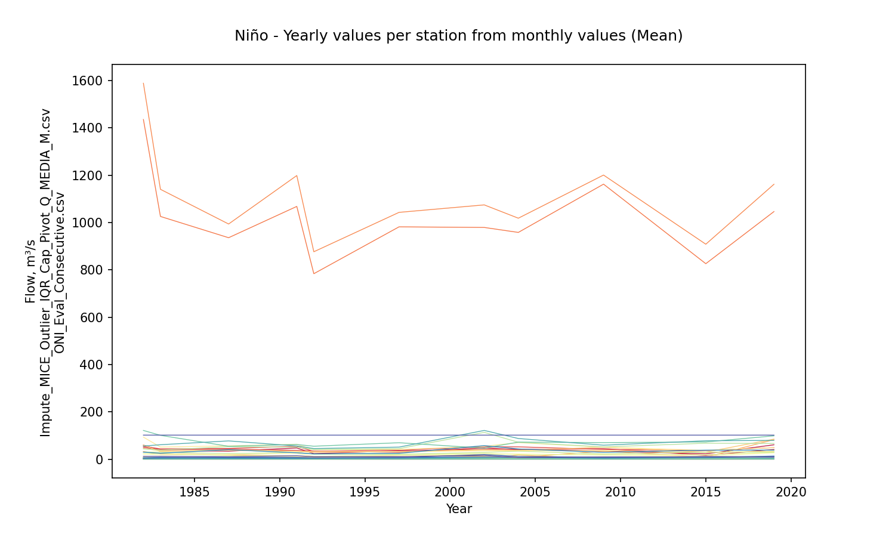
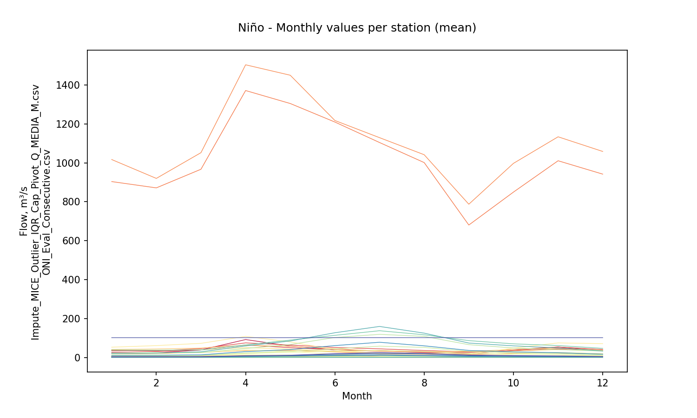

# Statistical aggregations for hydro-climatological composite series and yearly events Niño, Niña and Neutral

For further information about the NOAA - Oceanic Niño Index (ONI) classifier for climatological yearly events Niño, Niña and Neutral, check this activity https://github.com/rcfdtools/R.LTWB/tree/main/Section03/ENSOONI

* Station records file: [Impute_MICE_Outlier_IQR_Cap_Pivot_Q_MEDIA_M.csv](../IDEAM_Impute/Impute_MICE_Outlier_IQR_Cap_Pivot_Q_MEDIA_M.csv)
* ENSO-ONI year file: [ONI_Eval_Consecutive.csv](../ENSOONI/ONI_Eval_Consecutive.csv)
* Stations: 39
* Records: 516
* Daily serie: False
* Aggregation function: Mean
* Execution date: 2023-09-22 10:01:01.048286
* Python version: 3.11.5 (tags/v3.11.5:cce6ba9, Aug 24 2023, 14:38:34) [MSC v.1936 64 bit (AMD64)]
* Python path: ['C:\\JLGC\\R.LTWB\\.src', 'C:\\Python311\\python311.zip', 'C:\\Python311\\DLLs', 'C:\\Python311\\Lib', 'C:\\Python311']
* matplotlib version: 3.6.0
* pandas version: 2.1.0
* Instructions & script: https://github.com/rcfdtools/R.LTWB/tree/main/Section03/Agg
* License: https://github.com/rcfdtools/R.LTWB/blob/main/LICENSE.md
* Credits: r.cfdtools@gmail.com

## Composite - Yearly values per station from monthly values (Mean)

|   Year |   21197080 |   21197110 |   21197150 |   21197210 |   21207960 |   21209200 |   21209920 |   21227010 |   21237010 |   21237020 |   21237040 |   21257090 |   23017020 |   23017030 |   23017060 |   23017090 |   23067050 |   23067070 |   23067080 |   23067090 |   24017150 |   24017610 |   35027020 |   35027100 |   35027190 |   35027200 |   35027220 |   35027500 |   35027510 |   35037100 |   35037110 |   35067020 |   35067030 |   35067040 |   35067090 |   35067120 |   35077070 |   35077140 |
|-------:|-----------:|-----------:|-----------:|-----------:|-----------:|-----------:|-----------:|-----------:|-----------:|-----------:|-----------:|-----------:|-----------:|-----------:|-----------:|-----------:|-----------:|-----------:|-----------:|-----------:|-----------:|-----------:|-----------:|-----------:|-----------:|-----------:|-----------:|-----------:|-----------:|-----------:|-----------:|-----------:|-----------:|-----------:|-----------:|-----------:|-----------:|-----------:|
|   1980 |   1.1619   |    2.77842 |    29.0239 |  0.0110819 |    31.4375 |    48.2257 |    5.89034 |    3.05792 |    940.333 |   1009.33  |   1.8595   |   14.458   |   0.33825  |    34.7708 |    4.06268 |    34.1763 |    38.5442 |    5.2098  |    11.6771 |   11.8357  |  11.3789   |   1.03842  |    18.7847 |    4.76417 |    28.7115 |    45.6393 |  0.112199  |  0.0775537 |   0.811227 |   111.453  |   0.280917 |    39.2525 |    4.31658 |    23.4215 |    4.72725 |    4.88567 |   123.566  |   11.1058  |
|   1981 |   1.89197  |    3.15575 |    44.3833 |  0.0972657 |    41.5367 |    62.2654 |    5.45656 |    5.5285  |   1174.9   |   1302.93  |   4.84483  |   31.107   |   0.452167 |    54.7417 |    5.37216 |    38.9038 |    74.8933 |    9.13075 |    24.8978 |   11.6473  |   7.4866   |   1.45208  |    15.4483 |    6.88083 |    25.0263 |    41.6483 |  0.107392  |  0.0843296 |   0.958449 |    92.4492 |   0.36525  |    47.8916 |    4.25442 |    23.9938 |    5.28167 |    5.70825 |    57.7934 |   10.3601  |
|   1982 |   2.20127  |    4.0195  |    59.4067 |  0.0970087 |    49.115  |    68.6958 |    5.51345 |    5.88483 |   1435.27  |   1588.42  |   5.02467  |   33.8848  |   0.514    |    59.6542 |    6.12135 |    44.0794 |    93.0258 |    8.47875 |    22.4872 |    9.48842 |   7.60558  |   1.88008  |    22.15   |    4.9475  |    30.2248 |    43.2763 |  0.129539  |  0.0774643 |   0.835312 |   121.252  |   0.354083 |    55.415  |    4.0235  |    29.3952 |    6.11633 |    4.02917 |    60.7053 |   12.2021  |
|   1983 |   1.40443  |    2.45392 |    36.5575 |  0.131708  |    40.5858 |    49.5805 |    5.08203 |    4.58883 |   1025.54  |   1140.24  |   2.72958  |   11.2019  |   0.484    |    32.1917 |    4.39971 |    35.8597 |    51.0465 |    6.71392 |    17.2623 |    6.91558 |   0.933417 |   1.11058  |    24.1017 |    5.39083 |    29.1389 |    39.05   |  0.118132  |  0.0873563 |   0.871238 |   100.588  |   0.33825  |    60.9033 |    3.65308 |    24.9558 |    7.6745  |    5.67293 |   137.497  |   11.9754  |
|   1984 |   2.30342  |    3.929   |    48.875  |  0.287032  |    38.9725 |    75.0607 |    4.66904 |    5.6     |   1420.23  |   1612.81  |   9.32183  |   33.084   |   0.62975  |    59.0545 |    6.74388 |    43.7833 |    97.8433 |   13.4517  |    28.6275 |   12.1184  |   0.713417 |   0.748417 |    21.1017 |    4.4975  |    27.5153 |    47.1292 |  0.118079  |  0.0464377 |   0.690884 |    81.535  |   0.429    |    59.5908 |    4.03817 |    25.6826 |    5.48158 |    4.97488 |    59.8748 |    7.79983 |
|   1985 |   1.46187  |    3.681   |    43.6066 |  0.191842  |    33.2092 |    60.4979 |    4.97885 |    4.63292 |   1017.25  |   1102.56  |   5.32067  |   16.3916  |   0.793583 |    38.885  |    4.79973 |    35.7137 |    60.3183 |    8.8465  |    16.4952 |   13.4988  |   1.03342  |   0.861917 |    21.0058 |    2.885   |    23.4093 |    42.3323 |  0.146783  |  0.0545173 |   0.578959 |    81.5967 |   0.275833 |    53.633  |    4.312   |    29.6052 |    5.832   |    6.92404 |   107.727  |    9.67817 |
|   1986 |   2.00085  |    4.66908 |    50.4142 |  0.207763  |    58.4492 |    66.6008 |    4.97298 |    6.89136 |   1366.25  |   1478.82  |   6.21708  |   23.6708  |   0.43675  |    47.9937 |    5.70351 |    42.672  |    69.2208 |    9.51701 |    23.2355 |   14.7503  |   1.23183  |   1.69175  |    21.3135 |    5.32583 |    29.4441 |    53.1658 |  0.192322  |  0.0729174 |   0.865983 |    87.5541 |   0.23125  |    77.839  |    3.58017 |    38.3942 |    6.25342 |   10.0858  |    93.8217 |   11.6138  |
|   1987 |   1.42598  |    3.30692 |    33.6083 |  0.177131  |    42.225  |    53.5511 |    4.79943 |    4.27    |    935.667 |    993.575 |   4.79236  |   18.8411  |   0.316833 |    40.1058 |    4.4181  |    34.1066 |    56.2208 |    6.95962 |    19.8433 |    6.13667 |   1.235    |   1.20583  |    19.3347 |    3.59417 |    23.5791 |    52.5217 |  0.201167  |  0.0652957 |   0.688775 |    80.3477 |   0.325    |    76.9887 |    3.07083 |    40.1167 |    5.73583 |    9.32506 |    94.8618 |   10.2316  |
|   1988 |   1.87186  |    4.42783 |    42.4592 |  0.195     |    43.5567 |    67.5709 |    5.75344 |    6.83408 |   1190.9   |   1327.11  |   5.54683  |   27.6117  |   0.345    |    52.5354 |    4.31334 |    39.2078 |    82.8267 |    9.12717 |    24.7369 |    7.78008 |   1.04533  |   0.981167 |    26.0102 |    3.63917 |    24.4146 |    36.675  |  0.0858333 |  0.119665  |   0.600539 |   150.491  |   0.397667 |    53.9826 |    2.5315  |    27.4753 |    4.38625 |    5.50296 |   107.275  |   21.5267  |
|   1989 |   1.80976  |    3.70808 |    35.475  |  0.534735  |    35.9342 |    62.5315 |    4.6799  |    5.58175 |   1231.44  |   1371.26  |   4.39617  |   30.2025  |   0.397417 |    45.0067 |    6.16761 |    40.0213 |    60.6781 |   11.1348  |    23.4792 |    6.716   |   0.774417 |   0.939583 |    11.9049 |    4.25333 |    22.8622 |    46.8825 |  0.112667  |  0.0486454 |   0.635061 |    52.1821 |   0.414083 |    53.1687 |    3.61517 |    24.1687 |    4.97908 |    6.03447 |    65.084  |    8.16806 |
|   1990 |   1.66669  |    2.29617 |    33.7992 |  0.155015  |    36.265  |    54.4903 |    4.78269 |    3.07683 |   1103.28  |   1221.2   |   3.75     |   11.32    |   0.462417 |    45.95   |    5.58133 |    37.406  |    69.9583 |    8.19817 |    20.0773 |    9.51939 |   0.883833 |   1.12592  |    12.8933 |    4.48833 |    24.545  |    48.0733 |  0.119333  |  0.0671134 |   0.756915 |    57.5727 |   0.34275  |    56.3427 |    3.62008 |    25.9511 |    4.82958 |    6.24174 |    67.6483 |    9.00146 |
|   1991 |   1.66598  |    2.80425 |    47.2628 |  0.122038  |    37.1183 |    52.9348 |    5.25629 |    4.94617 |   1067.88  |   1198.38  |   2.31392  |   11.6612  |   0.397083 |    33.4875 |    3.42317 |    36.7075 |    62.8567 |    6.00875 |    24.1025 |    9.71861 |   0.766833 |   0.819    |    13.2467 |    4.38    |    27.7669 |    50.8783 |  0.12741   |  0.0947939 |   0.793842 |    81.8386 |   0.31375  |    58.859  |    3.72    |    26.9503 |    4.62575 |    6.23801 |   102.317  |   14.2062  |
|   1992 |   0.946458 |    1.00092 |    23.6588 |  0.136834  |    33.8617 |    36.9037 |    4.93535 |    3.851   |    783.583 |    876.3   |   2.468    |    7.63525 |   0.399333 |    31.63   |    3.98783 |    31.0399 |    39.67   |    3.96183 |    11.6927 |    6.76305 |   0.289    |   0.561083 |    11.2117 |    3.22917 |    21.2066 |    43.3635 |  0.0784167 |  0.0729345 |   0.581487 |    60.9659 |   0.40075  |    49.8735 |    3.64408 |    23.1539 |    4.50867 |    6.30022 |   104.54   |   10.293   |
|   1993 |   1.67888  |    2.4275  |    52.1058 |  0.174271  |    34.465  |    50.0472 |    5.06964 |    4.3345  |   1178.59  |   1206.12  |   4.45802  |   12.2182  |   0.311333 |    33.075  |    4.08175 |    38.9038 |    56.6117 |    5.42392 |    20.4017 |    9.48039 |   0.712833 |   0.888833 |    13.3858 |    4.64167 |    28.3893 |    58.1    |  0.129667  |  0.0753458 |   0.799597 |    63.7846 |   0.407    |    71.4792 |    4.57142 |    33.5413 |    5.55417 |    8.4556  |    96.7545 |   10.6133  |
|   1994 |   1.40067  |    3.40833 |    43.7725 |  0.0751667 |    42.5208 |    63.5064 |    4.84601 |    6.02861 |   1299.74  |   1374.75  |   3.04192  |   20.1659  |   0.424833 |    50.8195 |    5.04975 |    41.3372 |    73.8025 |    9.425   |    20.875  |   10.5346  |   0.985083 |   1.30917  |    15.0741 |    6.8825  |    33.4237 |    53.3008 |  0.146583  |  0.0659732 |   1.1167   |    46.7414 |   0.316917 |    76.2254 |    4.86333 |    33.717  |    5.76083 |    8.28937 |    77.7166 |    7.08333 |
|   1995 |   1.46542  |    3.61917 |    40.85   |  0.0845    |    37.8117 |    53.2315 |    3.96356 |    4.00067 |    982.783 |   1114.53  |   1.80325  |   19.8386  |   0.445667 |    43.9749 |    5.68208 |    35.0441 |    66.0675 |    5.43333 |    18.3275 |    9.70507 |   0.785583 |   0.413083 |    11.0113 |    3.41917 |    24.5675 |    34.7108 |  0.0976667 |  0.0199454 |   0.610483 |    25.8249 |   0.236333 |    52.6943 |    2.67667 |    22.2734 |    4.15083 |    5.92012 |    74.6898 |    3.69333 |
|   1996 |   1.87358  |    3.34583 |    46.0708 |  0.0681667 |    44.1742 |    62.3893 |    4.28322 |    4.84583 |   1239.42  |   1355.04  |   2.429    |   18.8208  |   0.419333 |    39.6984 |    5.9177  |    40.1336 |    70.9333 |   10.9783  |    18.5583 |   10.4688  |   0.936667 |   0.9325   |    13.672  |    4.24667 |    30.1519 |    55.6775 |  0.0953333 |  0.0305315 |   0.745813 |    34.4996 |   0.444667 |    73.1379 |    3.62083 |    32.7642 |    6.61667 |    8.39028 |    77.9346 |    4.7325  |
|   1997 |   1.45833  |    2.125   |    34.9483 |  0.05      |    29.07   |    44.781  |    5.01127 |    4.49494 |    981.592 |   1042.77  |   0.831917 |    8.99358 |   0.31875  |    31.5067 |    4.281   |    34.9771 |    41.036  |    5.55833 |    14.6667 |    7.33229 |   0.65     |   0.941667 |    16.1129 |    3.725   |    20.4782 |    44.3533 |  0.0916667 |  0.0723152 |   0.621367 |    76.1639 |   0.39325  |    48.9359 |    3.975   |    24.249  |    6.60833 |    6.20818 |   116.555  |   10.6083  |
|   1998 |   1.50833  |    2.25    |    40.0964 |  0.0666667 |    32.9575 |    48.869  |    5.0903  |    5.07597 |   1012.61  |   1114.45  |   1.89058  |   16.2651  |   0.88475  |    39.01   |    5.40583 |    35.6237 |    53.0417 |    5.14167 |    19.7333 |    8.55727 |   1.225    |   1.05     |    16.4345 |    4.70368 |    28.082  |    62.0592 |  0.0583333 |  0.06376   |   0.788826 |    61.9485 |   0.409    |    71.4604 |    5.10833 |    33.91   |    5.65    |    8.65559 |    83.7763 |    8.55833 |
|   1999 |   3.30416  |    3.59183 |    56.1417 |  0.0868333 |    41.7292 |    95.9107 |    4.19824 |    7.05642 |   1522.52  |   1668.42  |   4.62425  |   33.4846  |   1.34733  |    59.0474 |    9.062   |    45.813  |    83.9817 |   32.3545  |    26.739  |   11.9885  |   1.87292  |   1.53475  |    13.2893 |    4.06983 |    29.4952 |    75.5517 |  0.14175   |  0.0226128 |   0.713965 |    37.5388 |   0.352167 |    83.7328 |    3.88683 |    40.2642 |   22.7847  |    9.87323 |    26.6576 |    3.17708 |
|   2000 |   1.66992  |    3.33617 |    43.405  |  0.0788149 |    39.2833 |    55.9799 |    4.8375  |    7.53617 |   1321.75  |   1439.51  |   1.72967  |   22.0745  |   0.88075  |    54.3938 |    7.29983 |    41.7787 |    56.5075 |    7.46725 |    18.6451 |    9.34524 |   1.07675  |   1.17283  |    16.4407 |    4.93333 |    26.7643 |    72.1308 |  0.117667  |  0.0620649 |   0.79083  |    61.2336 |   0.324917 |    75.1843 |    4.21008 |    36.7604 |    3.70283 |    9.20642 |    46.914  |    8.50641 |
|   2001 |   1.34408  |    1.98233 |    33.4836 |  0.047584  |    24.1625 |    48.6821 |    4.84566 |    6.20908 |    906.633 |    980.583 |   1.08355  |    8.71967 |   1.11959  |    36.4992 |    4.52717 |    33.4906 |    53.9567 |    6.69125 |    17.8957 |    7.94313 |   0.544083 |   0.738167 |    15.1484 |    4.17917 |    23.1958 |    70.3292 |  0.07325   |  0.0609796 |   0.695217 |    57.6005 |   0.374299 |    68.084  |    4.32    |    33.6314 |    3.62747 |    8.66746 |    82.3506 |    8.14504 |
|   2002 |   1.50733  |    2.53733 |    42.3352 |  0.099926  |    47.1996 |    53.2471 |    5.39649 |    5.8709  |    979.05  |   1074.36  |   1.39433  |   11.7578  |   0.909083 |    40.2175 |    4.90656 |    34.9413 |    54.3958 |    5.78667 |    20.3883 |    9.29878 |   0.891667 |   1.57825  |    18.257  |    6.57225 |    27.7899 |   113.172  |  0.15625   |  0.0855754 |   1.08482  |    46.3349 |   0.421999 |   102.504  |    6.29317 |    51.2892 |    7.26661 |   13.4006  |    55.5849 |    9.0108  |
|   2003 |   1.34164  |    3.32342 |    42.7891 |  0.100513  |    34.3617 |    51.6744 |    5.02313 |    5.46258 |    853.667 |    953.217 |   1.26267  |   10.9827  |  16.0953   |    39.3845 |    3.81963 |    32.4481 |    52.9717 |    4.093   |    17.9697 |    8.77991 |   0.652917 |   1.74167  |    17.0342 |    4.9355  |    25.7807 |    85.2854 |  0.09575   |  0.0645787 |   0.821423 |    64.782  |   0.373248 |    81.0805 |    4.89633 |    40.8788 |    4.99375 |   10.3531  |    71.7642 |    8.91834 |
|   2004 |   1.85156  |    3.05875 |    42.5859 |  0.0967279 |    39.3068 |    60.8506 |    5.31598 |    4.39425 |    958.058 |   1018.12  |   1.31158  |    7.11858 |  17.4103   |    37.1092 |    4.52221 |    34.5087 |    69.8142 |    6.71003 |    20.9381 |    9.96815 |   0.798917 |   2.79688  |    16.3928 |    7.1634  |    33.7492 |    59.815  |  0.134768  |  0.0721468 |   1.22332  |    46.7526 |   0.438615 |    82.224  |    7.00717 |    37.2483 |    6.65783 |    9.37324 |    87.8552 |    6.57576 |
|   2005 |   1.60723  |    3.11275 |    41.0978 |  0.133282  |    33.1625 |    65.3628 |    5.30075 |    4.84617 |   1019.63  |   1129.77  |   2.79719  |   24.5719  |   0.590167 |    43.389  |    5.26683 |    35.7959 |    84.205  |    8.56675 |    22.0931 |   10.7516  |   0.8265   |   2.51967  |    15.3849 |    6.23492 |    23.4327 |    56.2771 |  0.0731667 |  0.0761383 |   0.953976 |    64.4383 |   0.370062 |    60.4573 |    6.01617 |    29.7305 |    8.65925 |    6.72066 |    72.8888 |    8.73908 |
|   2006 |   2.18659  |    3.63567 |    61.3679 |  0.148798  |    54.1175 |    70.526  |    5.63323 |    4.19725 |   1194.76  |   1304.62  |   4.02079  |   20.4038  |   0.35525  |    48.9428 |    4.72076 |    39.2616 |    95.5715 |    9.00558 |    28.0342 |   13.421   |   1.6385   |   4.36663  |    20.5132 |    9.22717 |    28.0903 |    63.685  |  0.106486  |  0.122037  |   1.31423  |    99.107  |   0.376371 |    70.1601 |    5.5995  |    35.7485 |    8.53958 |    7.30636 |    73.0319 |   13.5628  |
|   2007 |   1.55725  |    2.88308 |    48.9549 |  0.141738  |   109.864  |    66.6131 |    5.31063 |    6.68933 |   1152.02  |   1272.53  |   3.06025  |   21.5302  |   0.46475  |    48.2372 |    5.41642 |    38.4135 |    68.374  |   13.8396  |    24.5942 |   12.9143  |   0.84275  |   1.69983  |    20.0262 |    4.12975 |    28.1168 |    58.9698 |  0.0469167 |  0.0769483 |   0.698489 |    88.4157 |   0.384022 |    70.1885 |    4.71633 |    35.0345 |    6.08808 |    8.01266 |    74.8633 |   12.3962  |
|   2008 |   2.89892  |    5.19175 |    74.461  |  0.123621  |    62.0717 |    78.9723 |    5.1835  |    7.19208 |   1554.33  |   1665.17  |   2.93917  |   33.9169  |   2.21869  |    55.2411 |    6.78867 |    46.4511 |    83.9367 |   13.1855  |    33.0283 |   13.7166  |   1.24317  |   3.117    |    20.379  |    5.43092 |    31.287  |    58.8131 |  0.101667  |  0.073413  |   0.804332 |    85.7303 |   0.410123 |    75.8495 |    4.85533 |    37.0485 |    6.44408 |    8.06726 |    53.1789 |   11.9118  |
|   2009 |   1.48875  |    1.76808 |    33.7359 |  0.136244  |    44.8042 |    49.1306 |    4.82447 |    3.6935  |   1162.02  |   1200.42  |   2.83342  |   33.6583  |   0.68175  |    38.7473 |    5.19617 |    38.855  |    50.5467 |    8.8139  |    17.0047 |    8.50433 |   0.738167 |   1.36442  |    15.4286 |    5.33092 |    21.9016 |    51.4826 |  0.0760833 |  0.067431  |   0.656167 |    66.951  |   0.315139 |    55.2563 |    3.70483 |    27.0794 |    6.03525 |    6.87683 |    89.2266 |    9.30983 |
|   2010 |   1.69833  |    3.06217 |    62.4657 |  0.124363  |    50.7884 |    63.4724 |    4.55956 |    6.62292 |   1258.52  |   1273.94  |   2.67833  |   37.9263  |   0.6585   |    49.2349 |    6.97842 |    40.3861 |    81.895  |   10.8903  |    26.6993 |   12.4526  |   1.286    |   4.6683   |    16.9646 |    6.45746 |    29.6782 |    50.6149 |  0.0781667 |  0.0568176 |   0.8665   |    49.5067 |   0.397576 |    71.4775 |    3.42533 |    32.5711 |    5.6555  |    7.77161 |    61.1681 |    8.57692 |
|   2011 |   4.07117  |    7.12117 |    83.2479 |  0.166108  |    60.4738 |    98.1815 |    5.49172 |    6.94392 |   1689.85  |   1755.86  |   5.70382  |   39.4667  |   0.734917 |    57.491  |    6.14908 |    49.1615 |   127.708  |   14.42    |    33.0129 |   17.0661  |   2.47491  |   8.19997  |    22.4744 |    6.93877 |    31.1191 |    61.9108 |  0.08225   |  0.0866848 |   0.934904 |   112.232  |   0.397818 |    72.4889 |    4.4938  |    36.9555 |    6.24933 |    6.39236 |    62.1047 |   15.487   |
|   2012 |   2.4025   |    3.72525 |    63.4407 |  0.0983267 |    42.1551 |    60.3513 |    5.22657 |    4.27274 |   1184.38  |   1120.24  |   1.82083  |   23.8007  |   0.588417 |    39.9239 |    5.81225 |    39.0604 |    78.2054 |    5.68333 |    19.0567 |   11.8559  |   1.32858  |   2.39513  |    21.5036 |    9.80117 |    31.9856 |    64.4074 |  0.0986667 |  0.118426  |   1.36298  |    95.2465 |   0.374688 |    79.1373 |    4.24767 |    39.0435 |    8.35517 |    8.67925 |    94.9517 |   13.154   |
|   2013 |   1.522    |    2.2837  |    45.8842 |  0.103362  |    33.7599 |    47.8613 |    4.32646 |    5.31825 |   1077.13  |   1029.13  |   1.44958  |   21.174   |   0.333417 |    43.476  |    5.97475 |    36.9251 |    58.0483 |    6.99541 |    23.0129 |    9.31991 |   0.675463 |   0.952    |    15.6448 |    8.00842 |    24.0178 |    56.1163 |  0.0733333 |  0.0847698 |   1.02912  |    63.6462 |   0.317889 |    62.1974 |    2.2525  |    30.3144 |    8.83566 |    7.55263 |    75.0006 |    8.62825 |
|   2014 |   1.73233  |    2.46378 |    54.1208 |  0.145882  |    21.016  |    48.0191 |    4.86219 |    7.35707 |   1176.23  |   1186.6   |   3.17414  |   18.3081  |   0.800333 |    45.7554 |    6.26542 |    38.8819 |    67.9892 |    2.79559 |    24.4527 |    9.9908  |   0.467333 |   0.879    |    17.5815 |    5.85551 |    26.0651 |    57.9303 |  0.0765833 |  0.0809044 |   0.874358 |    72.2452 |   0.372531 |    67.1927 |    4.04994 |    32.9058 |    6.77258 |    7.80648 |    73.9622 |   10.1205  |
|   2015 |   0.841417 |    1.33395 |    22.6016 |  0.106433  |    15.9128 |    42.6721 |    5.57135 |    4.0583  |    825.942 |    951.35  |   1.25949  |    8.289   |   0.392667 |    33.5185 |    3.78658 |    31.8837 |    38.531  |    4.22603 |    12.6303 |    5.9279  |   0.41225  |   0.762    |    18.2881 |    5.96475 |    29.6302 |    60.0209 |  0.0684167 |  0.0909013 |   0.982471 |    71.2313 |   0.392823 |    73.9111 |    6.2045  |    34.8194 |    6.42594 |    9.13172 |   105.378  |   10.2133  |
|   2016 |   1.7366   |    1.81112 |    44.6522 |  0.110333  |    37.689  |    52.7259 |    6.21215 |    1.96327 |    943.6   |   1144.4   |   1.61536  |   12.5172  |   2.58959  |    37.0673 |    2.99924 |    34.2403 |    65.2276 |    5.99948 |    18.3861 |    9.7126  |   0.373196 |   0.807791 |    22.3101 |    4.68769 |    35.3147 |    67.6056 |  0.0606703 |  0.0526976 |   0.712155 |    87.966  |   0.457195 |    89.3366 |    9.99476 |    43.0157 |    8.02841 |   10.2646  |   101.068  |   12.4643  |
|   2017 |   1.47428  |    2.86243 |    73.2818 |  0.135     |    52.2043 |    71.3289 |    5.07254 |    3.19109 |   1355.71  |   1329.32  |   3.15362  |   23.6886  |   1.0201   |    49.2749 |    4.89686 |    42.4696 |    83.8356 |   10.1237  |    29.7336 |   13.2601  |   1.45874  |   1.41119  |    15.2319 |    6.4766  |    28.5565 |    60.6017 |  0.0801955 |  0.0393082 |   0.911499 |    42.9196 |   0.38934  |    77.8995 |    6.39351 |    37.2867 |    6.5785  |    9.08121 |    56.6857 |    5.16675 |
|   2018 |   2.15659  |    3.12026 |    68.3027 |  0.103116  |    48.1898 |    64.756  |    5.86029 |    3.53528 |   1165.14  |   1366.58  |   2.05763  |   23.2141  |   0.424406 |    49.1539 |    5.23282 |    38.6859 |    69.69   |   10.4984  |    29.7474 |   11.8602  |   1.5394   |   1.37232  |    20.757  |    6.72035 |    33.0498 |    69.6454 |  0.130374  |  0.0916973 |   1.13698  |    84.5945 |   0.408987 |    86.1574 |    6.62847 |    42.387  |   11.8312  |    9.94235 |    64.0196 |   11.0545  |
|   2019 |   1.5591   |    2.37079 |    60.6035 |  0.0851774 |    44.0622 |    48.7343 |    4.49637 |    4.69188 |   1046.16  |   1529.43  |   0.765132 |   82.4378  |   0.357101 |    44.806  |    4.48741 |    36.5396 |    48.4723 |    4.58768 |    26.3354 |    9.89064 |   0.820849 |   2.01507  |    17.8835 |    3.9742  |    26.6501 |    68.6365 |  0.22083   |  0.127234  |   1.11799  |    72.9096 |   0.361295 |    75.1277 |    5.13567 |    37.671  |   13.0998  |    9.50263 |    71.834  |    9.34433 |
|   2020 |   1.22918  |    2.32    |    37.0509 |  0.102007  |    34.348  |    40.7068 |    5.00655 |    3.35733 |    871.93  |   1317.6   |   1.17656  |   68.0387  |   0.262491 |    34.2118 |    3.47946 |    33.0189 |    17.1203 |    3.55806 |    14.4101 |    6.0477  |   0.430097 |   0.980833 |    15.8325 |    5.34184 |    25.4768 |    58.2399 |  0.20857   |  0.0783609 |   1.04592  |    55.8475 |   0.339633 |    68.4122 |    4.48624 |    32.5839 |    5.85934 |    9.2996  |    96.9842 |    7.67881 |
|   2021 |   2.16712  |    4.54054 |    67.371  |  0.107925  |    51.2971 |    63.0618 |    4.95449 |    4.95056 |   1392.53  |   1383.53  |   2.31492  |   22.8728  |   0.288236 |    48.2508 |    5.15876 |    43.195  |    58.3609 |    8.92868 |    27.519  |   11.1912  |   1.63884  |   2.07184  |    18.6042 |    5.44509 |    29.8855 |    60.8368 |  0.279085  |  0.0681596 |   0.933508 |    73.1639 |   0.378255 |    75.9478 |    4.56949 |    36.8355 |    6.3892  |    8.92057 |    65.3392 |    9.76991 |
|   2022 |   2.22871  |    4.08517 |    62.9935 |  0.13152   |    49.9636 |    70.4321 |    5.50837 |    5.58295 |   1387.07  |   1372.42  |   4.18239  |   23.9478  |   0.328599 |    49.7735 |    6.49615 |    43.089  |    80.1374 |   10.4525  |    25.9089 |   12.3517  |   3.23186  |   1.92765  |    17.4907 |    6.79391 |    28.5378 |    56.8611 |  0.124028  |  0.0783085 |   1.06475  |    75.2208 |   0.385245 |    69.4332 |    5.13753 |    33.9024 |    7.17267 |    7.61963 |    61.7732 |    9.43398 |

Composite - Aggregation value per station from yearly aggregations (mean)

|              |   21197080 |   21197110 |   21197150 |   21197210 |   21207960 |   21209200 |   21209920 |   21227010 |   21237010 |   21237020 |   21237040 |   21257090 |   23017020 |   23017030 |   23017060 |   23017090 |   23067050 |   23067070 |   23067080 |   23067090 |   24017150 |   24017610 |   35027020 |   35027100 |   35027190 |   35027200 |   35027220 |   35027500 |   35027510 |   35037100 |   35037110 |   35067020 |   35067030 |   35067040 |   35067090 |   35067120 |   35077070 |   35077140 |
|:-------------|-----------:|-----------:|-----------:|-----------:|-----------:|-----------:|-----------:|-----------:|-----------:|-----------:|-----------:|-----------:|-----------:|-----------:|-----------:|-----------:|-----------:|-----------:|-----------:|-----------:|-----------:|-----------:|-----------:|-----------:|-----------:|-----------:|-----------:|-----------:|-----------:|-----------:|-----------:|-----------:|-----------:|-----------:|-----------:|-----------:|-----------:|-----------:|
| AggComposite |    1.78545 |    3.13786 |    47.7383 |   0.129694 |    42.2137 |    59.3253 |    5.07099 |    5.08181 |    1148.51 |    1253.44 |    3.05695 |    23.2854 |    1.38658 |    44.1218 |    5.22688 |    38.3486 |    66.2344 |    8.47378 |    21.8468 |    10.2448 |    1.57992 |    1.65173 |     17.513 |    5.36203 |    27.5002 |    57.1576 |   0.115662 |  0.0729091 |   0.862357 |    73.1256 |   0.367209 |    68.1654 |    4.55164 |    32.9936 |    6.76338 |    7.85267 |    79.8773 |      9.879 |

Composite - Aggregation value per station from yearly aggregations (std - standard deviation)

|                 |   21197080 |   21197110 |   21197150 |   21197210 |   21207960 |   21209200 |   21209920 |   21227010 |   21237010 |   21237020 |   21237040 |   21257090 |   23017020 |   23017030 |   23017060 |   23017090 |   23067050 |   23067070 |   23067080 |   23067090 |   24017150 |   24017610 |   35027020 |   35027100 |   35027190 |   35027200 |   35027220 |   35027500 |   35027510 |   35037100 |   35037110 |   35067020 |   35067030 |   35067040 |   35067090 |   35067120 |   35077070 |   35077140 |
|:----------------|-----------:|-----------:|-----------:|-----------:|-----------:|-----------:|-----------:|-----------:|-----------:|-----------:|-----------:|-----------:|-----------:|-----------:|-----------:|-----------:|-----------:|-----------:|-----------:|-----------:|-----------:|-----------:|-----------:|-----------:|-----------:|-----------:|-----------:|-----------:|-----------:|-----------:|-----------:|-----------:|-----------:|-----------:|-----------:|-----------:|-----------:|-----------:|
| StdAggComposite |   0.584371 |    1.08798 |    13.8056 |  0.0795981 |    14.3514 |    12.8264 |   0.468938 |    1.34151 |    209.894 |     214.98 |    1.77277 |    14.6502 |    3.46847 |    8.21577 |    1.18404 |    4.18443 |    19.4565 |    4.71829 |    5.32579 |    2.51025 |    2.13573 |    1.36265 |    3.54065 |    1.52894 |     3.5306 |    13.8903 |  0.0476172 |  0.0233847 |   0.197735 |    24.5933 |  0.0511775 |    12.8651 |    1.36869 |    6.44281 |    3.11816 |    1.85304 |    22.3035 |    3.16956 |

Composite - Monthly values per station (mean)

|   Month |   21197080 |   21197110 |   21197150 |   21197210 |   21207960 |   21209200 |   21209920 |   21227010 |   21237010 |   21237020 |   21237040 |   21257090 |   23017020 |   23017030 |   23017060 |   23017090 |   23067050 |   23067070 |   23067080 |   23067090 |   24017150 |   24017610 |   35027020 |   35027100 |   35027190 |   35027200 |   35027220 |   35027500 |   35027510 |   35037100 |   35037110 |   35067020 |   35067030 |   35067040 |   35067090 |   35067120 |   35077070 |   35077140 |
|--------:|-----------:|-----------:|-----------:|-----------:|-----------:|-----------:|-----------:|-----------:|-----------:|-----------:|-----------:|-----------:|-----------:|-----------:|-----------:|-----------:|-----------:|-----------:|-----------:|-----------:|-----------:|-----------:|-----------:|-----------:|-----------:|-----------:|-----------:|-----------:|-----------:|-----------:|-----------:|-----------:|-----------:|-----------:|-----------:|-----------:|-----------:|-----------:|
|       1 |   1.20338  |    2.41498 |    26.9096 |  0.106433  |    33.8132 |    46.4062 |    3.82691 |    2.6543  |    861.206 |    949.679 |   1.81131  |    16.477  |   0.960815 |    37.4061 |    5.43195 |    32.5785 |    57.5003 |    7.28335 |   17.6193  |    8.33069 |   0.826299 |   0.653066 |    7.60603 |    1.79712 |    9.80103 |    29.7324 |  0.0395622 |  0.0167235 |   0.233764 |    31.2377 |   0.195052 |    24.7346 |    1.62312 |    12.2608 |    2.1025  |    3.51926 |    84.9971 |    4.09279 |
|       2 |   1.33131  |    2.70883 |    30.5982 |  0.118012  |    33.8781 |    50.4824 |    3.87657 |    3.56516 |    896.449 |    983.327 |   2.6994   |    18.1403 |   1.29985  |    38.3362 |    5.34616 |    33.1854 |    61.7635 |    8.64306 |   17.9001  |    8.44527 |   1.09794  |   0.549658 |    7.56504 |    1.96987 |    9.59065 |    32.2346 |  0.0467582 |  0.0182863 |   0.246284 |    32.8527 |   0.176302 |    26.0537 |    1.65023 |    13.1644 |    2.56121 |    3.67013 |    82.1886 |    4.28231 |
|       3 |   1.85723  |    3.52071 |    44.5363 |  0.135403  |    41.537  |    61.1814 |    4.05451 |    5.119   |   1110.71  |   1202.94  |   3.41675  |    23.5208 |   1.35498  |    47.148  |    5.43562 |    37.5535 |    81.4879 |   10.1744  |   26.1582  |   11.071   |   1.3688   |   1.10981  |    8.86215 |    2.75368 |   12.1154  |    35.785  |  0.0559439 |  0.02202   |   0.33948  |    40.1668 |   0.205414 |    33.9892 |    2.15251 |    16.9633 |    4.94414 |    3.99793 |    61.1838 |    5.15125 |
|       4 |   2.47168  |    4.71092 |    76.9046 |  0.180134  |    50.4248 |    79.9727 |    4.75095 |    8.72936 |   1405.58  |   1535.6   |   6.14257  |    30.0746 |   1.4579   |    58.7278 |    6.12673 |    43.3201 |   110.186  |   12.5449  |   36.666   |   15.2345  |   2.03104  |   2.08149  |   14.9789  |    4.79475 |   20.689   |    51.9847 |  0.0875294 |  0.0505302 |   0.676765 |    65.9297 |   0.364196 |    56.9509 |    4.14211 |    29.2635 |    6.30921 |    5.84145 |    42.985  |    8.67616 |
|       5 |   2.53844  |    4.28994 |    73.8382 |  0.154629  |    55.2257 |    77.4311 |    5.51253 |    9.20451 |   1514.94  |   1668.65  |   5.15058  |    37.0555 |   1.87188  |    58.4946 |    6.45076 |    46.1231 |    99.7532 |   10.707   |   33.9572  |   15.4591  |   2.21376  |   2.40286  |   21.065   |    7.90492 |   33.5297  |    71.7698 |  0.151785  |  0.0888169 |   1.18349  |    87.3532 |   0.511397 |    87.9172 |    6.45892 |    43.5031 |    9.6967  |    9.33945 |    43.9575 |   11.462   |
|       6 |   1.8492   |    2.91705 |    48.9538 |  0.0874696 |    44.0569 |    60.5153 |    6.80712 |    5.36181 |   1340.41  |   1422.48  |   1.76996  |    24.4673 |   1.25432  |    40.712  |    4.57372 |    42.2193 |    48.6244 |    6.48088 |   17.8863  |    9.7133  |   1.63784  |   2.02358  |   29.1315  |    9.1859  |   47.3761  |    90.005  |  0.198793  |  0.161585  |   1.70424  |   122.636  |   0.533742 |   118.345  |    8.60395 |    56.5912 |   11.0807  |   13.4758  |    97.8138 |   16.913   |
|       7 |   1.27707  |    1.71706 |    36.9925 |  0.0773014 |    37.4204 |    48.4175 |    7.08347 |    3.39272 |   1212.87  |   1277.28  |   0.9041   |    13.832  |   1.10828  |    31.0505 |    3.46857 |    39.5264 |    28.9997 |    4.72195 |   10.3856  |    6.26456 |   1.28829  |   1.76402  |   30.8407  |    9.56683 |   52.8081  |    94.5541 |  0.225273  |  0.1601    |   1.77083  |   134.411  |   0.519512 |   130.009  |    8.64827 |    61.6572 |   11.0121  |   15.1904  |   126.59   |   18.9672  |
|       8 |   0.980492 |    1.38705 |    30.9667 |  0.113559  |    33.2612 |    40.7024 |    6.26403 |    3.11477 |    977.249 |   1039.08  |   0.850672 |    13.5376 |   1.20377  |    29.2294 |    3.32454 |    34.8228 |    22.5262 |    3.74396 |    8.0316  |    5.30181 |   1.1942   |   1.1747   |   25.9247  |    8.26045 |   44.0533  |    82.2562 |  0.181067  |  0.14722   |   1.40969  |   105      |   0.456247 |   103.317  |    6.78077 |    48.5061 |    8.94189 |   12.5904  |   125.441  |   15.006   |
|       9 |   0.897509 |    1.68106 |    28.5916 |  0.124045  |    30.8816 |    38.751  |    5.30546 |    5.04369 |    817.788 |    919.195 |   1.63488  |    17.9657 |   1.2897   |    32.824  |    3.63474 |    31.4421 |    25.5316 |    4.01019 |    9.50485 |    5.39514 |   1.1738   |   0.909753 |   19.4994  |    5.40133 |   32.055   |    62.3995 |  0.11433   |  0.0791468 |   0.894064 |    77.5396 |   0.416516 |    75.8436 |    4.96169 |    35.65   |    7.8847  |    9.4392  |   109.432  |   10.702   |
|      10 |   2.15093  |    4.04754 |    57.1388 |  0.122619  |    43.9154 |    62.0735 |    4.79863 |    6.20079 |   1052.84  |   1216.58  |   3.3729   |    27.3043 |   1.47411  |    48.4964 |    5.42714 |    36.944  |    66.5164 |    8.93684 |   23.7251  |   11.2212  |   2.09658  |   2.49933  |   17.8414  |    4.82748 |   27.2248  |    52.9695 |  0.106214  |  0.0561728 |   0.751442 |    71.2245 |   0.383873 |    64.1026 |    3.93342 |    31.1513 |    6.39763 |    7.26449 |    72.1051 |    9.25874 |
|      11 |   2.74195  |    4.95448 |    72.2659 |  0.197278  |    57.4307 |    81.0036 |    4.5693  |    5.0317  |   1372.63  |   1518.85  |   5.42392  |    32.9895 |   1.90522  |    59.1777 |    6.7584  |    42.8432 |   107.304  |   12.9221  |   34.0036  |   15.1157  |   2.44786  |   2.85654  |   16.0505  |    4.88293 |   24.5245  |    46.201  |  0.114683  |  0.050029  |   0.728995 |    66.2813 |   0.376172 |    57.5019 |    3.41619 |    28.2569 |    5.95528 |    5.67537 |    48.0181 |    8.66388 |
|      12 |   2.12623  |    3.30474 |    45.1638 |  0.13945   |    44.7194 |    64.9662 |    4.00238 |    3.56397 |   1219.44  |   1307.57  |   3.50635  |    24.0604 |   1.45814  |    47.8593 |    6.74427 |    39.6253 |    84.6194 |   11.5169  |   26.3239  |   11.3851  |   1.58264  |   1.79592  |   10.7907  |    2.99914 |   16.2346  |    35.9994 |  0.0660002 |  0.0242786 |   0.409242 |    42.8752 |   0.268084 |    39.2201 |    2.24845 |    18.9554 |    4.27445 |    4.22815 |    63.8162 |    5.37272 |

Composite - Zonal monthly values (mean)

|   Month |   AggCompositeZonal |
|--------:|--------------------:|
|       1 |             61.2918 |
|       2 |             63.7372 |
|       3 |             77.7389 |
|       4 |            100.201  |
|       5 |            109.666  |
|       6 |             98.9095 |
|       7 |             91.2307 |
|       8 |             74.9036 |
|       9 |             64.1023 |
|      10 |             80.46   |
|      11 |             98.9507 |
|      12 |             84.2962 |

## ENSO-ONI Events - Yearly values per station from monthly values (Mean)

* Records in ENSO-ONI file: 74
* ENSO-ONI eventMark unique values: [-1  1  0]

### Niña events analysis (24 years identified)

|   Id |   YR |   NinaCount |   NinoCount |   NeutralCount | Event   |   EventMark |   EventLabel |
|-----:|-----:|------------:|------------:|---------------:|:--------|------------:|-------------:|
|    0 | 1950 |           7 |           0 |              5 | Niña    |          -1 |            7 |
|    4 | 1954 |           8 |           1 |              3 | Niña    |          -1 |            8 |
|    5 | 1955 |          12 |           0 |              0 | Niña    |          -1 |           12 |
|    6 | 1956 |           8 |           0 |              4 | Niña    |          -1 |            8 |
|   14 | 1964 |           8 |           2 |              2 | Niña    |          -1 |            8 |
|   20 | 1970 |           6 |           1 |              5 | Niña    |          -1 |            6 |
|   21 | 1971 |          12 |           0 |              0 | Niña    |          -1 |           12 |
|   23 | 1973 |           8 |           3 |              1 | Niña    |          -1 |            8 |
|   24 | 1974 |           7 |           0 |              5 | Niña    |          -1 |            7 |
|   25 | 1975 |          12 |           0 |              0 | Niña    |          -1 |           12 |
|   35 | 1985 |           6 |           0 |              6 | Niña    |          -1 |            6 |
|   38 | 1988 |           8 |           2 |              2 | Niña    |          -1 |            8 |
|   39 | 1989 |           5 |           0 |              7 | Niña    |          -1 |            5 |
|   45 | 1995 |           5 |           3 |              4 | Niña    |          -1 |            5 |
|   48 | 1998 |           6 |           4 |              2 | Niña    |          -1 |            6 |
|   49 | 1999 |          12 |           0 |              0 | Niña    |          -1 |           12 |
|   50 | 2000 |          12 |           0 |              0 | Niña    |          -1 |           12 |
|   57 | 2007 |           6 |           1 |              5 | Niña    |          -1 |            6 |
|   58 | 2008 |           6 |           0 |              6 | Niña    |          -1 |            6 |
|   60 | 2010 |           7 |           3 |              2 | Niña    |          -1 |            7 |
|   61 | 2011 |           5 |           0 |              7 | Niña    |          -1 |            5 |
|   66 | 2016 |           5 |           4 |              3 | Niña    |          -1 |            5 |
|   70 | 2020 |           5 |           1 |              6 | Niña    |          -1 |            5 |
|   72 | 2022 |          12 |           0 |              0 | Niña    |          -1 |           12 |

Niña - Table aggregations (Mean)

|   Year |   21197080 |   21197110 |   21197150 |   21197210 |   21207960 |   21209200 |   21209920 |   21227010 |   21237010 |   21237020 |   21237040 |   21257090 |   23017020 |   23017030 |   23017060 |   23017090 |   23067050 |   23067070 |   23067080 |   23067090 |   24017150 |   24017610 |   35027020 |   35027100 |   35027190 |   35027200 |   35027220 |   35027500 |   35027510 |   35037100 |   35037110 |   35067020 |   35067030 |   35067040 |   35067090 |   35067120 |   35077070 |   35077140 |
|-------:|-----------:|-----------:|-----------:|-----------:|-----------:|-----------:|-----------:|-----------:|-----------:|-----------:|-----------:|-----------:|-----------:|-----------:|-----------:|-----------:|-----------:|-----------:|-----------:|-----------:|-----------:|-----------:|-----------:|-----------:|-----------:|-----------:|-----------:|-----------:|-----------:|-----------:|-----------:|-----------:|-----------:|-----------:|-----------:|-----------:|-----------:|-----------:|
|   1985 |    1.46187 |    3.681   |    43.6066 |  0.191842  |    33.2092 |    60.4979 |    4.97885 |    4.63292 |   1017.25  |    1102.56 |    5.32067 |    16.3916 |   0.793583 |    38.885  |    4.79973 |    35.7137 |    60.3183 |    8.8465  |    16.4952 |   13.4988  |   1.03342  |   0.861917 |    21.0058 |    2.885   |    23.4093 |    42.3323 |  0.146783  |  0.0545173 |   0.578959 |    81.5967 |   0.275833 |    53.633  |    4.312   |    29.6052 |    5.832   |    6.92404 |   107.727  |    9.67817 |
|   1988 |    1.87186 |    4.42783 |    42.4592 |  0.195     |    43.5567 |    67.5709 |    5.75344 |    6.83408 |   1190.9   |    1327.11 |    5.54683 |    27.6117 |   0.345    |    52.5354 |    4.31334 |    39.2078 |    82.8267 |    9.12717 |    24.7369 |    7.78008 |   1.04533  |   0.981167 |    26.0102 |    3.63917 |    24.4146 |    36.675  |  0.0858333 |  0.119665  |   0.600539 |   150.491  |   0.397667 |    53.9826 |    2.5315  |    27.4753 |    4.38625 |    5.50296 |   107.275  |   21.5267  |
|   1989 |    1.80976 |    3.70808 |    35.475  |  0.534735  |    35.9342 |    62.5315 |    4.6799  |    5.58175 |   1231.44  |    1371.26 |    4.39617 |    30.2025 |   0.397417 |    45.0067 |    6.16761 |    40.0213 |    60.6781 |   11.1348  |    23.4792 |    6.716   |   0.774417 |   0.939583 |    11.9049 |    4.25333 |    22.8622 |    46.8825 |  0.112667  |  0.0486454 |   0.635061 |    52.1821 |   0.414083 |    53.1687 |    3.61517 |    24.1687 |    4.97908 |    6.03447 |    65.084  |    8.16806 |
|   1995 |    1.46542 |    3.61917 |    40.85   |  0.0845    |    37.8117 |    53.2315 |    3.96356 |    4.00067 |    982.783 |    1114.53 |    1.80325 |    19.8386 |   0.445667 |    43.9749 |    5.68208 |    35.0441 |    66.0675 |    5.43333 |    18.3275 |    9.70507 |   0.785583 |   0.413083 |    11.0113 |    3.41917 |    24.5675 |    34.7108 |  0.0976667 |  0.0199454 |   0.610483 |    25.8249 |   0.236333 |    52.6943 |    2.67667 |    22.2734 |    4.15083 |    5.92012 |    74.6898 |    3.69333 |
|   1998 |    1.50833 |    2.25    |    40.0964 |  0.0666667 |    32.9575 |    48.869  |    5.0903  |    5.07597 |   1012.61  |    1114.45 |    1.89058 |    16.2651 |   0.88475  |    39.01   |    5.40583 |    35.6237 |    53.0417 |    5.14167 |    19.7333 |    8.55727 |   1.225    |   1.05     |    16.4345 |    4.70368 |    28.082  |    62.0592 |  0.0583333 |  0.06376   |   0.788826 |    61.9485 |   0.409    |    71.4604 |    5.10833 |    33.91   |    5.65    |    8.65559 |    83.7763 |    8.55833 |
|   1999 |    3.30416 |    3.59183 |    56.1417 |  0.0868333 |    41.7292 |    95.9107 |    4.19824 |    7.05642 |   1522.52  |    1668.42 |    4.62425 |    33.4846 |   1.34733  |    59.0474 |    9.062   |    45.813  |    83.9817 |   32.3545  |    26.739  |   11.9885  |   1.87292  |   1.53475  |    13.2893 |    4.06983 |    29.4952 |    75.5517 |  0.14175   |  0.0226128 |   0.713965 |    37.5388 |   0.352167 |    83.7328 |    3.88683 |    40.2642 |   22.7847  |    9.87323 |    26.6576 |    3.17708 |
|   2000 |    1.66992 |    3.33617 |    43.405  |  0.0788149 |    39.2833 |    55.9799 |    4.8375  |    7.53617 |   1321.75  |    1439.51 |    1.72967 |    22.0745 |   0.88075  |    54.3938 |    7.29983 |    41.7787 |    56.5075 |    7.46725 |    18.6451 |    9.34524 |   1.07675  |   1.17283  |    16.4407 |    4.93333 |    26.7643 |    72.1308 |  0.117667  |  0.0620649 |   0.79083  |    61.2336 |   0.324917 |    75.1843 |    4.21008 |    36.7604 |    3.70283 |    9.20642 |    46.914  |    8.50641 |
|   2007 |    1.55725 |    2.88308 |    48.9549 |  0.141738  |   109.864  |    66.6131 |    5.31063 |    6.68933 |   1152.02  |    1272.53 |    3.06025 |    21.5302 |   0.46475  |    48.2372 |    5.41642 |    38.4135 |    68.374  |   13.8396  |    24.5942 |   12.9143  |   0.84275  |   1.69983  |    20.0262 |    4.12975 |    28.1168 |    58.9698 |  0.0469167 |  0.0769483 |   0.698489 |    88.4157 |   0.384022 |    70.1885 |    4.71633 |    35.0345 |    6.08808 |    8.01266 |    74.8633 |   12.3962  |
|   2008 |    2.89892 |    5.19175 |    74.461  |  0.123621  |    62.0717 |    78.9723 |    5.1835  |    7.19208 |   1554.33  |    1665.17 |    2.93917 |    33.9169 |   2.21869  |    55.2411 |    6.78867 |    46.4511 |    83.9367 |   13.1855  |    33.0283 |   13.7166  |   1.24317  |   3.117    |    20.379  |    5.43092 |    31.287  |    58.8131 |  0.101667  |  0.073413  |   0.804332 |    85.7303 |   0.410123 |    75.8495 |    4.85533 |    37.0485 |    6.44408 |    8.06726 |    53.1789 |   11.9118  |
|   2010 |    1.69833 |    3.06217 |    62.4657 |  0.124363  |    50.7884 |    63.4724 |    4.55956 |    6.62292 |   1258.52  |    1273.94 |    2.67833 |    37.9263 |   0.6585   |    49.2349 |    6.97842 |    40.3861 |    81.895  |   10.8903  |    26.6993 |   12.4526  |   1.286    |   4.6683   |    16.9646 |    6.45746 |    29.6782 |    50.6149 |  0.0781667 |  0.0568176 |   0.8665   |    49.5067 |   0.397576 |    71.4775 |    3.42533 |    32.5711 |    5.6555  |    7.77161 |    61.1681 |    8.57692 |
|   2011 |    4.07117 |    7.12117 |    83.2479 |  0.166108  |    60.4738 |    98.1815 |    5.49172 |    6.94392 |   1689.85  |    1755.86 |    5.70382 |    39.4667 |   0.734917 |    57.491  |    6.14908 |    49.1615 |   127.708  |   14.42    |    33.0129 |   17.0661  |   2.47491  |   8.19997  |    22.4744 |    6.93877 |    31.1191 |    61.9108 |  0.08225   |  0.0866848 |   0.934904 |   112.232  |   0.397818 |    72.4889 |    4.4938  |    36.9555 |    6.24933 |    6.39236 |    62.1047 |   15.487   |
|   2016 |    1.7366  |    1.81112 |    44.6522 |  0.110333  |    37.689  |    52.7259 |    6.21215 |    1.96327 |    943.6   |    1144.4  |    1.61536 |    12.5172 |   2.58959  |    37.0673 |    2.99924 |    34.2403 |    65.2276 |    5.99948 |    18.3861 |    9.7126  |   0.373196 |   0.807791 |    22.3101 |    4.68769 |    35.3147 |    67.6056 |  0.0606703 |  0.0526976 |   0.712155 |    87.966  |   0.457195 |    89.3366 |    9.99476 |    43.0157 |    8.02841 |   10.2646  |   101.068  |   12.4643  |
|   2020 |    1.22918 |    2.32    |    37.0509 |  0.102007  |    34.348  |    40.7068 |    5.00655 |    3.35733 |    871.93  |    1317.6  |    1.17656 |    68.0387 |   0.262491 |    34.2118 |    3.47946 |    33.0189 |    17.1203 |    3.55806 |    14.4101 |    6.0477  |   0.430097 |   0.980833 |    15.8325 |    5.34184 |    25.4768 |    58.2399 |  0.20857   |  0.0783609 |   1.04592  |    55.8475 |   0.339633 |    68.4122 |    4.48624 |    32.5839 |    5.85934 |    9.2996  |    96.9842 |    7.67881 |
|   2022 |    2.22871 |    4.08517 |    62.9935 |  0.13152   |    49.9636 |    70.4321 |    5.50837 |    5.58295 |   1387.07  |    1372.42 |    4.18239 |    23.9478 |   0.328599 |    49.7735 |    6.49615 |    43.089  |    80.1374 |   10.4525  |    25.9089 |   12.3517  |   3.23186  |   1.92765  |    17.4907 |    6.79391 |    28.5378 |    56.8611 |  0.124028  |  0.0783085 |   1.06475  |    75.2208 |   0.385245 |    69.4332 |    5.13753 |    33.9024 |    7.17267 |    7.61963 |    61.7732 |    9.43398 |

Niña - Aggregation value per station from yearly aggregations (mean)

|         |   21197080 |   21197110 |   21197150 |   21197210 |   21207960 |   21209200 |   21209920 |   21227010 |   21237010 |   21237020 |   21237040 |   21257090 |   23017020 |   23017030 |   23017060 |   23017090 |   23067050 |   23067070 |   23067080 |   23067090 |   24017150 |   24017610 |   35027020 |   35027100 |   35027190 |   35027200 |   35027220 |   35027500 |   35027510 |   35037100 |   35037110 |   35067020 |   35067030 |   35067040 |   35067090 |   35067120 |   35077070 |   35077140 |
|:--------|-----------:|-----------:|-----------:|-----------:|-----------:|-----------:|-----------:|-----------:|-----------:|-----------:|-----------:|-----------:|-----------:|-----------:|-----------:|-----------:|-----------:|-----------:|-----------:|-----------:|-----------:|-----------:|-----------:|-----------:|-----------:|-----------:|-----------:|-----------:|-----------:|-----------:|-----------:|-----------:|-----------:|-----------:|-----------:|-----------:|-----------:|-----------:|
| AggNina |    2.03653 |    3.64918 |    51.1328 |    0.15272 |    47.8343 |    65.4068 |     5.0553 |    5.64784 |    1224.04 |    1352.84 |    3.33338 |    28.8009 |   0.882288 |    47.4364 |    5.78842 |    39.8545 |    70.5586 |    10.8465 |    23.1569 |    10.8466 |    1.26396 |    2.02534 |    17.9696 |    4.83456 |    27.7947 |    55.9541 |   0.104498 |  0.0638887 |   0.774694 |    73.2667 |   0.370115 |    68.6459 |    4.53214 |    33.2549 |    6.92736 |    7.82461 |    73.0903 |    10.0898 |

Niña - Aggregation value per station from yearly aggregations (std - standard deviation)

|            |   21197080 |   21197110 |   21197150 |   21197210 |   21207960 |   21209200 |   21209920 |   21227010 |   21237010 |   21237020 |   21237040 |   21257090 |   23017020 |   23017030 |   23017060 |   23017090 |   23067050 |   23067070 |   23067080 |   23067090 |   24017150 |   24017610 |   35027020 |   35027100 |   35027190 |   35027200 |   35027220 |   35027500 |   35027510 |   35037100 |   35037110 |   35067020 |   35067030 |   35067040 |   35067090 |   35067120 |   35077070 |   35077140 |
|:-----------|-----------:|-----------:|-----------:|-----------:|-----------:|-----------:|-----------:|-----------:|-----------:|-----------:|-----------:|-----------:|-----------:|-----------:|-----------:|-----------:|-----------:|-----------:|-----------:|-----------:|-----------:|-----------:|-----------:|-----------:|-----------:|-----------:|-----------:|-----------:|-----------:|-----------:|-----------:|-----------:|-----------:|-----------:|-----------:|-----------:|-----------:|-----------:|
| StdAggNina |   0.820951 |    1.34083 |    14.6212 |   0.116976 |    20.2184 |    16.4964 |   0.599558 |    1.66314 |    249.171 |    215.207 |    1.59908 |    14.0505 |   0.711243 |    7.96623 |    1.58726 |    4.95393 |    24.1975 |    7.05404 |    5.75962 |    3.08789 |    0.78363 |    2.09639 |    4.30245 |    1.24698 |    3.49518 |    12.3938 |  0.0425958 |  0.0254842 |   0.157295 |    31.9478 |  0.0591039 |    11.4975 |    1.77071 |    5.81502 |    4.70739 |    1.52287 |    24.0744 |    4.64225 |

Niña - Monthly values per station (mean)

|   Month |   21197080 |   21197110 |   21197150 |   21197210 |   21207960 |   21209200 |   21209920 |   21227010 |   21237010 |   21237020 |   21237040 |   21257090 |   23017020 |   23017030 |   23017060 |   23017090 |   23067050 |   23067070 |   23067080 |   23067090 |   24017150 |   24017610 |   35027020 |   35027100 |   35027190 |   35027200 |   35027220 |   35027500 |   35027510 |   35037100 |   35037110 |   35067020 |   35067030 |   35067040 |   35067090 |   35067120 |   35077070 |   35077140 |
|--------:|-----------:|-----------:|-----------:|-----------:|-----------:|-----------:|-----------:|-----------:|-----------:|-----------:|-----------:|-----------:|-----------:|-----------:|-----------:|-----------:|-----------:|-----------:|-----------:|-----------:|-----------:|-----------:|-----------:|-----------:|-----------:|-----------:|-----------:|-----------:|-----------:|-----------:|-----------:|-----------:|-----------:|-----------:|-----------:|-----------:|-----------:|-----------:|
|       1 |    1.15286 |    2.33235 |    19.7166 |  0.0972466 |    33.6336 |    45.6594 |    3.94229 |    2.73607 |    804.679 |    916.081 |    1.66917 |    17.9648 |   0.435934 |    34.4206 |    5.03593 |    31.3785 |    49.883  |    7.94707 |    17.2169 |    7.81615 |   0.662347 |    0.74894 |    8.93864 |    1.55942 |    9.06081 |    29.809  |  0.0332473 |  0.0253099 |   0.194065 |    42.0055 |   0.176669 |    25.1187 |    1.50262 |    12.5276 |    1.73495 |    3.78877 |    97.5411 |    5.58566 |
|       2 |    1.40528 |    3.16353 |    26.14   |  0.106236  |    36.0562 |    52.301  |    4.04177 |    3.83131 |    860.772 |    954.663 |    2.44051 |    18.7029 |   0.56407  |    37.4482 |    4.85131 |    32.1915 |    58.1124 |    9.20057 |    17.6534 |    8.42442 |   0.701682 |    0.71411 |    8.99186 |    1.80611 |    8.99072 |    31.7851 |  0.0423516 |  0.0239222 |   0.204236 |    43.4888 |   0.155135 |    25.7718 |    1.58858 |    12.9971 |    1.95051 |    3.75279 |    91.173  |    5.77855 |
|       3 |    1.90227 |    3.58074 |    41.3907 |  0.13277   |    44.1677 |    63.7799 |    4.27318 |    3.50433 |   1105.65  |   1206.55  |    3.18783 |    26.0623 |   0.578364 |    46.4823 |    5.49546 |    37.359  |    75.8525 |   13.5206  |    24.4754 |   10.5688  |   0.95775  |    1.72563 |   10.5037  |    2.55926 |   12.0268  |    33.789  |  0.0558533 |  0.0275282 |   0.318779 |    52.0917 |   0.17314  |    32.6498 |    2.07987 |    16.792  |    6.24912 |    3.96647 |    68.3981 |    6.57412 |
|       4 |    2.08607 |    4.87523 |    70.0948 |  0.196214  |    46.8358 |    85.1895 |    4.79755 |    8.65413 |   1474.39  |   1639.41  |    6.11317 |    33.4714 |   0.720223 |    60.3248 |    6.05131 |    43.8642 |   112.706  |   15.8996  |    37.4136 |   14.9543  |   1.11363  |    1.70613 |   14.9289  |    3.70829 |   19.6424  |    50.1289 |  0.065796  |  0.0436314 |   0.53222  |    69.2223 |   0.373879 |    53.6919 |    3.92221 |    27.7445 |    5.61578 |    5.4452  |    40.5305 |    9.3419  |
|       5 |    2.18001 |    4.42042 |    67.7083 |  0.164242  |    56.7173 |    74.3898 |    5.43971 |    9.8018  |   1544.99  |   1706.99  |    5.1861  |    41.7056 |   1.99319  |    57.0046 |    5.93756 |    45.7798 |    86.2824 |   11.4327  |    29.4362 |   13.8707  |   1.33309  |    2.66318 |   20.9382  |    6.95623 |   32.9434  |    71.1091 |  0.134882  |  0.0792129 |   1.06705  |    85.2211 |   0.528628 |    88.5327 |    6.15172 |    44.1614 |    8.51459 |    9.896   |    45.3122 |   11.4755  |
|       6 |    1.91769 |    3.75926 |    54.6023 |  0.0988411 |    50.9254 |    65.9153 |    6.36832 |    5.78021 |   1427.03  |   1540.51  |    2.23435 |    30.7429 |   0.505517 |    42.0273 |    4.64682 |    43.8523 |    51.1118 |    8.95848 |    19.0824 |   10.513   |   1.07856  |    2.32785 |   27.3977  |    7.43043 |   48.8575  |    86.0095 |  0.187305  |  0.113667  |   1.3689   |   107.463  |   0.549756 |   117.889  |    8.06886 |    55.8597 |    9.92672 |   13.4418  |    89.6657 |   15.4687  |
|       7 |    1.61131 |    2.08694 |    42.7195 |  0.0823786 |    47.8302 |    54.1012 |    6.38693 |    4.60502 |   1308.53  |   1369.62  |    1.04883 |    20.2313 |   0.33563  |    34.2974 |    3.85046 |    41.3364 |    41.3362 |    7.68201 |    13.6055 |    7.42565 |   1.0017   |    2.51164 |   28.2737  |    7.56043 |   49.2919  |    87.7999 |  0.199835  |  0.12664   |   1.4049   |   110.726  |   0.473423 |   121.417  |    7.28428 |    57.5185 |    9.16977 |   14.1604  |   112.598  |   16.1922  |
|       8 |    1.21852 |    1.90998 |    36.0905 |  0.192769  |    39.6724 |    46.155  |    5.5637  |    4.48448 |    994.974 |   1103.95  |    1.23835 |    20.5591 |   0.54284  |    35.9404 |    4.21952 |    35.0374 |    35.0158 |    6.28613 |    10.4342 |    6.38872 |   0.82758  |    1.10811 |   23.302   |    6.84052 |   40.5238  |    73.6655 |  0.12911   |  0.114197  |   1.16309  |    87.0844 |   0.480021 |    94.5782 |    5.83737 |    43.7401 |    8.94258 |   11.1889  |   104.903  |   12.258   |
|       9 |    1.26395 |    2.21786 |    37.3331 |  0.192568  |    38.6381 |    48.2176 |    5.45734 |    7.26869 |    910.937 |   1052.53  |    2.08374 |    25.6544 |   0.743575 |    37.7842 |    4.86802 |    34.6689 |    38.3863 |    6.96504 |    12.9118 |    6.79332 |   0.865794 |    1.00518 |   19.8236  |    5.43688 |   33.3207  |    60.8367 |  0.10236   |  0.0703847 |   0.875518 |    73.743  |   0.381075 |    78.6747 |    5.66166 |    36.9144 |    9.67771 |    9.56801 |    96.2595 |   10.2915  |
|      10 |    3.18504 |    5.07913 |    65.9905 |  0.124081  |    53.8609 |    75.8255 |    5.19527 |    7.35213 |   1155.12  |   1351.41  |    4.09937 |    33.376  |   0.994395 |    54.3214 |    7.03951 |    39.9898 |    79.5859 |   13.0893  |    28.1813 |   12.5131  |   2.35393  |    2.61132 |   19.3989  |    5.05447 |   30.3574  |    57.0162 |  0.0966759 |  0.0472927 |   0.759401 |    74.8516 |   0.431815 |    72.0748 |    5.3097  |    34.7806 |    7.1967  |    7.79783 |    56.1977 |    9.91558 |
|      11 |    3.51352 |    6.2581  |    89.8745 |  0.284742  |    69.6558 |    97.4974 |    5.06515 |    5.85661 |   1624.25  |   1817.27  |    6.5807  |    41.0313 |   2.24422  |    69.2701 |    8.80808 |    47.8697 |   120.571  |   15.346   |    37.7304 |   17.0552  |   2.60962  |    4.08599 |   19.6557  |    5.68137 |   29.5142  |    51.1326 |  0.135484  |  0.0647672 |   0.933727 |    79.482  |   0.427657 |    68.6058 |    4.59939 |    33.8472 |    7.84597 |    6.36996 |    32.5106 |   10.8775  |
|      12 |    3.00189 |    4.10665 |    61.9334 |  0.160553  |    56.0182 |    75.8502 |    4.13244 |    3.89933 |   1477.17  |   1575.09  |    4.11841 |    36.1086 |   0.929501 |    59.916  |    8.65703 |    44.9262 |    97.86   |   13.8303  |    29.7411 |   13.836   |   1.66179  |    3.09596 |   13.4823  |    3.42131 |   19.0064  |    38.3676 |  0.0710712 |  0.0301105 |   0.474429 |    53.8205 |   0.290184 |    44.7465 |    2.37937 |    22.1757 |    6.30395 |    4.51916 |    41.994  |    7.31831 |

Niña - Zonal monthly values (mean)

|   Month |   AggNinaZonal |
|--------:|---------------:|
|       1 |        59.074  |
|       2 |        62.4207 |
|       3 |        78.1436 |
|       4 |       104.626  |
|       5 |       110.749  |
|       6 |       104.308  |
|       7 |        95.6956 |
|       8 |        76.4884 |
|       9 |        71.5374 |
|      10 |        89.0155 |
|      11 |       116.958  |
|      12 |       100.907  |

### Niño events analysis (19 years identified)

|   Id |   YR |   NinaCount |   NinoCount |   NeutralCount | Event   |   EventMark |   EventLabel |
|-----:|-----:|------------:|------------:|---------------:|:--------|------------:|-------------:|
|    1 | 1951 |           2 |           7 |              3 | Niño    |           1 |            7 |
|    3 | 1953 |           0 |          11 |              1 | Niño    |           1 |           11 |
|    7 | 1957 |           0 |           9 |              3 | Niño    |           1 |            9 |
|    8 | 1958 |           0 |           7 |              5 | Niño    |           1 |            7 |
|   13 | 1963 |           0 |           7 |              5 | Niño    |           1 |            7 |
|   15 | 1965 |           1 |           7 |              4 | Niño    |           1 |            7 |
|   19 | 1969 |           0 |           5 |              7 | Niño    |           1 |            5 |
|   22 | 1972 |           1 |           8 |              3 | Niño    |           1 |            8 |
|   32 | 1982 |           0 |           8 |              4 | Niño    |           1 |            8 |
|   33 | 1983 |           3 |           6 |              3 | Niño    |           1 |            6 |
|   37 | 1987 |           0 |          12 |              0 | Niño    |           1 |           12 |
|   41 | 1991 |           0 |           7 |              5 | Niño    |           1 |            7 |
|   42 | 1992 |           0 |           6 |              6 | Niño    |           1 |            6 |
|   47 | 1997 |           1 |           8 |              3 | Niño    |           1 |            8 |
|   52 | 2002 |           0 |           7 |              5 | Niño    |           1 |            7 |
|   54 | 2004 |           0 |           5 |              7 | Niño    |           1 |            5 |
|   59 | 2009 |           3 |           5 |              4 | Niño    |           1 |            5 |
|   65 | 2015 |           0 |          10 |              2 | Niño    |           1 |           10 |
|   69 | 2019 |           0 |           5 |              7 | Niño    |           1 |            5 |

Niño - Table aggregations (Mean)

|   Year |   21197080 |   21197110 |   21197150 |   21197210 |   21207960 |   21209200 |   21209920 |   21227010 |   21237010 |   21237020 |   21237040 |   21257090 |   23017020 |   23017030 |   23017060 |   23017090 |   23067050 |   23067070 |   23067080 |   23067090 |   24017150 |   24017610 |   35027020 |   35027100 |   35027190 |   35027200 |   35027220 |   35027500 |   35027510 |   35037100 |   35037110 |   35067020 |   35067030 |   35067040 |   35067090 |   35067120 |   35077070 |   35077140 |
|-------:|-----------:|-----------:|-----------:|-----------:|-----------:|-----------:|-----------:|-----------:|-----------:|-----------:|-----------:|-----------:|-----------:|-----------:|-----------:|-----------:|-----------:|-----------:|-----------:|-----------:|-----------:|-----------:|-----------:|-----------:|-----------:|-----------:|-----------:|-----------:|-----------:|-----------:|-----------:|-----------:|-----------:|-----------:|-----------:|-----------:|-----------:|-----------:|
|   1982 |   2.20127  |    4.0195  |    59.4067 |  0.0970087 |    49.115  |    68.6958 |    5.51345 |    5.88483 |   1435.27  |   1588.42  |   5.02467  |   33.8848  |   0.514    |    59.6542 |    6.12135 |    44.0794 |    93.0258 |    8.47875 |    22.4872 |    9.48842 |   7.60558  |   1.88008  |    22.15   |    4.9475  |    30.2248 |    43.2763 |  0.129539  |  0.0774643 |   0.835312 |   121.252  |   0.354083 |    55.415  |    4.0235  |    29.3952 |    6.11633 |    4.02917 |    60.7053 |   12.2021  |
|   1983 |   1.40443  |    2.45392 |    36.5575 |  0.131708  |    40.5858 |    49.5805 |    5.08203 |    4.58883 |   1025.54  |   1140.24  |   2.72958  |   11.2019  |   0.484    |    32.1917 |    4.39971 |    35.8597 |    51.0465 |    6.71392 |    17.2623 |    6.91558 |   0.933417 |   1.11058  |    24.1017 |    5.39083 |    29.1389 |    39.05   |  0.118132  |  0.0873563 |   0.871238 |   100.588  |   0.33825  |    60.9033 |    3.65308 |    24.9558 |    7.6745  |    5.67293 |   137.497  |   11.9754  |
|   1987 |   1.42598  |    3.30692 |    33.6083 |  0.177131  |    42.225  |    53.5511 |    4.79943 |    4.27    |    935.667 |    993.575 |   4.79236  |   18.8411  |   0.316833 |    40.1058 |    4.4181  |    34.1066 |    56.2208 |    6.95962 |    19.8433 |    6.13667 |   1.235    |   1.20583  |    19.3347 |    3.59417 |    23.5791 |    52.5217 |  0.201167  |  0.0652957 |   0.688775 |    80.3477 |   0.325    |    76.9887 |    3.07083 |    40.1167 |    5.73583 |    9.32506 |    94.8618 |   10.2316  |
|   1991 |   1.66598  |    2.80425 |    47.2628 |  0.122038  |    37.1183 |    52.9348 |    5.25629 |    4.94617 |   1067.88  |   1198.38  |   2.31392  |   11.6612  |   0.397083 |    33.4875 |    3.42317 |    36.7075 |    62.8567 |    6.00875 |    24.1025 |    9.71861 |   0.766833 |   0.819    |    13.2467 |    4.38    |    27.7669 |    50.8783 |  0.12741   |  0.0947939 |   0.793842 |    81.8386 |   0.31375  |    58.859  |    3.72    |    26.9503 |    4.62575 |    6.23801 |   102.317  |   14.2062  |
|   1992 |   0.946458 |    1.00092 |    23.6588 |  0.136834  |    33.8617 |    36.9037 |    4.93535 |    3.851   |    783.583 |    876.3   |   2.468    |    7.63525 |   0.399333 |    31.63   |    3.98783 |    31.0399 |    39.67   |    3.96183 |    11.6927 |    6.76305 |   0.289    |   0.561083 |    11.2117 |    3.22917 |    21.2066 |    43.3635 |  0.0784167 |  0.0729345 |   0.581487 |    60.9659 |   0.40075  |    49.8735 |    3.64408 |    23.1539 |    4.50867 |    6.30022 |   104.54   |   10.293   |
|   1997 |   1.45833  |    2.125   |    34.9483 |  0.05      |    29.07   |    44.781  |    5.01127 |    4.49494 |    981.592 |   1042.77  |   0.831917 |    8.99358 |   0.31875  |    31.5067 |    4.281   |    34.9771 |    41.036  |    5.55833 |    14.6667 |    7.33229 |   0.65     |   0.941667 |    16.1129 |    3.725   |    20.4782 |    44.3533 |  0.0916667 |  0.0723152 |   0.621367 |    76.1639 |   0.39325  |    48.9359 |    3.975   |    24.249  |    6.60833 |    6.20818 |   116.555  |   10.6083  |
|   2002 |   1.50733  |    2.53733 |    42.3352 |  0.099926  |    47.1996 |    53.2471 |    5.39649 |    5.8709  |    979.05  |   1074.36  |   1.39433  |   11.7578  |   0.909083 |    40.2175 |    4.90656 |    34.9413 |    54.3958 |    5.78667 |    20.3883 |    9.29878 |   0.891667 |   1.57825  |    18.257  |    6.57225 |    27.7899 |   113.172  |  0.15625   |  0.0855754 |   1.08482  |    46.3349 |   0.421999 |   102.504  |    6.29317 |    51.2892 |    7.26661 |   13.4006  |    55.5849 |    9.0108  |
|   2004 |   1.85156  |    3.05875 |    42.5859 |  0.0967279 |    39.3068 |    60.8506 |    5.31598 |    4.39425 |    958.058 |   1018.12  |   1.31158  |    7.11858 |  17.4103   |    37.1092 |    4.52221 |    34.5087 |    69.8142 |    6.71003 |    20.9381 |    9.96815 |   0.798917 |   2.79688  |    16.3928 |    7.1634  |    33.7492 |    59.815  |  0.134768  |  0.0721468 |   1.22332  |    46.7526 |   0.438615 |    82.224  |    7.00717 |    37.2483 |    6.65783 |    9.37324 |    87.8552 |    6.57576 |
|   2009 |   1.48875  |    1.76808 |    33.7359 |  0.136244  |    44.8042 |    49.1306 |    4.82447 |    3.6935  |   1162.02  |   1200.42  |   2.83342  |   33.6583  |   0.68175  |    38.7473 |    5.19617 |    38.855  |    50.5467 |    8.8139  |    17.0047 |    8.50433 |   0.738167 |   1.36442  |    15.4286 |    5.33092 |    21.9016 |    51.4826 |  0.0760833 |  0.067431  |   0.656167 |    66.951  |   0.315139 |    55.2563 |    3.70483 |    27.0794 |    6.03525 |    6.87683 |    89.2266 |    9.30983 |
|   2015 |   0.841417 |    1.33395 |    22.6016 |  0.106433  |    15.9128 |    42.6721 |    5.57135 |    4.0583  |    825.942 |    951.35  |   1.25949  |    8.289   |   0.392667 |    33.5185 |    3.78658 |    31.8837 |    38.531  |    4.22603 |    12.6303 |    5.9279  |   0.41225  |   0.762    |    18.2881 |    5.96475 |    29.6302 |    60.0209 |  0.0684167 |  0.0909013 |   0.982471 |    71.2313 |   0.392823 |    73.9111 |    6.2045  |    34.8194 |    6.42594 |    9.13172 |   105.378  |   10.2133  |
|   2019 |   1.5591   |    2.37079 |    60.6035 |  0.0851774 |    44.0622 |    48.7343 |    4.49637 |    4.69188 |   1046.16  |   1529.43  |   0.765132 |   82.4378  |   0.357101 |    44.806  |    4.48741 |    36.5396 |    48.4723 |    4.58768 |    26.3354 |    9.89064 |   0.820849 |   2.01507  |    17.8835 |    3.9742  |    26.6501 |    68.6365 |  0.22083   |  0.127234  |   1.11799  |    72.9096 |   0.361295 |    75.1277 |    5.13567 |    37.671  |   13.0998  |    9.50263 |    71.834  |    9.34433 |

Niño - Aggregation value per station from yearly aggregations (mean)

|         |   21197080 |   21197110 |   21197150 |   21197210 |   21207960 |   21209200 |   21209920 |   21227010 |   21237010 |   21237020 |   21237040 |   21257090 |   23017020 |   23017030 |   23017060 |   23017090 |   23067050 |   23067070 |   23067080 |   23067090 |   24017150 |   24017610 |   35027020 |   35027100 |   35027190 |   35027200 |   35027220 |   35027500 |   35027510 |   35037100 |   35037110 |   35067020 |   35067030 |   35067040 |   35067090 |   35067120 |   35077070 |   35077140 |
|:--------|-----------:|-----------:|-----------:|-----------:|-----------:|-----------:|-----------:|-----------:|-----------:|-----------:|-----------:|-----------:|-----------:|-----------:|-----------:|-----------:|-----------:|-----------:|-----------:|-----------:|-----------:|-----------:|-----------:|-----------:|-----------:|-----------:|-----------:|-----------:|-----------:|-----------:|-----------:|-----------:|-----------:|-----------:|-----------:|-----------:|-----------:|-----------:|
| AggNino |    1.48642 |    2.43449 |     39.755 |   0.112657 |    38.4783 |    51.0074 |    5.10932 |    4.61315 |    1018.25 |    1146.67 |    2.33858 |    21.4072 |    2.01644 |    38.4522 |    4.50274 |    35.7726 |     55.056 |    6.16414 |    18.8502 |    8.17677 |    1.37652 |    1.36681 |    17.4916 |    4.93383 |    26.5559 |    56.9609 |   0.127516 |  0.0830408 |   0.859708 |    75.0305 |   0.368632 |    67.2726 |    4.58471 |     32.448 |    6.79589 |     7.8235 |    93.3049 |     10.361 |

Niño - Aggregation value per station from yearly aggregations (std - standard deviation)

|            |   21197080 |   21197110 |   21197150 |   21197210 |   21207960 |   21209200 |   21209920 |   21227010 |   21237010 |   21237020 |   21237040 |   21257090 |   23017020 |   23017030 |   23017060 |   23017090 |   23067050 |   23067070 |   23067080 |   23067090 |   24017150 |   24017610 |   35027020 |   35027100 |   35027190 |   35027200 |   35027220 |   35027500 |   35027510 |   35037100 |   35037110 |   35067020 |   35067030 |   35067040 |   35067090 |   35067120 |   35077070 |   35077140 |
|:-----------|-----------:|-----------:|-----------:|-----------:|-----------:|-----------:|-----------:|-----------:|-----------:|-----------:|-----------:|-----------:|-----------:|-----------:|-----------:|-----------:|-----------:|-----------:|-----------:|-----------:|-----------:|-----------:|-----------:|-----------:|-----------:|-----------:|-----------:|-----------:|-----------:|-----------:|-----------:|-----------:|-----------:|-----------:|-----------:|-----------:|-----------:|-----------:|
| StdAggNino |   0.374307 |   0.872985 |    12.4601 |  0.0333604 |    9.48918 |    8.61889 |   0.334225 |   0.723251 |    174.141 |    226.823 |    1.46655 |    22.4708 |    5.10864 |    8.24986 |   0.726283 |    3.50987 |    15.8375 |    1.58862 |    4.66798 |    1.58531 |    2.08121 |    0.66037 |    3.67404 |    1.28352 |     4.2474 |    20.6206 |  0.0499362 |  0.0176168 |   0.217852 |    21.8417 |  0.0435136 |    16.4324 |    1.34043 |    8.64781 |     2.3028 |    2.60101 |    24.1702 |    1.97928 |

Niño - Monthly values per station (mean)

|   Month |   21197080 |   21197110 |   21197150 |   21197210 |   21207960 |   21209200 |   21209920 |   21227010 |   21237010 |   21237020 |   21237040 |   21257090 |   23017020 |   23017030 |   23017060 |   23017090 |   23067050 |   23067070 |   23067080 |   23067090 |   24017150 |   24017610 |   35027020 |   35027100 |   35027190 |   35027200 |   35027220 |   35027500 |   35027510 |   35037100 |   35037110 |   35067020 |   35067030 |   35067040 |   35067090 |   35067120 |   35077070 |   35077140 |
|--------:|-----------:|-----------:|-----------:|-----------:|-----------:|-----------:|-----------:|-----------:|-----------:|-----------:|-----------:|-----------:|-----------:|-----------:|-----------:|-----------:|-----------:|-----------:|-----------:|-----------:|-----------:|-----------:|-----------:|-----------:|-----------:|-----------:|-----------:|-----------:|-----------:|-----------:|-----------:|-----------:|-----------:|-----------:|-----------:|-----------:|-----------:|-----------:|
|       1 |   1.2468   |   2.47071  |    26.1959 |  0.102976  |    36.6174 |    44.5769 |    3.67919 |    2.52519 |    903.847 |   1019.74  |   1.12524  |    16.8032 |    2.09559 |    38.0713 |    5.53103 |    33.4649 |    52.4149 |    6.11664 |   16.1459  |    7.39863 |    1.02735 |   0.609727 |    7.08942 |    1.62639 |    9.68104 |    27.1927 |  0.0464928 |  0.0130866 |   0.214006 |    28.56   |   0.20578  |    22.2718 |    1.25542 |    11.1685 |    2.73802 |    3.45625 |    83.3123 |    3.82654 |
|       2 |   1.08119  |   1.74622  |    23.1809 |  0.132251  |    30.8648 |    42.4806 |    3.77482 |    2.81473 |    871.458 |    957.196 |   2.66245  |    20.0026 |    2.01146 |    38.2309 |    5.47208 |    32.8344 |    60.603  |    5.77464 |   16.8934  |    7.00027 |    1.01291 |   0.387    |    6.47639 |    1.60155 |    8.71485 |    30.5747 |  0.0509586 |  0.0203851 |   0.230797 |    28.5617 |   0.17583  |    23.2123 |    1.49641 |    11.7821 |    3.50564 |    3.54156 |    79.6327 |    4.039   |
|       3 |   1.67835  |   3.10093  |    38.1629 |  0.116843  |    39.1266 |    53.5513 |    3.81314 |    5.98198 |    967.209 |   1096.79  |   2.29071  |    25.0707 |    2.07826 |    43.1026 |    5.12137 |    34.7594 |    72.2088 |    7.68483 |   24.9731  |    9.86205 |    1.06071 |   0.646641 |    7.17856 |    1.80915 |    9.40113 |    29.1961 |  0.0449563 |  0.0153653 |   0.238431 |    31.6957 |   0.19597  |    28.495  |    1.82954 |    13.7245 |    3.78106 |    3.52006 |    68.603  |    4.26921 |
|       4 |   3.16106  |   5.20279  |    91.7155 |  0.153989  |    63.6762 |    79.1272 |    4.62662 |    8.78853 |   1371.88  |   1534.66  |   4.97637  |    33.6189 |    2.17593 |    57.2897 |    6.33234 |    43.4556 |   107.987  |   11.0438  |   38.4627  |   14.8477  |    2.14625 |   2.1331   |   16.1811  |    4.36774 |   20.205   |    50.0832 |  0.0994646 |  0.048016  |   0.685078 |    63.2091 |   0.308253 |    53.955  |    3.99526 |    29.2358 |    7.45998 |    5.33624 |    46.0681 |    8.53411 |
|       5 |   1.98801  |   3.1884   |    58.3323 |  0.132636  |    51.0876 |    64.935  |    5.49641 |    8.32866 |   1305.18  |   1489.3   |   3.43181  |    33.0983 |    2.16788 |    51.4117 |    5.76279 |    43.8787 |    79.4616 |    8.03837 |   30.2916  |   12.1362  |    2.04425 |   1.93958  |   21.131   |    6.79644 |   30.938   |    61.5647 |  0.157409  |  0.0917404 |   1.06444  |    85.6079 |   0.513619 |    76.0362 |    6.51218 |    36.7354 |    9.40326 |    8.06827 |    62.4715 |   11.3674  |
|       6 |   1.69356  |   1.89267  |    38.6829 |  0.0795094 |    39.4457 |    52.762  |    6.89892 |    5.43358 |   1209.96  |   1286.93  |   1.0651   |    26.3023 |    2.04274 |    38.7474 |    3.9854  |    39.8758 |    40.0075 |    4.98536 |   16.094   |    8.06322 |    1.21126 |   1.59799  |   27.8754  |    8.57183 |   43.3434  |    87.7283 |  0.210012  |  0.186359  |   1.73843  |   125.65   |   0.577624 |   111.316  |    8.85828 |    53.3995 |   11.8688  |   12.7231  |   104.562  |   17.8276  |
|       7 |   1.15135  |   0.957641 |    34.3034 |  0.080532  |    31.1883 |    44.0918 |    7.82897 |    2.57002 |   1104.66  |   1196.38  |   0.871577 |    14.5785 |    1.90331 |    28.226  |    2.65942 |    37.4352 |    21.1509 |    2.94571 |    8.1438  |    5.12156 |    1.08957 |   1.49013  |   34.9063  |    9.99412 |   57.4874  |   106.019  |  0.246188  |  0.198277  |   1.98667  |   165.717  |   0.547241 |   152.672  |   10.1415  |    72.8383 |   13.0472  |   17.3832  |   140.441  |   23.6379  |
|       8 |   0.894809 |   0.619199 |    25.1711 |  0.0750391 |    28.1892 |    36.3205 |    6.9954  |    2.50261 |   1001.55  |   1090.97  |   0.585512 |    14.1298 |    1.80778 |    26.0392 |    2.7083  |    35.3852 |    16.8907 |    2.14062 |    5.87805 |    4.34121 |    1.08927 |   1.62106  |   30.5789  |    8.46784 |   51.3551  |    99.4247 |  0.233573  |  0.202372  |   1.60121  |   128.235  |   0.486007 |   121.006  |    7.97676 |    55.8645 |    9.09171 |   13.7174  |   136.281  |   19.093   |
|       9 |   0.677439 |   1.04102  |    18.4742 |  0.089875  |    25.834  |    32.4305 |    5.35155 |    4.23437 |    680.462 |    818.219 |   1.16695  |    14.4776 |    1.8559  |    27.0961 |    2.67528 |    26.4752 |    17.2089 |    2.29176 |    6.83163 |    4.08114 |    1.08179 |   0.932759 |   19.1044  |    5.08557 |   30.8566  |    64.3727 |  0.140357  |  0.0888728 |   0.920733 |    80.3219 |   0.482833 |    73.8358 |    4.88418 |    34.8707 |    7.17235 |    9.32595 |   123.995  |   11.3476  |
|      10 |   1.22865  |   2.46066  |    36.0269 |  0.111856  |    34.5847 |    47.0231 |    4.63499 |    5.01841 |    849.794 |   1009.5   |   2.62688  |    21.4393 |    1.9991  |    35.8215 |    4.11827 |    32.4086 |    47.7209 |    5.63615 |   16.3375  |    6.57665 |    1.95185 |   2.36904  |   16.2276  |    4.03158 |   23.4448  |    49.9903 |  0.114547  |  0.0661001 |   0.684132 |    66.7009 |   0.35952  |    59.379  |    3.10177 |    28.3397 |    6.32839 |    7.18934 |   100.638  |    8.7707  |
|      11 |   1.76946  |   3.99147  |    53.0253 |  0.140674  |    43.484  |    62.3502 |    4.24601 |    4.12876 |   1010.89  |   1181.49  |   3.89924  |    23.4805 |    2.09404 |    43.1922 |    4.84382 |    35.6219 |    74.4129 |    8.91698 |   25.8821  |    9.89614 |    1.59617 |   1.70415  |   13.5553  |    4.16566 |   19.9441  |    42.1285 |  0.117546  |  0.0420654 |   0.592964 |    57.1304 |   0.328432 |    50.1071 |    2.75327 |    24.3544 |    4.56221 |    5.68639 |    77.5299 |    7.1845  |
|      12 |   1.26636  |   2.54219  |    33.7883 |  0.135704  |    37.6411 |    52.4398 |    3.96578 |    3.03092 |    942.139 |   1078.85  |   3.36115  |    13.8849 |    1.96532 |    34.1981 |    4.82274 |    33.6762 |    70.6047 |    8.3948  |   20.2682  |    8.79641 |    1.20681 |   0.970482 |    9.59465 |    2.68814 |   13.2999  |    35.2556 |  0.0686896 |  0.0238493 |   0.359604 |    38.9766 |   0.242477 |    34.9843 |    2.21197 |    17.0629 |    2.59217 |    3.93427 |    96.1252 |    4.43409 |

Niño - Zonal monthly values (mean)

|   Month |   AggNinoZonal |
|--------:|---------------:|
|       1 |        63.8018 |
|       2 |        61.3482 |
|       3 |        69.5366 |
|       4 |        99.9274 |
|       5 |        96.8445 |
|       6 |        90.6365 |
|       7 |        88.3183 |
|       8 |        78.6715 |
|       9 |        56.8367 |
|      10 |        66.9672 |
|      11 |        76.6116 |
|      12 |        68.9421 |

### Neutral events analysis (31 years identified)

|   Id |   YR |   NinaCount |   NinoCount |   NeutralCount | Event   |   EventMark |   EventLabel |
|-----:|-----:|------------:|------------:|---------------:|:--------|------------:|-------------:|
|    2 | 1952 |           0 |           1 |             11 | Neutral |           0 |           11 |
|    9 | 1959 |           0 |           3 |              9 | Neutral |           0 |            9 |
|   10 | 1960 |           0 |           0 |             12 | Neutral |           0 |           12 |
|   11 | 1961 |           0 |           0 |             12 | Neutral |           0 |           12 |
|   12 | 1962 |           0 |           0 |             12 | Neutral |           0 |           12 |
|   16 | 1966 |           0 |           4 |              8 | Neutral |           0 |            8 |
|   17 | 1967 |           1 |           0 |             11 | Neutral |           0 |           11 |
|   18 | 1968 |           3 |           3 |              6 | Neutral |           0 |            6 |
|   26 | 1976 |           3 |           4 |              5 | Neutral |           0 |            5 |
|   27 | 1977 |           0 |           4 |              8 | Neutral |           0 |            8 |
|   28 | 1978 |           0 |           1 |             11 | Neutral |           0 |           11 |
|   29 | 1979 |           0 |           2 |             10 | Neutral |           0 |           10 |
|   30 | 1980 |           0 |           1 |             11 | Neutral |           0 |           11 |
|   31 | 1981 |           1 |           0 |             11 | Neutral |           0 |           11 |
|   34 | 1984 |           3 |           0 |              9 | Neutral |           0 |            9 |
|   36 | 1986 |           0 |           4 |              8 | Neutral |           0 |            8 |
|   40 | 1990 |           0 |           0 |             12 | Neutral |           0 |           12 |
|   43 | 1993 |           0 |           4 |              8 | Neutral |           0 |            8 |
|   44 | 1994 |           0 |           4 |              8 | Neutral |           0 |            8 |
|   46 | 1996 |           3 |           0 |              9 | Neutral |           0 |            9 |
|   51 | 2001 |           2 |           0 |             10 | Neutral |           0 |           10 |
|   53 | 2003 |           0 |           2 |             10 | Neutral |           0 |           10 |
|   55 | 2005 |           2 |           2 |              8 | Neutral |           0 |            8 |
|   56 | 2006 |           3 |           4 |              5 | Neutral |           0 |            5 |
|   62 | 2012 |           3 |           0 |              9 | Neutral |           0 |            9 |
|   63 | 2013 |           0 |           0 |             12 | Neutral |           0 |           12 |
|   64 | 2014 |           0 |           2 |             10 | Neutral |           0 |           10 |
|   67 | 2017 |           3 |           0 |              9 | Neutral |           0 |            9 |
|   68 | 2018 |           4 |           3 |              5 | Neutral |           0 |            5 |
|   71 | 2021 |           4 |           0 |              8 | Neutral |           0 |            8 |
|   73 | 2023 |           1 |           1 |             10 | Neutral |           0 |           10 |

Neutral - Table aggregations (Mean)

|   Year |   21197080 |   21197110 |   21197150 |   21197210 |   21207960 |   21209200 |   21209920 |   21227010 |   21237010 |   21237020 |   21237040 |   21257090 |   23017020 |   23017030 |   23017060 |   23017090 |   23067050 |   23067070 |   23067080 |   23067090 |   24017150 |   24017610 |   35027020 |   35027100 |   35027190 |   35027200 |   35027220 |   35027500 |   35027510 |   35037100 |   35037110 |   35067020 |   35067030 |   35067040 |   35067090 |   35067120 |   35077070 |   35077140 |
|-------:|-----------:|-----------:|-----------:|-----------:|-----------:|-----------:|-----------:|-----------:|-----------:|-----------:|-----------:|-----------:|-----------:|-----------:|-----------:|-----------:|-----------:|-----------:|-----------:|-----------:|-----------:|-----------:|-----------:|-----------:|-----------:|-----------:|-----------:|-----------:|-----------:|-----------:|-----------:|-----------:|-----------:|-----------:|-----------:|-----------:|-----------:|-----------:|
|   1980 |    1.1619  |    2.77842 |    29.0239 |  0.0110819 |    31.4375 |    48.2257 |    5.89034 |    3.05792 |    940.333 |   1009.33  |    1.8595  |   14.458   |   0.33825  |    34.7708 |    4.06268 |    34.1763 |    38.5442 |    5.2098  |    11.6771 |   11.8357  |  11.3789   |   1.03842  |    18.7847 |    4.76417 |    28.7115 |    45.6393 |  0.112199  |  0.0775537 |   0.811227 |   111.453  |   0.280917 |    39.2525 |    4.31658 |    23.4215 |    4.72725 |    4.88567 |   123.566  |   11.1058  |
|   1981 |    1.89197 |    3.15575 |    44.3833 |  0.0972657 |    41.5367 |    62.2654 |    5.45656 |    5.5285  |   1174.9   |   1302.93  |    4.84483 |   31.107   |   0.452167 |    54.7417 |    5.37216 |    38.9038 |    74.8933 |    9.13075 |    24.8978 |   11.6473  |   7.4866   |   1.45208  |    15.4483 |    6.88083 |    25.0263 |    41.6483 |  0.107392  |  0.0843296 |   0.958449 |    92.4492 |   0.36525  |    47.8916 |    4.25442 |    23.9938 |    5.28167 |    5.70825 |    57.7934 |   10.3601  |
|   1984 |    2.30342 |    3.929   |    48.875  |  0.287032  |    38.9725 |    75.0607 |    4.66904 |    5.6     |   1420.23  |   1612.81  |    9.32183 |   33.084   |   0.62975  |    59.0545 |    6.74388 |    43.7833 |    97.8433 |   13.4517  |    28.6275 |   12.1184  |   0.713417 |   0.748417 |    21.1017 |    4.4975  |    27.5153 |    47.1292 |  0.118079  |  0.0464377 |   0.690884 |    81.535  |   0.429    |    59.5908 |    4.03817 |    25.6826 |    5.48158 |    4.97488 |    59.8748 |    7.79983 |
|   1986 |    2.00085 |    4.66908 |    50.4142 |  0.207763  |    58.4492 |    66.6008 |    4.97298 |    6.89136 |   1366.25  |   1478.82  |    6.21708 |   23.6708  |   0.43675  |    47.9937 |    5.70351 |    42.672  |    69.2208 |    9.51701 |    23.2355 |   14.7503  |   1.23183  |   1.69175  |    21.3135 |    5.32583 |    29.4441 |    53.1658 |  0.192322  |  0.0729174 |   0.865983 |    87.5541 |   0.23125  |    77.839  |    3.58017 |    38.3942 |    6.25342 |   10.0858  |    93.8217 |   11.6138  |
|   1990 |    1.66669 |    2.29617 |    33.7992 |  0.155015  |    36.265  |    54.4903 |    4.78269 |    3.07683 |   1103.28  |   1221.2   |    3.75    |   11.32    |   0.462417 |    45.95   |    5.58133 |    37.406  |    69.9583 |    8.19817 |    20.0773 |    9.51939 |   0.883833 |   1.12592  |    12.8933 |    4.48833 |    24.545  |    48.0733 |  0.119333  |  0.0671134 |   0.756915 |    57.5727 |   0.34275  |    56.3427 |    3.62008 |    25.9511 |    4.82958 |    6.24174 |    67.6483 |    9.00146 |
|   1993 |    1.67888 |    2.4275  |    52.1058 |  0.174271  |    34.465  |    50.0472 |    5.06964 |    4.3345  |   1178.59  |   1206.12  |    4.45802 |   12.2182  |   0.311333 |    33.075  |    4.08175 |    38.9038 |    56.6117 |    5.42392 |    20.4017 |    9.48039 |   0.712833 |   0.888833 |    13.3858 |    4.64167 |    28.3893 |    58.1    |  0.129667  |  0.0753458 |   0.799597 |    63.7846 |   0.407    |    71.4792 |    4.57142 |    33.5413 |    5.55417 |    8.4556  |    96.7545 |   10.6133  |
|   1994 |    1.40067 |    3.40833 |    43.7725 |  0.0751667 |    42.5208 |    63.5064 |    4.84601 |    6.02861 |   1299.74  |   1374.75  |    3.04192 |   20.1659  |   0.424833 |    50.8195 |    5.04975 |    41.3372 |    73.8025 |    9.425   |    20.875  |   10.5346  |   0.985083 |   1.30917  |    15.0741 |    6.8825  |    33.4237 |    53.3008 |  0.146583  |  0.0659732 |   1.1167   |    46.7414 |   0.316917 |    76.2254 |    4.86333 |    33.717  |    5.76083 |    8.28937 |    77.7166 |    7.08333 |
|   1996 |    1.87358 |    3.34583 |    46.0708 |  0.0681667 |    44.1742 |    62.3893 |    4.28322 |    4.84583 |   1239.42  |   1355.04  |    2.429   |   18.8208  |   0.419333 |    39.6984 |    5.9177  |    40.1336 |    70.9333 |   10.9783  |    18.5583 |   10.4688  |   0.936667 |   0.9325   |    13.672  |    4.24667 |    30.1519 |    55.6775 |  0.0953333 |  0.0305315 |   0.745813 |    34.4996 |   0.444667 |    73.1379 |    3.62083 |    32.7642 |    6.61667 |    8.39028 |    77.9346 |    4.7325  |
|   2001 |    1.34408 |    1.98233 |    33.4836 |  0.047584  |    24.1625 |    48.6821 |    4.84566 |    6.20908 |    906.633 |    980.583 |    1.08355 |    8.71967 |   1.11959  |    36.4992 |    4.52717 |    33.4906 |    53.9567 |    6.69125 |    17.8957 |    7.94313 |   0.544083 |   0.738167 |    15.1484 |    4.17917 |    23.1958 |    70.3292 |  0.07325   |  0.0609796 |   0.695217 |    57.6005 |   0.374299 |    68.084  |    4.32    |    33.6314 |    3.62747 |    8.66746 |    82.3506 |    8.14504 |
|   2003 |    1.34164 |    3.32342 |    42.7891 |  0.100513  |    34.3617 |    51.6744 |    5.02313 |    5.46258 |    853.667 |    953.217 |    1.26267 |   10.9827  |  16.0953   |    39.3845 |    3.81963 |    32.4481 |    52.9717 |    4.093   |    17.9697 |    8.77991 |   0.652917 |   1.74167  |    17.0342 |    4.9355  |    25.7807 |    85.2854 |  0.09575   |  0.0645787 |   0.821423 |    64.782  |   0.373248 |    81.0805 |    4.89633 |    40.8788 |    4.99375 |   10.3531  |    71.7642 |    8.91834 |
|   2005 |    1.60723 |    3.11275 |    41.0978 |  0.133282  |    33.1625 |    65.3628 |    5.30075 |    4.84617 |   1019.63  |   1129.77  |    2.79719 |   24.5719  |   0.590167 |    43.389  |    5.26683 |    35.7959 |    84.205  |    8.56675 |    22.0931 |   10.7516  |   0.8265   |   2.51967  |    15.3849 |    6.23492 |    23.4327 |    56.2771 |  0.0731667 |  0.0761383 |   0.953976 |    64.4383 |   0.370062 |    60.4573 |    6.01617 |    29.7305 |    8.65925 |    6.72066 |    72.8888 |    8.73908 |
|   2006 |    2.18659 |    3.63567 |    61.3679 |  0.148798  |    54.1175 |    70.526  |    5.63323 |    4.19725 |   1194.76  |   1304.62  |    4.02079 |   20.4038  |   0.35525  |    48.9428 |    4.72076 |    39.2616 |    95.5715 |    9.00558 |    28.0342 |   13.421   |   1.6385   |   4.36663  |    20.5132 |    9.22717 |    28.0903 |    63.685  |  0.106486  |  0.122037  |   1.31423  |    99.107  |   0.376371 |    70.1601 |    5.5995  |    35.7485 |    8.53958 |    7.30636 |    73.0319 |   13.5628  |
|   2012 |    2.4025  |    3.72525 |    63.4407 |  0.0983267 |    42.1551 |    60.3513 |    5.22657 |    4.27274 |   1184.38  |   1120.24  |    1.82083 |   23.8007  |   0.588417 |    39.9239 |    5.81225 |    39.0604 |    78.2054 |    5.68333 |    19.0567 |   11.8559  |   1.32858  |   2.39513  |    21.5036 |    9.80117 |    31.9856 |    64.4074 |  0.0986667 |  0.118426  |   1.36298  |    95.2465 |   0.374688 |    79.1373 |    4.24767 |    39.0435 |    8.35517 |    8.67925 |    94.9517 |   13.154   |
|   2013 |    1.522   |    2.2837  |    45.8842 |  0.103362  |    33.7599 |    47.8613 |    4.32646 |    5.31825 |   1077.13  |   1029.13  |    1.44958 |   21.174   |   0.333417 |    43.476  |    5.97475 |    36.9251 |    58.0483 |    6.99541 |    23.0129 |    9.31991 |   0.675463 |   0.952    |    15.6448 |    8.00842 |    24.0178 |    56.1163 |  0.0733333 |  0.0847698 |   1.02912  |    63.6462 |   0.317889 |    62.1974 |    2.2525  |    30.3144 |    8.83566 |    7.55263 |    75.0006 |    8.62825 |
|   2014 |    1.73233 |    2.46378 |    54.1208 |  0.145882  |    21.016  |    48.0191 |    4.86219 |    7.35707 |   1176.23  |   1186.6   |    3.17414 |   18.3081  |   0.800333 |    45.7554 |    6.26542 |    38.8819 |    67.9892 |    2.79559 |    24.4527 |    9.9908  |   0.467333 |   0.879    |    17.5815 |    5.85551 |    26.0651 |    57.9303 |  0.0765833 |  0.0809044 |   0.874358 |    72.2452 |   0.372531 |    67.1927 |    4.04994 |    32.9058 |    6.77258 |    7.80648 |    73.9622 |   10.1205  |
|   2017 |    1.47428 |    2.86243 |    73.2818 |  0.135     |    52.2043 |    71.3289 |    5.07254 |    3.19109 |   1355.71  |   1329.32  |    3.15362 |   23.6886  |   1.0201   |    49.2749 |    4.89686 |    42.4696 |    83.8356 |   10.1237  |    29.7336 |   13.2601  |   1.45874  |   1.41119  |    15.2319 |    6.4766  |    28.5565 |    60.6017 |  0.0801955 |  0.0393082 |   0.911499 |    42.9196 |   0.38934  |    77.8995 |    6.39351 |    37.2867 |    6.5785  |    9.08121 |    56.6857 |    5.16675 |
|   2018 |    2.15659 |    3.12026 |    68.3027 |  0.103116  |    48.1898 |    64.756  |    5.86029 |    3.53528 |   1165.14  |   1366.58  |    2.05763 |   23.2141  |   0.424406 |    49.1539 |    5.23282 |    38.6859 |    69.69   |   10.4984  |    29.7474 |   11.8602  |   1.5394   |   1.37232  |    20.757  |    6.72035 |    33.0498 |    69.6454 |  0.130374  |  0.0916973 |   1.13698  |    84.5945 |   0.408987 |    86.1574 |    6.62847 |    42.387  |   11.8312  |    9.94235 |    64.0196 |   11.0545  |
|   2021 |    2.16712 |    4.54054 |    67.371  |  0.107925  |    51.2971 |    63.0618 |    4.95449 |    4.95056 |   1392.53  |   1383.53  |    2.31492 |   22.8728  |   0.288236 |    48.2508 |    5.15876 |    43.195  |    58.3609 |    8.92868 |    27.519  |   11.1912  |   1.63884  |   2.07184  |    18.6042 |    5.44509 |    29.8855 |    60.8368 |  0.279085  |  0.0681596 |   0.933508 |    73.1639 |   0.378255 |    75.9478 |    4.56949 |    36.8355 |    6.3892  |    8.92057 |    65.3392 |    9.76991 |

Neutral - Aggregation value per station from yearly aggregations (mean)

|            |   21197080 |   21197110 |   21197150 |   21197210 |   21207960 |   21209200 |   21209920 |   21227010 |   21237010 |   21237020 |   21237040 |   21257090 |   23017020 |   23017030 |   23017060 |   23017090 |   23067050 |   23067070 |   23067080 |   23067090 |   24017150 |   24017610 |   35027020 |   35027100 |   35027190 |   35027200 |   35027220 |   35027500 |   35027510 |   35037100 |   35037110 |   35067020 |   35067030 |   35067040 |   35067090 |   35067120 |   35077070 |   35077140 |
|:-----------|-----------:|-----------:|-----------:|-----------:|-----------:|-----------:|-----------:|-----------:|-----------:|-----------:|-----------:|-----------:|-----------:|-----------:|-----------:|-----------:|-----------:|-----------:|-----------:|-----------:|-----------:|-----------:|-----------:|-----------:|-----------:|-----------:|-----------:|-----------:|-----------:|-----------:|-----------:|-----------:|-----------:|-----------:|-----------:|-----------:|-----------:|-----------:|
| AggNeutral |    1.77291 |    3.17001 |    49.9769 |   0.122197 |    40.1248 |    59.6783 |    5.05977 |    4.92798 |    1169.36 |    1241.37 |    3.28095 |    20.1434 |    1.39389 |    45.0086 |    5.23267 |    38.7517 |    69.7023 |     8.0398 |    22.6592 |    11.0405 |    1.94997 |    1.53526 |     17.171 |    6.03397 |    27.8482 |    58.2138 |     0.1171 |  0.0737334 |   0.932159 |    71.8518 |   0.364079 |    68.3374 |    4.54659 |    33.1238 |    6.61597 |    7.89231 |    76.9503 |    9.42052 |

Neutral - Aggregation value per station from yearly aggregations (std - standard deviation)

|               |   21197080 |   21197110 |   21197150 |   21197210 |   21207960 |   21209200 |   21209920 |   21227010 |   21237010 |   21237020 |   21237040 |   21257090 |   23017020 |   23017030 |   23017060 |   23017090 |   23067050 |   23067070 |   23067080 |   23067090 |   24017150 |   24017610 |   35027020 |   35027100 |   35027190 |   35027200 |   35027220 |   35027500 |   35027510 |   35037100 |   35037110 |   35067020 |   35067030 |   35067040 |   35067090 |   35067120 |   35077070 |   35077140 |
|:--------------|-----------:|-----------:|-----------:|-----------:|-----------:|-----------:|-----------:|-----------:|-----------:|-----------:|-----------:|-----------:|-----------:|-----------:|-----------:|-----------:|-----------:|-----------:|-----------:|-----------:|-----------:|-----------:|-----------:|-----------:|-----------:|-----------:|-----------:|-----------:|-----------:|-----------:|-----------:|-----------:|-----------:|-----------:|-----------:|-----------:|-----------:|-----------:|
| StdAggNeutral |     0.3687 |   0.751536 |    12.6508 |  0.0620555 |    10.1792 |    8.90484 |   0.448781 |    1.26184 |    165.498 |    181.201 |    2.02331 |    6.66946 |    3.67655 |    6.89333 |   0.792307 |     3.3033 |    15.1977 |    2.67913 |     4.8957 |    1.74993 |    2.82803 |   0.887861 |    2.92917 |    1.67074 |    3.17265 |    10.3291 |  0.0505146 |   0.023188 |   0.195623 |    20.7142 |  0.0516436 |    12.1756 |    1.08286 |    5.69541 |    1.97754 |    1.65152 |    16.6873 |    2.37194 |

Neutral - Monthly values per station (mean)

|   Month |   21197080 |   21197110 |   21197150 |   21197210 |   21207960 |   21209200 |   21209920 |   21227010 |   21237010 |   21237020 |   21237040 |   21257090 |   23017020 |   23017030 |   23017060 |   23017090 |   23067050 |   23067070 |   23067080 |   23067090 |   24017150 |   24017610 |   35027020 |   35027100 |   35027190 |   35027200 |   35027220 |   35027500 |   35027510 |   35037100 |   35037110 |   35067020 |   35067030 |   35067040 |   35067090 |   35067120 |   35077070 |   35077140 |
|--------:|-----------:|-----------:|-----------:|-----------:|-----------:|-----------:|-----------:|-----------:|-----------:|-----------:|-----------:|-----------:|-----------:|-----------:|-----------:|-----------:|-----------:|-----------:|-----------:|-----------:|-----------:|-----------:|-----------:|-----------:|-----------:|-----------:|-----------:|-----------:|-----------:|-----------:|-----------:|-----------:|-----------:|-----------:|-----------:|-----------:|-----------:|-----------:|
|       1 |   1.21613  |    2.44519 |    32.9404 |  0.115691  |    32.2393 |    48.1049 |    3.82744 |    2.66961 |    879.114 |    932.993 |   2.34113  |   15.1204  |   0.675586 |    39.3216 |    5.67942 |    32.9701 |    66.5326 |    7.48011 |   18.8327  |    9.30048 |   0.830951 |   0.604981 |    6.88526 |    2.08633 |    10.4501 |    31.2248 |  0.0402384 |  0.0122678 |   0.276715 |    24.4991 |   0.202794 |    25.941  |    1.94156 |    12.7207 |    2.00001 |    3.34815 |    76.2703 |    3.09437 |
|       2 |   1.42664  |    2.94343 |    38.5984 |  0.11847   |    34.0254 |    53.9579 |    3.81027 |    3.81674 |    939.47  |   1021.59  |   2.92335  |   16.5647  |   1.43726  |    39.0912 |    5.65409 |    34.1728 |    65.3123 |    9.96236 |   18.7072  |    9.34454 |   1.4581   |   0.521154 |    7.12058 |    2.32232 |    10.5925 |    33.5986 |  0.0476186 |  0.0126203 |   0.288452 |    27.2025 |   0.193055 |    28.0093 |    1.79217 |    14.1393 |    2.45905 |    3.68441 |    76.7626 |    3.26726 |
|       3 |   1.93152  |    3.73056 |    50.8778 |  0.148794  |    40.9639 |    63.823  |    4.03194 |    5.84747 |   1202.34  |   1264.99  |   4.28294  |   20.5969  |   1.51702  |    50.1379 |    5.58113 |    39.4123 |    91.5416 |    9.09311 |   28.1913  |   12.2004  |   1.87678  |   0.913887 |    8.61426 |    3.48211 |    13.843  |    41.364  |  0.0627289 |  0.0218026 |   0.417332 |    36.0687 |   0.236287 |    38.3886 |    2.40638 |    19.0758 |    4.63993 |    4.31443 |    51.0386 |    4.5836  |
|       4 |   2.35031  |    4.28254 |    73.1501 |  0.183604  |    45.1181 |    76.4319 |    4.79068 |    8.75172 |   1372.64  |   1455.43  |   6.8781   |   25.2665  |   1.59284  |    58.3645 |    6.05973 |    42.8142 |   109.57   |   10.8531  |   34.9865  |   15.6888  |   2.67416  |   2.34189  |   14.2831  |    5.90072 |    21.7988 |    54.59   |  0.0971394 |  0.0574325 |   0.784108 |    65.0312 |   0.390852 |    61.3166 |    4.40288 |    30.462  |    6.1453  |    6.45837 |    43.0101 |    8.24518 |
|       5 |   3.1536   |    4.86163 |    88.0817 |  0.160592  |    56.5943 |    87.433  |    5.57902 |    9.27519 |   1619.75  |   1748.42  |   6.1733   |   35.8571  |   1.59664  |    63.982  |    7.27033 |    47.7616 |   122.631  |   11.7733  |   39.7136  |   18.7251  |   3.00231  |   2.48351  |   21.1234  |    9.3202  |    35.5695 |    78.5201 |  0.161495  |  0.0945    |   1.34681  |    90.0781 |   0.496637 |    94.6991 |    6.6653  |    47.127  |   10.7954  |    9.68341 |    31.5897 |   11.5094  |
|       6 |   1.89104  |    2.88801 |    50.8372 |  0.0834897 |    41.5327 |    61.0533 |    7.09231 |    4.99252 |   1352.77  |   1413.52  |   1.83951  |   18.4648  |   1.35491  |    40.8896 |    4.87638 |    42.3814 |    51.9556 |    5.46778 |   18.0513  |   10.0997  |   2.33353  |   2.04701  |   31.2477  |   10.9265  |    48.6883 |    94.504  |  0.200871  |  0.183714  |   1.94416  |   132.595  |   0.494469 |   122.996  |    8.8647  |    59.1106 |   11.4967  |   13.9622  |   100.027  |   17.4774  |
|       7 |   1.09392  |    1.89347 |    34.1816 |  0.0713783 |    33.1323 |    46.6403 |    7.16964 |    2.95259 |   1204.6   |   1254.89  |   0.811404 |    8.39866 |   1.22338  |    30.2512 |    3.66602 |    39.3965 |    24.2012 |    3.50516 |    9.25125 |    6.06    |   1.63263  |   1.34992  |   30.3528  |   10.8662  |    52.6832 |    92.8008 |  0.232276  |  0.162794  |   1.92353  |   133.701  |   0.538414 |   122.842  |    8.79662 |    58.0434 |   11.2014  |   14.6514  |   129.007  |   18.2711  |
|       8 |   0.847719 |    1.44956 |    30.5233 |  0.0754904 |    31.3744 |    39.1393 |    6.36179 |    2.42354 |    948.615 |    956.928 |   0.711189 |    7.71459 |   1.34871  |    25.9594 |    3.00504 |    34.3123 |    16.2561 |    2.74653 |    7.47899 |    5.04347 |   1.54348  |   0.953717 |   25.1203  |    9.2381  |    42.3363 |    78.446  |  0.189392  |  0.139201  |   1.48446  |   104.735  |   0.419569 |    99.3039 |    6.78364 |    47.7163 |    8.84978 |   12.9918  |   134.791  |   14.6457  |
|       9 |   0.746989 |    1.65469 |    27.9756 |  0.0916319 |    27.9334 |    35.2508 |    5.15917 |    3.80772 |    829.261 |    877.202 |   1.57172  |   14.1172  |   1.36845  |    32.4664 |    3.26187 |    31.9676 |    20.6195 |    2.76213 |    8.4886  |    5.11067 |   1.46958  |   0.82147  |   19.4887  |    5.56664 |    31.8029 |    62.4093 |  0.107735  |  0.0800183 |   0.89219  |    78.7923 |   0.403555 |    74.8688 |    4.46465 |    35.1427 |    6.92545 |    9.40822 |   110.776  |   10.6269  |
|      10 |   1.91023  |    4.21495 |    63.1558 |  0.128058  |    41.882  |    60.5749 |    4.59012 |    6.02786 |   1097.37  |   1238.26  |   3.26378  |   26.1662  |   1.52639  |    51.7116 |    4.97294 |    37.3466 |    67.8374 |    7.7242  |   24.7738  |   13.0548  |   1.98486  |   2.49185  |   17.6162  |    5.1373  |    27.0983 |    51.6426 |  0.10854   |  0.0570127 |   0.786385 |    71.1679 |   0.361467 |    60.7887 |    3.3712  |    30.0467 |    5.81845 |    6.89559 |    67.0411 |    9.04611 |
|      11 |   2.73614  |    4.52907 |    70.3285 |  0.163842  |    56.4453 |    79.5745 |    4.38121 |    4.9419  |   1398     |   1492.91  |   5.45594  |   32.5458  |   1.52617  |    61.097  |    6.33422 |    43.3467 |   117.085  |   13.4843  |   36.0681  |   16.797   |   2.84252  |   2.60454  |   14.7713  |    4.70025 |    23.4427 |    44.854  |  0.0967548 |  0.0434326 |   0.652888 |    61.6063 |   0.365303 |    53.3847 |    2.90104 |    26.2937 |    5.33607 |    5.12839 |    42.0446 |    7.84626 |
|      12 |   1.97065  |    3.14704 |    39.0725 |  0.125325  |    40.257  |    64.1559 |    3.92359 |    3.62889 |   1188.45  |   1239.26  |   3.11904  |   20.9081  |   1.55936  |    46.8304 |    6.43083 |    39.1378 |    82.8858 |   11.6256  |   27.3668  |   11.0608  |   1.75075  |   1.2892   |    9.42806 |    2.86084 |    15.8723 |    34.6119 |  0.0604126 |  0.020005  |   0.388875 |    36.7446 |   0.266544 |    37.5105 |    2.16892 |    17.6072 |    3.72402 |    4.18141 |    61.0445 |    4.43309 |

Neutral - Zonal monthly values (mean)

|   Month |   AggNeutralZonal |
|--------:|------------------:|
|       1 |           61.4829 |
|       2 |           66.2211 |
|       3 |           82.4366 |
|       4 |           96.9261 |
|       5 |          116.66   |
|       6 |           99.7668 |
|       7 |           89.538  |
|       8 |           71.3684 |
|       9 |           62.7596 |
|      10 |           82.0515 |
|      11 |           98.5965 |
|      12 |           80.7601 |

## Yearly aggregation matrix values per station from yearly values (mean) and zonal monthly values (mean)

Yearly matrix values per station (required for spatial interpolations) File: [Agg_Impute_MICE_Outlier_IQR_Cap_Pivot_Q_MEDIA_M.csv](Agg_Impute_MICE_Outlier_IQR_Cap_Pivot_Q_MEDIA_M.csv)

|   Station |   AggComposite |      AggNina |      AggNino |   AggNeutral |
|----------:|---------------:|-------------:|-------------:|-------------:|
|  21197080 |      1.78545   |    2.03653   |    1.48642   |    1.77291   |
|  21197110 |      3.13786   |    3.64918   |    2.43449   |    3.17001   |
|  21197150 |     47.7383    |   51.1328    |   39.755     |   49.9769    |
|  21197210 |      0.129694  |    0.15272   |    0.112657  |    0.122197  |
|  21207960 |     42.2137    |   47.8343    |   38.4783    |   40.1248    |
|  21209200 |     59.3253    |   65.4068    |   51.0074    |   59.6783    |
|  21209920 |      5.07099   |    5.0553    |    5.10932   |    5.05977   |
|  21227010 |      5.08181   |    5.64784   |    4.61315   |    4.92798   |
|  21237010 |   1148.51      | 1224.04      | 1018.25      | 1169.36      |
|  21237020 |   1253.44      | 1352.84      | 1146.67      | 1241.37      |
|  21237040 |      3.05695   |    3.33338   |    2.33858   |    3.28095   |
|  21257090 |     23.2854    |   28.8009    |   21.4072    |   20.1434    |
|  23017020 |      1.38658   |    0.882288  |    2.01644   |    1.39389   |
|  23017030 |     44.1218    |   47.4364    |   38.4522    |   45.0086    |
|  23017060 |      5.22688   |    5.78842   |    4.50274   |    5.23267   |
|  23017090 |     38.3486    |   39.8545    |   35.7726    |   38.7517    |
|  23067050 |     66.2344    |   70.5586    |   55.056     |   69.7023    |
|  23067070 |      8.47378   |   10.8465    |    6.16414   |    8.0398    |
|  23067080 |     21.8468    |   23.1569    |   18.8502    |   22.6592    |
|  23067090 |     10.2448    |   10.8466    |    8.17677   |   11.0405    |
|  24017150 |      1.57992   |    1.26396   |    1.37652   |    1.94997   |
|  24017610 |      1.65173   |    2.02534   |    1.36681   |    1.53526   |
|  35027020 |     17.513     |   17.9696    |   17.4916    |   17.171     |
|  35027100 |      5.36203   |    4.83456   |    4.93383   |    6.03397   |
|  35027190 |     27.5002    |   27.7947    |   26.5559    |   27.8482    |
|  35027200 |     57.1576    |   55.9541    |   56.9609    |   58.2138    |
|  35027220 |      0.115662  |    0.104498  |    0.127516  |    0.1171    |
|  35027500 |      0.0729091 |    0.0638887 |    0.0830408 |    0.0737334 |
|  35027510 |      0.862357  |    0.774694  |    0.859708  |    0.932159  |
|  35037100 |     73.1256    |   73.2667    |   75.0305    |   71.8518    |
|  35037110 |      0.367209  |    0.370115  |    0.368632  |    0.364079  |
|  35067020 |     68.1654    |   68.6459    |   67.2726    |   68.3374    |
|  35067030 |      4.55164   |    4.53214   |    4.58471   |    4.54659   |
|  35067040 |     32.9936    |   33.2549    |   32.448     |   33.1238    |
|  35067090 |      6.76338   |    6.92736   |    6.79589   |    6.61597   |
|  35067120 |      7.85267   |    7.82461   |    7.8235    |    7.89231   |
|  35077070 |     79.8773    |   73.0903    |   93.3049    |   76.9503    |
|  35077140 |      9.879     |   10.0898    |   10.361     |    9.42052   |

Yearly matrix standard deviations per station File: [Agg_Std_Impute_MICE_Outlier_IQR_Cap_Pivot_Q_MEDIA_M.csv](Agg_Std_Impute_MICE_Outlier_IQR_Cap_Pivot_Q_MEDIA_M.csv)

|   Station |   StdAggComposite |   StdAggNina |   StdAggNino |   StdAggNeutral |
|----------:|------------------:|-------------:|-------------:|----------------:|
|  21197080 |         0.584371  |    0.820951  |    0.374307  |       0.3687    |
|  21197110 |         1.08798   |    1.34083   |    0.872985  |       0.751536  |
|  21197150 |        13.8056    |   14.6212    |   12.4601    |      12.6508    |
|  21197210 |         0.0795981 |    0.116976  |    0.0333604 |       0.0620555 |
|  21207960 |        14.3514    |   20.2184    |    9.48918   |      10.1792    |
|  21209200 |        12.8264    |   16.4964    |    8.61889   |       8.90484   |
|  21209920 |         0.468938  |    0.599558  |    0.334225  |       0.448781  |
|  21227010 |         1.34151   |    1.66314   |    0.723251  |       1.26184   |
|  21237010 |       209.894     |  249.171     |  174.141     |     165.498     |
|  21237020 |       214.98      |  215.207     |  226.823     |     181.201     |
|  21237040 |         1.77277   |    1.59908   |    1.46655   |       2.02331   |
|  21257090 |        14.6502    |   14.0505    |   22.4708    |       6.66946   |
|  23017020 |         3.46847   |    0.711243  |    5.10864   |       3.67655   |
|  23017030 |         8.21577   |    7.96623   |    8.24986   |       6.89333   |
|  23017060 |         1.18404   |    1.58726   |    0.726283  |       0.792307  |
|  23017090 |         4.18443   |    4.95393   |    3.50987   |       3.3033    |
|  23067050 |        19.4565    |   24.1975    |   15.8375    |      15.1977    |
|  23067070 |         4.71829   |    7.05404   |    1.58862   |       2.67913   |
|  23067080 |         5.32579   |    5.75962   |    4.66798   |       4.8957    |
|  23067090 |         2.51025   |    3.08789   |    1.58531   |       1.74993   |
|  24017150 |         2.13573   |    0.78363   |    2.08121   |       2.82803   |
|  24017610 |         1.36265   |    2.09639   |    0.66037   |       0.887861  |
|  35027020 |         3.54065   |    4.30245   |    3.67404   |       2.92917   |
|  35027100 |         1.52894   |    1.24698   |    1.28352   |       1.67074   |
|  35027190 |         3.5306    |    3.49518   |    4.2474    |       3.17265   |
|  35027200 |        13.8903    |   12.3938    |   20.6206    |      10.3291    |
|  35027220 |         0.0476172 |    0.0425958 |    0.0499362 |       0.0505146 |
|  35027500 |         0.0233847 |    0.0254842 |    0.0176168 |       0.023188  |
|  35027510 |         0.197735  |    0.157295  |    0.217852  |       0.195623  |
|  35037100 |        24.5933    |   31.9478    |   21.8417    |      20.7142    |
|  35037110 |         0.0511775 |    0.0591039 |    0.0435136 |       0.0516436 |
|  35067020 |        12.8651    |   11.4975    |   16.4324    |      12.1756    |
|  35067030 |         1.36869   |    1.77071   |    1.34043   |       1.08286   |
|  35067040 |         6.44281   |    5.81502   |    8.64781   |       5.69541   |
|  35067090 |         3.11816   |    4.70739   |    2.3028    |       1.97754   |
|  35067120 |         1.85304   |    1.52287   |    2.60101   |       1.65152   |
|  35077070 |        22.3035    |   24.0744    |   24.1702    |      16.6873    |
|  35077140 |         3.16956   |    4.64225   |    1.97928   |       2.37194   |

Monthly zonal values

|   Month |   AggCompositeZonal |   AggNinaZonal |   AggNinoZonal |   AggNeutralZonal |
|--------:|--------------------:|---------------:|---------------:|------------------:|
|       1 |             61.2918 |        59.074  |        63.8018 |           61.4829 |
|       2 |             63.7372 |        62.4207 |        61.3482 |           66.2211 |
|       3 |             77.7389 |        78.1436 |        69.5366 |           82.4366 |
|       4 |            100.201  |       104.626  |        99.9274 |           96.9261 |
|       5 |            109.666  |       110.749  |        96.8445 |          116.66   |
|       6 |             98.9095 |       104.308  |        90.6365 |           99.7668 |
|       7 |             91.2307 |        95.6956 |        88.3183 |           89.538  |
|       8 |             74.9036 |        76.4884 |        78.6715 |           71.3684 |
|       9 |             64.1023 |        71.5374 |        56.8367 |           62.7596 |
|      10 |             80.46   |        89.0155 |        66.9672 |           82.0515 |
|      11 |             98.9507 |       116.958  |        76.6116 |           98.5965 |
|      12 |             84.2962 |       100.907  |        68.9421 |           80.7601 |

