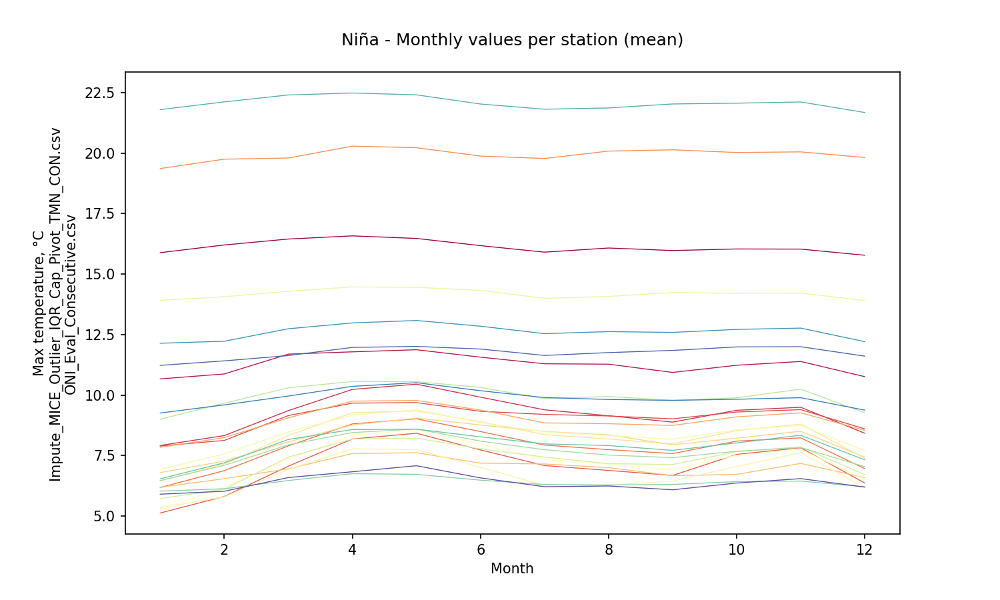
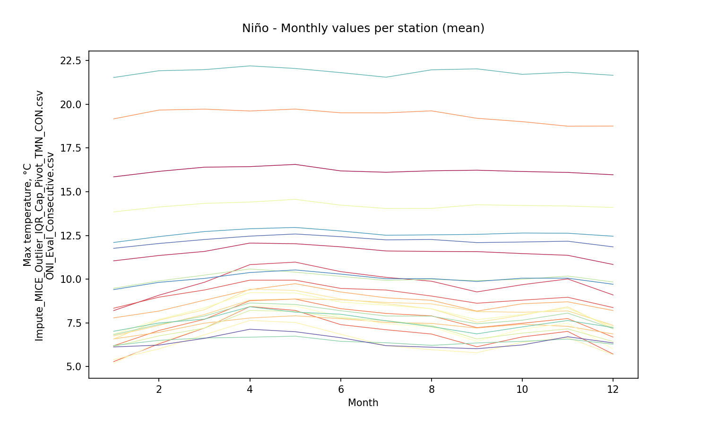

# Statistical aggregations for hydro-climatological composite series and yearly events Niño, Niña and Neutral

For further information about the NOAA - Oceanic Niño Index (ONI) classifier for climatological yearly events Niño, Niña and Neutral, check this activity https://github.com/rcfdtools/R.LTWB/tree/main/Section03/ENSOONI

* Station records file: [Impute_MICE_Outlier_IQR_Cap_Pivot_TMN_CON.csv](../IDEAM_Impute/Impute_MICE_Outlier_IQR_Cap_Pivot_TMN_CON.csv)
* ENSO-ONI year file: [ONI_Eval_Consecutive.csv](../ENSOONI/ONI_Eval_Consecutive.csv)
* Stations: 61
* Records: 16779
* Daily serie: True
* Aggregation function: Mean
* Execution date: 2023-09-22 10:13:40.828608
* Python version: 3.11.5 (tags/v3.11.5:cce6ba9, Aug 24 2023, 14:38:34) [MSC v.1936 64 bit (AMD64)]
* Python path: ['C:\\JLGC\\R.LTWB\\.src', 'C:\\Python311\\python311.zip', 'C:\\Python311\\DLLs', 'C:\\Python311\\Lib', 'C:\\Python311']
* matplotlib version: 3.6.0
* pandas version: 2.1.0
* Instructions & script: https://github.com/rcfdtools/R.LTWB/tree/main/Section03/Agg
* License: https://github.com/rcfdtools/R.LTWB/blob/main/LICENSE.md
* Credits: r.cfdtools@gmail.com

## Composite - Yearly values per station from monthly values (Mean)

Daily values to year-month aggregation (Mean) file: [Agg_YM_Impute_MICE_Outlier_IQR_Cap_Pivot_TMN_CON.csv](Agg_YM_Impute_MICE_Outlier_IQR_Cap_Pivot_TMN_CON.csv)

|   Year |   21185040 |   21195080 |   21195120 |   21195190 |   21205012 |   21205160 |   21205230 |   21205420 |   21205520 |   21205580 |   21205660 |   21205670 |   21205700 |   21205710 |   21205720 |   21205740 |   21205770 |   21205791 |   21205910 |   21205940 |   21205970 |   21205980 |   21206050 |   21206160 |   21206180 |   21206190 |   21206200 |   21206230 |   21206260 |   21206280 |   21206500 |   21206510 |   21206550 |   21206560 |   21206570 |   21206600 |   21206610 |   21206620 |   21206630 |   21206640 |   21206650 |   21206660 |   21206670 |   21206680 |   21206690 |   21206700 |   21206970 |   21235010 |   21255080 |   23065060 |   23065100 |   23065120 |   23065200 |   23125070 |   23125170 |   24015380 |   35025050 |   35025060 |   35035030 |   35065010 |
|-------:|-----------:|-----------:|-----------:|-----------:|-----------:|-----------:|-----------:|-----------:|-----------:|-----------:|-----------:|-----------:|-----------:|-----------:|-----------:|-----------:|-----------:|-----------:|-----------:|-----------:|-----------:|-----------:|-----------:|-----------:|-----------:|-----------:|-----------:|-----------:|-----------:|-----------:|-----------:|-----------:|-----------:|-----------:|-----------:|-----------:|-----------:|-----------:|-----------:|-----------:|-----------:|-----------:|-----------:|-----------:|-----------:|-----------:|-----------:|-----------:|-----------:|-----------:|-----------:|-----------:|-----------:|-----------:|-----------:|-----------:|-----------:|-----------:|-----------:|-----------:|
|   1978 |    23.1466 |    21.7074 |    16.1826 |   11.3981  |    9.44002 |    9.73921 |    9.12224 |    6.98176 |    7.75376 |    9.02926 |    19.6334 |    13.3381 |    7.31165 |    8.86799 |    7.14848 |    7.98478 |    6.11086 |    8.20923 |    7.15268 |    6.61994 |    6.69648 |    7.15629 |    8.34196 |    14.4711 |    14.222  |   10.3828  |    7.26895 |    8.30236 |    7.37264 |    9.56487 |    6.97291 |   10.4069  |    6.44528 |   10.1442  |    8.20947 |    7.79047 |    8.28238 |    8.96861 |    9.18698 |    8.48939 |    6.47516 |    9.85393 |    7.74934 |    8.79943 |    7.95816 |    9.64515 |    9.58659 |    22.0498 |    22.9595 |    12.5815 |    9.8825  |    12.9544 |    18.5266 |   12.0662  |    6.42592 |    6.41602 |    6.51781 |    4.85612 |    19.6607 |    12.8136 |
|   1979 |    23.1466 |    21.7074 |    16.1826 |   11.3981  |    9.44002 |    9.73921 |    9.12224 |    6.98176 |    7.75376 |    9.02926 |    19.6334 |    13.3604 |    8.05833 |    8.86799 |    7.14848 |    7.98478 |    6.47537 |    8.20923 |    7.15268 |    6.61994 |    6.69648 |    7.15629 |    8.34196 |    14.4711 |    14.222  |   10.3828  |    7.26895 |    8.30236 |    7.37264 |    9.63382 |    6.97291 |   10.4069  |    6.44528 |   10.1442  |    8.20947 |    7.79047 |    8.28238 |    8.96861 |    9.18698 |    8.48939 |    6.47516 |    9.85393 |    7.74934 |    8.79943 |    7.95816 |    9.64515 |    9.58659 |    22.0498 |    22.9595 |    12.5815 |    9.8825  |    12.9417 |    18.5266 |   12.0662  |    6.42592 |    6.72461 |    6.51781 |    5.07613 |    19.6607 |    13.2173 |
|   1980 |    23.7356 |    21.8121 |    15.9522 |   11.6962  |    8.88126 |    8.56801 |    8.89192 |    6.15837 |    6.9354  |    8.32143 |    19.9601 |    13.5038 |    7.77259 |    8.32319 |    7.12905 |    8.26442 |    6.42085 |    7.21772 |    6.79916 |    5.26428 |    5.98499 |    5.74135 |    7.70034 |    14.4744 |    14.0927 |   10.2096  |    6.6378  |    7.81896 |    6.7797  |    9.65685 |    6.82541 |   10.1229  |    5.55393 |    9.83377 |    8.03095 |    7.45392 |    7.92961 |    8.48131 |    8.91016 |    8.25198 |    6.24814 |    9.43838 |    7.27811 |    8.64888 |    7.55335 |    9.01513 |    9.29888 |    21.9455 |    23.6259 |    12.378  |    9.69029 |    13.359  |    18.5655 |   12.6178  |    6.04489 |    6.66401 |    6.32588 |    5.0576  |    20.0249 |    13.2352 |
|   1981 |    23.1626 |    21.7448 |    16.0395 |   11.4918  |    8.96357 |    9.16552 |    9.12728 |    6.6904  |    7.40685 |    8.99813 |    18.7841 |    13.4815 |    7.70133 |    8.22861 |    6.8382  |    8.44996 |    6.34131 |    7.52483 |    7.798   |    5.98459 |    6.31914 |    6.20657 |    8.15536 |    14.4824 |    14.1483 |   10.3204  |    7.00697 |    8.0193  |    7.09636 |    9.634   |    6.98303 |   10.2639  |    5.84326 |   10.0433  |    8.19631 |    7.58116 |    8.09288 |    8.79711 |    9.00056 |    8.30634 |    6.4792  |    9.64712 |    7.29894 |    8.75113 |    7.83573 |    9.46434 |    9.43947 |    21.8176 |    22.87   |    12.4787 |    9.73619 |    13.352  |    18.6019 |   12.2818  |    6.11325 |    6.61932 |    6.38456 |    5.02291 |    19.8786 |    13.1764 |
|   1982 |    22.9204 |    21.6577 |    16.0864 |   11.6906  |    9.28216 |   10.0029  |    9.1918  |    7.07875 |    7.92758 |    9.30656 |    16.9665 |    13.4835 |    7.75508 |    7.59515 |    7.46339 |    8.8295  |    6.3721  |    8.03888 |    7.69808 |    6.51646 |    6.91151 |    6.9159  |    8.62044 |    14.4727 |    14.1434 |   10.4588  |    7.39593 |    8.34229 |    7.57039 |    9.64137 |    7.01393 |   10.4998  |    6.27529 |   10.1846  |    8.15912 |    7.73297 |    8.35225 |    9.03476 |    8.97052 |    8.52728 |    6.5941  |    9.87835 |    7.73938 |    8.88844 |    8.02922 |    9.89026 |    9.57964 |    20.6189 |    22.3065 |    12.6101 |    9.73654 |    13.3497 |    18.6779 |   13.0159  |    6.37892 |    6.64461 |    6.56792 |    5.04404 |    20.0655 |    13.2247 |
|   1983 |    23.5231 |    21.7943 |    16.0399 |   11.8379  |    9.08327 |   13.7309  |    9.02901 |    6.70748 |    7.37608 |    9.39598 |    15.8882 |    13.5465 |    7.79877 |    8.00863 |    6.99827 |    8.64091 |    6.34771 |    7.81288 |    7.27877 |    6.13292 |    6.16808 |    6.64835 |    8.21746 |    14.4741 |    14.1062 |   10.2805  |    6.99366 |    8.26063 |    7.75583 |    9.63339 |    6.98898 |   10.4362  |    6.0942  |   10.0676  |    8.04734 |    7.92344 |    8.48419 |    9.13738 |    8.95292 |    8.4915  |    6.57198 |    9.76238 |    7.46492 |    8.90589 |    8.1162  |    9.55131 |    9.6085  |    20.5819 |    22.7504 |    12.5559 |   10.2433  |    13.4105 |    18.7087 |   13.3245  |    6.26594 |    6.6604  |    6.51514 |    5.05582 |    19.4856 |    13.2801 |
|   1984 |    22.4859 |    21.4757 |    15.9677 |   11.2469  |    8.67359 |   10.041   |    8.28832 |    6.42277 |    7.12034 |    8.74931 |    15.6764 |    13.458  |    7.71084 |    8.22702 |    5.98308 |    8.1774  |    6.32729 |    7.35566 |    6.51689 |    5.93401 |    6.14155 |    6.17883 |    7.40956 |    14.4858 |    14.0788 |   10.0505  |    6.61917 |    7.67461 |    7.03947 |    9.62888 |    6.84802 |   10.1458  |    5.75542 |    9.81674 |    7.92197 |    7.39145 |    8.09423 |    8.9949  |    8.76435 |    8.21084 |    6.39682 |    9.30212 |    6.86953 |    8.74443 |    7.77874 |    8.99485 |    9.27332 |    20.8438 |    22.6714 |    12.3808 |    9.8065  |    13.3237 |    18.534  |   12.079   |    5.95072 |    6.61842 |    6.28067 |    5.02697 |    19.1437 |    13.2057 |
|   1985 |    23.0111 |    21.5481 |    15.9254 |   11.3365  |    8.22048 |    6.23729 |    8.91387 |    5.85945 |    6.59282 |    8.47777 |    19.61   |    13.4881 |    7.63484 |    8.2532  |    5.28203 |    7.8393  |    6.30475 |    6.75118 |    6.34656 |    5.56236 |    5.74404 |    4.83504 |    7.37868 |    14.5072 |    14.071  |   10.1149  |    6.39103 |    7.20414 |    6.25791 |    9.62787 |    6.76227 |    9.84199 |    5.07703 |    9.61938 |    7.87182 |    7.04352 |    7.63353 |    8.56207 |    8.67137 |    7.95521 |    6.32531 |    9.0975  |    6.30426 |    8.57823 |    7.43131 |    8.82703 |    8.97901 |    21.7767 |    22.9764 |    12.2417 |    9.43403 |    13.3414 |    18.4182 |   11.821   |    5.54857 |    6.59471 |    6.07982 |    5.00975 |    19.1561 |    13.178  |
|   1986 |    23.0664 |    21.558  |    16.1621 |   11.5246  |    8.78135 |    7.38351 |    9.28891 |    6.76696 |    7.54021 |    8.68017 |    20.0194 |    13.4954 |    7.71345 |    8.80018 |    5.35718 |    8.38516 |    6.33623 |    7.5732  |    7.92612 |    6.59565 |    7.50051 |    6.51407 |    8.04131 |    14.8839 |    14.2763 |   10.3201  |    7.10322 |    8.00725 |    7.0458  |    9.63204 |    7.07702 |   10.241   |    5.99491 |   10.1423  |    8.41216 |    7.63048 |    8.08265 |    9.01098 |    9.0268  |    8.28596 |    6.37186 |    9.6971  |    6.81174 |    8.71557 |    8.06701 |    9.58691 |    9.37775 |    21.9125 |    23.1856 |    12.4803 |    9.74694 |    13.3621 |    18.5874 |   11.7151  |    6.04488 |    6.62357 |    6.21885 |    5.02605 |    19.2617 |    13.1892 |
|   1987 |    23.2861 |    21.7167 |    16.305  |   12.0308  |    8.58873 |    5.74932 |    7.91019 |    6.65497 |    7.2002  |    8.87232 |    19.9132 |    13.512  |    7.74633 |    8.75715 |    4.9444  |    8.4419  |    6.38377 |    7.44172 |    6.83478 |    5.96449 |    6.92374 |    6.21141 |    7.72082 |    14.9179 |    14.3703 |    9.93037 |    6.03552 |    7.74538 |    6.58906 |    9.64762 |    6.97923 |   10.0847  |    5.8761  |   10.0188  |    8.161   |    7.84675 |    7.86151 |    9.10975 |    9.05669 |    7.67675 |    6.37772 |    9.54809 |    6.54904 |    8.60358 |    7.92237 |    9.34079 |    9.41949 |    22.0404 |    23.8173 |    12.3666 |   10.5017  |    13.3838 |    18.7161 |   10.6535  |    5.89975 |    6.64632 |    4.66426 |    5.04099 |    19.8143 |    13.2389 |
|   1988 |    22.9847 |    21.5045 |    16.4263 |   11.6203  |    7.12274 |    7.84885 |    7.19344 |    6.82674 |    7.30858 |    8.34708 |    19.8767 |    13.5035 |    7.73682 |    8.77009 |    4.93732 |    8.19611 |    6.40374 |    7.35054 |    5.0111  |    6.16041 |    6.71269 |    6.41942 |    7.86602 |    14.7831 |    14.4983 |   10.1503  |    6.99306 |    7.55958 |    6.7856  |    9.65444 |    6.84327 |    9.75339 |    5.93965 |    9.82084 |    7.82513 |    7.4625  |    8.00351 |    8.89984 |    8.62211 |    6.97467 |    6.25633 |    9.42163 |    5.95949 |    8.63147 |    7.83615 |    9.24018 |    8.57627 |    22.0013 |    23.6688 |    12.2655 |    9.78946 |    13.3509 |    18.5503 |    9.90267 |    5.90714 |    6.64547 |    3.15163 |    5.03745 |    19.7519 |    13.2475 |
|   1989 |    22.8867 |    21.5142 |    16.0092 |   11.1967  |    8.61764 |    7.32675 |    8.01339 |    6.34718 |    6.99036 |    8.25304 |    19.9434 |    13.4902 |    7.74867 |    8.35536 |    5.485   |    8.13812 |    6.41369 |    6.96288 |    5.77738 |    5.70032 |    6.18845 |    5.97147 |    7.48107 |    14.2681 |    14.1783 |   10.2405  |    6.79592 |    7.24941 |    6.62053 |    9.65756 |    6.78105 |   10.0484  |    5.55244 |    9.73172 |    7.85619 |    7.26962 |    7.87585 |    8.68214 |    8.82951 |    6.74624 |    6.24789 |    9.23905 |    6.4894  |    8.62447 |    7.63214 |    8.92557 |    9.09369 |    21.9996 |    23.096  |    12.4207 |    9.56166 |    13.3715 |    18.5058 |   10.5386  |    5.83181 |    6.65731 |    2.98182 |    5.05895 |    19.7134 |    13.2425 |
|   1990 |    23.3369 |    21.608  |    15.9737 |   11.8513  |    9.35077 |    8.10921 |    9.55671 |    6.84404 |    7.4281  |    8.51324 |    19.8629 |    13.5004 |    7.67528 |    8.86348 |    7.90542 |    8.90556 |    6.38062 |    7.77236 |    5.95769 |    6.37253 |    6.6874  |    5.73413 |    8.20013 |    14.7507 |    14.4432 |   10.625   |    7.4906  |    7.7802  |    6.84374 |    9.60585 |    6.84508 |   10.3953  |    5.75169 |    9.87475 |    8.01817 |    7.57231 |    7.93021 |    8.69936 |    9.06672 |    6.98586 |    6.39731 |    9.53348 |    7.59931 |    8.69266 |    7.53144 |    9.43973 |    9.40041 |    22.1744 |    23.0974 |    12.5814 |    9.67797 |    13.3254 |    18.704  |   12.4207  |    6.29192 |    6.64239 |    3.28412 |    5.08117 |    19.6777 |    13.224  |
|   1991 |    23.0114 |    21.7589 |    16.0316 |   11.5867  |    9.61566 |    9.35993 |    9.69004 |    6.73664 |    7.64897 |    8.74395 |    18.7145 |    13.4944 |    7.71363 |    8.87792 |    7.56985 |    8.23064 |    6.39438 |    8.04115 |    6.72354 |    6.32885 |    6.6679  |    6.38321 |    7.99844 |    14.0156 |    14.3124 |   10.5992  |    7.22253 |    7.64082 |    7.05583 |    9.63712 |    6.90541 |   10.4011  |    6.09483 |    9.96408 |    8.12842 |    7.68105 |    8.03387 |    8.73317 |    9.13178 |    7.07224 |    6.42529 |    9.59512 |    7.6807  |    8.72014 |    7.68997 |    9.39516 |    9.63113 |    21.7865 |    22.9218 |    12.4694 |    9.94117 |    13.346  |    18.5935 |   12.2282  |    6.33853 |    6.63983 |    3.37293 |    5.04483 |    19.8186 |    13.2072 |
|   1992 |    23.2394 |    21.5717 |    15.9502 |   11.4411  |    9.38219 |    9.97264 |    9.14407 |    5.94645 |    6.93258 |    8.56013 |    20.4623 |    13.5295 |    7.68452 |    8.4628  |    8.47567 |    7.89599 |    6.39623 |    7.3879  |    7.45066 |    5.66225 |    5.79959 |    6.90421 |    7.43475 |    14.5806 |    14.2701 |   10.4173  |    6.57148 |    7.21013 |    6.69111 |    9.69178 |    6.89235 |   10.1983  |    6.01422 |    9.99251 |    8.15023 |    7.58339 |    8.06503 |    8.74495 |    9.113   |    8.50787 |    6.26592 |    9.49069 |    8.01607 |    8.7189  |    7.42965 |    8.90301 |    9.58007 |    22.0875 |    23.0623 |    12.3024 |    9.91766 |    13.3471 |    18.5182 |   12.1015  |    6.49699 |    6.6384  |    6.63539 |    5.03555 |    19.9817 |    13.1882 |
|   1993 |    22.9259 |    21.2886 |    16.1733 |   11.2199  |    9.46794 |    9.57339 |    9.56599 |    6.68334 |    7.23378 |    8.85311 |    20.4719 |    13.4977 |    7.71077 |    8.7244  |    7.71627 |    8.0975  |    6.38054 |    7.93622 |    7.58153 |    6.10743 |    6.60377 |    6.41504 |    7.85612 |    14.5316 |    14.0944 |   10.6544  |    6.85932 |    7.61462 |    6.82354 |    9.64688 |    6.89656 |   10.2868  |    6.09719 |   10.0009  |    8.26402 |    7.55839 |    8.03263 |    9.06918 |    9.11431 |    8.54728 |    6.43829 |    9.5775  |    7.88015 |    8.71316 |    7.58525 |    9.34354 |    9.56815 |    22.136  |    23.0418 |    12.2581 |    9.66546 |    13.3227 |    18.5149 |   11.9712  |    6.30626 |    6.63517 |    6.94279 |    5.03673 |    19.7225 |    13.1994 |
|   1994 |    23.3596 |    21.8505 |    16.2795 |    9.76835 |    9.00182 |    9.57666 |    9.05185 |    7.11338 |    7.76599 |    8.77857 |    19.9256 |    13.4796 |    7.65846 |    8.73947 |    7.30692 |    8.07189 |    6.33028 |    7.87315 |    7.72471 |    6.27599 |    7.21438 |    6.93125 |    8.27293 |    14.5836 |    14.192  |   10.5633  |    7.26827 |    7.94616 |    7.27771 |    9.58514 |    6.94263 |   10.2577  |    6.27115 |    9.9634  |    8.32578 |    7.83345 |    8.16459 |    8.81133 |    9.1094  |    8.39221 |    6.42582 |    9.79286 |    7.61606 |    8.69324 |    7.819   |    9.65323 |    9.54152 |    22.2995 |    23.0546 |    12.2179 |   10.1613  |    13.328  |    18.5876 |   11.5071  |    6.3996  |    6.59449 |    7.0932  |    5.00001 |    19.7236 |    13.2081 |
|   1995 |    23.4965 |    22.0194 |    16.0511 |   10.4247  |    7.84283 |    9.10812 |    8.58599 |    6.73642 |    7.18198 |    8.78918 |    20.4333 |    13.4735 |    7.65974 |    8.41845 |    6.94801 |    7.72884 |    6.22201 |    6.95498 |    6.78381 |    5.89378 |    6.49924 |    6.40106 |    7.91273 |    14.5172 |    14.1682 |    9.5982  |    6.88335 |    7.61426 |    6.8405  |    9.51975 |    7.77665 |    9.85121 |    5.74231 |    9.77508 |    8.04326 |    7.49804 |    8.04222 |    8.43205 |    8.73094 |    8.39101 |    6.38035 |    9.5003  |    6.90865 |    8.66654 |    7.55742 |    9.31926 |    9.01611 |    21.8008 |    23.1291 |    12.162  |    9.9349  |    13.3271 |    18.4821 |   11.5877  |    6.15885 |    6.56433 |    7.01356 |    4.97891 |    19.7626 |    13.186  |
|   1996 |    22.6728 |    21.5368 |    15.3547 |   11.1865  |    9.14343 |    9.44693 |    8.74846 |    6.69913 |    7.32325 |    8.75671 |    19.9186 |    13.4414 |    7.67349 |    8.8605  |    7.33245 |    8.18456 |    6.25491 |    7.24399 |    6.39484 |    6.17616 |    6.93962 |    6.83269 |    7.94772 |    15.0149 |    13.9463 |   10.0197  |    6.92298 |    7.7532  |    7.27633 |    9.52868 |    8.2276  |   10.4228  |    5.8268  |    9.42095 |    8.09521 |    7.55937 |    8.14582 |    8.84606 |    8.86077 |    8.6228  |    6.3396  |    9.44449 |    7.38745 |    8.74504 |    7.50679 |    9.40269 |    9.39491 |    21.8726 |    22.8879 |    11.306  |    9.795   |    13.3195 |    18.5544 |   12.1087  |    6.34372 |    6.56395 |    7.09775 |    4.96495 |    19.6954 |    13.1561 |
|   1997 |    23.6564 |    21.5136 |    15.6837 |   11.2776  |    9.57289 |    9.94884 |    8.63213 |    6.87141 |    7.64826 |    9.32089 |    19.4925 |    13.4932 |    7.64773 |    8.41773 |    7.63419 |    7.77372 |    6.40032 |    7.6835  |    5.21648 |    6.33554 |    6.5277  |    6.91959 |    7.98851 |    13.9466 |    14.272  |    9.53815 |    7.10677 |    7.84706 |    7.31119 |    9.63966 |    7.49585 |   10.6162  |    6.07683 |    9.77542 |    7.7919  |    7.79798 |    8.1825  |    9.19185 |    9.16058 |    8.68542 |    6.45521 |    9.6571  |    7.78261 |    8.70686 |    7.67784 |    9.47296 |    9.55703 |    22.2698 |    23.7512 |    12.6875 |   10.1969  |    13.3813 |    18.5183 |   12.3469  |    6.44089 |    6.61203 |    7.13457 |    5.00907 |    19.7652 |    13.1845 |
|   1998 |    23.9194 |    21.6878 |    15.862  |   11.4474  |   10.1013  |   10.0176  |    9.25837 |    7.51852 |    8.32137 |    8.75765 |    19.8478 |    13.5301 |    7.69263 |    8.88114 |    7.72606 |    8.83655 |    6.4891  |    8.68028 |    6.37777 |    6.88531 |    7.33099 |    7.66096 |    8.58356 |    13.7381 |    14.4142 |   10.3669  |    7.59438 |    8.54108 |    7.61281 |    9.70719 |    7.18062 |   10.9749  |    7.23285 |    9.70169 |    8.18823 |    8.17767 |    8.43291 |    9.11797 |    9.26998 |    9.13144 |    6.33406 |    9.91569 |    8.32775 |    8.75491 |    7.82086 |    9.8022  |    9.86853 |    22.2155 |    24.3876 |    12.9131 |   10.3802  |    13.3776 |    18.7967 |   12.4792  |    6.75266 |    6.64475 |    7.71311 |    5.01183 |    19.7915 |    13.2071 |
|   1999 |    22.9596 |    20.9311 |    14.9    |   10.9412  |    9.67301 |    9.52297 |    9.21052 |    7.13348 |    7.50441 |    8.41912 |    19.243  |    13.4267 |    7.71186 |    8.6854  |    7.51385 |    9.12407 |    6.38461 |    8.64831 |    6.0037  |    6.78721 |    7.17174 |    7.3771  |    8.3364  |    14.6829 |    13.7381 |   10.6391  |    7.0739  |    8.36079 |    7.17589 |    9.69101 |    5.67557 |   10.6115  |    5.92418 |   10.0833  |    8.10078 |    7.72343 |    8.32739 |    9.46633 |    9.16085 |    8.60265 |    6.23848 |    9.73902 |    7.5463  |    8.73935 |    7.83631 |    9.61917 |    9.47272 |    21.9811 |    23.648  |    12.3207 |    9.54769 |    13.3389 |    18.7158 |   11.1455  |    6.59661 |    6.62517 |    7.04356 |    5.01641 |    19.6604 |    13.2104 |
|   2000 |    23.1888 |    21.6263 |    14.8774 |   11.3641  |    9.99074 |    9.66001 |    8.82187 |    6.72559 |    7.19295 |    8.99872 |    19.6124 |    13.48   |    7.67891 |    8.74811 |    7.46711 |    7.73857 |    6.39145 |    8.02629 |    5.62989 |    6.21807 |    7.04239 |    6.89172 |    7.91065 |    14.3618 |    13.658  |   10.1068  |    6.85457 |    8.20206 |    6.76178 |    9.655   |    5.57186 |    9.89476 |    5.53709 |    9.53441 |    7.96754 |    7.48259 |    8.21458 |    8.76628 |    9.0592  |    8.61007 |    6.36012 |    9.3656  |    7.5711  |    8.74133 |    7.33608 |    9.47248 |    9.61602 |    21.958  |    23.4531 |    12.7309 |    9.74591 |    13.3313 |    18.4579 |   11.6636  |    6.35561 |    6.60888 |    7.05716 |    4.98784 |    19.7083 |    13.165  |
|   2001 |    23.0142 |    21.5514 |    15.6345 |   11.1301  |    9.86894 |    9.44461 |    8.84368 |    6.60136 |    7.49829 |    8.89053 |    20.0505 |    13.4839 |    7.64408 |    8.79989 |    7.55772 |    7.64068 |    6.38173 |    8.00238 |    5.62473 |    6.20926 |    6.23044 |    6.51195 |    7.8556  |    14.1746 |    13.8376 |   10.4793  |    6.94081 |    7.97002 |    6.94823 |    9.69685 |    6.35083 |   10.2001  |    5.77557 |    9.82683 |    7.89422 |    7.70073 |    8.10917 |    8.99446 |    9.18778 |    8.45115 |    6.40277 |    9.56362 |    7.77142 |    8.72502 |    7.56578 |    9.26972 |    9.64997 |    22.1156 |    23.1702 |    13.0628 |   10.0412  |    13.3385 |    18.4756 |   11.7678  |    6.35032 |    6.60337 |    6.82187 |    4.98535 |    19.7353 |    13.1868 |
|   2002 |    23.4761 |    21.838  |    16.746  |   10.7209  |    9.97207 |    9.7059  |    8.77553 |    6.83933 |    7.3653  |    8.9234  |    19.7071 |    13.4993 |    7.64086 |    8.4224  |    7.64443 |    5.95214 |    6.37738 |    8.65176 |    5.87399 |    6.24839 |    6.81371 |    6.88922 |    7.73876 |    14.1113 |    13.8621 |   10.2761  |    6.97173 |    8.2263  |    6.78166 |    9.67849 |    5.63147 |   10.1904  |    7.11652 |    8.28747 |    7.89383 |    8.28982 |    8.29815 |    7.82134 |    8.70493 |    9.03148 |    6.57114 |    9.21026 |    8.33112 |    8.93412 |    5.67823 |    9.2366  |    9.76484 |    21.7544 |    23.5278 |    12.9378 |   10.1844  |    13.3317 |    18.1642 |   12.0499  |    6.49843 |    6.60093 |    7.09391 |    4.98328 |    19.7618 |    13.1506 |
|   2003 |    23.4703 |    21.7569 |    15.8682 |   11.0319  |    9.64579 |    9.81616 |    9.05775 |    6.98354 |    7.27037 |    8.84597 |    19.5047 |    13.5137 |    7.6838  |    8.64542 |    7.68493 |    8.31154 |    6.35241 |    8.32015 |    6.32497 |    6.35885 |    6.72977 |    7.13671 |    7.9623  |    14.2447 |    13.6887 |   10.3818  |    6.85978 |    7.93936 |    6.46902 |    9.63366 |    6.30657 |   10.3542  |    6.27693 |    9.78237 |    7.95491 |    7.85333 |    8.28338 |    8.29708 |    9.1198  |    9.06384 |    7.35481 |    8.50839 |    7.95477 |    8.83864 |    6.95273 |    9.45032 |    9.71282 |    21.9765 |    23.2687 |    12.9658 |   10.0463  |    13.3466 |    18.6605 |   11.889   |    6.2117  |    6.609   |    6.85536 |    4.99607 |    19.7316 |    13.177  |
|   2004 |    23.3452 |    21.8052 |    15.3939 |   10.9197  |    9.52964 |    9.63746 |    9.00541 |    7.0859  |    7.20839 |    8.59669 |    19.3953 |    13.481  |    7.66938 |    8.96735 |    7.59117 |    7.84261 |    6.37988 |    8.12454 |    6.45863 |    6.42092 |    6.95249 |    7.19221 |    7.90485 |    14.4319 |    13.693  |   10.2854  |    6.85212 |    8.30159 |    7.11011 |    9.59755 |    6.31272 |   10.3597  |    6.40027 |   10.0719  |    8.0973  |    7.32172 |    8.27006 |    7.58845 |    9.11897 |    8.67485 |    6.57664 |    9.20832 |    7.80075 |    8.45596 |    6.37838 |    9.36565 |    9.4731  |    22.0242 |    23.3417 |    12.6402 |    9.49698 |    13.3174 |    18.4774 |   11.9389  |    6.34055 |    6.61142 |    7.16214 |    5.01556 |    19.6571 |    13.1593 |
|   2005 |    23.7834 |    22.3897 |    16.3674 |   10.4044  |    8.90984 |    9.75623 |    9.14641 |    7.18769 |    7.28866 |    8.92881 |    18.8462 |    13.4735 |    7.65458 |    8.85216 |    7.10458 |    7.40626 |    6.40824 |    8.298   |    7.91425 |    6.498   |    7.1704  |    7.27576 |    8.87158 |    14.3618 |    14.0406 |   10.3807  |    7.30878 |    8.41779 |    7.50838 |    9.70554 |    6.93105 |   10.2387  |    6.58781 |   10.3191  |    8.35322 |    7.33934 |    8.30574 |    7.41941 |    9.00016 |    7.71969 |    6.4894  |    9.89818 |    7.67839 |    8.78678 |    7.69545 |    9.99822 |    9.24353 |    21.8991 |    22.8671 |    12.7166 |    9.02097 |    13.3439 |    18.3034 |   12.1484  |    6.31609 |    6.62771 |    6.26823 |    5.03037 |    19.5352 |    13.1617 |
|   2006 |    23.4913 |    22.0635 |    15.8062 |   10.2876  |    9.79015 |   10.4802  |    9.39648 |    7.65595 |    8.16743 |    9.33172 |    16.7232 |    13.3932 |    7.6577  |    8.87406 |    7.45044 |    8.49556 |    6.43816 |    8.6814  |    8.07906 |    7.6086  |    7.79163 |    7.89032 |    9.68049 |    14.6282 |    14.0759 |   10.6526  |    7.93387 |    9.16209 |    7.74949 |    9.71926 |    6.99375 |   10.667   |    6.77198 |    9.78648 |    8.56331 |    7.68692 |    8.4209  |    7.9466  |    9.04418 |    8.03577 |    7.09537 |    9.52439 |    7.94084 |    8.95603 |    7.87584 |   10.5735  |    9.7736  |    21.3748 |    21.2488 |    12.5683 |    9.59441 |    13.3481 |    18.6219 |   12.3345  |    6.48844 |    6.62013 |    6.55262 |    5.01508 |    19.3375 |    13.1344 |
|   2007 |    22.046  |    21.6247 |    16.0113 |    9.79257 |    9.39044 |    9.78045 |    8.94421 |    6.96893 |    7.14018 |    8.9296  |    18.3362 |    13.4268 |    7.68521 |    8.25906 |    7.68128 |    8.25195 |    6.38489 |    8.00283 |    6.81916 |    6.29844 |    6.61899 |    6.86459 |    8.23167 |    14.4091 |    14.0497 |   10.2586  |    6.94234 |    8.01997 |    7.28529 |    9.69067 |    6.73528 |   10.4006  |    6.24112 |    9.38854 |    8.03412 |    7.41846 |    8.14173 |    8.26788 |    8.78884 |    8.10927 |    6.6381  |    9.29735 |    7.6346  |    8.83967 |    7.19012 |    9.5082  |    9.44022 |    21.4442 |    21.0525 |    12.6785 |    9.37619 |    13.3353 |    18.5198 |   12.0029  |    6.295   |    6.63575 |    6.73294 |    5.05573 |    19.4532 |    13.1735 |
|   2008 |    21.5804 |    21.7069 |    15.6354 |    9.97195 |    9.53998 |   10.4676  |    9.20362 |    7.26816 |    7.62142 |    9.67645 |    19.7729 |    13.4233 |    7.65602 |    8.92294 |    7.34167 |    7.90666 |    6.45949 |    8.2671  |    7.77584 |    7.38348 |    6.9448  |    7.50387 |    8.781   |    14.5626 |    14.1981 |   10.4252  |    7.38887 |    8.19177 |    7.46224 |    9.63604 |    7.06606 |   10.4707  |    6.45998 |    9.54417 |    8.27915 |    7.50341 |    8.34477 |    8.85969 |    8.81986 |    8.43754 |    6.7011  |    9.6775  |    7.6994  |    8.90606 |    8.17481 |   10.011   |    9.66036 |    21.4861 |    21.073  |    12.4434 |    9.5848  |    13.3142 |    18.4533 |   12.2215  |    6.47126 |    6.63309 |    6.83075 |    5.0523  |    19.5128 |    13.1453 |
|   2009 |    22.748  |    21.8444 |    16.2584 |   11.0425  |    9.70685 |   10.0171  |    9.37923 |    6.89716 |    8.14113 |    8.99423 |    20.4312 |    13.4865 |    7.66879 |    9.0405  |    7.48681 |    8.22985 |    6.41375 |    8.60633 |    7.78058 |    6.88699 |    6.71135 |    7.37992 |    8.51635 |    14.6405 |    14.4615 |   10.3926  |    7.50302 |    8.54169 |    8.04135 |    9.70472 |    7.19356 |   10.6101  |    6.68426 |   10.564   |    8.53189 |    7.64799 |    8.3216  |   10.0427  |    9.84213 |    8.71619 |    6.17249 |   10.1199  |    8.04909 |    8.85999 |    8.45777 |    9.74792 |   10.1496  |    22.1834 |    22.1681 |    12.3732 |    9.93496 |    13.3565 |    18.7169 |   12.2248  |    6.60995 |    6.65487 |    7.11217 |    5.0843  |    19.6215 |    13.197  |
|   2010 |    23.1516 |    21.7956 |    16.4938 |   11.6067  |    9.97905 |   10.4237  |    9.69748 |    7.28827 |    8.65007 |    9.47616 |    20.5339 |    13.4763 |    7.72584 |    9.74272 |    7.03037 |    8.19949 |    6.49238 |    9.14539 |    8.29648 |    7.60478 |    7.53948 |    7.95547 |    9.05474 |    14.5408 |    14.0456 |   10.6064  |    7.90276 |    8.96194 |    8.39197 |    9.71041 |    7.19078 |   10.7925  |    7.13015 |   10.6235  |    8.6438  |    7.74287 |    8.53717 |    9.52684 |    9.93342 |    9.04373 |    7.39884 |   10.4509  |    8.18652 |    8.89113 |    8.73781 |   10.301   |    9.96007 |    22.5097 |    23.062  |    12.7579 |    9.87467 |    13.3529 |    18.7472 |   12.3111  |    6.34699 |    6.69936 |    7.41198 |    5.12101 |    19.6405 |    13.2275 |
|   2011 |    23.1361 |    21.7726 |    16.8037 |   11.9873  |   10.1192  |   10.1861  |    9.40614 |    7.80818 |    8.31438 |    9.3741  |    20.1229 |    13.4495 |    7.69637 |    9.16788 |    6.66056 |    5.90516 |    6.41994 |    9.53404 |    8.24671 |    7.65591 |    8.06471 |    7.98708 |    8.82413 |    14.2786 |    13.9215 |   10.5547  |    7.82419 |    8.65083 |    8.14151 |    9.68021 |    7.14196 |   10.5146  |    7.36516 |   10.6591  |    8.81467 |    5.72548 |    8.54977 |    9.47053 |    9.43527 |    8.93937 |    7.18328 |   10.4917  |    8.2304  |    8.96096 |    8.67678 |   10.2797  |    9.96921 |    22.4314 |    22.364  |    12.7988 |    9.58513 |    13.3315 |    18.1538 |   12.1669  |    5.92388 |    6.64963 |    6.92867 |    5.07242 |    19.5661 |    13.1868 |
|   2012 |    23.4436 |    21.8267 |    16.8301 |   11.7395  |    9.91191 |    9.67051 |    8.88855 |    7.08083 |    7.77323 |    9.36865 |    20.2843 |    13.4528 |    7.67245 |    8.89307 |    5.93758 |    4.60708 |    6.40673 |    8.59752 |    7.81659 |    7.05524 |    7.29011 |    7.66886 |    8.30206 |    14.182  |    14.1199 |   10.3247  |    7.46915 |    8.44024 |    7.77838 |    9.66066 |    7.15677 |   10.2098  |    6.93749 |   10.5444  |    8.0387  |    6.11131 |    8.43227 |    9.19167 |    8.43479 |    8.78671 |    7.09249 |   10.7083  |    7.82721 |    8.91298 |    8.6782  |    9.84943 |    9.14294 |    22.4474 |    22.2812 |    12.6854 |    9.57789 |    13.3441 |    17.4584 |   12.0833  |    5.79877 |    6.63641 |    6.83857 |    5.03935 |    19.6008 |    13.1232 |
|   2013 |    23.2139 |    21.7068 |    16.8566 |   11.8449  |    9.75876 |   10.3576  |    8.89699 |    7.01809 |    7.9828  |    9.21444 |    20.3722 |    13.476  |    7.70637 |    8.89859 |    7.51507 |    4.91154 |    6.44873 |    8.64915 |    7.45374 |    6.92765 |    7.37181 |    7.78341 |    8.46947 |    14.134  |    14.571  |   10.4101  |    7.65268 |    8.75337 |    7.72909 |    9.67162 |    7.23204 |   10.2119  |    7.00005 |   10.7425  |    8.32147 |    8.30189 |    8.44095 |    9.78981 |    9.61314 |    8.90279 |    7.15962 |   11.0017  |    8.30955 |    8.88266 |    8.63929 |    9.91674 |    9.76705 |    22.6357 |    22.8851 |    12.9487 |    9.76446 |    13.3543 |    17.4606 |   12.2366  |    6.50943 |    6.642   |    7.03589 |    5.05016 |    19.6486 |    13.1821 |
|   2014 |    23.2726 |    21.7784 |    17.0636 |   12.1954  |   10.007   |   10.948   |    9.25064 |    6.93241 |    8.05079 |    9.71057 |    20.4911 |    13.4692 |    7.75014 |    9.4399  |    7.77069 |    5.79212 |    6.45569 |    8.95354 |    7.88942 |    7.19509 |    7.30958 |    7.99733 |    8.88762 |    14.3971 |    14.7379 |   10.5861  |    7.79813 |    8.94195 |    7.25595 |    9.65267 |    7.3155  |   10.2927  |    7.22418 |   11.1676  |    7.59131 |    8.10944 |    8.5495  |    9.28853 |    9.91677 |    9.04533 |    7.40833 |   10.9566  |    8.59592 |    8.93599 |    8.6645  |   10.239   |    9.89058 |    22.9272 |    22.8444 |    12.6347 |    9.84822 |    13.3908 |    18.1905 |   12.3882  |    6.49465 |    6.68825 |    7.12202 |    5.07395 |    19.6524 |    13.1654 |
|   2015 |    23.2562 |    21.781  |    16.9655 |   12.1895  |   10.0819  |   11.1785  |    9.65055 |    7.17804 |    8.56296 |    9.81642 |    21.1649 |    13.4845 |    7.77352 |    9.71736 |    7.77771 |    8.24551 |    6.44381 |    9.05556 |    7.94789 |    7.04549 |    7.02141 |    8.29948 |    9.11179 |    14.5612 |    15.1364 |   10.6597  |    7.98044 |    9.31661 |    7.6251  |    9.65531 |    7.4263  |   10.6676  |    7.32305 |   11.5089  |    8.51253 |    8.68007 |    8.60688 |    9.73671 |    9.89946 |    9.22834 |    6.67978 |   10.6762  |    8.64189 |    8.93057 |    8.69678 |   10.3244  |    9.97363 |    22.8657 |    23.1782 |    12.8209 |   10.2855  |    13.4025 |    18.6425 |   12.5202  |    6.87277 |    6.63379 |    7.47581 |    5.06388 |    19.7208 |    13.1988 |
|   2016 |    23.3972 |    21.837  |    17.2171 |   12.3438  |   10.1122  |   11.2694  |    9.8237  |    7.50626 |    9.10934 |    9.87194 |    21.0663 |    13.5106 |    7.76273 |    9.81969 |    7.67312 |    9.05319 |    6.42975 |    9.14877 |    8.12344 |    7.39602 |    6.85694 |    8.50817 |    9.42415 |    14.6189 |    14.9528 |   10.7597  |    8.24072 |    9.60919 |    8.1621  |    9.66247 |    7.37219 |   10.8858  |    7.47687 |   10.421   |    8.46462 |    9.07286 |    8.70886 |    9.74006 |    9.64366 |    9.34623 |    7.53943 |   10.6315  |    8.72574 |    8.961   |    8.59485 |   10.3887  |   10.1037  |    23.2333 |    23.3118 |    12.9181 |   10.4438  |    13.4187 |    18.8527 |   12.5806  |    6.74719 |    6.54467 |    7.61357 |    5.06558 |    19.7083 |    13.2272 |
|   2017 |    23.2404 |    21.8054 |    16.8002 |   12.2486  |   10.1138  |   10.9833  |    9.78422 |    7.75347 |    8.82215 |    9.7131  |    20.4056 |    13.497  |    7.68608 |    9.9002  |    7.4581  |    8.32921 |    6.39856 |    9.25208 |    8.07884 |    7.3443  |    6.66829 |    8.36115 |    9.1815  |    14.5401 |    14.5776 |   10.686   |    8.02456 |    9.17099 |    8.06449 |    9.65486 |    7.30944 |   10.7765  |    7.37313 |   10.8268  |    8.46212 |    8.7879  |    8.65955 |    9.49587 |    9.65082 |    9.08439 |    7.19666 |   10.5439  |    8.50245 |    8.94592 |    8.75884 |   10.2337  |   10.0383  |    22.4962 |    23.1634 |    12.8549 |   10.25    |    13.3717 |    18.6643 |   12.4101  |    6.73079 |    6.68709 |    7.08412 |    5.04145 |    19.6731 |    13.159  |
|   2018 |    22.8547 |    21.6981 |    16.1303 |   12.0177  |   10.2942  |   10.4846  |    9.9252  |    7.40271 |    8.74449 |    9.31593 |    20.4718 |    13.4694 |    7.66111 |    9.81875 |    7.16692 |    9.32924 |    6.42275 |    9.24137 |    7.97345 |    7.41908 |    5.42832 |    8.20659 |    9.03636 |    14.6021 |    14.425  |   10.6669  |    7.80244 |    9.05784 |    8.14603 |    9.66616 |    7.26752 |   10.9563  |    7.15443 |   11.0963  |    8.62302 |    8.82973 |    8.61226 |    9.49053 |    9.74166 |    9.0793  |    6.79036 |   10.4265  |    8.2661  |    8.93186 |    8.7788  |    9.84425 |   10.0345  |    22.3778 |    22.922  |    12.8639 |   10.1491  |    13.3733 |    18.867  |   12.3514  |    6.78922 |    6.6459  |    7.25141 |    5.06125 |    19.6545 |    13.1644 |
|   2019 |    23.2004 |    21.8066 |    16.8448 |   12.2591  |   10.1508  |   11.173   |    9.88569 |    7.54327 |    9.03089 |    9.41179 |    20.7497 |    13.5254 |    7.68598 |    9.60931 |    8.01204 |    9.28888 |    6.40707 |    9.19898 |    8.38797 |    7.59016 |    6.22774 |    8.60972 |    9.24198 |    14.6349 |    14.5188 |   10.7296  |    8.04797 |    9.46969 |    8.34551 |    9.66163 |    7.38432 |   10.9612  |    7.44192 |   11.4719  |    8.41907 |    8.83697 |    8.69579 |    9.56817 |    9.90151 |    9.27212 |    6.36605 |   10.8628  |    8.74069 |    8.95683 |    9.05727 |   10.1528  |    9.99101 |    22.8184 |    23.1397 |    12.8698 |   10.2278  |    13.3964 |    18.8657 |   12.5203  |    7.16502 |    6.6792  |    7.45651 |    5.0762  |    19.6644 |    13.2135 |
|   2020 |    23.2207 |    21.7685 |    16.6719 |   11.9781  |    9.88313 |   10.8949  |    9.67555 |    7.29318 |    8.52709 |    9.46231 |    20.942  |    13.5183 |    7.71784 |    9.41421 |    7.67019 |    8.72826 |    6.36106 |    8.94253 |    7.87346 |    7.46436 |    5.39073 |    8.35744 |    8.87712 |    14.5811 |    14.5279 |   10.5909  |    7.69959 |    9.13421 |    7.95317 |    9.64411 |    7.27258 |   10.7543  |    7.22732 |   10.7718  |    8.54227 |    8.8387  |    8.57305 |    9.42248 |    9.59896 |    9.20228 |    4.62051 |   10.4072  |    8.43811 |    8.90031 |    8.72234 |    9.76512 |    9.6846  |    22.6849 |    23.118  |    12.7711 |   10.1202  |    13.386  |    18.7177 |   12.403   |    7.61343 |    6.68919 |    7.50733 |    5.07316 |    19.6937 |    13.2443 |
|   2021 |    22.9701 |    21.7479 |    16.7466 |   12.2178  |   10.0122  |   11.0802  |    9.83603 |    7.80231 |    8.85552 |    9.41631 |    20.2867 |    13.4795 |    7.70894 |    9.58775 |    7.76406 |    8.5809  |    6.34299 |    9.14363 |    8.48748 |    7.63036 |    5.06808 |    8.64715 |    8.98026 |    14.5803 |    14.345  |   10.6312  |    7.84039 |    9.23072 |    8.35436 |    9.63089 |    7.35619 |   10.8446  |    7.41693 |   10.8382  |    8.64908 |    8.78999 |    8.67224 |    9.60238 |    9.61698 |    9.11436 |    4.50764 |   10.5269  |    8.56138 |    8.94803 |    9.09367 |    9.7489  |    9.79485 |    22.3458 |    22.977  |    12.8123 |   10.1962  |    13.3398 |    18.6906 |   12.4057  |    7.70287 |    6.61228 |    7.09436 |    5.01313 |    19.6453 |    13.1208 |
|   2022 |    23.2481 |    21.8266 |    16.7171 |   11.9908  |    9.84225 |   10.7431  |    9.69994 |    7.66255 |    8.81833 |    9.13018 |    20.039  |    13.4914 |    7.72284 |    9.55918 |    7.42447 |    8.35501 |    6.38536 |    9.00272 |    8.5176  |    7.66935 |    6.65677 |    8.69618 |    8.7895  |    14.5598 |    14.3204 |   10.5586  |    7.85043 |    9.14418 |    8.52567 |    9.64622 |    7.37463 |   10.8061  |    7.37809 |   10.6527  |    8.77227 |    8.64494 |    8.65173 |    9.48893 |    9.48699 |    8.80764 |    4.57005 |   10.4437  |    8.33807 |    8.93698 |    9.19634 |    9.90963 |    9.74163 |    22.0475 |    22.8869 |    12.773  |   10.1618  |    13.3555 |    18.6362 |   12.3973  |    7.60924 |    6.64382 |    6.47814 |    5.01778 |    19.6286 |    13.1716 |

Composite - Aggregation value per station from yearly aggregations (mean)

|              |   21185040 |   21195080 |   21195120 |   21195190 |   21205012 |   21205160 |   21205230 |   21205420 |   21205520 |   21205580 |   21205660 |   21205670 |   21205700 |   21205710 |   21205720 |   21205740 |   21205770 |   21205791 |   21205910 |   21205940 |   21205970 |   21205980 |   21206050 |   21206160 |   21206180 |   21206190 |   21206200 |   21206230 |   21206260 |   21206280 |   21206500 |   21206510 |   21206550 |   21206560 |   21206570 |   21206600 |   21206610 |   21206620 |   21206630 |   21206640 |   21206650 |   21206660 |   21206670 |   21206680 |   21206690 |   21206700 |   21206970 |   21235010 |   21255080 |   23065060 |   23065100 |   23065120 |   23065200 |   23125070 |   23125170 |   24015380 |   35025050 |   35025060 |   35035030 |   35065010 |
|:-------------|-----------:|-----------:|-----------:|-----------:|-----------:|-----------:|-----------:|-----------:|-----------:|-----------:|-----------:|-----------:|-----------:|-----------:|-----------:|-----------:|-----------:|-----------:|-----------:|-----------:|-----------:|-----------:|-----------:|-----------:|-----------:|-----------:|-----------:|-----------:|-----------:|-----------:|-----------:|-----------:|-----------:|-----------:|-----------:|-----------:|-----------:|-----------:|-----------:|-----------:|-----------:|-----------:|-----------:|-----------:|-----------:|-----------:|-----------:|-----------:|-----------:|-----------:|-----------:|-----------:|-----------:|-----------:|-----------:|-----------:|-----------:|-----------:|-----------:|-----------:|
| AggComposite |    23.1485 |    21.7081 |     16.184 |    11.3977 |    9.44128 |    9.74061 |    9.12293 |    6.98317 |    7.75624 |    9.03002 |    19.6353 |    13.4775 |    7.69836 |    8.86859 |    7.14921 |    7.98407 |    6.38384 |    8.21146 |    7.15291 |    6.62243 |    6.69622 |    7.15841 |    8.34312 |    14.4709 |    14.2227 |    10.3837 |    7.27096 |    8.30331 |    7.37301 |    9.64846 |    6.97288 |    10.4073 |    6.44856 |    10.1455 |    8.20959 |    7.79152 |    8.28294 |    8.96836 |    9.18792 |    8.48993 |    6.47544 |    9.85528 |     7.7512 |    8.79957 |    7.95942 |    9.64588 |    9.58724 |    22.0511 |    22.9594 |    12.5819 |    9.88313 |    13.3355 |    18.5267 |    12.0666 |    6.42678 |     6.6296 |    6.51828 |    5.03261 |    19.6615 |    13.1835 |

Composite - Aggregation value per station from yearly aggregations (std - standard deviation)

|                 |   21185040 |   21195080 |   21195120 |   21195190 |   21205012 |   21205160 |   21205230 |   21205420 |   21205520 |   21205580 |   21205660 |   21205670 |   21205700 |   21205710 |   21205720 |   21205740 |   21205770 |   21205791 |   21205910 |   21205940 |   21205970 |   21205980 |   21206050 |   21206160 |   21206180 |   21206190 |   21206200 |   21206230 |   21206260 |   21206280 |   21206500 |   21206510 |   21206550 |   21206560 |   21206570 |   21206600 |   21206610 |   21206620 |   21206630 |   21206640 |   21206650 |   21206660 |   21206670 |   21206680 |   21206690 |   21206700 |   21206970 |   21235010 |   21255080 |   23065060 |   23065100 |   23065120 |   23065200 |   23125070 |   23125170 |   24015380 |   35025050 |   35025060 |   35035030 |   35065010 |
|:----------------|-----------:|-----------:|-----------:|-----------:|-----------:|-----------:|-----------:|-----------:|-----------:|-----------:|-----------:|-----------:|-----------:|-----------:|-----------:|-----------:|-----------:|-----------:|-----------:|-----------:|-----------:|-----------:|-----------:|-----------:|-----------:|-----------:|-----------:|-----------:|-----------:|-----------:|-----------:|-----------:|-----------:|-----------:|-----------:|-----------:|-----------:|-----------:|-----------:|-----------:|-----------:|-----------:|-----------:|-----------:|-----------:|-----------:|-----------:|-----------:|-----------:|-----------:|-----------:|-----------:|-----------:|-----------:|-----------:|-----------:|-----------:|-----------:|-----------:|-----------:|
| StdAggComposite |     0.4117 |   0.211422 |   0.526213 |   0.656829 |   0.662256 |    1.35664 |   0.549071 |   0.451598 |    0.64417 |   0.418989 |    1.21546 |  0.0410366 |  0.0888191 |   0.524121 |   0.831585 |    1.02391 |  0.0677987 |   0.724271 |   0.951566 |   0.650527 |   0.621164 |   0.892283 |   0.576939 |   0.247455 |   0.308334 |   0.270694 |   0.500305 |   0.631655 |   0.580626 |  0.0424166 |   0.499417 |   0.310628 |   0.659743 |   0.594556 |   0.282825 |   0.651376 |   0.259374 |   0.575796 |   0.388252 |   0.632567 |   0.631929 |   0.568824 |   0.655329 |    0.12588 |   0.699263 |     0.4262 |   0.324532 |   0.533425 |   0.644325 |   0.305025 |   0.312104 |  0.0882614 |   0.284035 |   0.596984 |   0.449414 |  0.0477255 |    1.16664 |  0.0423445 |   0.184477 |  0.0661256 |

Composite - Monthly values per station (mean)

|   Month |   21185040 |   21195080 |   21195120 |   21195190 |   21205012 |   21205160 |   21205230 |   21205420 |   21205520 |   21205580 |   21205660 |   21205670 |   21205700 |   21205710 |   21205720 |   21205740 |   21205770 |   21205791 |   21205910 |   21205940 |   21205970 |   21205980 |   21206050 |   21206160 |   21206180 |   21206190 |   21206200 |   21206230 |   21206260 |   21206280 |   21206500 |   21206510 |   21206550 |   21206560 |   21206570 |   21206600 |   21206610 |   21206620 |   21206630 |   21206640 |   21206650 |   21206660 |   21206670 |   21206680 |   21206690 |   21206700 |   21206970 |   21235010 |   21255080 |   23065060 |   23065100 |   23065120 |   23065200 |   23125070 |   23125170 |   24015380 |   35025050 |   35025060 |   35035030 |   35065010 |
|--------:|-----------:|-----------:|-----------:|-----------:|-----------:|-----------:|-----------:|-----------:|-----------:|-----------:|-----------:|-----------:|-----------:|-----------:|-----------:|-----------:|-----------:|-----------:|-----------:|-----------:|-----------:|-----------:|-----------:|-----------:|-----------:|-----------:|-----------:|-----------:|-----------:|-----------:|-----------:|-----------:|-----------:|-----------:|-----------:|-----------:|-----------:|-----------:|-----------:|-----------:|-----------:|-----------:|-----------:|-----------:|-----------:|-----------:|-----------:|-----------:|-----------:|-----------:|-----------:|-----------:|-----------:|-----------:|-----------:|-----------:|-----------:|-----------:|-----------:|-----------:|
|       1 |    23.2326 |    21.6243 |    15.8501 |    10.7401 |    8.25863 |    8.01164 |    8.07291 |    5.24325 |    6.07964 |    8.33328 |    19.4517 |    13.4512 |    7.47698 |    7.84863 |    6.40632 |    6.54053 |    6.20789 |    6.58919 |    5.6014  |    5.37781 |    4.6933  |    5.35502 |    7.00332 |    14.2903 |    13.9357 |    9.91306 |    6.03729 |    6.82402 |    6.23644 |    9.60553 |    6.61954 |    9.66955 |    5.17679 |    9.34238 |    7.55366 |    6.81628 |    7.70149 |    8.28071 |    8.56611 |    7.85498 |    6.15335 |    8.79436 |    6.6555  |    8.55457 |    7.08245 |    8.3748  |    8.88893 |    21.6643 |    23.0689 |    12.1259 |    9.36602 |    13.228  |    18.1442 |    11.5094 |    5.78226 |    6.50027 |    6.02248 |    4.92944 |    19.7817 |    12.9883 |
|       2 |    23.4047 |    21.7412 |    16.1917 |    11.0531 |    8.96263 |    8.90504 |    8.64212 |    6.19153 |    7.02516 |    8.72856 |    19.8632 |    13.4579 |    7.48881 |    8.38798 |    6.8855  |    7.26093 |    6.15497 |    7.58087 |    6.30321 |    6.08774 |    5.64107 |    6.39237 |    7.79146 |    14.39   |    14.1382 |   10.2416  |    6.78356 |    7.66642 |    6.73477 |    9.58067 |    6.74361 |   10.0622  |    5.98512 |    9.92901 |    7.88044 |    7.3803  |    8.00503 |    8.5733  |    8.96539 |    8.18046 |    6.34515 |    9.48025 |    7.3566  |    8.65718 |    7.62984 |    9.07752 |    9.30005 |    22.0371 |    23.0643 |    12.3684 |    9.71742 |    13.2573 |    18.3568 |    11.7554 |    6.15466 |    6.50006 |    6.26241 |    4.92622 |    19.8635 |    13.0373 |
|       3 |    23.4377 |    21.8585 |    16.3435 |    11.6492 |    9.69263 |    9.95452 |    9.29191 |    7.2072  |    7.92638 |    9.18747 |    19.79   |    13.4933 |    7.77573 |    9.03298 |    7.25058 |    7.98843 |    6.42286 |    8.39563 |    7.30192 |    6.84166 |    6.52771 |    7.35763 |    8.53809 |    14.4628 |    14.2835 |   10.411   |    7.43739 |    8.47401 |    7.42661 |    9.66805 |    7.00439 |   10.4993  |    6.64497 |   10.3683  |    8.18603 |    7.99581 |    8.34365 |    8.93129 |    9.32142 |    8.60785 |    6.62615 |   10.0459  |    7.9677  |    8.81294 |    8.11298 |    9.75377 |    9.73052 |    22.1836 |    23.1056 |    12.7105 |    9.9983  |    13.3704 |    18.5507 |    12.0332 |    6.49808 |    6.67285 |    6.64611 |    5.06377 |    19.823  |    13.2563 |
|       4 |    23.3318 |    21.8659 |    16.5044 |    11.8319 |   10.2701  |   10.8732  |    9.77167 |    8.21391 |    8.84274 |    9.52903 |    19.8614 |    13.503  |    7.80001 |    9.58888 |    7.71517 |    8.61066 |    6.48063 |    9.22813 |    7.9588  |    7.59319 |    7.66711 |    8.30345 |    9.21874 |    14.6057 |    14.4705 |   10.7423  |    8.11559 |    9.19759 |    8.0778  |    9.68739 |    7.18055 |   10.8825  |    7.28261 |   10.6421  |    8.4835  |    8.44929 |    8.65474 |    9.30532 |    9.62731 |    8.98941 |    6.7549  |   10.4938  |    8.57033 |    8.93306 |    8.52065 |   10.4091  |   10.0701  |    22.3477 |    22.9517 |    12.8955 |   10.279   |    13.3913 |    18.7349 |    12.3941 |    6.86145 |    6.69451 |    6.9898  |    5.08016 |    19.7237 |    13.267  |
|       5 |    23.2123 |    21.8179 |    16.4723 |    11.9798 |   10.2702  |   11.0963  |    9.81466 |    8.2974  |    9.01904 |    9.63665 |    19.9617 |    13.5123 |    7.82229 |    9.71423 |    7.72996 |    8.77078 |    6.53164 |    9.33086 |    8.17891 |    7.62628 |    7.98131 |    8.42673 |    9.38104 |    14.5864 |    14.4946 |   10.7359  |    8.24466 |    9.33954 |    8.25753 |    9.69921 |    7.19834 |   10.9363  |    7.34584 |   10.654   |    8.65047 |    8.53008 |    8.70442 |    9.43995 |    9.61236 |    9.06365 |    6.78368 |   10.6209  |    8.58261 |    8.97447 |    8.51422 |   10.5806  |   10.1166  |    22.311  |    22.9431 |    12.9721 |   10.3259  |    13.417  |    18.7713 |    12.5205 |    6.89127 |    6.71492 |    7.04058 |    5.1024  |    19.6333 |    13.2873 |
|       6 |    22.7612 |    21.6265 |    16.2032 |    11.693  |   10.0158  |   10.462   |    9.54579 |    7.63793 |    8.48161 |    9.35663 |    19.7381 |    13.4859 |    7.79459 |    9.29252 |    7.41544 |    8.58408 |    6.43739 |    8.88615 |    7.87856 |    7.05735 |    7.73019 |    7.86083 |    8.88089 |    14.5071 |    14.2834 |   10.5465  |    7.80071 |    8.90658 |    7.89259 |    9.66757 |    7.13192 |   10.7253  |    6.91792 |   10.4168  |    8.51635 |    8.17231 |    8.51993 |    9.34308 |    9.45337 |    8.75992 |    6.56873 |   10.2959  |    8.18813 |    8.90852 |    8.31676 |   10.209   |    9.91423 |    22.0548 |    22.8348 |    12.7784 |   10.1107  |    13.3668 |    18.673  |    12.3197 |    6.68331 |    6.67562 |    6.73095 |    5.07496 |    19.5456 |    13.2547 |
|       7 |    22.5771 |    21.4781 |    16.0721 |    11.4869 |    9.57842 |   10.0287  |    9.30705 |    7.16062 |    8.00818 |    9.07048 |    19.4745 |    13.465  |    7.74117 |    8.88308 |    7.31707 |    8.29478 |    6.38746 |    8.44998 |    7.47879 |    6.44994 |    7.48554 |    7.37367 |    8.49496 |    14.5348 |    14.055  |   10.4026  |    7.36459 |    8.50851 |    7.60708 |    9.63681 |    7.02619 |   10.4911  |    6.50886 |   10.1369  |    8.34462 |    7.81903 |    8.35987 |    9.2484  |    9.19082 |    8.46304 |    6.42191 |    9.97077 |    7.79363 |    8.80922 |    8.06813 |    9.89778 |    9.63949 |    21.8479 |    22.942  |    12.4868 |    9.86128 |    13.3675 |    18.5786 |    12.0364 |    6.48519 |    6.64248 |    6.35198 |    5.0455  |    19.4736 |    13.218  |
|       8 |    23.0811 |    21.6507 |    16.1428 |    11.3831 |    9.43018 |    9.65323 |    9.13441 |    6.86045 |    7.72464 |    8.89162 |    19.5803 |    13.4359 |    7.7222  |    8.85914 |    7.15219 |    8.23716 |    6.40771 |    8.16036 |    7.21758 |    6.23253 |    7.05681 |    7.10642 |    8.30216 |    14.5101 |    14.1114 |   10.3203  |    7.15855 |    8.32022 |    7.38994 |    9.64194 |    6.97006 |   10.4041  |    6.34973 |   10.1149  |    8.27859 |    7.70281 |    8.29002 |    9.02948 |    9.17249 |    8.39222 |    6.35532 |    9.83699 |    7.69524 |    8.77977 |    7.90664 |    9.67304 |    9.57868 |    22.092  |    23.0303 |    12.5258 |    9.88091 |    13.3233 |    18.5735 |    12.0435 |    6.3872  |    6.64002 |    6.31007 |    5.03876 |    19.5589 |    13.1872 |
|       9 |    23.2065 |    21.6681 |    16.1838 |    11.254  |    9.12038 |    9.30829 |    8.87712 |    6.37509 |    7.29343 |    8.86658 |    19.614  |    13.4858 |    7.61178 |    8.54703 |    6.94433 |    7.8914  |    6.30366 |    7.76574 |    6.85234 |    6.12082 |    6.20382 |    6.67001 |    7.96155 |    14.4406 |    14.2667 |   10.2316  |    6.87604 |    7.96157 |    7.03472 |    9.63048 |    6.86271 |   10.2195  |    6.09297 |   10.0443  |    8.11697 |    7.58026 |    8.1281  |    8.82607 |    9.0659  |    8.26929 |    6.38991 |    9.67989 |    7.47965 |    8.77617 |    7.69701 |    9.31414 |    9.40903 |    22.1259 |    22.9822 |    12.5148 |    9.72796 |    13.2945 |    18.4844 |    12.0449 |    6.23694 |    6.58781 |    6.25124 |    5.01009 |    19.5523 |    13.1352 |
|      10 |    23.1642 |    21.7284 |    16.1719 |    11.3842 |    9.35448 |    9.76663 |    9.16451 |    7.21355 |    7.90145 |    8.98929 |    19.4947 |    13.4881 |    7.73841 |    8.85662 |    7.02531 |    8.14557 |    6.46272 |    8.30616 |    7.27582 |    6.93953 |    6.79612 |    7.35719 |    8.40054 |    14.4764 |    14.3014 |   10.43    |    7.38955 |    8.40563 |    7.42764 |    9.66944 |    7.02303 |   10.4516  |    6.61441 |   10.162   |    8.27818 |    7.82368 |    8.33015 |    8.97767 |    9.16975 |    8.53075 |    6.4734  |    9.86244 |    7.70667 |    8.84257 |    7.96682 |    9.68595 |    9.54772 |    22.0834 |    22.7778 |    12.6356 |    9.90173 |    13.3563 |    18.545  |    12.1856 |    6.4841  |    6.66173 |    6.52639 |    5.05316 |    19.5614 |    13.2128 |
|      11 |    23.1855 |    21.7482 |    16.1502 |    11.4329 |    9.50595 |    9.96443 |    9.30248 |    7.40638 |    8.02627 |    9.1236  |    19.4265 |    13.4958 |    7.7217  |    9.05267 |    7.21951 |    8.21421 |    6.38984 |    8.52378 |    7.41511 |    7.17024 |    6.93116 |    7.49845 |    8.60648 |    14.4632 |    14.2761 |   10.5308  |    7.50004 |    8.53155 |    7.61205 |    9.63826 |    7.11628 |   10.5209  |    6.72299 |   10.2505  |    8.33176 |    7.98656 |    8.38864 |    9.08371 |    9.26028 |    8.63464 |    6.51368 |    9.98466 |    7.87999 |    8.86086 |    8.17757 |    9.85012 |    9.61779 |    22.0832 |    22.8615 |    12.6515 |    9.8528  |    13.3441 |    18.5897 |    12.179  |    6.58813 |    6.64389 |    6.73597 |    5.04856 |    19.6543 |    13.201  |
|      12 |    23.1663 |    21.6826 |    15.9194 |    10.893  |    8.85174 |    8.88592 |    8.564   |    6.00928 |    6.76816 |    8.65523 |    19.3659 |    13.4623 |    7.70697 |    8.36905 |    6.73883 |    7.29052 |    6.43274 |    7.34111 |    6.3959  |    5.97796 |    5.68101 |    6.21966 |    7.55353 |    14.3857 |    14.054  |   10.1028  |    6.55746 |    7.52212 |    6.79571 |    9.66009 |    6.8027  |   10.034   |    5.7524  |    9.69121 |    7.90428 |    7.25092 |    7.97624 |    8.59585 |    8.8559  |    8.13837 |    6.32006 |    9.20985 |    7.14909 |    8.68814 |    7.53032 |    8.94292 |    9.24216 |    21.7779 |    22.9477 |    12.3202 |    9.58018 |    13.3274 |    18.3231 |    11.782  |    6.07588 |    6.63186 |    6.35244 |    5.02738 |    19.76   |    13.1752 |

Composite - Zonal monthly values (mean)

|   Month |   AggCompositeZonal |
|--------:|--------------------:|
|       1 |             9.69148 |
|       2 |            10.1088  |
|       3 |            10.5382  |
|       4 |            10.9053  |
|       5 |            10.9697  |
|       6 |            10.7149  |
|       7 |            10.4783  |
|       8 |            10.3999  |
|       9 |            10.2411  |
|      10 |            10.461   |
|      11 |            10.5446  |
|      12 |            10.0362  |

## ENSO-ONI Events - Yearly values per station from monthly values (Mean)

* Records in ENSO-ONI file: 74
* ENSO-ONI eventMark unique values: [-1  1  0]

### Niña events analysis (24 years identified)

|   Id |   YR |   NinaCount |   NinoCount |   NeutralCount | Event   |   EventMark |   EventLabel |
|-----:|-----:|------------:|------------:|---------------:|:--------|------------:|-------------:|
|    0 | 1950 |           7 |           0 |              5 | Niña    |          -1 |            7 |
|    4 | 1954 |           8 |           1 |              3 | Niña    |          -1 |            8 |
|    5 | 1955 |          12 |           0 |              0 | Niña    |          -1 |           12 |
|    6 | 1956 |           8 |           0 |              4 | Niña    |          -1 |            8 |
|   14 | 1964 |           8 |           2 |              2 | Niña    |          -1 |            8 |
|   20 | 1970 |           6 |           1 |              5 | Niña    |          -1 |            6 |
|   21 | 1971 |          12 |           0 |              0 | Niña    |          -1 |           12 |
|   23 | 1973 |           8 |           3 |              1 | Niña    |          -1 |            8 |
|   24 | 1974 |           7 |           0 |              5 | Niña    |          -1 |            7 |
|   25 | 1975 |          12 |           0 |              0 | Niña    |          -1 |           12 |
|   35 | 1985 |           6 |           0 |              6 | Niña    |          -1 |            6 |
|   38 | 1988 |           8 |           2 |              2 | Niña    |          -1 |            8 |
|   39 | 1989 |           5 |           0 |              7 | Niña    |          -1 |            5 |
|   45 | 1995 |           5 |           3 |              4 | Niña    |          -1 |            5 |
|   48 | 1998 |           6 |           4 |              2 | Niña    |          -1 |            6 |
|   49 | 1999 |          12 |           0 |              0 | Niña    |          -1 |           12 |
|   50 | 2000 |          12 |           0 |              0 | Niña    |          -1 |           12 |
|   57 | 2007 |           6 |           1 |              5 | Niña    |          -1 |            6 |
|   58 | 2008 |           6 |           0 |              6 | Niña    |          -1 |            6 |
|   60 | 2010 |           7 |           3 |              2 | Niña    |          -1 |            7 |
|   61 | 2011 |           5 |           0 |              7 | Niña    |          -1 |            5 |
|   66 | 2016 |           5 |           4 |              3 | Niña    |          -1 |            5 |
|   70 | 2020 |           5 |           1 |              6 | Niña    |          -1 |            5 |
|   72 | 2022 |          12 |           0 |              0 | Niña    |          -1 |           12 |

Niña - Table aggregations (Mean)

|   Year |   21185040 |   21195080 |   21195120 |   21195190 |   21205012 |   21205160 |   21205230 |   21205420 |   21205520 |   21205580 |   21205660 |   21205670 |   21205700 |   21205710 |   21205720 |   21205740 |   21205770 |   21205791 |   21205910 |   21205940 |   21205970 |   21205980 |   21206050 |   21206160 |   21206180 |   21206190 |   21206200 |   21206230 |   21206260 |   21206280 |   21206500 |   21206510 |   21206550 |   21206560 |   21206570 |   21206600 |   21206610 |   21206620 |   21206630 |   21206640 |   21206650 |   21206660 |   21206670 |   21206680 |   21206690 |   21206700 |   21206970 |   21235010 |   21255080 |   23065060 |   23065100 |   23065120 |   23065200 |   23125070 |   23125170 |   24015380 |   35025050 |   35025060 |   35035030 |   35065010 |
|-------:|-----------:|-----------:|-----------:|-----------:|-----------:|-----------:|-----------:|-----------:|-----------:|-----------:|-----------:|-----------:|-----------:|-----------:|-----------:|-----------:|-----------:|-----------:|-----------:|-----------:|-----------:|-----------:|-----------:|-----------:|-----------:|-----------:|-----------:|-----------:|-----------:|-----------:|-----------:|-----------:|-----------:|-----------:|-----------:|-----------:|-----------:|-----------:|-----------:|-----------:|-----------:|-----------:|-----------:|-----------:|-----------:|-----------:|-----------:|-----------:|-----------:|-----------:|-----------:|-----------:|-----------:|-----------:|-----------:|-----------:|-----------:|-----------:|-----------:|-----------:|
|   1985 |    23.0111 |    21.5481 |    15.9254 |   11.3365  |    8.22048 |    6.23729 |    8.91387 |    5.85945 |    6.59282 |    8.47777 |    19.61   |    13.4881 |    7.63484 |    8.2532  |    5.28203 |    7.8393  |    6.30475 |    6.75118 |    6.34656 |    5.56236 |    5.74404 |    4.83504 |    7.37868 |    14.5072 |    14.071  |    10.1149 |    6.39103 |    7.20414 |    6.25791 |    9.62787 |    6.76227 |    9.84199 |    5.07703 |    9.61938 |    7.87182 |    7.04352 |    7.63353 |    8.56207 |    8.67137 |    7.95521 |    6.32531 |    9.0975  |    6.30426 |    8.57823 |    7.43131 |    8.82703 |    8.97901 |    21.7767 |    22.9764 |    12.2417 |    9.43403 |    13.3414 |    18.4182 |   11.821   |    5.54857 |    6.59471 |    6.07982 |    5.00975 |    19.1561 |    13.178  |
|   1988 |    22.9847 |    21.5045 |    16.4263 |   11.6203  |    7.12274 |    7.84885 |    7.19344 |    6.82674 |    7.30858 |    8.34708 |    19.8767 |    13.5035 |    7.73682 |    8.77009 |    4.93732 |    8.19611 |    6.40374 |    7.35054 |    5.0111  |    6.16041 |    6.71269 |    6.41942 |    7.86602 |    14.7831 |    14.4983 |    10.1503 |    6.99306 |    7.55958 |    6.7856  |    9.65444 |    6.84327 |    9.75339 |    5.93965 |    9.82084 |    7.82513 |    7.4625  |    8.00351 |    8.89984 |    8.62211 |    6.97467 |    6.25633 |    9.42163 |    5.95949 |    8.63147 |    7.83615 |    9.24018 |    8.57627 |    22.0013 |    23.6688 |    12.2655 |    9.78946 |    13.3509 |    18.5503 |    9.90267 |    5.90714 |    6.64547 |    3.15163 |    5.03745 |    19.7519 |    13.2475 |
|   1989 |    22.8867 |    21.5142 |    16.0092 |   11.1967  |    8.61764 |    7.32675 |    8.01339 |    6.34718 |    6.99036 |    8.25304 |    19.9434 |    13.4902 |    7.74867 |    8.35536 |    5.485   |    8.13812 |    6.41369 |    6.96288 |    5.77738 |    5.70032 |    6.18845 |    5.97147 |    7.48107 |    14.2681 |    14.1783 |    10.2405 |    6.79592 |    7.24941 |    6.62053 |    9.65756 |    6.78105 |   10.0484  |    5.55244 |    9.73172 |    7.85619 |    7.26962 |    7.87585 |    8.68214 |    8.82951 |    6.74624 |    6.24789 |    9.23905 |    6.4894  |    8.62447 |    7.63214 |    8.92557 |    9.09369 |    21.9996 |    23.096  |    12.4207 |    9.56166 |    13.3715 |    18.5058 |   10.5386  |    5.83181 |    6.65731 |    2.98182 |    5.05895 |    19.7134 |    13.2425 |
|   1995 |    23.4965 |    22.0194 |    16.0511 |   10.4247  |    7.84283 |    9.10812 |    8.58599 |    6.73642 |    7.18198 |    8.78918 |    20.4333 |    13.4735 |    7.65974 |    8.41845 |    6.94801 |    7.72884 |    6.22201 |    6.95498 |    6.78381 |    5.89378 |    6.49924 |    6.40106 |    7.91273 |    14.5172 |    14.1682 |     9.5982 |    6.88335 |    7.61426 |    6.8405  |    9.51975 |    7.77665 |    9.85121 |    5.74231 |    9.77508 |    8.04326 |    7.49804 |    8.04222 |    8.43205 |    8.73094 |    8.39101 |    6.38035 |    9.5003  |    6.90865 |    8.66654 |    7.55742 |    9.31926 |    9.01611 |    21.8008 |    23.1291 |    12.162  |    9.9349  |    13.3271 |    18.4821 |   11.5877  |    6.15885 |    6.56433 |    7.01356 |    4.97891 |    19.7626 |    13.186  |
|   1998 |    23.9194 |    21.6878 |    15.862  |   11.4474  |   10.1013  |   10.0176  |    9.25837 |    7.51852 |    8.32137 |    8.75765 |    19.8478 |    13.5301 |    7.69263 |    8.88114 |    7.72606 |    8.83655 |    6.4891  |    8.68028 |    6.37777 |    6.88531 |    7.33099 |    7.66096 |    8.58356 |    13.7381 |    14.4142 |    10.3669 |    7.59438 |    8.54108 |    7.61281 |    9.70719 |    7.18062 |   10.9749  |    7.23285 |    9.70169 |    8.18823 |    8.17767 |    8.43291 |    9.11797 |    9.26998 |    9.13144 |    6.33406 |    9.91569 |    8.32775 |    8.75491 |    7.82086 |    9.8022  |    9.86853 |    22.2155 |    24.3876 |    12.9131 |   10.3802  |    13.3776 |    18.7967 |   12.4792  |    6.75266 |    6.64475 |    7.71311 |    5.01183 |    19.7915 |    13.2071 |
|   1999 |    22.9596 |    20.9311 |    14.9    |   10.9412  |    9.67301 |    9.52297 |    9.21052 |    7.13348 |    7.50441 |    8.41912 |    19.243  |    13.4267 |    7.71186 |    8.6854  |    7.51385 |    9.12407 |    6.38461 |    8.64831 |    6.0037  |    6.78721 |    7.17174 |    7.3771  |    8.3364  |    14.6829 |    13.7381 |    10.6391 |    7.0739  |    8.36079 |    7.17589 |    9.69101 |    5.67557 |   10.6115  |    5.92418 |   10.0833  |    8.10078 |    7.72343 |    8.32739 |    9.46633 |    9.16085 |    8.60265 |    6.23848 |    9.73902 |    7.5463  |    8.73935 |    7.83631 |    9.61917 |    9.47272 |    21.9811 |    23.648  |    12.3207 |    9.54769 |    13.3389 |    18.7158 |   11.1455  |    6.59661 |    6.62517 |    7.04356 |    5.01641 |    19.6604 |    13.2104 |
|   2000 |    23.1888 |    21.6263 |    14.8774 |   11.3641  |    9.99074 |    9.66001 |    8.82187 |    6.72559 |    7.19295 |    8.99872 |    19.6124 |    13.48   |    7.67891 |    8.74811 |    7.46711 |    7.73857 |    6.39145 |    8.02629 |    5.62989 |    6.21807 |    7.04239 |    6.89172 |    7.91065 |    14.3618 |    13.658  |    10.1068 |    6.85457 |    8.20206 |    6.76178 |    9.655   |    5.57186 |    9.89476 |    5.53709 |    9.53441 |    7.96754 |    7.48259 |    8.21458 |    8.76628 |    9.0592  |    8.61007 |    6.36012 |    9.3656  |    7.5711  |    8.74133 |    7.33608 |    9.47248 |    9.61602 |    21.958  |    23.4531 |    12.7309 |    9.74591 |    13.3313 |    18.4579 |   11.6636  |    6.35561 |    6.60888 |    7.05716 |    4.98784 |    19.7083 |    13.165  |
|   2007 |    22.046  |    21.6247 |    16.0113 |    9.79257 |    9.39044 |    9.78045 |    8.94421 |    6.96893 |    7.14018 |    8.9296  |    18.3362 |    13.4268 |    7.68521 |    8.25906 |    7.68128 |    8.25195 |    6.38489 |    8.00283 |    6.81916 |    6.29844 |    6.61899 |    6.86459 |    8.23167 |    14.4091 |    14.0497 |    10.2586 |    6.94234 |    8.01997 |    7.28529 |    9.69067 |    6.73528 |   10.4006  |    6.24112 |    9.38854 |    8.03412 |    7.41846 |    8.14173 |    8.26788 |    8.78884 |    8.10927 |    6.6381  |    9.29735 |    7.6346  |    8.83967 |    7.19012 |    9.5082  |    9.44022 |    21.4442 |    21.0525 |    12.6785 |    9.37619 |    13.3353 |    18.5198 |   12.0029  |    6.295   |    6.63575 |    6.73294 |    5.05573 |    19.4532 |    13.1735 |
|   2008 |    21.5804 |    21.7069 |    15.6354 |    9.97195 |    9.53998 |   10.4676  |    9.20362 |    7.26816 |    7.62142 |    9.67645 |    19.7729 |    13.4233 |    7.65602 |    8.92294 |    7.34167 |    7.90666 |    6.45949 |    8.2671  |    7.77584 |    7.38348 |    6.9448  |    7.50387 |    8.781   |    14.5626 |    14.1981 |    10.4252 |    7.38887 |    8.19177 |    7.46224 |    9.63604 |    7.06606 |   10.4707  |    6.45998 |    9.54417 |    8.27915 |    7.50341 |    8.34477 |    8.85969 |    8.81986 |    8.43754 |    6.7011  |    9.6775  |    7.6994  |    8.90606 |    8.17481 |   10.011   |    9.66036 |    21.4861 |    21.073  |    12.4434 |    9.5848  |    13.3142 |    18.4533 |   12.2215  |    6.47126 |    6.63309 |    6.83075 |    5.0523  |    19.5128 |    13.1453 |
|   2010 |    23.1516 |    21.7956 |    16.4938 |   11.6067  |    9.97905 |   10.4237  |    9.69748 |    7.28827 |    8.65007 |    9.47616 |    20.5339 |    13.4763 |    7.72584 |    9.74272 |    7.03037 |    8.19949 |    6.49238 |    9.14539 |    8.29648 |    7.60478 |    7.53948 |    7.95547 |    9.05474 |    14.5408 |    14.0456 |    10.6064 |    7.90276 |    8.96194 |    8.39197 |    9.71041 |    7.19078 |   10.7925  |    7.13015 |   10.6235  |    8.6438  |    7.74287 |    8.53717 |    9.52684 |    9.93342 |    9.04373 |    7.39884 |   10.4509  |    8.18652 |    8.89113 |    8.73781 |   10.301   |    9.96007 |    22.5097 |    23.062  |    12.7579 |    9.87467 |    13.3529 |    18.7472 |   12.3111  |    6.34699 |    6.69936 |    7.41198 |    5.12101 |    19.6405 |    13.2275 |
|   2011 |    23.1361 |    21.7726 |    16.8037 |   11.9873  |   10.1192  |   10.1861  |    9.40614 |    7.80818 |    8.31438 |    9.3741  |    20.1229 |    13.4495 |    7.69637 |    9.16788 |    6.66056 |    5.90516 |    6.41994 |    9.53404 |    8.24671 |    7.65591 |    8.06471 |    7.98708 |    8.82413 |    14.2786 |    13.9215 |    10.5547 |    7.82419 |    8.65083 |    8.14151 |    9.68021 |    7.14196 |   10.5146  |    7.36516 |   10.6591  |    8.81467 |    5.72548 |    8.54977 |    9.47053 |    9.43527 |    8.93937 |    7.18328 |   10.4917  |    8.2304  |    8.96096 |    8.67678 |   10.2797  |    9.96921 |    22.4314 |    22.364  |    12.7988 |    9.58513 |    13.3315 |    18.1538 |   12.1669  |    5.92388 |    6.64963 |    6.92867 |    5.07242 |    19.5661 |    13.1868 |
|   2016 |    23.3972 |    21.837  |    17.2171 |   12.3438  |   10.1122  |   11.2694  |    9.8237  |    7.50626 |    9.10934 |    9.87194 |    21.0663 |    13.5106 |    7.76273 |    9.81969 |    7.67312 |    9.05319 |    6.42975 |    9.14877 |    8.12344 |    7.39602 |    6.85694 |    8.50817 |    9.42415 |    14.6189 |    14.9528 |    10.7597 |    8.24072 |    9.60919 |    8.1621  |    9.66247 |    7.37219 |   10.8858  |    7.47687 |   10.421   |    8.46462 |    9.07286 |    8.70886 |    9.74006 |    9.64366 |    9.34623 |    7.53943 |   10.6315  |    8.72574 |    8.961   |    8.59485 |   10.3887  |   10.1037  |    23.2333 |    23.3118 |    12.9181 |   10.4438  |    13.4187 |    18.8527 |   12.5806  |    6.74719 |    6.54467 |    7.61357 |    5.06558 |    19.7083 |    13.2272 |
|   2020 |    23.2207 |    21.7685 |    16.6719 |   11.9781  |    9.88313 |   10.8949  |    9.67555 |    7.29318 |    8.52709 |    9.46231 |    20.942  |    13.5183 |    7.71784 |    9.41421 |    7.67019 |    8.72826 |    6.36106 |    8.94253 |    7.87346 |    7.46436 |    5.39073 |    8.35744 |    8.87712 |    14.5811 |    14.5279 |    10.5909 |    7.69959 |    9.13421 |    7.95317 |    9.64411 |    7.27258 |   10.7543  |    7.22732 |   10.7718  |    8.54227 |    8.8387  |    8.57305 |    9.42248 |    9.59896 |    9.20228 |    4.62051 |   10.4072  |    8.43811 |    8.90031 |    8.72234 |    9.76512 |    9.6846  |    22.6849 |    23.118  |    12.7711 |   10.1202  |    13.386  |    18.7177 |   12.403   |    7.61343 |    6.68919 |    7.50733 |    5.07316 |    19.6937 |    13.2443 |
|   2022 |    23.2481 |    21.8266 |    16.7171 |   11.9908  |    9.84225 |   10.7431  |    9.69994 |    7.66255 |    8.81833 |    9.13018 |    20.039  |    13.4914 |    7.72284 |    9.55918 |    7.42447 |    8.35501 |    6.38536 |    9.00272 |    8.5176  |    7.66935 |    6.65677 |    8.69618 |    8.7895  |    14.5598 |    14.3204 |    10.5586 |    7.85043 |    9.14418 |    8.52567 |    9.64622 |    7.37463 |   10.8061  |    7.37809 |   10.6527  |    8.77227 |    8.64494 |    8.65173 |    9.48893 |    9.48699 |    8.80764 |    4.57005 |   10.4437  |    8.33807 |    8.93698 |    9.19634 |    9.90963 |    9.74163 |    22.0475 |    22.8869 |    12.773  |   10.1618  |    13.3555 |    18.6362 |   12.3973  |    7.60924 |    6.64382 |    6.47814 |    5.01778 |    19.6286 |    13.1716 |

Niña - Aggregation value per station from yearly aggregations (mean)

|         |   21185040 |   21195080 |   21195120 |   21195190 |   21205012 |   21205160 |   21205230 |   21205420 |   21205520 |   21205580 |   21205660 |   21205670 |   21205700 |   21205710 |   21205720 |   21205740 |   21205770 |   21205791 |   21205910 |   21205940 |   21205970 |   21205980 |   21206050 |   21206160 |   21206180 |   21206190 |   21206200 |   21206230 |   21206260 |   21206280 |   21206500 |   21206510 |   21206550 |   21206560 |   21206570 |   21206600 |   21206610 |   21206620 |   21206630 |   21206640 |   21206650 |   21206660 |   21206670 |   21206680 |   21206690 |   21206700 |   21206970 |   21235010 |   21255080 |   23065060 |   23065100 |   23065120 |   23065200 |   23125070 |   23125170 |   24015380 |   35025050 |   35025060 |   35035030 |   35065010 |
|:--------|-----------:|-----------:|-----------:|-----------:|-----------:|-----------:|-----------:|-----------:|-----------:|-----------:|-----------:|-----------:|-----------:|-----------:|-----------:|-----------:|-----------:|-----------:|-----------:|-----------:|-----------:|-----------:|-----------:|-----------:|-----------:|-----------:|-----------:|-----------:|-----------:|-----------:|-----------:|-----------:|-----------:|-----------:|-----------:|-----------:|-----------:|-----------:|-----------:|-----------:|-----------:|-----------:|-----------:|-----------:|-----------:|-----------:|-----------:|-----------:|-----------:|-----------:|-----------:|-----------:|-----------:|-----------:|-----------:|-----------:|-----------:|-----------:|-----------:|-----------:|
| AggNina |    23.0162 |    21.6545 |    16.1144 |    11.2859 |    9.31678 |    9.53477 |    9.03201 |    7.06735 |    7.80523 |    8.99738 |    19.9557 |    13.4777 |    7.70216 |    8.92839 |    6.91722 |    8.14295 |    6.39587 |    8.24413 |    6.97021 |    6.76284 |    6.76871 |    7.24497 |    8.38939 |    14.4578 |    14.1959 |     10.355 |    7.31679 |    8.31739 |    7.42693 |    9.65593 |    6.91034 |    10.4001 |    6.44887 |    10.0234 |    8.24313 |    7.68601 |    8.28836 |    9.05022 |     9.1465 |    8.44981 |    6.34242 |     9.8342 |    7.59713 |    8.79517 |    8.05309 |    9.66923 |    9.51301 |    22.1121 |    22.9448 |    12.5854 |    9.82432 |    13.3523 |     18.572 |    11.8015 |    6.43987 |    6.63115 |    6.46743 |    5.03994 |    19.6248 |    13.2009 |

Niña - Aggregation value per station from yearly aggregations (std - standard deviation)

|            |   21185040 |   21195080 |   21195120 |   21195190 |   21205012 |   21205160 |   21205230 |   21205420 |   21205520 |   21205580 |   21205660 |   21205670 |   21205700 |   21205710 |   21205720 |   21205740 |   21205770 |   21205791 |   21205910 |   21205940 |   21205970 |   21205980 |   21206050 |   21206160 |   21206180 |   21206190 |   21206200 |   21206230 |   21206260 |   21206280 |   21206500 |   21206510 |   21206550 |   21206560 |   21206570 |   21206600 |   21206610 |   21206620 |   21206630 |   21206640 |   21206650 |   21206660 |   21206670 |   21206680 |   21206690 |   21206700 |   21206970 |   21235010 |   21255080 |   23065060 |   23065100 |   23065120 |   23065200 |   23125070 |   23125170 |   24015380 |   35025050 |   35025060 |   35035030 |   35065010 |
|:-----------|-----------:|-----------:|-----------:|-----------:|-----------:|-----------:|-----------:|-----------:|-----------:|-----------:|-----------:|-----------:|-----------:|-----------:|-----------:|-----------:|-----------:|-----------:|-----------:|-----------:|-----------:|-----------:|-----------:|-----------:|-----------:|-----------:|-----------:|-----------:|-----------:|-----------:|-----------:|-----------:|-----------:|-----------:|-----------:|-----------:|-----------:|-----------:|-----------:|-----------:|-----------:|-----------:|-----------:|-----------:|-----------:|-----------:|-----------:|-----------:|-----------:|-----------:|-----------:|-----------:|-----------:|-----------:|-----------:|-----------:|-----------:|-----------:|-----------:|-----------:|
| StdAggNina |   0.580033 |   0.251947 |   0.677442 |   0.767694 |   0.970363 |    1.45406 |   0.726695 |   0.534598 |   0.794116 |   0.520183 |    0.69188 |  0.0346089 |  0.0369753 |     0.5378 |    0.96862 |   0.792681 |  0.0703159 |   0.926051 |    1.15581 |   0.775726 |   0.694048 |    1.08646 |   0.613691 |   0.252605 |   0.336573 |   0.304587 |   0.540789 |   0.742353 |   0.723239 |  0.0469325 |   0.615826 |   0.437079 |    0.83383 |   0.496786 |   0.345543 |   0.835713 |   0.317852 |   0.471983 |   0.420809 |    0.78673 |   0.859674 |   0.545961 |   0.871858 |   0.134969 |   0.628636 |   0.490448 |   0.446315 |   0.478258 |    0.92071 |   0.264568 |   0.343015 |  0.0278859 |   0.185487 |   0.788828 |   0.607162 |  0.0424496 |    1.50707 |   0.038575 |   0.165514 |  0.0330974 |

Niña - Monthly values per station (mean)

|   Month |   21185040 |   21195080 |   21195120 |   21195190 |   21205012 |   21205160 |   21205230 |   21205420 |   21205520 |   21205580 |   21205660 |   21205670 |   21205700 |   21205710 |   21205720 |   21205740 |   21205770 |   21205791 |   21205910 |   21205940 |   21205970 |   21205980 |   21206050 |   21206160 |   21206180 |   21206190 |   21206200 |   21206230 |   21206260 |   21206280 |   21206500 |   21206510 |   21206550 |   21206560 |   21206570 |   21206600 |   21206610 |   21206620 |   21206630 |   21206640 |   21206650 |   21206660 |   21206670 |   21206680 |   21206690 |   21206700 |   21206970 |   21235010 |   21255080 |   23065060 |   23065100 |   23065120 |   23065200 |   23125070 |   23125170 |   24015380 |   35025050 |   35025060 |   35035030 |   35065010 |
|--------:|-----------:|-----------:|-----------:|-----------:|-----------:|-----------:|-----------:|-----------:|-----------:|-----------:|-----------:|-----------:|-----------:|-----------:|-----------:|-----------:|-----------:|-----------:|-----------:|-----------:|-----------:|-----------:|-----------:|-----------:|-----------:|-----------:|-----------:|-----------:|-----------:|-----------:|-----------:|-----------:|-----------:|-----------:|-----------:|-----------:|-----------:|-----------:|-----------:|-----------:|-----------:|-----------:|-----------:|-----------:|-----------:|-----------:|-----------:|-----------:|-----------:|-----------:|-----------:|-----------:|-----------:|-----------:|-----------:|-----------:|-----------:|-----------:|-----------:|-----------:|
|       1 |    23.153  |    21.5646 |    15.879  |    10.6956 |    8.2121  |    8.00307 |    7.74099 |    5.13299 |    6.0208  |    8.34435 |    19.3536 |    13.4598 |    7.61948 |    7.80157 |    6.13733 |    6.77715 |    6.30757 |    6.48473 |    5.13374 |    5.38211 |    4.23689 |    5.25977 |    6.96226 |    14.2019 |    14.0021 |    9.83398 |    5.98364 |    6.7089  |    6.06252 |    9.64585 |    6.52513 |    9.65943 |    5.0564  |    9.14942 |    7.43286 |    6.52819 |    7.66304 |    8.35186 |    8.48881 |    7.79608 |    6.03814 |    8.72083 |    6.54219 |    8.52786 |    6.82956 |    8.25412 |    8.73915 |    21.7291 |    23.3069 |    12.0871 |    9.32391 |    13.3065 |    18.2481 |    11.1634 |    5.69771 |    6.56775 |    5.93281 |    4.98967 |    19.7385 |    13.0875 |
|       2 |    23.2574 |    21.5988 |    16.1731 |    10.9003 |    8.65937 |    8.54688 |    8.07925 |    5.79167 |    6.69327 |    8.56016 |    19.7761 |    13.4808 |    7.61454 |    8.18152 |    6.54635 |    7.27897 |    6.3208  |    7.17786 |    6.06876 |    5.85943 |    5.31904 |    6.20153 |    7.54207 |    14.3261 |    14.1348 |   10.083   |    6.56936 |    7.53552 |    6.49711 |    9.62558 |    6.63929 |    9.93232 |    5.85321 |    9.79686 |    7.87112 |    7.1319  |    7.93268 |    8.62703 |    8.82921 |    8.05629 |    6.1582  |    9.32383 |    7.09754 |    8.63896 |    7.49528 |    8.84747 |    9.11071 |    22.1272 |    23.1802 |    12.1957 |    9.57403 |    13.319  |    18.346  |    11.4256 |    6.04018 |    6.57871 |    6.1018  |    4.9968  |    19.7228 |    13.1157 |
|       3 |    23.3922 |    21.8355 |    16.3804 |    11.6786 |    9.50699 |    9.84309 |    9.23232 |    7.07353 |    7.9249  |    9.22292 |    19.7966 |    13.4913 |    7.67989 |    9.04512 |    6.95751 |    8.09162 |    6.42532 |    8.39501 |    7.00606 |    6.88245 |    6.47576 |    7.34459 |    8.57894 |    14.3174 |    14.2942 |   10.3532  |    7.4315  |    8.45046 |    7.47165 |    9.66775 |    6.78552 |   10.4174  |    6.73297 |   10.3718  |    8.22882 |    7.9516  |    8.34414 |    8.95277 |    9.23215 |    8.60568 |    6.44202 |   10.0492  |    7.83004 |    8.81148 |    8.30756 |    9.77067 |    9.59113 |    22.3856 |    23.2466 |    12.7022 |    9.90192 |    13.3656 |    18.5918 |    11.698  |    6.50545 |    6.6286  |    6.69087 |    5.0315  |    19.7436 |    13.2181 |
|       4 |    23.2936 |    21.8399 |    16.5437 |    11.8017 |   10.1921  |   10.8513  |    9.76367 |    8.22543 |    9.03049 |    9.61807 |    20.294  |    13.5018 |    7.75565 |    9.77887 |    7.56549 |    8.76392 |    6.42186 |    9.29615 |    7.83667 |    7.73157 |    8.02172 |    8.36678 |    9.3116  |    14.5855 |    14.4596 |   10.7442  |    8.19056 |    9.28365 |    8.25965 |    9.66453 |    7.15513 |   10.896   |    7.38278 |   10.5865  |    8.60058 |    8.5225  |    8.66497 |    9.47794 |    9.67281 |    8.92126 |    6.73156 |   10.5455  |    8.48257 |    8.94039 |    8.67068 |   10.5433  |   10.0277  |    22.5526 |    23.0989 |    12.9211 |   10.296   |    13.3881 |    18.796  |    12.0992 |    6.88737 |    6.66025 |    6.94019 |    5.05584 |    19.6615 |    13.2444 |
|       5 |    23.1711 |    21.7252 |    16.4533 |    11.8985 |   10.2828  |   11.0863  |    9.7654  |    8.41526 |    9.24891 |    9.62535 |    20.1841 |    13.4955 |    7.75719 |    9.80178 |    7.61501 |    9.06665 |    6.41777 |    9.37942 |    8.14875 |    7.72573 |    8.09223 |    8.5545  |    9.57916 |    14.5896 |    14.4635 |   10.7831  |    8.36321 |    9.43167 |    8.35733 |    9.65989 |    7.3676  |   10.982   |    7.32888 |   10.6039  |    8.70393 |    8.62592 |    8.73114 |    9.52533 |    9.73039 |    9.08783 |    6.67784 |   10.6841  |    8.51596 |    8.97311 |    8.72252 |   10.692   |   10.1331  |    22.4436 |    22.9877 |    13.0531 |   10.4224  |    13.3682 |    18.9168 |    12.1713 |    6.96033 |    6.657   |    7.17366 |    5.08484 |    19.5911 |    13.2505 |
|       6 |    22.6853 |    21.5201 |    16.175  |    11.5853 |    9.96743 |   10.3635  |    9.41327 |    7.74734 |    8.5925  |    9.32409 |    19.8759 |    13.4887 |    7.76824 |    9.39435 |    7.18089 |    8.76707 |    6.45803 |    8.91155 |    7.75078 |    7.16859 |    7.81965 |    7.98253 |    8.95208 |    14.5206 |    14.3438 |   10.5867  |    7.85929 |    8.91263 |    7.96628 |    9.68542 |    7.25236 |   10.7854  |    6.81034 |   10.4025  |    8.60071 |    8.11295 |    8.54058 |    9.50576 |    9.54193 |    8.72311 |    6.42378 |   10.2809  |    8.05107 |    8.89823 |    8.45945 |   10.2532  |    9.89705 |    22.0678 |    22.8892 |    12.8443 |   10.0921  |    13.3981 |    18.7532 |    11.9752 |    6.70543 |    6.66653 |    6.6623  |    5.07831 |    19.5475 |    13.255  |
|       7 |    22.5093 |    21.3975 |    15.9569 |    11.2958 |    9.25326 |    9.85147 |    9.18975 |    7.08933 |    7.91269 |    9.16446 |    19.7972 |    13.4731 |    7.7306  |    8.85577 |    7.1342  |    8.4962  |    6.39667 |    8.38887 |    7.22005 |    6.45717 |    7.36907 |    7.375   |    8.48113 |    14.4436 |    14.0156 |   10.364   |    7.36791 |    8.42709 |    7.56215 |    9.64201 |    7.00741 |   10.4514  |    6.3037  |    9.92425 |    8.30582 |    7.77494 |    8.33023 |    9.33673 |    9.11148 |    8.3768  |    6.28855 |    9.86947 |    7.48667 |    8.81225 |    8.15602 |    9.87186 |    9.52681 |    21.8639 |    22.885  |    12.5391 |    9.81969 |    13.3699 |    18.6215 |    11.6264 |    6.50716 |    6.64178 |    6.2874  |    5.05115 |    19.5622 |    13.2368 |
|       8 |    22.8986 |    21.6375 |    16.0606 |    11.2789 |    9.08676 |    9.36999 |    9.04877 |    6.89357 |    7.54827 |    8.87271 |    20.1053 |    13.4798 |    7.70271 |    8.78223 |    6.98895 |    8.35904 |    6.40516 |    8.12638 |    6.94842 |    6.42558 |    6.99689 |    7.13823 |    8.24398 |    14.4236 |    14.0676 |   10.2733  |    7.12824 |    8.1202  |    7.25348 |    9.65116 |    6.81475 |   10.3124  |    6.29516 |    9.9803  |    8.24724 |    7.53967 |    8.23171 |    8.97278 |    9.04667 |    8.36788 |    6.21997 |    9.71519 |    7.46621 |    8.78429 |    8.03712 |    9.61874 |    9.44605 |    21.9254 |    22.8153 |    12.577  |    9.76963 |    13.3603 |    18.5862 |    11.7609 |    6.39765 |    6.64177 |    6.31607 |    5.04218 |    19.5742 |    13.2065 |
|       9 |    22.9606 |    21.6129 |    15.9632 |    10.9255 |    9.02009 |    8.97612 |    8.96075 |    6.69521 |    7.41312 |    8.74519 |    20.1843 |    13.4828 |    7.70545 |    8.72283 |    6.63257 |    7.95066 |    6.41071 |    7.98097 |    6.63509 |    6.44877 |    6.40824 |    6.9268  |    8.09236 |    14.4505 |    14.2186 |   10.1732  |    7.02695 |    8.08606 |    7.16327 |    9.6583  |    6.71035 |   10.2146  |    6.1698  |    9.88191 |    8.12317 |    7.46319 |    8.1661  |    8.99251 |    9.02294 |    8.19023 |    6.21393 |    9.62286 |    7.28388 |    8.74839 |    7.86036 |    9.3852  |    9.37623 |    22.1229 |    22.7768 |    12.5269 |    9.716   |    13.361  |    18.4947 |    11.8858 |    6.29946 |    6.6313  |    6.13663 |    5.04779 |    19.6045 |    13.213  |
|      10 |    22.8879 |    21.7152 |    16.0341 |    11.2264 |    9.25649 |    9.41637 |    9.25102 |    7.54729 |    8.08396 |    8.9518  |    20.0734 |    13.468  |    7.71649 |    9.04409 |    6.69072 |    8.2222  |    6.38352 |    8.51223 |    7.11883 |    7.08544 |    7.22705 |    7.5099  |    8.51958 |    14.5226 |    14.2062 |   10.3639  |    7.53623 |    8.50744 |    7.66451 |    9.65366 |    6.87637 |   10.4475  |    6.8197  |    9.93447 |    8.33116 |    7.66989 |    8.37092 |    9.07126 |    9.09243 |    8.50212 |    6.33571 |    9.89404 |    7.56803 |    8.84561 |    8.1206  |    9.81174 |    9.49859 |    22.1459 |    22.597  |    12.6541 |    9.78317 |    13.3409 |    18.5353 |    12.0857 |    6.48075 |    6.64428 |    6.47414 |    5.05179 |    19.5627 |    13.224  |
|      11 |    23.0579 |    21.7269 |    16.0091 |    11.3887 |    9.51403 |    9.65716 |    9.42476 |    7.82506 |    8.35728 |    9.08734 |    20.1146 |    13.4668 |    7.71148 |    9.2486  |    7.08458 |    8.50565 |    6.44401 |    8.81673 |    7.43788 |    7.64751 |    7.28549 |    7.75609 |    8.79225 |    14.6218 |    14.2269 |   10.5918  |    7.72516 |    8.74101 |    7.89127 |    9.67669 |    7.17891 |   10.6199  |    6.77614 |   10.2723  |    8.46651 |    7.86314 |    8.4519  |    9.26345 |    9.30477 |    8.62004 |    6.34692 |   10.0993  |    7.79164 |    8.86455 |    8.42327 |   10.0086  |    9.62877 |    22.1592 |    22.8089 |    12.7089 |    9.82719 |    13.3355 |    18.636  |    12.1043 |    6.69049 |    6.64284 |    6.63754 |    5.04639 |    19.5834 |    13.1861 |
|      12 |    22.9275 |    21.6801 |    15.7446 |    10.7549 |    8.85003 |    8.45205 |    8.51413 |    6.37152 |    6.83662 |    8.45209 |    19.9133 |    13.4445 |    7.66427 |    8.48396 |    6.47299 |    7.43628 |    6.35904 |    7.45968 |    6.33747 |    6.33976 |    5.9725  |    6.52391 |    7.61726 |    14.4905 |    13.9175 |   10.1102  |    6.61944 |    7.60403 |    6.97388 |    9.64026 |    6.61128 |   10.0824  |    5.85741 |    9.37632 |    8.00568 |    7.04821 |    8.03295 |    8.52522 |    8.68436 |    8.15043 |    6.2324  |    9.20519 |    7.04974 |    8.69692 |    7.55471 |    8.97391 |    9.1808  |    21.8226 |    22.745  |    12.2152 |    9.36581 |    13.315  |    18.338  |    11.6228 |    6.10649 |    6.61302 |    6.25576 |    5.00299 |    19.606  |    13.1732 |

Niña - Zonal monthly values (mean)

|   Month |   AggNinaZonal |
|--------:|---------------:|
|       1 |        9.62639 |
|       2 |        9.97441 |
|       3 |       10.5064  |
|       4 |       10.9403  |
|       5 |       11.0051  |
|       6 |       10.7207  |
|       7 |       10.4261  |
|       8 |       10.3398  |
|       9 |       10.2479  |
|      10 |       10.4694  |
|      11 |       10.6197  |
|      12 |       10.0236  |

### Niño events analysis (19 years identified)

|   Id |   YR |   NinaCount |   NinoCount |   NeutralCount | Event   |   EventMark |   EventLabel |
|-----:|-----:|------------:|------------:|---------------:|:--------|------------:|-------------:|
|    1 | 1951 |           2 |           7 |              3 | Niño    |           1 |            7 |
|    3 | 1953 |           0 |          11 |              1 | Niño    |           1 |           11 |
|    7 | 1957 |           0 |           9 |              3 | Niño    |           1 |            9 |
|    8 | 1958 |           0 |           7 |              5 | Niño    |           1 |            7 |
|   13 | 1963 |           0 |           7 |              5 | Niño    |           1 |            7 |
|   15 | 1965 |           1 |           7 |              4 | Niño    |           1 |            7 |
|   19 | 1969 |           0 |           5 |              7 | Niño    |           1 |            5 |
|   22 | 1972 |           1 |           8 |              3 | Niño    |           1 |            8 |
|   32 | 1982 |           0 |           8 |              4 | Niño    |           1 |            8 |
|   33 | 1983 |           3 |           6 |              3 | Niño    |           1 |            6 |
|   37 | 1987 |           0 |          12 |              0 | Niño    |           1 |           12 |
|   41 | 1991 |           0 |           7 |              5 | Niño    |           1 |            7 |
|   42 | 1992 |           0 |           6 |              6 | Niño    |           1 |            6 |
|   47 | 1997 |           1 |           8 |              3 | Niño    |           1 |            8 |
|   52 | 2002 |           0 |           7 |              5 | Niño    |           1 |            7 |
|   54 | 2004 |           0 |           5 |              7 | Niño    |           1 |            5 |
|   59 | 2009 |           3 |           5 |              4 | Niño    |           1 |            5 |
|   65 | 2015 |           0 |          10 |              2 | Niño    |           1 |           10 |
|   69 | 2019 |           0 |           5 |              7 | Niño    |           1 |            5 |

Niño - Table aggregations (Mean)

|   Year |   21185040 |   21195080 |   21195120 |   21195190 |   21205012 |   21205160 |   21205230 |   21205420 |   21205520 |   21205580 |   21205660 |   21205670 |   21205700 |   21205710 |   21205720 |   21205740 |   21205770 |   21205791 |   21205910 |   21205940 |   21205970 |   21205980 |   21206050 |   21206160 |   21206180 |   21206190 |   21206200 |   21206230 |   21206260 |   21206280 |   21206500 |   21206510 |   21206550 |   21206560 |   21206570 |   21206600 |   21206610 |   21206620 |   21206630 |   21206640 |   21206650 |   21206660 |   21206670 |   21206680 |   21206690 |   21206700 |   21206970 |   21235010 |   21255080 |   23065060 |   23065100 |   23065120 |   23065200 |   23125070 |   23125170 |   24015380 |   35025050 |   35025060 |   35035030 |   35065010 |
|-------:|-----------:|-----------:|-----------:|-----------:|-----------:|-----------:|-----------:|-----------:|-----------:|-----------:|-----------:|-----------:|-----------:|-----------:|-----------:|-----------:|-----------:|-----------:|-----------:|-----------:|-----------:|-----------:|-----------:|-----------:|-----------:|-----------:|-----------:|-----------:|-----------:|-----------:|-----------:|-----------:|-----------:|-----------:|-----------:|-----------:|-----------:|-----------:|-----------:|-----------:|-----------:|-----------:|-----------:|-----------:|-----------:|-----------:|-----------:|-----------:|-----------:|-----------:|-----------:|-----------:|-----------:|-----------:|-----------:|-----------:|-----------:|-----------:|-----------:|-----------:|
|   1982 |    22.9204 |    21.6577 |    16.0864 |    11.6906 |    9.28216 |   10.0029  |    9.1918  |    7.07875 |    7.92758 |    9.30656 |    16.9665 |    13.4835 |    7.75508 |    7.59515 |    7.46339 |    8.8295  |    6.3721  |    8.03888 |    7.69808 |    6.51646 |    6.91151 |    6.9159  |    8.62044 |    14.4727 |    14.1434 |   10.4588  |    7.39593 |    8.34229 |    7.57039 |    9.64137 |    7.01393 |    10.4998 |    6.27529 |   10.1846  |    8.15912 |    7.73297 |    8.35225 |    9.03476 |    8.97052 |    8.52728 |    6.5941  |    9.87835 |    7.73938 |    8.88844 |    8.02922 |    9.89026 |    9.57964 |    20.6189 |    22.3065 |    12.6101 |    9.73654 |    13.3497 |    18.6779 |    13.0159 |    6.37892 |    6.64461 |    6.56792 |    5.04404 |    20.0655 |    13.2247 |
|   1983 |    23.5231 |    21.7943 |    16.0399 |    11.8379 |    9.08327 |   13.7309  |    9.02901 |    6.70748 |    7.37608 |    9.39598 |    15.8882 |    13.5465 |    7.79877 |    8.00863 |    6.99827 |    8.64091 |    6.34771 |    7.81288 |    7.27877 |    6.13292 |    6.16808 |    6.64835 |    8.21746 |    14.4741 |    14.1062 |   10.2805  |    6.99366 |    8.26063 |    7.75583 |    9.63339 |    6.98898 |    10.4362 |    6.0942  |   10.0676  |    8.04734 |    7.92344 |    8.48419 |    9.13738 |    8.95292 |    8.4915  |    6.57198 |    9.76238 |    7.46492 |    8.90589 |    8.1162  |    9.55131 |    9.6085  |    20.5819 |    22.7504 |    12.5559 |   10.2433  |    13.4105 |    18.7087 |    13.3245 |    6.26594 |    6.6604  |    6.51514 |    5.05582 |    19.4856 |    13.2801 |
|   1987 |    23.2861 |    21.7167 |    16.305  |    12.0308 |    8.58873 |    5.74932 |    7.91019 |    6.65497 |    7.2002  |    8.87232 |    19.9132 |    13.512  |    7.74633 |    8.75715 |    4.9444  |    8.4419  |    6.38377 |    7.44172 |    6.83478 |    5.96449 |    6.92374 |    6.21141 |    7.72082 |    14.9179 |    14.3703 |    9.93037 |    6.03552 |    7.74538 |    6.58906 |    9.64762 |    6.97923 |    10.0847 |    5.8761  |   10.0188  |    8.161   |    7.84675 |    7.86151 |    9.10975 |    9.05669 |    7.67675 |    6.37772 |    9.54809 |    6.54904 |    8.60358 |    7.92237 |    9.34079 |    9.41949 |    22.0404 |    23.8173 |    12.3666 |   10.5017  |    13.3838 |    18.7161 |    10.6535 |    5.89975 |    6.64632 |    4.66426 |    5.04099 |    19.8143 |    13.2389 |
|   1991 |    23.0114 |    21.7589 |    16.0316 |    11.5867 |    9.61566 |    9.35993 |    9.69004 |    6.73664 |    7.64897 |    8.74395 |    18.7145 |    13.4944 |    7.71363 |    8.87792 |    7.56985 |    8.23064 |    6.39438 |    8.04115 |    6.72354 |    6.32885 |    6.6679  |    6.38321 |    7.99844 |    14.0156 |    14.3124 |   10.5992  |    7.22253 |    7.64082 |    7.05583 |    9.63712 |    6.90541 |    10.4011 |    6.09483 |    9.96408 |    8.12842 |    7.68105 |    8.03387 |    8.73317 |    9.13178 |    7.07224 |    6.42529 |    9.59512 |    7.6807  |    8.72014 |    7.68997 |    9.39516 |    9.63113 |    21.7865 |    22.9218 |    12.4694 |    9.94117 |    13.346  |    18.5935 |    12.2282 |    6.33853 |    6.63983 |    3.37293 |    5.04483 |    19.8186 |    13.2072 |
|   1992 |    23.2394 |    21.5717 |    15.9502 |    11.4411 |    9.38219 |    9.97264 |    9.14407 |    5.94645 |    6.93258 |    8.56013 |    20.4623 |    13.5295 |    7.68452 |    8.4628  |    8.47567 |    7.89599 |    6.39623 |    7.3879  |    7.45066 |    5.66225 |    5.79959 |    6.90421 |    7.43475 |    14.5806 |    14.2701 |   10.4173  |    6.57148 |    7.21013 |    6.69111 |    9.69178 |    6.89235 |    10.1983 |    6.01422 |    9.99251 |    8.15023 |    7.58339 |    8.06503 |    8.74495 |    9.113   |    8.50787 |    6.26592 |    9.49069 |    8.01607 |    8.7189  |    7.42965 |    8.90301 |    9.58007 |    22.0875 |    23.0623 |    12.3024 |    9.91766 |    13.3471 |    18.5182 |    12.1015 |    6.49699 |    6.6384  |    6.63539 |    5.03555 |    19.9817 |    13.1882 |
|   1997 |    23.6564 |    21.5136 |    15.6837 |    11.2776 |    9.57289 |    9.94884 |    8.63213 |    6.87141 |    7.64826 |    9.32089 |    19.4925 |    13.4932 |    7.64773 |    8.41773 |    7.63419 |    7.77372 |    6.40032 |    7.6835  |    5.21648 |    6.33554 |    6.5277  |    6.91959 |    7.98851 |    13.9466 |    14.272  |    9.53815 |    7.10677 |    7.84706 |    7.31119 |    9.63966 |    7.49585 |    10.6162 |    6.07683 |    9.77542 |    7.7919  |    7.79798 |    8.1825  |    9.19185 |    9.16058 |    8.68542 |    6.45521 |    9.6571  |    7.78261 |    8.70686 |    7.67784 |    9.47296 |    9.55703 |    22.2698 |    23.7512 |    12.6875 |   10.1969  |    13.3813 |    18.5183 |    12.3469 |    6.44089 |    6.61203 |    7.13457 |    5.00907 |    19.7652 |    13.1845 |
|   2002 |    23.4761 |    21.838  |    16.746  |    10.7209 |    9.97207 |    9.7059  |    8.77553 |    6.83933 |    7.3653  |    8.9234  |    19.7071 |    13.4993 |    7.64086 |    8.4224  |    7.64443 |    5.95214 |    6.37738 |    8.65176 |    5.87399 |    6.24839 |    6.81371 |    6.88922 |    7.73876 |    14.1113 |    13.8621 |   10.2761  |    6.97173 |    8.2263  |    6.78166 |    9.67849 |    5.63147 |    10.1904 |    7.11652 |    8.28747 |    7.89383 |    8.28982 |    8.29815 |    7.82134 |    8.70493 |    9.03148 |    6.57114 |    9.21026 |    8.33112 |    8.93412 |    5.67823 |    9.2366  |    9.76484 |    21.7544 |    23.5278 |    12.9378 |   10.1844  |    13.3317 |    18.1642 |    12.0499 |    6.49843 |    6.60093 |    7.09391 |    4.98328 |    19.7618 |    13.1506 |
|   2004 |    23.3452 |    21.8052 |    15.3939 |    10.9197 |    9.52964 |    9.63746 |    9.00541 |    7.0859  |    7.20839 |    8.59669 |    19.3953 |    13.481  |    7.66938 |    8.96735 |    7.59117 |    7.84261 |    6.37988 |    8.12454 |    6.45863 |    6.42092 |    6.95249 |    7.19221 |    7.90485 |    14.4319 |    13.693  |   10.2854  |    6.85212 |    8.30159 |    7.11011 |    9.59755 |    6.31272 |    10.3597 |    6.40027 |   10.0719  |    8.0973  |    7.32172 |    8.27006 |    7.58845 |    9.11897 |    8.67485 |    6.57664 |    9.20832 |    7.80075 |    8.45596 |    6.37838 |    9.36565 |    9.4731  |    22.0242 |    23.3417 |    12.6402 |    9.49698 |    13.3174 |    18.4774 |    11.9389 |    6.34055 |    6.61142 |    7.16214 |    5.01556 |    19.6571 |    13.1593 |
|   2009 |    22.748  |    21.8444 |    16.2584 |    11.0425 |    9.70685 |   10.0171  |    9.37923 |    6.89716 |    8.14113 |    8.99423 |    20.4312 |    13.4865 |    7.66879 |    9.0405  |    7.48681 |    8.22985 |    6.41375 |    8.60633 |    7.78058 |    6.88699 |    6.71135 |    7.37992 |    8.51635 |    14.6405 |    14.4615 |   10.3926  |    7.50302 |    8.54169 |    8.04135 |    9.70472 |    7.19356 |    10.6101 |    6.68426 |   10.564   |    8.53189 |    7.64799 |    8.3216  |   10.0427  |    9.84213 |    8.71619 |    6.17249 |   10.1199  |    8.04909 |    8.85999 |    8.45777 |    9.74792 |   10.1496  |    22.1834 |    22.1681 |    12.3732 |    9.93496 |    13.3565 |    18.7169 |    12.2248 |    6.60995 |    6.65487 |    7.11217 |    5.0843  |    19.6215 |    13.197  |
|   2015 |    23.2562 |    21.781  |    16.9655 |    12.1895 |   10.0819  |   11.1785  |    9.65055 |    7.17804 |    8.56296 |    9.81642 |    21.1649 |    13.4845 |    7.77352 |    9.71736 |    7.77771 |    8.24551 |    6.44381 |    9.05556 |    7.94789 |    7.04549 |    7.02141 |    8.29948 |    9.11179 |    14.5612 |    15.1364 |   10.6597  |    7.98044 |    9.31661 |    7.6251  |    9.65531 |    7.4263  |    10.6676 |    7.32305 |   11.5089  |    8.51253 |    8.68007 |    8.60688 |    9.73671 |    9.89946 |    9.22834 |    6.67978 |   10.6762  |    8.64189 |    8.93057 |    8.69678 |   10.3244  |    9.97363 |    22.8657 |    23.1782 |    12.8209 |   10.2855  |    13.4025 |    18.6425 |    12.5202 |    6.87277 |    6.63379 |    7.47581 |    5.06388 |    19.7208 |    13.1988 |
|   2019 |    23.2004 |    21.8066 |    16.8448 |    12.2591 |   10.1508  |   11.173   |    9.88569 |    7.54327 |    9.03089 |    9.41179 |    20.7497 |    13.5254 |    7.68598 |    9.60931 |    8.01204 |    9.28888 |    6.40707 |    9.19898 |    8.38797 |    7.59016 |    6.22774 |    8.60972 |    9.24198 |    14.6349 |    14.5188 |   10.7296  |    8.04797 |    9.46969 |    8.34551 |    9.66163 |    7.38432 |    10.9612 |    7.44192 |   11.4719  |    8.41907 |    8.83697 |    8.69579 |    9.56817 |    9.90151 |    9.27212 |    6.36605 |   10.8628  |    8.74069 |    8.95683 |    9.05727 |   10.1528  |    9.99101 |    22.8184 |    23.1397 |    12.8698 |   10.2278  |    13.3964 |    18.8657 |    12.5203 |    7.16502 |    6.6792  |    7.45651 |    5.0762  |    19.6644 |    13.2135 |

Niño - Aggregation value per station from yearly aggregations (mean)

|         |   21185040 |   21195080 |   21195120 |   21195190 |   21205012 |   21205160 |   21205230 |   21205420 |   21205520 |   21205580 |   21205660 |   21205670 |   21205700 |   21205710 |   21205720 |   21205740 |   21205770 |   21205791 |   21205910 |   21205940 |   21205970 |   21205980 |   21206050 |   21206160 |   21206180 |   21206190 |   21206200 |   21206230 |   21206260 |   21206280 |   21206500 |   21206510 |   21206550 |   21206560 |   21206570 |   21206600 |   21206610 |   21206620 |   21206630 |   21206640 |   21206650 |   21206660 |   21206670 |   21206680 |   21206690 |   21206700 |   21206970 |   21235010 |   21255080 |   23065060 |   23065100 |   23065120 |   23065200 |   23125070 |   23125170 |   24015380 |   35025050 |   35025060 |   35035030 |   35065010 |
|:--------|-----------:|-----------:|-----------:|-----------:|-----------:|-----------:|-----------:|-----------:|-----------:|-----------:|-----------:|-----------:|-----------:|-----------:|-----------:|-----------:|-----------:|-----------:|-----------:|-----------:|-----------:|-----------:|-----------:|-----------:|-----------:|-----------:|-----------:|-----------:|-----------:|-----------:|-----------:|-----------:|-----------:|-----------:|-----------:|-----------:|-----------:|-----------:|-----------:|-----------:|-----------:|-----------:|-----------:|-----------:|-----------:|-----------:|-----------:|-----------:|-----------:|-----------:|-----------:|-----------:|-----------:|-----------:|-----------:|-----------:|-----------:|-----------:|-----------:|-----------:|
| AggNino |    23.2421 |    21.7353 |    16.2096 |    11.5451 |    9.54238 |    10.0433 |     9.1176 |    6.86722 |    7.73112 |    9.08567 |    19.3532 |    13.5033 |    7.70769 |    8.71603 |    7.41799 |     8.1247 |     6.3924 |    8.18575 |    7.05921 |    6.46659 |    6.61138 |    7.12302 |    8.22674 |    14.4352 |     14.286 |    10.3243 |    7.15283 |    8.26384 |    7.35247 |    9.65351 |    6.92946 |    10.4569 |    6.49068 |    10.1734 |    8.17206 |     7.9402 |    8.28835 |    8.97356 |    9.25932 |    8.53491 |    6.45966 |    9.81902 |    7.89057 |    8.78921 |    7.73942 |    9.58008 |    9.70255 |    21.9119 |    23.0877 |    12.6031 |    10.0606 |    13.3657 |    18.5999 |    12.2659 |    6.48252 |    6.63834 |    6.47189 |    5.04123 |    19.7597 |    13.2039 |

Niño - Aggregation value per station from yearly aggregations (std - standard deviation)

|            |   21185040 |   21195080 |   21195120 |   21195190 |   21205012 |   21205160 |   21205230 |   21205420 |   21205520 |   21205580 |   21205660 |   21205670 |   21205700 |   21205710 |   21205720 |   21205740 |   21205770 |   21205791 |   21205910 |   21205940 |   21205970 |   21205980 |   21206050 |   21206160 |   21206180 |   21206190 |   21206200 |   21206230 |   21206260 |   21206280 |   21206500 |   21206510 |   21206550 |   21206560 |   21206570 |   21206600 |   21206610 |   21206620 |   21206630 |   21206640 |   21206650 |   21206660 |   21206670 |   21206680 |   21206690 |   21206700 |   21206970 |   21235010 |   21255080 |   23065060 |   23065100 |   23065120 |   23065200 |   23125070 |   23125170 |   24015380 |   35025050 |   35025060 |   35035030 |   35065010 |
|:-----------|-----------:|-----------:|-----------:|-----------:|-----------:|-----------:|-----------:|-----------:|-----------:|-----------:|-----------:|-----------:|-----------:|-----------:|-----------:|-----------:|-----------:|-----------:|-----------:|-----------:|-----------:|-----------:|-----------:|-----------:|-----------:|-----------:|-----------:|-----------:|-----------:|-----------:|-----------:|-----------:|-----------:|-----------:|-----------:|-----------:|-----------:|-----------:|-----------:|-----------:|-----------:|-----------:|-----------:|-----------:|-----------:|-----------:|-----------:|-----------:|-----------:|-----------:|-----------:|-----------:|-----------:|-----------:|-----------:|-----------:|-----------:|-----------:|-----------:|-----------:|
| StdAggNino |    0.26846 |   0.109933 |   0.485697 |   0.517204 |   0.457495 |    1.88052 |   0.557433 |   0.397912 |   0.636739 |   0.394086 |    1.61848 |  0.0219911 |  0.0533416 |   0.631906 |   0.897422 |   0.850358 |  0.0250225 |    0.61684 |   0.949182 |   0.536005 |   0.391911 |    0.73862 |   0.581962 |   0.295763 |   0.374225 |   0.340988 |   0.583938 |   0.677462 |   0.569179 |  0.0299318 |   0.540791 |   0.252753 |   0.563142 |   0.863676 |   0.234982 |   0.469935 |   0.248893 |   0.743768 |   0.418889 |   0.649964 |   0.155542 |    0.54061 |   0.599137 |   0.161108 |   0.981418 |    0.41624 |   0.236315 |   0.739896 |   0.532867 |    0.21411 |   0.285225 |  0.0307319 |   0.183237 |   0.678409 |   0.327822 |  0.0231781 |    1.28836 |  0.0298462 |   0.162667 |  0.0361842 |

Niño - Monthly values per station (mean)

|   Month |   21185040 |   21195080 |   21195120 |   21195190 |   21205012 |   21205160 |   21205230 |   21205420 |   21205520 |   21205580 |   21205660 |   21205670 |   21205700 |   21205710 |   21205720 |   21205740 |   21205770 |   21205791 |   21205910 |   21205940 |   21205970 |   21205980 |   21206050 |   21206160 |   21206180 |   21206190 |   21206200 |   21206230 |   21206260 |   21206280 |   21206500 |   21206510 |   21206550 |   21206560 |   21206570 |   21206600 |   21206610 |   21206620 |   21206630 |   21206640 |   21206650 |   21206660 |   21206670 |   21206680 |   21206690 |   21206700 |   21206970 |   21235010 |   21255080 |   23065060 |   23065100 |   23065120 |   23065200 |   23125070 |   23125170 |   24015380 |   35025050 |   35025060 |   35035030 |   35065010 |
|--------:|-----------:|-----------:|-----------:|-----------:|-----------:|-----------:|-----------:|-----------:|-----------:|-----------:|-----------:|-----------:|-----------:|-----------:|-----------:|-----------:|-----------:|-----------:|-----------:|-----------:|-----------:|-----------:|-----------:|-----------:|-----------:|-----------:|-----------:|-----------:|-----------:|-----------:|-----------:|-----------:|-----------:|-----------:|-----------:|-----------:|-----------:|-----------:|-----------:|-----------:|-----------:|-----------:|-----------:|-----------:|-----------:|-----------:|-----------:|-----------:|-----------:|-----------:|-----------:|-----------:|-----------:|-----------:|-----------:|-----------:|-----------:|-----------:|-----------:|-----------:|
|       1 |    23.2265 |    21.6481 |    15.6872 |    11.055  |    8.42567 |    8.18704 |    8.24235 |    5.27703 |    6.16011 |    8.34641 |    19.1655 |    13.4542 |    7.5859  |    7.77659 |    6.67167 |    6.65617 |    6.34243 |    6.61273 |    5.81582 |    5.37327 |    4.8829  |    5.19492 |    6.8943  |    14.3807 |    13.9121 |    9.94296 |    5.9764  |    6.93891 |    6.19608 |    9.64482 |    6.85209 |    9.71918 |    5.06633 |    9.57447 |    7.64743 |    7.07019 |    7.70014 |    8.34994 |    8.67714 |    7.98401 |    6.25623 |    8.69792 |    6.76969 |    8.59714 |    7.21235 |    8.36138 |    9.08026 |    21.5453 |    22.8437 |    12.121  |    9.46224 |    13.3133 |    18.1691 |    11.7341 |    5.83083 |    6.56814 |    6.1775  |    4.97327 |    19.799  |    13.0635 |
|       2 |    23.6148 |    21.7638 |    16.0882 |    11.3804 |    9.06242 |    9.14353 |    8.92489 |    6.30194 |    7.0526  |    8.83607 |    19.6704 |    13.481  |    7.60604 |    8.17453 |    7.03902 |    7.29054 |    6.32037 |    7.69191 |    6.26137 |    6.05559 |    5.61012 |    6.39112 |    7.73279 |    14.4284 |    14.1788 |   10.2954  |    6.7184  |    7.64196 |    6.76107 |    9.63785 |    6.90467 |   10.1229  |    5.93742 |    9.98597 |    7.89286 |    7.6534  |    8.03474 |    8.70501 |    9.06847 |    8.25067 |    6.49446 |    9.37282 |    7.43444 |    8.67892 |    7.65531 |    9.05718 |    9.4136  |    21.9861 |    22.997  |    12.4233 |    9.87341 |    13.3154 |    18.3766 |    12.0314 |    6.19141 |    6.58069 |    6.20943 |    4.9785  |    20.112  |    13.1176 |
|       3 |    23.5329 |    21.854  |    16.3675 |    11.6    |    9.70437 |   10.174   |    9.43525 |    7.17866 |    7.68877 |    9.30656 |    19.7115 |    13.5115 |    7.70039 |    8.79176 |    7.56558 |    7.95569 |    6.40572 |    8.21236 |    7.3623  |    6.87127 |    6.59256 |    7.2312  |    8.45266 |    14.5714 |    14.3791 |   10.4546  |    7.34474 |    8.36656 |    7.21687 |    9.66808 |    7.19748 |   10.5239  |    6.51566 |   10.3579  |    8.12011 |    8.02642 |    8.33077 |    8.95253 |    9.34679 |    8.66853 |    6.68255 |    9.94082 |    8.03484 |    8.7293  |    7.8415  |    9.74726 |    9.80786 |    22.0714 |    23.2724 |    12.7011 |   10.0794  |    13.356  |    18.5563 |    12.3878 |    6.52241 |    6.66112 |    6.61833 |    5.05727 |    19.9044 |    13.2013 |
|       4 |    23.3718 |    21.9445 |    16.464  |    12.0715 |   10.384   |   11.2505  |   10.0155  |    8.43393 |    8.85822 |    9.66928 |    19.6007 |    13.5168 |    7.77314 |    9.38936 |    7.83158 |    8.81195 |    6.41253 |    9.38019 |    7.84003 |    7.69843 |    7.63318 |    8.44923 |    9.28655 |    14.6965 |    14.4844 |   10.707   |    8.17232 |    9.25677 |    8.219   |    9.65865 |    7.08886 |   10.9829  |    7.50052 |   10.6165  |    8.41838 |    8.65175 |    8.72474 |    9.4717  |    9.64804 |    9.17266 |    6.72005 |   10.5182  |    8.67415 |    8.92402 |    8.49892 |   10.4632  |   10.1895  |    22.2459 |    22.8769 |    12.8747 |   10.3453  |    13.4032 |    18.7863 |    12.5997 |    6.96896 |    6.68694 |    7.14695 |    5.07967 |    19.6918 |    13.2979 |
|       5 |    23.2451 |    21.9101 |    16.5174 |    12.1031 |   10.5257  |   11.3751  |   10.0616  |    8.21479 |    8.97565 |    9.70277 |    19.7378 |    13.5155 |    7.76101 |    9.74525 |    8.01633 |    8.87152 |    6.45409 |    9.3738  |    7.65113 |    7.5437  |    8.00383 |    8.46451 |    9.26885 |    14.5583 |    14.6415 |   10.6515  |    8.24174 |    9.33637 |    8.21279 |    9.67656 |    7.04255 |   11.0549  |    7.42858 |   10.4765  |    8.54679 |    8.65264 |    8.72932 |    9.52194 |    9.63965 |    9.10221 |    6.7619  |   10.4668  |    8.73168 |    9.00967 |    8.17354 |   10.5245  |   10.2707  |    22.2003 |    23.0287 |    12.9466 |   10.5522  |    13.4001 |    18.8318 |    12.6995 |    6.9673  |    6.6752  |    7.00054 |    5.06487 |    19.6925 |    13.2542 |
|       6 |    22.7378 |    21.6996 |    16.1779 |    11.8491 |   10.1111  |   10.7751  |    9.54398 |    7.41401 |    8.47193 |    9.36429 |    19.4969 |    13.5177 |    7.79743 |    9.2687  |    7.81623 |    8.82447 |    6.44742 |    8.86952 |    7.50286 |    6.9444  |    7.60853 |    7.87783 |    8.7303  |    14.5654 |    14.3253 |   10.4214  |    7.74574 |    8.91093 |    7.93741 |    9.66299 |    6.87945 |   10.7866  |    7.07862 |   10.242   |    8.51524 |    8.31528 |    8.52952 |    9.29335 |    9.44266 |    8.8068  |    6.43175 |   10.3281  |    8.33715 |    8.90351 |    8.13453 |   10.0991  |   10.0208  |    21.8973 |    23.2134 |    12.7775 |   10.3249  |    13.3784 |    18.7963 |    12.555  |    6.80459 |    6.67843 |    6.66421 |    5.08974 |    19.6005 |    13.2792 |
|       7 |    22.5284 |    21.5476 |    16.1635 |    11.6227 |    9.83839 |   10.4418  |    9.38122 |    7.11902 |    8.12734 |    9.19468 |    19.4976 |    13.5138 |    7.77097 |    8.94309 |    7.5881  |    8.69519 |    6.40238 |    8.61603 |    7.45263 |    6.27925 |    7.79247 |    7.48761 |    8.57053 |    14.5713 |    14.1456 |   10.287   |    7.2541  |    8.62618 |    7.78686 |    9.62328 |    6.9293  |   10.6126  |    6.74035 |   10.0589  |    8.45594 |    8.0783  |    8.42018 |    9.16325 |    9.28435 |    8.5711  |    6.35736 |   10.1482  |    8.10097 |    8.73712 |    7.81497 |   10.0149  |    9.83196 |    21.6734 |    23.039  |    12.5655 |   10.0935  |    13.4032 |    18.7105 |    12.3159 |    6.59789 |    6.65076 |    6.24756 |    5.06869 |    19.5219 |    13.2367 |
|       8 |    23.2687 |    21.6999 |    16.2503 |    11.5855 |    9.64327 |   10.0274  |    9.03491 |    6.87609 |    7.98344 |    8.82597 |    19.6431 |    13.4907 |    7.76429 |    8.8017  |    7.49798 |    8.61434 |    6.38597 |    8.33151 |    7.32196 |    5.96033 |    7.24094 |    7.2784  |    8.33687 |    14.5296 |    14.1282 |   10.2056  |    7.03606 |    8.49277 |    7.61315 |    9.62919 |    6.86851 |   10.5448  |    6.6315  |   10.1601  |    8.34112 |    8.06573 |    8.36861 |    9.01881 |    9.33036 |    8.44803 |    6.16064 |    9.89686 |    7.98559 |    8.71855 |    7.52822 |    9.71501 |    9.73168 |    22.1262 |    23.2345 |    12.5911 |   10.0449  |    13.3892 |    18.7094 |    12.3297 |    6.57158 |    6.65658 |    6.15123 |    5.06795 |    19.5891 |    13.2423 |
|       9 |    23.4685 |    21.7541 |    16.2977 |    11.5865 |    9.10114 |    9.58086 |    8.54826 |    6.14174 |    7.24909 |    8.93479 |    19.1576 |    13.5181 |    7.6583  |    8.18166 |    7.26079 |    8.12384 |    6.34509 |    7.54138 |    6.74526 |    5.84759 |    5.8131  |    6.44875 |    7.71657 |    14.3368 |    14.3607 |   10.0741  |    6.55019 |    7.82521 |    6.85099 |    9.65792 |    6.80207 |   10.1759  |    5.98165 |   10.1599  |    8.04255 |    7.58427 |    8.09528 |    8.71556 |    9.18041 |    8.27642 |    6.39204 |    9.67994 |    7.57397 |    8.77237 |    7.14924 |    9.13291 |    9.47419 |    22.1018 |    23.1354 |    12.5411 |    9.92947 |    13.3622 |    18.5726 |    12.1171 |    6.22457 |    6.62338 |    6.05603 |    5.04798 |    19.6173 |    13.2011 |
|      10 |    23.3266 |    21.705  |    16.2112 |    11.4633 |    9.3498  |    9.98017 |    8.81806 |    6.70316 |    7.60541 |    8.98281 |    19.0213 |    13.5133 |    7.68522 |    8.59871 |    7.40429 |    8.09965 |    6.40162 |    7.98671 |    7.18442 |    6.51916 |    6.31249 |    7.15572 |    8.04075 |    14.2981 |    14.3311 |   10.3229  |    7.0304  |    8.09461 |    7.23045 |    9.66906 |    6.91528 |   10.4448  |    6.4122  |   10.1807  |    8.12691 |    7.77164 |    8.23213 |    8.64659 |    9.20514 |    8.42426 |    6.48372 |    9.77469 |    7.79703 |    8.82866 |    7.50509 |    9.40756 |    9.61583 |    21.7114 |    22.9728 |    12.6342 |   10.1057  |    13.3611 |    18.6343 |    12.2053 |    6.44657 |    6.62705 |    6.25957 |    5.01126 |    19.6966 |    13.1913 |
|      11 |    23.3357 |    21.6764 |    16.2424 |    11.3732 |    9.57114 |   10.3296  |    9.03599 |    7.02275 |    7.83525 |    9.17012 |    18.7824 |    13.5047 |    7.70848 |    8.70829 |    7.39787 |    8.19472 |    6.40838 |    8.44774 |    7.2756  |    6.78188 |    6.48177 |    7.47265 |    8.37054 |    14.1215 |    14.3189 |   10.4892  |    7.30017 |    8.3776  |    7.41209 |    9.66052 |    7.00808 |   10.488   |    6.92254 |   10.2985  |    8.18516 |    8.08967 |    8.37299 |    9.05187 |    9.33071 |    8.65708 |    6.56675 |    9.96085 |    8.02268 |    8.89094 |    7.86118 |    9.65265 |    9.71171 |    21.7993 |    23.0501 |    12.6256 |   10.1029  |    13.349  |    18.6384 |    12.3044 |    6.56801 |    6.64071 |    6.74513 |    5.05172 |    19.8516 |    13.1915 |
|      12 |    23.248  |    21.6202 |    16.0477 |    10.8513 |    8.79164 |    9.25475 |    8.36926 |    5.72349 |    6.76567 |    8.69428 |    18.754  |    13.5017 |    7.68112 |    8.2127  |    6.92648 |    7.35829 |    6.38279 |    7.16508 |    6.29721 |    5.72418 |    5.36471 |    6.0243  |    7.32015 |    14.1645 |    14.2263 |   10.0406  |    6.46376 |    7.29818 |    6.79285 |    9.65324 |    6.66525 |   10.0259  |    5.67278 |    9.96899 |    7.77217 |    7.32308 |    7.92176 |    8.7922  |    8.95809 |    8.0572  |    6.20854 |    9.04303 |    7.22464 |    8.6803  |    7.49826 |    8.78532 |    9.28254 |    21.5848 |    23.389  |    12.435  |    9.81358 |    13.3577 |    18.4177 |    11.9109 |    6.09614 |    6.61113 |    6.38617 |    5.00384 |    20.0394 |    13.1701 |

Niño - Zonal monthly values (mean)

|   Month |   AggNinoZonal |
|--------:|---------------:|
|       1 |        9.74818 |
|       2 |       10.1668  |
|       3 |       10.5404  |
|       4 |       10.9592  |
|       5 |       10.9801  |
|       6 |       10.727   |
|       7 |       10.5552  |
|       8 |       10.4786  |
|       9 |       10.2066  |
|      10 |       10.3612  |
|      11 |       10.4966  |
|      12 |       10.0136  |

### Neutral events analysis (31 years identified)

|   Id |   YR |   NinaCount |   NinoCount |   NeutralCount | Event   |   EventMark |   EventLabel |
|-----:|-----:|------------:|------------:|---------------:|:--------|------------:|-------------:|
|    2 | 1952 |           0 |           1 |             11 | Neutral |           0 |           11 |
|    9 | 1959 |           0 |           3 |              9 | Neutral |           0 |            9 |
|   10 | 1960 |           0 |           0 |             12 | Neutral |           0 |           12 |
|   11 | 1961 |           0 |           0 |             12 | Neutral |           0 |           12 |
|   12 | 1962 |           0 |           0 |             12 | Neutral |           0 |           12 |
|   16 | 1966 |           0 |           4 |              8 | Neutral |           0 |            8 |
|   17 | 1967 |           1 |           0 |             11 | Neutral |           0 |           11 |
|   18 | 1968 |           3 |           3 |              6 | Neutral |           0 |            6 |
|   26 | 1976 |           3 |           4 |              5 | Neutral |           0 |            5 |
|   27 | 1977 |           0 |           4 |              8 | Neutral |           0 |            8 |
|   28 | 1978 |           0 |           1 |             11 | Neutral |           0 |           11 |
|   29 | 1979 |           0 |           2 |             10 | Neutral |           0 |           10 |
|   30 | 1980 |           0 |           1 |             11 | Neutral |           0 |           11 |
|   31 | 1981 |           1 |           0 |             11 | Neutral |           0 |           11 |
|   34 | 1984 |           3 |           0 |              9 | Neutral |           0 |            9 |
|   36 | 1986 |           0 |           4 |              8 | Neutral |           0 |            8 |
|   40 | 1990 |           0 |           0 |             12 | Neutral |           0 |           12 |
|   43 | 1993 |           0 |           4 |              8 | Neutral |           0 |            8 |
|   44 | 1994 |           0 |           4 |              8 | Neutral |           0 |            8 |
|   46 | 1996 |           3 |           0 |              9 | Neutral |           0 |            9 |
|   51 | 2001 |           2 |           0 |             10 | Neutral |           0 |           10 |
|   53 | 2003 |           0 |           2 |             10 | Neutral |           0 |           10 |
|   55 | 2005 |           2 |           2 |              8 | Neutral |           0 |            8 |
|   56 | 2006 |           3 |           4 |              5 | Neutral |           0 |            5 |
|   62 | 2012 |           3 |           0 |              9 | Neutral |           0 |            9 |
|   63 | 2013 |           0 |           0 |             12 | Neutral |           0 |           12 |
|   64 | 2014 |           0 |           2 |             10 | Neutral |           0 |           10 |
|   67 | 2017 |           3 |           0 |              9 | Neutral |           0 |            9 |
|   68 | 2018 |           4 |           3 |              5 | Neutral |           0 |            5 |
|   71 | 2021 |           4 |           0 |              8 | Neutral |           0 |            8 |
|   73 | 2023 |           1 |           1 |             10 | Neutral |           0 |           10 |

Neutral - Table aggregations (Mean)

|   Year |   21185040 |   21195080 |   21195120 |   21195190 |   21205012 |   21205160 |   21205230 |   21205420 |   21205520 |   21205580 |   21205660 |   21205670 |   21205700 |   21205710 |   21205720 |   21205740 |   21205770 |   21205791 |   21205910 |   21205940 |   21205970 |   21205980 |   21206050 |   21206160 |   21206180 |   21206190 |   21206200 |   21206230 |   21206260 |   21206280 |   21206500 |   21206510 |   21206550 |   21206560 |   21206570 |   21206600 |   21206610 |   21206620 |   21206630 |   21206640 |   21206650 |   21206660 |   21206670 |   21206680 |   21206690 |   21206700 |   21206970 |   21235010 |   21255080 |   23065060 |   23065100 |   23065120 |   23065200 |   23125070 |   23125170 |   24015380 |   35025050 |   35025060 |   35035030 |   35065010 |
|-------:|-----------:|-----------:|-----------:|-----------:|-----------:|-----------:|-----------:|-----------:|-----------:|-----------:|-----------:|-----------:|-----------:|-----------:|-----------:|-----------:|-----------:|-----------:|-----------:|-----------:|-----------:|-----------:|-----------:|-----------:|-----------:|-----------:|-----------:|-----------:|-----------:|-----------:|-----------:|-----------:|-----------:|-----------:|-----------:|-----------:|-----------:|-----------:|-----------:|-----------:|-----------:|-----------:|-----------:|-----------:|-----------:|-----------:|-----------:|-----------:|-----------:|-----------:|-----------:|-----------:|-----------:|-----------:|-----------:|-----------:|-----------:|-----------:|-----------:|-----------:|
|   1978 |    23.1466 |    21.7074 |    16.1826 |   11.3981  |    9.44002 |    9.73921 |    9.12224 |    6.98176 |    7.75376 |    9.02926 |    19.6334 |    13.3381 |    7.31165 |    8.86799 |    7.14848 |    7.98478 |    6.11086 |    8.20923 |    7.15268 |    6.61994 |    6.69648 |    7.15629 |    8.34196 |    14.4711 |    14.222  |    10.3828 |    7.26895 |    8.30236 |    7.37264 |    9.56487 |    6.97291 |    10.4069 |    6.44528 |   10.1442  |    8.20947 |    7.79047 |    8.28238 |    8.96861 |    9.18698 |    8.48939 |    6.47516 |    9.85393 |    7.74934 |    8.79943 |    7.95816 |    9.64515 |    9.58659 |    22.0498 |    22.9595 |    12.5815 |    9.8825  |    12.9544 |    18.5266 |    12.0662 |    6.42592 |    6.41602 |    6.51781 |    4.85612 |    19.6607 |    12.8136 |
|   1979 |    23.1466 |    21.7074 |    16.1826 |   11.3981  |    9.44002 |    9.73921 |    9.12224 |    6.98176 |    7.75376 |    9.02926 |    19.6334 |    13.3604 |    8.05833 |    8.86799 |    7.14848 |    7.98478 |    6.47537 |    8.20923 |    7.15268 |    6.61994 |    6.69648 |    7.15629 |    8.34196 |    14.4711 |    14.222  |    10.3828 |    7.26895 |    8.30236 |    7.37264 |    9.63382 |    6.97291 |    10.4069 |    6.44528 |   10.1442  |    8.20947 |    7.79047 |    8.28238 |    8.96861 |    9.18698 |    8.48939 |    6.47516 |    9.85393 |    7.74934 |    8.79943 |    7.95816 |    9.64515 |    9.58659 |    22.0498 |    22.9595 |    12.5815 |    9.8825  |    12.9417 |    18.5266 |    12.0662 |    6.42592 |    6.72461 |    6.51781 |    5.07613 |    19.6607 |    13.2173 |
|   1980 |    23.7356 |    21.8121 |    15.9522 |   11.6962  |    8.88126 |    8.56801 |    8.89192 |    6.15837 |    6.9354  |    8.32143 |    19.9601 |    13.5038 |    7.77259 |    8.32319 |    7.12905 |    8.26442 |    6.42085 |    7.21772 |    6.79916 |    5.26428 |    5.98499 |    5.74135 |    7.70034 |    14.4744 |    14.0927 |    10.2096 |    6.6378  |    7.81896 |    6.7797  |    9.65685 |    6.82541 |    10.1229 |    5.55393 |    9.83377 |    8.03095 |    7.45392 |    7.92961 |    8.48131 |    8.91016 |    8.25198 |    6.24814 |    9.43838 |    7.27811 |    8.64888 |    7.55335 |    9.01513 |    9.29888 |    21.9455 |    23.6259 |    12.378  |    9.69029 |    13.359  |    18.5655 |    12.6178 |    6.04489 |    6.66401 |    6.32588 |    5.0576  |    20.0249 |    13.2352 |
|   1981 |    23.1626 |    21.7448 |    16.0395 |   11.4918  |    8.96357 |    9.16552 |    9.12728 |    6.6904  |    7.40685 |    8.99813 |    18.7841 |    13.4815 |    7.70133 |    8.22861 |    6.8382  |    8.44996 |    6.34131 |    7.52483 |    7.798   |    5.98459 |    6.31914 |    6.20657 |    8.15536 |    14.4824 |    14.1483 |    10.3204 |    7.00697 |    8.0193  |    7.09636 |    9.634   |    6.98303 |    10.2639 |    5.84326 |   10.0433  |    8.19631 |    7.58116 |    8.09288 |    8.79711 |    9.00056 |    8.30634 |    6.4792  |    9.64712 |    7.29894 |    8.75113 |    7.83573 |    9.46434 |    9.43947 |    21.8176 |    22.87   |    12.4787 |    9.73619 |    13.352  |    18.6019 |    12.2818 |    6.11325 |    6.61932 |    6.38456 |    5.02291 |    19.8786 |    13.1764 |
|   1984 |    22.4859 |    21.4757 |    15.9677 |   11.2469  |    8.67359 |   10.041   |    8.28832 |    6.42277 |    7.12034 |    8.74931 |    15.6764 |    13.458  |    7.71084 |    8.22702 |    5.98308 |    8.1774  |    6.32729 |    7.35566 |    6.51689 |    5.93401 |    6.14155 |    6.17883 |    7.40956 |    14.4858 |    14.0788 |    10.0505 |    6.61917 |    7.67461 |    7.03947 |    9.62888 |    6.84802 |    10.1458 |    5.75542 |    9.81674 |    7.92197 |    7.39145 |    8.09423 |    8.9949  |    8.76435 |    8.21084 |    6.39682 |    9.30212 |    6.86953 |    8.74443 |    7.77874 |    8.99485 |    9.27332 |    20.8438 |    22.6714 |    12.3808 |    9.8065  |    13.3237 |    18.534  |    12.079  |    5.95072 |    6.61842 |    6.28067 |    5.02697 |    19.1437 |    13.2057 |
|   1986 |    23.0664 |    21.558  |    16.1621 |   11.5246  |    8.78135 |    7.38351 |    9.28891 |    6.76696 |    7.54021 |    8.68017 |    20.0194 |    13.4954 |    7.71345 |    8.80018 |    5.35718 |    8.38516 |    6.33623 |    7.5732  |    7.92612 |    6.59565 |    7.50051 |    6.51407 |    8.04131 |    14.8839 |    14.2763 |    10.3201 |    7.10322 |    8.00725 |    7.0458  |    9.63204 |    7.07702 |    10.241  |    5.99491 |   10.1423  |    8.41216 |    7.63048 |    8.08265 |    9.01098 |    9.0268  |    8.28596 |    6.37186 |    9.6971  |    6.81174 |    8.71557 |    8.06701 |    9.58691 |    9.37775 |    21.9125 |    23.1856 |    12.4803 |    9.74694 |    13.3621 |    18.5874 |    11.7151 |    6.04488 |    6.62357 |    6.21885 |    5.02605 |    19.2617 |    13.1892 |
|   1990 |    23.3369 |    21.608  |    15.9737 |   11.8513  |    9.35077 |    8.10921 |    9.55671 |    6.84404 |    7.4281  |    8.51324 |    19.8629 |    13.5004 |    7.67528 |    8.86348 |    7.90542 |    8.90556 |    6.38062 |    7.77236 |    5.95769 |    6.37253 |    6.6874  |    5.73413 |    8.20013 |    14.7507 |    14.4432 |    10.625  |    7.4906  |    7.7802  |    6.84374 |    9.60585 |    6.84508 |    10.3953 |    5.75169 |    9.87475 |    8.01817 |    7.57231 |    7.93021 |    8.69936 |    9.06672 |    6.98586 |    6.39731 |    9.53348 |    7.59931 |    8.69266 |    7.53144 |    9.43973 |    9.40041 |    22.1744 |    23.0974 |    12.5814 |    9.67797 |    13.3254 |    18.704  |    12.4207 |    6.29192 |    6.64239 |    3.28412 |    5.08117 |    19.6777 |    13.224  |
|   1993 |    22.9259 |    21.2886 |    16.1733 |   11.2199  |    9.46794 |    9.57339 |    9.56599 |    6.68334 |    7.23378 |    8.85311 |    20.4719 |    13.4977 |    7.71077 |    8.7244  |    7.71627 |    8.0975  |    6.38054 |    7.93622 |    7.58153 |    6.10743 |    6.60377 |    6.41504 |    7.85612 |    14.5316 |    14.0944 |    10.6544 |    6.85932 |    7.61462 |    6.82354 |    9.64688 |    6.89656 |    10.2868 |    6.09719 |   10.0009  |    8.26402 |    7.55839 |    8.03263 |    9.06918 |    9.11431 |    8.54728 |    6.43829 |    9.5775  |    7.88015 |    8.71316 |    7.58525 |    9.34354 |    9.56815 |    22.136  |    23.0418 |    12.2581 |    9.66546 |    13.3227 |    18.5149 |    11.9712 |    6.30626 |    6.63517 |    6.94279 |    5.03673 |    19.7225 |    13.1994 |
|   1994 |    23.3596 |    21.8505 |    16.2795 |    9.76835 |    9.00182 |    9.57666 |    9.05185 |    7.11338 |    7.76599 |    8.77857 |    19.9256 |    13.4796 |    7.65846 |    8.73947 |    7.30692 |    8.07189 |    6.33028 |    7.87315 |    7.72471 |    6.27599 |    7.21438 |    6.93125 |    8.27293 |    14.5836 |    14.192  |    10.5633 |    7.26827 |    7.94616 |    7.27771 |    9.58514 |    6.94263 |    10.2577 |    6.27115 |    9.9634  |    8.32578 |    7.83345 |    8.16459 |    8.81133 |    9.1094  |    8.39221 |    6.42582 |    9.79286 |    7.61606 |    8.69324 |    7.819   |    9.65323 |    9.54152 |    22.2995 |    23.0546 |    12.2179 |   10.1613  |    13.328  |    18.5876 |    11.5071 |    6.3996  |    6.59449 |    7.0932  |    5.00001 |    19.7236 |    13.2081 |
|   1996 |    22.6728 |    21.5368 |    15.3547 |   11.1865  |    9.14343 |    9.44693 |    8.74846 |    6.69913 |    7.32325 |    8.75671 |    19.9186 |    13.4414 |    7.67349 |    8.8605  |    7.33245 |    8.18456 |    6.25491 |    7.24399 |    6.39484 |    6.17616 |    6.93962 |    6.83269 |    7.94772 |    15.0149 |    13.9463 |    10.0197 |    6.92298 |    7.7532  |    7.27633 |    9.52868 |    8.2276  |    10.4228 |    5.8268  |    9.42095 |    8.09521 |    7.55937 |    8.14582 |    8.84606 |    8.86077 |    8.6228  |    6.3396  |    9.44449 |    7.38745 |    8.74504 |    7.50679 |    9.40269 |    9.39491 |    21.8726 |    22.8879 |    11.306  |    9.795   |    13.3195 |    18.5544 |    12.1087 |    6.34372 |    6.56395 |    7.09775 |    4.96495 |    19.6954 |    13.1561 |
|   2001 |    23.0142 |    21.5514 |    15.6345 |   11.1301  |    9.86894 |    9.44461 |    8.84368 |    6.60136 |    7.49829 |    8.89053 |    20.0505 |    13.4839 |    7.64408 |    8.79989 |    7.55772 |    7.64068 |    6.38173 |    8.00238 |    5.62473 |    6.20926 |    6.23044 |    6.51195 |    7.8556  |    14.1746 |    13.8376 |    10.4793 |    6.94081 |    7.97002 |    6.94823 |    9.69685 |    6.35083 |    10.2001 |    5.77557 |    9.82683 |    7.89422 |    7.70073 |    8.10917 |    8.99446 |    9.18778 |    8.45115 |    6.40277 |    9.56362 |    7.77142 |    8.72502 |    7.56578 |    9.26972 |    9.64997 |    22.1156 |    23.1702 |    13.0628 |   10.0412  |    13.3385 |    18.4756 |    11.7678 |    6.35032 |    6.60337 |    6.82187 |    4.98535 |    19.7353 |    13.1868 |
|   2003 |    23.4703 |    21.7569 |    15.8682 |   11.0319  |    9.64579 |    9.81616 |    9.05775 |    6.98354 |    7.27037 |    8.84597 |    19.5047 |    13.5137 |    7.6838  |    8.64542 |    7.68493 |    8.31154 |    6.35241 |    8.32015 |    6.32497 |    6.35885 |    6.72977 |    7.13671 |    7.9623  |    14.2447 |    13.6887 |    10.3818 |    6.85978 |    7.93936 |    6.46902 |    9.63366 |    6.30657 |    10.3542 |    6.27693 |    9.78237 |    7.95491 |    7.85333 |    8.28338 |    8.29708 |    9.1198  |    9.06384 |    7.35481 |    8.50839 |    7.95477 |    8.83864 |    6.95273 |    9.45032 |    9.71282 |    21.9765 |    23.2687 |    12.9658 |   10.0463  |    13.3466 |    18.6605 |    11.889  |    6.2117  |    6.609   |    6.85536 |    4.99607 |    19.7316 |    13.177  |
|   2005 |    23.7834 |    22.3897 |    16.3674 |   10.4044  |    8.90984 |    9.75623 |    9.14641 |    7.18769 |    7.28866 |    8.92881 |    18.8462 |    13.4735 |    7.65458 |    8.85216 |    7.10458 |    7.40626 |    6.40824 |    8.298   |    7.91425 |    6.498   |    7.1704  |    7.27576 |    8.87158 |    14.3618 |    14.0406 |    10.3807 |    7.30878 |    8.41779 |    7.50838 |    9.70554 |    6.93105 |    10.2387 |    6.58781 |   10.3191  |    8.35322 |    7.33934 |    8.30574 |    7.41941 |    9.00016 |    7.71969 |    6.4894  |    9.89818 |    7.67839 |    8.78678 |    7.69545 |    9.99822 |    9.24353 |    21.8991 |    22.8671 |    12.7166 |    9.02097 |    13.3439 |    18.3034 |    12.1484 |    6.31609 |    6.62771 |    6.26823 |    5.03037 |    19.5352 |    13.1617 |
|   2006 |    23.4913 |    22.0635 |    15.8062 |   10.2876  |    9.79015 |   10.4802  |    9.39648 |    7.65595 |    8.16743 |    9.33172 |    16.7232 |    13.3932 |    7.6577  |    8.87406 |    7.45044 |    8.49556 |    6.43816 |    8.6814  |    8.07906 |    7.6086  |    7.79163 |    7.89032 |    9.68049 |    14.6282 |    14.0759 |    10.6526 |    7.93387 |    9.16209 |    7.74949 |    9.71926 |    6.99375 |    10.667  |    6.77198 |    9.78648 |    8.56331 |    7.68692 |    8.4209  |    7.9466  |    9.04418 |    8.03577 |    7.09537 |    9.52439 |    7.94084 |    8.95603 |    7.87584 |   10.5735  |    9.7736  |    21.3748 |    21.2488 |    12.5683 |    9.59441 |    13.3481 |    18.6219 |    12.3345 |    6.48844 |    6.62013 |    6.55262 |    5.01508 |    19.3375 |    13.1344 |
|   2012 |    23.4436 |    21.8267 |    16.8301 |   11.7395  |    9.91191 |    9.67051 |    8.88855 |    7.08083 |    7.77323 |    9.36865 |    20.2843 |    13.4528 |    7.67245 |    8.89307 |    5.93758 |    4.60708 |    6.40673 |    8.59752 |    7.81659 |    7.05524 |    7.29011 |    7.66886 |    8.30206 |    14.182  |    14.1199 |    10.3247 |    7.46915 |    8.44024 |    7.77838 |    9.66066 |    7.15677 |    10.2098 |    6.93749 |   10.5444  |    8.0387  |    6.11131 |    8.43227 |    9.19167 |    8.43479 |    8.78671 |    7.09249 |   10.7083  |    7.82721 |    8.91298 |    8.6782  |    9.84943 |    9.14294 |    22.4474 |    22.2812 |    12.6854 |    9.57789 |    13.3441 |    17.4584 |    12.0833 |    5.79877 |    6.63641 |    6.83857 |    5.03935 |    19.6008 |    13.1232 |
|   2013 |    23.2139 |    21.7068 |    16.8566 |   11.8449  |    9.75876 |   10.3576  |    8.89699 |    7.01809 |    7.9828  |    9.21444 |    20.3722 |    13.476  |    7.70637 |    8.89859 |    7.51507 |    4.91154 |    6.44873 |    8.64915 |    7.45374 |    6.92765 |    7.37181 |    7.78341 |    8.46947 |    14.134  |    14.571  |    10.4101 |    7.65268 |    8.75337 |    7.72909 |    9.67162 |    7.23204 |    10.2119 |    7.00005 |   10.7425  |    8.32147 |    8.30189 |    8.44095 |    9.78981 |    9.61314 |    8.90279 |    7.15962 |   11.0017  |    8.30955 |    8.88266 |    8.63929 |    9.91674 |    9.76705 |    22.6357 |    22.8851 |    12.9487 |    9.76446 |    13.3543 |    17.4606 |    12.2366 |    6.50943 |    6.642   |    7.03589 |    5.05016 |    19.6486 |    13.1821 |
|   2014 |    23.2726 |    21.7784 |    17.0636 |   12.1954  |   10.007   |   10.948   |    9.25064 |    6.93241 |    8.05079 |    9.71057 |    20.4911 |    13.4692 |    7.75014 |    9.4399  |    7.77069 |    5.79212 |    6.45569 |    8.95354 |    7.88942 |    7.19509 |    7.30958 |    7.99733 |    8.88762 |    14.3971 |    14.7379 |    10.5861 |    7.79813 |    8.94195 |    7.25595 |    9.65267 |    7.3155  |    10.2927 |    7.22418 |   11.1676  |    7.59131 |    8.10944 |    8.5495  |    9.28853 |    9.91677 |    9.04533 |    7.40833 |   10.9566  |    8.59592 |    8.93599 |    8.6645  |   10.239   |    9.89058 |    22.9272 |    22.8444 |    12.6347 |    9.84822 |    13.3908 |    18.1905 |    12.3882 |    6.49465 |    6.68825 |    7.12202 |    5.07395 |    19.6524 |    13.1654 |
|   2017 |    23.2404 |    21.8054 |    16.8002 |   12.2486  |   10.1138  |   10.9833  |    9.78422 |    7.75347 |    8.82215 |    9.7131  |    20.4056 |    13.497  |    7.68608 |    9.9002  |    7.4581  |    8.32921 |    6.39856 |    9.25208 |    8.07884 |    7.3443  |    6.66829 |    8.36115 |    9.1815  |    14.5401 |    14.5776 |    10.686  |    8.02456 |    9.17099 |    8.06449 |    9.65486 |    7.30944 |    10.7765 |    7.37313 |   10.8268  |    8.46212 |    8.7879  |    8.65955 |    9.49587 |    9.65082 |    9.08439 |    7.19666 |   10.5439  |    8.50245 |    8.94592 |    8.75884 |   10.2337  |   10.0383  |    22.4962 |    23.1634 |    12.8549 |   10.25    |    13.3717 |    18.6643 |    12.4101 |    6.73079 |    6.68709 |    7.08412 |    5.04145 |    19.6731 |    13.159  |
|   2018 |    22.8547 |    21.6981 |    16.1303 |   12.0177  |   10.2942  |   10.4846  |    9.9252  |    7.40271 |    8.74449 |    9.31593 |    20.4718 |    13.4694 |    7.66111 |    9.81875 |    7.16692 |    9.32924 |    6.42275 |    9.24137 |    7.97345 |    7.41908 |    5.42832 |    8.20659 |    9.03636 |    14.6021 |    14.425  |    10.6669 |    7.80244 |    9.05784 |    8.14603 |    9.66616 |    7.26752 |    10.9563 |    7.15443 |   11.0963  |    8.62302 |    8.82973 |    8.61226 |    9.49053 |    9.74166 |    9.0793  |    6.79036 |   10.4265  |    8.2661  |    8.93186 |    8.7788  |    9.84425 |   10.0345  |    22.3778 |    22.922  |    12.8639 |   10.1491  |    13.3733 |    18.867  |    12.3514 |    6.78922 |    6.6459  |    7.25141 |    5.06125 |    19.6545 |    13.1644 |
|   2021 |    22.9701 |    21.7479 |    16.7466 |   12.2178  |   10.0122  |   11.0802  |    9.83603 |    7.80231 |    8.85552 |    9.41631 |    20.2867 |    13.4795 |    7.70894 |    9.58775 |    7.76406 |    8.5809  |    6.34299 |    9.14363 |    8.48748 |    7.63036 |    5.06808 |    8.64715 |    8.98026 |    14.5803 |    14.345  |    10.6312 |    7.84039 |    9.23072 |    8.35436 |    9.63089 |    7.35619 |    10.8446 |    7.41693 |   10.8382  |    8.64908 |    8.78999 |    8.67224 |    9.60238 |    9.61698 |    9.11436 |    4.50764 |   10.5269  |    8.56138 |    8.94803 |    9.09367 |    9.7489  |    9.79485 |    22.3458 |    22.977  |    12.8123 |   10.1962  |    13.3398 |    18.6906 |    12.4057 |    7.70287 |    6.61228 |    7.09436 |    5.01313 |    19.6453 |    13.1208 |

Neutral - Aggregation value per station from yearly aggregations (mean)

|            |   21185040 |   21195080 |   21195120 |   21195190 |   21205012 |   21205160 |   21205230 |   21205420 |   21205520 |   21205580 |   21205660 |   21205670 |   21205700 |   21205710 |   21205720 |   21205740 |   21205770 |   21205791 |   21205910 |   21205940 |   21205970 |   21205980 |   21206050 |   21206160 |   21206180 |   21206190 |   21206200 |   21206230 |   21206260 |   21206280 |   21206500 |   21206510 |   21206550 |   21206560 |   21206570 |   21206600 |   21206610 |   21206620 |   21206630 |   21206640 |   21206650 |   21206660 |   21206670 |   21206680 |   21206690 |   21206700 |   21206970 |   21235010 |   21255080 |   23065060 |   23065100 |   23065120 |   23065200 |   23125070 |   23125170 |   24015380 |   35025050 |   35025060 |   35035030 |   35065010 |
|:-----------|-----------:|-----------:|-----------:|-----------:|-----------:|-----------:|-----------:|-----------:|-----------:|-----------:|-----------:|-----------:|-----------:|-----------:|-----------:|-----------:|-----------:|-----------:|-----------:|-----------:|-----------:|-----------:|-----------:|-----------:|-----------:|-----------:|-----------:|-----------:|-----------:|-----------:|-----------:|-----------:|-----------:|-----------:|-----------:|-----------:|-----------:|-----------:|-----------:|-----------:|-----------:|-----------:|-----------:|-----------:|-----------:|-----------:|-----------:|-----------:|-----------:|-----------:|-----------:|-----------:|-----------:|-----------:|-----------:|-----------:|-----------:|-----------:|-----------:|-----------:|
| AggNeutral |    23.1897 |    21.7307 |    16.2186 |     11.395 |    9.47282 |     9.7182 |    9.18949 |    6.98801 |    7.73576 |    9.02226 |    19.5661 |    13.4632 |    7.69057 |    8.91063 |    7.16378 |    7.79551 |    6.37071 |    8.20274 |    7.33234 |    6.60985 |    6.69214 |    7.11729 |    8.37473 |    14.4997 |    14.2068 |    10.4364 |    7.30384 |    8.31517 |    7.34657 |    9.64046 |    7.04054 |    10.3851 |    6.42517 |    10.2158 |    8.20674 |     7.7836 |    8.27617 |    8.90819 |    9.17765 |    8.49327 |    6.57724 |    9.88997 |     7.7824 |    8.80834 |    8.01484 |    9.66572 |    9.57579 |    22.0849 |    22.8991 |    12.5679 |    9.82667 |     13.307 |    18.4548 |    12.1424 |    6.38697 |     6.6237 |    6.57939 |    5.02274 |    19.6332 |      13.16 |

Neutral - Aggregation value per station from yearly aggregations (std - standard deviation)

|               |   21185040 |   21195080 |   21195120 |   21195190 |   21205012 |   21205160 |   21205230 |   21205420 |   21205520 |   21205580 |   21205660 |   21205670 |   21205700 |   21205710 |   21205720 |   21205740 |   21205770 |   21205791 |   21205910 |   21205940 |   21205970 |   21205980 |   21206050 |   21206160 |   21206180 |   21206190 |   21206200 |   21206230 |   21206260 |   21206280 |   21206500 |   21206510 |   21206550 |   21206560 |   21206570 |   21206600 |   21206610 |   21206620 |   21206630 |   21206640 |   21206650 |   21206660 |   21206670 |   21206680 |   21206690 |   21206700 |   21206970 |   21235010 |   21255080 |   23065060 |   23065100 |   23065120 |   23065200 |   23125070 |   23125170 |   24015380 |   35025050 |   35025060 |   35035030 |   35065010 |
|:--------------|-----------:|-----------:|-----------:|-----------:|-----------:|-----------:|-----------:|-----------:|-----------:|-----------:|-----------:|-----------:|-----------:|-----------:|-----------:|-----------:|-----------:|-----------:|-----------:|-----------:|-----------:|-----------:|-----------:|-----------:|-----------:|-----------:|-----------:|-----------:|-----------:|-----------:|-----------:|-----------:|-----------:|-----------:|-----------:|-----------:|-----------:|-----------:|-----------:|-----------:|-----------:|-----------:|-----------:|-----------:|-----------:|-----------:|-----------:|-----------:|-----------:|-----------:|-----------:|-----------:|-----------:|-----------:|-----------:|-----------:|-----------:|-----------:|-----------:|-----------:|
| StdAggNeutral |   0.323486 |   0.225036 |    0.44483 |   0.658218 |   0.492816 |   0.932479 |   0.403145 |   0.424708 |   0.559918 |   0.370162 |    1.26027 |  0.0471959 |   0.125343 |   0.458398 |   0.673737 |    1.24493 |  0.0812521 |   0.653087 |   0.803185 |   0.623152 |   0.689241 |   0.860792 |    0.56958 |   0.224426 |    0.25657 |   0.198616 |   0.435116 |   0.551508 |    0.49919 |  0.0454384 |   0.394209 |   0.239036 |   0.603114 |    0.49044 |   0.269872 |   0.606141 |    0.23233 |   0.561641 |   0.362274 |   0.527674 |   0.618296 |   0.623841 |   0.505714 |   0.102044 |   0.563297 |   0.401952 |   0.257525 |   0.446263 |   0.467365 |   0.378108 |   0.279489 |   0.124166 |   0.368181 |   0.276641 |   0.394132 |  0.0606334 |   0.846873 |  0.0498023 |   0.196788 |  0.0874149 |

Neutral - Monthly values per station (mean)

|   Month |   21185040 |   21195080 |   21195120 |   21195190 |   21205012 |   21205160 |   21205230 |   21205420 |   21205520 |   21205580 |   21205660 |   21205670 |   21205700 |   21205710 |   21205720 |   21205740 |   21205770 |   21205791 |   21205910 |   21205940 |   21205970 |   21205980 |   21206050 |   21206160 |   21206180 |   21206190 |   21206200 |   21206230 |   21206260 |   21206280 |   21206500 |   21206510 |   21206550 |   21206560 |   21206570 |   21206600 |   21206610 |   21206620 |   21206630 |   21206640 |   21206650 |   21206660 |   21206670 |   21206680 |   21206690 |   21206700 |   21206970 |   21235010 |   21255080 |   23065060 |   23065100 |   23065120 |   23065200 |   23125070 |   23125170 |   24015380 |   35025050 |   35025060 |   35035030 |   35065010 |
|--------:|-----------:|-----------:|-----------:|-----------:|-----------:|-----------:|-----------:|-----------:|-----------:|-----------:|-----------:|-----------:|-----------:|-----------:|-----------:|-----------:|-----------:|-----------:|-----------:|-----------:|-----------:|-----------:|-----------:|-----------:|-----------:|-----------:|-----------:|-----------:|-----------:|-----------:|-----------:|-----------:|-----------:|-----------:|-----------:|-----------:|-----------:|-----------:|-----------:|-----------:|-----------:|-----------:|-----------:|-----------:|-----------:|-----------:|-----------:|-----------:|-----------:|-----------:|-----------:|-----------:|-----------:|-----------:|-----------:|-----------:|-----------:|-----------:|-----------:|-----------:|
|       1 |    23.2916 |    21.653  |    15.9195 |    10.5981 |    8.19934 |    7.92116 |    8.21207 |    5.30184 |    6.07656 |    8.31831 |    19.6777 |    13.4435 |    7.31732 |    7.92119 |    6.44867 |    6.31129 |    6.06411 |    6.64936 |    5.81083 |    5.3773  |    4.90851 |    5.50976 |    7.09203 |    14.3024 |    13.9022 |    9.95198 |    6.10834 |    6.84141 |    6.38037 |    9.55569 |    6.55772 |    9.64933 |    5.32181 |    9.34981 |    7.58664 |    6.87829 |    7.72915 |    8.19284 |    8.55916 |    7.82523 |    6.1774  |    8.89887 |    6.67201 |    8.54986 |    7.18803 |    8.46667 |    8.88855 |    21.6844 |    23.0262 |    12.1557 |    9.34257 |    13.1262 |    18.0577 |    11.6282 |    5.81473 |    6.41571 |    5.99999 |    4.86316 |    19.8025 |    12.8775 |
|       2 |    23.3924 |    21.8284 |    16.2618 |    10.98   |    9.12002 |    9.02458 |    8.88059 |    6.41071 |    7.2424  |    8.78731 |    20.0303 |    13.4291 |    7.33633 |    8.6499  |    7.03848 |    7.23201 |    5.94792 |    7.80191 |    6.49034 |    6.26523 |    5.88351 |    6.52663 |    7.99831 |    14.4135 |    14.1183 |   10.323   |    6.96934 |    7.77149 |    6.88666 |    9.51779 |    6.72804 |   10.1196  |    6.10368 |    9.99018 |    7.88014 |    7.40397 |    8.03933 |    8.46325 |    9.00403 |    8.22876 |    6.39389 |    9.64884 |    7.49514 |    8.65797 |    7.71002 |    9.24974 |    9.37013 |    22.002  |    23.0202 |    12.4591 |    9.73199 |    13.1821 |    18.3534 |    11.8345 |    6.21458 |    6.40065 |    6.40398 |    4.84807 |    19.8254 |    12.9381 |
|       3 |    23.4171 |    21.8771 |    16.3046 |    11.6558 |    9.81612 |    9.91178 |    9.25479 |    7.31647 |    8.0581  |    9.09716 |    19.8285 |    13.4847 |    7.88425 |    9.15716 |    7.28248 |    7.93421 |    6.43057 |    8.49686 |    7.47582 |    6.79683 |    6.5284  |    7.43629 |    8.55649 |    14.505  |    14.2235 |   10.4276  |    7.49247 |    8.54959 |    7.51044 |    9.66825 |    7.0514  |   10.5432  |    6.6545  |   10.3715  |    8.19233 |    8.00992 |    8.35039 |    8.90457 |    9.36995 |    8.57599 |    6.72402 |   10.1013  |    8.02713 |    8.85996 |    8.1261  |    9.74553 |    9.78555 |    22.1039 |    22.9152 |    12.7214 |   10.0211  |    13.3816 |    18.5188 |    12.0727 |    6.47954 |    6.71027 |    6.63007 |    5.08993 |    19.8337 |    13.3132 |
|       4 |    23.3366 |    21.841  |    16.4992 |    11.7213 |   10.2622  |   10.681   |    9.64316 |    8.08484 |    8.7028  |    9.38957 |    19.702  |    13.4963 |    7.84584 |    9.56562 |    7.75593 |    8.39267 |    6.55923 |    9.09689 |    8.1096  |    7.43844 |    7.43754 |    8.17893 |    9.11643 |    14.57   |    14.4704 |   10.7603  |    8.03192 |    9.10479 |    7.87285 |    9.7192  |    7.24877 |   10.8179  |    7.09264 |   10.6951  |    8.43737 |    8.2867  |    8.60907 |    9.09297 |    9.58405 |    8.93633 |    6.7904  |   10.4443  |    8.57465 |    8.93291 |    8.42758 |   10.2853  |   10.0341  |    22.2603 |    22.8897 |    12.8891 |   10.2307  |    13.387  |    18.6639 |    12.4873 |    6.78418 |    6.72265 |    6.9381  |    5.09746 |    19.7848 |    13.2659 |
|       5 |    23.2231 |    21.8321 |    16.4608 |    11.9689 |   10.121   |   10.9499  |    9.71333 |    8.26034 |    8.882   |    9.60818 |    19.9292 |    13.5223 |    7.90155 |    9.63588 |    7.65293 |    8.50826 |    6.65399 |    9.27325 |    8.4903  |    7.60209 |    7.89128 |    8.3165  |    9.30406 |    14.5996 |    14.4357 |   10.7493  |    8.16328 |    9.27678 |    8.21228 |    9.73918 |    7.16554 |   10.8391  |    7.3122  |   10.7866  |    8.67006 |    8.39559 |    8.67203 |    9.33508 |    9.51472 |    9.02551 |    6.86975 |   10.6615  |    8.54728 |    8.95605 |    8.55579 |   10.5336  |   10.0204  |    22.2791 |    22.8648 |    12.9294 |   10.1338  |    13.4604 |    18.6362 |    12.6665 |    6.8011  |    6.7773  |    6.96944 |    5.13533 |    19.6303 |    13.3312 |
|       6 |    22.8306 |    21.6626 |    16.2386 |    11.6821 |    9.99624 |   10.3533  |    9.64449 |    7.68694 |    8.4055  |    9.37617 |    19.7762 |    13.4654 |    7.81236 |    9.23129 |    7.35623 |    8.31008 |    6.41638 |    8.87706 |    8.19023 |    7.04079 |    7.7347  |    7.76131 |    8.91562 |    14.4635 |    14.2146 |   10.5893  |    7.78938 |    8.89959 |    7.81235 |    9.65706 |    7.18935 |   10.6457  |    6.90416 |   10.5286  |    8.45485 |    8.13327 |    8.49915 |    9.25199 |    9.39432 |    8.7599  |    6.75485 |   10.2882  |    8.20284 |    8.919   |    8.31712 |   10.24    |    9.8652  |    22.1365 |    22.5755 |    12.7304 |   10.0003  |    13.3369 |    18.5424 |    12.4374 |    6.59679 |    6.6807  |    6.82018 |    5.06393 |    19.5124 |    13.2404 |
|       7 |    22.6552 |    21.4972 |    16.104  |    11.5491 |    9.66751 |    9.92005 |    9.35053 |    7.23724 |    8.00956 |    8.92932 |    19.2233 |    13.4307 |    7.73171 |    8.86845 |    7.29492 |    7.91454 |    6.37204 |    8.39889 |    7.68458 |    6.54344 |    7.39367 |    7.30673 |    8.4614  |    14.5808 |    14.0317 |   10.4979  |    7.4261  |    8.50038 |    7.53611 |    9.6408  |    7.09612 |   10.45    |    6.52602 |   10.3388  |    8.30876 |    7.70141 |    8.34679 |    9.2326  |    9.19513 |    8.46402 |    6.55755 |    9.94268 |    7.84187 |    8.84873 |    8.14993 |    9.84909 |    9.61109 |    21.9371 |    22.9277 |    12.4025 |    9.75749 |    13.3451 |    18.4705 |    12.1767 |    6.40375 |    6.63819 |    6.46002 |    5.02791 |    19.3804 |    13.1934 |
|       8 |    23.1056 |    21.6329 |    16.1413 |    11.3447 |    9.55337 |    9.64571 |    9.24909 |    6.82865 |    7.70575 |    8.94097 |    19.1783 |    13.375  |    7.71269 |    8.94456 |    7.07627 |    7.94439 |    6.42144 |    8.09    |    7.34859 |    6.24711 |    6.99749 |    6.98956 |    8.3238  |    14.5599 |    14.1329 |   10.4164  |    7.24714 |    8.36533 |    7.36269 |    9.64249 |    7.13463 |   10.391   |    6.23296 |   10.1843  |    8.26613 |    7.6174  |    8.28761 |    9.07504 |    9.17373 |    8.37857 |    6.55713 |    9.88933 |    7.69587 |    8.81028 |    8.02343 |    9.68796 |    9.58738 |    22.1897 |    23.0685 |    12.454  |    9.86859 |    13.2611 |    18.4898 |    12.0839 |    6.27848 |    6.62969 |    6.39324 |    5.02032 |    19.5317 |    13.1434 |
|       9 |    23.2345 |    21.6595 |    16.2756 |    11.3011 |    9.20115 |    9.3909  |    8.99945 |    6.27934 |    7.23404 |    8.91403 |    19.4659 |    13.47   |    7.52063 |    8.62492 |    6.98852 |    7.72207 |    6.20594 |    7.73849 |    7.06332 |    6.04154 |    6.27562 |    6.61194 |    8.00471 |    14.4907 |    14.2486 |   10.3591  |    6.94963 |    7.94942 |    7.04578 |    9.59591 |    7.00271 |   10.247   |    6.10041 |   10.0944  |    8.15355 |    7.66001 |    8.11956 |    8.77033 |    9.03299 |    8.32072 |    6.51193 |    9.71978 |    7.56482 |    8.7977  |    7.88394 |    9.36407 |    9.39614 |    22.1413 |    23.0416 |    12.492  |    9.6255  |    13.2108 |    18.4286 |    12.1166 |    6.19998 |    6.53781 |    6.43883 |    4.96286 |    19.4801 |    13.0444 |
|      10 |    23.2682 |    21.7506 |    16.2469 |    11.451  |    9.42566 |    9.89436 |    9.29449 |    7.26065 |    7.93652 |    9.01911 |    19.3501 |    13.4884 |    7.78301 |    8.86724 |    7.05109 |    8.11719 |    6.55176 |    8.3376  |    7.43598 |    7.0686  |    6.76047 |    7.36111 |    8.51509 |    14.5421 |    14.3516 |   10.5351  |    7.4844  |    8.50542 |    7.37029 |    9.6807  |    7.18496 |   10.4583  |    6.58191 |   10.3111  |    8.3243  |    7.95996 |    8.35552 |    9.09426 |    9.2044  |    8.60935 |    6.5641  |    9.88858 |    7.75403 |    8.84809 |    8.11313 |    9.75101 |    9.54466 |    22.2442 |    22.7971 |    12.6235 |    9.87255 |    13.3644 |    18.5027 |    12.2448 |    6.50708 |    6.69303 |    6.70971 |    5.07717 |    19.4861 |    13.2168 |
|      11 |    23.1923 |    21.8026 |    16.1983 |    11.4967 |    9.46444 |    9.97869 |    9.36345 |    7.3243  |    7.89963 |    9.12339 |    19.299  |    13.5112 |    7.73613 |    9.10493 |    7.21587 |    8.02092 |    6.34172 |    8.36053 |    7.47591 |    7.04975 |    6.9303  |    7.3323  |    8.60622 |    14.5401 |    14.2871 |   10.5109  |    7.4524  |    8.46961 |    7.52658 |    9.59911 |    7.13194 |   10.4696  |    6.57604 |   10.2088  |    8.31806 |    8.01625 |    8.35296 |    8.9754  |    9.1904  |    8.63251 |    6.60122 |    9.91753 |    7.86336 |    8.84173 |    8.17961 |    9.84779 |    9.55844 |    22.1862 |    22.7946 |    12.6254 |    9.73319 |    13.3474 |    18.5306 |    12.1623 |    6.52753 |    6.64636 |    6.79984 |    5.04833 |    19.5954 |    13.2166 |
|      12 |    23.2885 |    21.7188 |    15.9713 |    11.0127 |    8.886   |    8.98677 |    8.70601 |    5.91289 |    6.72161 |    8.77595 |    19.3193 |    13.4531 |    7.75109 |    8.37461 |    6.8217  |    7.15121 |    6.51179 |    7.35494 |    6.49108 |    5.86428 |    5.65093 |    6.11414 |    7.63728 |    14.434  |    14.0548 |   10.132   |    6.5656  |    7.58796 |    6.67257 |    9.67773 |    7.01229 |   10.0046  |    5.72269 |    9.75886 |    7.90596 |    7.35313 |    7.9665  |    8.5373  |    8.91976 |    8.17458 |    6.44276 |    9.30486 |    7.17709 |    8.6863  |    7.53089 |    9.0079  |    9.26291 |    21.8527 |    22.847  |    12.3306 |    9.60187 |    13.3195 |    18.2607 |    11.8226 |    6.04332 |    6.65644 |    6.40157 |    5.05739 |    19.7141 |    13.1794 |

Neutral - Zonal monthly values (mean)

|   Month |   AggNeutralZonal |
|--------:|------------------:|
|       1 |           9.70586 |
|       2 |          10.171   |
|       3 |          10.5594  |
|       4 |          10.8513  |
|       5 |          10.9392  |
|       6 |          10.7035  |
|       7 |          10.4723  |
|       8 |          10.3988  |
|       9 |          10.2554  |
|      10 |          10.5099  |
|      11 |          10.5185  |
|      12 |          10.0576  |

## Yearly aggregation matrix values per station from yearly values (mean) and zonal monthly values (mean)

Yearly matrix values per station (required for spatial interpolations) File: [Agg_Impute_MICE_Outlier_IQR_Cap_Pivot_TMN_CON.csv](Agg_Impute_MICE_Outlier_IQR_Cap_Pivot_TMN_CON.csv)

|   Station |   AggComposite |   AggNina |   AggNino |   AggNeutral |
|----------:|---------------:|----------:|----------:|-------------:|
|  21185040 |       23.1485  |  23.0162  |  23.2421  |     23.1897  |
|  21195080 |       21.7081  |  21.6545  |  21.7353  |     21.7307  |
|  21195120 |       16.184   |  16.1144  |  16.2096  |     16.2186  |
|  21195190 |       11.3977  |  11.2859  |  11.5451  |     11.395   |
|  21205012 |        9.44128 |   9.31678 |   9.54238 |      9.47282 |
|  21205160 |        9.74061 |   9.53477 |  10.0433  |      9.7182  |
|  21205230 |        9.12293 |   9.03201 |   9.1176  |      9.18949 |
|  21205420 |        6.98317 |   7.06735 |   6.86722 |      6.98801 |
|  21205520 |        7.75624 |   7.80523 |   7.73112 |      7.73576 |
|  21205580 |        9.03002 |   8.99738 |   9.08567 |      9.02226 |
|  21205660 |       19.6353  |  19.9557  |  19.3532  |     19.5661  |
|  21205670 |       13.4775  |  13.4777  |  13.5033  |     13.4632  |
|  21205700 |        7.69836 |   7.70216 |   7.70769 |      7.69057 |
|  21205710 |        8.86859 |   8.92839 |   8.71603 |      8.91063 |
|  21205720 |        7.14921 |   6.91722 |   7.41799 |      7.16378 |
|  21205740 |        7.98407 |   8.14295 |   8.1247  |      7.79551 |
|  21205770 |        6.38384 |   6.39587 |   6.3924  |      6.37071 |
|  21205791 |        8.21146 |   8.24413 |   8.18575 |      8.20274 |
|  21205910 |        7.15291 |   6.97021 |   7.05921 |      7.33234 |
|  21205940 |        6.62243 |   6.76284 |   6.46659 |      6.60985 |
|  21205970 |        6.69622 |   6.76871 |   6.61138 |      6.69214 |
|  21205980 |        7.15841 |   7.24497 |   7.12302 |      7.11729 |
|  21206050 |        8.34312 |   8.38939 |   8.22674 |      8.37473 |
|  21206160 |       14.4709  |  14.4578  |  14.4352  |     14.4997  |
|  21206180 |       14.2227  |  14.1959  |  14.286   |     14.2068  |
|  21206190 |       10.3837  |  10.355   |  10.3243  |     10.4364  |
|  21206200 |        7.27096 |   7.31679 |   7.15283 |      7.30384 |
|  21206230 |        8.30331 |   8.31739 |   8.26384 |      8.31517 |
|  21206260 |        7.37301 |   7.42693 |   7.35247 |      7.34657 |
|  21206280 |        9.64846 |   9.65593 |   9.65351 |      9.64046 |
|  21206500 |        6.97288 |   6.91034 |   6.92946 |      7.04054 |
|  21206510 |       10.4073  |  10.4001  |  10.4569  |     10.3851  |
|  21206550 |        6.44856 |   6.44887 |   6.49068 |      6.42517 |
|  21206560 |       10.1455  |  10.0234  |  10.1734  |     10.2158  |
|  21206570 |        8.20959 |   8.24313 |   8.17206 |      8.20674 |
|  21206600 |        7.79152 |   7.68601 |   7.9402  |      7.7836  |
|  21206610 |        8.28294 |   8.28836 |   8.28835 |      8.27617 |
|  21206620 |        8.96836 |   9.05022 |   8.97356 |      8.90819 |
|  21206630 |        9.18792 |   9.1465  |   9.25932 |      9.17765 |
|  21206640 |        8.48993 |   8.44981 |   8.53491 |      8.49327 |
|  21206650 |        6.47544 |   6.34242 |   6.45966 |      6.57724 |
|  21206660 |        9.85528 |   9.8342  |   9.81902 |      9.88997 |
|  21206670 |        7.7512  |   7.59713 |   7.89057 |      7.7824  |
|  21206680 |        8.79957 |   8.79517 |   8.78921 |      8.80834 |
|  21206690 |        7.95942 |   8.05309 |   7.73942 |      8.01484 |
|  21206700 |        9.64588 |   9.66923 |   9.58008 |      9.66572 |
|  21206970 |        9.58724 |   9.51301 |   9.70255 |      9.57579 |
|  21235010 |       22.0511  |  22.1121  |  21.9119  |     22.0849  |
|  21255080 |       22.9594  |  22.9448  |  23.0877  |     22.8991  |
|  23065060 |       12.5819  |  12.5854  |  12.6031  |     12.5679  |
|  23065100 |        9.88313 |   9.82432 |  10.0606  |      9.82667 |
|  23065120 |       13.3355  |  13.3523  |  13.3657  |     13.307   |
|  23065200 |       18.5267  |  18.572   |  18.5999  |     18.4548  |
|  23125070 |       12.0666  |  11.8015  |  12.2659  |     12.1424  |
|  23125170 |        6.42678 |   6.43987 |   6.48252 |      6.38697 |
|  24015380 |        6.6296  |   6.63115 |   6.63834 |      6.6237  |
|  35025050 |        6.51828 |   6.46743 |   6.47189 |      6.57939 |
|  35025060 |        5.03261 |   5.03994 |   5.04123 |      5.02274 |
|  35035030 |       19.6615  |  19.6248  |  19.7597  |     19.6332  |
|  35065010 |       13.1835  |  13.2009  |  13.2039  |     13.16    |

Yearly matrix standard deviations per station File: [Agg_Std_Impute_MICE_Outlier_IQR_Cap_Pivot_TMN_CON.csv](Agg_Std_Impute_MICE_Outlier_IQR_Cap_Pivot_TMN_CON.csv)

|   Station |   StdAggComposite |   StdAggNina |   StdAggNino |   StdAggNeutral |
|----------:|------------------:|-------------:|-------------:|----------------:|
|  21185040 |         0.4117    |    0.580033  |    0.26846   |       0.323486  |
|  21195080 |         0.211422  |    0.251947  |    0.109933  |       0.225036  |
|  21195120 |         0.526213  |    0.677442  |    0.485697  |       0.44483   |
|  21195190 |         0.656829  |    0.767694  |    0.517204  |       0.658218  |
|  21205012 |         0.662256  |    0.970363  |    0.457495  |       0.492816  |
|  21205160 |         1.35664   |    1.45406   |    1.88052   |       0.932479  |
|  21205230 |         0.549071  |    0.726695  |    0.557433  |       0.403145  |
|  21205420 |         0.451598  |    0.534598  |    0.397912  |       0.424708  |
|  21205520 |         0.64417   |    0.794116  |    0.636739  |       0.559918  |
|  21205580 |         0.418989  |    0.520183  |    0.394086  |       0.370162  |
|  21205660 |         1.21546   |    0.69188   |    1.61848   |       1.26027   |
|  21205670 |         0.0410366 |    0.0346089 |    0.0219911 |       0.0471959 |
|  21205700 |         0.0888191 |    0.0369753 |    0.0533416 |       0.125343  |
|  21205710 |         0.524121  |    0.5378    |    0.631906  |       0.458398  |
|  21205720 |         0.831585  |    0.96862   |    0.897422  |       0.673737  |
|  21205740 |         1.02391   |    0.792681  |    0.850358  |       1.24493   |
|  21205770 |         0.0677987 |    0.0703159 |    0.0250225 |       0.0812521 |
|  21205791 |         0.724271  |    0.926051  |    0.61684   |       0.653087  |
|  21205910 |         0.951566  |    1.15581   |    0.949182  |       0.803185  |
|  21205940 |         0.650527  |    0.775726  |    0.536005  |       0.623152  |
|  21205970 |         0.621164  |    0.694048  |    0.391911  |       0.689241  |
|  21205980 |         0.892283  |    1.08646   |    0.73862   |       0.860792  |
|  21206050 |         0.576939  |    0.613691  |    0.581962  |       0.56958   |
|  21206160 |         0.247455  |    0.252605  |    0.295763  |       0.224426  |
|  21206180 |         0.308334  |    0.336573  |    0.374225  |       0.25657   |
|  21206190 |         0.270694  |    0.304587  |    0.340988  |       0.198616  |
|  21206200 |         0.500305  |    0.540789  |    0.583938  |       0.435116  |
|  21206230 |         0.631655  |    0.742353  |    0.677462  |       0.551508  |
|  21206260 |         0.580626  |    0.723239  |    0.569179  |       0.49919   |
|  21206280 |         0.0424166 |    0.0469325 |    0.0299318 |       0.0454384 |
|  21206500 |         0.499417  |    0.615826  |    0.540791  |       0.394209  |
|  21206510 |         0.310628  |    0.437079  |    0.252753  |       0.239036  |
|  21206550 |         0.659743  |    0.83383   |    0.563142  |       0.603114  |
|  21206560 |         0.594556  |    0.496786  |    0.863676  |       0.49044   |
|  21206570 |         0.282825  |    0.345543  |    0.234982  |       0.269872  |
|  21206600 |         0.651376  |    0.835713  |    0.469935  |       0.606141  |
|  21206610 |         0.259374  |    0.317852  |    0.248893  |       0.23233   |
|  21206620 |         0.575796  |    0.471983  |    0.743768  |       0.561641  |
|  21206630 |         0.388252  |    0.420809  |    0.418889  |       0.362274  |
|  21206640 |         0.632567  |    0.78673   |    0.649964  |       0.527674  |
|  21206650 |         0.631929  |    0.859674  |    0.155542  |       0.618296  |
|  21206660 |         0.568824  |    0.545961  |    0.54061   |       0.623841  |
|  21206670 |         0.655329  |    0.871858  |    0.599137  |       0.505714  |
|  21206680 |         0.12588   |    0.134969  |    0.161108  |       0.102044  |
|  21206690 |         0.699263  |    0.628636  |    0.981418  |       0.563297  |
|  21206700 |         0.4262    |    0.490448  |    0.41624   |       0.401952  |
|  21206970 |         0.324532  |    0.446315  |    0.236315  |       0.257525  |
|  21235010 |         0.533425  |    0.478258  |    0.739896  |       0.446263  |
|  21255080 |         0.644325  |    0.92071   |    0.532867  |       0.467365  |
|  23065060 |         0.305025  |    0.264568  |    0.21411   |       0.378108  |
|  23065100 |         0.312104  |    0.343015  |    0.285225  |       0.279489  |
|  23065120 |         0.0882614 |    0.0278859 |    0.0307319 |       0.124166  |
|  23065200 |         0.284035  |    0.185487  |    0.183237  |       0.368181  |
|  23125070 |         0.596984  |    0.788828  |    0.678409  |       0.276641  |
|  23125170 |         0.449414  |    0.607162  |    0.327822  |       0.394132  |
|  24015380 |         0.0477255 |    0.0424496 |    0.0231781 |       0.0606334 |
|  35025050 |         1.16664   |    1.50707   |    1.28836   |       0.846873  |
|  35025060 |         0.0423445 |    0.038575  |    0.0298462 |       0.0498023 |
|  35035030 |         0.184477  |    0.165514  |    0.162667  |       0.196788  |
|  35065010 |         0.0661256 |    0.0330974 |    0.0361842 |       0.0874149 |

Monthly zonal values

|   Month |   AggCompositeZonal |   AggNinaZonal |   AggNinoZonal |   AggNeutralZonal |
|--------:|--------------------:|---------------:|---------------:|------------------:|
|       1 |             9.69148 |        9.62639 |        9.74818 |           9.70586 |
|       2 |            10.1088  |        9.97441 |       10.1668  |          10.171   |
|       3 |            10.5382  |       10.5064  |       10.5404  |          10.5594  |
|       4 |            10.9053  |       10.9403  |       10.9592  |          10.8513  |
|       5 |            10.9697  |       11.0051  |       10.9801  |          10.9392  |
|       6 |            10.7149  |       10.7207  |       10.727   |          10.7035  |
|       7 |            10.4783  |       10.4261  |       10.5552  |          10.4723  |
|       8 |            10.3999  |       10.3398  |       10.4786  |          10.3988  |
|       9 |            10.2411  |       10.2479  |       10.2066  |          10.2554  |
|      10 |            10.461   |       10.4694  |       10.3612  |          10.5099  |
|      11 |            10.5446  |       10.6197  |       10.4966  |          10.5185  |
|      12 |            10.0362  |       10.0236  |       10.0136  |          10.0576  |

