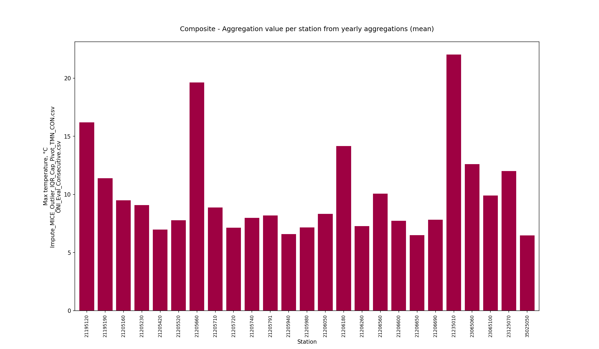
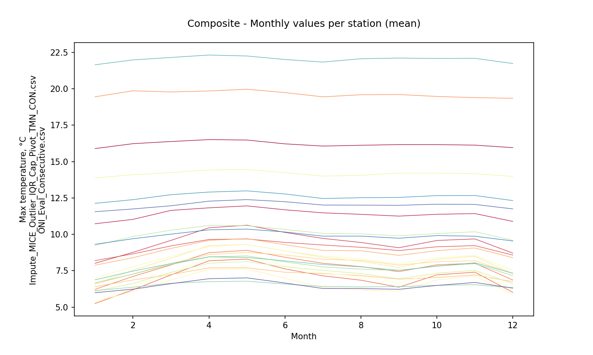
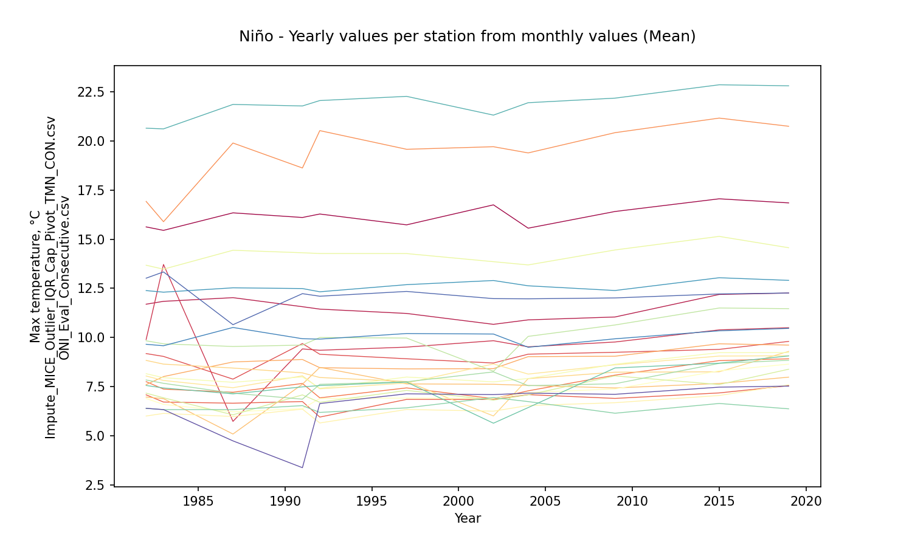
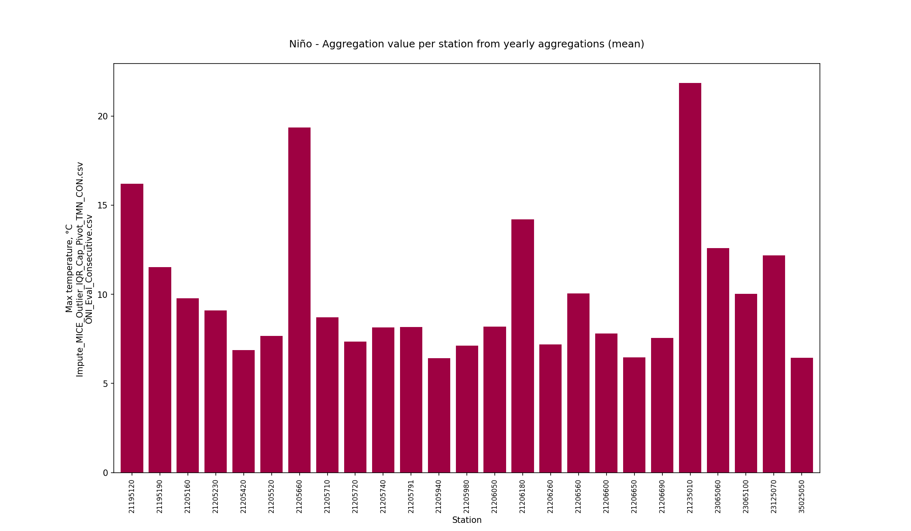
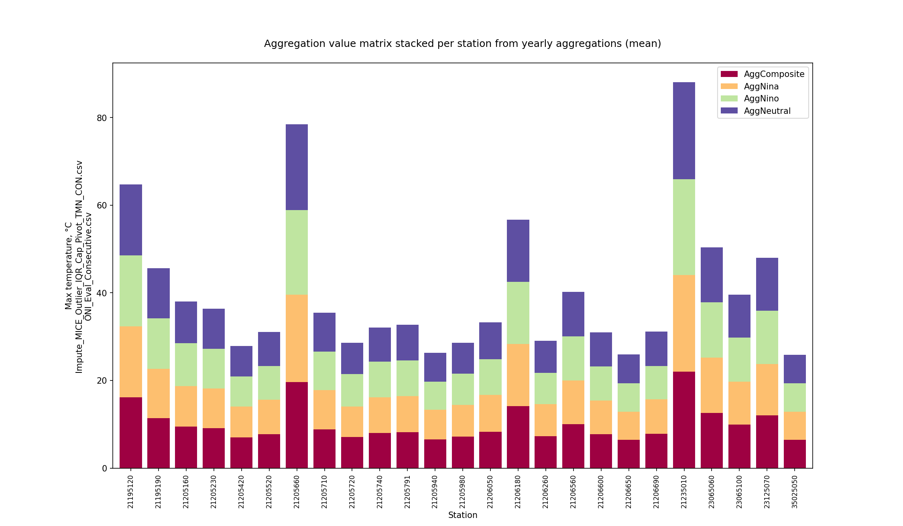
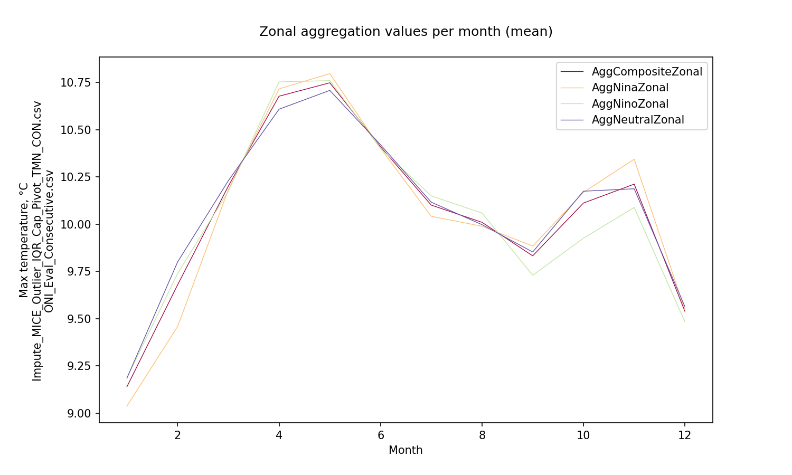

# Statistical aggregations for hydro-climatological composite series and yearly events Niño, Niña and Neutral

For further information about the NOAA - Oceanic Niño Index (ONI) classifier for climatological yearly events Niño, Niña and Neutral, check this activity https://github.com/rcfdtools/R.LTWB/tree/main/Section03/ENSOONI

* Station records file: [Impute_MICE_Outlier_IQR_Cap_Pivot_TMN_CON.csv](../IDEAM_Impute/Impute_MICE_Outlier_IQR_Cap_Pivot_TMN_CON.csv)
* ENSO-ONI year file: [ONI_Eval_Consecutive.csv](../ENSOONI/ONI_Eval_Consecutive.csv)
* Stations: 26
* Records: 16779
* Daily serie: True
* Aggregation function: Mean
* Execution date: 2023-09-23 12:35:32.010329
* Python version: 3.11.5 (tags/v3.11.5:cce6ba9, Aug 24 2023, 14:38:34) [MSC v.1936 64 bit (AMD64)]
* Python path: ['C:\\JLGC\\R.LTWB\\.src', 'C:\\Python311\\python311.zip', 'C:\\Python311\\DLLs', 'C:\\Python311\\Lib', 'C:\\Python311']
* matplotlib version: 3.6.0
* pandas version: 2.1.0
* Instructions & script: https://github.com/rcfdtools/R.LTWB/tree/main/Section03/Agg
* License: https://github.com/rcfdtools/R.LTWB/blob/main/LICENSE.md
* Credits: r.cfdtools@gmail.com

## Composite - Yearly values per station from monthly values (Mean)

Daily values to year-month aggregation (Mean) file: [Agg_YM_Impute_MICE_Outlier_IQR_Cap_Pivot_TMN_CON.csv](Agg_YM_Impute_MICE_Outlier_IQR_Cap_Pivot_TMN_CON.csv)

|   Year |   21195120 |   21195190 |   21205160 |   21205230 |   21205420 |   21205520 |   21205660 |   21205710 |   21205720 |   21205740 |   21205791 |   21205940 |   21205980 |   21206050 |   21206180 |   21206260 |   21206560 |   21206600 |   21206650 |   21206690 |   21235010 |   23065060 |   23065100 |   23125070 |   35025050 |
|-------:|-----------:|-----------:|-----------:|-----------:|-----------:|-----------:|-----------:|-----------:|-----------:|-----------:|-----------:|-----------:|-----------:|-----------:|-----------:|-----------:|-----------:|-----------:|-----------:|-----------:|-----------:|-----------:|-----------:|-----------:|-----------:|
|   1978 |    16.1944 |   11.3908  |    9.48054 |    9.08764 |    6.97731 |    7.77234 |    19.6288 |    8.87936 |    7.14175 |    7.98581 |    8.18149 |    6.58338 |    7.15334 |    8.32367 |    14.1656 |    7.27102 |   10.0615  |    7.73286 |    6.48771 |    7.81565 |    22.0281 |    12.5909 |    9.89108 |   12.007   |    6.47875 |
|   1979 |    16.1944 |   11.3908  |    9.48054 |    9.08764 |    6.97731 |    7.77234 |    19.6288 |    8.87936 |    7.14175 |    7.98581 |    8.18149 |    6.58338 |    7.15334 |    8.32367 |    14.1656 |    7.27102 |   10.0615  |    7.73286 |    6.48771 |    7.81565 |    22.0281 |    12.5909 |    9.89108 |   12.007   |    6.47875 |
|   1980 |    16.1825 |   11.6834  |    9.02844 |    8.95411 |    6.10196 |    6.93725 |    19.9953 |    8.34881 |    7.11494 |    8.26473 |    7.2187  |    5.33046 |    5.7487  |    7.52416 |    14.0975 |    6.82954 |    9.70985 |    7.26067 |    6.31087 |    7.42294 |    21.9361 |    12.3468 |    9.67852 |   12.6167  |    6.1486  |
|   1981 |    15.9579 |   11.4921  |    9.00579 |    9.09627 |    6.69411 |    7.41364 |    18.7775 |    8.27601 |    6.81508 |    8.44552 |    7.52312 |    6.02478 |    6.20739 |    7.73714 |    13.9363 |    7.00083 |    9.73618 |    7.50068 |    6.36275 |    7.49889 |    21.8221 |    12.3893 |    9.72374 |   12.2747  |    6.27251 |
|   1982 |    15.6262 |   11.6918  |    9.89278 |    9.17852 |    7.07847 |    7.74938 |    16.9242 |    7.59632 |    6.96524 |    8.8307  |    8.03603 |    5.99993 |    6.89133 |    8.15354 |    13.676  |    7.16196 |    9.82899 |    7.83444 |    6.38813 |    7.55415 |    20.651  |    12.3844 |    9.65062 |   13.0165  |    6.39162 |
|   1983 |    15.4503 |   11.8375  |   13.7149  |    9.03407 |    6.71176 |    7.36928 |    15.8912 |    8.00735 |    6.88329 |    8.64194 |    7.81004 |    6.13189 |    6.59095 |    7.95149 |    13.4751 |    6.92733 |    9.67452 |    7.66445 |    6.32637 |    7.42785 |    20.6164 |    12.3042 |    9.57689 |   13.3348  |    6.32658 |
|   1984 |    15.3323 |   11.2483  |   10.0251  |    8.27706 |    6.42609 |    7.12239 |    15.7291 |    8.22231 |    5.98134 |    8.18659 |    7.34912 |    5.93176 |    6.18562 |    7.36065 |    13.4062 |    6.30488 |    9.4254  |    7.39718 |    6.27264 |    7.09791 |    21.6222 |    12.1999 |    9.47162 |   12.0755  |    6.23581 |
|   1985 |    16.0369 |   11.3363  |    6.22157 |    8.89746 |    5.85917 |    6.59126 |    19.6656 |    8.26177 |    5.28439 |    7.83597 |    6.74947 |    5.55177 |    4.805   |    6.97798 |    13.9716 |    6.60844 |    9.31628 |    6.82486 |    6.32968 |    7.10888 |    21.7705 |    12.2601 |    9.53625 |   11.8173  |    5.93659 |
|   1986 |    16.255  |   11.5157  |    7.37421 |    9.27406 |    6.76668 |    7.54956 |    20.0005 |    8.7949  |    5.37077 |    8.38386 |    7.57179 |    6.58884 |    6.50921 |    7.96312 |    14.2421 |    7.11366 |    9.74295 |    7.59332 |    6.3687  |    7.59334 |    21.8233 |    12.5274 |    9.84852 |   11.7115  |    6.32904 |
|   1987 |    16.3416 |   12.0249  |    5.7274  |    7.87749 |    6.65219 |    7.21051 |    19.897  |    8.75119 |    5.0822  |    8.44196 |    7.44    |    5.97619 |    6.21465 |    7.71649 |    14.4376 |    6.06121 |    9.53983 |    7.16339 |    6.32681 |    7.12834 |    21.861  |    12.526  |   10.5073  |   10.6487  |    4.73385 |
|   1988 |    16.3388 |   11.6192  |    7.8346  |    7.24393 |    6.82647 |    7.31547 |    20.0737 |    8.77199 |    5.20434 |    8.20676 |    7.40796 |    6.13282 |    6.42103 |    7.87049 |    14.5042 |    5.39755 |    9.34902 |    6.82451 |    6.3285  |    6.79804 |    21.7648 |    12.5511 |    9.80869 |    9.89903 |    3.15001 |
|   1989 |    16.1587 |   11.1963  |    7.31078 |    8.13509 |    6.34691 |    7.00611 |    19.9037 |    8.35451 |    5.58005 |    8.11892 |    6.96387 |    5.60659 |    5.97515 |    7.48928 |    14.1901 |    5.81132 |    9.16749 |    6.60014 |    6.27374 |    6.78186 |    21.678  |    12.4581 |    9.57065 |   10.5349  |    2.97237 |
|   1990 |    16.3644 |   11.8508  |    8.09723 |    9.57334 |    6.84441 |    7.43032 |    19.8281 |    8.86419 |    7.94263 |    8.87659 |    7.77222 |    6.37491 |    5.73395 |    8.19798 |    14.4408 |    6.96904 |    9.60542 |    6.82796 |    6.55921 |    7.45973 |    22.1103 |    12.6014 |    9.68482 |   12.4216  |    3.28171 |
|   1991 |    16.1061 |   11.5644  |    9.41562 |    9.68947 |    6.73636 |    7.65588 |    18.6257 |    8.87754 |    7.61982 |    8.19566 |    8.04596 |    6.35195 |    6.37403 |    7.99113 |    14.3101 |    7.07604 |    9.61025 |    6.85768 |    6.5291  |    7.48363 |    21.7827 |    12.4886 |    9.93453 |   12.2282  |    3.36975 |
|   1992 |    16.2828 |   11.4418  |    9.34659 |    9.14335 |    5.94618 |    6.92535 |    20.5274 |    8.45915 |    8.47509 |    7.96048 |    7.3862  |    5.64547 |    6.89297 |    7.41364 |    14.2727 |    6.69636 |    9.99719 |    7.61257 |    6.18335 |    7.55004 |    22.0582 |    12.3237 |    9.91445 |   12.0979  |    6.6338  |
|   1993 |    16.3689 |   11.2162  |    9.20227 |    9.585   |    6.68132 |    7.23492 |    20.4774 |    8.72749 |    7.71999 |    8.17558 |    7.86609 |    6.11697 |    6.42436 |    7.84174 |    14.0909 |    6.8336  |   10.051   |    7.64797 |    6.42435 |    7.65548 |    22.0954 |    12.2699 |    9.66692 |   11.9664  |    6.94192 |
|   1994 |    16.286  |    9.76035 |    9.00806 |    8.98701 |    7.11311 |    7.7897  |    19.9588 |    8.84241 |    7.31212 |    7.74084 |    7.87143 |    6.27506 |    6.93107 |    8.27804 |    14.1886 |    7.27088 |   10.0853  |    7.75546 |    6.46482 |    7.81975 |    22.2868 |    12.2215 |   10.1591  |   11.5034  |    7.1154  |
|   1995 |    16.0623 |   10.4199  |    8.46064 |    8.8428  |    6.73615 |    7.17605 |    20.4197 |    8.65118 |    6.95403 |    7.68095 |    6.96614 |    5.89152 |    6.43552 |    7.9116  |    14.163  |    6.82272 |    9.76821 |    7.54534 |    6.17294 |    7.48083 |    21.787  |    12.1655 |    9.93543 |   11.584   |    7.00901 |
|   1996 |    15.3417 |   11.1771  |    9.05651 |    9.04951 |    6.74378 |    7.32444 |    19.9221 |    8.96252 |    7.32842 |    8.18969 |    7.24028 |    6.09749 |    6.85247 |    7.95685 |    13.9428 |    7.24384 |    9.65028 |    7.79569 |    5.82999 |    7.60791 |    21.8699 |    11.3065 |    9.79407 |   12.1051  |    7.09806 |
|   1997 |    15.7309 |   11.2212  |    9.50693 |    8.91399 |    6.84526 |    7.43101 |    19.5775 |    8.39913 |    7.63377 |    7.75532 |    7.68004 |    6.33328 |    6.91126 |    7.98461 |    14.2689 |    7.3045  |    9.96842 |    7.74323 |    6.41602 |    7.72473 |    22.2714 |    12.6866 |   10.1988  |   12.3417  |    7.13056 |
|   1998 |    15.9421 |   11.3425  |   10.1727  |    9.39847 |    7.49077 |    8.15137 |    19.8563 |    8.87826 |    7.73505 |    8.82744 |    8.67317 |    6.88305 |    7.65744 |    8.58395 |    14.411  |    7.6046  |    9.88995 |    8.37077 |    6.67558 |    7.87996 |    22.1478 |    12.9268 |   10.4188  |   12.4681  |    7.70325 |
|   1999 |    14.8888 |   10.9664  |    9.3427  |    9.46092 |    7.14665 |    7.81529 |    19.0587 |    8.73617 |    7.49283 |    9.1271  |    8.64659 |    6.78495 |    7.37664 |    8.33527 |    13.7299 |    7.17036 |   10.1752  |    8.20285 |    6.54876 |    7.87513 |    22.0806 |    12.3072 |    9.55261 |   11.4083  |    7.04226 |
|   2000 |    14.8659 |   11.3614  |    9.40095 |    9.01946 |    6.72969 |    7.31711 |    19.262  |    8.76037 |    7.46636 |    7.77253 |    8.02545 |    6.25261 |    6.89137 |    7.91065 |    13.6853 |    6.75294 |    9.54206 |    7.69567 |    6.50862 |    7.36001 |    21.8173 |    12.6567 |    9.74919 |   11.9896  |    7.0524  |
|   2001 |    15.636  |   11.113   |    9.2662  |    8.99956 |    6.59947 |    7.25169 |    19.978  |    8.7725  |    7.55581 |    7.76485 |    8.00096 |    6.20839 |    6.51214 |    7.85447 |    13.8385 |    6.93704 |    9.81655 |    7.5394  |    6.72308 |    7.55651 |    21.9224 |    13.054  |   10.0396  |   11.9326  |    6.81849 |
|   2002 |    16.7485 |   10.6671  |    9.83297 |    8.69817 |    6.84265 |    6.88314 |    19.708  |    8.4112  |    7.61652 |    6.00314 |    8.65011 |    6.24617 |    6.89292 |    7.73703 |    13.856  |    6.80999 |    8.27884 |    8.24545 |    6.93987 |    5.63398 |    21.317  |    12.8979 |   10.1733  |   11.9757  |    7.08961 |
|   2003 |    16.2235 |   11.011   |    9.5943  |    9.27094 |    6.97764 |    7.41446 |    19.5062 |    8.6425  |    7.68315 |    8.47189 |    8.32409 |    6.32812 |    7.13653 |    7.96404 |    13.6853 |    6.44562 |    9.75791 |    7.83684 |    7.48338 |    6.94979 |    21.8713 |    12.9595 |   10.0544  |   12.0017  |    6.87479 |
|   2004 |    15.5616 |   10.8936  |    9.52276 |    9.14802 |    7.08822 |    7.28255 |    19.3925 |    9.02198 |    7.55746 |    7.90408 |    8.13421 |    6.53391 |    7.19203 |    7.90994 |    13.6906 |    7.07585 |   10.0535  |    7.54423 |    6.73439 |    6.43    |    21.9485 |    12.6281 |    9.49918 |   11.966   |    7.16408 |
|   2005 |    16.361  |   10.4241  |    9.60005 |    8.928   |    7.1935  |    8.0979  |    18.8477 |    8.97266 |    7.12309 |    7.39894 |    8.38668 |    6.39894 |    7.28325 |    8.87045 |    14.0382 |    7.48519 |   10.2303  |    7.59452 |    6.66636 |    7.6385  |    21.8424 |    12.7129 |    9.023   |   11.9298  |    6.33158 |
|   2006 |    15.7554 |   10.2975  |    9.91844 |    9.16508 |    7.6843  |    8.92272 |    16.7189 |    8.97874 |    7.44064 |    8.2538  |    8.68026 |    7.57281 |    7.88413 |    9.67957 |    13.7267 |    7.57272 |    9.72435 |    8.05469 |    7.05587 |    7.76636 |    21.6516 |    12.5683 |    9.58902 |   11.98    |    6.55383 |
|   2007 |    15.9472 |    9.80288 |    9.25347 |    8.97185 |    6.97364 |    7.42847 |    18.3173 |    8.34007 |    7.66168 |    8.27872 |    8.00205 |    6.24696 |    6.86441 |    8.12152 |    13.916  |    7.21013 |    9.38397 |    7.6795  |    6.71679 |    7.17793 |    21.6071 |    12.6748 |    9.35825 |   11.7931  |    6.72613 |
|   2008 |    15.6257 |    9.97327 |    9.56737 |    9.23055 |    7.27359 |    7.736   |    19.7716 |    8.92403 |    7.32012 |    7.90137 |    8.26737 |    7.37896 |    7.50496 |    8.46503 |    14.1384 |    7.44875 |    9.55499 |    7.50235 |    6.53228 |    8.16551 |    21.4176 |    12.4443 |    9.58141 |   11.8731  |    6.82879 |
|   2009 |    16.4109 |   11.0409  |    9.76717 |    9.24383 |    6.89605 |    8.08198 |    20.4231 |    9.04354 |    7.42902 |    8.23056 |    8.6071  |    6.67691 |    7.37973 |    8.63759 |    14.4526 |    8.04237 |   10.6337  |    7.64264 |    6.14222 |    8.44684 |    22.1809 |    12.3891 |    9.93058 |   12.0108  |    7.10524 |
|   2010 |    16.5599 |   11.5985  |   10.1945  |    9.5495  |    7.28924 |    8.412   |    20.5348 |    9.72893 |    7.01606 |    8.19956 |    9.14185 |    7.58947 |    7.93502 |    8.95714 |    14.0458 |    8.3878  |   10.6202  |    7.74052 |    7.40071 |    8.75368 |    22.4926 |    12.7796 |    9.85716 |   12.1768  |    7.42911 |
|   2011 |    16.7998 |   11.9888  |   10.6129  |    9.03027 |    7.8017  |    8.32524 |    20.1226 |    9.13794 |    6.8557  |    5.90189 |    9.5402  |    7.03009 |    7.98689 |    9.12039 |    13.9267 |    8.14153 |   10.6549  |    5.7208  |    7.18406 |    8.67247 |    22.3934 |    12.8081 |    9.53304 |   12.3012  |    6.93055 |
|   2012 |    16.8145 |   11.7488  |    9.95057 |    8.58853 |    7.08089 |    7.70041 |    20.2838 |    8.85694 |    6.02193 |    4.60714 |    8.60442 |    7.00751 |    7.66868 |    8.63848 |    14.1169 |    7.77218 |   10.6329  |    6.11188 |    7.0747  |    8.66001 |    22.4654 |    12.7371 |    9.55058 |   12.1309  |    6.84547 |
|   2013 |    16.7237 |   11.8502  |   10.1902  |    8.56743 |    6.97581 |    7.90496 |    20.4247 |    8.76146 |    7.35098 |    4.90866 |    8.64427 |    6.96084 |    7.70339 |    8.7628  |    14.6246 |    7.76043 |   10.7297  |    8.20512 |    7.15072 |    8.62579 |    22.5765 |    12.9936 |    9.76527 |   12.135   |    7.01035 |
|   2014 |    17.0576 |   12.1969  |   10.4758  |    8.84492 |    6.92918 |    8.31202 |    20.5752 |    9.3616  |    7.76196 |    5.79348 |    8.94796 |    7.1974  |    8.0677  |    9.03026 |    14.75   |    7.39996 |   11.1616  |    8.00103 |    7.40504 |    8.6607  |    22.92   |    12.7284 |    9.76835 |   12.2059  |    7.12735 |
|   2015 |    17.0566 |   12.1884  |   10.3853  |    9.39252 |    7.17539 |    8.82089 |    21.1653 |    9.67575 |    7.65711 |    8.25128 |    9.05209 |    7.04553 |    8.29929 |    9.22469 |    15.1433 |    7.60238 |   11.4982  |    8.68026 |    6.63837 |    8.68889 |    22.8608 |    13.039  |   10.3375  |   12.2132  |    7.46949 |
|   2016 |    17.2177 |   12.3431  |   10.4338  |    9.66727 |    7.50429 |    8.96873 |    21.0661 |    9.81516 |    7.66931 |    9.05331 |    9.09802 |    7.41826 |    8.50842 |    9.27492 |    14.9677 |    8.12318 |   10.4144  |    9.07534 |    7.51764 |    8.57192 |    23.2182 |    13.0178 |   10.6671  |   12.2595  |    7.65587 |
|   2017 |    16.8018 |   12.225   |   10.3528  |    9.52235 |    7.71733 |    8.71058 |    20.4228 |    9.89786 |    7.45707 |    8.46857 |    9.00654 |    7.34737 |    8.35268 |    9.12119 |    14.5837 |    8.06498 |   10.8217  |    8.78236 |    7.19753 |    8.73877 |    22.4739 |    12.8822 |   10.3703  |   12.252   |    7.09933 |
|   2018 |    16.2193 |   12.0106  |   10.0803  |    9.72373 |    7.42421 |    8.64736 |    20.4715 |    9.81667 |    7.16655 |    9.38503 |    8.83229 |    7.43225 |    8.21562 |    8.97576 |    14.4354 |    8.12386 |   11.0958  |    8.82681 |    6.79113 |    8.75134 |    22.3714 |    12.82   |   10.3941  |   12.1948  |    7.24898 |
|   2019 |    16.8486 |   12.2587  |   10.4945  |    9.79787 |    7.543   |    8.912   |    20.7494 |    9.61099 |    7.97853 |    9.2902  |    9.06712 |    7.5879  |    8.64176 |    9.22789 |    14.5657 |    8.38152 |   11.4655  |    8.83578 |    6.36634 |    9.0592  |    22.8088 |    12.9052 |   10.4609  |   12.2624  |    7.52288 |
|   2020 |    16.6739 |   11.993   |   10.197   |    9.61041 |    7.26232 |    8.59048 |    20.9417 |    9.39571 |    7.66979 |    8.72833 |    8.73117 |    7.4621  |    8.35725 |    8.99125 |    14.5553 |    8.05821 |   10.7894  |    8.83307 |    4.62123 |    8.722   |    22.6751 |    12.8475 |   10.4121  |   12.1716  |    7.48967 |
|   2021 |    16.7473 |   12.2209  |   10.5124  |    9.64992 |    7.80203 |    8.76447 |    20.2865 |    9.6029  |    7.76347 |    8.58822 |    9.05646 |    7.6281  |    8.64696 |    9.18361 |    14.3425 |    8.40454 |   10.8958  |    8.79223 |    4.50841 |    9.07304 |    22.3519 |    12.8383 |   10.3605  |   12.2712  |    6.85838 |
|   2022 |    16.7188 |   11.9963  |   10.4355  |    9.58576 |    7.66227 |    8.69004 |    20.0387 |    9.55809 |    7.42328 |    8.36011 |    8.98845 |    7.66709 |    8.69073 |    9.16155 |    14.3257 |    8.51481 |   10.6961  |    8.64031 |    4.57127 |    9.12512 |    22.0508 |    12.8271 |   10.2596  |   12.2459  |    5.57277 |

Composite - Aggregation value per station from yearly aggregations (mean)

|              |   21195120 |   21195190 |   21205160 |   21205230 |   21205420 |   21205520 |   21205660 |   21205710 |   21205720 |   21205740 |   21205791 |   21205940 |   21205980 |   21206050 |   21206180 |   21206260 |   21206560 |   21206600 |   21206650 |   21206690 |   21235010 |   23065060 |   23065100 |   23125070 |   35025050 |
|:-------------|-----------:|-----------:|-----------:|-----------:|-----------:|-----------:|-----------:|-----------:|-----------:|-----------:|-----------:|-----------:|-----------:|-----------:|-----------:|-----------:|-----------:|-----------:|-----------:|-----------:|-----------:|-----------:|-----------:|-----------:|-----------:|
| AggComposite |     16.196 |    11.3909 |    9.48322 |    9.08874 |    6.98064 |    7.77598 |    19.6306 |    8.88066 |    7.14277 |    7.98609 |    8.18601 |    6.58698 |    7.15692 |    8.32682 |    14.1666 |    7.27259 |    10.0637 |    7.73488 |    6.48884 |    7.81798 |    22.0295 |    12.5919 |     9.8922 |    12.0076 |    6.47967 |

Composite - Aggregation value per station from yearly aggregations (std - standard deviation)

|                 |   21195120 |   21195190 |   21205160 |   21205230 |   21205420 |   21205520 |   21205660 |   21205710 |   21205720 |   21205740 |   21205791 |   21205940 |   21205980 |   21206050 |   21206180 |   21206260 |   21206560 |   21206600 |   21206650 |   21206690 |   21235010 |   23065060 |   23065100 |   23125070 |   35025050 |
|:----------------|-----------:|-----------:|-----------:|-----------:|-----------:|-----------:|-----------:|-----------:|-----------:|-----------:|-----------:|-----------:|-----------:|-----------:|-----------:|-----------:|-----------:|-----------:|-----------:|-----------:|-----------:|-----------:|-----------:|-----------:|-----------:|
| StdAggComposite |   0.549887 |    0.65731 |    1.25909 |   0.503737 |   0.452236 |    0.64322 |    1.22254 |   0.513325 |   0.793184 |    1.02397 |   0.692758 |   0.639771 |   0.894518 |   0.632583 |   0.372142 |   0.696486 |   0.651304 |   0.720339 |   0.648397 |   0.764361 |   0.506089 |   0.319501 |   0.360853 |   0.561076 |     1.1758 |

Composite - Monthly values per station (mean)

|   Month |   21195120 |   21195190 |   21205160 |   21205230 |   21205420 |   21205520 |   21205660 |   21205710 |   21205720 |   21205740 |   21205791 |   21205940 |   21205980 |   21206050 |   21206180 |   21206260 |   21206560 |   21206600 |   21206650 |   21206690 |   21235010 |   23065060 |   23065100 |   23125070 |   35025050 |
|--------:|-----------:|-----------:|-----------:|-----------:|-----------:|-----------:|-----------:|-----------:|-----------:|-----------:|-----------:|-----------:|-----------:|-----------:|-----------:|-----------:|-----------:|-----------:|-----------:|-----------:|-----------:|-----------:|-----------:|-----------:|-----------:|
|       1 |    15.8956 |    10.7299 |    8.01457 |    8.19586 |    5.24899 |    6.22098 |    19.4529 |    7.88152 |    6.40515 |    6.60527 |    6.56128 |    5.38401 |    5.33399 |    6.99856 |    13.8785 |    6.09077 |    9.23471 |    6.6751  |    6.14076 |    6.87587 |    21.6538 |    12.1329 |    9.31561 |    11.5568 |    5.99287 |
|       2 |    16.2334 |    11.0315 |    8.76531 |    8.66163 |    6.19433 |    7.11249 |    19.8688 |    8.39834 |    6.8691  |    7.28096 |    7.53849 |    6.07077 |    6.39567 |    7.78893 |    14.0971 |    6.63264 |    9.85465 |    7.26732 |    6.36965 |    7.47889 |    21.9896 |    12.3868 |    9.70237 |    11.748  |    6.23714 |
|       3 |    16.3806 |    11.6486 |    9.58814 |    9.20775 |    7.21271 |    7.89914 |    19.7855 |    9.03398 |    7.24151 |    7.99669 |    8.35756 |    6.86927 |    7.35927 |    8.48771 |    14.2512 |    7.3895  |   10.2881  |    7.93231 |    6.64045 |    7.99335 |    22.1567 |    12.726  |   10.0166  |    11.9653 |    6.61484 |
|       4 |    16.5129 |    11.8242 |   10.4517  |    9.64851 |    8.18475 |    8.74013 |    19.8552 |    9.58774 |    7.69928 |    8.60882 |    9.22736 |    7.59784 |    8.32367 |    9.16833 |    14.4281 |    8.01733 |   10.6146  |    8.45317 |    6.75179 |    8.45831 |    22.3243 |    12.908  |   10.3121  |    12.2828 |    6.95405 |
|       5 |    16.4831 |    11.9577 |   10.6323  |    9.68641 |    8.30243 |    8.90344 |    19.9722 |    9.7076  |    7.70607 |    8.75929 |    9.31498 |    7.62174 |    8.42746 |    9.31492 |    14.4568 |    8.12977 |   10.5992  |    8.52087 |    6.78441 |    8.41651 |    22.2581 |    12.9906 |   10.3625  |    12.3902 |    7.01229 |
|       6 |    16.2206 |    11.69   |   10.1343  |    9.44803 |    7.62792 |    8.42973 |    19.7441 |    9.2903  |    7.39844 |    8.58541 |    8.8655  |    6.98714 |    7.85773 |    8.85988 |    14.2461 |    7.77402 |   10.3408  |    8.11015 |    6.58916 |    8.18053 |    22.0182 |    12.7761 |   10.1649  |    12.2464 |    6.6592  |
|       7 |    16.0684 |    11.4809 |    9.724   |    9.26872 |    7.15386 |    8.01424 |    19.4511 |    8.89701 |    7.31233 |    8.28976 |    8.43075 |    6.35717 |    7.35277 |    8.51409 |    14.002  |    7.53417 |   10.0689  |    7.76723 |    6.42225 |    7.92926 |    21.8396 |    12.4658 |    9.88031 |    12.0171 |    6.28179 |
|       8 |    16.124  |    11.378  |    9.44364 |    9.11386 |    6.8508  |    7.78594 |    19.5968 |    8.87464 |    7.16728 |    8.21801 |    8.14579 |    6.18973 |    7.1058  |    8.32487 |    14.0596 |    7.3014  |   10.0345  |    7.61283 |    6.38842 |    7.76874 |    22.0688 |    12.5191 |    9.883   |    12.0096 |    6.28012 |
|       9 |    16.1692 |    11.2564 |    9.08183 |    8.89006 |    6.36983 |    7.43707 |    19.6104 |    8.56027 |    6.92662 |    7.89399 |    7.72791 |    6.09603 |    6.67089 |    7.98247 |    14.21   |    6.95332 |    9.9028  |    7.51505 |    6.4077  |    7.53024 |    22.1166 |    12.5395 |    9.73639 |    11.9965 |    6.22664 |
|      10 |    16.1684 |    11.3811 |    9.58219 |    9.14973 |    7.21734 |    7.90884 |    19.4787 |    8.88069 |    7.03262 |    8.1188  |    8.28837 |    6.87319 |    7.35871 |    8.39032 |    14.2134 |    7.32416 |   10.0564  |    7.82616 |    6.49876 |    7.81394 |    22.0845 |    12.665  |    9.91799 |    12.0737 |    6.49167 |
|      11 |    16.1336 |    11.4286 |    9.68748 |    9.22904 |    7.40421 |    8.01292 |    19.3965 |    9.06826 |    7.21015 |    8.19034 |    8.49389 |    7.12459 |    7.50333 |    8.56    |    14.1749 |    7.52643 |   10.1796  |    7.98522 |    6.54209 |    8.0464  |    22.097  |    12.6715 |    9.87431 |    12.06   |    6.69634 |
|      12 |    15.9596 |    10.8928 |    8.71313 |    8.57728 |    6.01891 |    6.86681 |    19.3533 |    8.39702 |    6.75415 |    7.30578 |    7.30098 |    5.87623 |    6.2138  |    7.54787 |    13.9798 |    6.61464 |    9.59667 |    7.16231 |    6.33143 |    7.33432 |    21.7421 |    12.323  |    9.54613 |    11.7501 |    6.30877 |

Composite - Zonal monthly values (mean)

|   Month |   AggCompositeZonal |
|--------:|--------------------:|
|       1 |             9.13905 |
|       2 |             9.67896 |
|       3 |            10.2017  |
|       4 |            10.6774  |
|       5 |            10.7484  |
|       6 |            10.4098  |
|       7 |            10.1009  |
|       8 |            10.0098  |
|       9 |             9.8323  |
|      10 |            10.1118  |
|      11 |            10.2119  |
|      12 |             9.53867 |

## ENSO-ONI Events - Yearly values per station from monthly values (Mean)

* Records in ENSO-ONI file: 74
* ENSO-ONI eventMark unique values: [-1  1  0]

### Niña events analysis (24 years identified)

|   Id |   YR |   NinaCount |   NinoCount |   NeutralCount | Event   |   EventMark |   EventLabel |
|-----:|-----:|------------:|------------:|---------------:|:--------|------------:|-------------:|
|    0 | 1950 |           7 |           0 |              5 | Niña    |          -1 |            7 |
|    4 | 1954 |           8 |           1 |              3 | Niña    |          -1 |            8 |
|    5 | 1955 |          12 |           0 |              0 | Niña    |          -1 |           12 |
|    6 | 1956 |           8 |           0 |              4 | Niña    |          -1 |            8 |
|   14 | 1964 |           8 |           2 |              2 | Niña    |          -1 |            8 |
|   20 | 1970 |           6 |           1 |              5 | Niña    |          -1 |            6 |
|   21 | 1971 |          12 |           0 |              0 | Niña    |          -1 |           12 |
|   23 | 1973 |           8 |           3 |              1 | Niña    |          -1 |            8 |
|   24 | 1974 |           7 |           0 |              5 | Niña    |          -1 |            7 |
|   25 | 1975 |          12 |           0 |              0 | Niña    |          -1 |           12 |
|   35 | 1985 |           6 |           0 |              6 | Niña    |          -1 |            6 |
|   38 | 1988 |           8 |           2 |              2 | Niña    |          -1 |            8 |
|   39 | 1989 |           5 |           0 |              7 | Niña    |          -1 |            5 |
|   45 | 1995 |           5 |           3 |              4 | Niña    |          -1 |            5 |
|   48 | 1998 |           6 |           4 |              2 | Niña    |          -1 |            6 |
|   49 | 1999 |          12 |           0 |              0 | Niña    |          -1 |           12 |
|   50 | 2000 |          12 |           0 |              0 | Niña    |          -1 |           12 |
|   57 | 2007 |           6 |           1 |              5 | Niña    |          -1 |            6 |
|   58 | 2008 |           6 |           0 |              6 | Niña    |          -1 |            6 |
|   60 | 2010 |           7 |           3 |              2 | Niña    |          -1 |            7 |
|   61 | 2011 |           5 |           0 |              7 | Niña    |          -1 |            5 |
|   66 | 2016 |           5 |           4 |              3 | Niña    |          -1 |            5 |
|   70 | 2020 |           5 |           1 |              6 | Niña    |          -1 |            5 |
|   72 | 2022 |          12 |           0 |              0 | Niña    |          -1 |           12 |

Niña - Table aggregations (Mean)

|   Year |   21195120 |   21195190 |   21205160 |   21205230 |   21205420 |   21205520 |   21205660 |   21205710 |   21205720 |   21205740 |   21205791 |   21205940 |   21205980 |   21206050 |   21206180 |   21206260 |   21206560 |   21206600 |   21206650 |   21206690 |   21235010 |   23065060 |   23065100 |   23125070 |   35025050 |
|-------:|-----------:|-----------:|-----------:|-----------:|-----------:|-----------:|-----------:|-----------:|-----------:|-----------:|-----------:|-----------:|-----------:|-----------:|-----------:|-----------:|-----------:|-----------:|-----------:|-----------:|-----------:|-----------:|-----------:|-----------:|-----------:|
|   1985 |    16.0369 |   11.3363  |    6.22157 |    8.89746 |    5.85917 |    6.59126 |    19.6656 |    8.26177 |    5.28439 |    7.83597 |    6.74947 |    5.55177 |    4.805   |    6.97798 |    13.9716 |    6.60844 |    9.31628 |    6.82486 |    6.32968 |    7.10888 |    21.7705 |    12.2601 |    9.53625 |   11.8173  |    5.93659 |
|   1988 |    16.3388 |   11.6192  |    7.8346  |    7.24393 |    6.82647 |    7.31547 |    20.0737 |    8.77199 |    5.20434 |    8.20676 |    7.40796 |    6.13282 |    6.42103 |    7.87049 |    14.5042 |    5.39755 |    9.34902 |    6.82451 |    6.3285  |    6.79804 |    21.7648 |    12.5511 |    9.80869 |    9.89903 |    3.15001 |
|   1989 |    16.1587 |   11.1963  |    7.31078 |    8.13509 |    6.34691 |    7.00611 |    19.9037 |    8.35451 |    5.58005 |    8.11892 |    6.96387 |    5.60659 |    5.97515 |    7.48928 |    14.1901 |    5.81132 |    9.16749 |    6.60014 |    6.27374 |    6.78186 |    21.678  |    12.4581 |    9.57065 |   10.5349  |    2.97237 |
|   1995 |    16.0623 |   10.4199  |    8.46064 |    8.8428  |    6.73615 |    7.17605 |    20.4197 |    8.65118 |    6.95403 |    7.68095 |    6.96614 |    5.89152 |    6.43552 |    7.9116  |    14.163  |    6.82272 |    9.76821 |    7.54534 |    6.17294 |    7.48083 |    21.787  |    12.1655 |    9.93543 |   11.584   |    7.00901 |
|   1998 |    15.9421 |   11.3425  |   10.1727  |    9.39847 |    7.49077 |    8.15137 |    19.8563 |    8.87826 |    7.73505 |    8.82744 |    8.67317 |    6.88305 |    7.65744 |    8.58395 |    14.411  |    7.6046  |    9.88995 |    8.37077 |    6.67558 |    7.87996 |    22.1478 |    12.9268 |   10.4188  |   12.4681  |    7.70325 |
|   1999 |    14.8888 |   10.9664  |    9.3427  |    9.46092 |    7.14665 |    7.81529 |    19.0587 |    8.73617 |    7.49283 |    9.1271  |    8.64659 |    6.78495 |    7.37664 |    8.33527 |    13.7299 |    7.17036 |   10.1752  |    8.20285 |    6.54876 |    7.87513 |    22.0806 |    12.3072 |    9.55261 |   11.4083  |    7.04226 |
|   2000 |    14.8659 |   11.3614  |    9.40095 |    9.01946 |    6.72969 |    7.31711 |    19.262  |    8.76037 |    7.46636 |    7.77253 |    8.02545 |    6.25261 |    6.89137 |    7.91065 |    13.6853 |    6.75294 |    9.54206 |    7.69567 |    6.50862 |    7.36001 |    21.8173 |    12.6567 |    9.74919 |   11.9896  |    7.0524  |
|   2007 |    15.9472 |    9.80288 |    9.25347 |    8.97185 |    6.97364 |    7.42847 |    18.3173 |    8.34007 |    7.66168 |    8.27872 |    8.00205 |    6.24696 |    6.86441 |    8.12152 |    13.916  |    7.21013 |    9.38397 |    7.6795  |    6.71679 |    7.17793 |    21.6071 |    12.6748 |    9.35825 |   11.7931  |    6.72613 |
|   2008 |    15.6257 |    9.97327 |    9.56737 |    9.23055 |    7.27359 |    7.736   |    19.7716 |    8.92403 |    7.32012 |    7.90137 |    8.26737 |    7.37896 |    7.50496 |    8.46503 |    14.1384 |    7.44875 |    9.55499 |    7.50235 |    6.53228 |    8.16551 |    21.4176 |    12.4443 |    9.58141 |   11.8731  |    6.82879 |
|   2010 |    16.5599 |   11.5985  |   10.1945  |    9.5495  |    7.28924 |    8.412   |    20.5348 |    9.72893 |    7.01606 |    8.19956 |    9.14185 |    7.58947 |    7.93502 |    8.95714 |    14.0458 |    8.3878  |   10.6202  |    7.74052 |    7.40071 |    8.75368 |    22.4926 |    12.7796 |    9.85716 |   12.1768  |    7.42911 |
|   2011 |    16.7998 |   11.9888  |   10.6129  |    9.03027 |    7.8017  |    8.32524 |    20.1226 |    9.13794 |    6.8557  |    5.90189 |    9.5402  |    7.03009 |    7.98689 |    9.12039 |    13.9267 |    8.14153 |   10.6549  |    5.7208  |    7.18406 |    8.67247 |    22.3934 |    12.8081 |    9.53304 |   12.3012  |    6.93055 |
|   2016 |    17.2177 |   12.3431  |   10.4338  |    9.66727 |    7.50429 |    8.96873 |    21.0661 |    9.81516 |    7.66931 |    9.05331 |    9.09802 |    7.41826 |    8.50842 |    9.27492 |    14.9677 |    8.12318 |   10.4144  |    9.07534 |    7.51764 |    8.57192 |    23.2182 |    13.0178 |   10.6671  |   12.2595  |    7.65587 |
|   2020 |    16.6739 |   11.993   |   10.197   |    9.61041 |    7.26232 |    8.59048 |    20.9417 |    9.39571 |    7.66979 |    8.72833 |    8.73117 |    7.4621  |    8.35725 |    8.99125 |    14.5553 |    8.05821 |   10.7894  |    8.83307 |    4.62123 |    8.722   |    22.6751 |    12.8475 |   10.4121  |   12.1716  |    7.48967 |
|   2022 |    16.7188 |   11.9963  |   10.4355  |    9.58576 |    7.66227 |    8.69004 |    20.0387 |    9.55809 |    7.42328 |    8.36011 |    8.98845 |    7.66709 |    8.69073 |    9.16155 |    14.3257 |    8.51481 |   10.6961  |    8.64031 |    4.57127 |    9.12512 |    22.0508 |    12.8271 |   10.2596  |   12.2459  |    5.57277 |

Niña - Aggregation value per station from yearly aggregations (mean)

|         |   21195120 |   21195190 |   21205160 |   21205230 |   21205420 |   21205520 |   21205660 |   21205710 |   21205720 |   21205740 |   21205791 |   21205940 |   21205980 |   21206050 |   21206180 |   21206260 |   21206560 |   21206600 |   21206650 |   21206690 |   21235010 |   23065060 |   23065100 |   23125070 |   35025050 |
|:--------|-----------:|-----------:|-----------:|-----------:|-----------:|-----------:|-----------:|-----------:|-----------:|-----------:|-----------:|-----------:|-----------:|-----------:|-----------:|-----------:|-----------:|-----------:|-----------:|-----------:|-----------:|-----------:|-----------:|-----------:|-----------:|
| AggNina |    16.1312 |    11.2813 |     9.2456 |    9.04598 |    7.06449 |    7.82312 |    19.9309 |    8.95101 |    6.95236 |    8.14235 |     8.2287 |    6.70687 |    7.24356 |    8.36936 |    14.1808 |    7.28945 |    9.95158 |    7.66114 |    6.38441 |    7.89095 |    22.0643 |    12.6232 |     9.8743 |    11.7516 |    6.39277 |

Niña - Aggregation value per station from yearly aggregations (std - standard deviation)

|            |   21195120 |   21195190 |   21205160 |   21205230 |   21205420 |   21205520 |   21205660 |   21205710 |   21205720 |   21205740 |   21205791 |   21205940 |   21205980 |   21206050 |   21206180 |   21206260 |   21206560 |   21206600 |   21206650 |   21206690 |   21235010 |   23065060 |   23065100 |   23125070 |   35025050 |
|:-----------|-----------:|-----------:|-----------:|-----------:|-----------:|-----------:|-----------:|-----------:|-----------:|-----------:|-----------:|-----------:|-----------:|-----------:|-----------:|-----------:|-----------:|-----------:|-----------:|-----------:|-----------:|-----------:|-----------:|-----------:|-----------:|
| StdAggNina |   0.678134 |   0.765541 |    1.32997 |   0.663722 |   0.531226 |   0.714697 |   0.728355 |   0.508976 |   0.911134 |   0.794575 |   0.905592 |   0.750786 |    1.08752 |   0.692874 |   0.349248 |    0.94457 |   0.590189 |   0.939132 |   0.862709 |   0.789501 |   0.487854 |   0.264252 |   0.408102 |   0.723805 |    1.53202 |

Niña - Monthly values per station (mean)

|   Month |   21195120 |   21195190 |   21205160 |   21205230 |   21205420 |   21205520 |   21205660 |   21205710 |   21205720 |   21205740 |   21205791 |   21205940 |   21205980 |   21206050 |   21206180 |   21206260 |   21206560 |   21206600 |   21206650 |   21206690 |   21235010 |   23065060 |   23065100 |   23125070 |   35025050 |
|--------:|-----------:|-----------:|-----------:|-----------:|-----------:|-----------:|-----------:|-----------:|-----------:|-----------:|-----------:|-----------:|-----------:|-----------:|-----------:|-----------:|-----------:|-----------:|-----------:|-----------:|-----------:|-----------:|-----------:|-----------:|-----------:|
|       1 |    15.8853 |    10.6699 |    7.92181 |    7.89835 |    5.13129 |    6.18637 |    19.3614 |    7.84504 |    6.19076 |    6.79964 |    6.45505 |    5.34158 |    5.25889 |    6.93179 |    13.916  |    5.72609 |    9.00538 |    6.4753  |    6.03431 |    6.54465 |    21.795  |    12.1436 |    9.2615  |    11.2303 |    5.90906 |
|       2 |    16.2033 |    10.8754 |    8.32864 |    8.12896 |    5.81485 |    6.8817  |    19.7477 |    8.24448 |    6.54925 |    7.27372 |    7.15674 |    5.79881 |    6.20977 |    7.57597 |    14.0674 |    6.11939 |    9.66515 |    7.1002  |    6.1329  |    7.20473 |    22.1138 |    12.227  |    9.59751 |    11.4158 |    6.02975 |
|       3 |    16.4491 |    11.694  |    9.3607  |    9.15615 |    7.06548 |    7.90355 |    19.7962 |    9.06293 |    6.95504 |    8.06988 |    8.33461 |    6.93357 |    7.3465  |    8.48029 |    14.29   |    7.43888 |   10.3027  |    7.9487  |    6.47311 |    8.16927 |    22.4    |    12.7421 |    9.96251 |    11.6338 |    6.59564 |
|       4 |    16.5792 |    11.7887 |   10.2366  |    9.67009 |    8.1888  |    8.81248 |    20.2867 |    9.75185 |    7.58897 |    8.76923 |    9.27014 |    7.78243 |    8.35779 |    9.17239 |    14.4703 |    8.19026 |   10.5635  |    8.45402 |    6.75655 |    8.5784  |    22.4811 |    12.9828 |   10.3637  |    11.972  |    6.83552 |
|       5 |    16.4734 |    11.8754 |   10.453   |    9.69126 |    8.42472 |    9.02162 |    20.2205 |    9.78333 |    7.62059 |    9.05132 |    9.35236 |    7.75321 |    8.55072 |    9.39528 |    14.4522 |    8.22318 |   10.5581  |    8.59985 |    6.72864 |    8.59553 |    22.4048 |    13.0838 |   10.5136  |    12.0127 |    7.08418 |
|       6 |    16.1757 |    11.569  |    9.91751 |    9.33246 |    7.73728 |    8.49648 |    19.8764 |    9.38541 |    7.18948 |    8.76817 |    8.9023  |    7.01881 |    7.97903 |    8.86989 |    14.3271 |    7.78395 |   10.319   |    8.10168 |    6.48809 |    8.27785 |    22.0265 |    12.8477 |   10.1829  |    11.9059 |    6.58138 |
|       7 |    15.9068 |    11.2961 |    9.39385 |    9.20398 |    7.09109 |    7.93824 |    19.7763 |    8.85311 |    7.15727 |    8.49771 |    8.36792 |    6.27305 |    7.34984 |    8.48093 |    14.0005 |    7.44301 |    9.86174 |    7.74601 |    6.3082  |    7.98666 |    21.8117 |    12.5405 |    9.89895 |    11.6397 |    6.21703 |
|       8 |    16.0777 |    11.2798 |    9.15017 |    9.1385  |    6.89007 |    7.74942 |    20.0814 |    8.81913 |    7.00642 |    8.35981 |    8.18525 |    6.2779  |    7.14448 |    8.3294  |    14.0768 |    7.16867 |    9.94398 |    7.52446 |    6.28807 |    7.91691 |    21.8632 |    12.6244 |    9.82147 |    11.7577 |    6.24781 |
|       9 |    15.9741 |    10.938  |    8.88651 |    9.02088 |    6.68342 |    7.58698 |    20.134  |    8.74917 |    6.67247 |    7.95025 |    7.9858  |    6.45106 |    6.93132 |    8.17848 |    14.24   |    7.13587 |    9.78892 |    7.42045 |    6.31195 |    7.71946 |    22.0285 |    12.5918 |    9.78364 |    11.848  |    6.08998 |
|      10 |    16.0382 |    11.2344 |    9.37471 |    9.30293 |    7.55169 |    8.1012  |    20.0236 |    9.10403 |    6.72604 |    8.2218  |    8.53583 |    7.05283 |    7.51694 |    8.56779 |    14.2031 |    7.66466 |    9.88975 |    7.6834  |    6.42711 |    8.0276  |    22.0606 |    12.7156 |    9.83071 |    11.9913 |    6.3693  |
|      11 |    16.0328 |    11.3907 |    9.49764 |    9.40137 |    7.8257  |    8.23565 |    20.0489 |    9.26816 |    7.18083 |    8.50868 |    8.80554 |    7.61931 |    7.75586 |    8.7433  |    14.2156 |    7.86518 |   10.2486  |    7.83405 |    6.45068 |    8.34224 |    22.1102 |    12.7693 |    9.89419 |    12.0009 |    6.55125 |
|      12 |    15.7786 |    10.7637 |    8.42607 |    8.60688 |    6.36949 |    6.96369 |    19.8176 |    8.54555 |    6.59114 |    7.43804 |    7.39282 |    6.17993 |    6.52158 |    7.7068  |    13.9103 |    6.71427 |    9.27223 |    7.0456  |    6.21334 |    7.32813 |    21.6764 |    12.2095 |    9.3809  |    11.6113 |    6.20235 |

Niña - Zonal monthly values (mean)

|   Month |   AggNinaZonal |
|--------:|---------------:|
|       1 |        9.03674 |
|       2 |        9.45851 |
|       3 |       10.1826  |
|       4 |       10.7161  |
|       5 |       10.7969  |
|       6 |       10.4024  |
|       7 |       10.0416  |
|       8 |        9.98892 |
|       9 |        9.88404 |
|      10 |       10.1686  |
|      11 |       10.3439  |
|      12 |        9.54665 |

### Niño events analysis (19 years identified)

|   Id |   YR |   NinaCount |   NinoCount |   NeutralCount | Event   |   EventMark |   EventLabel |
|-----:|-----:|------------:|------------:|---------------:|:--------|------------:|-------------:|
|    1 | 1951 |           2 |           7 |              3 | Niño    |           1 |            7 |
|    3 | 1953 |           0 |          11 |              1 | Niño    |           1 |           11 |
|    7 | 1957 |           0 |           9 |              3 | Niño    |           1 |            9 |
|    8 | 1958 |           0 |           7 |              5 | Niño    |           1 |            7 |
|   13 | 1963 |           0 |           7 |              5 | Niño    |           1 |            7 |
|   15 | 1965 |           1 |           7 |              4 | Niño    |           1 |            7 |
|   19 | 1969 |           0 |           5 |              7 | Niño    |           1 |            5 |
|   22 | 1972 |           1 |           8 |              3 | Niño    |           1 |            8 |
|   32 | 1982 |           0 |           8 |              4 | Niño    |           1 |            8 |
|   33 | 1983 |           3 |           6 |              3 | Niño    |           1 |            6 |
|   37 | 1987 |           0 |          12 |              0 | Niño    |           1 |           12 |
|   41 | 1991 |           0 |           7 |              5 | Niño    |           1 |            7 |
|   42 | 1992 |           0 |           6 |              6 | Niño    |           1 |            6 |
|   47 | 1997 |           1 |           8 |              3 | Niño    |           1 |            8 |
|   52 | 2002 |           0 |           7 |              5 | Niño    |           1 |            7 |
|   54 | 2004 |           0 |           5 |              7 | Niño    |           1 |            5 |
|   59 | 2009 |           3 |           5 |              4 | Niño    |           1 |            5 |
|   65 | 2015 |           0 |          10 |              2 | Niño    |           1 |           10 |
|   69 | 2019 |           0 |           5 |              7 | Niño    |           1 |            5 |

Niño - Table aggregations (Mean)

|   Year |   21195120 |   21195190 |   21205160 |   21205230 |   21205420 |   21205520 |   21205660 |   21205710 |   21205720 |   21205740 |   21205791 |   21205940 |   21205980 |   21206050 |   21206180 |   21206260 |   21206560 |   21206600 |   21206650 |   21206690 |   21235010 |   23065060 |   23065100 |   23125070 |   35025050 |
|-------:|-----------:|-----------:|-----------:|-----------:|-----------:|-----------:|-----------:|-----------:|-----------:|-----------:|-----------:|-----------:|-----------:|-----------:|-----------:|-----------:|-----------:|-----------:|-----------:|-----------:|-----------:|-----------:|-----------:|-----------:|-----------:|
|   1982 |    15.6262 |    11.6918 |    9.89278 |    9.17852 |    7.07847 |    7.74938 |    16.9242 |    7.59632 |    6.96524 |    8.8307  |    8.03603 |    5.99993 |    6.89133 |    8.15354 |    13.676  |    7.16196 |    9.82899 |    7.83444 |    6.38813 |    7.55415 |    20.651  |    12.3844 |    9.65062 |    13.0165 |    6.39162 |
|   1983 |    15.4503 |    11.8375 |   13.7149  |    9.03407 |    6.71176 |    7.36928 |    15.8912 |    8.00735 |    6.88329 |    8.64194 |    7.81004 |    6.13189 |    6.59095 |    7.95149 |    13.4751 |    6.92733 |    9.67452 |    7.66445 |    6.32637 |    7.42785 |    20.6164 |    12.3042 |    9.57689 |    13.3348 |    6.32658 |
|   1987 |    16.3416 |    12.0249 |    5.7274  |    7.87749 |    6.65219 |    7.21051 |    19.897  |    8.75119 |    5.0822  |    8.44196 |    7.44    |    5.97619 |    6.21465 |    7.71649 |    14.4376 |    6.06121 |    9.53983 |    7.16339 |    6.32681 |    7.12834 |    21.861  |    12.526  |   10.5073  |    10.6487 |    4.73385 |
|   1991 |    16.1061 |    11.5644 |    9.41562 |    9.68947 |    6.73636 |    7.65588 |    18.6257 |    8.87754 |    7.61982 |    8.19566 |    8.04596 |    6.35195 |    6.37403 |    7.99113 |    14.3101 |    7.07604 |    9.61025 |    6.85768 |    6.5291  |    7.48363 |    21.7827 |    12.4886 |    9.93453 |    12.2282 |    3.36975 |
|   1992 |    16.2828 |    11.4418 |    9.34659 |    9.14335 |    5.94618 |    6.92535 |    20.5274 |    8.45915 |    8.47509 |    7.96048 |    7.3862  |    5.64547 |    6.89297 |    7.41364 |    14.2727 |    6.69636 |    9.99719 |    7.61257 |    6.18335 |    7.55004 |    22.0582 |    12.3237 |    9.91445 |    12.0979 |    6.6338  |
|   1997 |    15.7309 |    11.2212 |    9.50693 |    8.91399 |    6.84526 |    7.43101 |    19.5775 |    8.39913 |    7.63377 |    7.75532 |    7.68004 |    6.33328 |    6.91126 |    7.98461 |    14.2689 |    7.3045  |    9.96842 |    7.74323 |    6.41602 |    7.72473 |    22.2714 |    12.6866 |   10.1988  |    12.3417 |    7.13056 |
|   2002 |    16.7485 |    10.6671 |    9.83297 |    8.69817 |    6.84265 |    6.88314 |    19.708  |    8.4112  |    7.61652 |    6.00314 |    8.65011 |    6.24617 |    6.89292 |    7.73703 |    13.856  |    6.80999 |    8.27884 |    8.24545 |    6.93987 |    5.63398 |    21.317  |    12.8979 |   10.1733  |    11.9757 |    7.08961 |
|   2004 |    15.5616 |    10.8936 |    9.52276 |    9.14802 |    7.08822 |    7.28255 |    19.3925 |    9.02198 |    7.55746 |    7.90408 |    8.13421 |    6.53391 |    7.19203 |    7.90994 |    13.6906 |    7.07585 |   10.0535  |    7.54423 |    6.73439 |    6.43    |    21.9485 |    12.6281 |    9.49918 |    11.966  |    7.16408 |
|   2009 |    16.4109 |    11.0409 |    9.76717 |    9.24383 |    6.89605 |    8.08198 |    20.4231 |    9.04354 |    7.42902 |    8.23056 |    8.6071  |    6.67691 |    7.37973 |    8.63759 |    14.4526 |    8.04237 |   10.6337  |    7.64264 |    6.14222 |    8.44684 |    22.1809 |    12.3891 |    9.93058 |    12.0108 |    7.10524 |
|   2015 |    17.0566 |    12.1884 |   10.3853  |    9.39252 |    7.17539 |    8.82089 |    21.1653 |    9.67575 |    7.65711 |    8.25128 |    9.05209 |    7.04553 |    8.29929 |    9.22469 |    15.1433 |    7.60238 |   11.4982  |    8.68026 |    6.63837 |    8.68889 |    22.8608 |    13.039  |   10.3375  |    12.2132 |    7.46949 |
|   2019 |    16.8486 |    12.2587 |   10.4945  |    9.79787 |    7.543   |    8.912   |    20.7494 |    9.61099 |    7.97853 |    9.2902  |    9.06712 |    7.5879  |    8.64176 |    9.22789 |    14.5657 |    8.38152 |   11.4655  |    8.83578 |    6.36634 |    9.0592  |    22.8088 |    12.9052 |   10.4609  |    12.2624 |    7.52288 |

Niño - Aggregation value per station from yearly aggregations (mean)

|         |   21195120 |   21195190 |   21205160 |   21205230 |   21205420 |   21205520 |   21205660 |   21205710 |   21205720 |   21205740 |   21205791 |   21205940 |   21205980 |   21206050 |   21206180 |   21206260 |   21206560 |   21206600 |   21206650 |   21206690 |   21235010 |   23065060 |   23065100 |   23125070 |   35025050 |
|:--------|-----------:|-----------:|-----------:|-----------:|-----------:|-----------:|-----------:|-----------:|-----------:|-----------:|-----------:|-----------:|-----------:|-----------:|-----------:|-----------:|-----------:|-----------:|-----------:|-----------:|-----------:|-----------:|-----------:|-----------:|-----------:|
| AggNino |    16.1967 |      11.53 |    9.78245 |    9.10157 |    6.86505 |    7.66563 |    19.3528 |    8.71401 |    7.35437 |    8.13685 |    8.17354 |    6.41174 |    7.11645 |    8.17709 |    14.1953 |     7.1945 |    10.0499 |    7.80219 |    6.45372 |    7.55706 |    21.8506 |    12.5975 |    10.0167 |    12.1905 |    6.44886 |

Niño - Aggregation value per station from yearly aggregations (std - standard deviation)

|            |   21195120 |   21195190 |   21205160 |   21205230 |   21205420 |   21205520 |   21205660 |   21205710 |   21205720 |   21205740 |   21205791 |   21205940 |   21205980 |   21206050 |   21206180 |   21206260 |   21206560 |   21206600 |   21206650 |   21206690 |   21235010 |   23065060 |   23065100 |   23125070 |   35025050 |
|:-----------|-----------:|-----------:|-----------:|-----------:|-----------:|-----------:|-----------:|-----------:|-----------:|-----------:|-----------:|-----------:|-----------:|-----------:|-----------:|-----------:|-----------:|-----------:|-----------:|-----------:|-----------:|-----------:|-----------:|-----------:|-----------:|
| StdAggNino |   0.552666 |   0.531349 |    1.82376 |   0.514396 |   0.397848 |   0.687428 |    1.63233 |   0.629719 |   0.868182 |   0.834791 |   0.596307 |     0.5415 |     0.7506 |   0.599736 |   0.484126 |   0.639317 |    0.90728 |   0.590541 |   0.238894 |   0.976306 |   0.743581 |   0.256044 |   0.349063 |   0.673522 |    1.28404 |

Niño - Monthly values per station (mean)

|   Month |   21195120 |   21195190 |   21205160 |   21205230 |   21205420 |   21205520 |   21205660 |   21205710 |   21205720 |   21205740 |   21205791 |   21205940 |   21205980 |   21206050 |   21206180 |   21206260 |   21206560 |   21206600 |   21206650 |   21206690 |   21235010 |   23065060 |   23065100 |   23125070 |   35025050 |
|--------:|-----------:|-----------:|-----------:|-----------:|-----------:|-----------:|-----------:|-----------:|-----------:|-----------:|-----------:|-----------:|-----------:|-----------:|-----------:|-----------:|-----------:|-----------:|-----------:|-----------:|-----------:|-----------:|-----------:|-----------:|-----------:|
|       1 |    15.8492 |    11.0478 |    8.20178 |    8.33782 |    5.28486 |    6.19132 |    19.1636 |    7.78595 |    6.58324 |    6.75488 |    6.57921 |    5.40027 |    5.18499 |    6.85271 |    13.8468 |    6.15154 |    9.47786 |    6.82489 |    6.20386 |    7.01914 |    21.5292 |    12.0978 |    9.40295 |    11.7626 |    6.12311 |
|       2 |    16.1631 |    11.353  |    9.08386 |    8.97095 |    6.30247 |    7.06824 |    19.6686 |    8.1769  |    6.9608  |    7.35737 |    7.65654 |    6.01172 |    6.38713 |    7.69364 |    14.1255 |    6.75549 |    9.89769 |    7.41422 |    6.50218 |    7.49535 |    21.9162 |    12.4328 |    9.81834 |    12.0395 |    6.22947 |
|       3 |    16.4021 |    11.5847 |    9.82242 |    9.37983 |    7.20842 |    7.70422 |    19.7211 |    8.7964  |    7.48212 |    7.97875 |    8.25089 |    6.81861 |    7.22258 |    8.35664 |    14.3308 |    7.19828 |   10.2305  |    7.89235 |    6.6378  |    7.71523 |    21.9786 |    12.7217 |   10.0422  |    12.2662 |    6.61441 |
|       4 |    16.434  |    12.0634 |   10.8285  |    9.94127 |    8.43422 |    8.7677  |    19.6152 |    9.3971  |    7.77925 |    8.79914 |    9.43019 |    7.63871 |    8.46408 |    9.23353 |    14.4097 |    8.21339 |   10.5832  |    8.63873 |    6.68322 |    8.42251 |    22.1942 |    12.8828 |   10.3779  |    12.4595 |    7.13792 |
|       5 |    16.5595 |    12.0246 |   10.9745  |    9.94167 |    8.21376 |    8.86149 |    19.7244 |    9.74101 |    7.90546 |    8.87253 |    9.35564 |    7.52566 |    8.46252 |    9.20657 |    14.5609 |    8.15448 |   10.403   |    8.55206 |    6.73965 |    8.11394 |    22.0465 |    12.9563 |   10.5265  |    12.5822 |    6.99456 |
|       6 |    16.1893 |    11.8491 |   10.4303  |    9.47238 |    7.40115 |    8.31242 |    19.5107 |    9.26768 |    7.74261 |    8.82081 |    8.86077 |    6.84984 |    7.86561 |    8.68752 |    14.2318 |    7.78746 |   10.1617  |    8.19656 |    6.44503 |    7.99551 |    21.8086 |    12.7543 |   10.2902  |    12.43   |    6.65288 |
|       7 |    16.1125 |    11.6124 |   10.1041  |    9.37797 |    7.10893 |    8.03973 |    19.5072 |    8.93328 |    7.52955 |    8.66868 |    8.59574 |    6.19699 |    7.44671 |    8.51425 |    14.042  |    7.63036 |    9.92605 |    7.89231 |    6.36412 |    7.61831 |    21.5469 |    12.5108 |   10.0226  |    12.2466 |    6.19826 |
|       8 |    16.1953 |    11.5839 |    9.88208 |    9.03447 |    6.86227 |    7.90039 |    19.6224 |    8.79218 |    7.47006 |    8.58604 |    8.30384 |    5.96446 |    7.27026 |    8.30915 |    14.046  |    7.35268 |    9.99502 |    7.88507 |    6.21561 |    7.28912 |    21.9686 |    12.5337 |   10.0308  |    12.2677 |    6.1094  |
|       9 |    16.23   |    11.5753 |    9.2698  |    8.6232  |    6.13579 |    7.22753 |    19.1972 |    8.17292 |    7.20547 |    8.1497  |    7.53002 |    5.79455 |    6.44604 |    7.68319 |    14.256  |    6.5828  |    9.91407 |    7.44719 |    6.35323 |    6.87327 |    22.0239 |    12.5616 |    9.86869 |    12.0912 |    6.02455 |
|      10 |    16.1549 |    11.4627 |    9.6838  |    8.79977 |    6.69854 |    7.47813 |    19.0049 |    8.59388 |    7.42421 |    8.10619 |    7.94051 |    6.39361 |    7.15427 |    7.98353 |    14.2122 |    6.91507 |    9.99256 |    7.65443 |    6.445   |    7.27118 |    21.7101 |    12.638  |   10.0562  |    12.1247 |    6.23952 |
|      11 |    16.1017 |    11.3642 |   10.0124  |    8.9647  |    7.0119  |    7.7482  |    18.7459 |    8.70473 |    7.30076 |    8.18642 |    8.41491 |    6.65876 |    7.478   |    8.33777 |    14.1837 |    7.159   |   10.1803  |    8.05875 |    6.57363 |    7.63694 |    21.8298 |    12.6258 |   10.0558  |    12.1697 |    6.70755 |
|      12 |    15.9692 |    10.8392 |    9.09591 |    8.37482 |    5.71828 |    6.6882  |    18.7528 |    8.20612 |    6.86887 |    7.36167 |    7.16418 |    5.68768 |    6.01518 |    7.26663 |    14.0984 |    6.43346 |    9.837   |    7.16976 |    6.28135 |    7.23419 |    21.6549 |    12.4544 |    9.70842 |    11.8467 |    6.35468 |

Niño - Zonal monthly values (mean)

|   Month |   AggNinoZonal |
|--------:|---------------:|
|       1 |        9.18629 |
|       2 |        9.73924 |
|       3 |       10.1743  |
|       4 |       10.7532  |
|       5 |       10.76    |
|       6 |       10.4006  |
|       7 |       10.1499  |
|       8 |       10.0588  |
|       9 |        9.72949 |
|      10 |        9.92552 |
|      11 |       10.0885  |
|      12 |        9.48328 |

### Neutral events analysis (31 years identified)

|   Id |   YR |   NinaCount |   NinoCount |   NeutralCount | Event   |   EventMark |   EventLabel |
|-----:|-----:|------------:|------------:|---------------:|:--------|------------:|-------------:|
|    2 | 1952 |           0 |           1 |             11 | Neutral |           0 |           11 |
|    9 | 1959 |           0 |           3 |              9 | Neutral |           0 |            9 |
|   10 | 1960 |           0 |           0 |             12 | Neutral |           0 |           12 |
|   11 | 1961 |           0 |           0 |             12 | Neutral |           0 |           12 |
|   12 | 1962 |           0 |           0 |             12 | Neutral |           0 |           12 |
|   16 | 1966 |           0 |           4 |              8 | Neutral |           0 |            8 |
|   17 | 1967 |           1 |           0 |             11 | Neutral |           0 |           11 |
|   18 | 1968 |           3 |           3 |              6 | Neutral |           0 |            6 |
|   26 | 1976 |           3 |           4 |              5 | Neutral |           0 |            5 |
|   27 | 1977 |           0 |           4 |              8 | Neutral |           0 |            8 |
|   28 | 1978 |           0 |           1 |             11 | Neutral |           0 |           11 |
|   29 | 1979 |           0 |           2 |             10 | Neutral |           0 |           10 |
|   30 | 1980 |           0 |           1 |             11 | Neutral |           0 |           11 |
|   31 | 1981 |           1 |           0 |             11 | Neutral |           0 |           11 |
|   34 | 1984 |           3 |           0 |              9 | Neutral |           0 |            9 |
|   36 | 1986 |           0 |           4 |              8 | Neutral |           0 |            8 |
|   40 | 1990 |           0 |           0 |             12 | Neutral |           0 |           12 |
|   43 | 1993 |           0 |           4 |              8 | Neutral |           0 |            8 |
|   44 | 1994 |           0 |           4 |              8 | Neutral |           0 |            8 |
|   46 | 1996 |           3 |           0 |              9 | Neutral |           0 |            9 |
|   51 | 2001 |           2 |           0 |             10 | Neutral |           0 |           10 |
|   53 | 2003 |           0 |           2 |             10 | Neutral |           0 |           10 |
|   55 | 2005 |           2 |           2 |              8 | Neutral |           0 |            8 |
|   56 | 2006 |           3 |           4 |              5 | Neutral |           0 |            5 |
|   62 | 2012 |           3 |           0 |              9 | Neutral |           0 |            9 |
|   63 | 2013 |           0 |           0 |             12 | Neutral |           0 |           12 |
|   64 | 2014 |           0 |           2 |             10 | Neutral |           0 |           10 |
|   67 | 2017 |           3 |           0 |              9 | Neutral |           0 |            9 |
|   68 | 2018 |           4 |           3 |              5 | Neutral |           0 |            5 |
|   71 | 2021 |           4 |           0 |              8 | Neutral |           0 |            8 |
|   73 | 2023 |           1 |           1 |             10 | Neutral |           0 |           10 |

Neutral - Table aggregations (Mean)

|   Year |   21195120 |   21195190 |   21205160 |   21205230 |   21205420 |   21205520 |   21205660 |   21205710 |   21205720 |   21205740 |   21205791 |   21205940 |   21205980 |   21206050 |   21206180 |   21206260 |   21206560 |   21206600 |   21206650 |   21206690 |   21235010 |   23065060 |   23065100 |   23125070 |   35025050 |
|-------:|-----------:|-----------:|-----------:|-----------:|-----------:|-----------:|-----------:|-----------:|-----------:|-----------:|-----------:|-----------:|-----------:|-----------:|-----------:|-----------:|-----------:|-----------:|-----------:|-----------:|-----------:|-----------:|-----------:|-----------:|-----------:|
|   1978 |    16.1944 |   11.3908  |    9.48054 |    9.08764 |    6.97731 |    7.77234 |    19.6288 |    8.87936 |    7.14175 |    7.98581 |    8.18149 |    6.58338 |    7.15334 |    8.32367 |    14.1656 |    7.27102 |   10.0615  |    7.73286 |    6.48771 |    7.81565 |    22.0281 |    12.5909 |    9.89108 |    12.007  |    6.47875 |
|   1979 |    16.1944 |   11.3908  |    9.48054 |    9.08764 |    6.97731 |    7.77234 |    19.6288 |    8.87936 |    7.14175 |    7.98581 |    8.18149 |    6.58338 |    7.15334 |    8.32367 |    14.1656 |    7.27102 |   10.0615  |    7.73286 |    6.48771 |    7.81565 |    22.0281 |    12.5909 |    9.89108 |    12.007  |    6.47875 |
|   1980 |    16.1825 |   11.6834  |    9.02844 |    8.95411 |    6.10196 |    6.93725 |    19.9953 |    8.34881 |    7.11494 |    8.26473 |    7.2187  |    5.33046 |    5.7487  |    7.52416 |    14.0975 |    6.82954 |    9.70985 |    7.26067 |    6.31087 |    7.42294 |    21.9361 |    12.3468 |    9.67852 |    12.6167 |    6.1486  |
|   1981 |    15.9579 |   11.4921  |    9.00579 |    9.09627 |    6.69411 |    7.41364 |    18.7775 |    8.27601 |    6.81508 |    8.44552 |    7.52312 |    6.02478 |    6.20739 |    7.73714 |    13.9363 |    7.00083 |    9.73618 |    7.50068 |    6.36275 |    7.49889 |    21.8221 |    12.3893 |    9.72374 |    12.2747 |    6.27251 |
|   1984 |    15.3323 |   11.2483  |   10.0251  |    8.27706 |    6.42609 |    7.12239 |    15.7291 |    8.22231 |    5.98134 |    8.18659 |    7.34912 |    5.93176 |    6.18562 |    7.36065 |    13.4062 |    6.30488 |    9.4254  |    7.39718 |    6.27264 |    7.09791 |    21.6222 |    12.1999 |    9.47162 |    12.0755 |    6.23581 |
|   1986 |    16.255  |   11.5157  |    7.37421 |    9.27406 |    6.76668 |    7.54956 |    20.0005 |    8.7949  |    5.37077 |    8.38386 |    7.57179 |    6.58884 |    6.50921 |    7.96312 |    14.2421 |    7.11366 |    9.74295 |    7.59332 |    6.3687  |    7.59334 |    21.8233 |    12.5274 |    9.84852 |    11.7115 |    6.32904 |
|   1990 |    16.3644 |   11.8508  |    8.09723 |    9.57334 |    6.84441 |    7.43032 |    19.8281 |    8.86419 |    7.94263 |    8.87659 |    7.77222 |    6.37491 |    5.73395 |    8.19798 |    14.4408 |    6.96904 |    9.60542 |    6.82796 |    6.55921 |    7.45973 |    22.1103 |    12.6014 |    9.68482 |    12.4216 |    3.28171 |
|   1993 |    16.3689 |   11.2162  |    9.20227 |    9.585   |    6.68132 |    7.23492 |    20.4774 |    8.72749 |    7.71999 |    8.17558 |    7.86609 |    6.11697 |    6.42436 |    7.84174 |    14.0909 |    6.8336  |   10.051   |    7.64797 |    6.42435 |    7.65548 |    22.0954 |    12.2699 |    9.66692 |    11.9664 |    6.94192 |
|   1994 |    16.286  |    9.76035 |    9.00806 |    8.98701 |    7.11311 |    7.7897  |    19.9588 |    8.84241 |    7.31212 |    7.74084 |    7.87143 |    6.27506 |    6.93107 |    8.27804 |    14.1886 |    7.27088 |   10.0853  |    7.75546 |    6.46482 |    7.81975 |    22.2868 |    12.2215 |   10.1591  |    11.5034 |    7.1154  |
|   1996 |    15.3417 |   11.1771  |    9.05651 |    9.04951 |    6.74378 |    7.32444 |    19.9221 |    8.96252 |    7.32842 |    8.18969 |    7.24028 |    6.09749 |    6.85247 |    7.95685 |    13.9428 |    7.24384 |    9.65028 |    7.79569 |    5.82999 |    7.60791 |    21.8699 |    11.3065 |    9.79407 |    12.1051 |    7.09806 |
|   2001 |    15.636  |   11.113   |    9.2662  |    8.99956 |    6.59947 |    7.25169 |    19.978  |    8.7725  |    7.55581 |    7.76485 |    8.00096 |    6.20839 |    6.51214 |    7.85447 |    13.8385 |    6.93704 |    9.81655 |    7.5394  |    6.72308 |    7.55651 |    21.9224 |    13.054  |   10.0396  |    11.9326 |    6.81849 |
|   2003 |    16.2235 |   11.011   |    9.5943  |    9.27094 |    6.97764 |    7.41446 |    19.5062 |    8.6425  |    7.68315 |    8.47189 |    8.32409 |    6.32812 |    7.13653 |    7.96404 |    13.6853 |    6.44562 |    9.75791 |    7.83684 |    7.48338 |    6.94979 |    21.8713 |    12.9595 |   10.0544  |    12.0017 |    6.87479 |
|   2005 |    16.361  |   10.4241  |    9.60005 |    8.928   |    7.1935  |    8.0979  |    18.8477 |    8.97266 |    7.12309 |    7.39894 |    8.38668 |    6.39894 |    7.28325 |    8.87045 |    14.0382 |    7.48519 |   10.2303  |    7.59452 |    6.66636 |    7.6385  |    21.8424 |    12.7129 |    9.023   |    11.9298 |    6.33158 |
|   2006 |    15.7554 |   10.2975  |    9.91844 |    9.16508 |    7.6843  |    8.92272 |    16.7189 |    8.97874 |    7.44064 |    8.2538  |    8.68026 |    7.57281 |    7.88413 |    9.67957 |    13.7267 |    7.57272 |    9.72435 |    8.05469 |    7.05587 |    7.76636 |    21.6516 |    12.5683 |    9.58902 |    11.98   |    6.55383 |
|   2012 |    16.8145 |   11.7488  |    9.95057 |    8.58853 |    7.08089 |    7.70041 |    20.2838 |    8.85694 |    6.02193 |    4.60714 |    8.60442 |    7.00751 |    7.66868 |    8.63848 |    14.1169 |    7.77218 |   10.6329  |    6.11188 |    7.0747  |    8.66001 |    22.4654 |    12.7371 |    9.55058 |    12.1309 |    6.84547 |
|   2013 |    16.7237 |   11.8502  |   10.1902  |    8.56743 |    6.97581 |    7.90496 |    20.4247 |    8.76146 |    7.35098 |    4.90866 |    8.64427 |    6.96084 |    7.70339 |    8.7628  |    14.6246 |    7.76043 |   10.7297  |    8.20512 |    7.15072 |    8.62579 |    22.5765 |    12.9936 |    9.76527 |    12.135  |    7.01035 |
|   2014 |    17.0576 |   12.1969  |   10.4758  |    8.84492 |    6.92918 |    8.31202 |    20.5752 |    9.3616  |    7.76196 |    5.79348 |    8.94796 |    7.1974  |    8.0677  |    9.03026 |    14.75   |    7.39996 |   11.1616  |    8.00103 |    7.40504 |    8.6607  |    22.92   |    12.7284 |    9.76835 |    12.2059 |    7.12735 |
|   2017 |    16.8018 |   12.225   |   10.3528  |    9.52235 |    7.71733 |    8.71058 |    20.4228 |    9.89786 |    7.45707 |    8.46857 |    9.00654 |    7.34737 |    8.35268 |    9.12119 |    14.5837 |    8.06498 |   10.8217  |    8.78236 |    7.19753 |    8.73877 |    22.4739 |    12.8822 |   10.3703  |    12.252  |    7.09933 |
|   2018 |    16.2193 |   12.0106  |   10.0803  |    9.72373 |    7.42421 |    8.64736 |    20.4715 |    9.81667 |    7.16655 |    9.38503 |    8.83229 |    7.43225 |    8.21562 |    8.97576 |    14.4354 |    8.12386 |   11.0958  |    8.82681 |    6.79113 |    8.75134 |    22.3714 |    12.82   |   10.3941  |    12.1948 |    7.24898 |
|   2021 |    16.7473 |   12.2209  |   10.5124  |    9.64992 |    7.80203 |    8.76447 |    20.2865 |    9.6029  |    7.76347 |    8.58822 |    9.05646 |    7.6281  |    8.64696 |    9.18361 |    14.3425 |    8.40454 |   10.8958  |    8.79223 |    4.50841 |    9.07304 |    22.3519 |    12.8383 |   10.3605  |    12.2712 |    6.85838 |

Neutral - Aggregation value per station from yearly aggregations (mean)

|            |   21195120 |   21195190 |   21205160 |   21205230 |   21205420 |   21205520 |   21205660 |   21205710 |   21205720 |   21205740 |   21205791 |   21205940 |   21205980 |   21206050 |   21206180 |   21206260 |   21206560 |   21206600 |   21206650 |   21206690 |   21235010 |   23065060 |   23065100 |   23125070 |   35025050 |
|:-----------|-----------:|-----------:|-----------:|-----------:|-----------:|-----------:|-----------:|-----------:|-----------:|-----------:|-----------:|-----------:|-----------:|-----------:|-----------:|-----------:|-----------:|-----------:|-----------:|-----------:|-----------:|-----------:|-----------:|-----------:|-----------:|
| AggNeutral |    16.2409 |    11.3912 |    9.48498 |    9.11161 |    6.98552 |    7.80367 |    19.5731 |    8.92306 |    7.15967 |    7.79378 |    8.16298 |    6.59944 |    7.11853 |    8.37938 |    14.1409 |    7.30374 |    10.1498 |    7.74948 |    6.58125 |     7.9104 |    22.1035 |    12.5669 |    9.83623 |    12.0861 |    6.55745 |

Neutral - Aggregation value per station from yearly aggregations (std - standard deviation)

|               |   21195120 |   21195190 |   21205160 |   21205230 |   21205420 |   21205520 |   21205660 |   21205710 |   21205720 |   21205740 |   21205791 |   21205940 |   21205980 |   21206050 |   21206180 |   21206260 |   21206560 |   21206600 |   21206650 |   21206690 |   21235010 |   23065060 |   23065100 |   23125070 |   35025050 |
|:--------------|-----------:|-----------:|-----------:|-----------:|-----------:|-----------:|-----------:|-----------:|-----------:|-----------:|-----------:|-----------:|-----------:|-----------:|-----------:|-----------:|-----------:|-----------:|-----------:|-----------:|-----------:|-----------:|-----------:|-----------:|-----------:|
| StdAggNeutral |   0.468634 |   0.656439 |   0.785454 |    0.38074 |   0.429287 |   0.591963 |    1.25747 |   0.450158 |   0.662802 |    1.24873 |   0.600932 |   0.615899 |   0.859784 |   0.625852 |    0.33553 |   0.541323 |   0.541857 |    0.63858 |   0.645438 |   0.610342 |   0.337797 |   0.390795 |     0.3331 |   0.240129 |   0.845838 |

Neutral - Monthly values per station (mean)

|   Month |   21195120 |   21195190 |   21205160 |   21205230 |   21205420 |   21205520 |   21205660 |   21205710 |   21205720 |   21205740 |   21205791 |   21205940 |   21205980 |   21206050 |   21206180 |   21206260 |   21206560 |   21206600 |   21206650 |   21206690 |   21235010 |   23065060 |   23065100 |   23125070 |   35025050 |
|--------:|-----------:|-----------:|-----------:|-----------:|-----------:|-----------:|-----------:|-----------:|-----------:|-----------:|-----------:|-----------:|-----------:|-----------:|-----------:|-----------:|-----------:|-----------:|-----------:|-----------:|-----------:|-----------:|-----------:|-----------:|-----------:|
|       1 |    15.9282 |    10.597  |    7.97655 |    8.32603 |    5.31164 |    6.26151 |    19.676  |    7.95963 |    6.45727 |    6.38693 |    6.62577 |    5.40477 |    5.46851 |    7.12552 |    13.8697 |    6.31261 |    9.26151 |    6.73258 |    6.18056 |    7.02893 |    21.6236 |    12.1447 |    9.30544 |    11.6722 |    5.97989 |
|       2 |    16.2931 |    10.964  |    8.89578 |    8.86438 |    6.40048 |    7.29839 |    20.0636 |    8.62785 |    7.04255 |    7.244   |    7.74078 |    6.29362 |    6.5305  |    7.99041 |    14.1023 |    6.92435 |    9.96363 |    7.30351 |    6.46249 |    7.66174 |    21.943  |    12.4734 |    9.71198 |    11.8203 |    6.38654 |
|       3 |    16.3209 |    11.652  |    9.61851 |    9.14922 |    7.31813 |    8.00325 |    19.8133 |    9.1444  |    7.30969 |    7.95533 |    8.43229 |    6.85211 |    7.44338 |    8.56499 |    14.1804 |    7.46009 |   10.3094  |    7.94282 |    6.75906 |    8.02318 |    22.0844 |    12.7171 |   10.0405  |    12.0318 |    6.62852 |
|       4 |    16.5099 |    11.7176 |   10.3951  |    9.47238 |    8.0447  |    8.67432 |    19.6851 |    9.57773 |    7.73251 |    8.39186 |    9.08585 |    7.44616 |    8.22257 |    9.12962 |    14.4087 |    7.78845 |   10.6676  |    8.35052 |    6.78617 |    8.39393 |    22.2861 |    12.8694 |   10.2397  |    12.4032 |    6.9359  |
|       5 |    16.4479 |    11.9785 |   10.5697  |    9.54262 |    8.2656  |    8.84379 |    19.9347 |    9.63622 |    7.65623 |    8.49259 |    9.26645 |    7.58256 |    8.3219  |    9.31825 |    14.4027 |    8.05079 |   10.736   |    8.44842 |    6.84806 |    8.45762 |    22.2718 |    12.9442 |   10.1665  |    12.549  |    6.97171 |
|       6 |    16.2717 |    11.6871 |   10.1226  |    9.51909 |    7.67863 |    8.44845 |    19.7818 |    9.23332 |    7.35315 |    8.31446 |    8.84111 |    7.0433  |    7.7638  |    8.95228 |    14.1948 |    7.75893 |   10.4606  |    8.06636 |    6.74706 |    8.21595 |    22.1334 |    12.7359 |   10.0791  |    12.3909 |    6.72019 |
|       7 |    16.1619 |    11.5408 |    9.74722 |    9.25317 |    7.22612 |    8.05548 |    19.179  |    8.90836 |    7.30082 |    7.91715 |    8.38152 |    6.51188 |    7.30055 |    8.53844 |    13.98   |    7.54566 |   10.3042  |    7.71045 |    6.53993 |    8.067   |    22.0296 |    12.3847 |    9.78417 |    12.1624 |    6.37786 |
|       8 |    16.1171 |    11.3334 |    9.40792 |    9.14027 |    6.817   |    7.74855 |    19.2436 |    8.95886 |    7.11336 |    7.91633 |    8.03123 |    6.25191 |    6.98827 |    8.33036 |    14.055  |    7.3661  |   10.1195  |    7.52496 |    6.5537  |    7.92881 |    22.2679 |    12.4373 |    9.84479 |    12.0439 |    6.39663 |
|       9 |    16.2723 |    11.3038 |    9.11518 |    8.94525 |    6.27905 |    7.44738 |    19.4711 |    8.64109 |    6.95116 |    7.71396 |    7.65621 |    6.01333 |    6.61225 |    8.00987 |    14.1637 |    7.02931 |    9.97631 |    7.61859 |    6.50468 |    7.75912 |    22.2292 |    12.4907 |    9.63054 |    12.0483 |    6.43345 |
|      10 |    16.2669 |    11.4389 |    9.67153 |    9.23497 |    7.26863 |    8.01109 |    19.3579 |    8.88211 |    7.03186 |    8.05363 |    8.30647 |    7.0112  |    7.3604  |    8.48982 |    14.2212 |    7.31081 |   10.2082  |    8.02054 |    6.57848 |    7.9629  |    22.3072 |    12.6445 |    9.90306 |    12.1033 |    6.71601 |
|      11 |    16.2218 |    11.4906 |    9.64168 |    9.2538  |    7.32493 |    8.00261 |    19.2977 |    9.12828 |    7.18083 |    7.96967 |    8.31917 |    7.03449 |    7.34049 |    8.55393 |    14.1415 |    7.49139 |   10.131   |    8.05059 |    6.58874 |    8.06451 |    22.2347 |    12.6283 |    9.76057 |    12.0411 |    6.79174 |
|      12 |    16.081  |    11.0127 |    8.70355 |    8.66792 |    5.93885 |    6.89722 |    19.3585 |    8.39804 |    6.80515 |    7.18246 |    7.31193 |    5.76734 |    6.10759 |    7.59129 |    13.9632 |    6.64455 |    9.6916  |    7.23992 |    6.44163 |    7.39372 |    21.8359 |    12.3302 |    9.57253 |    11.7942 |    6.35802 |

Neutral - Zonal monthly values (mean)

|   Month |   AggNeutralZonal |
|--------:|------------------:|
|       1 |           9.18468 |
|       2 |           9.80011 |
|       3 |          10.2302  |
|       4 |          10.6086  |
|       5 |          10.7081  |
|       6 |          10.4206  |
|       7 |          10.1163  |
|       8 |           9.99747 |
|       9 |           9.85263 |
|      10 |          10.1745  |
|      11 |          10.1874  |
|      12 |           9.56356 |

## Yearly aggregation matrix values per station from yearly values (mean) and zonal monthly values (mean)

Yearly matrix values per station (required for spatial interpolations) File: [Agg_Impute_MICE_Outlier_IQR_Cap_Pivot_TMN_CON.csv](Agg_Impute_MICE_Outlier_IQR_Cap_Pivot_TMN_CON.csv)

|   Station |   AggComposite |   AggNina |   AggNino |   AggNeutral |
|----------:|---------------:|----------:|----------:|-------------:|
|  21195120 |       16.196   |  16.1312  |  16.1967  |     16.2409  |
|  21195190 |       11.3909  |  11.2813  |  11.53    |     11.3912  |
|  21205160 |        9.48322 |   9.2456  |   9.78245 |      9.48498 |
|  21205230 |        9.08874 |   9.04598 |   9.10157 |      9.11161 |
|  21205420 |        6.98064 |   7.06449 |   6.86505 |      6.98552 |
|  21205520 |        7.77598 |   7.82312 |   7.66563 |      7.80367 |
|  21205660 |       19.6306  |  19.9309  |  19.3528  |     19.5731  |
|  21205710 |        8.88066 |   8.95101 |   8.71401 |      8.92306 |
|  21205720 |        7.14277 |   6.95236 |   7.35437 |      7.15967 |
|  21205740 |        7.98609 |   8.14235 |   8.13685 |      7.79378 |
|  21205791 |        8.18601 |   8.2287  |   8.17354 |      8.16298 |
|  21205940 |        6.58698 |   6.70687 |   6.41174 |      6.59944 |
|  21205980 |        7.15692 |   7.24356 |   7.11645 |      7.11853 |
|  21206050 |        8.32682 |   8.36936 |   8.17709 |      8.37938 |
|  21206180 |       14.1666  |  14.1808  |  14.1953  |     14.1409  |
|  21206260 |        7.27259 |   7.28945 |   7.1945  |      7.30374 |
|  21206560 |       10.0637  |   9.95158 |  10.0499  |     10.1498  |
|  21206600 |        7.73488 |   7.66114 |   7.80219 |      7.74948 |
|  21206650 |        6.48884 |   6.38441 |   6.45372 |      6.58125 |
|  21206690 |        7.81798 |   7.89095 |   7.55706 |      7.9104  |
|  21235010 |       22.0295  |  22.0643  |  21.8506  |     22.1035  |
|  23065060 |       12.5919  |  12.6232  |  12.5975  |     12.5669  |
|  23065100 |        9.8922  |   9.8743  |  10.0167  |      9.83623 |
|  23125070 |       12.0076  |  11.7516  |  12.1905  |     12.0861  |
|  35025050 |        6.47967 |   6.39277 |   6.44886 |      6.55745 |

Yearly matrix standard deviations per station File: [Agg_Std_Impute_MICE_Outlier_IQR_Cap_Pivot_TMN_CON.csv](Agg_Std_Impute_MICE_Outlier_IQR_Cap_Pivot_TMN_CON.csv)

|   Station |   StdAggComposite |   StdAggNina |   StdAggNino |   StdAggNeutral |
|----------:|------------------:|-------------:|-------------:|----------------:|
|  21195120 |          0.549887 |     0.678134 |     0.552666 |        0.468634 |
|  21195190 |          0.65731  |     0.765541 |     0.531349 |        0.656439 |
|  21205160 |          1.25909  |     1.32997  |     1.82376  |        0.785454 |
|  21205230 |          0.503737 |     0.663722 |     0.514396 |        0.38074  |
|  21205420 |          0.452236 |     0.531226 |     0.397848 |        0.429287 |
|  21205520 |          0.64322  |     0.714697 |     0.687428 |        0.591963 |
|  21205660 |          1.22254  |     0.728355 |     1.63233  |        1.25747  |
|  21205710 |          0.513325 |     0.508976 |     0.629719 |        0.450158 |
|  21205720 |          0.793184 |     0.911134 |     0.868182 |        0.662802 |
|  21205740 |          1.02397  |     0.794575 |     0.834791 |        1.24873  |
|  21205791 |          0.692758 |     0.905592 |     0.596307 |        0.600932 |
|  21205940 |          0.639771 |     0.750786 |     0.5415   |        0.615899 |
|  21205980 |          0.894518 |     1.08752  |     0.7506   |        0.859784 |
|  21206050 |          0.632583 |     0.692874 |     0.599736 |        0.625852 |
|  21206180 |          0.372142 |     0.349248 |     0.484126 |        0.33553  |
|  21206260 |          0.696486 |     0.94457  |     0.639317 |        0.541323 |
|  21206560 |          0.651304 |     0.590189 |     0.90728  |        0.541857 |
|  21206600 |          0.720339 |     0.939132 |     0.590541 |        0.63858  |
|  21206650 |          0.648397 |     0.862709 |     0.238894 |        0.645438 |
|  21206690 |          0.764361 |     0.789501 |     0.976306 |        0.610342 |
|  21235010 |          0.506089 |     0.487854 |     0.743581 |        0.337797 |
|  23065060 |          0.319501 |     0.264252 |     0.256044 |        0.390795 |
|  23065100 |          0.360853 |     0.408102 |     0.349063 |        0.3331   |
|  23125070 |          0.561076 |     0.723805 |     0.673522 |        0.240129 |
|  35025050 |          1.1758   |     1.53202  |     1.28404  |        0.845838 |

Monthly zonal values

|   Month |   AggCompositeZonal |   AggNinaZonal |   AggNinoZonal |   AggNeutralZonal |
|--------:|--------------------:|---------------:|---------------:|------------------:|
|       1 |             9.13905 |        9.03674 |        9.18629 |           9.18468 |
|       2 |             9.67896 |        9.45851 |        9.73924 |           9.80011 |
|       3 |            10.2017  |       10.1826  |       10.1743  |          10.2302  |
|       4 |            10.6774  |       10.7161  |       10.7532  |          10.6086  |
|       5 |            10.7484  |       10.7969  |       10.76    |          10.7081  |
|       6 |            10.4098  |       10.4024  |       10.4006  |          10.4206  |
|       7 |            10.1009  |       10.0416  |       10.1499  |          10.1163  |
|       8 |            10.0098  |        9.98892 |       10.0588  |           9.99747 |
|       9 |             9.8323  |        9.88404 |        9.72949 |           9.85263 |
|      10 |            10.1118  |       10.1686  |        9.92552 |          10.1745  |
|      11 |            10.2119  |       10.3439  |       10.0885  |          10.1874  |
|      12 |             9.53867 |        9.54665 |        9.48328 |           9.56356 |

