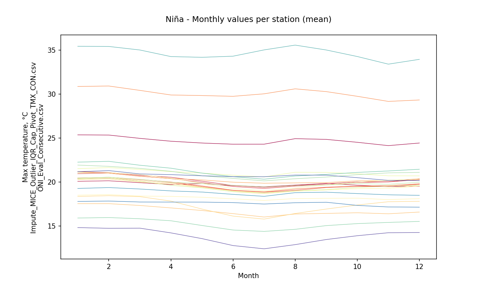
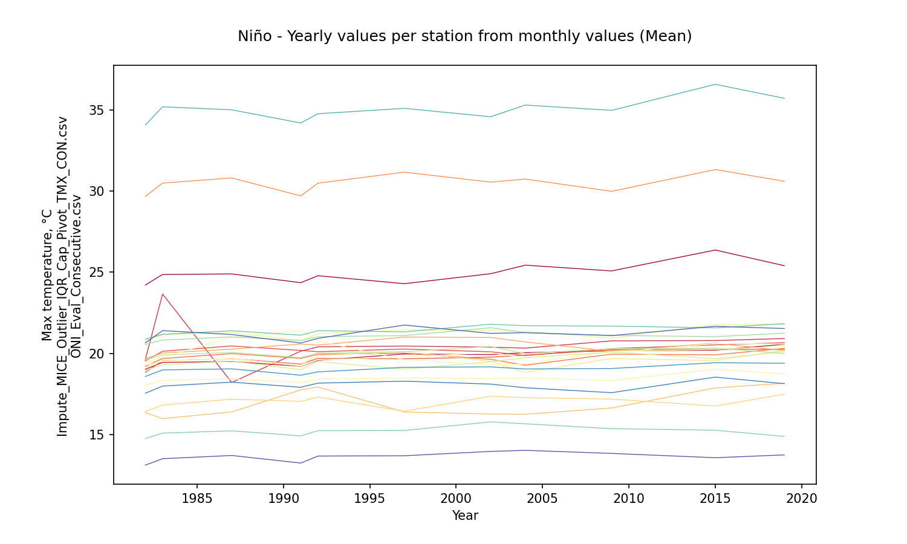
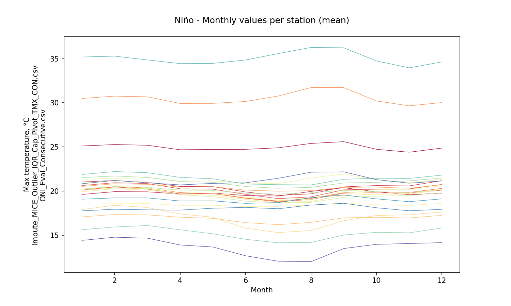
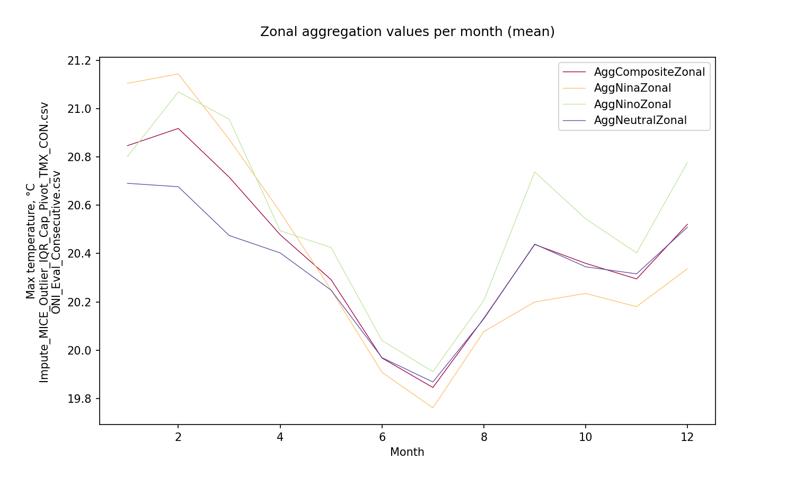

# Statistical aggregations for hydro-climatological composite series and yearly events Niño, Niña and Neutral

For further information about the NOAA - Oceanic Niño Index (ONI) classifier for climatological yearly events Niño, Niña and Neutral, check this activity https://github.com/rcfdtools/R.LTWB/tree/main/Section03/ENSOONI

* Station records file: [Impute_MICE_Outlier_IQR_Cap_Pivot_TMX_CON.csv](../IDEAM_Impute/Impute_MICE_Outlier_IQR_Cap_Pivot_TMX_CON.csv)
* ENSO-ONI year file: [ONI_Eval_Consecutive.csv](../ENSOONI/ONI_Eval_Consecutive.csv)
* Stations: 61
* Records: 16781
* Daily serie: True
* Aggregation function: Mean
* Execution date: 2023-09-22 10:08:44.487645
* Python version: 3.11.5 (tags/v3.11.5:cce6ba9, Aug 24 2023, 14:38:34) [MSC v.1936 64 bit (AMD64)]
* Python path: ['C:\\JLGC\\R.LTWB\\.src', 'C:\\Python311\\python311.zip', 'C:\\Python311\\DLLs', 'C:\\Python311\\Lib', 'C:\\Python311']
* matplotlib version: 3.6.0
* pandas version: 2.1.0
* Instructions & script: https://github.com/rcfdtools/R.LTWB/tree/main/Section03/Agg
* License: https://github.com/rcfdtools/R.LTWB/blob/main/LICENSE.md
* Credits: r.cfdtools@gmail.com

## Composite - Yearly values per station from monthly values (Mean)

Daily values to year-month aggregation (Mean) file: [Agg_YM_Impute_MICE_Outlier_IQR_Cap_Pivot_TMX_CON.csv](Agg_YM_Impute_MICE_Outlier_IQR_Cap_Pivot_TMX_CON.csv)

|   Year |   21185040 |   21195080 |   21195120 |   21195190 |   21205012 |   21205160 |   21205230 |   21205420 |   21205520 |   21205580 |   21205660 |   21205670 |   21205700 |   21205710 |   21205720 |   21205740 |   21205750 |   21205770 |   21205791 |   21205910 |   21205940 |   21205980 |   21206050 |   21206160 |   21206180 |   21206190 |   21206200 |   21206230 |   21206260 |   21206280 |   21206500 |   21206510 |   21206550 |   21206560 |   21206570 |   21206600 |   21206610 |   21206620 |   21206630 |   21206640 |   21206650 |   21206660 |   21206670 |   21206680 |   21206690 |   21206700 |   21206970 |   21235010 |   21255080 |   23065060 |   23065100 |   23065120 |   23065200 |   23125070 |   23125170 |   24015380 |   35025050 |   35025060 |   35035030 |   35065010 |
|-------:|-----------:|-----------:|-----------:|-----------:|-----------:|-----------:|-----------:|-----------:|-----------:|-----------:|-----------:|-----------:|-----------:|-----------:|-----------:|-----------:|-----------:|-----------:|-----------:|-----------:|-----------:|-----------:|-----------:|-----------:|-----------:|-----------:|-----------:|-----------:|-----------:|-----------:|-----------:|-----------:|-----------:|-----------:|-----------:|-----------:|-----------:|-----------:|-----------:|-----------:|-----------:|-----------:|-----------:|-----------:|-----------:|-----------:|-----------:|-----------:|-----------:|-----------:|-----------:|-----------:|-----------:|-----------:|-----------:|-----------:|-----------:|-----------:|-----------:|-----------:|
|   1978 |    33.95   |    33.8024 |    24.848  |    19.61   |    19.646  |    20.1836 |    19.9724 |    19.6371 |    19.7011 |    18.6868 |    30.1801 |    21.0003 |    18.417  |    20.3678 |    16.7459 |    17.1667 |    19.5041 |    18.8392 |    19.4243 |    18.4067 |    18.3537 |    19.617  |    19.853  |    22.1991 |    21.1126 |    20.4224 |    19.91   |    19.7454 |    19.4887 |    15.9996 |    19.5199 |    19.7792 |    21.08   |    19.8839 |    19.6193 |    21.0272 |    18.9412 |    20.9575 |    20.3635 |    20.7719 |    15.2157 |    21.3766 |    20.6385 |    21.263  |    21.3878 |    20.7626 |    19.8815 |    34.6947 |    34.2177 |    18.839  |    17.7784 |    21.7262 |    29.3797 |    20.6771 |    14.0389 |    16.8742 |    13.6993 |    12.1954 |    28.2329 |    24.048  |
|   1979 |    33.8833 |    33.5244 |    24.848  |    19.61   |    19.2757 |    20.1836 |    19.9724 |    19.6371 |    19.7011 |    18.1454 |    30.1801 |    21.0003 |    18.417  |    20.3678 |    16.7459 |    17.1667 |    19.5041 |    18.8392 |    19.4243 |    18.4067 |    18.3537 |    19.617  |    19.853  |    22.1991 |    21.1126 |    20.0554 |    19.91   |    19.5647 |    19.4887 |    15.9996 |    19.5199 |    19.7792 |    21.08   |    19.8839 |    19.6193 |    21.0272 |    18.9412 |    20.9575 |    20.3635 |    20.2627 |    15.2157 |    21.3766 |    20.6385 |    21.263  |    21.3878 |    20.7626 |    19.4688 |    34.6947 |    34.1723 |    18.839  |    17.7784 |    21.7262 |    29.3797 |    20.6771 |    14.0389 |    16.8742 |    13.6993 |    12.1745 |    28.2839 |    24.048  |
|   1980 |    33.7691 |    33.6664 |    25.0854 |    19.2346 |    19.5906 |    20.2879 |    19.9948 |    19.3078 |    19.5608 |    18.6425 |    30.7962 |    21.1018 |    17.9032 |    19.9978 |    16.7164 |    16.8843 |    19.4779 |    18.7503 |    19.5238 |    18.2269 |    18.3811 |    19.3887 |    19.801  |    22.1033 |    21.054  |    20.3964 |    19.8129 |    19.7248 |    19.2837 |    16.1076 |    19.4367 |    19.6248 |    21.0891 |    19.7073 |    19.6083 |    20.8687 |    18.8695 |    20.8664 |    20.2009 |    20.6919 |    14.9283 |    21.2264 |    20.5707 |    21.1666 |    21.1378 |    20.6688 |    19.8374 |    34.278  |    34.335  |    18.736  |    18.0532 |    21.3921 |    29.5423 |    20.9968 |    14.0213 |    16.6645 |    13.6403 |    12.2166 |    28.3227 |    24.1504 |
|   1981 |    33.7536 |    33.6533 |    24.6981 |    18.8426 |    19.581  |    19.9886 |    19.8045 |    19.1138 |    19.4496 |    18.6199 |    30.1219 |    20.5165 |    17.7597 |    20.0504 |    16.1776 |    16.8961 |    19.2525 |    18.6162 |    19.2512 |    18.1224 |    18.1632 |    19.2359 |    19.6484 |    21.836  |    20.9279 |    20.3746 |    19.6249 |    19.716  |    19.2188 |    15.9218 |    19.3706 |    19.3924 |    20.8961 |    19.6087 |    19.4661 |    20.7138 |    18.7254 |    20.7701 |    20.1353 |    20.6759 |    14.8128 |    21.0788 |    20.4325 |    21.0879 |    20.9587 |    20.4993 |    19.8228 |    33.8172 |    34.3281 |    18.636  |    17.4614 |    21.3768 |    29.2991 |    20.2155 |    14.0112 |    16.5845 |    13.468  |    12.2008 |    28.2921 |    23.8579 |
|   1982 |    33.6853 |    33.5831 |    24.4264 |    19.0025 |    19.5548 |    19.8527 |    19.4764 |    18.8309 |    19.2485 |    18.5846 |    29.6818 |    20.433  |    17.5894 |    19.6412 |    16.3527 |    16.3947 |    19.1521 |    18.5308 |    19.0911 |    17.9173 |    18.1866 |    18.8861 |    19.4284 |    21.8459 |    20.8164 |    20.3425 |    19.4457 |    19.6974 |    18.9889 |    15.7939 |    19.2651 |    19.23   |    20.7622 |    19.4493 |    19.322  |    20.5215 |    18.5839 |    20.6588 |    19.9052 |    20.6786 |    14.6682 |    20.9034 |    20.2237 |    20.9563 |    20.7925 |    20.2271 |    19.7895 |    33.9949 |    34.1746 |    18.5279 |    17.7297 |    21.3947 |    29.1046 |    20.6315 |    13.99   |    16.3719 |    13.2657 |    12.1874 |    28.2658 |    23.6235 |
|   1983 |    33.8142 |    33.6773 |    24.939  |    19.4362 |    19.5705 |    23.6496 |    20.1329 |    19.5441 |    19.6832 |    18.6075 |    30.5157 |    20.4564 |    18.012  |    20.0192 |    16.0092 |    16.8097 |    19.5623 |    18.6573 |    19.5684 |    18.2673 |    18.5673 |    19.5207 |    19.9163 |    22.3887 |    21.0971 |    20.377  |    19.9468 |    19.7164 |    19.3174 |    16.0415 |    19.4605 |    19.4767 |    21.1551 |    19.8596 |    19.6235 |    20.9194 |    18.9585 |    20.9293 |    20.2083 |    20.6639 |    15.0335 |    21.3096 |    20.455  |    21.1026 |    21.2046 |    20.7593 |    19.8131 |    35.2099 |    34.3104 |    18.783  |    18.3079 |    22.2644 |    29.7979 |    21.3876 |    14.0221 |    16.693  |    13.5548 |    12.2211 |    28.3332 |    23.9175 |
|   1984 |    33.7088 |    33.6077 |    24.0659 |    18.1463 |    19.5629 |    19.9027 |    19.4324 |    18.5456 |    19.0444 |    18.5853 |    29.1033 |    19.4851 |    17.5747 |    19.4815 |    15.5427 |    16.6022 |    18.8703 |    17.8989 |    18.6996 |    17.7892 |    17.9373 |    18.6451 |    19.3441 |    21.4226 |    20.6418 |    20.3439 |    19.2034 |    19.7008 |    18.9178 |    15.6091 |    19.1605 |    18.9087 |    20.4733 |    19.3205 |    19.1438 |    20.2638 |    18.4137 |    20.5215 |    19.7401 |    20.6717 |    14.5744 |    20.7035 |    19.9582 |    20.803  |    20.511  |    20.0075 |    19.7965 |    33.3066 |    34.218  |    18.3696 |    17.2143 |    21.1202 |    28.8623 |    19.9722 |    13.9766 |    16.2975 |    13.0587 |    12.1848 |    28.2586 |    23.5659 |
|   1985 |    33.7725 |    33.6382 |    24.7842 |    18.8515 |    19.5407 |    18.9784 |    19.4715 |    18.8397 |    19.5284 |    18.5691 |    30.4052 |    20.5089 |    17.8109 |    19.8727 |    15.873  |    16.7455 |    19.1598 |    18.0837 |    18.9957 |    18.0004 |    18.1325 |    18.8974 |    19.4522 |    21.8216 |    20.8119 |    20.338  |    19.5055 |    19.6993 |    19.0956 |    15.937  |    19.285  |    19.2123 |    20.743  |    19.4479 |    19.3696 |    20.5616 |    18.5787 |    20.6691 |    20.0231 |    20.6283 |    14.7428 |    20.9364 |    20.2539 |    21.0283 |    20.819  |    20.3109 |    19.7788 |    33.7643 |    34.3238 |    18.5479 |    17.4436 |    21.7322 |    29.6896 |    20.1779 |    13.996  |    16.4845 |    13.3393 |    12.1951 |    28.2973 |    23.8981 |
|   1986 |    33.7099 |    33.5696 |    24.46   |    18.6022 |    19.5161 |    19.1931 |    19.4632 |    18.7823 |    19.2187 |    18.5515 |    29.8139 |    20.1629 |    17.9047 |    20.0322 |    15.6138 |    16.4231 |    19.0139 |    18.3318 |    18.7939 |    17.9192 |    18.087  |    18.7563 |    19.7638 |    21.4186 |    20.8009 |    20.3167 |    19.3018 |    19.6873 |    19.0143 |    15.7847 |    19.2492 |    19.1147 |    20.6056 |    19.4217 |    19.2572 |    20.4625 |    18.6303 |    20.6273 |    20.0193 |    20.6315 |    14.7585 |    20.868  |    20.2854 |    20.9851 |    20.7839 |    20.163  |    19.7526 |    33.3152 |    34.2353 |    18.5464 |    17.4269 |    21.6542 |    29.4246 |    20.2456 |    13.9879 |    16.4024 |    13.2143 |    12.1829 |    28.2993 |    23.6391 |
|   1987 |    33.778  |    33.6529 |    25.1721 |    19.4953 |    19.5579 |    18.2048 |    20.411  |    19.6774 |    19.9619 |    18.6069 |    30.8135 |    20.8956 |    18.7179 |    20.2401 |    16.4008 |    17.1744 |    19.7425 |    19.0634 |    19.6454 |    18.4751 |    18.5478 |    19.6759 |    20.9798 |    22.283  |    21.155  |    20.3578 |    20.2429 |    19.7083 |    19.5297 |    16.14   |    19.59   |    19.7524 |    21.2224 |    19.9241 |    19.7342 |    21.1278 |    19.3716 |    21.0263 |    20.3705 |    20.6553 |    15.362  |    21.4987 |    20.7636 |    21.2451 |    21.5328 |    20.8922 |    19.8014 |    34.9072 |    34.3577 |    19.0146 |    18.2382 |    22.0398 |    29.8154 |    21.1582 |    14.0418 |    16.9491 |    13.7482 |    12.1942 |    28.3054 |    24.4243 |
|   1988 |    33.7287 |    33.6454 |    24.6457 |    18.9464 |    19.6099 |    19.5362 |    20.0102 |    19.2228 |    19.5706 |    18.6759 |    29.889  |    20.6512 |    18.5323 |    19.6274 |    16.4388 |    17.3179 |    19.3699 |    18.6607 |    19.2233 |    18.3147 |    18.2328 |    19.079  |    20.9887 |    22.1224 |    21.1327 |    20.4218 |    19.4636 |    19.7343 |    19.4102 |    15.8724 |    19.3897 |    19.4983 |    20.8873 |    19.6754 |    19.5018 |    20.781  |    19.2044 |    20.822  |    20.0362 |    20.7358 |    15.1532 |    21.1814 |    20.4573 |    21.0899 |    21.1843 |    20.3214 |    19.8603 |    34.3802 |    34.2707 |    18.7587 |    17.5889 |    21.5342 |    29.2537 |    20.292  |    14.0335 |    16.8115 |    13.7246 |    12.2272 |    28.334  |    24.3419 |
|   1989 |    33.6768 |    33.5877 |    24.5862 |    18.5539 |    19.5727 |    19.6414 |    20.1884 |    18.9748 |    19.2454 |    18.6397 |    29.8708 |    20.1467 |    18.0207 |    20.0786 |    16.6547 |    16.8404 |    19.1175 |    18.7367 |    18.9965 |    18.0393 |    18.1282 |    18.8265 |    20.7572 |    22.0324 |    20.8586 |    20.3709 |    19.2693 |    19.7106 |    19.163  |    15.8524 |    19.3133 |    19.4894 |    20.8055 |    19.5708 |    19.3653 |    20.6167 |    19.0374 |    20.7186 |    20.0771 |    20.7201 |    14.8614 |    21.0252 |    20.2413 |    21.0334 |    20.9019 |    20.2659 |    19.8172 |    34.7347 |    34.2053 |    18.6743 |    17.4683 |    21.4655 |    29.3134 |    20.0563 |    13.9938 |    16.5579 |    13.1421 |    12.1909 |    28.2888 |    23.9233 |
|   1990 |    33.7375 |    33.6243 |    24.5272 |    18.9528 |    19.5626 |    20.0244 |    20.2375 |    19.0872 |    19.3427 |    18.5987 |    29.6312 |    20.3618 |    18.2572 |    20.3452 |    17.1446 |    16.905  |    19.2164 |    18.5957 |    19.0441 |    18.151  |    18.3184 |    18.9854 |    20.8956 |    22.0036 |    20.8698 |    20.3302 |    19.3474 |    19.6925 |    19.2663 |    15.8461 |    19.3467 |    19.6519 |    20.8321 |    19.6295 |    19.4007 |    20.7693 |    19.136  |    20.7604 |    20.205  |    20.6689 |    14.9951 |    21.1392 |    20.2857 |    21.1261 |    21.0405 |    20.3569 |    19.7983 |    34.3643 |    34.2851 |    18.6635 |    17.9401 |    21.9513 |    29.38   |    20.3907 |    14.0025 |    16.6656 |    13.1687 |    12.1681 |    28.2821 |    23.7034 |
|   1991 |    33.7382 |    33.6411 |    24.6005 |    19.2249 |    19.6121 |    20.0614 |    20.2036 |    19.3359 |    19.6889 |    18.6261 |    29.7226 |    20.4551 |    18.2888 |    20.5758 |    17.7451 |    17.0442 |    19.4287 |    18.7282 |    19.2898 |    17.9667 |    18.3432 |    19.1538 |    21.4052 |    22.1263 |    20.7917 |    20.3973 |    19.5402 |    19.7272 |    18.9801 |    15.7421 |    19.3859 |    19.9473 |    20.9785 |    19.7549 |    19.4195 |    20.9121 |    19.3927 |    20.8402 |    20.3341 |    20.6916 |    15.0826 |    21.274  |    20.3906 |    21.0944 |    21.1317 |    20.4881 |    19.8474 |    34.1865 |    34.3186 |    18.7392 |    17.923  |    21.8195 |    29.2537 |    20.6361 |    13.9933 |    16.6114 |    13.2359 |    12.1937 |    28.3125 |    23.8678 |
|   1992 |    33.7731 |    33.685  |    25.0825 |    19.571  |    19.6025 |    20.5967 |    20.0918 |    19.6887 |    19.9435 |    18.724  |    30.4902 |    20.5618 |    18.4135 |    20.4932 |    17.9327 |    17.2883 |    19.7767 |    19.2635 |    19.8741 |    18.4223 |    18.5557 |    19.5841 |    20.7532 |    22.3427 |    21.2025 |    20.4143 |    19.9614 |    19.7213 |    19.4729 |    15.2265 |    19.5118 |    20.1206 |    21.3424 |    19.9243 |    19.7598 |    21.2176 |    19.3314 |    21.0217 |    20.462  |    20.7576 |    15.2565 |    21.5133 |    20.7766 |    21.226  |    21.4572 |    20.8091 |    19.8618 |    34.632  |    34.3665 |    18.8821 |    18.2015 |    21.8598 |    29.4137 |    20.9168 |    14.0369 |    16.9222 |    13.6623 |    12.1871 |    28.3529 |    24.1035 |
|   1993 |    33.6742 |    33.6046 |    24.6567 |    19.2823 |    19.5394 |    20.325  |    19.734  |    19.3637 |    19.4938 |    18.6157 |    29.6938 |    20.6596 |    18.0982 |    20.3944 |    16.1094 |    16.9752 |    19.4782 |    18.8303 |    19.5803 |    18.0733 |    18.3354 |    19.2355 |    18.8408 |    21.9567 |    20.804  |    20.3527 |    19.7779 |    19.7075 |    19.1541 |    16.1596 |    19.3087 |    19.5034 |    21.1284 |    19.7397 |    19.5242 |    20.9196 |    18.5629 |    20.8301 |    20.2547 |    20.6808 |    15.0355 |    21.2394 |    20.3488 |    21.1444 |    21.1384 |    20.5753 |    19.7869 |    34.3475 |    34.2792 |    18.4399 |    17.8718 |    21.4853 |    29.0215 |    20.6594 |    13.9927 |    16.6532 |    13.0385 |    12.1823 |    28.2592 |    23.8016 |
|   1994 |    33.7249 |    33.6404 |    24.6777 |    19.7979 |    19.6041 |    20.4672 |    19.5501 |    19.274  |    19.5268 |    18.6889 |    29.621  |    20.5935 |    18.4423 |    20.2423 |    16.0749 |    17.2573 |    19.5765 |    18.9281 |    19.7366 |    18.3829 |    18.2832 |    19.2956 |    18.8769 |    21.9022 |    20.6889 |    20.4009 |    19.7753 |    19.7267 |    19.5339 |    16.0814 |    19.2785 |    19.4206 |    21.1999 |    19.6837 |    19.6483 |    20.991  |    18.6066 |    20.8407 |    20.2443 |    20.7447 |    15.1795 |    21.2199 |    20.4558 |    21.2284 |    21.3068 |    20.5424 |    19.8568 |    34.4503 |    34.283  |    18.4638 |    17.7236 |    21.2919 |    28.7836 |    20.4748 |    14.0216 |    16.8903 |    13.2694 |    12.2105 |    28.3093 |    23.7058 |
|   1995 |    33.7112 |    33.5911 |    24.4532 |    19.6354 |    19.5714 |    20.7802 |    19.8467 |    19.522  |    19.9111 |    18.6392 |    30.3059 |    20.9456 |    18.9255 |    20.401  |    16.174  |    17.2867 |    19.8661 |    18.9333 |    20.0597 |    18.4064 |    18.3643 |    19.6776 |    19.4156 |    22.2334 |    21.1085 |    20.3664 |    20.0305 |    19.7153 |    19.4215 |    16.0989 |    17.9732 |    19.6623 |    21.4452 |    19.8271 |    19.7729 |    21.2191 |    18.8826 |    20.9749 |    20.4202 |    20.717  |    15.4826 |    21.4411 |    20.7277 |    21.2491 |    21.5726 |    20.623  |    19.8132 |    34.8822 |    34.2491 |    18.7799 |    17.6769 |    21.2777 |    29.0477 |    20.4229 |    14.0509 |    16.9603 |    13.9438 |    12.1643 |    28.3112 |    24.2944 |
|   1996 |    33.7359 |    33.6325 |    23.9104 |    19.228  |    19.5669 |    20.474  |    19.5678 |    19.254  |    19.6856 |    18.6384 |    29.6211 |    20.655  |    18.7894 |    20.1544 |    16.0872 |    16.9473 |    19.648  |    18.5938 |    19.7334 |    17.7938 |    18.2122 |    19.2924 |    19.0599 |    21.7921 |    20.5642 |    20.3871 |    19.7945 |    19.7233 |    18.7057 |    16.132  |    19.2099 |    19.2416 |    21.1711 |    19.6627 |    19.4448 |    20.9158 |    18.6354 |    20.7782 |    20.175  |    20.694  |    15.3478 |    21.1925 |    20.3391 |    20.9924 |    21.2537 |    20.4728 |    19.8165 |    34.2125 |    34.3068 |    18.3658 |    17.5959 |    21.0569 |    28.732  |    20.3891 |    13.996  |    16.554  |    13.4948 |    12.2066 |    28.3198 |    23.796  |
|   1997 |    33.795  |    33.6666 |    24.3875 |    19.6794 |    19.5926 |    20.8285 |    19.9195 |    19.7011 |    20.1802 |    18.7126 |    31.1078 |    21.0948 |    18.5796 |    20.9345 |    16.388  |    16.5135 |    20.0178 |    18.8615 |    20.1109 |    18.1162 |    18.6828 |    19.7786 |    19.6044 |    22.4304 |    21.4656 |    20.4765 |    20.2475 |    19.7382 |    19.0231 |    17.2619 |    19.6468 |    19.8425 |    21.5692 |    20.0549 |    19.759  |    21.2629 |    19.0148 |    21.0665 |    20.5896 |    20.7478 |    15.3817 |    21.6019 |    20.6924 |    21.2182 |    21.4839 |    21.0315 |    19.8551 |    35.1514 |    34.346  |    19.1351 |    18.3157 |    22.1244 |    29.9523 |    21.7437 |    14.0233 |    16.6831 |    13.6939 |    12.2205 |    28.4125 |    24.0864 |
|   1998 |    33.7707 |    33.68   |    24.7666 |    22.6181 |    19.6298 |    20.8563 |    20.841  |    19.9473 |    20.1587 |    18.7604 |    31.2408 |    22.0951 |    19.1702 |    21.0493 |    16.7674 |    17.4053 |    20.0536 |    18.7798 |    20.1055 |    18.6269 |    18.7047 |    19.4721 |    20.176  |    22.6432 |    21.3331 |    20.4831 |    20.1804 |    19.768  |    19.5818 |    16.2322 |    19.7507 |    20.1438 |    21.5656 |    20.0831 |    19.9341 |    21.664  |    19.3829 |    21.194  |    20.8081 |    20.8021 |    15.6535 |    21.8583 |    20.9171 |    21.5162 |    21.9062 |    20.7579 |    19.8954 |    34.7656 |    34.3222 |    19.2058 |    18.7004 |    21.4452 |    29.2812 |    21.231  |    14.0762 |    17.166  |    14.2454 |    12.2265 |    28.3868 |    24.6785 |
|   1999 |    33.6693 |    33.5854 |    24.0846 |    18.9713 |    19.5364 |    19.8812 |    19.4474 |    18.9795 |    19.1036 |    18.6589 |    30.1144 |    20.437  |    18.6252 |    19.9021 |    15.5429 |    17.564  |    19.2198 |    18.3266 |    19.0934 |    17.9021 |    18.1799 |    18.0097 |    18.9409 |    21.4762 |    20.4363 |    20.3619 |    19.0742 |    19.6992 |    18.9173 |    15.477  |    19.0034 |    19.2063 |    20.7566 |    20.4018 |    19.348  |    20.6757 |    18.6397 |    20.7115 |    20.075  |    20.7341 |    15.1133 |    21.4074 |    20.1876 |    20.9881 |    20.9274 |    19.7073 |    19.7897 |    33.0983 |    34.2067 |    18.2407 |    17.6923 |    20.7005 |    28.9498 |    20.5123 |    14.0074 |    16.6213 |    13.4661 |    12.1634 |    28.2697 |    23.8556 |
|   2000 |    33.7019 |    33.6041 |    24.7955 |    18.8189 |    19.562  |    19.503  |    19.2985 |    19.0745 |    18.9441 |    18.6312 |    29.7294 |    20.4923 |    17.7752 |    20.0656 |    15.7025 |    16.7534 |    18.8832 |    18.3847 |    18.7022 |    18.0004 |    18.0314 |    18.3093 |    19.0288 |    21.6408 |    20.5683 |    20.3772 |    19.0853 |    19.7051 |    19.1101 |    15.7489 |    19.1255 |    19.2564 |    20.5689 |    19.7568 |    19.2628 |    20.5081 |    18.4578 |    20.6733 |    20.102  |    20.6983 |    14.7235 |    21.0438 |    20.1715 |    21.0641 |    20.7229 |    19.8187 |    19.8087 |    33.7365 |    34.2535 |    18.3096 |    17.4488 |    21.0176 |    29.0641 |    20.1614 |    14.0029 |    16.4691 |    13.4358 |    12.1958 |    28.3031 |    23.6839 |
|   2001 |    33.7189 |    33.6132 |    25.1917 |    19.3723 |    19.5866 |    19.9339 |    19.5996 |    19.5445 |    19.5267 |    18.6527 |    30.6212 |    21.0301 |    17.9856 |    20.6205 |    16.0847 |    17.1737 |    19.3175 |    19.0588 |    19.1886 |    18.4404 |    18.4489 |    19.4815 |    19.2521 |    22.1653 |    21.185  |    20.3618 |    19.862  |    19.7258 |    19.524  |    16.0638 |    18.8996 |    19.6589 |    21.0674 |    20.4609 |    19.6042 |    21.0118 |    18.8218 |    21.0004 |    20.504  |    20.721  |    14.9773 |    21.627  |    20.7481 |    21.3095 |    21.2931 |    20.6852 |    19.8316 |    34.5965 |    34.2751 |    18.6711 |    18.0291 |    21.6629 |    29.6649 |    20.8504 |    14.0468 |    16.8376 |    13.7954 |    12.1862 |    28.2975 |    23.6645 |
|   2002 |    33.7775 |    33.6728 |    24.9265 |    19.9211 |    19.5863 |    20.2397 |    19.7668 |    19.7765 |    19.8839 |    18.6636 |    30.5558 |    21.1301 |    18.1168 |    20.9686 |    16.2616 |    17.3474 |    19.5799 |    19.2719 |    19.5089 |    18.4732 |    18.5528 |    20.045  |    19.2829 |    22.3081 |    21.3784 |    20.415  |    20.2444 |    19.744  |    19.4759 |    16.095  |    20.6305 |    19.7982 |    20.8341 |    20.3792 |    19.6877 |    21.5175 |    18.8675 |    20.9912 |    20.738  |    20.688  |    15.4667 |    21.5891 |    21.0359 |    21.4423 |    21.5677 |    21.1631 |    19.8402 |    34.6003 |    34.3403 |    19.1628 |    18.1166 |    21.9353 |    29.6235 |    21.102  |    14.0582 |    16.9659 |    13.9617 |    12.2263 |    28.345  |    23.9468 |
|   2003 |    33.7727 |    33.6744 |    25.1414 |    20.085  |    19.5889 |    20.0296 |    19.9387 |    19.9595 |    19.746  |    18.6692 |    30.6819 |    21.2962 |    18.6531 |    21.1002 |    16.12   |    17.406  |    19.4977 |    19.2079 |    19.2789 |    18.8502 |    18.3997 |    19.8547 |    19.4228 |    22.3614 |    21.509  |    20.3942 |    20.0791 |    19.7296 |    19.8867 |    16.1091 |    20.3539 |    19.8839 |    20.9801 |    20.0497 |    19.7409 |    21.6966 |    18.9869 |    20.9787 |    20.8612 |    20.7395 |    15.975  |    21.9863 |    21.1496 |    21.417  |    22.1523 |    21.0066 |    19.8368 |    34.6203 |    34.3184 |    19.3158 |    17.8693 |    21.6688 |    29.6014 |    20.9064 |    14.0909 |    17.2643 |    14.3073 |    12.1814 |    28.3149 |    24.171  |
|   2004 |    33.7497 |    33.6803 |    25.4529 |    19.9268 |    19.6028 |    19.6104 |    19.8319 |    19.9085 |    19.416  |    18.6529 |    30.7439 |    21.2006 |    18.4943 |    20.864  |    16.2501 |    17.3309 |    19.1883 |    19.2038 |    18.8275 |    18.619  |    18.2679 |    19.7433 |    19.3361 |    22.3019 |    21.3585 |    20.4014 |    19.9012 |    19.718  |    19.6956 |    16.2005 |    20.1282 |    19.8043 |    20.883  |    19.9257 |    19.5541 |    21.236  |    18.7394 |    20.8716 |    20.6551 |    20.6992 |    15.5054 |    21.5476 |    20.9855 |    21.3576 |    21.7387 |    20.9165 |    19.8496 |    34.8296 |    34.3402 |    19.0232 |    17.7659 |    21.5356 |    29.7162 |    20.7181 |    14.0607 |    17.0495 |    14.0191 |    12.2159 |    28.3032 |    23.919  |
|   2005 |    33.748  |    33.685  |    24.9807 |    19.6486 |    19.6292 |    20.0862 |    19.983  |    20.082  |    19.8385 |    18.6868 |    30.6671 |    20.6171 |    18.8077 |    21.0516 |    16.4906 |    17.8392 |    19.5314 |    19.4404 |    19.3445 |    19.0106 |    18.3006 |    20.0847 |    19.6702 |    22.3646 |    21.4242 |    20.4356 |    20.1182 |    19.7214 |    20.1596 |    16.238  |    19.7606 |    19.9877 |    21.5166 |    20.3185 |    19.8655 |    21.3551 |    18.91   |    21.3505 |    20.7647 |    20.7259 |    15.4713 |    21.6753 |    21.0482 |    21.5319 |    22.009  |    21.0568 |    19.8812 |    34.9821 |    34.3193 |    19.2454 |    17.4114 |    21.5654 |    29.5815 |    20.4493 |    14.1031 |    17.3616 |    14.2766 |    12.245  |    28.3301 |    24.1043 |
|   2006 |    33.7375 |    33.6912 |    24.8846 |    19.444  |    19.6271 |    19.5812 |    19.6745 |    20.0509 |    19.382  |    18.6741 |    30.271  |    20.7331 |    18.5943 |    20.7097 |    15.9825 |    16.9922 |    19.1385 |    18.798  |    18.7867 |    18.6494 |    18.1364 |    19.7195 |    19.2297 |    22.1317 |    21.0839 |    20.4394 |    19.8131 |    19.728  |    19.7916 |    15.9009 |    19.6004 |    19.7487 |    20.7728 |    20.147  |    19.5819 |    20.9979 |    18.7521 |    20.8534 |    20.5215 |    20.7026 |    15.5731 |    21.6056 |    20.7909 |    21.3616 |    21.547  |    20.8097 |    19.8822 |    34.7336 |    34.4171 |    18.9547 |    17.32   |    21.3894 |    29.4436 |    20.293  |    14.0687 |    16.9933 |    14.0037 |    12.2641 |    28.3207 |    23.9107 |
|   2007 |    33.7608 |    33.6969 |    25.3586 |    19.85   |    19.6146 |    19.678  |    20.0796 |    20.0322 |    19.4853 |    18.6473 |    30.398  |    21.5392 |    19.2998 |    20.9168 |    16.3034 |    17.2513 |    19.296  |    18.7107 |    18.8507 |    18.7807 |    18.1853 |    19.855  |    19.6581 |    22.2268 |    21.084  |    20.4098 |    19.9123 |    19.733  |    19.9304 |    15.8702 |    19.7806 |    19.9299 |    20.8446 |    20.177  |    19.626  |    21.3064 |    18.9058 |    21.0436 |    20.6831 |    20.6862 |    15.8241 |    21.6817 |    20.737  |    21.5269 |    21.8187 |    20.9666 |    19.8604 |    34.8561 |    34.3865 |    19.3176 |    17.4549 |    21.4362 |    29.4669 |    20.4948 |    14.0712 |    17.2201 |    13.9129 |    12.2288 |    28.3123 |    24.2608 |
|   2008 |    33.7113 |    33.613  |    24.3049 |    19.4733 |    19.6066 |    19.1524 |    19.7496 |    19.4208 |    19.0138 |    18.6531 |    29.1065 |    20.9595 |    18.9566 |    20.387  |    15.9559 |    17.1704 |    18.8447 |    18.4209 |    18.3149 |    18.447  |    17.0541 |    19.4099 |    19.3013 |    21.7707 |    20.7389 |    20.4071 |    19.4831 |    19.7445 |    19.7321 |    15.3416 |    19.4718 |    19.522  |    20.4063 |    19.5128 |    19.3259 |    20.8947 |    18.4948 |    20.8474 |    20.0774 |    20.7209 |    15.8293 |    21.0503 |    20.541  |    21.3319 |    20.9966 |    20.3849 |    19.8529 |    34.0208 |    34.2774 |    18.6482 |    16.8461 |    20.9024 |    28.6986 |    19.7186 |    14.0601 |    16.9531 |    13.9116 |    12.2167 |    28.339  |    24.008  |
|   2009 |    33.7862 |    33.6876 |    25.015  |    20.1594 |    19.5871 |    20.4648 |    20.2261 |    20.2256 |    19.9503 |    18.6476 |    29.9898 |    21.405  |    18.4796 |    20.1409 |    16.6735 |    17.1717 |    19.6836 |    18.7459 |    19.6886 |    19.0573 |    18.3411 |    20.0266 |    20.1612 |    22.2538 |    20.9704 |    20.3885 |    20.1269 |    19.7229 |    20.089  |    16.0175 |    19.736  |    19.9345 |    21.2048 |    20.3211 |    19.6263 |    21.1201 |    19.2037 |    21.2708 |    20.2757 |    20.691  |    15.3293 |    21.6038 |    20.7302 |    21.4566 |    21.6724 |    21.0331 |    19.841  |    34.9766 |    34.375  |    19.0597 |    17.5812 |    21.9712 |    28.9302 |    20.6002 |    14.0777 |    17.1502 |    13.8365 |    12.1951 |    28.3116 |    24.3185 |
|   2010 |    33.7354 |    33.6321 |    24.8955 |    19.7498 |    19.5718 |    20.8947 |    20.4111 |    20.3907 |    20.353  |    18.5789 |    30.0109 |    21.6035 |    19.3355 |    20.4524 |    17.5533 |    17.9588 |    20.0682 |    18.6443 |    20.176  |    18.7201 |    18.2434 |    20.2504 |    20.4109 |    22.2864 |    21.3343 |    20.3548 |    20.3175 |    19.7062 |    19.623  |    15.9857 |    19.7076 |    20.3619 |    21.4869 |    19.6416 |    19.7518 |    21.7522 |    19.2557 |    20.5456 |    20.7747 |    20.6479 |    16.1332 |    21.6818 |    20.9801 |    21.3834 |    22.1474 |    20.9906 |    19.8136 |    34.5195 |    34.2836 |    19.0707 |    17.3498 |    21.3162 |    29.0707 |    20.266  |    14.0919 |    17.3033 |    14.6452 |    12.2093 |    28.3018 |    24.8408 |
|   2011 |    33.7322 |    33.6164 |    24.0146 |    18.9212 |    19.6213 |    20.3596 |    19.8022 |    19.9187 |    19.7897 |    18.6221 |    29.4489 |    21.3536 |    18.529  |    20.303  |    17.3323 |    17.3734 |    19.5315 |    17.5319 |    19.5695 |    17.8591 |    17.9375 |    19.5667 |    19.7831 |    21.8953 |    20.5367 |    20.4089 |    19.7929 |    19.7358 |    19.1315 |    15.6123 |    19.4532 |    20.0466 |    21.1057 |    19.2319 |    19.1973 |    20.7229 |    18.7622 |    20.8523 |    20.4342 |    20.6858 |    15.3262 |    21.0652 |    20.214  |    21.2167 |    20.9302 |    20.54   |    19.8391 |    34.5678 |    34.2819 |    18.5927 |    16.9414 |    21.2882 |    28.7118 |    19.8222 |    14.0272 |    16.4027 |    13.8746 |    12.2534 |    28.3618 |    24.3192 |
|   2012 |    33.7909 |    33.6893 |    24.6868 |    19.1889 |    19.5968 |    19.851  |    19.622  |    20.1154 |    19.493  |    18.6172 |    30.0249 |    21.309  |    17.9266 |    20.4342 |    17.1863 |    16.9467 |    19.2002 |    18.4527 |    19.0283 |    17.8796 |    18.148  |    19.7825 |    19.4242 |    22.1999 |    20.8081 |    20.3886 |    19.88   |    19.7268 |    18.8296 |    15.7988 |    19.4696 |    20.0209 |    20.8854 |    19.9558 |    19.331  |    20.7701 |    18.6885 |    21.1919 |    20.3446 |    20.6675 |    15.1863 |    21.1096 |    20.3656 |    21.13   |    21.2499 |    20.8375 |    19.8513 |    35.2813 |    34.3525 |    18.6842 |    17.4923 |    21.7975 |    29.6306 |    20.4214 |    14.0001 |    16.4429 |    13.5703 |    12.2229 |    28.3269 |    23.9692 |
|   2013 |    33.7681 |    33.6705 |    24.9236 |    19.5046 |    19.6046 |    20.1232 |    19.9952 |    20.0395 |    19.7375 |    18.6351 |    30.315  |    21.1045 |    18.5093 |    20.4945 |    16.9479 |    17.3367 |    19.4915 |    18.8173 |    19.3329 |    18.5247 |    18.6238 |    19.9754 |    19.8675 |    22.4787 |    21.1845 |    20.4    |    20.0785 |    19.7321 |    19.5004 |    16.0317 |    19.6427 |    19.9707 |    21.0969 |    20.0643 |    19.7623 |    21.2771 |    18.9356 |    21.5356 |    20.5101 |    20.677  |    15.5361 |    21.2745 |    20.6746 |    21.2943 |    21.9962 |    20.9579 |    19.842  |    35.6588 |    34.3813 |    19.0309 |    17.8275 |    21.9085 |    29.75   |    20.7606 |    14.0521 |    16.9954 |    13.9095 |    12.2248 |    28.3353 |    24.0658 |
|   2014 |    33.7481 |    33.6374 |    24.8796 |    19.5248 |    19.5646 |    19.9361 |    19.8938 |    20.1149 |    19.6084 |    18.6385 |    30.254  |    21.1202 |    18.0603 |    20.2345 |    17.8776 |    17.0578 |    19.3183 |    18.4414 |    19.136  |    18.5641 |    18.5394 |    20.115  |    19.8    |    22.3813 |    21.0965 |    20.3632 |    20.0799 |    19.7117 |    19.6186 |    16.0461 |    19.6203 |    20.1527 |    20.9439 |    19.9939 |    19.8296 |    21.2221 |    18.9087 |    21.2207 |    20.3196 |    20.6873 |    15.5736 |    21.4421 |    20.6099 |    21.2932 |    21.6457 |    21.0774 |    19.8103 |    35.3796 |    34.3681 |    18.8562 |    17.7614 |    22.3259 |    29.6886 |    20.7245 |    14.0555 |    17.0419 |    13.8723 |    12.1634 |    28.2888 |    23.9797 |
|   2015 |    33.7791 |    33.699  |    26.3821 |    20.1964 |    19.6171 |    20.3003 |    20.1248 |    20.2529 |    19.9859 |    18.6761 |    31.3306 |    22.3367 |    17.9819 |    20.5686 |    17.7018 |    16.794  |    19.6619 |    19.4223 |    19.5541 |    18.6306 |    19.0422 |    20.5997 |    19.9344 |    23.0266 |    21.7633 |    20.4338 |    20.5228 |    19.7405 |    19.7014 |    16.6865 |    19.7701 |    20.1587 |    21.3156 |    20.3186 |    19.8095 |    21.0336 |    19.1316 |    21.212  |    20.5318 |    20.698  |    15.1464 |    21.7174 |    20.8969 |    21.4891 |    21.6216 |    21.6625 |    19.8719 |    36.5847 |    34.425  |    19.139  |    18.4764 |    23.4754 |    30.7886 |    21.7142 |    14.0352 |    17.1244 |    13.5709 |    12.2461 |    28.339  |    23.7264 |
|   2016 |    33.7395 |    33.6751 |    26.2335 |    20.6786 |    19.6305 |    20.9692 |    20.7118 |    20.3362 |    20.5289 |    18.7079 |    30.9119 |    21.8588 |    18.8654 |    20.9337 |    18.4566 |    17.682  |    20.1826 |    19.464  |    20.2291 |    19.2358 |    19.0665 |    20.9382 |    20.6791 |    22.9823 |    21.7544 |    20.4534 |    20.7978 |    19.7473 |    20.3471 |    16.3968 |    19.936  |    20.6141 |    21.6805 |    20.5614 |    20.1513 |    21.7091 |    19.5803 |    21.3729 |    20.9019 |    20.7424 |    16.0682 |    22.0267 |    21.2823 |    21.6749 |    22.0542 |    21.7066 |    19.8886 |    36.0718 |    34.3551 |    19.3248 |    18.2958 |    23.1556 |    30.1558 |    21.5303 |    14.111  |    17.8929 |    14.3472 |    12.249  |    28.3441 |    24.6129 |
|   2017 |    33.7507 |    33.6844 |    25.3223 |    20.2509 |    19.6371 |    20.6986 |    20.428  |    20.0824 |    20.2122 |    18.7085 |    30.3259 |    21.5949 |    18.9772 |    20.5027 |    17.5843 |    17.8309 |    19.9483 |    19.0062 |    19.9325 |    18.8694 |    18.7689 |    20.4284 |    20.3045 |    22.7311 |    21.6871 |    20.462  |    20.4417 |    19.7511 |    20.0277 |    16.1873 |    19.7224 |    20.3217 |    21.4191 |    19.5791 |    19.9048 |    21.0907 |    19.1449 |    21.1419 |    20.4498 |    20.7457 |    16.1758 |    21.3713 |    20.9075 |    21.4896 |    21.6646 |    21.3103 |    19.8951 |    35.2815 |    34.336  |    19.0292 |    17.957  |    22.2227 |    29.5071 |    21.0413 |    14.064  |    16.8531 |    13.7965 |    12.2629 |    28.3585 |    24.9995 |
|   2018 |    33.7548 |    33.6782 |    25.3303 |    20.0283 |    19.6362 |    20.5483 |    20.161  |    19.9231 |    20.0434 |    18.6731 |    30.051  |    21.4493 |    18.4029 |    20.3242 |    17.8427 |    17.1011 |    19.7577 |    19.2042 |    19.762  |    18.5994 |    18.7193 |    20.2079 |    20.059  |    22.6306 |    21.4694 |    20.4316 |    20.2825 |    19.7463 |    19.7748 |    16.1067 |    19.6495 |    20.2707 |    21.2926 |    19.7728 |    19.8504 |    20.8135 |    19.0512 |    21.0541 |    20.283  |    20.7244 |    14.8284 |    21.3405 |    20.7112 |    21.3812 |    21.3415 |    21.2337 |    19.8826 |    35.3272 |    34.3274 |    18.936  |    17.8684 |    22.1498 |    29.3974 |    20.9811 |    14.0271 |    16.7911 |    13.3412 |    12.2371 |    28.3461 |    24.8237 |
|   2019 |    33.7311 |    33.6412 |    25.4056 |    20.5566 |    19.5898 |    20.7141 |    20.434  |    20.2504 |    20.2582 |    18.6276 |    30.6083 |    21.8546 |    18.5327 |    20.1734 |    18.1586 |    17.4815 |    19.9559 |    19.6253 |    20.0049 |    18.9518 |    18.8337 |    20.5752 |    20.3429 |    22.8089 |    21.796  |    20.3918 |    20.5509 |    19.7211 |    20.1077 |    16.2689 |    19.823  |    20.3012 |    21.4567 |    19.9826 |    20.2403 |    21.246  |    19.2819 |    21.2269 |    20.3924 |    20.6889 |    14.877  |    21.6286 |    21.0604 |    21.4926 |    21.8589 |    21.5041 |    19.8339 |    35.7207 |    34.2833 |    19.2381 |    18.2007 |    22.3504 |    29.6665 |    21.2624 |    14.0735 |    17.4256 |    13.7511 |    12.2256 |    28.3202 |    24.2639 |
|   2020 |    33.7897 |    33.7106 |    25.9105 |    20.3127 |    19.6306 |    20.9334 |    20.5924 |    20.3201 |    20.5368 |    18.6691 |    30.8392 |    21.8991 |    18.9827 |    20.843  |    18.2859 |    17.8383 |    20.204  |    19.9829 |    20.2992 |    19.0253 |    18.8146 |    20.8229 |    20.5913 |    22.8832 |    21.9191 |    20.4513 |    20.731  |    19.7469 |    20.156  |    16.3395 |    19.8334 |    20.3656 |    21.7166 |    20.3305 |    20.0976 |    21.5525 |    19.4738 |    21.2872 |    20.768  |    20.7    |    14.5264 |    21.8111 |    21.2778 |    21.6069 |    21.9033 |    21.6583 |    19.8843 |    36.1485 |    34.3676 |    19.1749 |    18.1456 |    22.4295 |    29.7713 |    21.243  |    14.0864 |    17.6156 |    14.0227 |    12.2842 |    28.3684 |    23.6638 |
|   2021 |    33.7139 |    33.655  |    24.3962 |    21.1184 |    19.6317 |    20.4856 |    20.5307 |    19.8151 |    20.1114 |    18.6976 |    29.3809 |    21.5213 |    18.8151 |    20.3395 |    17.8408 |    17.6701 |    19.8435 |    19.8661 |    19.8162 |    18.818  |    18.4485 |    20.4587 |    20.2338 |    22.3388 |    21.4462 |    20.4516 |    20.4388 |    19.7456 |    19.9996 |    15.9267 |    19.7301 |    20.0053 |    21.2908 |    19.9922 |    19.8002 |    21.0666 |    19.2113 |    21.0574 |    20.3638 |    20.7491 |    14.4115 |    21.4373 |    21.0963 |    21.4566 |    21.5302 |    21.2002 |    19.8867 |    34.9176 |    34.2811 |    18.9866 |    17.9946 |    21.8056 |    28.7446 |    20.8774 |    14.0779 |    16.989  |    13.9051 |    12.2571 |    28.347  |    23.5878 |
|   2022 |    33.7621 |    33.6765 |    24.0919 |    20.4589 |    19.6103 |    20.3855 |    20.284  |    19.9117 |    19.8981 |    18.6782 |    28.9849 |    21.43   |    18.6799 |    19.9702 |    17.8807 |    17.6532 |    19.6832 |    19.3004 |    19.6464 |    18.7415 |    17.9932 |    20.0376 |    20.0614 |    22.2734 |    21.2628 |    20.4333 |    20.1531 |    19.7381 |    19.9834 |    15.7344 |    19.633  |    20.0953 |    21.1297 |    19.876  |    19.7279 |    21.0253 |    19.0765 |    21.0358 |    20.1991 |    20.7208 |    14.561  |    21.3799 |    20.8217 |    21.3927 |    21.3355 |    20.8686 |    19.8648 |    34.6498 |    34.3269 |    18.866  |    17.7569 |    21.8871 |    28.688  |    20.6763 |    14.0759 |    17.0646 |    13.853  |    12.2468 |    28.3475 |    24.2265 |

Composite - Aggregation value per station from yearly aggregations (mean)

|              |   21185040 |   21195080 |   21195120 |   21195190 |   21205012 |   21205160 |   21205230 |   21205420 |   21205520 |   21205580 |   21205660 |   21205670 |   21205700 |   21205710 |   21205720 |   21205740 |   21205750 |   21205770 |   21205791 |   21205910 |   21205940 |   21205980 |   21206050 |   21206160 |   21206180 |   21206190 |   21206200 |   21206230 |   21206260 |   21206280 |   21206500 |   21206510 |   21206550 |   21206560 |   21206570 |   21206600 |   21206610 |   21206620 |   21206630 |   21206640 |   21206650 |   21206660 |   21206670 |   21206680 |   21206690 |   21206700 |   21206970 |   21235010 |   21255080 |   23065060 |   23065100 |   23065120 |   23065200 |   23125070 |   23125170 |   24015380 |   35025050 |   35025060 |   35035030 |   35065010 |
|:-------------|-----------:|-----------:|-----------:|-----------:|-----------:|-----------:|-----------:|-----------:|-----------:|-----------:|-----------:|-----------:|-----------:|-----------:|-----------:|-----------:|-----------:|-----------:|-----------:|-----------:|-----------:|-----------:|-----------:|-----------:|-----------:|-----------:|-----------:|-----------:|-----------:|-----------:|-----------:|-----------:|-----------:|-----------:|-----------:|-----------:|-----------:|-----------:|-----------:|-----------:|-----------:|-----------:|-----------:|-----------:|-----------:|-----------:|-----------:|-----------:|-----------:|-----------:|-----------:|-----------:|-----------:|-----------:|-----------:|-----------:|-----------:|-----------:|-----------:|-----------:|
| AggComposite |    33.7516 |    33.6499 |    24.8496 |    19.6107 |    19.5851 |    20.1861 |    19.9758 |    19.6403 |    19.7043 |    18.6375 |    30.1816 |    21.0013 |    18.4225 |    20.3704 |    16.7491 |    17.1726 |     19.507 |    18.8411 |    19.4276 |    18.4105 |    18.3544 |    19.6204 |    19.8575 |    22.2005 |    21.1143 |    20.3898 |    19.9124 |     19.721 |    19.4927 |    16.0005 |    19.5212 |    19.7824 |     21.082 |    19.8859 |    19.6216 |    21.0303 |    18.9441 |    20.9591 |    20.3659 |    20.6941 |    15.2195 |    21.3793 |    20.6417 |    21.2646 |    21.3915 |    20.7643 |    19.8309 |    34.6944 |    34.3063 |    18.8406 |    17.7787 |    21.7253 |    29.3787 |    20.6773 |    14.0394 |    16.8778 |    13.7043 |    12.2118 |    28.3176 |    24.0533 |

Composite - Aggregation value per station from yearly aggregations (std - standard deviation)

|                 |   21185040 |   21195080 |   21195120 |   21195190 |   21205012 |   21205160 |   21205230 |   21205420 |   21205520 |   21205580 |   21205660 |   21205670 |   21205700 |   21205710 |   21205720 |   21205740 |   21205750 |   21205770 |   21205791 |   21205910 |   21205940 |   21205980 |   21206050 |   21206160 |   21206180 |   21206190 |   21206200 |   21206230 |   21206260 |   21206280 |   21206500 |   21206510 |   21206550 |   21206560 |   21206570 |   21206600 |   21206610 |   21206620 |   21206630 |   21206640 |   21206650 |   21206660 |   21206670 |   21206680 |   21206690 |   21206700 |   21206970 |   21235010 |   21255080 |   23065060 |   23065100 |   23065120 |   23065200 |   23125070 |   23125170 |   24015380 |   35025050 |   35025060 |   35035030 |   35065010 |
|:----------------|-----------:|-----------:|-----------:|-----------:|-----------:|-----------:|-----------:|-----------:|-----------:|-----------:|-----------:|-----------:|-----------:|-----------:|-----------:|-----------:|-----------:|-----------:|-----------:|-----------:|-----------:|-----------:|-----------:|-----------:|-----------:|-----------:|-----------:|-----------:|-----------:|-----------:|-----------:|-----------:|-----------:|-----------:|-----------:|-----------:|-----------:|-----------:|-----------:|-----------:|-----------:|-----------:|-----------:|-----------:|-----------:|-----------:|-----------:|-----------:|-----------:|-----------:|-----------:|-----------:|-----------:|-----------:|-----------:|-----------:|-----------:|-----------:|-----------:|-----------:|
| StdAggComposite |  0.0498081 |  0.0468275 |   0.527083 |   0.760127 |  0.0563865 |    0.77449 |   0.368307 |   0.484063 |   0.388577 |  0.0864632 |   0.562614 |   0.574975 |   0.447935 |   0.395794 |   0.818449 |   0.379214 |   0.348628 |   0.476729 |   0.471015 |   0.384434 |   0.336131 |   0.634769 |   0.625657 |   0.377573 |   0.364598 |  0.0645248 |   0.421506 |  0.0296527 |   0.409907 |   0.329205 |   0.399542 |    0.38821 |   0.317386 |   0.319732 |   0.249646 |    0.34869 |    0.29289 |   0.230372 |    0.27041 |  0.0750971 |   0.440084 |   0.299875 |   0.325032 |    0.19734 |   0.414065 |    0.45428 |  0.0652717 |   0.722148 |  0.0600576 |   0.292564 |   0.386109 |   0.527122 |    0.42884 |   0.469897 |  0.0352711 |   0.341961 |   0.364475 |  0.0299056 |  0.0347786 |   0.348544 |

Composite - Monthly values per station (mean)

|   Month |   21185040 |   21195080 |   21195120 |   21195190 |   21205012 |   21205160 |   21205230 |   21205420 |   21205520 |   21205580 |   21205660 |   21205670 |   21205700 |   21205710 |   21205720 |   21205740 |   21205750 |   21205770 |   21205791 |   21205910 |   21205940 |   21205980 |   21206050 |   21206160 |   21206180 |   21206190 |   21206200 |   21206230 |   21206260 |   21206280 |   21206500 |   21206510 |   21206550 |   21206560 |   21206570 |   21206600 |   21206610 |   21206620 |   21206630 |   21206640 |   21206650 |   21206660 |   21206670 |   21206680 |   21206690 |   21206700 |   21206970 |   21235010 |   21255080 |   23065060 |   23065100 |   23065120 |   23065200 |   23125070 |   23125170 |   24015380 |   35025050 |   35025060 |   35035030 |   35065010 |
|--------:|-----------:|-----------:|-----------:|-----------:|-----------:|-----------:|-----------:|-----------:|-----------:|-----------:|-----------:|-----------:|-----------:|-----------:|-----------:|-----------:|-----------:|-----------:|-----------:|-----------:|-----------:|-----------:|-----------:|-----------:|-----------:|-----------:|-----------:|-----------:|-----------:|-----------:|-----------:|-----------:|-----------:|-----------:|-----------:|-----------:|-----------:|-----------:|-----------:|-----------:|-----------:|-----------:|-----------:|-----------:|-----------:|-----------:|-----------:|-----------:|-----------:|-----------:|-----------:|-----------:|-----------:|-----------:|-----------:|-----------:|-----------:|-----------:|-----------:|-----------:|
|       1 |    33.8724 |    33.7559 |    25.1743 |    19.6435 |    19.6422 |    20.83   |    20.5084 |    20.1897 |    20.268  |    18.7161 |    30.4865 |    21.1699 |    19.2886 |    20.8817 |    17.1649 |    18.0888 |    19.9995 |    19.1137 |    20.0116 |    19.0348 |    18.4294 |    20.2035 |    20.6257 |    22.4243 |    21.3419 |    20.4826 |    20.3391 |    19.763  |    20.1578 |    16.1137 |    19.6986 |    20.3029 |    21.4712 |    20.2158 |    20.0281 |    21.6288 |    19.4149 |    21.2513 |    20.8152 |    20.7395 |    15.8418 |    21.8757 |    21.1375 |    21.5553 |    22.0037 |    21.0877 |    19.902  |    34.9467 |    34.3931 |    19.0325 |    17.6946 |    21.4257 |    29.1827 |    20.6053 |    14.1134 |    17.4913 |    14.4867 |    12.2854 |    28.4134 |    24.9105 |
|       2 |    33.8778 |    33.761  |    25.2489 |    19.7504 |    19.651  |    20.7465 |    20.5953 |    20.2398 |    20.3164 |    18.7261 |    30.5747 |    21.2144 |    19.4883 |    20.9032 |    17.3227 |    18.2623 |    20.0594 |    19.1664 |    20.0507 |    19.1456 |    18.4559 |    20.2836 |    20.6868 |    22.5068 |    21.4243 |    20.4983 |    20.3578 |    19.7729 |    20.275  |    16.1239 |    19.7639 |    20.3785 |    21.4784 |    20.2808 |    20.0696 |    21.6142 |    19.4639 |    21.271  |    20.8425 |    20.7442 |    15.9356 |    21.8932 |    21.2117 |    21.5712 |    22.12   |    21.1394 |    19.9167 |    34.9294 |    34.3849 |    19.1166 |    17.7506 |    21.5336 |    29.2429 |    20.6884 |    14.1217 |    17.5873 |    14.5675 |    12.3141 |    28.465  |    25.0223 |
|       3 |    33.7281 |    33.6324 |    24.9887 |    19.6654 |    19.5855 |    20.5173 |    20.4229 |    19.9982 |    20.1085 |    18.6146 |    30.2177 |    21.1212 |    19.2487 |    20.6209 |    17.1057 |    18.0783 |    19.8563 |    19.0024 |    19.8003 |    18.942  |    18.4138 |    20.0557 |    20.4295 |    22.3552 |    21.2876 |    20.3858 |    20.198  |    19.7211 |    20.0063 |    16.0233 |    19.6889 |    20.1491 |    21.3037 |    20.1439 |    19.8874 |    21.4207 |    19.2798 |    21.2011 |    20.6326 |    20.6767 |    15.7882 |    21.696  |    21.0375 |    21.5283 |    21.9114 |    20.9627 |    19.8278 |    34.65   |    34.3106 |    19.0455 |    17.6837 |    21.574  |    29.191  |    20.5091 |    14.0977 |    17.4064 |    14.3457 |    12.2184 |    28.3187 |    24.6811 |
|       4 |    33.7234 |    33.6459 |    24.7618 |    19.6019 |    19.6073 |    20.3231 |    20.1153 |    19.751  |    19.8564 |    18.6591 |    29.8783 |    20.963  |    18.7051 |    20.3961 |    16.9429 |    17.5186 |    19.6428 |    18.9387 |    19.5851 |    18.5874 |    18.4467 |    19.8015 |    20.0556 |    22.1478 |    21.1753 |    20.3957 |    20.0181 |    19.7249 |    19.6175 |    15.9963 |    19.6215 |    19.9044 |    21.1787 |    19.9757 |    19.7065 |    21.1561 |    19.0655 |    21.0595 |    20.4417 |    20.7328 |    15.5003 |    21.4893 |    20.8026 |    21.3148 |    21.5512 |    20.8134 |    19.8499 |    34.314  |    34.2447 |    18.9515 |    17.7863 |    21.6873 |    29.1542 |    20.5702 |    14.0578 |    17.0319 |    13.9479 |    12.192  |    28.2524 |    24.0915 |
|       5 |    33.6251 |    33.5661 |    24.5762 |    19.6856 |    19.588  |    20.1311 |    19.9573 |    19.5599 |    19.658  |    18.64   |    29.6596 |    20.8543 |    18.3001 |    20.338  |    16.7715 |    16.9875 |    19.4656 |    18.8473 |    19.3967 |    18.3013 |    18.4232 |    19.5747 |    19.7515 |    22.0099 |    21.0382 |    20.38   |    19.8889 |    19.7161 |    19.3554 |    15.9834 |    19.5623 |    19.7303 |    21.0444 |    19.9305 |    19.5584 |    20.9297 |    18.91   |    20.9761 |    20.3019 |    20.7214 |    15.1428 |    21.3598 |    20.6044 |    21.1857 |    21.3375 |    20.6936 |    19.8311 |    34.1597 |    34.2081 |    18.8136 |    17.8944 |    21.8289 |    29.1848 |    20.6488 |    14.0309 |    16.7552 |    13.6166 |    12.1868 |    28.279  |    23.7877 |
|       6 |    33.6046 |    33.5359 |    24.5374 |    19.4943 |    19.5382 |    19.6505 |    19.466  |    19.1445 |    19.1885 |    18.5583 |    29.9009 |    20.7825 |    17.465  |    20.0266 |    16.3882 |    16.033  |    19.0539 |    18.6438 |    18.939  |    17.7783 |    18.2838 |    19.1327 |    19.1471 |    21.9526 |    20.7988 |    20.3016 |    19.5619 |    19.6826 |    18.8696 |    15.9736 |    19.3539 |    19.3181 |    20.7446 |    19.5887 |    19.3003 |    20.5204 |    18.521  |    20.7472 |    20.0017 |    20.6375 |    14.5743 |    20.967  |    20.1576 |    21.0366 |    20.8115 |    20.5421 |    19.7693 |    34.5786 |    34.2747 |    18.5659 |    17.8823 |    21.908  |    29.4944 |    20.7035 |    13.966  |    16.2541 |    12.8425 |    12.1453 |    28.2116 |    23.1702 |
|       7 |    33.8329 |    33.6665 |    24.7584 |    19.3769 |    19.5173 |    19.3816 |    19.1506 |    18.8987 |    18.9148 |    18.5605 |    30.4555 |    20.7865 |    17.167  |    19.8654 |    16.0416 |    15.5593 |    18.8248 |    18.4891 |    18.6288 |    17.5488 |    18.1445 |    18.8431 |    18.8459 |    22.0662 |    20.6834 |    20.3121 |    19.3697 |    19.6843 |    18.6448 |    15.8834 |    19.203  |    19.0132 |    20.6405 |    19.409  |    19.148  |    20.2818 |    18.2933 |    20.5509 |    19.8579 |    20.6106 |    14.291  |    20.73   |    19.8547 |    20.8458 |    20.563  |    20.4886 |    19.7504 |    35.3866 |    34.3731 |    18.4601 |    17.8315 |    22.0594 |    29.9686 |    20.8231 |    13.925  |    15.9991 |    12.3481 |    12.1581 |    28.2831 |    22.6775 |
|       8 |    33.8875 |    33.724  |    25.1886 |    19.6733 |    19.538  |    19.5967 |    19.3767 |    19.166  |    19.1642 |    18.5653 |    31.1131 |    21.168  |    17.4036 |    19.9435 |    16.3184 |    16.0898 |    19.0274 |    18.6366 |    18.8551 |    17.7611 |    18.2962 |    19.0582 |    19.0195 |    22.4564 |    21.1551 |    20.3204 |    19.5599 |    19.6984 |    18.8511 |    16.0336 |    19.3679 |    19.2798 |    20.8028 |    19.5637 |    19.3053 |    20.5073 |    18.459  |    20.7176 |    19.9809 |    20.5893 |    14.4999 |    20.9506 |    20.0718 |    21.0111 |    20.7999 |    20.6833 |    19.7765 |    35.8369 |    34.5064 |    18.7708 |    17.9442 |    22.3818 |    30.3916 |    21.074  |    13.9514 |    16.3134 |    12.6601 |    12.1647 |    28.2927 |    23.1989 |
|       9 |    33.8684 |    33.7228 |    25.2336 |    19.9027 |    19.575  |    20.0138 |    19.8006 |    19.5971 |    19.567  |    18.6399 |    31.0429 |    21.4073 |    17.9397 |    20.2432 |    16.6573 |    16.7661 |    19.3757 |    18.8759 |    19.269  |    18.1512 |    18.4672 |    19.4748 |    19.5518 |    22.5434 |    21.418  |    20.3889 |    19.8958 |    19.7239 |    19.1939 |    16.1884 |    19.507  |    19.6656 |    21.0455 |    19.813  |    19.5276 |    20.8556 |    18.8101 |    20.8568 |    20.2632 |    20.6716 |    14.9629 |    21.2951 |    20.51   |    21.1977 |    21.1553 |    20.8184 |    19.8236 |    35.5046 |    34.411  |    18.9919 |    18.1017 |    22.3608 |    30.2099 |    21.1393 |    14.0103 |    16.6799 |    13.4605 |    12.2089 |    28.3495 |    23.8912 |
|      10 |    33.6713 |    33.5986 |    24.6786 |    19.6068 |    19.5698 |    20.2034 |    20.0015 |    19.6184 |    19.6763 |    18.6191 |    29.8503 |    20.9712 |    18.4499 |    20.3266 |    16.7273 |    17.3483 |    19.4939 |    18.7319 |    19.3988 |    18.4149 |    18.3323 |    19.5445 |    19.8771 |    22.0726 |    21.1004 |    20.3697 |    19.835  |    19.7071 |    19.4893 |    15.9104 |    19.4942 |    19.8038 |    21.0428 |    19.8649 |    19.5773 |    21.0013 |    18.9447 |    20.9069 |    20.3467 |    20.6933 |    15.2045 |    21.3681 |    20.6664 |    21.2684 |    21.3454 |    20.6172 |    19.8123 |    34.3044 |    34.2394 |    18.8463 |    17.6829 |    21.6068 |    29.1696 |    20.5669 |    14.0493 |    16.8806 |    13.9137 |    12.1957 |    28.2887 |    24.2723 |
|      11 |    33.6717 |    33.5987 |    24.3805 |    19.395  |    19.606  |    20.2403 |    20.0545 |    19.6038 |    19.7241 |    18.6851 |    29.3481 |    20.6933 |    18.7236 |    20.3344 |    16.6405 |    17.6077 |    19.5296 |    18.6926 |    19.4499 |    18.5499 |    18.2232 |    19.5589 |    20.0387 |    21.801  |    20.8804 |    20.4295 |    19.8408 |    19.7302 |    19.6298 |    15.8445 |    19.4454 |    19.8078 |    20.9986 |    19.8173 |    19.5904 |    21.1573 |    18.9948 |    20.9101 |    20.3709 |    20.7663 |    15.3369 |    21.3573 |    20.7479 |    21.2879 |    21.4656 |    20.5118 |    19.8595 |    33.5488 |    34.149  |    18.7089 |    17.5108 |    21.0915 |    28.6149 |    20.3409 |    14.0681 |    16.9682 |    14.1042 |    12.2428 |    28.3422 |    24.3976 |
|      12 |    33.6558 |    33.5905 |    24.6678 |    19.5328 |    19.6031 |    20.5992 |    20.26   |    19.9164 |    20.0089 |    18.6656 |    29.6517 |    20.8834 |    18.8898 |    20.565  |    16.9086 |    17.7319 |    19.7554 |    18.9552 |    19.7466 |    18.7111 |    18.3368 |    19.9136 |    20.2613 |    22.0694 |    21.0685 |    20.4134 |    20.0839 |    19.7279 |    19.8213 |    15.9319 |    19.5477 |    20.0355 |    21.2321 |    20.0272 |    19.76   |    21.2904 |    19.1718 |    21.0603 |    20.536  |    20.7459 |    15.5565 |    21.5695 |    20.8981 |    21.3728 |    21.6337 |    20.8136 |    19.8514 |    34.1738 |    34.1811 |    18.783  |    17.5813 |    21.2451 |    28.7395 |    20.4582 |    14.0807 |    17.1657 |    14.1583 |    12.2294 |    28.3152 |    24.5386 |

Composite - Zonal monthly values (mean)

|   Month |   AggCompositeZonal |
|--------:|--------------------:|
|       1 |             21.2612 |
|       2 |             21.3151 |
|       3 |             21.155  |
|       4 |             20.9838 |
|       5 |             20.8541 |
|       6 |             20.6004 |
|       7 |             20.4955 |
|       8 |             20.7083 |
|       9 |             20.9432 |
|      10 |             20.8862 |
|      11 |             20.8503 |
|      12 |             21.0113 |

## ENSO-ONI Events - Yearly values per station from monthly values (Mean)

* Records in ENSO-ONI file: 74
* ENSO-ONI eventMark unique values: [-1  1  0]

### Niña events analysis (24 years identified)

|   Id |   YR |   NinaCount |   NinoCount |   NeutralCount | Event   |   EventMark |   EventLabel |
|-----:|-----:|------------:|------------:|---------------:|:--------|------------:|-------------:|
|    0 | 1950 |           7 |           0 |              5 | Niña    |          -1 |            7 |
|    4 | 1954 |           8 |           1 |              3 | Niña    |          -1 |            8 |
|    5 | 1955 |          12 |           0 |              0 | Niña    |          -1 |           12 |
|    6 | 1956 |           8 |           0 |              4 | Niña    |          -1 |            8 |
|   14 | 1964 |           8 |           2 |              2 | Niña    |          -1 |            8 |
|   20 | 1970 |           6 |           1 |              5 | Niña    |          -1 |            6 |
|   21 | 1971 |          12 |           0 |              0 | Niña    |          -1 |           12 |
|   23 | 1973 |           8 |           3 |              1 | Niña    |          -1 |            8 |
|   24 | 1974 |           7 |           0 |              5 | Niña    |          -1 |            7 |
|   25 | 1975 |          12 |           0 |              0 | Niña    |          -1 |           12 |
|   35 | 1985 |           6 |           0 |              6 | Niña    |          -1 |            6 |
|   38 | 1988 |           8 |           2 |              2 | Niña    |          -1 |            8 |
|   39 | 1989 |           5 |           0 |              7 | Niña    |          -1 |            5 |
|   45 | 1995 |           5 |           3 |              4 | Niña    |          -1 |            5 |
|   48 | 1998 |           6 |           4 |              2 | Niña    |          -1 |            6 |
|   49 | 1999 |          12 |           0 |              0 | Niña    |          -1 |           12 |
|   50 | 2000 |          12 |           0 |              0 | Niña    |          -1 |           12 |
|   57 | 2007 |           6 |           1 |              5 | Niña    |          -1 |            6 |
|   58 | 2008 |           6 |           0 |              6 | Niña    |          -1 |            6 |
|   60 | 2010 |           7 |           3 |              2 | Niña    |          -1 |            7 |
|   61 | 2011 |           5 |           0 |              7 | Niña    |          -1 |            5 |
|   66 | 2016 |           5 |           4 |              3 | Niña    |          -1 |            5 |
|   70 | 2020 |           5 |           1 |              6 | Niña    |          -1 |            5 |
|   72 | 2022 |          12 |           0 |              0 | Niña    |          -1 |           12 |

Niña - Table aggregations (Mean)

|   Year |   21185040 |   21195080 |   21195120 |   21195190 |   21205012 |   21205160 |   21205230 |   21205420 |   21205520 |   21205580 |   21205660 |   21205670 |   21205700 |   21205710 |   21205720 |   21205740 |   21205750 |   21205770 |   21205791 |   21205910 |   21205940 |   21205980 |   21206050 |   21206160 |   21206180 |   21206190 |   21206200 |   21206230 |   21206260 |   21206280 |   21206500 |   21206510 |   21206550 |   21206560 |   21206570 |   21206600 |   21206610 |   21206620 |   21206630 |   21206640 |   21206650 |   21206660 |   21206670 |   21206680 |   21206690 |   21206700 |   21206970 |   21235010 |   21255080 |   23065060 |   23065100 |   23065120 |   23065200 |   23125070 |   23125170 |   24015380 |   35025050 |   35025060 |   35035030 |   35065010 |
|-------:|-----------:|-----------:|-----------:|-----------:|-----------:|-----------:|-----------:|-----------:|-----------:|-----------:|-----------:|-----------:|-----------:|-----------:|-----------:|-----------:|-----------:|-----------:|-----------:|-----------:|-----------:|-----------:|-----------:|-----------:|-----------:|-----------:|-----------:|-----------:|-----------:|-----------:|-----------:|-----------:|-----------:|-----------:|-----------:|-----------:|-----------:|-----------:|-----------:|-----------:|-----------:|-----------:|-----------:|-----------:|-----------:|-----------:|-----------:|-----------:|-----------:|-----------:|-----------:|-----------:|-----------:|-----------:|-----------:|-----------:|-----------:|-----------:|-----------:|-----------:|
|   1985 |    33.7725 |    33.6382 |    24.7842 |    18.8515 |    19.5407 |    18.9784 |    19.4715 |    18.8397 |    19.5284 |    18.5691 |    30.4052 |    20.5089 |    17.8109 |    19.8727 |    15.873  |    16.7455 |    19.1598 |    18.0837 |    18.9957 |    18.0004 |    18.1325 |    18.8974 |    19.4522 |    21.8216 |    20.8119 |    20.338  |    19.5055 |    19.6993 |    19.0956 |    15.937  |    19.285  |    19.2123 |    20.743  |    19.4479 |    19.3696 |    20.5616 |    18.5787 |    20.6691 |    20.0231 |    20.6283 |    14.7428 |    20.9364 |    20.2539 |    21.0283 |    20.819  |    20.3109 |    19.7788 |    33.7643 |    34.3238 |    18.5479 |    17.4436 |    21.7322 |    29.6896 |    20.1779 |    13.996  |    16.4845 |    13.3393 |    12.1951 |    28.2973 |    23.8981 |
|   1988 |    33.7287 |    33.6454 |    24.6457 |    18.9464 |    19.6099 |    19.5362 |    20.0102 |    19.2228 |    19.5706 |    18.6759 |    29.889  |    20.6512 |    18.5323 |    19.6274 |    16.4388 |    17.3179 |    19.3699 |    18.6607 |    19.2233 |    18.3147 |    18.2328 |    19.079  |    20.9887 |    22.1224 |    21.1327 |    20.4218 |    19.4636 |    19.7343 |    19.4102 |    15.8724 |    19.3897 |    19.4983 |    20.8873 |    19.6754 |    19.5018 |    20.781  |    19.2044 |    20.822  |    20.0362 |    20.7358 |    15.1532 |    21.1814 |    20.4573 |    21.0899 |    21.1843 |    20.3214 |    19.8603 |    34.3802 |    34.2707 |    18.7587 |    17.5889 |    21.5342 |    29.2537 |    20.292  |    14.0335 |    16.8115 |    13.7246 |    12.2272 |    28.334  |    24.3419 |
|   1989 |    33.6768 |    33.5877 |    24.5862 |    18.5539 |    19.5727 |    19.6414 |    20.1884 |    18.9748 |    19.2454 |    18.6397 |    29.8708 |    20.1467 |    18.0207 |    20.0786 |    16.6547 |    16.8404 |    19.1175 |    18.7367 |    18.9965 |    18.0393 |    18.1282 |    18.8265 |    20.7572 |    22.0324 |    20.8586 |    20.3709 |    19.2693 |    19.7106 |    19.163  |    15.8524 |    19.3133 |    19.4894 |    20.8055 |    19.5708 |    19.3653 |    20.6167 |    19.0374 |    20.7186 |    20.0771 |    20.7201 |    14.8614 |    21.0252 |    20.2413 |    21.0334 |    20.9019 |    20.2659 |    19.8172 |    34.7347 |    34.2053 |    18.6743 |    17.4683 |    21.4655 |    29.3134 |    20.0563 |    13.9938 |    16.5579 |    13.1421 |    12.1909 |    28.2888 |    23.9233 |
|   1995 |    33.7112 |    33.5911 |    24.4532 |    19.6354 |    19.5714 |    20.7802 |    19.8467 |    19.522  |    19.9111 |    18.6392 |    30.3059 |    20.9456 |    18.9255 |    20.401  |    16.174  |    17.2867 |    19.8661 |    18.9333 |    20.0597 |    18.4064 |    18.3643 |    19.6776 |    19.4156 |    22.2334 |    21.1085 |    20.3664 |    20.0305 |    19.7153 |    19.4215 |    16.0989 |    17.9732 |    19.6623 |    21.4452 |    19.8271 |    19.7729 |    21.2191 |    18.8826 |    20.9749 |    20.4202 |    20.717  |    15.4826 |    21.4411 |    20.7277 |    21.2491 |    21.5726 |    20.623  |    19.8132 |    34.8822 |    34.2491 |    18.7799 |    17.6769 |    21.2777 |    29.0477 |    20.4229 |    14.0509 |    16.9603 |    13.9438 |    12.1643 |    28.3112 |    24.2944 |
|   1998 |    33.7707 |    33.68   |    24.7666 |    22.6181 |    19.6298 |    20.8563 |    20.841  |    19.9473 |    20.1587 |    18.7604 |    31.2408 |    22.0951 |    19.1702 |    21.0493 |    16.7674 |    17.4053 |    20.0536 |    18.7798 |    20.1055 |    18.6269 |    18.7047 |    19.4721 |    20.176  |    22.6432 |    21.3331 |    20.4831 |    20.1804 |    19.768  |    19.5818 |    16.2322 |    19.7507 |    20.1438 |    21.5656 |    20.0831 |    19.9341 |    21.664  |    19.3829 |    21.194  |    20.8081 |    20.8021 |    15.6535 |    21.8583 |    20.9171 |    21.5162 |    21.9062 |    20.7579 |    19.8954 |    34.7656 |    34.3222 |    19.2058 |    18.7004 |    21.4452 |    29.2812 |    21.231  |    14.0762 |    17.166  |    14.2454 |    12.2265 |    28.3868 |    24.6785 |
|   1999 |    33.6693 |    33.5854 |    24.0846 |    18.9713 |    19.5364 |    19.8812 |    19.4474 |    18.9795 |    19.1036 |    18.6589 |    30.1144 |    20.437  |    18.6252 |    19.9021 |    15.5429 |    17.564  |    19.2198 |    18.3266 |    19.0934 |    17.9021 |    18.1799 |    18.0097 |    18.9409 |    21.4762 |    20.4363 |    20.3619 |    19.0742 |    19.6992 |    18.9173 |    15.477  |    19.0034 |    19.2063 |    20.7566 |    20.4018 |    19.348  |    20.6757 |    18.6397 |    20.7115 |    20.075  |    20.7341 |    15.1133 |    21.4074 |    20.1876 |    20.9881 |    20.9274 |    19.7073 |    19.7897 |    33.0983 |    34.2067 |    18.2407 |    17.6923 |    20.7005 |    28.9498 |    20.5123 |    14.0074 |    16.6213 |    13.4661 |    12.1634 |    28.2697 |    23.8556 |
|   2000 |    33.7019 |    33.6041 |    24.7955 |    18.8189 |    19.562  |    19.503  |    19.2985 |    19.0745 |    18.9441 |    18.6312 |    29.7294 |    20.4923 |    17.7752 |    20.0656 |    15.7025 |    16.7534 |    18.8832 |    18.3847 |    18.7022 |    18.0004 |    18.0314 |    18.3093 |    19.0288 |    21.6408 |    20.5683 |    20.3772 |    19.0853 |    19.7051 |    19.1101 |    15.7489 |    19.1255 |    19.2564 |    20.5689 |    19.7568 |    19.2628 |    20.5081 |    18.4578 |    20.6733 |    20.102  |    20.6983 |    14.7235 |    21.0438 |    20.1715 |    21.0641 |    20.7229 |    19.8187 |    19.8087 |    33.7365 |    34.2535 |    18.3096 |    17.4488 |    21.0176 |    29.0641 |    20.1614 |    14.0029 |    16.4691 |    13.4358 |    12.1958 |    28.3031 |    23.6839 |
|   2007 |    33.7608 |    33.6969 |    25.3586 |    19.85   |    19.6146 |    19.678  |    20.0796 |    20.0322 |    19.4853 |    18.6473 |    30.398  |    21.5392 |    19.2998 |    20.9168 |    16.3034 |    17.2513 |    19.296  |    18.7107 |    18.8507 |    18.7807 |    18.1853 |    19.855  |    19.6581 |    22.2268 |    21.084  |    20.4098 |    19.9123 |    19.733  |    19.9304 |    15.8702 |    19.7806 |    19.9299 |    20.8446 |    20.177  |    19.626  |    21.3064 |    18.9058 |    21.0436 |    20.6831 |    20.6862 |    15.8241 |    21.6817 |    20.737  |    21.5269 |    21.8187 |    20.9666 |    19.8604 |    34.8561 |    34.3865 |    19.3176 |    17.4549 |    21.4362 |    29.4669 |    20.4948 |    14.0712 |    17.2201 |    13.9129 |    12.2288 |    28.3123 |    24.2608 |
|   2008 |    33.7113 |    33.613  |    24.3049 |    19.4733 |    19.6066 |    19.1524 |    19.7496 |    19.4208 |    19.0138 |    18.6531 |    29.1065 |    20.9595 |    18.9566 |    20.387  |    15.9559 |    17.1704 |    18.8447 |    18.4209 |    18.3149 |    18.447  |    17.0541 |    19.4099 |    19.3013 |    21.7707 |    20.7389 |    20.4071 |    19.4831 |    19.7445 |    19.7321 |    15.3416 |    19.4718 |    19.522  |    20.4063 |    19.5128 |    19.3259 |    20.8947 |    18.4948 |    20.8474 |    20.0774 |    20.7209 |    15.8293 |    21.0503 |    20.541  |    21.3319 |    20.9966 |    20.3849 |    19.8529 |    34.0208 |    34.2774 |    18.6482 |    16.8461 |    20.9024 |    28.6986 |    19.7186 |    14.0601 |    16.9531 |    13.9116 |    12.2167 |    28.339  |    24.008  |
|   2010 |    33.7354 |    33.6321 |    24.8955 |    19.7498 |    19.5718 |    20.8947 |    20.4111 |    20.3907 |    20.353  |    18.5789 |    30.0109 |    21.6035 |    19.3355 |    20.4524 |    17.5533 |    17.9588 |    20.0682 |    18.6443 |    20.176  |    18.7201 |    18.2434 |    20.2504 |    20.4109 |    22.2864 |    21.3343 |    20.3548 |    20.3175 |    19.7062 |    19.623  |    15.9857 |    19.7076 |    20.3619 |    21.4869 |    19.6416 |    19.7518 |    21.7522 |    19.2557 |    20.5456 |    20.7747 |    20.6479 |    16.1332 |    21.6818 |    20.9801 |    21.3834 |    22.1474 |    20.9906 |    19.8136 |    34.5195 |    34.2836 |    19.0707 |    17.3498 |    21.3162 |    29.0707 |    20.266  |    14.0919 |    17.3033 |    14.6452 |    12.2093 |    28.3018 |    24.8408 |
|   2011 |    33.7322 |    33.6164 |    24.0146 |    18.9212 |    19.6213 |    20.3596 |    19.8022 |    19.9187 |    19.7897 |    18.6221 |    29.4489 |    21.3536 |    18.529  |    20.303  |    17.3323 |    17.3734 |    19.5315 |    17.5319 |    19.5695 |    17.8591 |    17.9375 |    19.5667 |    19.7831 |    21.8953 |    20.5367 |    20.4089 |    19.7929 |    19.7358 |    19.1315 |    15.6123 |    19.4532 |    20.0466 |    21.1057 |    19.2319 |    19.1973 |    20.7229 |    18.7622 |    20.8523 |    20.4342 |    20.6858 |    15.3262 |    21.0652 |    20.214  |    21.2167 |    20.9302 |    20.54   |    19.8391 |    34.5678 |    34.2819 |    18.5927 |    16.9414 |    21.2882 |    28.7118 |    19.8222 |    14.0272 |    16.4027 |    13.8746 |    12.2534 |    28.3618 |    24.3192 |
|   2016 |    33.7395 |    33.6751 |    26.2335 |    20.6786 |    19.6305 |    20.9692 |    20.7118 |    20.3362 |    20.5289 |    18.7079 |    30.9119 |    21.8588 |    18.8654 |    20.9337 |    18.4566 |    17.682  |    20.1826 |    19.464  |    20.2291 |    19.2358 |    19.0665 |    20.9382 |    20.6791 |    22.9823 |    21.7544 |    20.4534 |    20.7978 |    19.7473 |    20.3471 |    16.3968 |    19.936  |    20.6141 |    21.6805 |    20.5614 |    20.1513 |    21.7091 |    19.5803 |    21.3729 |    20.9019 |    20.7424 |    16.0682 |    22.0267 |    21.2823 |    21.6749 |    22.0542 |    21.7066 |    19.8886 |    36.0718 |    34.3551 |    19.3248 |    18.2958 |    23.1556 |    30.1558 |    21.5303 |    14.111  |    17.8929 |    14.3472 |    12.249  |    28.3441 |    24.6129 |
|   2020 |    33.7897 |    33.7106 |    25.9105 |    20.3127 |    19.6306 |    20.9334 |    20.5924 |    20.3201 |    20.5368 |    18.6691 |    30.8392 |    21.8991 |    18.9827 |    20.843  |    18.2859 |    17.8383 |    20.204  |    19.9829 |    20.2992 |    19.0253 |    18.8146 |    20.8229 |    20.5913 |    22.8832 |    21.9191 |    20.4513 |    20.731  |    19.7469 |    20.156  |    16.3395 |    19.8334 |    20.3656 |    21.7166 |    20.3305 |    20.0976 |    21.5525 |    19.4738 |    21.2872 |    20.768  |    20.7    |    14.5264 |    21.8111 |    21.2778 |    21.6069 |    21.9033 |    21.6583 |    19.8843 |    36.1485 |    34.3676 |    19.1749 |    18.1456 |    22.4295 |    29.7713 |    21.243  |    14.0864 |    17.6156 |    14.0227 |    12.2842 |    28.3684 |    23.6638 |
|   2022 |    33.7621 |    33.6765 |    24.0919 |    20.4589 |    19.6103 |    20.3855 |    20.284  |    19.9117 |    19.8981 |    18.6782 |    28.9849 |    21.43   |    18.6799 |    19.9702 |    17.8807 |    17.6532 |    19.6832 |    19.3004 |    19.6464 |    18.7415 |    17.9932 |    20.0376 |    20.0614 |    22.2734 |    21.2628 |    20.4333 |    20.1531 |    19.7381 |    19.9834 |    15.7344 |    19.633  |    20.0953 |    21.1297 |    19.876  |    19.7279 |    21.0253 |    19.0765 |    21.0358 |    20.1991 |    20.7208 |    14.561  |    21.3799 |    20.8217 |    21.3927 |    21.3355 |    20.8686 |    19.8648 |    34.6498 |    34.3269 |    18.866  |    17.7569 |    21.8871 |    28.688  |    20.6763 |    14.0759 |    17.0646 |    13.853  |    12.2468 |    28.3475 |    24.2265 |

Niña - Aggregation value per station from yearly aggregations (mean)

|         |   21185040 |   21195080 |   21195120 |   21195190 |   21205012 |   21205160 |   21205230 |   21205420 |   21205520 |   21205580 |   21205660 |   21205670 |   21205700 |   21205710 |   21205720 |   21205740 |   21205750 |   21205770 |   21205791 |   21205910 |   21205940 |   21205980 |   21206050 |   21206160 |   21206180 |   21206190 |   21206200 |   21206230 |   21206260 |   21206280 |   21206500 |   21206510 |   21206550 |   21206560 |   21206570 |   21206600 |   21206610 |   21206620 |   21206630 |   21206640 |   21206650 |   21206660 |   21206670 |   21206680 |   21206690 |   21206700 |   21206970 |   21235010 |   21255080 |   23065060 |   23065100 |   23065120 |   23065200 |   23125070 |   23125170 |   24015380 |   35025050 |   35025060 |   35035030 |   35065010 |
|:--------|-----------:|-----------:|-----------:|-----------:|-----------:|-----------:|-----------:|-----------:|-----------:|-----------:|-----------:|-----------:|-----------:|-----------:|-----------:|-----------:|-----------:|-----------:|-----------:|-----------:|-----------:|-----------:|-----------:|-----------:|-----------:|-----------:|-----------:|-----------:|-----------:|-----------:|-----------:|-----------:|-----------:|-----------:|-----------:|-----------:|-----------:|-----------:|-----------:|-----------:|-----------:|-----------:|-----------:|-----------:|-----------:|-----------:|-----------:|-----------:|-----------:|-----------:|-----------:|-----------:|-----------:|-----------:|-----------:|-----------:|-----------:|-----------:|-----------:|-----------:|
| AggNina |     33.733 |    33.6395 |    24.7804 |    19.7029 |    19.5935 |    20.1107 |    20.0524 |    19.6351 |    19.7191 |    18.6522 |    30.0897 |    21.1372 |    18.6792 |     20.343 |    16.7801 |    17.3458 |    19.5343 |    18.7115 |    19.4473 |    18.4357 |    18.2192 |    19.5109 |     19.946 |    22.1634 |    21.0628 |    20.4027 |    19.8426 |    19.7274 |    19.5431 |    15.8928 |     19.404 |    19.8146 |    21.0816 |    19.8639 |    19.6023 |    21.0707 |    18.9809 |    20.9106 |    20.3843 |      20.71 |    15.2856 |    21.3993 |    20.6293 |     21.293 |    21.3729 |    20.6372 |    19.8405 |    34.5854 |    34.2936 |    18.8223 |    17.6293 |     21.542 |    29.2259 |    20.4718 |    14.0489 |    16.9659 |    13.8475 |     12.218 |    28.3261 |    24.1863 |

Niña - Aggregation value per station from yearly aggregations (std - standard deviation)

|            |   21185040 |   21195080 |   21195120 |   21195190 |   21205012 |   21205160 |   21205230 |   21205420 |   21205520 |   21205580 |   21205660 |   21205670 |   21205700 |   21205710 |   21205720 |   21205740 |   21205750 |   21205770 |   21205791 |   21205910 |   21205940 |   21205980 |   21206050 |   21206160 |   21206180 |   21206190 |   21206200 |   21206230 |   21206260 |   21206280 |   21206500 |   21206510 |   21206550 |   21206560 |   21206570 |   21206600 |   21206610 |   21206620 |   21206630 |   21206640 |   21206650 |   21206660 |   21206670 |   21206680 |   21206690 |   21206700 |   21206970 |   21235010 |   21255080 |   23065060 |   23065100 |   23065120 |   23065200 |   23125070 |   23125170 |   24015380 |   35025050 |   35025060 |   35035030 |   35065010 |
|:-----------|-----------:|-----------:|-----------:|-----------:|-----------:|-----------:|-----------:|-----------:|-----------:|-----------:|-----------:|-----------:|-----------:|-----------:|-----------:|-----------:|-----------:|-----------:|-----------:|-----------:|-----------:|-----------:|-----------:|-----------:|-----------:|-----------:|-----------:|-----------:|-----------:|-----------:|-----------:|-----------:|-----------:|-----------:|-----------:|-----------:|-----------:|-----------:|-----------:|-----------:|-----------:|-----------:|-----------:|-----------:|-----------:|-----------:|-----------:|-----------:|-----------:|-----------:|-----------:|-----------:|-----------:|-----------:|-----------:|-----------:|-----------:|-----------:|-----------:|-----------:|
| StdAggNina |  0.0361667 |  0.0422157 |   0.660437 |    1.07488 |  0.0333234 |    0.70875 |   0.481985 |   0.553676 |   0.541202 |  0.0483304 |   0.657903 |   0.627384 |   0.509372 |   0.452299 |   0.965288 |   0.381128 |   0.476523 |     0.6023 |   0.650852 |   0.437358 |   0.469999 |   0.853618 |   0.672712 |   0.443943 |    0.44109 |  0.0429181 |   0.558808 |  0.0213862 |   0.441618 |   0.307039 |    0.49527 |    0.46867 |   0.430096 |   0.394109 |   0.311997 |   0.456522 |   0.367201 |   0.250088 |   0.338563 |  0.0421429 |   0.556879 |   0.361316 |   0.393922 |   0.232108 |    0.51085 |    0.58439 |  0.0374076 |   0.824838 |   0.055946 |    0.35302 |   0.493826 |   0.629435 |   0.432941 |   0.537609 |  0.0388243 |   0.448476 |   0.409441 |  0.0344101 |  0.0336159 |   0.365025 |

Niña - Monthly values per station (mean)

|   Month |   21185040 |   21195080 |   21195120 |   21195190 |   21205012 |   21205160 |   21205230 |   21205420 |   21205520 |   21205580 |   21205660 |   21205670 |   21205700 |   21205710 |   21205720 |   21205740 |   21205750 |   21205770 |   21205791 |   21205910 |   21205940 |   21205980 |   21206050 |   21206160 |   21206180 |   21206190 |   21206200 |   21206230 |   21206260 |   21206280 |   21206500 |   21206510 |   21206550 |   21206560 |   21206570 |   21206600 |   21206610 |   21206620 |   21206630 |   21206640 |   21206650 |   21206660 |   21206670 |   21206680 |   21206690 |   21206700 |   21206970 |   21235010 |   21255080 |   23065060 |   23065100 |   23065120 |   23065200 |   23125070 |   23125170 |   24015380 |   35025050 |   35025060 |   35035030 |   35065010 |
|--------:|-----------:|-----------:|-----------:|-----------:|-----------:|-----------:|-----------:|-----------:|-----------:|-----------:|-----------:|-----------:|-----------:|-----------:|-----------:|-----------:|-----------:|-----------:|-----------:|-----------:|-----------:|-----------:|-----------:|-----------:|-----------:|-----------:|-----------:|-----------:|-----------:|-----------:|-----------:|-----------:|-----------:|-----------:|-----------:|-----------:|-----------:|-----------:|-----------:|-----------:|-----------:|-----------:|-----------:|-----------:|-----------:|-----------:|-----------:|-----------:|-----------:|-----------:|-----------:|-----------:|-----------:|-----------:|-----------:|-----------:|-----------:|-----------:|-----------:|-----------:|
|       1 |    33.7868 |    33.701  |    25.456  |    20.006  |    19.6309 |    21.0733 |    20.8054 |    20.4118 |    20.5054 |    18.6836 |    30.8612 |    21.5269 |    19.8422 |    21.2279 |    17.6108 |    18.3877 |    20.2547 |    19.2783 |    20.2757 |    19.2564 |    18.4766 |    20.4396 |    20.9216 |    22.6725 |    21.5483 |    20.4568 |    20.5428 |    19.7539 |    20.3959 |    16.1749 |    19.7489 |    20.597  |    21.6948 |    20.3411 |    20.1809 |    22.0014 |    19.6185 |    21.3156 |    21.1249 |    20.7185 |    15.9296 |    22.0793 |    21.3558 |    21.6996 |    22.3505 |    21.2406 |    19.884  |    35.33   |    34.3514 |    19.2165 |    17.7861 |    21.6201 |    29.363  |    20.7877 |    14.1419 |    17.8133 |    14.8304 |    12.2777 |    28.3756 |    25.239  |
|       2 |    33.8358 |    33.743  |    25.4965 |    20.0241 |    19.6617 |    20.9806 |    20.8189 |    20.4612 |    20.5612 |    18.7147 |    30.9842 |    21.5346 |    19.7479 |    21.0267 |    17.5927 |    18.4288 |    20.2907 |    19.3533 |    20.3378 |    19.3262 |    18.5351 |    20.5256 |    20.958  |    22.7575 |    21.623  |    20.4808 |    20.5037 |    19.775  |    20.4686 |    16.2235 |    19.8105 |    20.5792 |    21.7128 |    20.4304 |    20.2238 |    21.8715 |    19.6582 |    21.3541 |    21.0166 |    20.7456 |    16.004  |    22.1145 |    21.359  |    21.69   |    22.3949 |    21.3396 |    19.9227 |    35.3621 |    34.3771 |    19.3178 |    17.8433 |    21.5457 |    29.3173 |    20.8717 |    14.1418 |    17.8036 |    14.7676 |    12.2816 |    28.4017 |    25.2688 |
|       3 |    33.7528 |    33.6651 |    25.0484 |    19.8488 |    19.62   |    20.6105 |    20.5689 |    20.1577 |    20.2661 |    18.6638 |    30.4355 |    21.3913 |    19.5975 |    20.6824 |    17.3569 |    18.3282 |    20.0138 |    19.0551 |    19.9674 |    19.0863 |    18.4081 |    20.1326 |    20.673  |    22.5664 |    21.4701 |    20.4399 |    20.275  |    19.7453 |    20.1188 |    16.0863 |    19.7428 |    20.3577 |    21.4392 |    20.236  |    19.9419 |    21.6774 |    19.4408 |    21.2379 |    20.7527 |    20.7099 |    15.825  |    21.8988 |    21.1625 |    21.5257 |    21.9963 |    20.9796 |    19.8697 |    34.9212 |    34.3344 |    19.1786 |    17.7301 |    21.6442 |    29.2411 |    20.5615 |    14.1233 |    17.588  |    14.7369 |    12.2445 |    28.3599 |    24.9307 |
|       4 |    33.7155 |    33.6365 |    24.7459 |    19.6718 |    19.6091 |    20.4096 |    20.2568 |    19.9285 |    20.0146 |    18.6786 |    29.9371 |    21.1378 |    18.9845 |    20.4194 |    17.0931 |    17.827  |    19.7912 |    18.9302 |    19.764  |    18.6623 |    18.4339 |    19.8757 |    20.2701 |    22.2107 |    21.2208 |    20.4252 |    20.1136 |    19.7344 |    19.6446 |    16.0304 |    19.5637 |    20.0568 |    21.2427 |    19.9884 |    19.7498 |    21.3109 |    19.1799 |    21.0857 |    20.5652 |    20.733  |    15.6272 |    21.5813 |    20.891  |    21.3297 |    21.6073 |    20.8212 |    19.861  |    34.2407 |    34.2861 |    19.0022 |    17.8207 |    21.6619 |    29.1372 |    20.5981 |    14.0721 |    17.1377 |    14.1791 |    12.2323 |    28.3377 |    24.2371 |
|       5 |    33.6862 |    33.6048 |    24.5441 |    19.8434 |    19.6012 |    20.0229 |    19.9555 |    19.4821 |    19.5938 |    18.6568 |    29.8231 |    20.9539 |    18.5128 |    20.2785 |    16.8034 |    16.9111 |    19.4467 |    18.6211 |    19.3436 |    18.2307 |    18.3468 |    19.3968 |    19.726  |    21.9914 |    21.0277 |    20.4079 |    19.7964 |    19.7297 |    19.347  |    15.9436 |    19.3079 |    19.6798 |    20.9875 |    19.8457 |    19.4769 |    20.8015 |    18.8712 |    20.8514 |    20.2743 |    20.7166 |    15.1315 |    21.2573 |    20.5085 |    21.2062 |    21.1449 |    20.5651 |    19.8456 |    34.178  |    34.2493 |    18.8182 |    17.805  |    21.7971 |    29.2679 |    20.5799 |    14.0264 |    16.7507 |    13.578  |    12.2251 |    28.319  |    23.6542 |
|       6 |    33.6985 |    33.5976 |    24.4078 |    19.564  |    19.5753 |    19.5887 |    19.5013 |    19.07   |    19.1423 |    18.6339 |    29.7505 |    20.9846 |    17.6946 |    19.9832 |    16.4698 |    16.1301 |    19.0388 |    18.4683 |    18.8994 |    17.7293 |    18.1326 |    18.9345 |    19.1814 |    21.8256 |    20.6975 |    20.379  |    19.4557 |    19.7168 |    18.9092 |    15.7672 |    19.1963 |    19.3162 |    20.7117 |    19.6153 |    19.2662 |    20.4617 |    18.5302 |    20.7024 |    19.9928 |    20.7056 |    14.5862 |    20.9462 |    20.0896 |    21.0511 |    20.7012 |    20.3792 |    19.8237 |    34.3097 |    34.2785 |    18.5959 |    17.7345 |    21.7101 |    29.3192 |    20.5292 |    13.9675 |    16.3324 |    12.8224 |    12.1999 |    28.3001 |    23.1774 |
|       7 |    33.7326 |    33.6122 |    24.3752 |    19.4451 |    19.5373 |    19.3341 |    19.2758 |    18.8672 |    18.9386 |    18.6054 |    30.0319 |    20.856  |    17.5391 |    19.8548 |    16.0579 |    15.8217 |    18.8516 |    18.2361 |    18.6467 |    17.6216 |    17.8958 |    18.7121 |    18.9235 |    21.8524 |    20.4978 |    20.3312 |    19.2762 |    19.6941 |    18.7717 |    15.6022 |    19.0765 |    19.0162 |    20.5983 |    19.37   |    19.1014 |    20.2152 |    18.3318 |    20.4415 |    19.8347 |    20.6703 |    14.5638 |    20.7246 |    19.8086 |    20.9842 |    20.4703 |    20.3072 |    19.77   |    35.0078 |    34.3124 |    18.3737 |    17.5673 |    21.7119 |    29.6152 |    20.436  |    13.9411 |    16.1101 |    12.4711 |    12.1455 |    28.27   |    22.7461 |
|       8 |    33.7865 |    33.66   |    24.9833 |    19.6282 |    19.5611 |    19.5903 |    19.5436 |    19.0609 |    19.2588 |    18.6332 |    30.6259 |    21.1797 |    17.8706 |    19.9099 |    16.3772 |    16.4863 |    19.103  |    18.3826 |    18.9374 |    17.877  |    18.0824 |    18.8877 |    19.2143 |    22.2532 |    20.9879 |    20.3586 |    19.4609 |    19.7052 |    19.0247 |    15.7862 |    19.2186 |    19.3191 |    20.8189 |    19.5005 |    19.309  |    20.507  |    18.5364 |    20.6057 |    19.9652 |    20.6819 |    14.6873 |    20.9629 |    20.0908 |    21.0874 |    20.8164 |    20.4303 |    19.8092 |    35.4266 |    34.357  |    18.7115 |    17.6196 |    21.854  |    29.8737 |    20.5059 |    13.9731 |    16.5163 |    12.9367 |    12.1707 |    28.2956 |    23.4616 |
|       9 |    33.7799 |    33.6474 |    24.9207 |    19.812  |    19.5552 |    19.7245 |    19.696  |    19.3757 |    19.4269 |    18.6246 |    30.3083 |    21.3255 |    18.1283 |    19.9815 |    16.4602 |    16.915  |    19.2559 |    18.4748 |    19.1093 |    18.0773 |    18.171  |    19.0784 |    19.4924 |    22.2271 |    21.0364 |    20.3669 |    19.6036 |    19.7206 |    19.1595 |    15.9025 |    19.2347 |    19.5386 |    20.8846 |    19.6092 |    19.3901 |    20.7254 |    18.713  |    20.6976 |    20.1236 |    20.6888 |    15.0689 |    21.1721 |    20.3272 |    21.1524 |    20.9922 |    20.4163 |    19.7984 |    34.9123 |    34.3063 |    18.7858 |    17.7636 |    21.7969 |    29.5768 |    20.5771 |    14.0073 |    16.6711 |    13.4834 |    12.1793 |    28.3238 |    24.1118 |
|      10 |    33.6835 |    33.609  |    24.6138 |    19.6228 |    19.5726 |    19.8881 |    19.9627 |    19.517  |    19.5383 |    18.6289 |    29.7634 |    21.0755 |    18.5513 |    20.1644 |    16.5183 |    17.3953 |    19.3834 |    18.5902 |    19.2757 |    18.3169 |    18.1435 |    19.2252 |    19.7981 |    22.0173 |    20.9828 |    20.3779 |    19.5981 |    19.706  |    19.4199 |    15.7921 |    19.2173 |    19.6933 |    20.9402 |    19.7989 |    19.5043 |    20.9573 |    18.878  |    20.8285 |    20.2498 |    20.7022 |    15.2344 |    21.2976 |    20.5428 |    21.2258 |    21.1943 |    20.3638 |    19.8146 |    34.1571 |    34.2235 |    18.6737 |    17.4129 |    21.3413 |    29.0253 |    20.2589 |    14.0444 |    16.8497 |    13.8916 |    12.2072 |    28.2939 |    24.3251 |
|      11 |    33.6596 |    33.5905 |    24.2817 |    19.466  |    19.6069 |    19.9065 |    20.0368 |    19.5141 |    19.583  |    18.6634 |    29.2187 |    20.8475 |    18.7385 |    20.1869 |    16.422  |    17.7169 |    19.4058 |    18.5076 |    19.2965 |    18.48   |    17.9658 |    19.2726 |    20.0253 |    21.7253 |    20.7985 |    20.4135 |    19.6358 |    19.7257 |    19.5615 |    15.685  |    19.3185 |    19.7386 |    20.8885 |    19.6751 |    19.473  |    21.1481 |    18.933  |    20.8706 |    20.2761 |    20.7372 |    15.3033 |    21.2952 |    20.6569 |    21.2484 |    21.3014 |    20.2526 |    19.8551 |    33.3151 |    34.2058 |    18.6124 |    17.2514 |    20.9183 |    28.4993 |    19.9977 |    14.0699 |    16.9617 |    14.2329 |    12.2322 |    28.328  |    24.5915 |
|      12 |    33.6787 |    33.6065 |    24.4912 |    19.5019 |    19.5903 |    20.1992 |    20.2076 |    19.7746 |    19.8005 |    18.64   |    29.3366 |    20.833  |    18.9433 |    20.4008 |    16.5989 |    17.8009 |    19.5758 |    18.6402 |    19.514  |    18.5642 |    18.0385 |    19.65   |    20.1687 |    21.8621 |    20.8629 |    20.3947 |    19.8492 |    19.7219 |    19.6956 |    15.7197 |    19.4126 |    19.8825 |    21.0599 |    19.9558 |    19.6105 |    21.1705 |    19.0797 |    20.9359 |    20.4355 |    20.7102 |    15.4665 |    21.462  |    20.7592 |    21.3159 |    21.5047 |    20.5508 |    19.8318 |    33.8643 |    34.2414 |    18.5812 |    17.2166 |    20.9027 |    28.4746 |    19.9577 |    14.0776 |    17.0565 |    14.2391 |    12.2193 |    28.3082 |    24.492  |

Niña - Zonal monthly values (mean)

|   Month |   AggNinaZonal |
|--------:|---------------:|
|       1 |        21.4496 |
|       2 |        21.4717 |
|       3 |        21.2737 |
|       4 |        21.0552 |
|       5 |        20.8225 |
|       6 |        20.5713 |
|       7 |        20.4465 |
|       8 |        20.6711 |
|       9 |        20.7731 |
|      10 |        20.798  |
|      11 |        20.7688 |
|      12 |        20.8739 |

### Niño events analysis (19 years identified)

|   Id |   YR |   NinaCount |   NinoCount |   NeutralCount | Event   |   EventMark |   EventLabel |
|-----:|-----:|------------:|------------:|---------------:|:--------|------------:|-------------:|
|    1 | 1951 |           2 |           7 |              3 | Niño    |           1 |            7 |
|    3 | 1953 |           0 |          11 |              1 | Niño    |           1 |           11 |
|    7 | 1957 |           0 |           9 |              3 | Niño    |           1 |            9 |
|    8 | 1958 |           0 |           7 |              5 | Niño    |           1 |            7 |
|   13 | 1963 |           0 |           7 |              5 | Niño    |           1 |            7 |
|   15 | 1965 |           1 |           7 |              4 | Niño    |           1 |            7 |
|   19 | 1969 |           0 |           5 |              7 | Niño    |           1 |            5 |
|   22 | 1972 |           1 |           8 |              3 | Niño    |           1 |            8 |
|   32 | 1982 |           0 |           8 |              4 | Niño    |           1 |            8 |
|   33 | 1983 |           3 |           6 |              3 | Niño    |           1 |            6 |
|   37 | 1987 |           0 |          12 |              0 | Niño    |           1 |           12 |
|   41 | 1991 |           0 |           7 |              5 | Niño    |           1 |            7 |
|   42 | 1992 |           0 |           6 |              6 | Niño    |           1 |            6 |
|   47 | 1997 |           1 |           8 |              3 | Niño    |           1 |            8 |
|   52 | 2002 |           0 |           7 |              5 | Niño    |           1 |            7 |
|   54 | 2004 |           0 |           5 |              7 | Niño    |           1 |            5 |
|   59 | 2009 |           3 |           5 |              4 | Niño    |           1 |            5 |
|   65 | 2015 |           0 |          10 |              2 | Niño    |           1 |           10 |
|   69 | 2019 |           0 |           5 |              7 | Niño    |           1 |            5 |

Niño - Table aggregations (Mean)

|   Year |   21185040 |   21195080 |   21195120 |   21195190 |   21205012 |   21205160 |   21205230 |   21205420 |   21205520 |   21205580 |   21205660 |   21205670 |   21205700 |   21205710 |   21205720 |   21205740 |   21205750 |   21205770 |   21205791 |   21205910 |   21205940 |   21205980 |   21206050 |   21206160 |   21206180 |   21206190 |   21206200 |   21206230 |   21206260 |   21206280 |   21206500 |   21206510 |   21206550 |   21206560 |   21206570 |   21206600 |   21206610 |   21206620 |   21206630 |   21206640 |   21206650 |   21206660 |   21206670 |   21206680 |   21206690 |   21206700 |   21206970 |   21235010 |   21255080 |   23065060 |   23065100 |   23065120 |   23065200 |   23125070 |   23125170 |   24015380 |   35025050 |   35025060 |   35035030 |   35065010 |
|-------:|-----------:|-----------:|-----------:|-----------:|-----------:|-----------:|-----------:|-----------:|-----------:|-----------:|-----------:|-----------:|-----------:|-----------:|-----------:|-----------:|-----------:|-----------:|-----------:|-----------:|-----------:|-----------:|-----------:|-----------:|-----------:|-----------:|-----------:|-----------:|-----------:|-----------:|-----------:|-----------:|-----------:|-----------:|-----------:|-----------:|-----------:|-----------:|-----------:|-----------:|-----------:|-----------:|-----------:|-----------:|-----------:|-----------:|-----------:|-----------:|-----------:|-----------:|-----------:|-----------:|-----------:|-----------:|-----------:|-----------:|-----------:|-----------:|-----------:|-----------:|
|   1982 |    33.6853 |    33.5831 |    24.4264 |    19.0025 |    19.5548 |    19.8527 |    19.4764 |    18.8309 |    19.2485 |    18.5846 |    29.6818 |    20.433  |    17.5894 |    19.6412 |    16.3527 |    16.3947 |    19.1521 |    18.5308 |    19.0911 |    17.9173 |    18.1866 |    18.8861 |    19.4284 |    21.8459 |    20.8164 |    20.3425 |    19.4457 |    19.6974 |    18.9889 |    15.7939 |    19.2651 |    19.23   |    20.7622 |    19.4493 |    19.322  |    20.5215 |    18.5839 |    20.6588 |    19.9052 |    20.6786 |    14.6682 |    20.9034 |    20.2237 |    20.9563 |    20.7925 |    20.2271 |    19.7895 |    33.9949 |    34.1746 |    18.5279 |    17.7297 |    21.3947 |    29.1046 |    20.6315 |    13.99   |    16.3719 |    13.2657 |    12.1874 |    28.2658 |    23.6235 |
|   1983 |    33.8142 |    33.6773 |    24.939  |    19.4362 |    19.5705 |    23.6496 |    20.1329 |    19.5441 |    19.6832 |    18.6075 |    30.5157 |    20.4564 |    18.012  |    20.0192 |    16.0092 |    16.8097 |    19.5623 |    18.6573 |    19.5684 |    18.2673 |    18.5673 |    19.5207 |    19.9163 |    22.3887 |    21.0971 |    20.377  |    19.9468 |    19.7164 |    19.3174 |    16.0415 |    19.4605 |    19.4767 |    21.1551 |    19.8596 |    19.6235 |    20.9194 |    18.9585 |    20.9293 |    20.2083 |    20.6639 |    15.0335 |    21.3096 |    20.455  |    21.1026 |    21.2046 |    20.7593 |    19.8131 |    35.2099 |    34.3104 |    18.783  |    18.3079 |    22.2644 |    29.7979 |    21.3876 |    14.0221 |    16.693  |    13.5548 |    12.2211 |    28.3332 |    23.9175 |
|   1987 |    33.778  |    33.6529 |    25.1721 |    19.4953 |    19.5579 |    18.2048 |    20.411  |    19.6774 |    19.9619 |    18.6069 |    30.8135 |    20.8956 |    18.7179 |    20.2401 |    16.4008 |    17.1744 |    19.7425 |    19.0634 |    19.6454 |    18.4751 |    18.5478 |    19.6759 |    20.9798 |    22.283  |    21.155  |    20.3578 |    20.2429 |    19.7083 |    19.5297 |    16.14   |    19.59   |    19.7524 |    21.2224 |    19.9241 |    19.7342 |    21.1278 |    19.3716 |    21.0263 |    20.3705 |    20.6553 |    15.362  |    21.4987 |    20.7636 |    21.2451 |    21.5328 |    20.8922 |    19.8014 |    34.9072 |    34.3577 |    19.0146 |    18.2382 |    22.0398 |    29.8154 |    21.1582 |    14.0418 |    16.9491 |    13.7482 |    12.1942 |    28.3054 |    24.4243 |
|   1991 |    33.7382 |    33.6411 |    24.6005 |    19.2249 |    19.6121 |    20.0614 |    20.2036 |    19.3359 |    19.6889 |    18.6261 |    29.7226 |    20.4551 |    18.2888 |    20.5758 |    17.7451 |    17.0442 |    19.4287 |    18.7282 |    19.2898 |    17.9667 |    18.3432 |    19.1538 |    21.4052 |    22.1263 |    20.7917 |    20.3973 |    19.5402 |    19.7272 |    18.9801 |    15.7421 |    19.3859 |    19.9473 |    20.9785 |    19.7549 |    19.4195 |    20.9121 |    19.3927 |    20.8402 |    20.3341 |    20.6916 |    15.0826 |    21.274  |    20.3906 |    21.0944 |    21.1317 |    20.4881 |    19.8474 |    34.1865 |    34.3186 |    18.7392 |    17.923  |    21.8195 |    29.2537 |    20.6361 |    13.9933 |    16.6114 |    13.2359 |    12.1937 |    28.3125 |    23.8678 |
|   1992 |    33.7731 |    33.685  |    25.0825 |    19.571  |    19.6025 |    20.5967 |    20.0918 |    19.6887 |    19.9435 |    18.724  |    30.4902 |    20.5618 |    18.4135 |    20.4932 |    17.9327 |    17.2883 |    19.7767 |    19.2635 |    19.8741 |    18.4223 |    18.5557 |    19.5841 |    20.7532 |    22.3427 |    21.2025 |    20.4143 |    19.9614 |    19.7213 |    19.4729 |    15.2265 |    19.5118 |    20.1206 |    21.3424 |    19.9243 |    19.7598 |    21.2176 |    19.3314 |    21.0217 |    20.462  |    20.7576 |    15.2565 |    21.5133 |    20.7766 |    21.226  |    21.4572 |    20.8091 |    19.8618 |    34.632  |    34.3665 |    18.8821 |    18.2015 |    21.8598 |    29.4137 |    20.9168 |    14.0369 |    16.9222 |    13.6623 |    12.1871 |    28.3529 |    24.1035 |
|   1997 |    33.795  |    33.6666 |    24.3875 |    19.6794 |    19.5926 |    20.8285 |    19.9195 |    19.7011 |    20.1802 |    18.7126 |    31.1078 |    21.0948 |    18.5796 |    20.9345 |    16.388  |    16.5135 |    20.0178 |    18.8615 |    20.1109 |    18.1162 |    18.6828 |    19.7786 |    19.6044 |    22.4304 |    21.4656 |    20.4765 |    20.2475 |    19.7382 |    19.0231 |    17.2619 |    19.6468 |    19.8425 |    21.5692 |    20.0549 |    19.759  |    21.2629 |    19.0148 |    21.0665 |    20.5896 |    20.7478 |    15.3817 |    21.6019 |    20.6924 |    21.2182 |    21.4839 |    21.0315 |    19.8551 |    35.1514 |    34.346  |    19.1351 |    18.3157 |    22.1244 |    29.9523 |    21.7437 |    14.0233 |    16.6831 |    13.6939 |    12.2205 |    28.4125 |    24.0864 |
|   2002 |    33.7775 |    33.6728 |    24.9265 |    19.9211 |    19.5863 |    20.2397 |    19.7668 |    19.7765 |    19.8839 |    18.6636 |    30.5558 |    21.1301 |    18.1168 |    20.9686 |    16.2616 |    17.3474 |    19.5799 |    19.2719 |    19.5089 |    18.4732 |    18.5528 |    20.045  |    19.2829 |    22.3081 |    21.3784 |    20.415  |    20.2444 |    19.744  |    19.4759 |    16.095  |    20.6305 |    19.7982 |    20.8341 |    20.3792 |    19.6877 |    21.5175 |    18.8675 |    20.9912 |    20.738  |    20.688  |    15.4667 |    21.5891 |    21.0359 |    21.4423 |    21.5677 |    21.1631 |    19.8402 |    34.6003 |    34.3403 |    19.1628 |    18.1166 |    21.9353 |    29.6235 |    21.102  |    14.0582 |    16.9659 |    13.9617 |    12.2263 |    28.345  |    23.9468 |
|   2004 |    33.7497 |    33.6803 |    25.4529 |    19.9268 |    19.6028 |    19.6104 |    19.8319 |    19.9085 |    19.416  |    18.6529 |    30.7439 |    21.2006 |    18.4943 |    20.864  |    16.2501 |    17.3309 |    19.1883 |    19.2038 |    18.8275 |    18.619  |    18.2679 |    19.7433 |    19.3361 |    22.3019 |    21.3585 |    20.4014 |    19.9012 |    19.718  |    19.6956 |    16.2005 |    20.1282 |    19.8043 |    20.883  |    19.9257 |    19.5541 |    21.236  |    18.7394 |    20.8716 |    20.6551 |    20.6992 |    15.5054 |    21.5476 |    20.9855 |    21.3576 |    21.7387 |    20.9165 |    19.8496 |    34.8296 |    34.3402 |    19.0232 |    17.7659 |    21.5356 |    29.7162 |    20.7181 |    14.0607 |    17.0495 |    14.0191 |    12.2159 |    28.3032 |    23.919  |
|   2009 |    33.7862 |    33.6876 |    25.015  |    20.1594 |    19.5871 |    20.4648 |    20.2261 |    20.2256 |    19.9503 |    18.6476 |    29.9898 |    21.405  |    18.4796 |    20.1409 |    16.6735 |    17.1717 |    19.6836 |    18.7459 |    19.6886 |    19.0573 |    18.3411 |    20.0266 |    20.1612 |    22.2538 |    20.9704 |    20.3885 |    20.1269 |    19.7229 |    20.089  |    16.0175 |    19.736  |    19.9345 |    21.2048 |    20.3211 |    19.6263 |    21.1201 |    19.2037 |    21.2708 |    20.2757 |    20.691  |    15.3293 |    21.6038 |    20.7302 |    21.4566 |    21.6724 |    21.0331 |    19.841  |    34.9766 |    34.375  |    19.0597 |    17.5812 |    21.9712 |    28.9302 |    20.6002 |    14.0777 |    17.1502 |    13.8365 |    12.1951 |    28.3116 |    24.3185 |
|   2015 |    33.7791 |    33.699  |    26.3821 |    20.1964 |    19.6171 |    20.3003 |    20.1248 |    20.2529 |    19.9859 |    18.6761 |    31.3306 |    22.3367 |    17.9819 |    20.5686 |    17.7018 |    16.794  |    19.6619 |    19.4223 |    19.5541 |    18.6306 |    19.0422 |    20.5997 |    19.9344 |    23.0266 |    21.7633 |    20.4338 |    20.5228 |    19.7405 |    19.7014 |    16.6865 |    19.7701 |    20.1587 |    21.3156 |    20.3186 |    19.8095 |    21.0336 |    19.1316 |    21.212  |    20.5318 |    20.698  |    15.1464 |    21.7174 |    20.8969 |    21.4891 |    21.6216 |    21.6625 |    19.8719 |    36.5847 |    34.425  |    19.139  |    18.4764 |    23.4754 |    30.7886 |    21.7142 |    14.0352 |    17.1244 |    13.5709 |    12.2461 |    28.339  |    23.7264 |
|   2019 |    33.7311 |    33.6412 |    25.4056 |    20.5566 |    19.5898 |    20.7141 |    20.434  |    20.2504 |    20.2582 |    18.6276 |    30.6083 |    21.8546 |    18.5327 |    20.1734 |    18.1586 |    17.4815 |    19.9559 |    19.6253 |    20.0049 |    18.9518 |    18.8337 |    20.5752 |    20.3429 |    22.8089 |    21.796  |    20.3918 |    20.5509 |    19.7211 |    20.1077 |    16.2689 |    19.823  |    20.3012 |    21.4567 |    19.9826 |    20.2403 |    21.246  |    19.2819 |    21.2269 |    20.3924 |    20.6889 |    14.877  |    21.6286 |    21.0604 |    21.4926 |    21.8589 |    21.5041 |    19.8339 |    35.7207 |    34.2833 |    19.2381 |    18.2007 |    22.3504 |    29.6665 |    21.2624 |    14.0735 |    17.4256 |    13.7511 |    12.2256 |    28.3202 |    24.2639 |

Niño - Aggregation value per station from yearly aggregations (mean)

|         |   21185040 |   21195080 |   21195120 |   21195190 |   21205012 |   21205160 |   21205230 |   21205420 |   21205520 |   21205580 |   21205660 |   21205670 |   21205700 |   21205710 |   21205720 |   21205740 |   21205750 |   21205770 |   21205791 |   21205910 |   21205940 |   21205980 |   21206050 |   21206160 |   21206180 |   21206190 |   21206200 |   21206230 |   21206260 |   21206280 |   21206500 |   21206510 |   21206550 |   21206560 |   21206570 |   21206600 |   21206610 |   21206620 |   21206630 |   21206640 |   21206650 |   21206660 |   21206670 |   21206680 |   21206690 |   21206700 |   21206970 |   21235010 |   21255080 |   23065060 |   23065100 |   23065120 |   23065200 |   23125070 |   23125170 |   24015380 |   35025050 |   35025060 |   35035030 |   35065010 |
|:--------|-----------:|-----------:|-----------:|-----------:|-----------:|-----------:|-----------:|-----------:|-----------:|-----------:|-----------:|-----------:|-----------:|-----------:|-----------:|-----------:|-----------:|-----------:|-----------:|-----------:|-----------:|-----------:|-----------:|-----------:|-----------:|-----------:|-----------:|-----------:|-----------:|-----------:|-----------:|-----------:|-----------:|-----------:|-----------:|-----------:|-----------:|-----------:|-----------:|-----------:|-----------:|-----------:|-----------:|-----------:|-----------:|-----------:|-----------:|-----------:|-----------:|-----------:|-----------:|-----------:|-----------:|-----------:|-----------:|-----------:|-----------:|-----------:|-----------:|-----------:|
| AggNino |    33.7643 |    33.6624 |    25.0718 |    19.7427 |    19.5885 |    20.4112 |    20.0562 |    19.7447 |    19.8364 |    18.6481 |    30.5055 |    21.0749 |    18.2915 |      20.42 |    16.8976 |    17.0318 |    19.6136 |     19.034 |    19.5603 |    18.4452 |    18.5383 |    19.7808 |    20.1041 |    22.3742 |    21.2541 |    20.3996 |    20.0664 |    19.7232 |    19.4893 |     16.134 |    19.7225 |    19.8515 |    21.1567 |    19.9904 |    19.6851 |    21.1013 |    19.0797 |    21.0105 |    20.4057 |    20.6964 |    15.1917 |    21.4716 |    20.7282 |    21.2801 |    21.4602 |    20.9533 |    19.8368 |    34.9813 |    34.3307 |    18.9732 |    18.0779 |      22.07 |    29.6421 |    21.0792 |    14.0375 |    16.9042 |    13.6637 |    12.2103 |    28.3274 |     24.018 |

Niño - Aggregation value per station from yearly aggregations (std - standard deviation)

|            |   21185040 |   21195080 |   21195120 |   21195190 |   21205012 |   21205160 |   21205230 |   21205420 |   21205520 |   21205580 |   21205660 |   21205670 |   21205700 |   21205710 |   21205720 |   21205740 |   21205750 |   21205770 |   21205791 |   21205910 |   21205940 |   21205980 |   21206050 |   21206160 |   21206180 |   21206190 |   21206200 |   21206230 |   21206260 |   21206280 |   21206500 |   21206510 |   21206550 |   21206560 |   21206570 |   21206600 |   21206610 |   21206620 |   21206630 |   21206640 |   21206650 |   21206660 |   21206670 |   21206680 |   21206690 |   21206700 |   21206970 |   21235010 |   21255080 |   23065060 |   23065100 |   23065120 |   23065200 |   23125070 |   23125170 |   24015380 |   35025050 |   35025060 |   35035030 |   35065010 |
|:-----------|-----------:|-----------:|-----------:|-----------:|-----------:|-----------:|-----------:|-----------:|-----------:|-----------:|-----------:|-----------:|-----------:|-----------:|-----------:|-----------:|-----------:|-----------:|-----------:|-----------:|-----------:|-----------:|-----------:|-----------:|-----------:|-----------:|-----------:|-----------:|-----------:|-----------:|-----------:|-----------:|-----------:|-----------:|-----------:|-----------:|-----------:|-----------:|-----------:|-----------:|-----------:|-----------:|-----------:|-----------:|-----------:|-----------:|-----------:|-----------:|-----------:|-----------:|-----------:|-----------:|-----------:|-----------:|-----------:|-----------:|-----------:|-----------:|-----------:|-----------:|
| StdAggNino |  0.0357825 |  0.0323016 |   0.559691 |   0.459602 |  0.0204877 |    1.29523 |    0.28636 |   0.427212 |   0.304701 |  0.0438799 |   0.525955 |    0.61664 |   0.333434 |   0.418665 |   0.805808 |   0.357434 |   0.276195 |   0.352238 |   0.381577 |   0.366832 |    0.25244 |   0.523864 |   0.705388 |   0.314955 |   0.338678 |  0.0364006 |   0.354559 |  0.0139332 |   0.398523 |   0.521207 |   0.382163 |   0.304456 |   0.263241 |   0.274002 |   0.237486 |   0.257415 |   0.270379 |   0.183756 |   0.232049 |  0.0310468 |   0.259679 |    0.23015 |   0.273443 |   0.181951 |   0.307264 |   0.408661 |  0.0256065 |   0.714097 |   0.063601 |   0.216591 |   0.285503 |   0.545134 |   0.497007 |   0.419916 |   0.029246 |   0.295065 |   0.249512 |  0.0196338 |  0.0370867 |   0.248207 |

Niño - Monthly values per station (mean)

|   Month |   21185040 |   21195080 |   21195120 |   21195190 |   21205012 |   21205160 |   21205230 |   21205420 |   21205520 |   21205580 |   21205660 |   21205670 |   21205700 |   21205710 |   21205720 |   21205740 |   21205750 |   21205770 |   21205791 |   21205910 |   21205940 |   21205980 |   21206050 |   21206160 |   21206180 |   21206190 |   21206200 |   21206230 |   21206260 |   21206280 |   21206500 |   21206510 |   21206550 |   21206560 |   21206570 |   21206600 |   21206610 |   21206620 |   21206630 |   21206640 |   21206650 |   21206660 |   21206670 |   21206680 |   21206690 |   21206700 |   21206970 |   21235010 |   21255080 |   23065060 |   23065100 |   23065120 |   23065200 |   23125070 |   23125170 |   24015380 |   35025050 |   35025060 |   35035030 |   35065010 |
|--------:|-----------:|-----------:|-----------:|-----------:|-----------:|-----------:|-----------:|-----------:|-----------:|-----------:|-----------:|-----------:|-----------:|-----------:|-----------:|-----------:|-----------:|-----------:|-----------:|-----------:|-----------:|-----------:|-----------:|-----------:|-----------:|-----------:|-----------:|-----------:|-----------:|-----------:|-----------:|-----------:|-----------:|-----------:|-----------:|-----------:|-----------:|-----------:|-----------:|-----------:|-----------:|-----------:|-----------:|-----------:|-----------:|-----------:|-----------:|-----------:|-----------:|-----------:|-----------:|-----------:|-----------:|-----------:|-----------:|-----------:|-----------:|-----------:|-----------:|-----------:|
|       1 |    33.7744 |    33.6722 |    25.1217 |    19.5388 |    19.6065 |    20.9177 |    20.4916 |    20.1191 |    20.257  |    18.6572 |    30.4867 |    21.2826 |    19.1473 |    20.5738 |    17.0868 |    17.8458 |    19.9459 |    19.095  |    19.9237 |    19.0036 |    18.4856 |    20.1675 |    20.8425 |    22.4565 |    21.3474 |    20.4265 |    20.3302 |    19.7308 |    20.1109 |    16.1469 |    19.8723 |    20.2167 |    21.4215 |    20.1529 |    20.0443 |    21.6088 |    19.4611 |    21.2085 |    20.6611 |    20.6978 |    15.6432 |    21.8641 |    21.0753 |    21.4995 |    21.9048 |    21.0958 |    19.8571 |    35.1746 |    34.3497 |    19.0766 |    17.7637 |    21.48   |    29.2912 |    20.6525 |    14.1105 |    17.4308 |    14.4166 |    12.2414 |    28.3501 |    24.9595 |
|       2 |    33.7832 |    33.7059 |    25.3574 |    19.8594 |    19.6504 |    21.0387 |    20.7484 |    20.4641 |    20.5542 |    18.7128 |    30.7625 |    21.3143 |    19.5502 |    20.8371 |    17.3655 |    18.3379 |    20.2464 |    19.4275 |    20.2626 |    19.2569 |    18.6106 |    20.641  |    21.1094 |    22.6783 |    21.4605 |    20.4882 |    20.6251 |    19.7624 |    20.3508 |    16.2768 |    20.0266 |    20.461  |    21.5779 |    20.4709 |    20.2089 |    21.7696 |    19.6952 |    21.344  |    20.8632 |    20.7493 |    15.9207 |    22.1008 |    21.388  |    21.6593 |    22.2597 |    21.413  |    19.9098 |    35.2798 |    34.3121 |    19.2766 |    18.0273 |    21.8216 |    29.4824 |    21.0503 |    14.135  |    17.7775 |    14.7348 |    12.3052 |    28.4313 |    25.2304 |
|       3 |    33.7719 |    33.6818 |    25.3671 |    19.8861 |    19.6279 |    20.843  |    20.723  |    20.2322 |    20.4268 |    18.6855 |    30.6891 |    21.4339 |    19.5077 |    20.7558 |    17.322  |    18.135  |    20.1105 |    19.2013 |    20.0869 |    19.2743 |    18.5961 |    20.3608 |    20.9755 |    22.605  |    21.5091 |    20.4468 |    20.4243 |    19.7541 |    20.3011 |    16.0485 |    19.8994 |    20.3289 |    21.4649 |    20.3416 |    20.1302 |    21.6317 |    19.5865 |    21.2983 |    20.799  |    20.7349 |    16.0596 |    21.9675 |    21.3349 |    21.7115 |    22.1899 |    21.2228 |    19.884  |    34.7663 |    34.3097 |    19.2611 |    17.9132 |    21.8698 |    29.4962 |    20.7449 |    14.1238 |    17.6363 |    14.5941 |    12.2573 |    28.371  |    25.0724 |
|       4 |    33.7033 |    33.6123 |    24.8145 |    19.6337 |    19.5762 |    20.4314 |    20.1423 |    19.6753 |    19.894  |    18.6232 |    29.8907 |    20.9472 |    18.6284 |    20.461  |    16.9786 |    17.3742 |    19.6594 |    19.0262 |    19.5852 |    18.6115 |    18.47   |    19.8258 |    20.2442 |    22.1444 |    21.1457 |    20.3755 |    20.005  |    19.7096 |    19.6077 |    15.918  |    19.8007 |    19.9049 |    21.0968 |    20.0493 |    19.793  |    21.1129 |    19.1591 |    21.126  |    20.4192 |    20.6896 |    15.6146 |    21.607  |    20.8423 |    21.3512 |    21.6043 |    20.8915 |    19.8175 |    34.2917 |    34.2413 |    18.9448 |    17.9256 |    21.7463 |    29.1907 |    20.61   |    14.0538 |    17.0478 |    13.8494 |    12.1963 |    28.3146 |    24.0076 |
|       5 |    33.6997 |    33.6191 |    24.842  |    19.8027 |    19.5868 |    20.3794 |    20.0826 |    19.72   |    19.7951 |    18.6636 |    29.9372 |    20.9638 |    18.2574 |    20.4764 |    16.8703 |    17.0435 |    19.5644 |    19.0749 |    19.5099 |    18.3641 |    18.5531 |    19.7424 |    19.9409 |    22.1585 |    21.1428 |    20.4081 |    20.0159 |    19.7195 |    19.3481 |    16.1456 |    19.8898 |    19.8206 |    21.0548 |    20.088  |    19.6115 |    21.0116 |    19.0424 |    20.9969 |    20.366  |    20.7282 |    15.127  |    21.5112 |    20.6848 |    21.2108 |    21.4343 |    20.8838 |    19.8373 |    34.3686 |    34.2618 |    18.8904 |    18.1244 |    22.0853 |    29.4058 |    20.9013 |    14.0316 |    16.818  |    13.6539 |    12.2001 |    28.3121 |    23.7578 |
|       6 |    33.7249 |    33.6357 |    24.8289 |    19.4999 |    19.5738 |    19.8382 |    19.4773 |    19.2124 |    19.2799 |    18.6256 |    30.1531 |    20.7182 |    17.3247 |    20.0981 |    16.3747 |    15.8562 |    19.1227 |    18.9222 |    19.0312 |    17.8063 |    18.4196 |    19.2785 |    19.3091 |    22.1356 |    20.8564 |    20.3776 |    19.6631 |    19.7184 |    18.867  |    16.2237 |    19.518  |    19.3291 |    20.7924 |    19.6938 |    19.296  |    20.5578 |    18.6031 |    20.7244 |    20.0391 |    20.6836 |    14.5374 |    20.9726 |    20.2488 |    21.0917 |    20.8222 |    20.7026 |    19.8115 |    34.7976 |    34.3179 |    18.5506 |    18.1763 |    22.1664 |    29.7031 |    20.972  |    13.9615 |    16.2872 |    12.7708 |    12.1814 |    28.2841 |    23.0976 |
|       7 |    33.8439 |    33.6882 |    25.0677 |    19.4157 |    19.5197 |    19.4147 |    19.026  |    18.8581 |    18.8747 |    18.5865 |    30.7735 |    20.8088 |    16.8235 |    19.9542 |    16.1342 |    15.3604 |    18.818  |    18.6826 |    18.6289 |    17.4951 |    18.3567 |    18.8948 |    18.9319 |    22.1706 |    20.734  |    20.317  |    19.4256 |    19.686  |    18.5631 |    15.9992 |    19.3253 |    19.0042 |    20.707  |    19.4997 |    19.1092 |    20.3061 |    18.3435 |    20.6242 |    19.8735 |    20.614  |    14.0675 |    20.6961 |    19.8434 |    20.5691 |    20.6508 |    20.6235 |    19.7594 |    35.5208 |    34.4494 |    18.5454 |    18.0545 |    22.4994 |    30.2866 |    21.3242 |    13.9121 |    15.988  |    12.1236 |    12.1323 |    28.2603 |    22.3999 |
|       8 |    33.8634 |    33.7074 |    25.5301 |    19.8915 |    19.5433 |    19.5532 |    19.2427 |    19.1742 |    19.1091 |    18.5894 |    31.7241 |    21.2724 |    16.9295 |    20.0359 |    16.412  |    15.6563 |    18.9836 |    18.8095 |    18.8022 |    17.6143 |    18.5294 |    19.0789 |    19.0646 |    22.7038 |    21.4019 |    20.3335 |    19.6446 |    19.6969 |    18.699  |    16.2335 |    19.5068 |    19.2606 |    20.7577 |    19.6814 |    19.2738 |    20.4547 |    18.4822 |    20.7189 |    19.9596 |    20.6161 |    14.2185 |    20.924  |    19.9735 |    20.9225 |    20.7095 |    20.9255 |    19.7825 |    36.2123 |    34.4674 |    18.9565 |    18.3955 |    23.0411 |    30.9393 |    21.886  |    13.9161 |    16.1577 |    12.0784 |    12.1578 |    28.2903 |    22.833  |
|       9 |    33.8376 |    33.6916 |    25.6742 |    20.2438 |    19.5627 |    20.3069 |    19.9975 |    19.8191 |    19.787  |    18.6393 |    31.7266 |    21.6653 |    17.7719 |    20.3993 |    16.9472 |    16.6357 |    19.5479 |    19.1757 |    19.487  |    18.268  |    18.805  |    19.7913 |    19.9419 |    22.9774 |    21.8592 |    20.3786 |    20.2559 |    19.7059 |    19.268  |    16.4833 |    19.7829 |    19.8513 |    21.215  |    19.9954 |    19.6455 |    20.9705 |    19.0194 |    20.9868 |    20.4155 |    20.6703 |    14.8802 |    21.4722 |    20.6924 |    21.3296 |    21.3592 |    21.1435 |    19.8124 |    36.1677 |    34.4014 |    19.3031 |    18.613  |    23.0351 |    30.726  |    21.9331 |    14.0151 |    16.7543 |    13.5458 |    12.1876 |    28.3384 |    23.8675 |
|      10 |    33.7742 |    33.6677 |    24.7996 |    19.8521 |    19.5891 |    20.5231 |    20.0706 |    19.7867 |    19.872  |    18.6599 |    30.2152 |    20.9478 |    18.1502 |    20.4422 |    17.046  |    17.2316 |    19.6791 |    18.8694 |    19.6162 |    18.4039 |    18.5785 |    19.716  |    20.0965 |    22.2049 |    21.266  |    20.4106 |    20.0665 |    19.7336 |    19.4179 |    16.1245 |    19.8172 |    19.9342 |    21.1761 |    19.9257 |    19.5913 |    21.0449 |    19.057  |    21.0052 |    20.4244 |    20.7125 |    15.194  |    21.4345 |    20.7628 |    21.3373 |    21.4044 |    20.8009 |    19.843  |    34.7112 |    34.309  |    19.089  |    18.1557 |    22.0932 |    29.4104 |    21.1273 |    14.0483 |    16.8236 |    13.972  |    12.2135 |    28.3514 |    24.1706 |
|      11 |    33.6827 |    33.6204 |    24.5114 |    19.5176 |    19.6084 |    20.4965 |    20.1173 |    19.7584 |    19.8465 |    18.6714 |    29.667  |    20.5345 |    18.5278 |    20.306  |    16.9422 |    17.2958 |    19.6402 |    18.9057 |    19.6244 |    18.4654 |    18.4035 |    19.6816 |    20.2038 |    21.9062 |    20.9684 |    20.419  |    19.9704 |    19.7263 |    19.5027 |    15.9339 |    19.5527 |    19.8878 |    21.1012 |    19.8539 |    19.6382 |    21.2038 |    19.1189 |    20.9249 |    20.3703 |    20.7418 |    15.2531 |    21.3901 |    20.8603 |    21.2845 |    21.4209 |    20.6563 |    19.8596 |    33.918  |    34.2313 |    18.7773 |    17.8254 |    21.4119 |    28.8454 |    20.7725 |    14.0599 |    16.8675 |    14.0666 |    12.2235 |    28.3122 |    24.2368 |
|      12 |    33.7125 |    33.647  |    24.9472 |    19.771  |    19.6173 |    21.1914 |    20.5557 |    20.1169 |    20.3404 |    18.6633 |    30.0397 |    21.0097 |    18.8794 |    20.6998 |    17.2922 |    17.6097 |    20.0451 |    19.2179 |    20.1657 |    18.7786 |    18.6512 |    20.1913 |    20.5884 |    22.3495 |    21.3574 |    20.414  |    20.3704 |    19.7349 |    19.8347 |    16.0747 |    19.6786 |    20.2187 |    21.5156 |    20.132  |    19.8789 |    21.5431 |    19.3883 |    21.1677 |    20.6776 |    20.7182 |    15.7852 |    21.7189 |    21.0327 |    21.3942 |    21.7621 |    21.0807 |    19.8675 |    34.5667 |    34.3172 |    19.0066 |    17.9598 |    21.5902 |    28.9277 |    20.9759 |    14.0825 |    17.2617 |    14.1578 |    12.2266 |    28.3128 |    24.5824 |

Niño - Zonal monthly values (mean)

|   Month |   AggNinoZonal |
|--------:|---------------:|
|       1 |        21.2362 |
|       2 |        21.4487 |
|       3 |        21.3631 |
|       4 |        21.0002 |
|       5 |        20.959  |
|       6 |        20.6774 |
|       7 |        20.5328 |
|       8 |        20.7555 |
|       9 |        21.1464 |
|      10 |        21.0125 |
|      11 |        20.9187 |
|      12 |        21.1899 |

### Neutral events analysis (31 years identified)

|   Id |   YR |   NinaCount |   NinoCount |   NeutralCount | Event   |   EventMark |   EventLabel |
|-----:|-----:|------------:|------------:|---------------:|:--------|------------:|-------------:|
|    2 | 1952 |           0 |           1 |             11 | Neutral |           0 |           11 |
|    9 | 1959 |           0 |           3 |              9 | Neutral |           0 |            9 |
|   10 | 1960 |           0 |           0 |             12 | Neutral |           0 |           12 |
|   11 | 1961 |           0 |           0 |             12 | Neutral |           0 |           12 |
|   12 | 1962 |           0 |           0 |             12 | Neutral |           0 |           12 |
|   16 | 1966 |           0 |           4 |              8 | Neutral |           0 |            8 |
|   17 | 1967 |           1 |           0 |             11 | Neutral |           0 |           11 |
|   18 | 1968 |           3 |           3 |              6 | Neutral |           0 |            6 |
|   26 | 1976 |           3 |           4 |              5 | Neutral |           0 |            5 |
|   27 | 1977 |           0 |           4 |              8 | Neutral |           0 |            8 |
|   28 | 1978 |           0 |           1 |             11 | Neutral |           0 |           11 |
|   29 | 1979 |           0 |           2 |             10 | Neutral |           0 |           10 |
|   30 | 1980 |           0 |           1 |             11 | Neutral |           0 |           11 |
|   31 | 1981 |           1 |           0 |             11 | Neutral |           0 |           11 |
|   34 | 1984 |           3 |           0 |              9 | Neutral |           0 |            9 |
|   36 | 1986 |           0 |           4 |              8 | Neutral |           0 |            8 |
|   40 | 1990 |           0 |           0 |             12 | Neutral |           0 |           12 |
|   43 | 1993 |           0 |           4 |              8 | Neutral |           0 |            8 |
|   44 | 1994 |           0 |           4 |              8 | Neutral |           0 |            8 |
|   46 | 1996 |           3 |           0 |              9 | Neutral |           0 |            9 |
|   51 | 2001 |           2 |           0 |             10 | Neutral |           0 |           10 |
|   53 | 2003 |           0 |           2 |             10 | Neutral |           0 |           10 |
|   55 | 2005 |           2 |           2 |              8 | Neutral |           0 |            8 |
|   56 | 2006 |           3 |           4 |              5 | Neutral |           0 |            5 |
|   62 | 2012 |           3 |           0 |              9 | Neutral |           0 |            9 |
|   63 | 2013 |           0 |           0 |             12 | Neutral |           0 |           12 |
|   64 | 2014 |           0 |           2 |             10 | Neutral |           0 |           10 |
|   67 | 2017 |           3 |           0 |              9 | Neutral |           0 |            9 |
|   68 | 2018 |           4 |           3 |              5 | Neutral |           0 |            5 |
|   71 | 2021 |           4 |           0 |              8 | Neutral |           0 |            8 |
|   73 | 2023 |           1 |           1 |             10 | Neutral |           0 |           10 |

Neutral - Table aggregations (Mean)

|   Year |   21185040 |   21195080 |   21195120 |   21195190 |   21205012 |   21205160 |   21205230 |   21205420 |   21205520 |   21205580 |   21205660 |   21205670 |   21205700 |   21205710 |   21205720 |   21205740 |   21205750 |   21205770 |   21205791 |   21205910 |   21205940 |   21205980 |   21206050 |   21206160 |   21206180 |   21206190 |   21206200 |   21206230 |   21206260 |   21206280 |   21206500 |   21206510 |   21206550 |   21206560 |   21206570 |   21206600 |   21206610 |   21206620 |   21206630 |   21206640 |   21206650 |   21206660 |   21206670 |   21206680 |   21206690 |   21206700 |   21206970 |   21235010 |   21255080 |   23065060 |   23065100 |   23065120 |   23065200 |   23125070 |   23125170 |   24015380 |   35025050 |   35025060 |   35035030 |   35065010 |
|-------:|-----------:|-----------:|-----------:|-----------:|-----------:|-----------:|-----------:|-----------:|-----------:|-----------:|-----------:|-----------:|-----------:|-----------:|-----------:|-----------:|-----------:|-----------:|-----------:|-----------:|-----------:|-----------:|-----------:|-----------:|-----------:|-----------:|-----------:|-----------:|-----------:|-----------:|-----------:|-----------:|-----------:|-----------:|-----------:|-----------:|-----------:|-----------:|-----------:|-----------:|-----------:|-----------:|-----------:|-----------:|-----------:|-----------:|-----------:|-----------:|-----------:|-----------:|-----------:|-----------:|-----------:|-----------:|-----------:|-----------:|-----------:|-----------:|-----------:|-----------:|
|   1978 |    33.95   |    33.8024 |    24.848  |    19.61   |    19.646  |    20.1836 |    19.9724 |    19.6371 |    19.7011 |    18.6868 |    30.1801 |    21.0003 |    18.417  |    20.3678 |    16.7459 |    17.1667 |    19.5041 |    18.8392 |    19.4243 |    18.4067 |    18.3537 |    19.617  |    19.853  |    22.1991 |    21.1126 |    20.4224 |    19.91   |    19.7454 |    19.4887 |    15.9996 |    19.5199 |    19.7792 |    21.08   |    19.8839 |    19.6193 |    21.0272 |    18.9412 |    20.9575 |    20.3635 |    20.7719 |    15.2157 |    21.3766 |    20.6385 |    21.263  |    21.3878 |    20.7626 |    19.8815 |    34.6947 |    34.2177 |    18.839  |    17.7784 |    21.7262 |    29.3797 |    20.6771 |    14.0389 |    16.8742 |    13.6993 |    12.1954 |    28.2329 |    24.048  |
|   1979 |    33.8833 |    33.5244 |    24.848  |    19.61   |    19.2757 |    20.1836 |    19.9724 |    19.6371 |    19.7011 |    18.1454 |    30.1801 |    21.0003 |    18.417  |    20.3678 |    16.7459 |    17.1667 |    19.5041 |    18.8392 |    19.4243 |    18.4067 |    18.3537 |    19.617  |    19.853  |    22.1991 |    21.1126 |    20.0554 |    19.91   |    19.5647 |    19.4887 |    15.9996 |    19.5199 |    19.7792 |    21.08   |    19.8839 |    19.6193 |    21.0272 |    18.9412 |    20.9575 |    20.3635 |    20.2627 |    15.2157 |    21.3766 |    20.6385 |    21.263  |    21.3878 |    20.7626 |    19.4688 |    34.6947 |    34.1723 |    18.839  |    17.7784 |    21.7262 |    29.3797 |    20.6771 |    14.0389 |    16.8742 |    13.6993 |    12.1745 |    28.2839 |    24.048  |
|   1980 |    33.7691 |    33.6664 |    25.0854 |    19.2346 |    19.5906 |    20.2879 |    19.9948 |    19.3078 |    19.5608 |    18.6425 |    30.7962 |    21.1018 |    17.9032 |    19.9978 |    16.7164 |    16.8843 |    19.4779 |    18.7503 |    19.5238 |    18.2269 |    18.3811 |    19.3887 |    19.801  |    22.1033 |    21.054  |    20.3964 |    19.8129 |    19.7248 |    19.2837 |    16.1076 |    19.4367 |    19.6248 |    21.0891 |    19.7073 |    19.6083 |    20.8687 |    18.8695 |    20.8664 |    20.2009 |    20.6919 |    14.9283 |    21.2264 |    20.5707 |    21.1666 |    21.1378 |    20.6688 |    19.8374 |    34.278  |    34.335  |    18.736  |    18.0532 |    21.3921 |    29.5423 |    20.9968 |    14.0213 |    16.6645 |    13.6403 |    12.2166 |    28.3227 |    24.1504 |
|   1981 |    33.7536 |    33.6533 |    24.6981 |    18.8426 |    19.581  |    19.9886 |    19.8045 |    19.1138 |    19.4496 |    18.6199 |    30.1219 |    20.5165 |    17.7597 |    20.0504 |    16.1776 |    16.8961 |    19.2525 |    18.6162 |    19.2512 |    18.1224 |    18.1632 |    19.2359 |    19.6484 |    21.836  |    20.9279 |    20.3746 |    19.6249 |    19.716  |    19.2188 |    15.9218 |    19.3706 |    19.3924 |    20.8961 |    19.6087 |    19.4661 |    20.7138 |    18.7254 |    20.7701 |    20.1353 |    20.6759 |    14.8128 |    21.0788 |    20.4325 |    21.0879 |    20.9587 |    20.4993 |    19.8228 |    33.8172 |    34.3281 |    18.636  |    17.4614 |    21.3768 |    29.2991 |    20.2155 |    14.0112 |    16.5845 |    13.468  |    12.2008 |    28.2921 |    23.8579 |
|   1984 |    33.7088 |    33.6077 |    24.0659 |    18.1463 |    19.5629 |    19.9027 |    19.4324 |    18.5456 |    19.0444 |    18.5853 |    29.1033 |    19.4851 |    17.5747 |    19.4815 |    15.5427 |    16.6022 |    18.8703 |    17.8989 |    18.6996 |    17.7892 |    17.9373 |    18.6451 |    19.3441 |    21.4226 |    20.6418 |    20.3439 |    19.2034 |    19.7008 |    18.9178 |    15.6091 |    19.1605 |    18.9087 |    20.4733 |    19.3205 |    19.1438 |    20.2638 |    18.4137 |    20.5215 |    19.7401 |    20.6717 |    14.5744 |    20.7035 |    19.9582 |    20.803  |    20.511  |    20.0075 |    19.7965 |    33.3066 |    34.218  |    18.3696 |    17.2143 |    21.1202 |    28.8623 |    19.9722 |    13.9766 |    16.2975 |    13.0587 |    12.1848 |    28.2586 |    23.5659 |
|   1986 |    33.7099 |    33.5696 |    24.46   |    18.6022 |    19.5161 |    19.1931 |    19.4632 |    18.7823 |    19.2187 |    18.5515 |    29.8139 |    20.1629 |    17.9047 |    20.0322 |    15.6138 |    16.4231 |    19.0139 |    18.3318 |    18.7939 |    17.9192 |    18.087  |    18.7563 |    19.7638 |    21.4186 |    20.8009 |    20.3167 |    19.3018 |    19.6873 |    19.0143 |    15.7847 |    19.2492 |    19.1147 |    20.6056 |    19.4217 |    19.2572 |    20.4625 |    18.6303 |    20.6273 |    20.0193 |    20.6315 |    14.7585 |    20.868  |    20.2854 |    20.9851 |    20.7839 |    20.163  |    19.7526 |    33.3152 |    34.2353 |    18.5464 |    17.4269 |    21.6542 |    29.4246 |    20.2456 |    13.9879 |    16.4024 |    13.2143 |    12.1829 |    28.2993 |    23.6391 |
|   1990 |    33.7375 |    33.6243 |    24.5272 |    18.9528 |    19.5626 |    20.0244 |    20.2375 |    19.0872 |    19.3427 |    18.5987 |    29.6312 |    20.3618 |    18.2572 |    20.3452 |    17.1446 |    16.905  |    19.2164 |    18.5957 |    19.0441 |    18.151  |    18.3184 |    18.9854 |    20.8956 |    22.0036 |    20.8698 |    20.3302 |    19.3474 |    19.6925 |    19.2663 |    15.8461 |    19.3467 |    19.6519 |    20.8321 |    19.6295 |    19.4007 |    20.7693 |    19.136  |    20.7604 |    20.205  |    20.6689 |    14.9951 |    21.1392 |    20.2857 |    21.1261 |    21.0405 |    20.3569 |    19.7983 |    34.3643 |    34.2851 |    18.6635 |    17.9401 |    21.9513 |    29.38   |    20.3907 |    14.0025 |    16.6656 |    13.1687 |    12.1681 |    28.2821 |    23.7034 |
|   1993 |    33.6742 |    33.6046 |    24.6567 |    19.2823 |    19.5394 |    20.325  |    19.734  |    19.3637 |    19.4938 |    18.6157 |    29.6938 |    20.6596 |    18.0982 |    20.3944 |    16.1094 |    16.9752 |    19.4782 |    18.8303 |    19.5803 |    18.0733 |    18.3354 |    19.2355 |    18.8408 |    21.9567 |    20.804  |    20.3527 |    19.7779 |    19.7075 |    19.1541 |    16.1596 |    19.3087 |    19.5034 |    21.1284 |    19.7397 |    19.5242 |    20.9196 |    18.5629 |    20.8301 |    20.2547 |    20.6808 |    15.0355 |    21.2394 |    20.3488 |    21.1444 |    21.1384 |    20.5753 |    19.7869 |    34.3475 |    34.2792 |    18.4399 |    17.8718 |    21.4853 |    29.0215 |    20.6594 |    13.9927 |    16.6532 |    13.0385 |    12.1823 |    28.2592 |    23.8016 |
|   1994 |    33.7249 |    33.6404 |    24.6777 |    19.7979 |    19.6041 |    20.4672 |    19.5501 |    19.274  |    19.5268 |    18.6889 |    29.621  |    20.5935 |    18.4423 |    20.2423 |    16.0749 |    17.2573 |    19.5765 |    18.9281 |    19.7366 |    18.3829 |    18.2832 |    19.2956 |    18.8769 |    21.9022 |    20.6889 |    20.4009 |    19.7753 |    19.7267 |    19.5339 |    16.0814 |    19.2785 |    19.4206 |    21.1999 |    19.6837 |    19.6483 |    20.991  |    18.6066 |    20.8407 |    20.2443 |    20.7447 |    15.1795 |    21.2199 |    20.4558 |    21.2284 |    21.3068 |    20.5424 |    19.8568 |    34.4503 |    34.283  |    18.4638 |    17.7236 |    21.2919 |    28.7836 |    20.4748 |    14.0216 |    16.8903 |    13.2694 |    12.2105 |    28.3093 |    23.7058 |
|   1996 |    33.7359 |    33.6325 |    23.9104 |    19.228  |    19.5669 |    20.474  |    19.5678 |    19.254  |    19.6856 |    18.6384 |    29.6211 |    20.655  |    18.7894 |    20.1544 |    16.0872 |    16.9473 |    19.648  |    18.5938 |    19.7334 |    17.7938 |    18.2122 |    19.2924 |    19.0599 |    21.7921 |    20.5642 |    20.3871 |    19.7945 |    19.7233 |    18.7057 |    16.132  |    19.2099 |    19.2416 |    21.1711 |    19.6627 |    19.4448 |    20.9158 |    18.6354 |    20.7782 |    20.175  |    20.694  |    15.3478 |    21.1925 |    20.3391 |    20.9924 |    21.2537 |    20.4728 |    19.8165 |    34.2125 |    34.3068 |    18.3658 |    17.5959 |    21.0569 |    28.732  |    20.3891 |    13.996  |    16.554  |    13.4948 |    12.2066 |    28.3198 |    23.796  |
|   2001 |    33.7189 |    33.6132 |    25.1917 |    19.3723 |    19.5866 |    19.9339 |    19.5996 |    19.5445 |    19.5267 |    18.6527 |    30.6212 |    21.0301 |    17.9856 |    20.6205 |    16.0847 |    17.1737 |    19.3175 |    19.0588 |    19.1886 |    18.4404 |    18.4489 |    19.4815 |    19.2521 |    22.1653 |    21.185  |    20.3618 |    19.862  |    19.7258 |    19.524  |    16.0638 |    18.8996 |    19.6589 |    21.0674 |    20.4609 |    19.6042 |    21.0118 |    18.8218 |    21.0004 |    20.504  |    20.721  |    14.9773 |    21.627  |    20.7481 |    21.3095 |    21.2931 |    20.6852 |    19.8316 |    34.5965 |    34.2751 |    18.6711 |    18.0291 |    21.6629 |    29.6649 |    20.8504 |    14.0468 |    16.8376 |    13.7954 |    12.1862 |    28.2975 |    23.6645 |
|   2003 |    33.7727 |    33.6744 |    25.1414 |    20.085  |    19.5889 |    20.0296 |    19.9387 |    19.9595 |    19.746  |    18.6692 |    30.6819 |    21.2962 |    18.6531 |    21.1002 |    16.12   |    17.406  |    19.4977 |    19.2079 |    19.2789 |    18.8502 |    18.3997 |    19.8547 |    19.4228 |    22.3614 |    21.509  |    20.3942 |    20.0791 |    19.7296 |    19.8867 |    16.1091 |    20.3539 |    19.8839 |    20.9801 |    20.0497 |    19.7409 |    21.6966 |    18.9869 |    20.9787 |    20.8612 |    20.7395 |    15.975  |    21.9863 |    21.1496 |    21.417  |    22.1523 |    21.0066 |    19.8368 |    34.6203 |    34.3184 |    19.3158 |    17.8693 |    21.6688 |    29.6014 |    20.9064 |    14.0909 |    17.2643 |    14.3073 |    12.1814 |    28.3149 |    24.171  |
|   2005 |    33.748  |    33.685  |    24.9807 |    19.6486 |    19.6292 |    20.0862 |    19.983  |    20.082  |    19.8385 |    18.6868 |    30.6671 |    20.6171 |    18.8077 |    21.0516 |    16.4906 |    17.8392 |    19.5314 |    19.4404 |    19.3445 |    19.0106 |    18.3006 |    20.0847 |    19.6702 |    22.3646 |    21.4242 |    20.4356 |    20.1182 |    19.7214 |    20.1596 |    16.238  |    19.7606 |    19.9877 |    21.5166 |    20.3185 |    19.8655 |    21.3551 |    18.91   |    21.3505 |    20.7647 |    20.7259 |    15.4713 |    21.6753 |    21.0482 |    21.5319 |    22.009  |    21.0568 |    19.8812 |    34.9821 |    34.3193 |    19.2454 |    17.4114 |    21.5654 |    29.5815 |    20.4493 |    14.1031 |    17.3616 |    14.2766 |    12.245  |    28.3301 |    24.1043 |
|   2006 |    33.7375 |    33.6912 |    24.8846 |    19.444  |    19.6271 |    19.5812 |    19.6745 |    20.0509 |    19.382  |    18.6741 |    30.271  |    20.7331 |    18.5943 |    20.7097 |    15.9825 |    16.9922 |    19.1385 |    18.798  |    18.7867 |    18.6494 |    18.1364 |    19.7195 |    19.2297 |    22.1317 |    21.0839 |    20.4394 |    19.8131 |    19.728  |    19.7916 |    15.9009 |    19.6004 |    19.7487 |    20.7728 |    20.147  |    19.5819 |    20.9979 |    18.7521 |    20.8534 |    20.5215 |    20.7026 |    15.5731 |    21.6056 |    20.7909 |    21.3616 |    21.547  |    20.8097 |    19.8822 |    34.7336 |    34.4171 |    18.9547 |    17.32   |    21.3894 |    29.4436 |    20.293  |    14.0687 |    16.9933 |    14.0037 |    12.2641 |    28.3207 |    23.9107 |
|   2012 |    33.7909 |    33.6893 |    24.6868 |    19.1889 |    19.5968 |    19.851  |    19.622  |    20.1154 |    19.493  |    18.6172 |    30.0249 |    21.309  |    17.9266 |    20.4342 |    17.1863 |    16.9467 |    19.2002 |    18.4527 |    19.0283 |    17.8796 |    18.148  |    19.7825 |    19.4242 |    22.1999 |    20.8081 |    20.3886 |    19.88   |    19.7268 |    18.8296 |    15.7988 |    19.4696 |    20.0209 |    20.8854 |    19.9558 |    19.331  |    20.7701 |    18.6885 |    21.1919 |    20.3446 |    20.6675 |    15.1863 |    21.1096 |    20.3656 |    21.13   |    21.2499 |    20.8375 |    19.8513 |    35.2813 |    34.3525 |    18.6842 |    17.4923 |    21.7975 |    29.6306 |    20.4214 |    14.0001 |    16.4429 |    13.5703 |    12.2229 |    28.3269 |    23.9692 |
|   2013 |    33.7681 |    33.6705 |    24.9236 |    19.5046 |    19.6046 |    20.1232 |    19.9952 |    20.0395 |    19.7375 |    18.6351 |    30.315  |    21.1045 |    18.5093 |    20.4945 |    16.9479 |    17.3367 |    19.4915 |    18.8173 |    19.3329 |    18.5247 |    18.6238 |    19.9754 |    19.8675 |    22.4787 |    21.1845 |    20.4    |    20.0785 |    19.7321 |    19.5004 |    16.0317 |    19.6427 |    19.9707 |    21.0969 |    20.0643 |    19.7623 |    21.2771 |    18.9356 |    21.5356 |    20.5101 |    20.677  |    15.5361 |    21.2745 |    20.6746 |    21.2943 |    21.9962 |    20.9579 |    19.842  |    35.6588 |    34.3813 |    19.0309 |    17.8275 |    21.9085 |    29.75   |    20.7606 |    14.0521 |    16.9954 |    13.9095 |    12.2248 |    28.3353 |    24.0658 |
|   2014 |    33.7481 |    33.6374 |    24.8796 |    19.5248 |    19.5646 |    19.9361 |    19.8938 |    20.1149 |    19.6084 |    18.6385 |    30.254  |    21.1202 |    18.0603 |    20.2345 |    17.8776 |    17.0578 |    19.3183 |    18.4414 |    19.136  |    18.5641 |    18.5394 |    20.115  |    19.8    |    22.3813 |    21.0965 |    20.3632 |    20.0799 |    19.7117 |    19.6186 |    16.0461 |    19.6203 |    20.1527 |    20.9439 |    19.9939 |    19.8296 |    21.2221 |    18.9087 |    21.2207 |    20.3196 |    20.6873 |    15.5736 |    21.4421 |    20.6099 |    21.2932 |    21.6457 |    21.0774 |    19.8103 |    35.3796 |    34.3681 |    18.8562 |    17.7614 |    22.3259 |    29.6886 |    20.7245 |    14.0555 |    17.0419 |    13.8723 |    12.1634 |    28.2888 |    23.9797 |
|   2017 |    33.7507 |    33.6844 |    25.3223 |    20.2509 |    19.6371 |    20.6986 |    20.428  |    20.0824 |    20.2122 |    18.7085 |    30.3259 |    21.5949 |    18.9772 |    20.5027 |    17.5843 |    17.8309 |    19.9483 |    19.0062 |    19.9325 |    18.8694 |    18.7689 |    20.4284 |    20.3045 |    22.7311 |    21.6871 |    20.462  |    20.4417 |    19.7511 |    20.0277 |    16.1873 |    19.7224 |    20.3217 |    21.4191 |    19.5791 |    19.9048 |    21.0907 |    19.1449 |    21.1419 |    20.4498 |    20.7457 |    16.1758 |    21.3713 |    20.9075 |    21.4896 |    21.6646 |    21.3103 |    19.8951 |    35.2815 |    34.336  |    19.0292 |    17.957  |    22.2227 |    29.5071 |    21.0413 |    14.064  |    16.8531 |    13.7965 |    12.2629 |    28.3585 |    24.9995 |
|   2018 |    33.7548 |    33.6782 |    25.3303 |    20.0283 |    19.6362 |    20.5483 |    20.161  |    19.9231 |    20.0434 |    18.6731 |    30.051  |    21.4493 |    18.4029 |    20.3242 |    17.8427 |    17.1011 |    19.7577 |    19.2042 |    19.762  |    18.5994 |    18.7193 |    20.2079 |    20.059  |    22.6306 |    21.4694 |    20.4316 |    20.2825 |    19.7463 |    19.7748 |    16.1067 |    19.6495 |    20.2707 |    21.2926 |    19.7728 |    19.8504 |    20.8135 |    19.0512 |    21.0541 |    20.283  |    20.7244 |    14.8284 |    21.3405 |    20.7112 |    21.3812 |    21.3415 |    21.2337 |    19.8826 |    35.3272 |    34.3274 |    18.936  |    17.8684 |    22.1498 |    29.3974 |    20.9811 |    14.0271 |    16.7911 |    13.3412 |    12.2371 |    28.3461 |    24.8237 |
|   2021 |    33.7139 |    33.655  |    24.3962 |    21.1184 |    19.6317 |    20.4856 |    20.5307 |    19.8151 |    20.1114 |    18.6976 |    29.3809 |    21.5213 |    18.8151 |    20.3395 |    17.8408 |    17.6701 |    19.8435 |    19.8661 |    19.8162 |    18.818  |    18.4485 |    20.4587 |    20.2338 |    22.3388 |    21.4462 |    20.4516 |    20.4388 |    19.7456 |    19.9996 |    15.9267 |    19.7301 |    20.0053 |    21.2908 |    19.9922 |    19.8002 |    21.0666 |    19.2113 |    21.0574 |    20.3638 |    20.7491 |    14.4115 |    21.4373 |    21.0963 |    21.4566 |    21.5302 |    21.2002 |    19.8867 |    34.9176 |    34.2811 |    18.9866 |    17.9946 |    21.8056 |    28.7446 |    20.8774 |    14.0779 |    16.989  |    13.9051 |    12.2571 |    28.347  |    23.5878 |

Neutral - Aggregation value per station from yearly aggregations (mean)

|            |   21185040 |   21195080 |   21195120 |   21195190 |   21205012 |   21205160 |   21205230 |   21205420 |   21205520 |   21205580 |   21205660 |   21205670 |   21205700 |   21205710 |   21205720 |   21205740 |   21205750 |   21205770 |   21205791 |   21205910 |   21205940 |   21205980 |   21206050 |   21206160 |   21206180 |   21206190 |   21206200 |   21206230 |   21206260 |   21206280 |   21206500 |   21206510 |   21206550 |   21206560 |   21206570 |   21206600 |   21206610 |   21206620 |   21206630 |   21206640 |   21206650 |   21206660 |   21206670 |   21206680 |   21206690 |   21206700 |   21206970 |   21235010 |   21255080 |   23065060 |   23065100 |   23065120 |   23065200 |   23125070 |   23125170 |   24015380 |   35025050 |   35025060 |   35035030 |   35065010 |
|:-----------|-----------:|-----------:|-----------:|-----------:|-----------:|-----------:|-----------:|-----------:|-----------:|-----------:|-----------:|-----------:|-----------:|-----------:|-----------:|-----------:|-----------:|-----------:|-----------:|-----------:|-----------:|-----------:|-----------:|-----------:|-----------:|-----------:|-----------:|-----------:|-----------:|-----------:|-----------:|-----------:|-----------:|-----------:|-----------:|-----------:|-----------:|-----------:|-----------:|-----------:|-----------:|-----------:|-----------:|-----------:|-----------:|-----------:|-----------:|-----------:|-----------:|-----------:|-----------:|-----------:|-----------:|-----------:|-----------:|-----------:|-----------:|-----------:|-----------:|-----------:|
| AggNeutral |    33.7575 |    33.6502 |    24.7757 |    19.4736 |    19.5774 |    20.1152 |    19.8778 |    19.5865 |    19.6212 |    18.6213 |    30.0678 |    20.8656 |    18.3148 |    20.3623 |    16.6458 |    17.1289 |    19.4293 |    18.8258 |    19.3409 |    18.3739 |    18.3479 |    19.6089 |      19.66 |    22.1308 |    21.0735 |    20.3754 |    19.8766 |    19.7154 |    19.4592 |    16.0025 |    19.4925 |    19.7219 |    21.0411 |    19.8438 |    19.6001 |     20.963 |    18.8437 |    20.9647 |    20.3312 |    20.6817 |    15.1886 |    21.3145 |    20.6028 |    21.2362 |    21.3668 |    20.7493 |    19.8209 |     34.613 |    34.3018 |    18.7804 |    17.7188 |    21.6639 |    29.3407 |    20.6002 |    14.0337 |    16.8015 |    13.6265 |    12.2084 |    28.3063 |    23.9796 |

Neutral - Aggregation value per station from yearly aggregations (std - standard deviation)

|               |   21185040 |   21195080 |   21195120 |   21195190 |   21205012 |   21205160 |   21205230 |   21205420 |   21205520 |   21205580 |   21205660 |   21205670 |   21205700 |   21205710 |   21205720 |   21205740 |   21205750 |   21205770 |   21205791 |   21205910 |   21205940 |   21205980 |   21206050 |   21206160 |   21206180 |   21206190 |   21206200 |   21206230 |   21206260 |   21206280 |   21206500 |   21206510 |   21206550 |   21206560 |   21206570 |   21206600 |   21206610 |   21206620 |   21206630 |   21206640 |   21206650 |   21206660 |   21206670 |   21206680 |   21206690 |   21206700 |   21206970 |   21235010 |   21255080 |   23065060 |   23065100 |   23065120 |   23065200 |   23125070 |   23125170 |   24015380 |   35025050 |   35025060 |   35035030 |   35065010 |
|:--------------|-----------:|-----------:|-----------:|-----------:|-----------:|-----------:|-----------:|-----------:|-----------:|-----------:|-----------:|-----------:|-----------:|-----------:|-----------:|-----------:|-----------:|-----------:|-----------:|-----------:|-----------:|-----------:|-----------:|-----------:|-----------:|-----------:|-----------:|-----------:|-----------:|-----------:|-----------:|-----------:|-----------:|-----------:|-----------:|-----------:|-----------:|-----------:|-----------:|-----------:|-----------:|-----------:|-----------:|-----------:|-----------:|-----------:|-----------:|-----------:|-----------:|-----------:|-----------:|-----------:|-----------:|-----------:|-----------:|-----------:|-----------:|-----------:|-----------:|-----------:|
| StdAggNeutral |   0.061572 |  0.0560191 |   0.377086 |   0.632639 |   0.079131 |     0.3516 |   0.306337 |   0.476907 |   0.287853 |   0.119162 |   0.459021 |    0.50994 |   0.397369 |   0.358478 |   0.739765 |   0.361687 |   0.269197 |   0.422652 |   0.359029 |   0.371448 |   0.209452 |   0.515975 |   0.502956 |   0.345674 |   0.315179 |  0.0853692 |   0.336074 |  0.0394314 |   0.411123 |   0.156908 |   0.300881 |   0.377557 |   0.255425 |   0.287065 |   0.212012 |   0.308554 |   0.213679 |   0.242982 |   0.245217 |   0.104818 |   0.442897 |    0.28531 |   0.305092 |   0.185247 |   0.406404 |   0.351454 |  0.0914884 |   0.640638 |  0.0599845 |   0.272082 |   0.251847 |   0.344158 |   0.329759 |   0.299821 |  0.0360128 |   0.274071 |   0.371124 |  0.0318805 |   0.032564 |   0.371847 |

Neutral - Monthly values per station (mean)

|   Month |   21185040 |   21195080 |   21195120 |   21195190 |   21205012 |   21205160 |   21205230 |   21205420 |   21205520 |   21205580 |   21205660 |   21205670 |   21205700 |   21205710 |   21205720 |   21205740 |   21205750 |   21205770 |   21205791 |   21205910 |   21205940 |   21205980 |   21206050 |   21206160 |   21206180 |   21206190 |   21206200 |   21206230 |   21206260 |   21206280 |   21206500 |   21206510 |   21206550 |   21206560 |   21206570 |   21206600 |   21206610 |   21206620 |   21206630 |   21206640 |   21206650 |   21206660 |   21206670 |   21206680 |   21206690 |   21206700 |   21206970 |   21235010 |   21255080 |   23065060 |   23065100 |   23065120 |   23065200 |   23125070 |   23125170 |   24015380 |   35025050 |   35025060 |   35035030 |   35065010 |
|--------:|-----------:|-----------:|-----------:|-----------:|-----------:|-----------:|-----------:|-----------:|-----------:|-----------:|-----------:|-----------:|-----------:|-----------:|-----------:|-----------:|-----------:|-----------:|-----------:|-----------:|-----------:|-----------:|-----------:|-----------:|-----------:|-----------:|-----------:|-----------:|-----------:|-----------:|-----------:|-----------:|-----------:|-----------:|-----------:|-----------:|-----------:|-----------:|-----------:|-----------:|-----------:|-----------:|-----------:|-----------:|-----------:|-----------:|-----------:|-----------:|-----------:|-----------:|-----------:|-----------:|-----------:|-----------:|-----------:|-----------:|-----------:|-----------:|-----------:|-----------:|
|       1 |    33.9863 |    33.8404 |    25.0059 |    19.4473 |    19.6698 |    20.6115 |    20.3098 |    20.0729 |    20.1078 |    18.7712 |    30.2241 |    20.858  |    18.9788 |    20.8086 |    16.8956 |    18.0132 |    19.8503 |    19.0088 |    19.8751 |    18.8968 |    18.3655 |    20.0582 |    20.2993 |    22.2328 |    21.1943 |    20.5315 |    20.2015 |    19.787  |    20.017  |    16.0526 |    19.5679 |    20.1445 |    21.342  |    20.1625 |    19.9122 |    21.3789 |    19.2469 |    21.23   |    20.6831 |    20.7771 |    15.8897 |    21.7395 |    21.019  |    21.4849 |    21.8153 |    20.9762 |    19.9393 |    34.553  |    34.4461 |    18.8795 |    17.5925 |    21.2597 |    28.9968 |    20.4518 |    14.0951 |    17.2992 |    14.2846 |    12.3149 |    28.4747 |    24.6536 |
|       2 |    33.9593 |    33.8039 |    25.0158 |    19.4989 |    19.6437 |    20.422  |    20.3546 |    19.9615 |    20.0142 |    18.7414 |    30.1847 |    20.9353 |    19.2726 |    20.8531 |    17.1103 |    18.1042 |    19.7946 |    18.892  |    19.7332 |    18.9579 |    18.3154 |    19.9177 |    20.2645 |    22.237  |    21.2654 |    20.516  |    20.1088 |    19.7771 |    20.0979 |    15.9701 |    19.5867 |    20.1926 |    21.2597 |    20.0715 |    19.8851 |    21.3487 |    19.2007 |    21.1726 |    20.7092 |    20.7404 |    15.8959 |    21.6241 |    21.0116 |    21.4397 |    21.8507 |    20.8488 |    19.9164 |    34.4338 |    34.4304 |    18.8877 |    17.5336 |    21.3666 |    29.0591 |    20.3612 |    14.1002 |    17.3313 |    14.3354 |    12.3418 |    28.5277 |    24.7353 |
|       3 |    33.6867 |    33.5823 |    24.7387 |    19.4155 |    19.538  |    20.2729 |    20.1557 |    19.7578 |    19.823  |    18.5413 |    29.806  |    20.7601 |    18.862  |    20.5037 |    16.8108 |    17.8722 |    19.6062 |    18.8562 |    19.5256 |    18.6582 |    18.3174 |    19.8341 |    19.9588 |    22.07   |    21.0381 |    20.3143 |    20.0196 |    19.6861 |    19.7654 |    15.9654 |    19.5354 |    19.9041 |    21.1201 |    19.9706 |    19.7158 |    21.125  |    18.9984 |    21.1218 |    20.457  |    20.6214 |    15.6131 |    21.4048 |    20.7865 |    21.4293 |    21.6988 |    20.8077 |    19.7674 |    34.3961 |    34.2944 |    18.8338 |    17.5249 |    21.3622 |    28.9879 |    20.3427 |    14.0654 |    17.1529 |    13.9351 |    12.1788 |    28.2612 |    24.2912 |
|       4 |    33.7399 |    33.6708 |    24.744  |    19.5355 |    19.6232 |    20.2031 |    20.0013 |    19.6684 |    19.725  |    18.6651 |    29.8303 |    20.8495 |    18.5517 |    20.3442 |    16.8181 |    17.3821 |    19.5298 |    18.8964 |    19.4598 |    18.5217 |    18.4428 |    19.7362 |    19.8017 |    22.1057 |    21.1598 |    20.3863 |    19.9585 |    19.7265 |    19.604  |    16.0155 |    19.5635 |    19.7974 |    21.179  |    19.9264 |    19.6286 |    21.0715 |    18.9339 |    21.0045 |    20.3676 |    20.7564 |    15.3485 |    21.3601 |    20.719  |    21.2843 |    21.4828 |    20.7651 |    19.86   |    34.3776 |    34.2176 |    18.9197 |    17.6855 |    21.6727 |    29.146  |    20.5288 |    14.0499 |    16.9491 |    13.8401 |    12.1613 |    28.1585 |    24.0357 |
|       5 |    33.5412 |    33.5098 |    24.4525 |    19.5108 |    19.5795 |    20.0703 |    19.8896 |    19.5264 |    19.6275 |    18.6153 |    29.3923 |    20.7244 |    18.1747 |    20.3036 |    16.6949 |    17.0102 |    19.4246 |    18.8804 |    19.3717 |    18.3161 |    18.4051 |    19.607  |    19.6652 |    21.9411 |    20.988  |    20.345  |    19.8837 |    19.7047 |    19.3652 |    15.9221 |    19.5602 |    19.7159 |    21.0785 |    19.9032 |    19.5862 |    20.9743 |    18.8644 |    21.0518 |    20.2859 |    20.721  |    15.1593 |    21.3483 |    20.6274 |    21.1575 |    21.419  |    20.6789 |    19.8177 |    34.0319 |    34.1496 |    18.7682 |    17.8303 |    21.7102 |    29.005  |    20.5581 |    14.0337 |    16.7239 |    13.6231 |    12.1527 |    28.2329 |    23.8976 |
|       6 |    33.4726 |    33.4379 |    24.4677 |    19.4424 |    19.4927 |    19.5905 |    19.4351 |    19.1593 |    19.1707 |    18.4685 |    29.8674 |    20.6765 |    17.3816 |    20.0176 |    16.3385 |    16.0624 |    19.0267 |    18.6136 |    18.9159 |    17.7973 |    18.3149 |    19.1914 |    19.0339 |    21.9409 |    20.8381 |    20.2057 |    19.5805 |    19.6389 |    18.8434 |    15.9806 |    19.3739 |    19.3134 |    20.7414 |    19.5123 |    19.3265 |    20.541  |    18.4694 |    20.791  |    19.9873 |    20.5644 |    14.5862 |    20.9785 |    20.1551 |    20.9962 |    20.8828 |    20.5678 |    19.708  |    34.6465 |    34.2482 |    18.5534 |    17.8241 |    21.9044 |    29.5023 |    20.678  |    13.9674 |    16.1811 |    12.896  |    12.0873 |    28.1097 |    23.205  |
|       7 |    33.897  |    33.6926 |    24.8565 |    19.3079 |    19.502  |    19.3966 |    19.1315 |    18.943  |    18.9203 |    18.5148 |    30.577  |    20.7255 |    17.0955 |    19.8239 |    15.9793 |    15.485  |    18.8097 |    18.5598 |    18.6162 |    17.5275 |    18.2018 |    18.9063 |    18.7442 |    22.1585 |    20.7854 |    20.2959 |    19.4044 |    19.6765 |    18.601  |    16.0165 |    19.2243 |    19.016  |    20.6336 |    19.3864 |    19.202  |    20.3152 |    18.2386 |    20.5872 |    19.8655 |    20.567  |    14.2231 |    20.7523 |    19.8932 |    20.9011 |    20.5796 |    20.5414 |    19.7317 |    35.5779 |    34.3735 |    18.4737 |    17.8937 |    22.0608 |    30.041  |    20.8185 |    13.9209 |    15.9276 |    12.3855 |    12.1811 |    28.3047 |    22.7821 |
|       8 |    33.9714 |    33.7779 |    25.1446 |    19.5848 |    19.5188 |    19.6251 |    19.3335 |    19.2349 |    19.1283 |    18.5045 |    31.118  |    21.1023 |    17.3375 |    19.9163 |    16.2258 |    16.0507 |    18.9985 |    18.7192 |    18.8266 |    17.7608 |    18.3177 |    19.1662 |    18.8584 |    22.4626 |    21.1365 |    20.2864 |    19.5827 |    19.6945 |    18.8132 |    16.0968 |    19.396  |    19.2628 |    20.8163 |    19.5433 |    19.32   |    20.5364 |    18.3921 |    20.7952 |    20.0037 |    20.5097 |    14.5234 |    20.9565 |    20.1126 |    21.0064 |    20.8379 |    20.7273 |    19.7503 |    35.9175 |    34.6324 |    18.7103 |    17.9232 |    22.3887 |    30.4529 |    21.0251 |    13.9555 |    16.2571 |    12.7864 |    12.1643 |    28.2919 |    23.2163 |
|       9 |    33.9474 |    33.7929 |    25.2103 |    19.7785 |    19.5956 |    20.0552 |    19.7654 |    19.6301 |    19.5441 |    18.6511 |    31.1809 |    21.3228 |    17.9001 |    20.3405 |    16.6359 |    16.7337 |    19.3648 |    18.9919 |    19.261  |    18.1386 |    18.4887 |    19.5783 |    19.3789 |    22.526  |    21.4425 |    20.41   |    19.9022 |    19.7361 |    19.1773 |    16.2262 |    19.5459 |    19.6524 |    21.0649 |    19.8553 |    19.5591 |    20.8836 |    18.7629 |    20.8967 |    20.2772 |    20.6602 |    14.9341 |    21.2837 |    20.5376 |    21.157  |    21.1572 |    20.9211 |    19.8474 |    35.5545 |    34.4896 |    18.9651 |    18.0573 |    22.3847 |    30.3691 |    21.0963 |    14.0098 |    16.6452 |    13.3976 |    12.2414 |    28.3737 |    23.7499 |
|      10 |    33.6061 |    33.5533 |    24.6573 |    19.4606 |    19.5573 |    20.2483 |    19.9906 |    19.5968 |    19.6652 |    18.5898 |    29.7104 |    20.9112 |    18.5438 |    20.3766 |    16.6984 |    17.3797 |    19.4693 |    18.7555 |    19.3654 |    18.4896 |    18.3291 |    19.6737 |    19.8117 |    22.0386 |    21.0916 |    20.3413 |    19.8734 |    19.6932 |    19.5771 |    15.8755 |    19.5105 |    19.8094 |    21.0414 |    19.8777 |    19.6206 |    21.0081 |    18.9297 |    20.9078 |    20.3717 |    20.6765 |    15.1893 |    21.3809 |    20.6999 |    21.2602 |    21.4188 |    20.6934 |    19.7936 |    34.1837 |    34.2122 |    18.8337 |    17.6119 |    21.5251 |    29.1382 |    20.4742 |    14.0532 |    16.9335 |    13.897  |    12.1779 |    28.2506 |    24.2913 |
|      11 |    33.6741 |    33.5925 |    24.3776 |    19.278  |    19.604  |    20.3331 |    20.0324 |    19.5816 |    19.7556 |    18.7079 |    29.2632 |    20.6727 |    18.8209 |    20.4532 |    16.6276 |    17.7029 |    19.5555 |    18.7049 |    19.4613 |    18.6453 |    18.3043 |    19.6918 |    19.9572 |    21.7961 |    20.8893 |    20.4464 |    19.913  |    19.7355 |    19.7474 |    15.9069 |    19.4753 |    19.8123 |    21.0193 |    19.8968 |    19.6462 |    21.1382 |    18.9697 |    20.9296 |    20.4375 |    20.8001 |    15.4065 |    21.3828 |    20.7498 |    21.3174 |    21.6051 |    20.6138 |    19.8626 |    33.5093 |    34.064  |    18.7389 |    17.5194 |    21.0365 |    28.569  |    20.3438 |    14.0713 |    17.028  |    14.0348 |    12.261  |    28.3686 |    24.3503 |
|      12 |    33.6085 |    33.5482 |    24.6378 |    19.4234 |    19.6043 |    20.5536 |    20.134  |    19.9053 |    19.9726 |    18.6848 |    29.6589 |    20.8493 |    18.8581 |    20.6059 |    16.9145 |    17.7507 |    19.7219 |    19.0313 |    19.6789 |    18.7769 |    18.3727 |    19.9455 |    20.1462 |    22.0605 |    21.0534 |    20.4262 |    20.0907 |    19.7282 |    19.9019 |    16.0018 |    19.5703 |    20.0419 |    21.1967 |    20.0195 |    19.7992 |    21.2352 |    19.1173 |    21.0884 |    20.5286 |    20.7861 |    15.4937 |    21.5626 |    20.9213 |    21.4008 |    21.6534 |    20.8506 |    19.8562 |    34.1743 |    34.064  |    18.8012 |    17.6285 |    21.295  |    28.8214 |    20.5237 |    14.0818 |    17.1893 |    14.1019 |    12.238  |    28.3213 |    24.5472 |

Neutral - Zonal monthly values (mean)

|   Month |   AggNeutralZonal |
|--------:|------------------:|
|       1 |           21.143  |
|       2 |           21.132  |
|       3 |           20.9574 |
|       4 |           20.9248 |
|       5 |           20.8185 |
|       6 |           20.5784 |
|       7 |           20.5092 |
|       8 |           20.7084 |
|       9 |           20.9506 |
|      10 |           20.8784 |
|      11 |           20.8698 |
|      12 |           21.0093 |

## Yearly aggregation matrix values per station from yearly values (mean) and zonal monthly values (mean)

Yearly matrix values per station (required for spatial interpolations) File: [Agg_Impute_MICE_Outlier_IQR_Cap_Pivot_TMX_CON.csv](Agg_Impute_MICE_Outlier_IQR_Cap_Pivot_TMX_CON.csv)

|   Station |   AggComposite |   AggNina |   AggNino |   AggNeutral |
|----------:|---------------:|----------:|----------:|-------------:|
|  21185040 |        33.7516 |   33.733  |   33.7643 |      33.7575 |
|  21195080 |        33.6499 |   33.6395 |   33.6624 |      33.6502 |
|  21195120 |        24.8496 |   24.7804 |   25.0718 |      24.7757 |
|  21195190 |        19.6107 |   19.7029 |   19.7427 |      19.4736 |
|  21205012 |        19.5851 |   19.5935 |   19.5885 |      19.5774 |
|  21205160 |        20.1861 |   20.1107 |   20.4112 |      20.1152 |
|  21205230 |        19.9758 |   20.0524 |   20.0562 |      19.8778 |
|  21205420 |        19.6403 |   19.6351 |   19.7447 |      19.5865 |
|  21205520 |        19.7043 |   19.7191 |   19.8364 |      19.6212 |
|  21205580 |        18.6375 |   18.6522 |   18.6481 |      18.6213 |
|  21205660 |        30.1816 |   30.0897 |   30.5055 |      30.0678 |
|  21205670 |        21.0013 |   21.1372 |   21.0749 |      20.8656 |
|  21205700 |        18.4225 |   18.6792 |   18.2915 |      18.3148 |
|  21205710 |        20.3704 |   20.343  |   20.42   |      20.3623 |
|  21205720 |        16.7491 |   16.7801 |   16.8976 |      16.6458 |
|  21205740 |        17.1726 |   17.3458 |   17.0318 |      17.1289 |
|  21205750 |        19.507  |   19.5343 |   19.6136 |      19.4293 |
|  21205770 |        18.8411 |   18.7115 |   19.034  |      18.8258 |
|  21205791 |        19.4276 |   19.4473 |   19.5603 |      19.3409 |
|  21205910 |        18.4105 |   18.4357 |   18.4452 |      18.3739 |
|  21205940 |        18.3544 |   18.2192 |   18.5383 |      18.3479 |
|  21205980 |        19.6204 |   19.5109 |   19.7808 |      19.6089 |
|  21206050 |        19.8575 |   19.946  |   20.1041 |      19.66   |
|  21206160 |        22.2005 |   22.1634 |   22.3742 |      22.1308 |
|  21206180 |        21.1143 |   21.0628 |   21.2541 |      21.0735 |
|  21206190 |        20.3898 |   20.4027 |   20.3996 |      20.3754 |
|  21206200 |        19.9124 |   19.8426 |   20.0664 |      19.8766 |
|  21206230 |        19.721  |   19.7274 |   19.7232 |      19.7154 |
|  21206260 |        19.4927 |   19.5431 |   19.4893 |      19.4592 |
|  21206280 |        16.0005 |   15.8928 |   16.134  |      16.0025 |
|  21206500 |        19.5212 |   19.404  |   19.7225 |      19.4925 |
|  21206510 |        19.7824 |   19.8146 |   19.8515 |      19.7219 |
|  21206550 |        21.082  |   21.0816 |   21.1567 |      21.0411 |
|  21206560 |        19.8859 |   19.8639 |   19.9904 |      19.8438 |
|  21206570 |        19.6216 |   19.6023 |   19.6851 |      19.6001 |
|  21206600 |        21.0303 |   21.0707 |   21.1013 |      20.963  |
|  21206610 |        18.9441 |   18.9809 |   19.0797 |      18.8437 |
|  21206620 |        20.9591 |   20.9106 |   21.0105 |      20.9647 |
|  21206630 |        20.3659 |   20.3843 |   20.4057 |      20.3312 |
|  21206640 |        20.6941 |   20.71   |   20.6964 |      20.6817 |
|  21206650 |        15.2195 |   15.2856 |   15.1917 |      15.1886 |
|  21206660 |        21.3793 |   21.3993 |   21.4716 |      21.3145 |
|  21206670 |        20.6417 |   20.6293 |   20.7282 |      20.6028 |
|  21206680 |        21.2646 |   21.293  |   21.2801 |      21.2362 |
|  21206690 |        21.3915 |   21.3729 |   21.4602 |      21.3668 |
|  21206700 |        20.7643 |   20.6372 |   20.9533 |      20.7493 |
|  21206970 |        19.8309 |   19.8405 |   19.8368 |      19.8209 |
|  21235010 |        34.6944 |   34.5854 |   34.9813 |      34.613  |
|  21255080 |        34.3063 |   34.2936 |   34.3307 |      34.3018 |
|  23065060 |        18.8406 |   18.8223 |   18.9732 |      18.7804 |
|  23065100 |        17.7787 |   17.6293 |   18.0779 |      17.7188 |
|  23065120 |        21.7253 |   21.542  |   22.07   |      21.6639 |
|  23065200 |        29.3787 |   29.2259 |   29.6421 |      29.3407 |
|  23125070 |        20.6773 |   20.4718 |   21.0792 |      20.6002 |
|  23125170 |        14.0394 |   14.0489 |   14.0375 |      14.0337 |
|  24015380 |        16.8778 |   16.9659 |   16.9042 |      16.8015 |
|  35025050 |        13.7043 |   13.8475 |   13.6637 |      13.6265 |
|  35025060 |        12.2118 |   12.218  |   12.2103 |      12.2084 |
|  35035030 |        28.3176 |   28.3261 |   28.3274 |      28.3063 |
|  35065010 |        24.0533 |   24.1863 |   24.018  |      23.9796 |

Yearly matrix standard deviations per station File: [Agg_Std_Impute_MICE_Outlier_IQR_Cap_Pivot_TMX_CON.csv](Agg_Std_Impute_MICE_Outlier_IQR_Cap_Pivot_TMX_CON.csv)

|   Station |   StdAggComposite |   StdAggNina |   StdAggNino |   StdAggNeutral |
|----------:|------------------:|-------------:|-------------:|----------------:|
|  21185040 |         0.0498081 |    0.0361667 |    0.0357825 |       0.061572  |
|  21195080 |         0.0468275 |    0.0422157 |    0.0323016 |       0.0560191 |
|  21195120 |         0.527083  |    0.660437  |    0.559691  |       0.377086  |
|  21195190 |         0.760127  |    1.07488   |    0.459602  |       0.632639  |
|  21205012 |         0.0563865 |    0.0333234 |    0.0204877 |       0.079131  |
|  21205160 |         0.77449   |    0.70875   |    1.29523   |       0.3516    |
|  21205230 |         0.368307  |    0.481985  |    0.28636   |       0.306337  |
|  21205420 |         0.484063  |    0.553676  |    0.427212  |       0.476907  |
|  21205520 |         0.388577  |    0.541202  |    0.304701  |       0.287853  |
|  21205580 |         0.0864632 |    0.0483304 |    0.0438799 |       0.119162  |
|  21205660 |         0.562614  |    0.657903  |    0.525955  |       0.459021  |
|  21205670 |         0.574975  |    0.627384  |    0.61664   |       0.50994   |
|  21205700 |         0.447935  |    0.509372  |    0.333434  |       0.397369  |
|  21205710 |         0.395794  |    0.452299  |    0.418665  |       0.358478  |
|  21205720 |         0.818449  |    0.965288  |    0.805808  |       0.739765  |
|  21205740 |         0.379214  |    0.381128  |    0.357434  |       0.361687  |
|  21205750 |         0.348628  |    0.476523  |    0.276195  |       0.269197  |
|  21205770 |         0.476729  |    0.6023    |    0.352238  |       0.422652  |
|  21205791 |         0.471015  |    0.650852  |    0.381577  |       0.359029  |
|  21205910 |         0.384434  |    0.437358  |    0.366832  |       0.371448  |
|  21205940 |         0.336131  |    0.469999  |    0.25244   |       0.209452  |
|  21205980 |         0.634769  |    0.853618  |    0.523864  |       0.515975  |
|  21206050 |         0.625657  |    0.672712  |    0.705388  |       0.502956  |
|  21206160 |         0.377573  |    0.443943  |    0.314955  |       0.345674  |
|  21206180 |         0.364598  |    0.44109   |    0.338678  |       0.315179  |
|  21206190 |         0.0645248 |    0.0429181 |    0.0364006 |       0.0853692 |
|  21206200 |         0.421506  |    0.558808  |    0.354559  |       0.336074  |
|  21206230 |         0.0296527 |    0.0213862 |    0.0139332 |       0.0394314 |
|  21206260 |         0.409907  |    0.441618  |    0.398523  |       0.411123  |
|  21206280 |         0.329205  |    0.307039  |    0.521207  |       0.156908  |
|  21206500 |         0.399542  |    0.49527   |    0.382163  |       0.300881  |
|  21206510 |         0.38821   |    0.46867   |    0.304456  |       0.377557  |
|  21206550 |         0.317386  |    0.430096  |    0.263241  |       0.255425  |
|  21206560 |         0.319732  |    0.394109  |    0.274002  |       0.287065  |
|  21206570 |         0.249646  |    0.311997  |    0.237486  |       0.212012  |
|  21206600 |         0.34869   |    0.456522  |    0.257415  |       0.308554  |
|  21206610 |         0.29289   |    0.367201  |    0.270379  |       0.213679  |
|  21206620 |         0.230372  |    0.250088  |    0.183756  |       0.242982  |
|  21206630 |         0.27041   |    0.338563  |    0.232049  |       0.245217  |
|  21206640 |         0.0750971 |    0.0421429 |    0.0310468 |       0.104818  |
|  21206650 |         0.440084  |    0.556879  |    0.259679  |       0.442897  |
|  21206660 |         0.299875  |    0.361316  |    0.23015   |       0.28531   |
|  21206670 |         0.325032  |    0.393922  |    0.273443  |       0.305092  |
|  21206680 |         0.19734   |    0.232108  |    0.181951  |       0.185247  |
|  21206690 |         0.414065  |    0.51085   |    0.307264  |       0.406404  |
|  21206700 |         0.45428   |    0.58439   |    0.408661  |       0.351454  |
|  21206970 |         0.0652717 |    0.0374076 |    0.0256065 |       0.0914884 |
|  21235010 |         0.722148  |    0.824838  |    0.714097  |       0.640638  |
|  21255080 |         0.0600576 |    0.055946  |    0.063601  |       0.0599845 |
|  23065060 |         0.292564  |    0.35302   |    0.216591  |       0.272082  |
|  23065100 |         0.386109  |    0.493826  |    0.285503  |       0.251847  |
|  23065120 |         0.527122  |    0.629435  |    0.545134  |       0.344158  |
|  23065200 |         0.42884   |    0.432941  |    0.497007  |       0.329759  |
|  23125070 |         0.469897  |    0.537609  |    0.419916  |       0.299821  |
|  23125170 |         0.0352711 |    0.0388243 |    0.029246  |       0.0360128 |
|  24015380 |         0.341961  |    0.448476  |    0.295065  |       0.274071  |
|  35025050 |         0.364475  |    0.409441  |    0.249512  |       0.371124  |
|  35025060 |         0.0299056 |    0.0344101 |    0.0196338 |       0.0318805 |
|  35035030 |         0.0347786 |    0.0336159 |    0.0370867 |       0.032564  |
|  35065010 |         0.348544  |    0.365025  |    0.248207  |       0.371847  |

Monthly zonal values

|   Month |   AggCompositeZonal |   AggNinaZonal |   AggNinoZonal |   AggNeutralZonal |
|--------:|--------------------:|---------------:|---------------:|------------------:|
|       1 |             21.2612 |        21.4496 |        21.2362 |           21.143  |
|       2 |             21.3151 |        21.4717 |        21.4487 |           21.132  |
|       3 |             21.155  |        21.2737 |        21.3631 |           20.9574 |
|       4 |             20.9838 |        21.0552 |        21.0002 |           20.9248 |
|       5 |             20.8541 |        20.8225 |        20.959  |           20.8185 |
|       6 |             20.6004 |        20.5713 |        20.6774 |           20.5784 |
|       7 |             20.4955 |        20.4465 |        20.5328 |           20.5092 |
|       8 |             20.7083 |        20.6711 |        20.7555 |           20.7084 |
|       9 |             20.9432 |        20.7731 |        21.1464 |           20.9506 |
|      10 |             20.8862 |        20.798  |        21.0125 |           20.8784 |
|      11 |             20.8503 |        20.7688 |        20.9187 |           20.8698 |
|      12 |             21.0113 |        20.8739 |        21.1899 |           21.0093 |

