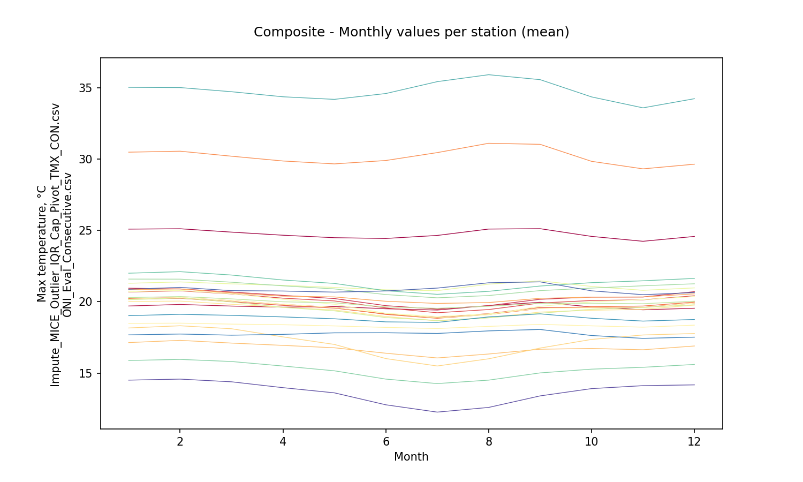
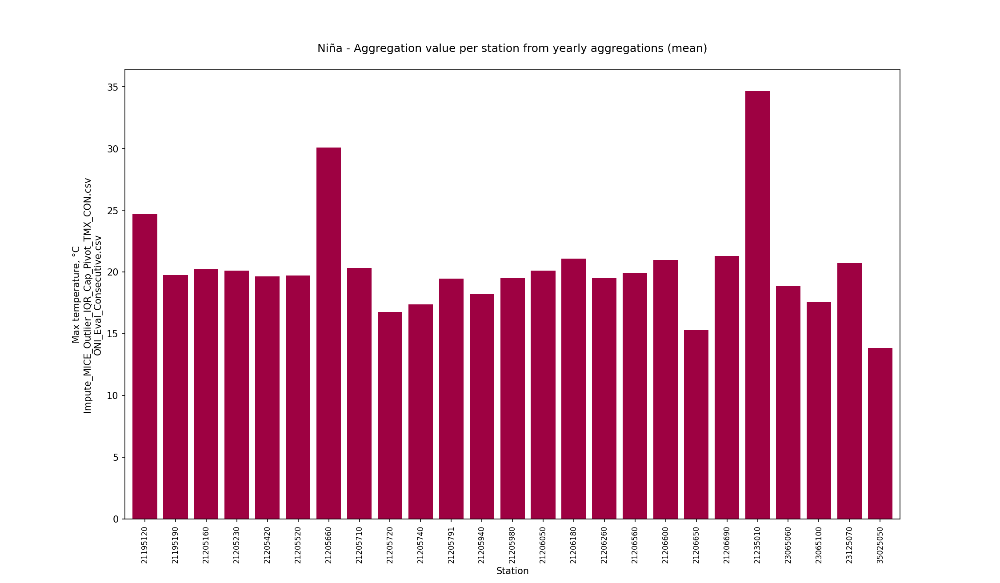

# Statistical aggregations for hydro-climatological composite series and yearly events Niño, Niña and Neutral

For further information about the NOAA - Oceanic Niño Index (ONI) classifier for climatological yearly events Niño, Niña and Neutral, check this activity https://github.com/rcfdtools/R.LTWB/tree/main/Section03/ENSOONI

* Station records file: [Impute_MICE_Outlier_IQR_Cap_Pivot_TMX_CON.csv](../IDEAM_Impute/Impute_MICE_Outlier_IQR_Cap_Pivot_TMX_CON.csv)
* ENSO-ONI year file: [ONI_Eval_Consecutive.csv](../ENSOONI/ONI_Eval_Consecutive.csv)
* Stations: 26
* Records: 16781
* Daily serie: True
* Aggregation function: Mean
* Execution date: 2023-09-23 12:32:38.875845
* Python version: 3.11.5 (tags/v3.11.5:cce6ba9, Aug 24 2023, 14:38:34) [MSC v.1936 64 bit (AMD64)]
* Python path: ['C:\\JLGC\\R.LTWB\\.src', 'C:\\Python311\\python311.zip', 'C:\\Python311\\DLLs', 'C:\\Python311\\Lib', 'C:\\Python311']
* matplotlib version: 3.6.0
* pandas version: 2.1.0
* Instructions & script: https://github.com/rcfdtools/R.LTWB/tree/main/Section03/Agg
* License: https://github.com/rcfdtools/R.LTWB/blob/main/LICENSE.md
* Credits: r.cfdtools@gmail.com

## Composite - Yearly values per station from monthly values (Mean)

Daily values to year-month aggregation (Mean) file: [Agg_YM_Impute_MICE_Outlier_IQR_Cap_Pivot_TMX_CON.csv](Agg_YM_Impute_MICE_Outlier_IQR_Cap_Pivot_TMX_CON.csv)

|   Year |   21195120 |   21195190 |   21205160 |   21205230 |   21205420 |   21205520 |   21205660 |   21205710 |   21205720 |   21205740 |   21205791 |   21205940 |   21205980 |   21206050 |   21206180 |   21206260 |   21206560 |   21206600 |   21206650 |   21206690 |   21235010 |   23065060 |   23065100 |   23125070 |   35025050 |
|-------:|-----------:|-----------:|-----------:|-----------:|-----------:|-----------:|-----------:|-----------:|-----------:|-----------:|-----------:|-----------:|-----------:|-----------:|-----------:|-----------:|-----------:|-----------:|-----------:|-----------:|-----------:|-----------:|-----------:|-----------:|-----------:|
|   1978 |    24.7414 |    19.6456 |    20.3053 |    20.09   |    19.6367 |    19.6611 |    30.1647 |    20.3651 |    16.7484 |    17.1807 |    19.4439 |    18.3362 |    19.6563 |    19.9462 |    21.103  |    19.4872 |    19.9435 |    20.9883 |    15.2471 |    21.3596 |    34.7413 |    18.8682 |    17.7371 |    20.8691 |    13.6928 |
|   1979 |    24.7414 |    19.6456 |    20.3053 |    20.09   |    19.6367 |    19.6611 |    30.1647 |    20.3651 |    16.7484 |    17.1807 |    19.4439 |    18.3362 |    19.6563 |    19.9462 |    21.103  |    19.4872 |    19.9435 |    20.9883 |    15.2471 |    21.3596 |    34.7413 |    18.8682 |    17.7371 |    20.8691 |    13.6928 |
|   1980 |    24.5839 |    19.2533 |    20.0791 |    20.0827 |    19.3111 |    19.5564 |    30.7992 |    20.0381 |    16.6773 |    16.8826 |    19.5225 |    18.3223 |    19.6394 |    19.8218 |    21.1197 |    19.3006 |    19.9596 |    20.8736 |    15.0722 |    21.2408 |    34.4972 |    18.8906 |    17.8691 |    21.009  |    13.5148 |
|   1981 |    24.2401 |    18.8453 |    19.9042 |    19.9673 |    19.1138 |    19.3815 |    30.1181 |    20.1687 |    16.088  |    16.899  |    19.2524 |    18.2041 |    19.2565 |    19.6351 |    20.8614 |    19.2217 |    19.7939 |    20.7627 |    15.0335 |    21.0869 |    33.8249 |    18.5972 |    17.4389 |    20.2292 |    13.421  |
|   1982 |    24.2104 |    19.0177 |    19.6156 |    19.5405 |    18.8311 |    19.2042 |    29.6748 |    19.6588 |    16.3533 |    16.4047 |    19.093  |    18.0445 |    19.2723 |    19.442  |    20.7742 |    18.9521 |    19.6119 |    20.552  |    14.7485 |    20.8728 |    34.0736 |    18.5745 |    17.544  |    20.648  |    13.1125 |
|   1983 |    24.8638 |    19.4424 |    23.6572 |    20.1281 |    19.5463 |    19.6818 |    30.493  |    20.0231 |    15.9773 |    16.8104 |    19.5693 |    18.3319 |    19.5154 |    19.7558 |    21.1518 |    19.2936 |    19.8981 |    20.821  |    15.0853 |    21.174  |    35.198  |    18.9806 |    17.9838 |    21.4007 |    13.5078 |
|   1984 |    23.8017 |    18.1496 |    19.9106 |    19.4623 |    18.5455 |    19.0407 |    29.0337 |    19.5018 |    15.5491 |    16.6091 |    18.7008 |    17.8919 |    18.8873 |    19.3801 |    20.4531 |    18.8521 |    19.4252 |    20.3802 |    14.6845 |    20.7175 |    33.3181 |    18.2519 |    17.1173 |    19.9857 |    13.0723 |
|   1985 |    24.1615 |    18.8625 |    18.9819 |    19.584  |    18.8398 |    19.5044 |    30.407  |    19.8942 |    15.8528 |    16.7476 |    19.0025 |    18.1608 |    19.269  |    19.5616 |    20.8734 |    19.0493 |    19.7648 |    20.6437 |    14.8756 |    20.9958 |    33.7707 |    18.5633 |    17.4631 |    20.1951 |    13.2677 |
|   1986 |    23.965  |    18.667  |    19.2031 |    19.5182 |    18.7832 |    19.2172 |    29.7223 |    20.0454 |    15.5944 |    16.424  |    18.7977 |    18.0696 |    19.1239 |    19.7892 |    20.7698 |    18.9705 |    19.6474 |    20.6195 |    14.7834 |    20.8806 |    33.3088 |    18.4935 |    17.3804 |    20.2575 |    13.0595 |
|   1987 |    24.8968 |    19.5017 |    18.2071 |    20.4571 |    19.6788 |    19.9877 |    30.815  |    20.259  |    16.3895 |    17.1744 |    19.6463 |    18.4218 |    19.6983 |    20.9953 |    21.284  |    19.5224 |    20.0567 |    21.0127 |    15.2271 |    21.3908 |    35.012  |    19.0444 |    18.2282 |    21.1618 |    13.7072 |
|   1988 |    24.6224 |    18.9486 |    19.5466 |    19.9991 |    19.2229 |    19.5977 |    29.9213 |    19.6271 |    16.4374 |    17.3185 |    19.2316 |    18.1693 |    19.119  |    20.9932 |    21.1275 |    19.3635 |    19.7216 |    20.6237 |    15.0858 |    21.0576 |    34.6237 |    18.7489 |    17.597  |    20.2993 |    13.7246 |
|   1989 |    24.51   |    18.5566 |    19.6486 |    20.1783 |    18.9748 |    19.2476 |    29.9168 |    20.0785 |    16.6493 |    16.8422 |    18.9977 |    18.1512 |    18.844  |    20.7622 |    20.8556 |    19.2401 |    19.6612 |    20.5438 |    14.8637 |    20.8655 |    34.7416 |    18.5327 |    17.4644 |    20.0676 |    13.1369 |
|   1990 |    24.4268 |    18.9533 |    20.0296 |    20.2159 |    19.0872 |    19.3425 |    29.6562 |    20.3451 |    17.17   |    16.9141 |    19.0405 |    18.1605 |    19.0171 |    20.8996 |    20.857  |    19.365  |    19.7061 |    20.7024 |    14.9369 |    20.9999 |    34.3734 |    18.61   |    17.944  |    20.3969 |    13.1655 |
|   1991 |    24.3568 |    19.2019 |    20.1345 |    20.1829 |    19.3364 |    19.6899 |    29.7075 |    20.5766 |    17.7477 |    17.0417 |    19.2913 |    18.2189 |    19.2129 |    21.4108 |    20.7871 |    18.9959 |    19.7464 |    20.7961 |    14.9129 |    21.1222 |    34.2008 |    18.6553 |    17.9086 |    20.6402 |    13.2394 |
|   1992 |    24.7868 |    19.5709 |    20.4023 |    20.1006 |    19.6893 |    19.9469 |    30.491  |    20.5104 |    17.9303 |    17.3075 |    19.8747 |    18.4001 |    19.604  |    20.7543 |    21.2042 |    19.4982 |    20.006  |    21.0281 |    15.2357 |    21.3992 |    34.7717 |    18.8604 |    18.1667 |    20.9255 |    13.6714 |
|   1993 |    24.5823 |    19.3117 |    20.0599 |    19.795  |    19.365  |    19.4888 |    29.6825 |    20.3963 |    16.1173 |    16.9666 |    19.5652 |    18.2141 |    19.2302 |    18.8446 |    20.7537 |    19.1525 |    19.7413 |    20.781  |    14.9289 |    21.104  |    34.3991 |    18.4297 |    17.8347 |    20.6458 |    13.0379 |
|   1994 |    24.6798 |    19.797  |    19.9929 |    19.6779 |    19.274  |    19.5081 |    29.6335 |    20.382  |    16.0703 |    17.2562 |    19.7379 |    18.2002 |    19.2828 |    18.8767 |    20.6901 |    19.5254 |    19.7767 |    20.8423 |    15.103  |    21.1986 |    34.4435 |    18.4543 |    17.6835 |    20.4874 |    13.3069 |
|   1995 |    24.4227 |    19.6675 |    20.3105 |    20.0848 |    19.522  |    19.9019 |    30.3114 |    20.557  |    16.1665 |    17.306  |    20.0622 |    18.3419 |    19.6733 |    19.4215 |    21.1035 |    19.4113 |    19.9773 |    21.033  |    15.3748 |    21.41   |    34.9006 |    18.7831 |    17.6463 |    20.4366 |    13.9423 |
|   1996 |    23.8426 |    19.3652 |    20.0121 |    19.7279 |    19.2592 |    19.5829 |    29.6257 |    20.2096 |    16.0908 |    16.9535 |    19.7312 |    18.1552 |    19.2945 |    19.0684 |    20.5615 |    18.7097 |    19.6778 |    20.7044 |    14.9815 |    21.0697 |    34.2129 |    18.3555 |    17.4645 |    20.4056 |    13.4934 |
|   1997 |    24.2956 |    19.9628 |    20.4517 |    20.268  |    19.6651 |    20.012  |    31.1686 |    21.0061 |    16.3873 |    16.4303 |    20.1092 |    18.5012 |    19.7771 |    19.6101 |    21.4543 |    19.0228 |    20.1069 |    21.0952 |    15.2464 |    21.3239 |    35.1017 |    19.1407 |    18.2858 |    21.7459 |    13.6901 |
|   1998 |    24.5922 |    22.7289 |    20.6866 |    20.3869 |    19.9607 |    20.1595 |    31.2687 |    21.0092 |    16.7456 |    17.3742 |    20.1104 |    18.5972 |    19.4437 |    20.1818 |    21.3457 |    19.5799 |    20.2211 |    21.1224 |    15.5921 |    21.4476 |    35.0201 |    19.194  |    18.7393 |    21.2443 |    14.2239 |
|   1999 |    23.755  |    19.3273 |    19.672  |    19.2162 |    18.9958 |    19.1546 |    30.0967 |    19.9509 |    15.5123 |    17.5653 |    19.0946 |    18.162  |    18.0156 |    18.9439 |    20.4317 |    18.9118 |    20.4186 |    20.3877 |    14.9853 |    20.7335 |    33.2557 |    18.2046 |    17.4814 |    20.5656 |    13.4815 |
|   2000 |    24.7806 |    18.9482 |    19.6591 |    19.2439 |    19.0656 |    18.9577 |    29.4068 |    20.0863 |    15.6962 |    16.8601 |    18.7019 |    18.1055 |    18.2896 |    19.0373 |    20.5259 |    19.1121 |    19.75   |    20.3822 |    15.0083 |    20.6561 |    33.7557 |    18.2897 |    17.3125 |    20.2187 |    13.4336 |
|   2001 |    25.152  |    19.4665 |    20.1435 |    19.8251 |    19.5437 |    19.3894 |    30.4651 |    20.6886 |    16.0857 |    17.2296 |    19.1898 |    18.3798 |    19.4843 |    19.2571 |    21.1295 |    19.5194 |    20.5025 |    21.0703 |    15.3627 |    21.3773 |    34.6076 |    18.6904 |    17.973  |    20.818  |    13.7932 |
|   2002 |    24.9101 |    19.9243 |    20.3822 |    20.0975 |    19.7676 |    19.6333 |    30.5553 |    20.9766 |    16.2618 |    17.3578 |    19.5109 |    18.4394 |    20.0475 |    19.2924 |    21.383  |    19.487  |    20.4214 |    21.5794 |    15.7764 |    21.7969 |    34.5835 |    19.1687 |    18.1065 |    21.2318 |    13.9566 |
|   2003 |    24.9847 |    20.14   |    20.4782 |    20.0753 |    19.959  |    19.5634 |    30.6828 |    21.0288 |    16.1218 |    17.517  |    19.2736 |    18.5114 |    19.8559 |    19.4346 |    21.5168 |    19.8911 |    20.3742 |    21.7004 |    16.1736 |    22.1194 |    34.6308 |    19.3259 |    17.8658 |    21.393  |    14.3112 |
|   2004 |    25.4376 |    20.0447 |    20.3241 |    19.8671 |    19.8937 |    19.2694 |    30.7457 |    20.7053 |    16.247  |    17.2717 |    18.8252 |    18.4905 |    19.743  |    19.3436 |    21.3626 |    19.7257 |    19.9905 |    21.2778 |    15.6601 |    21.7061 |    35.3053 |    19.0383 |    17.8805 |    21.2751 |    14.0239 |
|   2005 |    24.964  |    19.6768 |    20.5818 |    20.1986 |    20.0842 |    19.6208 |    30.6694 |    21      |    16.505  |    17.8608 |    19.27   |    18.5527 |    20.081  |    19.6795 |    21.435  |    20.1711 |    20.3904 |    21.4968 |    15.8769 |    22.0433 |    35.1634 |    19.2535 |    17.4308 |    21.2524 |    14.387  |
|   2006 |    24.8818 |    19.4767 |    20.395  |    19.8033 |    20.0291 |    19.2514 |    30.231  |    20.6086 |    16.0024 |    17.0245 |    18.7858 |    18.4422 |    19.7017 |    19.2396 |    21.1008 |    19.7313 |    20.0926 |    21.1222 |    15.7565 |    21.4225 |    34.764  |    18.9559 |    17.3232 |    20.958  |    14.0085 |
|   2007 |    25.3281 |    19.856  |    20.4888 |    20.1531 |    20.0198 |    19.4374 |    30.2722 |    20.7619 |    16.3149 |    17.2516 |    18.8519 |    18.4622 |    19.8546 |    20.1274 |    21.3651 |    19.8824 |    20.2459 |    21.3663 |    15.7228 |    21.6242 |    34.9572 |    19.3424 |    17.4731 |    21.2271 |    13.9129 |
|   2008 |    24.3208 |    19.4772 |    19.9014 |    19.7059 |    19.3776 |    18.9405 |    29.1057 |    20.1617 |    15.9928 |    17.2042 |    18.3154 |    17.0628 |    19.4123 |    19.8831 |    20.7974 |    19.6772 |    19.5909 |    20.8916 |    15.7559 |    20.9611 |    33.9754 |    18.6511 |    16.8449 |    20.4628 |    13.9069 |
|   2009 |    25.0826 |    20.1592 |    20.7704 |    20.2923 |    20.223  |    19.9504 |    29.9873 |    20.1313 |    16.6333 |    17.1816 |    19.6898 |    18.3209 |    20.0331 |    20.1382 |    20.931  |    20.0895 |    20.2862 |    21.1091 |    15.3594 |    21.68   |    34.9775 |    19.0683 |    17.5775 |    21.096  |    13.8346 |
|   2010 |    24.9062 |    19.7482 |    20.9799 |    20.6472 |    20.3218 |    20.3351 |    30.0094 |    20.3553 |    17.3376 |    17.9925 |    20.1768 |    18.2703 |    20.2569 |    20.6129 |    21.2936 |    19.6254 |    19.6548 |    21.7361 |    16.1333 |    22.0885 |    34.5172 |    19.1441 |    17.3829 |    20.9526 |    14.6434 |
|   2011 |    24.0077 |    18.9139 |    20.4901 |    20.0837 |    19.9047 |    19.7728 |    29.4505 |    20.2648 |    17.3277 |    17.3807 |    19.5742 |    18.0048 |    19.5619 |    19.9782 |    20.4916 |    19.1042 |    19.2316 |    20.7193 |    15.3306 |    20.9558 |    34.5664 |    18.5927 |    16.9429 |    20.3819 |    13.8703 |
|   2012 |    24.6835 |    19.2277 |    20.5331 |    20.037  |    20.1183 |    19.4951 |    30.024  |    20.3885 |    17.3294 |    16.9576 |    19.0236 |    18.1545 |    19.7892 |    19.9118 |    20.7697 |    18.8286 |    19.7932 |    20.7692 |    15.2044 |    21.239  |    35.274  |    18.7195 |    17.4773 |    20.7007 |    13.5573 |
|   2013 |    24.9439 |    19.533  |    20.6384 |    20.2331 |    20.1313 |    19.7303 |    30.3429 |    20.4263 |    17.1228 |    17.3515 |    19.3346 |    18.6085 |    19.9178 |    20.1563 |    21.1217 |    19.5273 |    20.0852 |    21.316  |    15.5787 |    22.0044 |    35.6368 |    19.0115 |    17.8083 |    21.0149 |    13.9289 |
|   2014 |    24.8673 |    19.5278 |    20.5722 |    20.1745 |    20.1154 |    19.6014 |    30.2875 |    20.1885 |    17.8954 |    17.069  |    19.1411 |    18.5316 |    20.0664 |    20.1214 |    21.0832 |    19.7102 |    19.9976 |    21.2485 |    15.5948 |    21.6502 |    35.3582 |    18.8007 |    17.7956 |    20.8567 |    13.8671 |
|   2015 |    26.3699 |    20.1962 |    20.7909 |    20.5238 |    20.252  |    19.9104 |    31.3297 |    20.6262 |    17.8701 |    16.7536 |    19.5541 |    19.0241 |    20.6021 |    20.2433 |    21.7847 |    19.67   |    20.3228 |    21.0298 |    15.2634 |    21.5715 |    36.5837 |    19.4246 |    18.5363 |    21.6687 |    13.5687 |
|   2016 |    26.2247 |    20.6818 |    21.0434 |    20.9701 |    20.3362 |    20.4281 |    30.9137 |    20.941  |    18.4522 |    17.6807 |    20.2748 |    19.0043 |    20.947  |    20.7878 |    21.7584 |    20.2943 |    20.5728 |    21.7111 |    16.0945 |    22.0647 |    36.0602 |    19.5134 |    18.2081 |    21.6817 |    14.33   |
|   2017 |    25.3045 |    20.1791 |    20.8387 |    20.6434 |    20.151  |    20.2176 |    30.2593 |    20.498  |    17.5834 |    17.9277 |    20.0534 |    18.7541 |    20.4343 |    20.4941 |    21.6286 |    20.0415 |    19.5826 |    21.085  |    16.1778 |    21.6689 |    35.2859 |    19.2486 |    17.9753 |    21.2467 |    13.8174 |
|   2018 |    25.3931 |    20.0208 |    20.5904 |    20.3871 |    19.9178 |    19.9801 |    30.05   |    20.3272 |    17.8437 |    17.3077 |    19.8399 |    18.7234 |    20.2104 |    20.1358 |    21.4453 |    19.7872 |    19.768  |    20.8111 |    14.8304 |    21.3415 |    35.3774 |    19.0781 |    17.8692 |    21.1123 |    13.341  |
|   2019 |    25.404  |    20.5605 |    20.9163 |    20.6568 |    20.2504 |    20.3052 |    30.6074 |    20.1722 |    18.1612 |    17.4824 |    20.1862 |    18.7334 |    20.5776 |    20.4307 |    21.8065 |    20.0983 |    19.9848 |    21.2445 |    14.8805 |    21.8313 |    35.7223 |    19.3915 |    18.133  |    21.5318 |    13.7429 |
|   2020 |    25.9156 |    20.3787 |    21.0483 |    20.9379 |    20.335  |    20.4532 |    30.8382 |    20.9273 |    18.2577 |    17.8391 |    20.3301 |    18.7937 |    20.8253 |    20.7065 |    21.9161 |    20.1769 |    20.347  |    21.55   |    14.5263 |    21.9025 |    36.1957 |    19.521  |    18.2254 |    21.6159 |    14.0271 |
|   2021 |    24.3919 |    21.1238 |    20.6009 |    20.5797 |    19.815  |    20.1428 |    29.3799 |    20.3504 |    17.8676 |    17.6709 |    20.0745 |    18.4157 |    20.4611 |    20.4545 |    21.3238 |    20.0429 |    19.9416 |    21.0717 |    14.4134 |    21.5295 |    34.8654 |    19.0106 |    17.8022 |    21.1725 |    13.928  |
|   2022 |    24.0895 |    20.4062 |    20.5755 |    20.3235 |    19.9084 |    19.9805 |    28.984  |    19.9653 |    17.9038 |    17.6541 |    19.8236 |    17.9921 |    20.0387 |    20.2824 |    21.0718 |    19.9921 |    19.8177 |    21.0229 |    14.5629 |    21.3129 |    34.6503 |    18.7863 |    17.5219 |    20.7865 |    14.0502 |

Composite - Aggregation value per station from yearly aggregations (mean)

|              |   21195120 |   21195190 |   21205160 |   21205230 |   21205420 |   21205520 |   21205660 |   21205710 |   21205720 |   21205740 |   21205791 |   21205940 |   21205980 |   21206050 |   21206180 |   21206260 |   21206560 |   21206600 |   21206650 |   21206690 |   21235010 |   23065060 |   23065100 |   23125070 |   35025050 |
|:-------------|-----------:|-----------:|-----------:|-----------:|-----------:|-----------:|-----------:|-----------:|-----------:|-----------:|-----------:|-----------:|-----------:|-----------:|-----------:|-----------:|-----------:|-----------:|-----------:|-----------:|-----------:|-----------:|-----------:|-----------:|-----------:|
| AggComposite |    24.7427 |    19.6464 |     20.308 |    20.0936 |    19.6399 |    19.6643 |     30.166 |    20.3677 |    16.7515 |     17.187 |    19.4471 |    18.3371 |    19.6596 |    19.9509 |    21.1046 |    19.4911 |    19.9455 |    20.9914 |     15.251 |    21.3635 |     34.741 |    18.8695 |    17.7374 |    20.8698 |    13.6978 |

Composite - Aggregation value per station from yearly aggregations (std - standard deviation)

|                 |   21195120 |   21195190 |   21205160 |   21205230 |   21205420 |   21205520 |   21205660 |   21205710 |   21205720 |   21205740 |   21205791 |   21205940 |   21205980 |   21206050 |   21206180 |   21206260 |   21206560 |   21206600 |   21206650 |   21206690 |   21235010 |   23065060 |   23065100 |   23125070 |   35025050 |
|:----------------|-----------:|-----------:|-----------:|-----------:|-----------:|-----------:|-----------:|-----------:|-----------:|-----------:|-----------:|-----------:|-----------:|-----------:|-----------:|-----------:|-----------:|-----------:|-----------:|-----------:|-----------:|-----------:|-----------:|-----------:|-----------:|
| StdAggComposite |    0.58197 |   0.759612 |   0.758477 |   0.395918 |   0.484674 |   0.387619 |    0.57425 |   0.381392 |   0.826684 |   0.388366 |   0.493141 |    0.32063 |   0.598117 |   0.637398 |   0.375596 |   0.412686 |   0.304207 |   0.352319 |   0.450541 |   0.393641 |   0.718418 |   0.347535 |   0.388093 |   0.469215 |   0.383632 |

Composite - Monthly values per station (mean)

|   Month |   21195120 |   21195190 |   21205160 |   21205230 |   21205420 |   21205520 |   21205660 |   21205710 |   21205720 |   21205740 |   21205791 |   21205940 |   21205980 |   21206050 |   21206180 |   21206260 |   21206560 |   21206600 |   21206650 |   21206690 |   21235010 |   23065060 |   23065100 |   23125070 |   35025050 |
|--------:|-----------:|-----------:|-----------:|-----------:|-----------:|-----------:|-----------:|-----------:|-----------:|-----------:|-----------:|-----------:|-----------:|-----------:|-----------:|-----------:|-----------:|-----------:|-----------:|-----------:|-----------:|-----------:|-----------:|-----------:|-----------:|
|       1 |    25.0886 |    19.7041 |    20.9496 |    20.6844 |    20.181  |    20.2294 |    30.4783 |    20.8438 |    17.1417 |    18.1643 |    20.018  |    18.4878 |    20.1787 |    20.7052 |    21.2952 |    20.1468 |    20.2941 |    21.5885 |    15.8871 |    22.0011 |    35.0209 |    19.0281 |    17.6807 |    20.8745 |    14.5107 |
|       2 |    25.1139 |    19.8124 |    20.9004 |    20.7669 |    20.245  |    20.2915 |    30.5459 |    20.8982 |    17.2976 |    18.3196 |    20.0476 |    18.5021 |    20.2984 |    20.7957 |    21.3894 |    20.2639 |    20.3682 |    21.5842 |    15.963  |    22.1086 |    35.0026 |    19.122  |    17.7406 |    21.0081 |    14.5824 |
|       3 |    24.8782 |    19.6987 |    20.6803 |    20.5488 |    20.0037 |    20.0842 |    30.1955 |    20.6188 |    17.1065 |    18.1103 |    19.8242 |    18.4353 |    20.0837 |    20.5589 |    21.2524 |    19.986  |    20.2016 |    21.3697 |    15.816  |    21.8723 |    34.7122 |    19.049  |    17.6592 |    20.7794 |    14.3939 |
|       4 |    24.6611 |    19.6225 |    20.4498 |    20.253  |    19.7473 |    19.8242 |    29.861  |    20.3949 |    16.9453 |    17.5392 |    19.6144 |    18.392  |    19.8316 |    20.1756 |    21.1511 |    19.6077 |    19.9982 |    21.1161 |    15.4994 |    21.5245 |    34.3578 |    18.94   |    17.7164 |    20.753  |    13.9837 |
|       5 |    24.4873 |    19.6683 |    20.226  |    20.0589 |    19.5586 |    19.609  |    29.6577 |    20.3397 |    16.7776 |    17.012  |    19.4259 |    18.3082 |    19.5977 |    19.825  |    21.004  |    19.3645 |    19.9271 |    20.9001 |    15.1649 |    21.2848 |    34.1774 |    18.8077 |    17.8242 |    20.676  |    13.6206 |
|       6 |    24.4344 |    19.5098 |    19.7283 |    19.5692 |    19.1441 |    19.1152 |    29.8948 |    20.0355 |    16.396  |    16.0203 |    18.9683 |    18.2047 |    19.1963 |    19.1868 |    20.8373 |    18.8933 |    19.6371 |    20.5044 |    14.584  |    20.7744 |    34.5855 |    18.5925 |    17.8304 |    20.7573 |    12.7831 |
|       7 |    24.6458 |    19.42   |    19.4865 |    19.2309 |    18.9022 |    18.8419 |    30.4479 |    19.8842 |    16.0651 |    15.5019 |    18.6636 |    18.127  |    18.9694 |    18.8795 |    20.7785 |    18.6901 |    19.5424 |    20.2769 |    14.269  |    20.5211 |    35.4182 |    18.5523 |    17.7817 |    20.9586 |    12.2714 |
|       8 |    25.0934 |    19.7306 |    19.7305 |    19.4549 |    19.1723 |    19.1115 |    31.1009 |    19.9461 |    16.3414 |    16.0057 |    18.884  |    18.2754 |    19.1536 |    19.0916 |    21.2328 |    18.8731 |    19.6849 |    20.4365 |    14.5119 |    20.7311 |    35.9037 |    18.9406 |    17.9607 |    21.3304 |    12.5999 |
|       9 |    25.1187 |    19.9652 |    20.1736 |    19.9115 |    19.5976 |    19.5327 |    31.0274 |    20.2415 |    16.6753 |    16.7586 |    19.2786 |    18.4164 |    19.5378 |    19.681  |    21.467  |    19.1969 |    19.8926 |    20.7824 |    15.017  |    21.1022 |    35.5582 |    19.1533 |    18.0595 |    21.394  |    13.4071 |
|      10 |    24.5786 |    19.6428 |    20.3281 |    20.0878 |    19.6165 |    19.6528 |    29.8364 |    20.3213 |    16.7306 |    17.3625 |    19.4064 |    18.3131 |    19.5768 |    19.9978 |    21.0746 |    19.4758 |    19.8985 |    20.9581 |    15.2805 |    21.3381 |    34.3492 |    18.8446 |    17.6365 |    20.766  |    13.917  |
|      11 |    24.2368 |    19.4357 |    20.3333 |    20.1375 |    19.6016 |    19.7002 |    29.3099 |    20.3347 |    16.6381 |    17.6735 |    19.466  |    18.2216 |    19.5793 |    20.15   |    20.8023 |    19.6077 |    19.8623 |    21.12   |    15.4099 |    21.4684 |    33.5828 |    18.6467 |    17.4373 |    20.4958 |    14.1245 |
|      12 |    24.576  |    19.5472 |    20.7095 |    20.4198 |    19.9089 |    19.9794 |    29.6361 |    20.5543 |    16.9027 |    17.7762 |    19.7682 |    18.3617 |    19.9116 |    20.3633 |    20.9708 |    19.7871 |    20.0394 |    21.26   |    15.6093 |    21.6356 |    34.2233 |    18.7574 |    17.5212 |    20.6446 |    14.1797 |

Composite - Zonal monthly values (mean)

|   Month |   AggCompositeZonal |
|--------:|--------------------:|
|       1 |             20.8473 |
|       2 |             20.9187 |
|       3 |             20.7167 |
|       4 |             20.4784 |
|       5 |             20.2921 |
|       6 |             19.9673 |
|       7 |             19.845  |
|       8 |             20.1319 |
|       9 |             20.4378 |
|      10 |             20.3596 |
|      11 |             20.295  |
|      12 |             20.5217 |

## ENSO-ONI Events - Yearly values per station from monthly values (Mean)

* Records in ENSO-ONI file: 74
* ENSO-ONI eventMark unique values: [-1  1  0]

### Niña events analysis (24 years identified)

|   Id |   YR |   NinaCount |   NinoCount |   NeutralCount | Event   |   EventMark |   EventLabel |
|-----:|-----:|------------:|------------:|---------------:|:--------|------------:|-------------:|
|    0 | 1950 |           7 |           0 |              5 | Niña    |          -1 |            7 |
|    4 | 1954 |           8 |           1 |              3 | Niña    |          -1 |            8 |
|    5 | 1955 |          12 |           0 |              0 | Niña    |          -1 |           12 |
|    6 | 1956 |           8 |           0 |              4 | Niña    |          -1 |            8 |
|   14 | 1964 |           8 |           2 |              2 | Niña    |          -1 |            8 |
|   20 | 1970 |           6 |           1 |              5 | Niña    |          -1 |            6 |
|   21 | 1971 |          12 |           0 |              0 | Niña    |          -1 |           12 |
|   23 | 1973 |           8 |           3 |              1 | Niña    |          -1 |            8 |
|   24 | 1974 |           7 |           0 |              5 | Niña    |          -1 |            7 |
|   25 | 1975 |          12 |           0 |              0 | Niña    |          -1 |           12 |
|   35 | 1985 |           6 |           0 |              6 | Niña    |          -1 |            6 |
|   38 | 1988 |           8 |           2 |              2 | Niña    |          -1 |            8 |
|   39 | 1989 |           5 |           0 |              7 | Niña    |          -1 |            5 |
|   45 | 1995 |           5 |           3 |              4 | Niña    |          -1 |            5 |
|   48 | 1998 |           6 |           4 |              2 | Niña    |          -1 |            6 |
|   49 | 1999 |          12 |           0 |              0 | Niña    |          -1 |           12 |
|   50 | 2000 |          12 |           0 |              0 | Niña    |          -1 |           12 |
|   57 | 2007 |           6 |           1 |              5 | Niña    |          -1 |            6 |
|   58 | 2008 |           6 |           0 |              6 | Niña    |          -1 |            6 |
|   60 | 2010 |           7 |           3 |              2 | Niña    |          -1 |            7 |
|   61 | 2011 |           5 |           0 |              7 | Niña    |          -1 |            5 |
|   66 | 2016 |           5 |           4 |              3 | Niña    |          -1 |            5 |
|   70 | 2020 |           5 |           1 |              6 | Niña    |          -1 |            5 |
|   72 | 2022 |          12 |           0 |              0 | Niña    |          -1 |           12 |

Niña - Table aggregations (Mean)

|   Year |   21195120 |   21195190 |   21205160 |   21205230 |   21205420 |   21205520 |   21205660 |   21205710 |   21205720 |   21205740 |   21205791 |   21205940 |   21205980 |   21206050 |   21206180 |   21206260 |   21206560 |   21206600 |   21206650 |   21206690 |   21235010 |   23065060 |   23065100 |   23125070 |   35025050 |
|-------:|-----------:|-----------:|-----------:|-----------:|-----------:|-----------:|-----------:|-----------:|-----------:|-----------:|-----------:|-----------:|-----------:|-----------:|-----------:|-----------:|-----------:|-----------:|-----------:|-----------:|-----------:|-----------:|-----------:|-----------:|-----------:|
|   1985 |    24.1615 |    18.8625 |    18.9819 |    19.584  |    18.8398 |    19.5044 |    30.407  |    19.8942 |    15.8528 |    16.7476 |    19.0025 |    18.1608 |    19.269  |    19.5616 |    20.8734 |    19.0493 |    19.7648 |    20.6437 |    14.8756 |    20.9958 |    33.7707 |    18.5633 |    17.4631 |    20.1951 |    13.2677 |
|   1988 |    24.6224 |    18.9486 |    19.5466 |    19.9991 |    19.2229 |    19.5977 |    29.9213 |    19.6271 |    16.4374 |    17.3185 |    19.2316 |    18.1693 |    19.119  |    20.9932 |    21.1275 |    19.3635 |    19.7216 |    20.6237 |    15.0858 |    21.0576 |    34.6237 |    18.7489 |    17.597  |    20.2993 |    13.7246 |
|   1989 |    24.51   |    18.5566 |    19.6486 |    20.1783 |    18.9748 |    19.2476 |    29.9168 |    20.0785 |    16.6493 |    16.8422 |    18.9977 |    18.1512 |    18.844  |    20.7622 |    20.8556 |    19.2401 |    19.6612 |    20.5438 |    14.8637 |    20.8655 |    34.7416 |    18.5327 |    17.4644 |    20.0676 |    13.1369 |
|   1995 |    24.4227 |    19.6675 |    20.3105 |    20.0848 |    19.522  |    19.9019 |    30.3114 |    20.557  |    16.1665 |    17.306  |    20.0622 |    18.3419 |    19.6733 |    19.4215 |    21.1035 |    19.4113 |    19.9773 |    21.033  |    15.3748 |    21.41   |    34.9006 |    18.7831 |    17.6463 |    20.4366 |    13.9423 |
|   1998 |    24.5922 |    22.7289 |    20.6866 |    20.3869 |    19.9607 |    20.1595 |    31.2687 |    21.0092 |    16.7456 |    17.3742 |    20.1104 |    18.5972 |    19.4437 |    20.1818 |    21.3457 |    19.5799 |    20.2211 |    21.1224 |    15.5921 |    21.4476 |    35.0201 |    19.194  |    18.7393 |    21.2443 |    14.2239 |
|   1999 |    23.755  |    19.3273 |    19.672  |    19.2162 |    18.9958 |    19.1546 |    30.0967 |    19.9509 |    15.5123 |    17.5653 |    19.0946 |    18.162  |    18.0156 |    18.9439 |    20.4317 |    18.9118 |    20.4186 |    20.3877 |    14.9853 |    20.7335 |    33.2557 |    18.2046 |    17.4814 |    20.5656 |    13.4815 |
|   2000 |    24.7806 |    18.9482 |    19.6591 |    19.2439 |    19.0656 |    18.9577 |    29.4068 |    20.0863 |    15.6962 |    16.8601 |    18.7019 |    18.1055 |    18.2896 |    19.0373 |    20.5259 |    19.1121 |    19.75   |    20.3822 |    15.0083 |    20.6561 |    33.7557 |    18.2897 |    17.3125 |    20.2187 |    13.4336 |
|   2007 |    25.3281 |    19.856  |    20.4888 |    20.1531 |    20.0198 |    19.4374 |    30.2722 |    20.7619 |    16.3149 |    17.2516 |    18.8519 |    18.4622 |    19.8546 |    20.1274 |    21.3651 |    19.8824 |    20.2459 |    21.3663 |    15.7228 |    21.6242 |    34.9572 |    19.3424 |    17.4731 |    21.2271 |    13.9129 |
|   2008 |    24.3208 |    19.4772 |    19.9014 |    19.7059 |    19.3776 |    18.9405 |    29.1057 |    20.1617 |    15.9928 |    17.2042 |    18.3154 |    17.0628 |    19.4123 |    19.8831 |    20.7974 |    19.6772 |    19.5909 |    20.8916 |    15.7559 |    20.9611 |    33.9754 |    18.6511 |    16.8449 |    20.4628 |    13.9069 |
|   2010 |    24.9062 |    19.7482 |    20.9799 |    20.6472 |    20.3218 |    20.3351 |    30.0094 |    20.3553 |    17.3376 |    17.9925 |    20.1768 |    18.2703 |    20.2569 |    20.6129 |    21.2936 |    19.6254 |    19.6548 |    21.7361 |    16.1333 |    22.0885 |    34.5172 |    19.1441 |    17.3829 |    20.9526 |    14.6434 |
|   2011 |    24.0077 |    18.9139 |    20.4901 |    20.0837 |    19.9047 |    19.7728 |    29.4505 |    20.2648 |    17.3277 |    17.3807 |    19.5742 |    18.0048 |    19.5619 |    19.9782 |    20.4916 |    19.1042 |    19.2316 |    20.7193 |    15.3306 |    20.9558 |    34.5664 |    18.5927 |    16.9429 |    20.3819 |    13.8703 |
|   2016 |    26.2247 |    20.6818 |    21.0434 |    20.9701 |    20.3362 |    20.4281 |    30.9137 |    20.941  |    18.4522 |    17.6807 |    20.2748 |    19.0043 |    20.947  |    20.7878 |    21.7584 |    20.2943 |    20.5728 |    21.7111 |    16.0945 |    22.0647 |    36.0602 |    19.5134 |    18.2081 |    21.6817 |    14.33   |
|   2020 |    25.9156 |    20.3787 |    21.0483 |    20.9379 |    20.335  |    20.4532 |    30.8382 |    20.9273 |    18.2577 |    17.8391 |    20.3301 |    18.7937 |    20.8253 |    20.7065 |    21.9161 |    20.1769 |    20.347  |    21.55   |    14.5263 |    21.9025 |    36.1957 |    19.521  |    18.2254 |    21.6159 |    14.0271 |
|   2022 |    24.0895 |    20.4062 |    20.5755 |    20.3235 |    19.9084 |    19.9805 |    28.984  |    19.9653 |    17.9038 |    17.6541 |    19.8236 |    17.9921 |    20.0387 |    20.2824 |    21.0718 |    19.9921 |    19.8177 |    21.0229 |    14.5629 |    21.3129 |    34.6503 |    18.7863 |    17.5219 |    20.7865 |    14.0502 |

Niña - Aggregation value per station from yearly aggregations (mean)

|         |   21195120 |   21195190 |   21205160 |   21205230 |   21205420 |   21205520 |   21205660 |   21205710 |   21205720 |   21205740 |   21205791 |   21205940 |   21205980 |   21206050 |   21206180 |   21206260 |   21206560 |   21206600 |   21206650 |   21206690 |   21235010 |   23065060 |   23065100 |   23125070 |   35025050 |
|:--------|-----------:|-----------:|-----------:|-----------:|-----------:|-----------:|-----------:|-----------:|-----------:|-----------:|-----------:|-----------:|-----------:|-----------:|-----------:|-----------:|-----------:|-----------:|-----------:|-----------:|-----------:|-----------:|-----------:|-----------:|-----------:|
| AggNina |    24.6884 |    19.7501 |    20.2166 |    20.1082 |    19.6275 |    19.7051 |    30.0645 |    20.3272 |    16.7605 |    17.3583 |    19.4677 |    18.2342 |    19.5394 |    20.0914 |    21.0684 |      19.53 |    19.9268 |     20.981 |    15.2794 |    21.2911 |    34.6422 |    18.8477 |    17.5931 |     20.724 |    13.8537 |

Niña - Aggregation value per station from yearly aggregations (std - standard deviation)

|            |   21195120 |   21195190 |   21205160 |   21205230 |   21205420 |   21205520 |   21205660 |   21205710 |   21205720 |   21205740 |   21205791 |   21205940 |   21205980 |   21206050 |   21206180 |   21206260 |   21206560 |   21206600 |   21206650 |   21206690 |   21235010 |   23065060 |   23065100 |   23125070 |   35025050 |
|:-----------|-----------:|-----------:|-----------:|-----------:|-----------:|-----------:|-----------:|-----------:|-----------:|-----------:|-----------:|-----------:|-----------:|-----------:|-----------:|-----------:|-----------:|-----------:|-----------:|-----------:|-----------:|-----------:|-----------:|-----------:|-----------:|
| StdAggNina |   0.710012 |    1.07544 |    0.64855 |   0.543862 |   0.548016 |    0.52506 |    0.67563 |   0.442538 |   0.954252 |    0.37164 |   0.663816 |   0.449304 |   0.839385 |   0.659717 |   0.447575 |   0.435784 |    0.38018 |   0.465727 |   0.521874 |   0.481703 |   0.816963 |   0.427468 |   0.501181 |   0.535785 |   0.416906 |

Niña - Monthly values per station (mean)

|   Month |   21195120 |   21195190 |   21205160 |   21205230 |   21205420 |   21205520 |   21205660 |   21205710 |   21205720 |   21205740 |   21205791 |   21205940 |   21205980 |   21206050 |   21206180 |   21206260 |   21206560 |   21206600 |   21206650 |   21206690 |   21235010 |   23065060 |   23065100 |   23125070 |   35025050 |
|--------:|-----------:|-----------:|-----------:|-----------:|-----------:|-----------:|-----------:|-----------:|-----------:|-----------:|-----------:|-----------:|-----------:|-----------:|-----------:|-----------:|-----------:|-----------:|-----------:|-----------:|-----------:|-----------:|-----------:|-----------:|-----------:|
|       1 |    25.3638 |    20.0908 |    21.1754 |    20.9524 |    20.3789 |    20.4727 |    30.8589 |    21.1552 |    17.5557 |    18.3736 |    20.2777 |    18.5145 |    20.4216 |    21.0386 |    21.5282 |    20.3755 |    20.4549 |    21.9347 |    15.9231 |    22.2674 |    35.4201 |    19.2816 |    17.8063 |    21.1811 |    14.8385 |
|       2 |    25.3442 |    20.1507 |    21.0913 |    21.0246 |    20.4522 |    20.5475 |    30.9117 |    21.0177 |    17.5549 |    18.4583 |    20.3524 |    18.584  |    20.5448 |    21.0709 |    21.6527 |    20.47   |    20.5593 |    21.7912 |    15.9775 |    22.3604 |    35.4029 |    19.383  |    17.8501 |    21.3078 |    14.7564 |
|       3 |    24.9681 |    19.9352 |    20.7795 |    20.6757 |    20.1589 |    20.2861 |    30.4159 |    20.6576 |    17.3491 |    18.3538 |    20.0022 |    18.4176 |    20.1549 |    20.8569 |    21.4358 |    20.0852 |    20.3155 |    21.5641 |    15.8415 |    21.9174 |    35.0012 |    19.2172 |    17.7437 |    20.9299 |    14.7735 |
|       4 |    24.6436 |    19.7236 |    20.5544 |    20.4026 |    19.9237 |    20.0198 |    29.8929 |    20.4143 |    17.0713 |    17.8467 |    19.7946 |    18.3841 |    19.8948 |    20.4477 |    21.1931 |    19.6341 |    19.9913 |    21.2288 |    15.6117 |    21.5809 |    34.2527 |    19.0014 |    17.734  |    20.8507 |    14.2353 |
|       5 |    24.4382 |    19.8383 |    20.1091 |    19.954  |    19.4789 |    19.5697 |    29.8299 |    20.2522 |    16.7788 |    16.9443 |    19.3854 |    18.2834 |    19.4144 |    19.8366 |    21.0327 |    19.352  |    19.841  |    20.7237 |    15.0768 |    21.0229 |    34.1706 |    18.8739 |    17.7299 |    20.7181 |    13.5863 |
|       6 |    24.3057 |    19.6048 |    19.6164 |    19.502  |    19.0559 |    19.0785 |    29.7415 |    19.9932 |    16.423  |    16.1429 |    18.9135 |    18.0993 |    18.9902 |    19.2701 |    20.7845 |    18.9288 |    19.6446 |    20.4238 |    14.5624 |    20.6169 |    34.2973 |    18.6101 |    17.6753 |    20.6217 |    12.7972 |
|       7 |    24.308  |    19.4737 |    19.4089 |    19.2768 |    18.8616 |    18.8925 |    30.0242 |    19.874  |    16.0378 |    15.8021 |    18.6967 |    17.9233 |    18.7781 |    19.0092 |    20.5917 |    18.7693 |    19.4586 |    20.1433 |    14.4049 |    20.3332 |    35.0109 |    18.3861 |    17.513  |    20.6122 |    12.4285 |
|       8 |    24.934  |    19.6629 |    19.615  |    19.5502 |    19.0641 |    19.2173 |    30.5905 |    19.9128 |    16.3811 |    16.4386 |    18.962  |    18.1311 |    18.9598 |    19.3362 |    21.1181 |    19.0087 |    19.6066 |    20.3833 |    14.6403 |    20.6928 |    35.5556 |    18.8028 |    17.6588 |    20.8004 |    12.9023 |
|       9 |    24.8519 |    19.8485 |    19.813  |    19.7003 |    19.3824 |    19.4248 |    30.2757 |    19.9406 |    16.4476 |    16.9427 |    19.1099 |    18.1602 |    19.1205 |    19.6909 |    21.1014 |    19.15   |    19.6721 |    20.5763 |    15.0613 |    20.8723 |    35.0021 |    18.856  |    17.7128 |    20.7935 |    13.4816 |
|      10 |    24.5207 |    19.6479 |    20.0185 |    19.9634 |    19.5156 |    19.5448 |    29.7433 |    20.1485 |    16.5205 |    17.4013 |    19.2625 |    18.1776 |    19.2478 |    19.9858 |    20.9535 |    19.4027 |    19.845  |    20.8483 |    15.2897 |    21.1019 |    34.26   |    18.6997 |    17.357  |    20.5041 |    13.9141 |
|      11 |    24.143  |    19.5008 |    20.0452 |    20.0213 |    19.4993 |    19.5986 |    29.1633 |    20.1819 |    16.4044 |    17.7736 |    19.3057 |    18.0126 |    19.2979 |    20.2278 |    20.7176 |    19.5363 |    19.7488 |    21.0515 |    15.4237 |    21.2674 |    33.3935 |    18.5606 |    17.1783 |    20.1959 |    14.2532 |
|      12 |    24.4389 |    19.5243 |    20.3729 |    20.2751 |    19.7586 |    19.8085 |    29.3255 |    20.3781 |    16.6016 |    17.8222 |    19.5497 |    18.1222 |    19.6474 |    20.3262 |    20.711  |    19.6479 |    19.9839 |    21.103  |    15.5403 |    21.46   |    33.9391 |    18.4995 |    17.1578 |    20.1724 |    14.2773 |

Niña - Zonal monthly values (mean)

|   Month |   AggNinaZonal |
|--------:|---------------:|
|       1 |        21.1056 |
|       2 |        21.1447 |
|       3 |        20.8734 |
|       4 |        20.5731 |
|       5 |        20.2496 |
|       6 |        19.908  |
|       7 |        19.7607 |
|       8 |        20.077  |
|       9 |        20.1995 |
|      10 |        20.235  |
|      11 |        20.1801 |
|      12 |        20.3377 |

### Niño events analysis (19 years identified)

|   Id |   YR |   NinaCount |   NinoCount |   NeutralCount | Event   |   EventMark |   EventLabel |
|-----:|-----:|------------:|------------:|---------------:|:--------|------------:|-------------:|
|    1 | 1951 |           2 |           7 |              3 | Niño    |           1 |            7 |
|    3 | 1953 |           0 |          11 |              1 | Niño    |           1 |           11 |
|    7 | 1957 |           0 |           9 |              3 | Niño    |           1 |            9 |
|    8 | 1958 |           0 |           7 |              5 | Niño    |           1 |            7 |
|   13 | 1963 |           0 |           7 |              5 | Niño    |           1 |            7 |
|   15 | 1965 |           1 |           7 |              4 | Niño    |           1 |            7 |
|   19 | 1969 |           0 |           5 |              7 | Niño    |           1 |            5 |
|   22 | 1972 |           1 |           8 |              3 | Niño    |           1 |            8 |
|   32 | 1982 |           0 |           8 |              4 | Niño    |           1 |            8 |
|   33 | 1983 |           3 |           6 |              3 | Niño    |           1 |            6 |
|   37 | 1987 |           0 |          12 |              0 | Niño    |           1 |           12 |
|   41 | 1991 |           0 |           7 |              5 | Niño    |           1 |            7 |
|   42 | 1992 |           0 |           6 |              6 | Niño    |           1 |            6 |
|   47 | 1997 |           1 |           8 |              3 | Niño    |           1 |            8 |
|   52 | 2002 |           0 |           7 |              5 | Niño    |           1 |            7 |
|   54 | 2004 |           0 |           5 |              7 | Niño    |           1 |            5 |
|   59 | 2009 |           3 |           5 |              4 | Niño    |           1 |            5 |
|   65 | 2015 |           0 |          10 |              2 | Niño    |           1 |           10 |
|   69 | 2019 |           0 |           5 |              7 | Niño    |           1 |            5 |

Niño - Table aggregations (Mean)

|   Year |   21195120 |   21195190 |   21205160 |   21205230 |   21205420 |   21205520 |   21205660 |   21205710 |   21205720 |   21205740 |   21205791 |   21205940 |   21205980 |   21206050 |   21206180 |   21206260 |   21206560 |   21206600 |   21206650 |   21206690 |   21235010 |   23065060 |   23065100 |   23125070 |   35025050 |
|-------:|-----------:|-----------:|-----------:|-----------:|-----------:|-----------:|-----------:|-----------:|-----------:|-----------:|-----------:|-----------:|-----------:|-----------:|-----------:|-----------:|-----------:|-----------:|-----------:|-----------:|-----------:|-----------:|-----------:|-----------:|-----------:|
|   1982 |    24.2104 |    19.0177 |    19.6156 |    19.5405 |    18.8311 |    19.2042 |    29.6748 |    19.6588 |    16.3533 |    16.4047 |    19.093  |    18.0445 |    19.2723 |    19.442  |    20.7742 |    18.9521 |    19.6119 |    20.552  |    14.7485 |    20.8728 |    34.0736 |    18.5745 |    17.544  |    20.648  |    13.1125 |
|   1983 |    24.8638 |    19.4424 |    23.6572 |    20.1281 |    19.5463 |    19.6818 |    30.493  |    20.0231 |    15.9773 |    16.8104 |    19.5693 |    18.3319 |    19.5154 |    19.7558 |    21.1518 |    19.2936 |    19.8981 |    20.821  |    15.0853 |    21.174  |    35.198  |    18.9806 |    17.9838 |    21.4007 |    13.5078 |
|   1987 |    24.8968 |    19.5017 |    18.2071 |    20.4571 |    19.6788 |    19.9877 |    30.815  |    20.259  |    16.3895 |    17.1744 |    19.6463 |    18.4218 |    19.6983 |    20.9953 |    21.284  |    19.5224 |    20.0567 |    21.0127 |    15.2271 |    21.3908 |    35.012  |    19.0444 |    18.2282 |    21.1618 |    13.7072 |
|   1991 |    24.3568 |    19.2019 |    20.1345 |    20.1829 |    19.3364 |    19.6899 |    29.7075 |    20.5766 |    17.7477 |    17.0417 |    19.2913 |    18.2189 |    19.2129 |    21.4108 |    20.7871 |    18.9959 |    19.7464 |    20.7961 |    14.9129 |    21.1222 |    34.2008 |    18.6553 |    17.9086 |    20.6402 |    13.2394 |
|   1992 |    24.7868 |    19.5709 |    20.4023 |    20.1006 |    19.6893 |    19.9469 |    30.491  |    20.5104 |    17.9303 |    17.3075 |    19.8747 |    18.4001 |    19.604  |    20.7543 |    21.2042 |    19.4982 |    20.006  |    21.0281 |    15.2357 |    21.3992 |    34.7717 |    18.8604 |    18.1667 |    20.9255 |    13.6714 |
|   1997 |    24.2956 |    19.9628 |    20.4517 |    20.268  |    19.6651 |    20.012  |    31.1686 |    21.0061 |    16.3873 |    16.4303 |    20.1092 |    18.5012 |    19.7771 |    19.6101 |    21.4543 |    19.0228 |    20.1069 |    21.0952 |    15.2464 |    21.3239 |    35.1017 |    19.1407 |    18.2858 |    21.7459 |    13.6901 |
|   2002 |    24.9101 |    19.9243 |    20.3822 |    20.0975 |    19.7676 |    19.6333 |    30.5553 |    20.9766 |    16.2618 |    17.3578 |    19.5109 |    18.4394 |    20.0475 |    19.2924 |    21.383  |    19.487  |    20.4214 |    21.5794 |    15.7764 |    21.7969 |    34.5835 |    19.1687 |    18.1065 |    21.2318 |    13.9566 |
|   2004 |    25.4376 |    20.0447 |    20.3241 |    19.8671 |    19.8937 |    19.2694 |    30.7457 |    20.7053 |    16.247  |    17.2717 |    18.8252 |    18.4905 |    19.743  |    19.3436 |    21.3626 |    19.7257 |    19.9905 |    21.2778 |    15.6601 |    21.7061 |    35.3053 |    19.0383 |    17.8805 |    21.2751 |    14.0239 |
|   2009 |    25.0826 |    20.1592 |    20.7704 |    20.2923 |    20.223  |    19.9504 |    29.9873 |    20.1313 |    16.6333 |    17.1816 |    19.6898 |    18.3209 |    20.0331 |    20.1382 |    20.931  |    20.0895 |    20.2862 |    21.1091 |    15.3594 |    21.68   |    34.9775 |    19.0683 |    17.5775 |    21.096  |    13.8346 |
|   2015 |    26.3699 |    20.1962 |    20.7909 |    20.5238 |    20.252  |    19.9104 |    31.3297 |    20.6262 |    17.8701 |    16.7536 |    19.5541 |    19.0241 |    20.6021 |    20.2433 |    21.7847 |    19.67   |    20.3228 |    21.0298 |    15.2634 |    21.5715 |    36.5837 |    19.4246 |    18.5363 |    21.6687 |    13.5687 |
|   2019 |    25.404  |    20.5605 |    20.9163 |    20.6568 |    20.2504 |    20.3052 |    30.6074 |    20.1722 |    18.1612 |    17.4824 |    20.1862 |    18.7334 |    20.5776 |    20.4307 |    21.8065 |    20.0983 |    19.9848 |    21.2445 |    14.8805 |    21.8313 |    35.7223 |    19.3915 |    18.133  |    21.5318 |    13.7429 |

Niño - Aggregation value per station from yearly aggregations (mean)

|         |   21195120 |   21195190 |   21205160 |   21205230 |   21205420 |   21205520 |   21205660 |   21205710 |   21205720 |   21205740 |   21205791 |   21205940 |   21205980 |   21206050 |   21206180 |   21206260 |   21206560 |   21206600 |   21206650 |   21206690 |   21235010 |   23065060 |   23065100 |   23125070 |   35025050 |
|:--------|-----------:|-----------:|-----------:|-----------:|-----------:|-----------:|-----------:|-----------:|-----------:|-----------:|-----------:|-----------:|-----------:|-----------:|-----------:|-----------:|-----------:|-----------:|-----------:|-----------:|-----------:|-----------:|-----------:|-----------:|-----------:|
| AggNino |    24.9649 |    19.7802 |    20.5138 |    20.1922 |    19.7394 |     19.781 |    30.5068 |    20.4223 |    16.9053 |    17.0196 |    19.5773 |    18.4479 |    19.8258 |    20.1288 |    21.2658 |    19.4869 |    20.0392 |    21.0496 |    15.2178 |    21.4426 |    35.0482 |    19.0316 |    18.0319 |    21.2114 |    13.6414 |

Niño - Aggregation value per station from yearly aggregations (std - standard deviation)

|            |   21195120 |   21195190 |   21205160 |   21205230 |   21205420 |   21205520 |   21205660 |   21205710 |   21205720 |   21205740 |   21205791 |   21205940 |   21205980 |   21206050 |   21206180 |   21206260 |   21206560 |   21206600 |   21206650 |   21206690 |   21235010 |   23065060 |   23065100 |   23125070 |   35025050 |
|:-----------|-----------:|-----------:|-----------:|-----------:|-----------:|-----------:|-----------:|-----------:|-----------:|-----------:|-----------:|-----------:|-----------:|-----------:|-----------:|-----------:|-----------:|-----------:|-----------:|-----------:|-----------:|-----------:|-----------:|-----------:|-----------:|
| StdAggNino |   0.619734 |   0.469137 |    1.28555 |   0.310433 |   0.426467 |   0.328344 |   0.536763 |   0.414409 |   0.830051 |   0.369543 |   0.405766 |   0.258049 |   0.459684 |   0.713144 |   0.349337 |   0.401074 |   0.242285 |   0.272531 |   0.312322 |   0.306144 |   0.697869 |   0.264317 |   0.296031 |   0.371367 |   0.276654 |

Niño - Monthly values per station (mean)

|   Month |   21195120 |   21195190 |   21205160 |   21205230 |   21205420 |   21205520 |   21205660 |   21205710 |   21205720 |   21205740 |   21205791 |   21205940 |   21205980 |   21206050 |   21206180 |   21206260 |   21206560 |   21206600 |   21206650 |   21206690 |   21235010 |   23065060 |   23065100 |   23125070 |   35025050 |
|--------:|-----------:|-----------:|-----------:|-----------:|-----------:|-----------:|-----------:|-----------:|-----------:|-----------:|-----------:|-----------:|-----------:|-----------:|-----------:|-----------:|-----------:|-----------:|-----------:|-----------:|-----------:|-----------:|-----------:|-----------:|-----------:|
|       1 |    25.105  |    19.6084 |    21.0257 |    20.6188 |    20.1105 |    20.2033 |    30.4934 |    20.5236 |    17.0689 |    17.8957 |    19.9266 |    18.5188 |    20.1635 |    20.9029 |    21.33   |    20.0956 |    20.2112 |    21.5198 |    15.6146 |    21.8708 |    35.1929 |    19.0727 |    17.7504 |    20.8267 |    14.4012 |
|       2 |    25.2695 |    19.9316 |    21.1953 |    20.9446 |    20.4617 |    20.4967 |    30.7575 |    20.8215 |    17.34   |    18.3824 |    20.2582 |    18.5632 |    20.6416 |    21.1954 |    21.4266 |    20.3226 |    20.5009 |    21.7034 |    15.9229 |    22.2096 |    35.292  |    19.2215 |    17.9346 |    21.1997 |    14.7647 |
|       3 |    25.1899 |    19.9108 |    21.0024 |    20.8491 |    20.222  |    20.3639 |    30.6825 |    20.7578 |    17.2955 |    18.1296 |    20.1055 |    18.5821 |    20.3712 |    21.02   |    21.5024 |    20.2769 |    20.4138 |    21.5455 |    16.0883 |    22.0768 |    34.8641 |    19.2189 |    17.8669 |    20.934  |    14.6561 |
|       4 |    24.6787 |    19.6584 |    20.5171 |    20.2558 |    19.6727 |    19.8207 |    29.9288 |    20.4565 |    17.0346 |    17.406  |    19.6025 |    18.3749 |    19.8706 |    20.3105 |    21.1298 |    19.5879 |    20.0989 |    21.0767 |    15.6047 |    21.5499 |    34.4468 |    18.8714 |    17.8392 |    20.6964 |    13.8855 |
|       5 |    24.7166 |    19.7623 |    20.5006 |    20.2075 |    19.7158 |    19.7231 |    29.937  |    20.4934 |    16.9043 |    17.0331 |    19.5322 |    18.3795 |    19.738  |    19.9552 |    21.1465 |    19.3575 |    20.073  |    20.988  |    15.1523 |    21.3861 |    34.4714 |    18.8898 |    18.0467 |    20.8671 |    13.6559 |
|       6 |    24.7258 |    19.4926 |    19.8925 |    19.6269 |    19.2092 |    19.1764 |    30.1555 |    20.1024 |    16.4155 |    15.7934 |    19.0618 |    18.2403 |    19.3224 |    19.2534 |    20.9013 |    18.8497 |    19.7512 |    20.5118 |    14.527  |    20.7954 |    34.8561 |    18.6017 |    18.1454 |    20.9313 |    12.6615 |
|       7 |    24.9008 |    19.4279 |    19.4993 |    19.138  |    18.8604 |    18.7838 |    30.7722 |    19.9803 |    16.1854 |    15.2876 |    18.6606 |    18.2665 |    19.0399 |    18.9191 |    20.8377 |    18.6589 |    19.6472 |    20.3152 |    14.1309 |    20.7206 |    35.5802 |    18.6863 |    17.9886 |    21.4447 |    12.0403 |
|       8 |    25.3934 |    19.9559 |    19.6812 |    19.3348 |    19.1651 |    19.041  |    31.7294 |    20.0437 |    16.4453 |    15.5184 |    18.8246 |    18.4005 |    19.2147 |    19.0643 |    21.477  |    18.7161 |    19.8026 |    20.412  |    14.168  |    20.6935 |    36.2795 |    19.2516 |    18.4115 |    22.1293 |    11.9954 |
|       9 |    25.5979 |    20.3728 |    20.4716 |    20.1382 |    19.8123 |    19.7504 |    31.7235 |    20.4157 |    16.9595 |    16.6305 |    19.5046 |    18.6374 |    19.8583 |    20.0037 |    21.9241 |    19.2792 |    20.0679 |    20.9134 |    15.0144 |    21.3299 |    36.2414 |    19.5498 |    18.6083 |    22.1763 |    13.4809 |
|      10 |    24.732  |    19.91   |    20.6237 |    20.2042 |    19.782  |    19.8722 |    30.2149 |    20.4448 |    17.0257 |    17.2288 |    19.6381 |    18.4437 |    19.7822 |    20.1358 |    21.263  |    19.4189 |    19.9242 |    20.9797 |    15.3183 |    21.4496 |    34.7509 |    19.1108 |    18.1033 |    21.2937 |    13.9553 |
|      11 |    24.3998 |    19.5713 |    20.5816 |    20.24   |    19.761  |    19.8408 |    29.6568 |    20.3165 |    16.9463 |    17.3021 |    19.6363 |    18.3615 |    19.6993 |    20.1926 |    20.9396 |    19.4854 |    19.8452 |    21.1525 |    15.2632 |    21.4284 |    33.9638 |    18.7923 |    17.7605 |    20.8875 |    14.0489 |
|      12 |    24.8699 |    19.7606 |    21.175  |    20.7489 |    20.1004 |    20.3    |    30.0306 |    20.7116 |    17.243  |    17.6278 |    20.176  |    18.6065 |    20.2074 |    20.5925 |    21.3113 |    19.7936 |    20.1347 |    21.477  |    15.8089 |    21.8006 |    34.6389 |    19.112  |    17.9275 |    21.1504 |    14.1506 |

Niño - Zonal monthly values (mean)

|   Month |   AggNinoZonal |
|--------:|---------------:|
|       1 |        20.802  |
|       2 |        21.0703 |
|       3 |        20.957  |
|       4 |        20.495  |
|       5 |        20.4253 |
|       6 |        20.04   |
|       7 |        19.9109 |
|       8 |        20.206  |
|       9 |        20.7385 |
|      10 |        20.5442 |
|      11 |        20.4029 |
|      12 |        20.7782 |

### Neutral events analysis (31 years identified)

|   Id |   YR |   NinaCount |   NinoCount |   NeutralCount | Event   |   EventMark |   EventLabel |
|-----:|-----:|------------:|------------:|---------------:|:--------|------------:|-------------:|
|    2 | 1952 |           0 |           1 |             11 | Neutral |           0 |           11 |
|    9 | 1959 |           0 |           3 |              9 | Neutral |           0 |            9 |
|   10 | 1960 |           0 |           0 |             12 | Neutral |           0 |           12 |
|   11 | 1961 |           0 |           0 |             12 | Neutral |           0 |           12 |
|   12 | 1962 |           0 |           0 |             12 | Neutral |           0 |           12 |
|   16 | 1966 |           0 |           4 |              8 | Neutral |           0 |            8 |
|   17 | 1967 |           1 |           0 |             11 | Neutral |           0 |           11 |
|   18 | 1968 |           3 |           3 |              6 | Neutral |           0 |            6 |
|   26 | 1976 |           3 |           4 |              5 | Neutral |           0 |            5 |
|   27 | 1977 |           0 |           4 |              8 | Neutral |           0 |            8 |
|   28 | 1978 |           0 |           1 |             11 | Neutral |           0 |           11 |
|   29 | 1979 |           0 |           2 |             10 | Neutral |           0 |           10 |
|   30 | 1980 |           0 |           1 |             11 | Neutral |           0 |           11 |
|   31 | 1981 |           1 |           0 |             11 | Neutral |           0 |           11 |
|   34 | 1984 |           3 |           0 |              9 | Neutral |           0 |            9 |
|   36 | 1986 |           0 |           4 |              8 | Neutral |           0 |            8 |
|   40 | 1990 |           0 |           0 |             12 | Neutral |           0 |           12 |
|   43 | 1993 |           0 |           4 |              8 | Neutral |           0 |            8 |
|   44 | 1994 |           0 |           4 |              8 | Neutral |           0 |            8 |
|   46 | 1996 |           3 |           0 |              9 | Neutral |           0 |            9 |
|   51 | 2001 |           2 |           0 |             10 | Neutral |           0 |           10 |
|   53 | 2003 |           0 |           2 |             10 | Neutral |           0 |           10 |
|   55 | 2005 |           2 |           2 |              8 | Neutral |           0 |            8 |
|   56 | 2006 |           3 |           4 |              5 | Neutral |           0 |            5 |
|   62 | 2012 |           3 |           0 |              9 | Neutral |           0 |            9 |
|   63 | 2013 |           0 |           0 |             12 | Neutral |           0 |           12 |
|   64 | 2014 |           0 |           2 |             10 | Neutral |           0 |           10 |
|   67 | 2017 |           3 |           0 |              9 | Neutral |           0 |            9 |
|   68 | 2018 |           4 |           3 |              5 | Neutral |           0 |            5 |
|   71 | 2021 |           4 |           0 |              8 | Neutral |           0 |            8 |
|   73 | 2023 |           1 |           1 |             10 | Neutral |           0 |           10 |

Neutral - Table aggregations (Mean)

|   Year |   21195120 |   21195190 |   21205160 |   21205230 |   21205420 |   21205520 |   21205660 |   21205710 |   21205720 |   21205740 |   21205791 |   21205940 |   21205980 |   21206050 |   21206180 |   21206260 |   21206560 |   21206600 |   21206650 |   21206690 |   21235010 |   23065060 |   23065100 |   23125070 |   35025050 |
|-------:|-----------:|-----------:|-----------:|-----------:|-----------:|-----------:|-----------:|-----------:|-----------:|-----------:|-----------:|-----------:|-----------:|-----------:|-----------:|-----------:|-----------:|-----------:|-----------:|-----------:|-----------:|-----------:|-----------:|-----------:|-----------:|
|   1978 |    24.7414 |    19.6456 |    20.3053 |    20.09   |    19.6367 |    19.6611 |    30.1647 |    20.3651 |    16.7484 |    17.1807 |    19.4439 |    18.3362 |    19.6563 |    19.9462 |    21.103  |    19.4872 |    19.9435 |    20.9883 |    15.2471 |    21.3596 |    34.7413 |    18.8682 |    17.7371 |    20.8691 |    13.6928 |
|   1979 |    24.7414 |    19.6456 |    20.3053 |    20.09   |    19.6367 |    19.6611 |    30.1647 |    20.3651 |    16.7484 |    17.1807 |    19.4439 |    18.3362 |    19.6563 |    19.9462 |    21.103  |    19.4872 |    19.9435 |    20.9883 |    15.2471 |    21.3596 |    34.7413 |    18.8682 |    17.7371 |    20.8691 |    13.6928 |
|   1980 |    24.5839 |    19.2533 |    20.0791 |    20.0827 |    19.3111 |    19.5564 |    30.7992 |    20.0381 |    16.6773 |    16.8826 |    19.5225 |    18.3223 |    19.6394 |    19.8218 |    21.1197 |    19.3006 |    19.9596 |    20.8736 |    15.0722 |    21.2408 |    34.4972 |    18.8906 |    17.8691 |    21.009  |    13.5148 |
|   1981 |    24.2401 |    18.8453 |    19.9042 |    19.9673 |    19.1138 |    19.3815 |    30.1181 |    20.1687 |    16.088  |    16.899  |    19.2524 |    18.2041 |    19.2565 |    19.6351 |    20.8614 |    19.2217 |    19.7939 |    20.7627 |    15.0335 |    21.0869 |    33.8249 |    18.5972 |    17.4389 |    20.2292 |    13.421  |
|   1984 |    23.8017 |    18.1496 |    19.9106 |    19.4623 |    18.5455 |    19.0407 |    29.0337 |    19.5018 |    15.5491 |    16.6091 |    18.7008 |    17.8919 |    18.8873 |    19.3801 |    20.4531 |    18.8521 |    19.4252 |    20.3802 |    14.6845 |    20.7175 |    33.3181 |    18.2519 |    17.1173 |    19.9857 |    13.0723 |
|   1986 |    23.965  |    18.667  |    19.2031 |    19.5182 |    18.7832 |    19.2172 |    29.7223 |    20.0454 |    15.5944 |    16.424  |    18.7977 |    18.0696 |    19.1239 |    19.7892 |    20.7698 |    18.9705 |    19.6474 |    20.6195 |    14.7834 |    20.8806 |    33.3088 |    18.4935 |    17.3804 |    20.2575 |    13.0595 |
|   1990 |    24.4268 |    18.9533 |    20.0296 |    20.2159 |    19.0872 |    19.3425 |    29.6562 |    20.3451 |    17.17   |    16.9141 |    19.0405 |    18.1605 |    19.0171 |    20.8996 |    20.857  |    19.365  |    19.7061 |    20.7024 |    14.9369 |    20.9999 |    34.3734 |    18.61   |    17.944  |    20.3969 |    13.1655 |
|   1993 |    24.5823 |    19.3117 |    20.0599 |    19.795  |    19.365  |    19.4888 |    29.6825 |    20.3963 |    16.1173 |    16.9666 |    19.5652 |    18.2141 |    19.2302 |    18.8446 |    20.7537 |    19.1525 |    19.7413 |    20.781  |    14.9289 |    21.104  |    34.3991 |    18.4297 |    17.8347 |    20.6458 |    13.0379 |
|   1994 |    24.6798 |    19.797  |    19.9929 |    19.6779 |    19.274  |    19.5081 |    29.6335 |    20.382  |    16.0703 |    17.2562 |    19.7379 |    18.2002 |    19.2828 |    18.8767 |    20.6901 |    19.5254 |    19.7767 |    20.8423 |    15.103  |    21.1986 |    34.4435 |    18.4543 |    17.6835 |    20.4874 |    13.3069 |
|   1996 |    23.8426 |    19.3652 |    20.0121 |    19.7279 |    19.2592 |    19.5829 |    29.6257 |    20.2096 |    16.0908 |    16.9535 |    19.7312 |    18.1552 |    19.2945 |    19.0684 |    20.5615 |    18.7097 |    19.6778 |    20.7044 |    14.9815 |    21.0697 |    34.2129 |    18.3555 |    17.4645 |    20.4056 |    13.4934 |
|   2001 |    25.152  |    19.4665 |    20.1435 |    19.8251 |    19.5437 |    19.3894 |    30.4651 |    20.6886 |    16.0857 |    17.2296 |    19.1898 |    18.3798 |    19.4843 |    19.2571 |    21.1295 |    19.5194 |    20.5025 |    21.0703 |    15.3627 |    21.3773 |    34.6076 |    18.6904 |    17.973  |    20.818  |    13.7932 |
|   2003 |    24.9847 |    20.14   |    20.4782 |    20.0753 |    19.959  |    19.5634 |    30.6828 |    21.0288 |    16.1218 |    17.517  |    19.2736 |    18.5114 |    19.8559 |    19.4346 |    21.5168 |    19.8911 |    20.3742 |    21.7004 |    16.1736 |    22.1194 |    34.6308 |    19.3259 |    17.8658 |    21.393  |    14.3112 |
|   2005 |    24.964  |    19.6768 |    20.5818 |    20.1986 |    20.0842 |    19.6208 |    30.6694 |    21      |    16.505  |    17.8608 |    19.27   |    18.5527 |    20.081  |    19.6795 |    21.435  |    20.1711 |    20.3904 |    21.4968 |    15.8769 |    22.0433 |    35.1634 |    19.2535 |    17.4308 |    21.2524 |    14.387  |
|   2006 |    24.8818 |    19.4767 |    20.395  |    19.8033 |    20.0291 |    19.2514 |    30.231  |    20.6086 |    16.0024 |    17.0245 |    18.7858 |    18.4422 |    19.7017 |    19.2396 |    21.1008 |    19.7313 |    20.0926 |    21.1222 |    15.7565 |    21.4225 |    34.764  |    18.9559 |    17.3232 |    20.958  |    14.0085 |
|   2012 |    24.6835 |    19.2277 |    20.5331 |    20.037  |    20.1183 |    19.4951 |    30.024  |    20.3885 |    17.3294 |    16.9576 |    19.0236 |    18.1545 |    19.7892 |    19.9118 |    20.7697 |    18.8286 |    19.7932 |    20.7692 |    15.2044 |    21.239  |    35.274  |    18.7195 |    17.4773 |    20.7007 |    13.5573 |
|   2013 |    24.9439 |    19.533  |    20.6384 |    20.2331 |    20.1313 |    19.7303 |    30.3429 |    20.4263 |    17.1228 |    17.3515 |    19.3346 |    18.6085 |    19.9178 |    20.1563 |    21.1217 |    19.5273 |    20.0852 |    21.316  |    15.5787 |    22.0044 |    35.6368 |    19.0115 |    17.8083 |    21.0149 |    13.9289 |
|   2014 |    24.8673 |    19.5278 |    20.5722 |    20.1745 |    20.1154 |    19.6014 |    30.2875 |    20.1885 |    17.8954 |    17.069  |    19.1411 |    18.5316 |    20.0664 |    20.1214 |    21.0832 |    19.7102 |    19.9976 |    21.2485 |    15.5948 |    21.6502 |    35.3582 |    18.8007 |    17.7956 |    20.8567 |    13.8671 |
|   2017 |    25.3045 |    20.1791 |    20.8387 |    20.6434 |    20.151  |    20.2176 |    30.2593 |    20.498  |    17.5834 |    17.9277 |    20.0534 |    18.7541 |    20.4343 |    20.4941 |    21.6286 |    20.0415 |    19.5826 |    21.085  |    16.1778 |    21.6689 |    35.2859 |    19.2486 |    17.9753 |    21.2467 |    13.8174 |
|   2018 |    25.3931 |    20.0208 |    20.5904 |    20.3871 |    19.9178 |    19.9801 |    30.05   |    20.3272 |    17.8437 |    17.3077 |    19.8399 |    18.7234 |    20.2104 |    20.1358 |    21.4453 |    19.7872 |    19.768  |    20.8111 |    14.8304 |    21.3415 |    35.3774 |    19.0781 |    17.8692 |    21.1123 |    13.341  |
|   2021 |    24.3919 |    21.1238 |    20.6009 |    20.5797 |    19.815  |    20.1428 |    29.3799 |    20.3504 |    17.8676 |    17.6709 |    20.0745 |    18.4157 |    20.4611 |    20.4545 |    21.3238 |    20.0429 |    19.9416 |    21.0717 |    14.4134 |    21.5295 |    34.8654 |    19.0106 |    17.8022 |    21.1725 |    13.928  |

Neutral - Aggregation value per station from yearly aggregations (mean)

|            |   21195120 |   21195190 |   21205160 |   21205230 |   21205420 |   21205520 |   21205660 |   21205710 |   21205720 |   21205740 |   21205791 |   21205940 |   21205980 |   21206050 |   21206180 |   21206260 |   21206560 |   21206600 |   21206650 |   21206690 |   21235010 |   23065060 |   23065100 |   23125070 |   35025050 |
|:-----------|-----------:|-----------:|-----------:|-----------:|-----------:|-----------:|-----------:|-----------:|-----------:|-----------:|-----------:|-----------:|-----------:|-----------:|-----------:|-----------:|-----------:|-----------:|-----------:|-----------:|-----------:|-----------:|-----------:|-----------:|-----------:|
| AggNeutral |    24.6586 |    19.5003 |    20.2587 |    20.0292 |    19.5939 |    19.5716 |    30.0496 |    20.3661 |    16.6606 |    17.1591 |    19.3611 |    18.3482 |    19.6523 |    19.7546 |    21.0413 |    19.4661 |    19.9071 |    20.9667 |    15.2494 |    21.3707 |    34.6412 |    18.7957 |    17.6764 |     20.784 |    13.6198 |

Neutral - Aggregation value per station from yearly aggregations (std - standard deviation)

|               |   21195120 |   21195190 |   21205160 |   21205230 |   21205420 |   21205520 |   21205660 |   21205710 |   21205720 |   21205740 |   21205791 |   21205940 |   21205980 |   21206050 |   21206180 |   21206260 |   21206560 |   21206600 |   21206650 |   21206690 |   21235010 |   23065060 |   23065100 |   23125070 |   35025050 |
|:--------------|-----------:|-----------:|-----------:|-----------:|-----------:|-----------:|-----------:|-----------:|-----------:|-----------:|-----------:|-----------:|-----------:|-----------:|-----------:|-----------:|-----------:|-----------:|-----------:|-----------:|-----------:|-----------:|-----------:|-----------:|-----------:|
| StdAggNeutral |   0.446147 |   0.623137 |   0.376046 |   0.315831 |   0.484475 |    0.29055 |   0.458892 |   0.330953 |   0.757954 |   0.379798 |   0.396374 |   0.223283 |   0.456595 |   0.549527 |   0.324321 |    0.42192 |   0.278609 |   0.311891 |   0.480784 |   0.378433 |   0.640263 |   0.310821 |   0.247651 |   0.387135 |   0.394294 |

Neutral - Monthly values per station (mean)

|   Month |   21195120 |   21195190 |   21205160 |   21205230 |   21205420 |   21205520 |   21205660 |   21205710 |   21205720 |   21205740 |   21205791 |   21205940 |   21205980 |   21206050 |   21206180 |   21206260 |   21206560 |   21206600 |   21206650 |   21206690 |   21235010 |   23065060 |   23065100 |   23125070 |   35025050 |
|--------:|-----------:|-----------:|-----------:|-----------:|-----------:|-----------:|-----------:|-----------:|-----------:|-----------:|-----------:|-----------:|-----------:|-----------:|-----------:|-----------:|-----------:|-----------:|-----------:|-----------:|-----------:|-----------:|-----------:|-----------:|-----------:|
|       1 |    24.887  |    19.4861 |    20.7497 |    20.5328 |    20.0814 |    20.0734 |    30.2037 |    20.802  |    16.892  |    18.1655 |    19.8865 |    18.4521 |    20.017  |    20.3631 |    21.1129 |    20.015  |    20.2272 |    21.384  |    16.0117 |    21.8863 |    34.6468 |    18.826  |    17.5544 |    20.6862 |    14.3416 |
|       2 |    24.867  |    19.51   |    20.6045 |    20.4887 |    19.9807 |    19.9993 |    30.1735 |    20.8567 |    17.0941 |    18.188  |    19.7184 |    18.4112 |    19.9372 |    20.3832 |    21.1845 |    20.0872 |    20.1614 |    21.3737 |    15.9749 |    21.8769 |    34.5631 |    18.8846 |    17.5574 |    20.693  |    14.3603 |
|       3 |    24.6439 |    19.4164 |    20.4338 |    20.2949 |    19.775  |    19.7889 |    29.7734 |    20.5151 |    16.8326 |    17.9292 |    19.5449 |    18.3669 |    19.8758 |    20.0966 |    20.9866 |    19.7566 |    20.0053 |    21.1368 |    15.6483 |    21.7282 |    34.4262 |    18.8379 |    17.4859 |    20.5892 |    13.9839 |
|       4 |    24.6636 |    19.532  |    20.3395 |    20.1469 |    19.6648 |    19.6891 |    29.8015 |    20.3475 |    16.808  |    17.3973 |    19.4948 |    18.4069 |    19.7659 |    19.9108 |    21.1335 |    19.6002 |    19.9477 |    21.0588 |    15.3629 |    21.471  |    34.3824 |    18.9347 |    17.6365 |    20.7157 |    13.8615 |
|       5 |    24.3955 |    19.4975 |    20.1567 |    20.0505 |    19.5279 |    19.5739 |    29.3837 |    20.3164 |    16.7071 |    17.0478 |    19.3958 |    18.2864 |    19.6489 |    19.7452 |    20.9056 |    19.3772 |    19.9072 |    20.9753 |    15.2335 |    21.4124 |    34.0204 |    18.7162 |    17.7679 |    20.5413 |    13.6252 |
|       6 |    24.3642 |    19.4528 |    19.7163 |    19.5846 |    19.1701 |    19.1073 |    29.8587 |    20.0283 |    16.3664 |    16.0593 |    18.9553 |    18.2588 |    19.2712 |    19.0919 |    20.839  |    18.8925 |    19.569  |    20.5568 |    14.6304 |    20.873  |    34.6385 |    18.5751 |    17.7656 |    20.7566 |    12.8402 |
|       7 |    24.742  |    19.3782 |    19.5338 |    19.2498 |    18.9535 |    18.8385 |    30.5661 |    19.8383 |    16.018  |    15.4095 |    18.6421 |    18.1928 |    19.0645 |    18.767  |    20.8768 |    18.6518 |    19.5434 |    20.3494 |    14.2499 |    20.543  |    35.6142 |    18.5949 |    17.8559 |    20.9337 |    12.2886 |
|       8 |    25.0399 |    19.654  |    19.8384 |    19.4543 |    19.2521 |    19.0763 |    31.1125 |    19.9159 |    16.2563 |    15.9707 |    18.8621 |    18.3075 |    19.2556 |    18.9354 |    21.1787 |    18.8644 |    19.6749 |    20.4873 |    14.6113 |    20.7786 |    35.9408 |    18.8659 |    17.9241 |    21.262  |    12.7207 |
|       9 |    25.0419 |    19.8227 |    20.2622 |    19.9348 |    19.6301 |    19.4885 |    31.1707 |    20.3563 |    16.6784 |    16.7002 |    19.2725 |    18.4742 |    19.6536 |    19.4966 |    21.4714 |    19.1845 |    19.9506 |    20.8546 |    14.9875 |    21.1379 |    35.5717 |    19.1433 |    18.0004 |    21.3841 |    13.3142 |
|      10 |    24.5348 |    19.4922 |    20.3823 |    20.1109 |    19.5962 |    19.6076 |    29.6934 |    20.3742 |    16.7153 |    17.4088 |    19.3797 |    18.336  |    19.6941 |    19.9304 |    21.0558 |    19.5582 |    19.9219 |    21.0231 |    15.2533 |    21.442  |    34.1906 |    18.7995 |    17.5753 |    20.6592 |    13.898  |
|      11 |    24.2128 |    19.3155 |    20.3983 |    20.1624 |    19.5856 |    19.694  |    29.2217 |    20.4516 |    16.6322 |    17.8077 |    19.4845 |    18.2909 |    19.7103 |    20.0722 |    20.786  |    19.7249 |    19.9512 |    21.1501 |    15.4808 |    21.6311 |    33.5058 |    18.6269 |    17.4408 |    20.4903 |    14.076  |
|      12 |    24.5104 |    19.446  |    20.6891 |    20.34   |    19.9089 |    19.9227 |    29.6364 |    20.5911 |    16.9262 |    17.8256 |    19.6968 |    18.3947 |    19.9339 |    20.2632 |    20.9653 |    19.8809 |    20.0259 |    21.2505 |    15.5478 |    21.6677 |    34.1938 |    18.7431 |    17.5522 |    20.6969 |    14.1275 |

Neutral - Zonal monthly values (mean)

|   Month |   AggNeutralZonal |
|--------:|------------------:|
|       1 |           20.6914 |
|       2 |           20.6772 |
|       3 |           20.4749 |
|       4 |           20.4029 |
|       5 |           20.2486 |
|       6 |           19.9689 |
|       7 |           19.8678 |
|       8 |           20.1296 |
|       9 |           20.4393 |
|      10 |           20.3453 |
|      11 |           20.3161 |
|      12 |           20.5095 |

## Yearly aggregation matrix values per station from yearly values (mean) and zonal monthly values (mean)

Yearly matrix values per station (required for spatial interpolations) File: [Agg_Impute_MICE_Outlier_IQR_Cap_Pivot_TMX_CON.csv](Agg_Impute_MICE_Outlier_IQR_Cap_Pivot_TMX_CON.csv)

|   Station |   AggComposite |   AggNina |   AggNino |   AggNeutral |
|----------:|---------------:|----------:|----------:|-------------:|
|  21195120 |        24.7427 |   24.6884 |   24.9649 |      24.6586 |
|  21195190 |        19.6464 |   19.7501 |   19.7802 |      19.5003 |
|  21205160 |        20.308  |   20.2166 |   20.5138 |      20.2587 |
|  21205230 |        20.0936 |   20.1082 |   20.1922 |      20.0292 |
|  21205420 |        19.6399 |   19.6275 |   19.7394 |      19.5939 |
|  21205520 |        19.6643 |   19.7051 |   19.781  |      19.5716 |
|  21205660 |        30.166  |   30.0645 |   30.5068 |      30.0496 |
|  21205710 |        20.3677 |   20.3272 |   20.4223 |      20.3661 |
|  21205720 |        16.7515 |   16.7605 |   16.9053 |      16.6606 |
|  21205740 |        17.187  |   17.3583 |   17.0196 |      17.1591 |
|  21205791 |        19.4471 |   19.4677 |   19.5773 |      19.3611 |
|  21205940 |        18.3371 |   18.2342 |   18.4479 |      18.3482 |
|  21205980 |        19.6596 |   19.5394 |   19.8258 |      19.6523 |
|  21206050 |        19.9509 |   20.0914 |   20.1288 |      19.7546 |
|  21206180 |        21.1046 |   21.0684 |   21.2658 |      21.0413 |
|  21206260 |        19.4911 |   19.53   |   19.4869 |      19.4661 |
|  21206560 |        19.9455 |   19.9268 |   20.0392 |      19.9071 |
|  21206600 |        20.9914 |   20.981  |   21.0496 |      20.9667 |
|  21206650 |        15.251  |   15.2794 |   15.2178 |      15.2494 |
|  21206690 |        21.3635 |   21.2911 |   21.4426 |      21.3707 |
|  21235010 |        34.741  |   34.6422 |   35.0482 |      34.6412 |
|  23065060 |        18.8695 |   18.8477 |   19.0316 |      18.7957 |
|  23065100 |        17.7374 |   17.5931 |   18.0319 |      17.6764 |
|  23125070 |        20.8698 |   20.724  |   21.2114 |      20.784  |
|  35025050 |        13.6978 |   13.8537 |   13.6414 |      13.6198 |

Yearly matrix standard deviations per station File: [Agg_Std_Impute_MICE_Outlier_IQR_Cap_Pivot_TMX_CON.csv](Agg_Std_Impute_MICE_Outlier_IQR_Cap_Pivot_TMX_CON.csv)

|   Station |   StdAggComposite |   StdAggNina |   StdAggNino |   StdAggNeutral |
|----------:|------------------:|-------------:|-------------:|----------------:|
|  21195120 |          0.58197  |     0.710012 |     0.619734 |        0.446147 |
|  21195190 |          0.759612 |     1.07544  |     0.469137 |        0.623137 |
|  21205160 |          0.758477 |     0.64855  |     1.28555  |        0.376046 |
|  21205230 |          0.395918 |     0.543862 |     0.310433 |        0.315831 |
|  21205420 |          0.484674 |     0.548016 |     0.426467 |        0.484475 |
|  21205520 |          0.387619 |     0.52506  |     0.328344 |        0.29055  |
|  21205660 |          0.57425  |     0.67563  |     0.536763 |        0.458892 |
|  21205710 |          0.381392 |     0.442538 |     0.414409 |        0.330953 |
|  21205720 |          0.826684 |     0.954252 |     0.830051 |        0.757954 |
|  21205740 |          0.388366 |     0.37164  |     0.369543 |        0.379798 |
|  21205791 |          0.493141 |     0.663816 |     0.405766 |        0.396374 |
|  21205940 |          0.32063  |     0.449304 |     0.258049 |        0.223283 |
|  21205980 |          0.598117 |     0.839385 |     0.459684 |        0.456595 |
|  21206050 |          0.637398 |     0.659717 |     0.713144 |        0.549527 |
|  21206180 |          0.375596 |     0.447575 |     0.349337 |        0.324321 |
|  21206260 |          0.412686 |     0.435784 |     0.401074 |        0.42192  |
|  21206560 |          0.304207 |     0.38018  |     0.242285 |        0.278609 |
|  21206600 |          0.352319 |     0.465727 |     0.272531 |        0.311891 |
|  21206650 |          0.450541 |     0.521874 |     0.312322 |        0.480784 |
|  21206690 |          0.393641 |     0.481703 |     0.306144 |        0.378433 |
|  21235010 |          0.718418 |     0.816963 |     0.697869 |        0.640263 |
|  23065060 |          0.347535 |     0.427468 |     0.264317 |        0.310821 |
|  23065100 |          0.388093 |     0.501181 |     0.296031 |        0.247651 |
|  23125070 |          0.469215 |     0.535785 |     0.371367 |        0.387135 |
|  35025050 |          0.383632 |     0.416906 |     0.276654 |        0.394294 |

Monthly zonal values

|   Month |   AggCompositeZonal |   AggNinaZonal |   AggNinoZonal |   AggNeutralZonal |
|--------:|--------------------:|---------------:|---------------:|------------------:|
|       1 |             20.8473 |        21.1056 |        20.802  |           20.6914 |
|       2 |             20.9187 |        21.1447 |        21.0703 |           20.6772 |
|       3 |             20.7167 |        20.8734 |        20.957  |           20.4749 |
|       4 |             20.4784 |        20.5731 |        20.495  |           20.4029 |
|       5 |             20.2921 |        20.2496 |        20.4253 |           20.2486 |
|       6 |             19.9673 |        19.908  |        20.04   |           19.9689 |
|       7 |             19.845  |        19.7607 |        19.9109 |           19.8678 |
|       8 |             20.1319 |        20.077  |        20.206  |           20.1296 |
|       9 |             20.4378 |        20.1995 |        20.7385 |           20.4393 |
|      10 |             20.3596 |        20.235  |        20.5442 |           20.3453 |
|      11 |             20.295  |        20.1801 |        20.4029 |           20.3161 |
|      12 |             20.5217 |        20.3377 |        20.7782 |           20.5095 |

