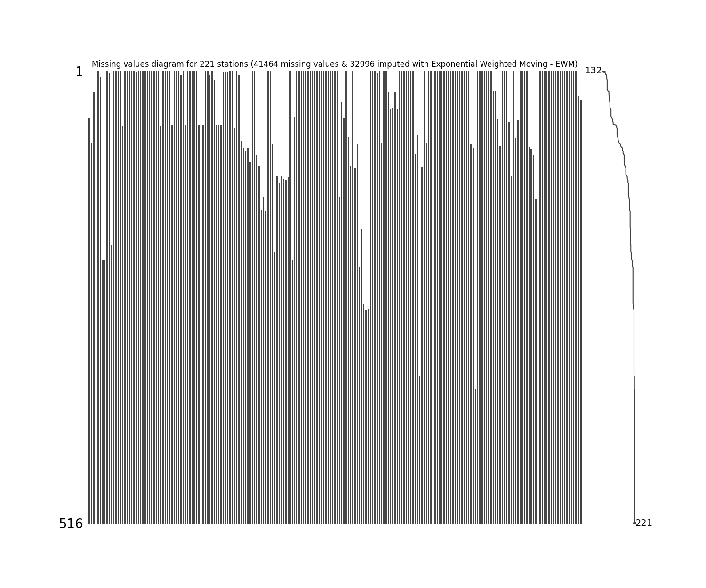

# Impute missing values in time series through statistical methods

* Processed file: [C:/JLGC/R.LTWB/.datasets/IDEAM_Outlier/Outlier_IQR_Cap_Pivot_PTPM_TT_M.csv](../IDEAM_Outlier/Outlier_IQR_Cap_Pivot_PTPM_TT_M.csv)
* Execution date: 2023-09-23 10:42:42.042962
* Python version: 3.11.5 (tags/v3.11.5:cce6ba9, Aug 24 2023, 14:38:34) [MSC v.1936 64 bit (AMD64)]
* Python path: ['C:\\JLGC\\R.LTWB\\.src', 'C:\\Python311\\python311.zip', 'C:\\Python311\\DLLs', 'C:\\Python311\\Lib', 'C:\\Python311']
* matplotlib version: 3.6.0
* pandas version: 2.1.0
* numpy version: 1.25.2
* missingno version: 0.5.2
* sklearn version: 1.3.0
* Stations exclude: ['21185040', '21190110', '21190170', '21190360', '21190430', '21190440', '21190450', '21195080', '21200040', '21200170', '21200390', '21200440', '21200500', '21200580', '21200590', '21200610', '21200650', '21200660', '21200700', '21200710', '21200720', '21200800', '21200830', '21201090', '21201130', '21201150', '21201290', '21201380', '21201620', '21201670', '21201680', '21201690', '21201700', '21201720', '21201730', '21201740', '21201750', '21201760', '21201780', '21201790', '21201810', '21201820', '21201830', '21201840', '21201870', '21202100', '21205012', '21205090', '21205300', '21205340', '21205360', '21205370', '21205450', '21205470', '21205540', '21205550', '21205580', '21205670', '21205700', '21205750', '21205770', '21205910', '21205970', '21206070', '21206100', '21206160', '21206190', '21206200', '21206230', '21206280', '21206310', '21206350', '21206390', '21206410', '21206460', '21206500', '21206510', '21206550', '21206570', '21206610', '21206620', '21206630', '21206640', '21206660', '21206670', '21206680', '21206700', '21206970', '21230080', '21255080', '21255160', '23010140', '23060040', '23060070', '23060080', '23060130', '23060210', '23060220', '23060250', '23060300', '23060310', '23060320', '23065120', '23065140', '23065150', '23065200', '23125170', '24010330', '24010380', '24010490', '24015380', '35020080', '35020090', '35020370', '35025060', '35035030', '35035040', '35035050', '35060010', '35060280', '35065010', '35067050', '35070160']
* Stations include: ['35070110']
* Print table sample: True
* Instructions & script: https://github.com/rcfdtools/R.LTWB/tree/main/Section03/Impute
* License: https://github.com/rcfdtools/R.LTWB/blob/main/LICENSE.md
* Credits: r.cfdtools@gmail.com

## General dataframe information with 516 IDEAM records for 221 stations

Dataframe records head sample

| Fecha               |   21170020 |   21190030 |   21190060 |   21190210 |   21190300 |   21190310 |   21190460 |   21190470 |   21195030 |   21195120 |   21195140 |   21195190 |   21200080 |   21200110 |   21200130 |   21200160 |   21200190 |   21200200 |   21200230 |   21200240 |   21200260 |   21200270 |   21200310 |   21200320 |   21200340 |   21200380 |   21200400 |   21200430 |   21200510 |   21200520 |   21200550 |   21200600 |   21200620 |   21200690 |   21200740 |   21200750 |   21200770 |   21200780 |   21200850 |   21200880 |   21200960 |   21201030 |   21201040 |   21201050 |   21201060 |   21201070 |   21201100 |   21201110 |   21201140 |   21201180 |   21201190 |   21201200 |   21201210 |   21201240 |   21201250 |   21201260 |   21201270 |   21201300 |   21201310 |   21201320 |   21201330 |   21201340 |   21201360 |   21201370 |   21201410 |   21201550 |   21201560 |   21201590 |   21201600 |   21201610 |   21201630 |   21201640 |   21201650 |   21201660 |   21201710 |   21201770 |   21201800 |   21201850 |   21201880 |   21201920 |   21201960 |   21201970 |   21201980 |   21202000 |   21202020 |   21202040 |   21202050 |   21202070 |   21202080 |   21202110 |   21202120 |   21202130 |   21202160 |   21205160 |   21205230 |   21205240 |   21205390 |   21205400 |   21205410 |   21205420 |   21205480 |   21205520 |   21205570 |   21205590 |   21205610 |   21205650 |   21205660 |   21205690 |   21205710 |   21205720 |   21205740 |   21205791 |   21205940 |   21205980 |   21206050 |   21206080 |   21206180 |   21206260 |   21206290 |   21206300 |   21206400 |   21206560 |   21206590 |   21206600 |   21206650 |   21206690 |   21206980 |   21230060 |   21230070 |   21230090 |   21230110 |   21230120 |   21235010 |   21250430 |   21250540 |   21250570 |   21250580 |   21250590 |   21250610 |   23025020 |   23060050 |   23060060 |   23060140 |   23060180 |   23060190 |   23060200 |   23060260 |   23060290 |   23060370 |   23065060 |   23065070 |   23065100 |   23120190 |   23125070 |   23125150 |   24010020 |   24010070 |   24010140 |   24010270 |   24010280 |   24010300 |   24010350 |   24010390 |   24010520 |   24010530 |   24010540 |   24010550 |   24010560 |   24010570 |   24010580 |   24010590 |   24011080 |   24011090 |   24011150 |   24015110 |   24015150 |   24015190 |   24015210 |   35020010 |   35020050 |   35020240 |   35020280 |   35020290 |   35020300 |   35020350 |   35020380 |   35020390 |   35020420 |   35025050 |   35030010 |   35030020 |   35030080 |   35030110 |   35030120 |   35030140 |   35030160 |   35030170 |   35030180 |   35030210 |   35030230 |   35030250 |   35030260 |   35040010 |   35060020 |   35060050 |   35060090 |   35060100 |   35060120 |   35060130 |   35060150 |   35060160 |   35060170 |   35060180 |   35060200 |   35060210 |   35060230 |   35060240 |   35070110 |   35070230 |   35070480 |   35070490 |
|:--------------------|-----------:|-----------:|-----------:|-----------:|-----------:|-----------:|-----------:|-----------:|-----------:|-----------:|-----------:|-----------:|-----------:|-----------:|-----------:|-----------:|-----------:|-----------:|-----------:|-----------:|-----------:|-----------:|-----------:|-----------:|-----------:|-----------:|-----------:|-----------:|-----------:|-----------:|-----------:|-----------:|-----------:|-----------:|-----------:|-----------:|-----------:|-----------:|-----------:|-----------:|-----------:|-----------:|-----------:|-----------:|-----------:|-----------:|-----------:|-----------:|-----------:|-----------:|-----------:|-----------:|-----------:|-----------:|-----------:|-----------:|-----------:|-----------:|-----------:|-----------:|-----------:|-----------:|-----------:|-----------:|-----------:|-----------:|-----------:|-----------:|-----------:|-----------:|-----------:|-----------:|-----------:|-----------:|-----------:|-----------:|-----------:|-----------:|-----------:|-----------:|-----------:|-----------:|-----------:|-----------:|-----------:|-----------:|-----------:|-----------:|-----------:|-----------:|-----------:|-----------:|-----------:|-----------:|-----------:|-----------:|-----------:|-----------:|-----------:|-----------:|-----------:|-----------:|-----------:|-----------:|-----------:|-----------:|-----------:|-----------:|-----------:|-----------:|-----------:|-----------:|-----------:|-----------:|-----------:|-----------:|-----------:|-----------:|-----------:|-----------:|-----------:|-----------:|-----------:|-----------:|-----------:|-----------:|-----------:|-----------:|-----------:|-----------:|-----------:|-----------:|-----------:|-----------:|-----------:|-----------:|-----------:|-----------:|-----------:|-----------:|-----------:|-----------:|-----------:|-----------:|-----------:|-----------:|-----------:|-----------:|-----------:|-----------:|-----------:|-----------:|-----------:|-----------:|-----------:|-----------:|-----------:|-----------:|-----------:|-----------:|-----------:|-----------:|-----------:|-----------:|-----------:|-----------:|-----------:|-----------:|-----------:|-----------:|-----------:|-----------:|-----------:|-----------:|-----------:|-----------:|-----------:|-----------:|-----------:|-----------:|-----------:|-----------:|-----------:|-----------:|-----------:|-----------:|-----------:|-----------:|-----------:|-----------:|-----------:|-----------:|-----------:|-----------:|-----------:|-----------:|-----------:|-----------:|-----------:|-----------:|-----------:|-----------:|-----------:|-----------:|-----------:|-----------:|-----------:|-----------:|-----------:|-----------:|-----------:|-----------:|-----------:|-----------:|-----------:|-----------:|-----------:|-----------:|-----------:|-----------:|-----------:|
| 1980-01-01 00:00:00 |        nan |        nan |        nan |         43 |         39 |        nan |        nan |        nan |       81.9 |        nan |        nan |       41.4 |       28.4 |       17.2 |       50.4 |        nan |       27.9 |       11.9 |       39   |       22.2 |         14 |        nan |        9.4 |       38.2 |       14.9 |          0 |       23.7 |        3.2 |        7.8 |        6.4 |       43.5 |         53 |        nan |       58.5 |          0 |       20   |       59   |        nan |       53.1 |        8.7 |       26.5 |        nan |       30.5 |        nan |       33.4 |         43 |         54 |         64 |          4 |        nan |        nan |        nan |         14 |          1 |        nan |       72.9 |        nan |        nan |        nan |        nan |      nan   |      nan   |      nan   |        202 |         45 |        nan |          0 |        nan |        nan |        nan |        nan |        nan |        nan |         14 |       12.6 |        nan |        nan |        nan |        nan |        nan |       27.5 |        9.9 |        nan |        nan |        nan |        nan |        nan |        nan |        nan |        nan |          0 |        nan |        nan |        6.8 |       27.6 |       36.4 |       12.6 |       43.5 |       14.8 |        9.7 |        0   |       21.5 |       13.1 |        3.8 |        8.4 |       28   |       49.8 |       23.7 |       17.5 |        3.5 |       31.8 |       28.2 |        nan |        nan |        nan |       29.3 |        nan |        nan |         96 |        nan |        nan |        nan |        nan |        nan |        nan |        nan |         43 |         40 |         59 |        nan |         43 |        nan |      137.1 |         32 |        nan |        nan |        nan |        nan |        nan |       57.8 |      334   |        321 |         38 |         57 |          1 |        150 |        nan |        nan |        nan |        nan |       98   |        nan |         46 |       68.2 |        nan |       31.8 |         24 |          0 |       10.4 |       57.8 |       10   |       28.2 |        6.6 |         38 |         12 |         18 |         10 |         22 |         20 |         18 |         30 |        nan |        nan |        nan |       47.2 |        4.6 |       24.6 |       18.9 |         50 |       20.7 |       14.6 |        nan |        nan |        nan |        nan |       46.6 |       46.5 |         33 |        nan |        nan |        125 |        nan |        nan |       55.5 |       49.5 |       29.2 |         29 |        nan |        nan |        nan |        nan |       23.7 |      114.3 |         48 |         57 |         67 |       10.7 |        133 |         96 |         27 |         58 |         46 |         80 |         59 |         17 |        124 |         20 |       13   |       50.9 |        nan |        nan |
| 1980-02-01 00:00:00 |        nan |        nan |        nan |        164 |        173 |        nan |        nan |        nan |      208.4 |        nan |        nan |       54.7 |      149.5 |       70   |       91.8 |        nan |       82.4 |       41   |      147.2 |       77   |         46 |         39 |       70.5 |      112.8 |       49.5 |          0 |      149   |       24.6 |       27   |       98.6 |       95   |        136 |        nan |       49.5 |         29 |       40.5 |      197.5 |        nan |       54.2 |       42.2 |       67.3 |        nan |       98.5 |        nan |       80.7 |        105 |         98 |        413 |         37 |        nan |        nan |        nan |         57 |         37 |        nan |      116.7 |        nan |        nan |        nan |        nan |      nan   |      nan   |      nan   |        171 |         72 |        nan |          0 |        nan |        nan |        nan |        nan |        nan |        nan |         33 |       30.8 |        nan |        nan |        nan |        nan |        nan |       95.3 |       38.5 |        nan |        nan |        nan |        nan |        nan |        nan |        nan |        nan |          0 |        nan |        nan |       31.8 |      115.7 |      101.8 |       30.8 |       73.4 |       64.2 |       29.7 |        0   |       54.1 |       41   |       84.6 |       19.8 |       63   |       97.4 |       75.4 |       69.1 |       44   |       23.3 |       63.4 |        nan |        nan |        nan |      135.8 |        nan |        nan |        142 |        nan |        nan |        nan |        nan |        nan |        nan |        nan |         61 |         50 |         85 |        nan |         36 |        nan |       59.3 |         25 |        nan |        nan |        nan |        nan |        nan |       46.9 |      452.5 |        329 |         63 |        246 |         16 |        263 |        nan |        nan |        nan |        nan |      189   |        nan |        124 |      252.4 |        nan |       58.6 |        101 |         90 |       74.8 |       92.1 |       83.5 |       60.6 |       31.3 |         29 |         47 |         51 |         74 |         68 |         96 |         48 |         73 |        nan |        nan |        nan |       98.2 |       72.5 |       58.1 |       96.5 |          0 |        8.1 |       19   |        nan |        nan |        nan |        nan |       52.6 |       37.1 |         22 |        nan |        nan |         34 |        nan |        nan |       45.4 |       31   |       23.4 |        nan |        nan |        nan |        nan |        nan |      149   |       23   |         24 |         24 |         11 |       10.2 |         22 |         47 |         55 |         45 |        310 |         16 |         44 |         40 |         10 |         15 |        8.1 |        5   |        nan |        nan |
| 1980-03-01 00:00:00 |        nan |        nan |        nan |         51 |        172 |        nan |        nan |        nan |       39.3 |        nan |        nan |       41.9 |       33.2 |       23.1 |       38.9 |        nan |       60.1 |       30.2 |       13.7 |       56.5 |         33 |         42 |       39.2 |       28.3 |       33.8 |          0 |       28.8 |       12.5 |        5.3 |        5.4 |       34   |         16 |        nan |        5   |         14 |       18   |       69   |        nan |       54   |       30.8 |       39.4 |        nan |       30   |        nan |       64.1 |         38 |         34 |         98 |         12 |        nan |        nan |        nan |          6 |          8 |        nan |       19.7 |        nan |        nan |        nan |        nan |       24.2 |       28.2 |        7.5 |         35 |         19 |        nan |          0 |        nan |        nan |        nan |        nan |        nan |        nan |         14 |       20.6 |        nan |        nan |        nan |        nan |        nan |       26.2 |        7.2 |        nan |        nan |        nan |        nan |        nan |        nan |        nan |        nan |          0 |        nan |        nan |       23.4 |       11   |       63.3 |       20.6 |       19.5 |       49.7 |       14.3 |       16.4 |       23.9 |       10.9 |        4.6 |        7.6 |       29.8 |       62   |        8.9 |       10.3 |       10.5 |       31.2 |       28.9 |        nan |        nan |        nan |        6.3 |        nan |        nan |         58 |        nan |        nan |        nan |        nan |        nan |        nan |        nan |         18 |         83 |         51 |        nan |         73 |        nan |      nan   |         60 |        nan |        nan |        nan |        nan |        nan |       27.3 |      240.5 |        161 |         33 |         90 |         34 |         69 |        nan |        nan |        nan |        nan |       76.9 |        nan |         19 |       82.3 |        nan |       28   |         19 |         31 |       47.5 |       14.7 |       25.5 |       33.1 |       20.5 |         24 |         29 |         46 |         81 |         30 |         75 |         33 |         41 |        nan |        nan |        nan |       42.9 |       17.5 |       18.4 |       34.3 |        128 |       28.1 |       21.2 |        nan |        nan |        nan |        nan |       45.6 |       40.2 |         11 |        nan |        nan |        214 |        nan |        nan |      158.7 |      141.8 |       71   |        nan |        nan |        nan |        nan |        nan |       28.8 |      275   |         48 |         91 |        188 |      163.6 |        194 |        261 |        129 |         89 |         78 |        128 |        119 |        176 |        230 |         85 |       51.7 |       53   |        nan |        nan |

Dataframe records tail sample

| Fecha               |   21170020 |   21190030 |   21190060 |   21190210 |   21190300 |   21190310 |   21190460 |   21190470 |   21195030 |   21195120 |   21195140 |   21195190 |   21200080 |   21200110 |   21200130 |   21200160 |   21200190 |   21200200 |   21200230 |   21200240 |   21200260 |   21200270 |   21200310 |   21200320 |   21200340 |   21200380 |   21200400 |   21200430 |   21200510 |   21200520 |   21200550 |   21200600 |   21200620 |   21200690 |   21200740 |   21200750 |   21200770 |   21200780 |   21200850 |   21200880 |   21200960 |   21201030 |   21201040 |   21201050 |   21201060 |   21201070 |   21201100 |   21201110 |   21201140 |   21201180 |   21201190 |   21201200 |   21201210 |   21201240 |   21201250 |   21201260 |   21201270 |   21201300 |   21201310 |   21201320 |   21201330 |   21201340 |   21201360 |   21201370 |   21201410 |   21201550 |   21201560 |   21201590 |   21201600 |   21201610 |   21201630 |   21201640 |   21201650 |   21201660 |   21201710 |   21201770 |   21201800 |   21201850 |   21201880 |   21201920 |   21201960 |   21201970 |   21201980 |   21202000 |   21202020 |   21202040 |   21202050 |   21202070 |   21202080 |   21202110 |   21202120 |   21202130 |   21202160 |   21205160 |   21205230 |   21205240 |   21205390 |   21205400 |   21205410 |   21205420 |   21205480 |   21205520 |   21205570 |   21205590 |   21205610 |   21205650 |   21205660 |   21205690 |   21205710 |   21205720 |   21205740 |   21205791 |   21205940 |   21205980 |   21206050 |   21206080 |   21206180 |   21206260 |   21206290 |   21206300 |   21206400 |   21206560 |   21206590 |   21206600 |   21206650 |   21206690 |   21206980 |   21230060 |   21230070 |   21230090 |   21230110 |   21230120 |   21235010 |   21250430 |   21250540 |   21250570 |   21250580 |   21250590 |   21250610 |   23025020 |   23060050 |   23060060 |   23060140 |   23060180 |   23060190 |   23060200 |   23060260 |   23060290 |   23060370 |   23065060 |   23065070 |   23065100 |   23120190 |   23125070 |   23125150 |   24010020 |   24010070 |   24010140 |   24010270 |   24010280 |   24010300 |   24010350 |   24010390 |   24010520 |   24010530 |   24010540 |   24010550 |   24010560 |   24010570 |   24010580 |   24010590 |   24011080 |   24011090 |   24011150 |   24015110 |   24015150 |   24015190 |   24015210 |   35020010 |   35020050 |   35020240 |   35020280 |   35020290 |   35020300 |   35020350 |   35020380 |   35020390 |   35020420 |   35025050 |   35030010 |   35030020 |   35030080 |   35030110 |   35030120 |   35030140 |   35030160 |   35030170 |   35030180 |   35030210 |   35030230 |   35030250 |   35030260 |   35040010 |   35060020 |   35060050 |   35060090 |   35060100 |   35060120 |   35060130 |   35060150 |   35060160 |   35060170 |   35060180 |   35060200 |   35060210 |   35060230 |   35060240 |   35070110 |   35070230 |   35070480 |   35070490 |
|:--------------------|-----------:|-----------:|-----------:|-----------:|-----------:|-----------:|-----------:|-----------:|-----------:|-----------:|-----------:|-----------:|-----------:|-----------:|-----------:|-----------:|-----------:|-----------:|-----------:|-----------:|-----------:|-----------:|-----------:|-----------:|-----------:|-----------:|-----------:|-----------:|-----------:|-----------:|-----------:|-----------:|-----------:|-----------:|-----------:|-----------:|-----------:|-----------:|-----------:|-----------:|-----------:|-----------:|-----------:|-----------:|-----------:|-----------:|-----------:|-----------:|-----------:|-----------:|-----------:|-----------:|-----------:|-----------:|-----------:|-----------:|-----------:|-----------:|-----------:|-----------:|-----------:|-----------:|-----------:|-----------:|-----------:|-----------:|-----------:|-----------:|-----------:|-----------:|-----------:|-----------:|-----------:|-----------:|-----------:|-----------:|-----------:|-----------:|-----------:|-----------:|-----------:|-----------:|-----------:|-----------:|-----------:|-----------:|-----------:|-----------:|-----------:|-----------:|-----------:|-----------:|-----------:|-----------:|-----------:|-----------:|-----------:|-----------:|-----------:|-----------:|-----------:|-----------:|-----------:|-----------:|-----------:|-----------:|-----------:|-----------:|-----------:|-----------:|-----------:|-----------:|-----------:|-----------:|-----------:|-----------:|-----------:|-----------:|-----------:|-----------:|-----------:|-----------:|-----------:|-----------:|-----------:|-----------:|-----------:|-----------:|-----------:|-----------:|-----------:|-----------:|-----------:|-----------:|-----------:|-----------:|-----------:|-----------:|-----------:|-----------:|-----------:|-----------:|-----------:|-----------:|-----------:|-----------:|-----------:|-----------:|-----------:|-----------:|-----------:|-----------:|-----------:|-----------:|-----------:|-----------:|-----------:|-----------:|-----------:|-----------:|-----------:|-----------:|-----------:|-----------:|-----------:|-----------:|-----------:|-----------:|-----------:|-----------:|-----------:|-----------:|-----------:|-----------:|-----------:|-----------:|-----------:|-----------:|-----------:|-----------:|-----------:|-----------:|-----------:|-----------:|-----------:|-----------:|-----------:|-----------:|-----------:|-----------:|-----------:|-----------:|-----------:|-----------:|-----------:|-----------:|-----------:|-----------:|-----------:|-----------:|-----------:|-----------:|-----------:|-----------:|-----------:|-----------:|-----------:|-----------:|-----------:|-----------:|-----------:|-----------:|-----------:|-----------:|-----------:|-----------:|-----------:|-----------:|-----------:|-----------:|-----------:|
| 2022-10-01 00:00:00 |        115 |      117.1 |        nan |        203 |        nan |      274.9 |      251.9 |        nan |        nan |      202.4 |        nan |      176.5 |        nan |        nan |        nan |      162.8 |        nan |        nan |        nan |        nan |        nan |        nan |        nan |        nan |        nan |        nan |        nan |        nan |        nan |        nan |        nan |        nan |      126.8 |        nan |        nan |        nan |        nan |       73.1 |        nan |        nan |        nan |        nan |        nan |      151.1 |      315   |      159.6 |      109   |        nan |        nan |      188.8 |      147.4 |      nan   |        nan |      112.1 |        nan |        nan |        nan |      134.8 |      144.3 |       52.3 |        nan |        nan |        nan |        nan |        nan |      257.3 |        nan |        nan |        nan |      128.5 |      122.6 |      115.4 |       65.9 |        nan |        nan |        nan |        nan |        nan |        nan |      197.4 |        nan |        nan |        nan |        nan |        nan |        nan |        nan |        nan |        nan |        nan |        nan |        nan |      356.8 |        nan |        nan |        nan |        nan |        nan |        nan |       86.9 |        nan |        nan |        nan |        nan |        nan |        nan |      268.8 |        nan |      223   |      121.8 |       98.5 |      155.9 |      150.6 |      214.5 |        nan |        nan |        nan |       92.4 |        nan |        nan |        nan |      nan   |        nan |      159   |      148.7 |      nan   |      130.5 |      128.2 |      211.4 |      244.8 |       99.9 |      310.4 |      159.2 |        nan |        nan |        nan |        nan |        nan |        nan |        nan |        nan |        nan |      190.9 |      235.7 |      234.8 |      252.9 |      220.6 |      355.1 |      400.8 |        nan |        nan |        nan |        nan |        nan |      444.5 |        nan |      139.6 |        nan |        nan |        nan |        nan |        nan |        nan |        nan |        nan |        nan |        nan |        nan |        nan |        nan |        nan |       80.9 |        nan |      135.2 |        nan |        nan |        nan |        nan |        192 |        nan |        nan |      105.6 |      144.4 |      103.1 |        nan |        nan |        nan |        nan |        nan |        121 |        413 |       76.6 |        nan |        nan |        nan |        nan |        nan |        nan |        nan |        nan |        nan |        nan |        357 |      210.4 |       91.9 |        nan |      119.8 |      189   |      112.5 |      282.1 |      188.8 |       58.1 |      145.2 |      167.6 |       99.1 |      210.3 |      135.4 |      105.2 |       89.3 |      167.9 |      384.9 |
| 2022-11-01 00:00:00 |        138 |      181.8 |        nan |        173 |        nan |      376.7 |      227.5 |        nan |        nan |      157.2 |        nan |      118.5 |        nan |        nan |        nan |      244.6 |        nan |        nan |        nan |        nan |        nan |        nan |        nan |        nan |        nan |        nan |        nan |        nan |        nan |        nan |        nan |        nan |      142   |        nan |        nan |        nan |        nan |      150.9 |        nan |        nan |        nan |        nan |        nan |      164.3 |      147.7 |      236.6 |      111.8 |        nan |        nan |      155.4 |       78.2 |      nan   |        nan |      127.4 |        nan |        nan |        nan |      118.2 |       86.5 |       41.2 |        nan |        nan |        nan |        nan |        nan |      131.6 |        nan |        nan |        nan |      197.9 |      185.6 |      183.5 |      184.6 |        nan |        nan |        nan |        nan |        nan |        nan |      109.4 |        nan |        nan |        nan |        nan |        nan |        nan |        nan |        nan |        nan |        nan |        nan |        nan |      215.9 |        nan |        nan |        nan |        nan |        nan |        nan |       59.8 |        nan |        nan |        nan |        nan |        nan |        nan |      183   |        nan |      159.1 |      116   |      136.9 |      130.9 |      135.5 |      132.8 |        nan |        nan |        nan |       93.4 |        nan |        nan |        nan |       99.8 |        nan |      179.1 |      125.5 |      213.4 |      181.9 |       68.2 |      153   |      315.6 |       38.9 |      327.9 |       51.8 |        nan |        nan |        nan |        nan |        nan |        nan |        nan |        nan |        nan |      295.2 |      337.7 |      199.9 |      362.3 |      297.9 |      432.8 |      429.3 |        nan |        nan |        nan |        nan |        nan |      370.3 |        nan |      142   |        nan |        nan |        nan |        nan |        nan |        nan |        nan |        nan |        nan |        nan |        nan |        nan |        nan |        nan |      100.5 |        nan |      159.5 |        nan |        nan |        nan |        nan |        143 |        nan |        nan |       56.3 |      151.8 |       86.9 |        nan |        nan |        nan |        nan |        nan |        140 |        230 |       74.5 |        nan |        nan |        nan |        nan |        nan |        nan |        nan |        nan |        nan |        nan |        472 |      340.4 |       91.9 |        nan |      104   |      121.5 |       92.5 |      320.8 |      179.9 |       86   |      169.4 |      161.4 |      182.4 |      120.5 |      129.6 |       90.2 |      nan   |       96   |      211.2 |
| 2022-12-01 00:00:00 |         47 |       74   |        nan |         37 |        nan |      170.4 |       59   |        nan |        nan |      112.8 |        nan |       37.3 |        nan |        nan |        nan |       15.6 |        nan |        nan |        nan |        nan |        nan |        nan |        nan |        nan |        nan |        nan |        nan |        nan |        nan |        nan |        nan |        nan |       15.8 |        nan |        nan |        nan |        nan |      nan   |        nan |        nan |        nan |        nan |        nan |       23.4 |       34.1 |       56.9 |       20.5 |        nan |        nan |       27.5 |       77.3 |       24.8 |        nan |       18.4 |        nan |        nan |        nan |        7.9 |       17.9 |       18.7 |        nan |        nan |        nan |        nan |        nan |       36.7 |        nan |        nan |        nan |       73.5 |       19.5 |       17.1 |       11.8 |        nan |        nan |        nan |        nan |        nan |        nan |       47.4 |        nan |        nan |        nan |        nan |        nan |        nan |        nan |        nan |        nan |        nan |        nan |        nan |      170.2 |        nan |        nan |        nan |        nan |        nan |        nan |       10.1 |        nan |        nan |        nan |        nan |        nan |        nan |       32.3 |        nan |       58.4 |       25   |       29.3 |       15.6 |       28   |       50.1 |        nan |        nan |        nan |      nan   |        nan |        nan |        nan |      nan   |        nan |       51.4 |       59   |      nan   |       59   |       40.2 |       87.3 |       45.1 |       20.1 |      211.7 |      117.6 |        nan |        nan |        nan |        nan |        nan |        nan |        nan |        nan |        nan |       94   |      271.8 |       58.5 |      117.6 |      159.1 |      252.6 |      217.3 |        nan |        nan |        nan |        nan |        nan |      380.6 |        nan |       34.3 |        nan |        nan |        nan |        nan |        nan |        nan |        nan |        nan |        nan |        nan |        nan |        nan |        nan |        nan |       19.5 |        nan |       49   |        nan |        nan |        nan |        nan |         69 |        nan |        nan |       35.2 |       49.7 |       27.2 |        nan |        nan |        nan |        nan |        nan |         33 |        146 |       33.5 |        nan |        nan |        nan |        nan |        nan |        nan |        nan |        nan |        nan |        nan |        223 |      140.3 |       18.8 |        nan |       34.1 |       36.8 |       22.3 |       65.5 |       26.1 |      nan   |       20.1 |       27.7 |        5   |       22   |       14.1 |        0.3 |        1   |        2.6 |       78.5 |

Datatypes for station and nulls values in the initial file
|       | 21170020   | 21190030   | 21190060   | 21190210   | 21190300   | 21190310   | 21190460   | 21190470   | 21195030   | 21195120   | 21195140   | 21195190   | 21200080   | 21200110   | 21200130   | 21200160   | 21200190   | 21200200   | 21200230   | 21200240   | 21200260   | 21200270   | 21200310   | 21200320   | 21200340   | 21200380   | 21200400   | 21200430   | 21200510   | 21200520   | 21200550   | 21200600   | 21200620   | 21200690   | 21200740   | 21200750   | 21200770   | 21200780   | 21200850   | 21200880   | 21200960   | 21201030   | 21201040   | 21201050   | 21201060   | 21201070   | 21201100   | 21201110   | 21201140   | 21201180   | 21201190   | 21201200   | 21201210   | 21201240   | 21201250   | 21201260   | 21201270   | 21201300   | 21201310   | 21201320   | 21201330   | 21201340   | 21201360   | 21201370   | 21201410   | 21201550   | 21201560   | 21201590   | 21201600   | 21201610   | 21201630   | 21201640   | 21201650   | 21201660   | 21201710   | 21201770   | 21201800   | 21201850   | 21201880   | 21201920   | 21201960   | 21201970   | 21201980   | 21202000   | 21202020   | 21202040   | 21202050   | 21202070   | 21202080   | 21202110   | 21202120   | 21202130   | 21202160   | 21205160   | 21205230   | 21205240   | 21205390   | 21205400   | 21205410   | 21205420   | 21205480   | 21205520   | 21205570   | 21205590   | 21205610   | 21205650   | 21205660   | 21205690   | 21205710   | 21205720   | 21205740   | 21205791   | 21205940   | 21205980   | 21206050   | 21206080   | 21206180   | 21206260   | 21206290   | 21206300   | 21206400   | 21206560   | 21206590   | 21206600   | 21206650   | 21206690   | 21206980   | 21230060   | 21230070   | 21230090   | 21230110   | 21230120   | 21235010   | 21250430   | 21250540   | 21250570   | 21250580   | 21250590   | 21250610   | 23025020   | 23060050   | 23060060   | 23060140   | 23060180   | 23060190   | 23060200   | 23060260   | 23060290   | 23060370   | 23065060   | 23065070   | 23065100   | 23120190   | 23125070   | 23125150   | 24010020   | 24010070   | 24010140   | 24010270   | 24010280   | 24010300   | 24010350   | 24010390   | 24010520   | 24010530   | 24010540   | 24010550   | 24010560   | 24010570   | 24010580   | 24010590   | 24011080   | 24011090   | 24011150   | 24015110   | 24015150   | 24015190   | 24015210   | 35020010   | 35020050   | 35020240   | 35020280   | 35020290   | 35020300   | 35020350   | 35020380   | 35020390   | 35020420   | 35025050   | 35030010   | 35030020   | 35030080   | 35030110   | 35030120   | 35030140   | 35030160   | 35030170   | 35030180   | 35030210   | 35030230   | 35030250   | 35030260   | 35040010   | 35060020   | 35060050   | 35060090   | 35060100   | 35060120   | 35060130   | 35060150   | 35060160   | 35060170   | 35060180   | 35060200   | 35060210   | 35060230   | 35060240   | 35070110   | 35070230   | 35070480   | 35070490   |
|:------|:-----------|:-----------|:-----------|:-----------|:-----------|:-----------|:-----------|:-----------|:-----------|:-----------|:-----------|:-----------|:-----------|:-----------|:-----------|:-----------|:-----------|:-----------|:-----------|:-----------|:-----------|:-----------|:-----------|:-----------|:-----------|:-----------|:-----------|:-----------|:-----------|:-----------|:-----------|:-----------|:-----------|:-----------|:-----------|:-----------|:-----------|:-----------|:-----------|:-----------|:-----------|:-----------|:-----------|:-----------|:-----------|:-----------|:-----------|:-----------|:-----------|:-----------|:-----------|:-----------|:-----------|:-----------|:-----------|:-----------|:-----------|:-----------|:-----------|:-----------|:-----------|:-----------|:-----------|:-----------|:-----------|:-----------|:-----------|:-----------|:-----------|:-----------|:-----------|:-----------|:-----------|:-----------|:-----------|:-----------|:-----------|:-----------|:-----------|:-----------|:-----------|:-----------|:-----------|:-----------|:-----------|:-----------|:-----------|:-----------|:-----------|:-----------|:-----------|:-----------|:-----------|:-----------|:-----------|:-----------|:-----------|:-----------|:-----------|:-----------|:-----------|:-----------|:-----------|:-----------|:-----------|:-----------|:-----------|:-----------|:-----------|:-----------|:-----------|:-----------|:-----------|:-----------|:-----------|:-----------|:-----------|:-----------|:-----------|:-----------|:-----------|:-----------|:-----------|:-----------|:-----------|:-----------|:-----------|:-----------|:-----------|:-----------|:-----------|:-----------|:-----------|:-----------|:-----------|:-----------|:-----------|:-----------|:-----------|:-----------|:-----------|:-----------|:-----------|:-----------|:-----------|:-----------|:-----------|:-----------|:-----------|:-----------|:-----------|:-----------|:-----------|:-----------|:-----------|:-----------|:-----------|:-----------|:-----------|:-----------|:-----------|:-----------|:-----------|:-----------|:-----------|:-----------|:-----------|:-----------|:-----------|:-----------|:-----------|:-----------|:-----------|:-----------|:-----------|:-----------|:-----------|:-----------|:-----------|:-----------|:-----------|:-----------|:-----------|:-----------|:-----------|:-----------|:-----------|:-----------|:-----------|:-----------|:-----------|:-----------|:-----------|:-----------|:-----------|:-----------|:-----------|:-----------|:-----------|:-----------|:-----------|:-----------|:-----------|:-----------|:-----------|:-----------|:-----------|:-----------|:-----------|:-----------|:-----------|:-----------|:-----------|:-----------|:-----------|:-----------|:-----------|:-----------|:-----------|:-----------|:-----------|
| Dtype | float64    | float64    | float64    | float64    | float64    | float64    | float64    | float64    | float64    | float64    | float64    | float64    | float64    | float64    | float64    | float64    | float64    | float64    | float64    | float64    | float64    | float64    | float64    | float64    | float64    | float64    | float64    | float64    | float64    | float64    | float64    | float64    | float64    | float64    | float64    | float64    | float64    | float64    | float64    | float64    | float64    | float64    | float64    | float64    | float64    | float64    | float64    | float64    | float64    | float64    | float64    | float64    | float64    | float64    | float64    | float64    | float64    | float64    | float64    | float64    | float64    | float64    | float64    | float64    | float64    | float64    | float64    | float64    | float64    | float64    | float64    | float64    | float64    | float64    | float64    | float64    | float64    | float64    | float64    | float64    | float64    | float64    | float64    | float64    | float64    | float64    | float64    | float64    | float64    | float64    | float64    | float64    | float64    | float64    | float64    | float64    | float64    | float64    | float64    | float64    | float64    | float64    | float64    | float64    | float64    | float64    | float64    | float64    | float64    | float64    | float64    | float64    | float64    | float64    | float64    | float64    | float64    | float64    | float64    | float64    | float64    | float64    | float64    | float64    | float64    | float64    | float64    | float64    | float64    | float64    | float64    | float64    | float64    | float64    | float64    | float64    | float64    | float64    | float64    | float64    | float64    | float64    | float64    | float64    | float64    | float64    | float64    | float64    | float64    | float64    | float64    | float64    | float64    | float64    | float64    | float64    | float64    | float64    | float64    | float64    | float64    | float64    | float64    | float64    | float64    | float64    | float64    | float64    | float64    | float64    | float64    | float64    | float64    | float64    | float64    | float64    | float64    | float64    | float64    | float64    | float64    | float64    | float64    | float64    | float64    | float64    | float64    | float64    | float64    | float64    | float64    | float64    | float64    | float64    | float64    | float64    | float64    | float64    | float64    | float64    | float64    | float64    | float64    | float64    | float64    | float64    | float64    | float64    | float64    | float64    | float64    | float64    | float64    | float64    | float64    | float64    | float64    | float64    | float64    | float64    | float64    |
| Nulls | 58         | 84         | 360        | 13         | 140        | 17         | 217        | 360        | 336        | 44         | 342        | 10         | 162        | 161        | 143        | 73         | 186        | 140        | 211        | 139        | 178        | 212        | 155        | 153        | 141        | 329        | 152        | 228        | 177        | 147        | 174        | 151        | 63         | 174        | 132        | 374        | 144        | 68         | 152        | 204        | 390        | 137        | 387        | 79         | 35         | 5          | 47         | 349        | 61         | 63         | 62         | 90         | 34         | 102        | 161        | 396        | 254        | 62         | 78         | 63         | 393        | 386        | 176        | 386        | 144        | 88         | 144        | 391        | 141        | 96         | 150        | 99         | 104        | 144        | 372        | 228        | 241        | 329        | 314        | 169        | 139        | 116        | 223        | 347        | 263        | 267        | 265        | 264        | 268        | 261        | 140        | 389        | 141        | 264        | 348        | 148        | 284        | 263        | 284        | 3          | 384        | 310        | 284        | 336        | 372        | 171        | 22         | 138        | 76         | 34         | 33         | 71         | 210        | 46         | 279        | 360        | 123        | 168        | 219        | 255        | 253        | 280        | 351        | 316        | 330        | 339        | 17         | 10         | 4          | 12         | 10         | 89         | 8          | 242        | 266        | 287        | 285        | 266        | 286        | 102        | 396        | 336        | 50         | 1          | 32         | 6          | 98         | 77         | 350        | 223        | 386        | 182        | 384        | 295        | 229        | 384        | 7          | 42         | 376        | 284        | 384        | 384        | 214        | 384        | 384        | 384        | 384        | 384        | 384        | 384        | 384        | 90         | 259        | 365        | 285        | 384        | 386        | 226        | 67         | 396        | 140        | 27         | 41         | 62         | 97         | 203        | 147        | 144        | 115        | 132        | 49         | 87         | 321        | 220        | 341        | 203        | 275        | 280        | 396        | 240        | 287        | 139        | 43         | 46         | 10         | 49         | 23         | 18         | 14         | 36         | 15         | 20         | 8          | 1          | 8          | 5          | 44         | 1          | 26         | 48         | 78         |

General statistics table - Initial file

|          |   count |     mean |      std |   min |     25% |    50% |     75% |      max |
|---------:|--------:|---------:|---------:|------:|--------:|-------:|--------:|---------:|
| 21170020 |     458 | 100.962  |  77.3544 |   0   |  40.525 |  81.95 | 148.225 |  446     |
| 21190030 |     432 |  96.6462 |  66.4881 |   0.4 |  44.125 |  87.2  | 128.75  |  390.356 |
| 21190060 |     156 | 131.326  |  90.1943 |   0   |  61.5   | 132.5  | 201     |  342     |
| 21190210 |     503 | 121.431  | 100.143  |   0   |  43.15  | 101.9  | 177     |  593.066 |
| 21190300 |     376 | 174.428  | 153.124  |   0   |  65     | 135.4  | 237.725 |  764     |
| 21190310 |     499 | 142.807  |  89.402  |   6.6 |  70.15  | 124    | 196.45  |  479     |
| 21190460 |     299 |  97.5727 |  57.1973 |   0   |  57.95  |  85.5  | 133.05  |  351.402 |
| 21190470 |     156 |  76.2609 |  48.1221 |   0   |  41.725 |  71.75 | 106.45  |  205.3   |
| 21195030 |     180 |  87.4622 |  58.519  |   5   |  37.1   |  80    | 124.3   |  283.9   |
| 21195120 |     472 | 115.896  |  70.8954 |   1.9 |  60.55  | 105.65 | 158.725 |  352.2   |
| 21195140 |     174 |  56.4833 |  61.441  |   0   |   0     |  38.95 |  89.15  |  277.2   |
| 21195190 |     506 |  74.6785 |  46.4629 |   0   |  38.75  |  64.25 | 104.725 |  262.6   |
| 21200080 |     354 | 106.725  |  60.8913 |   4.6 |  62.225 |  97.65 | 135.7   |  378.3   |
| 21200110 |     355 |  65.4727 |  40.51   |   1.7 |  36.8   |  57.7  |  84.75  |  261.7   |
| 21200130 |     373 | 105.287  |  59.6232 |   1   |  62.7   |  99.5  | 133.7   |  367.186 |
| 21200160 |     443 |  94.2102 |  63.1426 |   0   |  46.6   |  85.7  | 130.75  |  369.5   |
| 21200190 |     330 | 118.996  |  72.3121 |   0   |  66.9   | 111.75 | 157.95  |  345.2   |
| 21200200 |     376 |  68.6545 |  41.1936 |   0.1 |  39.525 |  62.8  |  89.875 |  230.1   |
| 21200230 |     305 |  89.9007 |  66.4203 |   1.4 |  38.8   |  73.5  | 120.3   |  345.2   |
| 21200240 |     377 | 110.255  |  59.6102 |   0   |  69.7   | 104.2  | 145.4   |  372.6   |
| 21200260 |     338 |  84.1307 |  54.5461 |   0   |  46.475 |  73.1  | 114.15  |  327.571 |
| 21200270 |     304 |  64.0273 |  46.3141 |   0   |  28.575 |  54.1  |  91.85  |  253     |
| 21200310 |     361 |  77.3424 |  53.1054 |   0.9 |  34.8   |  66.2  | 106.6   |  277.6   |
| 21200320 |     363 |  96.6823 |  55.2061 |   8.3 |  57     |  85.6  | 128.2   |  338.66  |
| 21200340 |     375 |  83.384  |  48.569  |   0.9 |  45.15  |  80.7  | 113.25  |  235.1   |
| 21200380 |     187 |  18.0417 |  40.2679 |   0   |   0     |   0    |   0     |  171.2   |
| 21200400 |     364 |  91.825  |  60.0725 |   5.4 |  47.65  |  80.7  | 118.975 |  341.6   |
| 21200430 |     288 |  54.7118 |  37.0766 |   0   |  26.075 |  51.3  |  77     |  204.1   |
| 21200510 |     339 |  51.7212 |  37.8057 |   0   |  23.8   |  47.3  |  73.1   |  197     |
| 21200520 |     369 |  57.2322 |  40.4631 |   0   |  27.9   |  48.6  |  79.2   |  227.3   |
| 21200550 |     342 |  72.9415 |  54.6957 |   0   |  33.35  |  63.2  | 104     |  297     |
| 21200600 |     365 |  83.3326 |  59.8794 |   0   |  39     |  69.6  | 118.4   |  359     |
| 21200620 |     453 | 110.179  |  90.8129 |   0   |  42.6   |  89.8  | 150.5   |  454.6   |
| 21200690 |     342 |  77.6749 |  72.2486 |   0   |  25     |  59.35 | 110.75  |  420.5   |
| 21200740 |     384 |  57.6419 |  55.7992 |   0   |  13.575 |  46.4  |  82.35  |  287     |
| 21200750 |     142 |  47.65   |  36.7269 |   0   |  20.025 |  36.75 |  64     |  194     |
| 21200770 |     372 |  75.1666 |  61.671  |   0   |  34.15  |  60.95 | 105.475 |  345.27  |
| 21200780 |     448 | 100.515  |  68.9621 |   0.5 |  50.35  |  85.25 | 136.1   |  395.9   |
| 21200850 |     364 |  81.3543 |  66.7387 |   0   |  31.475 |  71.25 | 115.75  |  378.683 |
| 21200880 |     312 |  69.6512 |  43.3013 |   1.6 |  39.35  |  60.2  |  90.5   |  260.082 |
| 21200960 |     126 |  56.9111 |  40.4893 |   0   |  28.325 |  51.5  |  75     |  226     |
| 21201030 |     379 |  72.3645 |  54.3973 |   0   |  32.3   |  67.3  | 100.75  |  311.35  |
| 21201040 |     129 |  66.2357 |  53.5152 |   0   |  28.5   |  52    |  90     |  241.5   |
| 21201050 |     437 |  80.6622 |  48.9035 |   0   |  47     |  71.8  | 105.3   |  280.9   |
| 21201060 |     481 | 101.887  |  58.8644 |   0   |  59     |  91.2  | 130.8   |  339.2   |
| 21201070 |     511 |  72.9718 |  48.8515 |   0   |  33.4   |  64.3  |  99.25  |  244.7   |
| 21201100 |     469 |  95.0817 |  78.9962 |   0   |  32.7   |  80.5  | 134.8   |  444.408 |
| 21201110 |     167 | 100.327  |  77.2767 |   0   |  44.3   |  80    | 127.75  |  413     |
| 21201140 |     455 |  56.0864 |  45.4033 |   0   |  22.3   |  44.6  |  78.6   |  256.049 |
| 21201180 |     453 |  72.5448 |  49.2636 |   0   |  38.1   |  60.5  |  94.5   |  293.6   |
| 21201190 |     454 |  71.0804 |  46.4813 |   0   |  38.675 |  60.45 |  90.2   |  267.3   |
| 21201200 |     426 |  68.807  |  51.2968 |   0   |  31.675 |  55.8  |  93.7   |  287.6   |
| 21201210 |     482 |  63.1216 |  41.8644 |   0   |  30.8   |  56.75 |  84.875 |  212.5   |
| 21201240 |     414 |  58.5    |  38.188  |   0   |  30.225 |  51.85 |  82.025 |  234.9   |
| 21201250 |     355 |  62.6623 |  38.2032 |   0   |  36.6   |  56.6  |  80.75  |  218.4   |
| 21201260 |     120 | 141.252  |  96.3157 |   4.5 |  62.7   | 132.75 | 193.25  |  489.9   |
| 21201270 |     262 |  69.8164 |  47.1582 |   0   |  33.65  |  60.7  |  97.225 |  262.6   |
| 21201300 |     454 | 100.285  |  60.8702 |   0   |  53     |  91.45 | 145.025 |  277.1   |
| 21201310 |     438 |  60.1398 |  45.2222 |   0.1 |  26.8   |  48.3  |  84.975 |  264.937 |
| 21201320 |     453 |  61.4471 |  47.0615 |   0.6 |  28.9   |  49.5  |  80.2   |  274.1   |
| 21201330 |     123 |  77.7041 |  52.2158 |   0.1 |  36.95  |  70.7  | 107.2   |  242.8   |
| 21201340 |     130 |  53.4099 |  40.8027 |   0   |  24.8   |  43.3  |  70.775 |  236.985 |
| 21201360 |     340 |  60.1014 |  48.6325 |   0   |  24.95  |  48.25 |  86.425 |  284     |
| 21201370 |     130 | 128.578  |  96.0866 |   0   |  45.25  | 125    | 186.75  |  522     |
| 21201410 |     372 |  67.9627 |  46.3207 |   0   |  34.95  |  58.95 |  91.925 |  270.72  |
| 21201550 |     428 |  73.0119 |  49.1333 |   0   |  37.075 |  60.8  | 101.125 |  257.3   |
| 21201560 |     372 |  42.0669 |  37.7531 |   0   |  12.325 |  35.7  |  59.725 |  178.8   |
| 21201590 |     125 |  56.372  |  40.0947 |   1   |  26.1   |  44.8  |  77.8   |  182.2   |
| 21201600 |     375 |  91.2717 |  63.6228 |   3.1 |  44.75  |  70.7  | 127.5   |  370.5   |
| 21201610 |     420 |  65.3083 |  36.7882 |   0   |  38.15  |  59.35 |  88.3   |  197.9   |
| 21201630 |     366 |  76.5049 |  49.4603 |   0.5 |  39.85  |  68.6  | 105.95  |  263.7   |
| 21201640 |     417 |  63.9796 |  41.1462 |   0   |  36.8   |  56    |  81.6   |  260.9   |
| 21201650 |     412 |  65.3892 |  42.8069 |   0   |  33.8   |  60.65 |  86.7   |  260.5   |
| 21201660 |     372 |  41.1183 |  39.6495 |   0   |   9.15  |  33.65 |  58.425 |  235     |
| 21201710 |     144 |  81.2979 |  53.2924 |   0   |  34.625 |  73.95 | 110.675 |  245.4   |
| 21201770 |     288 |  18.2814 |  49.1282 |   0   |   0     |   0    |   0     |  241.726 |
| 21201800 |     275 |  79.4905 |  66.4534 |   0   |  27.05  |  68.5  | 116     |  288     |
| 21201850 |     187 |  67.6968 |  77.3791 |   0   |   0     |  45.3  | 111.05  |  355.1   |
| 21201880 |     202 |  37.4837 |  41.6853 |   0   |   0     |  28.8  |  59.4   |  175.4   |
| 21201920 |     347 |  79.9165 |  62.0266 |   0   |  35.2   |  61.4  | 107.15  |  372.9   |
| 21201960 |     377 |  74.3469 |  61.9521 |   0   |  27.6   |  61.4  | 105.1   |  313.7   |
| 21201970 |     400 |  49.6568 |  37.5886 |   0   |  21.45  |  42.6  |  70.9   |  214.2   |
| 21201980 |     293 |  89.3904 |  62.7821 |   0   |  44.7   |  80.6  | 123.3   |  312.6   |
| 21202000 |     169 |  81.3556 |  58.9757 |   0   |  36.9   |  73.6  | 119     |  292.1   |
| 21202020 |     253 |  84.083  |  51.6466 |   0.6 |  47.7   |  72.1  | 105.2   |  257.6   |
| 21202040 |     249 |  94.1104 |  58.1097 |   0   |  51.1   |  90    | 125.3   |  285     |
| 21202050 |     251 |  58.8837 |  38.0447 |   0   |  32.15  |  51    |  80.55  |  226.7   |
| 21202070 |     252 |  62.0484 |  43.1593 |   0   |  30.125 |  51.8  |  86.025 |  212     |
| 21202080 |     248 |  71.7798 |  46.5514 |   0   |  34.075 |  64.1  |  97.125 |  218     |
| 21202110 |     255 |  46.1133 |  31.288  |   0.4 |  21.6   |  40.2  |  66.4   |  150.3   |
| 21202120 |     376 |  59.0675 |  45.4464 |   0   |  24.2   |  51.1  |  80.75  |  259.968 |
| 21202130 |     127 |  84.2874 |  57.7859 |   0   |  37.85  |  79.3  | 108.65  |  278.8   |
| 21202160 |     375 | 144.402  |  92.5128 |   7.1 |  69.25  | 121.5  | 198.8   |  472.9   |
| 21205160 |     252 |  58.6881 |  39.8319 |   1.9 |  28.675 |  47.9  |  80.15  |  216.9   |
| 21205230 |     168 |  81.3935 |  56.09   |   5.7 |  38.75  |  69.15 | 114.1   |  307.8   |
| 21205240 |     368 |  93.3111 |  54.998  |   6.9 |  53.75  |  82.75 | 121.575 |  290.1   |
| 21205390 |     232 |  80.9483 |  52.3226 |   0   |  40.225 |  72    | 109.975 |  262.7   |
| 21205400 |     253 |  54.3955 |  40.4651 |   0   |  26.9   |  46.6  |  68.5   |  236.033 |
| 21205410 |     232 |  78.7246 |  47.2532 |   4.5 |  47.175 |  67.7  | 102.7   |  265.5   |
| 21205420 |     513 |  59.2308 |  39.9813 |   0.4 |  29.2   |  50.8  |  82.8   |  198.4   |
| 21205480 |     132 |  66.9402 |  42.9478 |   0   |  36.25  |  64.95 |  93.425 |  214.9   |
| 21205520 |     206 |  67.4243 |  46.5925 |   3.4 |  31.35  |  56.4  |  93.275 |  221.3   |
| 21205570 |     232 |  64.2841 |  42.0038 |   0   |  33.3   |  56    |  85.75  |  212.1   |
| 21205590 |     180 |  61.4038 |  44.0036 |   0   |  29.675 |  52.4  |  80.4   |  253.385 |
| 21205610 |     144 |  43.1743 |  37.0783 |   0.6 |  15.825 |  34.25 |  58.925 |  190.2   |
| 21205650 |     345 |  60.9568 |  43.023  |   0   |  28.7   |  52    |  87.7   |  257.4   |
| 21205660 |     494 |  96.9403 |  67.5582 |   0.2 |  41.475 |  84.75 | 135.375 |  368.7   |
| 21205690 |     378 |  73.4487 |  54.2157 |   0   |  34     |  58.55 |  98.925 |  294.1   |
| 21205710 |     440 |  90.0882 |  61.0617 |   0   |  44.8   |  74.7  | 127.925 |  339.3   |
| 21205720 |     482 |  64.529  |  41.136  |   0   |  36.425 |  57.15 |  82.15  |  220.1   |
| 21205740 |     483 |  84.2342 |  55.0066 |   0   |  41.45  |  77    | 117.4   |  288.8   |
| 21205791 |     445 |  71.1748 |  48.9155 |   0   |  33.3   |  60    |  97.8   |  242.8   |
| 21205940 |     306 |  70.7487 |  46.2394 |   1.4 |  32.675 |  61.5  |  95.375 |  245.6   |
| 21205980 |     470 |  71.9251 |  46.457  |   0.2 |  37.525 |  61.75 |  98.175 |  240.2   |
| 21206050 |     237 |  72.6775 |  44.6501 |   1   |  37     |  64.4  |  96     |  271.379 |
| 21206080 |     156 | 127.452  |  87.6167 |   1.7 |  58.55  | 120.75 | 183.375 |  477.6   |
| 21206180 |     393 |  86.1789 |  60.5472 |   0   |  35.9   |  74.4  | 123.2   |  313.5   |
| 21206260 |     348 |  73.4365 |  47.1611 |   0   |  40.8   |  60.95 |  96.375 |  292.4   |
| 21206290 |     297 |  71.6704 |  45.1125 |   3.7 |  34.8   |  66    |  96     |  223     |
| 21206300 |     261 |  50.8931 |  37.9857 |   0   |  24     |  45    |  75.6   |  193.1   |
| 21206400 |     263 |  92.8913 |  65.21   |   0   |  42.35  |  82    | 129.3   |  359.8   |
| 21206560 |     236 |  59.5356 |  42.9531 |   0.6 |  28.675 |  48.15 |  83.225 |  214.3   |
| 21206590 |     165 |  77.9794 |  55.7915 |   0   |  37.5   |  71.2  | 111.8   |  263.6   |
| 21206600 |     200 |  77.6275 |  49.7807 |   0.9 |  40.725 |  65.35 | 106.85  |  246.9   |
| 21206650 |     186 |  94.1871 |  58.7168 |   0   |  46.925 |  87.45 | 132.05  |  264.7   |
| 21206690 |     177 |  77.4548 |  54.5502 |   0   |  36.4   |  64.2  | 108.3   |  274.4   |
| 21206980 |     499 |  95.7148 |  64.0987 |   0   |  45.75  |  83.1  | 141.2   |  360.1   |
| 21230060 |     506 | 105.738  |  80.7588 |   0   |  43.95  |  88.95 | 147.4   |  460.409 |
| 21230070 |     512 | 103.552  |  75.5422 |   0   |  43.275 |  88.1  | 149.525 |  440.256 |
| 21230090 |     504 | 135.559  |  99.868  |   0   |  51     | 115.75 | 204.35  |  458.7   |
| 21230110 |     506 | 106.96   |  85.5612 |   0   |  39.775 |  90.2  | 154.925 |  496     |
| 21230120 |     427 | 131.373  | 101.912  |   0   |  48.2   | 108.3  | 199.55  |  579.446 |
| 21235010 |     508 |  83.9863 |  60.4985 |   0   |  36.2   |  72.35 | 120.025 |  352.144 |
| 21250430 |     274 | 103.741  |  81.8285 |   0   |  40     |  86.5  | 153.75  |  387     |
| 21250540 |     250 | 103.768  |  80.718  |   0   |  39.25  |  88    | 142.75  |  396     |
| 21250570 |     229 | 110.108  |  82.5598 |   0   |  52.4   |  91.6  | 147.2   |  383.8   |
| 21250580 |     231 | 103.307  |  74.8819 |   0   |  47     |  92    | 144.5   |  412     |
| 21250590 |     250 |  99.9452 |  82.1844 |   0   |  33.075 |  84.5  | 147.75  |  378     |
| 21250610 |     230 |  94.6535 |  74.9608 |   0   |  37     |  76    | 141.125 |  429.808 |
| 23025020 |     414 | 126.776  |  98.7445 |   0   |  52.325 | 103.25 | 180.825 |  569.8   |
| 23060050 |     120 | 232.225  | 138.577  |   6   | 117.375 | 235    | 327.25  |  633     |
| 23060060 |     180 | 134.55   | 133.596  |   0   |   0     | 107    | 241     |  609.5   |
| 23060140 |     466 | 130.755  |  91.9787 |   0   |  53.15  | 115.8  | 186.75  |  491     |
| 23060180 |     515 | 202.992  | 117.09   |   0.1 | 109.8   | 200.1  | 282.2   |  666.4   |
| 23060190 |     484 | 111.285  |  79.2397 |   0   |  48     | 101.25 | 156.425 |  420.7   |
| 23060200 |     510 | 168.689  | 114.196  |   0   |  75     | 153.7  | 247.2   |  633.9   |
| 23060260 |     418 | 153.472  |  99.2258 |   0   |  75.85  | 149.05 | 213.475 |  598.8   |
| 23060290 |     439 | 201.846  | 132.184  |   0.4 |  94.05  | 188.7  | 280.55  |  673.9   |
| 23060370 |     166 | 203.77   | 146.734  |   0   |  94.825 | 181.9  | 279.65  |  699.9   |
| 23065060 |     293 | 111.072  |  67.6303 |   8.9 |  53.7   | 102.3  | 155.5   |  409.015 |
| 23065070 |     130 | 113.357  |  74.6008 |   0.2 |  54.025 | 110.65 | 164.925 |  331.7   |
| 23065100 |     334 | 124.766  |  83.5013 |   1.8 |  57     | 111.35 | 176.275 |  454.4   |
| 23120190 |     132 |  91.753  |  74.3233 |   0   |  36     |  79.75 | 124.25  |  310     |
| 23125070 |     221 | 128.995  |  87.2447 |   1.9 |  57.9   | 124    | 189.3   |  423.3   |
| 23125150 |     287 | 257.026  | 143.494  |  15.8 | 136.4   | 233.5  | 353.55  |  731     |
| 24010020 |     132 |  49.5265 |  44.0195 |   0   |  17.375 |  38.6  |  69.625 |  195.1   |
| 24010070 |     509 |  65.6786 |  49.5561 |   0   |  30     |  54.3  |  87.8   |  281.8   |
| 24010140 |     474 |  58.6535 |  44.9744 |   0   |  28.2   |  49.25 |  76.375 |  258.167 |
| 24010270 |     140 |  50.352  |  46.8233 |   0   |  19.025 |  38.95 |  66.8   |  260.378 |
| 24010280 |     232 |  60.3927 |  39.3799 |   0   |  31.425 |  53.15 |  83.25  |  175.2   |
| 24010300 |     132 |  69.2689 |  39.1383 |   5   |  41     |  66    |  89.625 |  224.5   |
| 24010350 |     132 |  61.3985 |  42.2669 |   0   |  31.675 |  58.2  |  80.3   |  199     |
| 24010390 |     302 |  78.2129 |  54.3343 |   0   |  42     |  67.15 | 107.7   |  320     |
| 24010520 |     132 |  71.7576 |  50.073  |   0   |  33     |  63.5  |  99.75  |  222     |
| 24010530 |     132 |  54.7212 |  49.495  |   0   |  20     |  44    |  77.5   |  233     |
| 24010540 |     132 |  86.0303 |  53.4771 |   0   |  51     |  75.5  | 116     |  206     |
| 24010550 |     132 |  83.3182 |  53.645  |   0   |  43     |  75.5  | 117     |  270     |
| 24010560 |     132 | 149.091  | 118.402  |   0   |  31.5   | 142    | 238.75  |  413     |
| 24010570 |     132 | 119.788  |  68.8503 |   0   |  67.85  | 119.5  | 165.25  |  342     |
| 24010580 |     132 |  80.2841 |  46.8892 |   0   |  50     |  69.5  | 101.25  |  219     |
| 24010590 |     132 |  78.8712 |  65.7923 |   0   |  35.75  |  68    | 101.5   |  309     |
| 24011080 |     426 |  55.6252 |  42.763  |   0   |  25.7   |  44.9  |  74.625 |  245.349 |
| 24011090 |     257 |  62.5626 |  46.2711 |   0   |  30.6   |  49.2  |  82.1   |  246.6   |
| 24011150 |     151 |  85.3417 |  57.6382 |   3.2 |  44.9   |  67.3  | 115.3   |  296.4   |
| 24015110 |     231 |  60.4372 |  43.5196 |   0   |  29     |  51    |  81     |  188.2   |
| 24015150 |     132 |  52.0162 |  33.7798 |   2.6 |  30.125 |  46.75 |  69.05  |  200.544 |
| 24015190 |     130 |  55.6423 |  43.4725 |   1   |  24.6   |  41.3  |  77.025 |  223     |
| 24015210 |     290 |  58.327  |  42.0435 |   0   |  26.775 |  50.85 |  82.575 |  243.534 |
| 35020010 |     449 | 212.094  | 140.433  |   0   |  99     | 192    | 304     |  650     |
| 35020050 |     120 |  78.9292 |  53.3285 |   0   |  33.8   |  68.4  | 112.925 |  254     |
| 35020240 |     376 |  86.4249 |  53.503  |   0   |  47.7   |  82.45 | 121.175 |  322.663 |
| 35020280 |     489 |  78.9628 |  47.9765 |   0   |  41.4   |  74.3  | 109.6   |  234.6   |
| 35020290 |     475 |  99.3992 |  70.1371 |   0   |  46.45  |  87    | 138.95  |  434     |
| 35020300 |     454 | 138.479  |  89.3641 |   0   |  72.725 | 126.85 | 190.35  |  493.1   |
| 35020350 |     419 |  97.5477 |  62.6021 |   0   |  50.6   |  91    | 130.2   |  388     |
| 35020380 |     313 | 105.952  |  78.114  |   0   |  45.6   |  90.1  | 154.3   |  460.4   |
| 35020390 |     369 | 119.377  |  72.2706 |   0   |  60.8   | 111.9  | 167.1   |  338.6   |
| 35020420 |     372 |  80.8411 |  50.879  |   0   |  43     |  74.25 | 111.225 |  305.5   |
| 35025050 |     401 | 111.584  |  69.2838 |   0   |  57.6   | 101.3  | 157     |  341.3   |
| 35030010 |     384 | 224.114  | 152.763  |   0   |  89.8   | 210    | 332.625 |  717.5   |
| 35030020 |     467 | 504.8    | 286.541  |   0   | 280.5   | 510    | 713     | 1301     |
| 35030080 |     429 |  76.1641 |  50.3804 |   0   |  33.2   |  74.5  | 110.5   |  245.9   |
| 35030110 |     195 | 146.272  | 119.151  |   0   |  48.05  | 120.1  | 221.75  |  522.2   |
| 35030120 |     296 | 155.975  | 110.294  |   0   |  70     | 136.3  | 224.15  |  565.9   |
| 35030140 |     175 | 161.365  | 107.73   |   1.4 |  79.4   | 141    | 226.15  |  553.4   |
| 35030160 |     313 | 125.191  |  86.1626 |   0.8 |  50.8   | 112.4  | 178.2   |  448.1   |
| 35030170 |     241 |  84.0237 |  69.4139 |   0   |  29.1   |  63.6  | 128.8   |  317.8   |
| 35030180 |     236 | 127.964  | 101.726  |   0   |  49.45  | 104.35 | 186.25  |  585.4   |
| 35030210 |     120 | 141.618  | 117.542  |   0.1 |  40.3   | 117.15 | 214.95  |  512.4   |
| 35030230 |     276 | 177.992  | 107.508  |   2.5 |  95.1   | 167.1  | 247.425 |  522.2   |
| 35030250 |     229 | 174.745  | 135.803  |   0   |  55     | 162.9  | 261     |  599.9   |
| 35030260 |     377 |  88.779  |  61.2329 |   0   |  44.1   |  76.8  | 115.8   |  341.6   |
| 35040010 |     473 | 552.784  | 333.447  |   0   | 297.3   | 561    | 766     | 1726     |
| 35060020 |     470 | 114.552  |  82.4426 |   0   |  54.9   |  99.1  | 163.65  |  477.7   |
| 35060050 |     506 | 103.263  |  69.7326 |   0   |  48.725 |  93.25 | 144.325 |  378     |
| 35060090 |     467 | 185.936  | 116.825  |   0   |  93.35  | 173    | 261.8   |  698.557 |
| 35060100 |     493 | 176.995  | 108.837  |   0   |  89.4   | 171.2  | 249.7   |  514.3   |
| 35060120 |     498 | 246.571  | 147.283  |   0.7 | 135     | 233.35 | 344.75  |  919     |
| 35060130 |     502 | 270.237  | 168.472  |   0   | 137.25  | 258.35 | 382.375 |  974     |
| 35060150 |     480 | 276.053  | 179.886  |   0   | 140.9   | 255.9  | 380.025 | 1070.65  |
| 35060160 |     501 | 144.727  |  85.8664 |   2   |  76.9   | 135.4  | 194.4   |  421.8   |
| 35060170 |     496 | 143.543  |  97.9168 |   0   |  63.475 | 136.95 | 216.6   |  534     |
| 35060180 |     508 | 167.54   | 108.167  |   0   |  83.85  | 154.7  | 235.125 |  573     |
| 35060200 |     515 | 149.645  |  93.3251 |   0.8 |  83     | 133.1  | 202.2   |  493.6   |
| 35060210 |     508 | 161.211  |  98.614  |   0.1 |  84.8   | 151.45 | 229.125 |  545     |
| 35060230 |     511 | 178.884  | 114.975  |   0   |  88.5   | 167.5  | 252     |  607     |
| 35060240 |     472 | 107.989  |  77.2206 |   0   |  46     |  97    | 152     |  435     |
| 35070110 |     515 | 100.079  |  65.6815 |   0   |  42.1   |  94.5  | 150.05  |  296.6   |
| 35070230 |     490 |  94.9976 |  60.9017 |   0   |  45.55  |  88.75 | 134.45  |  310.4   |
| 35070480 |     468 |  94.9004 |  60.0422 |   0.3 |  46.7   |  90.85 | 134.75  |  279.4   |
| 35070490 |     438 | 189.588  | 124.709  |   0   |  88.225 | 174.85 | 268.15  |  603.7   |

## Method 1 - Imputing with mean values
According to this technique, the missing values are imputed using the mean value in each feature and the serie has been completed filled.

Imputed file: [Impute_Mean_Outlier_IQR_Cap_Pivot_PTPM_TT_M.csv](Impute_Mean_Outlier_IQR_Cap_Pivot_PTPM_TT_M.csv)

General statistics table - Imputed file

|          |   count |     mean |      std |   min |      25% |      50% |      75% |      max |
|---------:|--------:|---------:|---------:|------:|---------:|---------:|---------:|---------:|
| 21170020 |     516 | 100.962  |  72.8684 |   0   |  46.675  |  98      | 137.25   |  446     |
| 21190030 |     516 |  96.6462 |  60.8246 |   0.4 |  52.05   |  96.6462 | 118.225  |  390.356 |
| 21190060 |     516 | 131.326  |  49.4813 |   0   | 131.326  | 131.326  | 131.326  |  342     |
| 21190210 |     516 | 121.431  |  98.8711 |   0   |  44      | 103      | 175.025  |  593.066 |
| 21190300 |     516 | 174.428  | 130.664  |   0   |  89.25   | 174.428  | 200.475  |  764     |
| 21190310 |     516 | 142.807  |  87.9141 |   6.6 |  73.875  | 128.1    | 194.2    |  479     |
| 21190460 |     516 |  97.5727 |  43.5091 |   0   |  75.9    |  97.5727 |  98      |  351.402 |
| 21190470 |     516 |  76.2609 |  26.4002 |   0   |  76.2609 |  76.2609 |  76.2609 |  205.3   |
| 21195030 |     516 |  87.4622 |  34.5001 |   5   |  87.4622 |  87.4622 |  87.4622 |  283.9   |
| 21195120 |     516 | 115.896  |  67.7993 |   1.9 |  64.875  | 113      | 153.25   |  352.2   |
| 21195140 |     516 |  56.4833 |  35.6105 |   0   |  56.4833 |  56.4833 |  56.4833 |  277.2   |
| 21195190 |     516 |  74.6785 |  46.0096 |   0   |  39.275  |  65      | 104.025  |  262.6   |
| 21200080 |     516 | 106.725  |  50.4126 |   4.6 |  78.475  | 106.725  | 117.075  |  378.3   |
| 21200110 |     516 |  65.4727 |  33.5861 |   1.7 |  45.475  |  65.4727 |  68.4    |  261.7   |
| 21200130 |     516 | 105.287  |  50.6738 |   1   |  78.95   | 105.287  | 119.675  |  367.186 |
| 21200160 |     516 |  94.2102 |  58.4965 |   0   |  53.15   |  94.2102 | 123.5    |  369.5   |
| 21200190 |     516 | 118.996  |  57.797  |   0   |  91.2    | 118.996  | 127.625  |  345.2   |
| 21200200 |     516 |  68.6545 |  35.1513 |   0.1 |  48.775  |  68.6545 |  78.25   |  230.1   |
| 21200230 |     516 |  89.9007 |  51.031  |   1.4 |  61.875  |  89.9007 |  89.9007 |  345.2   |
| 21200240 |     516 | 110.255  |  50.9343 |   0   |  80.875  | 110.255  | 126.225  |  372.6   |
| 21200260 |     516 |  84.1307 |  44.124  |   0   |  58.9    |  84.1307 |  89.45   |  327.571 |
| 21200270 |     516 |  64.0273 |  35.5247 |   0   |  45.225  |  64.0273 |  65.4    |  253     |
| 21200310 |     516 |  77.3424 |  44.4003 |   0.9 |  49.075  |  77.3424 |  88.525  |  277.6   |
| 21200320 |     516 |  96.6823 |  46.2847 |   8.3 |  69      |  96.6823 | 108.15   |  338.66  |
| 21200340 |     516 |  83.384  |  41.3896 |   0.9 |  60.7    |  83.384  |  98.775  |  235.1   |
| 21200380 |     516 |  18.0417 |  24.1998 |   0   |   0      |  18.0417 |  18.0417 |  171.2   |
| 21200400 |     516 |  91.825  |  50.4343 |   5.4 |  60.5    |  91.825  | 100.525  |  341.6   |
| 21200430 |     516 |  54.7118 |  27.6782 |   0   |  44.675  |  54.7118 |  55.325  |  204.1   |
| 21200510 |     516 |  51.7212 |  30.6275 |   0   |  34.15   |  51.7212 |  53.425  |  197     |
| 21200520 |     516 |  57.2322 |  34.2042 |   0   |  37.5    |  57.2322 |  63.175  |  227.3   |
| 21200550 |     516 |  72.9415 |  44.5069 |   0   |  45.875  |  72.9415 |  80.125  |  297     |
| 21200600 |     516 |  83.3326 |  50.3413 |   0   |  50.375  |  83.3326 |  96.075  |  359     |
| 21200620 |     516 | 110.179  |  85.0772 |   0   |  48.075  | 101.85   | 139.6    |  454.6   |
| 21200690 |     516 |  77.6749 |  58.79   |   0   |  44.125  |  77.6749 |  81.25   |  420.5   |
| 21200740 |     516 |  57.6419 |  48.1198 |   0   |  22.65   |  57.6419 |  71      |  287     |
| 21200750 |     516 |  47.65   |  19.2172 |   0   |  47.65   |  47.65   |  47.65   |  194     |
| 21200770 |     516 |  75.1666 |  52.3437 |   0   |  44.1    |  75.1666 |  84      |  345.27  |
| 21200780 |     516 | 100.515  |  64.2481 |   0.5 |  55.475  |  96.6    | 128.3    |  395.9   |
| 21200850 |     516 |  81.3543 |  56.0309 |   0   |  49.75   |  81.3543 |  90.95   |  378.683 |
| 21200880 |     516 |  69.6512 |  33.6494 |   1.6 |  54.4    |  69.6512 |  70.375  |  260.082 |
| 21200960 |     516 |  56.9111 |  19.9476 |   0   |  56.9111 |  56.9111 |  56.9111 |  226     |
| 21201030 |     516 |  72.3645 |  46.6036 |   0   |  45.025  |  72.3645 |  85.15   |  311.35  |
| 21201040 |     516 |  66.2357 |  26.6796 |   0   |  66.2357 |  66.2357 |  66.2357 |  241.5   |
| 21201050 |     516 |  80.6622 |  44.9966 |   0   |  51.8    |  80.6622 |  97.725  |  280.9   |
| 21201060 |     516 | 101.887  |  56.829  |   0   |  62.725  |  96.3    | 128.05   |  339.2   |
| 21201070 |     516 |  72.9718 |  48.6137 |   0   |  33.475  |  64.75   |  99.025  |  244.7   |
| 21201100 |     516 |  95.0817 |  75.3053 |   0   |  36.775  |  87.4    | 126.075  |  444.408 |
| 21201110 |     516 | 100.327  |  43.8732 |   0   | 100.327  | 100.327  | 100.327  |  413     |
| 21201140 |     516 |  56.0864 |  42.6297 |   0   |  24.9    |  51.45   |  73.425  |  256.049 |
| 21201180 |     516 |  72.5448 |  46.1521 |   0   |  40.45   |  68.05   |  90.425  |  293.6   |
| 21201190 |     516 |  71.0804 |  43.5937 |   0   |  41.45   |  68.7    |  87.1    |  267.3   |
| 21201200 |     516 |  68.807  |  46.5995 |   0   |  39.4    |  68.807  |  83.275  |  287.6   |
| 21201210 |     516 |  63.1216 |  40.4589 |   0   |  31.975  |  61.25   |  81.725  |  212.5   |
| 21201240 |     516 |  58.5    |  34.1978 |   0   |  35.4    |  58.5    |  75      |  234.9   |
| 21201250 |     516 |  62.6623 |  31.6737 |   0   |  47      |  62.6623 |  68.125  |  218.4   |
| 21201260 |     516 | 141.252  |  46.2985 |   4.5 | 141.252  | 141.252  | 141.252  |  489.9   |
| 21201270 |     516 |  69.8164 |  33.5717 |   0   |  60.15   |  69.8164 |  69.8164 |  262.6   |
| 21201300 |     516 | 100.285  |  57.0887 |   0   |  59.8    |  99.95   | 136.6    |  277.1   |
| 21201310 |     516 |  60.1398 |  41.6571 |   0.1 |  30.225  |  58.3    |  76.625  |  264.937 |
| 21201320 |     516 |  61.4471 |  44.0891 |   0.6 |  33.275  |  56.35   |  76.45   |  274.1   |
| 21201330 |     516 |  77.7041 |  25.4143 |   0.1 |  77.7041 |  77.7041 |  77.7041 |  242.8   |
| 21201340 |     516 |  53.4099 |  20.4212 |   0   |  53.4099 |  53.4099 |  53.4099 |  236.985 |
| 21201360 |     516 |  60.1014 |  39.4569 |   0   |  37.875  |  60.1014 |  68.025  |  284     |
| 21201370 |     516 | 128.578  |  48.0899 |   0   | 128.578  | 128.578  | 128.578  |  522     |
| 21201410 |     516 |  67.9627 |  39.315  |   0   |  47      |  67.9627 |  76      |  270.72  |
| 21201550 |     516 |  73.0119 |  44.739  |   0   |  41.4    |  73.0119 |  90.7    |  257.3   |
| 21201560 |     516 |  42.0669 |  32.0432 |   0   |  21.5    |  42.0669 |  47.9    |  178.8   |
| 21201590 |     516 |  56.372  |  19.6741 |   1   |  56.372  |  56.372  |  56.372  |  182.2   |
| 21201600 |     516 |  91.2717 |  54.2181 |   3.1 |  56.4    |  91.2717 | 101.325  |  370.5   |
| 21201610 |     516 |  65.3083 |  33.1827 |   0   |  44      |  65.3083 |  81.15   |  197.9   |
| 21201630 |     516 |  76.5049 |  41.6389 |   0.5 |  47.275  |  76.5049 |  87.775  |  263.7   |
| 21201640 |     516 |  63.9796 |  36.9805 |   0   |  42.525  |  63.9796 |  75.075  |  260.9   |
| 21201650 |     516 |  65.3892 |  38.2412 |   0   |  41.95   |  65.3892 |  77.575  |  260.5   |
| 21201660 |     516 |  41.1183 |  33.6528 |   0   |  18.275  |  41.1183 |  46.2    |  235     |
| 21201710 |     516 |  81.2979 |  28.0821 |   0   |  81.2979 |  81.2979 |  81.2979 |  245.4   |
| 21201770 |     516 |  18.2814 |  36.6749 |   0   |   0      |  18.2814 |  18.2814 |  241.726 |
| 21201800 |     516 |  79.4905 |  48.4718 |   0   |  61.75   |  79.4905 |  79.4905 |  288     |
| 21201850 |     516 |  67.6968 |  46.5025 |   0   |  67.6968 |  67.6968 |  67.6968 |  355.1   |
| 21201880 |     516 |  37.4837 |  26.0422 |   0   |  37.4837 |  37.4837 |  37.4837 |  175.4   |
| 21201920 |     516 |  79.9165 |  50.8408 |   0   |  47.775  |  79.9165 |  83.125  |  372.9   |
| 21201960 |     516 |  74.3469 |  52.9354 |   0   |  38.525  |  74.3469 |  87.45   |  313.7   |
| 21201970 |     516 |  49.6568 |  33.0856 |   0   |  28.45   |  49.6568 |  60.85   |  214.2   |
| 21201980 |     516 |  89.3904 |  47.2742 |   0   |  72.75   |  89.3904 |  89.3904 |  312.6   |
| 21202000 |     516 |  81.3556 |  33.684  |   0   |  81.3556 |  81.3556 |  81.3556 |  292.1   |
| 21202020 |     516 |  84.083  |  36.1276 |   0.6 |  72.975  |  84.083  |  84.083  |  257.6   |
| 21202040 |     516 |  94.1104 |  40.3247 |   0   |  93.175  |  94.1104 |  94.1104 |  285     |
| 21202050 |     516 |  58.8837 |  26.507  |   0   |  53.275  |  58.8837 |  58.8837 |  226.7   |
| 21202070 |     516 |  62.0484 |  30.1306 |   0   |  52.8    |  62.0484 |  62.0484 |  212     |
| 21202080 |     516 |  71.7798 |  32.2387 |   0   |  66.325  |  71.7798 |  71.7798 |  218     |
| 21202110 |     516 |  46.1133 |  21.9731 |   0.4 |  40.3    |  46.1133 |  46.1133 |  150.3   |
| 21202120 |     516 |  59.0675 |  38.7803 |   0   |  34.45   |  59.0675 |  67.325  |  259.968 |
| 21202130 |     516 |  84.2874 |  28.5827 |   0   |  84.2874 |  84.2874 |  84.2874 |  278.8   |
| 21202160 |     516 | 144.402  |  78.8377 |   7.1 |  90.725  | 144.402  | 158.4    |  472.9   |
| 21205160 |     516 |  58.6881 |  27.8076 |   1.9 |  48.75   |  58.6881 |  58.6881 |  216.9   |
| 21205230 |     516 |  81.3935 |  31.9404 |   5.7 |  81.3935 |  81.3935 |  81.3935 |  307.8   |
| 21205240 |     516 |  93.3111 |  46.4276 |   6.9 |  63.975  |  93.3111 | 101.075  |  290.1   |
| 21205390 |     516 |  80.9483 |  35.0422 |   0   |  79.3    |  80.9483 |  80.9483 |  262.7   |
| 21205400 |     516 |  54.3955 |  28.3059 |   0   |  46.775  |  54.3955 |  54.3955 |  236.033 |
| 21205410 |     516 |  78.7246 |  31.6471 |   4.5 |  75.125  |  78.7246 |  78.7246 |  265.5   |
| 21205420 |     516 |  59.2308 |  39.8646 |   0.4 |  29.2    |  50.85   |  82.8    |  198.4   |
| 21205480 |     516 |  66.9402 |  21.6607 |   0   |  66.9402 |  66.9402 |  66.9402 |  214.9   |
| 21205520 |     516 |  67.4243 |  29.3961 |   3.4 |  67.4243 |  67.4243 |  67.4243 |  221.3   |
| 21205570 |     516 |  64.2841 |  28.1314 |   0   |  59.375  |  64.2841 |  64.2841 |  212.1   |
| 21205590 |     516 |  61.4038 |  25.9425 |   0   |  61.4038 |  61.4038 |  61.4038 |  253.385 |
| 21205610 |     516 |  43.1743 |  19.5382 |   0.6 |  43.1743 |  43.1743 |  43.1743 |  190.2   |
| 21205650 |     516 |  60.9568 |  35.1622 |   0   |  38.9    |  60.9568 |  66.2    |  257.4   |
| 21205660 |     516 |  96.9403 |  66.0995 |   0.2 |  43.375  |  88.15   | 133.15   |  368.7   |
| 21205690 |     516 |  73.4487 |  46.3865 |   0   |  40.85   |  73.4487 |  81.475  |  294.1   |
| 21205710 |     516 |  90.0882 |  56.3764 |   0   |  49.175  |  87.45   | 112.725  |  339.3   |
| 21205720 |     516 |  64.529  |  39.7549 |   0   |  37.775  |  60.85   |  79.65   |  220.1   |
| 21205740 |     516 |  84.2342 |  53.215  |   0   |  43.15   |  80.15   | 113.375  |  288.8   |
| 21205791 |     516 |  71.1748 |  45.4186 |   0   |  36.6    |  67.85   |  91.95   |  242.8   |
| 21205940 |     516 |  70.7487 |  35.5843 |   1.4 |  52.675  |  70.7487 |  70.8865 |  245.6   |
| 21205980 |     516 |  71.9251 |  44.3337 |   0.2 |  39.2    |  68.85   |  95.025  |  240.2   |
| 21206050 |     516 |  72.6775 |  30.2256 |   1   |  69.9    |  72.6775 |  72.6775 |  271.379 |
| 21206080 |     516 | 127.452  |  48.0672 |   1.7 | 127.452  | 127.452  | 127.452  |  477.6   |
| 21206180 |     516 |  86.1789 |  52.8243 |   0   |  45.175  |  86.1789 | 109.625  |  313.5   |
| 21206260 |     516 |  73.4365 |  38.712  |   0   |  50      |  73.4365 |  78.4    |  292.4   |
| 21206290 |     516 |  71.6704 |  34.201  |   3.7 |  58.825  |  71.6704 |  72.625  |  223     |
| 21206300 |     516 |  50.8931 |  26.99   |   0   |  44.375  |  50.8931 |  50.8931 |  193.1   |
| 21206400 |     516 |  92.8913 |  46.5116 |   0   |  81.4    |  92.8913 |  92.8913 |  359.8   |
| 21206560 |     516 |  59.5356 |  29.0151 |   0.6 |  52.075  |  59.5356 |  59.5356 |  214.3   |
| 21206590 |     516 |  77.9794 |  31.4837 |   0   |  77.9794 |  77.9794 |  77.9794 |  263.6   |
| 21206600 |     516 |  77.6275 |  30.9445 |   0.9 |  77.6275 |  77.6275 |  77.6275 |  246.9   |
| 21206650 |     516 |  94.1871 |  35.1921 |   0   |  94.1871 |  94.1871 |  94.1871 |  264.7   |
| 21206690 |     516 |  77.4548 |  31.8896 |   0   |  77.4548 |  77.4548 |  77.4548 |  274.4   |
| 21206980 |     516 |  95.7148 |  63.0318 |   0   |  46.425  |  85.95   | 139.65   |  360.1   |
| 21230060 |     516 | 105.738  |  79.9709 |   0   |  45.375  |  93.55   | 144.525  |  460.409 |
| 21230070 |     516 | 103.552  |  75.2483 |   0   |  43.525  |  88.5    | 149.275  |  440.256 |
| 21230090 |     516 | 135.559  |  98.6976 |   0   |  53.1    | 121.05   | 203.025  |  458.7   |
| 21230110 |     516 | 106.96   |  84.7264 |   0   |  41.15   |  93.5    | 153      |  496     |
| 21230120 |     516 | 131.373  |  92.6889 |   0   |  61.825  | 131.373  | 177.45   |  579.446 |
| 21235010 |     516 |  83.9863 |  60.0267 |   0   |  36.3    |  73.6    | 117.875  |  352.144 |
| 21250430 |     516 | 103.741  |  59.5775 |   0   |  79.625  | 103.741  | 103.741  |  387     |
| 21250540 |     516 | 103.768  |  56.1263 |   0   |  93      | 103.768  | 103.768  |  396     |
| 21250570 |     516 | 110.108  |  54.9329 |   0   | 101.875  | 110.108  | 110.108  |  383.8   |
| 21250580 |     516 | 103.307  |  50.0423 |   0   |  99.6    | 103.307  | 103.307  |  412     |
| 21250590 |     516 |  99.9452 |  57.146  |   0   |  89      |  99.9452 |  99.9452 |  378     |
| 21250610 |     516 |  94.6535 |  49.986  |   0   |  93      |  94.6535 |  94.6535 |  429.808 |
| 23025020 |     516 | 126.776  |  88.4269 |   0   |  63.975  | 126.776  | 151.8    |  569.8   |
| 23060050 |     516 | 232.225  |  66.6133 |   6   | 232.225  | 232.225  | 232.225  |  633     |
| 23060060 |     516 | 134.55   |  78.762  |   0   | 134.55   | 134.55   | 134.55   |  609.5   |
| 23060140 |     516 | 130.755  |  87.3998 |   0   |  59.3    | 130.2    | 179.25   |  491     |
| 23060180 |     516 | 202.992  | 116.977  |   0.1 | 109.8    | 201      | 282.1    |  666.4   |
| 23060190 |     516 | 111.285  |  76.7384 |   0   |  53      | 107.5    | 151.125  |  420.7   |
| 23060200 |     516 | 168.689  | 113.528  |   0   |  75.9    | 155.2    | 246.3    |  633.9   |
| 23060260 |     516 | 153.472  |  89.2872 |   0   |  91.375  | 153.472  | 197.425  |  598.8   |
| 23060290 |     516 | 201.846  | 121.902  |   0.4 | 106.65   | 201.846  | 258.85   |  673.9   |
| 23060370 |     516 | 203.77   |  83.0554 |   0   | 203.77   | 203.77   | 203.77   |  699.9   |
| 23065060 |     516 | 111.072  |  50.9248 |   8.9 |  93.475  | 111.072  | 112.404  |  409.015 |
| 23065070 |     516 | 113.357  |  37.3366 |   0.2 | 113.357  | 113.357  | 113.357  |  331.7   |
| 23065100 |     516 | 124.766  |  67.1447 |   1.8 |  83.85   | 124.766  | 139.9    |  454.4   |
| 23120190 |     516 |  91.753  |  37.485  |   0   |  91.753  |  91.753  |  91.753  |  310     |
| 23125070 |     516 | 128.995  |  57.0225 |   1.9 | 128.995  | 128.995  | 128.995  |  423.3   |
| 23125150 |     516 | 257.026  | 106.934  |  15.8 | 217.35   | 257.026  | 257.026  |  731     |
| 24010020 |     516 |  49.5265 |  22.2012 |   0   |  49.5265 |  49.5265 |  49.5265 |  195.1   |
| 24010070 |     516 |  65.6786 |  49.2182 |   0   |  30.35   |  55.3    |  87.375  |  281.8   |
| 24010140 |     516 |  58.6535 |  43.1015 |   0   |  30      |  52.85   |  73.325  |  258.167 |
| 24010270 |     516 |  50.352  |  24.3257 |   0   |  50.352  |  50.352  |  50.352  |  260.378 |
| 24010280 |     516 |  60.3927 |  26.3741 |   0   |  58.025  |  60.3927 |  60.3927 |  175.2   |
| 24010300 |     516 |  69.2689 |  19.7394 |   5   |  69.2689 |  69.2689 |  69.2689 |  224.5   |
| 24010350 |     516 |  61.3985 |  21.3173 |   0   |  61.3985 |  61.3985 |  61.3985 |  199     |
| 24010390 |     516 |  78.2129 |  41.5388 |   0   |  61.05   |  78.2129 |  78.2129 |  320     |
| 24010520 |     516 |  71.7576 |  25.2543 |   0   |  71.7576 |  71.7576 |  71.7576 |  222     |
| 24010530 |     516 |  54.7212 |  24.9628 |   0   |  54.7212 |  54.7212 |  54.7212 |  233     |
| 24010540 |     516 |  86.0303 |  26.9712 |   0   |  86.0303 |  86.0303 |  86.0303 |  206     |
| 24010550 |     516 |  83.3182 |  27.0559 |   0   |  83.3182 |  83.3182 |  83.3182 |  270     |
| 24010560 |     516 | 149.091  |  59.7162 |   0   | 149.091  | 149.091  | 149.091  |  413     |
| 24010570 |     516 | 119.788  |  34.7246 |   0   | 119.788  | 119.788  | 119.788  |  342     |
| 24010580 |     516 |  80.2841 |  23.6486 |   0   |  80.2841 |  80.2841 |  80.2841 |  219     |
| 24010590 |     516 |  78.8712 |  33.1824 |   0   |  78.8712 |  78.8712 |  78.8712 |  309     |
| 24011080 |     516 |  55.6252 |  38.8472 |   0   |  29.075  |  55.6252 |  66.325  |  245.349 |
| 24011090 |     516 |  62.5626 |  32.6232 |   0   |  51      |  62.5626 |  62.5626 |  246.6   |
| 24011150 |     516 |  85.3417 |  31.1066 |   3.2 |  85.3417 |  85.3417 |  85.3417 |  296.4   |
| 24015110 |     516 |  60.4372 |  29.0834 |   0   |  54.725  |  60.4372 |  60.4372 |  188.2   |
| 24015150 |     516 |  52.0162 |  17.0369 |   2.6 |  52.0162 |  52.0162 |  52.0162 |  200.544 |
| 24015190 |     516 |  55.6423 |  21.7573 |   1   |  55.6423 |  55.6423 |  55.6423 |  223     |
| 24015210 |     516 |  58.327  |  31.4952 |   0   |  43.75   |  58.327  |  58.327  |  243.534 |
| 35020010 |     516 | 212.094  | 130.98   |   0   | 111.75   | 212.094  | 281.75   |  650     |
| 35020050 |     516 |  78.9292 |  25.6348 |   0   |  78.9292 |  78.9292 |  78.9292 |  254     |
| 35020240 |     516 |  86.4249 |  45.6552 |   0   |  61.825  |  86.4249 | 101.7    |  322.663 |
| 35020280 |     516 |  78.9628 |  46.7019 |   0   |  44.775  |  77.95   | 106.875  |  234.6   |
| 35020290 |     516 |  99.3992 |  67.2874 |   0   |  49.775  |  92.3    | 132.825  |  434     |
| 35020300 |     516 | 138.479  |  83.8125 |   0   |  79.85   | 138.479  | 180.675  |  493.1   |
| 35020350 |     516 |  97.5477 |  56.3993 |   0   |  59.25   |  97.5477 | 120.425  |  388     |
| 35020380 |     516 | 105.952  |  60.7998 |   0   |  73.1    | 105.952  | 108.325  |  460.4   |
| 35020390 |     516 | 119.377  |  61.0917 |   0   |  82.025  | 119.377  | 138.65   |  338.6   |
| 35020420 |     516 |  80.8411 |  43.1839 |   0   |  56.375  |  80.8411 | 100.05   |  305.5   |
| 35025050 |     516 | 111.584  |  61.0602 |   0   |  71.1    | 111.584  | 135.875  |  341.3   |
| 35030010 |     516 | 224.114  | 131.739  |   0   | 129.75   | 224.114  | 291.55   |  717.5   |
| 35030020 |     516 | 504.8    | 272.569  |   0   | 304      | 504.8    | 691.25   | 1301     |
| 35030080 |     516 |  76.1641 |  45.9283 |   0   |  40.925  |  76.1641 |  98.925  |  245.9   |
| 35030110 |     516 | 146.272  |  73.1298 |   0   | 146.272  | 146.272  | 146.272  |  522.2   |
| 35030120 |     516 | 155.975  |  83.4756 |   0   | 118.225  | 155.975  | 155.975  |  565.9   |
| 35030140 |     516 | 161.365  |  62.619  |   1.4 | 161.365  | 161.365  | 161.365  |  553.4   |
| 35030160 |     516 | 125.191  |  67.0645 |   0.8 |  88.375  | 125.191  | 136.875  |  448.1   |
| 35030170 |     516 |  84.0237 |  47.3858 |   0   |  71.35   |  84.0237 |  84.0237 |  317.8   |
| 35030180 |     516 | 127.964  |  68.7167 |   0   | 120.5    | 127.964  | 127.964  |  585.4   |
| 35030210 |     516 | 141.618  |  56.502  |   0.1 | 141.618  | 141.618  | 141.618  |  512.4   |
| 35030230 |     516 | 177.992  |  78.5607 |   2.5 | 155.45   | 177.992  | 177.992  |  522.2   |
| 35030250 |     516 | 174.745  |  90.3595 |   0   | 174.745  | 174.745  | 174.745  |  599.9   |
| 35030260 |     516 |  88.779  |  52.3209 |   0   |  55.55   |  88.779  | 100.525  |  341.6   |
| 35040010 |     516 | 552.784  | 319.223  |   0   | 320.75   | 552.784  | 744.25   | 1726     |
| 35060020 |     516 | 114.552  |  78.6746 |   0   |  57.675  | 111.7    | 152.8    |  477.7   |
| 35060050 |     516 | 103.263  |  69.0523 |   0   |  49.725  |  94.8    | 143.7    |  378     |
| 35060090 |     516 | 185.936  | 111.128  |   0   | 101.975  | 185.936  | 253.625  |  698.557 |
| 35060100 |     516 | 176.995  | 106.379  |   0   |  93.5    | 176.2    | 245.525  |  514.3   |
| 35060120 |     516 | 246.571  | 144.686  |   0.7 | 136.875  | 237.5    | 342.55   |  919     |
| 35060130 |     516 | 270.237  | 166.166  |   0   | 142.375  | 263      | 380.525  |  974     |
| 35060150 |     516 | 276.053  | 173.485  |   0   | 146.7    | 272.8    | 374.325  | 1070.65  |
| 35060160 |     516 | 144.727  |  84.6067 |   2   |  79.45   | 137.75   | 191      |  421.8   |
| 35060170 |     516 | 143.543  |  95.9966 |   0   |  66      | 139.6    | 212.475  |  534     |
| 35060180 |     516 | 167.54   | 107.323  |   0   |  85.675  | 156.25   | 232.675  |  573     |
| 35060200 |     516 | 149.645  |  93.2345 |   0.8 |  83.2    | 133.55   | 201.65   |  493.6   |
| 35060210 |     516 | 161.211  |  97.845  |   0.1 |  86.45   | 152.25   | 227.8    |  545     |
| 35060230 |     516 | 178.884  | 114.416  |   0   |  89.175  | 168.95   | 251.1    |  607     |
| 35060240 |     516 | 107.989  |  73.8482 |   0   |  53      | 104      | 146.1    |  435     |
| 35070110 |     516 | 100.079  |  65.6177 |   0   |  42.5    |  94.5    | 150.025  |  296.6   |
| 35070230 |     516 |  94.9976 |  59.3445 |   0   |  48.45   |  93.7    | 132.375  |  310.4   |
| 35070480 |     516 |  94.9004 |  57.1757 |   0.3 |  49.875  |  94.9004 | 130.2    |  279.4   |
| 35070490 |     516 | 189.588  | 114.878  |   0   | 102.65   | 189.588  | 244.15   |  603.7   |

## Method 2 - Imputing with median values
According to this technique, the missing values are imputed using the median value in each feature and the serie has been completed filled.

Imputed file: [Impute_Median_Outlier_IQR_Cap_Pivot_PTPM_TT_M.csv](Impute_Median_Outlier_IQR_Cap_Pivot_PTPM_TT_M.csv)

General statistics table - Imputed file

|          |   count |      mean |      std |   min |     25% |    50% |     75% |      max |
|---------:|--------:|----------:|---------:|------:|--------:|-------:|--------:|---------:|
| 21170020 |     516 |  98.825   |  73.1159 |   0   |  46.675 |  81.95 | 137.25  |  446     |
| 21190030 |     516 |  95.1084  |  60.9247 |   0.4 |  52.05  |  87.2  | 118.225 |  390.356 |
| 21190060 |     516 | 132.145   |  49.4843 |   0   | 132.5   | 132.5  | 132.5   |  342     |
| 21190210 |     516 | 120.939   |  98.9186 |   0   |  44     | 101.9  | 175.025 |  593.066 |
| 21190300 |     516 | 163.839   | 131.813  |   0   |  89.25  | 135.4  | 200.475 |  764     |
| 21190310 |     516 | 142.188   |  87.9782 |   6.6 |  73.875 | 124    | 194.2   |  479     |
| 21190460 |     516 |  92.4956  |  43.9161 |   0   |  75.9   |  85.5  |  98     |  351.402 |
| 21190470 |     516 |  73.1138  |  26.4815 |   0   |  71.75  |  71.75 |  71.75  |  205.3   |
| 21195030 |     516 |  82.6031  |  34.6833 |   5   |  80     |  80    |  80     |  283.9   |
| 21195120 |     516 | 115.022   |  67.8597 |   1.9 |  64.875 | 105.65 | 153.25  |  352.2   |
| 21195140 |     516 |  44.8624  |  36.5643 |   0   |  38.95  |  38.95 |  38.95  |  277.2   |
| 21195190 |     516 |  74.4764  |  46.0321 |   0   |  39.275 |  64.25 | 104.025 |  262.6   |
| 21200080 |     516 | 103.876   |  50.5886 |   4.6 |  78.475 |  97.65 | 117.075 |  378.3   |
| 21200110 |     516 |  63.0475  |  33.779  |   1.7 |  45.475 |  57.7  |  68.4   |  261.7   |
| 21200130 |     516 | 103.683   |  50.7401 |   1   |  78.95  |  99.5  | 119.675 |  367.186 |
| 21200160 |     516 |  93.0062  |  58.5718 |   0   |  53.15  |  85.7  | 123.5   |  369.5   |
| 21200190 |     516 | 116.384   |  57.9018 |   0   |  91.2   | 111.75 | 127.625 |  345.2   |
| 21200200 |     516 |  67.0661  |  35.2478 |   0.1 |  48.775 |  62.8  |  78.25  |  230.1   |
| 21200230 |     516 |  83.1942  |  51.6653 |   1.4 |  61.875 |  73.5  |  87.35  |  345.2   |
| 21200240 |     516 | 108.624   |  51.0053 |   0   |  80.875 | 104.2  | 126.225 |  372.6   |
| 21200260 |     516 |  80.3255  |  44.4351 |   0   |  58.9   |  73.1  |  89.45  |  327.571 |
| 21200270 |     516 |  59.9486  |  35.8596 |   0   |  45.225 |  54.1  |  65.4   |  253     |
| 21200310 |     516 |  73.9953  |  44.6937 |   0.9 |  49.075 |  66.2  |  88.525 |  277.6   |
| 21200320 |     516 |  93.3962  |  46.5612 |   8.3 |  69     |  85.6  | 108.15  |  338.66  |
| 21200340 |     516 |  82.6506  |  41.4069 |   0.9 |  60.7   |  80.7  |  98.775 |  235.1   |
| 21200380 |     516 |   6.53837 |  25.7097 |   0   |   0     |   0    |   0     |  171.2   |
| 21200400 |     516 |  88.5479  |  50.6891 |   5.4 |  60.5   |  80.7  | 100.525 |  341.6   |
| 21200430 |     516 |  53.2043  |  27.7301 |   0   |  44.675 |  51.3  |  55.325 |  204.1   |
| 21200510 |     516 |  50.2047  |  30.6995 |   0   |  34.15  |  47.3  |  53.425 |  197     |
| 21200520 |     516 |  54.7731  |  34.4258 |   0   |  37.5   |  48.6  |  63.175 |  227.3   |
| 21200550 |     516 |  69.6566  |  44.745  |   0   |  45.875 |  63.2  |  80.125 |  297     |
| 21200600 |     516 |  79.314   |  50.7283 |   0   |  50.375 |  69.6  |  96.075 |  359     |
| 21200620 |     516 | 107.691   |  85.3389 |   0   |  48.075 |  89.8  | 139.6   |  454.6   |
| 21200690 |     516 |  71.4955  |  59.4261 |   0   |  44.125 |  59.35 |  81.25  |  420.5   |
| 21200740 |     516 |  54.7661  |  48.3696 |   0   |  22.65  |  46.4  |  71     |  287     |
| 21200750 |     516 |  39.7496  |  19.8254 |   0   |  36.75  |  36.75 |  36.75  |  194     |
| 21200770 |     516 |  71.1992  |  52.7314 |   0   |  44.1   |  60.95 |  84     |  345.27  |
| 21200780 |     516 |  98.5029  |  64.4557 |   0.5 |  55.475 |  85.25 | 128.3   |  395.9   |
| 21200850 |     516 |  78.3779  |  56.2203 |   0   |  49.75  |  71.25 |  90.95  |  378.683 |
| 21200880 |     516 |  65.9147  |  33.9658 |   1.6 |  54.4   |  60.2  |  70.375 |  260.082 |
| 21200960 |     516 |  52.8213  |  20.0829 |   0   |  51.5   |  51.5  |  51.5   |  226     |
| 21201030 |     516 |  71.0199  |  46.6573 |   0   |  45.025 |  67.3  |  85.15  |  311.35  |
| 21201040 |     516 |  55.5589  |  27.3838 |   0   |  52     |  52    |  52     |  241.5   |
| 21201050 |     516 |  79.3054  |  45.1098 |   0   |  51.8   |  71.8  |  97.725 |  280.9   |
| 21201060 |     516 | 101.162   |  56.8926 |   0   |  62.725 |  91.2  | 128.05  |  339.2   |
| 21201070 |     516 |  72.8878  |  48.6212 |   0   |  33.475 |  64.3  |  99.025 |  244.7   |
| 21201100 |     516 |  93.7535  |  75.4223 |   0   |  36.775 |  80.5  | 126.075 |  444.408 |
| 21201110 |     516 |  86.5787  |  44.894  |   0   |  80     |  80    |  80     |  413     |
| 21201140 |     516 |  54.7285  |  42.791  |   0   |  24.9   |  44.6  |  73.425 |  256.049 |
| 21201180 |     516 |  71.0742  |  46.3206 |   0   |  40.45  |  60.5  |  90.425 |  293.6   |
| 21201190 |     516 |  69.8031  |  43.7308 |   0   |  41.45  |  60.45 |  87.1   |  267.3   |
| 21201200 |     516 |  66.5384  |  46.8607 |   0   |  39.4   |  55.8  |  83.275 |  287.6   |
| 21201210 |     516 |  62.7017  |  40.4898 |   0   |  31.975 |  56.75 |  81.725 |  212.5   |
| 21201240 |     516 |  57.1855  |  34.3004 |   0   |  35.4   |  51.85 |  75     |  234.9   |
| 21201250 |     516 |  60.7707  |  31.7982 |   0   |  47     |  56.6  |  68.125 |  218.4   |
| 21201260 |     516 | 134.727   |  46.4379 |   4.5 | 132.75  | 132.75 | 132.75  |  489.9   |
| 21201270 |     516 |  65.3289  |  33.8803 |   0   |  60.15  |  60.7  |  60.85  |  262.6   |
| 21201300 |     516 |  99.2233  |  57.161  |   0   |  59.8   |  91.45 | 136.6   |  277.1   |
| 21201310 |     516 |  58.35    |  41.8728 |   0.1 |  30.225 |  48.3  |  76.625 |  264.937 |
| 21201320 |     516 |  59.9885  |  44.2626 |   0.6 |  33.275 |  49.5  |  76.45  |  274.1   |
| 21201330 |     516 |  72.3696  |  25.5893 |   0.1 |  70.7   |  70.7  |  70.7   |  242.8   |
| 21201340 |     516 |  45.8471  |  20.8884 |   0   |  43.3   |  43.3  |  43.3   |  236.985 |
| 21201360 |     516 |  56.0591  |  39.8557 |   0   |  37.875 |  48.25 |  68.025 |  284     |
| 21201370 |     516 | 125.902   |  48.115  |   0   | 125     | 125    | 125     |  522     |
| 21201410 |     516 |  65.4475  |  39.5227 |   0   |  47     |  58.95 |  76     |  270.72  |
| 21201550 |     516 |  70.9293  |  44.9746 |   0   |  41.4   |  60.8  |  90.7   |  257.3   |
| 21201560 |     516 |  40.2901  |  32.1705 |   0   |  21.5   |  35.7  |  47.9   |  178.8   |
| 21201590 |     516 |  47.6033  |  20.2904 |   1   |  44.8   |  44.8  |  44.8   |  182.2   |
| 21201600 |     516 |  85.6504  |  54.9892 |   3.1 |  56.4   |  70.7  | 101.325 |  370.5   |
| 21201610 |     516 |  64.1998  |  33.2638 |   0   |  44     |  59.35 |  81.15  |  197.9   |
| 21201630 |     516 |  74.207   |  41.7936 |   0.5 |  47.275 |  68.6  |  87.775 |  263.7   |
| 21201640 |     516 |  62.4486  |  37.114  |   0   |  42.525 |  56    |  75.075 |  260.9   |
| 21201650 |     516 |  64.434   |  38.2885 |   0   |  41.95  |  60.65 |  77.575 |  260.5   |
| 21201660 |     516 |  39.0341  |  33.8194 |   0   |  18.275 |  33.65 |  46.2   |  235     |
| 21201710 |     516 |  76.0006  |  28.2752 |   0   |  73.95  |  73.95 |  73.95  |  245.4   |
| 21201770 |     516 |  10.2036  |  37.784  |   0   |   0     |   0    |   0     |  241.726 |
| 21201800 |     516 |  74.3574  |  48.7815 |   0   |  61.75  |  68.5  |  73.85  |  288     |
| 21201850 |     516 |  53.4167  |  47.7348 |   0   |  45.3   |  45.3  |  45.3   |  355.1   |
| 21201880 |     516 |  32.1994  |  26.3855 |   0   |  28.8   |  28.8  |  28.8   |  175.4   |
| 21201920 |     516 |  73.852   |  51.5796 |   0   |  47.775 |  61.4  |  83.125 |  372.9   |
| 21201960 |     516 |  70.8593  |  53.2467 |   0   |  38.525 |  61.4  |  87.45  |  313.7   |
| 21201970 |     516 |  48.0703  |  33.2167 |   0   |  28.45  |  42.6  |  60.85  |  214.2   |
| 21201980 |     516 |  85.5915  |  47.4747 |   0   |  72.75  |  80.6  |  86.15  |  312.6   |
| 21202000 |     516 |  76.1401  |  33.8805 |   0   |  73.6   |  73.6  |  73.6   |  292.1   |
| 21202020 |     516 |  77.9754  |  36.6218 |   0.6 |  72.1   |  72.1  |  72.1   |  257.6   |
| 21202040 |     516 |  91.9835  |  40.377  |   0   |  90     |  90    |  90     |  285     |
| 21202050 |     516 |  54.8349  |  26.7989 |   0   |  51     |  51    |  51     |  226.7   |
| 21202070 |     516 |  56.805   |  30.5638 |   0   |  51.8   |  51.8  |  51.8   |  212     |
| 21202080 |     516 |  67.7911  |  32.4667 |   0   |  64.1   |  64.1  |  64.1   |  218     |
| 21202110 |     516 |  43.1223  |  22.1715 |   0.4 |  40.2   |  40.2  |  40.2   |  150.3   |
| 21202120 |     516 |  56.9058  |  38.9421 |   0   |  34.45  |  51.1  |  67.325 |  259.968 |
| 21202130 |     516 |  80.5275  |  28.6635 |   0   |  79.3   |  79.3  |  79.3   |  278.8   |
| 21202160 |     516 | 138.144   |  79.4968 |   7.1 |  90.725 | 121.5  | 158.4   |  472.9   |
| 21205160 |     516 |  53.1686  |  28.3267 |   1.9 |  47.9   |  47.9  |  47.9   |  216.9   |
| 21205230 |     516 |  73.1362  |  32.4525 |   5.7 |  69.15  |  69.15 |  69.15  |  307.8   |
| 21205240 |     516 |  90.282   |  46.6731 |   6.9 |  63.975 |  82.75 | 101.075 |  290.1   |
| 21205390 |     516 |  76.0233  |  35.3244 |   0   |  72     |  72    |  72     |  262.7   |
| 21205400 |     516 |  50.4222  |  28.5734 |   0   |  46.6   |  46.6  |  46.6   |  236.033 |
| 21205410 |     516 |  72.6568  |  32.1197 |   4.5 |  67.7   |  67.7  |  67.7   |  265.5   |
| 21205420 |     516 |  59.1818  |  39.8698 |   0.4 |  29.2   |  50.8  |  82.8   |  198.4   |
| 21205480 |     516 |  65.4591  |  21.6782 |   0   |  64.95  |  64.95 |  64.95  |  214.9   |
| 21205520 |     516 |  60.8012  |  29.8887 |   3.4 |  56.4   |  56.4  |  56.4   |  221.3   |
| 21205570 |     516 |  59.7246  |  28.4322 |   0   |  56     |  56    |  56     |  212.1   |
| 21205590 |     516 |  55.5409  |  26.2957 |   0   |  52.4   |  52.4  |  52.4   |  253.385 |
| 21205610 |     516 |  36.7405  |  19.9448 |   0.6 |  34.25  |  34.25 |  34.25  |  190.2   |
| 21205650 |     516 |  57.9886  |  35.4146 |   0   |  38.9   |  52    |  66.2   |  257.4   |
| 21205660 |     516 |  96.4205  |  66.1454 |   0.2 |  43.375 |  84.75 | 133.15  |  368.7   |
| 21205690 |     516 |  69.4641  |  46.8538 |   0   |  40.85  |  58.55 |  81.475 |  294.1   |
| 21205710 |     516 |  87.8217  |  56.6401 |   0   |  49.175 |  74.7  | 112.725 |  339.3   |
| 21205720 |     516 |  64.0428  |  39.7971 |   0   |  37.775 |  57.15 |  79.65  |  220.1   |
| 21205740 |     516 |  83.7715  |  53.2445 |   0   |  43.15  |  77    | 113.375 |  288.8   |
| 21205791 |     516 |  69.6372  |  45.5818 |   0   |  36.6   |  60    |  91.95  |  242.8   |
| 21205940 |     516 |  66.9847  |  35.8738 |   1.4 |  52.675 |  61.5  |  70.1   |  245.6   |
| 21205980 |     516 |  71.018   |  44.4286 |   0.2 |  39.2   |  61.75 |  95.025 |  240.2   |
| 21206050 |     516 |  68.2019  |  30.5063 |   1   |  64.4   |  64.4  |  64.4   |  271.379 |
| 21206080 |     516 | 122.776   |  48.1659 |   1.7 | 120.75  | 120.75 | 120.75  |  477.6   |
| 21206180 |     516 |  83.3711  |  53.0626 |   0   |  45.175 |  74.4  | 109.625 |  313.5   |
| 21206260 |     516 |  69.3711  |  39.1525 |   0   |  50     |  60.95 |  78.4   |  292.4   |
| 21206290 |     516 |  69.2638  |  34.3159 |   3.7 |  58.825 |  66    |  72.625 |  223     |
| 21206300 |     516 |  47.9808  |  27.1506 |   0   |  44.375 |  45    |  45.1   |  193.1   |
| 21206400 |     516 |  87.5512  |  46.8298 |   0   |  81.4   |  82    |  83.6   |  359.8   |
| 21206560 |     516 |  53.3574  |  29.5654 |   0.6 |  48.15  |  48.15 |  48.15  |  214.3   |
| 21206590 |     516 |  73.3678  |  31.6424 |   0   |  71.2   |  71.2  |  71.2   |  263.6   |
| 21206600 |     516 |  70.1087  |  31.5185 |   0.9 |  65.35  |  65.35 |  65.35  |  246.9   |
| 21206650 |     516 |  89.8785  |  35.3407 |   0   |  87.45  |  87.45 |  87.45  |  264.7   |
| 21206690 |     516 |  68.7467  |  32.5056 |   0   |  64.2   |  64.2  |  64.2   |  274.4   |
| 21206980 |     516 |  95.2992  |  63.0721 |   0   |  46.425 |  83.1  | 139.65  |  360.1   |
| 21230060 |     516 | 105.413   |  80.0044 |   0   |  45.375 |  88.95 | 144.525 |  460.409 |
| 21230070 |     516 | 103.432   |  75.2605 |   0   |  43.525 |  88.1  | 149.275 |  440.256 |
| 21230090 |     516 | 135.098   |  98.7428 |   0   |  53.1   | 115.75 | 203.025 |  458.7   |
| 21230110 |     516 | 106.635   |  84.758  |   0   |  41.15  |  90.2  | 153     |  496     |
| 21230120 |     516 | 127.394   |  93.0987 |   0   |  61.825 | 108.3  | 177.45  |  579.446 |
| 21235010 |     516 |  83.8059  |  60.044  |   0   |  36.3   |  72.35 | 117.875 |  352.144 |
| 21250430 |     516 |  95.655   |  60.1968 |   0   |  79.625 |  86.5  |  90     |  387     |
| 21250540 |     516 |  95.6393  |  56.6779 |   0   |  88     |  88    |  88     |  396     |
| 21250570 |     516 |  99.8138  |  55.6987 |   0   |  91.6   |  91.6  |  91.6   |  383.8   |
| 21250580 |     516 |  97.062   |  50.3578 |   0   |  92     |  92    |  92     |  412     |
| 21250590 |     516 |  91.9831  |  57.6659 |   0   |  84.5   |  84.5  |  84.5   |  378     |
| 21250610 |     516 |  84.3146  |  50.8403 |   0   |  76     |  76    |  76     |  429.808 |
| 23025020 |     516 | 122.126   |  88.9229 |   0   |  63.975 | 103.25 | 151.8   |  569.8   |
| 23060050 |     516 | 234.355   |  66.6236 |   6   | 235     | 235    | 235     |  633     |
| 23060060 |     516 | 116.61    |  79.851  |   0   | 107     | 107    | 107     |  609.5   |
| 23060140 |     516 | 129.305   |  87.5119 |   0   |  59.3   | 115.8  | 179.25  |  491     |
| 23060180 |     516 | 202.986   | 116.977  |   0.1 | 109.8   | 200.1  | 282.1   |  666.4   |
| 23060190 |     516 | 110.662   |  76.7767 |   0   |  53     | 101.25 | 151.125 |  420.7   |
| 23060200 |     516 | 168.515   | 113.54   |   0   |  75.9   | 153.7  | 246.3   |  633.9   |
| 23060260 |     516 | 152.632   |  89.304  |   0   |  91.375 | 149.05 | 197.425 |  598.8   |
| 23060290 |     516 | 199.884   | 121.992  |   0.4 | 106.65  | 188.7  | 258.85  |  673.9   |
| 23060370 |     516 | 188.936   |  83.6826 |   0   | 181.9   | 181.9  | 181.9   |  699.9   |
| 23065060 |     516 | 107.281   |  51.1102 |   8.9 |  93.475 | 102.3  | 112.35  |  409.015 |
| 23065070 |     516 | 111.332   |  37.3551 |   0.2 | 110.65  | 110.65 | 110.65  |  331.7   |
| 23065100 |     516 | 120.034   |  67.4506 |   1.8 |  83.85  | 111.35 | 139.9   |  454.4   |
| 23120190 |     516 |  82.8205  |  37.8498 |   0   |  79.75  |  79.75 |  79.75  |  310     |
| 23125070 |     516 | 126.14    |  57.0762 |   1.9 | 124     | 124    | 124     |  423.3   |
| 23125150 |     516 | 246.585   | 107.572  |  15.8 | 217.35  | 233.5  | 251.55  |  731     |
| 24010020 |     516 |  41.3952  |  22.7083 |   0   |  38.6   |  38.6  |  38.6   |  195.1   |
| 24010070 |     516 |  65.5242  |  49.2358 |   0   |  30.35  |  54.3  |  87.375 |  281.8   |
| 24010140 |     516 |  57.8881  |  43.1782 |   0   |  30     |  49.25 |  73.325 |  258.167 |
| 24010270 |     516 |  42.0436  |  24.8494 |   0   |  38.95  |  38.95 |  38.95  |  260.378 |
| 24010280 |     516 |  56.4064  |  26.6195 |   0   |  53.15  |  53.15 |  53.15  |  175.2   |
| 24010300 |     516 |  66.8362  |  19.791  |   5   |  66     |  66    |  66     |  224.5   |
| 24010350 |     516 |  59.0182  |  21.363  |   0   |  58.2   |  58.2  |  58.2   |  199     |
| 24010390 |     516 |  73.6248  |  41.8955 |   0   |  61.05  |  67.15 |  76.5   |  320     |
| 24010520 |     516 |  65.6124  |  25.5105 |   0   |  63.5   |  63.5  |  63.5   |  222     |
| 24010530 |     516 |  46.7426  |  25.3982 |   0   |  44     |  44    |  44     |  233     |
| 24010540 |     516 |  78.1938  |  27.3605 |   0   |  75.5   |  75.5  |  75.5   |  206     |
| 24010550 |     516 |  77.5     |  27.2705 |   0   |  75.5   |  75.5  |  75.5   |  270     |
| 24010560 |     516 | 143.814   |  59.7965 |   0   | 142     | 142    | 142     |  413     |
| 24010570 |     516 | 119.574   |  34.7249 |   0   | 119.5   | 119.5  | 119.5   |  342     |
| 24010580 |     516 |  72.2587  |  24.113  |   0   |  69.5   |  69.5  |  69.5   |  219     |
| 24010590 |     516 |  70.781   |  33.5203 |   0   |  68     |  68    |  68     |  309     |
| 24011080 |     516 |  53.7546  |  39.0602 |   0   |  29.075 |  44.9  |  66.325 |  245.349 |
| 24011090 |     516 |  55.8554  |  33.3016 |   0   |  49.2   |  49.2  |  49.2   |  246.6   |
| 24011150 |     516 |  72.5797  |  32.1734 |   3.2 |  67.3   |  67.3  |  67.3   |  296.4   |
| 24015110 |     516 |  55.2248  |  29.4603 |   0   |  51     |  51    |  51     |  188.2   |
| 24015150 |     516 |  48.0972  |  17.1914 |   2.6 |  46.75  |  46.75 |  46.75  |  200.544 |
| 24015190 |     516 |  44.9134  |  22.6324 |   1   |  41.3   |  41.3  |  41.3   |  223     |
| 24015210 |     516 |  55.0522  |  31.7133 |   0   |  43.75  |  50.85 |  55.525 |  243.534 |
| 35020010 |     516 | 209.485   | 131.154  |   0   | 111.75  | 192    | 281.75  |  650     |
| 35020050 |     516 |  70.8486  |  26.0186 |   0   |  68.4   |  68.4  |  68.4   |  254     |
| 35020240 |     516 |  85.3464  |  45.6895 |   0   |  61.825 |  82.45 | 101.7   |  322.663 |
| 35020280 |     516 |  78.7188  |  46.7135 |   0   |  44.775 |  74.3  | 106.875 |  234.6   |
| 35020290 |     516 |  98.414   |  67.3711 |   0   |  49.775 |  87    | 132.825 |  434     |
| 35020300 |     516 | 137.082   |  83.8979 |   0   |  79.85  | 126.85 | 180.675 |  493.1   |
| 35020350 |     516 |  96.3169  |  56.4574 |   0   |  59.25  |  91    | 120.425 |  388     |
| 35020380 |     516 |  99.7155  |  61.2919 |   0   |  73.1   |  90.1  | 108.325 |  460.4   |
| 35020390 |     516 | 117.247   |  61.185  |   0   |  82.025 | 111.9  | 138.65  |  338.6   |
| 35020420 |     516 |  79.0017  |  43.2852 |   0   |  56.375 |  74.25 | 100.05  |  305.5   |
| 35025050 |     516 | 109.292   |  61.2103 |   0   |  71.1   | 101.3  | 135.875 |  341.3   |
| 35030010 |     516 | 220.504   | 131.883  |   0   | 129.75  | 210    | 291.55  |  717.5   |
| 35030020 |     516 | 505.294   | 272.573  |   0   | 304     | 510    | 691.25  | 1301     |
| 35030080 |     516 |  75.8835  |  45.9325 |   0   |  40.925 |  74.5  |  98.925 |  245.9   |
| 35030110 |     516 | 129.991   |  74.2248 |   0   | 120.1   | 120.1  | 120.1   |  522.2   |
| 35030120 |     516 | 147.586   |  84.0418 |   0   | 118.225 | 136.3  | 153.1   |  565.9   |
| 35030140 |     516 | 147.907   |  63.3583 |   1.4 | 141     | 141    | 141     |  553.4   |
| 35030160 |     516 | 120.159   |  67.3555 |   0.8 |  88.375 | 112.4  | 136.875 |  448.1   |
| 35030170 |     516 |  73.139   |  48.4711 |   0   |  63.6   |  63.6  |  63.6   |  317.8   |
| 35030180 |     516 | 115.15    |  69.7184 |   0   | 104.35  | 104.35 | 104.35  |  585.4   |
| 35030210 |     516 | 122.84    |  57.4415 |   0.1 | 117.15  | 117.15 | 117.15  |  512.4   |
| 35030230 |     516 | 172.926   |  78.7487 |   2.5 | 155.45  | 167.1  | 175.45  |  522.2   |
| 35030250 |     516 | 168.157   |  90.5513 |   0   | 162.9   | 162.9  | 162.9   |  599.9   |
| 35030260 |     516 |  85.5521  |  52.5906 |   0   |  55.55  |  76.8  | 100.525 |  341.6   |
| 35040010 |     516 | 553.469   | 319.231  |   0   | 320.75  | 561    | 744.25  | 1726     |
| 35060020 |     516 | 113.174   |  78.798  |   0   |  57.675 |  99.1  | 152.8   |  477.7   |
| 35060050 |     516 | 103.069   |  69.0661 |   0   |  49.725 |  93.25 | 143.7   |  378     |
| 35060090 |     516 | 184.707   | 111.193  |   0   | 101.975 | 173    | 253.625 |  698.557 |
| 35060100 |     516 | 176.736   | 106.386  |   0   |  93.5   | 171.2  | 245.525 |  514.3   |
| 35060120 |     516 | 246.11    | 144.707  |   0.7 | 136.875 | 233.35 | 342.55  |  919     |
| 35060130 |     516 | 269.915   | 166.177  |   0   | 142.375 | 258.35 | 380.525 |  974     |
| 35060150 |     516 | 274.647   | 173.561  |   0   | 146.7   | 255.9  | 374.325 | 1070.65  |
| 35060160 |     516 | 144.456   |  84.6212 |   2   |  79.45  | 135.4  | 191     |  421.8   |
| 35060170 |     516 | 143.288   |  96.0051 |   0   |  66     | 136.95 | 212.475 |  534     |
| 35060180 |     516 | 167.341   | 107.335  |   0   |  85.675 | 154.7  | 232.675 |  573     |
| 35060200 |     516 | 149.613   |  93.2373 |   0.8 |  83.2   | 133.1  | 201.65  |  493.6   |
| 35060210 |     516 | 161.06    |  97.8525 |   0.1 |  86.45  | 151.45 | 227.8   |  545     |
| 35060230 |     516 | 178.774   | 114.421  |   0   |  89.175 | 167.5  | 251.1   |  607     |
| 35060240 |     516 | 107.052   |  73.9121 |   0   |  53     |  97    | 146.1   |  435     |
| 35070110 |     516 | 100.068   |  65.6182 |   0   |  42.5   |  94.5  | 150.025 |  296.6   |
| 35070230 |     516 |  94.6828  |  59.3602 |   0   |  48.45  |  88.75 | 132.375 |  310.4   |
| 35070480 |     516 |  94.5236  |  57.1879 |   0.3 |  49.875 |  90.85 | 130.2   |  279.4   |
| 35070490 |     516 | 187.36    | 114.999  |   0   | 102.65  | 174.85 | 244.15  |  603.7   |

## Method 3 - Imputing with Last Observation Carried Forward (LOCF) values
According to this technique, the missing values are imputed using the immediate values before it in the time series and the missing values at the start are not filled but the series are completed fillet to the end.

Imputed file: [Impute_LOCF_Outlier_IQR_Cap_Pivot_PTPM_TT_M.csv](Impute_LOCF_Outlier_IQR_Cap_Pivot_PTPM_TT_M.csv)

General statistics table - Imputed file

|          |   count |     mean |      std |   min |     25% |    50% |     75% |      max |
|---------:|--------:|---------:|---------:|------:|--------:|-------:|--------:|---------:|
| 21170020 |     462 | 101.331  |  77.157  |   0   |  40.6   |  82.55 | 148.825 |  446     |
| 21190030 |     433 |  96.7692 |  66.4604 |   0.4 |  44.2   |  87.2  | 129.8   |  390.356 |
| 21190060 |     492 |  59.3961 |  70.5348 |   0   |  26     |  26    |  44.25  |  342     |
| 21190210 |     516 | 123.246  | 100.822  |   0   |  44     | 102.3  | 180     |  593.066 |
| 21190300 |     516 | 212.025  | 144.871  |   0   |  89.25  | 208.3  | 307     |  764     |
| 21190310 |     509 | 143.846  |  89.5832 |   6.6 |  71.7   | 125.7  | 196.5   |  479     |
| 21190460 |     300 |  97.4052 |  57.1753 |   0   |  57.525 |  85.3  | 132.875 |  351.402 |
| 21190470 |     300 |  39.6557 |  51.5454 |   0   |   0     |   0    |  73.35  |  205.3   |
| 21195030 |     516 | 108.68   |  39.7813 |   5   |  91.85  | 122.2  | 122.2   |  283.9   |
| 21195120 |     513 | 114.25   |  71.1152 |   1.9 |  60.1   | 103.3  | 158.6   |  352.2   |
| 21195140 |     318 |  30.906  |  53.415  |   0   |   0     |   0    |  46.3   |  277.2   |
| 21195190 |     516 |  74.8731 |  46.2783 |   0   |  39.275 |  64.65 | 104.125 |  262.6   |
| 21200080 |     516 | 161.335  | 108.561  |   4.6 |  72.275 | 123.35 | 317.1   |  378.3   |
| 21200110 |     516 |  84.4448 |  47.6087 |   1.7 |  42.65  |  72.15 | 138.1   |  261.7   |
| 21200130 |     516 | 137.616  |  75.4277 |   1   |  76.1   | 122.1  | 228.3   |  367.186 |
| 21200160 |     453 |  94.1051 |  62.7549 |   0   |  46.3   |  85.8  | 130.7   |  369.5   |
| 21200190 |     516 | 108.717  |  64.3636 |   0   |  73     |  78.7  | 140.575 |  345.2   |
| 21200200 |     516 |  80.9029 |  40.4933 |   0.1 |  48.775 |  80.8  | 113.9   |  230.1   |
| 21200230 |     516 | 122.731  |  70.3191 |   1.4 |  59.4   | 126.65 | 195.7   |  345.2   |
| 21200240 |     516 | 136.262  |  66.5759 |   0   |  80.875 | 134.2  | 206.8   |  372.6   |
| 21200260 |     516 |  91.3499 |  49.1885 |   0   |  55.6   | 102.55 | 106.4   |  327.571 |
| 21200270 |     515 |  62.7561 |  37.3428 |   0   |  36.95  |  67.4  |  67.4   |  253     |
| 21200310 |     516 |  91.4266 |  51.2795 |   0.9 |  46.375 |  91.55 | 132.4   |  277.6   |
| 21200320 |     516 | 126.456  |  66.6687 |   8.3 |  68.95  | 118.85 | 204.5   |  338.66  |
| 21200340 |     516 |  96.7233 |  46.768  |   0.9 |  60.7   | 103.5  | 132.2   |  235.1   |
| 21200380 |     516 |  40.331  |  29.4714 |   0   |   0     |  53    |  53     |  171.2   |
| 21200400 |     516 | 101.402  |  52.9634 |   5.4 |  60.45  | 104.8  | 127.5   |  341.6   |
| 21200430 |     516 |  46.4734 |  30.9029 |   0   |  30.575 |  42.6  |  56.15  |  204.1   |
| 21200510 |     516 |  35.7076 |  38.9155 |   0   |   0     |  25.45 |  57.125 |  197     |
| 21200520 |     516 |  85.0769 |  57.107  |   0   |  37.075 |  68.35 | 159.8   |  227.3   |
| 21200550 |     516 |  85.438  |  47.8372 |   0   |  45.875 | 106.25 | 110     |  297     |
| 21200600 |     516 |  60.3965 |  63.2398 |   0   |   0     |  45.9  |  99     |  359     |
| 21200620 |     453 | 110.179  |  90.8129 |   0   |  42.6   |  89.8  | 150.5   |  454.6   |
| 21200690 |     516 |  68.9496 |  60.0515 |   0   |  44.125 |  51.8  |  81.25  |  420.5   |
| 21200740 |     516 |  58.2196 |  48.1299 |   0   |  22.65  |  59.9  |  71     |  287     |
| 21200750 |     516 |  70.4269 |  43.9793 |   0   |  21     |  92    | 111.5   |  194     |
| 21200770 |     516 |  54.1899 |  62.2799 |   0   |   0     |  40.3  |  84     |  345.27  |
| 21200780 |     454 | 100.355  |  68.6151 |   0.5 |  50.425 |  85.25 | 135.975 |  395.9   |
| 21200850 |     516 |  58.3465 |  67.1043 |   0   |   0     |  39.85 |  91.725 |  378.683 |
| 21200880 |     516 |  77.3639 |  38.3689 |   1.6 |  47.55  |  85.9  |  98.9   |  260.082 |
| 21200960 |     516 |  56.1062 |  19.9816 |   0   |  56     |  56    |  56     |  226     |
| 21201030 |     511 |  72.7095 |  46.8351 |   0   |  44.7   |  73.7  |  85.85  |  311.35  |
| 21201040 |     516 |  72.8041 |  27.1887 |   0   |  75     |  75    |  75     |  241.5   |
| 21201050 |     454 |  80.7278 |  48.0373 |   0   |  48.125 |  73.7  | 105.075 |  280.9   |
| 21201060 |     516 | 102.04   |  58.0626 |   0   |  60.75  |  92.75 | 128.6   |  339.2   |
| 21201070 |     516 |  73.2008 |  48.8025 |   0   |  33.4   |  64.4  |  99.9   |  244.7   |
| 21201100 |     516 |  93.9962 |  78.9155 |   0   |  33.6   |  77.2  | 134.875 |  444.408 |
| 21201110 |     516 |  70.0705 |  49.3349 |   0   |  56.5   |  56.5  |  56.5   |  413     |
| 21201140 |     516 |  51.3545 |  45.3505 |   0   |  16.975 |  39.3  |  74.675 |  256.049 |
| 21201180 |     454 |  72.4707 |  49.2345 |   0   |  38.15  |  60.35 |  94.375 |  293.6   |
| 21201190 |     454 |  71.0804 |  46.4813 |   0   |  38.675 |  60.45 |  90.2   |  267.3   |
| 21201200 |     454 |  70.6841 |  52.9519 |   0   |  31.9   |  56.1  |  98.425 |  287.6   |
| 21201210 |     516 |  65.5779 |  44.2712 |   0   |  30.875 |  59.4  |  89.825 |  212.5   |
| 21201240 |     516 |  47.9347 |  40.7908 |   0   |  13.875 |  41.3  |  75.425 |  234.9   |
| 21201250 |     511 | 100.183  |  76.1221 |   0   |  42.6   |  70.4  | 218.4   |  218.4   |
| 21201260 |     516 | 152.868  |  52.4269 |   4.5 | 151.6   | 151.6  | 151.6   |  489.9   |
| 21201270 |     505 | 109.329  |  55.3731 |   0   |  55.6   | 152.4  | 155.4   |  262.6   |
| 21201300 |     454 | 100.285  |  60.8702 |   0   |  53     |  91.45 | 145.025 |  277.1   |
| 21201310 |     454 |  59.0945 |  44.7794 |   0.1 |  25.85  |  47.45 |  83.775 |  264.937 |
| 21201320 |     454 |  61.4138 |  47.0149 |   0.6 |  29.025 |  49.5  |  80.2   |  274.1   |
| 21201330 |     514 |  57.5434 |  28.3415 |   0.1 |  50.8   |  50.8  |  50.8   |  242.8   |
| 21201340 |     514 |  68.1947 |  22.199  |   0   |  73.2   |  73.2  |  73.2   |  236.985 |
| 21201360 |     514 |  64.4679 |  40.0031 |   0   |  37.625 |  73    |  73     |  284     |
| 21201370 |     516 | 296.46   | 108.734  |   0   | 353     | 353    | 353     |  522     |
| 21201410 |     516 |  68.9609 |  39.7624 |   0   |  45     |  73.8  |  76     |  270.72  |
| 21201550 |     450 |  75.3589 |  53.029  |   0   |  37.7   |  60.8  | 104.375 |  257.3   |
| 21201560 |     516 |  30.3273 |  37.1953 |   0   |   0     |  18.15 |  47.9   |  178.8   |
| 21201590 |     511 |  47.6243 |  20.4453 |   1   |  44.8   |  44.8  |  44.8   |  182.2   |
| 21201600 |     436 |  93.6851 |  60.1316 |   3.1 |  49.15  |  75.1  | 124.6   |  370.5   |
| 21201610 |     428 |  65.3537 |  36.6037 |   0   |  38.15  |  59.5  |  88.3   |  197.9   |
| 21201630 |     424 |  79.6486 |  49.9635 |   0.5 |  40.95  |  70.4  | 110.3   |  263.7   |
| 21201640 |     428 |  64.0451 |  40.7102 |   0   |  36.875 |  56.7  |  81.05  |  260.9   |
| 21201650 |     412 |  65.3892 |  42.8069 |   0   |  33.8   |  60.65 |  86.7   |  260.5   |
| 21201660 |     516 |  29.6434 |  38.3839 |   0   |   0     |  15.25 |  46.2   |  235     |
| 21201710 |     516 |  37.611  |  39.108  |   0   |  20.4   |  20.4  |  23.5   |  245.4   |
| 21201770 |     420 |  53.7387 |  66.3535 |   0   |   0     |   0    | 131.1   |  241.726 |
| 21201800 |     407 |  87.6342 |  55.8462 |   0   |  45.55  | 104.6  | 104.6   |  288     |
| 21201850 |     357 | 100.508  |  65.6952 |   0   |  40.5   | 136.6  | 136.6   |  355.1   |
| 21201880 |     372 |  59.518  |  38.9857 |   0   |  22.85  |  85.7  |  85.7   |  175.4   |
| 21201920 |     356 |  79.3242 |  61.4641 |   0   |  36     |  61.1  | 106.575 |  372.9   |
| 21201960 |     516 |  90.8742 |  59.5352 |   0   |  38.525 |  90.5  | 135.7   |  313.7   |
| 21201970 |     516 |  49.082  |  33.1028 |   0   |  28.45  |  47.1  |  60.85  |  214.2   |
| 21201980 |     432 | 120.958  |  69.1076 |   0   |  62.825 | 119.8  | 187.5   |  312.6   |
| 21202000 |     309 | 119.434  |  60.4414 |   0   |  65.4   | 164.6  | 165.4   |  292.1   |
| 21202020 |     396 |  70.0419 |  45.2925 |   0.6 |  45.2   |  45.55 |  84.85  |  257.6   |
| 21202040 |     388 | 108.329  |  50.2693 |   0   |  73.425 | 132.5  | 133.8   |  285     |
| 21202050 |     396 |  76.4288 |  38.0827 |   0   |  42.425 |  86.6  | 106.8   |  226.7   |
| 21202070 |     392 |  89.5668 |  50.6194 |   0   |  40.1   |  91.55 | 139.1   |  212     |
| 21202080 |     391 |  58.8404 |  40.7868 |   0   |  36.4   |  36.4  |  77.5   |  218     |
| 21202110 |     395 |  65.1061 |  35.9137 |   0.4 |  30.95  |  69.2  |  99.7   |  150.3   |
| 21202120 |     516 |  96.8437 |  73.1026 |   0   |  34.45  |  71.25 | 198.3   |  259.968 |
| 21202130 |     300 |  78.1507 |  40.0668 |   0   |  65.1   |  65.1  |  97.825 |  278.8   |
| 21202160 |     463 | 129.102  |  94.977  |   7.1 |  55.2   | 113.1  | 179.5   |  472.9   |
| 21205160 |     516 |  39.5132 |  34.0955 |   1.9 |  20.5   |  20.5  |  47.825 |  216.9   |
| 21205230 |     516 |  82.8141 |  31.9556 |   5.7 |  83.5   |  83.5  |  83.5   |  307.8   |
| 21205240 |     516 | 118.84   |  62.2923 |   6.9 |  63.55  | 107.75 | 186.1   |  290.1   |
| 21205390 |     516 | 114.826  |  46.5544 |   0   |  79.3   | 142.5  | 142.5   |  262.7   |
| 21205400 |     516 |  63.0164 |  37.1525 |   0   |  42     |  44.15 | 104.9   |  236.033 |
| 21205410 |     516 |  85.4808 |  32.232  |   4.5 |  75.125 |  91    |  91     |  265.5   |
| 21205420 |     516 |  59.2271 |  39.9371 |   0.4 |  29.15  |  50.8  |  83.15  |  198.4   |
| 21205480 |     516 |  54.9289 |  22.7789 |   0   |  50.8   |  50.8  |  50.8   |  214.9   |
| 21205520 |     516 |  54.1878 |  31.447  |   3.4 |  44.1   |  44.5  |  56.3   |  221.3   |
| 21205570 |     516 |  67.9254 |  28.3236 |   0   |  59.375 |  70.9  |  70.9   |  212.1   |
| 21205590 |     516 |  52.7409 |  26.7075 |   0   |  48.1   |  48.1  |  48.1   |  253.385 |
| 21205610 |     516 |  36.3882 |  20.2837 |   0.6 |  34.5   |  34.5  |  34.5   |  190.2   |
| 21205650 |     516 |  51.0624 |  37.8719 |   0   |  31.1   |  31.1  |  66.2   |  257.4   |
| 21205660 |     516 |  95.5008 |  67.2546 |   0.2 |  40.8   |  83.55 | 134.125 |  368.7   |
| 21205690 |     516 |  72.0717 |  46.4426 |   0   |  40.85  |  68.3  |  81.475 |  294.1   |
| 21205710 |     516 |  89.0647 |  58.0515 |   0   |  47.4   |  72.45 | 122.975 |  339.3   |
| 21205720 |     516 |  64.7965 |  40.8838 |   0   |  36.125 |  57.4  |  82.35  |  220.1   |
| 21205740 |     516 |  81.8992 |  54.5609 |   0   |  41.075 |  72.1  | 114.625 |  288.8   |
| 21205791 |     516 |  71.1783 |  45.4186 |   0   |  36.6   |  67.85 |  91.95  |  242.8   |
| 21205940 |     372 |  75.2884 |  46.7376 |   1.4 |  39.875 |  62.05 | 102.925 |  245.6   |
| 21205980 |     480 |  71.3996 |  46.5629 |   0.2 |  37.05  |  61.75 |  98     |  240.2   |
| 21206050 |     462 |  47.7352 |  42.2069 |   1   |  21.4   |  22.5  |  68.4   |  271.379 |
| 21206080 |     516 |  58.1994 |  71.3035 |   1.7 |  19.8   |  19.8  |  73.2   |  477.6   |
| 21206180 |     440 |  86.8045 |  66.003  |   0   |  31.8   |  71.45 | 125.8   |  313.5   |
| 21206260 |     408 |  75.8922 |  47.854  |   0   |  41.475 |  64.95 |  98.1   |  292.4   |
| 21206290 |     516 |  85.1269 |  41.8691 |   3.7 |  52.6   |  90    | 118     |  223     |
| 21206300 |     405 |  32.7978 |  39.0328 |   0   |   0     |  21.2  |  55.8   |  193.1   |
| 21206400 |     432 |  71.6523 |  57.3461 |   0   |  38.6   |  38.6  |  95.925 |  359.8   |
| 21206560 |     292 |  57.6243 |  39.7666 |   0.6 |  30.85  |  48.6  |  75.95  |  214.3   |
| 21206590 |     336 |  78.6515 |  39.0418 |   0   |  72.475 |  79.3  |  79.3   |  263.6   |
| 21206600 |     250 |  67.5236 |  49.0347 |   0.9 |  24.2   |  50.1  |  91.55  |  246.9   |
| 21206650 |     244 |  92.9258 |  56.6072 |   0   |  50.925 |  86.55 | 134.525 |  264.7   |
| 21206690 |     245 |  68.3886 |  55.197  |   0   |  20.3   |  53.7  | 101.5   |  274.4   |
| 21206980 |     516 |  94.2632 |  63.7766 |   0   |  43.45  |  80.1  | 139.65  |  360.1   |
| 21230060 |     516 | 105.988  |  80.0175 |   0   |  45.375 |  92.85 | 144.525 |  460.409 |
| 21230070 |     516 | 103.361  |  75.5617 |   0   |  42.275 |  87.65 | 149.525 |  440.256 |
| 21230090 |     513 | 134.231  | 100.258  |   0   |  50.1   | 114.1  | 204.3   |  458.7   |
| 21230110 |     516 | 108.16   |  85.713  |   0   |  41.15  |  93.5  | 155.25  |  496     |
| 21230120 |     433 | 131.61   | 102.417  |   0   |  48     | 108.3  | 200.1   |  579.446 |
| 21235010 |     516 |  83.8373 |  60.0655 |   0   |  36.3   |  72.8  | 117.875 |  352.144 |
| 21250430 |     516 |  86.0407 |  62.4891 |   0   |  66     |  66    |  90     |  387     |
| 21250540 |     492 | 108.801  |  57.7093 |   0   |  86     | 114    | 114     |  396     |
| 21250570 |     472 | 106.706  |  57.5365 |   0   |  94.425 | 103.5  | 103.5   |  383.8   |
| 21250580 |     473 | 107.243  |  52.4136 |   0   |  93     | 111    | 111     |  412     |
| 21250590 |     492 |  97.5128 |  58.5782 |   0   |  83.75  |  95    |  95     |  378     |
| 21250610 |     472 |  88.6786 |  52.5929 |   0   |  78.875 |  83    |  83     |  429.808 |
| 23025020 |     516 | 105.187  |  99.2707 |   0   |  15.8   |  77.75 | 152.55  |  569.8   |
| 23060050 |     516 | 215.936  |  67.2152 |   6   | 211     | 211    | 211     |  633     |
| 23060060 |     516 |  77.5407 |  89.1512 |   0   |  47     |  47    |  47     |  609.5   |
| 23060140 |     516 | 130.475  |  87.9112 |   0   |  59.3   | 118.8  | 181.6   |  491     |
| 23060180 |     516 | 203.002  | 116.977  |   0.1 | 109.8   | 201    | 282.1   |  666.4   |
| 23060190 |     516 | 114.631  |  79.9589 |   0   |  53     | 105.2  | 157.475 |  420.7   |
| 23060200 |     516 | 168.581  | 113.982  |   0   |  74.35  | 153.7  | 247     |  633.9   |
| 23060260 |     421 | 153.255  |  98.9762 |   0   |  75.4   | 148.8  | 213.1   |  598.8   |
| 23060290 |     442 | 201.785  | 132.129  |   0.4 |  94.5   | 188.2  | 281.025 |  673.9   |
| 23060370 |     168 | 201.529  | 147.29   |   0   |  89.775 | 178.3  | 278.55  |  699.9   |
| 23065060 |     406 |  90.167  |  68.3714 |   8.9 |  28.6   |  71.05 | 139.225 |  409.015 |
| 23065070 |     516 | 198.346  |  63.122  |   0.2 | 228     | 228    | 228     |  331.7   |
| 23065100 |     433 | 138.946  |  80.2864 |   1.8 |  67.6   | 141.2  | 196.9   |  454.4   |
| 23120190 |     516 | 181.239  |  64.5224 |   0   | 212     | 212    | 212     |  310     |
| 23125070 |     516 | 186.096  |  78.122  |   1.9 | 131.775 | 234.1  | 234.1   |  423.3   |
| 23125150 |     304 | 262.124  | 142.59   |  15.8 | 146.85  | 238.4  | 366.625 |  731     |
| 24010020 |     516 |  65.8789 |  24.1866 |   0   |  71.5   |  71.5  |  71.5   |  195.1   |
| 24010070 |     516 |  65.231  |  49.3911 |   0   |  29.95  |  53.5  |  87.375 |  281.8   |
| 24010140 |     516 |  62.2873 |  45.3185 |   0   |  29.925 |  52.3  |  93.25  |  258.167 |
| 24010270 |     516 |  56.0069 |  27.5621 |   0   |  48.8   |  48.8  |  76.8   |  260.378 |
| 24010280 |     516 |  54.3198 |  27.2912 |   0   |  49.6   |  49.6  |  51.325 |  175.2   |
| 24010300 |     516 |  46.7432 |  23.7572 |   5   |  39     |  39    |  39     |  224.5   |
| 24010350 |     516 |  65.2694 |  21.438  |   0   |  66.6   |  66.6  |  66.6   |  199     |
| 24010390 |     516 |  70.7502 |  45.4498 |   0   |  46.2   |  71.8  |  76.5   |  320     |
| 24010520 |     516 |  87.5659 |  26.9045 |   0   |  93     |  93    |  93     |  222     |
| 24010530 |     516 |  57.1612 |  25.0038 |   0   |  58     |  58    |  58     |  233     |
| 24010540 |     516 |  97.1705 |  27.7523 |   0   | 101     | 101    | 101     |  206     |
| 24010550 |     516 |  91.2674 |  27.4551 |   0   |  94     |  94    |  94     |  270     |
| 24010560 |     516 | 100.651  |  66.1375 |   0   |  84     |  84    |  84     |  413     |
| 24010570 |     516 |  67.8527 |  46.2037 |   0   |  50     |  50    |  50     |  342     |
| 24010580 |     516 |  95.7006 |  25.3202 |   0   | 101     | 101    | 101     |  219     |
| 24010590 |     516 |  98.3159 |  35.0898 |   0   | 105     | 105    | 105     |  309     |
| 24011080 |     432 |  55.5802 |  42.522  |   0   |  25.7   |  45.25 |  74.475 |  245.349 |
| 24011090 |     428 |  67.2519 |  38.3807 |   0   |  38.85  |  80.6  |  80.6   |  246.6   |
| 24011150 |     153 |  86.2379 |  57.9047 |   3.2 |  45.1   |  69.6  | 115.6   |  296.4   |
| 24015110 |     516 |  59.3556 |  29.1009 |   0   |  54.5   |  58.5  |  58.5   |  188.2   |
| 24015150 |     516 |  77.4553 |  22.6527 |   2.6 |  86.2   |  86.2  |  86.2   |  200.544 |
| 24015190 |     516 |  54.6971 |  21.9255 |   1   |  54.6   |  54.6  |  54.6   |  223     |
| 24015210 |     516 |  51.3966 |  33.7614 |   0   |  37.875 |  42.7  |  59.725 |  243.534 |
| 35020010 |     516 | 185.896  | 148.686  |   0   |  63     | 168.5  | 284.25  |  650     |
| 35020050 |     516 |  51.7393 |  29.6918 |   0   |  43.5   |  43.5  |  43.5   |  254     |
| 35020240 |     516 | 150.521  | 114.627  |   0   |  61.825 | 107.95 | 322.663 |  322.663 |
| 35020280 |     493 |  78.9398 |  47.8394 |   0   |  41.4   |  74.3  | 109.4   |  234.6   |
| 35020290 |     493 |  97.1132 |  69.8726 |   0   |  43.7   |  85.2  | 136.5   |  434     |
| 35020300 |     461 | 139.553  |  89.3514 |   0   |  72.9   | 127.4  | 193.4   |  493.1   |
| 35020350 |     430 |  97.3077 |  62.1481 |   0   |  50.525 |  91.5  | 129.825 |  388     |
| 35020380 |     516 | 115.362  |  73.642  |   0   |  52.3   | 121.35 | 152.6   |  460.4   |
| 35020390 |     516 | 120.751  |  61.1305 |   0   |  82.025 | 124.2  | 138.65  |  338.6   |
| 35020420 |     516 |  78.5971 |  43.3346 |   0   |  56.375 |  72.8  | 100.05  |  305.5   |
| 35025050 |     457 | 103.909  |  70.1373 |   0   |  40.7   |  89.5  | 150.5   |  341.3   |
| 35030010 |     396 | 226.336  | 151.537  |   0   |  90.15  | 210.15 | 345.85  |  717.5   |
| 35030020 |     516 | 518.116  | 280.97   |   0   | 302.25  | 539.5  | 719.75  | 1301     |
| 35030080 |     439 |  76.659  |  50.4304 |   0   |  33.4   |  74.5  | 112.7   |  245.9   |
| 35030110 |     460 | 171.854  | 105.026  |   0   |  74.1   | 224.1  | 224.1   |  522.2   |
| 35030120 |     516 | 171.684  | 110.122  |   0   |  68.675 | 176.9  | 261.3   |  565.9   |
| 35030140 |     516 | 150.009  |  64.091  |   1.4 | 145.6   | 145.6  | 145.6   |  553.4   |
| 35030160 |     516 | 115.186  |  72.5881 |   0.8 |  62.325 | 112.1  | 152.35  |  448.1   |
| 35030170 |     516 |  50.7074 |  59.1064 |   0   |  19.8   |  20.8  |  63.6   |  317.8   |
| 35030180 |     429 | 227.858  | 185.252  |   0   |  58.3   | 171.6  | 467.4   |  585.4   |
| 35030210 |     427 | 122.641  | 111.033  |   0.1 |  21.4   |  72.1  | 242.6   |  512.4   |
| 35030230 |     420 | 173.641  |  87.3054 |   2.5 | 132.7   | 165.3  | 198.475 |  522.2   |
| 35030250 |     369 | 248.75   | 142.86   |   0   | 135     | 302    | 369.8   |  599.9   |
| 35030260 |     516 |  99.2097 |  55.0739 |   0   |  55.55  | 104.8  | 127.5   |  341.6   |
| 35040010 |     516 | 548.335  | 347.799  |   0   | 263     | 549.5  | 771     | 1726     |
| 35060020 |     516 | 114.303  |  80.1887 |   0   |  55.85  | 102.9  | 156.6   |  477.7   |
| 35060050 |     516 | 102.64   |  69.2041 |   0   |  49.725 |  92.25 | 143.7   |  378     |
| 35060090 |     516 | 189.856  | 113.951  |   0   | 100.25  | 179.2  | 267.725 |  698.557 |
| 35060100 |     516 | 178.185  | 109.497  |   0   |  88.775 | 172.35 | 250.725 |  514.3   |
| 35060120 |     516 | 245.948  | 146.321  |   0.7 | 135.75  | 232.8  | 342.95  |  919     |
| 35060130 |     516 | 269.867  | 168.711  |   0   | 137.75  | 256.1  | 382.325 |  974     |
| 35060150 |     516 | 275.01   | 178.284  |   0   | 139.625 | 260    | 376.55  | 1070.65  |
| 35060160 |     516 | 144.382  |  85.5098 |   2   |  76.825 | 134.7  | 193.35  |  421.8   |
| 35060170 |     516 | 143.295  |  97.6964 |   0   |  63.475 | 136    | 213.875 |  534     |
| 35060180 |     516 | 167.472  | 108.06   |   0   |  83.85  | 154.7  | 235.025 |  573     |
| 35060200 |     516 | 149.96   |  93.51   |   0.8 |  83.2   | 133.55 | 203.7   |  493.6   |
| 35060210 |     516 | 161.046  |  98.2322 |   0.1 |  84.8   | 150.55 | 229.125 |  545     |
| 35060230 |     516 | 178.009  | 115.12   |   0   |  88     | 167.45 | 251.1   |  607     |
| 35060240 |     516 | 109.511  |  75.336  |   0   |  52.75  | 100    | 157.25  |  435     |
| 35070110 |     516 | 100.028  |  65.6278 |   0   |  42.5   |  94.4  | 150.025 |  296.6   |
| 35070230 |     516 |  95.9322 |  60.1598 |   0   |  47.85  |  91.55 | 134.15  |  310.4   |
| 35070480 |     487 |  95.7452 |  59.2087 |   0.3 |  47.95  |  94.3  | 133.05  |  279.4   |
| 35070490 |     483 | 188.72   | 125.076  |   0   |  87.1   | 175.2  | 268     |  603.7   |

## Method 4 - Imputing with Next Observation Carried Backward (NOCB) values
According to this technique, the missing values are imputed using the immediate values after it in the time series and the missing values at the end are not filled but the series are completed fillet to the start.

Imputed file: [Impute_NOCB_Outlier_IQR_Cap_Pivot_PTPM_TT_M.csv](Impute_NOCB_Outlier_IQR_Cap_Pivot_PTPM_TT_M.csv)

General statistics table - Imputed file

|          |   count |     mean |      std |   min |     25% |    50% |     75% |      max |
|---------:|--------:|---------:|---------:|------:|--------:|-------:|--------:|---------:|
| 21170020 |     516 |  91.6349 |  77.6988 |   0   |  25     |  72.75 | 138.25  |  446     |
| 21190030 |     516 |  89.4854 |  62.9717 |   0.4 |  51.875 |  71.3  | 118.225 |  390.356 |
| 21190060 |     180 | 147.016  |  93.0233 |   0   |  69.375 | 152.5  | 232     |  342     |
| 21190210 |     516 | 120.595  | 100.476  |   0   |  42     | 101.1  | 176.25  |  593.066 |
| 21190300 |     388 | 173.639  | 151.2    |   0   |  66.2   | 130.5  | 236     |  764     |
| 21190310 |     516 | 142.883  |  93.1608 |   6.6 |  68.8   | 123.4  | 196.6   |  479     |
| 21190460 |     516 |  65.3344 |  58.4929 |   0   |  19.9   |  43.75 |  98.475 |  351.402 |
| 21190470 |     372 |  31.9804 |  48.8612 |   0   |   0     |   0    |  56.9   |  205.3   |
| 21195030 |     228 | 105.554  |  74.3875 |   5   |  49.625 |  90.15 | 142.325 |  283.9   |
| 21195120 |     516 | 116.466  |  70.1289 |   1.9 |  61.15  | 106.5  | 159.7   |  352.2   |
| 21195140 |     372 |  74.589  |  45.2677 |   0   |  46.075 |  90.5  |  90.5   |  277.2   |
| 21195190 |     516 |  74.9725 |  46.3653 |   0   |  38.85  |  64.55 | 105.975 |  262.6   |
| 21200080 |     376 | 105.009  |  60.4203 |   4.6 |  62.825 |  94.55 | 133.825 |  378.3   |
| 21200110 |     377 |  67.1279 |  42.6686 |   1.7 |  35.6   |  57.8  |  88.2   |  261.7   |
| 21200130 |     377 | 105.686  |  59.4306 |   1   |  62.9   | 100.7  | 135.2   |  367.186 |
| 21200160 |     516 |  89.4545 |  60.5758 |   0   |  51.3   |  69.4  | 124.475 |  369.5   |
| 21200190 |     374 | 116.827  |  72.7211 |   0   |  61.6   | 110.8  | 157.275 |  345.2   |
| 21200200 |     377 |  68.6448 |  41.1392 |   0.1 |  39.6   |  62.8  |  89.8   |  230.1   |
| 21200230 |     375 |  76.1739 |  67.2001 |   1.4 |  25.3   |  59.9  | 106.3   |  345.2   |
| 21200240 |     377 | 110.255  |  59.6102 |   0   |  69.7   | 104.2  | 145.4   |  372.6   |
| 21200260 |     384 |  79.5887 |  54.9381 |   0   |  38.5   |  69.7  | 110.675 |  327.571 |
| 21200270 |     345 |  59.9901 |  45.5673 |   0   |  21.8   |  49.3  |  88     |  253     |
| 21200310 |     377 |  76.7684 |  52.279  |   0.9 |  35.6   |  65.3  | 106.4   |  277.6   |
| 21200320 |     377 |  98.4941 |  55.5566 |   8.3 |  57.6   |  89.8  | 129.2   |  338.66  |
| 21200340 |     375 |  83.384  |  48.569  |   0.9 |  45.15  |  80.7  | 113.25  |  235.1   |
| 21200380 |     187 |  18.0417 |  40.2679 |   0   |   0     |   0    |   0     |  171.2   |
| 21200400 |     377 |  89.1798 |  60.686  |   5.4 |  44.1   |  76.8  | 115.8   |  341.6   |
| 21200430 |     345 |  53.4441 |  36.45   |   0   |  25.3   |  51.3  |  72.5   |  204.1   |
| 21200510 |     372 |  50.9258 |  36.8057 |   0   |  23.35  |  48.45 |  71.425 |  197     |
| 21200520 |     376 |  57.1189 |  40.4204 |   0   |  27.875 |  48.5  |  79.225 |  227.3   |
| 21200550 |     342 |  72.9415 |  54.6957 |   0   |  33.35  |  63.2  | 104     |  297     |
| 21200600 |     372 |  82.3731 |  59.7749 |   0   |  37.825 |  68.05 | 118     |  359     |
| 21200620 |     516 | 105.066  |  86.177  |   0   |  48.075 |  73.6  | 139.6   |  454.6   |
| 21200690 |     342 |  77.6749 |  72.2486 |   0   |  25     |  59.35 | 110.75  |  420.5   |
| 21200740 |     384 |  57.6419 |  55.7992 |   0   |  13.575 |  46.4  |  82.35  |  287     |
| 21200750 |     384 |  23.4279 |  29.0732 |   0   |   9     |   9    |  24     |  194     |
| 21200770 |     372 |  75.1666 |  61.671  |   0   |  34.15  |  60.95 | 105.475 |  345.27  |
| 21200780 |     515 |  98.7396 |  64.8261 |   0.5 |  55.3   |  85.3  | 128.55  |  395.9   |
| 21200850 |     372 |  80.669  |  66.2386 |   0   |  32.1   |  69.75 | 114.25  |  378.683 |
| 21200880 |     344 |  67.8441 |  41.7128 |   1.6 |  41.9   |  56.5  |  85.45  |  260.082 |
| 21200960 |     132 |  54.9152 |  40.6029 |   0   |  26     |  50    |  74.175 |  226     |
| 21201030 |     384 |  71.9353 |  54.1704 |   0   |  33     |  66.45 | 100.225 |  311.35  |
| 21201040 |     132 |  65.4917 |  53.1329 |   0   |  28.375 |  51.5  |  88.875 |  241.5   |
| 21201050 |     516 |  75.8674 |  47.6672 |   0   |  37.1   |  66.35 |  98.9   |  280.9   |
| 21201060 |     516 | 101.352  |  58.8025 |   0   |  57.75  |  91.05 | 133.4   |  339.2   |
| 21201070 |     516 |  72.9622 |  48.6829 |   0   |  33.4   |  64.4  |  99.025 |  244.7   |
| 21201100 |     516 |  95.3179 |  78.4745 |   0   |  32.65  |  81.35 | 132.5   |  444.408 |
| 21201110 |     178 |  96.2399 |  76.8656 |   0   |  39     |  77.3  | 124.825 |  413     |
| 21201140 |     493 |  56.6671 |  45.3221 |   0   |  21.8   |  46.6  |  83.2   |  256.049 |
| 21201180 |     516 |  66.7953 |  48.7504 |   0   |  28.025 |  54.35 |  90.5   |  293.6   |
| 21201190 |     516 |  65.844  |  45.8431 |   0   |  27.775 |  56.05 |  87.1   |  267.3   |
| 21201200 |     516 |  61.964  |  50.0287 |   0   |  19.7   |  48.85 |  86.95  |  287.6   |
| 21201210 |     511 |  64.0151 |  41.4273 |   0   |  31.35  |  59.5  |  85.15  |  212.5   |
| 21201240 |     516 |  64.6041 |  36.6001 |   0   |  35.375 |  66.1  |  88.9   |  234.9   |
| 21201250 |     388 |  61.0098 |  37.8402 |   0   |  34.85  |  53.65 |  78.675 |  218.4   |
| 21201260 |     132 | 136.438  |  93.0614 |   4.5 |  70.3   | 106.4  | 183.65  |  489.9   |
| 21201270 |     280 |  68.9032 |  46.0468 |   0   |  34.825 |  60    |  96     |  262.6   |
| 21201300 |     516 |  93.5339 |  59.9457 |   0   |  44.1   |  82.4  | 136.6   |  277.1   |
| 21201310 |     516 |  54.569  |  44.0684 |   0.1 |  18.4   |  42.1  |  76.625 |  264.937 |
| 21201320 |     516 |  56.1809 |  46.3006 |   0.6 |  18.8   |  43.75 |  76.45  |  274.1   |
| 21201330 |     132 |  73.8879 |  52.6268 |   0.1 |  30.375 |  66    | 105.95  |  242.8   |
| 21201340 |     132 |  53.0279 |  40.6079 |   0   |  25     |  42.6  |  70.725 |  236.985 |
| 21201360 |     342 |  59.7938 |  48.6558 |   0   |  24.65  |  47.8  |  86.025 |  284     |
| 21201370 |     130 | 128.578  |  96.0866 |   0   |  45.25  | 125    | 186.75  |  522     |
| 21201410 |     384 |  67.6964 |  46.1246 |   0   |  34.175 |  58.45 |  92.025 |  270.72  |
| 21201550 |     516 |  62.9506 |  51.3857 |   0   |  23.525 |  50.15 |  92.2   |  257.3   |
| 21201560 |     372 |  42.0669 |  37.7531 |   0   |  12.325 |  35.7  |  59.725 |  178.8   |
| 21201590 |     132 |  55.7985 |  40.4392 |   1   |  26.1   |  43.4  |  77.8   |  182.2   |
| 21201600 |     472 |  82.7339 |  60.658  |   3.1 |  36.7   |  61.8  | 118.525 |  370.5   |
| 21201610 |     516 |  69.4527 |  34.63   |   0   |  44     |  71.65 |  88.2   |  197.9   |
| 21201630 |     516 |  72.005  |  45.701  |   0.5 |  43.8   |  54.4  |  96.15  |  263.7   |
| 21201640 |     516 |  69.4583 |  40.0292 |   0   |  40.975 |  65.8  | 100.2   |  260.9   |
| 21201650 |     516 |  64.6859 |  38.2669 |   0   |  41.95  |  61.9  |  77.575 |  260.5   |
| 21201660 |     372 |  41.1183 |  39.6495 |   0   |   9.15  |  33.65 |  58.425 |  235     |
| 21201710 |     180 |  67.9983 |  54.5926 |   0   |  14.95  |  57.75 |  99.625 |  245.4   |
| 21201770 |     384 |  33.1361 |  49.7224 |   0   |   0     |   0    |  77.7   |  241.726 |
| 21201800 |     384 |  65.5844 |  60.4022 |   0   |  30.5   |  36.85 |  93.525 |  288     |
| 21201850 |     346 |  67.6983 |  56.816  |   0   |  34.775 |  67.7  |  67.7   |  355.1   |
| 21201880 |     346 |  35.4512 |  31.9091 |   0   |  17.85  |  32.6  |  35.625 |  175.4   |
| 21201920 |     516 |  61.0258 |  58.4946 |   0   |  20     |  37.9  |  84.025 |  372.9   |
| 21201960 |     377 |  74.3469 |  61.9521 |   0   |  27.6   |  61.4  | 105.1   |  313.7   |
| 21201970 |     400 |  49.6568 |  37.5886 |   0   |  21.45  |  42.6  |  70.9   |  214.2   |
| 21201980 |     377 |  72.548  |  63.6641 |   0   |  13.8   |  61    | 106.6   |  312.6   |
| 21202000 |     376 |  77.0859 |  39.6627 |   0   |  73.6   |  73.6  |  73.6   |  292.1   |
| 21202020 |     373 |  77.4933 |  43.5744 |   0.6 |  59.8   |  63.6  |  86.3   |  257.6   |
| 21202040 |     377 |  83.6156 |  49.417  |   0   |  63.2   |  63.2  | 105     |  285     |
| 21202050 |     371 |  46.4038 |  36.1196 |   0   |  20.3   |  33    |  63.45  |  226.7   |
| 21202070 |     376 |  52.9303 |  37.6323 |   0   |  34.4   |  34.4  |  67.45  |  212     |
| 21202080 |     373 |  51.0761 |  47.8704 |   0   |  10     |  34    |  78.7   |  218     |
| 21202110 |     376 |  39.3189 |  27.5793 |   0.4 |  25     |  25    |  51.3   |  150.3   |
| 21202120 |     376 |  59.0675 |  45.4464 |   0   |  24.2   |  51.1  |  80.75  |  259.968 |
| 21202130 |     380 |  32.44   |  51.2258 |   0   |   0     |   0    |  44.3   |  278.8   |
| 21202160 |     516 | 135.448  |  93.1041 |   7.1 |  58.65  | 123.55 | 209.8   |  472.9   |
| 21205160 |     254 |  58.4441 |  39.7819 |   1.9 |  28.625 |  47.85 |  79.625 |  216.9   |
| 21205230 |     168 |  81.3935 |  56.09   |   5.7 |  38.75  |  69.15 | 114.1   |  307.8   |
| 21205240 |     374 |  95.2901 |  58.3524 |   6.9 |  53.925 |  82.95 | 121.975 |  290.1   |
| 21205390 |     232 |  80.9483 |  52.3226 |   0   |  40.225 |  72    | 109.975 |  262.7   |
| 21205400 |     379 |  36.9252 |  41.9122 |   0   |   0     |  27.6  |  57.2   |  236.033 |
| 21205410 |     232 |  78.7246 |  47.2532 |   4.5 |  47.175 |  67.7  | 102.7   |  265.5   |
| 21205420 |     516 |  59.0932 |  39.9758 |   0.4 |  28.975 |  50.75 |  82.8   |  198.4   |
| 21205480 |     132 |  66.9402 |  42.9478 |   0   |  36.25  |  64.95 |  93.425 |  214.9   |
| 21205520 |     282 |  62.2468 |  41.22   |   3.4 |  34     |  56.8  |  80.65  |  221.3   |
| 21205570 |     232 |  64.2841 |  42.0038 |   0   |  33.3   |  56    |  85.75  |  212.1   |
| 21205590 |     180 |  61.4038 |  44.0036 |   0   |  29.675 |  52.4  |  80.4   |  253.385 |
| 21205610 |     156 |  40.8686 |  36.5044 |   0.6 |  13.575 |  29.3  |  56.425 |  190.2   |
| 21205650 |     345 |  60.9568 |  43.023  |   0   |  28.7   |  52    |  87.7   |  257.4   |
| 21205660 |     516 |  95.4359 |  66.8826 |   0.2 |  41.025 |  82.6  | 133.15  |  368.7   |
| 21205690 |     378 |  73.4487 |  54.2157 |   0   |  34     |  58.55 |  98.925 |  294.1   |
| 21205710 |     516 |  86.4727 |  58.0295 |   0   |  45.85  |  74.1  | 117.025 |  339.3   |
| 21205720 |     516 |  62.9576 |  41.3797 |   0   |  33.95  |  55.15 |  80.7   |  220.1   |
| 21205740 |     516 |  83.8302 |  53.9297 |   0   |  42.325 |  76.45 | 116.95  |  288.8   |
| 21205791 |     516 |  64.4223 |  48.4684 |   0   |  22.4   |  51.1  |  91.95  |  242.8   |
| 21205940 |     516 |  63.3345 |  37.2781 |   1.4 |  36.95  |  59.3  |  70.1   |  245.6   |
| 21205980 |     516 |  66.7593 |  47.3347 |   0.2 |  28.55  |  56.15 |  95.025 |  240.2   |
| 21206050 |     325 |  66.0347 |  40.26   |   1   |  36     |  48.7  |  87.1   |  271.379 |
| 21206080 |     180 | 128.358  |  82.6851 |   1.7 |  66.4   | 120.75 | 171.3   |  477.6   |
| 21206180 |     508 | 114.239  |  87.9089 |   0   |  40.275 |  90.05 | 168.55  |  313.5   |
| 21206260 |     515 |  59.7124 |  47.7169 |   0   |  18.05  |  48.9  |  86.3   |  292.4   |
| 21206290 |     346 |  64.8402 |  45.1273 |   3.7 |  28.85  |  57.3  |  90.55  |  223     |
| 21206300 |     372 |  44.7484 |  33.1696 |   0   |  30.3   |  30.3  |  58     |  193.1   |
| 21206400 |     347 |  72.5833 |  67.1935 |   0   |   9     |  58.3  | 114.75  |  359.8   |
| 21206560 |     515 |  76.1107 |  37.9003 |   0.6 |  38.4   | 102.2  | 102.2   |  214.3   |
| 21206590 |     345 |  45.3814 |  49.6071 |   0   |  15.5   |  15.5  |  65     |  263.6   |
| 21206600 |     516 |  46.3517 |  41.618  |   0.9 |  20.3   |  20.3  |  63.3   |  246.9   |
| 21206650 |     516 |  52.4328 |  57.6328 |   0   |  16.3   |  16.3  |  85.9   |  264.7   |
| 21206690 |     515 |  39.6744 |  44.8249 |   0   |  15.8   |  15.8  |  52.15  |  274.4   |
| 21206980 |     516 |  95.3203 |  63.827  |   0   |  45.95  |  81.2  | 141.15  |  360.1   |
| 21230060 |     516 | 106.522  |  80.2102 |   0   |  45.375 |  92.85 | 152.6   |  460.409 |
| 21230070 |     516 | 103.451  |  75.3999 |   0   |  43.275 |  88.1  | 149.275 |  440.256 |
| 21230090 |     516 | 133.274  | 100.337  |   0   |  49.7   | 111.55 | 203.125 |  458.7   |
| 21230110 |     516 | 107.258  |  84.9172 |   0   |  40.75  |  92.95 | 153.425 |  496     |
| 21230120 |     516 | 120.09   |  96.6539 |   0   |  60.4   |  85.75 | 178.85  |  579.446 |
| 21235010 |     516 |  83.9654 |  60.3812 |   0   |  36.15  |  72.45 | 120.475 |  352.144 |
| 21250430 |     274 | 103.741  |  81.8285 |   0   |  40     |  86.5  | 153.75  |  387     |
| 21250540 |     274 |  97.2186 |  79.9438 |   0   |  29     |  80    | 136.5   |  396     |
| 21250570 |     273 | 129.399  |  87.507  |   0   |  59.8   | 114.3  | 225.8   |  383.8   |
| 21250580 |     274 |  87.0949 |  78.3664 |   0   |  15     |  74.9  | 132.75  |  412     |
| 21250590 |     274 |  95.3953 |  79.8557 |   0   |  38     |  70.5  | 140.5   |  378     |
| 21250610 |     274 | 109.756  |  76.8771 |   0   |  45.25  |  97.3  | 186.875 |  429.808 |
| 23025020 |     416 | 126.451  |  98.6916 |   0   |  52.025 | 103.25 | 180.675 |  569.8   |
| 23060050 |     120 | 232.225  | 138.577  |   6   | 117.375 | 235    | 327.25  |  633     |
| 23060060 |     180 | 134.55   | 133.596  |   0   |   0     | 107    | 241     |  609.5   |
| 23060140 |     516 | 139.368  |  92.746  |   0   |  57.5   | 129.5  | 216.35  |  491     |
| 23060180 |     516 | 203.433  | 117.404  |   0.1 | 109.8   | 201    | 282.6   |  666.4   |
| 23060190 |     516 | 111.58   |  77.2586 |   0   |  50.375 | 106.05 | 151.5   |  420.7   |
| 23060200 |     516 | 168.378  | 114.184  |   0   |  74.85  | 153.7  | 247     |  633.9   |
| 23060260 |     516 | 129.203  | 103.48   |   0   |  24.475 | 114.6  | 197.85  |  598.8   |
| 23060290 |     516 | 196.405  | 122.89   |   0.4 | 106.5   | 162.7  | 261.7   |  673.9   |
| 23060370 |     516 | 172.479  |  86.0896 |   0   | 158.1   | 158.1  | 158.1   |  699.9   |
| 23065060 |     416 | 146.296  |  86.5812 |   8.9 |  66.625 | 137.65 | 253.1   |  409.015 |
| 23065070 |     132 | 112.379  |  74.4512 |   0.2 |  53.05  | 110.55 | 163.775 |  331.7   |
| 23065100 |     435 | 100.487  |  88.0018 |   1.8 |  27.95  |  79.5  | 161.05  |  454.4   |
| 23120190 |     132 |  91.753  |  74.3233 |   0   |  36     |  79.75 | 124.25  |  310     |
| 23125070 |     232 | 132.632  |  86.6952 |   1.9 |  60.625 | 130.25 | 195.425 |  423.3   |
| 23125150 |     516 | 259.622  | 108.903  |  15.8 | 212.35  | 258.3  | 269.25  |  731     |
| 24010020 |     132 |  49.5265 |  44.0195 |   0   |  17.375 |  38.6  |  69.625 |  195.1   |
| 24010070 |     516 |  65.7242 |  49.4132 |   0   |  30.35  |  54.3  |  87.65  |  281.8   |
| 24010140 |     478 |  58.7801 |  44.8261 |   0   |  28.375 |  49.45 |  76.575 |  258.167 |
| 24010270 |     384 |  41.6489 |  29.0573 |   0   |  37     |  37    |  37     |  260.378 |
| 24010280 |     243 |  59.1021 |  39.1625 |   0   |  30.3   |  51.6  |  82.35  |  175.2   |
| 24010300 |     132 |  69.2689 |  39.1383 |   5   |  41     |  66    |  89.625 |  224.5   |
| 24010350 |     132 |  61.3985 |  42.2669 |   0   |  31.675 |  58.2  |  80.3   |  199     |
| 24010390 |     344 |  75.5965 |  52.3264 |   0   |  43.475 |  62.1  | 103.1   |  320     |
| 24010520 |     132 |  71.7576 |  50.073  |   0   |  33     |  63.5  |  99.75  |  222     |
| 24010530 |     132 |  54.7212 |  49.495  |   0   |  20     |  44    |  77.5   |  233     |
| 24010540 |     132 |  86.0303 |  53.4771 |   0   |  51     |  75.5  | 116     |  206     |
| 24010550 |     132 |  83.3182 |  53.645  |   0   |  43     |  75.5  | 117     |  270     |
| 24010560 |     132 | 149.091  | 118.402  |   0   |  31.5   | 142    | 238.75  |  413     |
| 24010570 |     132 | 119.788  |  68.8503 |   0   |  67.85  | 119.5  | 165.25  |  342     |
| 24010580 |     132 |  80.2841 |  46.8892 |   0   |  50     |  69.5  | 101.25  |  219     |
| 24010590 |     132 |  78.8712 |  65.7923 |   0   |  35.75  |  68    | 101.5   |  309     |
| 24011080 |     516 |  56.4606 |  39.8738 |   0   |  28.925 |  56    |  68.025 |  245.349 |
| 24011090 |     370 |  70.0108 |  43.8499 |   0   |  32.8   |  65.6  | 103.1   |  246.6   |
| 24011150 |     516 | 173.799  |  65.4171 |   3.2 | 137.675 | 211.1  | 211.1   |  296.4   |
| 24015110 |     232 |  60.625  |  43.5194 |   0   |  29.25  |  51.5  |  82.125 |  188.2   |
| 24015150 |     132 |  52.0162 |  33.7798 |   2.6 |  30.125 |  46.75 |  69.05  |  200.544 |
| 24015190 |     132 |  56.0538 |  43.2677 |   1   |  24.6   |  41.55 |  77.7   |  223     |
| 24015210 |     312 |  56.9139 |  41.64   |   0   |  25     |  48.65 |  78.75  |  243.534 |
| 35020010 |     516 | 223.906  | 135.191  |   0   | 111     | 228.6  | 305.5   |  650     |
| 35020050 |     120 |  78.9292 |  53.3285 |   0   |  33.8   |  68.4  | 112.925 |  254     |
| 35020240 |     376 |  86.4249 |  53.503  |   0   |  47.7   |  82.45 | 121.175 |  322.663 |
| 35020280 |     516 |  77.0686 |  47.5896 |   0   |  37     |  72.05 | 108.05  |  234.6   |
| 35020290 |     516 |  96.1535 |  68.9222 |   0   |  42.5   |  83.6  | 132.825 |  434     |
| 35020300 |     516 | 144.853  |  86.3313 |   0   |  79.55  | 139.15 | 195.4   |  493.1   |
| 35020350 |     512 |  86.2918 |  61.7605 |   0   |  32     |  77.4  | 120.65  |  388     |
| 35020380 |     377 | 102.011  |  73.2988 |   0   |  49.7   |  89.8  | 147.5   |  460.4   |
| 35020390 |     369 | 119.377  |  72.2706 |   0   |  60.8   | 111.9  | 167.1   |  338.6   |
| 35020420 |     372 |  80.8411 |  50.879  |   0   |  43     |  74.25 | 111.225 |  305.5   |
| 35025050 |     503 | 106.978  |  71.1711 |   0   |  40.15  |  90.9  | 162.8   |  341.3   |
| 35030010 |     516 | 188.42   | 145.513  |   0   |  90     | 126.85 | 291.55  |  717.5   |
| 35030020 |     516 | 514.544  | 305.347  |   0   | 276     | 504.5  | 733.75  | 1301     |
| 35030080 |     516 |  87.526  |  54.5828 |   0   |  40.025 |  83.05 | 142.85  |  245.9   |
| 35030110 |     375 | 104.545  | 103.87   |   0   |  37.1   |  53.3  | 146.9   |  522.2   |
| 35030120 |     377 | 145.474  | 105.583  |   0   |  63.6   | 117.6  | 204.1   |  565.9   |
| 35030140 |     184 | 156.545  | 107.89   |   1.4 |  75.525 | 139.95 | 223.2   |  553.4   |
| 35030160 |     372 | 117.091  |  83.1642 |   0.8 |  46.175 | 106.6  | 165.675 |  448.1   |
| 35030170 |     366 |  68.2046 |  65.7071 |   0   |  20.8   |  40.45 | 109.2   |  317.8   |
| 35030180 |     377 | 110.275  |  85.9205 |   0   |  58.3   |  91.8  | 138.7   |  585.4   |
| 35030210 |     367 | 146.55   | 123.273  |   0.1 |  35.9   |  92.2  | 303     |  512.4   |
| 35030230 |     372 | 138.046  | 114.749  |   2.5 |  23.2   | 120.15 | 219.9   |  522.2   |
| 35030250 |     376 | 200.062  | 110.518  |   0   | 135.675 | 239.5  | 239.5   |  599.9   |
| 35030260 |     377 |  88.779  |  61.2329 |   0   |  44.1   |  76.8  | 115.8   |  341.6   |
| 35040010 |     516 | 566.961  | 333.759  |   0   | 311.5   | 571    | 781.75  | 1726     |
| 35060020 |     516 | 113.157  |  81.0067 |   0   |  52.375 | 101.75 | 156.225 |  477.7   |
| 35060050 |     516 | 102.131  |  69.7622 |   0   |  47.15  |  92.95 | 143.7   |  378     |
| 35060090 |     512 | 184.557  | 115.739  |   0   |  85.575 | 177.4  | 257.175 |  698.557 |
| 35060100 |     516 | 173.309  | 110.286  |   0   |  85.2   | 169    | 245.85  |  514.3   |
| 35060120 |     516 | 243.547  | 147.973  |   0.7 | 128.875 | 232.8  | 343.55  |  919     |
| 35060130 |     516 | 267.387  | 168.96   |   0   | 132.575 | 256.1  | 382.425 |  974     |
| 35060150 |     516 | 272.13   | 177.177  |   0   | 133.925 | 256.05 | 376.55  | 1070.65  |
| 35060160 |     516 | 144.412  |  85.5916 |   2   |  76.825 | 134    | 193.35  |  421.8   |
| 35060170 |     515 | 143.172  |  99.066  |   0   |  60.4   | 137    | 217.35  |  534     |
| 35060180 |     516 | 167.291  | 108.162  |   0   |  82.975 | 154.7  | 235.325 |  573     |
| 35060200 |     516 | 149.593  |  93.2417 |   0.8 |  83.2   | 133    | 201.65  |  493.6   |
| 35060210 |     516 | 161.497  |  98.3951 |   0.1 |  84.8   | 151.85 | 231.025 |  545     |
| 35060230 |     516 | 179.45   | 114.65   |   0   |  89.175 | 168.6  | 252.9   |  607     |
| 35060240 |     516 | 107.804  |  75.4055 |   0   |  51     | 101    | 149.125 |  435     |
| 35070110 |     516 |  99.9971 |  65.6442 |   0   |  42.5   |  94.4  | 150.025 |  296.6   |
| 35070230 |     516 |  92.9828 |  60.9362 |   0   |  43.5   |  88.75 | 132.975 |  310.4   |
| 35070480 |     516 |  97.0035 |  59.394  |   0.3 |  48.1   |  96.5  | 134.25  |  279.4   |
| 35070490 |     516 | 195.19   | 125.645  |   0   |  88.3   | 186.85 | 284.4   |  603.7   |

## Method 5 - Impute missing values with Linear Interpolation values
According to this technique, the missing values are imputed using the linear interpolation between knowing pair values in the time series and the missing values at the start are not filled but the series are completed fillet to the end.

Imputed file: [Impute_InterpolateLinear_Outlier_IQR_Cap_Pivot_PTPM_TT_M.csv](Impute_InterpolateLinear_Outlier_IQR_Cap_Pivot_PTPM_TT_M.csv)

General statistics table - Imputed file

|          |   count |     mean |      std |   min |      25% |      50% |      75% |      max |
|---------:|--------:|---------:|---------:|------:|---------:|---------:|---------:|---------:|
| 21170020 |     462 | 100.962  |  77.0481 |   0   |  40.6    |  82.1    | 148      |  446     |
| 21190030 |     433 |  96.6241 |  66.4127 |   0.4 |  44.2    |  87.2    | 128.4    |  390.356 |
| 21190060 |     492 |  59.3961 |  70.5348 |   0   |  26      |  26      |  44.25   |  342     |
| 21190210 |     516 | 121.92   |  99.4334 |   0   |  44      | 102.1    | 177.4    |  593.066 |
| 21190300 |     516 | 209.373  | 143.202  |   0   |  89.25   | 207      | 307      |  764     |
| 21190310 |     509 | 144.189  |  90.3353 |   6.6 |  71.7    | 124.9    | 196.9    |  479     |
| 21190460 |     300 |  97.7262 |  57.1634 |   0   |  57.975  |  85.6    | 133.5    |  351.402 |
| 21190470 |     300 |  39.6557 |  51.5454 |   0   |   0      |   0      |  73.35   |  205.3   |
| 21195030 |     516 | 111.762  |  41.7737 |   5   | 103.825  | 122.2    | 122.2    |  283.9   |
| 21195120 |     513 | 115.619  |  69.6248 |   1.9 |  62.1    | 105.6    | 156.7    |  352.2   |
| 21195140 |     318 |  30.906  |  53.415  |   0   |   0      |   0      |  46.3    |  277.2   |
| 21195190 |     516 |  74.9228 |  46.1358 |   0   |  38.9    |  64.65   | 104.375  |  262.6   |
| 21200080 |     516 | 161.944  | 107.869  |   4.6 |  72.375  | 122.7    | 317.1    |  378.3   |
| 21200110 |     516 |  85.3455 |  46.984  |   1.7 |  43.975  |  74.45   | 138.1    |  261.7   |
| 21200130 |     516 | 138.166  |  74.7355 |   1   |  78.375  | 122.1    | 228.3    |  367.186 |
| 21200160 |     453 |  94.1408 |  62.6447 |   0   |  47.1    |  85.7    | 130.7    |  369.5   |
| 21200190 |     516 | 106.742  |  63.4289 |   0   |  73      |  75.6    | 138.975  |  345.2   |
| 21200200 |     516 |  80.8693 |  40.4849 |   0.1 |  48.775  |  80.8    | 113.9    |  230.1   |
| 21200230 |     516 | 115.783  |  72.4663 |   1.4 |  50.65   | 100.692  | 195.7    |  345.2   |
| 21200240 |     516 | 136.262  |  66.5759 |   0   |  80.875  | 134.2    | 206.8    |  372.6   |
| 21200260 |     516 |  88.8987 |  46.7293 |   0   |  53.9417 |  96.75   | 106.4    |  327.571 |
| 21200270 |     515 |  62.6237 |  37.2879 |   0   |  36.95   |  67.4    |  67.4    |  253     |
| 21200310 |     516 |  91.5905 |  51.0653 |   0.9 |  47.2    |  91.55   | 132.4    |  277.6   |
| 21200320 |     516 | 126.753  |  66.6989 |   8.3 |  68.65   | 118.85   | 204.5    |  338.66  |
| 21200340 |     516 |  96.7233 |  46.768  |   0.9 |  60.7    | 103.5    | 132.2    |  235.1   |
| 21200380 |     516 |  40.331  |  29.4714 |   0   |   0      |  53      |  53      |  171.2   |
| 21200400 |     516 | 100.452  |  53.5094 |   5.4 |  57.3962 | 104.8    | 127.5    |  341.6   |
| 21200430 |     516 |  48.1619 |  29.7126 |   0   |  35.675  |  42.6    |  59.5    |  204.1   |
| 21200510 |     516 |  36.2108 |  38.5456 |   0   |   0      |  27.75   |  54.9406 |  197     |
| 21200520 |     516 |  85.0275 |  57.0834 |   0   |  37.5    |  67.4    | 159.8    |  227.3   |
| 21200550 |     516 |  85.438  |  47.8372 |   0   |  45.875  | 106.25   | 110      |  297     |
| 21200600 |     516 |  59.8909 |  62.7454 |   0   |   0      |  45.9    |  96.325  |  359     |
| 21200620 |     453 | 110.179  |  90.8129 |   0   |  42.6    |  89.8    | 150.5    |  454.6   |
| 21200690 |     516 |  68.9496 |  60.0515 |   0   |  44.125  |  51.8    |  81.25   |  420.5   |
| 21200740 |     516 |  58.2196 |  48.1299 |   0   |  22.65   |  59.9    |  71      |  287     |
| 21200750 |     516 |  46.6169 |  32.0998 |   0   |  21      |  34.0467 |  69.9258 |  194     |
| 21200770 |     516 |  54.1899 |  62.2799 |   0   |   0      |  40.3    |  84      |  345.27  |
| 21200780 |     454 | 100.522  |  68.6615 |   0.5 |  50.425  |  85.7    | 135.975  |  395.9   |
| 21200850 |     516 |  58.2516 |  66.9406 |   0   |   0      |  39.85   |  91.725  |  378.683 |
| 21200880 |     516 |  77.78   |  37.5777 |   1.6 |  48.375  |  85.9    |  98.9    |  260.082 |
| 21200960 |     516 |  55.9143 |  20.1752 |   0   |  56      |  56      |  56      |  226     |
| 21201030 |     511 |  72.7095 |  46.8351 |   0   |  44.7    |  73.7    |  85.85   |  311.35  |
| 21201040 |     516 |  72.6859 |  27.045  |   0   |  75      |  75      |  75      |  241.5   |
| 21201050 |     454 |  80.9447 |  48.1483 |   0   |  48.025  |  74.1    | 105.1    |  280.9   |
| 21201060 |     516 | 101.696  |  57.7803 |   0   |  58.875  |  91.35   | 130.867  |  339.2   |
| 21201070 |     516 |  73.0815 |  48.7055 |   0   |  33.475  |  64.3    |  99.475  |  244.7   |
| 21201100 |     516 |  94.657  |  78.2516 |   0   |  32.4269 |  79.95   | 134.875  |  444.408 |
| 21201110 |     516 |  70.1396 |  49.0203 |   0   |  56.5    |  56.5    |  56.5    |  413     |
| 21201140 |     516 |  52.7612 |  45.0074 |   0   |  17.9    |  42.25   |  76.125  |  256.049 |
| 21201180 |     454 |  72.5279 |  49.2105 |   0   |  38.15   |  60.5    |  94.375  |  293.6   |
| 21201190 |     454 |  71.0804 |  46.4813 |   0   |  38.675  |  60.45   |  90.2    |  267.3   |
| 21201200 |     454 |  69.2577 |  50.8327 |   0   |  32.675  |  56.4    |  96.6    |  287.6   |
| 21201210 |     516 |  64.8308 |  41.7936 |   0   |  31.75   |  60.25   |  89.35   |  212.5   |
| 21201240 |     516 |  56.2694 |  36.2638 |   0   |  29.85   |  51.15   |  79.0724 |  234.9   |
| 21201250 |     511 | 100.465  |  75.7163 |   0   |  42.6    |  70.4    | 218.4    |  218.4   |
| 21201260 |     516 | 150.295  |  47.9531 |   4.5 | 151.6    | 151.6    | 151.6    |  489.9   |
| 21201270 |     505 | 109.549  |  54.8615 |   0   |  56.4    | 152.4    | 155.4    |  262.6   |
| 21201300 |     454 | 100.285  |  60.8702 |   0   |  53      |  91.45   | 145.025  |  277.1   |
| 21201310 |     454 |  59.4107 |  44.6378 |   0.1 |  27.325  |  48.025  |  83.775  |  264.937 |
| 21201320 |     454 |  61.3907 |  47.0249 |   0.6 |  29.025  |  49.5    |  80.2    |  274.1   |
| 21201330 |     514 |  57.188  |  28.0282 |   0.1 |  50.8    |  50.8    |  50.8    |  242.8   |
| 21201340 |     514 |  68.1947 |  22.199  |   0   |  73.2    |  73.2    |  73.2    |  236.985 |
| 21201360 |     514 |  64.4679 |  40.0031 |   0   |  37.625  |  73      |  73      |  284     |
| 21201370 |     516 | 296.46   | 108.734  |   0   | 353      | 353      | 353      |  522     |
| 21201410 |     516 |  69.1093 |  39.612  |   0   |  44.075  |  73.8    |  76.25   |  270.72  |
| 21201550 |     450 |  73.6978 |  49.3148 |   0   |  37.425  |  61      | 101.375  |  257.3   |
| 21201560 |     516 |  30.3273 |  37.1953 |   0   |   0      |  18.15   |  47.9    |  178.8   |
| 21201590 |     511 |  47.6997 |  20.6305 |   1   |  44.8    |  44.8    |  44.8    |  182.2   |
| 21201600 |     436 |  94.5453 |  59.9941 |   3.1 |  49.15   |  83.6    | 124.6    |  370.5   |
| 21201610 |     428 |  65.4759 |  36.6421 |   0   |  38.275  |  59.55   |  88.425  |  197.9   |
| 21201630 |     424 |  77.9429 |  47.4576 |   0.5 |  41.4    |  72.05   | 106.35   |  263.7   |
| 21201640 |     428 |  63.5914 |  40.7505 |   0   |  36.75   |  55.9    |  81.05   |  260.9   |
| 21201650 |     412 |  65.3892 |  42.8069 |   0   |  33.8    |  60.65   |  86.7    |  260.5   |
| 21201660 |     516 |  29.6434 |  38.3839 |   0   |   0      |  15.25   |  46.2    |  235     |
| 21201710 |     516 |  37.3076 |  39.2386 |   0   |  20.4    |  20.4    |  22.6182 |  245.4   |
| 21201770 |     420 |  53.7387 |  66.3535 |   0   |   0      |   0      | 131.1    |  241.726 |
| 21201800 |     407 |  87.6342 |  55.8462 |   0   |  45.55   | 104.6    | 104.6    |  288     |
| 21201850 |     357 | 100.508  |  65.6952 |   0   |  40.5    | 136.6    | 136.6    |  355.1   |
| 21201880 |     372 |  59.518  |  38.9857 |   0   |  22.85   |  85.7    |  85.7    |  175.4   |
| 21201920 |     356 |  79.3943 |  61.6871 |   0   |  34.9    |  61.05   | 106.575  |  372.9   |
| 21201960 |     516 |  90.8742 |  59.5352 |   0   |  38.525  |  90.5    | 135.7    |  313.7   |
| 21201970 |     516 |  49.082  |  33.1028 |   0   |  28.45   |  47.1    |  60.85   |  214.2   |
| 21201980 |     432 | 120.958  |  69.1076 |   0   |  62.825  | 119.8    | 187.5    |  312.6   |
| 21202000 |     309 | 119.434  |  60.4414 |   0   |  65.4    | 164.6    | 165.4    |  292.1   |
| 21202020 |     396 |  70.0419 |  45.2925 |   0.6 |  45.2    |  45.55   |  84.85   |  257.6   |
| 21202040 |     388 | 108.329  |  50.2693 |   0   |  73.425  | 132.5    | 133.8    |  285     |
| 21202050 |     396 |  76.4288 |  38.0827 |   0   |  42.425  |  86.6    | 106.8    |  226.7   |
| 21202070 |     392 |  89.5668 |  50.6194 |   0   |  40.1    |  91.55   | 139.1    |  212     |
| 21202080 |     391 |  58.8404 |  40.7868 |   0   |  36.4    |  36.4    |  77.5    |  218     |
| 21202110 |     395 |  65.1061 |  35.9137 |   0.4 |  30.95   |  69.2    |  99.7    |  150.3   |
| 21202120 |     516 |  96.8437 |  73.1026 |   0   |  34.45   |  71.25   | 198.3    |  259.968 |
| 21202130 |     300 |  74.3767 |  39.1285 |   0   |  65.1    |  65.1    |  81.3554 |  278.8   |
| 21202160 |     463 | 128.019  |  93.928  |   7.1 |  56.1    | 113.6    | 175.9    |  472.9   |
| 21205160 |     516 |  39.3455 |  33.8031 |   1.9 |  20.5    |  20.5    |  47.825  |  216.9   |
| 21205230 |     516 |  82.8141 |  31.9556 |   5.7 |  83.5    |  83.5    |  83.5    |  307.8   |
| 21205240 |     516 | 119.56   |  62.7472 |   6.9 |  63.55   | 109.2    | 186.1    |  290.1   |
| 21205390 |     516 | 114.826  |  46.5544 |   0   |  79.3    | 142.5    | 142.5    |  262.7   |
| 21205400 |     516 |  50.6445 |  32.3318 |   0   |  34.6385 |  42      |  61.5639 |  236.033 |
| 21205410 |     516 |  85.4808 |  32.232  |   4.5 |  75.125  |  91      |  91      |  265.5   |
| 21205420 |     516 |  59.1602 |  39.9235 |   0.4 |  29.15   |  50.75   |  82.8    |  198.4   |
| 21205480 |     516 |  54.9289 |  22.7789 |   0   |  50.8    |  50.8    |  50.8    |  214.9   |
| 21205520 |     516 |  54.1933 |  31.4309 |   3.4 |  44.5    |  44.5    |  53.2362 |  221.3   |
| 21205570 |     516 |  67.9254 |  28.3236 |   0   |  59.375  |  70.9    |  70.9    |  212.1   |
| 21205590 |     516 |  52.7409 |  26.7075 |   0   |  48.1    |  48.1    |  48.1    |  253.385 |
| 21205610 |     516 |  36.4068 |  20.2613 |   0.6 |  34.5    |  34.5    |  34.5    |  190.2   |
| 21205650 |     516 |  51.0624 |  37.8719 |   0   |  31.1    |  31.1    |  66.2    |  257.4   |
| 21205660 |     516 |  95.4683 |  66.8527 |   0.2 |  41.625  |  83.225  | 134.125  |  368.7   |
| 21205690 |     516 |  72.0717 |  46.4426 |   0   |  40.85   |  68.3    |  81.475  |  294.1   |
| 21205710 |     516 |  87.7687 |  57.4798 |   0   |  47.4    |  73.2321 | 117.025  |  339.3   |
| 21205720 |     516 |  63.877  |  40.4862 |   0   |  35.575  |  57.15   |  81.525  |  220.1   |
| 21205740 |     516 |  82.8647 |  53.7584 |   0   |  42.325  |  74      | 114.075  |  288.8   |
| 21205791 |     516 |  67.8003 |  46.4897 |   0   |  33.6983 |  56      |  91.95   |  242.8   |
| 21205940 |     372 |  70.0923 |  43.8257 |   1.4 |  36.9569 |  58.7    |  93.8    |  245.6   |
| 21205980 |     480 |  71.1329 |  46.4158 |   0.2 |  36.75   |  61.35   |  98      |  240.2   |
| 21206050 |     462 |  48.6716 |  41.2497 |   1   |  21.4    |  25.3    |  69.275  |  271.379 |
| 21206080 |     516 |  57.9343 |  71.1545 |   1.7 |  19.8    |  19.8    |  73.2    |  477.6   |
| 21206180 |     440 |  87.7522 |  64.1929 |   0   |  35.4    |  74.25   | 124.625  |  313.5   |
| 21206260 |     408 |  74.2114 |  45.4664 |   0   |  41.475  |  64.725  |  96.9    |  292.4   |
| 21206290 |     516 |  83.7405 |  43.0335 |   3.7 |  43.175  |  90      | 118      |  223     |
| 21206300 |     405 |  32.7978 |  39.0328 |   0   |   0      |  21.2    |  55.8    |  193.1   |
| 21206400 |     432 |  71.6523 |  57.3461 |   0   |  38.6    |  38.6    |  95.925  |  359.8   |
| 21206560 |     292 |  56.9012 |  39.5367 |   0.6 |  30.85   |  45.1403 |  71.325  |  214.3   |
| 21206590 |     336 |  78.6515 |  39.0418 |   0   |  72.475  |  79.3    |  79.3    |  263.6   |
| 21206600 |     250 |  70.7972 |  46.9228 |   0.9 |  37      |  55.7942 |  91.55   |  246.9   |
| 21206650 |     244 |  92.8189 |  55.7804 |   0   |  50.925  |  86.55   | 125.725  |  264.7   |
| 21206690 |     245 |  67.59   |  53.9341 |   0   |  21.68   |  55.4    |  99.4    |  274.4   |
| 21206980 |     516 |  94.7918 |  63.5411 |   0   |  45.95   |  81.2    | 140.25   |  360.1   |
| 21230060 |     516 | 106.255  |  80.0969 |   0   |  45.375  |  92.85   | 146.8    |  460.409 |
| 21230070 |     516 | 103.406  |  75.2941 |   0   |  43.525  |  88.1    | 149.275  |  440.256 |
| 21230090 |     513 | 134.13   |  99.9606 |   0   |  50.1    | 114.1    | 203.1    |  458.7   |
| 21230110 |     516 | 107.709  |  85.1818 |   0   |  41.15   |  92.95   | 155      |  496     |
| 21230120 |     433 | 131.57   | 101.589  |   0   |  48.8    | 108.7    | 200.1    |  579.446 |
| 21235010 |     516 |  83.9013 |  60.1252 |   0   |  36.3    |  72.45   | 118.462  |  352.144 |
| 21250430 |     516 |  86.0407 |  62.4891 |   0   |  66      |  66      |  90      |  387     |
| 21250540 |     492 | 108.801  |  57.7093 |   0   |  86      | 114      | 114      |  396     |
| 21250570 |     472 | 106.706  |  57.5365 |   0   |  94.425  | 103.5    | 103.5    |  383.8   |
| 21250580 |     473 | 107.243  |  52.4136 |   0   |  93      | 111      | 111      |  412     |
| 21250590 |     492 |  97.5128 |  58.5782 |   0   |  83.75   |  95      |  95      |  378     |
| 21250610 |     472 |  88.6786 |  52.5929 |   0   |  78.875  |  83      |  83      |  429.808 |
| 23025020 |     516 | 104.952  |  98.9963 |   0   |  15.8    |  77.75   | 151.8    |  569.8   |
| 23060050 |     516 | 215.936  |  67.2152 |   6   | 211      | 211      | 211      |  633     |
| 23060060 |     516 |  77.5407 |  89.1512 |   0   |  47      |  47      |  47      |  609.5   |
| 23060140 |     516 | 134.922  |  89.2859 |   0   |  58.75   | 127.148  | 193.85   |  491     |
| 23060180 |     516 | 203.217  | 117.088  |   0.1 | 109.8    | 201      | 282.6    |  666.4   |
| 23060190 |     516 | 113.106  |  78.0199 |   0   |  51.3937 | 105.483  | 156.425  |  420.7   |
| 23060200 |     516 | 168.479  | 113.917  |   0   |  74.85   | 154.2    | 246.3    |  633.9   |
| 23060260 |     421 | 153.438  |  98.9706 |   0   |  75.4    | 149.3    | 213.1    |  598.8   |
| 23060290 |     442 | 201.916  | 131.761  |   0.4 |  94.5    | 188.75   | 278.925  |  673.9   |
| 23060370 |     168 | 201.897  | 146.934  |   0   |  90.75   | 178.3    | 278.55   |  699.9   |
| 23065060 |     406 |  89.2685 |  67.9143 |   8.9 |  28.6    |  70.5    | 134.9    |  409.015 |
| 23065070 |     516 | 198.384  |  63.0221 |   0.2 | 228      | 228      | 228      |  331.7   |
| 23065100 |     433 | 137.771  |  79.5944 |   1.8 |  69.7    | 139.9    | 196.9    |  454.4   |
| 23120190 |     516 | 181.239  |  64.5224 |   0   | 212      | 212      | 212      |  310     |
| 23125070 |     516 | 187.287  |  77.2447 |   1.9 | 138.05   | 234.1    | 234.1    |  423.3   |
| 23125150 |     304 | 261.334  | 141.496  |  15.8 | 146.85   | 238.4    | 358.325  |  731     |
| 24010020 |     516 |  65.8789 |  24.1866 |   0   |  71.5    |  71.5    |  71.5    |  195.1   |
| 24010070 |     516 |  65.4776 |  49.2932 |   0   |  30.35   |  54.15   |  87.65   |  281.8   |
| 24010140 |     516 |  62.2761 |  45.013  |   0   |  30      |  52.3    |  93.25   |  258.167 |
| 24010270 |     516 |  53.324  |  28.4164 |   0   |  39.7297 |  45.544  |  76.8    |  260.378 |
| 24010280 |     516 |  54.1973 |  27.1529 |   0   |  49.6    |  49.6    |  49.6    |  175.2   |
| 24010300 |     516 |  46.7432 |  23.7572 |   5   |  39      |  39      |  39      |  224.5   |
| 24010350 |     516 |  65.2694 |  21.438  |   0   |  66.6    |  66.6    |  66.6    |  199     |
| 24010390 |     516 |  72.5406 |  43.5048 |   0   |  46.95   |  71.8    |  77.525  |  320     |
| 24010520 |     516 |  87.5659 |  26.9045 |   0   |  93      |  93      |  93      |  222     |
| 24010530 |     516 |  57.1612 |  25.0038 |   0   |  58      |  58      |  58      |  233     |
| 24010540 |     516 |  97.1705 |  27.7523 |   0   | 101      | 101      | 101      |  206     |
| 24010550 |     516 |  91.2674 |  27.4551 |   0   |  94      |  94      |  94      |  270     |
| 24010560 |     516 | 100.651  |  66.1375 |   0   |  84      |  84      |  84      |  413     |
| 24010570 |     516 |  67.8527 |  46.2037 |   0   |  50      |  50      |  50      |  342     |
| 24010580 |     516 |  95.7006 |  25.3202 |   0   | 101      | 101      | 101      |  219     |
| 24010590 |     516 |  98.3159 |  35.0898 |   0   | 105      | 105      | 105      |  309     |
| 24011080 |     432 |  55.8707 |  42.796  |   0   |  25.7    |  45.25   |  74.9    |  245.349 |
| 24011090 |     428 |  67.0357 |  38.2168 |   0   |  36.125  |  80.6    |  80.6    |  246.6   |
| 24011150 |     153 |  85.769  |  57.4995 |   3.2 |  45.1    |  69.6    | 115.5    |  296.4   |
| 24015110 |     516 |  59.4055 |  29.1112 |   0   |  54.725  |  58.5    |  58.5    |  188.2   |
| 24015150 |     516 |  77.4553 |  22.6527 |   2.6 |  86.2    |  86.2    |  86.2    |  200.544 |
| 24015190 |     516 |  54.8345 |  21.7795 |   1   |  54.6    |  54.6    |  54.6    |  223     |
| 24015210 |     516 |  51.3455 |  33.2627 |   0   |  38.375  |  42.7    |  58.8875 |  243.534 |
| 35020010 |     516 | 204.901  | 136.293  |   0   |  93.75   | 187.65   | 286.4    |  650     |
| 35020050 |     516 |  51.7393 |  29.6918 |   0   |  43.5    |  43.5    |  43.5    |  254     |
| 35020240 |     516 | 150.521  | 114.627  |   0   |  61.825  | 107.95   | 322.663  |  322.663 |
| 35020280 |     493 |  78.9388 |  47.8364 |   0   |  41.4    |  74.4    | 109.4    |  234.6   |
| 35020290 |     493 |  97.9899 |  69.4383 |   0   |  43.9    |  86.1    | 136.5    |  434     |
| 35020300 |     461 | 139.188  |  89.2623 |   0   |  72.8    | 127.2    | 191.8    |  493.1   |
| 35020350 |     430 |  97.4252 |  62.0086 |   0   |  51.175  |  91.25   | 129.825  |  388     |
| 35020380 |     516 | 115.5    |  68.4322 |   0   |  57.985  | 121.5    | 152.6    |  460.4   |
| 35020390 |     516 | 120.751  |  61.1305 |   0   |  82.025  | 124.2    | 138.65   |  338.6   |
| 35020420 |     516 |  78.5971 |  43.3346 |   0   |  56.375  |  72.8    | 100.05   |  305.5   |
| 35025050 |     457 | 108.948  |  68.0747 |   0   |  56      |  99.3129 | 153.15   |  341.3   |
| 35030010 |     396 | 222.29   | 151.343  |   0   |  90      | 206.15   | 321.875  |  717.5   |
| 35030020 |     516 | 516.33   | 288.277  |   0   | 295.5    | 517      | 724.25   | 1301     |
| 35030080 |     439 |  76.1575 |  50.244  |   0   |  33.25   |  74.5    | 109.5    |  245.9   |
| 35030110 |     460 | 160.628  |  98.4355 |   0   |  74.3114 | 188.909  | 224.1    |  522.2   |
| 35030120 |     516 | 174.18   | 104.278  |   0   |  81.915  | 173.6    | 261.3    |  565.9   |
| 35030140 |     516 | 149.756  |  64.0428 |   1.4 | 145.6    | 145.6    | 145.6    |  553.4   |
| 35030160 |     516 | 115.442  |  70.0991 |   0.8 |  69.625  | 112.1    | 139.025  |  448.1   |
| 35030170 |     516 |  52.4204 |  58.0959 |   0   |  19.8    |  20.2905 |  69.6625 |  317.8   |
| 35030180 |     429 | 228.796  | 183.754  |   0   |  60.2    | 165      | 467.4    |  585.4   |
| 35030210 |     427 |  96.4556 |  91.6583 |   0.1 |  21.4    |  63.2    | 155.713  |  512.4   |
| 35030230 |     420 | 173.641  |  87.3054 |   2.5 | 132.7    | 165.3    | 198.475  |  522.2   |
| 35030250 |     369 | 248.75   | 142.86   |   0   | 135      | 302      | 369.8    |  599.9   |
| 35030260 |     516 |  99.2097 |  55.0739 |   0   |  55.55   | 104.8    | 127.5    |  341.6   |
| 35040010 |     516 | 557.648  | 329.246  |   0   | 304.25   | 567.5    | 770.525  | 1726     |
| 35060020 |     516 | 113.73   |  79.4656 |   0   |  55.975  | 101.048  | 154.525  |  477.7   |
| 35060050 |     516 | 102.385  |  69.3942 |   0   |  48.2    |  92.6    | 143.7    |  378     |
| 35060090 |     516 | 187.568  | 113.866  |   0   |  98.675  | 177.15   | 261.825  |  698.557 |
| 35060100 |     516 | 175.747  | 107.547  |   0   |  90.75   | 168.85   | 246.787  |  514.3   |
| 35060120 |     516 | 244.748  | 146.39   |   0.7 | 132.95   | 232.8    | 342.95   |  919     |
| 35060130 |     516 | 268.627  | 167.35   |   0   | 136.725  | 256.1    | 380.95   |  974     |
| 35060150 |     516 | 273.57   | 177.095  |   0   | 139.625  | 257.65   | 376.175  | 1070.65  |
| 35060160 |     516 | 144.397  |  84.8847 |   2   |  78.75   | 134.7    | 192.925  |  421.8   |
| 35060170 |     516 | 143.178  |  97.2424 |   0   |  63.925  | 136.85   | 213.875  |  534     |
| 35060180 |     516 | 167.382  | 107.819  |   0   |  84.275  | 154.7    | 235.025  |  573     |
| 35060200 |     516 | 149.777  |  93.2829 |   0.8 |  83.2    | 133.55   | 203.7    |  493.6   |
| 35060210 |     516 | 161.271  |  98.1519 |   0.1 |  85.925  | 151.45   | 229.125  |  545     |
| 35060230 |     516 | 178.729  | 114.511  |   0   |  89.175  | 167.45   | 251.1    |  607     |
| 35060240 |     516 | 108.657  |  74.6766 |   0   |  52.75   | 100.5    | 151.127  |  435     |
| 35070110 |     516 | 100.013  |  65.6351 |   0   |  42.5    |  94.4    | 150.025  |  296.6   |
| 35070230 |     516 |  94.4575 |  59.8812 |   0   |  46.15   |  89.1    | 132.975  |  310.4   |
| 35070480 |     487 |  95.9784 |  59.9015 |   0.3 |  47.85   |  93.4    | 136.375  |  279.4   |
| 35070490 |     483 | 187.008  | 122.8    |   0   |  87.1    | 173.9    | 262.5    |  603.7   |

## Method 6 - Impute missing values with Exponential (Weighted) Moving Average - EWM = 3
According to this technique, the missing values are imputed using the moving average values in the time series and the missing values at the start are not filled but the series are completed fillet to the end.

Imputed file: [Impute_MeanEWM_Outlier_IQR_Cap_Pivot_PTPM_TT_M.csv](Impute_MeanEWM_Outlier_IQR_Cap_Pivot_PTPM_TT_M.csv)

General statistics table - Imputed file

|          |   count |     mean |      std |   min |      25% |      50% |      75% |      max |
|---------:|--------:|---------:|---------:|------:|---------:|---------:|---------:|---------:|
| 21170020 |     462 | 100.93   |  77.056  |   0   |  40.6    |  81.95   | 148      |  446     |
| 21190030 |     433 |  96.6499 |  66.4112 |   0.4 |  44.2    |  87.2    | 128.4    |  390.356 |
| 21190060 |     492 | 133.142  |  50.6914 |   0   | 133.985  | 133.985  | 133.985  |  342     |
| 21190210 |     516 | 122.972  |  99.6736 |   0   |  44      | 102.75   | 180      |  593.066 |
| 21190300 |     516 | 196.337  | 136.515  |   0   |  89.25   | 208.3    | 245.577  |  764     |
| 21190310 |     509 | 143.042  |  88.6675 |   6.6 |  72.9    | 124.7    | 196.4    |  479     |
| 21190460 |     300 |  97.5323 |  57.1058 |   0   |  57.975  |  85.475  | 132.875  |  351.402 |
| 21190470 |     300 |  63.6309 |  37.0655 |   0   |  49.9484 |  49.9484 |  73.35   |  205.3   |
| 21195030 |     516 | 101.222  |  36.7228 |   5   |  88.343  | 112.161  | 112.161  |  283.9   |
| 21195120 |     513 | 115.443  |  68.3819 |   1.9 |  63.1    | 105.6    | 154.6    |  352.2   |
| 21195140 |     318 |  51.7049 |  45.693  |   0   |  33.4    |  45.9311 |  46.3    |  277.2   |
| 21195190 |     516 |  74.7529 |  46.0234 |   0   |  39.275  |  65      | 104.025  |  262.6   |
| 21200080 |     516 | 131.092  |  66.4323 |   4.6 |  74.375  | 122.15   | 201.176  |  378.3   |
| 21200110 |     516 |  83.4978 |  45.1586 |   1.7 |  45.475  |  72.15   | 132.851  |  261.7   |
| 21200130 |     516 | 124.361  |  60.1721 |   1   |  76.1    | 122.1    | 177.366  |  367.186 |
| 21200160 |     453 |  94.1047 |  62.4623 |   0   |  48      |  85.9    | 130.1    |  369.5   |
| 21200190 |     516 | 114.415  |  58.6081 |   0   |  87.2141 | 101.872  | 133.2    |  345.2   |
| 21200200 |     516 |  82.7152 |  42.0937 |   0.1 |  48.775  |  80.6    | 120.814  |  230.1   |
| 21200230 |     516 | 114.25   |  67.5482 |   1.4 |  60.05   |  93.4    | 185.442  |  345.2   |
| 21200240 |     516 | 135.814  |  66.1022 |   0   |  80.875  | 134.2    | 205.135  |  372.6   |
| 21200260 |     516 |  98.6632 |  50.314  |   0   |  58.9    | 101.55   | 138.097  |  327.571 |
| 21200270 |     515 |  66.8835 |  36.9577 |   0   |  38.0763 |  77.4822 |  77.4822 |  253     |
| 21200310 |     516 |  95.8349 |  54.6985 |   0.9 |  47.2    |  91.55   | 147.927  |  277.6   |
| 21200320 |     516 | 122.838  |  63.4482 |   8.3 |  68.95   | 112.9    | 194.132  |  338.66  |
| 21200340 |     516 |  85.9197 |  41.596  |   0.9 |  60.7    |  92.6638 |  98.775  |  235.1   |
| 21200380 |     516 |  38.1295 |  28.5558 |   0   |   0      |  49.5472 |  49.5472 |  171.2   |
| 21200400 |     516 | 114.365  |  62.7337 |   5.4 |  60.45   | 104.8    | 175.704  |  341.6   |
| 21200430 |     516 |  54.9037 |  29.5435 |   0   |  32.323  |  63.2774 |  63.2774 |  204.1   |
| 21200510 |     516 |  45.9881 |  31.8453 |   0   |  32.9901 |  32.9901 |  54.5972 |  197     |
| 21200520 |     516 |  71.8714 |  41.7397 |   0   |  37.5    |  67.7    | 110.939  |  227.3   |
| 21200550 |     516 |  92.4787 |  52.2738 |   0   |  45.875  | 106.25   | 130.879  |  297     |
| 21200600 |     516 |  69.6443 |  55.0081 |   0   |  34.397  |  45.9    |  96.325  |  359     |
| 21200620 |     453 | 110.179  |  90.8129 |   0   |  42.6    |  89.8    | 150.5    |  454.6   |
| 21200690 |     516 |  77.6535 |  58.79   |   0   |  44.125  |  77.6115 |  81.25   |  420.5   |
| 21200740 |     516 |  72.0065 |  54.0087 |   0   |  22.65   |  72.85   | 113.794  |  287     |
| 21200750 |     516 |  55.7631 |  20.5248 |   0   |  50.6176 |  63.3768 |  63.3768 |  194     |
| 21200770 |     516 |  70.3147 |  52.9225 |   0   |  44.1    |  57.7807 |  84      |  345.27  |
| 21200780 |     454 | 100.535  |  68.5395 |   0.5 |  50.625  |  85.7    | 135.975  |  395.9   |
| 21200850 |     516 |  67.7188 |  60.0323 |   0   |  33.5663 |  40.65   |  91.725  |  378.683 |
| 21200880 |     516 |  73.2913 |  35.1949 |   1.6 |  47.5765 |  84.5803 |  84.5803 |  260.082 |
| 21200960 |     516 |  57.2725 |  19.9491 |   0   |  57.4079 |  57.4079 |  57.4079 |  226     |
| 21201030 |     511 |  83.1967 |  50.3065 |   0   |  44.7    |  87.4    | 114.298  |  311.35  |
| 21201040 |     516 |  50.2465 |  28.3395 |   0   |  44.6724 |  44.6724 |  44.6724 |  241.5   |
| 21201050 |     454 |  80.7503 |  48.0248 |   0   |  48.125  |  73.95   | 105.075  |  280.9   |
| 21201060 |     516 | 102.709  |  57.0622 |   0   |  62.725  |  94.2191 | 130.425  |  339.2   |
| 21201070 |     516 |  73.097  |  48.6865 |   0   |  33.475  |  64.4    |  99.9    |  244.7   |
| 21201100 |     516 |  94.6569 |  75.7591 |   0   |  36.775  |  81.6    | 127.612  |  444.408 |
| 21201110 |     516 |  73.699  |  47.691  |   0   |  60.2979 |  60.2979 |  60.2979 |  413     |
| 21201140 |     516 |  53.3572 |  43.6213 |   0   |  22.3    |  41.6    |  73.425  |  256.049 |
| 21201180 |     454 |  72.6028 |  49.2247 |   0   |  38.15   |  60.5    |  94.65   |  293.6   |
| 21201190 |     454 |  71.0804 |  46.4813 |   0   |  38.675  |  60.45   |  90.2    |  267.3   |
| 21201200 |     454 |  68.2825 |  49.8799 |   0   |  33.575  |  57.6    |  91.175  |  287.6   |
| 21201210 |     516 |  64.8008 |  41.3661 |   0   |  31.975  |  59.4    |  92.375  |  212.5   |
| 21201240 |     516 |  51.3073 |  37.6942 |   0   |  18.275  |  41.3    |  75.075  |  234.9   |
| 21201250 |     511 |  76.1194 |  41.1828 |   0   |  43.6    |  69      | 120.308  |  218.4   |
| 21201260 |     516 | 134.249  |  46.642  |   4.5 | 131.295  | 131.295  | 131.295  |  489.9   |
| 21201270 |     505 |  74.4337 |  34.3703 |   0   |  57.1    |  79.7778 |  79.7778 |  262.6   |
| 21201300 |     454 | 100.285  |  60.8702 |   0   |  53      |  91.45   | 145.025  |  277.1   |
| 21201310 |     454 |  60.0105 |  44.44   |   0.1 |  27.8    |  48.85   |  83.775  |  264.937 |
| 21201320 |     454 |  61.45   |  47.0095 |   0.6 |  29.025  |  49.9    |  80.2    |  274.1   |
| 21201330 |     514 |  72.1007 |  25.9484 |   0.1 |  70.3411 |  70.3411 |  70.3411 |  242.8   |
| 21201340 |     514 |  43.9796 |  21.1853 |   0   |  40.7871 |  40.7871 |  40.7871 |  236.985 |
| 21201360 |     514 |  71.9205 |  42.8533 |   0   |  37.625  |  87.5    |  95.0151 |  284     |
| 21201370 |     516 | 128.999  |  48.0905 |   0   | 129.14   | 129.14   | 129.14   |  522     |
| 21201410 |     516 |  82.2507 |  46.4282 |   0   |  47      |  78.5    | 124.133  |  270.72  |
| 21201550 |     450 |  73.9226 |  48.6419 |   0   |  38.85   |  62.05   | 103.1    |  257.3   |
| 21201560 |     516 |  39.992  |  32.2167 |   0   |  21.5    |  34.6318 |  47.9    |  178.8   |
| 21201590 |     511 |  47.0016 |  20.5037 |   1   |  43.9869 |  43.9869 |  43.9869 |  182.2   |
| 21201600 |     436 |  88.7259 |  59.4149 |   3.1 |  49.35   |  75.1    | 111.95   |  370.5   |
| 21201610 |     428 |  65.2581 |  36.4895 |   0   |  38.45   |  59.5    |  87.45   |  197.9   |
| 21201630 |     424 |  78.6107 |  48.3413 |   0.5 |  42.525  |  69.65   | 109.65   |  263.7   |
| 21201640 |     428 |  64.4462 |  40.7984 |   0   |  37.175  |  56.7    |  86.15   |  260.9   |
| 21201650 |     412 |  65.3892 |  42.8069 |   0   |  33.8    |  60.65   |  86.7    |  260.5   |
| 21201660 |     516 |  41.2984 |  33.654  |   0   |  18.275  |  41.7639 |  46.2    |  235     |
| 21201710 |     516 |  91.5156 |  29.5273 |   0   |  92      |  97.9894 |  97.9894 |  245.4   |
| 21201770 |     420 |  55.6482 |  68.607  |   0   |   0      |   0      | 137.176  |  241.726 |
| 21201800 |     407 |  95.3121 |  59.1868 |   0   |  45.55   | 114.5    | 128.274  |  288     |
| 21201850 |     357 |  87.4739 |  59.6638 |   0   |  40.5    | 109.229  | 109.229  |  355.1   |
| 21201880 |     372 |  59.0812 |  38.6934 |   0   |  22.85   |  84.7441 |  84.7441 |  175.4   |
| 21201920 |     356 |  79.6693 |  61.3569 |   0   |  36.5    |  61.4466 | 106.575  |  372.9   |
| 21201960 |     516 |  98.151  |  65.8937 |   0   |  38.525  |  90.5    | 162.713  |  313.7   |
| 21201970 |     516 |  44.4025 |  34.4969 |   0   |  26.2842 |  30.05   |  60.85   |  214.2   |
| 21201980 |     432 | 107.082  |  57.7212 |   0   |  62.825  | 119.8    | 144.376  |  312.6   |
| 21202000 |     309 |  77.9389 |  43.7184 |   0   |  65.4    |  73.8145 |  81      |  292.1   |
| 21202020 |     396 |  94.7148 |  43.6143 |   0.6 |  62.5    | 113.525  | 113.525  |  257.6   |
| 21202040 |     388 | 113.603  |  53.3511 |   0   |  73.425  | 132.5    | 148.522  |  285     |
| 21202050 |     396 |  70.9267 |  34.1727 |   0   |  42.425  |  86.6    |  91.7737 |  226.7   |
| 21202070 |     392 |  76.0765 |  39.3813 |   0   |  40.1    |  91.55   | 101.327  |  212     |
| 21202080 |     391 |  84.4528 |  40.6411 |   0   |  51.25   | 105.3    | 106.431  |  218     |
| 21202110 |     395 |  54.3322 |  27.4671 |   0.4 |  30.95   |  69.2    |  69.3023 |  150.3   |
| 21202120 |     516 |  81.0704 |  52.978  |   0   |  34.45   |  71.25   | 140.164  |  259.968 |
| 21202130 |     300 |  98.2061 |  39.8012 |   0   |  84.825  | 111.857  | 111.857  |  278.8   |
| 21202160 |     463 | 136.824  |  87.0267 |   7.1 |  76.5587 | 115.2    | 179.5    |  472.9   |
| 21205160 |     516 |  50.6263 |  28.9721 |   1.9 |  42.7109 |  42.7109 |  47.825  |  216.9   |
| 21205230 |     516 |  82.0418 |  31.9436 |   5.7 |  82.3549 |  82.3549 |  82.3549 |  307.8   |
| 21205240 |     516 | 105.451  |  50.576  |   6.9 |  63.975  | 107.6    | 137.912  |  290.1   |
| 21205390 |     516 |  85.4913 |  35.2824 |   0   |  79.3    |  89.2025 |  89.2025 |  262.7   |
| 21205400 |     516 |  66.3751 |  35.1312 |   0   |  46.675  |  53.0053 | 100.924  |  236.033 |
| 21205410 |     516 |  88.1725 |  32.7811 |   4.5 |  75.125  |  95.8905 |  95.8905 |  265.5   |
| 21205420 |     516 |  59.0998 |  39.9148 |   0.4 |  29.15   |  50.65   |  82.8    |  198.4   |
| 21205480 |     516 |  71.1742 |  21.8028 |   0   |  72.6297 |  72.6297 |  72.6297 |  214.9   |
| 21205520 |     516 |  59.9195 |  31.7594 |   3.4 |  48.2914 |  48.2914 |  69.15   |  221.3   |
| 21205570 |     516 |  66.1714 |  28.1831 |   0   |  59.375  |  67.7132 |  67.7132 |  212.1   |
| 21205590 |     516 |  66.8465 |  26.2471 |   0   |  69.7622 |  69.7622 |  69.7622 |  253.385 |
| 21205610 |     516 |  45.256  |  19.641  |   0.6 |  45.7329 |  45.7329 |  45.7329 |  190.2   |
| 21205650 |     516 |  66.4734 |  36.0264 |   0   |  38.9    |  77.6032 |  77.6032 |  257.4   |
| 21205660 |     516 |  96.359  |  66.2004 |   0.2 |  43.375  |  84.75   | 133.15   |  368.7   |
| 21205690 |     516 |  89.4947 |  53.4635 |   0   |  40.85   |  87.5    | 133.447  |  294.1   |
| 21205710 |     516 |  89.5485 |  56.7295 |   0   |  48.7807 |  81.2    | 117.025  |  339.3   |
| 21205720 |     516 |  64.9332 |  40.0197 |   0   |  37.775  |  57.85   |  82.825  |  220.1   |
| 21205740 |     516 |  84.0284 |  53.2838 |   0   |  43.15   |  78.2    | 113.375  |  288.8   |
| 21205791 |     516 |  67.7256 |  46.2338 |   0   |  36.6    |  51.1    |  91.95   |  242.8   |
| 21205940 |     372 |  73.0419 |  43.4307 |   1.4 |  39.875  |  61.95   |  99.025  |  245.6   |
| 21205980 |     480 |  71.7211 |  46.238  |   0.2 |  37.05   |  61.75   |  98      |  240.2   |
| 21206050 |     462 |  65.9857 |  33.4841 |   1   |  48.75   |  62.1688 |  68.4    |  271.379 |
| 21206080 |     516 | 119.294  |  48.5072 |   1.7 | 114.584  | 114.584  | 114.584  |  477.6   |
| 21206180 |     440 |  88.8298 |  61.0674 |   0   |  39.35   |  77.6208 | 126.701  |  313.5   |
| 21206260 |     408 |  73.4794 |  44.1776 |   0   |  43.525  |  62.5203 |  93.125  |  292.4   |
| 21206290 |     516 |  77.4862 |  34.8917 |   3.7 |  58.825  |  86.3139 |  86.3139 |  223     |
| 21206300 |     405 |  45.3009 |  31.3915 |   0   |  35.1    |  35.165  |  55.8    |  193.1   |
| 21206400 |     432 |  87.774  |  51.2425 |   0   |  67.075  |  79.8106 |  95.925  |  359.8   |
| 21206560 |     292 |  59.3954 |  38.7242 |   0.6 |  32.475  |  53.934  |  71.325  |  214.3   |
| 21206590 |     336 |  80.9212 |  39.1433 |   0   |  72.475  |  83.7598 |  83.7598 |  263.6   |
| 21206600 |     250 |  69.9721 |  47.1925 |   0.9 |  37.8897 |  50.1    |  91.55   |  246.9   |
| 21206650 |     244 |  90.4916 |  54.9054 |   0   |  45.0086 |  86.55   | 123.708  |  264.7   |
| 21206690 |     245 |  68.4516 |  51.0116 |   0   |  32.7209 |  55.1    |  93.9    |  274.4   |
| 21206980 |     516 |  95.0957 |  63.1948 |   0   |  46.425  |  82.5    | 139.65   |  360.1   |
| 21230060 |     516 | 105.493  |  80.0042 |   0   |  45.375  |  92.85   | 144.525  |  460.409 |
| 21230070 |     516 | 103.454  |  75.2872 |   0   |  43.525  |  88.1    | 149.275  |  440.256 |
| 21230090 |     513 | 135.194  |  99.1724 |   0   |  52      | 116.9    | 203.1    |  458.7   |
| 21230110 |     516 | 107.385  |  84.8027 |   0   |  41.15   |  93.5    | 153.425  |  496     |
| 21230120 |     433 | 131.127  | 101.45   |   0   |  48.8    | 108.3    | 199      |  579.446 |
| 21235010 |     516 |  83.9725 |  60.0419 |   0   |  36.3    |  73.4949 | 117.875  |  352.144 |
| 21250430 |     516 |  99.3453 |  59.7612 |   0   |  79.625  |  94.3686 |  94.3686 |  387     |
| 21250540 |     492 | 104.377  |  57.485  |   0   |  86      | 105.006  | 105.006  |  396     |
| 21250570 |     472 |  99.8006 |  58.3083 |   0   |  90.0872 |  90.0872 |  90.2154 |  383.8   |
| 21250580 |     473 | 104.746  |  52.2911 |   0   |  93      | 106.12   | 106.12   |  412     |
| 21250590 |     492 | 100.802  |  58.5324 |   0   |  83.75   | 101.687  | 101.687  |  378     |
| 21250610 |     472 |  84.6257 |  53.177  |   0   |  75.095  |  75.095  |  75.095  |  429.808 |
| 23025020 |     516 | 118.181  |  90.191  |   0   |  63.975  |  82.0788 | 151.8    |  569.8   |
| 23060050 |     516 | 221.677  |  66.8664 |   6   | 218.481  | 218.481  | 218.481  |  633     |
| 23060060 |     516 | 133.351  |  78.7669 |   0   | 132.709  | 132.709  | 132.709  |  609.5   |
| 23060140 |     516 | 131.714  |  87.4659 |   0   |  59.3    | 129.9    | 179.25   |  491     |
| 23060180 |     516 | 203.076  | 116.992  |   0.1 | 109.8    | 201      | 282.1    |  666.4   |
| 23060190 |     516 | 112.183  |  76.9839 |   0   |  53      | 106.05   | 151.125  |  420.7   |
| 23060200 |     516 | 168.534  | 113.54   |   0   |  75.9    | 153.7    | 246.3    |  633.9   |
| 23060260 |     421 | 153.401  |  98.8955 |   0   |  77.2    | 149.3    | 213.1    |  598.8   |
| 23060290 |     442 | 201.704  | 131.748  |   0.4 |  94.5    | 188.2    | 278.925  |  673.9   |
| 23060370 |     168 | 202.799  | 146.14   |   0   |  95.075  | 178.3    | 278.55   |  699.9   |
| 23065060 |     406 | 103.494  |  59.1664 |   8.9 |  74.85   |  79.1602 | 135.009  |  409.015 |
| 23065070 |     516 | 147.393  |  42.3642 |   0.2 | 159.116  | 159.116  | 159.116  |  331.7   |
| 23065100 |     433 | 127.1    |  73.9071 |   1.8 |  71.1    | 135.238  | 163.1    |  454.4   |
| 23120190 |     516 |  99.5761 |  37.7651 |   0   | 102.265  | 102.265  | 102.265  |  310     |
| 23125070 |     516 | 171.295  |  69.6667 |   1.9 | 131.775  | 207.168  | 207.168  |  423.3   |
| 23125150 |     304 | 258.362  | 140.109  |  15.8 | 150.175  | 234.047  | 345.95   |  731     |
| 24010020 |     516 |  63.7782 |  23.7245 |   0   |  68.6773 |  68.6773 |  68.6773 |  195.1   |
| 24010070 |     516 |  65.7084 |  49.2411 |   0   |  30.35   |  55.2    |  87.375  |  281.8   |
| 24010140 |     516 |  59.2423 |  43.1684 |   0   |  30      |  52.55   |  73.575  |  258.167 |
| 24010270 |     516 |  64.463  |  30.8398 |   0   |  55.7273 |  55.7273 |  96.346  |  260.378 |
| 24010280 |     516 |  64.1814 |  26.662  |   0   |  57.3    |  67.5683 |  67.5683 |  175.2   |
| 24010300 |     516 |  66.4734 |  19.8075 |   5   |  65.5124 |  65.5124 |  65.5124 |  224.5   |
| 24010350 |     516 |  66.9337 |  21.5634 |   0   |  68.8364 |  68.8364 |  68.8364 |  199     |
| 24010390 |     516 |  78.5991 |  44.4379 |   0   |  51.2    |  88.9231 |  88.9231 |  320     |
| 24010520 |     516 |  81.94   |  25.9517 |   0   |  85.4402 |  85.4402 |  85.4402 |  222     |
| 24010530 |     516 |  47.4342 |  25.3265 |   0   |  44.9293 |  44.9293 |  44.9293 |  233     |
| 24010540 |     516 |  98.1983 |  27.9005 |   0   | 102.381  | 102.381  | 102.381  |  206     |
| 24010550 |     516 |  74.5854 |  27.537  |   0   |  71.5835 |  71.5835 |  71.5835 |  270     |
| 24010560 |     516 | 199.358  |  66.6055 |   0   | 216.637  | 216.637  | 216.637  |  413     |
| 24010570 |     516 |  95.4124 |  37.5559 |   0   |  87.0333 |  87.0333 |  87.0333 |  342     |
| 24010580 |     516 |  85.5735 |  23.8515 |   0   |  87.3918 |  87.3918 |  87.3918 |  219     |
| 24010590 |     516 |  96.33   |  34.7283 |   0   | 102.332  | 102.332  | 102.332  |  309     |
| 24011080 |     432 |  55.839  |  42.6266 |   0   |  25.7    |  45.25   |  74.8    |  245.349 |
| 24011090 |     428 |  77.6234 |  41.7384 |   0   |  42.85   |  81.4    | 106.897  |  246.6   |
| 24011150 |     153 |  85.9316 |  57.6591 |   3.2 |  45.1    |  69.6    | 115.5    |  296.4   |
| 24015110 |     516 |  69.7189 |  30.2623 |   0   |  54.725  |  77.2455 |  77.2455 |  188.2   |
| 24015150 |     516 |  57.827  |  17.3748 |   2.6 |  59.8245 |  59.8245 |  59.8245 |  200.544 |
| 24015190 |     516 |  66.7546 |  22.6983 |   1   |  70.5306 |  70.5306 |  70.5306 |  223     |
| 24015210 |     516 |  52.8486 |  32.5071 |   0   |  37.875  |  46.2151 |  56.45   |  243.534 |
| 35020010 |     516 | 206.301  | 131.869  |   0   | 111.75   | 168.5    | 281.75   |  650     |
| 35020050 |     516 |  75.9447 |  25.6875 |   0   |  75.0403 |  75.0403 |  75.0403 |  254     |
| 35020240 |     516 | 101.77   |  52.1344 |   0   |  61.825  | 107.95   | 142.981  |  322.663 |
| 35020280 |     493 |  78.9653 |  47.7914 |   0   |  42.1    |  74.4    | 109.4    |  234.6   |
| 35020290 |     493 |  98.129  |  69.1745 |   0   |  48      |  85.2    | 136.5    |  434     |
| 35020300 |     461 | 138.753  |  88.7105 |   0   |  72.9    | 127.7    | 189.7    |  493.1   |
| 35020350 |     430 |  97.6276 |  62.0377 |   0   |  51.7    |  90.8    | 130.65   |  388     |
| 35020380 |     516 | 119.187  |  67.9067 |   0   |  62.25   | 124.95   | 162.297  |  460.4   |
| 35020390 |     516 | 117.234  |  61.1862 |   0   |  82.025  | 111.854  | 138.65   |  338.6   |
| 35020420 |     516 |  83.248  |  43.3572 |   0   |  56.375  |  89.4658 | 100.05   |  305.5   |
| 35025050 |     457 | 106.164  |  67.9115 |   0   |  52      |  92.2589 | 150.5    |  341.3   |
| 35030010 |     396 | 224.246  | 150.54   |   0   |  90.15   | 208.5    | 321.875  |  717.5   |
| 35030020 |     516 | 512.423  | 276.484  |   0   | 303.75   | 529      | 712      | 1301     |
| 35030080 |     439 |  76.3626 |  49.9141 |   0   |  33.6    |  74.5    | 108.4    |  245.9   |
| 35030110 |     460 | 155.348  |  86.2092 |   0   | 106.808  | 171.168  | 174.5    |  522.2   |
| 35030120 |     516 | 158.474  |  91.6423 |   0   |  71.875  | 171.967  | 199.998  |  565.9   |
| 35030140 |     516 | 132.3    |  66.1782 |   1.4 | 116.631  | 116.631  | 116.631  |  553.4   |
| 35030160 |     516 | 111.49   |  70.3954 |   0.8 |  70.5    |  89.2917 | 140.325  |  448.1   |
| 35030170 |     516 |  61.1674 |  54.854  |   0   |  29      |  43.276  |  79.6756 |  317.8   |
| 35030180 |     429 | 189.153  | 129.296  |   0   |  69.9    | 165.7    | 337.292  |  585.4   |
| 35030210 |     427 | 144.98   |  90.4742 |   0.1 |  84.0866 |  91.6027 | 240.521  |  512.4   |
| 35030230 |     420 | 180.536  |  87.1681 |   2.5 | 132.7    | 185.411  | 198.475  |  522.2   |
| 35030250 |     369 | 180.999  | 107.194  |   0   | 135      | 191.227  | 195.8    |  599.9   |
| 35030260 |     516 | 112.195  |  65.019  |   0   |  55.55   | 104.8    | 175.704  |  341.6   |
| 35040010 |     516 | 558.909  | 327.545  |   0   | 307.75   | 563.918  | 764.5    | 1726     |
| 35060020 |     516 | 114.878  |  79.2227 |   0   |  57.675  | 104.95   | 157.25   |  477.7   |
| 35060050 |     516 | 102.644  |  69.3177 |   0   |  48.875  |  92.95   | 144.025  |  378     |
| 35060090 |     516 | 188.379  | 112.217  |   0   | 101.975  | 179.6    | 261.075  |  698.557 |
| 35060100 |     516 | 177.334  | 106.713  |   0   |  93.5    | 172.35   | 245.525  |  514.3   |
| 35060120 |     516 | 247.308  | 145.288  |   0.7 | 136.875  | 234.1    | 344.25   |  919     |
| 35060130 |     516 | 270.054  | 166.535  |   0   | 142.375  | 257.5    | 380.525  |  974     |
| 35060150 |     516 | 273.053  | 175.763  |   0   | 141.575  | 243.95   | 375.875  | 1070.65  |
| 35060160 |     516 | 144.429  |  84.8027 |   2   |  79.45   | 135.4    | 191      |  421.8   |
| 35060170 |     516 | 142.593  |  96.7968 |   0   |  60.5    | 136.4    | 213      |  534     |
| 35060180 |     516 | 167.506  | 107.41   |   0   |  85.675  | 155.45   | 232.675  |  573     |
| 35060200 |     516 | 149.677  |  93.2374 |   0.8 |  83.2    | 133.55   | 201.65   |  493.6   |
| 35060210 |     516 | 161.42   |  97.9003 |   0.1 |  86.45   | 152.1    | 227.8    |  545     |
| 35060230 |     516 | 178.451  | 114.534  |   0   |  89.175  | 166.85   | 251.1    |  607     |
| 35060240 |     516 | 109.203  |  74.1316 |   0   |  53      | 101.9    | 146.1    |  435     |
| 35070110 |     516 | 100.102  |  65.6198 |   0   |  42.5    |  94.5    | 150.025  |  296.6   |
| 35070230 |     516 |  96.3874 |  60.0685 |   0   |  48.45   |  92.15   | 137.325  |  310.4   |
| 35070480 |     487 |  95.662  |  59.0118 |   0.3 |  48.05   |  95      | 133.05   |  279.4   |
| 35070490 |     483 | 188.666  | 120.838  |   0   |  88.65   | 176      | 255.1    |  603.7   |

## Method 7 - Impute missing values with Natural Neigborns - KNN = 5 Imputer from Scikit Learn
According to this technique, the missing values are imputed using the natural neighbors values and the serie has been completed filled. More information in https://scikit-learn.org/stable/modules/generated/sklearn.impute.KNNImputer.html

Imputer = KNNImputer(n_neighbors=n_neighbors, weights=uniform, metric=nan_euclidean)

Imputed file: [Impute_KNN_Outlier_IQR_Cap_Pivot_PTPM_TT_M.csv](Impute_KNN_Outlier_IQR_Cap_Pivot_PTPM_TT_M.csv)

General statistics table - Imputed file

|          |   count |     mean |      std |   min |     25% |    50% |     75% |      max |
|---------:|--------:|---------:|---------:|------:|--------:|-------:|--------:|---------:|
| 21170020 |     516 | 100.316  |  75.1339 |   0   |  41     |  83.1  | 147.925 |  446     |
| 21190030 |     516 |  95.6736 |  63.5596 |   0.4 |  45.4   |  87.25 | 127.625 |  390.356 |
| 21190060 |     516 | 128.772  |  68.2457 |   0   |  73.55  | 124.5  | 176.435 |  342     |
| 21190210 |     516 | 121.328  |  99.773  |   0   |  43.225 | 101.1  | 177.3   |  593.066 |
| 21190300 |     516 | 171.49   | 141.868  |   0   |  69     | 139.45 | 233.04  |  764     |
| 21190310 |     516 | 142.495  |  89.028  |   6.6 |  72.6   | 123.75 | 196.3   |  479     |
| 21190460 |     516 |  91.2475 |  50.5996 |   0   |  56.715 |  80.9  | 119.3   |  351.402 |
| 21190470 |     516 |  70.5933 |  37.8928 |   0   |  42.275 |  64.24 |  93.6   |  205.3   |
| 21195030 |     516 |  85.0586 |  50.6407 |   5   |  42.29  |  79.28 | 122.21  |  283.9   |
| 21195120 |     516 | 113.939  |  69.3081 |   1.9 |  60.1   | 104.3  | 155.725 |  352.2   |
| 21195140 |     516 |  55.5038 |  45.9735 |   0   |  21.1   |  42.71 |  83.48  |  277.2   |
| 21195190 |     516 |  74.2315 |  46.2313 |   0   |  38.625 |  63.6  | 104.025 |  262.6   |
| 21200080 |     516 | 107.131  |  55.8237 |   4.6 |  66     | 101.53 | 135.3   |  378.3   |
| 21200110 |     516 |  63.87   |  37.1963 |   1.7 |  38.055 |  56.84 |  82.25  |  261.7   |
| 21200130 |     516 | 104.95   |  56.2902 |   1   |  64.51  | 101.2  | 133.775 |  367.186 |
| 21200160 |     516 |  91.4898 |  61.4645 |   0   |  45.675 |  82.2  | 126.825 |  369.5   |
| 21200190 |     516 | 119.706  |  69.4677 |   0   |  68.105 | 110.77 | 156.825 |  345.2   |
| 21200200 |     516 |  68.6007 |  39.5406 |   0.1 |  40.875 |  63.65 |  91.42  |  230.1   |
| 21200230 |     516 |  85.4672 |  58.0747 |   1.4 |  42.785 |  69.54 | 113.275 |  345.2   |
| 21200240 |     516 | 110.557  |  56.5728 |   0   |  70.38  | 107.12 | 146.375 |  372.6   |
| 21200260 |     516 |  82.4532 |  50.1341 |   0   |  49.11  |  72.85 | 108.675 |  327.571 |
| 21200270 |     516 |  64.1684 |  42.886  |   0   |  31.815 |  55.65 |  91.06  |  253     |
| 21200310 |     516 |  75.9484 |  49.5446 |   0.9 |  38.76  |  65.59 | 104.195 |  277.6   |
| 21200320 |     516 |  96.0087 |  51.2852 |   8.3 |  59.7   |  87.06 | 125.3   |  338.66  |
| 21200340 |     516 |  83.6703 |  47.2989 |   0.9 |  46.175 |  80.88 | 113.185 |  235.1   |
| 21200380 |     516 |  15.7528 |  27.9467 |   0   |   0     |   2.44 |  19.785 |  171.2   |
| 21200400 |     516 |  90.5492 |  55.4352 |   5.4 |  50.93  |  77.82 | 117.75  |  341.6   |
| 21200430 |     516 |  54.6221 |  32.9937 |   0   |  31.795 |  51.06 |  76.67  |  204.1   |
| 21200510 |     516 |  51.3486 |  36.227  |   0   |  24.175 |  45.2  |  73     |  197     |
| 21200520 |     516 |  56.6357 |  37.3716 |   0   |  30.45  |  48.88 |  78.275 |  227.3   |
| 21200550 |     516 |  74.0147 |  49.9372 |   0   |  37.15  |  65.46 | 102.2   |  297     |
| 21200600 |     516 |  84.7563 |  55.4894 |   0   |  41.305 |  74.57 | 121.475 |  359     |
| 21200620 |     516 | 109.402  |  89.7805 |   0   |  41.15  |  88.15 | 150.7   |  454.6   |
| 21200690 |     516 |  81.4619 |  64.2998 |   0   |  33.075 |  73    | 113     |  420.5   |
| 21200740 |     516 |  56.7906 |  51.406  |   0   |  19     |  47.05 |  80.025 |  287     |
| 21200750 |     516 |  43.4534 |  27.8721 |   0   |  22.375 |  35.75 |  58.7   |  194     |
| 21200770 |     516 |  74.1193 |  55.6121 |   0   |  37.145 |  65.15 | 100.49  |  345.27  |
| 21200780 |     516 |  99.1319 |  67.0659 |   0.5 |  50.125 |  84.15 | 133.475 |  395.9   |
| 21200850 |     516 |  80.2109 |  60.8152 |   0   |  36.55  |  71.25 | 112.7   |  378.683 |
| 21200880 |     516 |  70.254  |  39.7283 |   1.6 |  42.075 |  64.5  |  91.235 |  260.082 |
| 21200960 |     516 |  55.2053 |  31.0267 |   0   |  34     |  52.95 |  72.45  |  226     |
| 21201030 |     516 |  72.352  |  50.0427 |   0   |  36.86  |  67.17 | 100.225 |  311.35  |
| 21201040 |     516 |  58.8052 |  39.2452 |   0   |  31.275 |  49.24 |  73.275 |  241.5   |
| 21201050 |     516 |  78.6811 |  47.1288 |   0   |  46.575 |  70.46 | 102.125 |  280.9   |
| 21201060 |     516 | 100.25   |  58.5018 |   0   |  57.8   |  89.25 | 129.625 |  339.2   |
| 21201070 |     516 |  73.1365 |  48.8525 |   0   |  33.475 |  64.4  |  99.175 |  244.7   |
| 21201100 |     516 |  93.6248 |  77.1875 |   0   |  33.515 |  79.3  | 131.01  |  444.408 |
| 21201110 |     516 |  92.674  |  56.1929 |   0   |  54.09  |  83.2  | 118.505 |  413     |
| 21201140 |     516 |  55.8735 |  44.1997 |   0   |  22.875 |  44.15 |  78.05  |  256.049 |
| 21201180 |     516 |  71.4302 |  47.7953 |   0   |  38.55  |  60.1  |  91.925 |  293.6   |
| 21201190 |     516 |  70.4906 |  44.9857 |   0   |  39.975 |  59.85 |  89     |  267.3   |
| 21201200 |     516 |  68.507  |  49.6649 |   0   |  32.5   |  56.35 |  94.05  |  287.6   |
| 21201210 |     516 |  63.0087 |  41.4452 |   0   |  30.8   |  56.6  |  85.45  |  212.5   |
| 21201240 |     516 |  56.9269 |  36.3263 |   0   |  30.125 |  51.05 |  79.475 |  234.9   |
| 21201250 |     516 |  61.3529 |  34.7635 |   0   |  39.025 |  55.1  |  78.425 |  218.4   |
| 21201260 |     516 | 136.518  |  77.4379 |   4.5 |  73.53  | 122.11 | 191.05  |  489.9   |
| 21201270 |     516 |  68.3728 |  42.3437 |   0   |  35.27  |  60    |  96.405 |  262.6   |
| 21201300 |     516 |  99.4097 |  59.7142 |   0   |  52.7   |  91.58 | 141.875 |  277.1   |
| 21201310 |     516 |  58.6175 |  43.3901 |   0.1 |  27.1   |  47.68 |  81.975 |  264.937 |
| 21201320 |     516 |  60.1299 |  45.4614 |   0.6 |  28.875 |  49.5  |  78.75  |  274.1   |
| 21201330 |     516 |  71.1456 |  41.6268 |   0.1 |  37.21  |  69.24 |  95.895 |  242.8   |
| 21201340 |     516 |  49.5862 |  28.7376 |   0   |  30.205 |  41.37 |  64.595 |  236.985 |
| 21201360 |     516 |  59.7904 |  44.7775 |   0   |  26.075 |  49.1  |  85.17  |  284     |
| 21201370 |     516 | 125.971  |  73.1387 |   0   |  64.95  | 124.6  | 175.75  |  522     |
| 21201410 |     516 |  66.8991 |  42.1075 |   0   |  39.105 |  58.99 |  86.075 |  270.72  |
| 21201550 |     516 |  71.262  |  47.7952 |   0   |  36.54  |  58.75 |  98.1   |  257.3   |
| 21201560 |     516 |  42.4626 |  34.667  |   0   |  16.675 |  36.65 |  58.84  |  178.8   |
| 21201590 |     516 |  52.6845 |  31.1617 |   1   |  30.24  |  43.59 |  70.82  |  182.2   |
| 21201600 |     516 |  88.0759 |  59.2576 |   3.1 |  44.425 |  70.56 | 119.965 |  370.5   |
| 21201610 |     516 |  63.2653 |  35.2761 |   0   |  37.565 |  57.49 |  84.825 |  197.9   |
| 21201630 |     516 |  73.8298 |  46.1081 |   0.5 |  40.09  |  64    | 100.845 |  263.7   |
| 21201640 |     516 |  62.1168 |  39.5501 |   0   |  36.75  |  55.65 |  77.78  |  260.9   |
| 21201650 |     516 |  63.5923 |  40.6479 |   0   |  34.575 |  59.3  |  82.925 |  260.5   |
| 21201660 |     516 |  41.4016 |  36.4908 |   0   |  15     |  33.65 |  58.425 |  235     |
| 21201710 |     516 |  79.0929 |  46.8689 |   0   |  41.265 |  75.95 | 105.57  |  245.4   |
| 21201770 |     516 |  17.7075 |  39.296  |   0   |   0     |   0    |  20.6   |  241.726 |
| 21201800 |     516 |  76.7698 |  57.222  |   0   |  36.925 |  63.46 | 108     |  288     |
| 21201850 |     516 |  73.2467 |  61.0918 |   0   |  29.85  |  56.6  | 110.21  |  355.1   |
| 21201880 |     516 |  40.7325 |  32.8681 |   0   |  18.105 |  33.82 |  59.36  |  175.4   |
| 21201920 |     516 |  76.8635 |  56.9985 |   0   |  36.7   |  60.65 | 103.64  |  372.9   |
| 21201960 |     516 |  71.9075 |  58.1837 |   0   |  30.135 |  56.18 | 101.125 |  313.7   |
| 21201970 |     516 |  48.9979 |  35.6025 |   0   |  21.56  |  42.75 |  69.625 |  214.2   |
| 21201980 |     516 |  88.2492 |  55.0911 |   0   |  48.59  |  81.5  | 119.025 |  312.6   |
| 21202000 |     516 |  78.4278 |  49.6828 |   0   |  39.13  |  69.22 | 114.115 |  292.1   |
| 21202020 |     516 |  79.477  |  44.7709 |   0.6 |  47.925 |  67.97 | 100.565 |  257.6   |
| 21202040 |     516 |  92.0974 |  51.257  |   0   |  53.88  |  88.33 | 121.435 |  285     |
| 21202050 |     516 |  57.1828 |  33.6848 |   0   |  34.785 |  51.69 |  74.75  |  226.7   |
| 21202070 |     516 |  60.4394 |  38.7278 |   0   |  31.075 |  52.7  |  84.35  |  212     |
| 21202080 |     516 |  70.3537 |  42.1756 |   0   |  38.295 |  62.31 |  93.045 |  218     |
| 21202110 |     516 |  44.6762 |  28.4266 |   0.4 |  23.55  |  39.88 |  61.39  |  150.3   |
| 21202120 |     516 |  59.2657 |  42.8961 |   0   |  26.075 |  51.57 |  80.75  |  259.968 |
| 21202130 |     516 |  70.3823 |  43.3524 |   0   |  42.18  |  61.37 |  87.525 |  278.8   |
| 21202160 |     516 | 137.478  |  86.0832 |   7.1 |  70.01  | 117.16 | 186.505 |  472.9   |
| 21205160 |     516 |  58.5181 |  36.2863 |   1.9 |  31.3   |  51.35 |  81.38  |  216.9   |
| 21205230 |     516 |  79.3517 |  47.0928 |   5.7 |  40.575 |  72.69 | 107.8   |  307.8   |
| 21205240 |     516 |  93.443  |  51.3821 |   6.9 |  57.125 |  83.19 | 120.325 |  290.1   |
| 21205390 |     516 |  82.28   |  48.1198 |   0   |  44.685 |  76.35 | 113.33  |  262.7   |
| 21205400 |     516 |  51.7193 |  33.4635 |   0   |  30.295 |  44.73 |  64.3   |  236.033 |
| 21205410 |     516 |  76.5523 |  40.8762 |   4.5 |  48.795 |  68.49 |  97.625 |  265.5   |
| 21205420 |     516 |  59.1098 |  39.9477 |   0.4 |  29.15  |  50.75 |  82.8   |  198.4   |
| 21205480 |     516 |  63.8332 |  35.9745 |   0   |  38.755 |  65.2  |  85.915 |  214.9   |
| 21205520 |     516 |  66.962  |  41.1736 |   3.4 |  33.685 |  57.86 |  94.05  |  221.3   |
| 21205570 |     516 |  63.5633 |  37.2937 |   0   |  35.75  |  56.15 |  88.05  |  212.1   |
| 21205590 |     516 |  59.9771 |  36.0113 |   0   |  34.73  |  53.16 |  77.025 |  253.385 |
| 21205610 |     516 |  41.3517 |  28.4085 |   0.6 |  18.56  |  36.1  |  58.68  |  190.2   |
| 21205650 |     516 |  60.0545 |  39.0503 |   0   |  30.6   |  52    |  84.83  |  257.4   |
| 21205660 |     516 |  97.0189 |  66.7913 |   0.2 |  41.625 |  85.9  | 135.325 |  368.7   |
| 21205690 |     516 |  72.2343 |  50.6481 |   0   |  35.075 |  58.01 |  97.5   |  294.1   |
| 21205710 |     516 |  88.3571 |  59.251  |   0   |  44.78  |  73.35 | 122.94  |  339.3   |
| 21205720 |     516 |  64.3196 |  40.8201 |   0   |  36.35  |  57.25 |  82.05  |  220.1   |
| 21205740 |     516 |  82.4907 |  55.1585 |   0   |  39.1   |  74    | 115.375 |  288.8   |
| 21205791 |     516 |  70.5978 |  47.1234 |   0   |  34.7   |  60.1  |  97     |  242.8   |
| 21205940 |     516 |  66.7798 |  42.3194 |   1.4 |  33.05  |  57.6  |  89.97  |  245.6   |
| 21205980 |     516 |  71.0076 |  45.8843 |   0.2 |  36.75  |  60.25 |  98     |  240.2   |
| 21206050 |     516 |  71.2353 |  39.4339 |   1   |  40.785 |  63.28 |  95.49  |  271.379 |
| 21206080 |     516 | 123.475  |  74.0218 |   1.7 |  59.54  | 120.66 | 169.95  |  477.6   |
| 21206180 |     516 |  83.0899 |  57.8837 |   0   |  35.4   |  69.42 | 119.25  |  313.5   |
| 21206260 |     516 |  69.8969 |  42.5917 |   0   |  39.245 |  60.39 |  88.05  |  292.4   |
| 21206290 |     516 |  71.6223 |  41.9127 |   3.7 |  38     |  66.1  |  95.925 |  223     |
| 21206300 |     516 |  50.794  |  32.5609 |   0   |  28.375 |  46.62 |  69.575 |  193.1   |
| 21206400 |     516 |  88.9567 |  56.001  |   0   |  45.18  |  81.75 | 123.515 |  359.8   |
| 21206560 |     516 |  55.4212 |  36.503  |   0.6 |  30.155 |  44.77 |  77.49  |  214.3   |
| 21206590 |     516 |  78.1035 |  48.4507 |   0   |  41.4   |  68.84 | 113.555 |  263.6   |
| 21206600 |     516 |  70.4225 |  40.3406 |   0.9 |  43.095 |  58.82 |  90.11  |  246.9   |
| 21206650 |     516 |  82.5424 |  46.9974 |   0   |  46.07  |  77.73 | 110.77  |  264.7   |
| 21206690 |     516 |  67.1443 |  40.1647 |   0   |  40.525 |  57.78 |  82.655 |  274.4   |
| 21206980 |     516 |  95.7821 |  63.7547 |   0   |  45.775 |  83.15 | 141.4   |  360.1   |
| 21230060 |     516 | 105.908  |  80.3981 |   0   |  44.25  |  89.5  | 148.25  |  460.409 |
| 21230070 |     516 | 103.984  |  75.4316 |   0   |  43.525 |  88.5  | 149.775 |  440.256 |
| 21230090 |     516 | 135.788  |  99.1971 |   0   |  51.75  | 117    | 203.475 |  458.7   |
| 21230110 |     516 | 106.551  |  84.9622 |   0   |  39.925 |  90.2  | 153     |  496     |
| 21230120 |     516 | 129.733  |  98.6258 |   0   |  48.7   | 107.8  | 196.125 |  579.446 |
| 21235010 |     516 |  83.7018 |  60.2776 |   0   |  36.2   |  72.05 | 118.55  |  352.144 |
| 21250430 |     516 | 102.967  |  73.1654 |   0   |  45     |  90    | 149.01  |  387     |
| 21250540 |     516 | 102.762  |  71.0621 |   0   |  50     |  90    | 140.55  |  396     |
| 21250570 |     516 | 106.139  |  70.6726 |   0   |  55.515 |  90.65 | 143.715 |  383.8   |
| 21250580 |     516 | 104.277  |  64.7646 |   0   |  57.15  |  95    | 144.255 |  412     |
| 21250590 |     516 |  97.7497 |  69.5364 |   0   |  43     |  88    | 136.88  |  378     |
| 21250610 |     516 |  91.9129 |  64.1927 |   0   |  41.975 |  78.49 | 132.25  |  429.808 |
| 23025020 |     516 | 125.557  |  93.6472 |   0   |  53.6   | 104.7  | 177.075 |  569.8   |
| 23060050 |     516 | 220.18   | 113.106  |   6   | 131.65  | 218.6  | 297.2   |  633     |
| 23060060 |     516 | 135.92   | 105.858  |   0   |  41.15  | 127.95 | 214.225 |  609.5   |
| 23060140 |     516 | 128.56   |  90.1432 |   0   |  53.1   | 115.5  | 183.4   |  491     |
| 23060180 |     516 | 202.902  | 116.994  |   0.1 | 109.8   | 199.6  | 282.1   |  666.4   |
| 23060190 |     516 | 111.564  |  77.7851 |   0   |  53     | 101.05 | 156.365 |  420.7   |
| 23060200 |     516 | 168.278  | 113.765  |   0   |  74.85  | 152.8  | 246.3   |  633.9   |
| 23060260 |     516 | 150.249  |  96.3917 |   0   |  74.885 | 144.52 | 208.025 |  598.8   |
| 23060290 |     516 | 200.388  | 127.638  |   0.4 |  95.55  | 186.55 | 276.69  |  673.9   |
| 23060370 |     516 | 184.712  | 115.846  |   0   |  95.075 | 170.68 | 247.47  |  699.9   |
| 23065060 |     516 | 106.643  |  60.7329 |   8.9 |  56.125 |  99.44 | 146.475 |  409.015 |
| 23065070 |     516 | 110.593  |  66.7811 |   0.2 |  57.46  | 110.18 | 160.215 |  331.7   |
| 23065100 |     516 | 121.019  |  77.3008 |   1.8 |  57.42  | 106.5  | 167.55  |  454.4   |
| 23120190 |     516 |  85.2253 |  60.4357 |   0   |  41.2   |  70.6  | 117.1   |  310     |
| 23125070 |     516 | 130.934  |  81.3754 |   1.9 |  65.7   | 126.92 | 188.95  |  423.3   |
| 23125150 |     516 | 244.52   | 127.832  |  15.8 | 141.605 | 227.39 | 325.075 |  731     |
| 24010020 |     516 |  46.26   |  33.2371 |   0   |  23.715 |  37.07 |  62.295 |  195.1   |
| 24010070 |     516 |  65.5924 |  49.4015 |   0   |  29.775 |  54.45 |  87.825 |  281.8   |
| 24010140 |     516 |  59.0486 |  44.4535 |   0   |  28.87  |  49.45 |  77.025 |  258.167 |
| 24010270 |     516 |  45.3774 |  34.6688 |   0   |  23.115 |  35.31 |  53.03  |  260.378 |
| 24010280 |     516 |  58.8483 |  33.9866 |   0   |  35.03  |  53.98 |  77.905 |  175.2   |
| 24010300 |     516 |  65.3262 |  30.7266 |   5   |  43.69  |  66.5  |  83.725 |  224.5   |
| 24010350 |     516 |  58.4014 |  34.4493 |   0   |  33.035 |  52.93 |  74.18  |  199     |
| 24010390 |     516 |  77.8906 |  47.7428 |   0   |  44.9   |  70.69 | 105.795 |  320     |
| 24010520 |     516 |  68.6023 |  42.4492 |   0   |  35.55  |  57.25 |  89.25  |  222     |
| 24010530 |     516 |  49.215  |  38.0998 |   0   |  22     |  37.3  |  65.4   |  233     |
| 24010540 |     516 |  84.2581 |  39.8031 |   0   |  60.6   |  79.2  | 104.85  |  206     |
| 24010550 |     516 |  76.9054 |  39.3771 |   0   |  48.55  |  70.6  |  98.95  |  270     |
| 24010560 |     516 | 141.909  |  86.5888 |   0   |  74.45  | 127.2  | 203.8   |  413     |
| 24010570 |     516 | 109.699  |  53.4812 |   0   |  70.95  | 108.5  | 145     |  342     |
| 24010580 |     516 |  78.9081 |  37.4649 |   0   |  53     |  69.9  |  94.05  |  219     |
| 24010590 |     516 |  76.9147 |  48.8541 |   0   |  45.15  |  67.9  |  93.05  |  309     |
| 24011080 |     516 |  53.8356 |  40.8701 |   0   |  25.6   |  43.44 |  69.875 |  245.349 |
| 24011090 |     516 |  61.4533 |  41.7604 |   0   |  30.89  |  51.69 |  81.8   |  246.6   |
| 24011150 |     516 |  72.974  |  43.7222 |   3.2 |  44.115 |  60.23 |  92.165 |  296.4   |
| 24015110 |     516 |  59.9836 |  38.5572 |   0   |  30.56  |  50.56 |  82.95  |  188.2   |
| 24015150 |     516 |  50.0911 |  25.5733 |   2.6 |  34.545 |  47.88 |  61.52  |  200.544 |
| 24015190 |     516 |  51.5034 |  33.5985 |   1   |  27.05  |  42.05 |  68.69  |  223     |
| 24015210 |     516 |  59.1564 |  38.9832 |   0   |  28.46  |  51    |  83.525 |  243.534 |
| 35020010 |     516 | 211.595  | 137.783  |   0   |  99     | 199.5  | 302.25  |  650     |
| 35020050 |     516 |  71.6472 |  41.6386 |   0   |  40.55  |  66.07 |  99.4   |  254     |
| 35020240 |     516 |  87.1082 |  51.6155 |   0   |  48.875 |  84.15 | 121.75  |  322.663 |
| 35020280 |     516 |  78.6787 |  47.7985 |   0   |  40.9   |  74.65 | 108.6   |  234.6   |
| 35020290 |     516 |  98.337  |  69.3866 |   0   |  45.925 |  87    | 136.675 |  434     |
| 35020300 |     516 | 139.225  |  88.2923 |   0   |  73.23  | 127.05 | 188.91  |  493.1   |
| 35020350 |     516 |  97.7817 |  60.6587 |   0   |  52.045 |  92.27 | 131.05  |  388     |
| 35020380 |     516 | 104.298  |  68.9527 |   0   |  51.325 |  91.05 | 147.65  |  460.4   |
| 35020390 |     516 | 120.025  |  70.1365 |   0   |  62.525 | 114.1  | 168.175 |  338.6   |
| 35020420 |     516 |  80.4912 |  49.5796 |   0   |  43.6   |  74.85 | 111.225 |  305.5   |
| 35025050 |     516 | 109.969  |  66.6391 |   0   |  57.84  | 100.15 | 152.005 |  341.3   |
| 35030010 |     516 | 223.198  | 147.076  |   0   |  91.93  | 211.78 | 321.875 |  717.5   |
| 35030020 |     516 | 503.208  | 283.306  |   0   | 281.25  | 508    | 708.25  | 1301     |
| 35030080 |     516 |  75.2274 |  48.8157 |   0   |  33.56  |  72.95 | 106.775 |  245.9   |
| 35030110 |     516 | 146.479  |  99.8514 |   0   |  57.845 | 134.82 | 212.375 |  522.2   |
| 35030120 |     516 | 155.938  | 100.382  |   0   |  80.12  | 139.66 | 224.67  |  565.9   |
| 35030140 |     516 | 147.768  |  88.4371 |   1.4 |  77.705 | 140.7  | 202.24  |  553.4   |
| 35030160 |     516 | 123.125  |  78.6684 |   0.8 |  57.74  | 114.9  | 170.945 |  448.1   |
| 35030170 |     516 |  81.1635 |  58.838  |   0   |  32.825 |  66.59 | 119.065 |  317.8   |
| 35030180 |     516 | 127.648  |  90.0744 |   0   |  56.54  | 109.03 | 183.895 |  585.4   |
| 35030210 |     516 | 142.907  |  97.0971 |   0.1 |  67.785 | 127.95 | 196.19  |  512.4   |
| 35030230 |     516 | 177.973  | 103.013  |   2.5 |  94.035 | 171.15 | 252.67  |  522.2   |
| 35030250 |     516 | 174.079  | 121.702  |   0   |  68.985 | 164.39 | 251.86  |  599.9   |
| 35030260 |     516 |  88.2982 |  56.6541 |   0   |  47.975 |  76.62 | 116.605 |  341.6   |
| 35040010 |     516 | 550.673  | 326.907  |   0   | 305.75  | 556.5  | 764.5   | 1726     |
| 35060020 |     516 | 112.695  |  80.7593 |   0   |  50.96  |  98.95 | 157.25  |  477.7   |
| 35060050 |     516 | 103.256  |  69.7101 |   0   |  48.875 |  93.1  | 144.175 |  378     |
| 35060090 |     516 | 183.992  | 116.05   |   0   |  92.595 | 171.75 | 261.425 |  698.557 |
| 35060100 |     516 | 177.263  | 108.68   |   0   |  90.75  | 169    | 249.9   |  514.3   |
| 35060120 |     516 | 245.254  | 145.899  |   0.7 | 135     | 233    | 342.55  |  919     |
| 35060130 |     516 | 268.414  | 167.44   |   0   | 137     | 256.1  | 380.95  |  974     |
| 35060150 |     516 | 276.151  | 177.801  |   0   | 140.9   | 255.9  | 380.48  | 1070.65  |
| 35060160 |     516 | 145.606  |  85.8909 |   2   |  78     | 136.3  | 193.35  |  421.8   |
| 35060170 |     516 | 143.104  |  96.9958 |   0   |  64.525 | 136.85 | 213.875 |  534     |
| 35060180 |     516 | 167.317  | 107.558  |   0   |  84.275 | 154.15 | 235.025 |  573     |
| 35060200 |     516 | 149.828  |  93.3275 |   0.8 |  83.2   | 133.55 | 203.7   |  493.6   |
| 35060210 |     516 | 161.066  |  98.3489 |   0.1 |  85.925 | 150.55 | 228.425 |  545     |
| 35060230 |     516 | 179.382  | 114.577  |   0   |  89.175 | 168.95 | 252     |  607     |
| 35060240 |     516 | 105.781  |  76.0313 |   0   |  45.225 |  95.2  | 149.125 |  435     |
| 35070110 |     516 | 100.077  |  65.6177 |   0   |  42.5   |  94.5  | 150.025 |  296.6   |
| 35070230 |     516 |  94.4777 |  60.6687 |   0   |  45.65  |  88.2  | 133.8   |  310.4   |
| 35070480 |     516 |  94.1754 |  59.4209 |   0.3 |  45.975 |  90.5  | 133.025 |  279.4   |
| 35070490 |     516 | 187.69   | 121.751  |   0   |  87.15  | 174.85 | 266.08  |  603.7   |

## Method 8 - Impute missing values with Multivariate Imputation by Chained Equation - MICE from Scikit Learn
According to this technique, the missing values are imputed using MICE values and the serie has been completed filled. More information in https://scikit-learn.org/stable/modules/generated/sklearn.impute.IterativeImputer.html

Imputer = IterativeImputer(estimator=BayesianRidge(), min_value=0, n_nearest_features=5)

Imputed file: [Impute_MICE_Outlier_IQR_Cap_Pivot_PTPM_TT_M.csv](Impute_MICE_Outlier_IQR_Cap_Pivot_PTPM_TT_M.csv)

General statistics table - Imputed file

|          |   count |     mean |      std |       min |      25% |      50% |      75% |      max |
|---------:|--------:|---------:|---------:|----------:|---------:|---------:|---------:|---------:|
| 21170020 |     516 | 100.748  |  74.1606 |  0        |  45.85   |  84.6756 | 142.415  |  446     |
| 21190030 |     516 |  95.7099 |  64.2596 |  0.4      |  45.55   |  86.5    | 127.075  |  390.356 |
| 21190060 |     516 | 132.418  |  57.1468 |  0        | 102.673  | 127.133  | 164.085  |  342     |
| 21190210 |     516 | 122.184  |  99.7226 |  0        |  44      | 102.1    | 177      |  593.066 |
| 21190300 |     516 | 178.223  | 137.608  |  0        |  82.675  | 154.6    | 236.077  |  764     |
| 21190310 |     516 | 142.941  |  88.9161 |  6.6      |  72.6    | 123.907  | 196.425  |  479     |
| 21190460 |     516 |  93.9809 |  51.5075 |  0        |  56.9248 |  84.3533 | 122.743  |  351.402 |
| 21190470 |     516 |  74.8049 |  35.8009 |  0        |  50.5984 |  69.4431 |  94.175  |  205.3   |
| 21195030 |     516 |  88.6279 |  48.0932 |  5        |  50.9174 |  81.5725 | 116.304  |  283.9   |
| 21195120 |     516 | 114.89   |  68.9557 |  1.9      |  61.875  | 105.2    | 155.725  |  352.2   |
| 21195140 |     516 |  58.5454 |  41.3852 |  0        |  32.9579 |  51.8528 |  77.2831 |  277.2   |
| 21195190 |     516 |  74.4416 |  46.0742 |  0        |  39.275  |  64.25   | 104.025  |  262.6   |
| 21200080 |     516 | 108.491  |  55.0027 |  4.6      |  70.65   | 101.354  | 135.3    |  378.3   |
| 21200110 |     516 |  65.2997 |  36.2017 |  1.7      |  40.2115 |  59.1361 |  83.175  |  261.7   |
| 21200130 |     516 | 106.22   |  55.8409 |  1        |  65      | 101.235  | 136.021  |  367.186 |
| 21200160 |     516 |  92.2741 |  61.8261 |  0        |  44.075  |  84.1253 | 128.825  |  369.5   |
| 21200190 |     516 | 122.408  |  68.1337 |  0        |  71.7709 | 114.096  | 161.373  |  345.2   |
| 21200200 |     516 |  71.3846 |  40.6813 |  0.1      |  42.1    |  65.7    |  95.8176 |  230.1   |
| 21200230 |     516 |  89.8087 |  57.9363 |  1.4      |  48.325  |  77.9586 | 118.525  |  345.2   |
| 21200240 |     516 | 112.269  |  55.0532 |  0        |  75.025  | 107.4    | 145.625  |  372.6   |
| 21200260 |     516 |  84.3469 |  48.6684 |  0        |  51.875  |  75.2331 | 108.936  |  327.571 |
| 21200270 |     516 |  64.7257 |  43.0216 |  0        |  31.6217 |  57.55   |  91.0129 |  253     |
| 21200310 |     516 |  78.5654 |  48.4121 |  0.9      |  43      |  68.8812 | 106.813  |  277.6   |
| 21200320 |     516 |  97.7211 |  49.9846 |  8.3      |  63.5    |  90.5654 | 125.3    |  338.66  |
| 21200340 |     516 |  84.7725 |  45.0988 |  0.9      |  52.05   |  82.0895 | 112.625  |  264.03  |
| 21200380 |     516 |  18.8764 |  25.0789 |  0        |   0      |  15.0652 |  23.9168 |  171.2   |
| 21200400 |     516 |  94.1377 |  54.6374 |  5.4      |  55.1    |  84.9186 | 120.804  |  341.6   |
| 21200430 |     516 |  56.4178 |  34.6495 |  0        |  32.5968 |  52.0045 |  77.4    |  204.1   |
| 21200510 |     516 |  53.093  |  36.3888 |  0        |  27.6    |  47.1    |  73.475  |  197     |
| 21200520 |     516 |  58.7073 |  37.275  |  0        |  32.825  |  52.0422 |  79.2    |  227.3   |
| 21200550 |     516 |  75.8287 |  48.4428 |  0        |  42.4235 |  69.0024 | 102.599  |  297     |
| 21200600 |     516 |  86.2872 |  55.8517 |  0        |  47.3641 |  75.7686 | 117.7    |  359     |
| 21200620 |     516 | 111.806  |  89.1231 |  0        |  44.6427 |  93.7    | 154.462  |  454.6   |
| 21200690 |     516 |  80.1277 |  61.6478 |  0        |  38.961  |  70.2777 | 108.13   |  420.5   |
| 21200740 |     516 |  57.5361 |  50.1729 |  0        |  20.875  |  48.5051 |  80.3    |  287     |
| 21200750 |     516 |  47.7814 |  27.2893 |  0        |  27.9213 |  43.2779 |  61.5138 |  194     |
| 21200770 |     516 |  76.0188 |  53.6958 |  0        |  44      |  68.768  |  99.429  |  345.27  |
| 21200780 |     516 | 101.185  |  67.8107 |  0.5      |  51      |  88.2248 | 136.566  |  395.9   |
| 21200850 |     516 |  83.7235 |  59.0875 |  0        |  42.45   |  76.8312 | 115.005  |  378.683 |
| 21200880 |     516 |  71.0374 |  38.1568 |  1.6      |  46.8033 |  64.1177 |  90.325  |  260.082 |
| 21200960 |     516 |  65.1657 |  33.8414 |  0        |  41.4677 |  62.2517 |  86.3607 |  226     |
| 21201030 |     516 |  73.0951 |  48.7274 |  0        |  39      |  69.35   |  98.9    |  311.35  |
| 21201040 |     516 |  66.9835 |  41.8319 |  0        |  36.5956 |  58.5678 |  88.5    |  241.5   |
| 21201050 |     516 |  80.0047 |  47.3712 |  0        |  47.9002 |  71.5194 | 104.925  |  280.9   |
| 21201060 |     516 | 101.18   |  58.3298 |  0        |  58.3179 |  89.75   | 130.3    |  339.2   |
| 21201070 |     516 |  73.0993 |  48.738  |  0        |  33.475  |  64.4    |  99.175  |  244.7   |
| 21201100 |     516 |  94.6781 |  77.0376 |  0        |  34.6968 |  80.55   | 131.576  |  444.408 |
| 21201110 |     516 | 100.578  |  47.3761 |  0        |  78.5756 |  95.2928 | 114.863  |  413     |
| 21201140 |     516 |  56.1828 |  43.5876 |  0        |  23.975  |  46.8    |  78.0304 |  256.049 |
| 21201180 |     516 |  71.6533 |  48.4209 |  0        |  38      |  60.15   |  93.225  |  293.6   |
| 21201190 |     516 |  70.7989 |  45.534  |  0        |  39.475  |  59.85   |  89.85   |  267.3   |
| 21201200 |     516 |  69.9388 |  48.9822 |  0        |  36.0367 |  58.45   |  94.5    |  287.6   |
| 21201210 |     516 |  63.8118 |  41.7072 |  0        |  31.0453 |  57.3    |  85.7791 |  212.5   |
| 21201240 |     516 |  57.475  |  35.3223 |  0        |  32.9679 |  51.4    |  78.3723 |  234.9   |
| 21201250 |     516 |  62.8209 |  33.7318 |  0        |  42.475  |  57.86   |  78.9196 |  218.4   |
| 21201260 |     516 | 153.385  |  85.8115 |  4.5      |  85.9808 | 140.385  | 202.589  |  499.218 |
| 21201270 |     516 |  73.8529 |  41.5746 |  0        |  43.8862 |  66.7    |  99.5774 |  262.6   |
| 21201300 |     516 | 100.165  |  61.0197 |  0        |  51.8    |  92.2445 | 141.875  |  277.1   |
| 21201310 |     516 |  59.5561 |  43.0048 |  0.1      |  28.5    |  48.8942 |  82.1876 |  264.937 |
| 21201320 |     516 |  61.3684 |  45.0343 |  0.6      |  32.45   |  51.3    |  78.625  |  274.1   |
| 21201330 |     516 |  81.1217 |  46.8372 |  0.1      |  45.1392 |  76.2897 | 113.009  |  242.8   |
| 21201340 |     516 |  56.8085 |  27.4787 |  0        |  40.0003 |  51.9857 |  70.7226 |  236.985 |
| 21201360 |     516 |  62.3433 |  44.1588 |  0        |  31      |  52.05   |  86.7582 |  284     |
| 21201370 |     516 | 129.43   |  61.0604 |  0        |  93.1353 | 122.895  | 160.149  |  522     |
| 21201410 |     516 |  68.6346 |  41.8912 |  0        |  41      |  60.9353 |  90.25   |  270.72  |
| 21201550 |     516 |  71.9591 |  47.2322 |  0        |  37.475  |  60.4096 |  96.55   |  257.3   |
| 21201560 |     516 |  43.5133 |  34.26   |  0        |  19.975  |  38.4    |  59.025  |  178.8   |
| 21201590 |     516 |  55.8995 |  25.5699 |  1        |  40.039  |  51.4185 |  68.0038 |  182.2   |
| 21201600 |     516 |  90.5929 |  59.9718 |  1.3724   |  47.025  |  73.312  | 122.639  |  370.5   |
| 21201610 |     516 |  64.8697 |  35.9143 |  0        |  38.6117 |  59.15   |  85.5565 |  197.9   |
| 21201630 |     516 |  76.597  |  47.2122 |  0.5      |  41.721  |  68.2214 | 103.891  |  263.7   |
| 21201640 |     516 |  63.5279 |  39.107  |  0        |  38.4    |  55.9128 |  81.05   |  260.9   |
| 21201650 |     516 |  64.3452 |  40.4621 |  0        |  35.6878 |  59.6    |  82.92   |  260.5   |
| 21201660 |     516 |  41.7526 |  35.4719 |  0        |  17.175  |  34.6808 |  57.77   |  235     |
| 21201710 |     516 |  83.0995 |  44.6829 |  0        |  51.8198 |  78.0269 | 110.675  |  245.4   |
| 21201770 |     516 |  18.5223 |  37.9793 |  0        |   0      |   0      |  23.2233 |  241.726 |
| 21201800 |     516 |  79.8436 |  55.3521 |  0        |  39.2005 |  74.3488 | 111.26   |  288     |
| 21201850 |     516 |  69.0486 |  56.5364 |  0        |  27.783  |  63.4342 |  95.3866 |  355.1   |
| 21201880 |     516 |  37.3542 |  29.5662 |  0        |  19.078  |  33.1838 |  49.6599 |  175.4   |
| 21201920 |     516 |  76.9865 |  56.0076 |  0        |  38.1883 |  61.6681 | 101.086  |  372.9   |
| 21201960 |     516 |  74.7834 |  57.0776 |  0        |  34.125  |  64.4513 | 102.256  |  313.7   |
| 21201970 |     516 |  50.3181 |  35.0706 |  0        |  26.2    |  45.5338 |  70.125  |  214.2   |
| 21201980 |     516 |  89.673  |  52.5379 |  0        |  56.5521 |  81.75   | 115.75   |  312.6   |
| 21202000 |     516 |  79.1853 |  47.6082 |  0        |  44.1687 |  76.8906 | 109.423  |  292.1   |
| 21202020 |     516 |  83.1432 |  46.1991 |  0.6      |  50.5322 |  73.2531 | 103.76   |  257.6   |
| 21202040 |     516 |  93.987  |  50.6943 |  0        |  59.3445 |  89.8446 | 123.835  |  285     |
| 21202050 |     516 |  62.0465 |  34.6472 |  0        |  38.375  |  56.85   |  81.1201 |  226.7   |
| 21202070 |     516 |  60.792  |  36.5847 |  0        |  34.25   |  55.0135 |  80.192  |  212     |
| 21202080 |     516 |  75.3363 |  43.1649 |  0        |  43.9395 |  68.8    |  96.5859 |  237.45  |
| 21202110 |     516 |  50.0886 |  29.2646 |  0.4      |  29.7221 |  45.0681 |  65.35   |  150.3   |
| 21202120 |     516 |  59.6303 |  41.3879 |  0        |  30      |  54.1    |  78.4    |  259.968 |
| 21202130 |     516 |  72.4892 |  41.0443 |  0        |  45.4987 |  65.118  |  91.6021 |  278.8   |
| 21202160 |     516 | 140.832  |  83.9507 |  7.1      |  79.4701 | 120.65   | 182.546  |  472.9   |
| 21205160 |     516 |  61.244  |  31.8335 |  1.9      |  40.3974 |  57.2342 |  78.125  |  216.9   |
| 21205230 |     516 |  87.9321 |  51.2892 |  5.7      |  51.3351 |  77.1481 | 117.275  |  316.622 |
| 21205240 |     516 |  95.8251 |  51.2815 |  6.9      |  60.1    |  85.15   | 121.925  |  290.1   |
| 21205390 |     516 |  86.9313 |  49.4455 |  0        |  50.461  |  81.1934 | 121.05   |  262.7   |
| 21205400 |     516 |  55.4998 |  35.3175 |  0        |  31.4621 |  49.7692 |  71.9552 |  236.033 |
| 21205410 |     516 |  82.8052 |  40.8684 |  4.5      |  53.7111 |  77.0326 | 105.305  |  265.5   |
| 21205420 |     516 |  59.1206 |  39.9405 |  0.4      |  29.15   |  50.75   |  82.8    |  198.4   |
| 21205480 |     516 |  68.3902 |  36.7    |  0        |  43.0569 |  65.6029 |  93.4031 |  214.9   |
| 21205520 |     516 |  73.0282 |  48.2122 |  2.17813  |  34.9922 |  62.2033 |  99.0981 |  249.606 |
| 21205570 |     516 |  65.7614 |  35.7908 |  0        |  41.8763 |  58.4    |  84.504  |  212.1   |
| 21205590 |     516 |  68.0846 |  36.9467 |  0        |  43.0999 |  61.5773 |  85.5605 |  253.385 |
| 21205610 |     516 |  45.5294 |  30.3792 |  0        |  23.4657 |  38.6616 |  63.232  |  190.2   |
| 21205650 |     516 |  61.3001 |  39.1382 |  0        |  33.675  |  52.1575 |  82.5    |  257.4   |
| 21205660 |     516 |  97.5687 |  67.5778 |  0.2      |  42.35   |  85.1    | 136.775  |  368.7   |
| 21205690 |     516 |  72.5275 |  48.9467 |  0        |  37.475  |  61      |  94.15   |  294.1   |
| 21205710 |     516 |  88.5493 |  59.1443 |  0        |  44.8    |  76.95   | 121.3    |  339.3   |
| 21205720 |     516 |  64.5747 |  40.7904 |  0        |  36.4    |  57.55   |  82.225  |  220.1   |
| 21205740 |     516 |  82.9572 |  55.1432 |  0        |  39.65   |  74.7    | 115.375  |  288.8   |
| 21205791 |     516 |  71.844  |  47.4432 |  0        |  34.9806 |  61.45   |  97.5    |  242.8   |
| 21205940 |     516 |  67.2268 |  42.7127 |  0.585659 |  34.1    |  57.6021 |  90.4221 |  245.6   |
| 21205980 |     516 |  71.8545 |  46.4555 |  0.2      |  37.575  |  60.6669 |  98.225  |  240.2   |
| 21206050 |     516 |  75.5517 |  40.1043 |  1        |  45.7928 |  69.8429 |  96.8    |  271.379 |
| 21206080 |     516 | 136.697  |  63.309  |  1.7      |  96.9804 | 130.037  | 170.574  |  477.6   |
| 21206180 |     516 |  83.9511 |  57.006  |  0        |  37.1    |  75.3927 | 118.725  |  313.5   |
| 21206260 |     516 |  71.1463 |  42.1838 |  0        |  41.3884 |  62.1    |  90.125  |  292.4   |
| 21206290 |     516 |  70.4059 |  37.4448 |  3.7      |  45.4433 |  65.2772 |  88.475  |  223     |
| 21206300 |     516 |  51.7113 |  32.8376 |  0        |  28.9903 |  47.1    |  70.4057 |  193.1   |
| 21206400 |     516 |  93.1674 |  52.3035 |  0        |  60.0641 |  84.7387 | 119.125  |  359.8   |
| 21206560 |     516 |  56.1367 |  38.5844 |  0        |  28.1098 |  47.85   |  78.8972 |  214.3   |
| 21206590 |     516 |  77.6981 |  45.4343 |  0        |  41.7005 |  75.3046 | 106.742  |  263.6   |
| 21206600 |     516 |  71.882  |  39.6081 |  0.9      |  42.5464 |  63.7782 |  91.8258 |  246.9   |
| 21206650 |     516 |  88.6967 |  45.2301 |  0        |  56.6633 |  82.1959 | 114.138  |  264.7   |
| 21206690 |     516 |  72.4498 |  46.1168 |  0        |  39.5894 |  61.9353 |  98.7863 |  274.4   |
| 21206980 |     516 |  96.0731 |  63.584  |  0        |  46.15   |  83.6    | 141.4    |  360.1   |
| 21230060 |     516 | 105.799  |  80.3163 |  0        |  44.4    |  88.95   | 147      |  460.409 |
| 21230070 |     516 | 104.07   |  75.5122 |  0        |  43.525  |  88.5    | 150.425  |  440.256 |
| 21230090 |     516 | 135.696  |  98.9577 |  0        |  53.1    | 117      | 203.475  |  458.7   |
| 21230110 |     516 | 106.715  |  84.85   |  0        |  41.15   |  90.9194 | 153      |  496     |
| 21230120 |     516 | 131.596  |  97.8651 |  0        |  56.9977 | 111.4    | 190.975  |  579.446 |
| 21235010 |     516 |  83.8582 |  60.3874 |  0        |  36.3    |  72.05   | 118.55   |  352.144 |
| 21250430 |     516 | 111.525  |  74.5449 |  0        |  54.0862 |  97.3362 | 156.25   |  387     |
| 21250540 |     516 | 105.439  |  64.0042 |  0        |  65.6408 |  96      | 136.647  |  396     |
| 21250570 |     516 | 110.466  |  70.0764 |  0        |  59.3088 |  94.9936 | 147.35   |  383.8   |
| 21250580 |     516 | 106.242  |  54.4755 |  0        |  77.0622 |  99      | 132.404  |  412     |
| 21250590 |     516 | 101.395  |  63.8032 |  0        |  61.1054 |  93.35   | 131.769  |  378     |
| 21250610 |     516 |  95.425  |  62.1602 |  0        |  53.1663 |  80.4973 | 128.693  |  429.808 |
| 23025020 |     516 | 127.188  |  93.2606 |  0        |  61.0492 | 104.95   | 178.723  |  569.8   |
| 23060050 |     516 | 226.768  |  96.5143 |  6        | 162.857  | 217.725  | 286.972  |  633     |
| 23060060 |     516 | 130.812  |  89.7919 |  0        |  71      | 124.872  | 175.739  |  609.5   |
| 23060140 |     516 | 128.31   |  89.8125 |  0        |  53.375  | 115.2    | 181.6    |  491     |
| 23060180 |     516 | 202.985  | 116.977  |  0.1      | 109.8    | 199.698  | 282.1    |  666.4   |
| 23060190 |     516 | 111.651  |  78.0825 |  0        |  51.225  | 101.963  | 156.425  |  420.7   |
| 23060200 |     516 | 168.582  | 113.619  |  0        |  75.9    | 153.7    | 246.3    |  633.9   |
| 23060260 |     516 | 152.607  |  94.4024 |  0        |  80.75   | 146.2    | 207.347  |  598.8   |
| 23060290 |     516 | 202.368  | 127.783  |  0.4      |  98.225  | 189.496  | 277.048  |  673.9   |
| 23060370 |     516 | 194.595  | 106.12   |  0        | 123.826  | 179.325  | 242.611  |  699.9   |
| 23065060 |     516 | 108.445  |  57.7588 |  8.9      |  69.198  |  99.502  | 142.88   |  409.015 |
| 23065070 |     516 | 112.294  |  55.4358 |  0.2      |  73.6719 | 103.536  | 143.057  |  331.7   |
| 23065100 |     516 | 124.923  |  73.9697 |  1.8      |  67.3558 | 115.452  | 167.406  |  454.4   |
| 23120190 |     516 |  94.8758 |  56.4223 |  0        |  53.6133 |  85.5418 | 125.748  |  310     |
| 23125070 |     516 | 132.865  |  75.6141 |  1.9      |  76.0908 | 122.714  | 183.776  |  423.3   |
| 23125150 |     516 | 245.063  | 127.114  | 15.8      | 143.312  | 229.694  | 324.425  |  731     |
| 24010020 |     516 |  44.0358 |  29.2451 |  0        |  25.1973 |  38.8758 |  58.4981 |  195.1   |
| 24010070 |     516 |  65.6607 |  49.2796 |  0        |  30.15   |  54.45   |  87.65   |  281.8   |
| 24010140 |     516 |  59.304  |  44.138  |  0        |  29.3    |  50.3    |  77.025  |  258.167 |
| 24010270 |     516 |  45.3109 |  37.0663 |  0        |  19.3025 |  36.8406 |  61.1921 |  260.378 |
| 24010280 |     516 |  62.494  |  33.1585 |  0        |  39.25   |  56.4871 |  82.0036 |  175.2   |
| 24010300 |     516 |  70.0021 |  30.683  |  5        |  50.2372 |  67.406  |  89.5648 |  224.5   |
| 24010350 |     516 |  64.375  |  29.8284 |  0        |  45.3871 |  60.9129 |  79.6    |  199     |
| 24010390 |     516 |  80.4052 |  48.0288 |  0        |  45.6906 |  73.188  | 107.5    |  320     |
| 24010520 |     516 |  73.1933 |  38.7177 |  0        |  44.5902 |  66.9426 |  95.9449 |  222     |
| 24010530 |     516 |  57.8786 |  39.5534 |  0        |  29.6994 |  49.9493 |  81.2497 |  233     |
| 24010540 |     516 |  85.1507 |  36.1959 |  0        |  63.1353 |  80.3242 | 102.673  |  206     |
| 24010550 |     516 |  83.9983 |  35.9339 |  0        |  58.985  |  81.3381 | 106.681  |  270     |
| 24010560 |     516 | 156.841  |  72.6082 |  0        | 115.738  | 157.088  | 197.171  |  413     |
| 24010570 |     516 | 117.882  |  46.1674 |  0        |  88.419  | 112.376  | 145.715  |  342     |
| 24010580 |     516 |  83.9438 |  36.5639 |  0        |  59.3309 |  78.5199 | 101.392  |  219     |
| 24010590 |     516 |  77.9076 |  42.792  |  0        |  51.2806 |  71.0294 |  97.7326 |  309     |
| 24011080 |     516 |  55.3141 |  40.9409 |  0        |  26.7593 |  45.4    |  74.0075 |  245.349 |
| 24011090 |     516 |  63.0798 |  42.2527 |  0        |  33.7176 |  54.2921 |  81.8    |  246.6   |
| 24011150 |     516 |  77.9587 |  47.1231 |  3.2      |  45.1    |  65.929  |  99.5857 |  296.4   |
| 24015110 |     516 |  64.5789 |  38.687  |  0        |  37.4722 |  55.758  |  86.125  |  195.441 |
| 24015150 |     516 |  53.4732 |  26.1221 |  2.6      |  36.3886 |  48.9023 |  67.6855 |  200.544 |
| 24015190 |     516 |  58.8701 |  31.9083 |  1        |  36.5589 |  52.9187 |  75.041  |  223     |
| 24015210 |     516 |  62.0784 |  38.5389 |  0        |  34.3937 |  54.283  |  84.5213 |  243.534 |
| 35020010 |     516 | 212.992  | 138.268  |  0        |  99.75   | 198.397  | 302.919  |  650     |
| 35020050 |     516 |  75.5699 |  42.2428 |  0        |  42.3024 |  70.721  | 102.809  |  254     |
| 35020240 |     516 |  89.6373 |  52.1461 |  0        |  50.775  |  84.4    | 123.425  |  322.663 |
| 35020280 |     516 |  78.9061 |  47.6862 |  0        |  40.9    |  74.95   | 109.45   |  234.6   |
| 35020290 |     516 |  99.596  |  69.5003 |  0        |  46.475  |  87.55   | 138.229  |  434     |
| 35020300 |     516 | 140.056  |  88.0743 |  0        |  76.15   | 127.55   | 190.299  |  493.1   |
| 35020350 |     516 |  99.194  |  60.952  |  0        |  53.5    |  94.15   | 132.1    |  388     |
| 35020380 |     516 | 106.271  |  68.0286 |  0        |  54.875  |  96.4985 | 148.979  |  460.4   |
| 35020390 |     516 | 121.454  |  68.9623 |  0        |  64      | 114.002  | 168.4    |  338.6   |
| 35020420 |     516 |  83.3079 |  50.7009 |  0        |  44.7467 |  77.8    | 114.9    |  305.5   |
| 35025050 |     516 | 112.181  |  66.0592 |  0        |  61.975  | 105.55   | 153.732  |  341.3   |
| 35030010 |     516 | 224.131  | 148.111  |  0        |  96.75   | 210.15   | 317.7    |  717.5   |
| 35030020 |     516 | 501.663  | 278.123  |  0        | 295.5    | 500      | 699.25   | 1301     |
| 35030080 |     516 |  76.5857 |  48.886  |  0        |  34.125  |  74.85   | 107.525  |  245.9   |
| 35030110 |     516 | 154.228  |  93.921  |  0        |  83.9846 | 144.366  | 211.308  |  522.2   |
| 35030120 |     516 | 160.702  | 103.747  |  0        |  79.6829 | 144.8    | 224.12   |  565.9   |
| 35030140 |     516 | 154.422  |  94.4277 |  0        |  80.4637 | 143.901  | 220.183  |  553.4   |
| 35030160 |     516 | 125.278  |  71.3826 |  0.8      |  78.7424 | 118.93   | 164.114  |  448.1   |
| 35030170 |     516 |  88.3468 |  58.6448 |  0        |  40.6905 |  81.398  | 125.995  |  317.8   |
| 35030180 |     516 | 131.888  |  82.9416 |  0        |  71.4    | 123.52   | 181.654  |  585.4   |
| 35030210 |     516 | 146.544  |  82.9716 |  0.1      |  83.124  | 139.72   | 198.39   |  512.4   |
| 35030230 |     516 | 174.294  | 102.131  |  0        |  94.6305 | 164.297  | 238.045  |  522.2   |
| 35030250 |     516 | 173.157  | 106.379  |  0        |  97.0189 | 164.62   | 238      |  599.9   |
| 35030260 |     516 |  90.5292 |  56.4611 |  0        |  52.025  |  80.7    | 117.542  |  341.6   |
| 35040010 |     516 | 549.689  | 324.059  |  0        | 306.75   | 553      | 754.325  | 1726     |
| 35060020 |     516 | 113.202  |  81.3422 |  0        |  52.55   |  98.25   | 160.675  |  477.7   |
| 35060050 |     516 | 103.943  |  69.6569 |  0        |  49.725  |  93.95   | 144.7    |  378     |
| 35060090 |     516 | 183.575  | 114.972  |  0        |  91.85   | 171.75   | 258.725  |  698.557 |
| 35060100 |     516 | 176.206  | 108.587  |  0        |  89.275  | 168.85   | 246.95   |  514.3   |
| 35060120 |     516 | 245.413  | 146      |  0.7      | 132.95   | 233      | 343.55   |  919     |
| 35060130 |     516 | 268.765  | 167.128  |  0        | 137.75   | 256.1    | 382.075  |  974     |
| 35060150 |     516 | 277.985  | 178.073  |  0        | 144.2    | 259.35   | 383.132  | 1070.65  |
| 35060160 |     516 | 145.745  |  85.6938 |  2        |  78.75   | 136.75   | 195.95   |  421.8   |
| 35060170 |     516 | 143.919  |  97.2627 |  0        |  64.525  | 136.85   | 216.6    |  534     |
| 35060180 |     516 | 167.163  | 107.464  |  0        |  84.8201 | 154.95   | 232.675  |  573     |
| 35060200 |     516 | 149.808  |  93.3084 |  0.8      |  83.2    | 133.55   | 203.7    |  493.6   |
| 35060210 |     516 | 161.034  |  98.7319 |  0.1      |  85.925  | 149.7    | 228.425  |  545     |
| 35060230 |     516 | 179.348  | 114.614  |  0        |  89.175  | 168.6    | 252.125  |  607     |
| 35060240 |     516 | 106.452  |  75.4816 |  0        |  46.525  |  95.45   | 148.85   |  435     |
| 35070110 |     516 | 100.088  |  65.618  |  0        |  42.5    |  94.5    | 150.025  |  296.6   |
| 35070230 |     516 |  94.7187 |  60.2994 |  0        |  46.15   |  88.2    | 133.8    |  310.4   |
| 35070480 |     516 |  94.1036 |  58.9245 |  0.3      |  46.1    |  89.7    | 133.325  |  279.4   |
| 35070490 |     516 | 190.234  | 122.031  |  0        |  89.45   | 179.671  | 266.375  |  603.7   |

Complementary report with individual graphs for stations in [Impute_Station_Outlier_IQR_Cap_Pivot_PTPM_TT_M.csv.md](Impute_Station_Outlier_IQR_Cap_Pivot_PTPM_TT_M.csv.md)

> As you notice, some of the techniques showed above can`t fill complete the missing values at the start or at the end, however, you can first choice a method and then apply another complementary method for get full filled the missin values.
