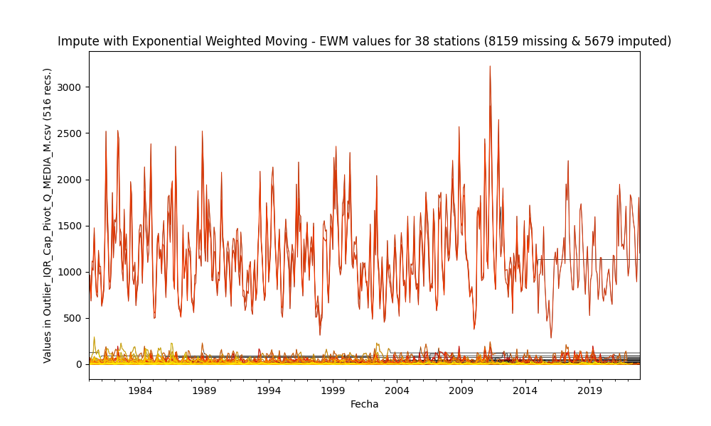
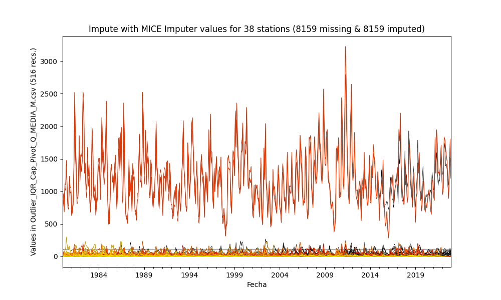

# Impute missing values in time series through statistical methods

* Processed file: [C:/JLGC/R.LTWB/.datasets/IDEAM_Outlier/Outlier_IQR_Cap_Pivot_Q_MEDIA_M.csv](../IDEAM_Outlier/Outlier_IQR_Cap_Pivot_Q_MEDIA_M.csv)
* Execution date: 2023-09-23 10:58:24.263097
* Python version: 3.11.5 (tags/v3.11.5:cce6ba9, Aug 24 2023, 14:38:34) [MSC v.1936 64 bit (AMD64)]
* Python path: ['C:\\JLGC\\R.LTWB\\.src', 'C:\\Python311\\python311.zip', 'C:\\Python311\\DLLs', 'C:\\Python311\\Lib', 'C:\\Python311']
* matplotlib version: 3.6.0
* pandas version: 2.1.0
* numpy version: 1.25.2
* missingno version: 0.5.2
* sklearn version: 1.3.0
* Stations exclude: ['21185040', '21190110', '21190170', '21190360', '21190430', '21190440', '21190450', '21195080', '21200040', '21200170', '21200390', '21200440', '21200500', '21200580', '21200590', '21200610', '21200650', '21200660', '21200700', '21200710', '21200720', '21200800', '21200830', '21201090', '21201130', '21201150', '21201290', '21201380', '21201620', '21201670', '21201680', '21201690', '21201700', '21201720', '21201730', '21201740', '21201750', '21201760', '21201780', '21201790', '21201810', '21201820', '21201830', '21201840', '21201870', '21202100', '21205012', '21205090', '21205300', '21205340', '21205360', '21205370', '21205450', '21205470', '21205540', '21205550', '21205580', '21205670', '21205700', '21205750', '21205770', '21205910', '21205970', '21206070', '21206100', '21206160', '21206190', '21206200', '21206230', '21206280', '21206310', '21206350', '21206390', '21206410', '21206460', '21206500', '21206510', '21206550', '21206570', '21206610', '21206620', '21206630', '21206640', '21206660', '21206670', '21206680', '21206700', '21206970', '21230080', '21255080', '21255160', '23010140', '23060040', '23060070', '23060080', '23060130', '23060210', '23060220', '23060250', '23060300', '23060310', '23060320', '23065120', '23065140', '23065150', '23065200', '23125170', '24010330', '24010380', '24010490', '24015380', '35020080', '35020090', '35020370', '35025060', '35035030', '35035040', '35035050', '35060010', '35060280', '35065010', '35067050', '35070160']
* Stations include: ['35070110']
* Print table sample: True
* Instructions & script: https://github.com/rcfdtools/R.LTWB/tree/main/Section03/Impute
* License: https://github.com/rcfdtools/R.LTWB/blob/main/LICENSE.md
* Credits: r.cfdtools@gmail.com

## General dataframe information with 516 IDEAM records for 38 stations

Dataframe records head sample

| Fecha               |   21197080 |   21197110 |   21197150 |   21197210 |   21207960 |   21209200 |   21209920 |   21227010 |   21237010 |   21237020 |   21237040 |   21257090 |   23017020 |   23017030 |   23017060 |   23017090 |   23067050 |   23067070 |   23067080 |   23067090 |   24017150 |   24017610 |   35027020 |   35027100 |   35027190 |   35027200 |   35027220 |   35027500 |   35027510 |   35037100 |   35037110 |   35067020 |   35067030 |   35067040 |   35067090 |   35067120 |   35077070 |   35077140 |
|:--------------------|-----------:|-----------:|-----------:|-----------:|-----------:|-----------:|-----------:|-----------:|-----------:|-----------:|-----------:|-----------:|-----------:|-----------:|-----------:|-----------:|-----------:|-----------:|-----------:|-----------:|-----------:|-----------:|-----------:|-----------:|-----------:|-----------:|-----------:|-----------:|-----------:|-----------:|-----------:|-----------:|-----------:|-----------:|-----------:|-----------:|-----------:|-----------:|
| 1980-01-01 00:00:00 |        nan |      2.108 |      7.445 |        nan |      30.82 |        nan |        nan |      3.296 |      707.4 |      761.2 |      1.149 |        nan |      0.385 |      26.87 |        nan |        nan |      36.58 |        nan |      9.746 |     10.73  |     1.43   |      0.631 |      8.824 |       1.67 |        nan |        nan |        nan |        nan |        nan |      43.04 |      0.191 |      16.35 |      2.629 |      8.445 |      1.588 |      1.189 |      124.8 |        nan |
| 1980-02-01 00:00:00 |        nan |      4.184 |     58.15  |        nan |      40.89 |        nan |        nan |      2.575 |      883.8 |      964   |      3.722 |        nan |      0.336 |      40.98 |        nan |        nan |      73.58 |        nan |     16.12  |      7.09  |    12.2833 |      0.857 |      5.75  |       1.3  |        nan |        nan |        nan |        nan |        nan |      23.18 |      0.161 |      12.83 |      1.257 |      5.3   |      1.24  |      1     |      nan   |        nan |
| 1980-03-01 00:00:00 |        nan |      1.824 |      5.842 |        nan |      26.83 |        nan |        nan |      2.127 |      683.8 |      715.7 |      0.541 |        nan |      0.307 |      35.24 |        nan |        nan |      46.08 |        nan |      9.036 |      9.018 |    12.2833 |      0.296 |      5.329 |       1.24 |        nan |        nan |        nan |        nan |        nan |      35.86 |      0.133 |      15.31 |      1.216 |      7.403 |      2.056 |      1.638 |      nan   |        nan |

Dataframe records tail sample

| Fecha               |   21197080 |   21197110 |   21197150 |   21197210 |   21207960 |   21209200 |   21209920 |   21227010 |   21237010 |   21237020 |   21237040 |   21257090 |   23017020 |   23017030 |   23017060 |   23017090 |   23067050 |   23067070 |   23067080 |   23067090 |   24017150 |   24017610 |   35027020 |   35027100 |   35027190 |   35027200 |   35027220 |   35027500 |   35027510 |   35037100 |   35037110 |   35067020 |   35067030 |   35067040 |   35067090 |   35067120 |   35077070 |   35077140 |
|:--------------------|-----------:|-----------:|-----------:|-----------:|-----------:|-----------:|-----------:|-----------:|-----------:|-----------:|-----------:|-----------:|-----------:|-----------:|-----------:|-----------:|-----------:|-----------:|-----------:|-----------:|-----------:|-----------:|-----------:|-----------:|-----------:|-----------:|-----------:|-----------:|-----------:|-----------:|-----------:|-----------:|-----------:|-----------:|-----------:|-----------:|-----------:|-----------:|
| 2022-10-01 00:00:00 |        nan |    9.16945 |        nan |        nan |        nan |        nan |    5.16083 |        nan |    1354.78 |        nan |        nan |        nan |   0.378024 |        nan |        nan |        nan |        nan |        nan |        nan |        nan |   12.2833  |        nan |        nan |        nan |        nan |        nan |        nan |        nan |        nan |        nan |        nan |        nan |        nan |        nan |        nan |        nan |        nan |        nan |
| 2022-11-01 00:00:00 |        nan |    3.46566 |        nan |        nan |        nan |        nan |    7.45085 |        nan |    1804.28 |        nan |        nan |        nan |   0.409437 |        nan |        nan |        nan |        nan |        nan |        nan |        nan |   12.2833  |        nan |        nan |        nan |        nan |        nan |        nan |        nan |        nan |        nan |        nan |        nan |        nan |        nan |        nan |        nan |        nan |        nan |
| 2022-12-01 00:00:00 |        nan |    2.6174  |        nan |        nan |        nan |        nan |    3.39069 |        nan |    1201.38 |        nan |        nan |        nan |   0.296714 |        nan |        nan |        nan |        nan |        nan |        nan |        nan |    3.22877 |        nan |        nan |        nan |        nan |        nan |        nan |        nan |        nan |        nan |        nan |        nan |        nan |        nan |        nan |        nan |        nan |        nan |

Datatypes for station and nulls values in the initial file
|       | 21197080   | 21197110   | 21197150   | 21197210   | 21207960   | 21209200   | 21209920   | 21227010   | 21237010   | 21237020   | 21237040   | 21257090   | 23017020   | 23017030   | 23017060   | 23017090   | 23067050   | 23067070   | 23067080   | 23067090   | 24017150   | 24017610   | 35027020   | 35027100   | 35027190   | 35027200   | 35027220   | 35027500   | 35027510   | 35037100   | 35037110   | 35067020   | 35067030   | 35067040   | 35067090   | 35067120   | 35077070   | 35077140   |
|:------|:-----------|:-----------|:-----------|:-----------|:-----------|:-----------|:-----------|:-----------|:-----------|:-----------|:-----------|:-----------|:-----------|:-----------|:-----------|:-----------|:-----------|:-----------|:-----------|:-----------|:-----------|:-----------|:-----------|:-----------|:-----------|:-----------|:-----------|:-----------|:-----------|:-----------|:-----------|:-----------|:-----------|:-----------|:-----------|:-----------|:-----------|:-----------|
| Dtype | float64    | float64    | float64    | float64    | float64    | float64    | float64    | float64    | float64    | float64    | float64    | float64    | float64    | float64    | float64    | float64    | float64    | float64    | float64    | float64    | float64    | float64    | float64    | float64    | float64    | float64    | float64    | float64    | float64    | float64    | float64    | float64    | float64    | float64    | float64    | float64    | float64    | float64    |
| Nulls | 239        | 9          | 60         | 419        | 125        | 454        | 436        | 82         | 0          | 97         | 71         | 189        | 13         | 226        | 156        | 501        | 38         | 81         | 43         | 397        | 13         | 42         | 379        | 80         | 139        | 241        | 88         | 453        | 426        | 420        | 257        | 432        | 54         | 365        | 40         | 467        | 512        | 115        |

General statistics table - Initial file

|          |   count |         mean |        std |         min |         25% |          50% |        75% |         max |
|---------:|--------:|-------------:|-----------:|------------:|------------:|-------------:|-----------:|------------:|
| 21197080 |     277 |    1.85514   |   1.56676  |   0.065     |   0.718     |    1.455     |    2.37194 |    8.062    |
| 21197110 |     507 |    3.16785   |   2.27201  |   0.173     |   1.4435    |    2.633     |    4.27    |   12.53     |
| 21197150 |     456 |   46.7217    |  33.4942   |   2.97008   |  23.98      |   37.35      |   58.9725  |  198.13     |
| 21197210 |      97 |    0.120062  |   0.262478 |   0         |   0.021     |    0.077     |    0.114   |    1.53732  |
| 21207960 |     391 |   41.549     |  22.437    |   4.912     |  26.57      |   37.12      |   49.88    |  138.5      |
| 21209200 |      62 |   54.8575    |  29.8516   |  18.2143    |  33.3872    |   45.4749    |   68.4543  |  136.429    |
| 21209920 |      80 |    5.18556   |   1.81466  |   2.49827   |   3.7647    |    4.88099   |    5.97305 |   11.4413   |
| 21227010 |     434 |    5.04703   |   4.13235  |   0.42529   |   2.2885    |    3.691     |    6.5035  |   23.7      |
| 21237010 |     516 | 1148.51      | 410.094    | 283.819     | 851.2       | 1095.5       | 1371.23    | 2794        |
| 21237020 |     419 | 1242.84      | 452.952    | 390.9       | 895.45      | 1176         | 1499.5     | 3225        |
| 21237040 |     445 |    3.05291   |   3.67468  |   0.022     |   0.577     |    1.572     |    3.979   |   19.19     |
| 21257090 |     327 |   23.6663    |  21.5057   |   1.105     |   8.705     |   17.04      |   30.51    |  110.522    |
| 23017020 |     503 |    1.36795   |   3.69019  |   0.088     |   0.311503  |    0.429383  |    0.6635  |   17.4103   |
| 23017030 |     290 |   43.4485    |  19.99     |  12.69      |  30.2025    |   39.545     |   53.06    |  123.345    |
| 23017060 |     360 |    5.28978   |   2.75416  |   1.054     |   3.31638   |    4.83209   |    6.50313 |   16.089    |
| 23017090 |      15 |   37.2285    |  17.1674   |   2.317     |  24.355     |   41.25      |   48.095   |   65.91     |
| 23067050 |     478 |   65.6272    |  46.1273   |   3.80699   |  27.5775    |   55.47      |   97.63    |  243.965    |
| 23067070 |     435 |    8.55278   |   8.10947  |   0.0569231 |   2.617     |    6.36      |   11.74    |   46.1415   |
| 23067080 |     473 |   21.9258    |  14.6475   |   2.458     |  10.74      |   17.7752    |   31.0289  |   93.38     |
| 23067090 |     119 |   10.0613    |   7.35104  |   0.456     |   4.304     |    7.503     |   13.415   |   35.72     |
| 24017150 |     503 |    1.55841   |   2.48576  |   0.161     |   0.498     |    0.72      |    1.236   |   12.2833   |
| 24017610 |     474 |    1.64616   |   2.32164  |   0.041     |   0.51525   |    0.869408  |    1.68426 |   11.5885   |
| 35027020 |     137 |   16.8444    |  12.1479   |   0.2       |   7.2       |   13.7       |   24.02    |   69.9      |
| 35027100 |     436 |    5.2973    |   3.89788  |   0.213512  |   2.43082   |    4.413     |    7.1105  |   21.33     |
| 35027190 |     377 |   26.9053    |  17.7764   |   1.373     |  11.47      |   23.12      |   39.1     |   86.62     |
| 35027200 |     275 |   55.2528    |  37.4051   |   7.971     |  28.23      |   45.59      |   74.73    |  230.1      |
| 35027220 |     428 |    0.116273  |   0.101805 |   0         |   0.04775   |    0.0915    |    0.1585  |    0.579302 |
| 35027500 |      63 |    0.0744801 |   0.117784 |   0.001     |   0.0153623 |    0.0368667 |    0.0735  |    0.536474 |
| 35027510 |      90 |    0.900581  |   0.838405 |   0.0155811 |   0.357546  |    0.657674  |    1.07851 |    4.29579  |
| 35037100 |      96 |   85.5894    |  58.5653   |   5.111     |  35.4125    |   72.475     |  130.05    |  296.5      |
| 35037110 |     259 |    0.350486  |   0.204491 |   0.015     |   0.182     |    0.314     |    0.4965  |    1.035    |
| 35067020 |      84 |   56.3608    |  42.2229   |   5.452     |  22.3125    |   50.965     |   77.26    |  229        |
| 35067030 |     462 |    4.56177   |   3.48778  |   0.112     |   2.00181   |    3.5485    |    6.448   |   21.2772   |
| 35067040 |     151 |   27.9689    |  21.3219   |   1.142     |  11.735     |   24.3       |   36.43    |  115.3      |
| 35067090 |     476 |    6.75487   |   6.01943  |   0.317     |   3.012     |    5.7265    |    8.62625 |   47.389    |
| 35067120 |      49 |    6.05115   |   6.2214   |   0         |   2.475     |    5.018     |    6.942   |   31.0982   |
| 35077070 |       4 |  101.498     |  27.046    |  76.73      |  78.7775    |  102.13      |  124.85    |  125        |
| 35077140 |     401 |   10.006     |   8.04865  |   0.14      |   3.66      |    7.73506   |   14.4     |   47.31     |

## Method 1 - Imputing with mean values
According to this technique, the missing values are imputed using the mean value in each feature and the serie has been completed filled.

Imputed file: [Impute_Mean_Outlier_IQR_Cap_Pivot_Q_MEDIA_M.csv](Impute_Mean_Outlier_IQR_Cap_Pivot_Q_MEDIA_M.csv)

General statistics table - Imputed file

|          |   count |         mean |         std |         min |         25% |          50% |          75% |         max |
|---------:|--------:|-------------:|------------:|------------:|------------:|-------------:|-------------:|------------:|
| 21197080 |     516 |    1.85514   |   1.14698   |   0.065     |   1.342     |    1.85514   |    1.85514   |    8.062    |
| 21197110 |     516 |    3.16785   |   2.25207   |   0.173     |   1.46981   |    2.693     |    4.25924   |   12.53     |
| 21197150 |     516 |   46.7217    |  31.4826    |   2.97008   |  25.9       |   42.87      |   54.7048    |  198.13     |
| 21197210 |     516 |    0.120062  |   0.113325  |   0         |   0.120062  |    0.120062  |    0.120062  |    1.53732  |
| 21207960 |     516 |   41.549     |  19.5251    |   4.912     |  29.79      |   41.549     |   44.155     |  138.5      |
| 21209200 |     516 |   54.8575    |  10.2738    |  18.2143    |  54.8575    |   54.8575    |   54.8575    |  136.429    |
| 21209920 |     516 |    5.18556   |   0.710732  |   2.49827   |   5.18556   |    5.18556   |    5.18556   |   11.4413   |
| 21227010 |     516 |    5.04703   |   3.78911   |   0.42529   |   2.4985    |    4.383     |    5.626     |   23.7      |
| 21237010 |     516 | 1148.51      | 410.094     | 283.819     | 851.2       | 1095.5       | 1371.23      | 2794        |
| 21237020 |     516 | 1242.84      | 408.072     | 390.9       | 963.55      | 1242.84      | 1430.25      | 3225        |
| 21237040 |     516 |    3.05291   |   3.41199   |   0.022     |   0.68207   |    2.11759   |    3.35956   |   19.19     |
| 21257090 |     516 |   23.6663    |  17.1103    |   1.105     |  13.69      |   23.6663    |   23.6663    |  110.522    |
| 23017020 |     516 |    1.36795   |   3.64332   |   0.088     |   0.31625   |    0.438     |    0.694     |   17.4103   |
| 23017030 |     516 |   43.4485    |  14.9747    |  12.69      |  36.86      |   43.4485    |   43.4485    |  123.345    |
| 23017060 |     516 |    5.28978   |   2.2995    |   1.054     |   3.881     |    5.28978   |    5.617     |   16.089    |
| 23017090 |     516 |   37.2285    |   2.83051   |   2.317     |  37.2285    |   37.2285    |   37.2285    |   65.91     |
| 23067050 |     516 |   65.6272    |  44.3929    |   3.80699   |  29.57      |   58.095     |   93.5375    |  243.965    |
| 23067070 |     516 |    8.55278   |   7.44447   |   0.0569231 |   3.27007   |    8.11646   |   10.515     |   46.1415   |
| 23067080 |     516 |   21.9258    |  14.0227    |   2.458     |  10.9399    |   19.2047    |   29.085     |   93.38     |
| 23067090 |     516 |   10.0613    |   3.51873   |   0.456     |  10.0613    |   10.0613    |   10.0613    |   35.72     |
| 24017150 |     516 |    1.55841   |   2.45418   |   0.161     |   0.50925   |    0.734     |    1.30375   |   12.2833   |
| 24017610 |     516 |    1.64616   |   2.22496   |   0.041     |   0.5535    |    0.9625    |    1.64616   |   11.5885   |
| 35027020 |     516 |   16.8444    |   6.24262   |   0.2       |  16.8444    |   16.8444    |   16.8444    |   69.9      |
| 35027100 |     516 |    5.2973    |   3.58236   |   0.213512  |   2.6275    |    5.2973    |    6.6       |   21.33     |
| 35027190 |     516 |   26.9053    |  15.1892    |   1.373     |  15.4625    |   26.9053    |   33.385     |   86.62     |
| 35027200 |     516 |   55.2528    |  27.2836    |   7.971     |  41.79      |   55.2528    |   55.2528    |  230.1      |
| 35027220 |     516 |    0.116273  |   0.0927    |   0         |   0.053     |    0.108     |    0.132     |    0.579302 |
| 35027500 |     516 |    0.0744801 |   0.0408675 |   0.001     |   0.0744801 |    0.0744801 |    0.0744801 |    0.536474 |
| 35027510 |     516 |    0.900581  |   0.348534  |   0.0155811 |   0.900581  |    0.900581  |    0.900581  |    4.29579  |
| 35037100 |     516 |   85.5894    |  25.1535    |   5.111     |  85.5894    |   85.5894    |   85.5894    |  296.5      |
| 35037110 |     516 |    0.350486  |   0.144737  |   0.015     |   0.31375   |    0.350486  |    0.350486  |    1.035    |
| 35067020 |     516 |   56.3608    |  16.9506    |   5.452     |  56.3608    |   56.3608    |   56.3608    |  229        |
| 35067030 |     516 |    4.56177   |   3.29986   |   0.112     |   2.13825   |    4.0895    |    6.003     |   21.2772   |
| 35067040 |     516 |   27.9689    |  11.5071    |   1.142     |  27.9689    |   27.9689    |   27.9689    |  115.3      |
| 35067090 |     516 |    6.75487   |   5.78094   |   0.317     |   3.21725   |    6.1785    |    8.361     |   47.389    |
| 35067120 |     516 |    6.05115   |   1.89935   |   0         |   6.05115   |    6.05115   |    6.05115   |   31.0982   |
| 35077070 |     516 |  101.497     |   2.06424   |  76.73      | 101.498     |  101.498     |  101.498     |  125        |
| 35077140 |     516 |   10.006     |   7.09332   |   0.14      |   4.5395    |   10.006     |   11.8912    |   47.31     |

## Method 2 - Imputing with median values
According to this technique, the missing values are imputed using the median value in each feature and the serie has been completed filled.

Imputed file: [Impute_Median_Outlier_IQR_Cap_Pivot_Q_MEDIA_M.csv](Impute_Median_Outlier_IQR_Cap_Pivot_Q_MEDIA_M.csv)

General statistics table - Imputed file

|          |   count |         mean |        std |         min |         25% |          50% |          75% |         max |
|---------:|--------:|-------------:|-----------:|------------:|------------:|-------------:|-------------:|------------:|
| 21197080 |     516 |    1.66981   |   1.16424  |   0.065     |   1.342     |    1.455     |    1.55275   |    8.062    |
| 21197110 |     516 |    3.15852   |   2.25316  |   0.173     |   1.46981   |    2.633     |    4.25924   |   12.53     |
| 21197150 |     516 |   45.632     |  31.6259   |   2.97008   |  25.9       |   37.35      |   54.7048    |  198.13     |
| 21197210 |     516 |    0.0850949 |   0.114569 |   0         |   0.077     |    0.077     |    0.077     |    1.53732  |
| 21207960 |     516 |   40.4761    |  19.6173   |   4.912     |  29.79      |   37.12      |   44.155     |  138.5      |
| 21209200 |     516 |   46.6023    |  10.718    |  18.2143    |  45.4749    |   45.4749    |   45.4749    |  136.429    |
| 21209920 |     516 |    4.92821   |   0.719246 |   2.49827   |   4.88099   |    4.88099   |    4.88099   |   11.4413   |
| 21227010 |     516 |    4.83154   |   3.82146  |   0.42529   |   2.4985    |    3.691     |    5.626     |   23.7      |
| 21237010 |     516 | 1148.51      | 410.094    | 283.819     | 851.2       | 1095.5       | 1371.23      | 2794        |
| 21237020 |     516 | 1230.27      | 408.908    | 390.9       | 963.55      | 1176         | 1430.25      | 3225        |
| 21237040 |     516 |    2.84914   |   3.44998  |   0.022     |   0.68207   |    1.572     |    3.35956   |   19.19     |
| 21257090 |     516 |   21.2392    |  17.4062   |   1.105     |  13.69      |   17.04      |   22.2825    |  110.522    |
| 23017020 |     516 |    1.34431   |   3.64629  |   0.088     |   0.31625   |    0.429383  |    0.65      |   17.4103   |
| 23017030 |     516 |   41.7388    |  15.0997   |  12.69      |  36.86      |   39.545     |   42.195     |  123.345    |
| 23017060 |     516 |    5.15141   |   2.3091   |   1.054     |   3.881     |    4.83209   |    5.617     |   16.089    |
| 23017090 |     516 |   41.1331    |   2.91018  |   2.317     |  41.25      |   41.25      |   41.25      |   65.91     |
| 23067050 |     516 |   64.8792    |  44.4723   |   3.80699   |  29.57      |   55.47      |   93.5375    |  243.965    |
| 23067070 |     516 |    8.20856   |   7.48717  |   0.0569231 |   3.27007   |    6.36      |   10.515     |   46.1415   |
| 23067080 |     516 |   21.58      |  14.0696   |   2.458     |  10.9399    |   17.7752    |   29.085     |   93.38     |
| 23067090 |     516 |    8.09299   |   3.68035  |   0.456     |   7.503     |    7.503     |    7.503     |   35.72     |
| 24017150 |     516 |    1.53729   |   2.4577   |   0.161     |   0.50925   |    0.72      |    1.21014   |   12.2833   |
| 24017610 |     516 |    1.58294   |   2.23509  |   0.041     |   0.5535    |    0.869408  |    1.53425   |   11.5885   |
| 35027020 |     516 |   14.5349    |   6.39548  |   0.2       |  13.7       |   13.7       |   13.7       |   69.9      |
| 35027100 |     516 |    5.1602    |   3.59666  |   0.213512  |   2.6275    |    4.413     |    6.6       |   21.33     |
| 35027190 |     516 |   25.8856    |  15.2819   |   1.373     |  15.4625    |   23.12      |   33.385     |   86.62     |
| 35027200 |     516 |   50.7398    |  27.7071   |   7.971     |  41.79      |   45.59      |   48.9425    |  230.1      |
| 35027220 |     516 |    0.112048  |   0.093168 |   0         |   0.053     |    0.0915    |    0.132     |    0.579302 |
| 35027500 |     516 |    0.041459  |   0.042686 |   0.001     |   0.0368667 |    0.0368667 |    0.0368667 |    0.536474 |
| 35027510 |     516 |    0.700042  |   0.36054  |   0.0155811 |   0.657674  |    0.657674  |    0.657674  |    4.29579  |
| 35037100 |     516 |   74.9149    |  25.667    |   5.111     |  72.475     |   72.475     |   72.475     |  296.5      |
| 35037110 |     516 |    0.332314  |   0.145884 |   0.015     |   0.31375   |    0.314     |    0.31475   |    1.035    |
| 35067020 |     516 |   51.8434    |  17.0674   |   5.452     |  50.965     |   50.965     |   50.965     |  229        |
| 35067030 |     516 |    4.45573   |   3.31444  |   0.112     |   2.13825   |    3.5485    |    6.003     |   21.2772   |
| 35067040 |     516 |   25.3737    |  11.6278   |   1.142     |  24.3       |   24.3       |   24.3       |  115.3      |
| 35067090 |     516 |    6.67515   |   5.78749  |   0.317     |   3.21725   |    5.7265    |    8.361     |   47.389    |
| 35067120 |     516 |    5.11611   |   1.9234   |   0         |   5.018     |    5.018     |    5.018     |   31.0982   |
| 35077070 |     516 |  102.125     |   2.06498  |  76.73      | 102.13      |  102.13      |  102.13      |  125        |
| 35077140 |     516 |    9.49984   |   7.15612  |   0.14      |   4.5395    |    7.73506   |   11.8912    |   47.31     |

## Method 3 - Imputing with Last Observation Carried Forward (LOCF) values
According to this technique, the missing values are imputed using the immediate values before it in the time series and the missing values at the start are not filled but the series are completed fillet to the end.

Imputed file: [Impute_LOCF_Outlier_IQR_Cap_Pivot_Q_MEDIA_M.csv](Impute_LOCF_Outlier_IQR_Cap_Pivot_Q_MEDIA_M.csv)

General statistics table - Imputed file

|          |   count |         mean |         std |         min |         25% |          50% |        75% |         max |
|---------:|--------:|-------------:|------------:|------------:|------------:|-------------:|-----------:|------------:|
| 21197080 |     348 |    1.85428   |   1.462     |   0.065     |   0.711     |    1.633     |    2.42684 |    8.062    |
| 21197110 |     516 |    3.13423   |   2.26712   |   0.173     |   1.42115   |    2.5485    |    4.25924 |   12.53     |
| 21197150 |     516 |   46.7117    |  32.0538    |   2.97008   |  25.7331    |   40.475     |   56.985   |  198.13     |
| 21197210 |     401 |    0.133903  |   0.148758  |   0         |   0.103     |    0.103     |    0.103   |    1.53732  |
| 21207960 |     516 |   36.8449    |  24.304     |   4.912     |  20.025     |   33.805     |   45.95    |  138.5      |
| 21209200 |      84 |   49.4738    |  27.1585    |  18.2143    |  34.3015    |   37.1207    |   58.6092  |  136.429    |
| 21209920 |      84 |    5.22118   |   1.77764   |   2.49827   |   3.78888   |    5.02634   |    5.95576 |   11.4413   |
| 21227010 |     516 |    5.09029   |   4.40983   |   0.42529   |   2.2915    |    3.49249   |    6.14875 |   23.7      |
| 21237010 |     516 | 1148.51      | 410.094     | 283.819     | 851.2       | 1095.5       | 1371.23    | 2794        |
| 21237020 |     516 | 1206.27      | 415.509     | 390.9       | 963.55      | 1060.5       | 1431.75    | 3225        |
| 21237040 |     516 |    2.97105   |   3.48837   |   0.022     |   0.63375   |    1.8425    |    3.3865  |   19.19     |
| 21257090 |     420 |   29.0358    |  27.7615    |   1.105     |  10.2891    |   19.25      |   38.3725  |  110.522    |
| 23017020 |     516 |    1.33885   |   3.64785   |   0.088     |   0.30675   |    0.4235    |    0.65    |   17.4103   |
| 23017030 |     516 |   44.736     |  15.5237    |  12.69      |  36.0375    |   46.1       |   46.1     |  123.345    |
| 23017060 |     406 |    5.24534   |   2.64506   |   1.054     |   3.3295    |    4.92628   |    6.29975 |   16.089    |
| 23017090 |     165 |   52.3756    |   9.1278    |   2.317     |  54.77      |   54.77      |   54.77    |   65.91     |
| 23067050 |     516 |   65.647     |  45.3768    |   3.80699   |  27.5325    |   54.9238    |   97.0675  |  243.965    |
| 23067070 |     513 |    8.23434   |   7.81043   |   0.0569231 |   2.132     |    6.323     |   12.19    |   46.1415   |
| 23067080 |     516 |   21.65      |  14.24      |   2.458     |  10.36      |   17.9784    |   29.3108  |   93.38     |
| 23067090 |     516 |    5.63972   |   4.27379   |   0.456     |   4.308     |    4.308     |    4.308   |   35.72     |
| 24017150 |     516 |    1.58257   |   2.46028   |   0.161     |   0.50925   |    0.7325    |    1.3     |   12.2833   |
| 24017610 |     516 |    1.57446   |   2.23818   |   0.041     |   0.530875  |    0.807306  |    1.53425 |   11.5885   |
| 35027020 |     516 |   21.8928    |   7.34908   |   0.2       |  19.56      |   24.66      |   24.66    |   69.9      |
| 35027100 |     516 |    5.29449   |   3.92854   |   0.213512  |   2.576     |    3.94357   |    6.988   |   21.33     |
| 35027190 |     512 |   24.8008    |  15.8598    |   1.373     |  14.4625    |   17.94      |   33.755   |   86.62     |
| 35027200 |     512 |  102.794     |  59.1668    |   7.971     |  41.1325    |  111.65      |  159.8     |  230.1      |
| 35027220 |     456 |    0.116583  |   0.100715  |   0         |   0.05      |    0.0923774 |    0.161   |    0.579302 |
| 35027500 |     172 |    0.0535714 |   0.0730058 |   0.001     |   0.0331396 |    0.043     |    0.043   |    0.536474 |
| 35027510 |     172 |    0.881039  |   0.624418  |   0.0155811 |   0.49302   |    0.994     |    0.994   |    4.29579  |
| 35037100 |     516 |   41.0796    |  34.4327    |   5.111     |  24.82      |   24.82      |   45.89    |  296.5      |
| 35037110 |     516 |    0.55445   |   0.250908  |   0.015     |   0.31375   |    0.76      |    0.76    |    1.035    |
| 35067020 |     516 |   32.1648    |  20.0344    |   5.452     |  27.46      |   27.46      |   27.46    |  229        |
| 35067030 |     516 |    4.3935    |   3.36489   |   0.112     |   2.11075   |    3.2965    |    6.003   |   21.2772   |
| 35067040 |     516 |   61.5271    |  24.4787    |   1.142     |  48.3       |   75.41      |   75.41    |  115.3      |
| 35067090 |     516 |    6.64306   |   5.8864    |   0.317     |   2.8315    |    5.7035    |    8.50325 |   47.389    |
| 35067120 |     516 |    0.766456  |   2.62938   |   0         |   0         |    0         |    0       |   31.0982   |
| 35077070 |     516 |   77.6673    |   6.63628   |  76.73      |  76.73      |   76.73      |   76.73    |  125        |
| 35077140 |     499 |   11.9204    |  10.8318    |   0.14      |   4.3355    |    9.599     |   14.71    |   47.31     |

## Method 4 - Imputing with Next Observation Carried Backward (NOCB) values
According to this technique, the missing values are imputed using the immediate values after it in the time series and the missing values at the end are not filled but the series are completed fillet to the start.

Imputed file: [Impute_NOCB_Outlier_IQR_Cap_Pivot_Q_MEDIA_M.csv](Impute_NOCB_Outlier_IQR_Cap_Pivot_Q_MEDIA_M.csv)

General statistics table - Imputed file

|          |   count |        mean |         std |         min |         25% |        50% |        75% |         max |
|---------:|--------:|------------:|------------:|------------:|------------:|-----------:|-----------:|------------:|
| 21197080 |     466 |    1.95107  |   1.22603   |   0.065     |   1.184     |    2.139   |    2.139   |    8.062    |
| 21197110 |     516 |    3.15071  |   2.26099   |   0.173     |   1.42188   |    2.6252  |    4.25924 |   12.53     |
| 21197150 |     480 |   47.5137   |  34.4071    |   2.97008   |  23.7975    |   37.35    |   62.6902  |  198.13     |
| 21197210 |     264 |    0.73497  |   0.723898  |   0         |   0.1       |    0.1265  |    1.53732 |    1.53732  |
| 21207960 |     431 |   40.6499   |  22.3215    |   4.912     |  25.48      |   36.88    |   50.56    |  138.5      |
| 21209200 |     494 |   23.0498   |  15.9924    |  18.2143    |  18.4848    |   18.4848  |   18.4848  |  136.429    |
| 21209920 |     516 |    3.90429  |   0.8983    |   2.49827   |   3.66922   |    3.66922 |    3.66922 |   11.4413   |
| 21227010 |     488 |    4.77552  |   4.03387   |   0.42529   |   2.10225   |    3.6255  |    6.0755  |   23.7      |
| 21237010 |     516 | 1148.51     | 410.094     | 283.819     | 851.2       | 1095.5     | 1371.23    | 2794        |
| 21237020 |     420 | 1242.93     | 452.415     | 390.9       | 897.025     | 1176       | 1499.25    | 3225        |
| 21237040 |     504 |    2.88245  |   3.51046   |   0.022     |   0.511614  |    1.5385  |    3.4035  |   19.19     |
| 21257090 |     492 |   23.4523   |  20.5338    |   1.105     |  11.2275    |   14.72    |   26.8975  |  110.522    |
| 23017020 |     516 |    1.37534  |   3.71452   |   0.088     |   0.31625   |    0.4235  |    0.65625 |   17.4103   |
| 23017030 |     302 |   43.4775   |  20.3327    |  12.69      |  29.4475    |   39.455   |   53.06    |  123.345    |
| 23017060 |     509 |    5.67788  |   2.58042   |   1.054     |   3.5       |    5.542   |    7.551   |   16.089    |
| 23017090 |     370 |   57.4254   |   7.24782   |   2.317     |  58.8       |   58.8     |   58.8     |   65.91     |
| 23067050 |     504 |   69.8135   |  49.7448    |   3.80699   |  29.0025    |   56.87    |  105.925   |  243.965    |
| 23067070 |     482 |    8.27723  |   7.81172   |   0.0569231 |   3.0115    |    5.9295  |   11.2356  |   46.1415   |
| 23067080 |     504 |   21.1569   |  14.5819    |   2.458     |   9.76925   |   17.2782  |   29.3277  |   93.38     |
| 23067090 |     120 |   10.1315   |   7.36042   |   0.456     |   4.306     |    7.885   |   13.7     |   35.72     |
| 24017150 |     516 |    1.55686  |   2.45457   |   0.161     |   0.50925   |    0.7325  |    1.3     |   12.2833   |
| 24017610 |     480 |    1.65462  |   2.30828   |   0.041     |   0.523737  |    0.873   |    1.7495  |   11.5885   |
| 35027020 |     176 |   15.6715   |  10.9841    |   0.2       |   9.3125    |   11.19    |   20.2675  |   69.9      |
| 35027100 |     480 |    5.43783  |   3.81478   |   0.213512  |   2.5       |    4.77    |    7.127   |   21.33     |
| 35027190 |     408 |   26.4438   |  17.5102    |   1.373     |  11.0325    |   22.09    |   38.64    |   86.62     |
| 35027200 |     282 |   54.865    |  37.1034    |   7.971     |  27.84      |   45.63    |   72.15    |  230.1      |
| 35027220 |     504 |    0.103049 |   0.0995083 |   0         |   0.0290306 |    0.0755  |    0.13525 |    0.579302 |
| 35027500 |     480 |    0.065237 |   0.0472459 |   0.001     |   0.07375   |    0.074   |    0.074   |    0.536474 |
| 35027510 |     494 |    0.730966 |   0.386039  |   0.0155811 |   0.751     |    0.751   |    0.751   |    4.29579  |
| 35037100 |     372 |   29.4705   |  44.5349    |   5.111     |   7.965     |    7.965   |   14.49    |  296.5      |
| 35037110 |     259 |    0.350486 |   0.204491  |   0.015     |   0.182     |    0.314   |    0.4965  |    1.035    |
| 35067020 |      84 |   56.3608   |  42.2229    |   5.452     |  22.3125    |   50.965   |   77.26    |  229        |
| 35067030 |     479 |    4.54998  |   3.45696   |   0.112     |   2.00863   |    3.631   |    6.326   |   21.2772   |
| 35067040 |     151 |   27.9689   |  21.3219    |   1.142     |  11.735     |   24.3     |   36.43    |  115.3      |
| 35067090 |     504 |    7.19221  |   6.28975   |   0.317     |   3.124     |    6.03963 |    9.17575 |   47.389    |
| 35067120 |      96 |    3.46136  |   5.1682    |   0         |   0.994     |    0.994   |    5.04225 |   31.0982   |
| 35077070 |      12 |  117.166    |  18.2593    |  76.73      | 124.95      |  125       |  125       |  125        |
| 35077140 |     509 |    9.63773  |   7.45484   |   0.14      |   3.903     |    8.105   |   13.29    |   47.31     |

## Method 5 - Impute missing values with Linear Interpolation values
According to this technique, the missing values are imputed using the linear interpolation between knowing pair values in the time series and the missing values at the start are not filled but the series are completed fillet to the end.

Imputed file: [Impute_InterpolateLinear_Outlier_IQR_Cap_Pivot_Q_MEDIA_M.csv](Impute_InterpolateLinear_Outlier_IQR_Cap_Pivot_Q_MEDIA_M.csv)

General statistics table - Imputed file

|          |   count |         mean |         std |         min |         25% |          50% |          75% |         max |
|---------:|--------:|-------------:|------------:|------------:|------------:|-------------:|-------------:|------------:|
| 21197080 |     348 |    1.89149   |   1.43609   |   0.065     |   0.80605   |    1.6315    |    2.42684   |    8.062    |
| 21197110 |     516 |    3.14247   |   2.26146   |   0.173     |   1.44063   |    2.569     |    4.25924   |   12.53     |
| 21197150 |     516 |   47.1544    |  32.1       |   2.97008   |  25.72      |   40.66      |   57.7225    |  198.13     |
| 21197210 |     401 |    0.120812  |   0.136287  |   0         |   0.103     |    0.103     |    0.103     |    1.53732  |
| 21207960 |     516 |   36.2444    |  23.6689    |   4.912     |  19.2275    |   32.845     |   46.0925    |  138.5      |
| 21209200 |      84 |   49.4738    |  27.1585    |  18.2143    |  34.3015    |   37.1207    |   58.6092    |  136.429    |
| 21209920 |      84 |    5.1672    |   1.77581   |   2.49827   |   3.78888   |    4.88099   |    5.95576   |   11.4413   |
| 21227010 |     516 |    4.8829    |   4.06206   |   0.42529   |   2.285     |    3.432     |    6.0755    |   23.7      |
| 21237010 |     516 | 1148.51      | 410.094     | 283.819     | 851.2       | 1095.5       | 1371.23      | 2794        |
| 21237020 |     516 | 1206.09      | 415.418     | 390.9       | 963.55      | 1060.5       | 1430.25      | 3225        |
| 21237040 |     516 |    2.91451   |   3.45628   |   0.022     |   0.63225   |    1.75521   |    3.3865    |   19.19     |
| 21257090 |     420 |   29.7794    |  27.5076    |   1.105     |  10.175     |   21.895     |   38.5132    |  110.522    |
| 23017020 |     516 |    1.3571    |   3.66254   |   0.088     |   0.307943  |    0.4235    |    0.65625   |   17.4103   |
| 23017030 |     516 |   44.6506    |  15.5043    |  12.69      |  36.0375    |   46.1       |   46.1       |  123.345    |
| 23017060 |     406 |    5.20874   |   2.6384    |   1.054     |   3.36287   |    4.7334    |    6.31875   |   16.089    |
| 23017090 |     165 |   52.2636    |   9.09133   |   2.317     |  54.77      |   54.77      |   54.77      |   65.91     |
| 23067050 |     516 |   67.5528    |  46.2653    |   3.80699   |  29.4777    |   55.8667    |  100.775     |  243.965    |
| 23067070 |     513 |    8.0226    |   7.74494   |   0.0569231 |   2.146     |    6.22677   |   11.12      |   46.1415   |
| 23067080 |     516 |   21.4983    |  14.3374    |   2.458     |  10.0225    |   17.8461    |   29.3108    |   93.38     |
| 23067090 |     516 |    5.65101   |   4.28465   |   0.456     |   4.308     |    4.308     |    4.308     |   35.72     |
| 24017150 |     516 |    1.56971   |   2.45643   |   0.161     |   0.50925   |    0.7325    |    1.3       |   12.2833   |
| 24017610 |     516 |    1.58498   |   2.23579   |   0.041     |   0.5535    |    0.807306  |    1.56126   |   11.5885   |
| 35027020 |     516 |   21.7435    |   7.49806   |   0.2       |  19.56      |   24.66      |   24.66      |   69.9      |
| 35027100 |     516 |    5.31403   |   3.73748   |   0.213512  |   2.61675   |    4.20218   |    6.988     |   21.33     |
| 35027190 |     512 |   24.7538    |  15.7885    |   1.373     |  14.845     |   17.94      |   33.9975    |   86.62     |
| 35027200 |     512 |  102.814     |  59.1372    |   7.971     |  41.1325    |  111.65      |  159.8       |  230.1      |
| 35027220 |     456 |    0.114583  |   0.0998944 |   0         |   0.0499121 |    0.086     |    0.1541    |    0.579302 |
| 35027500 |     172 |    0.0472822 |   0.0741468 |   0.001     |   0.0231432 |    0.0331396 |    0.0399727 |    0.536474 |
| 35027510 |     172 |    0.770751  |   0.631649  |   0.0155811 |   0.484634  |    0.6055    |    0.893015  |    4.29579  |
| 35037100 |     516 |   37.5662    |  36.4473    |   5.111     |  16.1802    |   22.5057    |   45.89      |  296.5      |
| 35037110 |     516 |    0.55445   |   0.250908  |   0.015     |   0.31375   |    0.76      |    0.76      |    1.035    |
| 35067020 |     516 |   32.1648    |  20.0344    |   5.452     |  27.46      |   27.46      |   27.46      |  229        |
| 35067030 |     516 |    4.38953   |   3.35695   |   0.112     |   2.13825   |    3.333     |    6.04175   |   21.2772   |
| 35067040 |     516 |   61.5271    |  24.4787    |   1.142     |  48.3       |   75.41      |   75.41      |  115.3      |
| 35067090 |     516 |    6.86057   |   5.97176   |   0.317     |   2.9315    |    5.833     |    9.047     |   47.389    |
| 35067120 |     516 |    0.705215  |   2.60698   |   0         |   0         |    0         |    0         |   31.0982   |
| 35077070 |     516 |   77.6688    |   6.64731   |  76.73      |  76.73      |   76.73      |   76.73      |  125        |
| 35077140 |     499 |   10.68      |   8.50304   |   0.14      |   3.99      |    9.26933   |   14.325     |   47.31     |

## Method 6 - Impute missing values with Exponential (Weighted) Moving Average - EWM = 3
According to this technique, the missing values are imputed using the moving average values in the time series and the missing values at the start are not filled but the series are completed fillet to the end.

Imputed file: [Impute_MeanEWM_Outlier_IQR_Cap_Pivot_Q_MEDIA_M.csv](Impute_MeanEWM_Outlier_IQR_Cap_Pivot_Q_MEDIA_M.csv)

General statistics table - Imputed file

|          |   count |         mean |         std |         min |         25% |          50% |          75% |         max |
|---------:|--------:|-------------:|------------:|------------:|------------:|-------------:|-------------:|------------:|
| 21197080 |     348 |    1.82292   |   1.41193   |   0.065     |   0.93675   |    1.6315    |    2.129     |    8.062    |
| 21197110 |     516 |    3.14749   |   2.25827   |   0.173     |   1.4385    |    2.569     |    4.25924   |   12.53     |
| 21197150 |     516 |   48.0944    |  31.8457    |   2.97008   |  25.9       |   41.885     |   59.7642    |  198.13     |
| 21197210 |     401 |    0.175421  |   0.313811  |   0         |   0.0515469 |    0.0515469 |    0.0733145 |    1.53732  |
| 21207960 |     516 |   36.7268    |  23.1184    |   4.912     |  20.33      |   34.015     |   46.305     |  138.5      |
| 21209200 |      84 |   51.7972    |  26.108     |  18.2143    |  37.3901    |   43.1729    |   58.6092    |  136.429    |
| 21209920 |      84 |    5.22044   |   1.77734   |   2.49827   |   3.78888   |    5.02634   |    5.95576   |   11.4413   |
| 21227010 |     516 |    4.89658   |   3.8942    |   0.42529   |   2.484     |    3.67436   |    6.09925   |   23.7      |
| 21237010 |     516 | 1148.51      | 410.094     | 283.819     | 851.2       | 1095.5       | 1371.23      | 2794        |
| 21237020 |     516 | 1223.33      | 410.844     | 390.9       | 963.55      | 1133.19      | 1431.75      | 3225        |
| 21237040 |     516 |    2.87305   |   3.45471   |   0.022     |   0.673709  |    1.60726   |    3.3865    |   19.19     |
| 21257090 |     420 |   26.9118    |  24.9375    |   1.105     |  10.063     |   18.49      |   32.975     |  110.522    |
| 23017020 |     516 |    1.38852   |   3.64758   |   0.088     |   0.31625   |    0.438     |    0.69175   |   17.4103   |
| 23017030 |     516 |   41.8267    |  15.1549    |  12.69      |  36.0375    |   39.6314    |   43.175     |  123.345    |
| 23017060 |     406 |    5.2877    |   2.62383   |   1.054     |   3.45925   |    4.78      |    6.50771   |   16.089    |
| 23017090 |     165 |   41.4719    |   5.50347   |   2.317     |  41.8871    |   41.8871    |   41.8871    |   65.91     |
| 23067050 |     516 |   67.5819    |  45.3672    |   3.80699   |  29.57      |   57.94      |  101.3       |  243.965    |
| 23067070 |     513 |    8.37262   |   7.64185   |   0.0569231 |   3.163     |    6.36      |   12.0359    |   46.1415   |
| 23067080 |     516 |   21.8706    |  14.142     |   2.458     |  10.9399    |   17.88      |   30.0406    |   93.38     |
| 23067090 |     516 |    6.39299   |   4.05267   |   0.456     |   5.2913    |    5.2913    |    5.2913    |   35.72     |
| 24017150 |     516 |    1.56015   |   2.45442   |   0.161     |   0.50925   |    0.734     |    1.3       |   12.2833   |
| 24017610 |     516 |    1.64863   |   2.22592   |   0.041     |   0.5535    |    0.9625    |    1.76928   |   11.5885   |
| 35027020 |     516 |   18.2836    |   6.55372   |   0.2       |  18.1482    |   18.1482    |   18.1482    |   69.9      |
| 35027100 |     516 |    5.39509   |   3.73751   |   0.213512  |   2.6275    |    4.4675    |    6.9595    |   21.33     |
| 35027190 |     512 |   25.6102    |  15.5483    |   1.373     |  14.7675    |   21.1       |   33.755     |   86.62     |
| 35027200 |     512 |   85.9573    |  43.3885    |   7.971     |  41.59      |  111.65      |  122.584     |  230.1      |
| 35027220 |     456 |    0.120896  |   0.101747  |   0         |   0.05      |    0.094     |    0.16625   |    0.579302 |
| 35027500 |     172 |    0.0791536 |   0.0745352 |   0.001     |   0.0608688 |    0.0608803 |    0.121596  |    0.536474 |
| 35027510 |     172 |    0.927466  |   0.606106  |   0.0155811 |   0.634685  |    0.98039   |    0.98039   |    4.29579  |
| 35037100 |     516 |   67.0653    |  30.8447    |   5.111     |  49.6529    |   49.6529    |   81.3554    |  296.5      |
| 35037110 |     516 |    0.400416  |   0.153186  |   0.015     |   0.31375   |    0.450734  |    0.450734  |    1.035    |
| 35067020 |     516 |   69.3512    |  17.8941    |   5.452     |  71.8771    |   71.8771    |   71.8771    |  229        |
| 35067030 |     516 |    4.64228   |   3.33542   |   0.112     |   2.11075   |    4.0755    |    6.16325   |   21.2772   |
| 35067040 |     516 |   29.2252    |  11.5355    |   1.142     |  29.7449    |   29.7449    |   29.7449    |  115.3      |
| 35067090 |     516 |    6.68715   |   5.80059   |   0.317     |   3.21725   |    5.93563   |    8.419     |   47.389    |
| 35067120 |     516 |    2.87024   |   2.46896   |   0         |   2.21738   |    2.21738   |    2.21738   |   31.0982   |
| 35077070 |     516 |   91.8595    |   4.71059   |  76.73      |  91.2601    |   91.2601    |   91.2601    |  125        |
| 35077140 |     499 |   11.2538    |   8.78351   |   0.14      |   4.39296   |    9.77125   |   14.7532    |   47.31     |

## Method 7 - Impute missing values with Natural Neigborns - KNN = 5 Imputer from Scikit Learn
According to this technique, the missing values are imputed using the natural neighbors values and the serie has been completed filled. More information in https://scikit-learn.org/stable/modules/generated/sklearn.impute.KNNImputer.html

Imputer = KNNImputer(n_neighbors=n_neighbors, weights=uniform, metric=nan_euclidean)

Imputed file: [Impute_KNN_Outlier_IQR_Cap_Pivot_Q_MEDIA_M.csv](Impute_KNN_Outlier_IQR_Cap_Pivot_Q_MEDIA_M.csv)

General statistics table - Imputed file

|          |   count |         mean |         std |         min |        25% |          50% |          75% |         max |
|---------:|--------:|-------------:|------------:|------------:|-----------:|-------------:|-------------:|------------:|
| 21197080 |     516 |    1.77824   |   1.32789   |   0.065     |   0.77539  |    1.43321   |    2.366     |    8.062    |
| 21197110 |     516 |    3.13742   |   2.26583   |   0.173     |   1.42422  |    2.569     |    4.25924   |   12.53     |
| 21197150 |     516 |   46.9397    |  32.7422    |   2.97008   |  25.1345   |   37.9727    |   62.2228    |  198.13     |
| 21197210 |     516 |    0.129948  |   0.188056  |   0         |   0.0353   |    0.0834    |    0.1138    |    1.53732  |
| 21207960 |     516 |   41.462     |  21.47      |   4.912     |  27.285    |   37.005     |   50.265     |  138.5      |
| 21209200 |     516 |   57.2901    |  27.8124    |  18.2143    |  37.0323   |   49.4462    |   73.9905    |  136.429    |
| 21209920 |     516 |    5.16057   |   1.11854   |   2.49827   |   4.31518  |    5.00159   |    5.89533   |   11.4413   |
| 21227010 |     516 |    5.0018    |   3.94063   |   0.42529   |   2.32228  |    3.7025    |    6.52525   |   23.7      |
| 21237010 |     516 | 1148.51      | 410.094     | 283.819     | 851.2      | 1095.5       | 1371.23      | 2794        |
| 21237020 |     516 | 1234.16      | 445.371     | 390.9       | 898.195    | 1173.5       | 1494.25      | 3225        |
| 21237040 |     516 |    2.97791   |   3.50067   |   0.022     |   0.5995   |    1.68232   |    3.96375   |   19.19     |
| 21257090 |     516 |   25.6882    |  19.2225    |   1.105     |  11.3775   |   21.4685    |   34.4125    |  110.522    |
| 23017020 |     516 |    1.37979   |   3.65849   |   0.088     |   0.314    |    0.4365    |    0.67425   |   17.4103   |
| 23017030 |     516 |   43.6492    |  18.5109    |  12.69      |  30.7225   |   39.76      |   53.0575    |  123.345    |
| 23017060 |     516 |    5.26572   |   2.54547   |   1.054     |   3.43375  |    4.81205   |    6.47325   |   16.089    |
| 23017090 |     516 |   40.0853    |  10.0999    |   2.317     |  31.6274   |   45.412     |   48.042     |   65.91     |
| 23067050 |     516 |   66.0113    |  45.7963    |   3.80699   |  29.275    |   55.675     |   98.61      |  243.965    |
| 23067070 |     516 |    8.57525   |   7.79763   |   0.0569231 |   2.83112  |    6.507     |   11.9481    |   46.1415   |
| 23067080 |     516 |   21.8716    |  14.365     |   2.458     |  10.855    |   17.7976    |   30.9605    |   93.38     |
| 23067090 |     516 |    9.72816   |   5.3376    |   0.456     |   5.2728   |    9.024     |   12.5594    |   35.72     |
| 24017150 |     516 |    1.58931   |   2.48481   |   0.161     |   0.502019 |    0.7305    |    1.28265   |   12.2833   |
| 24017610 |     516 |    1.66539   |   2.27995   |   0.041     |   0.5515   |    0.881     |    1.73675   |   11.5885   |
| 35027020 |     516 |   16.1781    |   8.77709   |   0.2       |   9.74     |   15.802     |   21.208     |   69.9      |
| 35027100 |     516 |    5.35183   |   3.68151   |   0.213512  |   2.5755   |    4.67      |    7.12794   |   21.33     |
| 35027190 |     516 |   27.314     |  16.335     |   1.373     |  14.16     |   24.932     |   38.085     |   86.62     |
| 35027200 |     516 |   55.1812    |  31.236     |   7.971     |  33.1935   |   48.866     |   69.9925    |  230.1      |
| 35027220 |     516 |    0.115894  |   0.0971772 |   0         |   0.051    |    0.0930752 |    0.15425   |    0.579302 |
| 35027500 |     516 |    0.0753236 |   0.071431  |   0.001     |   0.031158 |    0.0516998 |    0.0882419 |    0.536474 |
| 35027510 |     516 |    0.90767   |   0.57692   |   0.0155811 |   0.54834  |    0.737507  |    1.15217   |    4.29579  |
| 35037100 |     516 |   86.6008    |  42.0194    |   5.111     |  55.6215   |   84.747     |  113.177     |  296.5      |
| 35037110 |     516 |    0.34733   |   0.164925  |   0.015     |   0.2335   |    0.3386    |    0.44685   |    1.035    |
| 35067020 |     516 |   53.9342    |  27.0149    |   5.452     |  35.816    |   50.155     |   67.9075    |  229        |
| 35067030 |     516 |    4.59113   |   3.345     |   0.112     |   2.11075  |    3.742     |    6.33475   |   21.2772   |
| 35067040 |     516 |   29.2764    |  16.7365    |   1.142     |  17.255    |   26.8456    |   38.027     |  115.3      |
| 35067090 |     516 |    6.70881   |   5.83748   |   0.317     |   3.124    |    5.7265    |    8.5475    |   47.389    |
| 35067120 |     516 |    5.75809   |   3.34698   |   0         |   3.277    |    5.2502    |    6.9558    |   31.0982   |
| 35077070 |     516 |  101.497     |   2.06424   |  76.73      | 101.498    |  101.498     |  101.498     |  125        |
| 35077140 |     516 |    9.70415   |   7.40322   |   0.14      |   4.02771  |    7.941     |   13.085     |   47.31     |

## Method 8 - Impute missing values with Multivariate Imputation by Chained Equation - MICE from Scikit Learn
According to this technique, the missing values are imputed using MICE values and the serie has been completed filled. More information in https://scikit-learn.org/stable/modules/generated/sklearn.impute.IterativeImputer.html

Imputer = IterativeImputer(estimator=BayesianRidge(), min_value=0, n_nearest_features=5)

Imputed file: [Impute_MICE_Outlier_IQR_Cap_Pivot_Q_MEDIA_M.csv](Impute_MICE_Outlier_IQR_Cap_Pivot_Q_MEDIA_M.csv)

General statistics table - Imputed file

|          |   count |         mean |         std |         min |         25% |          50% |         75% |         max |
|---------:|--------:|-------------:|------------:|------------:|------------:|-------------:|------------:|------------:|
| 21197080 |     516 |    1.75563   |   1.34582   |   0.065     |   0.773719  |    1.39848   |    2.25125  |    8.062    |
| 21197110 |     516 |    3.1363    |   2.26598   |   0.173     |   1.42422   |    2.5485    |    4.25924  |   12.53     |
| 21197150 |     516 |   47.118     |  33.1259    |   2.97008   |  23.98      |   38.335     |   62.4509   |  198.13     |
| 21197210 |     516 |    0.121155  |   0.118513  |   0         |   0.0895799 |    0.122092  |    0.145995 |    1.53732  |
| 21207960 |     516 |   41.8734    |  21.4064    |   4.912     |  27.8925    |   37.565     |   50.175    |  138.5      |
| 21209200 |     516 |   50.9482    |  23.4742    |  13.4992    |  34.3373    |   44.9563    |   63.2003   |  173.014    |
| 21209920 |     516 |    4.83559   |   1.40474   |   2.49827   |   3.75151   |    4.50841   |    5.60678  |   11.4413   |
| 21227010 |     516 |    5.10816   |   3.90228   |   0.42529   |   2.4705    |    3.94789   |    6.58039  |   23.7      |
| 21237010 |     516 | 1148.51      | 410.094     | 283.819     | 851.2       | 1095.5       | 1371.23     | 2794        |
| 21237020 |     516 | 1223.82      | 427.802     | 390.9       | 897.025     | 1159.86      | 1461.75     | 3225        |
| 21237040 |     516 |    3.08356   |   3.55021   |   0         |   0.612414  |    1.7065    |    4.22259  |   19.19     |
| 21257090 |     516 |   23.8746    |  18.1254    |   1.105     |  11.845     |   20.085     |   29.5025   |  110.522    |
| 23017020 |     516 |    1.37697   |   3.6445    |   0.088     |   0.31625   |    0.438     |    0.694    |   17.4103   |
| 23017030 |     516 |   46.7427    |  20.6696    |  12.69      |  31.0691    |   43.54      |   58.2675   |  126.246    |
| 23017060 |     516 |    5.31824   |   2.4918    |   1.054     |   3.482     |    4.94402   |    6.576    |   16.089    |
| 23017090 |     516 |   39.0068    |  13.9862    |   2.317     |  27.6137    |   37.0201    |   47.4182   |   93.1358   |
| 23067050 |     516 |   66.3667    |  45.9531    |   3.80699   |  29.0025    |   55.8667    |   98.3294   |  243.965    |
| 23067070 |     516 |    8.64465   |   7.65743   |   0         |   3.14725   |    6.72622   |   11.7776   |   46.1415   |
| 23067080 |     516 |   21.9159    |  14.2681    |   2.458     |  10.8903    |   17.945     |   30.7401   |   93.38     |
| 23067090 |     516 |    9.64663   |   5.5269    |   0.456     |   5.52779   |    8.16528   |   12.802    |   35.72     |
| 24017150 |     516 |    1.58286   |   2.46426   |   0.161     |   0.50925   |    0.734     |    1.30375  |   12.2833   |
| 24017610 |     516 |    1.65222   |   2.24523   |   0         |   0.531875  |    0.8905    |    1.7915   |   11.5885   |
| 35027020 |     516 |   19.5461    |  13.0938    |   0.2       |  10.3207    |   17.3504    |   25.1813   |   84.1782   |
| 35027100 |     516 |    5.29616   |   3.83737   |   0         |   2.49429   |    4.4675    |    7.035    |   21.33     |
| 35027190 |     516 |   27.8271    |  17.1842    |   1.373     |  13.5537    |   24.71      |   40.0121   |   86.62     |
| 35027200 |     516 |   58.2958    |  35.5913    |   7.971     |  31.5894    |   49.835     |   79.3127   |  230.1      |
| 35027220 |     516 |    0.116983  |   0.0956852 |   0         |   0.053     |    0.094     |    0.158    |    0.579302 |
| 35027500 |     516 |    0.0717924 |   0.0659096 |   0         |   0.024782  |    0.0564896 |    0.10316  |    0.536474 |
| 35027510 |     516 |    0.941985  |   0.636136  |   0.0155811 |   0.473592  |    0.799362  |    1.23147  |    4.29579  |
| 35037100 |     516 |   74.1035    |  43.4452    |   5.111     |  40.7444    |   65.0495    |   98.2008   |  296.5      |
| 35037110 |     516 |    0.373423  |   0.175795  |   0.015     |   0.255068  |    0.341839  |    0.4885   |    1.035    |
| 35067020 |     516 |   70.1403    |  46.0109    |   1.80315   |  35.8712    |   62.2048    |   96.1413   |  268.439    |
| 35067030 |     516 |    4.61198   |   3.39836   |   0.112     |   2.1       |    3.67266   |    6.522    |   21.2772   |
| 35067040 |     516 |   34.3903    |  22.3756    |   0.745548  |  16.7969    |   30.5552    |   47.6591   |  128.214    |
| 35067090 |     516 |    6.85663   |   5.91151   |   0.317     |   3.20325   |    5.833     |    8.813    |   47.389    |
| 35067120 |     516 |    8.97672   |   6.87518   |   0         |   3.77481   |    7.23787   |   12.7097   |   41.9835   |
| 35077070 |     516 |  101.476     |   2.06592   |  76.73      | 101.41      |  101.457     |  101.532    |  125        |
| 35077140 |     516 |   10.1188    |   7.6447    |   0.14      |   4.0415    |    8.19199   |   14.2599   |   47.31     |

Complementary report with individual graphs for stations in [Impute_Station_Outlier_IQR_Cap_Pivot_Q_MEDIA_M.csv.md](Impute_Station_Outlier_IQR_Cap_Pivot_Q_MEDIA_M.csv.md)

> As you notice, some of the techniques showed above can`t fill complete the missing values at the start or at the end, however, you can first choice a method and then apply another complementary method for get full filled the missin values.
