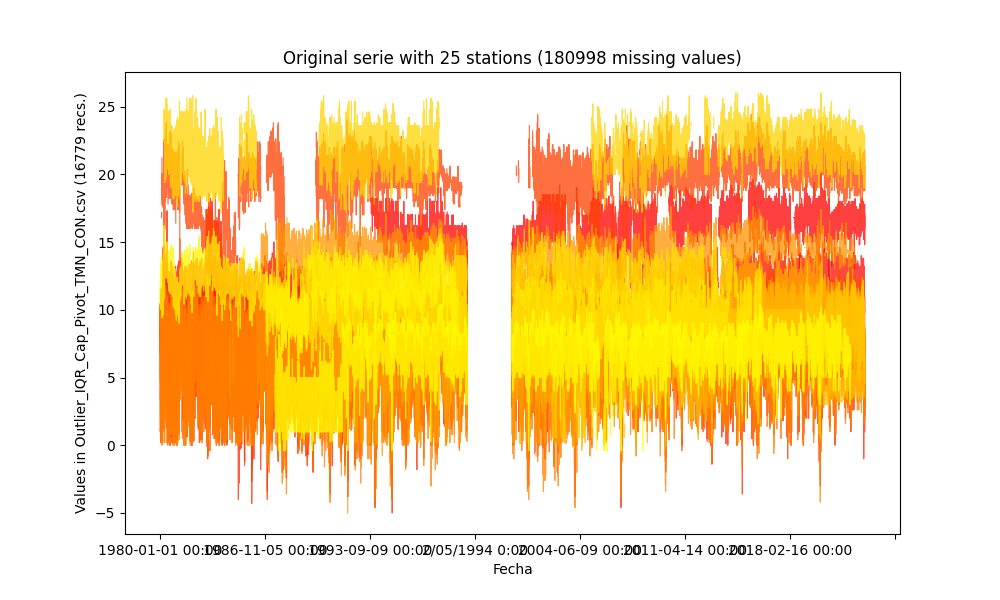
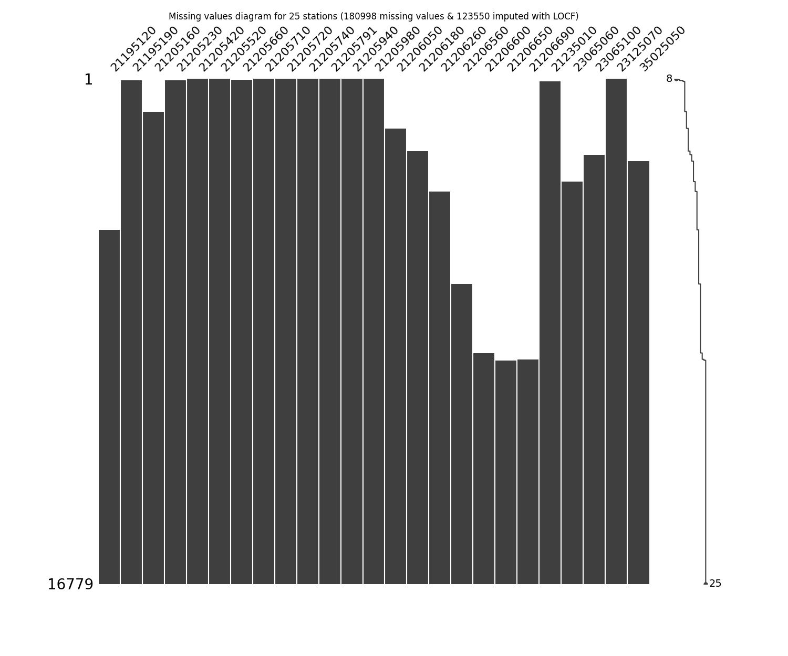
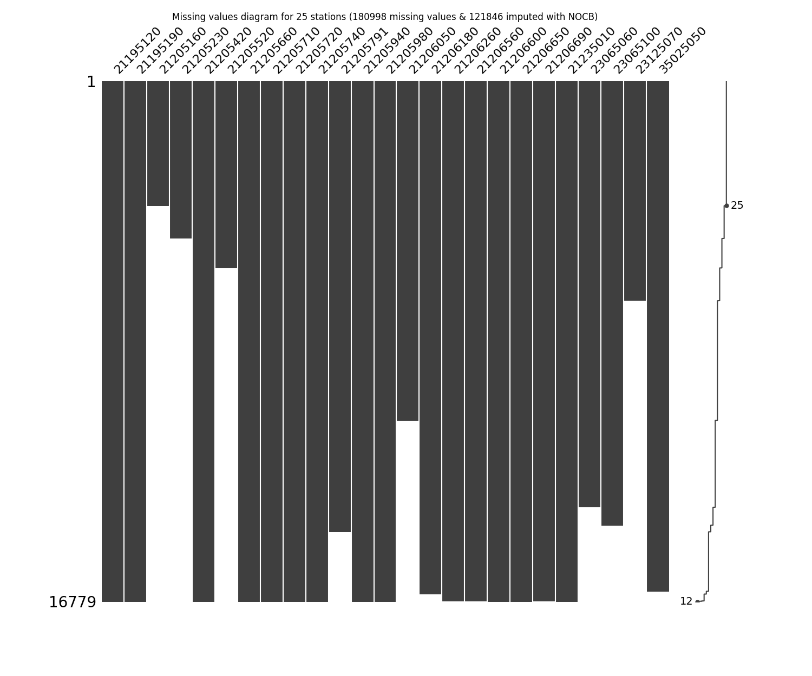
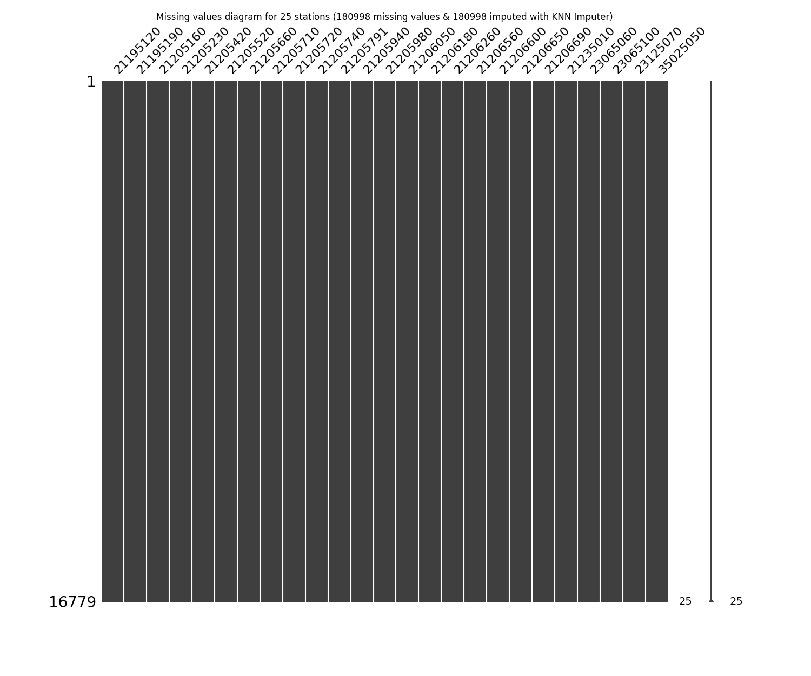

# Impute missing values in time series through statistical methods

* Processed file: [C:/JLGC/R.LTWB/.datasets/IDEAM_Outlier/Outlier_IQR_Cap_Pivot_TMN_CON.csv](../IDEAM_Outlier/Outlier_IQR_Cap_Pivot_TMN_CON.csv)
* Execution date: 2023-09-20 12:04:06.786029
* Python version: 3.11.5 (tags/v3.11.5:cce6ba9, Aug 24 2023, 14:38:34) [MSC v.1936 64 bit (AMD64)]
* Python path: ['C:\\JLGC\\R.LTWB\\.src', 'C:\\Python311\\python311.zip', 'C:\\Python311\\DLLs', 'C:\\Python311\\Lib', 'C:\\Python311']
* matplotlib version: 3.6.0
* pandas version: 2.1.0
* numpy version: 1.25.2
* missingno version: 0.5.2
* sklearn version: 1.3.0
* Stations exclude: ['21200710', '21201090', '21201130', '21201380', '21201620', '21201720', '21201750', '21201760', '21201790', '21200800', '21201840', '21206070', '21230080', '23060040', '24010380', '21206100', '35060280', '35067050']
* Stations include: ['15015020', '15060050', '15060070', '15060080', '15060150']
* Print table sample: True
* Instructions & script: https://github.com/rcfdtools/R.LTWB/tree/main/Section03/Impute
* License: https://github.com/rcfdtools/R.LTWB/blob/main/LICENSE.md
* Credits: r.cfdtools@gmail.com

## General dataframe information with 16779 IDEAM records for 60 stations

Dataframe records head sample

| Fecha            |   21185040 |   21195080 |   21195120 |   21195190 |   21205012 |   21205160 |   21205230 |   21205420 |   21205520 |   21205580 |   21205660 |   21205670 |   21205700 |   21205710 |   21205720 |   21205740 |   21205770 |   21205791 |   21205910 |   21205940 |   21205970 |   21205980 |   21206050 |   21206160 |   21206180 |   21206190 |   21206200 |   21206230 |   21206260 |   21206280 |   21206500 |   21206510 |   21206550 |   21206560 |   21206570 |   21206600 |   21206610 |   21206620 |   21206630 |   21206640 |   21206650 |   21206660 |   21206670 |   21206680 |   21206690 |   21206700 |   21206970 |   21235010 |   21255080 |   23065060 |   23065100 |   23065120 |   23065200 |   23125070 |   23125170 |   24015380 |   35025050 |   35025060 |   35035030 |   35065010 |
|:-----------------|-----------:|-----------:|-----------:|-----------:|-----------:|-----------:|-----------:|-----------:|-----------:|-----------:|-----------:|-----------:|-----------:|-----------:|-----------:|-----------:|-----------:|-----------:|-----------:|-----------:|-----------:|-----------:|-----------:|-----------:|-----------:|-----------:|-----------:|-----------:|-----------:|-----------:|-----------:|-----------:|-----------:|-----------:|-----------:|-----------:|-----------:|-----------:|-----------:|-----------:|-----------:|-----------:|-----------:|-----------:|-----------:|-----------:|-----------:|-----------:|-----------:|-----------:|-----------:|-----------:|-----------:|-----------:|-----------:|-----------:|-----------:|-----------:|-----------:|-----------:|
| 1980-01-01 00:00 |      nan   |        nan |        nan |        nan |        nan |        nan |        nan |        6.8 |        8   |       10   |        nan |        nan |        nan |       10.4 |        8.2 |       10.4 |        nan |        8   |        6.6 |        3.4 |        nan |      nan   |        nan |        nan |        nan |        nan |        nan |        nan |        nan |        nan |        nan |        nan |        nan |        nan |        nan |        nan |        nan |        nan |        nan |        nan |        nan |        nan |        nan |        nan |        nan |        nan |        nan |        nan |         24 |        nan |        nan |        nan |        nan |       12.4 |        nan |        nan |        nan |        nan |        nan |        nan |
| 1980-01-02 00:00 |       22.8 |        nan |        nan |        nan |        nan |        nan |        nan |       10.4 |        8.8 |        9.6 |        nan |        nan |        nan |        9.4 |        9.8 |      nan   |        nan |       10.5 |      nan   |        4   |        nan |        6.2 |        nan |        nan |        nan |        nan |        nan |        nan |        nan |        nan |        nan |        nan |        nan |        nan |        nan |        nan |        nan |        nan |        nan |        nan |        nan |        nan |        nan |        nan |        nan |        nan |        nan |        nan |         23 |        nan |        nan |        nan |        nan |       12   |        nan |        nan |        nan |        nan |        nan |        nan |
| 1980-01-03 00:00 |       22   |        nan |        nan |        nan |        nan |        nan |        nan |        5   |        6.8 |        8   |        nan |        nan |        nan |        6.8 |        6.2 |       10.2 |        nan |        7.4 |        6   |      nan   |        nan |        3.8 |        nan |        nan |        nan |        nan |        nan |        nan |        nan |        nan |        nan |        nan |        nan |        nan |        nan |        nan |        nan |        nan |        nan |        nan |        nan |        nan |        nan |        nan |        nan |        nan |        nan |        nan |         22 |        nan |        nan |        nan |        nan |       11.4 |        nan |        nan |        nan |        nan |        nan |        nan |

Dataframe records tail sample

| Fecha            |   21185040 |   21195080 |   21195120 |   21195190 |   21205012 |   21205160 |   21205230 |   21205420 |   21205520 |   21205580 |   21205660 |   21205670 |   21205700 |   21205710 |   21205720 |   21205740 |   21205770 |   21205791 |   21205910 |   21205940 |   21205970 |   21205980 |   21206050 |   21206160 |   21206180 |   21206190 |   21206200 |   21206230 |   21206260 |   21206280 |   21206500 |   21206510 |   21206550 |   21206560 |   21206570 |   21206600 |   21206610 |   21206620 |   21206630 |   21206640 |   21206650 |   21206660 |   21206670 |   21206680 |   21206690 |   21206700 |   21206970 |   21235010 |   21255080 |   23065060 |   23065100 |   23065120 |   23065200 |   23125070 |   23125170 |   24015380 |   35025050 |   35025060 |   35035030 |   35065010 |
|:-----------------|-----------:|-----------:|-----------:|-----------:|-----------:|-----------:|-----------:|-----------:|-----------:|-----------:|-----------:|-----------:|-----------:|-----------:|-----------:|-----------:|-----------:|-----------:|-----------:|-----------:|-----------:|-----------:|-----------:|-----------:|-----------:|-----------:|-----------:|-----------:|-----------:|-----------:|-----------:|-----------:|-----------:|-----------:|-----------:|-----------:|-----------:|-----------:|-----------:|-----------:|-----------:|-----------:|-----------:|-----------:|-----------:|-----------:|-----------:|-----------:|-----------:|-----------:|-----------:|-----------:|-----------:|-----------:|-----------:|-----------:|-----------:|-----------:|-----------:|-----------:|
| 2022-12-28 00:00 |        nan |        nan |       15.4 |       10.2 |        nan |        nan |        nan |        1.4 |        nan |        nan |       19   |        nan |        nan |        5.6 |        3.8 |        4.2 |        nan |        nan |        2.4 |        2   |        nan |        5.2 |        nan |        nan |        nan |        nan |        nan |        nan |        nan |        nan |        nan |        nan |        nan |        nan |        nan |        4.6 |        nan |        nan |        nan |        nan |        5.2 |        nan |        nan |        nan |        nan |        nan |        nan |       19   |        nan |        nan |        nan |        nan |        nan |        nan |        nan |        nan |        nan |        nan |        nan |        nan |
| 2022-12-29 00:00 |        nan |        nan |       17   |       10.6 |        nan |        nan |        nan |        4.2 |        nan |        nan |       20.2 |        nan |        nan |        9.6 |        5.4 |        5   |        nan |        nan |       10.2 |        8.2 |        nan |        8.6 |        nan |        nan |        nan |        nan |        nan |        nan |        nan |        nan |        nan |        nan |        nan |        nan |        nan |        7.2 |        nan |        nan |        nan |        nan |        4.8 |        nan |        nan |        nan |        nan |        nan |        nan |       20.2 |        nan |        nan |        nan |        nan |        nan |        nan |        nan |        nan |        nan |        nan |        nan |        nan |
| 2022-12-30 00:00 |        nan |        nan |       17   |       11   |        nan |        nan |        nan |        4.8 |        nan |        nan |       20.6 |        nan |        nan |       10   |        6   |        6   |        nan |        nan |        6   |        5.6 |        nan |        6   |        nan |        nan |        nan |        nan |        nan |        nan |        nan |        nan |        nan |        nan |        nan |        nan |        nan |        8.4 |        nan |        nan |        nan |        nan |        4.5 |        nan |        nan |        nan |        nan |        nan |        nan |       21.2 |        nan |        nan |        nan |        nan |        nan |        nan |        nan |        nan |        nan |        nan |        nan |        nan |

Datatypes for station and nulls values in the initial file
|       | 21185040   | 21195080   | 21195120   | 21195190   | 21205012   | 21205160   | 21205230   | 21205420   | 21205520   | 21205580   | 21205660   | 21205670   | 21205700   | 21205710   | 21205720   | 21205740   | 21205770   | 21205791   | 21205910   | 21205940   | 21205970   | 21205980   | 21206050   | 21206160   | 21206180   | 21206190   | 21206200   | 21206230   | 21206260   | 21206280   | 21206500   | 21206510   | 21206550   | 21206560   | 21206570   | 21206600   | 21206610   | 21206620   | 21206630   | 21206640   | 21206650   | 21206660   | 21206670   | 21206680   | 21206690   | 21206700   | 21206970   | 21235010   | 21255080   | 23065060   | 23065100   | 23065120   | 23065200   | 23125070   | 23125170   | 24015380   | 35025050   | 35025060   | 35035030   | 35065010   |
|:------|:-----------|:-----------|:-----------|:-----------|:-----------|:-----------|:-----------|:-----------|:-----------|:-----------|:-----------|:-----------|:-----------|:-----------|:-----------|:-----------|:-----------|:-----------|:-----------|:-----------|:-----------|:-----------|:-----------|:-----------|:-----------|:-----------|:-----------|:-----------|:-----------|:-----------|:-----------|:-----------|:-----------|:-----------|:-----------|:-----------|:-----------|:-----------|:-----------|:-----------|:-----------|:-----------|:-----------|:-----------|:-----------|:-----------|:-----------|:-----------|:-----------|:-----------|:-----------|:-----------|:-----------|:-----------|:-----------|:-----------|:-----------|:-----------|:-----------|:-----------|
| Dtype | float64    | float64    | float64    | float64    | float64    | float64    | float64    | float64    | float64    | float64    | float64    | float64    | float64    | float64    | float64    | float64    | float64    | float64    | float64    | float64    | float64    | float64    | float64    | float64    | float64    | float64    | float64    | float64    | float64    | float64    | float64    | float64    | float64    | float64    | float64    | float64    | float64    | float64    | float64    | float64    | float64    | float64    | float64    | float64    | float64    | float64    | float64    | float64    | float64    | float64    | float64    | float64    | float64    | float64    | float64    | float64    | float64    | float64    | float64    | float64    |
| Nulls | 4377       | 13828      | 7905       | 3006       | 10288      | 13886      | 13024      | 1780       | 11439      | 5054       | 3501       | 15930      | 15839      | 5207       | 3927       | 3183       | 16198      | 3653       | 2002       | 3544       | 3075       | 1419       | 9236       | 14579      | 6157       | 14257      | 15860      | 9941       | 6983       | 16228      | 13840      | 15732      | 14532      | 10500      | 15078      | 10688      | 16523      | 14673      | 15286      | 15953      | 11686      | 13783      | 16191      | 16125      | 11861      | 16653      | 15391      | 7426       | 4897       | 9221       | 7219       | 15896      | 15110      | 9742       | 16674      | 16547      | 4805       | 16034      | 13902      | 16058      |

General statistics table - Initial file

|          |   count |     mean |      std |       min |    25% |   50% |   75% |     max |
|---------:|--------:|---------:|---------:|----------:|-------:|------:|------:|--------:|
| 21185040 |   12402 | 23.1218  | 1.34456  | 18.4      | 22.2   |  23.2 |  24   | 28      |
| 21195080 |    2951 | 21.6957  | 1.52106  | 15.6      | 20.8   |  22   |  22.8 | 27.4    |
| 21195120 |    8874 | 16.2723  | 1.23886  | 11.4      | 15.4   |  16.4 |  17.2 | 20      |
| 21195190 |   13773 | 11.3941  | 1.4873   |  5.6      | 10.4   |  11.6 |  12.4 | 15.4    |
| 21205012 |    6491 |  9.41972 | 2.22311  |  0.3      |  8.2   |   9.8 |  11   | 14.5    |
| 21205160 |    2893 |  8.22713 | 3.45499  |  0        |  6     |   8   |  10.1 | 18.2    |
| 21205230 |    3755 |  8.89124 | 2.35317  |  0        |  7.5   |   9.6 |  10.6 | 17.3089 |
| 21205420 |   14999 |  6.96676 | 2.79456  | -5        |  5     |   7.4 |   9.2 | 13.2    |
| 21205520 |    5340 |  7.26217 | 2.76932  | -4.2      |  5.5   |   7.8 |   9.4 | 13      |
| 21205580 |   11725 |  9.05509 | 1.39198  |  4        |  8.2   |   9.2 |  10   | 14.0458 |
| 21205660 |   13278 | 19.6251  | 2.10935  | 12.0046   | 19.1   |  20   |  21   | 24.4    |
| 21205670 |     849 | 13.4852  | 1.11826  | 10        | 12.8   |  13.4 |  14.2 | 17.6    |
| 21205700 |     940 |  7.73138 | 2.25708  |  1        |  6.4   |   8.2 |   9.5 | 15      |
| 21205710 |   11572 |  8.90233 | 1.93339  |  1.4      |  7.6   |   9   |  10.2 | 14.6    |
| 21205720 |   12852 |  7.14088 | 1.76482  |  0        |  6     |   7.2 |   8.4 | 12.2    |
| 21205740 |   13596 |  7.99895 | 2.37505  | -2        |  6.4   |   8.6 |  10   | 15.8    |
| 21205770 |     581 |  6.47694 | 2.69307  | -0.9      |  4.6   |   6.6 |   8.6 | 12.1    |
| 21205791 |   13126 |  8.04905 | 2.51251  | -2        |  6.6   |   8.6 |   9.9 | 13.2    |
| 21205910 |   14777 |  7.17015 | 2.68099  | -2.46453  |  5.3   |   7.2 |   9.4 | 15.1    |
| 21205940 |   13235 |  6.65414 | 2.71181  | -3.2      |  4.8   |   7   |   8.8 | 13.8    |
| 21205970 |   13704 |  6.67256 | 3.03478  | -6.2      |  4.6   |   7   |   9.2 | 18      |
| 21205980 |   15360 |  7.16587 | 2.95606  | -5        |  5.3   |   7.6 |   9.5 | 13.3    |
| 21206050 |    7543 |  8.04743 | 2.29853  | -1.4      |  6.6   |   8.6 |   9.8 | 13.4    |
| 21206160 |    2200 | 14.4294  | 1.48886  |  9.10851  | 14     |  14.8 |  15.4 | 19      |
| 21206180 |   10622 | 14.2341  | 0.980303 | 10.5      | 13.6   |  14.3 |  14.8 | 17.6    |
| 21206190 |    2522 | 10.2627  | 1.70949  |  4        |  9.5   |  10.5 |  11.4 | 16.3952 |
| 21206200 |     919 |  6.92916 | 2.82252  | -2.5      |  5     |   7   |   9   | 12.5    |
| 21206230 |    6838 |  7.96208 | 2.45288  | -2        |  6.4   |   8.4 |   9.8 | 13      |
| 21206260 |    9796 |  7.48746 | 2.31292  | -0.77335  |  6.2   |   7.8 |   9.2 | 13.2    |
| 21206280 |     551 |  9.70546 | 1.49983  |  4.25254  |  9     |  10   |  10.6 | 13.6    |
| 21206500 |    2939 |  6.64733 | 2.02725  |  0        |  5.2   |   6.4 |   8   | 14      |
| 21206510 |    1047 | 10.5234  | 1.62111  |  4.2      |  9.5   |  10.8 |  11.7 | 16.4503 |
| 21206550 |    2247 |  6.39186 | 3.09359  | -4.69992  |  4.3   |   6.6 |   8.8 | 16      |
| 21206560 |    6279 | 10.298   | 1.94552  |  2.8      |  9.2   |  10.6 |  11.8 | 15      |
| 21206570 |    1701 |  8.46696 | 1.98066  |  0.5      |  7     |   8.6 |  10   | 13.1    |
| 21206600 |    6091 |  8.10153 | 2.15195  | -0.4      |  6.8   |   8.4 |   9.8 | 13.6    |
| 21206610 |     256 |  8.30638 | 1.443    |  2.71677  |  7.4   |   8.4 |   9.2 | 11.6    |
| 21206620 |    2106 |  8.93714 | 2.76389  | -3.2      |  7.1   |   9.8 |  11   | 16.4    |
| 21206630 |    1493 |  9.46437 | 1.71194  |  3.2      |  8     |   9.8 |  10.8 | 13.2    |
| 21206640 |     826 |  8.49843 | 2.19218  | -0.6      |  6.8   |   8.7 |  10.2 | 15      |
| 21206650 |    5093 |  6.59672 | 1.60985  |  0.2      |  5.4   |   6.8 |   7.8 | 13      |
| 21206660 |    2996 | 10.1437  | 2.2373   |  1.8      |  9.2   |  10.6 |  11.8 | 15.4    |
| 21206670 |     588 |  7.84388 | 2.67422  | -3.8      |  6.1   |   8   |  10   | 14.6    |
| 21206680 |     654 |  8.74783 | 1.556    |  3        |  8     |   9   |   9.8 | 13.6    |
| 21206690 |    4918 |  8.44897 | 2.20111  |  0.586031 |  7.6   |   9   |   9.8 | 13.6    |
| 21206700 |     126 |  9.10397 | 2.59505  | -1.3      |  7.575 |  10   |  11   | 13.1    |
| 21206970 |    1388 |  9.80273 | 1.33358  |  4.6      |  9     |  10   |  10.8 | 13      |
| 21235010 |    9353 | 22.1203  | 1.43296  | 17.2      | 21.2   |  22.4 |  23.2 | 26      |
| 21255080 |   11882 | 22.9545  | 1.47535  | 19        | 22     |  23   |  24   | 26.5    |
| 23065060 |    7558 | 12.5427  | 1.14852  |  8.2      | 11.8   |  12.6 |  13.4 | 16.6536 |
| 23065100 |    9560 |  9.81225 | 1.17774  |  4.8      |  9.1   |  10   |  10.6 | 13.8    |
| 23065120 |     883 | 13.3379  | 1.24338  |  8.9      | 12.6   |  13.2 |  14   | 18      |
| 23065200 |    1669 | 18.0303  | 1.19861  | 13.4      | 17.2   |  18   |  18.8 | 22.3291 |
| 23125070 |    7037 | 11.8886  | 1.41454  |  6.4      | 11     |  12   |  13   | 16.2    |
| 23125170 |     105 |  7.69343 | 1.8082   |  1.20996  |  6.8   |   7.6 |   9   | 11      |
| 24015380 |     232 |  6.91466 | 1.94953  |  0.4      |  5.6   |   7.2 |   8.4 | 10.6    |
| 35025050 |   11974 |  6.56303 | 1.95256  | -0.394235 |  6     |   7   |   8   | 10.4    |
| 35025060 |     745 |  5.04445 | 1.44862  | -0.228853 |  4.2   |   5.2 |   6   |  8.8    |
| 35035030 |    2877 | 19.6515  | 1.55975  | 14        | 18.8   |  19.6 |  20.4 | 25.2382 |
| 35065010 |     721 | 13.2244  | 2.19913  |  4.6      | 12     |  13.8 |  15   | 17.2    |

## Method 1 - Imputing with mean values
According to this technique, the missing values are imputed using the mean value in each feature and the serie has been completed filled.

Imputed file: [Impute_Mean_Outlier_IQR_Cap_Pivot_TMN_CON.csv](Impute_Mean_Outlier_IQR_Cap_Pivot_TMN_CON.csv)

General statistics table - Imputed file

|          |   count |     mean |      std |       min |      25% |      50% |      75% |     max |
|---------:|--------:|---------:|---------:|----------:|---------:|---------:|---------:|--------:|
| 21185040 |   16779 | 23.1218  | 1.15595  | 18.4      | 22.6     | 23.1218  | 23.7     | 28      |
| 21195080 |   16779 | 21.6957  | 0.637802 | 15.6      | 21.6957  | 21.6957  | 21.6957  | 27.4    |
| 21195120 |   16779 | 16.2723  | 0.900922 | 11.4      | 16.2     | 16.2723  | 16.4     | 20      |
| 21195190 |   16779 | 11.3941  | 1.34749  |  5.6      | 10.8     | 11.3941  | 12.2     | 15.4    |
| 21205012 |   16779 |  9.41972 | 1.38265  |  0.3      |  9.41972 |  9.41972 |  9.41972 | 14.5    |
| 21205160 |   16779 |  8.22713 | 1.43442  |  0        |  8.22713 |  8.22713 |  8.22713 | 18.2    |
| 21205230 |   16779 |  8.89124 | 1.11309  |  0        |  8.89124 |  8.89124 |  8.89124 | 17.3089 |
| 21205420 |   16779 |  6.96676 | 2.64216  | -5        |  5.4     |  6.96676 |  9       | 13.2    |
| 21205520 |   16779 |  7.26217 | 1.56219  | -4.2      |  7.26217 |  7.26217 |  7.26217 | 13      |
| 21205580 |   16779 |  9.05509 | 1.16359  |  4        |  8.6     |  9.05509 |  9.6     | 14.0458 |
| 21205660 |   16779 | 19.6251  | 1.87642  | 12.0046   | 19.4     | 19.6251  | 20.6     | 24.4    |
| 21205670 |   16779 | 13.4852  | 0.251404 | 10        | 13.4852  | 13.4852  | 13.4852  | 17.6    |
| 21205700 |   16779 |  7.73138 | 0.533962 |  1        |  7.73138 |  7.73138 |  7.73138 | 15      |
| 21205710 |   16779 |  8.90233 | 1.60559  |  1.4      |  8.4     |  8.90233 |  9.8     | 14.6    |
| 21205720 |   16779 |  7.14088 | 1.54454  |  0        |  6.4     |  7.14088 |  8       | 12.2    |
| 21205740 |   16779 |  7.99895 | 2.13792  | -2        |  7       |  7.99895 |  9.6     | 15.8    |
| 21205770 |   16779 |  6.47694 | 0.500717 | -0.9      |  6.47694 |  6.47694 |  6.47694 | 12.1    |
| 21205791 |   16779 |  8.04905 | 2.22222  | -2        |  7.3     |  8.04905 |  9.6     | 13.2    |
| 21205910 |   16779 |  7.17015 | 2.51596  | -2.46453  |  5.4     |  7.17015 |  9.2     | 15.1    |
| 21205940 |   16779 |  6.65414 | 2.40843  | -3.2      |  5.4     |  6.65414 |  8.2     | 13.8    |
| 21205970 |   16779 |  6.67256 | 2.74262  | -6.2      |  5.2     |  6.67256 |  8.8     | 18      |
| 21205980 |   16779 |  7.16587 | 2.8283   | -5        |  5.6     |  7.2     |  9.3     | 13.3    |
| 21206050 |   16779 |  8.04743 | 1.54107  | -1.4      |  8.04743 |  8.04743 |  8.2     | 13.4    |
| 21206160 |   16779 | 14.4294  | 0.53901  |  9.10851  | 14.4294  | 14.4294  | 14.4294  | 19      |
| 21206180 |   16779 | 14.2341  | 0.779961 | 10.5      | 14.1     | 14.2341  | 14.6     | 17.6    |
| 21206190 |   16779 | 10.2627  | 0.662649 |  4        | 10.2627  | 10.2627  | 10.2627  | 16.3952 |
| 21206200 |   16779 |  6.92916 | 0.66022  | -2.5      |  6.92916 |  6.92916 |  6.92916 | 12.5    |
| 21206230 |   16779 |  7.96208 | 1.56581  | -2        |  7.96208 |  7.96208 |  7.96208 | 13      |
| 21206260 |   16779 |  7.48746 | 1.76723  | -0.77335  |  7.2     |  7.48746 |  8.2     | 13.2    |
| 21206280 |   16779 |  9.70546 | 0.271553 |  4.25254  |  9.70546 |  9.70546 |  9.70546 | 13.6    |
| 21206500 |   16779 |  6.64733 | 0.848328 |  0        |  6.64733 |  6.64733 |  6.64733 | 14      |
| 21206510 |   16779 | 10.5234  | 0.404769 |  4.2      | 10.5234  | 10.5234  | 10.5234  | 16.4503 |
| 21206550 |   16779 |  6.39186 | 1.13187  | -4.69992  |  6.39186 |  6.39186 |  6.39186 | 16      |
| 21206560 |   16779 | 10.298   | 1.19008  |  2.8      | 10.298   | 10.298   | 10.298   | 15      |
| 21206570 |   16779 |  8.46696 | 0.630469 |  0.5      |  8.46696 |  8.46696 |  8.46696 | 13.1    |
| 21206600 |   16779 |  8.10153 | 1.29649  | -0.4      |  8.10153 |  8.10153 |  8.10153 | 13.6    |
| 21206610 |   16779 |  8.30638 | 0.177896 |  2.71677  |  8.30638 |  8.30638 |  8.30638 | 11.6    |
| 21206620 |   16779 |  8.93714 | 0.978986 | -3.2      |  8.93714 |  8.93714 |  8.93714 | 16.4    |
| 21206630 |   16779 |  9.46437 | 0.510508 |  3.2      |  9.46437 |  9.46437 |  9.46437 | 13.2    |
| 21206640 |   16779 |  8.49843 | 0.486107 | -0.6      |  8.49843 |  8.49843 |  8.49843 | 15      |
| 21206650 |   16779 |  6.59672 | 0.88687  |  0.2      |  6.59672 |  6.59672 |  6.59672 | 13      |
| 21206660 |   16779 | 10.1437  | 0.945261 |  1.8      | 10.1437  | 10.1437  | 10.1437  | 15.4    |
| 21206670 |   16779 |  7.84388 | 0.500202 | -3.8      |  7.84388 |  7.84388 |  7.84388 | 14.6    |
| 21206680 |   16779 |  8.74783 | 0.306971 |  3        |  8.74783 |  8.74783 |  8.74783 | 13.6    |
| 21206690 |   16779 |  8.44897 | 1.19158  |  0.586031 |  8.44897 |  8.44897 |  8.44897 | 13.6    |
| 21206700 |   16779 |  9.10397 | 0.223991 | -1.3      |  9.10397 |  9.10397 |  9.10397 | 13.1    |
| 21206970 |   16779 |  9.80273 | 0.383431 |  4.6      |  9.80273 |  9.80273 |  9.80273 | 13      |
| 21235010 |   16779 | 22.1203  | 1.06983  | 17.2      | 22.1203  | 22.1203  | 22.4     | 26      |
| 21255080 |   16779 | 22.9545  | 1.24151  | 19        | 22.5     | 22.9545  | 23.5     | 26.5    |
| 23065060 |   16779 | 12.5427  | 0.770805 |  8.2      | 12.5427  | 12.5427  | 12.5427  | 16.6536 |
| 23065100 |   16779 |  9.81225 | 0.888967 |  4.8      |  9.8     |  9.81225 | 10.1     | 13.8    |
| 23065120 |   16779 | 13.3379  | 0.28508  |  8.9      | 13.3379  | 13.3379  | 13.3379  | 18      |
| 23065200 |   16779 | 18.0303  | 0.377925 | 13.4      | 18.0303  | 18.0303  | 18.0303  | 22.3291 |
| 23125070 |   16779 | 11.8886  | 0.916029 |  6.4      | 11.8886  | 11.8886  | 11.8886  | 16.2    |
| 23125170 |   16779 |  7.69343 | 0.142361 |  1.20996  |  7.69343 |  7.69343 |  7.69343 | 11      |
| 24015380 |   16779 |  6.91466 | 0.228752 |  0.4      |  6.91466 |  6.91466 |  6.91466 | 10.6    |
| 35025050 |   16779 |  6.56303 | 1.64944  | -0.394235 |  6.4     |  6.56303 |  7.6     | 10.4    |
| 35025060 |   16779 |  5.04445 | 0.305051 | -0.228853 |  5.04445 |  5.04445 |  5.04445 |  8.8    |
| 35035030 |   16779 | 19.6515  | 0.645774 | 14        | 19.6515  | 19.6515  | 19.6515  | 25.2382 |
| 35065010 |   16779 | 13.2244  | 0.455562 |  4.6      | 13.2244  | 13.2244  | 13.2244  | 17.2    |

## Method 2 - Imputing with median values
According to this technique, the missing values are imputed using the median value in each feature and the serie has been completed filled.

Imputed file: [Impute_Median_Outlier_IQR_Cap_Pivot_TMN_CON.csv](Impute_Median_Outlier_IQR_Cap_Pivot_TMN_CON.csv)

General statistics table - Imputed file

|          |   count |     mean |      std |       min |   25% |   50% |   75% |     max |
|---------:|--------:|---------:|---------:|----------:|------:|------:|------:|--------:|
| 21185040 |   16779 | 23.1422  | 1.15646  | 18.4      |  22.6 |  23.2 |  23.7 | 28      |
| 21195080 |   16779 | 21.9465  | 0.648237 | 15.6      |  22   |  22   |  22   | 27.4    |
| 21195120 |   16779 | 16.3325  | 0.903173 | 11.4      |  16.2 |  16.4 |  16.4 | 20      |
| 21195190 |   16779 | 11.431   | 1.3498   |  5.6      |  10.8 |  11.6 |  12.2 | 15.4    |
| 21205012 |   16779 |  9.65289 | 1.395    |  0.3      |   9.8 |   9.8 |   9.8 | 14.5    |
| 21205160 |   16779 |  8.03916 | 1.43698  |  0        |   8   |   8   |   8   | 18.2    |
| 21205230 |   16779 |  9.44139 | 1.15162  |  0        |   9.6 |   9.6 |   9.6 | 17.3089 |
| 21205420 |   16779 |  7.01272 | 2.64553  | -5        |   5.4 |   7.4 |   9   | 13.2    |
| 21205520 |   16779 |  7.62883 | 1.58215  | -4.2      |   7.8 |   7.8 |   7.8 | 13      |
| 21205580 |   16779 |  9.09874 | 1.16549  |  4        |   8.6 |   9.2 |   9.6 | 14.0458 |
| 21205660 |   16779 | 19.7034  | 1.88259  | 12.0046   |  19.4 |  20   |  20.6 | 24.4    |
| 21205670 |   16779 | 13.4043  | 0.252096 | 10        |  13.4 |  13.4 |  13.4 | 17.6    |
| 21205700 |   16779 |  8.17375 | 0.544729 |  1        |   8.2 |   8.2 |   8.2 | 15      |
| 21205710 |   16779 |  8.93264 | 1.60623  |  1.4      |   8.4 |   9   |   9.8 | 14.6    |
| 21205720 |   16779 |  7.15472 | 1.54475  |  0        |   6.4 |   7.2 |   8   | 12.2    |
| 21205740 |   16779 |  8.11297 | 2.15087  | -2        |   7   |   8.6 |   9.6 | 15.8    |
| 21205770 |   16779 |  6.59574 | 0.501222 | -0.9      |   6.6 |   6.6 |   6.6 | 12.1    |
| 21205791 |   16779 |  8.169   | 2.23382  | -2        |   7.3 |   8.6 |   9.6 | 13.2    |
| 21205910 |   16779 |  7.17371 | 2.51598  | -2.46453  |   5.4 |   7.2 |   9.2 | 15.1    |
| 21205940 |   16779 |  6.72719 | 2.41257  | -3.2      |   5.4 |   7   |   8.2 | 13.8    |
| 21205970 |   16779 |  6.73257 | 2.74554  | -6.2      |   5.2 |   7   |   8.8 | 18      |
| 21205980 |   16779 |  7.20259 | 2.83087  | -5        |   5.6 |   7.6 |   9.3 | 13.3    |
| 21206050 |   16779 |  8.35159 | 1.5654   | -1.4      |   8.6 |   8.6 |   8.6 | 13.4    |
| 21206160 |   16779 | 14.7514  | 0.553333 |  9.10851  |  14.8 |  14.8 |  14.8 | 19      |
| 21206180 |   16779 | 14.2583  | 0.780609 | 10.5      |  14.1 |  14.3 |  14.6 | 17.6    |
| 21206190 |   16779 | 10.4643  | 0.668053 |  4        |  10.5 |  10.5 |  10.5 | 16.3952 |
| 21206200 |   16779 |  6.99612 | 0.660417 | -2.5      |   7   |   7   |   7   | 12.5    |
| 21206230 |   16779 |  8.22153 | 1.58053  | -2        |   8.4 |   8.4 |   8.4 | 13      |
| 21206260 |   16779 |  7.61753 | 1.77393  | -0.77335  |   7.2 |   7.8 |   8.2 | 13.2    |
| 21206280 |   16779 |  9.99033 | 0.276579 |  4.25254  |  10   |  10   |  10   | 13.6    |
| 21206500 |   16779 |  6.44332 | 0.853522 |  0        |   6.4 |   6.4 |   6.4 | 14      |
| 21206510 |   16779 | 10.7827  | 0.410261 |  4.2      |  10.8 |  10.8 |  10.8 | 16.4503 |
| 21206550 |   16779 |  6.57213 | 1.13409  | -4.69992  |   6.6 |   6.6 |   6.6 | 16      |
| 21206560 |   16779 | 10.487   | 1.19902  |  2.8      |  10.6 |  10.6 |  10.6 | 15      |
| 21206570 |   16779 |  8.58651 | 0.631746 |  0.5      |   8.6 |   8.6 |   8.6 | 13.1    |
| 21206600 |   16779 |  8.29165 | 1.30441  | -0.4      |   8.4 |   8.4 |   8.4 | 13.6    |
| 21206610 |   16779 |  8.39857 | 0.178266 |  2.71677  |   8.4 |   8.4 |   8.4 | 11.6    |
| 21206620 |   16779 |  9.6917  | 1.01987  | -3.2      |   9.8 |   9.8 |   9.8 | 16.4    |
| 21206630 |   16779 |  9.77014 | 0.519376 |  3.2      |   9.8 |   9.8 |   9.8 | 13.2    |
| 21206640 |   16779 |  8.69008 | 0.48806  | -0.6      |   8.7 |   8.7 |   8.7 | 15      |
| 21206650 |   16779 |  6.7383  | 0.891782 |  0.2      |   6.8 |   6.8 |   6.8 | 13      |
| 21206660 |   16779 | 10.5185  | 0.961281 |  1.8      |  10.6 |  10.6 |  10.6 | 15.4    |
| 21206670 |   16779 |  7.99453 | 0.501025 | -3.8      |   8   |   8   |   8   | 14.6    |
| 21206680 |   16779 |  8.99017 | 0.310827 |  3        |   9   |   9   |   9   | 13.6    |
| 21206690 |   16779 |  8.83849 | 1.21769  |  0.586031 |   9   |   9   |   9   | 13.6    |
| 21206700 |   16779 |  9.99327 | 0.236973 | -1.3      |  10   |  10   |  10   | 13.1    |
| 21206970 |   16779 |  9.98368 | 0.387262 |  4.6      |  10   |  10   |  10   | 13      |
| 21235010 |   16779 | 22.2441  | 1.07882  | 17.2      |  22.2 |  22.4 |  22.4 | 26      |
| 21255080 |   16779 | 22.9678  | 1.24169  | 19        |  22.5 |  23   |  23.5 | 26.5    |
| 23065060 |   16779 | 12.5742  | 0.771331 |  8.2      |  12.6 |  12.6 |  12.6 | 16.6536 |
| 23065100 |   16779 |  9.89303 | 0.893815 |  4.8      |   9.8 |  10   |  10.1 | 13.8    |
| 23065120 |   16779 | 13.2073  | 0.286739 |  8.9      |  13.2 |  13.2 |  13.2 | 18      |
| 23065200 |   16779 | 18.003   | 0.378034 | 13.4      |  18   |  18   |  18   | 22.3291 |
| 23125070 |   16779 | 11.9533  | 0.917677 |  6.4      |  12   |  12   |  12   | 16.2    |
| 23125170 |   16779 |  7.60058 | 0.142552 |  1.20996  |   7.6 |   7.6 |   7.6 | 11      |
| 24015380 |   16779 |  7.19605 | 0.231166 |  0.4      |   7.2 |   7.2 |   7.2 | 10.6    |
| 35025050 |   16779 |  6.68817 | 1.66122  | -0.394235 |   6.4 |   7   |   7.6 | 10.4    |
| 35025060 |   16779 |  5.19309 | 0.306729 | -0.228853 |   5.2 |   5.2 |   5.2 |  8.8    |
| 35035030 |   16779 | 19.6088  | 0.646065 | 14        |  19.6 |  19.6 |  19.6 | 25.2382 |
| 35065010 |   16779 | 13.7753  | 0.470279 |  4.6      |  13.8 |  13.8 |  13.8 | 17.2    |

## Method 3 - Imputing with Last Observation Carried Forward (LOCF) values
According to this technique, the missing values are imputed using the immediate values before it in the time series and the missing values at the start are not filled but the series are completed fillet to the end.

Imputed file: [Impute_LOCF_Outlier_IQR_Cap_Pivot_TMN_CON.csv](Impute_LOCF_Outlier_IQR_Cap_Pivot_TMN_CON.csv)

General statistics table - Imputed file

|          |   count |     mean |      std |       min |   25% |   50% |   75% |     max |
|---------:|--------:|---------:|---------:|----------:|------:|------:|------:|--------:|
| 21185040 |   16778 | 23.1015  | 1.29291  | 18.4      |  22.4 |  23   |  24   | 28      |
| 21195080 |   14893 | 21.6762  | 1.23535  | 15.6      |  21.4 |  21.5 |  22   | 27.4    |
| 21195120 |   11757 | 16.1724  | 1.18822  | 11.4      |  15.2 |  16.2 |  17   | 20      |
| 21195190 |   16719 | 11.4561  | 1.85445  |  5.6      |  10.4 |  11.6 |  12.6 | 15.4    |
| 21205012 |   13857 |  8.89418 | 2.67593  |  0.3      |   6.8 |   9.2 |  11   | 14.5    |
| 21205160 |   15683 |  8.03636 | 1.49465  |  0        |   8   |   8   |   8   | 18.2    |
| 21205230 |   16719 |  9.69901 | 1.60827  |  0        |  10.2 |  10.2 |  10.2 | 17.3089 |
| 21205420 |   16779 |  6.94344 | 2.72814  | -5        |   5.4 |   7.1 |   9   | 13.2    |
| 21205520 |   16779 |  7.20583 | 1.67055  | -4.2      |   7.2 |   7.2 |   7.2 | 13      |
| 21205580 |   16779 |  9.11697 | 1.39727  |  4        |   8.2 |   9.4 |  10.2 | 14.0458 |
| 21205660 |   16748 | 19.581   | 2.00146  | 12.0046   |  19   |  20   |  20.8 | 24.4    |
| 21205670 |    9473 | 12.53    | 0.518807 | 10        |  12.4 |  12.4 |  12.4 | 17.6    |
| 21205700 |    9473 |  3.00273 | 1.85077  |  1        |   2.4 |   2.4 |   2.4 | 15      |
| 21205710 |   16779 |  8.77868 | 2.02338  |  1.4      |   7.6 |   9   |  10.2 | 14.6    |
| 21205720 |   16779 |  6.91431 | 1.74539  |  0        |   6   |   6.8 |   8.2 | 12.2    |
| 21205740 |   16779 |  8.25098 | 2.28476  | -2        |   7   |   9   |  10   | 15.8    |
| 21205770 |    9468 |  4.80622 | 1.06994  | -0.9      |   4.6 |   4.6 |   4.6 | 12.1    |
| 21205791 |   16779 |  7.56838 | 2.53202  | -2        |   5.2 |   8.1 |   9.6 | 13.2    |
| 21205910 |   16779 |  7.00102 | 2.64542  | -2.46453  |   5.2 |   6.8 |   9.2 | 15.1    |
| 21205940 |   16779 |  6.69543 | 2.55254  | -3.2      |   5   |   7   |   8.6 | 13.8    |
| 21205970 |   16686 |  6.7096  | 2.90614  | -6.2      |   5   |   7.2 |   9   | 18      |
| 21205980 |   16778 |  7.03696 | 2.91257  | -5        |   5.4 |   7.4 |   9.4 | 13.3    |
| 21206050 |   15129 |  7.26757 | 1.82544  | -1.4      |   6.4 |   6.4 |   8.6 | 13.4    |
| 21206160 |   15166 | 11.546   | 2.05113  |  9.10851  |  10.2 |  10.2 |  14.2 | 19      |
| 21206180 |   14375 | 14.1251  | 1.00917  | 10.5      |  13.5 |  14.2 |  14.8 | 17.6    |
| 21206190 |   14278 |  9.7775  | 1.24523  |  4        |   9.3 |   9.3 |  10.5 | 16.3952 |
| 21206200 |   14041 |  7.46799 | 0.831332 | -2.5      |   7.5 |   7.5 |   7.5 | 12.5    |
| 21206230 |   13888 |  8.67647 | 2.13039  | -2        |   7.6 |  10   |  10.1 | 13      |
| 21206260 |   13033 |  7.5385  | 2.23188  | -0.77335  |   6.2 |   7.6 |   9.2 | 13.2    |
| 21206280 |    9461 | 10.6853  | 0.531358 |  4.25254  |  10.8 |  10.8 |  10.8 | 13.6    |
| 21206500 |   11358 |  6.7898  | 1.50747  |  0        |   6.4 |   7.2 |   7.2 | 14      |
| 21206510 |   10883 |  8.68752 | 1.35868  |  4.2      |   8   |   8   |   8.7 | 16.4503 |
| 21206550 |   10145 |  6.74935 | 1.92122  | -4.69992  |   6.6 |   7.4 |   7.4 | 16      |
| 21206560 |    9959 | 10.2351  | 1.96829  |  2.8      |   8.8 |  10.8 |  11.8 | 15      |
| 21206570 |    6088 |  8.55399 | 3.06664  |  0.5      |   6   |   9.8 |  11.2 | 13.1    |
| 21206600 |    7669 |  7.28992 | 3.11883  | -0.4      |   5.8 |   8   |   9.8 | 13.6    |
| 21206610 |    7457 |  7.37401 | 1.07549  |  2.71677  |   7.1 |   7.1 |   7.1 | 11.6    |
| 21206620 |    7549 |  9.40951 | 2.45207  | -3.2      |   8.2 |  10.8 |  10.8 | 16.4    |
| 21206630 |    5425 | 10.8945  | 1.60618  |  3.2      |  10.4 |  11.8 |  11.8 | 13.2    |
| 21206640 |    7625 |  8.3145  | 1.16346  | -0.6      |   8.4 |   8.4 |   8.4 | 15      |
| 21206650 |    7426 |  6.75859 | 1.47113  |  0.2      |   5.8 |   7.1 |   8   | 13      |
| 21206660 |    7515 | 10.2832  | 1.9398   |  1.8      |   9.6 |  10.8 |  11.2 | 15.4    |
| 21206670 |    7612 |  7.17472 | 1.62821  | -3.8      |   7.6 |   7.6 |   7.6 | 14.6    |
| 21206680 |    7512 |  9.384   | 0.630708 |  3        |   9.5 |   9.5 |   9.5 | 13.6    |
| 21206690 |    7457 |  7.59002 | 2.85577  |  0.586031 |   6   |   8.4 |   9.8 | 13.6    |
| 21206700 |    7172 |  5.9528  | 0.861897 | -1.3      |   5.8 |   5.8 |   5.8 | 13.1    |
| 21206970 |    5173 |  9.78337 | 0.80603  |  4.6      |   9.7 |   9.7 |   9.7 | 13      |
| 21235010 |   16688 | 22.6343  | 1.98308  | 17.2      |  21   |  22.6 |  24.6 | 26      |
| 21255080 |   16779 | 23.0273  | 1.49143  | 19        |  22   |  23.2 |  24   | 26.5    |
| 23065060 |   13362 | 12.3115  | 1.21074  |  8.2      |  11   |  12.4 |  13   | 16.6536 |
| 23065100 |   14252 |  9.92277 | 1.25301  |  4.8      |   9.1 |  10.1 |  11.2 | 13.8    |
| 23065120 |    9474 | 12.5056  | 0.511659 |  8.9      |  12.4 |  12.4 |  12.4 | 18      |
| 23065200 |    4943 | 17.5071  | 0.850875 | 13.4      |  17.2 |  17.2 |  17.4 | 22.3291 |
| 23125070 |   16779 | 11.6074  | 0.952371 |  6.4      |  11.4 |  11.4 |  11.8 | 16.2    |
| 23125170 |    1731 |  7.95857 | 1.48733  |  1.20996  |   6.6 |   9   |   9   | 11      |
| 24015380 |    9441 |  6.80941 | 0.558134 |  0.4      |   6.8 |   6.8 |   6.8 | 10.6    |
| 35025050 |   14041 |  6.60983 | 1.83861  | -0.394235 |   6   |   7   |   7.8 | 10.4    |
| 35025060 |    9463 |  3.04772 | 0.845936 | -0.228853 |   2.8 |   2.8 |   2.8 |  8.8    |
| 35035030 |   16770 | 20.599   | 0.990013 | 14        |  21   |  21   |  21   | 25.2382 |
| 35065010 |    9472 |  9.27731 | 1.54064  |  4.6      |   8.8 |   8.8 |   8.8 | 17.2    |

## Method 4 - Imputing with Next Observation Carried Backward (NOCB) values
According to this technique, the missing values are imputed using the immediate values after it in the time series and the missing values at the end are not filled but the series are completed fillet to the start.

Imputed file: [Impute_NOCB_Outlier_IQR_Cap_Pivot_TMN_CON.csv](Impute_NOCB_Outlier_IQR_Cap_Pivot_TMN_CON.csv)

General statistics table - Imputed file

|          |   count |     mean |      std |       min |    25% |   50% |   75% |     max |
|---------:|--------:|---------:|---------:|----------:|-------:|------:|------:|--------:|
| 21185040 |   16707 | 23.1585  | 1.25809  | 18.4      | 22.4   |  23.2 |  24   | 28      |
| 21195080 |   11849 | 22.1389  | 1.57635  | 15.6      | 21     |  22.2 |  23.2 | 27.4    |
| 21195120 |   16779 | 16.7706  | 1.5134   | 11.4      | 16     |  17   |  18.2 | 20      |
| 21195190 |   16779 | 11.5083  | 1.67956  |  5.6      | 10.4   |  11.6 |  12.6 | 15.4    |
| 21205012 |   16762 |  9.4852  | 2.20809  |  0.3      |  7.6   |  10.2 |  11.2 | 14.5    |
| 21205160 |    4018 |  8.77661 | 3.08813  |  0        |  7     |   9.8 |  10.3 | 18.2    |
| 21205230 |    5073 |  9.02831 | 2.40704  |  0        |  7.8   |   9.4 |  10.8 | 17.3089 |
| 21205420 |   16779 |  7.03094 | 2.70064  | -5        |  5.4   |   7.6 |   9   | 13.2    |
| 21205520 |    6022 |  6.98662 | 2.86199  | -4.2      |  4.8   |   7.4 |   9.4 | 13      |
| 21205580 |   16638 |  9.07652 | 1.33781  |  4        |  8.4   |   9   |  10   | 14.0458 |
| 21205660 |   16779 | 19.8046  | 1.99733  | 12.0046   | 19.2   |  20.2 |  21   | 24.4    |
| 21205670 |    8378 | 13.2393  | 0.408321 | 10        | 13.2   |  13.2 |  13.2 | 17.6    |
| 21205700 |    8379 |  3.60239 | 1.76532  |  1        |  3     |   3   |   3   | 15      |
| 21205710 |   16779 |  9.03217 | 1.95944  |  1.4      |  7.4   |   9.2 |  10.8 | 14.6    |
| 21205720 |   16779 |  7.17548 | 1.80084  |  0        |  6     |   7   |   8.6 | 12.2    |
| 21205740 |   16779 |  7.88229 | 2.41688  | -2        |  6.2   |   8.2 |   9.8 | 15.8    |
| 21205770 |    8378 |  6.15585 | 0.991797 | -0.9      |  6.1   |   6.1 |   6.1 | 12.1    |
| 21205791 |   14528 |  8.14758 | 2.4321   | -2        |  6.8   |   8.8 |   9.8 | 13.2    |
| 21205910 |   16779 |  6.96026 | 2.69262  | -2.46453  |  5.2   |   7   |   9.3 | 15.1    |
| 21205940 |   16779 |  6.61209 | 2.77683  | -3.2      |  5     |   6.6 |   9   | 13.8    |
| 21205970 |   16505 |  6.10063 | 3.28875  | -6.2      |  3.8   |   6.4 |   9   | 18      |
| 21205980 |   16779 |  7.1297  | 2.85776  | -5        |  5.5   |   7.4 |   9.4 | 13.3    |
| 21206050 |   10936 |  7.66439 | 2.44947  | -1.4      |  5.4   |   7.4 |   9.6 | 13.4    |
| 21206160 |    6662 | 13.4086  | 1.69317  |  9.10851  | 11.5   |  13.6 |  14.8 | 19      |
| 21206180 |   16535 | 14.0023  | 1.0219   | 10.5      | 13.3   |  14.1 |  14.6 | 17.6    |
| 21206190 |    9065 | 10.3425  | 1.55519  |  4        |  9.9   |  10.8 |  11   | 16.3952 |
| 21206200 |    4280 |  8.30005 | 2.2073   | -2.5      |  7.475 |   9.5 |   9.5 | 12.5    |
| 21206230 |   11573 |  7.71178 | 2.33765  | -2        |  7     |   7.2 |   9.8 | 13      |
| 21206260 |   16765 |  7.40711 | 2.03854  | -0.77335  |  6.2   |   8.2 |   8.4 | 13.2    |
| 21206280 |    8371 | 10.264   | 0.78677  |  4.25254  | 10.4   |  10.4 |  10.4 | 13.6    |
| 21206500 |   10175 |  6.57    | 1.46872  |  0        |  6     |   6   |   7.2 | 14      |
| 21206510 |    8950 |  9.60493 | 1.43345  |  4.2      | 10     |  10   |  10   | 16.4503 |
| 21206550 |   10510 |  7.90098 | 2.74389  | -4.69992  |  7.2   |   9.4 |   9.4 | 16      |
| 21206560 |   16756 | 10.5884  | 1.842    |  2.8      |  9.4   |  11.8 |  11.8 | 15      |
| 21206570 |   15442 | 10.2123  | 1.80319  |  0.5      |  9.2   |  11.2 |  11.2 | 13.1    |
| 21206600 |   16779 |  7.9159  | 1.43479  | -0.4      |  7.6   |   7.6 |   8.2 | 13.6    |
| 21206610 |   10691 | 10.7993  | 1.10858  |  2.71677  | 11.2   |  11.2 |  11.2 | 11.6    |
| 21206620 |   14268 |  9.5123  | 1.79013  | -3.2      | 10     |  10   |  10   | 16.4    |
| 21206630 |   13674 |  9.92115 | 0.669727 |  3.2      | 10     |  10   |  10   | 13.2    |
| 21206640 |   11512 |  8.04376 | 1.0115   | -0.6      |  8     |   8   |   8   | 15      |
| 21206650 |   16779 |  8.58445 | 1.94615  |  0.2      |  7.2   |  10   |  10   | 13      |
| 21206660 |   15165 |  9.64998 | 1.19659  |  1.8      |  9.4   |   9.4 |   9.8 | 15.4    |
| 21206670 |   11597 | 10.9193  | 1.91108  | -3.8      | 11.8   |  11.8 |  11.8 | 14.6    |
| 21206680 |   10503 |  8.91756 | 0.734091 |  3        |  9     |   9   |   9   | 13.6    |
| 21206690 |   16767 |  5.49021 | 2.58469  |  0.586031 |  3.8   |   3.8 |   8   | 13.6    |
| 21206700 |    9898 | 11.0532  | 0.510251 | -1.3      | 11.1   |  11.1 |  11.1 | 13.1    |
| 21206970 |   13340 |  9.75391 | 0.534949 |  4.6      |  9.8   |   9.8 |   9.8 | 13      |
| 21235010 |   16779 | 22.218   | 1.23417  | 17.2      | 21.8   |  22   |  22.8 | 26      |
| 21255080 |   15530 | 23.2127  | 1.72408  | 19        | 22     |  23   |  24.4 | 26.5    |
| 23065060 |   13736 | 13.0799  | 1.29411  |  8.2      | 12.2   |  13   |  14.6 | 16.6536 |
| 23065100 |   14314 | 10.058   | 1.19467  |  4.8      |  9.2   |  10.1 |  11.2 | 13.8    |
| 23065120 |    8378 | 12.3471  | 0.581795 |  8.9      | 12.2   |  12.2 |  12.2 | 18      |
| 23065200 |   13613 | 18.6975  | 0.501736 | 13.4      | 18.8   |  18.8 |  18.8 | 22.3291 |
| 23125070 |    7080 | 11.8924  | 1.41624  |  6.4      | 11     |  12   |  13   | 16.2    |
| 23125170 |   15897 |  7.80339 | 1.07368  |  1.20996  |  8     |   8   |   8   | 11      |
| 24015380 |    8378 |  2.81661 | 1.7411   |  0.4      |  2.2   |   2.2 |   2.2 | 10.6    |
| 35025050 |   16445 |  6.27698 | 1.961    | -0.394235 |  4.4   |   7   |   8   | 10.4    |
| 35025060 |    8379 |  6.05076 | 0.675799 | -0.228853 |  6.2   |   6.2 |   6.2 |  8.8    |
| 35035030 |    4733 | 20.3081  | 1.97316  | 14        | 19     |  20.1 |  22.2 | 25.2382 |
| 35065010 |    8379 | 14.5838  | 0.968161 |  4.6      | 14.8   |  14.8 |  14.8 | 17.2    |

## Method 5 - Impute missing values with Linear Interpolation values
According to this technique, the missing values are imputed using the linear interpolation between knowing pair values in the time series and the missing values at the start are not filled but the series are completed fillet to the end.

Imputed file: [Impute_InterpolateLinear_Outlier_IQR_Cap_Pivot_TMN_CON.csv](Impute_InterpolateLinear_Outlier_IQR_Cap_Pivot_TMN_CON.csv)

General statistics table - Imputed file

|          |   count |     mean |      std |       min |      25% |      50% |      75% |     max |
|---------:|--------:|---------:|---------:|----------:|---------:|---------:|---------:|--------:|
| 21185040 |   16778 | 23.1292  | 1.24438  | 18.4      | 22.4     | 23.2     | 23.9462  | 28      |
| 21195080 |   14893 | 21.7473  | 1.17677  | 15.6      | 21.3448  | 21.5     | 22.4803  | 27.4    |
| 21195120 |   11757 | 16.1662  | 1.26928  | 11.4      | 15.2     | 16.2     | 17.125   | 20      |
| 21195190 |   16719 | 11.4831  | 1.74194  |  5.6      | 10.4     | 11.6     | 12.6     | 15.4    |
| 21205012 |   13857 |  9.11292 | 2.21135  |  0.3      |  7.38739 |  9.4     | 10.9953  | 14.5    |
| 21205160 |   15683 |  8.0373  | 1.49292  |  0        |  8       |  8       |  8       | 18.2    |
| 21205230 |   16719 |  9.77425 | 1.40331  |  0        | 10.2     | 10.2     | 10.2     | 17.3089 |
| 21205420 |   16779 |  6.98719 | 2.68699  | -5        |  5.4     |  7.2     |  9       | 13.2    |
| 21205520 |   16779 |  7.16462 | 1.63866  | -4.2      |  7.2     |  7.2     |  7.2     | 13      |
| 21205580 |   16779 |  9.08802 | 1.33277  |  4        |  8.2     |  9.2     | 10       | 14.0458 |
| 21205660 |   16748 | 19.6956  | 1.96363  | 12.0046   | 19.2     | 20       | 20.8     | 24.4    |
| 21205670 |    9473 | 12.5276  | 0.504329 | 10        | 12.4     | 12.4     | 12.4     | 17.6    |
| 21205700 |    9473 |  3.00176 | 1.8375   |  1        |  2.4     |  2.4     |  2.4     | 15      |
| 21205710 |   16779 |  8.90542 | 1.90917  |  1.4      |  7.6589  |  9.2     | 10.2185  | 14.6    |
| 21205720 |   16779 |  7.0449  | 1.70209  |  0        |  6       |  7       |  8.4     | 12.2    |
| 21205740 |   16779 |  8.06664 | 2.26192  | -2        |  6.6     |  8.6     |  9.8112  | 15.8    |
| 21205770 |    9468 |  4.81234 | 1.02635  | -0.9      |  4.6     |  4.6     |  4.6     | 12.1    |
| 21205791 |   16779 |  7.62001 | 2.53959  | -2        |  5.3     |  8.2     |  9.6     | 13.2    |
| 21205910 |   16779 |  6.98064 | 2.64615  | -2.46453  |  5.2     |  7       |  9.2     | 15.1    |
| 21205940 |   16779 |  6.65376 | 2.54235  | -3.2      |  5       |  6.8     |  8.6     | 13.8    |
| 21205970 |   16686 |  6.39078 | 2.97603  | -6.2      |  4.4     |  6.4     |  8.9     | 18      |
| 21205980 |   16778 |  7.08336 | 2.87083  | -5        |  5.4     |  7.4     |  9.4     | 13.3    |
| 21206050 |   15129 |  7.36711 | 1.87126  | -1.4      |  6.4     |  6.4     |  8.6     | 13.4    |
| 21206160 |   15166 | 11.3969  | 1.90107  |  9.10851  | 10.2     | 10.2     | 12.6542  | 19      |
| 21206180 |   14375 | 14.1275  | 1.01979  | 10.5      | 13.6     | 14.2     | 14.8     | 17.6    |
| 21206190 |   14278 |  9.7208  | 1.1494   |  4        |  9.3     |  9.3     | 10.4     | 16.3952 |
| 21206200 |   14041 |  7.41093 | 0.833722 | -2.5      |  7.5     |  7.5     |  7.5     | 12.5    |
| 21206230 |   13888 |  8.71583 | 2.18754  | -2        |  7.8     | 10       | 10.1     | 13      |
| 21206260 |   13033 |  7.35746 | 2.15802  | -0.77335  |  6.2     |  7.4     |  9       | 13.2    |
| 21206280 |    9461 | 10.6602  | 0.636412 |  4.25254  | 10.8     | 10.8     | 10.8     | 13.6    |
| 21206500 |   11358 |  6.99908 | 1.2536   |  0        |  7       |  7.2     |  7.2     | 14      |
| 21206510 |   10883 |  8.46194 | 1.19266  |  4.2      |  8       |  8       |  8       | 16.4503 |
| 21206550 |   10145 |  6.68026 | 2.01973  | -4.69992  |  6.8     |  7.4     |  7.4     | 16      |
| 21206560 |    9959 |  9.99647 | 1.8887   |  2.8      |  8.45077 | 10.2     | 11.6     | 15      |
| 21206570 |    6088 |  7.78987 | 2.67643  |  0.5      |  6       |  8.59104 | 10       | 13.1    |
| 21206600 |    7669 |  7.79054 | 2.3394   | -0.4      |  6.4     |  8.03191 |  9.6     | 13.6    |
| 21206610 |    7457 |  7.3261  | 0.784224 |  2.71677  |  7.1     |  7.1     |  7.1     | 11.6    |
| 21206620 |    7549 |  9.37691 | 2.34911  | -3.2      |  8.33478 | 10.5703  | 10.8     | 16.4    |
| 21206630 |    5425 | 10.863   | 1.53219  |  3.2      | 10.2     | 11.8     | 11.8     | 13.2    |
| 21206640 |    7625 |  8.32844 | 1.05684  | -0.6      |  8.4     |  8.4     |  8.4     | 15      |
| 21206650 |    7426 |  6.78008 | 1.53548  |  0.2      |  5.8     |  7       |  7.86667 | 13      |
| 21206660 |    7515 | 10.2442  | 1.70743  |  1.8      |  9.48788 | 10.8     | 11       | 15.4    |
| 21206670 |    7612 |  7.38688 | 1.19414  | -3.8      |  7.6     |  7.6     |  7.6     | 14.6    |
| 21206680 |    7512 |  9.34323 | 0.727418 |  3        |  9.5     |  9.5     |  9.5     | 13.6    |
| 21206690 |    7457 |  7.59683 | 2.65625  |  0.586031 |  5.8     |  8.4     |  9.725   | 13.6    |
| 21206700 |    7172 |  5.9516  | 0.864857 | -1.3      |  5.8     |  5.8     |  5.8     | 13.1    |
| 21206970 |    5173 |  9.69902 | 0.749191 |  4.6      |  9.7     |  9.7     |  9.7     | 13      |
| 21235010 |   16688 | 22.4256  | 1.46457  | 17.2      | 21.4667  | 22.4857  | 23.4     | 26      |
| 21255080 |   16779 | 23.1493  | 1.48754  | 19        | 22.0421  | 23.2     | 24       | 26.5    |
| 23065060 |   13362 | 12.2645  | 1.16615  |  8.2      | 11       | 12.4     | 13       | 16.6536 |
| 23065100 |   14252 |  9.97018 | 1.18152  |  4.8      |  9.2     | 10.1     | 11.2     | 13.8    |
| 23065120 |    9474 | 12.5065  | 0.498657 |  8.9      | 12.4     | 12.4     | 12.4     | 18      |
| 23065200 |    4943 | 17.5     | 0.822947 | 13.4      | 17.2     | 17.2     | 17.4     | 22.3291 |
| 23125070 |   16779 | 11.6076  | 0.951527 |  6.4      | 11.4     | 11.4     | 11.8     | 16.2    |
| 23125170 |    1731 |  7.33125 | 2.26489  |  1.20996  |  6.2     |  9       |  9       | 11      |
| 24015380 |    9441 |  6.82493 | 0.507964 |  0.4      |  6.8     |  6.8     |  6.8     | 10.6    |
| 35025050 |   14041 |  6.6255  | 1.86782  | -0.394235 |  6       |  7       |  7.9     | 10.4    |
| 35025060 |    9463 |  3.04875 | 0.846167 | -0.228853 |  2.8     |  2.8     |  2.8     |  8.8    |
| 35035030 |   16770 | 20.7018  | 0.946221 | 14        | 21       | 21       | 21       | 25.2382 |
| 35065010 |    9472 |  9.28254 | 1.52628  |  4.6      |  8.8     |  8.8     |  8.8     | 17.2    |

## Method 6 - Impute missing values with Exponential (Weighted) Moving Average - EWM = 3
According to this technique, the missing values are imputed using the moving average values in the time series and the missing values at the start are not filled but the series are completed fillet to the end.

Imputed file: [Impute_MeanEWM_Outlier_IQR_Cap_Pivot_TMN_CON.csv](Impute_MeanEWM_Outlier_IQR_Cap_Pivot_TMN_CON.csv)

General statistics table - Imputed file

|          |   count |     mean |      std |       min |      25% |      50% |      75% |     max |
|---------:|--------:|---------:|---------:|----------:|---------:|---------:|---------:|--------:|
| 21185040 |   16778 | 23.0542  | 1.22374  | 18.4      | 22.2     | 23.0641  | 23.8     | 28      |
| 21195080 |   14893 | 21.647   | 0.979206 | 15.6      | 21.6     | 21.619   | 21.74    | 27.4    |
| 21195120 |   11757 | 16.0904  | 1.26527  | 11.4      | 15.2     | 16.2     | 17       | 20      |
| 21195190 |   16719 | 11.2571  | 1.57416  |  5.6      | 10.4     | 11.5336  | 12.2     | 15.4    |
| 21205012 |   13857 |  9.0835  | 1.89043  |  0.3      |  7.8     |  9.31285 | 10.8     | 14.5    |
| 21205160 |   15683 |  7.18819 | 1.56486  |  0        |  6.95383 |  6.95383 |  6.95383 | 18.2    |
| 21205230 |   16719 |  9.94613 | 1.56232  |  0        | 10.5152  | 10.5152  | 10.5152  | 17.3089 |
| 21205420 |   16779 |  6.81752 | 2.76361  | -5        |  4.6     |  7.1     |  9       | 13.2    |
| 21205520 |   16779 |  8.30315 | 1.81546  | -4.2      |  8.8     |  8.94433 |  8.94433 | 13      |
| 21205580 |   16779 |  9.11335 | 1.29668  |  4        |  8.4     |  9.2     | 10.1629  | 14.0458 |
| 21205660 |   16748 | 19.5058  | 2.00399  | 12.0046   | 19       | 20       | 20.8     | 24.4    |
| 21205670 |    9473 | 13.2611  | 0.354391 | 10        | 13.2288  | 13.2288  | 13.2288  | 17.6    |
| 21205700 |    9473 |  5.88053 | 0.979391 |  1        |  5.64723 |  5.64723 |  5.64723 | 15      |
| 21205710 |   16779 |  8.89921 | 1.75626  |  1.4      |  7.89463 |  9.08482 | 10       | 14.6    |
| 21205720 |   16779 |  6.92631 | 1.75291  |  0        |  6       |  7       |  8.2     | 12.2    |
| 21205740 |   16779 |  8.1734  | 2.21353  | -2        |  7       |  8.8     |  9.8     | 15.8    |
| 21205770 |    9468 |  5.06193 | 0.888791 | -0.9      |  4.89159 |  4.89159 |  4.89159 | 12.1    |
| 21205791 |   16779 |  8.02391 | 2.27857  | -2        |  6.422   |  8.6651  |  9.6     | 13.2    |
| 21205910 |   16779 |  6.88764 | 2.74562  | -2.46453  |  5.2     |  7       |  9.2     | 15.1    |
| 21205940 |   16779 |  6.5896  | 2.47061  | -3.2      |  5.2     |  6.93953 |  8.4     | 13.8    |
| 21205970 |   16686 |  6.45169 | 2.84934  | -6.2      |  4.59566 |  6.4     |  8.8     | 18      |
| 21205980 |   16778 |  6.98213 | 2.91782  | -5        |  4.7     |  7.4     |  9.3     | 13.3    |
| 21206050 |   15129 |  7.52372 | 1.74393  | -1.4      |  6.8     |  7.24973 |  8.6     | 13.4    |
| 21206160 |   15166 | 11.761   | 2.05696  |  9.10851  | 10.3934  | 10.3934  | 14.5522  | 19      |
| 21206180 |   14375 | 14.1217  | 0.966444 | 10.5      | 13.6     | 14.2     | 14.8     | 17.6    |
| 21206190 |   14278 |  9.65223 | 1.15268  |  4        |  9.2097  |  9.2097  | 10.5433  | 16.3952 |
| 21206200 |   14041 |  7.38953 | 0.773835 | -2.5      |  7.4488  |  7.4488  |  7.4488  | 12.5    |
| 21206230 |   13888 |  8.28362 | 1.9495   | -2        |  7.2     |  9.24801 |  9.24801 | 13      |
| 21206260 |   13033 |  7.49845 | 2.11068  | -0.77335  |  6.31876 |  7.6     |  9       | 13.2    |
| 21206280 |    9461 | 10.1187  | 0.394863 |  4.25254  | 10.158   | 10.158   | 10.158   | 13.6    |
| 21206500 |   11358 |  7.25675 | 1.3628   |  0        |  6.4     |  7.82018 |  7.82018 | 14      |
| 21206510 |   10883 |  8.89458 | 1.18924  |  4.2      |  8.29962 |  8.29962 |  9.14417 | 16.4503 |
| 21206550 |   10145 |  6.75771 | 1.84136  | -4.69992  |  6.8     |  7.37739 |  7.37739 | 16      |
| 21206560 |    9959 | 10.0838  | 1.95486  |  2.8      |  8.8     | 10.4     | 11.6     | 15      |
| 21206570 |    6088 |  9.2316  | 2.10057  |  0.5      |  6.66586 |  9.5303  | 11.2     | 13.1    |
| 21206600 |    7669 |  7.96677 | 2.02078  | -0.4      |  6.66949 |  8       |  9.4     | 13.6    |
| 21206610 |    7457 |  8.41535 | 0.470484 |  2.71677  |  8.36761 |  8.36761 |  8.36761 | 11.6    |
| 21206620 |    7549 |  9.17026 | 2.38377  | -3.2      |  7.8     | 10.5853  | 10.5853  | 16.4    |
| 21206630 |    5425 | 10.5037  | 1.42584  |  3.2      | 10.0701  | 11.2847  | 11.2847  | 13.2    |
| 21206640 |    7625 |  8.30761 | 1.01877  | -0.6      |  8.40093 |  8.40093 |  8.40093 | 15      |
| 21206650 |    7426 |  6.76963 | 1.44565  |  0.2      |  5.82665 |  7.10506 |  7.8     | 13      |
| 21206660 |    7515 | 10.0106  | 1.91247  |  1.8      |  9.2     | 10.6173  | 11.2     | 15.4    |
| 21206670 |    7612 |  7.20985 | 1.41165  | -3.8      |  7.57277 |  7.57277 |  7.57277 | 14.6    |
| 21206680 |    7512 |  9.6319  | 0.64256  |  3        |  9.81252 |  9.81252 |  9.81252 | 13.6    |
| 21206690 |    7457 |  7.56053 | 2.76192  |  0.586031 |  5.62464 |  8.46881 |  9.6     | 13.6    |
| 21206700 |    7172 |  8.02281 | 0.494017 | -1.3      |  7.96737 |  7.96737 |  7.96737 | 13.1    |
| 21206970 |    5173 |  9.47727 | 0.747453 |  4.6      |  9.30208 |  9.30208 |  9.30208 | 13      |
| 21235010 |   16688 | 22.37    | 1.51039  | 17.2      | 21       | 22.6     | 23.7516  | 26      |
| 21255080 |   16779 | 23.0082  | 1.36698  | 19        | 22.1     | 23.1689  | 23.9996  | 26.5    |
| 23065060 |   13362 | 12.4508  | 0.981243 |  8.2      | 11.8667  | 12.4     | 13       | 16.6536 |
| 23065100 |   14252 |  9.88365 | 1.08794  |  4.8      |  9.1     | 10.1     | 10.6973  | 13.8    |
| 23065120 |    9474 | 13.4133  | 0.388829 |  8.9      | 13.4218  | 13.4218  | 13.4218  | 18      |
| 23065200 |    4943 | 18.1007  | 0.71658  | 13.4      | 18.1283  | 18.1283  | 18.1283  | 22.3291 |
| 23125070 |   16779 | 10.8754  | 1.26503  |  6.4      | 10.1329  | 10.1329  | 11.8     | 16.2    |
| 23125170 |    1731 |  7.75645 | 1.39124  |  1.20996  |  6.43054 |  8.73982 |  8.73982 | 11      |
| 24015380 |    9441 |  5.99039 | 0.528427 |  0.4      |  5.87194 |  5.87194 |  5.87194 | 10.6    |
| 35025050 |   14041 |  6.56537 | 1.81846  | -0.394235 |  6.03261 |  7       |  7.8     | 10.4    |
| 35025060 |    9463 |  4.083   | 0.558961 | -0.228853 |  3.95412 |  3.95412 |  3.95412 |  8.8    |
| 35035030 |   16770 | 19.9921  | 0.746536 | 14        | 20.1493  | 20.1493  | 20.1493  | 25.2382 |
| 35065010 |    9472 | 10.9821  | 1.01256  |  4.6      | 10.7079  | 10.7079  | 10.7079  | 17.2    |

## Method 7 - Impute missing values with Natural Neigborns - KNN = 5 Imputer from Scikit Learn
According to this technique, the missing values are imputed using the natural neighbors values and the serie has been completed filled. More information in https://scikit-learn.org/stable/modules/generated/sklearn.impute.KNNImputer.html

Imputer = KNNImputer(n_neighbors=n_neighbors, weights=uniform, metric=nan_euclidean)

Imputed file: [Impute_KNN_Outlier_IQR_Cap_Pivot_TMN_CON.csv](Impute_KNN_Outlier_IQR_Cap_Pivot_TMN_CON.csv)

General statistics table - Imputed file

|          |   count |     mean |      std |       min |      25% |      50% |      75% |     max |
|---------:|--------:|---------:|---------:|----------:|---------:|---------:|---------:|--------:|
| 21185040 |   16779 | 23.1257  | 1.19375  | 18.4      | 22.4     | 23.1218  | 23.84    | 28      |
| 21195080 |   16779 | 21.7745  | 0.901149 | 15.6      | 21.32    | 21.78    | 22.32    | 27.4    |
| 21195120 |   16779 | 16.1602  | 1.02815  | 11.4      | 15.56    | 16.24    | 16.8     | 20      |
| 21195190 |   16779 | 11.406   | 1.3801   |  5.6      | 10.6     | 11.4     | 12.4     | 15.4    |
| 21205012 |   16779 |  9.51596 | 1.86023  |  0.3      |  8.52    |  9.68    | 10.84    | 14.5    |
| 21205160 |   16779 |  8.22048 | 2.47391  |  0        |  6.94    |  8.22713 |  9.6     | 18.2    |
| 21205230 |   16779 |  9.33318 | 1.65959  |  0        |  8.68    |  9.6     | 10.44    | 17.3089 |
| 21205420 |   16779 |  6.9838  | 2.69248  | -5        |  5.4     |  7       |  9       | 13.2    |
| 21205520 |   16779 |  7.82873 | 2.4185   | -4.2      |  6.64    |  8.18    |  9.76    | 13      |
| 21205580 |   16779 |  9.02686 | 1.25849  |  4        |  8.4     |  9.05509 |  9.8     | 14.0458 |
| 21205660 |   16779 | 19.5617  | 1.93779  | 12.0046   | 19       | 19.96    | 20.69    | 24.4    |
| 21205670 |   16779 | 13.4861  | 0.258728 | 10        | 13.4852  | 13.4852  | 13.4852  | 17.6    |
| 21205700 |   16779 |  7.73254 | 0.543689 |  1        |  7.73138 |  7.73138 |  7.73138 | 15      |
| 21205710 |   16779 |  8.8653  | 1.77497  |  1.4      |  7.8     |  8.90233 | 10       | 14.6    |
| 21205720 |   16779 |  7.1347  | 1.62033  |  0        |  6.04    |  7.14088 |  8.32    | 12.2    |
| 21205740 |   16779 |  7.96107 | 2.2303   | -2        |  6.6     |  8.2     |  9.8     | 15.8    |
| 21205770 |   16779 |  6.45882 | 0.566901 | -0.9      |  6.47694 |  6.47694 |  6.47694 | 12.1    |
| 21205791 |   16779 |  8.17955 | 2.37909  | -2        |  7       |  8.5     |  9.98    | 13.2    |
| 21205910 |   16779 |  7.16452 | 2.57131  | -2.46453  |  5.4     |  7.17015 |  9.2     | 15.1    |
| 21205940 |   16779 |  6.64955 | 2.54327  | -3.2      |  5       |  6.65414 |  8.6     | 13.8    |
| 21205970 |   16779 |  6.70422 | 2.86302  | -6.2      |  4.8     |  6.8     |  9       | 18      |
| 21205980 |   16779 |  7.16096 | 2.85978  | -5        |  5.5     |  7.4     |  9.4     | 13.3    |
| 21206050 |   16779 |  8.23151 | 2.05378  | -1.4      |  7.08    |  8.52    |  9.84    | 13.4    |
| 21206160 |   16779 | 14.3429  | 1.0758   |  9.10851  | 13.86    | 14.4294  | 15       | 19      |
| 21206180 |   16779 | 14.195   | 0.845708 | 10.5      | 13.7     | 14.2341  | 14.7     | 17.6    |
| 21206190 |   16779 | 10.2984  | 1.06832  |  4        |  9.76    | 10.3     | 11       | 16.3952 |
| 21206200 |   16779 |  7.43724 | 2.01228  | -2.5      |  6.44    |  7.5     |  9       | 12.5    |
| 21206230 |   16779 |  8.11447 | 2.17109  | -2        |  7       |  8.4     |  9.8     | 13      |
| 21206260 |   16779 |  7.39419 | 2.06304  | -0.77335  |  6.2     |  7.48746 |  8.8     | 13.2    |
| 21206280 |   16779 |  9.70912 | 0.297932 |  4.25254  |  9.70546 |  9.70546 |  9.70546 | 13.6    |
| 21206500 |   16779 |  6.79898 | 1.31306  |  0        |  5.97    |  6.64733 |  7.6     | 14      |
| 21206510 |   16779 | 10.3149  | 1.09994  |  4.2      |  9.7     | 10.52    | 11.04    | 16.4503 |
| 21206550 |   16779 |  6.48006 | 2.2495   | -4.69992  |  5.12    |  6.42    |  8.12    | 16      |
| 21206560 |   16779 | 10.1657  | 1.52637  |  2.8      |  9.36    | 10.298   | 11.2     | 15      |
| 21206570 |   16779 |  8.19554 | 1.46105  |  0.5      |  7.3     |  8.42    |  9.14    | 13.1    |
| 21206600 |   16779 |  7.89073 | 1.70648  | -0.4      |  6.88    |  8.08    |  9       | 13.6    |
| 21206610 |   16779 |  8.37877 | 0.834172 |  2.71677  |  7.92    |  8.42    |  9       | 11.6    |
| 21206620 |   16779 |  8.69134 | 1.89059  | -3.2      |  7.4     |  8.93714 | 10.04    | 16.4    |
| 21206630 |   16779 |  9.68598 | 1.14504  |  3.2      |  9       |  9.76    | 10.52    | 13.2    |
| 21206640 |   16779 |  8.46629 | 1.32757  | -0.6      |  7.48    |  8.49843 |  9.44    | 15      |
| 21206650 |   16779 |  6.42985 | 1.20219  |  0.2      |  5.64    |  6.58    |  7.2     | 13      |
| 21206660 |   16779 |  9.52198 | 1.84675  |  1.8      |  8.48    |  9.88    | 10.8     | 15.4    |
| 21206670 |   16779 |  7.67607 | 1.77443  | -3.8      |  6.56    |  7.84388 |  8.98    | 14.6    |
| 21206680 |   16779 |  8.65073 | 0.821849 |  3        |  8.18    |  8.74783 |  9.2     | 13.6    |
| 21206690 |   16779 |  8.02564 | 1.82672  |  0.586031 |  7       |  8.44897 |  9.4     | 13.6    |
| 21206700 |   16779 |  9.3261  | 1.72703  | -1.3      |  8.4     |  9.7     | 10.72    | 13.1    |
| 21206970 |   16779 |  9.72247 | 1.03564  |  4.6      |  9.14    |  9.80273 | 10.44    | 13      |
| 21235010 |   16779 | 22.0334  | 1.18604  | 17.2      | 21.4     | 22.1203  | 22.8     | 26      |
| 21255080 |   16779 | 22.9445  | 1.29558  | 19        | 22.18    | 23       | 23.8     | 26.5    |
| 23065060 |   16779 | 12.5794  | 0.909469 |  8.2      | 12.08    | 12.6     | 13.2     | 16.6536 |
| 23065100 |   16779 |  9.82652 | 1.01374  |  4.8      |  9.2     |  9.81225 | 10.4     | 13.8    |
| 23065120 |   16779 | 13.3375  | 0.294716 |  8.9      | 13.3379  | 13.3379  | 13.3379  | 18      |
| 23065200 |   16779 | 18.2036  | 0.801058 | 13.4      | 17.72    | 18.16    | 18.76    | 22.3291 |
| 23125070 |   16779 | 12.0489  | 1.07405  |  6.4      | 11.6     | 12.12    | 12.76    | 16.2    |
| 23125170 |   16779 |  7.02788 | 1.28063  |  1.20996  |  6.08    |  7.24    |  7.8     | 11      |
| 24015380 |   16779 |  6.91032 | 0.354562 |  0.4      |  6.91466 |  6.91466 |  6.91466 | 10.6    |
| 35025050 |   16779 |  6.5801  | 1.7292   | -0.394235 |  6       |  7       |  7.8     | 10.4    |
| 35025060 |   16779 |  5.04702 | 0.32763  | -0.228853 |  5.04445 |  5.04445 |  5.04445 |  8.8    |
| 35035030 |   16779 | 19.7875  | 0.930317 | 14        | 19.28    | 19.72    | 20.3     | 25.2382 |
| 35065010 |   16779 | 13.2266  | 0.489694 |  4.6      | 13.2244  | 13.2244  | 13.2244  | 17.2    |

## Method 8 - Impute missing values with Multivariate Imputation by Chained Equation - MICE from Scikit Learn
According to this technique, the missing values are imputed using MICE values and the serie has been completed filled. More information in https://scikit-learn.org/stable/modules/generated/sklearn.impute.IterativeImputer.html

Imputer = IterativeImputer(estimator=BayesianRidge(), min_value=0, n_nearest_features=5)

Imputed file: [Impute_MICE_Outlier_IQR_Cap_Pivot_TMN_CON.csv](Impute_MICE_Outlier_IQR_Cap_Pivot_TMN_CON.csv)

General statistics table - Imputed file

|          |   count |     mean |      std |       min |      25% |      50% |      75% |     max |
|---------:|--------:|---------:|---------:|----------:|---------:|---------:|---------:|--------:|
| 21185040 |   16779 | 23.1468  | 1.16461  | 18.4      | 22.6     | 23.1677  | 23.8     | 28      |
| 21195080 |   16779 | 21.7076  | 0.715796 | 15.6      | 21.4634  | 21.7074  | 21.9997  | 27.4    |
| 21195120 |   16779 | 16.183   | 1.01901  | 11.4      | 15.6503  | 16.2     | 16.8     | 20      |
| 21195190 |   16779 | 11.3986  | 1.3708   |  5.6      | 10.6     | 11.4     | 12.2219  | 15.4    |
| 21205012 |   16779 |  9.44182 | 1.84535  |  0.3      |  8.45359 |  9.6     | 10.7735  | 14.5    |
| 21205160 |   16779 |  9.74261 | 2.75286  |  0        |  8.15341 |  9.89163 | 11.6867  | 18.2    |
| 21205230 |   16779 |  9.12363 | 1.56811  |  0        |  8.41016 |  9.27605 | 10.1644  | 17.3089 |
| 21205420 |   16779 |  6.98463 | 2.69168  | -5        |  5.4     |  7       |  9       | 13.2    |
| 21205520 |   16779 |  7.75727 | 2.43197  | -4.2      |  6.4     |  7.9     |  9.51616 | 14.4258 |
| 21205580 |   16779 |  9.03031 | 1.24679  |  4        |  8.4     |  9.02926 |  9.8     | 14.0458 |
| 21205660 |   16779 | 19.6335  | 1.89911  | 12.0046   | 19.2     | 19.9515  | 20.8     | 24.4    |
| 21205670 |   16779 | 13.4831  | 0.256834 | 10        | 13.4831  | 13.4831  | 13.4831  | 17.6    |
| 21205700 |   16779 |  7.69926 | 0.557313 |  1        |  7.69923 |  7.69923 |  7.69923 | 15      |
| 21205710 |   16779 |  8.86941 | 1.74105  |  1.4      |  7.91139 |  8.95815 | 10       | 14.6    |
| 21205720 |   16779 |  7.14935 | 1.6115   |  0        |  6.2     |  7.14848 |  8.29785 | 12.2    |
| 21205740 |   16779 |  7.98569 | 2.20776  | -2        |  6.70875 |  8.2     |  9.8     | 15.8    |
| 21205770 |   16779 |  6.38779 | 0.576481 | -0.9      |  6.38777 |  6.38777 |  6.38777 | 12.1    |
| 21205791 |   16779 |  8.21197 | 2.3806   | -2        |  7       |  8.5     | 10       | 13.2    |
| 21205910 |   16779 |  7.15515 | 2.5609   | -2.46453  |  5.4     |  7.15268 |  9.2     | 15.1    |
| 21205940 |   16779 |  6.62234 | 2.52339  | -3.2      |  5       |  6.61994 |  8.41658 | 13.8    |
| 21205970 |   16779 |  6.69941 | 2.83326  | -6.2      |  4.83417 |  6.8     |  9       | 18      |
| 21205980 |   16779 |  7.15951 | 2.85565  | -5        |  5.5     |  7.4     |  9.4     | 13.3131 |
| 21206050 |   16779 |  8.34364 | 1.99734  | -1.4      |  7.27408 |  8.55204 |  9.8     | 13.4904 |
| 21206160 |   16779 | 14.4712  | 0.660648 |  9.10851  | 14.2613  | 14.4968  | 14.7364  | 19      |
| 21206180 |   16779 | 14.2223  | 0.802196 | 10.5      | 13.837   | 14.222   | 14.6     | 17.6    |
| 21206190 |   16779 | 10.3833  | 0.903352 |  4        | 10       | 10.4267  | 10.9189  | 16.3952 |
| 21206200 |   16779 |  7.27132 | 1.80175  | -2.5      |  6.28704 |  7.41097 |  8.55389 | 12.5    |
| 21206230 |   16779 |  8.30427 | 2.08087  | -2        |  7.2     |  8.6     |  9.80897 | 13      |
| 21206260 |   16779 |  7.37463 | 2.00688  | -0.77335  |  6.2     |  7.4     |  8.6645  | 13.2    |
| 21206280 |   16779 |  9.65056 | 0.29946  |  4.25254  |  9.65055 |  9.65055 |  9.65055 | 13.6    |
| 21206500 |   16779 |  6.97346 | 1.00724  |  0        |  6.57465 |  7       |  7.4701  | 14      |
| 21206510 |   16779 | 10.4079  | 1.03357  |  4.2      |  9.86117 | 10.4696  | 11.1234  | 16.4503 |
| 21206550 |   16779 |  6.44875 | 2.08705  | -4.69992  |  5.30246 |  6.6151  |  7.93755 | 16      |
| 21206560 |   16779 | 10.1451  | 1.40477  |  2.8      |  9.47272 | 10.1607  | 11       | 15      |
| 21206570 |   16779 |  8.21036 | 1.00016  |  0.5      |  7.69892 |  8.20947 |  8.83113 | 13.1    |
| 21206600 |   16779 |  7.79169 | 1.64545  | -0.4      |  6.87441 |  7.8     |  8.8     | 13.6    |
| 21206610 |   16779 |  8.2835  | 0.863482 |  2.71677  |  7.81108 |  8.36526 |  8.92586 | 11.6    |
| 21206620 |   16779 |  8.96943 | 1.47179  | -3.2      |  8.3     |  9.04428 |  9.82215 | 16.4    |
| 21206630 |   16779 |  9.18782 | 0.992095 |  3.2      |  8.6     |  9.18698 |  9.83595 | 13.2    |
| 21206640 |   16779 |  8.49041 | 1.17385  | -0.6      |  7.83406 |  8.55096 |  9.3     | 15      |
| 21206650 |   16779 |  6.47556 | 0.962208 |  0.2      |  6.10265 |  6.47516 |  6.86899 | 13      |
| 21206660 |   16779 |  9.85526 | 1.53236  |  1.8      |  9.04918 |  9.918   | 10.8776  | 15.4    |
| 21206670 |   16779 |  7.75119 | 1.64841  | -3.8      |  6.78205 |  7.74934 |  8.91283 | 14.6    |
| 21206680 |   16779 |  8.79986 | 0.450298 |  3        |  8.60949 |  8.82544 |  9.05082 | 13.6    |
| 21206690 |   16779 |  7.95944 | 1.65019  |  0.586031 |  7.1236  |  8.00524 |  9.02019 | 13.6    |
| 21206700 |   16779 |  9.64686 | 1.68912  | -1.3      |  8.73244 |  9.82565 | 10.876   | 14.146  |
| 21206970 |   16779 |  9.5876  | 0.990349 |  4.6      |  9.02884 |  9.63875 | 10.2771  | 13      |
| 21235010 |   16779 | 22.0502  | 1.15525  | 17.2      | 21.4928  | 22.0595  | 22.6574  | 26      |
| 21255080 |   16779 | 22.9593  | 1.25302  | 19        | 22.4     | 23       | 23.5     | 26.5    |
| 23065060 |   16779 | 12.5821  | 0.870697 |  8.2      | 12.1776  | 12.6     | 13.1089  | 16.6536 |
| 23065100 |   16779 |  9.88317 | 0.969372 |  4.8      |  9.4     |  9.96664 | 10.4127  | 13.8    |
| 23065120 |   16779 | 13.3525  | 0.294174 |  8.9      | 13.3525  | 13.3525  | 13.3525  | 18      |
| 23065200 |   16779 | 18.5269  | 0.654286 | 13.4      | 18.2     | 18.6078  | 18.9727  | 22.3291 |
| 23125070 |   16779 | 12.067   | 1.09722  |  6.4      | 11.5479  | 12.1598  | 12.8     | 16.2    |
| 23125170 |   16779 |  6.42696 | 1.08339  |  1.20996  |  5.76013 |  6.42592 |  7.13506 | 11      |
| 24015380 |   16779 |  6.63225 | 0.347152 |  0.4      |  6.63224 |  6.63224 |  6.63224 | 10.6    |
| 35025050 |   16779 |  6.51855 | 1.68273  | -0.394235 |  6       |  6.77897 |  7.6     | 10.4    |
| 35025060 |   16779 |  5.03557 | 0.330363 | -0.228853 |  5.03555 |  5.03555 |  5.03555 |  8.8    |
| 35035030 |   16779 | 19.6606  | 0.669334 | 14        | 19.5261  | 19.6607  | 19.803   | 25.2382 |
| 35065010 |   16779 | 13.191   | 0.50347  |  4.6      | 13.1909  | 13.1909  | 13.1909  | 17.2471 |

Complementary report with individual graphs for stations in [Impute_Station_Outlier_IQR_Cap_Pivot_TMN_CON.csv.md](Impute_Station_Outlier_IQR_Cap_Pivot_TMN_CON.csv.md)

> As you notice, some of the techniques showed above can`t fill complete the missing values at the start or at the end, however, you can first choice a method and then apply another complementary method for get full filled the missin values.
