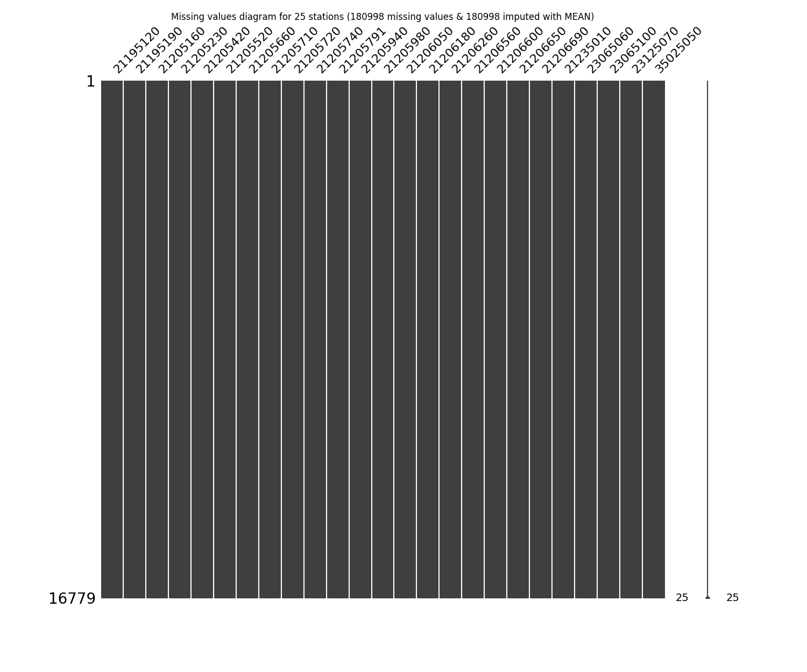
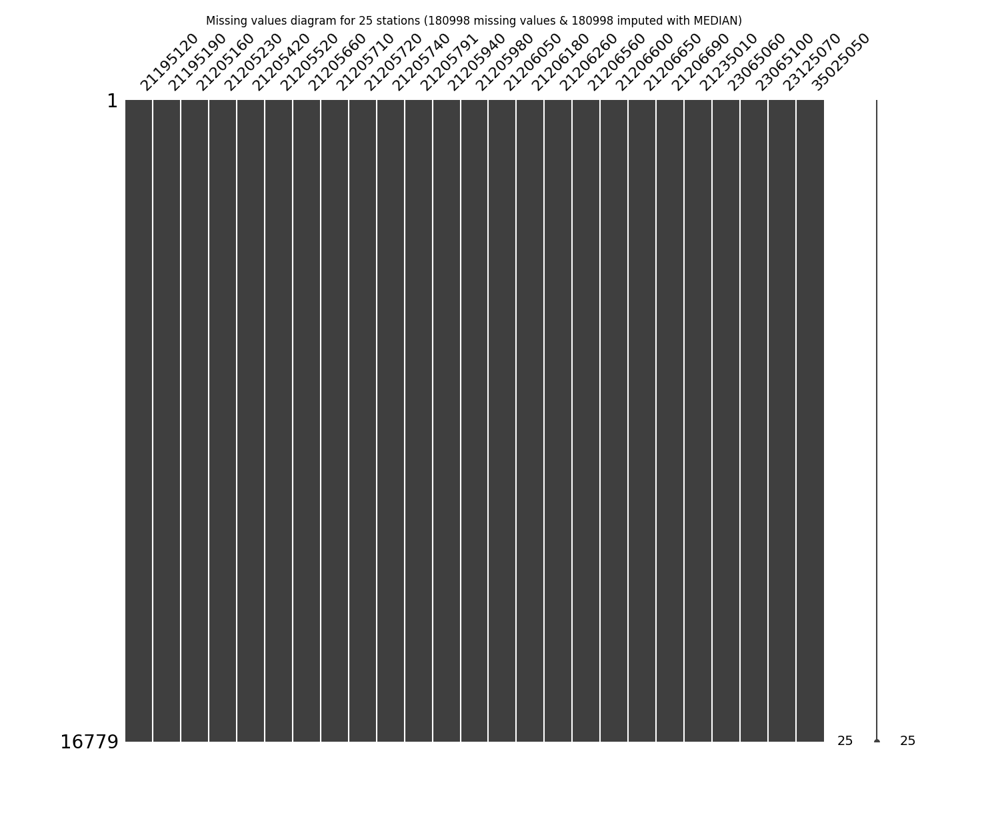
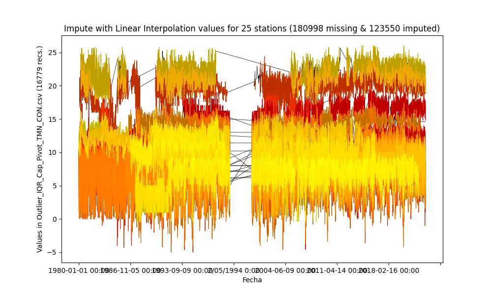

# Impute missing values in time series through statistical methods

* Processed file: [C:/JLGC/R.LTWB/.datasets/IDEAM_Outlier/Outlier_IQR_Cap_Pivot_TMN_CON.csv](../IDEAM_Outlier/Outlier_IQR_Cap_Pivot_TMN_CON.csv)
* Execution date: 2023-09-23 11:33:44.902072
* Python version: 3.11.5 (tags/v3.11.5:cce6ba9, Aug 24 2023, 14:38:34) [MSC v.1936 64 bit (AMD64)]
* Python path: ['C:\\JLGC\\R.LTWB\\.src', 'C:\\Python311\\python311.zip', 'C:\\Python311\\DLLs', 'C:\\Python311\\Lib', 'C:\\Python311']
* matplotlib version: 3.6.0
* pandas version: 2.1.0
* numpy version: 1.25.2
* missingno version: 0.5.2
* sklearn version: 1.3.0
* Stations exclude: ['21185040', '21190110', '21190170', '21190360', '21190430', '21190440', '21190450', '21195080', '21200040', '21200170', '21200390', '21200440', '21200500', '21200580', '21200590', '21200610', '21200650', '21200660', '21200700', '21200710', '21200720', '21200800', '21200830', '21201090', '21201130', '21201150', '21201290', '21201380', '21201620', '21201670', '21201680', '21201690', '21201700', '21201720', '21201730', '21201740', '21201750', '21201760', '21201780', '21201790', '21201810', '21201820', '21201830', '21201840', '21201870', '21202100', '21205012', '21205090', '21205300', '21205340', '21205360', '21205370', '21205450', '21205470', '21205540', '21205550', '21205580', '21205670', '21205700', '21205750', '21205770', '21205910', '21205970', '21206070', '21206100', '21206160', '21206190', '21206200', '21206230', '21206280', '21206310', '21206350', '21206390', '21206410', '21206460', '21206500', '21206510', '21206550', '21206570', '21206610', '21206620', '21206630', '21206640', '21206660', '21206670', '21206680', '21206700', '21206970', '21230080', '21255080', '21255160', '23010140', '23060040', '23060070', '23060080', '23060130', '23060210', '23060220', '23060250', '23060300', '23060310', '23060320', '23065120', '23065140', '23065150', '23065200', '23125170', '24010330', '24010380', '24010490', '24015380', '35020080', '35020090', '35020370', '35025060', '35035030', '35035040', '35035050', '35060010', '35060280', '35065010', '35067050', '35070160']
* Stations include: ['35070110']
* Print table sample: True
* Instructions & script: https://github.com/rcfdtools/R.LTWB/tree/main/Section03/Impute
* License: https://github.com/rcfdtools/R.LTWB/blob/main/LICENSE.md
* Credits: r.cfdtools@gmail.com

## General dataframe information with 16779 IDEAM records for 25 stations

Dataframe records head sample

| Fecha            |   21195120 |   21195190 |   21205160 |   21205230 |   21205420 |   21205520 |   21205660 |   21205710 |   21205720 |   21205740 |   21205791 |   21205940 |   21205980 |   21206050 |   21206180 |   21206260 |   21206560 |   21206600 |   21206650 |   21206690 |   21235010 |   23065060 |   23065100 |   23125070 |   35025050 |
|:-----------------|-----------:|-----------:|-----------:|-----------:|-----------:|-----------:|-----------:|-----------:|-----------:|-----------:|-----------:|-----------:|-----------:|-----------:|-----------:|-----------:|-----------:|-----------:|-----------:|-----------:|-----------:|-----------:|-----------:|-----------:|-----------:|
| 1980-01-01 00:00 |        nan |        nan |        nan |        nan |        6.8 |        8   |        nan |       10.4 |        8.2 |       10.4 |        8   |        3.4 |      nan   |        nan |        nan |        nan |        nan |        nan |        nan |        nan |        nan |        nan |        nan |       12.4 |        nan |
| 1980-01-02 00:00 |        nan |        nan |        nan |        nan |       10.4 |        8.8 |        nan |        9.4 |        9.8 |      nan   |       10.5 |        4   |        6.2 |        nan |        nan |        nan |        nan |        nan |        nan |        nan |        nan |        nan |        nan |       12   |        nan |
| 1980-01-03 00:00 |        nan |        nan |        nan |        nan |        5   |        6.8 |        nan |        6.8 |        6.2 |       10.2 |        7.4 |      nan   |        3.8 |        nan |        nan |        nan |        nan |        nan |        nan |        nan |        nan |        nan |        nan |       11.4 |        nan |

Dataframe records tail sample

| Fecha            |   21195120 |   21195190 |   21205160 |   21205230 |   21205420 |   21205520 |   21205660 |   21205710 |   21205720 |   21205740 |   21205791 |   21205940 |   21205980 |   21206050 |   21206180 |   21206260 |   21206560 |   21206600 |   21206650 |   21206690 |   21235010 |   23065060 |   23065100 |   23125070 |   35025050 |
|:-----------------|-----------:|-----------:|-----------:|-----------:|-----------:|-----------:|-----------:|-----------:|-----------:|-----------:|-----------:|-----------:|-----------:|-----------:|-----------:|-----------:|-----------:|-----------:|-----------:|-----------:|-----------:|-----------:|-----------:|-----------:|-----------:|
| 2022-12-28 00:00 |       15.4 |       10.2 |        nan |        nan |        1.4 |        nan |       19   |        5.6 |        3.8 |        4.2 |        nan |        2   |        5.2 |        nan |        nan |        nan |        nan |        4.6 |        5.2 |        nan |       19   |        nan |        nan |        nan |        nan |
| 2022-12-29 00:00 |       17   |       10.6 |        nan |        nan |        4.2 |        nan |       20.2 |        9.6 |        5.4 |        5   |        nan |        8.2 |        8.6 |        nan |        nan |        nan |        nan |        7.2 |        4.8 |        nan |       20.2 |        nan |        nan |        nan |        nan |
| 2022-12-30 00:00 |       17   |       11   |        nan |        nan |        4.8 |        nan |       20.6 |       10   |        6   |        6   |        nan |        5.6 |        6   |        nan |        nan |        nan |        nan |        8.4 |        4.5 |        nan |       21.2 |        nan |        nan |        nan |        nan |

Datatypes for station and nulls values in the initial file
|       | 21195120   | 21195190   | 21205160   | 21205230   | 21205420   | 21205520   | 21205660   | 21205710   | 21205720   | 21205740   | 21205791   | 21205940   | 21205980   | 21206050   | 21206180   | 21206260   | 21206560   | 21206600   | 21206650   | 21206690   | 21235010   | 23065060   | 23065100   | 23125070   | 35025050   |
|:------|:-----------|:-----------|:-----------|:-----------|:-----------|:-----------|:-----------|:-----------|:-----------|:-----------|:-----------|:-----------|:-----------|:-----------|:-----------|:-----------|:-----------|:-----------|:-----------|:-----------|:-----------|:-----------|:-----------|:-----------|:-----------|
| Dtype | float64    | float64    | float64    | float64    | float64    | float64    | float64    | float64    | float64    | float64    | float64    | float64    | float64    | float64    | float64    | float64    | float64    | float64    | float64    | float64    | float64    | float64    | float64    | float64    | float64    |
| Nulls | 7905       | 3006       | 13886      | 13024      | 1780       | 11439      | 3501       | 5207       | 3927       | 3183       | 3653       | 3544       | 1419       | 9236       | 6157       | 6983       | 10500      | 10688      | 11686      | 11861      | 7426       | 9221       | 7219       | 9742       | 4805       |

General statistics table - Initial file

|          |   count |     mean |      std |       min |   25% |   50% |   75% |     max |
|---------:|--------:|---------:|---------:|----------:|------:|------:|------:|--------:|
| 21195120 |    8874 | 16.2723  | 1.23886  | 11.4      |  15.4 |  16.4 |  17.2 | 20      |
| 21195190 |   13773 | 11.3941  | 1.4873   |  5.6      |  10.4 |  11.6 |  12.4 | 15.4    |
| 21205160 |    2893 |  8.22713 | 3.45499  |  0        |   6   |   8   |  10.1 | 18.2    |
| 21205230 |    3755 |  8.89124 | 2.35317  |  0        |   7.5 |   9.6 |  10.6 | 17.3089 |
| 21205420 |   14999 |  6.96676 | 2.79456  | -5        |   5   |   7.4 |   9.2 | 13.2    |
| 21205520 |    5340 |  7.26217 | 2.76932  | -4.2      |   5.5 |   7.8 |   9.4 | 13      |
| 21205660 |   13278 | 19.6251  | 2.10935  | 12.0046   |  19.1 |  20   |  21   | 24.4    |
| 21205710 |   11572 |  8.90233 | 1.93339  |  1.4      |   7.6 |   9   |  10.2 | 14.6    |
| 21205720 |   12852 |  7.14088 | 1.76482  |  0        |   6   |   7.2 |   8.4 | 12.2    |
| 21205740 |   13596 |  7.99895 | 2.37505  | -2        |   6.4 |   8.6 |  10   | 15.8    |
| 21205791 |   13126 |  8.04905 | 2.51251  | -2        |   6.6 |   8.6 |   9.9 | 13.2    |
| 21205940 |   13235 |  6.65414 | 2.71181  | -3.2      |   4.8 |   7   |   8.8 | 13.8    |
| 21205980 |   15360 |  7.16587 | 2.95606  | -5        |   5.3 |   7.6 |   9.5 | 13.3    |
| 21206050 |    7543 |  8.04743 | 2.29853  | -1.4      |   6.6 |   8.6 |   9.8 | 13.4    |
| 21206180 |   10622 | 14.2341  | 0.980303 | 10.5      |  13.6 |  14.3 |  14.8 | 17.6    |
| 21206260 |    9796 |  7.48746 | 2.31292  | -0.77335  |   6.2 |   7.8 |   9.2 | 13.2    |
| 21206560 |    6279 | 10.298   | 1.94552  |  2.8      |   9.2 |  10.6 |  11.8 | 15      |
| 21206600 |    6091 |  8.10153 | 2.15195  | -0.4      |   6.8 |   8.4 |   9.8 | 13.6    |
| 21206650 |    5093 |  6.59672 | 1.60985  |  0.2      |   5.4 |   6.8 |   7.8 | 13      |
| 21206690 |    4918 |  8.44897 | 2.20111  |  0.586031 |   7.6 |   9   |   9.8 | 13.6    |
| 21235010 |    9353 | 22.1203  | 1.43296  | 17.2      |  21.2 |  22.4 |  23.2 | 26      |
| 23065060 |    7558 | 12.5427  | 1.14852  |  8.2      |  11.8 |  12.6 |  13.4 | 16.6536 |
| 23065100 |    9560 |  9.81225 | 1.17774  |  4.8      |   9.1 |  10   |  10.6 | 13.8    |
| 23125070 |    7037 | 11.8886  | 1.41454  |  6.4      |  11   |  12   |  13   | 16.2    |
| 35025050 |   11974 |  6.56303 | 1.95256  | -0.394235 |   6   |   7   |   8   | 10.4    |

## Method 1 - Imputing with mean values
According to this technique, the missing values are imputed using the mean value in each feature and the serie has been completed filled.

Imputed file: [Impute_Mean_Outlier_IQR_Cap_Pivot_TMN_CON.csv](Impute_Mean_Outlier_IQR_Cap_Pivot_TMN_CON.csv)

General statistics table - Imputed file

|          |   count |     mean |      std |       min |      25% |      50% |      75% |     max |
|---------:|--------:|---------:|---------:|----------:|---------:|---------:|---------:|--------:|
| 21195120 |   16779 | 16.2723  | 0.900922 | 11.4      | 16.2     | 16.2723  | 16.4     | 20      |
| 21195190 |   16779 | 11.3941  | 1.34749  |  5.6      | 10.8     | 11.3941  | 12.2     | 15.4    |
| 21205160 |   16779 |  8.22713 | 1.43442  |  0        |  8.22713 |  8.22713 |  8.22713 | 18.2    |
| 21205230 |   16779 |  8.89124 | 1.11309  |  0        |  8.89124 |  8.89124 |  8.89124 | 17.3089 |
| 21205420 |   16779 |  6.96676 | 2.64216  | -5        |  5.4     |  6.96676 |  9       | 13.2    |
| 21205520 |   16779 |  7.26217 | 1.56219  | -4.2      |  7.26217 |  7.26217 |  7.26217 | 13      |
| 21205660 |   16779 | 19.6251  | 1.87642  | 12.0046   | 19.4     | 19.6251  | 20.6     | 24.4    |
| 21205710 |   16779 |  8.90233 | 1.60559  |  1.4      |  8.4     |  8.90233 |  9.8     | 14.6    |
| 21205720 |   16779 |  7.14088 | 1.54454  |  0        |  6.4     |  7.14088 |  8       | 12.2    |
| 21205740 |   16779 |  7.99895 | 2.13792  | -2        |  7       |  7.99895 |  9.6     | 15.8    |
| 21205791 |   16779 |  8.04905 | 2.22222  | -2        |  7.3     |  8.04905 |  9.6     | 13.2    |
| 21205940 |   16779 |  6.65414 | 2.40843  | -3.2      |  5.4     |  6.65414 |  8.2     | 13.8    |
| 21205980 |   16779 |  7.16587 | 2.8283   | -5        |  5.6     |  7.2     |  9.3     | 13.3    |
| 21206050 |   16779 |  8.04743 | 1.54107  | -1.4      |  8.04743 |  8.04743 |  8.2     | 13.4    |
| 21206180 |   16779 | 14.2341  | 0.779961 | 10.5      | 14.1     | 14.2341  | 14.6     | 17.6    |
| 21206260 |   16779 |  7.48746 | 1.76723  | -0.77335  |  7.2     |  7.48746 |  8.2     | 13.2    |
| 21206560 |   16779 | 10.298   | 1.19008  |  2.8      | 10.298   | 10.298   | 10.298   | 15      |
| 21206600 |   16779 |  8.10153 | 1.29649  | -0.4      |  8.10153 |  8.10153 |  8.10153 | 13.6    |
| 21206650 |   16779 |  6.59672 | 0.88687  |  0.2      |  6.59672 |  6.59672 |  6.59672 | 13      |
| 21206690 |   16779 |  8.44897 | 1.19158  |  0.586031 |  8.44897 |  8.44897 |  8.44897 | 13.6    |
| 21235010 |   16779 | 22.1203  | 1.06983  | 17.2      | 22.1203  | 22.1203  | 22.4     | 26      |
| 23065060 |   16779 | 12.5427  | 0.770805 |  8.2      | 12.5427  | 12.5427  | 12.5427  | 16.6536 |
| 23065100 |   16779 |  9.81225 | 0.888967 |  4.8      |  9.8     |  9.81225 | 10.1     | 13.8    |
| 23125070 |   16779 | 11.8886  | 0.916029 |  6.4      | 11.8886  | 11.8886  | 11.8886  | 16.2    |
| 35025050 |   16779 |  6.56303 | 1.64944  | -0.394235 |  6.4     |  6.56303 |  7.6     | 10.4    |

## Method 2 - Imputing with median values
According to this technique, the missing values are imputed using the median value in each feature and the serie has been completed filled.

Imputed file: [Impute_Median_Outlier_IQR_Cap_Pivot_TMN_CON.csv](Impute_Median_Outlier_IQR_Cap_Pivot_TMN_CON.csv)

General statistics table - Imputed file

|          |   count |     mean |      std |       min |   25% |   50% |   75% |     max |
|---------:|--------:|---------:|---------:|----------:|------:|------:|------:|--------:|
| 21195120 |   16779 | 16.3325  | 0.903173 | 11.4      |  16.2 |  16.4 |  16.4 | 20      |
| 21195190 |   16779 | 11.431   | 1.3498   |  5.6      |  10.8 |  11.6 |  12.2 | 15.4    |
| 21205160 |   16779 |  8.03916 | 1.43698  |  0        |   8   |   8   |   8   | 18.2    |
| 21205230 |   16779 |  9.44139 | 1.15162  |  0        |   9.6 |   9.6 |   9.6 | 17.3089 |
| 21205420 |   16779 |  7.01272 | 2.64553  | -5        |   5.4 |   7.4 |   9   | 13.2    |
| 21205520 |   16779 |  7.62883 | 1.58215  | -4.2      |   7.8 |   7.8 |   7.8 | 13      |
| 21205660 |   16779 | 19.7034  | 1.88259  | 12.0046   |  19.4 |  20   |  20.6 | 24.4    |
| 21205710 |   16779 |  8.93264 | 1.60623  |  1.4      |   8.4 |   9   |   9.8 | 14.6    |
| 21205720 |   16779 |  7.15472 | 1.54475  |  0        |   6.4 |   7.2 |   8   | 12.2    |
| 21205740 |   16779 |  8.11297 | 2.15087  | -2        |   7   |   8.6 |   9.6 | 15.8    |
| 21205791 |   16779 |  8.169   | 2.23382  | -2        |   7.3 |   8.6 |   9.6 | 13.2    |
| 21205940 |   16779 |  6.72719 | 2.41257  | -3.2      |   5.4 |   7   |   8.2 | 13.8    |
| 21205980 |   16779 |  7.20259 | 2.83087  | -5        |   5.6 |   7.6 |   9.3 | 13.3    |
| 21206050 |   16779 |  8.35159 | 1.5654   | -1.4      |   8.6 |   8.6 |   8.6 | 13.4    |
| 21206180 |   16779 | 14.2583  | 0.780609 | 10.5      |  14.1 |  14.3 |  14.6 | 17.6    |
| 21206260 |   16779 |  7.61753 | 1.77393  | -0.77335  |   7.2 |   7.8 |   8.2 | 13.2    |
| 21206560 |   16779 | 10.487   | 1.19902  |  2.8      |  10.6 |  10.6 |  10.6 | 15      |
| 21206600 |   16779 |  8.29165 | 1.30441  | -0.4      |   8.4 |   8.4 |   8.4 | 13.6    |
| 21206650 |   16779 |  6.7383  | 0.891782 |  0.2      |   6.8 |   6.8 |   6.8 | 13      |
| 21206690 |   16779 |  8.83849 | 1.21769  |  0.586031 |   9   |   9   |   9   | 13.6    |
| 21235010 |   16779 | 22.2441  | 1.07882  | 17.2      |  22.2 |  22.4 |  22.4 | 26      |
| 23065060 |   16779 | 12.5742  | 0.771331 |  8.2      |  12.6 |  12.6 |  12.6 | 16.6536 |
| 23065100 |   16779 |  9.89303 | 0.893815 |  4.8      |   9.8 |  10   |  10.1 | 13.8    |
| 23125070 |   16779 | 11.9533  | 0.917677 |  6.4      |  12   |  12   |  12   | 16.2    |
| 35025050 |   16779 |  6.68817 | 1.66122  | -0.394235 |   6.4 |   7   |   7.6 | 10.4    |

## Method 3 - Imputing with Last Observation Carried Forward (LOCF) values
According to this technique, the missing values are imputed using the immediate values before it in the time series and the missing values at the start are not filled but the series are completed fillet to the end.

Imputed file: [Impute_LOCF_Outlier_IQR_Cap_Pivot_TMN_CON.csv](Impute_LOCF_Outlier_IQR_Cap_Pivot_TMN_CON.csv)

General statistics table - Imputed file

|          |   count |     mean |      std |       min |   25% |   50% |   75% |     max |
|---------:|--------:|---------:|---------:|----------:|------:|------:|------:|--------:|
| 21195120 |   11757 | 16.1724  | 1.18822  | 11.4      |  15.2 |  16.2 |  17   | 20      |
| 21195190 |   16719 | 11.4561  | 1.85445  |  5.6      |  10.4 |  11.6 |  12.6 | 15.4    |
| 21205160 |   15683 |  8.03636 | 1.49465  |  0        |   8   |   8   |   8   | 18.2    |
| 21205230 |   16719 |  9.69901 | 1.60827  |  0        |  10.2 |  10.2 |  10.2 | 17.3089 |
| 21205420 |   16779 |  6.94344 | 2.72814  | -5        |   5.4 |   7.1 |   9   | 13.2    |
| 21205520 |   16779 |  7.20583 | 1.67055  | -4.2      |   7.2 |   7.2 |   7.2 | 13      |
| 21205660 |   16748 | 19.581   | 2.00146  | 12.0046   |  19   |  20   |  20.8 | 24.4    |
| 21205710 |   16779 |  8.77868 | 2.02338  |  1.4      |   7.6 |   9   |  10.2 | 14.6    |
| 21205720 |   16779 |  6.91431 | 1.74539  |  0        |   6   |   6.8 |   8.2 | 12.2    |
| 21205740 |   16779 |  8.25098 | 2.28476  | -2        |   7   |   9   |  10   | 15.8    |
| 21205791 |   16779 |  7.56838 | 2.53202  | -2        |   5.2 |   8.1 |   9.6 | 13.2    |
| 21205940 |   16779 |  6.69543 | 2.55254  | -3.2      |   5   |   7   |   8.6 | 13.8    |
| 21205980 |   16778 |  7.03696 | 2.91257  | -5        |   5.4 |   7.4 |   9.4 | 13.3    |
| 21206050 |   15129 |  7.26757 | 1.82544  | -1.4      |   6.4 |   6.4 |   8.6 | 13.4    |
| 21206180 |   14375 | 14.1251  | 1.00917  | 10.5      |  13.5 |  14.2 |  14.8 | 17.6    |
| 21206260 |   13033 |  7.5385  | 2.23188  | -0.77335  |   6.2 |   7.6 |   9.2 | 13.2    |
| 21206560 |    9959 | 10.2351  | 1.96829  |  2.8      |   8.8 |  10.8 |  11.8 | 15      |
| 21206600 |    7669 |  7.28992 | 3.11883  | -0.4      |   5.8 |   8   |   9.8 | 13.6    |
| 21206650 |    7426 |  6.75859 | 1.47113  |  0.2      |   5.8 |   7.1 |   8   | 13      |
| 21206690 |    7457 |  7.59002 | 2.85577  |  0.586031 |   6   |   8.4 |   9.8 | 13.6    |
| 21235010 |   16688 | 22.6343  | 1.98308  | 17.2      |  21   |  22.6 |  24.6 | 26      |
| 23065060 |   13362 | 12.3115  | 1.21074  |  8.2      |  11   |  12.4 |  13   | 16.6536 |
| 23065100 |   14252 |  9.92277 | 1.25301  |  4.8      |   9.1 |  10.1 |  11.2 | 13.8    |
| 23125070 |   16779 | 11.6074  | 0.952371 |  6.4      |  11.4 |  11.4 |  11.8 | 16.2    |
| 35025050 |   14041 |  6.60983 | 1.83861  | -0.394235 |   6   |   7   |   7.8 | 10.4    |

## Method 4 - Imputing with Next Observation Carried Backward (NOCB) values
According to this technique, the missing values are imputed using the immediate values after it in the time series and the missing values at the end are not filled but the series are completed fillet to the start.

Imputed file: [Impute_NOCB_Outlier_IQR_Cap_Pivot_TMN_CON.csv](Impute_NOCB_Outlier_IQR_Cap_Pivot_TMN_CON.csv)

General statistics table - Imputed file

|          |   count |     mean |     std |       min |   25% |   50% |   75% |     max |
|---------:|--------:|---------:|--------:|----------:|------:|------:|------:|--------:|
| 21195120 |   16779 | 16.7706  | 1.5134  | 11.4      |  16   |  17   |  18.2 | 20      |
| 21195190 |   16779 | 11.5083  | 1.67956 |  5.6      |  10.4 |  11.6 |  12.6 | 15.4    |
| 21205160 |    4018 |  8.77661 | 3.08813 |  0        |   7   |   9.8 |  10.3 | 18.2    |
| 21205230 |    5073 |  9.02831 | 2.40704 |  0        |   7.8 |   9.4 |  10.8 | 17.3089 |
| 21205420 |   16779 |  7.03094 | 2.70064 | -5        |   5.4 |   7.6 |   9   | 13.2    |
| 21205520 |    6022 |  6.98662 | 2.86199 | -4.2      |   4.8 |   7.4 |   9.4 | 13      |
| 21205660 |   16779 | 19.8046  | 1.99733 | 12.0046   |  19.2 |  20.2 |  21   | 24.4    |
| 21205710 |   16779 |  9.03217 | 1.95944 |  1.4      |   7.4 |   9.2 |  10.8 | 14.6    |
| 21205720 |   16779 |  7.17548 | 1.80084 |  0        |   6   |   7   |   8.6 | 12.2    |
| 21205740 |   16779 |  7.88229 | 2.41688 | -2        |   6.2 |   8.2 |   9.8 | 15.8    |
| 21205791 |   14528 |  8.14758 | 2.4321  | -2        |   6.8 |   8.8 |   9.8 | 13.2    |
| 21205940 |   16779 |  6.61209 | 2.77683 | -3.2      |   5   |   6.6 |   9   | 13.8    |
| 21205980 |   16779 |  7.1297  | 2.85776 | -5        |   5.5 |   7.4 |   9.4 | 13.3    |
| 21206050 |   10936 |  7.66439 | 2.44947 | -1.4      |   5.4 |   7.4 |   9.6 | 13.4    |
| 21206180 |   16535 | 14.0023  | 1.0219  | 10.5      |  13.3 |  14.1 |  14.6 | 17.6    |
| 21206260 |   16765 |  7.40711 | 2.03854 | -0.77335  |   6.2 |   8.2 |   8.4 | 13.2    |
| 21206560 |   16756 | 10.5884  | 1.842   |  2.8      |   9.4 |  11.8 |  11.8 | 15      |
| 21206600 |   16779 |  7.9159  | 1.43479 | -0.4      |   7.6 |   7.6 |   8.2 | 13.6    |
| 21206650 |   16779 |  8.58445 | 1.94615 |  0.2      |   7.2 |  10   |  10   | 13      |
| 21206690 |   16767 |  5.49021 | 2.58469 |  0.586031 |   3.8 |   3.8 |   8   | 13.6    |
| 21235010 |   16779 | 22.218   | 1.23417 | 17.2      |  21.8 |  22   |  22.8 | 26      |
| 23065060 |   13736 | 13.0799  | 1.29411 |  8.2      |  12.2 |  13   |  14.6 | 16.6536 |
| 23065100 |   14314 | 10.058   | 1.19467 |  4.8      |   9.2 |  10.1 |  11.2 | 13.8    |
| 23125070 |    7080 | 11.8924  | 1.41624 |  6.4      |  11   |  12   |  13   | 16.2    |
| 35025050 |   16445 |  6.27698 | 1.961   | -0.394235 |   4.4 |   7   |   8   | 10.4    |

## Method 5 - Impute missing values with Linear Interpolation values
According to this technique, the missing values are imputed using the linear interpolation between knowing pair values in the time series and the missing values at the start are not filled but the series are completed fillet to the end.

Imputed file: [Impute_InterpolateLinear_Outlier_IQR_Cap_Pivot_TMN_CON.csv](Impute_InterpolateLinear_Outlier_IQR_Cap_Pivot_TMN_CON.csv)

General statistics table - Imputed file

|          |   count |     mean |      std |       min |      25% |      50% |      75% |     max |
|---------:|--------:|---------:|---------:|----------:|---------:|---------:|---------:|--------:|
| 21195120 |   11757 | 16.1662  | 1.26928  | 11.4      | 15.2     | 16.2     | 17.125   | 20      |
| 21195190 |   16719 | 11.4831  | 1.74194  |  5.6      | 10.4     | 11.6     | 12.6     | 15.4    |
| 21205160 |   15683 |  8.0373  | 1.49292  |  0        |  8       |  8       |  8       | 18.2    |
| 21205230 |   16719 |  9.77425 | 1.40331  |  0        | 10.2     | 10.2     | 10.2     | 17.3089 |
| 21205420 |   16779 |  6.98719 | 2.68699  | -5        |  5.4     |  7.2     |  9       | 13.2    |
| 21205520 |   16779 |  7.16462 | 1.63866  | -4.2      |  7.2     |  7.2     |  7.2     | 13      |
| 21205660 |   16748 | 19.6956  | 1.96363  | 12.0046   | 19.2     | 20       | 20.8     | 24.4    |
| 21205710 |   16779 |  8.90542 | 1.90917  |  1.4      |  7.6589  |  9.2     | 10.2185  | 14.6    |
| 21205720 |   16779 |  7.0449  | 1.70209  |  0        |  6       |  7       |  8.4     | 12.2    |
| 21205740 |   16779 |  8.06664 | 2.26192  | -2        |  6.6     |  8.6     |  9.8112  | 15.8    |
| 21205791 |   16779 |  7.62001 | 2.53959  | -2        |  5.3     |  8.2     |  9.6     | 13.2    |
| 21205940 |   16779 |  6.65376 | 2.54235  | -3.2      |  5       |  6.8     |  8.6     | 13.8    |
| 21205980 |   16778 |  7.08336 | 2.87083  | -5        |  5.4     |  7.4     |  9.4     | 13.3    |
| 21206050 |   15129 |  7.36711 | 1.87126  | -1.4      |  6.4     |  6.4     |  8.6     | 13.4    |
| 21206180 |   14375 | 14.1275  | 1.01979  | 10.5      | 13.6     | 14.2     | 14.8     | 17.6    |
| 21206260 |   13033 |  7.35746 | 2.15802  | -0.77335  |  6.2     |  7.4     |  9       | 13.2    |
| 21206560 |    9959 |  9.99647 | 1.8887   |  2.8      |  8.45077 | 10.2     | 11.6     | 15      |
| 21206600 |    7669 |  7.79054 | 2.3394   | -0.4      |  6.4     |  8.03191 |  9.6     | 13.6    |
| 21206650 |    7426 |  6.78008 | 1.53548  |  0.2      |  5.8     |  7       |  7.86667 | 13      |
| 21206690 |    7457 |  7.59683 | 2.65625  |  0.586031 |  5.8     |  8.4     |  9.725   | 13.6    |
| 21235010 |   16688 | 22.4256  | 1.46457  | 17.2      | 21.4667  | 22.4857  | 23.4     | 26      |
| 23065060 |   13362 | 12.2645  | 1.16615  |  8.2      | 11       | 12.4     | 13       | 16.6536 |
| 23065100 |   14252 |  9.97018 | 1.18152  |  4.8      |  9.2     | 10.1     | 11.2     | 13.8    |
| 23125070 |   16779 | 11.6076  | 0.951527 |  6.4      | 11.4     | 11.4     | 11.8     | 16.2    |
| 35025050 |   14041 |  6.6255  | 1.86782  | -0.394235 |  6       |  7       |  7.9     | 10.4    |

## Method 6 - Impute missing values with Exponential (Weighted) Moving Average - EWM = 3
According to this technique, the missing values are imputed using the moving average values in the time series and the missing values at the start are not filled but the series are completed fillet to the end.

Imputed file: [Impute_MeanEWM_Outlier_IQR_Cap_Pivot_TMN_CON.csv](Impute_MeanEWM_Outlier_IQR_Cap_Pivot_TMN_CON.csv)

General statistics table - Imputed file

|          |   count |     mean |      std |       min |      25% |      50% |      75% |     max |
|---------:|--------:|---------:|---------:|----------:|---------:|---------:|---------:|--------:|
| 21195120 |   11757 | 16.0904  | 1.26527  | 11.4      | 15.2     | 16.2     | 17       | 20      |
| 21195190 |   16719 | 11.2571  | 1.57416  |  5.6      | 10.4     | 11.5336  | 12.2     | 15.4    |
| 21205160 |   15683 |  7.18819 | 1.56486  |  0        |  6.95383 |  6.95383 |  6.95383 | 18.2    |
| 21205230 |   16719 |  9.94613 | 1.56232  |  0        | 10.5152  | 10.5152  | 10.5152  | 17.3089 |
| 21205420 |   16779 |  6.81752 | 2.76361  | -5        |  4.6     |  7.1     |  9       | 13.2    |
| 21205520 |   16779 |  8.30315 | 1.81546  | -4.2      |  8.8     |  8.94433 |  8.94433 | 13      |
| 21205660 |   16748 | 19.5058  | 2.00399  | 12.0046   | 19       | 20       | 20.8     | 24.4    |
| 21205710 |   16779 |  8.89921 | 1.75626  |  1.4      |  7.89463 |  9.08482 | 10       | 14.6    |
| 21205720 |   16779 |  6.92631 | 1.75291  |  0        |  6       |  7       |  8.2     | 12.2    |
| 21205740 |   16779 |  8.1734  | 2.21353  | -2        |  7       |  8.8     |  9.8     | 15.8    |
| 21205791 |   16779 |  8.02391 | 2.27857  | -2        |  6.422   |  8.6651  |  9.6     | 13.2    |
| 21205940 |   16779 |  6.5896  | 2.47061  | -3.2      |  5.2     |  6.93953 |  8.4     | 13.8    |
| 21205980 |   16778 |  6.98213 | 2.91782  | -5        |  4.7     |  7.4     |  9.3     | 13.3    |
| 21206050 |   15129 |  7.52372 | 1.74393  | -1.4      |  6.8     |  7.24973 |  8.6     | 13.4    |
| 21206180 |   14375 | 14.1217  | 0.966444 | 10.5      | 13.6     | 14.2     | 14.8     | 17.6    |
| 21206260 |   13033 |  7.49845 | 2.11068  | -0.77335  |  6.31876 |  7.6     |  9       | 13.2    |
| 21206560 |    9959 | 10.0838  | 1.95486  |  2.8      |  8.8     | 10.4     | 11.6     | 15      |
| 21206600 |    7669 |  7.96677 | 2.02078  | -0.4      |  6.66949 |  8       |  9.4     | 13.6    |
| 21206650 |    7426 |  6.76963 | 1.44565  |  0.2      |  5.82665 |  7.10506 |  7.8     | 13      |
| 21206690 |    7457 |  7.56053 | 2.76192  |  0.586031 |  5.62464 |  8.46881 |  9.6     | 13.6    |
| 21235010 |   16688 | 22.37    | 1.51039  | 17.2      | 21       | 22.6     | 23.7516  | 26      |
| 23065060 |   13362 | 12.4508  | 0.981243 |  8.2      | 11.8667  | 12.4     | 13       | 16.6536 |
| 23065100 |   14252 |  9.88365 | 1.08794  |  4.8      |  9.1     | 10.1     | 10.6973  | 13.8    |
| 23125070 |   16779 | 10.8754  | 1.26503  |  6.4      | 10.1329  | 10.1329  | 11.8     | 16.2    |
| 35025050 |   14041 |  6.56537 | 1.81846  | -0.394235 |  6.03261 |  7       |  7.8     | 10.4    |

## Method 7 - Impute missing values with Natural Neigborns - KNN = 5 Imputer from Scikit Learn
According to this technique, the missing values are imputed using the natural neighbors values and the serie has been completed filled. More information in https://scikit-learn.org/stable/modules/generated/sklearn.impute.KNNImputer.html

Imputer = KNNImputer(n_neighbors=n_neighbors, weights=uniform, metric=nan_euclidean)

Imputed file: [Impute_KNN_Outlier_IQR_Cap_Pivot_TMN_CON.csv](Impute_KNN_Outlier_IQR_Cap_Pivot_TMN_CON.csv)

General statistics table - Imputed file

|          |   count |     mean |      std |       min |      25% |      50% |   75% |     max |
|---------:|--------:|---------:|---------:|----------:|---------:|---------:|------:|--------:|
| 21195120 |   16779 | 16.1257  | 1.04739  | 11.4      | 15.44    | 16.2     | 16.8  | 20      |
| 21195190 |   16779 | 11.3949  | 1.37924  |  5.6      | 10.6     | 11.4     | 12.36 | 15.4    |
| 21205160 |   16779 |  8.2854  | 2.42152  |  0        |  7       |  8.32    |  9.72 | 18.2    |
| 21205230 |   16779 |  9.3312  | 1.66885  |  0        |  8.68    |  9.6     | 10.44 | 17.3089 |
| 21205420 |   16779 |  6.98861 | 2.69161  | -5        |  5.4     |  7       |  9    | 13.2    |
| 21205520 |   16779 |  7.85539 | 2.42093  | -4.2      |  6.66    |  8.2     |  9.76 | 13      |
| 21205660 |   16779 | 19.5374  | 1.94748  | 12.0046   | 19       | 19.88    | 20.6  | 24.4    |
| 21205710 |   16779 |  8.8479  | 1.78386  |  1.4      |  7.8     |  8.90233 | 10    | 14.6    |
| 21205720 |   16779 |  7.12948 | 1.61839  |  0        |  6.04    |  7.14088 |  8.28 | 12.2    |
| 21205740 |   16779 |  7.98024 | 2.22985  | -2        |  6.6     |  8.2     |  9.8  | 15.8    |
| 21205791 |   16779 |  8.17887 | 2.3816   | -2        |  7       |  8.5     |  9.94 | 13.2    |
| 21205940 |   16779 |  6.63904 | 2.54022  | -3.2      |  5       |  6.65414 |  8.6  | 13.8    |
| 21205980 |   16779 |  7.15949 | 2.86083  | -5        |  5.4     |  7.4     |  9.4  | 13.3    |
| 21206050 |   16779 |  8.22656 | 2.04971  | -1.4      |  7.04    |  8.56    |  9.8  | 13.4    |
| 21206180 |   16779 | 14.1802  | 0.850298 | 10.5      | 13.7     | 14.2341  | 14.68 | 17.6    |
| 21206260 |   16779 |  7.37599 | 2.0511   | -0.77335  |  6.2     |  7.48746 |  8.76 | 13.2    |
| 21206560 |   16779 | 10.1059  | 1.56699  |  2.8      |  9.20068 | 10.298   | 11.16 | 15      |
| 21206600 |   16779 |  7.87864 | 1.73673  | -0.4      |  6.84    |  8.08    |  9    | 13.6    |
| 21206650 |   16779 |  6.48819 | 1.17716  |  0.2      |  5.8     |  6.59672 |  7.24 | 13      |
| 21206690 |   16779 |  7.99831 | 1.86543  |  0.586031 |  6.92    |  8.44897 |  9.4  | 13.6    |
| 21235010 |   16779 | 22.0039  | 1.19307  | 17.2      | 21.36    | 22.1203  | 22.76 | 26      |
| 23065060 |   16779 | 12.5835  | 0.910331 |  8.2      | 12.08    | 12.6     | 13.2  | 16.6536 |
| 23065100 |   16779 |  9.83824 | 1.01979  |  4.8      |  9.2     |  9.81225 | 10.44 | 13.8    |
| 23125070 |   16779 | 12.0149  | 1.08611  |  6.4      | 11.48    | 12.04    | 12.72 | 16.2    |
| 35025050 |   16779 |  6.56658 | 1.72984  | -0.394235 |  6       |  6.88    |  7.76 | 10.4    |

## Method 8 - Impute missing values with Multivariate Imputation by Chained Equation - MICE from Scikit Learn
According to this technique, the missing values are imputed using MICE values and the serie has been completed filled. More information in https://scikit-learn.org/stable/modules/generated/sklearn.impute.IterativeImputer.html

Imputer = IterativeImputer(estimator=BayesianRidge(), min_value=0, n_nearest_features=5)

Imputed file: [Impute_MICE_Outlier_IQR_Cap_Pivot_TMN_CON.csv](Impute_MICE_Outlier_IQR_Cap_Pivot_TMN_CON.csv)

General statistics table - Imputed file

|          |   count |     mean |      std |       min |      25% |      50% |      75% |     max |
|---------:|--------:|---------:|---------:|----------:|---------:|---------:|---------:|--------:|
| 21195120 |   16779 | 16.195   | 1.00104  | 11.4      | 15.636   | 16.2     | 16.8     | 20      |
| 21195190 |   16779 | 11.3919  | 1.36738  |  5.6      | 10.6     | 11.4     | 12.2     | 15.4    |
| 21205160 |   16779 |  9.48496 | 2.49803  |  0        |  8.1     |  9.66748 | 11.2349  | 18.2    |
| 21205230 |   16779 |  9.08948 | 1.47118  |  0        |  8.44835 |  9.21096 | 10.0251  | 17.3089 |
| 21205420 |   16779 |  6.98225 | 2.69356  | -5        |  5.4     |  7       |  9       | 13.2    |
| 21205520 |   16779 |  7.77692 | 2.30195  | -4.2      |  6.60465 |  8.04172 |  9.4576  | 13.2299 |
| 21205660 |   16779 | 19.6287  | 1.90568  | 12.0046   | 19.2     | 20       | 20.8     | 24.4    |
| 21205710 |   16779 |  8.88161 | 1.73386  |  1.4      |  7.96766 |  9       | 10       | 14.6    |
| 21205720 |   16779 |  7.1431  | 1.58424  |  0        |  6.2     |  7.14175 |  8.2     | 12.2    |
| 21205740 |   16779 |  7.98773 | 2.17899  | -2        |  6.8     |  8.2     |  9.8     | 15.8    |
| 21205791 |   16779 |  8.18675 | 2.3944   | -2        |  7       |  8.5     |  9.99609 | 13.2    |
| 21205940 |   16779 |  6.58678 | 2.51522  | -3.2      |  5       |  6.58338 |  8.4     | 13.8    |
| 21205980 |   16779 |  7.15797 | 2.8603   | -5        |  5.4     |  7.4     |  9.4     | 13.3    |
| 21206050 |   16779 |  8.32744 | 2.05327  | -1.4      |  7.2     |  8.6     |  9.86308 | 13.4    |
| 21206180 |   16779 | 14.1661  | 0.842356 | 10.5      | 13.7     | 14.2     | 14.6     | 17.6    |
| 21206260 |   16779 |  7.27404 | 2.11514  | -0.77335  |  6.14814 |  7.27102 |  8.66144 | 13.3894 |
| 21206560 |   16779 | 10.0633  | 1.47709  |  2.8      |  9.30245 | 10.0615  | 11       | 15      |
| 21206600 |   16779 |  7.73524 | 1.76659  | -0.4      |  6.8     |  7.77482 |  8.91637 | 13.6    |
| 21206650 |   16779 |  6.48886 | 1.01775  |  0.2      |  6.03014 |  6.50787 |  7       | 13      |
| 21206690 |   16779 |  7.81793 | 1.7207   |  0.586031 |  6.94653 |  7.85561 |  9       | 13.6    |
| 21235010 |   16779 | 22.0287  | 1.14509  | 17.2      | 21.45    | 22.0281  | 22.6     | 26      |
| 23065060 |   16779 | 12.592   | 0.892711 |  8.2      | 12.1421  | 12.6     | 13.1727  | 16.6536 |
| 23065100 |   16779 |  9.89221 | 1.02551  |  4.8      |  9.24916 |  9.9258  | 10.5513  | 13.8    |
| 23125070 |   16779 | 12.008   | 0.991049 |  6.4      | 11.6008  | 12.0764  | 12.5371  | 16.2    |
| 35025050 |   16779 |  6.47995 | 1.69987  | -0.394235 |  5.96751 |  6.68048 |  7.6     | 10.4    |

Complementary report with individual graphs for stations in [Impute_Station_Outlier_IQR_Cap_Pivot_TMN_CON.csv.md](Impute_Station_Outlier_IQR_Cap_Pivot_TMN_CON.csv.md)

> As you notice, some of the techniques showed above can`t fill complete the missing values at the start or at the end, however, you can first choice a method and then apply another complementary method for get full filled the missin values.
