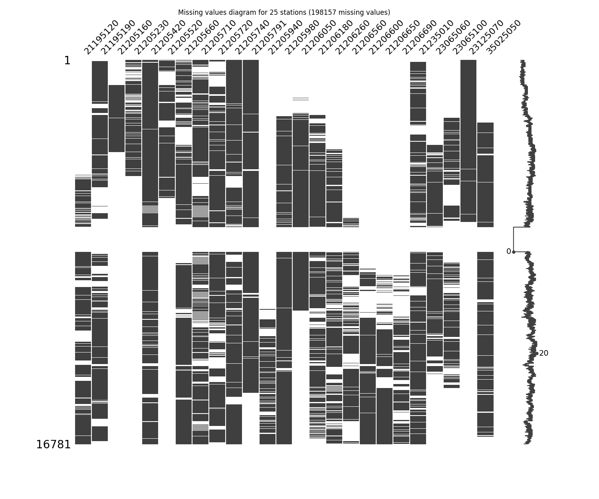

# Impute missing values in time series through statistical methods

* Processed file: [C:/JLGC/R.LTWB/.datasets/IDEAM_Outlier/Outlier_IQR_Cap_Pivot_TMX_CON.csv](../IDEAM_Outlier/Outlier_IQR_Cap_Pivot_TMX_CON.csv)
* Execution date: 2023-09-23 11:10:07.538250
* Python version: 3.11.5 (tags/v3.11.5:cce6ba9, Aug 24 2023, 14:38:34) [MSC v.1936 64 bit (AMD64)]
* Python path: ['C:\\JLGC\\R.LTWB\\.src', 'C:\\Python311\\python311.zip', 'C:\\Python311\\DLLs', 'C:\\Python311\\Lib', 'C:\\Python311']
* matplotlib version: 3.6.0
* pandas version: 2.1.0
* numpy version: 1.25.2
* missingno version: 0.5.2
* sklearn version: 1.3.0
* Stations exclude: ['21185040', '21190110', '21190170', '21190360', '21190430', '21190440', '21190450', '21195080', '21200040', '21200170', '21200390', '21200440', '21200500', '21200580', '21200590', '21200610', '21200650', '21200660', '21200700', '21200710', '21200720', '21200800', '21200830', '21201090', '21201130', '21201150', '21201290', '21201380', '21201620', '21201670', '21201680', '21201690', '21201700', '21201720', '21201730', '21201740', '21201750', '21201760', '21201780', '21201790', '21201810', '21201820', '21201830', '21201840', '21201870', '21202100', '21205012', '21205090', '21205300', '21205340', '21205360', '21205370', '21205450', '21205470', '21205540', '21205550', '21205580', '21205670', '21205700', '21205750', '21205770', '21205910', '21205970', '21206070', '21206100', '21206160', '21206190', '21206200', '21206230', '21206280', '21206310', '21206350', '21206390', '21206410', '21206460', '21206500', '21206510', '21206550', '21206570', '21206610', '21206620', '21206630', '21206640', '21206660', '21206670', '21206680', '21206700', '21206970', '21230080', '21255080', '21255160', '23010140', '23060040', '23060070', '23060080', '23060130', '23060210', '23060220', '23060250', '23060300', '23060310', '23060320', '23065120', '23065140', '23065150', '23065200', '23125170', '24010330', '24010380', '24010490', '24015380', '35020080', '35020090', '35020370', '35025060', '35035030', '35035040', '35035050', '35060010', '35060280', '35065010', '35067050', '35070160']
* Stations include: ['35070110']
* Print table sample: True
* Instructions & script: https://github.com/rcfdtools/R.LTWB/tree/main/Section03/Impute
* License: https://github.com/rcfdtools/R.LTWB/blob/main/LICENSE.md
* Credits: r.cfdtools@gmail.com

## General dataframe information with 16781 IDEAM records for 25 stations

Dataframe records head sample

| Fecha            |   21195120 |   21195190 |   21205160 |   21205230 |   21205420 |   21205520 |   21205660 |   21205710 |   21205720 |   21205740 |   21205791 |   21205940 |   21205980 |   21206050 |   21206180 |   21206260 |   21206560 |   21206600 |   21206650 |   21206690 |   21235010 |   23065060 |   23065100 |   23125070 |   35025050 |
|:-----------------|-----------:|-----------:|-----------:|-----------:|-----------:|-----------:|-----------:|-----------:|-----------:|-----------:|-----------:|-----------:|-----------:|-----------:|-----------:|-----------:|-----------:|-----------:|-----------:|-----------:|-----------:|-----------:|-----------:|-----------:|-----------:|
| 1980-01-01 00:00 |        nan |        nan |        nan |         20 |       18.6 |         19 |      nan   |       20   |       16.8 |       16.2 |       19.6 |        nan |        nan |        nan |        nan |        nan |        nan |        nan |        nan |        nan |        nan |        nan |        nan |       19.8 |        nan |
| 1980-01-02 00:00 |        nan |        nan |        nan |        nan |       19   |         19 |      nan   |       19.6 |       14.4 |       16.2 |       18.6 |        nan |        nan |        nan |        nan |        nan |        nan |        nan |        nan |        nan |        nan |        nan |        nan |       20.4 |        nan |
| 1980-01-03 00:00 |        nan |        nan |        nan |        nan |       20.2 |         20 |       30.4 |       20.4 |       16   |       17   |       20.2 |        nan |        nan |        nan |        nan |        nan |        nan |        nan |        nan |        nan |        nan |        nan |        nan |       22.6 |        nan |

Dataframe records tail sample

| Fecha            |   21195120 |   21195190 |   21205160 |   21205230 |   21205420 |   21205520 |   21205660 |   21205710 |   21205720 |   21205740 |   21205791 |   21205940 |   21205980 |   21206050 |   21206180 |   21206260 |   21206560 |   21206600 |   21206650 |   21206690 |   21235010 |   23065060 |   23065100 |   23125070 |   35025050 |
|:-----------------|-----------:|-----------:|-----------:|-----------:|-----------:|-----------:|-----------:|-----------:|-----------:|-----------:|-----------:|-----------:|-----------:|-----------:|-----------:|-----------:|-----------:|-----------:|-----------:|-----------:|-----------:|-----------:|-----------:|-----------:|-----------:|
| 2022-12-28 00:00 |       24.8 |        nan |        nan |        nan |       21.8 |        nan |       29.6 |       20.4 |        nan |       19.6 |        nan |       17.6 |       20   |        nan |        nan |        nan |        nan |       23.2 |       16.6 |        nan |       35.6 |        nan |        nan |        nan |        nan |
| 2022-12-29 00:00 |       25   |        nan |        nan |        nan |       22.2 |        nan |       30.2 |       21   |        nan |       19.2 |        nan |       17.4 |       21   |        nan |        nan |        nan |        nan |       23.2 |       16.2 |        nan |       34.8 |        nan |        nan |        nan |        nan |
| 2022-12-30 00:00 |       25.6 |        nan |        nan |        nan |       22.8 |        nan |       30.8 |       21   |        nan |       19   |        nan |       18   |       21.2 |        nan |        nan |        nan |        nan |       22.8 |       15.8 |        nan |       36.4 |        nan |        nan |        nan |        nan |

Datatypes for station and nulls values in the initial file
|       | 21195120   | 21195190   | 21205160   | 21205230   | 21205420   | 21205520   | 21205660   | 21205710   | 21205720   | 21205740   | 21205791   | 21205940   | 21205980   | 21206050   | 21206180   | 21206260   | 21206560   | 21206600   | 21206650   | 21206690   | 21235010   | 23065060   | 23065100   | 23125070   | 35025050   |
|:------|:-----------|:-----------|:-----------|:-----------|:-----------|:-----------|:-----------|:-----------|:-----------|:-----------|:-----------|:-----------|:-----------|:-----------|:-----------|:-----------|:-----------|:-----------|:-----------|:-----------|:-----------|:-----------|:-----------|:-----------|:-----------|
| Dtype | float64    | float64    | float64    | float64    | float64    | float64    | float64    | float64    | float64    | float64    | float64    | float64    | float64    | float64    | float64    | float64    | float64    | float64    | float64    | float64    | float64    | float64    | float64    | float64    | float64    |
| Nulls | 8383       | 4941       | 13889      | 12966      | 2056       | 11909      | 4023       | 5091       | 4651       | 3208       | 3659       | 12472      | 4051       | 9362       | 6478       | 7410       | 11540      | 10805      | 11810      | 12518      | 3625       | 8956       | 9607       | 9802       | 4945       |

General statistics table - Initial file

|          |   count |    mean |     std |     min |   25% |   50% |   75% |     max |
|---------:|--------:|--------:|--------:|--------:|------:|------:|------:|--------:|
| 21195120 |    8398 | 24.8841 | 1.70799 | 18.4    |  24   |  25   |  26   | 31.4678 |
| 21195190 |   11840 | 19.6258 | 1.56381 | 13.8    |  18.6 |  19.6 |  20.4 | 25.6577 |
| 21205160 |    2892 | 19.8776 | 2.31969 | 12      |  18.1 |  19.8 |  21   | 27.6    |
| 21205230 |    3815 | 19.9729 | 1.59085 | 13.8072 |  18.8 |  20   |  21   | 26.138  |
| 21205420 |   14725 | 19.6249 | 1.46954 | 13.9578 |  18.6 |  19.6 |  20.6 | 25.2913 |
| 21205520 |    4872 | 19.5167 | 1.41842 | 14.1    |  18.5 |  19.5 |  20.5 | 24.9805 |
| 21205660 |   12758 | 30.2409 | 2.01647 | 22.2    |  29   |  30.2 |  31.4 | 36.8    |
| 21205710 |   11690 | 20.3466 | 1.51044 | 14.4    |  19.4 |  20.2 |  21.4 | 26.169  |
| 21205720 |   12130 | 16.733  | 1.72841 | 10.0737 |  15.4 |  16.8 |  18   | 23.6    |
| 21205740 |   13573 | 17.14   | 1.95096 | 10.8    |  15.8 |  17.2 |  18.4 | 24      |
| 21205791 |   13122 | 19.3358 | 1.47359 | 13.6618 |  18.4 |  19.3 |  20.3 | 24.9    |
| 21205940 |    4309 | 18.4058 | 1.31904 | 12.8    |  17.6 |  18.4 |  19.4 | 24      |
| 21205980 |   12730 | 19.7305 | 1.64803 | 13.2    |  18.6 |  19.8 |  20.8 | 25.5    |
| 21206050 |    7419 | 19.7894 | 1.87419 | 14.4    |  18.5 |  19.7 |  21   | 26.6    |
| 21206180 |   10303 | 21.172  | 1.34988 | 15.6    |  20.2 |  21.2 |  22.1 | 25.6    |
| 21206260 |    9371 | 19.5754 | 1.52489 | 13.7005 |  18.6 |  19.4 |  20.4 | 25.4499 |
| 21206560 |    5241 | 20.0639 | 1.60082 | 13.6    |  19   |  20   |  21   | 25.8    |
| 21206600 |    5976 | 21.2205 | 1.59914 | 15      |  20.2 |  21.2 |  22.2 | 27.3956 |
| 21206650 |    4971 | 15.4285 | 2.04102 |  8.4    |  14   |  15   |  16.8 | 24      |
| 21206690 |    4263 | 21.52   | 1.90612 | 14.1273 |  20.2 |  21.6 |  22.8 | 29      |
| 21235010 |   13156 | 34.7281 | 2.3423  | 25.4    |  33.2 |  34.8 |  36.4 | 41.8    |
| 23065060 |    7825 | 18.8163 | 1.26161 | 14.6    |  18   |  18.8 |  19.6 | 23.6728 |
| 23065100 |    7174 | 17.7605 | 1.48513 | 12.4    |  16.8 |  17.8 |  18.8 | 22.5    |
| 23125070 |    6979 | 20.629  | 1.73556 | 14.4    |  19.6 |  20.6 |  21.6 | 27.3115 |
| 35025050 |   11836 | 13.7644 | 1.7894  |  7.4    |  12.6 |  13.8 |  15   | 20.6543 |

## Method 1 - Imputing with mean values
According to this technique, the missing values are imputed using the mean value in each feature and the serie has been completed filled.

Imputed file: [Impute_Mean_Outlier_IQR_Cap_Pivot_TMX_CON.csv](Impute_Mean_Outlier_IQR_Cap_Pivot_TMX_CON.csv)

General statistics table - Imputed file

|          |   count |    mean |      std |     min |     25% |     50% |     75% |     max |
|---------:|--------:|--------:|---------:|--------:|--------:|--------:|--------:|--------:|
| 21195120 |   16781 | 24.8841 | 1.20824  | 18.4    | 24.8841 | 24.8841 | 25      | 31.4678 |
| 21195190 |   16781 | 19.6258 | 1.31355  | 13.8    | 19      | 19.6258 | 20      | 25.6577 |
| 21205160 |   16781 | 19.8776 | 0.962849 | 12      | 19.8776 | 19.8776 | 19.8776 | 27.6    |
| 21205230 |   16781 | 19.9729 | 0.758444 | 13.8072 | 19.9729 | 19.9729 | 19.9729 | 26.138  |
| 21205420 |   16781 | 19.6249 | 1.37657  | 13.9578 | 18.8    | 19.6249 | 20.4    | 25.2913 |
| 21205520 |   16781 | 19.5167 | 0.76422  | 14.1    | 19.5167 | 19.5167 | 19.5167 | 24.9805 |
| 21205660 |   16781 | 30.2409 | 1.7582   | 22.2    | 29.6    | 30.2409 | 31      | 36.8    |
| 21205710 |   16781 | 20.3466 | 1.26065  | 14.4    | 19.8    | 20.3466 | 20.8    | 26.169  |
| 21205720 |   16781 | 16.733  | 1.46948  | 10.0737 | 16      | 16.733  | 17.4    | 23.6    |
| 21205740 |   16781 | 17.14   | 1.75458  | 10.8    | 16.2    | 17.14   | 18.2    | 24      |
| 21205791 |   16781 | 19.3358 | 1.30306  | 13.6618 | 18.6    | 19.3358 | 20      | 24.9    |
| 21205940 |   16781 | 18.4058 | 0.668343 | 12.8    | 18.4058 | 18.4058 | 18.4058 | 24      |
| 21205980 |   16781 | 19.7305 | 1.43538  | 13.2    | 19      | 19.7305 | 20.4    | 25.5    |
| 21206050 |   16781 | 19.7894 | 1.24612  | 14.4    | 19.7894 | 19.7894 | 19.7894 | 26.6    |
| 21206180 |   16781 | 21.172  | 1.05769  | 15.6    | 20.8    | 21.172  | 21.5    | 25.6    |
| 21206260 |   16781 | 19.5754 | 1.13949  | 13.7005 | 19.4    | 19.5754 | 19.6    | 25.4499 |
| 21206560 |   16781 | 20.0639 | 0.894566 | 13.6    | 20.0639 | 20.0639 | 20.0639 | 25.8    |
| 21206600 |   16781 | 21.2205 | 0.954246 | 15      | 21.2205 | 21.2205 | 21.2205 | 27.3956 |
| 21206650 |   16781 | 15.4285 | 1.11079  |  8.4    | 15.4285 | 15.4285 | 15.4285 | 24      |
| 21206690 |   16781 | 21.52   | 0.960641 | 14.1273 | 21.52   | 21.52   | 21.52   | 29      |
| 21235010 |   16781 | 34.7281 | 2.07392  | 25.4    | 33.8    | 34.7281 | 35.8    | 41.8    |
| 23065060 |   16781 | 18.8163 | 0.861478 | 14.6    | 18.8    | 18.8163 | 18.8163 | 23.6728 |
| 23065100 |   16781 | 17.7605 | 0.971002 | 12.4    | 17.7605 | 17.7605 | 17.7605 | 22.5    |
| 23125070 |   16781 | 20.629  | 1.1192   | 14.4    | 20.629  | 20.629  | 20.629  | 27.3115 |
| 35025050 |   16781 | 13.7644 | 1.50278  |  7.4    | 13      | 13.7644 | 14.4    | 20.6543 |

## Method 2 - Imputing with median values
According to this technique, the missing values are imputed using the median value in each feature and the serie has been completed filled.

Imputed file: [Impute_Median_Outlier_IQR_Cap_Pivot_TMX_CON.csv](Impute_Median_Outlier_IQR_Cap_Pivot_TMX_CON.csv)

General statistics table - Imputed file

|          |   count |    mean |      std |     min |   25% |   50% |   75% |     max |
|---------:|--------:|--------:|---------:|--------:|------:|------:|------:|--------:|
| 21195120 |   16781 | 24.942  | 1.20962  | 18.4    |  25   |  25   |  25   | 31.4678 |
| 21195190 |   16781 | 19.6182 | 1.3136   | 13.8    |  19   |  19.6 |  20   | 25.6577 |
| 21205160 |   16781 | 19.8134 | 0.963295 | 12      |  19.8 |  19.8 |  19.8 | 27.6    |
| 21205230 |   16781 | 19.9938 | 0.758529 | 13.8072 |  20   |  20   |  20   | 26.138  |
| 21205420 |   16781 | 19.6218 | 1.3766   | 13.9578 |  18.8 |  19.6 |  20.4 | 25.2913 |
| 21205520 |   16781 | 19.5049 | 0.764257 | 14.1    |  19.5 |  19.5 |  19.5 | 24.9805 |
| 21205660 |   16781 | 30.2311 | 1.75829  | 22.2    |  29.6 |  30.2 |  31   | 36.8    |
| 21205710 |   16781 | 20.3021 | 1.26245  | 14.4    |  19.8 |  20.2 |  20.8 | 26.169  |
| 21205720 |   16781 | 16.7516 | 1.46978  | 10.0737 |  16   |  16.8 |  17.4 | 23.6    |
| 21205740 |   16781 | 17.1515 | 1.75474  | 10.8    |  16.2 |  17.2 |  18.2 | 24      |
| 21205791 |   16781 | 19.328  | 1.30315  | 13.6618 |  18.6 |  19.3 |  20   | 24.9    |
| 21205940 |   16781 | 18.4015 | 0.668348 | 12.8    |  18.4 |  18.4 |  18.4 | 24      |
| 21205980 |   16781 | 19.7473 | 1.43569  | 13.2    |  19   |  19.8 |  20.4 | 25.5    |
| 21206050 |   16781 | 19.7395 | 1.24691  | 14.4    |  19.7 |  19.7 |  19.7 | 26.6    |
| 21206180 |   16781 | 21.1828 | 1.05778  | 15.6    |  20.8 |  21.2 |  21.5 | 25.6    |
| 21206260 |   16781 | 19.4979 | 1.14282  | 13.7005 |  19.4 |  19.4 |  19.6 | 25.4499 |
| 21206560 |   16781 | 20.0199 | 0.895055 | 13.6    |  20   |  20   |  20   | 25.8    |
| 21206600 |   16781 | 21.2073 | 0.954297 | 15      |  21.2 |  21.2 |  21.2 | 27.3956 |
| 21206650 |   16781 | 15.1269 | 1.12788  |  8.4    |  15   |  15   |  15   | 24      |
| 21206690 |   16781 | 21.5797 | 0.961271 | 14.1273 |  21.6 |  21.6 |  21.6 | 29      |
| 21235010 |   16781 | 34.7437 | 2.07413  | 25.4    |  33.8 |  34.8 |  35.8 | 41.8    |
| 23065060 |   16781 | 18.8076 | 0.861516 | 14.6    |  18.8 |  18.8 |  18.8 | 23.6728 |
| 23065100 |   16781 | 17.7831 | 0.971198 | 12.4    |  17.8 |  17.8 |  17.8 | 22.5    |
| 23125070 |   16781 | 20.6121 | 1.11929  | 14.4    |  20.6 |  20.6 |  20.6 | 27.3115 |
| 35025050 |   16781 | 13.7749 | 1.50287  |  7.4    |  13   |  13.8 |  14.4 | 20.6543 |

## Method 3 - Imputing with Last Observation Carried Forward (LOCF) values
According to this technique, the missing values are imputed using the immediate values before it in the time series and the missing values at the start are not filled but the series are completed fillet to the end.

Imputed file: [Impute_LOCF_Outlier_IQR_Cap_Pivot_TMX_CON.csv](Impute_LOCF_Outlier_IQR_Cap_Pivot_TMX_CON.csv)

General statistics table - Imputed file

|          |   count |    mean |      std |     min |   25% |   50% |   75% |     max |
|---------:|--------:|--------:|---------:|--------:|------:|------:|------:|--------:|
| 21195120 |   11758 | 24.6926 | 1.70829  | 18.4    |  23.2 |  24.6 |  26   | 31.4678 |
| 21195190 |   16721 | 19.4591 | 1.69716  | 13.8    |  18.2 |  19.5 |  20.4 | 25.6577 |
| 21205160 |   15685 | 22.3358 | 1.54554  | 12      |  22.9 |  22.9 |  22.9 | 27.6    |
| 21205230 |   16781 | 20.6919 | 0.995766 | 13.8072 |  21   |  21   |  21   | 26.138  |
| 21205420 |   16781 | 19.6821 | 1.42586  | 13.9578 |  18.7 |  19.8 |  20.5 | 25.2913 |
| 21205520 |   16781 | 18.9422 | 1.17899  | 14.1    |  18.8 |  18.8 |  18.8 | 24.9805 |
| 21205660 |   16779 | 30.4296 | 2.09336  | 22.2    |  29.4 |  30.4 |  32   | 36.8    |
| 21205710 |   16781 | 20.6055 | 1.62391  | 14.4    |  19.6 |  20.6 |  21.6 | 26.169  |
| 21205720 |   16781 | 16.8093 | 1.62166  | 10.0737 |  16   |  16.8 |  17.8 | 23.6    |
| 21205740 |   16781 | 16.9511 | 1.97283  | 10.8    |  15.6 |  17   |  18.4 | 24      |
| 21205791 |   16781 | 19.5986 | 1.4152   | 13.6618 |  18.6 |  19.8 |  20.8 | 24.9    |
| 21205940 |    5904 | 18.2439 | 1.30337  | 12.8    |  17.4 |  18.2 |  19   | 24      |
| 21205980 |   14316 | 19.6595 | 1.5974   | 13.2    |  18.8 |  19.6 |  20.7 | 25.5    |
| 21206050 |   15131 | 20.2453 | 1.48017  | 14.4    |  19.4 |  20.7 |  20.7 | 26.6    |
| 21206180 |   14377 | 21.0945 | 1.33472  | 15.6    |  20   |  21.2 |  22   | 25.6    |
| 21206260 |   12885 | 19.6554 | 1.5367   | 13.7005 |  18.8 |  19.4 |  20.4 | 25.4499 |
| 21206560 |    9884 | 20.4199 | 1.64557  | 13.6    |  19.4 |  20.5 |  21.5 | 25.8    |
| 21206600 |    7669 | 21.2133 | 1.4414   | 15      |  20.4 |  21   |  22   | 27.3956 |
| 21206650 |    7426 | 15.5315 | 2.14182  |  8.4    |  14.2 |  15.2 |  16.8 | 24      |
| 21206690 |    7442 | 21.8784 | 2.63799  | 14.1273 |  20   |  22   |  23.3 | 29      |
| 21235010 |   16690 | 34.6873 | 2.27712  | 25.4    |  33.4 |  34.6 |  36.4 | 41.8    |
| 23065060 |   13097 | 18.5054 | 1.1579   | 14.6    |  17.8 |  18   |  19.2 | 23.6728 |
| 23065100 |   14254 | 17.5575 | 1.27333  | 12.4    |  16.8 |  17.5 |  18.4 | 22.5    |
| 23125070 |   16781 | 22.2311 | 1.77224  | 14.4    |  21   |  23.4 |  23.4 | 27.3115 |
| 35025050 |   14042 | 13.8915 | 1.72874  |  7.4    |  12.8 |  14   |  15   | 20.6543 |

## Method 4 - Imputing with Next Observation Carried Backward (NOCB) values
According to this technique, the missing values are imputed using the immediate values after it in the time series and the missing values at the end are not filled but the series are completed fillet to the start.

Imputed file: [Impute_NOCB_Outlier_IQR_Cap_Pivot_TMX_CON.csv](Impute_NOCB_Outlier_IQR_Cap_Pivot_TMX_CON.csv)

General statistics table - Imputed file

|          |   count |    mean |      std |     min |   25% |   50% |   75% |     max |
|---------:|--------:|--------:|---------:|--------:|------:|------:|------:|--------:|
| 21195120 |   16781 | 24.6308 | 1.54211  | 18.4    |  24   |  24.2 |  25.4 | 31.4678 |
| 21195190 |   16647 | 19.4614 | 1.47336  | 13.8    |  18.2 |  19.4 |  20.2 | 25.6577 |
| 21205160 |    4018 | 21.4066 | 3.19056  | 12      |  19   |  20.8 |  25.5 | 27.6    |
| 21205230 |    5072 | 19.9464 | 1.73707  | 13.8072 |  18.8 |  20   |  21   | 26.138  |
| 21205420 |   16781 | 19.6306 | 1.43252  | 13.9578 |  18.8 |  19.6 |  20.6 | 25.2913 |
| 21205520 |    6021 | 19.7359 | 1.41168  | 14.1    |  18.7 |  19.8 |  20.8 | 24.9805 |
| 21205660 |   16781 | 30.5568 | 1.99478  | 22.2    |  29.4 |  30.8 |  32   | 36.8    |
| 21205710 |   16781 | 20.4355 | 1.54487  | 14.4    |  19.4 |  20.4 |  21.2 | 26.169  |
| 21205720 |   16699 | 16.6905 | 1.56993  | 10.0737 |  15.6 |  16.8 |  17.6 | 23.6    |
| 21205740 |   16781 | 17.4075 | 2.06478  | 10.8    |  16   |  17.6 |  18.6 | 24      |
| 21205791 |   14530 | 19.3831 | 1.4193   | 13.6618 |  18.4 |  19.4 |  20.2 | 24.9    |
| 21205940 |   16781 | 18.918  | 0.867586 | 12.8    |  19   |  19   |  19   | 24      |
| 21205980 |   16781 | 19.9497 | 1.73329  | 13.2    |  18.6 |  20   |  21.6 | 25.5    |
| 21206050 |   10938 | 20.825  | 2.44353  | 14.4    |  19   |  20.8 |  22.4 | 26.6    |
| 21206180 |   16537 | 21.3201 | 1.34286  | 15.6    |  20.4 |  21.6 |  22.2 | 25.6    |
| 21206260 |   16767 | 19.5189 | 1.2934   | 13.7005 |  19.2 |  19.2 |  20.2 | 25.4499 |
| 21206560 |   16757 | 20.3666 | 1.42091  | 13.6    |  20   |  20   |  21   | 25.8    |
| 21206600 |   16781 | 22.039  | 1.24453  | 15      |  21.8 |  22.4 |  22.4 | 27.3956 |
| 21206650 |   16781 | 18.3712 | 2.48289  |  8.4    |  16.4 |  20   |  20   | 24      |
| 21206690 |   16768 | 21.0329 | 1.63372  | 14.1273 |  20.3 |  20.3 |  21.8 | 29      |
| 21235010 |   16781 | 34.749  | 2.25718  | 25.4    |  33.2 |  34.8 |  36.2 | 41.8    |
| 23065060 |   13738 | 18.6316 | 1.25667  | 14.6    |  17.6 |  18.4 |  19.6 | 23.6728 |
| 23065100 |   14316 | 17.7735 | 1.40284  | 12.4    |  17.2 |  17.4 |  18.6 | 22.5    |
| 23125070 |    7079 | 20.6301 | 1.7348   | 14.4    |  19.6 |  20.6 |  21.6 | 27.3115 |
| 35025050 |   16446 | 13.8629 | 1.73098  |  7.4    |  13   |  13.6 |  15   | 20.6543 |

## Method 5 - Impute missing values with Linear Interpolation values
According to this technique, the missing values are imputed using the linear interpolation between knowing pair values in the time series and the missing values at the start are not filled but the series are completed fillet to the end.

Imputed file: [Impute_InterpolateLinear_Outlier_IQR_Cap_Pivot_TMX_CON.csv](Impute_InterpolateLinear_Outlier_IQR_Cap_Pivot_TMX_CON.csv)

General statistics table - Imputed file

|          |   count |    mean |      std |     min |     25% |     50% |     75% |     max |
|---------:|--------:|--------:|---------:|--------:|--------:|--------:|--------:|--------:|
| 21195120 |   11758 | 24.7965 | 1.6566   | 18.4    | 23.7001 | 24.7    | 25.8201 | 31.4678 |
| 21195190 |   16721 | 19.4672 | 1.53871  | 13.8    | 18.4    | 19.5    | 20.3422 | 25.6577 |
| 21205160 |   15685 | 22.3358 | 1.54493  | 12      | 22.9    | 22.9    | 22.9    | 27.6    |
| 21205230 |   16781 | 20.6868 | 0.97927  | 13.8072 | 21      | 21      | 21      | 26.138  |
| 21205420 |   16781 | 19.6563 | 1.41112  | 13.9578 | 18.8    | 19.8    | 20.5    | 25.2913 |
| 21205520 |   16781 | 19.039  | 0.977575 | 14.1    | 18.8    | 18.8    | 18.8    | 24.9805 |
| 21205660 |   16779 | 30.4932 | 1.99941  | 22.2    | 29.4    | 30.6    | 32      | 36.8    |
| 21205710 |   16781 | 20.5205 | 1.47865  | 14.4    | 19.6    | 20.6    | 21.4    | 26.169  |
| 21205720 |   16781 | 16.7565 | 1.57655  | 10.0737 | 15.8    | 16.8    | 17.8    | 23.6    |
| 21205740 |   16781 | 17.1793 | 1.91445  | 10.8    | 15.8    | 17.2071 | 18.4    | 24      |
| 21205791 |   16781 | 19.5859 | 1.40794  | 13.6618 | 18.6    | 19.8    | 20.8    | 24.9    |
| 21205940 |    5904 | 18.5054 | 1.25229  | 12.8    | 17.633  | 18.6    | 19.2    | 24      |
| 21205980 |   14316 | 19.6281 | 1.60686  | 13.2    | 18.6    | 19.6    | 20.6    | 25.5    |
| 21206050 |   15131 | 20.2834 | 1.44173  | 14.4    | 19.6    | 20.7    | 20.7    | 26.6    |
| 21206180 |   14377 | 21.1545 | 1.27144  | 15.6    | 20.3    | 21.2    | 22      | 25.6    |
| 21206260 |   12885 | 19.6379 | 1.45609  | 13.7005 | 18.8    | 19.4    | 20.4    | 25.4499 |
| 21206560 |    9884 | 20.5178 | 1.66974  | 13.6    | 19.6    | 20.5    | 21.5    | 25.8    |
| 21206600 |    7669 | 21.4117 | 1.53444  | 15      | 20.4    | 21.4    | 22.4    | 27.3956 |
| 21206650 |    7426 | 15.9254 | 2.19924  |  8.4    | 14.2    | 15.8    | 17.4    | 24      |
| 21206690 |    7442 | 21.9174 | 2.12303  | 14.1273 | 20.4    | 21.999  | 23.2    | 29      |
| 21235010 |   16690 | 34.7093 | 2.21713  | 25.4    | 33.3108 | 34.8    | 36.2    | 41.8    |
| 23065060 |   13097 | 18.617  | 1.14984  | 14.6    | 17.8    | 18.4    | 19.4    | 23.6728 |
| 23065100 |   14254 | 17.6233 | 1.3193   | 12.4    | 16.8    | 17.4308 | 18.5    | 22.5    |
| 23125070 |   16781 | 22.2313 | 1.77099  | 14.4    | 21      | 23.4    | 23.4    | 27.3115 |
| 35025050 |   14042 | 13.9506 | 1.76955  |  7.4    | 12.8    | 14      | 15.2    | 20.6543 |

## Method 6 - Impute missing values with Exponential (Weighted) Moving Average - EWM = 3
According to this technique, the missing values are imputed using the moving average values in the time series and the missing values at the start are not filled but the series are completed fillet to the end.

Imputed file: [Impute_MeanEWM_Outlier_IQR_Cap_Pivot_TMX_CON.csv](Impute_MeanEWM_Outlier_IQR_Cap_Pivot_TMX_CON.csv)

General statistics table - Imputed file

|          |   count |    mean |      std |     min |     25% |     50% |     75% |     max |
|---------:|--------:|--------:|---------:|--------:|--------:|--------:|--------:|--------:|
| 21195120 |   11758 | 24.7894 | 1.53905  | 18.4    | 23.9063 | 24.8    | 25.5    | 31.4678 |
| 21195190 |   16721 | 19.5492 | 1.66801  | 13.8    | 18.4    | 19.6    | 20.5467 | 25.6577 |
| 21205160 |   15685 | 21.6839 | 1.32198  | 12      | 22.0986 | 22.0986 | 22.0986 | 27.6    |
| 21205230 |   16781 | 20.119  | 0.814212 | 13.8072 | 20.1811 | 20.1811 | 20.1811 | 26.138  |
| 21205420 |   16781 | 19.6353 | 1.39361  | 13.9578 | 18.8    | 19.6    | 20.4124 | 25.2913 |
| 21205520 |   16781 | 19.1555 | 0.973115 | 14.1    | 19.0432 | 19.0432 | 19.0432 | 24.9805 |
| 21205660 |   16779 | 30.3697 | 1.88578  | 22.2    | 29.2    | 30.2    | 32      | 36.8    |
| 21205710 |   16781 | 20.4938 | 1.39815  | 14.4    | 19.6    | 20.6    | 21.4    | 26.169  |
| 21205720 |   16781 | 16.7099 | 1.57259  | 10.0737 | 16      | 16.5631 | 17.8    | 23.6    |
| 21205740 |   16781 | 17.1472 | 1.8153   | 10.8    | 16.2    | 17.2    | 18.4    | 24      |
| 21205791 |   16781 | 19.3928 | 1.32976  | 13.6618 | 18.6    | 19.5    | 20      | 24.9    |
| 21205940 |    5904 | 18.355  | 1.17909  | 12.8    | 17.5895 | 18.2457 | 19      | 24      |
| 21205980 |   14316 | 19.5991 | 1.62637  | 13.2    | 18.4    | 19.6    | 20.7    | 25.5    |
| 21206050 |   15131 | 19.6377 | 1.36188  | 14.4    | 19.3075 | 19.3075 | 20.2088 | 26.6    |
| 21206180 |   14377 | 21.1604 | 1.19789  | 15.6    | 20.5404 | 21.2    | 21.8127 | 25.6    |
| 21206260 |   12885 | 19.6196 | 1.40805  | 13.7005 | 18.8    | 19.4    | 20.4    | 25.4499 |
| 21206560 |    9884 | 20.3229 | 1.49507  | 13.6    | 19.5    | 20.5    | 21.3008 | 25.8    |
| 21206600 |    7669 | 21.1727 | 1.44088  | 15      | 20.5941 | 21      | 22      | 27.3956 |
| 21206650 |    7426 | 15.7013 | 2.07625  |  8.4    | 14.2    | 15.8    | 16.8    | 24      |
| 21206690 |    7442 | 21.7    | 2.11775  | 14.1273 | 20      | 21.8    | 23.2    | 29      |
| 21235010 |   16690 | 34.5793 | 2.24845  | 25.4    | 33.3083 | 34.6    | 36.2    | 41.8    |
| 23065060 |   13097 | 18.6061 | 1.06845  | 14.6    | 18      | 18.1646 | 19.2    | 23.6728 |
| 23065100 |   14254 | 17.899  | 1.24187  | 12.4    | 17.2243 | 18.1156 | 18.8534 | 22.5    |
| 23125070 |   16781 | 21.214  | 1.22898  | 14.4    | 21      | 21.642  | 21.642  | 27.3115 |
| 35025050 |   14042 | 13.8871 | 1.71026  |  7.4    | 12.8    | 14      | 15.1693 | 20.6543 |

## Method 7 - Impute missing values with Natural Neigborns - KNN = 5 Imputer from Scikit Learn
According to this technique, the missing values are imputed using the natural neighbors values and the serie has been completed filled. More information in https://scikit-learn.org/stable/modules/generated/sklearn.impute.KNNImputer.html

Imputer = KNNImputer(n_neighbors=n_neighbors, weights=uniform, metric=nan_euclidean)

Imputed file: [Impute_KNN_Outlier_IQR_Cap_Pivot_TMX_CON.csv](Impute_KNN_Outlier_IQR_Cap_Pivot_TMX_CON.csv)

General statistics table - Imputed file

|          |   count |    mean |      std |     min |   25% |     50% |   75% |     max |
|---------:|--------:|--------:|---------:|--------:|------:|--------:|------:|--------:|
| 21195120 |   16781 | 24.8296 | 1.43288  | 18.4    | 24    | 24.8841 | 25.6  | 31.4678 |
| 21195190 |   16781 | 19.5638 | 1.3923   | 13.8    | 18.8  | 19.6    | 20.2  | 25.6577 |
| 21205160 |   16781 | 20.5431 | 1.85667  | 12      | 19.4  | 20.32   | 21.74 | 27.6    |
| 21205230 |   16781 | 20.2679 | 1.34371  | 13.8072 | 19.5  | 20.16   | 21.16 | 26.138  |
| 21205420 |   16781 | 19.6216 | 1.40413  | 13.9578 | 18.8  | 19.6249 | 20.5  | 25.2913 |
| 21205520 |   16781 | 19.7887 | 1.26314  | 14.1    | 19    | 19.7    | 20.62 | 24.9805 |
| 21205660 |   16781 | 30.1779 | 1.83686  | 22.2    | 29.2  | 30.2409 | 31.2  | 36.8    |
| 21205710 |   16781 | 20.3092 | 1.35254  | 14.4    | 19.56 | 20.3466 | 21.16 | 26.169  |
| 21205720 |   16781 | 16.6753 | 1.57169  | 10.0737 | 15.6  | 16.733  | 17.6  | 23.6    |
| 21205740 |   16781 | 17.1488 | 1.82762  | 10.8    | 16    | 17.2    | 18.4  | 24      |
| 21205791 |   16781 | 19.4461 | 1.40095  | 13.6618 | 18.6  | 19.3358 | 20.36 | 24.9    |
| 21205940 |   16781 | 18.3079 | 0.903643 | 12.8    | 17.76 | 18.36   | 18.8  | 24      |
| 21205980 |   16781 | 19.6092 | 1.58214  | 13.2    | 18.6  | 19.7305 | 20.6  | 25.5    |
| 21206050 |   16781 | 20.0145 | 1.68783  | 14.4    | 18.88 | 19.8    | 21.08 | 26.6    |
| 21206180 |   16781 | 21.1211 | 1.16133  | 15.6    | 20.4  | 21.172  | 21.8  | 25.6    |
| 21206260 |   16781 | 19.5162 | 1.29392  | 13.7005 | 18.68 | 19.4    | 20.2  | 25.4499 |
| 21206560 |   16781 | 19.9749 | 1.16469  | 13.6    | 19.3  | 20.04   | 20.6  | 25.8    |
| 21206600 |   16781 | 21.0295 | 1.27172  | 15      | 20.2  | 21.04   | 21.8  | 27.3956 |
| 21206650 |   16781 | 15.3278 | 1.53545  |  8.4    | 14.38 | 15.32   | 16.16 | 24      |
| 21206690 |   16781 | 21.5476 | 1.39924  | 14.1273 | 20.76 | 21.52   | 22.36 | 29      |
| 21235010 |   16781 | 34.6853 | 2.14919  | 25.4    | 33.4  | 34.7281 | 36    | 41.8    |
| 23065060 |   16781 | 18.826  | 1.06744  | 14.6    | 18.2  | 18.8163 | 19.44 | 23.6728 |
| 23065100 |   16781 | 17.7607 | 1.20267  | 12.4    | 17    | 17.7605 | 18.5  | 22.5    |
| 23125070 |   16781 | 20.8288 | 1.41724  | 14.4    | 20    | 20.76   | 21.64 | 27.3115 |
| 35025050 |   16781 | 13.7403 | 1.60835  |  7.4    | 12.8  | 13.7644 | 14.8  | 20.6543 |

## Method 8 - Impute missing values with Multivariate Imputation by Chained Equation - MICE from Scikit Learn
According to this technique, the missing values are imputed using MICE values and the serie has been completed filled. More information in https://scikit-learn.org/stable/modules/generated/sklearn.impute.IterativeImputer.html

Imputer = IterativeImputer(estimator=BayesianRidge(), min_value=0, n_nearest_features=5)

Imputed file: [Impute_MICE_Outlier_IQR_Cap_Pivot_TMX_CON.csv](Impute_MICE_Outlier_IQR_Cap_Pivot_TMX_CON.csv)

General statistics table - Imputed file

|          |   count |    mean |      std |     min |     25% |     50% |     75% |     max |
|---------:|--------:|--------:|---------:|--------:|--------:|--------:|--------:|--------:|
| 21195120 |   16781 | 24.7414 | 1.44909  | 18.4    | 23.9578 | 24.7414 | 25.5    | 31.4678 |
| 21195190 |   16781 | 19.6456 | 1.39038  | 13.8    | 18.8    | 19.6456 | 20.383  | 25.6577 |
| 21205160 |   16781 | 20.3053 | 1.55087  | 12      | 19.4035 | 20.3053 | 21.2077 | 27.6    |
| 21205230 |   16781 | 20.09   | 1.33552  | 13.8072 | 19.2677 | 20.09   | 20.9023 | 26.138  |
| 21205420 |   16781 | 19.6367 | 1.40744  | 13.9578 | 18.8    | 19.6367 | 20.5    | 25.2913 |
| 21205520 |   16781 | 19.6611 | 1.29764  | 14.1    | 18.8317 | 19.6611 | 20.4845 | 24.9805 |
| 21205660 |   16781 | 30.1647 | 1.85481  | 22.2    | 29.2    | 30.1647 | 31.2    | 36.8    |
| 21205710 |   16781 | 20.3651 | 1.34055  | 14.4    | 19.6    | 20.3651 | 21.2    | 26.169  |
| 21205720 |   16781 | 16.7484 | 1.54245  | 10.0737 | 15.8    | 16.7484 | 17.7127 | 23.6    |
| 21205740 |   16781 | 17.1807 | 1.84115  | 10.8    | 16      | 17.2    | 18.4    | 24      |
| 21205791 |   16781 | 19.4439 | 1.39272  | 13.6618 | 18.6    | 19.4439 | 20.3    | 24.9    |
| 21205940 |   16781 | 18.3362 | 0.795882 | 12.8    | 17.9571 | 18.3362 | 18.6978 | 24      |
| 21205980 |   16781 | 19.6563 | 1.51766  | 13.2    | 18.7251 | 19.6563 | 20.6    | 25.5    |
| 21206050 |   16781 | 19.9462 | 1.54236  | 14.4    | 19      | 19.9462 | 20.9098 | 26.6    |
| 21206180 |   16781 | 21.103  | 1.15318  | 15.6    | 20.4    | 21.103  | 21.7818 | 25.6    |
| 21206260 |   16781 | 19.4872 | 1.31025  | 13.7005 | 18.6    | 19.4848 | 20.2    | 25.4499 |
| 21206560 |   16781 | 19.9435 | 1.07775  | 13.6    | 19.3991 | 19.9435 | 20.4838 | 25.8    |
| 21206600 |   16781 | 20.9883 | 1.24103  | 15      | 20.2128 | 20.9883 | 21.6736 | 27.3956 |
| 21206650 |   16781 | 15.2471 | 1.40032  |  8.4    | 14.3837 | 15.2    | 15.9074 | 24      |
| 21206690 |   16781 | 21.3596 | 1.37852  | 14.1273 | 20.51   | 21.3596 | 22.1527 | 29      |
| 21235010 |   16781 | 34.7413 | 2.15236  | 25.4    | 33.6    | 34.7413 | 36.0746 | 41.8    |
| 23065060 |   16781 | 18.8682 | 1.0599   | 14.6    | 18.216  | 18.8682 | 19.5138 | 23.6728 |
| 23065100 |   16781 | 17.7371 | 1.15086  | 12.4    | 17.1    | 17.7371 | 18.4    | 22.5    |
| 23125070 |   16781 | 20.8691 | 1.45239  | 14.4    | 20      | 20.8691 | 21.7437 | 27.3115 |
| 35025050 |   16781 | 13.6928 | 1.63592  |  7.4    | 12.6    | 13.6928 | 14.8    | 20.6543 |

Complementary report with individual graphs for stations in [Impute_Station_Outlier_IQR_Cap_Pivot_TMX_CON.csv.md](Impute_Station_Outlier_IQR_Cap_Pivot_TMX_CON.csv.md)

> As you notice, some of the techniques showed above can`t fill complete the missing values at the start or at the end, however, you can first choice a method and then apply another complementary method for get full filled the missin values.
