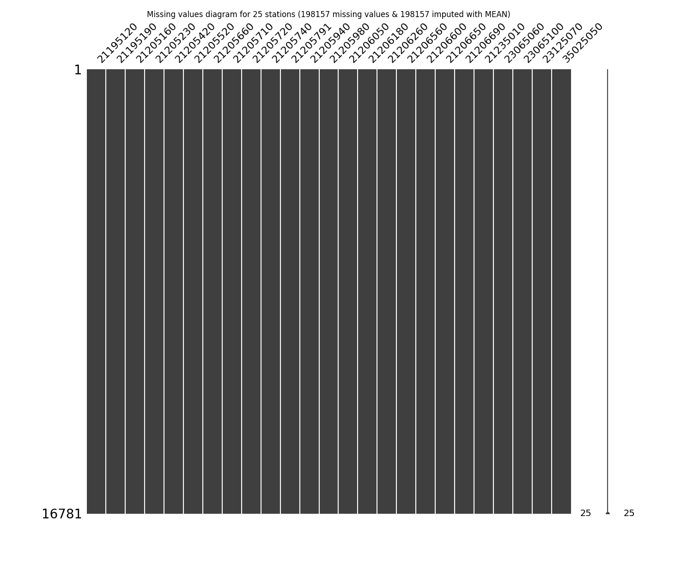

# Impute missing values in time series through statistical methods

* Processed file: [C:/JLGC/R.LTWB/.datasets/IDEAM_Outlier/Outlier_IQR_Cap_Pivot_TMX_CON.csv](../IDEAM_Outlier/Outlier_IQR_Cap_Pivot_TMX_CON.csv)
* Execution date: 2023-09-20 12:14:34.022289
* Python version: 3.11.5 (tags/v3.11.5:cce6ba9, Aug 24 2023, 14:38:34) [MSC v.1936 64 bit (AMD64)]
* Python path: ['C:\\JLGC\\R.LTWB\\.src', 'C:\\Python311\\python311.zip', 'C:\\Python311\\DLLs', 'C:\\Python311\\Lib', 'C:\\Python311']
* matplotlib version: 3.6.0
* pandas version: 2.1.0
* numpy version: 1.25.2
* missingno version: 0.5.2
* sklearn version: 1.3.0
* Stations exclude: ['21200710', '21201090', '21201130', '21201380', '21201620', '21201720', '21201750', '21201760', '21201790', '21200800', '21201840', '21206070', '21230080', '23060040', '24010380', '21206100', '35060280', '35067050']
* Stations include: ['15015020', '15060050', '15060070', '15060080', '15060150']
* Print table sample: True
* Instructions & script: https://github.com/rcfdtools/R.LTWB/tree/main/Section03/Impute
* License: https://github.com/rcfdtools/R.LTWB/blob/main/LICENSE.md
* Credits: r.cfdtools@gmail.com

## General dataframe information with 16781 IDEAM records for 60 stations

Dataframe records head sample

| Fecha            |   21185040 |   21195080 |   21195120 |   21195190 |   21205012 |   21205160 |   21205230 |   21205420 |   21205520 |   21205580 |   21205660 |   21205670 |   21205700 |   21205710 |   21205720 |   21205740 |   21205750 |   21205770 |   21205791 |   21205910 |   21205940 |   21205980 |   21206050 |   21206160 |   21206180 |   21206190 |   21206200 |   21206230 |   21206260 |   21206280 |   21206500 |   21206510 |   21206550 |   21206560 |   21206570 |   21206600 |   21206610 |   21206620 |   21206630 |   21206640 |   21206650 |   21206660 |   21206670 |   21206680 |   21206690 |   21206700 |   21206970 |   21235010 |   21255080 |   23065060 |   23065100 |   23065120 |   23065200 |   23125070 |   23125170 |   24015380 |   35025050 |   35025060 |   35035030 |   35065010 |
|:-----------------|-----------:|-----------:|-----------:|-----------:|-----------:|-----------:|-----------:|-----------:|-----------:|-----------:|-----------:|-----------:|-----------:|-----------:|-----------:|-----------:|-----------:|-----------:|-----------:|-----------:|-----------:|-----------:|-----------:|-----------:|-----------:|-----------:|-----------:|-----------:|-----------:|-----------:|-----------:|-----------:|-----------:|-----------:|-----------:|-----------:|-----------:|-----------:|-----------:|-----------:|-----------:|-----------:|-----------:|-----------:|-----------:|-----------:|-----------:|-----------:|-----------:|-----------:|-----------:|-----------:|-----------:|-----------:|-----------:|-----------:|-----------:|-----------:|-----------:|-----------:|
| 1980-01-01 00:00 |        nan |        nan |        nan |        nan |        nan |        nan |         20 |       18.6 |         19 |        nan |      nan   |       19.2 |        nan |       20   |       16.8 |       16.2 |        nan |        nan |       19.6 |        nan |        nan |        nan |        nan |        nan |        nan |        nan |        nan |        nan |        nan |        nan |        nan |        nan |        nan |        nan |        nan |        nan |        nan |        nan |        nan |        nan |        nan |        nan |        nan |        nan |        nan |        nan |        nan |        nan |        nan |        nan |        nan |       21.2 |        nan |       19.8 |        nan |        nan |        nan |        nan |        nan |       23.4 |
| 1980-01-02 00:00 |        nan |        nan |        nan |        nan |        nan |        nan |        nan |       19   |         19 |        nan |      nan   |       19.2 |        nan |       19.6 |       14.4 |       16.2 |        nan |        nan |       18.6 |        nan |        nan |        nan |        nan |        nan |        nan |        nan |        nan |        nan |        nan |        nan |        nan |        nan |        nan |        nan |        nan |        nan |        nan |        nan |        nan |        nan |        nan |        nan |        nan |        nan |        nan |        nan |        nan |        nan |        nan |        nan |        nan |       20.6 |        nan |       20.4 |        nan |        nan |        nan |        nan |        nan |       23.2 |
| 1980-01-03 00:00 |        nan |        nan |        nan |        nan |        nan |        nan |        nan |       20.2 |         20 |        nan |       30.4 |       21.4 |         18 |       20.4 |       16   |       17   |        nan |        nan |       20.2 |        nan |        nan |        nan |        nan |        nan |        nan |        nan |        nan |        nan |        nan |        nan |        nan |        nan |        nan |        nan |        nan |        nan |        nan |        nan |        nan |        nan |        nan |        nan |        nan |        nan |        nan |        nan |        nan |        nan |        nan |        nan |        nan |       20.6 |        nan |       22.6 |        nan |        nan |        nan |        nan |        nan |       25   |

Dataframe records tail sample

| Fecha            |   21185040 |   21195080 |   21195120 |   21195190 |   21205012 |   21205160 |   21205230 |   21205420 |   21205520 |   21205580 |   21205660 |   21205670 |   21205700 |   21205710 |   21205720 |   21205740 |   21205750 |   21205770 |   21205791 |   21205910 |   21205940 |   21205980 |   21206050 |   21206160 |   21206180 |   21206190 |   21206200 |   21206230 |   21206260 |   21206280 |   21206500 |   21206510 |   21206550 |   21206560 |   21206570 |   21206600 |   21206610 |   21206620 |   21206630 |   21206640 |   21206650 |   21206660 |   21206670 |   21206680 |   21206690 |   21206700 |   21206970 |   21235010 |   21255080 |   23065060 |   23065100 |   23065120 |   23065200 |   23125070 |   23125170 |   24015380 |   35025050 |   35025060 |   35035030 |   35065010 |
|:-----------------|-----------:|-----------:|-----------:|-----------:|-----------:|-----------:|-----------:|-----------:|-----------:|-----------:|-----------:|-----------:|-----------:|-----------:|-----------:|-----------:|-----------:|-----------:|-----------:|-----------:|-----------:|-----------:|-----------:|-----------:|-----------:|-----------:|-----------:|-----------:|-----------:|-----------:|-----------:|-----------:|-----------:|-----------:|-----------:|-----------:|-----------:|-----------:|-----------:|-----------:|-----------:|-----------:|-----------:|-----------:|-----------:|-----------:|-----------:|-----------:|-----------:|-----------:|-----------:|-----------:|-----------:|-----------:|-----------:|-----------:|-----------:|-----------:|-----------:|-----------:|
| 2022-12-28 00:00 |        nan |        nan |       24.8 |        nan |        nan |        nan |        nan |       21.8 |        nan |        nan |       29.6 |       23.6 |       20.2 |       20.4 |        nan |       19.6 |        nan |        nan |        nan |        nan |       17.6 |       20   |        nan |        nan |        nan |        nan |        nan |        nan |        nan |        nan |        nan |        nan |        nan |        nan |        nan |       23.2 |        nan |        nan |        nan |        nan |       16.6 |        nan |        nan |        nan |        nan |        nan |        nan |       35.6 |        nan |        nan |        nan |        nan |        nan |        nan |        nan |        nan |        nan |        nan |        nan |        nan |
| 2022-12-29 00:00 |        nan |        nan |       25   |        nan |        nan |        nan |        nan |       22.2 |        nan |        nan |       30.2 |      nan   |       21.4 |       21   |        nan |       19.2 |        nan |        nan |        nan |        nan |       17.4 |       21   |        nan |        nan |        nan |        nan |        nan |        nan |        nan |        nan |        nan |        nan |        nan |        nan |        nan |       23.2 |        nan |        nan |        nan |        nan |       16.2 |        nan |        nan |        nan |        nan |        nan |        nan |       34.8 |        nan |        nan |        nan |        nan |        nan |        nan |        nan |        nan |        nan |        nan |        nan |        nan |
| 2022-12-30 00:00 |        nan |        nan |       25.6 |        nan |        nan |        nan |        nan |       22.8 |        nan |        nan |       30.8 |       22.6 |       19.6 |       21   |        nan |       19   |        nan |        nan |        nan |        nan |       18   |       21.2 |        nan |        nan |        nan |        nan |        nan |        nan |        nan |        nan |        nan |        nan |        nan |        nan |        nan |       22.8 |        nan |        nan |        nan |        nan |       15.8 |        nan |        nan |        nan |        nan |        nan |        nan |       36.4 |        nan |        nan |        nan |        nan |        nan |        nan |        nan |        nan |        nan |        nan |        nan |        nan |

Datatypes for station and nulls values in the initial file
|       | 21185040   | 21195080   | 21195120   | 21195190   | 21205012   | 21205160   | 21205230   | 21205420   | 21205520   | 21205580   | 21205660   | 21205670   | 21205700   | 21205710   | 21205720   | 21205740   | 21205750   | 21205770   | 21205791   | 21205910   | 21205940   | 21205980   | 21206050   | 21206160   | 21206180   | 21206190   | 21206200   | 21206230   | 21206260   | 21206280   | 21206500   | 21206510   | 21206550   | 21206560   | 21206570   | 21206600   | 21206610   | 21206620   | 21206630   | 21206640   | 21206650   | 21206660   | 21206670   | 21206680   | 21206690   | 21206700   | 21206970   | 21235010   | 21255080   | 23065060   | 23065100   | 23065120   | 23065200   | 23125070   | 23125170   | 24015380   | 35025050   | 35025060   | 35035030   | 35065010   |
|:------|:-----------|:-----------|:-----------|:-----------|:-----------|:-----------|:-----------|:-----------|:-----------|:-----------|:-----------|:-----------|:-----------|:-----------|:-----------|:-----------|:-----------|:-----------|:-----------|:-----------|:-----------|:-----------|:-----------|:-----------|:-----------|:-----------|:-----------|:-----------|:-----------|:-----------|:-----------|:-----------|:-----------|:-----------|:-----------|:-----------|:-----------|:-----------|:-----------|:-----------|:-----------|:-----------|:-----------|:-----------|:-----------|:-----------|:-----------|:-----------|:-----------|:-----------|:-----------|:-----------|:-----------|:-----------|:-----------|:-----------|:-----------|:-----------|:-----------|:-----------|
| Dtype | float64    | float64    | float64    | float64    | float64    | float64    | float64    | float64    | float64    | float64    | float64    | float64    | float64    | float64    | float64    | float64    | float64    | float64    | float64    | float64    | float64    | float64    | float64    | float64    | float64    | float64    | float64    | float64    | float64    | float64    | float64    | float64    | float64    | float64    | float64    | float64    | float64    | float64    | float64    | float64    | float64    | float64    | float64    | float64    | float64    | float64    | float64    | float64    | float64    | float64    | float64    | float64    | float64    | float64    | float64    | float64    | float64    | float64    | float64    | float64    |
| Nulls | 15895      | 16482      | 8383       | 4941       | 16406      | 13889      | 12966      | 2056       | 11909      | 16149      | 4023       | 5059       | 4146       | 5091       | 4651       | 3208       | 16605      | 9358       | 3659       | 16212      | 12472      | 4051       | 9362       | 15346      | 6478       | 16658      | 15854      | 16372      | 7410       | 9981       | 15126      | 15900      | 15535      | 11540      | 15260      | 10805      | 16551      | 14866      | 15249      | 16729      | 11810      | 14092      | 16327      | 16087      | 12518      | 16760      | 16698      | 3625       | 15956      | 8956       | 9607       | 4779       | 15128      | 9802       | 16739      | 13442      | 4945       | 16143      | 16578      | 6261       |

General statistics table - Initial file

|          |   count |    mean |      std |     min |   25% |   50% |    75% |     max |
|---------:|--------:|--------:|---------:|--------:|------:|------:|-------:|--------:|
| 21185040 |     886 | 33.7822 | 2.17714  | 26.6    | 32.4  |  33.8 | 35.4   | 40      |
| 21195080 |     299 | 33.6448 | 1.9994   | 28.8    | 32.2  |  33.6 | 35     | 40.2    |
| 21195120 |    8398 | 24.8841 | 1.70799  | 18.4    | 24    |  25   | 26     | 31.4678 |
| 21195190 |   11840 | 19.6258 | 1.56381  | 13.8    | 18.6  |  19.6 | 20.4   | 25.6577 |
| 21205012 |     375 | 19.596  | 1.5595   | 15      | 18.4  |  19.6 | 20.6   | 24.5    |
| 21205160 |    2892 | 19.8776 | 2.31969  | 12      | 18.1  |  19.8 | 21     | 27.6    |
| 21205230 |    3815 | 19.9729 | 1.59085  | 13.8072 | 18.8  |  20   | 21     | 26.138  |
| 21205420 |   14725 | 19.6249 | 1.46954  | 13.9578 | 18.6  |  19.6 | 20.6   | 25.2913 |
| 21205520 |    4872 | 19.5167 | 1.41842  | 14.1    | 18.5  |  19.5 | 20.5   | 24.9805 |
| 21205580 |     632 | 18.6285 | 1.80103  | 11.7065 | 17.5  |  18.6 | 20     | 24.8    |
| 21205660 |   12758 | 30.2409 | 2.01647  | 22.2    | 29    |  30.2 | 31.4   | 36.8    |
| 21205670 |   11722 | 21.0115 | 1.50776  | 16      | 20    |  20.8 | 22     | 26.8314 |
| 21205700 |   12635 | 18.3621 | 1.88441  | 11.1042 | 17    |  18.4 | 19.6   | 25.2    |
| 21205710 |   11690 | 20.3466 | 1.51044  | 14.4    | 19.4  |  20.2 | 21.4   | 26.169  |
| 21205720 |   12130 | 16.733  | 1.72841  | 10.0737 | 15.4  |  16.8 | 18     | 23.6    |
| 21205740 |   13573 | 17.14   | 1.95096  | 10.8    | 15.8  |  17.2 | 18.4   | 24      |
| 21205750 |     176 | 19.0017 | 1.35527  | 13.8298 | 18.1  |  18.8 | 19.925 | 24.1759 |
| 21205770 |    7423 | 18.8353 | 1.5499   | 12.8634 | 17.9  |  18.8 | 19.9   | 24.8068 |
| 21205791 |   13122 | 19.3358 | 1.47359  | 13.6618 | 18.4  |  19.3 | 20.3   | 24.9    |
| 21205910 |     569 | 18.3239 | 1.75862  | 14.4    | 17    |  18.1 | 19.2   | 24      |
| 21205940 |    4309 | 18.4058 | 1.31904  | 12.8    | 17.6  |  18.4 | 19.4   | 24      |
| 21205980 |   12730 | 19.7305 | 1.64803  | 13.2    | 18.6  |  19.8 | 20.8   | 25.5    |
| 21206050 |    7419 | 19.7894 | 1.87419  | 14.4    | 18.5  |  19.7 | 21     | 26.6    |
| 21206160 |    1435 | 22.075  | 1.706    | 15.4799 | 21    |  22   | 23.2   | 28.6705 |
| 21206180 |   10303 | 21.172  | 1.34988  | 15.6    | 20.2  |  21.2 | 22.1   | 25.6    |
| 21206190 |     123 | 20.339  | 2.04689  | 16.4    | 18.8  |  20.2 | 22     | 25      |
| 21206200 |     927 | 19.623  | 1.46277  | 14.8    | 18.5  |  19.5 | 20.5   | 24      |
| 21206230 |     409 | 19.7242 | 1.12332  | 15.3839 | 19    |  19.6 | 20.4   | 23.4    |
| 21206260 |    9371 | 19.5754 | 1.52489  | 13.7005 | 18.6  |  19.4 | 20.4   | 25.4499 |
| 21206280 |    6800 | 15.9965 | 1.31414  | 11.6    | 15    |  15.8 | 16.8   | 21.2    |
| 21206500 |    1655 | 19.548  | 2.02335  | 14.2    | 18    |  19.6 | 21     | 24.8    |
| 21206510 |     881 | 19.3861 | 1.63246  | 13.034  | 18.4  |  19.3 | 20.4   | 25      |
| 21206550 |    1246 | 21.068  | 1.67199  | 15.6    | 20    |  21   | 22     | 27.5493 |
| 21206560 |    5241 | 20.0639 | 1.60082  | 13.6    | 19    |  20   | 21     | 25.8    |
| 21206570 |    1521 | 19.7855 | 1.38362  | 14.4373 | 19    |  20   | 20.6   | 24.2    |
| 21206600 |    5976 | 21.2205 | 1.59914  | 15      | 20.2  |  21.2 | 22.2   | 27.3956 |
| 21206610 |     230 | 18.6121 | 2.02517  | 10.7827 | 17.2  |  18.7 | 19.95  | 26.4277 |
| 21206620 |    1915 | 21.0651 | 1.87538  | 13.4758 | 20.05 |  21.2 | 22.2   | 28.6287 |
| 21206630 |    1532 | 20.32   | 1.47083  | 14.6345 | 19.4  |  20.2 | 21.2   | 25.8    |
| 21206640 |      52 | 20.975  | 2.39049  | 15      | 19.4  |  21.1 | 23     | 25.3    |
| 21206650 |    4971 | 15.4285 | 2.04102  |  8.4    | 14    |  15   | 16.8   | 24      |
| 21206660 |    2689 | 21.4049 | 1.76617  | 14.5505 | 20.3  |  21.4 | 22.4   | 28.2622 |
| 21206670 |     454 | 21.0404 | 1.86159  | 13.8274 | 20    |  21.2 | 22.1   | 28.4    |
| 21206680 |     694 | 21.4337 | 2.6193   | 11.3384 | 20    |  21.4 | 23.2   | 29.2    |
| 21206690 |    4263 | 21.52   | 1.90612  | 14.1273 | 20.2  |  21.6 | 22.8   | 29      |
| 21206700 |      21 | 21.4333 | 1.59321  | 17.2    | 20.6  |  21.4 | 22     | 24.2    |
| 21206970 |      83 | 20.0024 | 1.76952  | 14      | 18.9  |  20   | 21.15  | 24.2    |
| 21235010 |   13156 | 34.7281 | 2.3423   | 25.4    | 33.2  |  34.8 | 36.4   | 41.8    |
| 21255080 |     825 | 34.3236 | 2.6096   | 25      | 32.5  |  34.3 | 36.2   | 40.6    |
| 23065060 |    7825 | 18.8163 | 1.26161  | 14.6    | 18    |  18.8 | 19.6   | 23.6728 |
| 23065100 |    7174 | 17.7605 | 1.48513  | 12.4    | 16.8  |  17.8 | 18.8   | 22.5    |
| 23065120 |   12002 | 21.7485 | 1.84512  | 14.6    | 20.6  |  21.8 | 23     | 28      |
| 23065200 |    1653 | 29.2151 | 2.08216  | 21.6    | 27.8  |  29.2 | 30.6   | 36      |
| 23125070 |    6979 | 20.629  | 1.73556  | 14.4    | 19.6  |  20.6 | 21.6   | 27.3115 |
| 23125170 |      42 | 13.8952 | 0.640485 | 12.4    | 13.45 |  13.8 | 14.4   | 15.2    |
| 24015380 |    3339 | 17.0555 | 1.65967  | 11.4    | 15.8  |  17   | 18.2   | 23.4    |
| 35025050 |   11836 | 13.7644 | 1.7894   |  7.4    | 12.6  |  13.8 | 15     | 20.6543 |
| 35025060 |     638 | 12.348  | 1.49165  |  7.6    | 11.4  |  12.3 | 13.35  | 17.2    |
| 35035030 |     203 | 28.13   | 1.89304  | 21.6    | 27.2  |  28.2 | 29.2   | 33      |
| 35065010 |   10520 | 24.0121 | 1.99982  | 16.4    | 22.8  |  24.2 | 25.4   | 31.4    |

## Method 1 - Imputing with mean values
According to this technique, the missing values are imputed using the mean value in each feature and the serie has been completed filled.

Imputed file: [Impute_Mean_Outlier_IQR_Cap_Pivot_TMX_CON.csv](Impute_Mean_Outlier_IQR_Cap_Pivot_TMX_CON.csv)

General statistics table - Imputed file

|          |   count |    mean |       std |     min |     25% |     50% |     75% |     max |
|---------:|--------:|--------:|----------:|--------:|--------:|--------:|--------:|--------:|
| 21185040 |   16781 | 33.7822 | 0.499992  | 26.6    | 33.7822 | 33.7822 | 33.7822 | 40      |
| 21195080 |   16781 | 33.6448 | 0.266447  | 28.8    | 33.6448 | 33.6448 | 33.6448 | 40.2    |
| 21195120 |   16781 | 24.8841 | 1.20824   | 18.4    | 24.8841 | 24.8841 | 25      | 31.4678 |
| 21195190 |   16781 | 19.6258 | 1.31355   | 13.8    | 19      | 19.6258 | 20      | 25.6577 |
| 21205012 |   16781 | 19.596  | 0.232823  | 15      | 19.596  | 19.596  | 19.596  | 24.5    |
| 21205160 |   16781 | 19.8776 | 0.962849  | 12      | 19.8776 | 19.8776 | 19.8776 | 27.6    |
| 21205230 |   16781 | 19.9729 | 0.758444  | 13.8072 | 19.9729 | 19.9729 | 19.9729 | 26.138  |
| 21205420 |   16781 | 19.6249 | 1.37657   | 13.9578 | 18.8    | 19.6249 | 20.4    | 25.2913 |
| 21205520 |   16781 | 19.5167 | 0.76422   | 14.1    | 19.5167 | 19.5167 | 19.5167 | 24.9805 |
| 21205580 |   16781 | 18.6285 | 0.349252  | 11.7065 | 18.6285 | 18.6285 | 18.6285 | 24.8    |
| 21205660 |   16781 | 30.2409 | 1.7582    | 22.2    | 29.6    | 30.2409 | 31      | 36.8    |
| 21205670 |   16781 | 21.0115 | 1.26014   | 16      | 20.4    | 21.0115 | 21.6    | 26.8314 |
| 21205700 |   16781 | 18.3621 | 1.63512   | 11.1042 | 17.4    | 18.3621 | 19.2    | 25.2    |
| 21205710 |   16781 | 20.3466 | 1.26065   | 14.4    | 19.8    | 20.3466 | 20.8    | 26.169  |
| 21205720 |   16781 | 16.733  | 1.46948   | 10.0737 | 16      | 16.733  | 17.4    | 23.6    |
| 21205740 |   16781 | 17.14   | 1.75458   | 10.8    | 16.2    | 17.14   | 18.2    | 24      |
| 21205750 |   16781 | 19.0017 | 0.138404  | 13.8298 | 19.0017 | 19.0017 | 19.0017 | 24.1759 |
| 21205770 |   16781 | 18.8353 | 1.03079   | 12.8634 | 18.8353 | 18.8353 | 18.8353 | 24.8068 |
| 21205791 |   16781 | 19.3358 | 1.30306   | 13.6618 | 18.6    | 19.3358 | 20      | 24.9    |
| 21205910 |   16781 | 18.3239 | 0.323556  | 14.4    | 18.3239 | 18.3239 | 18.3239 | 24      |
| 21205940 |   16781 | 18.4058 | 0.668343  | 12.8    | 18.4058 | 18.4058 | 18.4058 | 24      |
| 21205980 |   16781 | 19.7305 | 1.43538   | 13.2    | 19      | 19.7305 | 20.4    | 25.5    |
| 21206050 |   16781 | 19.7894 | 1.24612   | 14.4    | 19.7894 | 19.7894 | 19.7894 | 26.6    |
| 21206160 |   16781 | 22.075  | 0.49872   | 15.4799 | 22.075  | 22.075  | 22.075  | 28.6705 |
| 21206180 |   16781 | 21.172  | 1.05769   | 15.6    | 20.8    | 21.172  | 21.5    | 25.6    |
| 21206190 |   16781 | 20.339  | 0.174534  | 16.4    | 20.339  | 20.339  | 20.339  | 25      |
| 21206200 |   16781 | 19.623  | 0.343626  | 14.8    | 19.623  | 19.623  | 19.623  | 24      |
| 21206230 |   16781 | 19.7242 | 0.17516   | 15.3839 | 19.7242 | 19.7242 | 19.7242 | 23.4    |
| 21206260 |   16781 | 19.5754 | 1.13949   | 13.7005 | 19.4    | 19.5754 | 19.6    | 25.4499 |
| 21206280 |   16781 | 15.9965 | 0.836504  | 11.6    | 15.9965 | 15.9965 | 15.9965 | 21.2    |
| 21206500 |   16781 | 19.548  | 0.635247  | 14.2    | 19.548  | 19.548  | 19.548  | 24.8    |
| 21206510 |   16781 | 19.3861 | 0.373843  | 13.034  | 19.3861 | 19.3861 | 19.3861 | 25      |
| 21206550 |   16781 | 21.068  | 0.455431  | 15.6    | 21.068  | 21.068  | 21.068  | 27.5493 |
| 21206560 |   16781 | 20.0639 | 0.894566  | 13.6    | 20.0639 | 20.0639 | 20.0639 | 25.8    |
| 21206570 |   16781 | 19.7855 | 0.416429  | 14.4373 | 19.7855 | 19.7855 | 19.7855 | 24.2    |
| 21206600 |   16781 | 21.2205 | 0.954246  | 15      | 21.2205 | 21.2205 | 21.2205 | 27.3956 |
| 21206610 |   16781 | 18.6121 | 0.236583  | 10.7827 | 18.6121 | 18.6121 | 18.6121 | 26.4277 |
| 21206620 |   16781 | 21.0651 | 0.63338   | 13.4758 | 21.0651 | 21.0651 | 21.0651 | 28.6287 |
| 21206630 |   16781 | 20.32   | 0.444277  | 14.6345 | 20.32   | 20.32   | 20.32   | 25.8    |
| 21206640 |   16781 | 20.975  | 0.131788  | 15      | 20.975  | 20.975  | 20.975  | 25.3    |
| 21206650 |   16781 | 15.4285 | 1.11079   |  8.4    | 15.4285 | 15.4285 | 15.4285 | 24      |
| 21206660 |   16781 | 21.4049 | 0.706888  | 14.5505 | 21.4049 | 21.4049 | 21.4049 | 28.2622 |
| 21206670 |   16781 | 21.0404 | 0.30587   | 13.8274 | 21.0404 | 21.0404 | 21.0404 | 28.4    |
| 21206680 |   16781 | 21.4337 | 0.532299  | 11.3384 | 21.4337 | 21.4337 | 21.4337 | 29.2    |
| 21206690 |   16781 | 21.52   | 0.960641  | 14.1273 | 21.52   | 21.52   | 21.52   | 29      |
| 21206700 |   16781 | 21.4333 | 0.0550039 | 17.2    | 21.4333 | 21.4333 | 21.4333 | 24.2    |
| 21206970 |   16781 | 20.0024 | 0.123699  | 14      | 20.0024 | 20.0024 | 20.0024 | 24.2    |
| 21235010 |   16781 | 34.7281 | 2.07392   | 25.4    | 33.8    | 34.7281 | 35.8    | 41.8    |
| 21255080 |   16781 | 34.3236 | 0.578283  | 25      | 34.3236 | 34.3236 | 34.3236 | 40.6    |
| 23065060 |   16781 | 18.8163 | 0.861478  | 14.6    | 18.8    | 18.8163 | 18.8163 | 23.6728 |
| 23065100 |   16781 | 17.7605 | 0.971002  | 12.4    | 17.7605 | 17.7605 | 17.7605 | 22.5    |
| 23065120 |   16781 | 21.7485 | 1.56041   | 14.6    | 21      | 21.7485 | 22.4    | 28      |
| 23065200 |   16781 | 29.2151 | 0.653316  | 21.6    | 29.2151 | 29.2151 | 29.2151 | 36      |
| 23125070 |   16781 | 20.629  | 1.1192    | 14.4    | 20.629  | 20.629  | 20.629  | 27.3115 |
| 23125170 |   16781 | 13.8952 | 0.0316595 | 12.4    | 13.8952 | 13.8952 | 13.8952 | 15.2    |
| 24015380 |   16781 | 17.0555 | 0.740236  | 11.4    | 17.0555 | 17.0555 | 17.0555 | 23.4    |
| 35025050 |   16781 | 13.7644 | 1.50278   |  7.4    | 13      | 13.7644 | 14.4    | 20.6543 |
| 35025060 |   16781 | 12.348  | 0.29063   |  7.6    | 12.348  | 12.348  | 12.348  | 17.2    |
| 35035030 |   16781 | 28.13   | 0.207701  | 21.6    | 28.13   | 28.13   | 28.13   | 33      |
| 35065010 |   16781 | 24.0121 | 1.58337   | 16.4    | 23.6    | 24.0121 | 24.7    | 31.4    |

## Method 2 - Imputing with median values
According to this technique, the missing values are imputed using the median value in each feature and the serie has been completed filled.

Imputed file: [Impute_Median_Outlier_IQR_Cap_Pivot_TMX_CON.csv](Impute_Median_Outlier_IQR_Cap_Pivot_TMX_CON.csv)

General statistics table - Imputed file

|          |   count |    mean |       std |     min |   25% |   50% |   75% |     max |
|---------:|--------:|--------:|----------:|--------:|------:|------:|------:|--------:|
| 21185040 |   16781 | 33.7991 | 0.500007  | 26.6    |  33.8 |  33.8 |  33.8 | 40      |
| 21195080 |   16781 | 33.6008 | 0.266513  | 28.8    |  33.6 |  33.6 |  33.6 | 40.2    |
| 21195120 |   16781 | 24.942  | 1.20962   | 18.4    |  25   |  25   |  25   | 31.4678 |
| 21195190 |   16781 | 19.6182 | 1.3136    | 13.8    |  19   |  19.6 |  20   | 25.6577 |
| 21205012 |   16781 | 19.5999 | 0.232824  | 15      |  19.6 |  19.6 |  19.6 | 24.5    |
| 21205160 |   16781 | 19.8134 | 0.963295  | 12      |  19.8 |  19.8 |  19.8 | 27.6    |
| 21205230 |   16781 | 19.9938 | 0.758529  | 13.8072 |  20   |  20   |  20   | 26.138  |
| 21205420 |   16781 | 19.6218 | 1.3766    | 13.9578 |  18.8 |  19.6 |  20.4 | 25.2913 |
| 21205520 |   16781 | 19.5049 | 0.764257  | 14.1    |  19.5 |  19.5 |  19.5 | 24.9805 |
| 21205580 |   16781 | 18.6011 | 0.349294  | 11.7065 |  18.6 |  18.6 |  18.6 | 24.8    |
| 21205660 |   16781 | 30.2311 | 1.75829   | 22.2    |  29.6 |  30.2 |  31   | 36.8    |
| 21205670 |   16781 | 20.9478 | 1.26387   | 16      |  20.4 |  20.8 |  21.6 | 26.8314 |
| 21205700 |   16781 | 18.3715 | 1.6352    | 11.1042 |  17.4 |  18.4 |  19.2 | 25.2    |
| 21205710 |   16781 | 20.3021 | 1.26245   | 14.4    |  19.8 |  20.2 |  20.8 | 26.169  |
| 21205720 |   16781 | 16.7516 | 1.46978   | 10.0737 |  16   |  16.8 |  17.4 | 23.6    |
| 21205740 |   16781 | 17.1515 | 1.75474   | 10.8    |  16.2 |  17.2 |  18.2 | 24      |
| 21205750 |   16781 | 18.8021 | 0.139921  | 13.8298 |  18.8 |  18.8 |  18.8 | 24.1759 |
| 21205770 |   16781 | 18.8156 | 1.03094   | 12.8634 |  18.8 |  18.8 |  18.8 | 24.8068 |
| 21205791 |   16781 | 19.328  | 1.30315   | 13.6618 |  18.6 |  19.3 |  20   | 24.9    |
| 21205910 |   16781 | 18.1076 | 0.326084  | 14.4    |  18.1 |  18.1 |  18.1 | 24      |
| 21205940 |   16781 | 18.4015 | 0.668348  | 12.8    |  18.4 |  18.4 |  18.4 | 24      |
| 21205980 |   16781 | 19.7473 | 1.43569   | 13.2    |  19   |  19.8 |  20.4 | 25.5    |
| 21206050 |   16781 | 19.7395 | 1.24691   | 14.4    |  19.7 |  19.7 |  19.7 | 26.6    |
| 21206160 |   16781 | 22.0064 | 0.499161  | 15.4799 |  22   |  22   |  22   | 28.6705 |
| 21206180 |   16781 | 21.1828 | 1.05778   | 15.6    |  20.8 |  21.2 |  21.5 | 25.6    |
| 21206190 |   16781 | 20.201  | 0.174936  | 16.4    |  20.2 |  20.2 |  20.2 | 25      |
| 21206200 |   16781 | 19.5068 | 0.344772  | 14.8    |  19.5 |  19.5 |  19.5 | 24      |
| 21206230 |   16781 | 19.603  | 0.176204  | 15.3839 |  19.6 |  19.6 |  19.6 | 23.4    |
| 21206260 |   16781 | 19.4979 | 1.14282   | 13.7005 |  19.4 |  19.4 |  19.6 | 25.4499 |
| 21206280 |   16781 | 15.8796 | 0.842045  | 11.6    |  15.8 |  15.8 |  15.8 | 21.2    |
| 21206500 |   16781 | 19.5949 | 0.635437  | 14.2    |  19.6 |  19.6 |  19.6 | 24.8    |
| 21206510 |   16781 | 19.3045 | 0.374335  | 13.034  |  19.3 |  19.3 |  19.3 | 25      |
| 21206550 |   16781 | 21.005  | 0.45578   | 15.6    |  21   |  21   |  21   | 27.5493 |
| 21206560 |   16781 | 20.0199 | 0.895055  | 13.6    |  20   |  20   |  20   | 25.8    |
| 21206570 |   16781 | 19.9806 | 0.420959  | 14.4373 |  20   |  20   |  20   | 24.2    |
| 21206600 |   16781 | 21.2073 | 0.954297  | 15      |  21.2 |  21.2 |  21.2 | 27.3956 |
| 21206610 |   16781 | 18.6988 | 0.236803  | 10.7827 |  18.7 |  18.7 |  18.7 | 26.4277 |
| 21206620 |   16781 | 21.1846 | 0.634832  | 13.4758 |  21.2 |  21.2 |  21.2 | 28.6287 |
| 21206630 |   16781 | 20.211  | 0.445619  | 14.6345 |  20.2 |  20.2 |  20.2 | 25.8    |
| 21206640 |   16781 | 21.0996 | 0.131971  | 15      |  21.1 |  21.1 |  21.1 | 25.3    |
| 21206650 |   16781 | 15.1269 | 1.12788   |  8.4    |  15   |  15   |  15   | 24      |
| 21206660 |   16781 | 21.4008 | 0.706891  | 14.5505 |  21.4 |  21.4 |  21.4 | 28.2622 |
| 21206670 |   16781 | 21.1957 | 0.306964  | 13.8274 |  21.2 |  21.2 |  21.2 | 28.4    |
| 21206680 |   16781 | 21.4014 | 0.532341  | 11.3384 |  21.4 |  21.4 |  21.4 | 29.2    |
| 21206690 |   16781 | 21.5797 | 0.961271  | 14.1273 |  21.6 |  21.6 |  21.6 | 29      |
| 21206700 |   16781 | 21.4    | 0.0550165 | 17.2    |  21.4 |  21.4 |  21.4 | 24.2    |
| 21206970 |   16781 | 20      | 0.123699  | 14      |  20   |  20   |  20   | 24.2    |
| 21235010 |   16781 | 34.7437 | 2.07413   | 25.4    |  33.8 |  34.8 |  35.8 | 41.8    |
| 21255080 |   16781 | 34.3012 | 0.578306  | 25      |  34.3 |  34.3 |  34.3 | 40.6    |
| 23065060 |   16781 | 18.8076 | 0.861516  | 14.6    |  18.8 |  18.8 |  18.8 | 23.6728 |
| 23065100 |   16781 | 17.7831 | 0.971198  | 12.4    |  17.8 |  17.8 |  17.8 | 22.5    |
| 23065120 |   16781 | 21.7631 | 1.56058   | 14.6    |  21   |  21.8 |  22.4 | 28      |
| 23065200 |   16781 | 29.2015 | 0.653331  | 21.6    |  29.2 |  29.2 |  29.2 | 36      |
| 23125070 |   16781 | 20.6121 | 1.11929   | 14.4    |  20.6 |  20.6 |  20.6 | 27.3115 |
| 23125170 |   16781 | 13.8002 | 0.0320152 | 12.4    |  13.8 |  13.8 |  13.8 | 15.2    |
| 24015380 |   16781 | 17.011  | 0.740567  | 11.4    |  17   |  17   |  17   | 23.4    |
| 35025050 |   16781 | 13.7749 | 1.50287   |  7.4    |  13   |  13.8 |  14.4 | 20.6543 |
| 35025060 |   16781 | 12.3018 | 0.290774  |  7.6    |  12.3 |  12.3 |  12.3 | 17.2    |
| 35035030 |   16781 | 28.1992 | 0.207842  | 21.6    |  28.2 |  28.2 |  28.2 | 33      |
| 35065010 |   16781 | 24.0822 | 1.58597   | 16.4    |  23.6 |  24.2 |  24.7 | 31.4    |

## Method 3 - Imputing with Last Observation Carried Forward (LOCF) values
According to this technique, the missing values are imputed using the immediate values before it in the time series and the missing values at the start are not filled but the series are completed fillet to the end.

Imputed file: [Impute_LOCF_Outlier_IQR_Cap_Pivot_TMX_CON.csv](Impute_LOCF_Outlier_IQR_Cap_Pivot_TMX_CON.csv)

General statistics table - Imputed file

|          |   count |    mean |      std |     min |   25% |   50% |   75% |     max |
|---------:|--------:|--------:|---------:|--------:|------:|------:|------:|--------:|
| 21185040 |    9476 | 32.9049 | 0.783557 | 26.6    |  32.8 |  32.8 |  32.8 | 40      |
| 21195080 |    9468 | 31.6264 | 0.929044 | 28.8    |  31.4 |  31.4 |  31.4 | 40.2    |
| 21195120 |   11758 | 24.6926 | 1.70829  | 18.4    |  23.2 |  24.6 |  26   | 31.4678 |
| 21195190 |   16721 | 19.4591 | 1.69716  | 13.8    |  18.2 |  19.5 |  20.4 | 25.6577 |
| 21205012 |    9466 | 19.251  | 0.550967 | 15      |  19.2 |  19.2 |  19.2 | 24.5    |
| 21205160 |   15685 | 22.3358 | 1.54554  | 12      |  22.9 |  22.9 |  22.9 | 27.6    |
| 21205230 |   16781 | 20.6919 | 0.995766 | 13.8072 |  21   |  21   |  21   | 26.138  |
| 21205420 |   16781 | 19.6821 | 1.42586  | 13.9578 |  18.7 |  19.8 |  20.5 | 25.2913 |
| 21205520 |   16781 | 18.9422 | 1.17899  | 14.1    |  18.8 |  18.8 |  18.8 | 24.9805 |
| 21205580 |    9475 | 18.9652 | 0.627047 | 11.7065 |  19   |  19   |  19   | 24.8    |
| 21205660 |   16779 | 30.4296 | 2.09336  | 22.2    |  29.4 |  30.4 |  32   | 36.8    |
| 21205670 |   16781 | 21.2413 | 1.60572  | 16      |  20   |  21.2 |  22.4 | 26.8314 |
| 21205700 |   16779 | 18.3438 | 1.82566  | 11.1042 |  17.2 |  18.4 |  19.4 | 25.2    |
| 21205710 |   16781 | 20.6055 | 1.62391  | 14.4    |  19.6 |  20.6 |  21.6 | 26.169  |
| 21205720 |   16781 | 16.8093 | 1.62166  | 10.0737 |  16   |  16.8 |  17.8 | 23.6    |
| 21205740 |   16781 | 16.9511 | 1.97283  | 10.8    |  15.6 |  17   |  18.4 | 24      |
| 21205750 |   15896 | 20.1797 | 0.207494 | 13.8298 |  20.2 |  20.2 |  20.2 | 24.1759 |
| 21205770 |   16750 | 18.758  | 2.02012  | 12.8634 |  17.5 |  19.1 |  20.2 | 24.8068 |
| 21205791 |   16781 | 19.5986 | 1.4152   | 13.6618 |  18.6 |  19.8 |  20.8 | 24.9    |
| 21205910 |    5053 | 18.1738 | 0.82146  | 14.4    |  18   |  18   |  18   | 24      |
| 21205940 |    5904 | 18.2439 | 1.30337  | 12.8    |  17.4 |  18.2 |  19   | 24      |
| 21205980 |   14316 | 19.6595 | 1.5974   | 13.2    |  18.8 |  19.6 |  20.7 | 25.5    |
| 21206050 |   15131 | 20.2453 | 1.48017  | 14.4    |  19.4 |  20.7 |  20.7 | 26.6    |
| 21206160 |   15168 | 24.1555 | 1.21396  | 15.4799 |  23.6 |  24.8 |  24.8 | 28.6705 |
| 21206180 |   14377 | 21.0945 | 1.33472  | 15.6    |  20   |  21.2 |  22   | 25.6    |
| 21206190 |    9464 | 21.826  | 0.838218 | 16.4    |  22   |  22   |  22   | 25      |
| 21206200 |   14038 | 20.3903 | 0.571534 | 14.8    |  20.5 |  20.5 |  20.5 | 24      |
| 21206230 |    9464 | 19.9941 | 0.449202 | 15.3839 |  20   |  20   |  20   | 23.4    |
| 21206260 |   12885 | 19.6554 | 1.5367   | 13.7005 |  18.8 |  19.4 |  20.4 | 25.4499 |
| 21206280 |   13084 | 15.7413 | 1.29078  | 11.6    |  15   |  15.6 |  16.8 | 21.2    |
| 21206500 |   11333 | 19.7887 | 1.3563   | 14.2    |  18.8 |  20.4 |  20.4 | 24.8    |
| 21206510 |   10834 | 21.5229 | 1.17801  | 13.034  |  21.6 |  22   |  22   | 25      |
| 21206550 |    7963 | 21.3471 | 0.808007 | 15.6    |  21.4 |  21.4 |  21.4 | 27.5493 |
| 21206560 |    9884 | 20.4199 | 1.64557  | 13.6    |  19.4 |  20.5 |  21.5 | 25.8    |
| 21206570 |    6088 | 20.2617 | 1.21852  | 14.4373 |  20   |  20.2 |  21.4 | 24.2    |
| 21206600 |    7669 | 21.2133 | 1.4414   | 15      |  20.4 |  21   |  22   | 27.3956 |
| 21206610 |    7457 | 18.2998 | 0.511686 | 10.7827 |  18.3 |  18.3 |  18.3 | 26.4277 |
| 21206620 |    7549 | 21.4544 | 2.58648  | 13.4758 |  20.4 |  22.2 |  23.2 | 28.6287 |
| 21206630 |    5425 | 20.2117 | 1.02225  | 14.6345 |  20.2 |  20.2 |  20.2 | 25.8    |
| 21206640 |    9452 | 22.9919 | 1.05717  | 15      |  23.2 |  23.2 |  23.2 | 25.3    |
| 21206650 |    7426 | 15.5315 | 2.14182  |  8.4    |  14.2 |  15.2 |  16.8 | 24      |
| 21206660 |    7515 | 21.5862 | 1.71069  | 14.5505 |  20.6 |  21.6 |  22.6 | 28.2622 |
| 21206670 |    7612 | 19.769  | 1.25727  | 13.8274 |  19.3 |  19.3 |  19.3 | 28.4    |
| 21206680 |    7607 | 19.2537 | 1.32823  | 11.3384 |  18.9 |  18.9 |  18.9 | 29.2    |
| 21206690 |    7442 | 21.8784 | 2.63799  | 14.1273 |  20   |  22   |  23.3 | 29      |
| 21206700 |    7172 | 22.9008 | 0.500728 | 17.2    |  23   |  23   |  23   | 24.2    |
| 21206970 |    9446 | 19.5125 | 0.662617 | 14      |  19.5 |  19.5 |  19.5 | 24.2    |
| 21235010 |   16690 | 34.6873 | 2.27712  | 25.4    |  33.4 |  34.6 |  36.4 | 41.8    |
| 21255080 |    9476 | 35.8004 | 1.03442  | 25      |  36   |  36   |  36   | 40.6    |
| 23065060 |   13097 | 18.5054 | 1.1579   | 14.6    |  17.8 |  18   |  19.2 | 23.6728 |
| 23065100 |   14254 | 17.5575 | 1.27333  | 12.4    |  16.8 |  17.5 |  18.4 | 22.5    |
| 23065120 |   16781 | 21.8338 | 1.86453  | 14.6    |  20.4 |  21.6 |  23   | 28      |
| 23065200 |    4943 | 29.5858 | 1.29151  | 21.6    |  29.8 |  29.8 |  29.8 | 36      |
| 23125070 |   16781 | 22.2311 | 1.77224  | 14.4    |  21   |  23.4 |  23.4 | 27.3115 |
| 23125170 |    1732 | 14.6303 | 0.496559 | 12.4    |  14.8 |  14.8 |  14.8 | 15.2    |
| 24015380 |    4341 | 16.7406 | 1.7376   | 11.4    |  15.2 |  16.8 |  17.8 | 23.4    |
| 35025050 |   14042 | 13.8915 | 1.72874  |  7.4    |  12.8 |  14   |  15   | 20.6543 |
| 35025060 |    9464 | 14.1747 | 0.816401 |  7.6    |  14.4 |  14.4 |  14.4 | 17.2    |
| 35035030 |    9476 | 28.9626 | 0.440881 | 21.6    |  29   |  29   |  29   | 33      |
| 35065010 |   16781 | 24.2199 | 2.19343  | 16.4    |  23   |  25   |  25.4 | 31.4    |

## Method 4 - Imputing with Next Observation Carried Backward (NOCB) values
According to this technique, the missing values are imputed using the immediate values after it in the time series and the missing values at the end are not filled but the series are completed fillet to the start.

Imputed file: [Impute_NOCB_Outlier_IQR_Cap_Pivot_TMX_CON.csv](Impute_NOCB_Outlier_IQR_Cap_Pivot_TMX_CON.csv)

General statistics table - Imputed file

|          |   count |    mean |      std |     min |   25% |   50% |   75% |     max |
|---------:|--------:|--------:|---------:|--------:|------:|------:|------:|--------:|
| 21185040 |    8379 | 36.0679 | 1.15906  | 26.6    |  36.4 |  36.4 |  36.4 | 40      |
| 21195080 |    8367 | 33.1852 | 0.709381 | 28.8    |  33.2 |  33.2 |  33.2 | 40.2    |
| 21195120 |   16781 | 24.6308 | 1.54211  | 18.4    |  24   |  24.2 |  25.4 | 31.4678 |
| 21195190 |   16647 | 19.4614 | 1.47336  | 13.8    |  18.2 |  19.4 |  20.2 | 25.6577 |
| 21205012 |    8371 | 20.4961 | 0.604275 | 15      |  20.6 |  20.6 |  20.6 | 24.5    |
| 21205160 |    4018 | 21.4066 | 3.19056  | 12      |  19   |  20.8 |  25.5 | 27.6    |
| 21205230 |    5072 | 19.9464 | 1.73707  | 13.8072 |  18.8 |  20   |  21   | 26.138  |
| 21205420 |   16781 | 19.6306 | 1.43252  | 13.9578 |  18.8 |  19.6 |  20.6 | 25.2913 |
| 21205520 |    6021 | 19.7359 | 1.41168  | 14.1    |  18.7 |  19.8 |  20.8 | 24.9805 |
| 21205580 |    8380 | 19.1379 | 0.637211 | 11.7065 |  19.2 |  19.2 |  19.2 | 24.8    |
| 21205660 |   16781 | 30.5568 | 1.99478  | 22.2    |  29.4 |  30.8 |  32   | 36.8    |
| 21205670 |   16781 | 20.6665 | 1.67242  | 16      |  19.6 |  20.6 |  21.8 | 26.8314 |
| 21205700 |   16781 | 18.0099 | 2.14072  | 11.1042 |  16.4 |  18.2 |  19.4 | 25.2    |
| 21205710 |   16781 | 20.4355 | 1.54487  | 14.4    |  19.4 |  20.4 |  21.2 | 26.169  |
| 21205720 |   16699 | 16.6905 | 1.56993  | 10.0737 |  15.6 |  16.8 |  17.6 | 23.6    |
| 21205740 |   16781 | 17.4075 | 2.06478  | 10.8    |  16   |  17.6 |  18.6 | 24      |
| 21205750 |    1455 | 19.0592 | 0.619496 | 13.8298 |  19   |  19   |  19   | 24.1759 |
| 21205770 |   16536 | 19.1892 | 1.9785   | 12.8634 |  18   |  19   |  20.2 | 24.8068 |
| 21205791 |   14530 | 19.3831 | 1.4193   | 13.6618 |  18.4 |  19.4 |  20.2 | 24.9    |
| 21205910 |   12580 | 19.3297 | 0.661183 | 14.4    |  19.3 |  19.3 |  19.3 | 24      |
| 21205940 |   16781 | 18.918  | 0.867586 | 12.8    |  19   |  19   |  19   | 24      |
| 21205980 |   16781 | 19.9497 | 1.73329  | 13.2    |  18.6 |  20   |  21.6 | 25.5    |
| 21206050 |   10938 | 20.825  | 2.44353  | 14.4    |  19   |  20.8 |  22.4 | 26.6    |
| 21206160 |    6698 | 21.1297 | 2.27506  | 15.4799 |  18.6 |  20.8 |  22.4 | 28.6705 |
| 21206180 |   16537 | 21.3201 | 1.34286  | 15.6    |  20.4 |  21.6 |  22.2 | 25.6    |
| 21206190 |    8352 | 21.2056 | 0.848575 | 16.4    |  21.4 |  21.4 |  21.4 | 25      |
| 21206200 |    4280 | 19.1272 | 0.950684 | 14.8    |  19   |  19   |  19   | 24      |
| 21206230 |    8365 | 19.7512 | 0.369118 | 15.3839 |  19.8 |  19.8 |  19.8 | 23.4    |
| 21206260 |   16767 | 19.5189 | 1.2934   | 13.7005 |  19.2 |  19.2 |  20.2 | 25.4499 |
| 21206280 |   14164 | 15.8397 | 1.18703  | 11.6    |  15.2 |  15.6 |  16.8 | 21.2    |
| 21206500 |   10177 | 19.348  | 1.45902  | 14.2    |  18   |  20   |  20   | 24.8    |
| 21206510 |    8952 | 20.4943 | 0.891419 | 13.034  |  20.6 |  20.8 |  20.8 | 25      |
| 21206550 |   10512 | 21.8646 | 0.735698 | 15.6    |  22   |  22   |  22   | 27.5493 |
| 21206560 |   16757 | 20.3666 | 1.42091  | 13.6    |  20   |  20   |  21   | 25.8    |
| 21206570 |   15443 | 19.7841 | 0.529876 | 14.4373 |  19.8 |  19.8 |  19.8 | 24.2    |
| 21206600 |   16781 | 22.039  | 1.24453  | 15      |  21.8 |  22.4 |  22.4 | 27.3956 |
| 21206610 |   10693 | 15.0859 | 1.64333  | 10.7827 |  15   |  15   |  15   | 26.4277 |
| 21206620 |   14270 | 18.2582 | 2.12083  | 13.4758 |  17   |  17   |  19.7 | 28.6287 |
| 21206630 |   13676 | 19.1447 | 0.777349 | 14.6345 |  19   |  19   |  19   | 25.8    |
| 21206640 |    8362 | 20.4092 | 0.655254 | 15      |  20.4 |  20.4 |  20.4 | 25.3    |
| 21206650 |   16781 | 18.3712 | 2.48289  |  8.4    |  16.4 |  20   |  20   | 24      |
| 21206660 |   15166 | 21.6555 | 1.32691  | 14.5505 |  21.8 |  21.8 |  21.8 | 28.2622 |
| 21206670 |   11163 | 24.3623 | 1.52209  | 13.8274 |  25   |  25   |  25   | 28.4    |
| 21206680 |   10505 | 22.0021 | 0.899821 | 11.3384 |  22   |  22   |  22   | 29.2    |
| 21206690 |   16768 | 21.0329 | 1.63372  | 14.1273 |  20.3 |  20.3 |  21.8 | 29      |
| 21206700 |    9899 | 20.6251 | 0.191084 | 17.2    |  20.6 |  20.6 |  20.6 | 24.2    |
| 21206970 |    8371 | 19.1855 | 0.506075 | 14      |  19.1 |  19.1 |  19.1 | 24.2    |
| 21235010 |   16781 | 34.749  | 2.25718  | 25.4    |  33.2 |  34.8 |  36.2 | 41.8    |
| 21255080 |    8377 | 34.0204 | 0.963284 | 25      |  34   |  34   |  34   | 40.6    |
| 23065060 |   13738 | 18.6316 | 1.25667  | 14.6    |  17.6 |  18.4 |  19.6 | 23.6728 |
| 23065100 |   14316 | 17.7735 | 1.40284  | 12.4    |  17.2 |  17.4 |  18.6 | 22.5    |
| 23065120 |   16417 | 21.6528 | 1.70916  | 14.6    |  20.6 |  21.6 |  22.8 | 28      |
| 23065200 |   13615 | 29.2103 | 0.767578 | 21.6    |  29.2 |  29.2 |  29.2 | 36      |
| 23125070 |    7079 | 20.6301 | 1.7348   | 14.4    |  19.6 |  20.6 |  21.6 | 27.3115 |
| 23125170 |   15327 | 12.4309 | 0.235451 | 12.4    |  12.4 |  12.4 |  12.4 | 15.2    |
| 24015380 |   16537 | 16.2644 | 0.94627  | 11.4    |  16   |  16   |  16   | 23.4    |
| 35025050 |   16446 | 13.8629 | 1.73098  |  7.4    |  13   |  13.6 |  15   | 20.6543 |
| 35025060 |    8381 | 11.662  | 0.606963 |  7.6    |  11.6 |  11.6 |  11.6 | 17.2    |
| 35035030 |    8350 | 28.0158 | 0.794822 | 21.6    |  28   |  28   |  28   | 33      |
| 35065010 |   16771 | 23.9967 | 2.14212  | 16.4    |  23   |  24.4 |  25.3 | 31.4    |

## Method 5 - Impute missing values with Linear Interpolation values
According to this technique, the missing values are imputed using the linear interpolation between knowing pair values in the time series and the missing values at the start are not filled but the series are completed fillet to the end.

Imputed file: [Impute_InterpolateLinear_Outlier_IQR_Cap_Pivot_TMX_CON.csv](Impute_InterpolateLinear_Outlier_IQR_Cap_Pivot_TMX_CON.csv)

General statistics table - Imputed file

|          |   count |    mean |      std |     min |     25% |     50% |     75% |     max |
|---------:|--------:|--------:|---------:|--------:|--------:|--------:|--------:|--------:|
| 21185040 |    9476 | 32.9097 | 0.764236 | 26.6    | 32.8    | 32.8    | 32.8    | 40      |
| 21195080 |    9468 | 31.6068 | 0.825362 | 28.8    | 31.4    | 31.4    | 31.4    | 40.2    |
| 21195120 |   11758 | 24.7965 | 1.6566   | 18.4    | 23.7001 | 24.7    | 25.8201 | 31.4678 |
| 21195190 |   16721 | 19.4672 | 1.53871  | 13.8    | 18.4    | 19.5    | 20.3422 | 25.6577 |
| 21205012 |    9466 | 19.2577 | 0.486699 | 15      | 19.2    | 19.2    | 19.2    | 24.5    |
| 21205160 |   15685 | 22.3358 | 1.54493  | 12      | 22.9    | 22.9    | 22.9    | 27.6    |
| 21205230 |   16781 | 20.6868 | 0.97927  | 13.8072 | 21      | 21      | 21      | 26.138  |
| 21205420 |   16781 | 19.6563 | 1.41112  | 13.9578 | 18.8    | 19.8    | 20.5    | 25.2913 |
| 21205520 |   16781 | 19.039  | 0.977575 | 14.1    | 18.8    | 18.8    | 18.8    | 24.9805 |
| 21205580 |    9475 | 18.9665 | 0.56576  | 11.7065 | 19      | 19      | 19      | 24.8    |
| 21205660 |   16779 | 30.4932 | 1.99941  | 22.2    | 29.4    | 30.6    | 32      | 36.8    |
| 21205670 |   16781 | 20.9539 | 1.45597  | 16      | 19.9438 | 20.8    | 22      | 26.8314 |
| 21205700 |   16779 | 18.1769 | 1.87054  | 11.1042 | 16.8323 | 18.2    | 19.4    | 25.2    |
| 21205710 |   16781 | 20.5205 | 1.47865  | 14.4    | 19.6    | 20.6    | 21.4    | 26.169  |
| 21205720 |   16781 | 16.7565 | 1.57655  | 10.0737 | 15.8    | 16.8    | 17.8    | 23.6    |
| 21205740 |   16781 | 17.1793 | 1.91445  | 10.8    | 15.8    | 17.2071 | 18.4    | 24      |
| 21205750 |   15896 | 20.171  | 0.229695 | 13.8298 | 20.2    | 20.2    | 20.2    | 24.1759 |
| 21205770 |   16750 | 18.9886 | 1.6887   | 12.8634 | 18      | 19.16   | 20.1599 | 24.8068 |
| 21205791 |   16781 | 19.5859 | 1.40794  | 13.6618 | 18.6    | 19.8    | 20.8    | 24.9    |
| 21205910 |    5053 | 18.2335 | 1.01868  | 14.4    | 18      | 18      | 18      | 24      |
| 21205940 |    5904 | 18.5054 | 1.25229  | 12.8    | 17.633  | 18.6    | 19.2    | 24      |
| 21205980 |   14316 | 19.6281 | 1.60686  | 13.2    | 18.6    | 19.6    | 20.6    | 25.5    |
| 21206050 |   15131 | 20.2834 | 1.44173  | 14.4    | 19.6    | 20.7    | 20.7    | 26.6    |
| 21206160 |   15168 | 23.8801 | 1.66128  | 15.4799 | 23.4018 | 24.8    | 24.8    | 28.6705 |
| 21206180 |   14377 | 21.1545 | 1.27144  | 15.6    | 20.3    | 21.2    | 22      | 25.6    |
| 21206190 |    9464 | 21.7944 | 0.824142 | 16.4    | 22      | 22      | 22      | 25      |
| 21206200 |   14038 | 20.3824 | 0.586075 | 14.8    | 20.5    | 20.5    | 20.5    | 24      |
| 21206230 |    9464 | 19.9644 | 0.354615 | 15.3839 | 20      | 20      | 20      | 23.4    |
| 21206260 |   12885 | 19.6379 | 1.45609  | 13.7005 | 18.8    | 19.4    | 20.4    | 25.4499 |
| 21206280 |   13084 | 15.8004 | 1.10625  | 11.6    | 15.2    | 15.6    | 16.4    | 21.2    |
| 21206500 |   11333 | 19.7181 | 1.39123  | 14.2    | 18.675  | 20.4    | 20.4    | 24.8    |
| 21206510 |   10834 | 21.4687 | 1.10483  | 13.034  | 21.5138 | 22      | 22      | 25      |
| 21206550 |    7963 | 21.348  | 0.758727 | 15.6    | 21.4    | 21.4    | 21.4    | 27.5493 |
| 21206560 |    9884 | 20.5178 | 1.66974  | 13.6    | 19.6    | 20.5    | 21.5    | 25.8    |
| 21206570 |    6088 | 20.2415 | 1.20141  | 14.4373 | 19.5764 | 20.2    | 21.4    | 24.2    |
| 21206600 |    7669 | 21.4117 | 1.53444  | 15      | 20.4    | 21.4    | 22.4    | 27.3956 |
| 21206610 |    7457 | 18.0586 | 1.34943  | 10.7827 | 18.3    | 18.3    | 18.3    | 26.4277 |
| 21206620 |    7549 | 21.4475 | 2.22301  | 13.4758 | 20.4    | 21.9    | 23.2    | 28.6287 |
| 21206630 |    5425 | 20.1316 | 1.02251  | 14.6345 | 20.2    | 20.2    | 20.2    | 25.8    |
| 21206640 |    9452 | 22.947  | 1.00585  | 15      | 23.2    | 23.2    | 23.2    | 25.3    |
| 21206650 |    7426 | 15.9254 | 2.19924  |  8.4    | 14.2    | 15.8    | 17.4    | 24      |
| 21206660 |    7515 | 21.5257 | 1.46764  | 14.5505 | 20.8    | 21.6    | 22.1669 | 28.2622 |
| 21206670 |    7612 | 19.8135 | 1.16586  | 13.8274 | 19.3    | 19.3    | 19.3    | 28.4    |
| 21206680 |    7607 | 19.3495 | 1.38974  | 11.3384 | 18.9    | 18.9    | 18.9    | 29.2    |
| 21206690 |    7442 | 21.9174 | 2.12303  | 14.1273 | 20.4    | 21.999  | 23.2    | 29      |
| 21206700 |    7172 | 22.9192 | 0.417133 | 17.2    | 23      | 23      | 23      | 24.2    |
| 21206970 |    9446 | 19.5222 | 0.454353 | 14      | 19.5    | 19.5    | 19.5    | 24.2    |
| 21235010 |   16690 | 34.7093 | 2.21713  | 25.4    | 33.3108 | 34.8    | 36.2    | 41.8    |
| 21255080 |    9476 | 35.7961 | 1.02244  | 25      | 36      | 36      | 36      | 40.6    |
| 23065060 |   13097 | 18.617  | 1.14984  | 14.6    | 17.8    | 18.4    | 19.4    | 23.6728 |
| 23065100 |   14254 | 17.6233 | 1.3193   | 12.4    | 16.8    | 17.4308 | 18.5    | 22.5    |
| 23065120 |   16781 | 21.7406 | 1.71343  | 14.6    | 20.5404 | 21.6147 | 22.9024 | 28      |
| 23065200 |    4943 | 29.5992 | 1.28169  | 21.6    | 29.8    | 29.8    | 29.8    | 36      |
| 23125070 |   16781 | 22.2313 | 1.77099  | 14.4    | 21      | 23.4    | 23.4    | 27.3115 |
| 23125170 |    1732 | 14.6591 | 0.403485 | 12.4    | 14.8    | 14.8    | 14.8    | 15.2    |
| 24015380 |    4341 | 16.8291 | 1.7076   | 11.4    | 15.6    | 16.8    | 17.8    | 23.4    |
| 35025050 |   14042 | 13.9506 | 1.76955  |  7.4    | 12.8    | 14      | 15.2    | 20.6543 |
| 35025060 |    9464 | 14.1574 | 0.848843 |  7.6    | 14.4    | 14.4    | 14.4    | 17.2    |
| 35035030 |    9476 | 28.9331 | 0.559001 | 21.6    | 29      | 29      | 29      | 33      |
| 35065010 |   16781 | 24.1088 | 2.01593  | 16.4    | 23      | 24.8    | 25.2438 | 31.4    |

## Method 6 - Impute missing values with Exponential (Weighted) Moving Average - EWM = 3
According to this technique, the missing values are imputed using the moving average values in the time series and the missing values at the start are not filled but the series are completed fillet to the end.

Imputed file: [Impute_MeanEWM_Outlier_IQR_Cap_Pivot_TMX_CON.csv](Impute_MeanEWM_Outlier_IQR_Cap_Pivot_TMX_CON.csv)

General statistics table - Imputed file

|          |   count |    mean |      std |     min |     25% |     50% |     75% |     max |
|---------:|--------:|--------:|---------:|--------:|--------:|--------:|--------:|--------:|
| 21185040 |    9476 | 33.508  | 0.685321 | 26.6    | 33.4746 | 33.4746 | 33.4746 | 40      |
| 21195080 |    9468 | 33.7424 | 0.515768 | 28.8    | 33.7586 | 33.7586 | 33.7586 | 40.2    |
| 21195120 |   11758 | 24.7894 | 1.53905  | 18.4    | 23.9063 | 24.8    | 25.5    | 31.4678 |
| 21195190 |   16721 | 19.5492 | 1.66801  | 13.8    | 18.4    | 19.6    | 20.5467 | 25.6577 |
| 21205012 |    9466 | 19.807  | 0.407859 | 15      | 19.8181 | 19.8181 | 19.8181 | 24.5    |
| 21205160 |   15685 | 21.6839 | 1.32198  | 12      | 22.0986 | 22.0986 | 22.0986 | 27.6    |
| 21205230 |   16781 | 20.119  | 0.814212 | 13.8072 | 20.1811 | 20.1811 | 20.1811 | 26.138  |
| 21205420 |   16781 | 19.6353 | 1.39361  | 13.9578 | 18.8    | 19.6    | 20.4124 | 25.2913 |
| 21205520 |   16781 | 19.1555 | 0.973115 | 14.1    | 19.0432 | 19.0432 | 19.0432 | 24.9805 |
| 21205580 |    9475 | 18.6888 | 0.516291 | 11.7065 | 18.6943 | 18.6943 | 18.6943 | 24.8    |
| 21205660 |   16779 | 30.3697 | 1.88578  | 22.2    | 29.2    | 30.2    | 32      | 36.8    |
| 21205670 |   16781 | 21.0809 | 1.36345  | 16      | 20.0434 | 21.2    | 21.8    | 26.8314 |
| 21205700 |   16779 | 18.3087 | 1.72201  | 11.1042 | 17.3729 | 18.2632 | 19.4    | 25.2    |
| 21205710 |   16781 | 20.4938 | 1.39815  | 14.4    | 19.6    | 20.6    | 21.4    | 26.169  |
| 21205720 |   16781 | 16.7099 | 1.57259  | 10.0737 | 16      | 16.5631 | 17.8    | 23.6    |
| 21205740 |   16781 | 17.1472 | 1.8153   | 10.8    | 16.2    | 17.2    | 18.4    | 24      |
| 21205750 |   15896 | 19.195  | 0.167818 | 13.8298 | 19.1866 | 19.1866 | 19.1866 | 24.1759 |
| 21205770 |   16750 | 18.6941 | 1.88768  | 12.8634 | 17.6    | 19      | 19.9633 | 24.8068 |
| 21205791 |   16781 | 19.3928 | 1.32976  | 13.6618 | 18.6    | 19.5    | 20      | 24.9    |
| 21205910 |    5053 | 17.4031 | 0.800253 | 14.4    | 17.1694 | 17.1694 | 17.1694 | 24      |
| 21205940 |    5904 | 18.355  | 1.17909  | 12.8    | 17.5895 | 18.2457 | 19      | 24      |
| 21205980 |   14316 | 19.5991 | 1.62637  | 13.2    | 18.4    | 19.6    | 20.7    | 25.5    |
| 21206050 |   15131 | 19.6377 | 1.36188  | 14.4    | 19.3075 | 19.3075 | 20.2088 | 26.6    |
| 21206160 |   15168 | 23.5412 | 0.92867  | 15.4799 | 23.1636 | 23.9679 | 23.9679 | 28.6705 |
| 21206180 |   14377 | 21.1604 | 1.19789  | 15.6    | 20.5404 | 21.2    | 21.8127 | 25.6    |
| 21206190 |    9464 | 21.8364 | 0.686683 | 16.4    | 21.9997 | 21.9997 | 21.9997 | 25      |
| 21206200 |   14038 | 20.1857 | 0.492175 | 14.8    | 20.2692 | 20.2692 | 20.2692 | 24      |
| 21206230 |    9464 | 19.9276 | 0.281207 | 15.3839 | 19.9465 | 19.9465 | 19.9465 | 23.4    |
| 21206260 |   12885 | 19.6196 | 1.40805  | 13.7005 | 18.8    | 19.4    | 20.4    | 25.4499 |
| 21206280 |   13084 | 15.8412 | 1.26368  | 11.6    | 15      | 16.1587 | 16.6    | 21.2    |
| 21206500 |   11333 | 19.9216 | 1.4004   | 14.2    | 18.8    | 20.6334 | 20.6334 | 24.8    |
| 21206510 |   10834 | 20.1887 | 0.781356 | 13.034  | 20.1358 | 20.1358 | 20.1358 | 25      |
| 21206550 |    7963 | 21.218  | 0.726334 | 15.6    | 21.2428 | 21.2428 | 21.2428 | 27.5493 |
| 21206560 |    9884 | 20.3229 | 1.49507  | 13.6    | 19.5    | 20.5    | 21.3008 | 25.8    |
| 21206570 |    6088 | 20.0535 | 0.897862 | 14.4373 | 19.8282 | 20.0854 | 20.905  | 24.2    |
| 21206600 |    7669 | 21.1727 | 1.44088  | 15      | 20.5941 | 21      | 22      | 27.3956 |
| 21206610 |    7457 | 18.4824 | 0.465824 | 10.7827 | 18.4017 | 18.4017 | 18.4017 | 26.4277 |
| 21206620 |    7549 | 21.3149 | 2.12205  | 13.4758 | 20.4    | 22.0383 | 22.7658 | 28.6287 |
| 21206630 |    5425 | 19.9421 | 1.02434  | 14.6345 | 19.6997 | 19.6997 | 20.0927 | 25.8    |
| 21206640 |    9452 | 22.2583 | 0.786148 | 15      | 22.4035 | 22.4035 | 22.4035 | 25.3    |
| 21206650 |    7426 | 15.7013 | 2.07625  |  8.4    | 14.2    | 15.8    | 16.8    | 24      |
| 21206660 |    7515 | 21.239  | 1.55648  | 14.5505 | 20.4581 | 21.1464 | 22.1992 | 28.2622 |
| 21206670 |    7612 | 19.8724 | 1.15101  | 13.8274 | 19.3512 | 19.3512 | 19.3512 | 28.4    |
| 21206680 |    7607 | 20.4866 | 1.02724  | 11.3384 | 20.3507 | 20.3507 | 20.3507 | 29.2    |
| 21206690 |    7442 | 21.7    | 2.11775  | 14.1273 | 20      | 21.8    | 23.2    | 29      |
| 21206700 |    7172 | 21.792  | 0.202919 | 17.2    | 21.8277 | 21.8277 | 21.8277 | 24.2    |
| 21206970 |    9446 | 19.4932 | 0.501696 | 14      | 19.4422 | 19.4422 | 19.4422 | 24.2    |
| 21235010 |   16690 | 34.5793 | 2.24845  | 25.4    | 33.3083 | 34.6    | 36.2    | 41.8    |
| 21255080 |    9476 | 34.536  | 0.805338 | 25      | 34.5614 | 34.5614 | 34.5614 | 40.6    |
| 23065060 |   13097 | 18.6061 | 1.06845  | 14.6    | 18      | 18.1646 | 19.2    | 23.6728 |
| 23065100 |   14254 | 17.899  | 1.24187  | 12.4    | 17.2243 | 18.1156 | 18.8534 | 22.5    |
| 23065120 |   16781 | 21.6853 | 1.70405  | 14.6    | 20.5    | 21.6995 | 22.9608 | 28      |
| 23065200 |    4943 | 29.7182 | 1.27683  | 21.6    | 29.9807 | 29.9807 | 29.9807 | 36      |
| 23125070 |   16781 | 21.214  | 1.22898  | 14.4    | 21      | 21.642  | 21.642  | 27.3115 |
| 23125170 |    1732 | 14.5143 | 0.413391 | 12.4    | 14.6305 | 14.6305 | 14.6305 | 15.2    |
| 24015380 |    4341 | 16.8797 | 1.59853  | 11.4    | 15.8    | 16.8    | 17.8    | 23.4    |
| 35025050 |   14042 | 13.8871 | 1.71026  |  7.4    | 12.8    | 14      | 15.1693 | 20.6543 |
| 35025060 |    9464 | 13.281  | 0.537077 |  7.6    | 13.3916 | 13.3916 | 13.3916 | 17.2    |
| 35035030 |    9476 | 28.6795 | 0.409414 | 21.6    | 28.7267 | 28.7267 | 28.7267 | 33      |
| 35065010 |   16781 | 24.0863 | 2.05926  | 16.4    | 23.1279 | 24.4618 | 25.4    | 31.4    |

## Method 7 - Impute missing values with Natural Neigborns - KNN = 5 Imputer from Scikit Learn
According to this technique, the missing values are imputed using the natural neighbors values and the serie has been completed filled. More information in https://scikit-learn.org/stable/modules/generated/sklearn.impute.KNNImputer.html

Imputer = KNNImputer(n_neighbors=n_neighbors, weights=uniform, metric=nan_euclidean)

Imputed file: [Impute_KNN_Outlier_IQR_Cap_Pivot_TMX_CON.csv](Impute_KNN_Outlier_IQR_Cap_Pivot_TMX_CON.csv)

General statistics table - Imputed file

|          |   count |    mean |      std |     min |     25% |     50% |     75% |     max |
|---------:|--------:|--------:|---------:|--------:|--------:|--------:|--------:|--------:|
| 21185040 |   16781 | 33.7801 | 0.519273 | 26.6    | 33.7822 | 33.7822 | 33.7822 | 40      |
| 21195080 |   16781 | 33.6423 | 0.372002 | 28.8    | 33.6448 | 33.6448 | 33.6448 | 40.2    |
| 21195120 |   16781 | 24.8821 | 1.42063  | 18.4    | 24.02   | 24.8841 | 25.66   | 31.4678 |
| 21195190 |   16781 | 19.5662 | 1.39047  | 13.8    | 18.8    | 19.6    | 20.2    | 25.6577 |
| 21205012 |   16781 | 19.5963 | 0.276189 | 15      | 19.596  | 19.596  | 19.596  | 24.5    |
| 21205160 |   16781 | 20.4719 | 1.78464  | 12      | 19.34   | 20.26   | 21.6    | 27.6    |
| 21205230 |   16781 | 20.2769 | 1.30577  | 13.8072 | 19.56   | 20.16   | 21.12   | 26.138  |
| 21205420 |   16781 | 19.6271 | 1.4028   | 13.9578 | 18.8    | 19.6249 | 20.5    | 25.2913 |
| 21205520 |   16781 | 19.7867 | 1.2432   | 14.1    | 19      | 19.68   | 20.6    | 24.9805 |
| 21205580 |   16781 | 18.6204 | 0.381711 | 11.7065 | 18.6285 | 18.6285 | 18.6285 | 24.8    |
| 21205660 |   16781 | 30.1791 | 1.84051  | 22.2    | 29.2    | 30.2409 | 31.2    | 36.8    |
| 21205670 |   16781 | 20.9745 | 1.33986  | 16      | 20.2    | 21      | 21.8    | 26.8314 |
| 21205700 |   16781 | 18.3684 | 1.72863  | 11.1042 | 17.2    | 18.3621 | 19.4    | 25.2    |
| 21205710 |   16781 | 20.332  | 1.34489  | 14.4    | 19.6    | 20.3466 | 21.2    | 26.169  |
| 21205720 |   16781 | 16.6885 | 1.56732  | 10.0737 | 15.68   | 16.733  | 17.6    | 23.6    |
| 21205740 |   16781 | 17.1592 | 1.82806  | 10.8    | 16      | 17.2    | 18.4    | 24      |
| 21205750 |   16781 | 19.6598 | 1.13231  | 13.8298 | 18.8    | 19.54   | 20.6    | 24.1759 |
| 21205770 |   16781 | 18.8264 | 1.21414  | 12.8634 | 18.16   | 18.8353 | 19.5    | 24.8068 |
| 21205791 |   16781 | 19.4421 | 1.39873  | 13.6618 | 18.6    | 19.3358 | 20.32   | 24.9    |
| 21205910 |   16781 | 18.3619 | 1.36318  | 14.4    | 17.42   | 18.3239 | 19.1    | 24      |
| 21205940 |   16781 | 18.2794 | 0.900133 | 12.8    | 17.72   | 18.28   | 18.8    | 24      |
| 21205980 |   16781 | 19.6275 | 1.55991  | 13.2    | 18.6    | 19.7305 | 20.6    | 25.5    |
| 21206050 |   16781 | 20.0174 | 1.68358  | 14.4    | 18.9    | 19.82   | 21.08   | 26.6    |
| 21206160 |   16781 | 22.1388 | 1.09969  | 15.4799 | 21.4    | 22.075  | 22.8    | 28.6705 |
| 21206180 |   16781 | 21.1315 | 1.16089  | 15.6    | 20.4    | 21.172  | 21.8    | 25.6    |
| 21206190 |   16781 | 20.3279 | 0.306178 | 16.4    | 20.339  | 20.339  | 20.339  | 25      |
| 21206200 |   16781 | 19.8785 | 1.07977  | 14.8    | 19.2    | 19.8    | 20.6    | 24      |
| 21206230 |   16781 | 19.7275 | 0.209278 | 15.3839 | 19.7242 | 19.7242 | 19.7242 | 23.4    |
| 21206260 |   16781 | 19.5408 | 1.28881  | 13.7005 | 18.76   | 19.48   | 20.2    | 25.4499 |
| 21206280 |   16781 | 15.9926 | 1.01175  | 11.6    | 15.36   | 15.9965 | 16.56   | 21.2    |
| 21206500 |   16781 | 19.5292 | 1.13618  | 14.2    | 18.8    | 19.548  | 20.2    | 24.8    |
| 21206510 |   16781 | 19.6894 | 1.19171  | 13.034  | 18.92   | 19.58   | 20.54   | 25      |
| 21206550 |   16781 | 21.0579 | 1.11596  | 15.6    | 20.32   | 21.068  | 21.78   | 27.5493 |
| 21206560 |   16781 | 19.9812 | 1.15151  | 13.6    | 19.34   | 20.04   | 20.6    | 25.8    |
| 21206570 |   16781 | 19.6342 | 0.90799  | 14.4373 | 19.04   | 19.66   | 20.14   | 24.2    |
| 21206600 |   16781 | 21.0744 | 1.24275  | 15      | 20.36   | 21.12   | 21.8    | 27.3956 |
| 21206610 |   16781 | 18.7327 | 1.0958   | 10.7827 | 18.08   | 18.64   | 19.4    | 26.4277 |
| 21206620 |   16781 | 21.0752 | 1.1559   | 13.4758 | 20.44   | 21.0651 | 21.78   | 28.6287 |
| 21206630 |   16781 | 20.2653 | 1.02655  | 14.6345 | 19.6    | 20.24   | 20.8    | 25.8    |
| 21206640 |   16781 | 21.0071 | 0.368263 | 15      | 20.975  | 20.975  | 20.975  | 25.3    |
| 21206650 |   16781 | 15.3979 | 1.54774  |  8.4    | 14.4    | 15.4    | 16.28   | 24      |
| 21206660 |   16781 | 21.4447 | 1.23445  | 14.5505 | 20.7    | 21.4049 | 22.2    | 28.2622 |
| 21206670 |   16781 | 21.0316 | 1.18427  | 13.8274 | 20.4    | 21.0404 | 21.74   | 28.4    |
| 21206680 |   16781 | 21.2645 | 1.34946  | 11.3384 | 20.42   | 21.3    | 21.98   | 29.2    |
| 21206690 |   16781 | 21.5647 | 1.4069   | 14.1273 | 20.76   | 21.52   | 22.4    | 29      |
| 21206700 |   16781 | 21.1301 | 0.862445 | 17.2    | 20.54   | 21.08   | 21.64   | 24.2    |
| 21206970 |   16781 | 20.0003 | 0.261194 | 14      | 20.0024 | 20.0024 | 20.0024 | 24.2    |
| 21235010 |   16781 | 34.6814 | 2.15469  | 25.4    | 33.4    | 34.7281 | 36      | 41.8    |
| 21255080 |   16781 | 34.3241 | 0.610712 | 25      | 34.3236 | 34.3236 | 34.3236 | 40.6    |
| 23065060 |   16781 | 18.8567 | 1.07212  | 14.6    | 18.2    | 18.8163 | 19.52   | 23.6728 |
| 23065100 |   16781 | 17.7719 | 1.21355  | 12.4    | 17      | 17.7605 | 18.5    | 22.5    |
| 23065120 |   16781 | 21.6736 | 1.6596   | 14.6    | 20.6    | 21.7485 | 22.64   | 28      |
| 23065200 |   16781 | 29.2709 | 1.5463   | 21.6    | 28.2    | 29.2151 | 30.24   | 36      |
| 23125070 |   16781 | 20.8355 | 1.44631  | 14.4    | 20      | 20.76   | 21.64   | 27.3115 |
| 23125170 |   16781 | 14.0049 | 0.292973 | 12.4    | 13.8    | 14      | 14.2    | 15.2    |
| 24015380 |   16781 | 16.8058 | 1.20748  | 11.4    | 16      | 16.8    | 17.44   | 23.4    |
| 35025050 |   16781 | 13.728  | 1.62381  |  7.4    | 12.68   | 13.7644 | 14.8    | 20.6543 |
| 35025060 |   16781 | 12.3494 | 0.313001 |  7.6    | 12.348  | 12.348  | 12.348  | 17.2    |
| 35035030 |   16781 | 28.132  | 0.288082 | 21.6    | 28.13   | 28.13   | 28.13   | 33      |
| 35065010 |   16781 | 24.1327 | 1.76913  | 16.4    | 23.08   | 24.04   | 25.24   | 31.4    |

## Method 8 - Impute missing values with Multivariate Imputation by Chained Equation - MICE from Scikit Learn
According to this technique, the missing values are imputed using MICE values and the serie has been completed filled. More information in https://scikit-learn.org/stable/modules/generated/sklearn.impute.IterativeImputer.html

Imputer = IterativeImputer(estimator=BayesianRidge(), min_value=0, n_nearest_features=5)

Imputed file: [Impute_MICE_Outlier_IQR_Cap_Pivot_TMX_CON.csv](Impute_MICE_Outlier_IQR_Cap_Pivot_TMX_CON.csv)

General statistics table - Imputed file

|          |   count |    mean |      std |     min |     25% |     50% |     75% |     max |
|---------:|--------:|--------:|---------:|--------:|--------:|--------:|--------:|--------:|
| 21185040 |   16781 | 33.7443 | 0.537064 | 26.6    | 33.7443 | 33.7443 | 33.7443 | 40      |
| 21195080 |   16781 | 33.6491 | 0.453041 | 26.1621 | 33.6491 | 33.6491 | 33.6491 | 40.2    |
| 21195120 |   16781 | 24.848  | 1.40226  | 18.4    | 24.0647 | 24.848  | 25.5759 | 31.4678 |
| 21195190 |   16781 | 19.61   | 1.38206  | 13.8    | 18.8    | 19.6004 | 20.2414 | 25.6577 |
| 21205012 |   16781 | 19.5902 | 0.32932  | 14.6844 | 19.5902 | 19.5902 | 19.5902 | 24.6733 |
| 21205160 |   16781 | 20.1836 | 1.55393  | 12      | 19.2179 | 20.1836 | 21.0603 | 27.6    |
| 21205230 |   16781 | 19.9724 | 1.19934  | 13.8072 | 19.2154 | 19.9724 | 20.676  | 26.138  |
| 21205420 |   16781 | 19.6371 | 1.41056  | 13.9578 | 18.8    | 19.6371 | 20.5    | 25.2913 |
| 21205520 |   16781 | 19.7011 | 1.27812  | 14.1    | 18.9    | 19.7011 | 20.5    | 24.9805 |
| 21205580 |   16781 | 18.6468 | 0.433154 | 11.7065 | 18.6468 | 18.6468 | 18.6468 | 24.8    |
| 21205660 |   16781 | 30.1801 | 1.85318  | 22.2    | 29.2    | 30.1801 | 31.2    | 36.8    |
| 21205670 |   16781 | 21.0003 | 1.33479  | 16      | 20.2    | 21      | 21.8    | 26.8314 |
| 21205700 |   16781 | 18.417  | 1.71807  | 11.1042 | 17.4    | 18.417  | 19.5543 | 25.2    |
| 21205710 |   16781 | 20.3678 | 1.33485  | 14.4    | 19.6    | 20.3678 | 21.2    | 26.169  |
| 21205720 |   16781 | 16.7459 | 1.55119  | 10.0737 | 15.8    | 16.7459 | 17.7569 | 23.6    |
| 21205740 |   16781 | 17.1667 | 1.80611  | 10.8    | 16      | 17.2    | 18.4    | 24      |
| 21205750 |   16781 | 19.5041 | 1.08897  | 13.8298 | 18.8099 | 19.5041 | 20.1817 | 24.1759 |
| 21205770 |   16781 | 18.8392 | 1.17105  | 12.8634 | 18.2    | 18.8392 | 19.4645 | 24.8068 |
| 21205791 |   16781 | 19.4243 | 1.38253  | 13.6618 | 18.5376 | 19.4243 | 20.3    | 24.9    |
| 21205910 |   16781 | 18.4067 | 1.21073  | 12.9864 | 17.6459 | 18.4067 | 19.0474 | 24      |
| 21205940 |   16781 | 18.3537 | 0.891734 | 12.8    | 17.8415 | 18.3537 | 18.8273 | 24      |
| 21205980 |   16781 | 19.617  | 1.55428  | 13.2    | 18.6    | 19.617  | 20.6    | 25.5    |
| 21206050 |   16781 | 19.853  | 1.57008  | 14.078  | 18.8143 | 19.853  | 20.8    | 26.6    |
| 21206160 |   16781 | 22.1991 | 1.10358  | 15.4799 | 21.5497 | 22.1991 | 22.8513 | 28.6705 |
| 21206180 |   16781 | 21.1126 | 1.12813  | 15.6    | 20.4411 | 21.1126 | 21.7339 | 25.6    |
| 21206190 |   16781 | 20.396  | 0.406957 | 13.3359 | 20.396  | 20.396  | 20.396  | 26.3225 |
| 21206200 |   16781 | 19.91   | 1.12209  | 14.8    | 19.217  | 19.91   | 20.5957 | 24.1764 |
| 21206230 |   16781 | 19.7237 | 0.219177 | 15.3839 | 19.7237 | 19.7237 | 19.7237 | 23.4    |
| 21206260 |   16781 | 19.4887 | 1.30267  | 13.7005 | 18.6042 | 19.4887 | 20.2    | 25.4499 |
| 21206280 |   16781 | 15.9996 | 0.927264 | 11.6    | 15.5087 | 15.9996 | 16.4    | 21.2    |
| 21206500 |   16781 | 19.5199 | 0.822683 | 14.2    | 19.1286 | 19.5199 | 19.8944 | 24.8    |
| 21206510 |   16781 | 19.7792 | 1.12783  | 13.034  | 19.0875 | 19.7792 | 20.474  | 25      |
| 21206550 |   16781 | 21.08   | 0.998484 | 15.6    | 20.4779 | 21.08   | 21.66   | 27.5493 |
| 21206560 |   16781 | 19.8839 | 1.10582  | 13.6    | 19.2485 | 19.8839 | 20.4561 | 25.8    |
| 21206570 |   16781 | 19.6193 | 0.823979 | 14.4373 | 19.1159 | 19.6193 | 20.0739 | 24.2    |
| 21206600 |   16781 | 21.0272 | 1.23582  | 15      | 20.2603 | 21.0272 | 21.7369 | 27.3956 |
| 21206610 |   16781 | 18.9412 | 0.998284 | 10.7827 | 18.3081 | 18.9412 | 19.5607 | 26.4277 |
| 21206620 |   16781 | 20.9575 | 0.856996 | 13.4758 | 20.5328 | 20.9575 | 21.3736 | 28.6287 |
| 21206630 |   16781 | 20.3635 | 0.927193 | 14.6345 | 19.8142 | 20.3635 | 20.8992 | 25.8    |
| 21206640 |   16781 | 20.7015 | 0.405588 | 14.2084 | 20.7015 | 20.7015 | 20.7015 | 25.6308 |
| 21206650 |   16781 | 15.2157 | 1.38913  |  8.4    | 14.3787 | 15.2007 | 15.8788 | 24      |
| 21206660 |   16781 | 21.3766 | 1.16568  | 14.5505 | 20.6965 | 21.3766 | 22.0201 | 28.2622 |
| 21206670 |   16781 | 20.6385 | 1.04684  | 12.6141 | 19.9731 | 20.6385 | 21.2507 | 29.5532 |
| 21206680 |   16781 | 21.263  | 0.758033 | 11.3384 | 20.904  | 21.263  | 21.579  | 29.2    |
| 21206690 |   16781 | 21.3878 | 1.35433  | 14.1273 | 20.5958 | 21.3878 | 22.1486 | 29      |
| 21206700 |   16781 | 20.7626 | 1.15143  | 15.2797 | 20.0536 | 20.7626 | 21.4726 | 25.6958 |
| 21206970 |   16781 | 19.8373 | 0.371416 | 14      | 19.8373 | 19.8373 | 19.8373 | 25.5765 |
| 21235010 |   16781 | 34.6947 | 2.14858  | 25.4    | 33.4261 | 34.6947 | 36      | 41.8    |
| 21255080 |   16781 | 34.3112 | 0.622497 | 25      | 34.3112 | 34.3112 | 34.3112 | 40.6    |
| 23065060 |   16781 | 18.839  | 0.981694 | 14.6    | 18.313  | 18.839  | 19.4    | 23.6728 |
| 23065100 |   16781 | 17.7784 | 1.20843  | 12.4    | 17.139  | 17.7784 | 18.4363 | 22.5086 |
| 23065120 |   16781 | 21.7262 | 1.64622  | 14.6    | 20.8    | 21.7262 | 22.7315 | 28      |
| 23065200 |   16781 | 29.3797 | 1.4744   | 21.6    | 28.4937 | 29.3797 | 30.2017 | 36      |
| 23125070 |   16781 | 20.6771 | 1.49502  | 14.4    | 19.8    | 20.6771 | 21.5932 | 27.3115 |
| 23125170 |   16781 | 14.0389 | 0.134496 | 12.4    | 13.9557 | 14.0389 | 14.116  | 15.2    |
| 24015380 |   16781 | 16.8742 | 1.15167  | 11.4    | 16.1985 | 16.8742 | 17.4938 | 23.4    |
| 35025050 |   16781 | 13.6993 | 1.60467  |  7.4    | 12.7088 | 13.6993 | 14.6226 | 20.6543 |
| 35025060 |   16781 | 12.2126 | 0.342653 |  7.5844 | 12.2126 | 12.2126 | 12.2126 | 17.2    |
| 35035030 |   16781 | 28.3198 | 0.390466 | 21.6    | 28.3198 | 28.3198 | 28.3198 | 33.0805 |
| 35065010 |   16781 | 24.048  | 1.72866  | 16.4    | 23      | 24.048  | 25.0082 | 31.4    |

Complementary report with individual graphs for stations in [Impute_Station_Outlier_IQR_Cap_Pivot_TMX_CON.csv.md](Impute_Station_Outlier_IQR_Cap_Pivot_TMX_CON.csv.md)

> As you notice, some of the techniques showed above can`t fill complete the missing values at the start or at the end, however, you can first choice a method and then apply another complementary method for get full filled the missin values.
