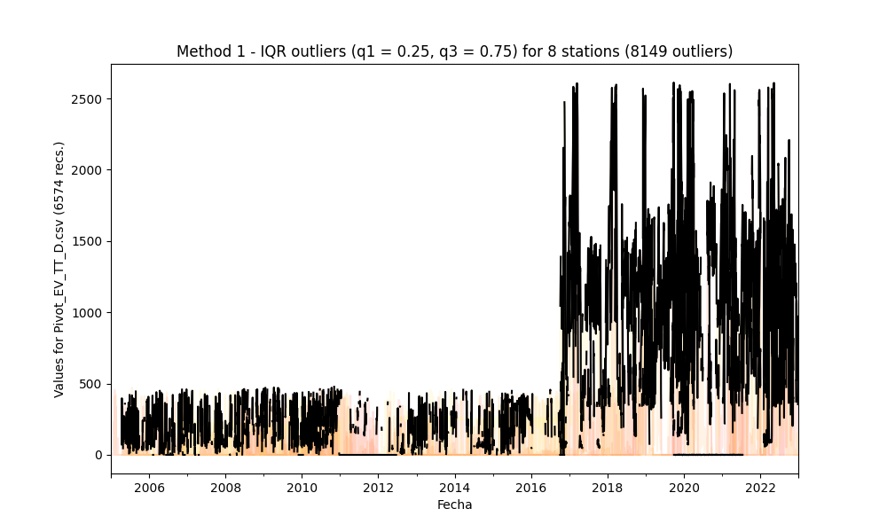

## Outliers detection and processing through statistical methods

* Processed file: [C:/JLGC/R.LTWB/.datasets/IDEAM_EDA/Pivot_EV_TT_D.csv](../IDEAM_EDA/Pivot_EV_TT_D.csv)
* Execution date: 2023-09-20 10:12:41.610487
* Python version: 3.11.5 (tags/v3.11.5:cce6ba9, Aug 24 2023, 14:38:34) [MSC v.1936 64 bit (AMD64)]
* Python path: ['C:\\JLGC\\R.LTWB\\.src', 'C:\\Python311\\python311.zip', 'C:\\Python311\\DLLs', 'C:\\Python311\\Lib', 'C:\\Python311']
* matplotlib version: 3.6.0
* pandas version: 2.1.0
* numpy version: 1.25.2
* Stations exclude: ['28017140', '25027020', '25027410', '25027490', '25027330', '25027390', '25027630', '25027360', '25027320', '16067010', '25027420']
* Print table sample: True
* Instructions & script: https://github.com/rcfdtools/R.LTWB/tree/main/Section03/Outlier
* License: https://github.com/rcfdtools/R.LTWB/blob/main/LICENSE.md
* Credits: r.cfdtools@gmail.com

### General dataframe information with 6574 IDEAM records for 8 stations

Dataframe records head sample

| Fecha               |   21195190 |   21206930 |   21206950 |   21206980 |   21206990 |   21255160 |   24015110 |   35035130 |
|:--------------------|-----------:|-----------:|-----------:|-----------:|-----------:|-----------:|-----------:|-----------:|
| 2004-12-31 00:00:00 |        nan |          0 |        nan |        nan |        nan |        nan |        nan |        nan |
| 2005-01-01 00:00:00 |        nan |          0 |        nan |        nan |        nan |        nan |        nan |        nan |
| 2005-01-02 00:00:00 |        nan |          0 |        nan |        nan |        nan |        nan |        nan |        nan |

Dataframe records tail sample

| Fecha               |   21195190 |   21206930 |   21206950 |   21206980 |   21206990 |   21255160 |   24015110 |   35035130 |
|:--------------------|-----------:|-----------:|-----------:|-----------:|-----------:|-----------:|-----------:|-----------:|
| 2022-12-28 00:00:00 |        556 |        536 |        nan |          0 |          0 |        nan |          0 |        nan |
| 2022-12-29 00:00:00 |        511 |        616 |        nan |          0 |          0 |        nan |          0 |        nan |
| 2022-12-30 00:00:00 |        476 |        584 |        nan |          0 |          0 |        nan |          0 |        nan |

Datatypes for station and nulls values in the initial file

|       | 21195190   | 21206930   | 21206950   | 21206980   | 21206990   | 21255160   | 24015110   | 35035130   |
|:------|:-----------|:-----------|:-----------|:-----------|:-----------|:-----------|:-----------|:-----------|
| Dtype | float64    | float64    | float64    | float64    | float64    | float64    | float64    | float64    |
| Nulls | 1272       | 0          | 380        | 111        | 33         | 636        | 178        | 2570       |

General statistics table - Initial file

|          |   count |     mean |      std |   min |   25% |   50% |   75% |   max |
|---------:|--------:|---------:|---------:|------:|------:|------:|------:|------:|
| 21195190 |    5302 | 221.429  | 446.829  |     0 |     0 |     0 |    78 |  1915 |
| 21206930 |    6574 | 136.26   | 319.19   |     0 |     0 |     0 |   135 |  2582 |
| 21206950 |    6194 | 160.363  | 440.671  |     0 |     0 |     0 |    51 |  2607 |
| 21206980 |    6463 |  83.6293 | 326.543  |     0 |     0 |     0 |    19 |  2612 |
| 21206990 |    6541 | 178.095  | 368.5    |     0 |     0 |     0 |   171 |  2209 |
| 21255160 |    5938 |  24.0607 |  79.2684 |     0 |     0 |     0 |     0 |   473 |
| 24015110 |    6396 | 281.441  | 478.338  |     0 |     0 |     0 |   339 |  1968 |
| 35035130 |    4004 | 186.647  | 153.257  |     0 |   155 |   218 |   246 |  2474 |

### Method 1 - Outliers processing using the interquartile range IQR (q1 = 0.25, q3 = 0.75)

Since the data doesn`t follow a normal distribution, we will calculate the outlier data points using the statistical method called interquartile range (IQR) instead of using Z-score. Using the IQR, the outlier data points are the ones falling below Q1 - 1.5 IQR or above Q3 + 1.5 IQR. The Q1 could be the 25th percentile and Q3 could be the 75th percentile of the dataset, and IQR represents the interquartile range calculated by Q3 minus Q1 (Q3-Q1). [^1]

Outliers parameters:
* mean: mean value
* std: standard deviation value
* q1: quartile 0.25
* q3: quartile 0.75
* IQR: interquartile range (q3-q1)
* OlLowerLim: outlier bottom limit (q1-1.5*IQR)
* OlUpperLim: outlier top limit (q3+1.5*IQR)
* OlMinVal: minimum outlier value founded
* OlMaxVal: maximum outlier value founded
* OlCount: # outliers founded
* CapLowerLim: capped lower limit for outliers replacement ( $\mu$ - 4.5 * $\sigma$ )
* CapUpperLim: capped upper limit for outliers replacement ( $\mu$ + 4.5 * $\sigma$ )

|          |     mean |      std |   q1 |   q3 |   IQR |   OlLowerLim |   OlUpperLim |   OlMinVal |   OlMaxVal |   OlCount |   CapLowerLim |   CapUpperLim |
|---------:|---------:|---------:|-----:|-----:|------:|-------------:|-------------:|-----------:|-----------:|----------:|--------------:|--------------:|
| 21195190 | 221.429  | 446.829  |    0 |   78 |    78 |        117   |        195   |      196   |       1915 |      1216 |     -1789.3   |      2232.16  |
| 21206930 | 136.26   | 319.19   |    0 |  135 |   135 |        202.5 |        337.5 |      338   |       2582 |       827 |     -1300.09  |      1572.61  |
| 21206950 | 160.363  | 440.671  |    0 |   51 |    51 |         76.5 |        127.5 |      128   |       2607 |      1208 |     -1822.65  |      2143.38  |
| 21206980 |  83.6293 | 326.543  |    0 |   19 |    19 |         28.5 |         47.5 |       48   |       2612 |      1099 |     -1385.81  |      1553.07  |
| 21206990 | 178.095  | 368.5    |    0 |  171 |   171 |        256.5 |        427.5 |      428   |       2209 |       852 |     -1480.15  |      1836.34  |
| 21255160 |  24.0607 |  79.2684 |    0 |    0 |     0 |          0   |          0   |        0.1 |        473 |      1177 |      -332.647 |       380.768 |
| 24015110 | 281.441  | 478.338  |    0 |  339 |   339 |        508.5 |        847.5 |      848   |       1968 |      1050 |     -1871.08  |      2433.96  |
| 35035130 | 186.647  | 153.257  |  155 |  246 |    91 |        291.5 |        382.5 |        0   |       2474 |       720 |      -503.01  |       876.303 |

#### Identified and cleaning tables for 8149 IQR outliers founded
* Outliers identified file: [Outlier_IQR_Pivot_EV_TT_D.csv](../../.datasets/IDEAM_Outlier/Outlier_IQR_Pivot_EV_TT_D.csv)
* Outliers dropped file: [Outlier_IQR_Drop_Pivot_EV_TT_D.csv](../../.datasets/IDEAM_Outlier/Outlier_IQR_Drop_Pivot_EV_TT_D.csv)
* Outliers capped file: [Outlier_IQR_Cap_Pivot_EV_TT_D.csv](../../.datasets/IDEAM_Outlier/Outlier_IQR_Cap_Pivot_EV_TT_D.csv)
* Outliers imputed file: [Outlier_IQR_Impute_Pivot_EV_TT_D.csv](../../.datasets/IDEAM_Outlier/Outlier_IQR_Impute_Pivot_EV_TT_D.csv)

#### Statistical values for the capped and imputed file

IQR - General statistics table - Capped file

|          |   count |     mean |     std |     min |   25% |   50% |   75% |      max |
|---------:|--------:|---------:|--------:|--------:|------:|------:|------:|---------:|
| 21195190 |    5302 | 515.215  | 936.935 |    0    |     0 |     0 |    78 | 2232.16  |
| 21206930 |    6574 | 234.782  | 513.216 |    0    |     0 |     0 |   135 | 1572.61  |
| 21206950 |    6194 | 424.357  | 846.462 |    0    |     0 |     0 |    51 | 2143.38  |
| 21206980 |    6463 | 267.271  | 582.111 |    0    |     0 |     0 |    19 | 1553.07  |
| 21206990 |    6541 | 283.834  | 608.3   |    0    |     0 |     0 |   171 | 1836.34  |
| 21255160 |    5938 |  75.474  | 151.808 |    0    |     0 |     0 |     0 |  380.768 |
| 24015110 |    6396 | 471.994  | 884.418 |    0    |     0 |     0 |   339 | 2433.96  |
| 35035130 |    4004 |  95.3435 | 282.092 | -503.01 |   155 |   218 |   246 |  876.303 |

IQR - General statistics table - Imputed file

|          |   count |      mean |       std |   min |     25% |   50% |     75% |      max |
|---------:|--------:|----------:|----------:|------:|--------:|------:|--------:|---------:|
| 21195190 |    5302 |  54.0593  |  93.3901  |     0 |   0     |     0 |  78     | 221.429  |
| 21206930 |    6574 |  54.0902  |  82.2776  |     0 |   0     |     0 | 135     | 337      |
| 21206950 |    6194 |  37.6144  |  63.953   |     0 |   0     |     0 |  51     | 160.363  |
| 21206980 |    6463 |  17.4001  |  31.12    |     0 |   0     |     0 |  19     |  83.6293 |
| 21206990 |    6541 |  67.8383  | 104.04    |     0 |   0     |     0 | 171     | 426      |
| 21255160 |    5938 |   4.76918 |   9.59272 |     0 |   0     |     0 |   0     |  24.0607 |
| 24015110 |    6396 | 118.626   | 176.767   |     0 |   0     |     0 | 281.441 | 845      |
| 35035130 |    4004 | 210.057   |  42.6299  |    20 | 186.647 |   218 | 245     | 318      |

### Method 2 - Outliers processing through empirical rule - ER or _k-sigma_ ( $\mu$ - _k_ * $\sigma$ ) with _k_ = 4.5

The empirical rule, also referred to as the three-sigma rule or 68-95-99.7 rule, is a statistical rule which states that for a normal distribution, almost all observed data will fall within three standard deviations (denoted by $\sigma$) of the mean or average (denoted by $\mu$). In particular, the empirical rule predicts that 68% of observations falls within the first standard deviation ( $\mu$ ± $\sigma$ ), 95% within the first two standard deviations ( $\mu$ ± 2 $\sigma$ ), and 99.7% within the first three standard deviations ( $\mu$ ± 3 $\sigma$ ).[^2]

Outliers parameters:
* mean: mean value
* std: standard deviation value
* OlMinVal: minimum outlier value founded
* OlMaxVal: maximum outlier value founded
* OlCount: # outliers founded
* CapLowerLim: capped lower limit for outliers replacement ( $\mu$ - 4.5 * $\sigma$ )
* CapUpperLim: capped upper limit for outliers replacement ( $\mu$ + 4.5 * $\sigma$ )

|          |     mean |      std |   OlMinVal |   OlMaxVal |   OlCount |   CapLowerLim |   CapUpperLim |
|---------:|---------:|---------:|-----------:|-----------:|----------:|--------------:|--------------:|
| 21195190 | 221.429  | 446.829  |        nan |        nan |         0 |     -1789.3   |      2232.16  |
| 21206930 | 136.26   | 319.19   |       1575 |       2582 |        94 |     -1300.09  |      1572.61  |
| 21206950 | 160.363  | 440.671  |       2147 |       2607 |        76 |     -1822.65  |      2143.38  |
| 21206980 |  83.6293 | 326.543  |       1554 |       2612 |       124 |     -1385.81  |      1553.07  |
| 21206990 | 178.095  | 368.5    |       1849 |       2209 |        20 |     -1480.15  |      1836.34  |
| 21255160 |  24.0607 |  79.2684 |        381 |        473 |        56 |      -332.647 |       380.768 |
| 24015110 | 281.441  | 478.338  |        nan |        nan |         0 |     -1871.08  |      2433.96  |
| 35035130 | 186.647  | 153.257  |        929 |       2474 |        19 |      -503.01  |       876.303 |

#### Identified and cleaning tables for 389 ER or k-sigma outliers founded
* Outliers identified file: [Outlier_ER_Pivot_EV_TT_D.csv](../../.datasets/IDEAM_Outlier/Outlier_ER_Pivot_EV_TT_D.csv)
* Outliers dropped file: [Outlier_ER_Drop_Pivot_EV_TT_D.csv](../../.datasets/IDEAM_Outlier/Outlier_ER_Drop_Pivot_EV_TT_D.csv)
* Outliers capped file: [Outlier_ER_Cap_Pivot_EV_TT_D.csv](../../.datasets/IDEAM_Outlier/Outlier_ER_Cap_Pivot_EV_TT_D.csv)
* Outliers imputed file: [Outlier_ER_Impute_Pivot_EV_TT_D.csv](../../.datasets/IDEAM_Outlier/Outlier_ER_Impute_Pivot_EV_TT_D.csv)

#### Statistical values for the capped and imputed file

ER - General statistics table - Capped file

|          |   count |     mean |      std |   min |   25% |   50% |   75% |      max |
|---------:|--------:|---------:|---------:|------:|------:|------:|------:|---------:|
| 21195190 |    5302 | 221.429  | 446.829  |     0 |     0 |     0 |    78 | 1915     |
| 21206930 |    6574 | 130.54   | 287.186  |     0 |     0 |     0 |   135 | 1572.61  |
| 21206950 |    6194 | 157.197  | 424.978  |     0 |     0 |     0 |    51 | 2143.38  |
| 21206980 |    6463 |  72.9995 | 258.984  |     0 |     0 |     0 |    19 | 1553.07  |
| 21206990 |    6541 | 177.641  | 366.321  |     0 |     0 |     0 |   171 | 1836.34  |
| 21255160 |    5938 |  23.773  |  77.8817 |     0 |     0 |     0 |     0 |  380.768 |
| 24015110 |    6396 | 281.441  | 478.338  |     0 |     0 |     0 |   339 | 1968     |
| 35035130 |    4004 | 181.714  | 104.224  |     0 |   155 |   218 |   246 |  876.303 |

ER - General statistics table - Imputed file

|          |   count |     mean |      std |   min |   25% |   50% |   75% |   max |
|---------:|--------:|---------:|---------:|------:|------:|------:|------:|------:|
| 21195190 |    5302 | 221.429  | 446.829  |     0 |     0 |     0 |    78 |  1915 |
| 21206930 |    6574 | 110.002  | 228.724  |     0 |     0 |     0 |   135 |  1564 |
| 21206950 |    6194 | 132.866  | 362.77   |     0 |     0 |     0 |    51 |  2118 |
| 21206980 |    6463 |  44.8066 | 155.705  |     0 |     0 |     0 |    19 |  1549 |
| 21206990 |    6541 | 172.571  | 354.615  |     0 |     0 |     0 |   171 |  1830 |
| 21255160 |    5938 |  20.409  |  69.6572 |     0 |     0 |     0 |     0 |   380 |
| 24015110 |    6396 | 281.441  | 478.338  |     0 |     0 |     0 |   339 |  1968 |
| 35035130 |    4004 | 178.441  |  92.5315 |     0 |   155 |   218 |   245 |   782 |

### Method 3 - Outliers processing through Z-score >= 4.5 or standard core

Z score is an important concept in statistics. Z score is also called standard score. This score helps to understand if each data value is greater or smaller than mean and how far away it is from the mean. More specifically, Z score tells how many standard deviations away a data point is from the mean. Z = ( x - $\mu$ ) / $\sigma$.[^3]

> Altought with this method, the identified outliers are the same obtained in Method 2 that uses the empirical rule when the Z-score threshold is the same _k-sigma_ value, the Method 3 creates the Z-score table values. Use this method to compare the identified outliers with differents _k-sigma_ values.

Outliers parameters:
* mean: mean value
* std: standard deviation value
* OlMinVal: minimum outlier value founded
* OlMaxVal: maximum outlier value founded
* OlCount: # outliers founded
* CapLowerLim: capped lower limit for outliers replacement ( $\mu$ - 4.5 * $\sigma$ )
* CapUpperLim: capped upper limit for outliers replacement ( $\mu$ + 4.5 * $\sigma$ )

|          |     mean |      std |   OlMinVal |   OlMaxVal |   OlCount |   CapLowerLim |   CapUpperLim |
|---------:|---------:|---------:|-----------:|-----------:|----------:|--------------:|--------------:|
| 21195190 | 221.429  | 446.829  |        nan |        nan |         0 |     -1789.3   |      2232.16  |
| 21206930 | 136.26   | 319.19   |       1575 |       2582 |        94 |     -1300.09  |      1572.61  |
| 21206950 | 160.363  | 440.671  |       2147 |       2607 |        76 |     -1822.65  |      2143.38  |
| 21206980 |  83.6293 | 326.543  |       1554 |       2612 |       124 |     -1385.81  |      1553.07  |
| 21206990 | 178.095  | 368.5    |       1849 |       2209 |        20 |     -1480.15  |      1836.34  |
| 21255160 |  24.0607 |  79.2684 |        381 |        473 |        56 |      -332.647 |       380.768 |
| 24015110 | 281.441  | 478.338  |        nan |        nan |         0 |     -1871.08  |      2433.96  |
| 35035130 | 186.647  | 153.257  |        929 |       2474 |        19 |      -503.01  |       876.303 |

#### Identified and cleaning tables for 389 Z-score or standard core outliers founded
* Outliers Z-score values file: [Outlier_ZScore_Value_Pivot_EV_TT_D.csv](../../.datasets/IDEAM_Outlier/Outlier_ZScore_Value_Pivot_EV_TT_D.csv)
* Outliers identified file: [Outlier_ZScore_Pivot_EV_TT_D.csv](../../.datasets/IDEAM_Outlier/Outlier_ZScore_Pivot_EV_TT_D.csv)
* Outliers dropped file: [Outlier_ZScore_Drop_Pivot_EV_TT_D.csv](../../.datasets/IDEAM_Outlier/Outlier_ZScore_Drop_Pivot_EV_TT_D.csv)
* Outliers capped file: [Outlier_ZScore_Cap_Pivot_EV_TT_D.csv](../../.datasets/IDEAM_Outlier/Outlier_ZScore_Cap_Pivot_EV_TT_D.csv)
* Outliers imputed file: [Outlier_ZScore_Impute_Pivot_EV_TT_D.csv](../../.datasets/IDEAM_Outlier/Outlier_ZScore_Impute_Pivot_EV_TT_D.csv)

#### Statistical values for the capped and imputed file

Z-score - General statistics table - Capped file

|          |   count |     mean |      std |   min |   25% |   50% |   75% |      max |
|---------:|--------:|---------:|---------:|------:|------:|------:|------:|---------:|
| 21195190 |    5302 | 221.429  | 446.829  |     0 |     0 |     0 |    78 | 1915     |
| 21206930 |    6574 | 130.54   | 287.186  |     0 |     0 |     0 |   135 | 1572.61  |
| 21206950 |    6194 | 157.197  | 424.978  |     0 |     0 |     0 |    51 | 2143.38  |
| 21206980 |    6463 |  72.9995 | 258.984  |     0 |     0 |     0 |    19 | 1553.07  |
| 21206990 |    6541 | 177.641  | 366.321  |     0 |     0 |     0 |   171 | 1836.34  |
| 21255160 |    5938 |  23.773  |  77.8817 |     0 |     0 |     0 |     0 |  380.768 |
| 24015110 |    6396 | 281.441  | 478.338  |     0 |     0 |     0 |   339 | 1968     |
| 35035130 |    4004 | 181.714  | 104.224  |     0 |   155 |   218 |   246 |  876.303 |

Z-score - General statistics table - Imputed file

|          |   count |     mean |      std |   min |   25% |   50% |   75% |   max |
|---------:|--------:|---------:|---------:|------:|------:|------:|------:|------:|
| 21195190 |    5302 | 221.429  | 446.829  |     0 |     0 |     0 |    78 |  1915 |
| 21206930 |    6574 | 110.002  | 228.724  |     0 |     0 |     0 |   135 |  1564 |
| 21206950 |    6194 | 132.866  | 362.77   |     0 |     0 |     0 |    51 |  2118 |
| 21206980 |    6463 |  44.8066 | 155.705  |     0 |     0 |     0 |    19 |  1549 |
| 21206990 |    6541 | 172.571  | 354.615  |     0 |     0 |     0 |   171 |  1830 |
| 21255160 |    5938 |  20.409  |  69.6572 |     0 |     0 |     0 |     0 |   380 |
| 24015110 |    6396 | 281.441  | 478.338  |     0 |     0 |     0 |   339 |  1968 |
| 35035130 |    4004 | 178.441  |  92.5315 |     0 |   155 |   218 |   245 |   782 |

> The _drop files_ contains the database values without the outliers identified.
>
> The _capped files_ contains the database values and the outliers has been replaced with the lower or upper capped value calculated. Lower outliers could be replaced with negative values because the limit is defined with (mean() - cap_multiplier * std()). In some cases like _temperature analysis_, the upper outliers values could be replaced with values over the original values and you can try to fix this issue changing the parameter _cap_multiplier_ that defines the stripe values range.
>
> The imputation method replace each outlier value with the mean value that contains the original outliers values.

[^1]: Adapted from: https://careerfoundry.com/en/blog/data-analytics/how-to-find-outliers/
[^2]: https://www.investopedia.com/terms/e/empirical-rule.asp
[^3]: Adapted from: https://www.geeksforgeeks.org/z-score-for-outlier-detection-python/
