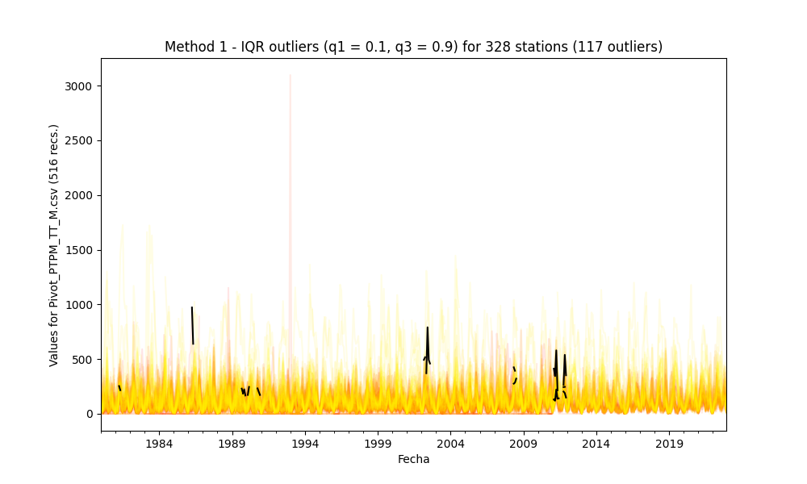
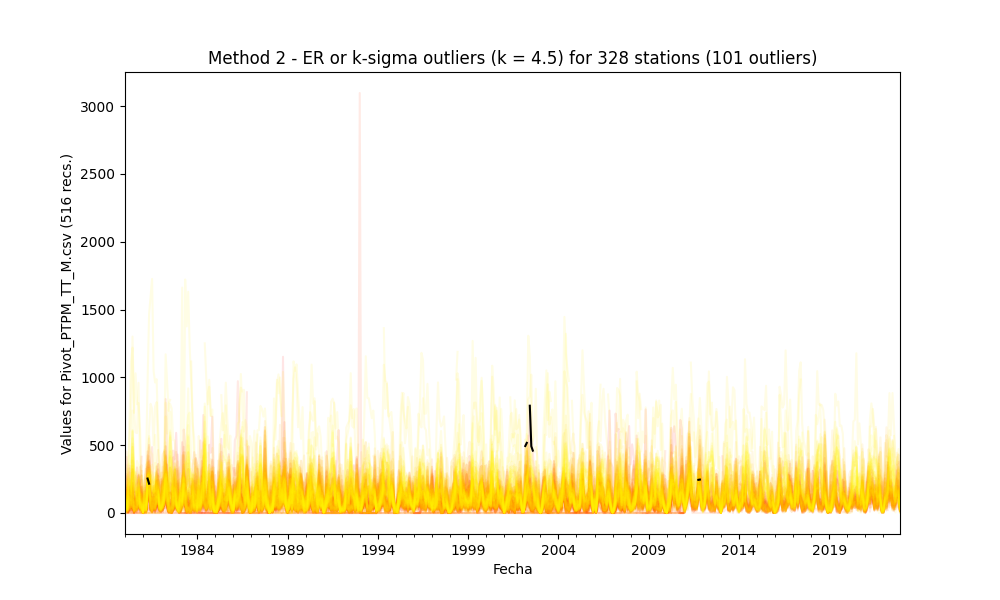
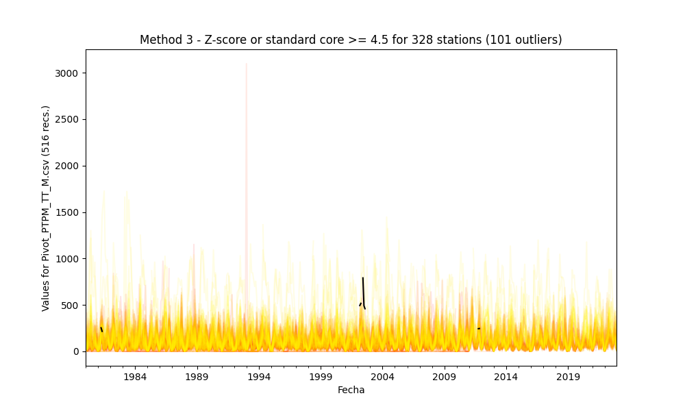

## Outliers detection and processing through statistical methods

* Processed file: [C:/JLGC/R.LTWB/.datasets/IDEAM_EDA/Pivot_PTPM_TT_M.csv](../IDEAM_EDA/Pivot_PTPM_TT_M.csv)
* Execution date: 2023-09-14 18:15:54.286277
* Python version: 3.11.5 (tags/v3.11.5:cce6ba9, Aug 24 2023, 14:38:34) [MSC v.1936 64 bit (AMD64)]
* Python path: ['C:\\JLGC\\R.LTWB\\.src', 'C:\\Python311\\python311.zip', 'C:\\Python311\\DLLs', 'C:\\Python311\\Lib', 'C:\\Python311']
* matplotlib version: 3.6.0
* pandas version: 2.1.0
* numpy version: 1.25.2
* Stations exclude: ['28017140', '25027020', '25027410', '25027490', '25027330', '25027390', '25027630', '25027360', '25027320', '16067010', '25027420']
* Print table sample: True
* Instructions & script: https://github.com/rcfdtools/R.LTWB/tree/main/Section03/Outlier
* License: https://github.com/rcfdtools/R.LTWB/blob/main/LICENSE.md
* Credits: r.cfdtools@gmail.com

### General dataframe information with 516 IDEAM records for 328 stations

Dataframe records head sample

| Fecha               |   21170020 |   21185040 |   21190030 |   21190060 |   21190110 |   21190170 |   21190210 |   21190300 |   21190310 |   21190360 |   21190430 |   21190440 |   21190450 |   21190460 |   21190470 |   21195030 |   21195080 |   21195120 |   21195140 |   21195190 |   21200040 |   21200080 |   21200110 |   21200130 |   21200160 |   21200170 |   21200190 |   21200200 |   21200230 |   21200240 |   21200260 |   21200270 |   21200310 |   21200320 |   21200340 |   21200380 |   21200390 |   21200400 |   21200430 |   21200440 |   21200500 |   21200510 |   21200520 |   21200550 |   21200580 |   21200590 |   21200600 |   21200610 |   21200620 |   21200650 |   21200660 |   21200690 |   21200700 |   21200710 |   21200720 |   21200740 |   21200750 |   21200770 |   21200780 |   21200800 |   21200830 |   21200850 |   21200880 |   21200960 |   21201030 |   21201040 |   21201050 |   21201060 |   21201070 |   21201090 |   21201100 |   21201110 |   21201130 |   21201140 |   21201150 |   21201180 |   21201190 |   21201200 |   21201210 |   21201240 |   21201250 |   21201260 |   21201270 |   21201290 |   21201300 |   21201310 |   21201320 |   21201330 |   21201340 |   21201360 |   21201370 |   21201380 |   21201410 |   21201550 |   21201560 |   21201590 |   21201600 |   21201610 |   21201620 |   21201630 |   21201640 |   21201650 |   21201660 |   21201670 |   21201680 |   21201690 |   21201700 |   21201710 |   21201720 |   21201730 |   21201740 |   21201750 |   21201760 |   21201770 |   21201780 |   21201790 |   21201800 |   21201810 |   21201820 |   21201830 |   21201840 |   21201850 |   21201870 |   21201880 |   21201920 |   21201960 |   21201970 |   21201980 |   21202000 |   21202020 |   21202040 |   21202050 |   21202070 |   21202080 |   21202100 |   21202110 |   21202120 |   21202130 |   21202160 |   21205012 |   21205090 |   21205160 |   21205230 |   21205240 |   21205300 |   21205340 |   21205360 |   21205370 |   21205390 |   21205400 |   21205410 |   21205420 |   21205450 |   21205470 |   21205480 |   21205520 |   21205540 |   21205550 |   21205570 |   21205580 |   21205590 |   21205610 |   21205650 |   21205660 |   21205670 |   21205690 |   21205700 |   21205710 |   21205720 |   21205740 |   21205770 |   21205791 |   21205910 |   21205940 |   21205970 |   21205980 |   21206050 |   21206070 |   21206080 |   21206160 |   21206180 |   21206190 |   21206230 |   21206260 |   21206280 |   21206290 |   21206300 |   21206310 |   21206350 |   21206390 |   21206400 |   21206410 |   21206460 |   21206500 |   21206550 |   21206560 |   21206570 |   21206590 |   21206600 |   21206620 |   21206630 |   21206650 |   21206660 |   21206690 |   21206980 |   21230060 |   21230070 |   21230080 |   21230090 |   21230110 |   21230120 |   21235010 |   21250430 |   21250540 |   21250570 |   21250580 |   21250590 |   21250610 |   21255080 |   23010140 |   23025020 |   23060040 |   23060050 |   23060060 |   23060070 |   23060080 |   23060130 |   23060140 |   23060180 |   23060190 |   23060200 |   23060210 |   23060220 |   23060250 |   23060260 |   23060290 |   23060300 |   23060310 |   23060320 |   23060370 |   23065060 |   23065070 |   23065100 |   23065120 |   23065140 |   23065150 |   23120190 |   23125070 |   23125150 |   24010020 |   24010070 |   24010140 |   24010270 |   24010280 |   24010300 |   24010330 |   24010350 |   24010380 |   24010390 |   24010490 |   24010520 |   24010530 |   24010540 |   24010550 |   24010560 |   24010570 |   24010580 |   24010590 |   24011080 |   24011090 |   24011150 |   24015110 |   24015150 |   24015190 |   24015210 |   24015380 |   35020010 |   35020050 |   35020080 |   35020090 |   35020240 |   35020280 |   35020290 |   35020300 |   35020350 |   35020370 |   35020380 |   35020390 |   35020420 |   35025050 |   35025060 |   35030010 |   35030020 |   35030080 |   35030110 |   35030120 |   35030140 |   35030160 |   35030170 |   35030180 |   35030210 |   35030230 |   35030250 |   35030260 |   35035040 |   35035050 |   35040010 |   35060010 |   35060020 |   35060050 |   35060090 |   35060100 |   35060120 |   35060130 |   35060150 |   35060160 |   35060170 |   35060180 |   35060200 |   35060210 |   35060230 |   35060240 |   35065010 |   35070110 |   35070160 |   35070230 |   35070480 |   35070490 |
|:--------------------|-----------:|-----------:|-----------:|-----------:|-----------:|-----------:|-----------:|-----------:|-----------:|-----------:|-----------:|-----------:|-----------:|-----------:|-----------:|-----------:|-----------:|-----------:|-----------:|-----------:|-----------:|-----------:|-----------:|-----------:|-----------:|-----------:|-----------:|-----------:|-----------:|-----------:|-----------:|-----------:|-----------:|-----------:|-----------:|-----------:|-----------:|-----------:|-----------:|-----------:|-----------:|-----------:|-----------:|-----------:|-----------:|-----------:|-----------:|-----------:|-----------:|-----------:|-----------:|-----------:|-----------:|-----------:|-----------:|-----------:|-----------:|-----------:|-----------:|-----------:|-----------:|-----------:|-----------:|-----------:|-----------:|-----------:|-----------:|-----------:|-----------:|-----------:|-----------:|-----------:|-----------:|-----------:|-----------:|-----------:|-----------:|-----------:|-----------:|-----------:|-----------:|-----------:|-----------:|-----------:|-----------:|-----------:|-----------:|-----------:|-----------:|-----------:|-----------:|-----------:|-----------:|-----------:|-----------:|-----------:|-----------:|-----------:|-----------:|-----------:|-----------:|-----------:|-----------:|-----------:|-----------:|-----------:|-----------:|-----------:|-----------:|-----------:|-----------:|-----------:|-----------:|-----------:|-----------:|-----------:|-----------:|-----------:|-----------:|-----------:|-----------:|-----------:|-----------:|-----------:|-----------:|-----------:|-----------:|-----------:|-----------:|-----------:|-----------:|-----------:|-----------:|-----------:|-----------:|-----------:|-----------:|-----------:|-----------:|-----------:|-----------:|-----------:|-----------:|-----------:|-----------:|-----------:|-----------:|-----------:|-----------:|-----------:|-----------:|-----------:|-----------:|-----------:|-----------:|-----------:|-----------:|-----------:|-----------:|-----------:|-----------:|-----------:|-----------:|-----------:|-----------:|-----------:|-----------:|-----------:|-----------:|-----------:|-----------:|-----------:|-----------:|-----------:|-----------:|-----------:|-----------:|-----------:|-----------:|-----------:|-----------:|-----------:|-----------:|-----------:|-----------:|-----------:|-----------:|-----------:|-----------:|-----------:|-----------:|-----------:|-----------:|-----------:|-----------:|-----------:|-----------:|-----------:|-----------:|-----------:|-----------:|-----------:|-----------:|-----------:|-----------:|-----------:|-----------:|-----------:|-----------:|-----------:|-----------:|-----------:|-----------:|-----------:|-----------:|-----------:|-----------:|-----------:|-----------:|-----------:|-----------:|-----------:|-----------:|-----------:|-----------:|-----------:|-----------:|-----------:|-----------:|-----------:|-----------:|-----------:|-----------:|-----------:|-----------:|-----------:|-----------:|-----------:|-----------:|-----------:|-----------:|-----------:|-----------:|-----------:|-----------:|-----------:|-----------:|-----------:|-----------:|-----------:|-----------:|-----------:|-----------:|-----------:|-----------:|-----------:|-----------:|-----------:|-----------:|-----------:|-----------:|-----------:|-----------:|-----------:|-----------:|-----------:|-----------:|-----------:|-----------:|-----------:|-----------:|-----------:|-----------:|-----------:|-----------:|-----------:|-----------:|-----------:|-----------:|-----------:|-----------:|-----------:|-----------:|-----------:|-----------:|-----------:|-----------:|-----------:|-----------:|-----------:|-----------:|-----------:|-----------:|-----------:|-----------:|-----------:|-----------:|-----------:|-----------:|-----------:|-----------:|-----------:|-----------:|-----------:|-----------:|-----------:|-----------:|-----------:|-----------:|-----------:|-----------:|-----------:|-----------:|-----------:|-----------:|-----------:|-----------:|-----------:|-----------:|-----------:|-----------:|-----------:|-----------:|-----------:|-----------:|-----------:|-----------:|-----------:|
| 1980-01-01 00:00:00 |        nan |      150.7 |        nan |        nan |         59 |       64.4 |         43 |         39 |        nan |        248 |        nan |        nan |        nan |        nan |        nan |       81.9 |        nan |        nan |        nan |       41.4 |        nan |       28.4 |       17.2 |       50.4 |        nan |        nan |       27.9 |       11.9 |       39   |       22.2 |         14 |        nan |        9.4 |       38.2 |       14.9 |          0 |         38 |       23.7 |        3.2 |          5 |         29 |        7.8 |        6.4 |       43.5 |       39.7 |        4.4 |         53 |       18.3 |        nan |        9.4 |       21.4 |       58.5 |         24 |         11 |          0 |          0 |       20   |       59   |        nan |       29.6 |         76 |       53.1 |        8.7 |       26.5 |        nan |       30.5 |        nan |       33.4 |         43 |        127 |         54 |         64 |         16 |          4 |        nan |        nan |        nan |        nan |         14 |          1 |        nan |       72.9 |        nan |        nan |        nan |        nan |        nan |      nan   |      nan   |      nan   |        202 |         17 |         45 |        nan |          0 |        nan |        nan |        nan |        nan |        nan |        nan |        nan |         14 |        nan |        nan |        nan |        nan |       12.6 |       10.1 |        nan |        nan |        nan |          0 |        nan |        nan |        nan |        nan |        nan |        nan |        nan |        nan |        nan |        nan |        nan |        nan |       27.5 |        9.9 |        nan |        nan |        nan |        nan |        nan |        nan |        nan |        nan |        nan |          0 |        nan |        nan |        nan |       14.9 |        6.8 |       27.6 |       36.4 |       31.6 |          5 |       28.8 |       33.4 |       12.6 |       43.5 |       14.8 |        9.7 |        nan |        nan |        0   |       21.5 |        nan |       29   |       13.1 |       55.9 |        3.8 |        8.4 |       28   |       49.8 |      110.4 |       23.7 |       30.9 |       17.5 |        3.5 |       31.8 |      nan   |       28.2 |        nan |        nan |        nan |        nan |        nan |      124.4 |       29.3 |        nan |        nan |        nan |        nan |        nan |        nan |         96 |        nan |        nan |        nan |        nan |        nan |        nan |        nan |        nan |        nan |        nan |        nan |        nan |        nan |        nan |        nan |        nan |        nan |        nan |         43 |         40 |         59 |        nan |        nan |         43 |        nan |      137.1 |         32 |        nan |        nan |        nan |        nan |        nan |       43.8 |        nan |       57.8 |         11 |      334   |        321 |        nan |        nan |        178 |         38 |         57 |          1 |        150 |        nan |          0 |       42.5 |        nan |        nan |        nan |        nan |        nan |        nan |        nan |       98   |        nan |       59.9 |        nan |        nan |         46 |       68.2 |        nan |       31.8 |         24 |          0 |       10.4 |       57.8 |       10   |       22.7 |       28.2 |       14.7 |        6.6 |         20 |         38 |         12 |         18 |         10 |         22 |         20 |         18 |         30 |        nan |        nan |        nan |       47.2 |        4.6 |       24.6 |       18.9 |        nan |         50 |       20.7 |        nan |       26.4 |       14.6 |        nan |        nan |        nan |        nan |        nan |       46.6 |       46.5 |         33 |        nan |        nan |        nan |        125 |        nan |        nan |       55.5 |       49.5 |       29.2 |         29 |        nan |        nan |        nan |        nan |       23.7 |       40.2 |       31   |      114.3 |        nan |         48 |         57 |         67 |       10.7 |        133 |         96 |         27 |         58 |         46 |         80 |         59 |         17 |        124 |         20 |       41.3 |       13   |        nan |       50.9 |        nan |        nan |
| 1980-02-01 00:00:00 |        nan |       65.9 |        nan |        nan |         85 |      272.3 |        164 |        173 |        nan |        287 |        nan |        nan |        nan |        nan |        nan |      208.4 |        nan |        nan |        nan |       54.7 |        nan |      149.5 |       70   |       91.8 |        nan |        nan |       82.4 |       41   |      147.2 |       77   |         46 |         39 |       70.5 |      112.8 |       49.5 |          0 |        185 |      149   |       24.6 |         47 |         91 |       27   |       98.6 |       95   |      133.6 |       53.1 |        136 |       69.5 |        nan |      134   |      125.1 |       49.5 |        172 |         14 |         84 |         29 |       40.5 |      197.5 |        nan |       55.8 |        123 |       54.2 |       42.2 |       67.3 |        nan |       98.5 |        nan |       80.7 |        105 |        167 |         98 |        413 |         68 |         37 |        nan |        nan |        nan |        nan |         57 |         37 |        nan |      116.7 |        nan |        nan |        nan |        nan |        nan |      nan   |      nan   |      nan   |        171 |         73 |         72 |        nan |          0 |        nan |        nan |        nan |        nan |        nan |        nan |        nan |         33 |        nan |        nan |        nan |        nan |       30.8 |       72.4 |        nan |        nan |        nan |         20 |        nan |        nan |        nan |        nan |        nan |        nan |        nan |        nan |        nan |        nan |        nan |        nan |       95.3 |       38.5 |        nan |        nan |        nan |        nan |        nan |        nan |        nan |        nan |        nan |          0 |        nan |        nan |        nan |       49.5 |       31.8 |      115.7 |      101.8 |      113.2 |         24 |       82.4 |       80.7 |       30.8 |       73.4 |       64.2 |       29.7 |        nan |        nan |        0   |       54.1 |        nan |       55.5 |       41   |      115.6 |       84.6 |       19.8 |       63   |       97.4 |       99.1 |       75.4 |      105.2 |       69.1 |       44   |       23.3 |       59.8 |       63.4 |        nan |        nan |        nan |        nan |        nan |      130.1 |      135.8 |        nan |        nan |        nan |        nan |        nan |        nan |        142 |        nan |        nan |        nan |        nan |        nan |        nan |        nan |        nan |        nan |        nan |        nan |        nan |        nan |        nan |        nan |        nan |        nan |        nan |         61 |         50 |         85 |        nan |        nan |         36 |        nan |       59.3 |         25 |        nan |        nan |        nan |        nan |        nan |       20.4 |        nan |       46.9 |         36 |      452.5 |        329 |        nan |        nan |        352 |         63 |        246 |         16 |        263 |        nan |          0 |       66.5 |        nan |        nan |        nan |        nan |        nan |        nan |        nan |      189   |        nan |      223.2 |        nan |        nan |        124 |      252.4 |        nan |       58.6 |        101 |         90 |       74.8 |       92.1 |       83.5 |       68.8 |       60.6 |       90.4 |       31.3 |         60 |         29 |         47 |         51 |         74 |         68 |         96 |         48 |         73 |        nan |        nan |        nan |       98.2 |       72.5 |       58.1 |       96.5 |        nan |          0 |        8.1 |        nan |       25.8 |       19   |        nan |        nan |        nan |        nan |        nan |       52.6 |       37.1 |         22 |        nan |        nan |        nan |         34 |        nan |        nan |       45.4 |       31   |       23.4 |        nan |        nan |        nan |        nan |        nan |      149   |       26.8 |       48.1 |       23   |        nan |         24 |         24 |         11 |       10.2 |         22 |         47 |         55 |         45 |        310 |         16 |         44 |         40 |         10 |         15 |       21.2 |        8.1 |        nan |        5   |        nan |        nan |
| 1980-03-01 00:00:00 |        nan |       43   |        nan |        nan |         50 |      101   |         51 |        172 |        nan |        102 |        nan |        nan |        nan |        nan |        nan |       39.3 |        nan |        nan |        nan |       41.9 |        nan |       33.2 |       23.1 |       38.9 |        nan |        nan |       60.1 |       30.2 |       13.7 |       56.5 |         33 |         42 |       39.2 |       28.3 |       33.8 |          0 |         45 |       28.8 |       12.5 |         57 |         42 |        5.3 |        5.4 |       34   |       27.1 |        5.8 |         16 |        9.4 |        nan |        2.5 |       41.6 |        5   |         62 |          3 |         74 |         14 |       18   |       69   |        nan |       16.8 |         31 |       54   |       30.8 |       39.4 |        nan |       30   |        nan |       64.1 |         38 |         45 |         34 |         98 |         38 |         12 |        nan |        nan |        nan |        nan |          6 |          8 |        nan |       19.7 |        nan |        nan |        nan |        nan |        nan |       24.2 |       28.2 |        7.5 |         35 |         27 |         19 |        nan |          0 |        nan |        nan |        nan |        nan |        nan |        nan |        nan |         14 |        nan |        nan |        nan |        nan |       20.6 |       10.1 |        nan |        nan |        nan |          0 |        nan |        nan |        nan |        nan |        nan |        nan |        nan |        nan |        nan |        nan |        nan |        nan |       26.2 |        7.2 |        nan |        nan |        nan |        nan |        nan |        nan |        nan |        nan |        nan |          0 |        nan |        nan |        nan |       33.8 |       23.4 |       11   |       63.3 |       60.7 |          1 |       60.1 |       64.1 |       20.6 |       19.5 |       49.7 |       14.3 |        nan |        nan |       16.4 |       23.9 |        nan |       24.5 |       10.9 |       11.2 |        4.6 |        7.6 |       29.8 |       62   |       27.8 |        8.9 |      nan   |       10.3 |       10.5 |       31.2 |        2.1 |       28.9 |        nan |        nan |        nan |        nan |        nan |       30.3 |        6.3 |        nan |        nan |        nan |        nan |        nan |        nan |         58 |        nan |        nan |        nan |        nan |        nan |        nan |        nan |        nan |        nan |        nan |        nan |        nan |        nan |        nan |        nan |        nan |        nan |        nan |         18 |         83 |         51 |        nan |        nan |         73 |        nan |      nan   |         60 |        nan |        nan |        nan |        nan |        nan |       55.2 |        nan |       27.3 |         31 |      240.5 |        161 |        nan |        nan |        148 |         33 |         90 |         34 |         69 |        nan |          0 |       28   |        nan |        nan |        nan |        nan |        nan |        nan |        nan |       76.9 |        nan |      126.5 |        nan |        nan |         19 |       82.3 |        nan |       28   |         19 |         31 |       47.5 |       14.7 |       25.5 |       30.7 |       33.1 |       44.3 |       20.5 |         60 |         24 |         29 |         46 |         81 |         30 |         75 |         33 |         41 |        nan |        nan |        nan |       42.9 |       17.5 |       18.4 |       34.3 |        nan |        128 |       28.1 |        nan |       25.3 |       21.2 |        nan |        nan |        nan |        nan |        nan |       45.6 |       40.2 |         11 |        nan |        nan |        nan |        214 |        nan |        nan |      158.7 |      141.8 |       71   |        nan |        nan |        nan |        nan |        nan |       28.8 |       89.2 |      152.8 |      275   |        nan |         48 |         91 |        188 |      163.6 |        194 |        261 |        129 |         89 |         78 |        128 |        119 |        176 |        230 |         85 |       63.3 |       51.7 |        nan |       53   |        nan |        nan |

Dataframe records tail sample

| Fecha               |   21170020 |   21185040 |   21190030 |   21190060 |   21190110 |   21190170 |   21190210 |   21190300 |   21190310 |   21190360 |   21190430 |   21190440 |   21190450 |   21190460 |   21190470 |   21195030 |   21195080 |   21195120 |   21195140 |   21195190 |   21200040 |   21200080 |   21200110 |   21200130 |   21200160 |   21200170 |   21200190 |   21200200 |   21200230 |   21200240 |   21200260 |   21200270 |   21200310 |   21200320 |   21200340 |   21200380 |   21200390 |   21200400 |   21200430 |   21200440 |   21200500 |   21200510 |   21200520 |   21200550 |   21200580 |   21200590 |   21200600 |   21200610 |   21200620 |   21200650 |   21200660 |   21200690 |   21200700 |   21200710 |   21200720 |   21200740 |   21200750 |   21200770 |   21200780 |   21200800 |   21200830 |   21200850 |   21200880 |   21200960 |   21201030 |   21201040 |   21201050 |   21201060 |   21201070 |   21201090 |   21201100 |   21201110 |   21201130 |   21201140 |   21201150 |   21201180 |   21201190 |   21201200 |   21201210 |   21201240 |   21201250 |   21201260 |   21201270 |   21201290 |   21201300 |   21201310 |   21201320 |   21201330 |   21201340 |   21201360 |   21201370 |   21201380 |   21201410 |   21201550 |   21201560 |   21201590 |   21201600 |   21201610 |   21201620 |   21201630 |   21201640 |   21201650 |   21201660 |   21201670 |   21201680 |   21201690 |   21201700 |   21201710 |   21201720 |   21201730 |   21201740 |   21201750 |   21201760 |   21201770 |   21201780 |   21201790 |   21201800 |   21201810 |   21201820 |   21201830 |   21201840 |   21201850 |   21201870 |   21201880 |   21201920 |   21201960 |   21201970 |   21201980 |   21202000 |   21202020 |   21202040 |   21202050 |   21202070 |   21202080 |   21202100 |   21202110 |   21202120 |   21202130 |   21202160 |   21205012 |   21205090 |   21205160 |   21205230 |   21205240 |   21205300 |   21205340 |   21205360 |   21205370 |   21205390 |   21205400 |   21205410 |   21205420 |   21205450 |   21205470 |   21205480 |   21205520 |   21205540 |   21205550 |   21205570 |   21205580 |   21205590 |   21205610 |   21205650 |   21205660 |   21205670 |   21205690 |   21205700 |   21205710 |   21205720 |   21205740 |   21205770 |   21205791 |   21205910 |   21205940 |   21205970 |   21205980 |   21206050 |   21206070 |   21206080 |   21206160 |   21206180 |   21206190 |   21206230 |   21206260 |   21206280 |   21206290 |   21206300 |   21206310 |   21206350 |   21206390 |   21206400 |   21206410 |   21206460 |   21206500 |   21206550 |   21206560 |   21206570 |   21206590 |   21206600 |   21206620 |   21206630 |   21206650 |   21206660 |   21206690 |   21206980 |   21230060 |   21230070 |   21230080 |   21230090 |   21230110 |   21230120 |   21235010 |   21250430 |   21250540 |   21250570 |   21250580 |   21250590 |   21250610 |   21255080 |   23010140 |   23025020 |   23060040 |   23060050 |   23060060 |   23060070 |   23060080 |   23060130 |   23060140 |   23060180 |   23060190 |   23060200 |   23060210 |   23060220 |   23060250 |   23060260 |   23060290 |   23060300 |   23060310 |   23060320 |   23060370 |   23065060 |   23065070 |   23065100 |   23065120 |   23065140 |   23065150 |   23120190 |   23125070 |   23125150 |   24010020 |   24010070 |   24010140 |   24010270 |   24010280 |   24010300 |   24010330 |   24010350 |   24010380 |   24010390 |   24010490 |   24010520 |   24010530 |   24010540 |   24010550 |   24010560 |   24010570 |   24010580 |   24010590 |   24011080 |   24011090 |   24011150 |   24015110 |   24015150 |   24015190 |   24015210 |   24015380 |   35020010 |   35020050 |   35020080 |   35020090 |   35020240 |   35020280 |   35020290 |   35020300 |   35020350 |   35020370 |   35020380 |   35020390 |   35020420 |   35025050 |   35025060 |   35030010 |   35030020 |   35030080 |   35030110 |   35030120 |   35030140 |   35030160 |   35030170 |   35030180 |   35030210 |   35030230 |   35030250 |   35030260 |   35035040 |   35035050 |   35040010 |   35060010 |   35060020 |   35060050 |   35060090 |   35060100 |   35060120 |   35060130 |   35060150 |   35060160 |   35060170 |   35060180 |   35060200 |   35060210 |   35060230 |   35060240 |   35065010 |   35070110 |   35070160 |   35070230 |   35070480 |   35070490 |
|:--------------------|-----------:|-----------:|-----------:|-----------:|-----------:|-----------:|-----------:|-----------:|-----------:|-----------:|-----------:|-----------:|-----------:|-----------:|-----------:|-----------:|-----------:|-----------:|-----------:|-----------:|-----------:|-----------:|-----------:|-----------:|-----------:|-----------:|-----------:|-----------:|-----------:|-----------:|-----------:|-----------:|-----------:|-----------:|-----------:|-----------:|-----------:|-----------:|-----------:|-----------:|-----------:|-----------:|-----------:|-----------:|-----------:|-----------:|-----------:|-----------:|-----------:|-----------:|-----------:|-----------:|-----------:|-----------:|-----------:|-----------:|-----------:|-----------:|-----------:|-----------:|-----------:|-----------:|-----------:|-----------:|-----------:|-----------:|-----------:|-----------:|-----------:|-----------:|-----------:|-----------:|-----------:|-----------:|-----------:|-----------:|-----------:|-----------:|-----------:|-----------:|-----------:|-----------:|-----------:|-----------:|-----------:|-----------:|-----------:|-----------:|-----------:|-----------:|-----------:|-----------:|-----------:|-----------:|-----------:|-----------:|-----------:|-----------:|-----------:|-----------:|-----------:|-----------:|-----------:|-----------:|-----------:|-----------:|-----------:|-----------:|-----------:|-----------:|-----------:|-----------:|-----------:|-----------:|-----------:|-----------:|-----------:|-----------:|-----------:|-----------:|-----------:|-----------:|-----------:|-----------:|-----------:|-----------:|-----------:|-----------:|-----------:|-----------:|-----------:|-----------:|-----------:|-----------:|-----------:|-----------:|-----------:|-----------:|-----------:|-----------:|-----------:|-----------:|-----------:|-----------:|-----------:|-----------:|-----------:|-----------:|-----------:|-----------:|-----------:|-----------:|-----------:|-----------:|-----------:|-----------:|-----------:|-----------:|-----------:|-----------:|-----------:|-----------:|-----------:|-----------:|-----------:|-----------:|-----------:|-----------:|-----------:|-----------:|-----------:|-----------:|-----------:|-----------:|-----------:|-----------:|-----------:|-----------:|-----------:|-----------:|-----------:|-----------:|-----------:|-----------:|-----------:|-----------:|-----------:|-----------:|-----------:|-----------:|-----------:|-----------:|-----------:|-----------:|-----------:|-----------:|-----------:|-----------:|-----------:|-----------:|-----------:|-----------:|-----------:|-----------:|-----------:|-----------:|-----------:|-----------:|-----------:|-----------:|-----------:|-----------:|-----------:|-----------:|-----------:|-----------:|-----------:|-----------:|-----------:|-----------:|-----------:|-----------:|-----------:|-----------:|-----------:|-----------:|-----------:|-----------:|-----------:|-----------:|-----------:|-----------:|-----------:|-----------:|-----------:|-----------:|-----------:|-----------:|-----------:|-----------:|-----------:|-----------:|-----------:|-----------:|-----------:|-----------:|-----------:|-----------:|-----------:|-----------:|-----------:|-----------:|-----------:|-----------:|-----------:|-----------:|-----------:|-----------:|-----------:|-----------:|-----------:|-----------:|-----------:|-----------:|-----------:|-----------:|-----------:|-----------:|-----------:|-----------:|-----------:|-----------:|-----------:|-----------:|-----------:|-----------:|-----------:|-----------:|-----------:|-----------:|-----------:|-----------:|-----------:|-----------:|-----------:|-----------:|-----------:|-----------:|-----------:|-----------:|-----------:|-----------:|-----------:|-----------:|-----------:|-----------:|-----------:|-----------:|-----------:|-----------:|-----------:|-----------:|-----------:|-----------:|-----------:|-----------:|-----------:|-----------:|-----------:|-----------:|-----------:|-----------:|-----------:|-----------:|-----------:|-----------:|-----------:|-----------:|-----------:|-----------:|-----------:|-----------:|-----------:|-----------:|-----------:|-----------:|-----------:|-----------:|
| 2022-10-01 00:00:00 |        115 |        nan |      117.1 |        nan |        nan |        nan |        203 |        nan |      274.9 |        nan |        nan |        nan |        nan |      251.9 |        nan |        nan |        nan |      202.4 |        nan |      176.5 |        nan |        nan |        nan |        nan |      162.8 |        nan |        nan |        nan |        nan |        nan |        nan |        nan |        nan |        nan |        nan |        nan |        nan |        nan |        nan |        nan |        nan |        nan |        nan |        nan |        nan |        nan |        nan |        nan |      126.8 |        nan |        nan |        nan |        nan |        nan |        nan |        nan |        nan |        nan |       73.1 |        nan |        nan |        nan |        nan |        nan |        nan |        nan |      151.1 |      315   |      159.6 |      108.7 |      109   |        nan |        nan |        nan |        nan |      188.8 |      147.4 |      nan   |        nan |      112.1 |        nan |        nan |        nan |        nan |      134.8 |      144.3 |       52.3 |        nan |        nan |        nan |        nan |        nan |        nan |      257.3 |        nan |        nan |        nan |      128.5 |        nan |      122.6 |      115.4 |       65.9 |        nan |        nan |        nan |        nan |        nan |        nan |        nan |        nan |        nan |        nan |        nan |        nan |        nan |        nan |        nan |        nan |        nan |        nan |        nan |        nan |        nan |        nan |      197.4 |        nan |        nan |        nan |        nan |        nan |        nan |        nan |        nan |        nan |        nan |        nan |        nan |        nan |      356.8 |      163.5 |        nan |        nan |        nan |        nan |        nan |        nan |        nan |        nan |        nan |        nan |        nan |       86.9 |        nan |        nan |        nan |        nan |        nan |        nan |        nan |        nan |        nan |        nan |        nan |      268.8 |      240.6 |        nan |      126.1 |      223   |      121.8 |       98.5 |        nan |      155.9 |        193 |      150.6 |        nan |      214.5 |        nan |        nan |        nan |        nan |        nan |        nan |        nan |       92.4 |      181.2 |        nan |        nan |        nan |        nan |        nan |        nan |        nan |        nan |        nan |        nan |      nan   |        nan |        nan |      159   |        nan |        nan |      148.7 |        nan |      nan   |      130.5 |      128.2 |      211.4 |        nan |      244.8 |       99.9 |      310.4 |      159.2 |        nan |        nan |        nan |        nan |        nan |        nan |        nan |        nan |        nan |        nan |        nan |        nan |        nan |        nan |        nan |      190.9 |      235.7 |      234.8 |      252.9 |        nan |        nan |        nan |      220.6 |      355.1 |        nan |        nan |        nan |      400.8 |        nan |        nan |        nan |        nan |        nan |        nan |        nan |        nan |      444.5 |        nan |      139.6 |        nan |        nan |        nan |        nan |        nan |        nan |        nan |        nan |        nan |        nan |        nan |        nan |        nan |        nan |        nan |        nan |        nan |       80.9 |        nan |      135.2 |        nan |        nan |        nan |        nan |      nan   |        192 |        nan |        nan |        nan |        nan |      105.6 |      144.4 |      103.1 |        nan |        nan |        nan |        nan |        nan |        nan |      273.5 |        121 |        413 |       76.6 |        nan |        nan |        nan |        nan |        nan |        nan |        nan |        nan |        nan |        nan |        nan |        nan |        357 |        nan |      210.4 |       91.9 |        nan |      119.8 |      189   |      112.5 |      282.1 |      188.8 |       58.1 |      145.2 |      167.6 |       99.1 |      210.3 |      135.4 |      nan   |      105.2 |        nan |       89.3 |      167.9 |      384.9 |
| 2022-11-01 00:00:00 |        138 |        nan |      181.8 |        nan |        nan |        nan |        173 |        nan |      376.7 |        nan |        nan |        nan |        nan |      227.5 |        nan |        nan |        nan |      157.2 |        nan |      118.5 |        nan |        nan |        nan |        nan |      244.6 |        nan |        nan |        nan |        nan |        nan |        nan |        nan |        nan |        nan |        nan |        nan |        nan |        nan |        nan |        nan |        nan |        nan |        nan |        nan |        nan |        nan |        nan |        nan |      142   |        nan |        nan |        nan |        nan |        nan |        nan |        nan |        nan |        nan |      150.9 |        nan |        nan |        nan |        nan |        nan |        nan |        nan |      164.3 |      147.7 |      236.6 |      292.8 |      111.8 |        nan |        nan |        nan |        nan |      155.4 |       78.2 |      nan   |        nan |      127.4 |        nan |        nan |        nan |        nan |      118.2 |       86.5 |       41.2 |        nan |        nan |        nan |        nan |        nan |        nan |      131.6 |        nan |        nan |        nan |      197.9 |        nan |      185.6 |      183.5 |      184.6 |        nan |        nan |        nan |        nan |        nan |        nan |        nan |        nan |        nan |        nan |        nan |        nan |        nan |        nan |        nan |        nan |        nan |        nan |        nan |        nan |        nan |        nan |      109.4 |        nan |        nan |        nan |        nan |        nan |        nan |        nan |        nan |        nan |        nan |        nan |        nan |        nan |      215.9 |      199.7 |        nan |        nan |        nan |        nan |        nan |        nan |        nan |        nan |        nan |        nan |        nan |       59.8 |        nan |        nan |        nan |        nan |        nan |        nan |        nan |        nan |        nan |        nan |        nan |      183   |      221.1 |        nan |      156.5 |      159.1 |      116   |      136.9 |        nan |      130.9 |        139 |      135.5 |        nan |      132.8 |        nan |        nan |        nan |        nan |        nan |        nan |        nan |       93.4 |       87.9 |        nan |        nan |        nan |        nan |        nan |        nan |        nan |        nan |        nan |        nan |       99.8 |        nan |        nan |      179.1 |        nan |        nan |      125.5 |        nan |      213.4 |      181.9 |       68.2 |      153   |        nan |      315.6 |       38.9 |      327.9 |       51.8 |        nan |        nan |        nan |        nan |        nan |        nan |        nan |        nan |        nan |        nan |        nan |        nan |        nan |        nan |        nan |      295.2 |      337.7 |      199.9 |      362.3 |        nan |        nan |        nan |      297.9 |      432.8 |        nan |        nan |        nan |      429.3 |        nan |        nan |        nan |        nan |        nan |        nan |        nan |        nan |      370.3 |        nan |      142   |        nan |        nan |        nan |        nan |        nan |        nan |        nan |        nan |        nan |        nan |        nan |        nan |        nan |        nan |        nan |        nan |        nan |      100.5 |        nan |      159.5 |        nan |        nan |        nan |        nan |       82.9 |        143 |        nan |        nan |        nan |        nan |       56.3 |      151.8 |       86.9 |        nan |        nan |        nan |        nan |        nan |        nan |      201.5 |        140 |        230 |       74.5 |        nan |        nan |        nan |        nan |        nan |        nan |        nan |        nan |        nan |        nan |        nan |        nan |        472 |        nan |      340.4 |       91.9 |        nan |      104   |      121.5 |       92.5 |      320.8 |      179.9 |       86   |      169.4 |      161.4 |      182.4 |      120.5 |      129.6 |      121.2 |       90.2 |        nan |      nan   |       96   |      211.2 |
| 2022-12-01 00:00:00 |         47 |        nan |       74   |        nan |        nan |        nan |         37 |        nan |      170.4 |        nan |        nan |        nan |        nan |       59   |        nan |        nan |        nan |      112.8 |        nan |       37.3 |        nan |        nan |        nan |        nan |       15.6 |        nan |        nan |        nan |        nan |        nan |        nan |        nan |        nan |        nan |        nan |        nan |        nan |        nan |        nan |        nan |        nan |        nan |        nan |        nan |        nan |        nan |        nan |        nan |       15.8 |        nan |        nan |        nan |        nan |        nan |        nan |        nan |        nan |        nan |      nan   |        nan |        nan |        nan |        nan |        nan |        nan |        nan |       23.4 |       34.1 |       56.9 |      106.6 |       20.5 |        nan |        nan |        nan |        nan |       27.5 |       77.3 |       24.8 |        nan |       18.4 |        nan |        nan |        nan |        nan |        7.9 |       17.9 |       18.7 |        nan |        nan |        nan |        nan |        nan |        nan |       36.7 |        nan |        nan |        nan |       73.5 |        nan |       19.5 |       17.1 |       11.8 |        nan |        nan |        nan |        nan |        nan |        nan |        nan |        nan |        nan |        nan |        nan |        nan |        nan |        nan |        nan |        nan |        nan |        nan |        nan |        nan |        nan |        nan |       47.4 |        nan |        nan |        nan |        nan |        nan |        nan |        nan |        nan |        nan |        nan |        nan |        nan |        nan |      170.2 |      nan   |        nan |        nan |        nan |        nan |        nan |        nan |        nan |        nan |        nan |        nan |        nan |       10.1 |        nan |        nan |        nan |        nan |        nan |        nan |        nan |        nan |        nan |        nan |        nan |       32.3 |       86.2 |        nan |       64.8 |       58.4 |       25   |       29.3 |        nan |       15.6 |         75 |       28   |        nan |       50.1 |        nan |        nan |        nan |        nan |        nan |        nan |        nan |      nan   |       36.8 |        nan |        nan |        nan |        nan |        nan |        nan |        nan |        nan |        nan |        nan |      nan   |        nan |        nan |       51.4 |        nan |        nan |       59   |        nan |      nan   |       59   |       40.2 |       87.3 |        nan |       45.1 |       20.1 |      211.7 |      117.6 |        nan |        nan |        nan |        nan |        nan |        nan |        nan |        nan |        nan |        nan |        nan |        nan |        nan |        nan |        nan |       94   |      271.8 |       58.5 |      117.6 |        nan |        nan |        nan |      159.1 |      252.6 |        nan |        nan |        nan |      217.3 |        nan |        nan |        nan |        nan |        nan |        nan |        nan |        nan |      380.6 |        nan |       34.3 |        nan |        nan |        nan |        nan |        nan |        nan |        nan |        nan |        nan |        nan |        nan |        nan |        nan |        nan |        nan |        nan |        nan |       19.5 |        nan |       49   |        nan |        nan |        nan |        nan |      nan   |         69 |        nan |        nan |        nan |        nan |       35.2 |       49.7 |       27.2 |        nan |        nan |        nan |        nan |        nan |        nan |       55   |         33 |        146 |       33.5 |        nan |        nan |        nan |        nan |        nan |        nan |        nan |        nan |        nan |        nan |        nan |        nan |        223 |        nan |      140.3 |       18.8 |        nan |       34.1 |       36.8 |       22.3 |       65.5 |       26.1 |      nan   |       20.1 |       27.7 |        5   |       22   |       14.1 |       16.2 |        0.3 |        nan |        1   |        2.6 |       78.5 |

Datatypes for station and nulls values in the initial file

|       | 21170020   | 21185040   | 21190030   | 21190060   | 21190110   | 21190170   | 21190210   | 21190300   | 21190310   | 21190360   | 21190430   | 21190440   | 21190450   | 21190460   | 21190470   | 21195030   | 21195080   | 21195120   | 21195140   | 21195190   | 21200040   | 21200080   | 21200110   | 21200130   | 21200160   | 21200170   | 21200190   | 21200200   | 21200230   | 21200240   | 21200260   | 21200270   | 21200310   | 21200320   | 21200340   | 21200380   | 21200390   | 21200400   | 21200430   | 21200440   | 21200500   | 21200510   | 21200520   | 21200550   | 21200580   | 21200590   | 21200600   | 21200610   | 21200620   | 21200650   | 21200660   | 21200690   | 21200700   | 21200710   | 21200720   | 21200740   | 21200750   | 21200770   | 21200780   | 21200800   | 21200830   | 21200850   | 21200880   | 21200960   | 21201030   | 21201040   | 21201050   | 21201060   | 21201070   | 21201090   | 21201100   | 21201110   | 21201130   | 21201140   | 21201150   | 21201180   | 21201190   | 21201200   | 21201210   | 21201240   | 21201250   | 21201260   | 21201270   | 21201290   | 21201300   | 21201310   | 21201320   | 21201330   | 21201340   | 21201360   | 21201370   | 21201380   | 21201410   | 21201550   | 21201560   | 21201590   | 21201600   | 21201610   | 21201620   | 21201630   | 21201640   | 21201650   | 21201660   | 21201670   | 21201680   | 21201690   | 21201700   | 21201710   | 21201720   | 21201730   | 21201740   | 21201750   | 21201760   | 21201770   | 21201780   | 21201790   | 21201800   | 21201810   | 21201820   | 21201830   | 21201840   | 21201850   | 21201870   | 21201880   | 21201920   | 21201960   | 21201970   | 21201980   | 21202000   | 21202020   | 21202040   | 21202050   | 21202070   | 21202080   | 21202100   | 21202110   | 21202120   | 21202130   | 21202160   | 21205012   | 21205090   | 21205160   | 21205230   | 21205240   | 21205300   | 21205340   | 21205360   | 21205370   | 21205390   | 21205400   | 21205410   | 21205420   | 21205450   | 21205470   | 21205480   | 21205520   | 21205540   | 21205550   | 21205570   | 21205580   | 21205590   | 21205610   | 21205650   | 21205660   | 21205670   | 21205690   | 21205700   | 21205710   | 21205720   | 21205740   | 21205770   | 21205791   | 21205910   | 21205940   | 21205970   | 21205980   | 21206050   | 21206070   | 21206080   | 21206160   | 21206180   | 21206190   | 21206230   | 21206260   | 21206280   | 21206290   | 21206300   | 21206310   | 21206350   | 21206390   | 21206400   | 21206410   | 21206460   | 21206500   | 21206550   | 21206560   | 21206570   | 21206590   | 21206600   | 21206620   | 21206630   | 21206650   | 21206660   | 21206690   | 21206980   | 21230060   | 21230070   | 21230080   | 21230090   | 21230110   | 21230120   | 21235010   | 21250430   | 21250540   | 21250570   | 21250580   | 21250590   | 21250610   | 21255080   | 23010140   | 23025020   | 23060040   | 23060050   | 23060060   | 23060070   | 23060080   | 23060130   | 23060140   | 23060180   | 23060190   | 23060200   | 23060210   | 23060220   | 23060250   | 23060260   | 23060290   | 23060300   | 23060310   | 23060320   | 23060370   | 23065060   | 23065070   | 23065100   | 23065120   | 23065140   | 23065150   | 23120190   | 23125070   | 23125150   | 24010020   | 24010070   | 24010140   | 24010270   | 24010280   | 24010300   | 24010330   | 24010350   | 24010380   | 24010390   | 24010490   | 24010520   | 24010530   | 24010540   | 24010550   | 24010560   | 24010570   | 24010580   | 24010590   | 24011080   | 24011090   | 24011150   | 24015110   | 24015150   | 24015190   | 24015210   | 24015380   | 35020010   | 35020050   | 35020080   | 35020090   | 35020240   | 35020280   | 35020290   | 35020300   | 35020350   | 35020370   | 35020380   | 35020390   | 35020420   | 35025050   | 35025060   | 35030010   | 35030020   | 35030080   | 35030110   | 35030120   | 35030140   | 35030160   | 35030170   | 35030180   | 35030210   | 35030230   | 35030250   | 35030260   | 35035040   | 35035050   | 35040010   | 35060010   | 35060020   | 35060050   | 35060090   | 35060100   | 35060120   | 35060130   | 35060150   | 35060160   | 35060170   | 35060180   | 35060200   | 35060210   | 35060230   | 35060240   | 35065010   | 35070110   | 35070160   | 35070230   | 35070480   | 35070490   |
|:------|:-----------|:-----------|:-----------|:-----------|:-----------|:-----------|:-----------|:-----------|:-----------|:-----------|:-----------|:-----------|:-----------|:-----------|:-----------|:-----------|:-----------|:-----------|:-----------|:-----------|:-----------|:-----------|:-----------|:-----------|:-----------|:-----------|:-----------|:-----------|:-----------|:-----------|:-----------|:-----------|:-----------|:-----------|:-----------|:-----------|:-----------|:-----------|:-----------|:-----------|:-----------|:-----------|:-----------|:-----------|:-----------|:-----------|:-----------|:-----------|:-----------|:-----------|:-----------|:-----------|:-----------|:-----------|:-----------|:-----------|:-----------|:-----------|:-----------|:-----------|:-----------|:-----------|:-----------|:-----------|:-----------|:-----------|:-----------|:-----------|:-----------|:-----------|:-----------|:-----------|:-----------|:-----------|:-----------|:-----------|:-----------|:-----------|:-----------|:-----------|:-----------|:-----------|:-----------|:-----------|:-----------|:-----------|:-----------|:-----------|:-----------|:-----------|:-----------|:-----------|:-----------|:-----------|:-----------|:-----------|:-----------|:-----------|:-----------|:-----------|:-----------|:-----------|:-----------|:-----------|:-----------|:-----------|:-----------|:-----------|:-----------|:-----------|:-----------|:-----------|:-----------|:-----------|:-----------|:-----------|:-----------|:-----------|:-----------|:-----------|:-----------|:-----------|:-----------|:-----------|:-----------|:-----------|:-----------|:-----------|:-----------|:-----------|:-----------|:-----------|:-----------|:-----------|:-----------|:-----------|:-----------|:-----------|:-----------|:-----------|:-----------|:-----------|:-----------|:-----------|:-----------|:-----------|:-----------|:-----------|:-----------|:-----------|:-----------|:-----------|:-----------|:-----------|:-----------|:-----------|:-----------|:-----------|:-----------|:-----------|:-----------|:-----------|:-----------|:-----------|:-----------|:-----------|:-----------|:-----------|:-----------|:-----------|:-----------|:-----------|:-----------|:-----------|:-----------|:-----------|:-----------|:-----------|:-----------|:-----------|:-----------|:-----------|:-----------|:-----------|:-----------|:-----------|:-----------|:-----------|:-----------|:-----------|:-----------|:-----------|:-----------|:-----------|:-----------|:-----------|:-----------|:-----------|:-----------|:-----------|:-----------|:-----------|:-----------|:-----------|:-----------|:-----------|:-----------|:-----------|:-----------|:-----------|:-----------|:-----------|:-----------|:-----------|:-----------|:-----------|:-----------|:-----------|:-----------|:-----------|:-----------|:-----------|:-----------|:-----------|:-----------|:-----------|:-----------|:-----------|:-----------|:-----------|:-----------|:-----------|:-----------|:-----------|:-----------|:-----------|:-----------|:-----------|:-----------|:-----------|:-----------|:-----------|:-----------|:-----------|:-----------|:-----------|:-----------|:-----------|:-----------|:-----------|:-----------|:-----------|:-----------|:-----------|:-----------|:-----------|:-----------|:-----------|:-----------|:-----------|:-----------|:-----------|:-----------|:-----------|:-----------|:-----------|:-----------|:-----------|:-----------|:-----------|:-----------|:-----------|:-----------|:-----------|:-----------|:-----------|:-----------|:-----------|:-----------|:-----------|:-----------|:-----------|:-----------|:-----------|:-----------|:-----------|:-----------|:-----------|:-----------|:-----------|:-----------|:-----------|:-----------|:-----------|:-----------|:-----------|:-----------|:-----------|:-----------|:-----------|:-----------|:-----------|:-----------|:-----------|:-----------|:-----------|:-----------|:-----------|:-----------|:-----------|:-----------|:-----------|:-----------|:-----------|:-----------|:-----------|:-----------|:-----------|:-----------|:-----------|:-----------|:-----------|:-----------|:-----------|:-----------|:-----------|:-----------|:-----------|
| Dtype | float64    | float64    | float64    | float64    | float64    | float64    | float64    | float64    | float64    | float64    | float64    | float64    | float64    | float64    | float64    | float64    | float64    | float64    | float64    | float64    | float64    | float64    | float64    | float64    | float64    | float64    | float64    | float64    | float64    | float64    | float64    | float64    | float64    | float64    | float64    | float64    | float64    | float64    | float64    | float64    | float64    | float64    | float64    | float64    | float64    | float64    | float64    | float64    | float64    | float64    | float64    | float64    | float64    | float64    | float64    | float64    | float64    | float64    | float64    | float64    | float64    | float64    | float64    | float64    | float64    | float64    | float64    | float64    | float64    | float64    | float64    | float64    | float64    | float64    | float64    | float64    | float64    | float64    | float64    | float64    | float64    | float64    | float64    | float64    | float64    | float64    | float64    | float64    | float64    | float64    | float64    | float64    | float64    | float64    | float64    | float64    | float64    | float64    | float64    | float64    | float64    | float64    | float64    | float64    | float64    | float64    | float64    | float64    | float64    | float64    | float64    | float64    | float64    | float64    | float64    | float64    | float64    | float64    | float64    | float64    | float64    | float64    | float64    | float64    | float64    | float64    | float64    | float64    | float64    | float64    | float64    | float64    | float64    | float64    | float64    | float64    | float64    | float64    | float64    | float64    | float64    | float64    | float64    | float64    | float64    | float64    | float64    | float64    | float64    | float64    | float64    | float64    | float64    | float64    | float64    | float64    | float64    | float64    | float64    | float64    | float64    | float64    | float64    | float64    | float64    | float64    | float64    | float64    | float64    | float64    | float64    | float64    | float64    | float64    | float64    | float64    | float64    | float64    | float64    | float64    | float64    | float64    | float64    | float64    | float64    | float64    | float64    | float64    | float64    | float64    | float64    | float64    | float64    | float64    | float64    | float64    | float64    | float64    | float64    | float64    | float64    | float64    | float64    | float64    | float64    | float64    | float64    | float64    | float64    | float64    | float64    | float64    | float64    | float64    | float64    | float64    | float64    | float64    | float64    | float64    | float64    | float64    | float64    | float64    | float64    | float64    | float64    | float64    | float64    | float64    | float64    | float64    | float64    | float64    | float64    | float64    | float64    | float64    | float64    | float64    | float64    | float64    | float64    | float64    | float64    | float64    | float64    | float64    | float64    | float64    | float64    | float64    | float64    | float64    | float64    | float64    | float64    | float64    | float64    | float64    | float64    | float64    | float64    | float64    | float64    | float64    | float64    | float64    | float64    | float64    | float64    | float64    | float64    | float64    | float64    | float64    | float64    | float64    | float64    | float64    | float64    | float64    | float64    | float64    | float64    | float64    | float64    | float64    | float64    | float64    | float64    | float64    | float64    | float64    | float64    | float64    | float64    | float64    | float64    | float64    | float64    | float64    | float64    | float64    | float64    | float64    | float64    | float64    | float64    | float64    | float64    | float64    | float64    | float64    | float64    | float64    | float64    | float64    | float64    | float64    | float64    | float64    | float64    | float64    | float64    | float64    | float64    | float64    |
| Nulls | 58         | 9          | 84         | 360        | 504        | 509        | 13         | 140        | 17         | 511        | 484        | 486        | 484        | 217        | 360        | 336        | 280        | 44         | 342        | 10         | 504        | 162        | 161        | 143        | 73         | 505        | 186        | 140        | 211        | 139        | 178        | 212        | 155        | 153        | 141        | 329        | 504        | 152        | 228        | 414        | 445        | 177        | 147        | 174        | 444        | 444        | 151        | 504        | 63         | 446        | 444        | 174        | 439        | 385        | 477        | 132        | 374        | 144        | 68         | 191        | 399        | 152        | 204        | 390        | 137        | 387        | 79         | 35         | 5          | 16         | 47         | 349        | 305        | 61         | 400        | 63         | 62         | 90         | 34         | 102        | 161        | 396        | 254        | 480        | 62         | 78         | 63         | 393        | 386        | 176        | 386        | 386        | 144        | 88         | 144        | 391        | 141        | 96         | 263        | 150        | 99         | 104        | 144        | 468        | 458        | 464        | 482        | 372        | 156        | 456        | 456        | 480        | 174        | 228        | 488        | 244        | 241        | 496        | 469        | 480        | 244        | 329        | 480        | 314        | 169        | 139        | 116        | 223        | 347        | 263        | 267        | 265        | 264        | 268        | 480        | 261        | 140        | 389        | 141        | 272        | 408        | 264        | 348        | 148        | 473        | 446        | 445        | 500        | 284        | 263        | 284        | 3          | 489        | 491        | 384        | 310        | 433        | 456        | 284        | 90         | 336        | 372        | 171        | 22         | 18         | 138        | 28         | 76         | 34         | 33         | 57         | 71         | 87         | 210        | 512        | 46         | 279        | 336        | 360        | 324        | 123        | 383        | 285        | 168        | 141        | 219        | 255        | 456        | 487        | 456        | 253        | 471        | 512        | 410        | 434        | 280        | 439        | 351        | 316        | 438        | 433        | 330        | 412        | 339        | 17         | 10         | 4          | 360        | 12         | 10         | 89         | 8          | 242        | 266        | 287        | 285        | 266        | 286        | 51         | 444        | 102        | 384        | 396        | 336        | 444        | 470        | 439        | 50         | 1          | 32         | 6          | 460        | 408        | 446        | 98         | 77         | 504        | 504        | 421        | 350        | 223        | 386        | 182        | 36         | 468        | 480        | 384        | 295        | 229        | 384        | 7          | 42         | 376        | 284        | 384        | 412        | 384        | 132        | 214        | 397        | 384        | 384        | 384        | 384        | 384        | 384        | 384        | 384        | 90         | 259        | 365        | 285        | 384        | 386        | 226        | 387        | 67         | 396        | 512        | 457        | 140        | 27         | 41         | 62         | 97         | 481        | 203        | 147        | 144        | 115        | 111        | 132        | 49         | 87         | 321        | 220        | 341        | 203        | 275        | 280        | 396        | 240        | 287        | 139        | 399        | 444        | 43         | 514        | 46         | 10         | 49         | 23         | 18         | 14         | 36         | 15         | 20         | 8          | 1          | 8          | 5          | 44         | 44         | 1          | 492        | 26         | 48         | 78         |

General statistics table - Initial file

|          |   count |     mean |       std |   min |     25% |    50% |     75% |    max |
|---------:|--------:|---------:|----------:|------:|--------:|-------:|--------:|-------:|
| 21170020 |     458 | 100.962  |  77.3544  |   0   |  40.525 |  81.95 | 148.225 |  446   |
| 21185040 |     507 | 100.744  |  77.6364  |   0   |  39.55  |  87.6  | 143.75  |  502.7 |
| 21190030 |     432 |  96.8424 |  67.4744  |   0.4 |  44.125 |  87.2  | 128.75  |  475.1 |
| 21190060 |     156 | 131.326  |  90.1943  |   0   |  61.5   | 132.5  | 201     |  342   |
| 21190110 |      12 |  73.9583 |  33.6117  |   7   |  53.75  |  77.5  |  97.25  |  118.5 |
| 21190170 |       7 |  98.0286 |  81.3592  |  14.4 |  69.95  |  78.1  |  90.75  |  272.3 |
| 21190210 |     503 | 122.542  | 108.166   |   0   |  43.15  | 101.9  | 177     | 1152   |
| 21190300 |     376 | 174.428  | 153.124   |   0   |  65     | 135.4  | 237.725 |  764   |
| 21190310 |     499 | 142.807  |  89.402   |   6.6 |  70.15  | 124    | 196.45  |  479   |
| 21190360 |       5 | 217.38   | 111.237   | 101.9 | 102     | 248    | 287     |  348   |
| 21190430 |      32 |  70.3063 |  87.225   |   0   |   0     |  43.45 | 100.8   |  351.4 |
| 21190440 |      30 |  74.4567 | 103.899   |   0   |   0     |  22.05 | 142.35  |  413.9 |
| 21190450 |      32 |  56.9906 |  71.7864  |   0   |   0     |  29.4  |  92.2   |  250.8 |
| 21190460 |     299 |  97.7941 |  58.3006  |   0   |  57.95  |  85.5  | 133.05  |  417.6 |
| 21190470 |     156 |  76.2609 |  48.1221  |   0   |  41.725 |  71.75 | 106.45  |  205.3 |
| 21195030 |     180 |  87.4622 |  58.519   |   5   |  37.1   |  80    | 124.3   |  283.9 |
| 21195080 |     236 | 120.083  |  89.9106  |   0   |  44.35  | 107.95 | 172.175 |  385.9 |
| 21195120 |     472 | 115.896  |  70.8954  |   1.9 |  60.55  | 105.65 | 158.725 |  352.2 |
| 21195140 |     174 |  56.4833 |  61.441   |   0   |   0     |  38.95 |  89.15  |  277.2 |
| 21195190 |     506 |  74.6785 |  46.4629  |   0   |  38.75  |  64.25 | 104.725 |  262.6 |
| 21200040 |      12 |  30.35   |  14.5619  |   0.7 |  20.825 |  33.4  |  36.15  |   55.8 |
| 21200080 |     354 | 106.725  |  60.8913  |   4.6 |  62.225 |  97.65 | 135.7   |  378.3 |
| 21200110 |     355 |  65.4727 |  40.51    |   1.7 |  36.8   |  57.7  |  84.75  |  261.7 |
| 21200130 |     373 | 105.404  |  60.1798  |   1   |  62.7   |  99.5  | 133.7   |  410.9 |
| 21200160 |     443 |  94.2102 |  63.1426  |   0   |  46.6   |  85.7  | 130.75  |  369.5 |
| 21200170 |      11 |  61.4727 |  39.7307  |  19.6 |  26.25  |  56.8  |  78.85  |  130.3 |
| 21200190 |     330 | 118.996  |  72.3121  |   0   |  66.9   | 111.75 | 157.95  |  345.2 |
| 21200200 |     376 |  68.6545 |  41.1936  |   0.1 |  39.525 |  62.8  |  89.875 |  230.1 |
| 21200230 |     305 |  89.9007 |  66.4203  |   1.4 |  38.8   |  73.5  | 120.3   |  345.2 |
| 21200240 |     377 | 110.255  |  59.6102  |   0   |  69.7   | 104.2  | 145.4   |  372.6 |
| 21200260 |     338 |  84.3908 |  55.9034  |   0   |  46.475 |  73.1  | 114.15  |  415.5 |
| 21200270 |     304 |  64.0273 |  46.3141  |   0   |  28.575 |  54.1  |  91.85  |  253   |
| 21200310 |     361 |  77.3424 |  53.1054  |   0.9 |  34.8   |  66.2  | 106.6   |  277.6 |
| 21200320 |     363 |  96.7683 |  55.6073  |   8.3 |  57     |  85.6  | 128.2   |  369.9 |
| 21200340 |     375 |  83.384  |  48.569   |   0.9 |  45.15  |  80.7  | 113.25  |  235.1 |
| 21200380 |     187 |  18.0417 |  40.2679  |   0   |   0     |   0    |   0     |  171.2 |
| 21200390 |      12 |  77.6667 |  54.3814  |  21   |  34.5   |  55    | 115.75  |  185   |
| 21200400 |     364 |  91.825  |  60.0725  |   5.4 |  47.65  |  80.7  | 118.975 |  341.6 |
| 21200430 |     288 |  54.7118 |  37.0766  |   0   |  26.075 |  51.3  |  77     |  204.1 |
| 21200440 |     102 |  83.4559 |  77.2348  |   0   |  31     |  56.5  | 110     |  362   |
| 21200500 |      71 |  87.7268 |  45.5238  |   6   |  54.5   |  83    | 108.5   |  215   |
| 21200510 |     339 |  51.7212 |  37.8057  |   0   |  23.8   |  47.3  |  73.1   |  197   |
| 21200520 |     369 |  57.2322 |  40.4631  |   0   |  27.9   |  48.6  |  79.2   |  227.3 |
| 21200550 |     342 |  72.9415 |  54.6957  |   0   |  33.35  |  63.2  | 104     |  297   |
| 21200580 |      72 |  72.8472 |  50.341   |   5.5 |  36.1   |  67.7  |  94.95  |  230.6 |
| 21200590 |      72 |  57.3611 |  42.8048  |   0   |  26.425 |  46.05 |  82.575 |  208   |
| 21200600 |     365 |  83.3326 |  59.8794  |   0   |  39     |  69.6  | 118.4   |  359   |
| 21200610 |      12 |  70.0083 |  41.6992  |   9.4 |  36.975 |  77.1  | 100.15  |  131.7 |
| 21200620 |     453 | 110.179  |  90.8129  |   0   |  42.6   |  89.8  | 150.5   |  454.6 |
| 21200650 |      70 |  76.7857 |  57.2283  |   2.5 |  33.6   |  64.05 |  97.625 |  250.8 |
| 21200660 |      72 |  78.0139 |  53.2182  |   2.4 |  41.9   |  67.15 | 101.475 |  240.5 |
| 21200690 |     342 |  77.6749 |  72.2486  |   0   |  25     |  59.35 | 110.75  |  420.5 |
| 21200700 |      77 | 138.021  |  99.2402  |   0   |  50     | 140    | 208     |  401   |
| 21200710 |     131 |  66.2053 |  72.6215  |   0   |  17     |  45    |  87.5   |  417.2 |
| 21200720 |      39 | 132.372  | 111.982   |   0   |  61.5   | 114    | 178     |  488   |
| 21200740 |     384 |  57.6419 |  55.7992  |   0   |  13.575 |  46.4  |  82.35  |  287   |
| 21200750 |     142 |  47.65   |  36.7269  |   0   |  20.025 |  36.75 |  64     |  194   |
| 21200770 |     372 |  75.2532 |  62.0728  |   0   |  34.15  |  60.95 | 105.475 |  377.5 |
| 21200780 |     448 | 100.515  |  68.9621  |   0.5 |  50.35  |  85.25 | 136.1   |  395.9 |
| 21200800 |     325 |  67.4126 |  68.1508  |   0   |  30     |  55.4  |  84.4   |  791   |
| 21200830 |     117 | 134.879  |  87.7839  |   2   |  68     | 118    | 187     |  454   |
| 21200850 |     364 |  81.6505 |  68.2833  |   0   |  31.475 |  71.25 | 115.75  |  486.5 |
| 21200880 |     312 |  69.7471 |  43.7551  |   1.6 |  39.35  |  60.2  |  90.5   |  290   |
| 21200960 |     126 |  56.9111 |  40.4893  |   0   |  28.325 |  51.5  |  75     |  226   |
| 21201030 |     379 |  72.4731 |  54.9141  |   0   |  32.3   |  67.3  | 100.75  |  352.5 |
| 21201040 |     129 |  66.2357 |  53.5152  |   0   |  28.5   |  52    |  90     |  241.5 |
| 21201050 |     437 |  80.6622 |  48.9035  |   0   |  47     |  71.8  | 105.3   |  280.9 |
| 21201060 |     481 | 101.887  |  58.8644  |   0   |  59     |  91.2  | 130.8   |  339.2 |
| 21201070 |     511 |  72.9718 |  48.8515  |   0   |  33.4   |  64.3  |  99.25  |  244.7 |
| 21201090 |     500 | 130.214  | 125.314   |   0   |  45     |  98    | 174.925 |  972   |
| 21201100 |     469 |  95.3422 |  80.245   |   0   |  32.7   |  80.5  | 134.8   |  517.1 |
| 21201110 |     167 | 100.327  |  77.2767  |   0   |  44.3   |  80    | 127.75  |  413   |
| 21201130 |     211 |  39.2844 | 214.98    |   0   |   0     |   5.3  |  39.95  | 3096.9 |
| 21201140 |     455 |  56.2013 |  45.942   |   0   |  22.3   |  44.6  |  78.6   |  287.7 |
| 21201150 |     116 |  63.0302 |  54.3102  |   1.6 |  26.975 |  46.95 |  76.6   |  264.2 |
| 21201180 |     453 |  72.5448 |  49.2636  |   0   |  38.1   |  60.5  |  94.5   |  293.6 |
| 21201190 |     454 |  71.0804 |  46.4813  |   0   |  38.675 |  60.45 |  90.2   |  267.3 |
| 21201200 |     426 |  68.807  |  51.2968  |   0   |  31.675 |  55.8  |  93.7   |  287.6 |
| 21201210 |     482 |  63.1216 |  41.8644  |   0   |  30.8   |  56.75 |  84.875 |  212.5 |
| 21201240 |     414 |  58.5    |  38.188   |   0   |  30.225 |  51.85 |  82.025 |  234.9 |
| 21201250 |     355 |  62.6623 |  38.2032  |   0   |  36.6   |  56.6  |  80.75  |  218.4 |
| 21201260 |     120 | 141.252  |  96.3157  |   4.5 |  62.7   | 132.75 | 193.25  |  489.9 |
| 21201270 |     262 |  69.8164 |  47.1582  |   0   |  33.65  |  60.7  |  97.225 |  262.6 |
| 21201290 |      36 | 110.917  |  63.5387  |   0   |  71.275 |  95.1  | 134.975 |  304   |
| 21201300 |     454 | 100.285  |  60.8702  |   0   |  53     |  91.45 | 145.025 |  277.1 |
| 21201310 |     438 |  60.4854 |  47.0005  |   0.1 |  26.8   |  48.3  |  84.975 |  350.8 |
| 21201320 |     453 |  61.4799 |  47.2099  |   0.6 |  28.9   |  49.5  |  80.2   |  281.7 |
| 21201330 |     123 |  77.7041 |  52.2158  |   0.1 |  36.95  |  70.7  | 107.2   |  242.8 |
| 21201340 |     130 |  53.6831 |  42.1384  |   0   |  24.8   |  43.3  |  70.775 |  272.5 |
| 21201360 |     340 |  60.2465 |  49.3433  |   0   |  24.95  |  48.25 |  86.425 |  324.2 |
| 21201370 |     130 | 128.578  |  96.0866  |   0   |  45.25  | 125    | 186.75  |  522   |
| 21201380 |     130 |  65.6315 |  54.1247  |   0   |  28     |  56    |  86.675 |  340.9 |
| 21201410 |     372 |  68.0226 |  46.5971  |   0   |  34.95  |  58.95 |  91.925 |  293   |
| 21201550 |     428 |  73.0119 |  49.1333  |   0   |  37.075 |  60.8  | 101.125 |  257.3 |
| 21201560 |     372 |  42.0669 |  37.7531  |   0   |  12.325 |  35.7  |  59.725 |  178.8 |
| 21201590 |     125 |  56.372  |  40.0947  |   1   |  26.1   |  44.8  |  77.8   |  182.2 |
| 21201600 |     375 |  91.2717 |  63.6228  |   3.1 |  44.75  |  70.7  | 127.5   |  370.5 |
| 21201610 |     420 |  65.3083 |  36.7882  |   0   |  38.15  |  59.35 |  88.3   |  197.9 |
| 21201620 |     253 |  57.1391 |  54.8029  |   0   |  24.7   |  48.2  |  70.8   |  403.4 |
| 21201630 |     366 |  76.5049 |  49.4603  |   0.5 |  39.85  |  68.6  | 105.95  |  263.7 |
| 21201640 |     417 |  63.9796 |  41.1462  |   0   |  36.8   |  56    |  81.6   |  260.9 |
| 21201650 |     412 |  65.4517 |  43.0994  |   0   |  33.8   |  60.65 |  86.7   |  278.7 |
| 21201660 |     372 |  41.1183 |  39.6495  |   0   |   9.15  |  33.65 |  58.425 |  235   |
| 21201670 |      48 |  60.8167 |  36.8105  |   3.8 |  38.9   |  58.7  |  73.75  |  169.7 |
| 21201680 |      58 |  57.0172 |  36.3568  |   5.1 |  36.025 |  48.55 |  72.775 |  164.3 |
| 21201690 |      52 |  49.9558 |  36.4699  |   0   |  20.5   |  41.45 |  67.575 |  142.7 |
| 21201700 |      34 |  58.0294 |  33.4966  |   0.2 |  37.1   |  54.4  |  71.925 |  131.9 |
| 21201710 |     144 |  81.2979 |  53.2924  |   0   |  34.625 |  73.95 | 110.675 |  245.4 |
| 21201720 |     360 |  59.8239 |  80.7352  |   0   |  10.625 |  39.8  |  68.025 |  588   |
| 21201730 |      60 |  50.975  |  37.8777  |   0   |  20.775 |  46.45 |  69.025 |  178   |
| 21201740 |      60 |  59.26   |  50.3584  |   0   |  21     |  44.5  |  87.25  |  239.5 |
| 21201750 |      36 |  80.825  |  89.5499  |   0   |  23.3   |  45.4  | 101.175 |  435.5 |
| 21201760 |     342 |  22.4763 |  35.0083  |   0   |   0     |   9.8  |  28.225 |  254   |
| 21201770 |     288 |  18.6983 |  51.2707  |   0   |   0     |   0    |   0     |  323.3 |
| 21201780 |      28 | 111.65   |  95.9894  |   0   |  48.85  |  85.05 | 176.3   |  382.1 |
| 21201790 |     272 |  12.1478 |  40.0222  |   0   |   0     |   0    |   0     |  245.6 |
| 21201800 |     275 |  79.4905 |  66.4534  |   0   |  27.05  |  68.5  | 116     |  288   |
| 21201810 |      20 |  75.525  |  73.7806  |   0   |  26.275 |  62.55 |  98.8   |  309.5 |
| 21201820 |      47 | 162.891  |  96.039   |  32.7 |  90.55  | 153.2  | 204.15  |  436.7 |
| 21201830 |      36 |  97.0306 |  64.6702  |  20.9 |  50     |  93.8  | 113.725 |  310   |
| 21201840 |     272 |  20.9996 |  74.8932  |   0   |   0     |   0    |   0     |  580   |
| 21201850 |     187 |  67.6968 |  77.3791  |   0   |   0     |  45.3  | 111.05  |  355.1 |
| 21201870 |      36 |  55.1111 |  37.4464  |   4.9 |  31.025 |  47.6  |  75.575 |  191.7 |
| 21201880 |     202 |  37.4837 |  41.6853  |   0   |   0     |  28.8  |  59.4   |  175.4 |
| 21201920 |     347 |  80.2911 |  64.0757  |   0   |  35.2   |  61.4  | 107.15  |  489   |
| 21201960 |     377 |  74.3469 |  61.9521  |   0   |  27.6   |  61.4  | 105.1   |  313.7 |
| 21201970 |     400 |  49.6568 |  37.5886  |   0   |  21.45  |  42.6  |  70.9   |  214.2 |
| 21201980 |     293 |  89.3904 |  62.7821  |   0   |  44.7   |  80.6  | 123.3   |  312.6 |
| 21202000 |     169 |  81.3556 |  58.9757  |   0   |  36.9   |  73.6  | 119     |  292.1 |
| 21202020 |     253 |  84.083  |  51.6466  |   0.6 |  47.7   |  72.1  | 105.2   |  257.6 |
| 21202040 |     249 |  94.1104 |  58.1097  |   0   |  51.1   |  90    | 125.3   |  285   |
| 21202050 |     251 |  58.8837 |  38.0447  |   0   |  32.15  |  51    |  80.55  |  226.7 |
| 21202070 |     252 |  62.0484 |  43.1593  |   0   |  30.125 |  51.8  |  86.025 |  212   |
| 21202080 |     248 |  71.7798 |  46.5514  |   0   |  34.075 |  64.1  |  97.125 |  218   |
| 21202100 |      36 | 103.528  |  58.1463  |   1.8 |  72.625 |  93.05 | 141.4   |  267.4 |
| 21202110 |     255 |  46.1133 |  31.288   |   0.4 |  21.6   |  40.2  |  66.4   |  150.3 |
| 21202120 |     376 |  59.209  |  46.1514  |   0   |  24.2   |  51.1  |  80.75  |  313.2 |
| 21202130 |     127 |  84.2874 |  57.7859  |   0   |  37.85  |  79.3  | 108.65  |  278.8 |
| 21202160 |     375 | 144.402  |  92.5128  |   7.1 |  69.25  | 121.5  | 198.8   |  472.9 |
| 21205012 |     244 |  82.168  |  55.4976  |   0   |  41.35  |  69.15 | 105.1   |  269.1 |
| 21205090 |     108 |  81.7111 |  48.3869  |   0.9 |  44.375 |  81    | 112.85  |  214   |
| 21205160 |     252 |  58.6881 |  39.8319  |   1.9 |  28.675 |  47.9  |  80.15  |  216.9 |
| 21205230 |     168 |  81.3935 |  56.09    |   5.7 |  38.75  |  69.15 | 114.1   |  307.8 |
| 21205240 |     368 |  93.3111 |  54.998   |   6.9 |  53.75  |  82.75 | 121.575 |  290.1 |
| 21205300 |      43 | 114.23   |  68.2572  |   2.2 |  62.95  | 113.4  | 150.7   |  317.2 |
| 21205340 |      70 |  48.9014 |  36.5511  |   0   |  20.875 |  35    |  73.75  |  138   |
| 21205360 |      71 | 133.499  |  76.4427  |  10   |  76.3   | 133.2  | 167.05  |  334.6 |
| 21205370 |      16 |  58.4937 |  67.9274  |   0   |   0     |  48.75 |  87.075 |  208.8 |
| 21205390 |     232 |  80.9483 |  52.3226  |   0   |  40.225 |  72    | 109.975 |  262.7 |
| 21205400 |     253 |  54.6466 |  41.6979  |   0   |  26.9   |  46.6  |  68.5   |  282.7 |
| 21205410 |     232 |  78.7246 |  47.2532  |   4.5 |  47.175 |  67.7  | 102.7   |  265.5 |
| 21205420 |     513 |  59.2308 |  39.9813  |   0.4 |  29.2   |  50.8  |  82.8   |  198.4 |
| 21205450 |      27 |  63.1815 |  50.0314  |  14.5 |  29.35  |  52.7  |  78.15  |  228.8 |
| 21205470 |      25 |  53.432  |  36.9784  |   4.6 |  24.7   |  48.2  |  64.9   |  170.3 |
| 21205480 |     132 |  66.9402 |  42.9478  |   0   |  36.25  |  64.95 |  93.425 |  214.9 |
| 21205520 |     206 |  67.4243 |  46.5925  |   3.4 |  31.35  |  56.4  |  93.275 |  221.3 |
| 21205540 |      83 |  80.388  |  58.2206  |   0.5 |  38.1   |  62.2  | 108.85  |  286.8 |
| 21205550 |      60 | 112.48   | 103.41    |   5.5 |  40.25  |  93.5  | 173     |  450   |
| 21205570 |     232 |  64.2841 |  42.0038  |   0   |  33.3   |  56    |  85.75  |  212.1 |
| 21205580 |     426 |  97.3901 |  61.1845  |   0   |  52.725 |  82.55 | 131.675 |  396   |
| 21205590 |     180 |  61.4317 |  44.1272  |   0   |  29.675 |  52.4  |  80.4   |  258.4 |
| 21205610 |     144 |  43.1743 |  37.0783  |   0.6 |  15.825 |  34.25 |  58.925 |  190.2 |
| 21205650 |     345 |  60.9568 |  43.023   |   0   |  28.7   |  52    |  87.7   |  257.4 |
| 21205660 |     494 |  96.9403 |  67.5582  |   0.2 |  41.475 |  84.75 | 135.375 |  368.7 |
| 21205670 |     498 | 102.032  |  68.9758  |   0   |  45.05  |  87.6  | 144.475 |  350.5 |
| 21205690 |     378 |  73.4487 |  54.2157  |   0   |  34     |  58.55 |  98.925 |  294.1 |
| 21205700 |     488 |  69.077  |  41.1504  |   0   |  39.15  |  60.15 |  92.85  |  227.8 |
| 21205710 |     440 |  90.0882 |  61.0617  |   0   |  44.8   |  74.7  | 127.925 |  339.3 |
| 21205720 |     482 |  64.529  |  41.136   |   0   |  36.425 |  57.15 |  82.15  |  220.1 |
| 21205740 |     483 |  84.2342 |  55.0066  |   0   |  41.45  |  77    | 117.4   |  288.8 |
| 21205770 |     459 |  50.9641 |  39.7895  |   0   |  21.85  |  41.2  |  70.75  |  252.2 |
| 21205791 |     445 |  71.1748 |  48.9155  |   0   |  33.3   |  60    |  97.8   |  242.8 |
| 21205910 |     429 |  69.5252 |  53.7536  |   0   |  29     |  59.1  |  99.9   |  278.7 |
| 21205940 |     306 |  70.7487 |  46.2394  |   1.4 |  32.675 |  61.5  |  95.375 |  245.6 |
| 21205970 |       4 |  21.375  |   7.99349 |  13   |  17.125 |  20.25 |  24.5   |   32   |
| 21205980 |     470 |  71.9251 |  46.457   |   0.2 |  37.525 |  61.75 |  98.175 |  240.2 |
| 21206050 |     237 |  72.8764 |  45.6327  |   1   |  37     |  64.4  |  96     |  318.5 |
| 21206070 |     180 | 101.584  |  82.5018  |   0   |  35.525 |  86.5  | 154.575 |  494.5 |
| 21206080 |     156 | 127.452  |  87.6167  |   1.7 |  58.55  | 120.75 | 183.375 |  477.6 |
| 21206160 |     192 | 134.931  |  85.7794  |   0   |  68.45  | 115.75 | 171.475 |  443   |
| 21206180 |     393 |  86.1789 |  60.5472  |   0   |  35.9   |  74.4  | 123.2   |  313.5 |
| 21206190 |     133 |  88.6308 |  62.6036  |   0   |  41.2   |  76.5  | 115.5   |  265.7 |
| 21206230 |     231 |  53.313  |  37.548   |   0   |  24.05  |  46.2  |  74.15  |  184.2 |
| 21206260 |     348 |  73.4365 |  47.1611  |   0   |  40.8   |  60.95 |  96.375 |  292.4 |
| 21206280 |     375 |  71.7195 |  52.0762  |   0   |  34.15  |  60.2  |  95.25  |  327.7 |
| 21206290 |     297 |  71.6704 |  45.1125  |   3.7 |  34.8   |  66    |  96     |  223   |
| 21206300 |     261 |  50.8931 |  37.9857  |   0   |  24     |  45    |  75.6   |  193.1 |
| 21206310 |      60 |  57.3133 |  38.4596  |   5   |  26.65  |  52.55 |  87.25  |  188.4 |
| 21206350 |      29 | 148.928  |  90.574   |  35   |  73.7   | 151.6  | 191     |  443.1 |
| 21206390 |      60 | 125.068  |  87.6559  |   9   |  44.725 |  96.2  | 186.175 |  378.5 |
| 21206400 |     263 |  92.8913 |  65.21    |   0   |  42.35  |  82    | 129.3   |  359.8 |
| 21206410 |      45 | 121.882  |  81.9262  |  10.5 |  54.7   | 106.1  | 157.1   |  334.1 |
| 21206460 |       4 | 113.65   |  47.2119  |  47.3 | 100.7   | 124.65 | 137.6   |  158   |
| 21206500 |     106 |  69.5991 |  38.5961  |   0   |  37.675 |  66.85 |  95.125 |  159   |
| 21206550 |      82 |  58.7073 |  36.6831  |   0.5 |  30.475 |  55    |  79.35  |  196.6 |
| 21206560 |     236 |  59.5356 |  42.9531  |   0.6 |  28.675 |  48.15 |  83.225 |  214.3 |
| 21206570 |      77 |  91.0766 |  57.8742  |   0.5 |  50.6   |  82.1  | 119.9   |  269.8 |
| 21206590 |     165 |  77.9794 |  55.7915  |   0   |  37.5   |  71.2  | 111.8   |  263.6 |
| 21206600 |     200 |  77.6275 |  49.7807  |   0.9 |  40.725 |  65.35 | 106.85  |  246.9 |
| 21206620 |      78 |  60.5218 |  50.0122  |   0   |  22.225 |  48.15 |  92.5   |  244.7 |
| 21206630 |      83 |  93.6289 |  68.3584  |   6.2 |  42.35  |  73.9  | 123.9   |  322.8 |
| 21206650 |     186 |  94.1871 |  58.7168  |   0   |  46.925 |  87.45 | 132.05  |  264.7 |
| 21206660 |     104 |  63.6885 |  44.8683  |   0.2 |  33.675 |  53.85 |  83.525 |  208.1 |
| 21206690 |     177 |  77.4548 |  54.5502  |   0   |  36.4   |  64.2  | 108.3   |  274.4 |
| 21206980 |     499 |  95.7148 |  64.0987  |   0   |  45.75  |  83.1  | 141.2   |  360.1 |
| 21230060 |     506 | 105.89   |  81.4986  |   0   |  43.95  |  88.95 | 147.4   |  537.5 |
| 21230070 |     512 | 103.877  |  77.3284  |   0   |  43.275 |  88.1  | 149.525 |  606.5 |
| 21230080 |     156 |  88.9532 |  93.3278  |   0   |  13.45  |  66.1  | 136.475 |  572.6 |
| 21230090 |     504 | 135.559  |  99.868   |   0   |  51     | 115.75 | 204.35  |  458.7 |
| 21230110 |     506 | 107.214  |  86.8689  |   0   |  39.775 |  90.2  | 154.925 |  613.8 |
| 21230120 |     427 | 131.589  | 102.956   |   0   |  48.2   | 108.3  | 199.55  |  671.6 |
| 21235010 |     508 |  84.1949 |  61.5975  |   0   |  36.2   |  72.35 | 120.025 |  458.1 |
| 21250430 |     274 | 103.741  |  81.8285  |   0   |  40     |  86.5  | 153.75  |  387   |
| 21250540 |     250 | 103.768  |  80.718   |   0   |  39.25  |  88    | 142.75  |  396   |
| 21250570 |     229 | 110.108  |  82.5598  |   0   |  52.4   |  91.6  | 147.2   |  383.8 |
| 21250580 |     231 | 103.307  |  74.8819  |   0   |  47     |  92    | 144.5   |  412   |
| 21250590 |     250 |  99.9452 |  82.1844  |   0   |  33.075 |  84.5  | 147.75  |  378   |
| 21250610 |     230 |  95.05   |  76.9559  |   0   |  37     |  76    | 141.125 |  521   |
| 21255080 |     465 | 110.457  |  82.8653  |   0   |  44.1   |  91.6  | 161.4   |  474.1 |
| 23010140 |      72 | 191.708  | 157.861   |   0   |  78.75  | 174    | 295.5   |  650   |
| 23025020 |     414 | 126.776  |  98.7445  |   0   |  52.325 | 103.25 | 180.825 |  569.8 |
| 23060040 |     132 | 113.111  | 109.778   |   0   |  27     |  95    | 172.5   |  678   |
| 23060050 |     120 | 232.225  | 138.577   |   6   | 117.375 | 235    | 327.25  |  633   |
| 23060060 |     180 | 134.55   | 133.596   |   0   |   0     | 107    | 241     |  609.5 |
| 23060070 |      72 |  42.2264 |  80       |   0   |   0     |   0    |  47.15  |  365.8 |
| 23060080 |      46 | 113.478  |  98.5068  |   0   |  20     |  98.5  | 184.25  |  407   |
| 23060130 |      77 | 151.506  | 110.589   |   0   |  56     | 132    | 245     |  382   |
| 23060140 |     466 | 130.755  |  91.9787  |   0   |  53.15  | 115.8  | 186.75  |  491   |
| 23060180 |     515 | 202.992  | 117.09    |   0.1 | 109.8   | 200.1  | 282.2   |  666.4 |
| 23060190 |     484 | 111.285  |  79.2397  |   0   |  48     | 101.25 | 156.425 |  420.7 |
| 23060200 |     510 | 168.689  | 114.196   |   0   |  75     | 153.7  | 247.2   |  633.9 |
| 23060210 |      56 | 159.179  | 133.298   |   0   |  52.5   | 140    | 265     |  515   |
| 23060220 |     108 |  86.4537 |  86.6061  |   0   |   0     |  70    | 149.25  |  340   |
| 23060250 |      70 | 107.153  |  87.4652  |   0   |  32.25  |  72    | 168.875 |  341   |
| 23060260 |     418 | 153.472  |  99.2258  |   0   |  75.85  | 149.05 | 213.475 |  598.8 |
| 23060290 |     439 | 201.846  | 132.184   |   0.4 |  94.05  | 188.7  | 280.55  |  673.9 |
| 23060300 |      12 |  85.25   |  55.3877  |  15   |  38.5   |  66.75 | 125     |  175.5 |
| 23060310 |      12 |  46.3667 |  56.8168  |   0   |   0     |  19.85 |  90.75  |  167.3 |
| 23060320 |      95 | 129.779  | 129.407   |   0   |   0     | 117    | 203.5   |  533   |
| 23060370 |     166 | 203.77   | 146.734   |   0   |  94.825 | 181.9  | 279.65  |  699.9 |
| 23065060 |     293 | 111.244  |  68.453   |   8.9 |  53.7   | 102.3  | 155.5   |  459.6 |
| 23065070 |     130 | 113.357  |  74.6008  |   0.2 |  54.025 | 110.65 | 164.925 |  331.7 |
| 23065100 |     334 | 124.766  |  83.5013  |   1.8 |  57     | 111.35 | 176.275 |  454.4 |
| 23065120 |     480 | 125.43   |  87.4326  |   0   |  54.975 | 116.65 | 181.85  |  499.6 |
| 23065140 |      48 | 156.463  | 144.594   |   0   |  12.375 | 131.3  | 253.25  |  455.8 |
| 23065150 |      36 | 135.664  | 141.306   |   0   |   0     | 107.75 | 210.1   |  475.3 |
| 23120190 |     132 |  91.753  |  74.3233  |   0   |  36     |  79.75 | 124.25  |  310   |
| 23125070 |     221 | 128.995  |  87.2447  |   1.9 |  57.9   | 124    | 189.3   |  423.3 |
| 23125150 |     287 | 257.026  | 143.494   |  15.8 | 136.4   | 233.5  | 353.55  |  731   |
| 24010020 |     132 |  49.5265 |  44.0195  |   0   |  17.375 |  38.6  |  69.625 |  195.1 |
| 24010070 |     509 |  65.6786 |  49.5561  |   0   |  30     |  54.3  |  87.8   |  281.8 |
| 24010140 |     474 |  58.816  |  45.8279  |   0   |  28.2   |  49.25 |  76.375 |  335.2 |
| 24010270 |     140 |  50.6379 |  48.2162  |   0   |  19.025 |  38.95 |  66.8   |  300.4 |
| 24010280 |     232 |  60.3927 |  39.3799  |   0   |  31.425 |  53.15 |  83.25  |  175.2 |
| 24010300 |     132 |  69.2689 |  39.1383  |   5   |  41     |  66    |  89.625 |  224.5 |
| 24010330 |     104 |  61.0163 |  51.6649  |   2.8 |  28.075 |  43.2  |  70.9   |  291.6 |
| 24010350 |     132 |  61.3985 |  42.2669  |   0   |  31.675 |  58.2  |  80.3   |  199   |
| 24010380 |     384 |  22.0839 |  43.3614  |   0   |   0     |   0    |  32     |  307.3 |
| 24010390 |     302 |  78.2129 |  54.3343  |   0   |  42     |  67.15 | 107.7   |  320   |
| 24010490 |     119 |  61.8076 |  48.3775  |   0   |  28     |  52    |  83     |  238   |
| 24010520 |     132 |  71.7576 |  50.073   |   0   |  33     |  63.5  |  99.75  |  222   |
| 24010530 |     132 |  54.7212 |  49.495   |   0   |  20     |  44    |  77.5   |  233   |
| 24010540 |     132 |  86.0303 |  53.4771  |   0   |  51     |  75.5  | 116     |  206   |
| 24010550 |     132 |  83.3182 |  53.645   |   0   |  43     |  75.5  | 117     |  270   |
| 24010560 |     132 | 149.091  | 118.402   |   0   |  31.5   | 142    | 238.75  |  413   |
| 24010570 |     132 | 119.788  |  68.8503  |   0   |  67.85  | 119.5  | 165.25  |  342   |
| 24010580 |     132 |  80.2841 |  46.8892  |   0   |  50     |  69.5  | 101.25  |  219   |
| 24010590 |     132 |  78.8712 |  65.7923  |   0   |  35.75  |  68    | 101.5   |  309   |
| 24011080 |     426 |  55.7826 |  43.5786  |   0   |  25.7   |  44.9  |  74.625 |  312.4 |
| 24011090 |     257 |  62.5626 |  46.2711  |   0   |  30.6   |  49.2  |  82.1   |  246.6 |
| 24011150 |     151 |  85.3417 |  57.6382  |   3.2 |  44.9   |  67.3  | 115.3   |  296.4 |
| 24015110 |     231 |  60.4372 |  43.5196  |   0   |  29     |  51    |  81     |  188.2 |
| 24015150 |     132 |  52.0924 |  34.1269  |   2.6 |  30.125 |  46.75 |  69.05  |  210.6 |
| 24015190 |     130 |  55.6423 |  43.4725  |   1   |  24.6   |  41.3  |  77.025 |  223   |
| 24015210 |     290 |  58.4338 |  42.5517  |   0   |  26.775 |  50.85 |  82.575 |  274.5 |
| 24015380 |     129 |  68.0481 |  52.8322  |   3.1 |  30.8   |  56.8  |  88.5   |  305.1 |
| 35020010 |     449 | 212.094  | 140.433   |   0   |  99     | 192    | 304     |  650   |
| 35020050 |     120 |  78.9292 |  53.3285  |   0   |  33.8   |  68.4  | 112.925 |  254   |
| 35020080 |       4 |  54.625  |  27.7404  |  19.9 |  46     |  55.4  |  64.025 |   87.8 |
| 35020090 |      59 |  63.0237 |  42.6969  |   0   |  26.1   |  60.4  |  87.25  |  199.3 |
| 35020240 |     376 |  86.5806 |  54.2719  |   0   |  47.7   |  82.45 | 121.175 |  381.2 |
| 35020280 |     489 |  78.9628 |  47.9765  |   0   |  41.4   |  74.3  | 109.6   |  234.6 |
| 35020290 |     475 |  99.6109 |  71.2186  |   0   |  46.45  |  87    | 138.95  |  510   |
| 35020300 |     454 | 138.479  |  89.3641  |   0   |  72.725 | 126.85 | 190.35  |  493.1 |
| 35020350 |     419 |  97.5477 |  62.6021  |   0   |  50.6   |  91    | 130.2   |  388   |
| 35020370 |      35 |  78.6857 |  48.3536  |   1   |  36.5   |  76    | 115     |  178.5 |
| 35020380 |     313 | 105.952  |  78.114   |   0   |  45.6   |  90.1  | 154.3   |  460.4 |
| 35020390 |     369 | 119.377  |  72.2706  |   0   |  60.8   | 111.9  | 167.1   |  338.6 |
| 35020420 |     372 |  80.8411 |  50.879   |   0   |  43     |  74.25 | 111.225 |  305.5 |
| 35025050 |     401 | 111.584  |  69.2838  |   0   |  57.6   | 101.3  | 157     |  341.3 |
| 35025060 |     405 | 109.263  |  64.6866  |   0   |  59.5   | 100.5  | 151     |  365.8 |
| 35030010 |     384 | 224.114  | 152.763   |   0   |  89.8   | 210    | 332.625 |  717.5 |
| 35030020 |     467 | 504.8    | 286.541   |   0   | 280.5   | 510    | 713     | 1301   |
| 35030080 |     429 |  76.1641 |  50.3804  |   0   |  33.2   |  74.5  | 110.5   |  245.9 |
| 35030110 |     195 | 146.272  | 119.151   |   0   |  48.05  | 120.1  | 221.75  |  522.2 |
| 35030120 |     296 | 155.975  | 110.294   |   0   |  70     | 136.3  | 224.15  |  565.9 |
| 35030140 |     175 | 161.365  | 107.73    |   1.4 |  79.4   | 141    | 226.15  |  553.4 |
| 35030160 |     313 | 125.191  |  86.1626  |   0.8 |  50.8   | 112.4  | 178.2   |  448.1 |
| 35030170 |     241 |  84.0237 |  69.4139  |   0   |  29.1   |  63.6  | 128.8   |  317.8 |
| 35030180 |     236 | 127.964  | 101.726   |   0   |  49.45  | 104.35 | 186.25  |  585.4 |
| 35030210 |     120 | 141.618  | 117.542   |   0.1 |  40.3   | 117.15 | 214.95  |  512.4 |
| 35030230 |     276 | 177.992  | 107.508   |   2.5 |  95.1   | 167.1  | 247.425 |  522.2 |
| 35030250 |     229 | 174.745  | 135.803   |   0   |  55     | 162.9  | 261     |  599.9 |
| 35030260 |     377 |  88.779  |  61.2329  |   0   |  44.1   |  76.8  | 115.8   |  341.6 |
| 35035040 |     117 | 138.173  |  81.9228  |   7.3 |  76.2   | 136.8  | 181.8   |  382.6 |
| 35035050 |      72 | 205.138  | 122.56    |   5.2 | 116.825 | 200.1  | 266.15  |  593.4 |
| 35040010 |     473 | 552.784  | 333.447   |   0   | 297.3   | 561    | 766     | 1726   |
| 35060010 |       2 |  55.5    |  33.234   |  32   |  43.75  |  55.5  |  67.25  |   79   |
| 35060020 |     470 | 114.552  |  82.4426  |   0   |  54.9   |  99.1  | 163.65  |  477.7 |
| 35060050 |     506 | 103.263  |  69.7326  |   0   |  48.725 |  93.25 | 144.325 |  378   |
| 35060090 |     467 | 186.139  | 117.797   |   0   |  93.35  | 173    | 261.8   |  793.5 |
| 35060100 |     493 | 176.995  | 108.837   |   0   |  89.4   | 171.2  | 249.7   |  514.3 |
| 35060120 |     498 | 246.571  | 147.283   |   0.7 | 135     | 233.35 | 344.75  |  919   |
| 35060130 |     502 | 270.237  | 168.472   |   0   | 137.25  | 258.35 | 382.375 |  974   |
| 35060150 |     480 | 276.576  | 182.545   |   0   | 140.9   | 255.9  | 380.025 | 1321.6 |
| 35060160 |     501 | 144.727  |  85.8664  |   2   |  76.9   | 135.4  | 194.4   |  421.8 |
| 35060170 |     496 | 143.543  |  97.9168  |   0   |  63.475 | 136.95 | 216.6   |  534   |
| 35060180 |     508 | 167.54   | 108.167   |   0   |  83.85  | 154.7  | 235.125 |  573   |
| 35060200 |     515 | 149.645  |  93.3251  |   0.8 |  83     | 133.1  | 202.2   |  493.6 |
| 35060210 |     508 | 161.211  |  98.614   |   0.1 |  84.8   | 151.45 | 229.125 |  545   |
| 35060230 |     511 | 178.884  | 114.975   |   0   |  88.5   | 167.5  | 252     |  607   |
| 35060240 |     472 | 107.989  |  77.2206  |   0   |  46     |  97    | 152     |  435   |
| 35065010 |     472 | 106.152  |  60.82    |   0   |  61.45  | 101.7  | 149     |  320   |
| 35070110 |     515 | 100.079  |  65.6815  |   0   |  42.1   |  94.5  | 150.05  |  296.6 |
| 35070160 |      24 | 159.617  |  73.8321  |  55.8 | 105     | 147    | 179.5   |  359   |
| 35070230 |     490 |  94.9976 |  60.9017  |   0   |  45.55  |  88.75 | 134.45  |  310.4 |
| 35070480 |     468 |  94.9004 |  60.0422  |   0.3 |  46.7   |  90.85 | 134.75  |  279.4 |
| 35070490 |     438 | 189.588  | 124.709   |   0   |  88.225 | 174.85 | 268.15  |  603.7 |

### Method 1 - Outliers processing using the interquartile range IQR (q1 = 0.1, q3 = 0.9)

Since the data doesn`t follow a normal distribution, we will calculate the outlier data points using the statistical method called interquartile range (IQR) instead of using Z-score. Using the IQR, the outlier data points are the ones falling below Q1 - 1.5 IQR or above Q3 + 1.5 IQR. The Q1 could be the 25th percentile and Q3 could be the 75th percentile of the dataset, and IQR represents the interquartile range calculated by Q3 minus Q1 (Q3-Q1). [^1]

Outliers parameters:
* mean: mean value
* std: standard deviation value
* q1: quartile 0.1
* q3: quartile 0.9
* IQR: interquartile range (q3-q1)
* OlLowerLim: outlier bottom limit (q1-1.5*IQR)
* OlUpperLim: outlier top limit (q3+1.5*IQR)
* OlMinVal: minimum outlier value founded
* OlMaxVal: maximum outlier value founded
* OlCount: # outliers founded
* CapLowerLim: capped lower limit for outliers replacement ( $\mu$ - 4.5 * $\sigma$ )
* CapUpperLim: capped upper limit for outliers replacement ( $\mu$ + 4.5 * $\sigma$ )

|          |     mean |       std |     q1 |     q3 |    IQR |   OlLowerLim |   OlUpperLim |   OlMinVal |   OlMaxVal |   OlCount |   CapLowerLim |   CapUpperLim |
|---------:|---------:|----------:|-------:|-------:|-------:|-------------:|-------------:|-----------:|-----------:|----------:|--------------:|--------------:|
| 21170020 | 100.962  |  77.3544  |  17    | 207.3  | 190.3  |      302.45  |      492.75  |      nan   |      nan   |         0 |     -247.133  |      449.057  |
| 21185040 | 100.744  |  77.6364  |  15.56 | 207.86 | 192.3  |      304.01  |      496.31  |      502.7 |      502.7 |         1 |     -248.62   |      450.108  |
| 21190030 |  96.8424 |  67.4744  |  24.33 | 181.8  | 157.47 |      260.535 |      418.005 |      475.1 |      475.1 |         1 |     -206.792  |      400.477  |
| 21190060 | 131.326  |  90.1943  |   0    | 245    | 245    |      367.5   |      612.5   |      nan   |      nan   |         0 |     -274.548  |      537.201  |
| 21190110 |  73.9583 |  33.6117  |  40.1  | 116.9  |  76.8  |      155.3   |      232.1   |      nan   |      nan   |         0 |      -77.2944 |      225.211  |
| 21190170 |  98.0286 |  81.3592  |  44.4  | 169.52 | 125.12 |      232.08  |      357.2   |      nan   |      nan   |         0 |     -268.088  |      464.145  |
| 21190210 | 122.542  | 108.166   |  15.06 | 261.96 | 246.9  |      385.41  |      632.31  |     1152   |     1152   |         1 |     -364.207  |      609.291  |
| 21190300 | 174.428  | 153.124   |  20    | 375    | 355    |      552.5   |      907.5   |      nan   |      nan   |         0 |     -514.629  |      863.486  |
| 21190310 | 142.807  |  89.402   |  48.22 | 261.82 | 213.6  |      368.62  |      582.22  |      nan   |      nan   |         0 |     -259.502  |      545.116  |
| 21190360 | 217.38   | 111.237   | 101.94 | 323.6  | 221.66 |      434.43  |      656.09  |      nan   |      nan   |         0 |     -283.185  |      717.945  |
| 21190430 |  70.3063 |  87.225   |   0    | 196.21 | 196.21 |      294.315 |      490.525 |      nan   |      nan   |         0 |     -322.206  |      462.819  |
| 21190440 |  74.4567 | 103.899   |   0    | 203.97 | 203.97 |      305.955 |      509.925 |      nan   |      nan   |         0 |     -393.087  |      542.001  |
| 21190450 |  56.9906 |  71.7864  |   0    | 147.6  | 147.6  |      221.4   |      369     |      nan   |      nan   |         0 |     -266.048  |      380.029  |
| 21190460 |  97.7941 |  58.3006  |  39.7  | 170.94 | 131.24 |      236.56  |      367.8   |      417.6 |      417.6 |         1 |     -164.558  |      360.147  |
| 21190470 |  76.2609 |  48.1221  |  17.1  | 144.75 | 127.65 |      208.575 |      336.225 |      nan   |      nan   |         0 |     -140.288  |      292.81   |
| 21195030 |  87.4622 |  58.519   |  19.11 | 164.43 | 145.32 |      237.09  |      382.41  |      nan   |      nan   |         0 |     -175.873  |      350.798  |
| 21195080 | 120.083  |  89.9106  |  17.05 | 246.45 | 229.4  |      361.15  |      590.55  |      nan   |      nan   |         0 |     -284.514  |      524.681  |
| 21195120 | 115.896  |  70.8954  |  34.13 | 209.44 | 175.31 |      297.095 |      472.405 |      nan   |      nan   |         0 |     -203.133  |      434.925  |
| 21195140 |  56.4833 |  61.441   |   0    | 144.56 | 144.56 |      216.84  |      361.4   |      nan   |      nan   |         0 |     -220.001  |      332.968  |
| 21195190 |  74.6785 |  46.4629  |  23.8  | 135.45 | 111.65 |      191.275 |      302.925 |      nan   |      nan   |         0 |     -134.405  |      283.762  |
| 21200040 |  30.35   |  14.5619  |  17.15 |  46.26 |  29.11 |       60.815 |       89.925 |      nan   |      nan   |         0 |      -35.1787 |       95.8787 |
| 21200080 | 106.725  |  60.8913  |  39.42 | 183.58 | 144.16 |      255.66  |      399.82  |      nan   |      nan   |         0 |     -167.286  |      380.736  |
| 21200110 |  65.4727 |  40.51    |  23.18 | 124.46 | 101.28 |      175.1   |      276.38  |      nan   |      nan   |         0 |     -116.822  |      247.767  |
| 21200130 | 105.404  |  60.1798  |  36.64 | 178.68 | 142.04 |      249.7   |      391.74  |      410.9 |      410.9 |         1 |     -165.405  |      376.213  |
| 21200160 |  94.2102 |  63.1426  |  21.72 | 180.08 | 158.36 |      259.26  |      417.62  |      nan   |      nan   |         0 |     -189.932  |      378.352  |
| 21200170 |  61.4727 |  39.7307  |  22.3  | 123.3  | 101    |      173.8   |      274.8   |      nan   |      nan   |         0 |     -117.315  |      240.261  |
| 21200190 | 118.996  |  72.3121  |  34.11 | 218.82 | 184.71 |      311.175 |      495.885 |      nan   |      nan   |         0 |     -206.408  |      444.401  |
| 21200200 |  68.6545 |  41.1936  |  20.2  | 124.7  | 104.5  |      176.95  |      281.45  |      nan   |      nan   |         0 |     -116.717  |      254.026  |
| 21200230 |  89.9007 |  66.4203  |  24.22 | 191.56 | 167.34 |      275.23  |      442.57  |      nan   |      nan   |         0 |     -208.991  |      388.792  |
| 21200240 | 110.255  |  59.6102  |  38.76 | 186.54 | 147.78 |      260.43  |      408.21  |      nan   |      nan   |         0 |     -157.991  |      378.501  |
| 21200260 |  84.3908 |  55.9034  |  24.85 | 156.31 | 131.46 |      222.04  |      353.5   |      415.5 |      415.5 |         1 |     -167.174  |      335.956  |
| 21200270 |  64.0273 |  46.3141  |  13.16 | 125.28 | 112.12 |      181.34  |      293.46  |      nan   |      nan   |         0 |     -144.386  |      272.441  |
| 21200310 |  77.3424 |  53.1054  |  20.6  | 147.2  | 126.6  |      210.5   |      337.1   |      nan   |      nan   |         0 |     -161.632  |      316.316  |
| 21200320 |  96.7683 |  55.6073  |  36.44 | 165.86 | 129.42 |      230.57  |      359.99  |      369.9 |      369.9 |         1 |     -153.464  |      347.001  |
| 21200340 |  83.384  |  48.569   |  20.16 | 151.06 | 130.9  |      216.51  |      347.41  |      nan   |      nan   |         0 |     -135.176  |      301.944  |
| 21200380 |  18.0417 |  40.2679  |   0    |  81.48 |  81.48 |      122.22  |      203.7   |      nan   |      nan   |         0 |     -163.164  |      199.247  |
| 21200390 |  77.6667 |  54.3814  |  23.1  | 138.4  | 115.3  |      196.05  |      311.35  |      nan   |      nan   |         0 |     -167.049  |      322.383  |
| 21200400 |  91.825  |  60.0725  |  29.16 | 172.47 | 143.31 |      244.125 |      387.435 |      nan   |      nan   |         0 |     -178.501  |      362.151  |
| 21200430 |  54.7118 |  37.0766  |   8.27 | 100.92 |  92.65 |      147.245 |      239.895 |      nan   |      nan   |         0 |     -112.133  |      221.557  |
| 21200440 |  83.4559 |  77.2348  |  12    | 189.4  | 177.4  |      278.1   |      455.5   |      nan   |      nan   |         0 |     -264.101  |      431.012  |
| 21200500 |  87.7268 |  45.5238  |  38    | 152    | 114    |      209     |      323     |      nan   |      nan   |         0 |     -117.13   |      292.584  |
| 21200510 |  51.7212 |  37.8057  |   7.78 | 103.46 |  95.68 |      151.3   |      246.98  |      nan   |      nan   |         0 |     -118.404  |      221.847  |
| 21200520 |  57.2322 |  40.4631  |  11.68 | 106.26 |  94.58 |      153.55  |      248.13  |      nan   |      nan   |         0 |     -124.852  |      239.316  |
| 21200550 |  72.9415 |  54.6957  |  11    | 148    | 137    |      216.5   |      353.5   |      nan   |      nan   |         0 |     -173.189  |      319.072  |
| 21200580 |  72.8472 |  50.341   |  18.5  | 133.1  | 114.6  |      190.4   |      305     |      nan   |      nan   |         0 |     -153.687  |      299.382  |
| 21200590 |  57.3611 |  42.8048  |  12.39 | 119.83 | 107.44 |      173.55  |      280.99  |      nan   |      nan   |         0 |     -135.261  |      249.983  |
| 21200600 |  83.3326 |  59.8794  |  18.1  | 161.98 | 143.88 |      233.92  |      377.8   |      nan   |      nan   |         0 |     -186.125  |      352.79   |
| 21200610 |  70.0083 |  41.6992  |  13.44 | 112.99 |  99.55 |      162.765 |      262.315 |      nan   |      nan   |         0 |     -117.638  |      257.655  |
| 21200620 | 110.179  |  90.8129  |  17.3  | 246.48 | 229.18 |      361.07  |      590.25  |      nan   |      nan   |         0 |     -298.479  |      518.837  |
| 21200650 |  76.7857 |  57.2283  |  19.39 | 160.72 | 141.33 |      231.385 |      372.715 |      nan   |      nan   |         0 |     -180.741  |      334.313  |
| 21200660 |  78.0139 |  53.2182  |  24.77 | 153.37 | 128.6  |      217.67  |      346.27  |      nan   |      nan   |         0 |     -161.468  |      317.496  |
| 21200690 |  77.6749 |  72.2486  |   0    | 179.96 | 179.96 |      269.94  |      449.9   |      nan   |      nan   |         0 |     -247.444  |      402.794  |
| 21200700 | 138.021  |  99.2402  |  18    | 263.6  | 245.6  |      386.4   |      632     |      nan   |      nan   |         0 |     -308.56   |      584.602  |
| 21200710 |  66.2053 |  72.6215  |   7    | 150    | 143    |      221.5   |      364.5   |      417.2 |      417.2 |         1 |     -260.591  |      393.002  |
| 21200720 | 132.372  | 111.982   |  15    | 276.4  | 261.4  |      407.1   |      668.5   |      nan   |      nan   |         0 |     -371.548  |      636.292  |
| 21200740 |  57.6419 |  55.7992  |   0    | 132.14 | 132.14 |      198.21  |      330.35  |      nan   |      nan   |         0 |     -193.455  |      308.738  |
| 21200750 |  47.65   |  36.7269  |  12.05 |  94.5  |  82.45 |      135.725 |      218.175 |      nan   |      nan   |         0 |     -117.621  |      212.921  |
| 21200770 |  75.2532 |  62.0728  |   0    | 153.05 | 153.05 |      229.575 |      382.625 |      nan   |      nan   |         0 |     -204.074  |      354.581  |
| 21200780 | 100.515  |  68.9621  |  27.98 | 192.09 | 164.11 |      274.145 |      438.255 |      nan   |      nan   |         0 |     -209.815  |      410.844  |
| 21200800 |  67.4126 |  68.1508  |  17.26 | 117.74 | 100.48 |      167.98  |      268.46  |      370.9 |      791   |         4 |     -239.266  |      374.091  |
| 21200830 | 134.879  |  87.7839  |  38.6  | 242.4  | 203.8  |      344.3   |      548.1   |      nan   |      nan   |         0 |     -260.149  |      529.906  |
| 21200850 |  81.6505 |  68.2833  |   2.24 | 172.07 | 169.83 |      256.985 |      426.815 |      486.5 |      486.5 |         1 |     -225.624  |      388.926  |
| 21200880 |  69.7471 |  43.7551  |  22.2  | 124.16 | 101.96 |      175.14  |      277.1   |      290   |      290   |         1 |     -127.151  |      266.645  |
| 21200960 |  56.9111 |  40.4893  |  11.85 | 108.25 |  96.4  |      156.45  |      252.85  |      nan   |      nan   |         0 |     -125.291  |      239.113  |
| 21201030 |  72.4731 |  54.9141  |   0    | 140.42 | 140.42 |      210.63  |      351.05  |      352.5 |      352.5 |         1 |     -174.641  |      319.587  |
| 21201040 |  66.2357 |  53.5152  |  11.8  | 136.2  | 124.4  |      198.4   |      322.8   |      nan   |      nan   |         0 |     -174.583  |      307.054  |
| 21201050 |  80.6622 |  48.9035  |  24.6  | 150.14 | 125.54 |      212.91  |      338.45  |      nan   |      nan   |         0 |     -139.403  |      300.728  |
| 21201060 | 101.887  |  58.8644  |  36.3  | 186.9  | 150.6  |      262.2   |      412.8   |      nan   |      nan   |         0 |     -163.003  |      366.777  |
| 21201070 |  72.9718 |  48.8515  |  19.7  | 140.8  | 121.1  |      201.35  |      322.45  |      nan   |      nan   |         0 |     -146.86   |      292.803  |
| 21201090 | 130.214  | 125.314   |  18    | 264.01 | 246.01 |      387.015 |      633.025 |      640   |      972   |         6 |     -433.697  |      694.125  |
| 21201100 |  95.3422 |  80.245   |  10.1  | 195.02 | 184.92 |      287.48  |      472.4   |      493.9 |      517.1 |         2 |     -265.76   |      456.445  |
| 21201110 | 100.327  |  77.2767  |  26.6  | 195.2  | 168.6  |      279.5   |      448.1   |      nan   |      nan   |         0 |     -247.418  |      448.072  |
| 21201130 |  39.2844 | 214.98    |   0    |  65    |  65    |       97.5   |      162.5   |      169   |     3096.9 |         4 |     -928.127  |     1006.7    |
| 21201140 |  56.2013 |  45.942   |   9.7  | 118.24 | 108.54 |      172.51  |      281.05  |      287.7 |      287.7 |         1 |     -150.538  |      262.94   |
| 21201150 |  63.0302 |  54.3102  |  12.45 | 131.55 | 119.1  |      191.1   |      310.2   |      nan   |      nan   |         0 |     -181.366  |      307.426  |
| 21201180 |  72.5448 |  49.2636  |  21.32 | 142.58 | 121.26 |      203.21  |      324.47  |      nan   |      nan   |         0 |     -149.141  |      294.231  |
| 21201190 |  71.0804 |  46.4813  |  22.42 | 136.82 | 114.4  |      194.02  |      308.42  |      nan   |      nan   |         0 |     -138.086  |      280.246  |
| 21201200 |  68.807  |  51.2968  |  14.5  | 137.25 | 122.75 |      198.625 |      321.375 |      nan   |      nan   |         0 |     -162.029  |      299.643  |
| 21201210 |  63.1216 |  41.8644  |  17.18 | 124.6  | 107.42 |      178.31  |      285.73  |      nan   |      nan   |         0 |     -125.268  |      251.511  |
| 21201240 |  58.5    |  38.188   |  12.62 | 111.18 |  98.56 |      160.46  |      259.02  |      nan   |      nan   |         0 |     -113.346  |      230.346  |
| 21201250 |  62.6623 |  38.2032  |  18.1  | 116.26 |  98.16 |      165.34  |      263.5   |      nan   |      nan   |         0 |     -109.252  |      234.577  |
| 21201260 | 141.252  |  96.3157  |  30.61 | 287.32 | 256.71 |      415.675 |      672.385 |      nan   |      nan   |         0 |     -292.169  |      574.672  |
| 21201270 |  69.8164 |  47.1582  |  16.62 | 132.82 | 116.2  |      190.92  |      307.12  |      nan   |      nan   |         0 |     -142.395  |      282.028  |
| 21201290 | 110.917  |  63.5387  |  39.9  | 191.35 | 151.45 |      267.075 |      418.525 |      nan   |      nan   |         0 |     -175.008  |      396.841  |
| 21201300 | 100.285  |  60.8702  |  24.7  | 187.39 | 162.69 |      268.735 |      431.425 |      nan   |      nan   |         0 |     -173.631  |      374.201  |
| 21201310 |  60.4854 |  47.0005  |  14.8  | 118.93 | 104.13 |      170.995 |      275.125 |      287.9 |      350.8 |         3 |     -151.017  |      271.987  |
| 21201320 |  61.4799 |  47.2099  |  16.12 | 120.98 | 104.86 |      173.41  |      278.27  |      281.7 |      281.7 |         1 |     -150.965  |      273.924  |
| 21201330 |  77.7041 |  52.2158  |  17.16 | 151.22 | 134.06 |      218.25  |      352.31  |      nan   |      nan   |         0 |     -157.267  |      312.675  |
| 21201340 |  53.6831 |  42.1384  |  11.1  | 114.54 | 103.44 |      166.26  |      269.7   |      272.5 |      272.5 |         1 |     -135.94   |      243.306  |
| 21201360 |  60.2465 |  49.3433  |   4    | 122.6  | 118.6  |      181.9   |      300.5   |      324.2 |      324.2 |         1 |     -161.798  |      282.291  |
| 21201370 | 128.578  |  96.0866  |   0    | 245.7  | 245.7  |      368.55  |      614.25  |      nan   |      nan   |         0 |     -303.811  |      560.968  |
| 21201380 |  65.6315 |  54.1247  |  15    | 140.2  | 125.2  |      202.8   |      328     |      340.9 |      340.9 |         1 |     -177.93   |      309.193  |
| 21201410 |  68.0226 |  46.5971  |  18    | 125.98 | 107.98 |      179.97  |      287.95  |      293   |      293   |         1 |     -141.665  |      277.71   |
| 21201550 |  73.0119 |  49.1333  |  19.69 | 139.1  | 119.41 |      198.805 |      318.215 |      nan   |      nan   |         0 |     -148.088  |      294.112  |
| 21201560 |  42.0669 |  37.7531  |   0    | 100.99 | 100.99 |      151.485 |      252.475 |      nan   |      nan   |         0 |     -127.822  |      211.956  |
| 21201590 |  56.372  |  40.0947  |  15.64 | 118.18 | 102.54 |      169.45  |      271.99  |      nan   |      nan   |         0 |     -124.054  |      236.798  |
| 21201600 |  91.2717 |  63.6228  |  26.04 | 177.58 | 151.54 |      253.35  |      404.89  |      nan   |      nan   |         0 |     -195.031  |      377.574  |
| 21201610 |  65.3083 |  36.7882  |  21.49 | 112.9  |  91.41 |      158.605 |      250.015 |      nan   |      nan   |         0 |     -100.239  |      230.855  |
| 21201620 |  57.1391 |  54.8029  |   6.6  | 108.3  | 101.7  |      159.15  |      260.85  |      275.7 |      403.4 |         5 |     -189.474  |      303.752  |
| 21201630 |  76.5049 |  49.4603  |  22.15 | 143.3  | 121.15 |      203.875 |      325.025 |      nan   |      nan   |         0 |     -146.066  |      299.076  |
| 21201640 |  63.9796 |  41.1462  |  18.06 | 121.54 | 103.48 |      173.28  |      276.76  |      nan   |      nan   |         0 |     -121.178  |      249.138  |
| 21201650 |  65.4517 |  43.0994  |  16.41 | 120.85 | 104.44 |      173.07  |      277.51  |      278.7 |      278.7 |         1 |     -128.496  |      259.399  |
| 21201660 |  41.1183 |  39.6495  |   0    |  99.3  |  99.3  |      148.95  |      248.25  |      nan   |      nan   |         0 |     -137.304  |      219.541  |
| 21201670 |  60.8167 |  36.8105  |  20.28 | 114.04 |  93.76 |      160.92  |      254.68  |      nan   |      nan   |         0 |     -104.83   |      226.464  |
| 21201680 |  57.0172 |  36.3568  |  13.99 | 103.9  |  89.91 |      148.855 |      238.765 |      nan   |      nan   |         0 |     -106.588  |      220.623  |
| 21201690 |  49.9558 |  36.4699  |  11.71 | 105.14 |  93.43 |      151.855 |      245.285 |      nan   |      nan   |         0 |     -114.159  |      214.07   |
| 21201700 |  58.0294 |  33.4966  |  17.83 | 107.31 |  89.48 |      152.05  |      241.53  |      nan   |      nan   |         0 |      -92.7052 |      208.764  |
| 21201710 |  81.2979 |  53.2924  |  19.49 | 152.46 | 132.97 |      218.945 |      351.915 |      nan   |      nan   |         0 |     -158.518  |      321.114  |
| 21201720 |  59.8239 |  80.7352  |   0    | 141.33 | 141.33 |      211.995 |      353.325 |      357   |      588   |         7 |     -303.484  |      423.132  |
| 21201730 |  50.975  |  37.8777  |  10.47 |  99.66 |  89.19 |      144.255 |      233.445 |      nan   |      nan   |         0 |     -119.475  |      221.425  |
| 21201740 |  59.26   |  50.3584  |   8.5  | 124.75 | 116.25 |      182.875 |      299.125 |      nan   |      nan   |         0 |     -167.353  |      285.873  |
| 21201750 |  80.825  |  89.5499  |  17    | 168.5  | 151.5  |      244.25  |      395.75  |      435.5 |      435.5 |         1 |     -322.149  |      483.799  |
| 21201760 |  22.4763 |  35.0083  |   0    |  59.56 |  59.56 |       89.34  |      148.9   |      149   |      254   |         6 |     -135.061  |      180.014  |
| 21201770 |  18.6983 |  51.2707  |   0    |  92.3  |  92.3  |      138.45  |      230.75  |      280.2 |      323.3 |         2 |     -212.02   |      249.416  |
| 21201780 | 111.65   |  95.9894  |   0    | 223.26 | 223.26 |      334.89  |      558.15  |      nan   |      nan   |         0 |     -320.302  |      543.602  |
| 21201790 |  12.1478 |  40.0222  |   0    |  44.31 |  44.31 |       66.465 |      110.775 |      119.7 |      245.6 |        12 |     -167.952  |      192.248  |
| 21201800 |  79.4905 |  66.4534  |   0    | 177.4  | 177.4  |      266.1   |      443.5   |      nan   |      nan   |         0 |     -219.55   |      378.531  |
| 21201810 |  75.525  |  73.7806  |   9.18 | 144.68 | 135.5  |      212.43  |      347.93  |      nan   |      nan   |         0 |     -256.488  |      407.538  |
| 21201820 | 162.891  |  96.039   |  58.2  | 310.2  | 252    |      436.2   |      688.2   |      nan   |      nan   |         0 |     -269.284  |      595.067  |
| 21201830 |  97.0306 |  64.6702  |  26.8  | 168    | 141.2  |      238.6   |      379.8   |      nan   |      nan   |         0 |     -193.985  |      388.047  |
| 21201840 |  20.9996 |  74.8932  |   0    |  49.47 |  49.47 |       74.205 |      123.675 |      135   |      580   |        17 |     -316.02   |      358.019  |
| 21201850 |  67.6968 |  77.3791  |   0    | 188.6  | 188.6  |      282.9   |      471.5   |      nan   |      nan   |         0 |     -280.509  |      415.903  |
| 21201870 |  55.1111 |  37.4464  |  15.2  |  88.75 |  73.55 |      125.525 |      199.075 |      nan   |      nan   |         0 |     -113.398  |      223.62   |
| 21201880 |  37.4837 |  41.6853  |   0    |  96.07 |  96.07 |      144.105 |      240.175 |      nan   |      nan   |         0 |     -150.1    |      225.067  |
| 21201920 |  80.2911 |  64.0757  |  18.84 | 166.62 | 147.78 |      240.51  |      388.29  |      489   |      489   |         1 |     -208.049  |      368.631  |
| 21201960 |  74.3469 |  61.9521  |   5.32 | 163.12 | 157.8  |      242.02  |      399.82  |      nan   |      nan   |         0 |     -204.437  |      353.131  |
| 21201970 |  49.6568 |  37.5886  |   6.78 |  97.1  |  90.32 |      142.26  |      232.58  |      nan   |      nan   |         0 |     -119.492  |      218.805  |
| 21201980 |  89.3904 |  62.7821  |  14.08 | 179.7  | 165.62 |      262.51  |      428.13  |      nan   |      nan   |         0 |     -193.129  |      371.91   |
| 21202000 |  81.3556 |  58.9757  |   8.08 | 159.28 | 151.2  |      234.88  |      386.08  |      nan   |      nan   |         0 |     -184.035  |      346.746  |
| 21202020 |  84.083  |  51.6466  |  28.84 | 155.66 | 126.82 |      219.07  |      345.89  |      nan   |      nan   |         0 |     -148.327  |      316.493  |
| 21202040 |  94.1104 |  58.1097  |  20.78 | 172.38 | 151.6  |      248.18  |      399.78  |      nan   |      nan   |         0 |     -167.383  |      355.604  |
| 21202050 |  58.8837 |  38.0447  |  18.8  | 109.3  |  90.5  |      154.55  |      245.05  |      nan   |      nan   |         0 |     -112.318  |      230.085  |
| 21202070 |  62.0484 |  43.1593  |  15.1  | 126.35 | 111.25 |      181.975 |      293.225 |      nan   |      nan   |         0 |     -132.168  |      256.265  |
| 21202080 |  71.7798 |  46.5514  |  20.04 | 144.72 | 124.68 |      207.06  |      331.74  |      nan   |      nan   |         0 |     -137.701  |      281.261  |
| 21202100 | 103.528  |  58.1463  |  38.7  | 163.75 | 125.05 |      226.275 |      351.325 |      nan   |      nan   |         0 |     -158.131  |      365.186  |
| 21202110 |  46.1133 |  31.288   |  11.08 |  91.68 |  80.6  |      131.98  |      212.58  |      nan   |      nan   |         0 |      -94.6829 |      186.91   |
| 21202120 |  59.209  |  46.1514  |   6.2  | 121.95 | 115.75 |      179.825 |      295.575 |      313.2 |      313.2 |         1 |     -148.472  |      266.89   |
| 21202130 |  84.2874 |  57.7859  |  23.44 | 166.32 | 142.88 |      237.76  |      380.64  |      nan   |      nan   |         0 |     -175.749  |      344.324  |
| 21202160 | 144.402  |  92.5128  |  48.56 | 280.26 | 231.7  |      396.11  |      627.81  |      nan   |      nan   |         0 |     -271.906  |      560.709  |
| 21205012 |  82.168  |  55.4976  |  23.37 | 163.23 | 139.86 |      233.16  |      373.02  |      nan   |      nan   |         0 |     -167.571  |      331.907  |
| 21205090 |  81.7111 |  48.3869  |  20.28 | 150.12 | 129.84 |      215.04  |      344.88  |      nan   |      nan   |         0 |     -136.03   |      299.452  |
| 21205160 |  58.6881 |  39.8319  |  15.8  | 112.44 |  96.64 |      160.76  |      257.4   |      nan   |      nan   |         0 |     -120.555  |      237.932  |
| 21205230 |  81.3935 |  56.09    |  24.72 | 145.66 | 120.94 |      206.13  |      327.07  |      nan   |      nan   |         0 |     -171.011  |      333.798  |
| 21205240 |  93.3111 |  54.998   |  33.1  | 167.08 | 133.98 |      234.07  |      368.05  |      nan   |      nan   |         0 |     -154.18   |      340.802  |
| 21205300 | 114.23   |  68.2572  |  36.44 | 199.88 | 163.44 |      281.6   |      445.04  |      nan   |      nan   |         0 |     -192.927  |      421.388  |
| 21205340 |  48.9014 |  36.5511  |  10    | 106.8  |  96.8  |      155.2   |      252     |      nan   |      nan   |         0 |     -115.579  |      213.382  |
| 21205360 | 133.499  |  76.4427  |  40.5  | 228    | 187.5  |      321.75  |      509.25  |      nan   |      nan   |         0 |     -210.493  |      477.491  |
| 21205370 |  58.4937 |  67.9274  |   0    | 152.9  | 152.9  |      229.35  |      382.25  |      nan   |      nan   |         0 |     -247.179  |      364.167  |
| 21205390 |  80.9483 |  52.3226  |  18.11 | 151.81 | 133.7  |      218.66  |      352.36  |      nan   |      nan   |         0 |     -154.503  |      316.4    |
| 21205400 |  54.6466 |  41.6979  |  13.56 | 106.34 |  92.78 |      152.73  |      245.51  |      252.9 |      282.7 |         2 |     -132.994  |      242.287  |
| 21205410 |  78.7246 |  47.2532  |  31.3  | 141.09 | 109.79 |      195.985 |      305.775 |      nan   |      nan   |         0 |     -133.915  |      291.364  |
| 21205420 |  59.2308 |  39.9813  |  14.42 | 114.66 | 100.24 |      164.78  |      265.02  |      nan   |      nan   |         0 |     -120.685  |      239.146  |
| 21205450 |  63.1815 |  50.0314  |  17.38 | 109.32 |  91.94 |      155.29  |      247.23  |      nan   |      nan   |         0 |     -161.96   |      288.323  |
| 21205470 |  53.432  |  36.9784  |  19.54 |  94.38 |  74.84 |      131.8   |      206.64  |      nan   |      nan   |         0 |     -112.971  |      219.835  |
| 21205480 |  66.9402 |  42.9478  |  13.13 | 117.24 | 104.11 |      169.295 |      273.405 |      nan   |      nan   |         0 |     -126.325  |      260.205  |
| 21205520 |  67.4243 |  46.5925  |  17.4  | 127.95 | 110.55 |      183.225 |      293.775 |      nan   |      nan   |         0 |     -142.242  |      277.091  |
| 21205540 |  80.388  |  58.2206  |  24.02 | 153.44 | 129.42 |      218.15  |      347.57  |      nan   |      nan   |         0 |     -181.605  |      342.381  |
| 21205550 | 112.48   | 103.41    |  21.65 | 206.5  | 184.85 |      298.925 |      483.775 |      nan   |      nan   |         0 |     -352.866  |      577.826  |
| 21205570 |  64.2841 |  42.0038  |  21.61 | 121.27 |  99.66 |      171.1   |      270.76  |      nan   |      nan   |         0 |     -124.733  |      253.301  |
| 21205580 |  97.3901 |  61.1845  |  34.35 | 181.65 | 147.3  |      255.3   |      402.6   |      nan   |      nan   |         0 |     -177.94   |      372.72   |
| 21205590 |  61.4317 |  44.1272  |  17.99 | 116.2  |  98.21 |      165.305 |      263.515 |      nan   |      nan   |         0 |     -137.141  |      260.004  |
| 21205610 |  43.1743 |  37.0783  |   8.69 |  87.35 |  78.66 |      126.68  |      205.34  |      nan   |      nan   |         0 |     -123.678  |      210.027  |
| 21205650 |  60.9568 |  43.023   |  14.02 | 119.4  | 105.38 |      172.09  |      277.47  |      nan   |      nan   |         0 |     -132.647  |      254.56   |
| 21205660 |  96.9403 |  67.5582  |  20.56 | 191.86 | 171.3  |      277.51  |      448.81  |      nan   |      nan   |         0 |     -207.072  |      400.952  |
| 21205670 | 102.032  |  68.9758  |  26.37 | 196.81 | 170.44 |      282.03  |      452.47  |      nan   |      nan   |         0 |     -208.359  |      412.423  |
| 21205690 |  73.4487 |  54.2157  |  20.57 | 152.27 | 131.7  |      218.12  |      349.82  |      nan   |      nan   |         0 |     -170.522  |      317.419  |
| 21205700 |  69.077  |  41.1504  |  24.27 | 123.4  |  99.13 |      172.965 |      272.095 |      nan   |      nan   |         0 |     -116.1    |      254.254  |
| 21205710 |  90.0882 |  61.0617  |  24.7  | 179.01 | 154.31 |      256.165 |      410.475 |      nan   |      nan   |         0 |     -184.69   |      364.866  |
| 21205720 |  64.529  |  41.136   |  18.11 | 122.52 | 104.41 |      174.725 |      279.135 |      nan   |      nan   |         0 |     -120.583  |      249.641  |
| 21205740 |  84.2342 |  55.0066  |  21.06 | 161.76 | 140.7  |      232.11  |      372.81  |      nan   |      nan   |         0 |     -163.295  |      331.764  |
| 21205770 |  50.9641 |  39.7895  |  10.84 | 109.38 |  98.54 |      158.65  |      257.19  |      nan   |      nan   |         0 |     -128.089  |      230.017  |
| 21205791 |  71.1748 |  48.9155  |  19.52 | 134.72 | 115.2  |      192.32  |      307.52  |      nan   |      nan   |         0 |     -148.945  |      291.294  |
| 21205910 |  69.5252 |  53.7536  |  10.88 | 144.02 | 133.14 |      210.59  |      343.73  |      nan   |      nan   |         0 |     -172.366  |      311.417  |
| 21205940 |  70.7487 |  46.2394  |  20.4  | 140.1  | 119.7  |      199.95  |      319.65  |      nan   |      nan   |         0 |     -137.329  |      278.826  |
| 21205970 |  21.375  |   7.99349 |  14.65 |  29    |  14.35 |       36.175 |       50.525 |      nan   |      nan   |         0 |      -14.5957 |       57.3457 |
| 21205980 |  71.9251 |  46.457   |  20.02 | 135.46 | 115.44 |      193.18  |      308.62  |      nan   |      nan   |         0 |     -137.132  |      280.982  |
| 21206050 |  72.8764 |  45.6327  |  25.46 | 133.88 | 108.42 |      188.09  |      296.51  |      318.5 |      318.5 |         1 |     -132.471  |      278.224  |
| 21206070 | 101.584  |  82.5018  |   0    | 214.74 | 214.74 |      322.11  |      536.85  |      nan   |      nan   |         0 |     -269.674  |      472.842  |
| 21206080 | 127.452  |  87.6167  |  24.45 | 226.4  | 201.95 |      327.375 |      529.325 |      nan   |      nan   |         0 |     -266.823  |      521.727  |
| 21206160 | 134.931  |  85.7794  |  47    | 266.47 | 219.47 |      376.205 |      595.675 |      nan   |      nan   |         0 |     -251.076  |      520.939  |
| 21206180 |  86.1789 |  60.5472  |  19.5  | 173.94 | 154.44 |      251.16  |      405.6   |      nan   |      nan   |         0 |     -186.284  |      358.641  |
| 21206190 |  88.6308 |  62.6036  |  27.86 | 181.1  | 153.24 |      257.72  |      410.96  |      nan   |      nan   |         0 |     -193.085  |      370.347  |
| 21206230 |  53.313  |  37.548   |  12    | 109.9  |  97.9  |      158.85  |      256.75  |      nan   |      nan   |         0 |     -115.653  |      222.279  |
| 21206260 |  73.4365 |  47.1611  |  24.2  | 139.53 | 115.33 |      197.195 |      312.525 |      nan   |      nan   |         0 |     -138.789  |      285.662  |
| 21206280 |  71.7195 |  52.0762  |  19.48 | 141.76 | 122.28 |      202.9   |      325.18  |      327.7 |      327.7 |         1 |     -162.624  |      306.063  |
| 21206290 |  71.6704 |  45.1125  |  22.44 | 135.28 | 112.84 |      191.7   |      304.54  |      nan   |      nan   |         0 |     -131.336  |      274.677  |
| 21206300 |  50.8931 |  37.9857  |   2    | 102.3  | 100.3  |      152.45  |      252.75  |      nan   |      nan   |         0 |     -120.042  |      221.829  |
| 21206310 |  57.3133 |  38.4596  |  14.2  | 105.17 |  90.97 |      150.655 |      241.625 |      nan   |      nan   |         0 |     -115.755  |      230.382  |
| 21206350 | 148.928  |  90.574   |  51.84 | 244.36 | 192.52 |      340.62  |      533.14  |      nan   |      nan   |         0 |     -258.655  |      556.511  |
| 21206390 | 125.068  |  87.6559  |  27.71 | 247.06 | 219.35 |      356.735 |      576.085 |      nan   |      nan   |         0 |     -269.383  |      519.52   |
| 21206400 |  92.8913 |  65.21    |  14.74 | 180.64 | 165.9  |      263.59  |      429.49  |      nan   |      nan   |         0 |     -200.554  |      386.336  |
| 21206410 | 121.882  |  81.9262  |  28.66 | 242.34 | 213.68 |      349.18  |      562.86  |      nan   |      nan   |         0 |     -246.786  |      490.55   |
| 21206460 | 113.65   |  47.2119  |  68.66 | 149.84 |  81.18 |      190.43  |      271.61  |      nan   |      nan   |         0 |      -98.8035 |      326.104  |
| 21206500 |  69.5991 |  38.5961  |  19.9  | 124.05 | 104.15 |      176.125 |      280.275 |      nan   |      nan   |         0 |     -104.083  |      243.281  |
| 21206550 |  58.7073 |  36.6831  |  16.26 | 116    |  99.74 |      165.87  |      265.61  |      nan   |      nan   |         0 |     -106.367  |      223.781  |
| 21206560 |  59.5356 |  42.9531  |  15.55 | 119.5  | 103.95 |      171.475 |      275.425 |      nan   |      nan   |         0 |     -133.753  |      252.824  |
| 21206570 |  91.0766 |  57.8742  |  21.88 | 173.48 | 151.6  |      249.28  |      400.88  |      nan   |      nan   |         0 |     -169.357  |      351.511  |
| 21206590 |  77.9794 |  55.7915  |   4.44 | 154.76 | 150.32 |      229.92  |      380.24  |      nan   |      nan   |         0 |     -173.082  |      329.041  |
| 21206600 |  77.6275 |  49.7807  |  24.72 | 154.28 | 129.56 |      219.06  |      348.62  |      nan   |      nan   |         0 |     -146.386  |      301.641  |
| 21206620 |  60.5218 |  50.0122  |   8.91 | 119.47 | 110.56 |      174.75  |      285.31  |      nan   |      nan   |         0 |     -164.533  |      285.577  |
| 21206630 |  93.6289 |  68.3584  |  30.22 | 203.96 | 173.74 |      290.83  |      464.57  |      nan   |      nan   |         0 |     -213.984  |      401.242  |
| 21206650 |  94.1871 |  58.7168  |  19.8  | 169.05 | 149.25 |      243.675 |      392.925 |      nan   |      nan   |         0 |     -170.039  |      358.413  |
| 21206660 |  63.6885 |  44.8683  |  15.96 | 125.94 | 109.98 |      180.93  |      290.91  |      nan   |      nan   |         0 |     -138.219  |      265.596  |
| 21206690 |  77.4548 |  54.5502  |  17.32 | 151    | 133.68 |      217.84  |      351.52  |      nan   |      nan   |         0 |     -168.021  |      322.931  |
| 21206980 |  95.7148 |  64.0987  |  20.78 | 182.68 | 161.9  |      263.63  |      425.53  |      nan   |      nan   |         0 |     -192.729  |      384.159  |
| 21230060 | 105.89   |  81.4986  |  16.9  | 213.75 | 196.85 |      312.175 |      509.025 |      537.5 |      537.5 |         1 |     -260.853  |      472.634  |
| 21230070 | 103.877  |  77.3284  |  20.43 | 209.9  | 189.47 |      304.635 |      494.105 |      606.5 |      606.5 |         1 |     -244.101  |      451.855  |
| 21230080 |  88.9532 |  93.3278  |   0    | 195.4  | 195.4  |      293.1   |      488.5   |      572.6 |      572.6 |         1 |     -331.022  |      508.928  |
| 21230090 | 135.559  |  99.868   |  23    | 273.34 | 250.34 |      398.51  |      648.85  |      nan   |      nan   |         0 |     -313.847  |      584.964  |
| 21230110 | 107.214  |  86.8689  |  13.75 | 224    | 210.25 |      329.125 |      539.375 |      613.8 |      613.8 |         1 |     -283.695  |      498.124  |
| 21230120 | 131.589  | 102.956   |  18.22 | 268.22 | 250    |      393.22  |      643.22  |      671.6 |      671.6 |         1 |     -331.711  |      594.889  |
| 21235010 |  84.1949 |  61.5975  |  15.7  | 166.4  | 150.7  |      241.75  |      392.45  |      458.1 |      458.1 |         1 |     -192.994  |      361.383  |
| 21250430 | 103.741  |  81.8285  |  11    | 220.5  | 209.5  |      325.25  |      534.75  |      nan   |      nan   |         0 |     -264.487  |      471.969  |
| 21250540 | 103.768  |  80.718   |  12.7  | 232.3  | 219.6  |      342.1   |      561.7   |      nan   |      nan   |         0 |     -259.463  |      466.999  |
| 21250570 | 110.108  |  82.5598  |  15.16 | 226.34 | 211.18 |      331.93  |      543.11  |      nan   |      nan   |         0 |     -261.411  |      481.627  |
| 21250580 | 103.307  |  74.8819  |  14.2  | 208    | 193.8  |      304.9   |      498.7   |      nan   |      nan   |         0 |     -233.661  |      440.276  |
| 21250590 |  99.9452 |  82.1844  |  11.8  | 216    | 204.2  |      318.1   |      522.3   |      nan   |      nan   |         0 |     -269.885  |      469.775  |
| 21250610 |  95.05   |  76.9559  |  13.85 | 188.78 | 174.93 |      276.245 |      451.175 |      521   |      521   |         1 |     -251.252  |      441.352  |
| 21255080 | 110.457  |  82.8653  |  19    | 229.68 | 210.68 |      335.02  |      545.7   |      nan   |      nan   |         0 |     -262.437  |      483.351  |
| 23010140 | 191.708  | 157.861   |   0    | 419.2  | 419.2  |      628.8   |     1048     |      nan   |      nan   |         0 |     -518.668  |      902.084  |
| 23025020 | 126.776  |  98.7445  |  22.19 | 263.33 | 241.14 |      383.9   |      625.04  |      nan   |      nan   |         0 |     -317.574  |      571.127  |
| 23060040 | 113.111  | 109.778   |   0    | 253.7  | 253.7  |      380.55  |      634.25  |      678   |      678   |         1 |     -380.89   |      607.112  |
| 23060050 | 232.225  | 138.577   |  54.1  | 403.3  | 349.2  |      577.9   |      927.1   |      nan   |      nan   |         0 |     -391.371  |      855.821  |
| 23060060 | 134.55   | 133.596   |   0    | 326.65 | 326.65 |      489.975 |      816.625 |      nan   |      nan   |         0 |     -466.632  |      735.732  |
| 23060070 |  42.2264 |  80       |   0    | 157.44 | 157.44 |      236.16  |      393.6   |      nan   |      nan   |         0 |     -317.774  |      402.226  |
| 23060080 | 113.478  |  98.5068  |   7    | 246    | 239    |      365.5   |      604.5   |      nan   |      nan   |         0 |     -329.802  |      556.759  |
| 23060130 | 151.506  | 110.589   |  16.2  | 300.8  | 284.6  |      443.1   |      727.7   |      nan   |      nan   |         0 |     -346.146  |      649.159  |
| 23060140 | 130.755  |  91.9787  |  26.4  | 256.9  | 230.5  |      372.15  |      602.65  |      nan   |      nan   |         0 |     -283.15   |      544.659  |
| 23060180 | 202.992  | 117.09    |  52.24 | 347.14 | 294.9  |      494.59  |      789.49  |      nan   |      nan   |         0 |     -323.914  |      729.898  |
| 23060190 | 111.285  |  79.2397  |  21.69 | 215.34 | 193.65 |      312.165 |      505.815 |      nan   |      nan   |         0 |     -245.294  |      467.863  |
| 23060200 | 168.689  | 114.196   |  29.86 | 319.71 | 289.85 |      464.635 |      754.485 |      nan   |      nan   |         0 |     -345.191  |      682.569  |
| 23060210 | 159.179  | 133.298   |  12.5  | 367.5  | 355    |      545     |      900     |      nan   |      nan   |         0 |     -440.662  |      759.019  |
| 23060220 |  86.4537 |  86.6061  |   0    | 219.8  | 219.8  |      329.7   |      549.5   |      nan   |      nan   |         0 |     -303.274  |      476.181  |
| 23060250 | 107.153  |  87.4652  |  13    | 225.7  | 212.7  |      332.05  |      544.75  |      nan   |      nan   |         0 |     -286.44   |      500.746  |
| 23060260 | 153.472  |  99.2258  |  28.57 | 284.78 | 256.21 |      412.885 |      669.095 |      nan   |      nan   |         0 |     -293.044  |      599.988  |
| 23060290 | 201.846  | 132.184   |  39.78 | 390.08 | 350.3  |      565.23  |      915.53  |      nan   |      nan   |         0 |     -392.982  |      796.674  |
| 23060300 |  85.25   |  55.3877  |  36.1  | 167.3  | 131.2  |      232.9   |      364.1   |      nan   |      nan   |         0 |     -163.995  |      334.495  |
| 23060310 |  46.3667 |  56.8168  |   0    | 105.51 | 105.51 |      158.265 |      263.775 |      nan   |      nan   |         0 |     -209.309  |      302.042  |
| 23060320 | 129.779  | 129.407   |   0    | 295    | 295    |      442.5   |      737.5   |      nan   |      nan   |         0 |     -452.553  |      712.111  |
| 23060370 | 203.77   | 146.734   |  29.7  | 405.1  | 375.4  |      592.8   |      968.2   |      nan   |      nan   |         0 |     -456.532  |      864.071  |
| 23065060 | 111.244  |  68.453   |  33.62 | 199.5  | 165.88 |      282.44  |      448.32  |      459.6 |      459.6 |         1 |     -196.794  |      419.283  |
| 23065070 | 113.357  |  74.6008  |  13.12 | 208.21 | 195.09 |      305.755 |      500.845 |      nan   |      nan   |         0 |     -222.347  |      449.061  |
| 23065100 | 124.766  |  83.5013  |  30.77 | 234.62 | 203.85 |      336.545 |      540.395 |      nan   |      nan   |         0 |     -250.99   |      500.521  |
| 23065120 | 125.43   |  87.4326  |  19.36 | 239.18 | 219.82 |      349.09  |      568.91  |      nan   |      nan   |         0 |     -268.017  |      518.876  |
| 23065140 | 156.463  | 144.594   |   0    | 364.13 | 364.13 |      546.195 |      910.325 |      nan   |      nan   |         0 |     -494.213  |      807.138  |
| 23065150 | 135.664  | 141.306   |   0    | 358.4  | 358.4  |      537.6   |      896     |      nan   |      nan   |         0 |     -500.212  |      771.54   |
| 23120190 |  91.753  |  74.3233  |  14.82 | 213.8  | 198.98 |      313.29  |      512.27  |      nan   |      nan   |         0 |     -242.702  |      426.208  |
| 23125070 | 128.995  |  87.2447  |  19.9  | 242.8  | 222.9  |      354.25  |      577.15  |      nan   |      nan   |         0 |     -263.606  |      521.596  |
| 23125150 | 257.026  | 143.494   |  89.16 | 470.72 | 381.56 |      661.5   |     1043.06  |      nan   |      nan   |         0 |     -388.699  |      902.752  |
| 24010020 |  49.5265 |  44.0195  |   0    | 107.29 | 107.29 |      160.935 |      268.225 |      nan   |      nan   |         0 |     -148.561  |      247.614  |
| 24010070 |  65.6786 |  49.5561  |  17.64 | 137.44 | 119.8  |      197.34  |      317.14  |      nan   |      nan   |         0 |     -157.324  |      288.681  |
| 24010140 |  58.816  |  45.8279  |  11.8  | 115.04 | 103.24 |      166.66  |      269.9   |      335.2 |      335.2 |         1 |     -147.41   |      265.042  |
| 24010270 |  50.6379 |  48.2162  |   7.5  | 110.42 | 102.92 |      161.88  |      264.8   |      300.4 |      300.4 |         1 |     -166.335  |      267.611  |
| 24010280 |  60.3927 |  39.3799  |  13.62 | 119.98 | 106.36 |      173.16  |      279.52  |      nan   |      nan   |         0 |     -116.817  |      237.602  |
| 24010300 |  69.2689 |  39.1383  |  18.05 | 117.4  |  99.35 |      167.075 |      266.425 |      nan   |      nan   |         0 |     -106.854  |      245.391  |
| 24010330 |  61.0163 |  51.6649  |  16.83 | 138.9  | 122.07 |      199.935 |      322.005 |      nan   |      nan   |         0 |     -171.476  |      293.509  |
| 24010350 |  61.3985 |  42.2669  |  12.1  | 120.87 | 108.77 |      175.255 |      284.025 |      nan   |      nan   |         0 |     -128.803  |      251.6    |
| 24010380 |  22.0839 |  43.3614  |   0    |  71.23 |  71.23 |      106.845 |      178.075 |      185.8 |      307.3 |         6 |     -173.042  |      217.21   |
| 24010390 |  78.2129 |  54.3343  |  18.41 | 149.23 | 130.82 |      214.64  |      345.46  |      nan   |      nan   |         0 |     -166.291  |      322.717  |
| 24010490 |  61.8076 |  48.3775  |  13.8  | 119.8  | 106    |      172.8   |      278.8   |      nan   |      nan   |         0 |     -155.891  |      279.506  |
| 24010520 |  71.7576 |  50.073   |  21    | 146    | 125    |      208.5   |      333.5   |      nan   |      nan   |         0 |     -153.571  |      297.086  |
| 24010530 |  54.7212 |  49.495   |   6.1  | 117    | 110.9  |      172.45  |      283.35  |      nan   |      nan   |         0 |     -168.006  |      277.449  |
| 24010540 |  86.0303 |  53.4771  |  23.3  | 166.3  | 143    |      237.8   |      380.8   |      nan   |      nan   |         0 |     -154.617  |      326.677  |
| 24010550 |  83.3182 |  53.645   |  26.1  | 150    | 123.9  |      211.95  |      335.85  |      nan   |      nan   |         0 |     -158.085  |      324.721  |
| 24010560 | 149.091  | 118.402   |   0    | 313.9  | 313.9  |      470.85  |      784.75  |      nan   |      nan   |         0 |     -383.72   |      681.902  |
| 24010570 | 119.788  |  68.8503  |  40    | 203.6  | 163.6  |      285.4   |      449     |      nan   |      nan   |         0 |     -190.038  |      429.614  |
| 24010580 |  80.2841 |  46.8892  |  29.2  | 144    | 114.8  |      201.4   |      316.2   |      nan   |      nan   |         0 |     -130.717  |      291.286  |
| 24010590 |  78.8712 |  65.7923  |  12.3  | 157.6  | 145.3  |      230.25  |      375.55  |      nan   |      nan   |         0 |     -217.194  |      374.937  |
| 24011080 |  55.7826 |  43.5786  |  12.45 | 112.7  | 100.25 |      162.825 |      263.075 |      312.4 |      312.4 |         1 |     -140.321  |      251.886  |
| 24011090 |  62.5626 |  46.2711  |  15.24 | 126.74 | 111.5  |      182.49  |      293.99  |      nan   |      nan   |         0 |     -145.657  |      270.783  |
| 24011150 |  85.3417 |  57.6382  |  27.3  | 159.7  | 132.4  |      225.9   |      358.3   |      nan   |      nan   |         0 |     -174.03   |      344.714  |
| 24015110 |  60.4372 |  43.5196  |  13.8  | 121.2  | 107.4  |      174.9   |      282.3   |      nan   |      nan   |         0 |     -135.401  |      256.276  |
| 24015150 |  52.0924 |  34.1269  |  14.05 |  85.84 |  71.79 |      121.735 |      193.525 |      210.6 |      210.6 |         1 |     -101.479  |      205.663  |
| 24015190 |  55.6423 |  43.4725  |  15.01 | 107.58 |  92.57 |      153.865 |      246.435 |      nan   |      nan   |         0 |     -139.984  |      251.268  |
| 24015210 |  58.4338 |  42.5517  |  13.68 | 115.32 | 101.64 |      166.14  |      267.78  |      274.5 |      274.5 |         1 |     -133.049  |      249.917  |
| 24015380 |  68.0481 |  52.8322  |  17.56 | 126.2  | 108.64 |      180.52  |      289.16  |      305.1 |      305.1 |         1 |     -169.697  |      305.793  |
| 35020010 | 212.094  | 140.433   |  39.6  | 426    | 386.4  |      619.2   |     1005.6   |      nan   |      nan   |         0 |     -419.853  |      844.041  |
| 35020050 |  78.9292 |  53.3285  |  16.96 | 148.32 | 131.36 |      214     |      345.36  |      nan   |      nan   |         0 |     -161.049  |      318.908  |
| 35020080 |  54.625  |  27.7404  |  30.34 |  78.29 |  47.95 |      102.265 |      150.215 |      nan   |      nan   |         0 |      -70.2067 |      179.457  |
| 35020090 |  63.0237 |  42.6969  |  15.98 | 122.04 | 106.06 |      175.07  |      281.13  |      nan   |      nan   |         0 |     -129.112  |      255.16   |
| 35020240 |  86.5806 |  54.2719  |  19.95 | 156.85 | 136.9  |      225.3   |      362.2   |      381.2 |      381.2 |         1 |     -157.643  |      330.804  |
| 35020280 |  78.9628 |  47.9765  |  16.24 | 145.78 | 129.54 |      210.55  |      340.09  |      nan   |      nan   |         0 |     -136.931  |      294.857  |
| 35020290 |  99.6109 |  71.2186  |  20.6  | 192.94 | 172.34 |      279.11  |      451.45  |      510   |      510   |         1 |     -220.873  |      420.095  |
| 35020300 | 138.479  |  89.3641  |  31.2  | 263.33 | 232.13 |      379.395 |      611.525 |      nan   |      nan   |         0 |     -263.659  |      540.618  |
| 35020350 |  97.5477 |  62.6021  |  26.1  | 180.02 | 153.92 |      256.98  |      410.9   |      nan   |      nan   |         0 |     -184.162  |      379.257  |
| 35020370 |  78.6857 |  48.3536  |  18.8  | 141    | 122.2  |      202.1   |      324.3   |      nan   |      nan   |         0 |     -138.906  |      296.277  |
| 35020380 | 105.952  |  78.114   |  17.96 | 220.58 | 202.62 |      321.89  |      524.51  |      nan   |      nan   |         0 |     -245.561  |      457.465  |
| 35020390 | 119.377  |  72.2706  |  33    | 219.52 | 186.52 |      312.78  |      499.3   |      nan   |      nan   |         0 |     -205.841  |      444.595  |
| 35020420 |  80.8411 |  50.879   |  19.31 | 143.7  | 124.39 |      205.895 |      330.285 |      nan   |      nan   |         0 |     -148.114  |      309.797  |
| 35025050 | 111.584  |  69.2838  |  28.3  | 211    | 182.7  |      302.35  |      485.05  |      nan   |      nan   |         0 |     -200.193  |      423.361  |
| 35025060 | 109.263  |  64.6866  |  28.04 | 195.12 | 167.08 |      278.66  |      445.74  |      nan   |      nan   |         0 |     -181.827  |      400.353  |
| 35030010 | 224.114  | 152.763   |  33.09 | 443.44 | 410.35 |      648.615 |     1058.97  |      nan   |      nan   |         0 |     -463.32   |      911.549  |
| 35030020 | 504.8    | 286.541   | 106.8  | 879.4  | 772.6  |     1265.7   |     2038.3   |      nan   |      nan   |         0 |     -784.634  |     1794.23   |
| 35030080 |  76.1641 |  50.3804  |  11.68 | 146.4  | 134.72 |      213.76  |      348.48  |      nan   |      nan   |         0 |     -150.548  |      302.876  |
| 35030110 | 146.272  | 119.151   |  13.84 | 326.9  | 313.06 |      483.43  |      796.49  |      nan   |      nan   |         0 |     -389.906  |      682.451  |
| 35030120 | 155.975  | 110.294   |  22.65 | 314    | 291.35 |      459.675 |      751.025 |      nan   |      nan   |         0 |     -340.349  |      652.298  |
| 35030140 | 161.365  | 107.73    |  34.56 | 289.84 | 255.28 |      417.48  |      672.76  |      nan   |      nan   |         0 |     -323.418  |      646.149  |
| 35030160 | 125.191  |  86.1626  |  26.92 | 244.36 | 217.44 |      353.08  |      570.52  |      nan   |      nan   |         0 |     -262.541  |      512.923  |
| 35030170 |  84.0237 |  69.4139  |  10.6  | 176.9  | 166.3  |      260.05  |      426.35  |      nan   |      nan   |         0 |     -228.339  |      396.386  |
| 35030180 | 127.964  | 101.726   |  16.6  | 262.25 | 245.65 |      385.075 |      630.725 |      nan   |      nan   |         0 |     -329.803  |      585.732  |
| 35030210 | 141.618  | 117.542   |   7.97 | 304.55 | 296.58 |      452.84  |      749.42  |      nan   |      nan   |         0 |     -387.321  |      670.558  |
| 35030230 | 177.992  | 107.508   |  41.5  | 331.7  | 290.2  |      476.8   |      767     |      nan   |      nan   |         0 |     -305.796  |      661.78   |
| 35030250 | 174.745  | 135.803   |   0    | 371.06 | 371.06 |      556.59  |      927.65  |      nan   |      nan   |         0 |     -436.369  |      785.859  |
| 35030260 |  88.779  |  61.2329  |  24.98 | 171.08 | 146.1  |      244.13  |      390.23  |      nan   |      nan   |         0 |     -186.769  |      364.327  |
| 35035040 | 138.173  |  81.9228  |  39.96 | 240.92 | 200.96 |      341.4   |      542.36  |      nan   |      nan   |         0 |     -230.48   |      506.825  |
| 35035050 | 205.138  | 122.56    |  56.73 | 374.56 | 317.83 |      533.475 |      851.305 |      nan   |      nan   |         0 |     -346.382  |      756.657  |
| 35040010 | 552.784  | 333.447   | 103    | 964.8  | 861.8  |     1395.7   |     2257.5   |      nan   |      nan   |         0 |     -947.727  |     2053.3    |
| 35060010 |  55.5    |  33.234   |  36.7  |  74.3  |  37.6  |       93.1   |      130.7   |      nan   |      nan   |         0 |      -94.0531 |      205.053  |
| 35060020 | 114.552  |  82.4426  |  23.29 | 220.67 | 197.38 |      319.36  |      516.74  |      nan   |      nan   |         0 |     -256.44   |      485.544  |
| 35060050 | 103.263  |  69.7326  |  21.05 | 200.9  | 179.85 |      290.825 |      470.675 |      nan   |      nan   |         0 |     -210.534  |      417.06   |
| 35060090 | 186.139  | 117.797   |  44    | 345.72 | 301.72 |      496.58  |      798.3   |      nan   |      nan   |         0 |     -343.949  |      716.227  |
| 35060100 | 176.995  | 108.837   |  37.1  | 324.38 | 287.28 |      468.02  |      755.3   |      nan   |      nan   |         0 |     -312.774  |      666.763  |
| 35060120 | 246.571  | 147.283   |  59.35 | 440.53 | 381.18 |      631.12  |     1012.3   |      nan   |      nan   |         0 |     -416.203  |      909.345  |
| 35060130 | 270.237  | 168.472   |  58.64 | 483.57 | 424.93 |      696.035 |     1120.97  |      nan   |      nan   |         0 |     -487.885  |     1028.36   |
| 35060150 | 276.576  | 182.545   |  65.32 | 504.16 | 438.84 |      723.58  |     1162.42  |     1321.6 |     1321.6 |         1 |     -544.879  |     1098.03   |
| 35060160 | 144.727  |  85.8664  |  42.9  | 270.8  | 227.9  |      384.75  |      612.65  |      nan   |      nan   |         0 |     -241.671  |      531.126  |
| 35060170 | 143.543  |  97.9168  |  24.05 | 269.65 | 245.6  |      392.45  |      638.05  |      nan   |      nan   |         0 |     -297.082  |      584.169  |
| 35060180 | 167.54   | 108.167   |  37.71 | 311.13 | 273.42 |      447.84  |      721.26  |      nan   |      nan   |         0 |     -319.21   |      654.29   |
| 35060200 | 149.645  |  93.3251  |  42    | 284.22 | 242.22 |      405.33  |      647.55  |      nan   |      nan   |         0 |     -270.318  |      569.608  |
| 35060210 | 161.211  |  98.614   |  36.06 | 302.09 | 266.03 |      435.105 |      701.135 |      nan   |      nan   |         0 |     -282.552  |      604.974  |
| 35060230 | 178.884  | 114.975   |  36.2  | 330.1  | 293.9  |      477.05  |      770.95  |      nan   |      nan   |         0 |     -338.504  |      696.273  |
| 35060240 | 107.989  |  77.2206  |  17.1  | 213.33 | 196.23 |      311.445 |      507.675 |      nan   |      nan   |         0 |     -239.503  |      455.482  |
| 35065010 | 106.152  |  60.82    |  28.07 | 190.4  | 162.33 |      271.565 |      433.895 |      nan   |      nan   |         0 |     -167.538  |      379.842  |
| 35070110 | 100.079  |  65.6815  |  15.84 | 188.38 | 172.54 |      274.65  |      447.19  |      nan   |      nan   |         0 |     -195.488  |      395.646  |
| 35070160 | 159.617  |  73.8321  |  87    | 241.7  | 154.7  |      319.05  |      473.75  |      nan   |      nan   |         0 |     -172.628  |      491.861  |
| 35070230 |  94.9976 |  60.9017  |  19.9  | 180.43 | 160.53 |      260.695 |      421.225 |      nan   |      nan   |         0 |     -179.06   |      369.055  |
| 35070480 |  94.9004 |  60.0422  |  16.97 | 174.94 | 157.97 |      253.925 |      411.895 |      nan   |      nan   |         0 |     -175.29   |      365.09   |
| 35070490 | 189.588  | 124.709   |  40.21 | 365.36 | 325.15 |      527.935 |      853.085 |      nan   |      nan   |         0 |     -371.604  |      750.781  |

#### Identified and cleaning tables for 117 IQR outliers founded
* Outliers identified file: [Outlier_IQR_Pivot_PTPM_TT_M.csv](../../.datasets/IDEAM_Outlier/Outlier_IQR_Pivot_PTPM_TT_M.csv)
* Outliers dropped file: [Outlier_IQR_Drop_Pivot_PTPM_TT_M.csv](../../.datasets/IDEAM_Outlier/Outlier_IQR_Drop_Pivot_PTPM_TT_M.csv)
* Outliers capped file: [Outlier_IQR_Cap_Pivot_PTPM_TT_M.csv](../../.datasets/IDEAM_Outlier/Outlier_IQR_Cap_Pivot_PTPM_TT_M.csv)
* Outliers imputed file: [Outlier_IQR_Impute_Pivot_PTPM_TT_M.csv](../../.datasets/IDEAM_Outlier/Outlier_IQR_Impute_Pivot_PTPM_TT_M.csv)

#### Statistical values for the capped and imputed file

IQR - General statistics table - Capped file

|          |   count |     mean |       std |   min |     25% |    50% |     75% |      max |
|---------:|--------:|---------:|----------:|------:|--------:|-------:|--------:|---------:|
| 21170020 |     458 | 100.962  |  77.3544  |   0   |  40.525 |  81.95 | 148.225 |  446     |
| 21185040 |     507 | 100.64   |  77.1318  |   0   |  39.55  |  87.6  | 143.75  |  450.108 |
| 21190030 |     432 |  96.6696 |  66.5936  |   0.4 |  44.125 |  87.2  | 128.75  |  400.477 |
| 21190060 |     156 | 131.326  |  90.1943  |   0   |  61.5   | 132.5  | 201     |  342     |
| 21190110 |      12 |  73.9583 |  33.6117  |   7   |  53.75  |  77.5  |  97.25  |  118.5   |
| 21190170 |       7 |  98.0286 |  81.3592  |  14.4 |  69.95  |  78.1  |  90.75  |  272.3   |
| 21190210 |     503 | 121.463  | 100.298   |   0   |  43.15  | 101.9  | 177     |  609.291 |
| 21190300 |     376 | 174.428  | 153.124   |   0   |  65     | 135.4  | 237.725 |  764     |
| 21190310 |     499 | 142.807  |  89.402   |   6.6 |  70.15  | 124    | 196.45  |  479     |
| 21190360 |       5 | 217.38   | 111.237   | 101.9 | 102     | 248    | 287     |  348     |
| 21190430 |      32 |  70.3063 |  87.225   |   0   |   0     |  43.45 | 100.8   |  351.4   |
| 21190440 |      30 |  74.4567 | 103.899   |   0   |   0     |  22.05 | 142.35  |  413.9   |
| 21190450 |      32 |  56.9906 |  71.7864  |   0   |   0     |  29.4  |  92.2   |  250.8   |
| 21190460 |     299 |  97.602  |  57.3296  |   0   |  57.95  |  85.5  | 133.05  |  360.147 |
| 21190470 |     156 |  76.2609 |  48.1221  |   0   |  41.725 |  71.75 | 106.45  |  205.3   |
| 21195030 |     180 |  87.4622 |  58.519   |   5   |  37.1   |  80    | 124.3   |  283.9   |
| 21195080 |     236 | 120.083  |  89.9106  |   0   |  44.35  | 107.95 | 172.175 |  385.9   |
| 21195120 |     472 | 115.896  |  70.8954  |   1.9 |  60.55  | 105.65 | 158.725 |  352.2   |
| 21195140 |     174 |  56.4833 |  61.441   |   0   |   0     |  38.95 |  89.15  |  277.2   |
| 21195190 |     506 |  74.6785 |  46.4629  |   0   |  38.75  |  64.25 | 104.725 |  262.6   |
| 21200040 |      12 |  30.35   |  14.5619  |   0.7 |  20.825 |  33.4  |  36.15  |   55.8   |
| 21200080 |     354 | 106.725  |  60.8913  |   4.6 |  62.225 |  97.65 | 135.7   |  378.3   |
| 21200110 |     355 |  65.4727 |  40.51    |   1.7 |  36.8   |  57.7  |  84.75  |  261.7   |
| 21200130 |     373 | 105.311  |  59.7315  |   1   |  62.7   |  99.5  | 133.7   |  376.213 |
| 21200160 |     443 |  94.2102 |  63.1426  |   0   |  46.6   |  85.7  | 130.75  |  369.5   |
| 21200170 |      11 |  61.4727 |  39.7307  |  19.6 |  26.25  |  56.8  |  78.85  |  130.3   |
| 21200190 |     330 | 118.996  |  72.3121  |   0   |  66.9   | 111.75 | 157.95  |  345.2   |
| 21200200 |     376 |  68.6545 |  41.1936  |   0.1 |  39.525 |  62.8  |  89.875 |  230.1   |
| 21200230 |     305 |  89.9007 |  66.4203  |   1.4 |  38.8   |  73.5  | 120.3   |  345.2   |
| 21200240 |     377 | 110.255  |  59.6102  |   0   |  69.7   | 104.2  | 145.4   |  372.6   |
| 21200260 |     338 |  84.1555 |  54.659   |   0   |  46.475 |  73.1  | 114.15  |  335.956 |
| 21200270 |     304 |  64.0273 |  46.3141  |   0   |  28.575 |  54.1  |  91.85  |  253     |
| 21200310 |     361 |  77.3424 |  53.1054  |   0.9 |  34.8   |  66.2  | 106.6   |  277.6   |
| 21200320 |     363 |  96.7052 |  55.3087  |   8.3 |  57     |  85.6  | 128.2   |  347.001 |
| 21200340 |     375 |  83.384  |  48.569   |   0.9 |  45.15  |  80.7  | 113.25  |  235.1   |
| 21200380 |     187 |  18.0417 |  40.2679  |   0   |   0     |   0    |   0     |  171.2   |
| 21200390 |      12 |  77.6667 |  54.3814  |  21   |  34.5   |  55    | 115.75  |  185     |
| 21200400 |     364 |  91.825  |  60.0725  |   5.4 |  47.65  |  80.7  | 118.975 |  341.6   |
| 21200430 |     288 |  54.7118 |  37.0766  |   0   |  26.075 |  51.3  |  77     |  204.1   |
| 21200440 |     102 |  83.4559 |  77.2348  |   0   |  31     |  56.5  | 110     |  362     |
| 21200500 |      71 |  87.7268 |  45.5238  |   6   |  54.5   |  83    | 108.5   |  215     |
| 21200510 |     339 |  51.7212 |  37.8057  |   0   |  23.8   |  47.3  |  73.1   |  197     |
| 21200520 |     369 |  57.2322 |  40.4631  |   0   |  27.9   |  48.6  |  79.2   |  227.3   |
| 21200550 |     342 |  72.9415 |  54.6957  |   0   |  33.35  |  63.2  | 104     |  297     |
| 21200580 |      72 |  72.8472 |  50.341   |   5.5 |  36.1   |  67.7  |  94.95  |  230.6   |
| 21200590 |      72 |  57.3611 |  42.8048  |   0   |  26.425 |  46.05 |  82.575 |  208     |
| 21200600 |     365 |  83.3326 |  59.8794  |   0   |  39     |  69.6  | 118.4   |  359     |
| 21200610 |      12 |  70.0083 |  41.6992  |   9.4 |  36.975 |  77.1  | 100.15  |  131.7   |
| 21200620 |     453 | 110.179  |  90.8129  |   0   |  42.6   |  89.8  | 150.5   |  454.6   |
| 21200650 |      70 |  76.7857 |  57.2283  |   2.5 |  33.6   |  64.05 |  97.625 |  250.8   |
| 21200660 |      72 |  78.0139 |  53.2182  |   2.4 |  41.9   |  67.15 | 101.475 |  240.5   |
| 21200690 |     342 |  77.6749 |  72.2486  |   0   |  25     |  59.35 | 110.75  |  420.5   |
| 21200700 |      77 | 138.021  |  99.2402  |   0   |  50     | 140    | 208     |  401     |
| 21200710 |     131 |  66.0206 |  71.7473  |   0   |  17     |  45    |  87.5   |  393.002 |
| 21200720 |      39 | 132.372  | 111.982   |   0   |  61.5   | 114    | 178     |  488     |
| 21200740 |     384 |  57.6419 |  55.7992  |   0   |  13.575 |  46.4  |  82.35  |  287     |
| 21200750 |     142 |  47.65   |  36.7269  |   0   |  20.025 |  36.75 |  64     |  194     |
| 21200770 |     372 |  75.2532 |  62.0728  |   0   |  34.15  |  60.95 | 105.475 |  377.5   |
| 21200780 |     448 | 100.515  |  68.9621  |   0.5 |  50.35  |  85.25 | 136.1   |  395.9   |
| 21200800 |     325 |  65.5125 |  53.5695  |   0   |  30     |  55.4  |  84.4   |  374.091 |
| 21200830 |     117 | 134.879  |  87.7839  |   2   |  68     | 118    | 187     |  454     |
| 21200850 |     364 |  81.3825 |  66.8665  |   0   |  31.475 |  71.25 | 115.75  |  388.926 |
| 21200880 |     312 |  69.6723 |  43.3956  |   1.6 |  39.35  |  60.2  |  90.5   |  266.645 |
| 21200960 |     126 |  56.9111 |  40.4893  |   0   |  28.325 |  51.5  |  75     |  226     |
| 21201030 |     379 |  72.3862 |  54.4945  |   0   |  32.3   |  67.3  | 100.75  |  319.587 |
| 21201040 |     129 |  66.2357 |  53.5152  |   0   |  28.5   |  52    |  90     |  241.5   |
| 21201050 |     437 |  80.6622 |  48.9035  |   0   |  47     |  71.8  | 105.3   |  280.9   |
| 21201060 |     481 | 101.887  |  58.8644  |   0   |  59     |  91.2  | 130.8   |  339.2   |
| 21201070 |     511 |  72.9718 |  48.8515  |   0   |  33.4   |  64.3  |  99.25  |  244.7   |
| 21201090 |     500 | 129.132  | 119.133   |   0   |  45     |  98    | 174.925 |  694.125 |
| 21201100 |     469 |  95.133  |  79.2272  |   0   |  32.7   |  80.5  | 134.8   |  456.445 |
| 21201110 |     167 | 100.327  |  77.2767  |   0   |  44.3   |  80    | 127.75  |  413     |
| 21201130 |     211 |  40.5587 | 137.867   |   0   |   0     |   5.3  |  39.95  | 1006.7   |
| 21201140 |     455 |  56.1469 |  45.6811  |   0   |  22.3   |  44.6  |  78.6   |  276.7   |
| 21201150 |     116 |  63.0302 |  54.3102  |   1.6 |  26.975 |  46.95 |  76.6   |  264.2   |
| 21201180 |     453 |  72.5448 |  49.2636  |   0   |  38.1   |  60.5  |  94.5   |  293.6   |
| 21201190 |     454 |  71.0804 |  46.4813  |   0   |  38.675 |  60.45 |  90.2   |  267.3   |
| 21201200 |     426 |  68.807  |  51.2968  |   0   |  31.675 |  55.8  |  93.7   |  287.6   |
| 21201210 |     482 |  63.1216 |  41.8644  |   0   |  30.8   |  56.75 |  84.875 |  212.5   |
| 21201240 |     414 |  58.5    |  38.188   |   0   |  30.225 |  51.85 |  82.025 |  234.9   |
| 21201250 |     355 |  62.6623 |  38.2032  |   0   |  36.6   |  56.6  |  80.75  |  218.4   |
| 21201260 |     120 | 141.252  |  96.3157  |   4.5 |  62.7   | 132.75 | 193.25  |  489.9   |
| 21201270 |     262 |  69.8164 |  47.1582  |   0   |  33.65  |  60.7  |  97.225 |  262.6   |
| 21201290 |      36 | 110.917  |  63.5387  |   0   |  71.275 |  95.1  | 134.975 |  304     |
| 21201300 |     454 | 100.285  |  60.8702  |   0   |  53     |  91.45 | 145.025 |  277.1   |
| 21201310 |     438 |  60.188  |  45.4446  |   0.1 |  26.8   |  48.3  |  84.975 |  271.987 |
| 21201320 |     453 |  61.4627 |  47.131   |   0.6 |  28.9   |  49.5  |  80.2   |  274.1   |
| 21201330 |     123 |  77.7041 |  52.2158  |   0.1 |  36.95  |  70.7  | 107.2   |  242.8   |
| 21201340 |     130 |  53.4585 |  41.0263  |   0   |  24.8   |  43.3  |  70.775 |  243.306 |
| 21201360 |     340 |  60.1232 |  48.7305  |   0   |  24.95  |  48.25 |  86.425 |  284     |
| 21201370 |     130 | 128.578  |  96.0866  |   0   |  45.25  | 125    | 186.75  |  522     |
| 21201380 |     130 |  65.3876 |  52.933   |   0   |  28     |  56    |  86.675 |  309.193 |
| 21201410 |     372 |  67.9815 |  46.4045  |   0   |  34.95  |  58.95 |  91.925 |  277.71  |
| 21201550 |     428 |  73.0119 |  49.1333  |   0   |  37.075 |  60.8  | 101.125 |  257.3   |
| 21201560 |     372 |  42.0669 |  37.7531  |   0   |  12.325 |  35.7  |  59.725 |  178.8   |
| 21201590 |     125 |  56.372  |  40.0947  |   1   |  26.1   |  44.8  |  77.8   |  182.2   |
| 21201600 |     375 |  91.2717 |  63.6228  |   3.1 |  44.75  |  70.7  | 127.5   |  370.5   |
| 21201610 |     420 |  65.3083 |  36.7882  |   0   |  38.15  |  59.35 |  88.3   |  197.9   |
| 21201620 |     253 |  56.8026 |  52.8282  |   0   |  24.7   |  48.2  |  70.8   |  303.752 |
| 21201630 |     366 |  76.5049 |  49.4603  |   0.5 |  39.85  |  68.6  | 105.95  |  263.7   |
| 21201640 |     417 |  63.9796 |  41.1462  |   0   |  36.8   |  56    |  81.6   |  260.9   |
| 21201650 |     412 |  65.4049 |  42.877   |   0   |  33.8   |  60.65 |  86.7   |  260.5   |
| 21201660 |     372 |  41.1183 |  39.6495  |   0   |   9.15  |  33.65 |  58.425 |  235     |
| 21201670 |      48 |  60.8167 |  36.8105  |   3.8 |  38.9   |  58.7  |  73.75  |  169.7   |
| 21201680 |      58 |  57.0172 |  36.3568  |   5.1 |  36.025 |  48.55 |  72.775 |  164.3   |
| 21201690 |      52 |  49.9558 |  36.4699  |   0   |  20.5   |  41.45 |  67.575 |  142.7   |
| 21201700 |      34 |  58.0294 |  33.4966  |   0.2 |  37.1   |  54.4  |  71.925 |  131.9   |
| 21201710 |     144 |  81.2979 |  53.2924  |   0   |  34.625 |  73.95 | 110.675 |  245.4   |
| 21201720 |     360 |  59.2215 |  76.954   |   0   |  10.625 |  39.8  |  68.025 |  423.132 |
| 21201730 |      60 |  50.975  |  37.8777  |   0   |  20.775 |  46.45 |  69.025 |  178     |
| 21201740 |      60 |  59.26   |  50.3584  |   0   |  21     |  44.5  |  87.25  |  239.5   |
| 21201750 |      36 |  82.1667 |  95.1991  |   0   |  23.3   |  45.4  | 101.175 |  483.799 |
| 21201760 |     342 |  22.0809 |  32.7652  |   0   |   0     |   9.8  |  28.225 |  180.014 |
| 21201770 |     288 |  18.3348 |  49.3755  |   0   |   0     |   0    |   0     |  249.416 |
| 21201780 |      28 | 111.65   |  95.9894  |   0   |  48.85  |  85.05 | 176.3   |  382.1   |
| 21201790 |     272 |  12.9668 |  42.4141  |   0   |   0     |   0    |   0     |  192.248 |
| 21201800 |     275 |  79.4905 |  66.4534  |   0   |  27.05  |  68.5  | 116     |  288     |
| 21201810 |      20 |  75.525  |  73.7806  |   0   |  26.275 |  62.55 |  98.8   |  309.5   |
| 21201820 |      47 | 162.891  |  96.039   |  32.7 |  90.55  | 153.2  | 204.15  |  436.7   |
| 21201830 |      36 |  97.0306 |  64.6702  |  20.9 |  50     |  93.8  | 113.725 |  310     |
| 21201840 |     272 |  26.1552 |  87.4814  |   0   |   0     |   0    |   0     |  358.019 |
| 21201850 |     187 |  67.6968 |  77.3791  |   0   |   0     |  45.3  | 111.05  |  355.1   |
| 21201870 |      36 |  55.1111 |  37.4464  |   4.9 |  31.025 |  47.6  |  75.575 |  191.7   |
| 21201880 |     202 |  37.4837 |  41.6853  |   0   |   0     |  28.8  |  59.4   |  175.4   |
| 21201920 |     347 |  79.9442 |  62.1536  |   0   |  35.2   |  61.4  | 107.15  |  372.9   |
| 21201960 |     377 |  74.3469 |  61.9521  |   0   |  27.6   |  61.4  | 105.1   |  313.7   |
| 21201970 |     400 |  49.6568 |  37.5886  |   0   |  21.45  |  42.6  |  70.9   |  214.2   |
| 21201980 |     293 |  89.3904 |  62.7821  |   0   |  44.7   |  80.6  | 123.3   |  312.6   |
| 21202000 |     169 |  81.3556 |  58.9757  |   0   |  36.9   |  73.6  | 119     |  292.1   |
| 21202020 |     253 |  84.083  |  51.6466  |   0.6 |  47.7   |  72.1  | 105.2   |  257.6   |
| 21202040 |     249 |  94.1104 |  58.1097  |   0   |  51.1   |  90    | 125.3   |  285     |
| 21202050 |     251 |  58.8837 |  38.0447  |   0   |  32.15  |  51    |  80.55  |  226.7   |
| 21202070 |     252 |  62.0484 |  43.1593  |   0   |  30.125 |  51.8  |  86.025 |  212     |
| 21202080 |     248 |  71.7798 |  46.5514  |   0   |  34.075 |  64.1  |  97.125 |  218     |
| 21202100 |      36 | 103.528  |  58.1463  |   1.8 |  72.625 |  93.05 | 141.4   |  267.4   |
| 21202110 |     255 |  46.1133 |  31.288   |   0.4 |  21.6   |  40.2  |  66.4   |  150.3   |
| 21202120 |     376 |  59.0859 |  45.5293  |   0   |  24.2   |  51.1  |  80.75  |  266.89  |
| 21202130 |     127 |  84.2874 |  57.7859  |   0   |  37.85  |  79.3  | 108.65  |  278.8   |
| 21202160 |     375 | 144.402  |  92.5128  |   7.1 |  69.25  | 121.5  | 198.8   |  472.9   |
| 21205012 |     244 |  82.168  |  55.4976  |   0   |  41.35  |  69.15 | 105.1   |  269.1   |
| 21205090 |     108 |  81.7111 |  48.3869  |   0.9 |  44.375 |  81    | 112.85  |  214     |
| 21205160 |     252 |  58.6881 |  39.8319  |   1.9 |  28.675 |  47.9  |  80.15  |  216.9   |
| 21205230 |     168 |  81.3935 |  56.09    |   5.7 |  38.75  |  69.15 | 114.1   |  307.8   |
| 21205240 |     368 |  93.3111 |  54.998   |   6.9 |  53.75  |  82.75 | 121.575 |  290.1   |
| 21205300 |      43 | 114.23   |  68.2572  |   2.2 |  62.95  | 113.4  | 150.7   |  317.2   |
| 21205340 |      70 |  48.9014 |  36.5511  |   0   |  20.875 |  35    |  73.75  |  138     |
| 21205360 |      71 | 133.499  |  76.4427  |  10   |  76.3   | 133.2  | 167.05  |  334.6   |
| 21205370 |      16 |  58.4937 |  67.9274  |   0   |   0     |  48.75 |  87.075 |  208.8   |
| 21205390 |     232 |  80.9483 |  52.3226  |   0   |  40.225 |  72    | 109.975 |  262.7   |
| 21205400 |     253 |  54.445  |  40.691   |   0   |  26.9   |  46.6  |  68.5   |  242.287 |
| 21205410 |     232 |  78.7246 |  47.2532  |   4.5 |  47.175 |  67.7  | 102.7   |  265.5   |
| 21205420 |     513 |  59.2308 |  39.9813  |   0.4 |  29.2   |  50.8  |  82.8   |  198.4   |
| 21205450 |      27 |  63.1815 |  50.0314  |  14.5 |  29.35  |  52.7  |  78.15  |  228.8   |
| 21205470 |      25 |  53.432  |  36.9784  |   4.6 |  24.7   |  48.2  |  64.9   |  170.3   |
| 21205480 |     132 |  66.9402 |  42.9478  |   0   |  36.25  |  64.95 |  93.425 |  214.9   |
| 21205520 |     206 |  67.4243 |  46.5925  |   3.4 |  31.35  |  56.4  |  93.275 |  221.3   |
| 21205540 |      83 |  80.388  |  58.2206  |   0.5 |  38.1   |  62.2  | 108.85  |  286.8   |
| 21205550 |      60 | 112.48   | 103.41    |   5.5 |  40.25  |  93.5  | 173     |  450     |
| 21205570 |     232 |  64.2841 |  42.0038  |   0   |  33.3   |  56    |  85.75  |  212.1   |
| 21205580 |     426 |  97.3901 |  61.1845  |   0   |  52.725 |  82.55 | 131.675 |  396     |
| 21205590 |     180 |  61.4317 |  44.1272  |   0   |  29.675 |  52.4  |  80.4   |  258.4   |
| 21205610 |     144 |  43.1743 |  37.0783  |   0.6 |  15.825 |  34.25 |  58.925 |  190.2   |
| 21205650 |     345 |  60.9568 |  43.023   |   0   |  28.7   |  52    |  87.7   |  257.4   |
| 21205660 |     494 |  96.9403 |  67.5582  |   0.2 |  41.475 |  84.75 | 135.375 |  368.7   |
| 21205670 |     498 | 102.032  |  68.9758  |   0   |  45.05  |  87.6  | 144.475 |  350.5   |
| 21205690 |     378 |  73.4487 |  54.2157  |   0   |  34     |  58.55 |  98.925 |  294.1   |
| 21205700 |     488 |  69.077  |  41.1504  |   0   |  39.15  |  60.15 |  92.85  |  227.8   |
| 21205710 |     440 |  90.0882 |  61.0617  |   0   |  44.8   |  74.7  | 127.925 |  339.3   |
| 21205720 |     482 |  64.529  |  41.136   |   0   |  36.425 |  57.15 |  82.15  |  220.1   |
| 21205740 |     483 |  84.2342 |  55.0066  |   0   |  41.45  |  77    | 117.4   |  288.8   |
| 21205770 |     459 |  50.9641 |  39.7895  |   0   |  21.85  |  41.2  |  70.75  |  252.2   |
| 21205791 |     445 |  71.1748 |  48.9155  |   0   |  33.3   |  60    |  97.8   |  242.8   |
| 21205910 |     429 |  69.5252 |  53.7536  |   0   |  29     |  59.1  |  99.9   |  278.7   |
| 21205940 |     306 |  70.7487 |  46.2394  |   1.4 |  32.675 |  61.5  |  95.375 |  245.6   |
| 21205970 |       4 |  21.375  |   7.99349 |  13   |  17.125 |  20.25 |  24.5   |   32     |
| 21205980 |     470 |  71.9251 |  46.457   |   0.2 |  37.525 |  61.75 |  98.175 |  240.2   |
| 21206050 |     237 |  72.7064 |  44.7812  |   1   |  37     |  64.4  |  96     |  278.224 |
| 21206070 |     180 | 101.584  |  82.5018  |   0   |  35.525 |  86.5  | 154.575 |  494.5   |
| 21206080 |     156 | 127.452  |  87.6167  |   1.7 |  58.55  | 120.75 | 183.375 |  477.6   |
| 21206160 |     192 | 134.931  |  85.7794  |   0   |  68.45  | 115.75 | 171.475 |  443     |
| 21206180 |     393 |  86.1789 |  60.5472  |   0   |  35.9   |  74.4  | 123.2   |  313.5   |
| 21206190 |     133 |  88.6308 |  62.6036  |   0   |  41.2   |  76.5  | 115.5   |  265.7   |
| 21206230 |     231 |  53.313  |  37.548   |   0   |  24.05  |  46.2  |  74.15  |  184.2   |
| 21206260 |     348 |  73.4365 |  47.1611  |   0   |  40.8   |  60.95 |  96.375 |  292.4   |
| 21206280 |     375 |  71.6618 |  51.8031  |   0   |  34.15  |  60.2  |  95.25  |  306.063 |
| 21206290 |     297 |  71.6704 |  45.1125  |   3.7 |  34.8   |  66    |  96     |  223     |
| 21206300 |     261 |  50.8931 |  37.9857  |   0   |  24     |  45    |  75.6   |  193.1   |
| 21206310 |      60 |  57.3133 |  38.4596  |   5   |  26.65  |  52.55 |  87.25  |  188.4   |
| 21206350 |      29 | 148.928  |  90.574   |  35   |  73.7   | 151.6  | 191     |  443.1   |
| 21206390 |      60 | 125.068  |  87.6559  |   9   |  44.725 |  96.2  | 186.175 |  378.5   |
| 21206400 |     263 |  92.8913 |  65.21    |   0   |  42.35  |  82    | 129.3   |  359.8   |
| 21206410 |      45 | 121.882  |  81.9262  |  10.5 |  54.7   | 106.1  | 157.1   |  334.1   |
| 21206460 |       4 | 113.65   |  47.2119  |  47.3 | 100.7   | 124.65 | 137.6   |  158     |
| 21206500 |     106 |  69.5991 |  38.5961  |   0   |  37.675 |  66.85 |  95.125 |  159     |
| 21206550 |      82 |  58.7073 |  36.6831  |   0.5 |  30.475 |  55    |  79.35  |  196.6   |
| 21206560 |     236 |  59.5356 |  42.9531  |   0.6 |  28.675 |  48.15 |  83.225 |  214.3   |
| 21206570 |      77 |  91.0766 |  57.8742  |   0.5 |  50.6   |  82.1  | 119.9   |  269.8   |
| 21206590 |     165 |  77.9794 |  55.7915  |   0   |  37.5   |  71.2  | 111.8   |  263.6   |
| 21206600 |     200 |  77.6275 |  49.7807  |   0.9 |  40.725 |  65.35 | 106.85  |  246.9   |
| 21206620 |      78 |  60.5218 |  50.0122  |   0   |  22.225 |  48.15 |  92.5   |  244.7   |
| 21206630 |      83 |  93.6289 |  68.3584  |   6.2 |  42.35  |  73.9  | 123.9   |  322.8   |
| 21206650 |     186 |  94.1871 |  58.7168  |   0   |  46.925 |  87.45 | 132.05  |  264.7   |
| 21206660 |     104 |  63.6885 |  44.8683  |   0.2 |  33.675 |  53.85 |  83.525 |  208.1   |
| 21206690 |     177 |  77.4548 |  54.5502  |   0   |  36.4   |  64.2  | 108.3   |  274.4   |
| 21206980 |     499 |  95.7148 |  64.0987  |   0   |  45.75  |  83.1  | 141.2   |  360.1   |
| 21230060 |     506 | 105.762  |  80.8669  |   0   |  43.95  |  88.95 | 147.4   |  472.634 |
| 21230070 |     512 | 103.575  |  75.6451  |   0   |  43.275 |  88.1  | 149.525 |  451.855 |
| 21230080 |     156 |  88.5451 |  91.3165  |   0   |  13.45  |  66.1  | 136.475 |  508.928 |
| 21230090 |     504 | 135.559  |  99.868   |   0   |  51     | 115.75 | 204.35  |  458.7   |
| 21230110 |     506 | 106.986  |  85.6771  |   0   |  39.775 |  90.2  | 154.925 |  498.124 |
| 21230120 |     427 | 131.41   | 102.074   |   0   |  48.2   | 108.3  | 199.55  |  594.889 |
| 21235010 |     508 |  84.0045 |  60.5806  |   0   |  36.2   |  72.35 | 120.025 |  361.383 |
| 21250430 |     274 | 103.741  |  81.8285  |   0   |  40     |  86.5  | 153.75  |  387     |
| 21250540 |     250 | 103.768  |  80.718   |   0   |  39.25  |  88    | 142.75  |  396     |
| 21250570 |     229 | 110.108  |  82.5598  |   0   |  52.4   |  91.6  | 147.2   |  383.8   |
| 21250580 |     231 | 103.307  |  74.8819  |   0   |  47     |  92    | 144.5   |  412     |
| 21250590 |     250 |  99.9452 |  82.1844  |   0   |  33.075 |  84.5  | 147.75  |  378     |
| 21250610 |     230 |  94.7037 |  75.1897  |   0   |  37     |  76    | 141.125 |  441.352 |
| 21255080 |     465 | 110.457  |  82.8653  |   0   |  44.1   |  91.6  | 161.4   |  474.1   |
| 23010140 |      72 | 191.708  | 157.861   |   0   |  78.75  | 174    | 295.5   |  650     |
| 23025020 |     414 | 126.776  |  98.7445  |   0   |  52.325 | 103.25 | 180.825 |  569.8   |
| 23060040 |     132 | 112.574  | 107.135   |   0   |  27     |  95    | 172.5   |  607.112 |
| 23060050 |     120 | 232.225  | 138.577   |   6   | 117.375 | 235    | 327.25  |  633     |
| 23060060 |     180 | 134.55   | 133.596   |   0   |   0     | 107    | 241     |  609.5   |
| 23060070 |      72 |  42.2264 |  80       |   0   |   0     |   0    |  47.15  |  365.8   |
| 23060080 |      46 | 113.478  |  98.5068  |   0   |  20     |  98.5  | 184.25  |  407     |
| 23060130 |      77 | 151.506  | 110.589   |   0   |  56     | 132    | 245     |  382     |
| 23060140 |     466 | 130.755  |  91.9787  |   0   |  53.15  | 115.8  | 186.75  |  491     |
| 23060180 |     515 | 202.992  | 117.09    |   0.1 | 109.8   | 200.1  | 282.2   |  666.4   |
| 23060190 |     484 | 111.285  |  79.2397  |   0   |  48     | 101.25 | 156.425 |  420.7   |
| 23060200 |     510 | 168.689  | 114.196   |   0   |  75     | 153.7  | 247.2   |  633.9   |
| 23060210 |      56 | 159.179  | 133.298   |   0   |  52.5   | 140    | 265     |  515     |
| 23060220 |     108 |  86.4537 |  86.6061  |   0   |   0     |  70    | 149.25  |  340     |
| 23060250 |      70 | 107.153  |  87.4652  |   0   |  32.25  |  72    | 168.875 |  341     |
| 23060260 |     418 | 153.472  |  99.2258  |   0   |  75.85  | 149.05 | 213.475 |  598.8   |
| 23060290 |     439 | 201.846  | 132.184   |   0.4 |  94.05  | 188.7  | 280.55  |  673.9   |
| 23060300 |      12 |  85.25   |  55.3877  |  15   |  38.5   |  66.75 | 125     |  175.5   |
| 23060310 |      12 |  46.3667 |  56.8168  |   0   |   0     |  19.85 |  90.75  |  167.3   |
| 23060320 |      95 | 129.779  | 129.407   |   0   |   0     | 117    | 203.5   |  533     |
| 23060370 |     166 | 203.77   | 146.734   |   0   |  94.825 | 181.9  | 279.65  |  699.9   |
| 23065060 |     293 | 111.107  |  67.7877  |   8.9 |  53.7   | 102.3  | 155.5   |  419.283 |
| 23065070 |     130 | 113.357  |  74.6008  |   0.2 |  54.025 | 110.65 | 164.925 |  331.7   |
| 23065100 |     334 | 124.766  |  83.5013  |   1.8 |  57     | 111.35 | 176.275 |  454.4   |
| 23065120 |     480 | 125.43   |  87.4326  |   0   |  54.975 | 116.65 | 181.85  |  499.6   |
| 23065140 |      48 | 156.463  | 144.594   |   0   |  12.375 | 131.3  | 253.25  |  455.8   |
| 23065150 |      36 | 135.664  | 141.306   |   0   |   0     | 107.75 | 210.1   |  475.3   |
| 23120190 |     132 |  91.753  |  74.3233  |   0   |  36     |  79.75 | 124.25  |  310     |
| 23125070 |     221 | 128.995  |  87.2447  |   1.9 |  57.9   | 124    | 189.3   |  423.3   |
| 23125150 |     287 | 257.026  | 143.494   |  15.8 | 136.4   | 233.5  | 353.55  |  731     |
| 24010020 |     132 |  49.5265 |  44.0195  |   0   |  17.375 |  38.6  |  69.625 |  195.1   |
| 24010070 |     509 |  65.6786 |  49.5561  |   0   |  30     |  54.3  |  87.8   |  281.8   |
| 24010140 |     474 |  58.668  |  45.0399  |   0   |  28.2   |  49.25 |  76.375 |  265.042 |
| 24010270 |     140 |  50.4036 |  47.0601  |   0   |  19.025 |  38.95 |  66.8   |  267.611 |
| 24010280 |     232 |  60.3927 |  39.3799  |   0   |  31.425 |  53.15 |  83.25  |  175.2   |
| 24010300 |     132 |  69.2689 |  39.1383  |   5   |  41     |  66    |  89.625 |  224.5   |
| 24010330 |     104 |  61.0163 |  51.6649  |   2.8 |  28.075 |  43.2  |  70.9   |  291.6   |
| 24010350 |     132 |  61.3985 |  42.2669  |   0   |  31.675 |  58.2  |  80.3   |  199     |
| 24010380 |     384 |  21.8345 |  41.8777  |   0   |   0     |   0    |  32     |  217.21  |
| 24010390 |     302 |  78.2129 |  54.3343  |   0   |  42     |  67.15 | 107.7   |  320     |
| 24010490 |     119 |  61.8076 |  48.3775  |   0   |  28     |  52    |  83     |  238     |
| 24010520 |     132 |  71.7576 |  50.073   |   0   |  33     |  63.5  |  99.75  |  222     |
| 24010530 |     132 |  54.7212 |  49.495   |   0   |  20     |  44    |  77.5   |  233     |
| 24010540 |     132 |  86.0303 |  53.4771  |   0   |  51     |  75.5  | 116     |  206     |
| 24010550 |     132 |  83.3182 |  53.645   |   0   |  43     |  75.5  | 117     |  270     |
| 24010560 |     132 | 149.091  | 118.402   |   0   |  31.5   | 142    | 238.75  |  413     |
| 24010570 |     132 | 119.788  |  68.8503  |   0   |  67.85  | 119.5  | 165.25  |  342     |
| 24010580 |     132 |  80.2841 |  46.8892  |   0   |  50     |  69.5  | 101.25  |  219     |
| 24010590 |     132 |  78.8712 |  65.7923  |   0   |  35.75  |  68    | 101.5   |  309     |
| 24011080 |     426 |  55.6406 |  42.8324  |   0   |  25.7   |  44.9  |  74.625 |  251.886 |
| 24011090 |     257 |  62.5626 |  46.2711  |   0   |  30.6   |  49.2  |  82.1   |  246.6   |
| 24011150 |     151 |  85.3417 |  57.6382  |   3.2 |  44.9   |  67.3  | 115.3   |  296.4   |
| 24015110 |     231 |  60.4372 |  43.5196  |   0   |  29     |  51    |  81     |  188.2   |
| 24015150 |     132 |  52.055  |  33.9541  |   2.6 |  30.125 |  46.75 |  69.05  |  205.663 |
| 24015190 |     130 |  55.6423 |  43.4725  |   1   |  24.6   |  41.3  |  77.025 |  223     |
| 24015210 |     290 |  58.349  |  42.1423  |   0   |  26.775 |  50.85 |  82.575 |  249.917 |
| 24015380 |     129 |  68.0534 |  52.8565  |   3.1 |  30.8   |  56.8  |  88.5   |  305.793 |
| 35020010 |     449 | 212.094  | 140.433   |   0   |  99     | 192    | 304     |  650     |
| 35020050 |     120 |  78.9292 |  53.3285  |   0   |  33.8   |  68.4  | 112.925 |  254     |
| 35020080 |       4 |  54.625  |  27.7404  |  19.9 |  46     |  55.4  |  64.025 |   87.8   |
| 35020090 |      59 |  63.0237 |  42.6969  |   0   |  26.1   |  60.4  |  87.25  |  199.3   |
| 35020240 |     376 |  86.4466 |  53.6004  |   0   |  47.7   |  82.45 | 121.175 |  330.804 |
| 35020280 |     489 |  78.9628 |  47.9765  |   0   |  41.4   |  74.3  | 109.6   |  234.6   |
| 35020290 |     475 |  99.4217 |  70.2384  |   0   |  46.45  |  87    | 138.95  |  434     |
| 35020300 |     454 | 138.479  |  89.3641  |   0   |  72.725 | 126.85 | 190.35  |  493.1   |
| 35020350 |     419 |  97.5477 |  62.6021  |   0   |  50.6   |  91    | 130.2   |  388     |
| 35020370 |      35 |  78.6857 |  48.3536  |   1   |  36.5   |  76    | 115     |  178.5   |
| 35020380 |     313 | 105.952  |  78.114   |   0   |  45.6   |  90.1  | 154.3   |  460.4   |
| 35020390 |     369 | 119.377  |  72.2706  |   0   |  60.8   | 111.9  | 167.1   |  338.6   |
| 35020420 |     372 |  80.8411 |  50.879   |   0   |  43     |  74.25 | 111.225 |  305.5   |
| 35025050 |     401 | 111.584  |  69.2838  |   0   |  57.6   | 101.3  | 157     |  341.3   |
| 35025060 |     405 | 109.263  |  64.6866  |   0   |  59.5   | 100.5  | 151     |  365.8   |
| 35030010 |     384 | 224.114  | 152.763   |   0   |  89.8   | 210    | 332.625 |  717.5   |
| 35030020 |     467 | 504.8    | 286.541   |   0   | 280.5   | 510    | 713     | 1301     |
| 35030080 |     429 |  76.1641 |  50.3804  |   0   |  33.2   |  74.5  | 110.5   |  245.9   |
| 35030110 |     195 | 146.272  | 119.151   |   0   |  48.05  | 120.1  | 221.75  |  522.2   |
| 35030120 |     296 | 155.975  | 110.294   |   0   |  70     | 136.3  | 224.15  |  565.9   |
| 35030140 |     175 | 161.365  | 107.73    |   1.4 |  79.4   | 141    | 226.15  |  553.4   |
| 35030160 |     313 | 125.191  |  86.1626  |   0.8 |  50.8   | 112.4  | 178.2   |  448.1   |
| 35030170 |     241 |  84.0237 |  69.4139  |   0   |  29.1   |  63.6  | 128.8   |  317.8   |
| 35030180 |     236 | 127.964  | 101.726   |   0   |  49.45  | 104.35 | 186.25  |  585.4   |
| 35030210 |     120 | 141.618  | 117.542   |   0.1 |  40.3   | 117.15 | 214.95  |  512.4   |
| 35030230 |     276 | 177.992  | 107.508   |   2.5 |  95.1   | 167.1  | 247.425 |  522.2   |
| 35030250 |     229 | 174.745  | 135.803   |   0   |  55     | 162.9  | 261     |  599.9   |
| 35030260 |     377 |  88.779  |  61.2329  |   0   |  44.1   |  76.8  | 115.8   |  341.6   |
| 35035040 |     117 | 138.173  |  81.9228  |   7.3 |  76.2   | 136.8  | 181.8   |  382.6   |
| 35035050 |      72 | 205.138  | 122.56    |   5.2 | 116.825 | 200.1  | 266.15  |  593.4   |
| 35040010 |     473 | 552.784  | 333.447   |   0   | 297.3   | 561    | 766     | 1726     |
| 35060010 |       2 |  55.5    |  33.234   |  32   |  43.75  |  55.5  |  67.25  |   79     |
| 35060020 |     470 | 114.552  |  82.4426  |   0   |  54.9   |  99.1  | 163.65  |  477.7   |
| 35060050 |     506 | 103.263  |  69.7326  |   0   |  48.725 |  93.25 | 144.325 |  378     |
| 35060090 |     467 | 186.139  | 117.797   |   0   |  93.35  | 173    | 261.8   |  793.5   |
| 35060100 |     493 | 176.995  | 108.837   |   0   |  89.4   | 171.2  | 249.7   |  514.3   |
| 35060120 |     498 | 246.571  | 147.283   |   0.7 | 135     | 233.35 | 344.75  |  919     |
| 35060130 |     502 | 270.237  | 168.472   |   0   | 137.25  | 258.35 | 382.375 |  974     |
| 35060150 |     480 | 276.11   | 180.143   |   0   | 140.9   | 255.9  | 380.025 | 1098.03  |
| 35060160 |     501 | 144.727  |  85.8664  |   2   |  76.9   | 135.4  | 194.4   |  421.8   |
| 35060170 |     496 | 143.543  |  97.9168  |   0   |  63.475 | 136.95 | 216.6   |  534     |
| 35060180 |     508 | 167.54   | 108.167   |   0   |  83.85  | 154.7  | 235.125 |  573     |
| 35060200 |     515 | 149.645  |  93.3251  |   0.8 |  83     | 133.1  | 202.2   |  493.6   |
| 35060210 |     508 | 161.211  |  98.614   |   0.1 |  84.8   | 151.45 | 229.125 |  545     |
| 35060230 |     511 | 178.884  | 114.975   |   0   |  88.5   | 167.5  | 252     |  607     |
| 35060240 |     472 | 107.989  |  77.2206  |   0   |  46     |  97    | 152     |  435     |
| 35065010 |     472 | 106.152  |  60.82    |   0   |  61.45  | 101.7  | 149     |  320     |
| 35070110 |     515 | 100.079  |  65.6815  |   0   |  42.1   |  94.5  | 150.05  |  296.6   |
| 35070160 |      24 | 159.617  |  73.8321  |  55.8 | 105     | 147    | 179.5   |  359     |
| 35070230 |     490 |  94.9976 |  60.9017  |   0   |  45.55  |  88.75 | 134.45  |  310.4   |
| 35070480 |     468 |  94.9004 |  60.0422  |   0.3 |  46.7   |  90.85 | 134.75  |  279.4   |
| 35070490 |     438 | 189.588  | 124.709   |   0   |  88.225 | 174.85 | 268.15  |  603.7   |

IQR - General statistics table - Imputed file

|          |   count |      mean |       std |   min |     25% |    50% |      75% |    max |
|---------:|--------:|----------:|----------:|------:|--------:|-------:|---------:|-------:|
| 21170020 |     458 | 100.962   |  77.3544  |   0   |  40.525 |  81.95 | 148.225  |  446   |
| 21185040 |     507 |  99.951   |  75.5478  |   0   |  39.55  |  87.6  | 143.4    |  406.9 |
| 21190030 |     432 |  95.9668  |  64.962   |   0.4 |  44.125 |  87.2  | 127.875  |  370.1 |
| 21190060 |     156 | 131.326   |  90.1943  |   0   |  61.5   | 132.5  | 201      |  342   |
| 21190110 |      12 |  73.9583  |  33.6117  |   7   |  53.75  |  77.5  |  97.25   |  118.5 |
| 21190170 |       7 |  98.0286  |  81.3592  |  14.4 |  69.95  |  78.1  |  90.75   |  272.3 |
| 21190210 |     503 | 120.496   |  97.9013  |   0   |  43.15  | 101.9  | 176.5    |  561   |
| 21190300 |     376 | 174.428   | 153.124   |   0   |  65     | 135.4  | 237.725  |  764   |
| 21190310 |     499 | 142.807   |  89.402   |   6.6 |  70.15  | 124    | 196.45   |  479   |
| 21190360 |       5 | 217.38    | 111.237   | 101.9 | 102     | 248    | 287      |  348   |
| 21190430 |      32 |  70.3063  |  87.225   |   0   |   0     |  43.45 | 100.8    |  351.4 |
| 21190440 |      30 |  74.4567  | 103.899   |   0   |   0     |  22.05 | 142.35   |  413.9 |
| 21190450 |      32 |  56.9906  |  71.7864  |   0   |   0     |  29.4  |  92.2    |  250.8 |
| 21190460 |     299 |  96.7246  |  55.2685  |   0   |  57.95  |  85.5  | 132.35   |  321.5 |
| 21190470 |     156 |  76.2609  |  48.1221  |   0   |  41.725 |  71.75 | 106.45   |  205.3 |
| 21195030 |     180 |  87.4622  |  58.519   |   5   |  37.1   |  80    | 124.3    |  283.9 |
| 21195080 |     236 | 120.083   |  89.9106  |   0   |  44.35  | 107.95 | 172.175  |  385.9 |
| 21195120 |     472 | 115.896   |  70.8954  |   1.9 |  60.55  | 105.65 | 158.725  |  352.2 |
| 21195140 |     174 |  56.4833  |  61.441   |   0   |   0     |  38.95 |  89.15   |  277.2 |
| 21195190 |     506 |  74.6785  |  46.4629  |   0   |  38.75  |  64.25 | 104.725  |  262.6 |
| 21200040 |      12 |  30.35    |  14.5619  |   0.7 |  20.825 |  33.4  |  36.15   |   55.8 |
| 21200080 |     354 | 106.725   |  60.8913  |   4.6 |  62.225 |  97.65 | 135.7    |  378.3 |
| 21200110 |     355 |  65.4727  |  40.51    |   1.7 |  36.8   |  57.7  |  84.75   |  261.7 |
| 21200130 |     373 | 104.585   |  58.0521  |   1   |  62.7   |  99.5  | 133.2    |  332.5 |
| 21200160 |     443 |  94.2102  |  63.1426  |   0   |  46.6   |  85.7  | 130.75   |  369.5 |
| 21200170 |      11 |  61.4727  |  39.7307  |  19.6 |  26.25  |  56.8  |  78.85   |  130.3 |
| 21200190 |     330 | 118.996   |  72.3121  |   0   |  66.9   | 111.75 | 157.95   |  345.2 |
| 21200200 |     376 |  68.6545  |  41.1936  |   0.1 |  39.525 |  62.8  |  89.875  |  230.1 |
| 21200230 |     305 |  89.9007  |  66.4203  |   1.4 |  38.8   |  73.5  | 120.3    |  345.2 |
| 21200240 |     377 | 110.255   |  59.6102  |   0   |  69.7   | 104.2  | 145.4    |  372.6 |
| 21200260 |     338 |  83.4112  |  52.9047  |   0   |  46.475 |  73.1  | 114      |  283   |
| 21200270 |     304 |  64.0273  |  46.3141  |   0   |  28.575 |  54.1  |  91.85   |  253   |
| 21200310 |     361 |  77.3424  |  53.1054  |   0.9 |  34.8   |  66.2  | 106.6    |  277.6 |
| 21200320 |     363 |  96.0159  |  53.717   |   8.3 |  57     |  85.6  | 128.05   |  321.6 |
| 21200340 |     375 |  83.384   |  48.569   |   0.9 |  45.15  |  80.7  | 113.25   |  235.1 |
| 21200380 |     187 |  18.0417  |  40.2679  |   0   |   0     |   0    |   0      |  171.2 |
| 21200390 |      12 |  77.6667  |  54.3814  |  21   |  34.5   |  55    | 115.75   |  185   |
| 21200400 |     364 |  91.825   |  60.0725  |   5.4 |  47.65  |  80.7  | 118.975  |  341.6 |
| 21200430 |     288 |  54.7118  |  37.0766  |   0   |  26.075 |  51.3  |  77      |  204.1 |
| 21200440 |     102 |  83.4559  |  77.2348  |   0   |  31     |  56.5  | 110      |  362   |
| 21200500 |      71 |  87.7268  |  45.5238  |   6   |  54.5   |  83    | 108.5    |  215   |
| 21200510 |     339 |  51.7212  |  37.8057  |   0   |  23.8   |  47.3  |  73.1    |  197   |
| 21200520 |     369 |  57.2322  |  40.4631  |   0   |  27.9   |  48.6  |  79.2    |  227.3 |
| 21200550 |     342 |  72.9415  |  54.6957  |   0   |  33.35  |  63.2  | 104      |  297   |
| 21200580 |      72 |  72.8472  |  50.341   |   5.5 |  36.1   |  67.7  |  94.95   |  230.6 |
| 21200590 |      72 |  57.3611  |  42.8048  |   0   |  26.425 |  46.05 |  82.575  |  208   |
| 21200600 |     365 |  83.3326  |  59.8794  |   0   |  39     |  69.6  | 118.4    |  359   |
| 21200610 |      12 |  70.0083  |  41.6992  |   9.4 |  36.975 |  77.1  | 100.15   |  131.7 |
| 21200620 |     453 | 110.179   |  90.8129  |   0   |  42.6   |  89.8  | 150.5    |  454.6 |
| 21200650 |      70 |  76.7857  |  57.2283  |   2.5 |  33.6   |  64.05 |  97.625  |  250.8 |
| 21200660 |      72 |  78.0139  |  53.2182  |   2.4 |  41.9   |  67.15 | 101.475  |  240.5 |
| 21200690 |     342 |  77.6749  |  72.2486  |   0   |  25     |  59.35 | 110.75   |  420.5 |
| 21200700 |      77 | 138.021   |  99.2402  |   0   |  50     | 140    | 208      |  401   |
| 21200710 |     131 |  63.526   |  65.7189  |   0   |  17     |  45    |  86.1    |  350   |
| 21200720 |      39 | 132.372   | 111.982   |   0   |  61.5   | 114    | 178      |  488   |
| 21200740 |     384 |  57.6419  |  55.7992  |   0   |  13.575 |  46.4  |  82.35   |  287   |
| 21200750 |     142 |  47.65    |  36.7269  |   0   |  20.025 |  36.75 |  64      |  194   |
| 21200770 |     372 |  75.2532  |  62.0728  |   0   |  34.15  |  60.95 | 105.475  |  377.5 |
| 21200780 |     448 | 100.515   |  68.9621  |   0.5 |  50.35  |  85.25 | 136.1    |  395.9 |
| 21200800 |     325 |  61.738   |  40.9863  |   0   |  30     |  55.4  |  82.9    |  268   |
| 21200830 |     117 | 134.879   |  87.7839  |   2   |  68     | 118    | 187      |  454   |
| 21200850 |     364 |  80.5383  |  64.8834  |   0   |  31.475 |  71.25 | 115.15   |  364.5 |
| 21200880 |     312 |  69.0412  |  41.9288  |   1.6 |  39.35  |  60.2  |  90.325  |  211.1 |
| 21200960 |     126 |  56.9111  |  40.4893  |   0   |  28.325 |  51.5  |  75      |  226   |
| 21201030 |     379 |  71.7342  |  52.9865  |   0   |  32.3   |  67.3  | 100.35   |  297.6 |
| 21201040 |     129 |  66.2357  |  53.5152  |   0   |  28.5   |  52    |  90      |  241.5 |
| 21201050 |     437 |  80.6622  |  48.9035  |   0   |  47     |  71.8  | 105.3    |  280.9 |
| 21201060 |     481 | 101.887   |  58.8644  |   0   |  59     |  91.2  | 130.8    |  339.2 |
| 21201070 |     511 |  72.9718  |  48.8515  |   0   |  33.4   |  64.3  |  99.25   |  244.7 |
| 21201090 |     500 | 122.365   | 101.531   |   0   |  45     |  98    | 170.175  |  615   |
| 21201100 |     469 |  93.5931  |  75.6088  |   0   |  32.7   |  80.5  | 132.5    |  424.2 |
| 21201110 |     167 | 100.327   |  77.2767  |   0   |  44.3   |  80    | 127.75   |  413   |
| 21201130 |     211 |  22.2191  |  29.8321  |   0   |   0     |   5.3  |  39.2844 |  139   |
| 21201140 |     455 |  55.6925  |  44.6359  |   0   |  22.3   |  44.6  |  78.35   |  276.7 |
| 21201150 |     116 |  63.0302  |  54.3102  |   1.6 |  26.975 |  46.95 |  76.6    |  264.2 |
| 21201180 |     453 |  72.5448  |  49.2636  |   0   |  38.1   |  60.5  |  94.5    |  293.6 |
| 21201190 |     454 |  71.0804  |  46.4813  |   0   |  38.675 |  60.45 |  90.2    |  267.3 |
| 21201200 |     426 |  68.807   |  51.2968  |   0   |  31.675 |  55.8  |  93.7    |  287.6 |
| 21201210 |     482 |  63.1216  |  41.8644  |   0   |  30.8   |  56.75 |  84.875  |  212.5 |
| 21201240 |     414 |  58.5     |  38.188   |   0   |  30.225 |  51.85 |  82.025  |  234.9 |
| 21201250 |     355 |  62.6623  |  38.2032  |   0   |  36.6   |  56.6  |  80.75   |  218.4 |
| 21201260 |     120 | 141.252   |  96.3157  |   4.5 |  62.7   | 132.75 | 193.25   |  489.9 |
| 21201270 |     262 |  69.8164  |  47.1582  |   0   |  33.65  |  60.7  |  97.225  |  262.6 |
| 21201290 |      36 | 110.917   |  63.5387  |   0   |  71.275 |  95.1  | 134.975  |  304   |
| 21201300 |     454 | 100.285   |  60.8702  |   0   |  53     |  91.45 | 145.025  |  277.1 |
| 21201310 |     438 |  58.7394  |  41.8945  |   0.1 |  26.8   |  48.3  |  84.1    |  223.5 |
| 21201320 |     453 |  60.9938  |  46.0569  |   0.6 |  28.9   |  49.5  |  80.2    |  274.1 |
| 21201330 |     123 |  77.7041  |  52.2158  |   0.1 |  36.95  |  70.7  | 107.2    |  242.8 |
| 21201340 |     130 |  51.9999  |  37.4382  |   0   |  24.8   |  43.3  |  70.075  |  180.4 |
| 21201360 |     340 |  59.4701  |  47.2084  |   0   |  24.95  |  48.25 |  85.875  |  284   |
| 21201370 |     130 | 128.578   |  96.0866  |   0   |  45.25  | 125    | 186.75   |  522   |
| 21201380 |     130 |  63.5141  |  48.3485  |   0   |  28     |  56    |  85      |  232   |
| 21201410 |     372 |  67.4178  |  45.1054  |   0   |  34.95  |  58.95 |  91.9    |  253.3 |
| 21201550 |     428 |  73.0119  |  49.1333  |   0   |  37.075 |  60.8  | 101.125  |  257.3 |
| 21201560 |     372 |  42.0669  |  37.7531  |   0   |  12.325 |  35.7  |  59.725  |  178.8 |
| 21201590 |     125 |  56.372   |  40.0947  |   1   |  26.1   |  44.8  |  77.8    |  182.2 |
| 21201600 |     375 |  91.2717  |  63.6228  |   3.1 |  44.75  |  70.7  | 127.5    |  370.5 |
| 21201610 |     420 |  65.3083  |  36.7882  |   0   |  38.15  |  59.35 |  88.3    |  197.9 |
| 21201620 |     253 |  51.9288  |  39.4585  |   0   |  24.7   |  48.2  |  67.8    |  260.6 |
| 21201630 |     366 |  76.5049  |  49.4603  |   0.5 |  39.85  |  68.6  | 105.95   |  263.7 |
| 21201640 |     417 |  63.9796  |  41.1462  |   0   |  36.8   |  56    |  81.6    |  260.9 |
| 21201650 |     412 |  64.9341  |  41.7929  |   0   |  33.8   |  60.65 |  85.7    |  260.5 |
| 21201660 |     372 |  41.1183  |  39.6495  |   0   |   9.15  |  33.65 |  58.425  |  235   |
| 21201670 |      48 |  60.8167  |  36.8105  |   3.8 |  38.9   |  58.7  |  73.75   |  169.7 |
| 21201680 |      58 |  57.0172  |  36.3568  |   5.1 |  36.025 |  48.55 |  72.775  |  164.3 |
| 21201690 |      52 |  49.9558  |  36.4699  |   0   |  20.5   |  41.45 |  67.575  |  142.7 |
| 21201700 |      34 |  58.0294  |  33.4966  |   0.2 |  37.1   |  54.4  |  71.925  |  131.9 |
| 21201710 |     144 |  81.2979  |  53.2924  |   0   |  34.625 |  73.95 | 110.675  |  245.4 |
| 21201720 |     360 |  52.1571  |  57.3555  |   0   |  10.625 |  39.8  |  65.45   |  320   |
| 21201730 |      60 |  50.975   |  37.8777  |   0   |  20.775 |  46.45 |  69.025  |  178   |
| 21201740 |      60 |  59.26    |  50.3584  |   0   |  21     |  44.5  |  87.25   |  239.5 |
| 21201750 |      36 |  70.9729  |  65.7664  |   0   |  23.3   |  45.4  |  95.575  |  272.1 |
| 21201760 |     342 |  19.3171  |  25.0404  |   0   |   0     |   9.8  |  26.2    |  138   |
| 21201770 |     288 |  16.7326  |  45.423   |   0   |   0     |   0    |   0      |  228.9 |
| 21201780 |      28 | 111.65    |  95.9894  |   0   |  48.85  |  85.05 | 176.3    |  382.1 |
| 21201790 |     272 |   5.02123 |  17.6741  |   0   |   0     |   0    |   0      |  109.3 |
| 21201800 |     275 |  79.4905  |  66.4534  |   0   |  27.05  |  68.5  | 116      |  288   |
| 21201810 |      20 |  75.525   |  73.7806  |   0   |  26.275 |  62.55 |  98.8    |  309.5 |
| 21201820 |      47 | 162.891   |  96.039   |  32.7 |  90.55  | 153.2  | 204.15   |  436.7 |
| 21201830 |      36 |  97.0306  |  64.6702  |  20.9 |  50     |  93.8  | 113.725  |  310   |
| 21201840 |     272 |   5.09152 |  17.3377  |   0   |   0     |   0    |   0      |  106.5 |
| 21201850 |     187 |  67.6968  |  77.3791  |   0   |   0     |  45.3  | 111.05   |  355.1 |
| 21201870 |      36 |  55.1111  |  37.4464  |   4.9 |  31.025 |  47.6  |  75.575  |  191.7 |
| 21201880 |     202 |  37.4837  |  41.6853  |   0   |   0     |  28.8  |  59.4    |  175.4 |
| 21201920 |     347 |  79.1132  |  60.179   |   0   |  35.2   |  61.4  | 106.65   |  372.9 |
| 21201960 |     377 |  74.3469  |  61.9521  |   0   |  27.6   |  61.4  | 105.1    |  313.7 |
| 21201970 |     400 |  49.6568  |  37.5886  |   0   |  21.45  |  42.6  |  70.9    |  214.2 |
| 21201980 |     293 |  89.3904  |  62.7821  |   0   |  44.7   |  80.6  | 123.3    |  312.6 |
| 21202000 |     169 |  81.3556  |  58.9757  |   0   |  36.9   |  73.6  | 119      |  292.1 |
| 21202020 |     253 |  84.083   |  51.6466  |   0.6 |  47.7   |  72.1  | 105.2    |  257.6 |
| 21202040 |     249 |  94.1104  |  58.1097  |   0   |  51.1   |  90    | 125.3    |  285   |
| 21202050 |     251 |  58.8837  |  38.0447  |   0   |  32.15  |  51    |  80.55   |  226.7 |
| 21202070 |     252 |  62.0484  |  43.1593  |   0   |  30.125 |  51.8  |  86.025  |  212   |
| 21202080 |     248 |  71.7798  |  46.5514  |   0   |  34.075 |  64.1  |  97.125  |  218   |
| 21202100 |      36 | 103.528   |  58.1463  |   1.8 |  72.625 |  93.05 | 141.4    |  267.4 |
| 21202110 |     255 |  46.1133  |  31.288   |   0.4 |  21.6   |  40.2  |  66.4    |  150.3 |
| 21202120 |     376 |  58.5335  |  44.2432  |   0   |  24.2   |  51.1  |  79.8    |  227.8 |
| 21202130 |     127 |  84.2874  |  57.7859  |   0   |  37.85  |  79.3  | 108.65   |  278.8 |
| 21202160 |     375 | 144.402   |  92.5128  |   7.1 |  69.25  | 121.5  | 198.8    |  472.9 |
| 21205012 |     244 |  82.168   |  55.4976  |   0   |  41.35  |  69.15 | 105.1    |  269.1 |
| 21205090 |     108 |  81.7111  |  48.3869  |   0.9 |  44.375 |  81    | 112.85   |  214   |
| 21205160 |     252 |  58.6881  |  39.8319  |   1.9 |  28.675 |  47.9  |  80.15   |  216.9 |
| 21205230 |     168 |  81.3935  |  56.09    |   5.7 |  38.75  |  69.15 | 114.1    |  307.8 |
| 21205240 |     368 |  93.3111  |  54.998   |   6.9 |  53.75  |  82.75 | 121.575  |  290.1 |
| 21205300 |      43 | 114.23    |  68.2572  |   2.2 |  62.95  | 113.4  | 150.7    |  317.2 |
| 21205340 |      70 |  48.9014  |  36.5511  |   0   |  20.875 |  35    |  73.75   |  138   |
| 21205360 |      71 | 133.499   |  76.4427  |  10   |  76.3   | 133.2  | 167.05   |  334.6 |
| 21205370 |      16 |  58.4937  |  67.9274  |   0   |   0     |  48.75 |  87.075  |  208.8 |
| 21205390 |     232 |  80.9483  |  52.3226  |   0   |  40.225 |  72    | 109.975  |  262.7 |
| 21205400 |     253 |  52.9616  |  37.061   |   0   |  26.9   |  46.6  |  68.1    |  196   |
| 21205410 |     232 |  78.7246  |  47.2532  |   4.5 |  47.175 |  67.7  | 102.7    |  265.5 |
| 21205420 |     513 |  59.2308  |  39.9813  |   0.4 |  29.2   |  50.8  |  82.8    |  198.4 |
| 21205450 |      27 |  63.1815  |  50.0314  |  14.5 |  29.35  |  52.7  |  78.15   |  228.8 |
| 21205470 |      25 |  53.432   |  36.9784  |   4.6 |  24.7   |  48.2  |  64.9    |  170.3 |
| 21205480 |     132 |  66.9402  |  42.9478  |   0   |  36.25  |  64.95 |  93.425  |  214.9 |
| 21205520 |     206 |  67.4243  |  46.5925  |   3.4 |  31.35  |  56.4  |  93.275  |  221.3 |
| 21205540 |      83 |  80.388   |  58.2206  |   0.5 |  38.1   |  62.2  | 108.85   |  286.8 |
| 21205550 |      60 | 112.48    | 103.41    |   5.5 |  40.25  |  93.5  | 173      |  450   |
| 21205570 |     232 |  64.2841  |  42.0038  |   0   |  33.3   |  56    |  85.75   |  212.1 |
| 21205580 |     426 |  97.3901  |  61.1845  |   0   |  52.725 |  82.55 | 131.675  |  396   |
| 21205590 |     180 |  61.4317  |  44.1272  |   0   |  29.675 |  52.4  |  80.4    |  258.4 |
| 21205610 |     144 |  43.1743  |  37.0783  |   0.6 |  15.825 |  34.25 |  58.925  |  190.2 |
| 21205650 |     345 |  60.9568  |  43.023   |   0   |  28.7   |  52    |  87.7    |  257.4 |
| 21205660 |     494 |  96.9403  |  67.5582  |   0.2 |  41.475 |  84.75 | 135.375  |  368.7 |
| 21205670 |     498 | 102.032   |  68.9758  |   0   |  45.05  |  87.6  | 144.475  |  350.5 |
| 21205690 |     378 |  73.4487  |  54.2157  |   0   |  34     |  58.55 |  98.925  |  294.1 |
| 21205700 |     488 |  69.077   |  41.1504  |   0   |  39.15  |  60.15 |  92.85   |  227.8 |
| 21205710 |     440 |  90.0882  |  61.0617  |   0   |  44.8   |  74.7  | 127.925  |  339.3 |
| 21205720 |     482 |  64.529   |  41.136   |   0   |  36.425 |  57.15 |  82.15   |  220.1 |
| 21205740 |     483 |  84.2342  |  55.0066  |   0   |  41.45  |  77    | 117.4    |  288.8 |
| 21205770 |     459 |  50.9641  |  39.7895  |   0   |  21.85  |  41.2  |  70.75   |  252.2 |
| 21205791 |     445 |  71.1748  |  48.9155  |   0   |  33.3   |  60    |  97.8    |  242.8 |
| 21205910 |     429 |  69.5252  |  53.7536  |   0   |  29     |  59.1  |  99.9    |  278.7 |
| 21205940 |     306 |  70.7487  |  46.2394  |   1.4 |  32.675 |  61.5  |  95.375  |  245.6 |
| 21205970 |       4 |  21.375   |   7.99349 |  13   |  17.125 |  20.25 |  24.5    |   32   |
| 21205980 |     470 |  71.9251  |  46.457   |   0.2 |  37.525 |  61.75 |  98.175  |  240.2 |
| 21206050 |     237 |  71.84    |  42.7274  |   1   |  37     |  64.4  |  95.9    |  207.1 |
| 21206070 |     180 | 101.584   |  82.5018  |   0   |  35.525 |  86.5  | 154.575  |  494.5 |
| 21206080 |     156 | 127.452   |  87.6167  |   1.7 |  58.55  | 120.75 | 183.375  |  477.6 |
| 21206160 |     192 | 134.931   |  85.7794  |   0   |  68.45  | 115.75 | 171.475  |  443   |
| 21206180 |     393 |  86.1789  |  60.5472  |   0   |  35.9   |  74.4  | 123.2    |  313.5 |
| 21206190 |     133 |  88.6308  |  62.6036  |   0   |  41.2   |  76.5  | 115.5    |  265.7 |
| 21206230 |     231 |  53.313   |  37.548   |   0   |  24.05  |  46.2  |  74.15   |  184.2 |
| 21206260 |     348 |  73.4365  |  47.1611  |   0   |  40.8   |  60.95 |  96.375  |  292.4 |
| 21206280 |     375 |  71.0369  |  50.3613  |   0   |  34.15  |  60.2  |  95      |  268.4 |
| 21206290 |     297 |  71.6704  |  45.1125  |   3.7 |  34.8   |  66    |  96      |  223   |
| 21206300 |     261 |  50.8931  |  37.9857  |   0   |  24     |  45    |  75.6    |  193.1 |
| 21206310 |      60 |  57.3133  |  38.4596  |   5   |  26.65  |  52.55 |  87.25   |  188.4 |
| 21206350 |      29 | 148.928   |  90.574   |  35   |  73.7   | 151.6  | 191      |  443.1 |
| 21206390 |      60 | 125.068   |  87.6559  |   9   |  44.725 |  96.2  | 186.175  |  378.5 |
| 21206400 |     263 |  92.8913  |  65.21    |   0   |  42.35  |  82    | 129.3    |  359.8 |
| 21206410 |      45 | 121.882   |  81.9262  |  10.5 |  54.7   | 106.1  | 157.1    |  334.1 |
| 21206460 |       4 | 113.65    |  47.2119  |  47.3 | 100.7   | 124.65 | 137.6    |  158   |
| 21206500 |     106 |  69.5991  |  38.5961  |   0   |  37.675 |  66.85 |  95.125  |  159   |
| 21206550 |      82 |  58.7073  |  36.6831  |   0.5 |  30.475 |  55    |  79.35   |  196.6 |
| 21206560 |     236 |  59.5356  |  42.9531  |   0.6 |  28.675 |  48.15 |  83.225  |  214.3 |
| 21206570 |      77 |  91.0766  |  57.8742  |   0.5 |  50.6   |  82.1  | 119.9    |  269.8 |
| 21206590 |     165 |  77.9794  |  55.7915  |   0   |  37.5   |  71.2  | 111.8    |  263.6 |
| 21206600 |     200 |  77.6275  |  49.7807  |   0.9 |  40.725 |  65.35 | 106.85   |  246.9 |
| 21206620 |      78 |  60.5218  |  50.0122  |   0   |  22.225 |  48.15 |  92.5    |  244.7 |
| 21206630 |      83 |  93.6289  |  68.3584  |   6.2 |  42.35  |  73.9  | 123.9    |  322.8 |
| 21206650 |     186 |  94.1871  |  58.7168  |   0   |  46.925 |  87.45 | 132.05   |  264.7 |
| 21206660 |     104 |  63.6885  |  44.8683  |   0.2 |  33.675 |  53.85 |  83.525  |  208.1 |
| 21206690 |     177 |  77.4548  |  54.5502  |   0   |  36.4   |  64.2  | 108.3    |  274.4 |
| 21206980 |     499 |  95.7148  |  64.0987  |   0   |  45.75  |  83.1  | 141.2    |  360.1 |
| 21230060 |     506 | 105.037   |  79.1985  |   0   |  43.95  |  88.95 | 146.325  |  428.6 |
| 21230070 |     512 | 102.895   |  74.0563  |   0   |  43.275 |  88.1  | 149.275  |  387.8 |
| 21230080 |     156 |  85.8529  |  84.8014  |   0   |  13.45  |  66.1  | 135      |  413.8 |
| 21230090 |     504 | 135.559   |  99.868   |   0   |  51     | 115.75 | 204.35   |  458.7 |
| 21230110 |     506 | 106.213   |  83.8869  |   0   |  39.775 |  90.2  | 154.275  |  496   |
| 21230120 |     427 | 130.325   |  99.5677  |   0   |  48.2   | 108.3  | 198.05   |  572.1 |
| 21235010 |     508 |  83.4588  |  59.3123  |   0   |  36.2   |  72.35 | 118.55   |  314.2 |
| 21250430 |     274 | 103.741   |  81.8285  |   0   |  40     |  86.5  | 153.75   |  387   |
| 21250540 |     250 | 103.768   |  80.718   |   0   |  39.25  |  88    | 142.75   |  396   |
| 21250570 |     229 | 110.108   |  82.5598  |   0   |  52.4   |  91.6  | 147.2    |  383.8 |
| 21250580 |     231 | 103.307   |  74.8819  |   0   |  47     |  92    | 144.5    |  412   |
| 21250590 |     250 |  99.9452  |  82.1844  |   0   |  33.075 |  84.5  | 147.75   |  378   |
| 21250610 |     230 |  93.198   |  71.5994  |   0   |  37     |  76    | 138.5    |  353   |
| 21255080 |     465 | 110.457   |  82.8653  |   0   |  44.1   |  91.6  | 161.4    |  474.1 |
| 23010140 |      72 | 191.708   | 157.861   |   0   |  78.75  | 174    | 295.5    |  650   |
| 23025020 |     414 | 126.776   |  98.7445  |   0   |  52.325 | 103.25 | 180.825  |  569.8 |
| 23060040 |     132 | 108.832   |  97.9637  |   0   |  27     |  95    | 165      |  418   |
| 23060050 |     120 | 232.225   | 138.577   |   6   | 117.375 | 235    | 327.25   |  633   |
| 23060060 |     180 | 134.55    | 133.596   |   0   |   0     | 107    | 241      |  609.5 |
| 23060070 |      72 |  42.2264  |  80       |   0   |   0     |   0    |  47.15   |  365.8 |
| 23060080 |      46 | 113.478   |  98.5068  |   0   |  20     |  98.5  | 184.25   |  407   |
| 23060130 |      77 | 151.506   | 110.589   |   0   |  56     | 132    | 245      |  382   |
| 23060140 |     466 | 130.755   |  91.9787  |   0   |  53.15  | 115.8  | 186.75   |  491   |
| 23060180 |     515 | 202.992   | 117.09    |   0.1 | 109.8   | 200.1  | 282.2    |  666.4 |
| 23060190 |     484 | 111.285   |  79.2397  |   0   |  48     | 101.25 | 156.425  |  420.7 |
| 23060200 |     510 | 168.689   | 114.196   |   0   |  75     | 153.7  | 247.2    |  633.9 |
| 23060210 |      56 | 159.179   | 133.298   |   0   |  52.5   | 140    | 265      |  515   |
| 23060220 |     108 |  86.4537  |  86.6061  |   0   |   0     |  70    | 149.25   |  340   |
| 23060250 |      70 | 107.153   |  87.4652  |   0   |  32.25  |  72    | 168.875  |  341   |
| 23060260 |     418 | 153.472   |  99.2258  |   0   |  75.85  | 149.05 | 213.475  |  598.8 |
| 23060290 |     439 | 201.846   | 132.184   |   0.4 |  94.05  | 188.7  | 280.55   |  673.9 |
| 23060300 |      12 |  85.25    |  55.3877  |  15   |  38.5   |  66.75 | 125      |  175.5 |
| 23060310 |      12 |  46.3667  |  56.8168  |   0   |   0     |  19.85 |  90.75   |  167.3 |
| 23060320 |      95 | 129.779   | 129.407   |   0   |   0     | 117    | 203.5    |  533   |
| 23060370 |     166 | 203.77    | 146.734   |   0   |  94.825 | 181.9  | 279.65   |  699.9 |
| 23065060 |     293 | 110.055   |  65.3361  |   8.9 |  53.7   | 102.3  | 153.8    |  308.6 |
| 23065070 |     130 | 113.357   |  74.6008  |   0.2 |  54.025 | 110.65 | 164.925  |  331.7 |
| 23065100 |     334 | 124.766   |  83.5013  |   1.8 |  57     | 111.35 | 176.275  |  454.4 |
| 23065120 |     480 | 125.43    |  87.4326  |   0   |  54.975 | 116.65 | 181.85   |  499.6 |
| 23065140 |      48 | 156.463   | 144.594   |   0   |  12.375 | 131.3  | 253.25   |  455.8 |
| 23065150 |      36 | 135.664   | 141.306   |   0   |   0     | 107.75 | 210.1    |  475.3 |
| 23120190 |     132 |  91.753   |  74.3233  |   0   |  36     |  79.75 | 124.25   |  310   |
| 23125070 |     221 | 128.995   |  87.2447  |   1.9 |  57.9   | 124    | 189.3    |  423.3 |
| 23125150 |     287 | 257.026   | 143.494   |  15.8 | 136.4   | 233.5  | 353.55   |  731   |
| 24010020 |     132 |  49.5265  |  44.0195  |   0   |  17.375 |  38.6  |  69.625  |  195.1 |
| 24010070 |     509 |  65.6786  |  49.5561  |   0   |  30     |  54.3  |  87.8    |  281.8 |
| 24010140 |     474 |  58.2329  |  44.0268  |   0   |  28.2   |  49.25 |  75.875  |  247   |
| 24010270 |     140 |  48.8538  |  43.276   |   0   |  19.025 |  38.95 |  62.475  |  207.9 |
| 24010280 |     232 |  60.3927  |  39.3799  |   0   |  31.425 |  53.15 |  83.25   |  175.2 |
| 24010300 |     132 |  69.2689  |  39.1383  |   5   |  41     |  66    |  89.625  |  224.5 |
| 24010330 |     104 |  61.0163  |  51.6649  |   2.8 |  28.075 |  43.2  |  70.9    |  291.6 |
| 24010350 |     132 |  61.3985  |  42.2669  |   0   |  31.675 |  58.2  |  80.3    |  199   |
| 24010380 |     384 |  18.7857  |  33.8591  |   0   |   0     |   0    |  28.825  |  174.8 |
| 24010390 |     302 |  78.2129  |  54.3343  |   0   |  42     |  67.15 | 107.7    |  320   |
| 24010490 |     119 |  61.8076  |  48.3775  |   0   |  28     |  52    |  83      |  238   |
| 24010520 |     132 |  71.7576  |  50.073   |   0   |  33     |  63.5  |  99.75   |  222   |
| 24010530 |     132 |  54.7212  |  49.495   |   0   |  20     |  44    |  77.5    |  233   |
| 24010540 |     132 |  86.0303  |  53.4771  |   0   |  51     |  75.5  | 116      |  206   |
| 24010550 |     132 |  83.3182  |  53.645   |   0   |  43     |  75.5  | 117      |  270   |
| 24010560 |     132 | 149.091   | 118.402   |   0   |  31.5   | 142    | 238.75   |  413   |
| 24010570 |     132 | 119.788   |  68.8503  |   0   |  67.85  | 119.5  | 165.25   |  342   |
| 24010580 |     132 |  80.2841  |  46.8892  |   0   |  50     |  69.5  | 101.25   |  219   |
| 24010590 |     132 |  78.8712  |  65.7923  |   0   |  35.75  |  68    | 101.5    |  309   |
| 24011080 |     426 |  55.1802  |  41.7586  |   0   |  25.7   |  44.9  |  74.3    |  242.7 |
| 24011090 |     257 |  62.5626  |  46.2711  |   0   |  30.6   |  49.2  |  82.1    |  246.6 |
| 24011150 |     151 |  85.3417  |  57.6382  |   3.2 |  44.9   |  67.3  | 115.3    |  296.4 |
| 24015110 |     231 |  60.4372  |  43.5196  |   0   |  29     |  51    |  81      |  188.2 |
| 24015150 |     132 |  50.8916  |  31.1673  |   2.6 |  30.125 |  46.75 |  67.95   |  173.6 |
| 24015190 |     130 |  55.6423  |  43.4725  |   1   |  24.6   |  41.3  |  77.025  |  223   |
| 24015210 |     290 |  57.6887  |  40.6024  |   0   |  26.775 |  50.85 |  82.475  |  202.5 |
| 24015380 |     129 |  66.2105  |  48.4646  |   3.1 |  30.8   |  56.8  |  88.4    |  241.7 |
| 35020010 |     449 | 212.094   | 140.433   |   0   |  99     | 192    | 304      |  650   |
| 35020050 |     120 |  78.9292  |  53.3285  |   0   |  33.8   |  68.4  | 112.925  |  254   |
| 35020080 |       4 |  54.625   |  27.7404  |  19.9 |  46     |  55.4  |  64.025  |   87.8 |
| 35020090 |      59 |  63.0237  |  42.6969  |   0   |  26.1   |  60.4  |  87.25   |  199.3 |
| 35020240 |     376 |  85.797   |  52.0899  |   0   |  47.7   |  82.45 | 120.25   |  251.7 |
| 35020280 |     489 |  78.9628  |  47.9765  |   0   |  41.4   |  74.3  | 109.6    |  234.6 |
| 35020290 |     475 |  98.747   |  68.6734  |   0   |  46.45  |  87    | 137.95   |  434   |
| 35020300 |     454 | 138.479   |  89.3641  |   0   |  72.725 | 126.85 | 190.35   |  493.1 |
| 35020350 |     419 |  97.5477  |  62.6021  |   0   |  50.6   |  91    | 130.2    |  388   |
| 35020370 |      35 |  78.6857  |  48.3536  |   1   |  36.5   |  76    | 115      |  178.5 |
| 35020380 |     313 | 105.952   |  78.114   |   0   |  45.6   |  90.1  | 154.3    |  460.4 |
| 35020390 |     369 | 119.377   |  72.2706  |   0   |  60.8   | 111.9  | 167.1    |  338.6 |
| 35020420 |     372 |  80.8411  |  50.879   |   0   |  43     |  74.25 | 111.225  |  305.5 |
| 35025050 |     401 | 111.584   |  69.2838  |   0   |  57.6   | 101.3  | 157      |  341.3 |
| 35025060 |     405 | 109.263   |  64.6866  |   0   |  59.5   | 100.5  | 151      |  365.8 |
| 35030010 |     384 | 224.114   | 152.763   |   0   |  89.8   | 210    | 332.625  |  717.5 |
| 35030020 |     467 | 504.8     | 286.541   |   0   | 280.5   | 510    | 713      | 1301   |
| 35030080 |     429 |  76.1641  |  50.3804  |   0   |  33.2   |  74.5  | 110.5    |  245.9 |
| 35030110 |     195 | 146.272   | 119.151   |   0   |  48.05  | 120.1  | 221.75   |  522.2 |
| 35030120 |     296 | 155.975   | 110.294   |   0   |  70     | 136.3  | 224.15   |  565.9 |
| 35030140 |     175 | 161.365   | 107.73    |   1.4 |  79.4   | 141    | 226.15   |  553.4 |
| 35030160 |     313 | 125.191   |  86.1626  |   0.8 |  50.8   | 112.4  | 178.2    |  448.1 |
| 35030170 |     241 |  84.0237  |  69.4139  |   0   |  29.1   |  63.6  | 128.8    |  317.8 |
| 35030180 |     236 | 127.964   | 101.726   |   0   |  49.45  | 104.35 | 186.25   |  585.4 |
| 35030210 |     120 | 141.618   | 117.542   |   0.1 |  40.3   | 117.15 | 214.95   |  512.4 |
| 35030230 |     276 | 177.992   | 107.508   |   2.5 |  95.1   | 167.1  | 247.425  |  522.2 |
| 35030250 |     229 | 174.745   | 135.803   |   0   |  55     | 162.9  | 261      |  599.9 |
| 35030260 |     377 |  88.779   |  61.2329  |   0   |  44.1   |  76.8  | 115.8    |  341.6 |
| 35035040 |     117 | 138.173   |  81.9228  |   7.3 |  76.2   | 136.8  | 181.8    |  382.6 |
| 35035050 |      72 | 205.138   | 122.56    |   5.2 | 116.825 | 200.1  | 266.15   |  593.4 |
| 35040010 |     473 | 552.784   | 333.447   |   0   | 297.3   | 561    | 766      | 1726   |
| 35060010 |       2 |  55.5     |  33.234   |  32   |  43.75  |  55.5  |  67.25   |   79   |
| 35060020 |     470 | 114.552   |  82.4426  |   0   |  54.9   |  99.1  | 163.65   |  477.7 |
| 35060050 |     506 | 103.263   |  69.7326  |   0   |  48.725 |  93.25 | 144.325  |  378   |
| 35060090 |     467 | 186.139   | 117.797   |   0   |  93.35  | 173    | 261.8    |  793.5 |
| 35060100 |     493 | 176.995   | 108.837   |   0   |  89.4   | 171.2  | 249.7    |  514.3 |
| 35060120 |     498 | 246.571   | 147.283   |   0.7 | 135     | 233.35 | 344.75   |  919   |
| 35060130 |     502 | 270.237   | 168.472   |   0   | 137.25  | 258.35 | 382.375  |  974   |
| 35060150 |     480 | 274.399   | 176.177   |   0   | 140.9   | 255.9  | 379.25   | 1051.4 |
| 35060160 |     501 | 144.727   |  85.8664  |   2   |  76.9   | 135.4  | 194.4    |  421.8 |
| 35060170 |     496 | 143.543   |  97.9168  |   0   |  63.475 | 136.95 | 216.6    |  534   |
| 35060180 |     508 | 167.54    | 108.167   |   0   |  83.85  | 154.7  | 235.125  |  573   |
| 35060200 |     515 | 149.645   |  93.3251  |   0.8 |  83     | 133.1  | 202.2    |  493.6 |
| 35060210 |     508 | 161.211   |  98.614   |   0.1 |  84.8   | 151.45 | 229.125  |  545   |
| 35060230 |     511 | 178.884   | 114.975   |   0   |  88.5   | 167.5  | 252      |  607   |
| 35060240 |     472 | 107.989   |  77.2206  |   0   |  46     |  97    | 152      |  435   |
| 35065010 |     472 | 106.152   |  60.82    |   0   |  61.45  | 101.7  | 149      |  320   |
| 35070110 |     515 | 100.079   |  65.6815  |   0   |  42.1   |  94.5  | 150.05   |  296.6 |
| 35070160 |      24 | 159.617   |  73.8321  |  55.8 | 105     | 147    | 179.5    |  359   |
| 35070230 |     490 |  94.9976  |  60.9017  |   0   |  45.55  |  88.75 | 134.45   |  310.4 |
| 35070480 |     468 |  94.9004  |  60.0422  |   0.3 |  46.7   |  90.85 | 134.75   |  279.4 |
| 35070490 |     438 | 189.588   | 124.709   |   0   |  88.225 | 174.85 | 268.15   |  603.7 |

### Method 2 - Outliers processing through empirical rule - ER or _k-sigma_ ( $\mu$ - _k_ * $\sigma$ ) with _k_ = 4.5

The empirical rule, also referred to as the three-sigma rule or 68-95-99.7 rule, is a statistical rule which states that for a normal distribution, almost all observed data will fall within three standard deviations (denoted by $\sigma$) of the mean or average (denoted by $\mu$). In particular, the empirical rule predicts that 68% of observations falls within the first standard deviation ( $\mu$ � $\sigma$ ), 95% within the first two standard deviations ( $\mu$ � 2 $\sigma$ ), and 99.7% within the first three standard deviations ( $\mu$ � 3 $\sigma$ ).[^2]

Outliers parameters:
* mean: mean value
* std: standard deviation value
* OlMinVal: minimum outlier value founded
* OlMaxVal: maximum outlier value founded
* OlCount: # outliers founded
* CapLowerLim: capped lower limit for outliers replacement ( $\mu$ - 4.5 * $\sigma$ )
* CapUpperLim: capped upper limit for outliers replacement ( $\mu$ + 4.5 * $\sigma$ )

|          |     mean |       std |   OlMinVal |   OlMaxVal |   OlCount |   CapLowerLim |   CapUpperLim |
|---------:|---------:|----------:|-----------:|-----------:|----------:|--------------:|--------------:|
| 21170020 | 100.962  |  77.3544  |      nan   |      nan   |         0 |     -247.133  |      449.057  |
| 21185040 | 100.744  |  77.6364  |      502.7 |      502.7 |         1 |     -248.62   |      450.108  |
| 21190030 |  96.8424 |  67.4744  |      475.1 |      475.1 |         1 |     -206.792  |      400.477  |
| 21190060 | 131.326  |  90.1943  |      nan   |      nan   |         0 |     -274.548  |      537.201  |
| 21190110 |  73.9583 |  33.6117  |      nan   |      nan   |         0 |      -77.2944 |      225.211  |
| 21190170 |  98.0286 |  81.3592  |      nan   |      nan   |         0 |     -268.088  |      464.145  |
| 21190210 | 122.542  | 108.166   |     1152   |     1152   |         1 |     -364.207  |      609.291  |
| 21190300 | 174.428  | 153.124   |      nan   |      nan   |         0 |     -514.629  |      863.486  |
| 21190310 | 142.807  |  89.402   |      nan   |      nan   |         0 |     -259.502  |      545.116  |
| 21190360 | 217.38   | 111.237   |      nan   |      nan   |         0 |     -283.185  |      717.945  |
| 21190430 |  70.3063 |  87.225   |      nan   |      nan   |         0 |     -322.206  |      462.819  |
| 21190440 |  74.4567 | 103.899   |      nan   |      nan   |         0 |     -393.087  |      542.001  |
| 21190450 |  56.9906 |  71.7864  |      nan   |      nan   |         0 |     -266.048  |      380.029  |
| 21190460 |  97.7941 |  58.3006  |      417.6 |      417.6 |         1 |     -164.558  |      360.147  |
| 21190470 |  76.2609 |  48.1221  |      nan   |      nan   |         0 |     -140.288  |      292.81   |
| 21195030 |  87.4622 |  58.519   |      nan   |      nan   |         0 |     -175.873  |      350.798  |
| 21195080 | 120.083  |  89.9106  |      nan   |      nan   |         0 |     -284.514  |      524.681  |
| 21195120 | 115.896  |  70.8954  |      nan   |      nan   |         0 |     -203.133  |      434.925  |
| 21195140 |  56.4833 |  61.441   |      nan   |      nan   |         0 |     -220.001  |      332.968  |
| 21195190 |  74.6785 |  46.4629  |      nan   |      nan   |         0 |     -134.405  |      283.762  |
| 21200040 |  30.35   |  14.5619  |      nan   |      nan   |         0 |      -35.1787 |       95.8787 |
| 21200080 | 106.725  |  60.8913  |      nan   |      nan   |         0 |     -167.286  |      380.736  |
| 21200110 |  65.4727 |  40.51    |      261.7 |      261.7 |         1 |     -116.822  |      247.767  |
| 21200130 | 105.404  |  60.1798  |      410.9 |      410.9 |         1 |     -165.405  |      376.213  |
| 21200160 |  94.2102 |  63.1426  |      nan   |      nan   |         0 |     -189.932  |      378.352  |
| 21200170 |  61.4727 |  39.7307  |      nan   |      nan   |         0 |     -117.315  |      240.261  |
| 21200190 | 118.996  |  72.3121  |      nan   |      nan   |         0 |     -206.408  |      444.401  |
| 21200200 |  68.6545 |  41.1936  |      nan   |      nan   |         0 |     -116.717  |      254.026  |
| 21200230 |  89.9007 |  66.4203  |      nan   |      nan   |         0 |     -208.991  |      388.792  |
| 21200240 | 110.255  |  59.6102  |      nan   |      nan   |         0 |     -157.991  |      378.501  |
| 21200260 |  84.3908 |  55.9034  |      415.5 |      415.5 |         1 |     -167.174  |      335.956  |
| 21200270 |  64.0273 |  46.3141  |      nan   |      nan   |         0 |     -144.386  |      272.441  |
| 21200310 |  77.3424 |  53.1054  |      nan   |      nan   |         0 |     -161.632  |      316.316  |
| 21200320 |  96.7683 |  55.6073  |      369.9 |      369.9 |         1 |     -153.464  |      347.001  |
| 21200340 |  83.384  |  48.569   |      nan   |      nan   |         0 |     -135.176  |      301.944  |
| 21200380 |  18.0417 |  40.2679  |      nan   |      nan   |         0 |     -163.164  |      199.247  |
| 21200390 |  77.6667 |  54.3814  |      nan   |      nan   |         0 |     -167.049  |      322.383  |
| 21200400 |  91.825  |  60.0725  |      nan   |      nan   |         0 |     -178.501  |      362.151  |
| 21200430 |  54.7118 |  37.0766  |      nan   |      nan   |         0 |     -112.133  |      221.557  |
| 21200440 |  83.4559 |  77.2348  |      nan   |      nan   |         0 |     -264.101  |      431.012  |
| 21200500 |  87.7268 |  45.5238  |      nan   |      nan   |         0 |     -117.13   |      292.584  |
| 21200510 |  51.7212 |  37.8057  |      nan   |      nan   |         0 |     -118.404  |      221.847  |
| 21200520 |  57.2322 |  40.4631  |      nan   |      nan   |         0 |     -124.852  |      239.316  |
| 21200550 |  72.9415 |  54.6957  |      nan   |      nan   |         0 |     -173.189  |      319.072  |
| 21200580 |  72.8472 |  50.341   |      nan   |      nan   |         0 |     -153.687  |      299.382  |
| 21200590 |  57.3611 |  42.8048  |      nan   |      nan   |         0 |     -135.261  |      249.983  |
| 21200600 |  83.3326 |  59.8794  |      359   |      359   |         1 |     -186.125  |      352.79   |
| 21200610 |  70.0083 |  41.6992  |      nan   |      nan   |         0 |     -117.638  |      257.655  |
| 21200620 | 110.179  |  90.8129  |      nan   |      nan   |         0 |     -298.479  |      518.837  |
| 21200650 |  76.7857 |  57.2283  |      nan   |      nan   |         0 |     -180.741  |      334.313  |
| 21200660 |  78.0139 |  53.2182  |      nan   |      nan   |         0 |     -161.468  |      317.496  |
| 21200690 |  77.6749 |  72.2486  |      420.5 |      420.5 |         1 |     -247.444  |      402.794  |
| 21200700 | 138.021  |  99.2402  |      nan   |      nan   |         0 |     -308.56   |      584.602  |
| 21200710 |  66.2053 |  72.6215  |      417.2 |      417.2 |         1 |     -260.591  |      393.002  |
| 21200720 | 132.372  | 111.982   |      nan   |      nan   |         0 |     -371.548  |      636.292  |
| 21200740 |  57.6419 |  55.7992  |      nan   |      nan   |         0 |     -193.455  |      308.738  |
| 21200750 |  47.65   |  36.7269  |      nan   |      nan   |         0 |     -117.621  |      212.921  |
| 21200770 |  75.2532 |  62.0728  |      377.5 |      377.5 |         1 |     -204.074  |      354.581  |
| 21200780 | 100.515  |  68.9621  |      nan   |      nan   |         0 |     -209.815  |      410.844  |
| 21200800 |  67.4126 |  68.1508  |      460   |      791   |         3 |     -239.266  |      374.091  |
| 21200830 | 134.879  |  87.7839  |      nan   |      nan   |         0 |     -260.149  |      529.906  |
| 21200850 |  81.6505 |  68.2833  |      486.5 |      486.5 |         1 |     -225.624  |      388.926  |
| 21200880 |  69.7471 |  43.7551  |      290   |      290   |         1 |     -127.151  |      266.645  |
| 21200960 |  56.9111 |  40.4893  |      nan   |      nan   |         0 |     -125.291  |      239.113  |
| 21201030 |  72.4731 |  54.9141  |      352.5 |      352.5 |         1 |     -174.641  |      319.587  |
| 21201040 |  66.2357 |  53.5152  |      nan   |      nan   |         0 |     -174.583  |      307.054  |
| 21201050 |  80.6622 |  48.9035  |      nan   |      nan   |         0 |     -139.403  |      300.728  |
| 21201060 | 101.887  |  58.8644  |      nan   |      nan   |         0 |     -163.003  |      366.777  |
| 21201070 |  72.9718 |  48.8515  |      nan   |      nan   |         0 |     -146.86   |      292.803  |
| 21201090 | 130.214  | 125.314   |      722.5 |      972   |         4 |     -433.697  |      694.125  |
| 21201100 |  95.3422 |  80.245   |      493.9 |      517.1 |         2 |     -265.76   |      456.445  |
| 21201110 | 100.327  |  77.2767  |      nan   |      nan   |         0 |     -247.418  |      448.072  |
| 21201130 |  39.2844 | 214.98    |     3096.9 |     3096.9 |         1 |     -928.127  |     1006.7    |
| 21201140 |  56.2013 |  45.942   |      276.7 |      287.7 |         2 |     -150.538  |      262.94   |
| 21201150 |  63.0302 |  54.3102  |      nan   |      nan   |         0 |     -181.366  |      307.426  |
| 21201180 |  72.5448 |  49.2636  |      nan   |      nan   |         0 |     -149.141  |      294.231  |
| 21201190 |  71.0804 |  46.4813  |      nan   |      nan   |         0 |     -138.086  |      280.246  |
| 21201200 |  68.807  |  51.2968  |      nan   |      nan   |         0 |     -162.029  |      299.643  |
| 21201210 |  63.1216 |  41.8644  |      nan   |      nan   |         0 |     -125.268  |      251.511  |
| 21201240 |  58.5    |  38.188   |      234.9 |      234.9 |         1 |     -113.346  |      230.346  |
| 21201250 |  62.6623 |  38.2032  |      nan   |      nan   |         0 |     -109.252  |      234.577  |
| 21201260 | 141.252  |  96.3157  |      nan   |      nan   |         0 |     -292.169  |      574.672  |
| 21201270 |  69.8164 |  47.1582  |      nan   |      nan   |         0 |     -142.395  |      282.028  |
| 21201290 | 110.917  |  63.5387  |      nan   |      nan   |         0 |     -175.008  |      396.841  |
| 21201300 | 100.285  |  60.8702  |      nan   |      nan   |         0 |     -173.631  |      374.201  |
| 21201310 |  60.4854 |  47.0005  |      287.9 |      350.8 |         3 |     -151.017  |      271.987  |
| 21201320 |  61.4799 |  47.2099  |      274.1 |      281.7 |         2 |     -150.965  |      273.924  |
| 21201330 |  77.7041 |  52.2158  |      nan   |      nan   |         0 |     -157.267  |      312.675  |
| 21201340 |  53.6831 |  42.1384  |      272.5 |      272.5 |         1 |     -135.94   |      243.306  |
| 21201360 |  60.2465 |  49.3433  |      284   |      324.2 |         2 |     -161.798  |      282.291  |
| 21201370 | 128.578  |  96.0866  |      nan   |      nan   |         0 |     -303.811  |      560.968  |
| 21201380 |  65.6315 |  54.1247  |      340.9 |      340.9 |         1 |     -177.93   |      309.193  |
| 21201410 |  68.0226 |  46.5971  |      293   |      293   |         1 |     -141.665  |      277.71   |
| 21201550 |  73.0119 |  49.1333  |      nan   |      nan   |         0 |     -148.088  |      294.112  |
| 21201560 |  42.0669 |  37.7531  |      nan   |      nan   |         0 |     -127.822  |      211.956  |
| 21201590 |  56.372  |  40.0947  |      nan   |      nan   |         0 |     -124.054  |      236.798  |
| 21201600 |  91.2717 |  63.6228  |      nan   |      nan   |         0 |     -195.031  |      377.574  |
| 21201610 |  65.3083 |  36.7882  |      nan   |      nan   |         0 |     -100.239  |      230.855  |
| 21201620 |  57.1391 |  54.8029  |      317.3 |      403.4 |         3 |     -189.474  |      303.752  |
| 21201630 |  76.5049 |  49.4603  |      nan   |      nan   |         0 |     -146.066  |      299.076  |
| 21201640 |  63.9796 |  41.1462  |      260.9 |      260.9 |         1 |     -121.178  |      249.138  |
| 21201650 |  65.4517 |  43.0994  |      260.5 |      278.7 |         2 |     -128.496  |      259.399  |
| 21201660 |  41.1183 |  39.6495  |      235   |      235   |         1 |     -137.304  |      219.541  |
| 21201670 |  60.8167 |  36.8105  |      nan   |      nan   |         0 |     -104.83   |      226.464  |
| 21201680 |  57.0172 |  36.3568  |      nan   |      nan   |         0 |     -106.588  |      220.623  |
| 21201690 |  49.9558 |  36.4699  |      nan   |      nan   |         0 |     -114.159  |      214.07   |
| 21201700 |  58.0294 |  33.4966  |      nan   |      nan   |         0 |      -92.7052 |      208.764  |
| 21201710 |  81.2979 |  53.2924  |      nan   |      nan   |         0 |     -158.518  |      321.114  |
| 21201720 |  59.8239 |  80.7352  |      425   |      588   |         4 |     -303.484  |      423.132  |
| 21201730 |  50.975  |  37.8777  |      nan   |      nan   |         0 |     -119.475  |      221.425  |
| 21201740 |  59.26   |  50.3584  |      nan   |      nan   |         0 |     -167.353  |      285.873  |
| 21201750 |  80.825  |  89.5499  |      nan   |      nan   |         0 |     -322.149  |      483.799  |
| 21201760 |  22.4763 |  35.0083  |      189.3 |      254   |         5 |     -135.061  |      180.014  |
| 21201770 |  18.6983 |  51.2707  |      280.2 |      323.3 |         2 |     -212.02   |      249.416  |
| 21201780 | 111.65   |  95.9894  |      nan   |      nan   |         0 |     -320.302  |      543.602  |
| 21201790 |  12.1478 |  40.0222  |      203.2 |      245.6 |         4 |     -167.952  |      192.248  |
| 21201800 |  79.4905 |  66.4534  |      nan   |      nan   |         0 |     -219.55   |      378.531  |
| 21201810 |  75.525  |  73.7806  |      nan   |      nan   |         0 |     -256.488  |      407.538  |
| 21201820 | 162.891  |  96.039   |      nan   |      nan   |         0 |     -269.284  |      595.067  |
| 21201830 |  97.0306 |  64.6702  |      nan   |      nan   |         0 |     -193.985  |      388.047  |
| 21201840 |  20.9996 |  74.8932  |      412.7 |      580   |         3 |     -316.02   |      358.019  |
| 21201850 |  67.6968 |  77.3791  |      nan   |      nan   |         0 |     -280.509  |      415.903  |
| 21201870 |  55.1111 |  37.4464  |      nan   |      nan   |         0 |     -113.398  |      223.62   |
| 21201880 |  37.4837 |  41.6853  |      nan   |      nan   |         0 |     -150.1    |      225.067  |
| 21201920 |  80.2911 |  64.0757  |      372.9 |      489   |         2 |     -208.049  |      368.631  |
| 21201960 |  74.3469 |  61.9521  |      nan   |      nan   |         0 |     -204.437  |      353.131  |
| 21201970 |  49.6568 |  37.5886  |      nan   |      nan   |         0 |     -119.492  |      218.805  |
| 21201980 |  89.3904 |  62.7821  |      nan   |      nan   |         0 |     -193.129  |      371.91   |
| 21202000 |  81.3556 |  58.9757  |      nan   |      nan   |         0 |     -184.035  |      346.746  |
| 21202020 |  84.083  |  51.6466  |      nan   |      nan   |         0 |     -148.327  |      316.493  |
| 21202040 |  94.1104 |  58.1097  |      nan   |      nan   |         0 |     -167.383  |      355.604  |
| 21202050 |  58.8837 |  38.0447  |      nan   |      nan   |         0 |     -112.318  |      230.085  |
| 21202070 |  62.0484 |  43.1593  |      nan   |      nan   |         0 |     -132.168  |      256.265  |
| 21202080 |  71.7798 |  46.5514  |      nan   |      nan   |         0 |     -137.701  |      281.261  |
| 21202100 | 103.528  |  58.1463  |      nan   |      nan   |         0 |     -158.131  |      365.186  |
| 21202110 |  46.1133 |  31.288   |      nan   |      nan   |         0 |      -94.6829 |      186.91   |
| 21202120 |  59.209  |  46.1514  |      313.2 |      313.2 |         1 |     -148.472  |      266.89   |
| 21202130 |  84.2874 |  57.7859  |      nan   |      nan   |         0 |     -175.749  |      344.324  |
| 21202160 | 144.402  |  92.5128  |      nan   |      nan   |         0 |     -271.906  |      560.709  |
| 21205012 |  82.168  |  55.4976  |      nan   |      nan   |         0 |     -167.571  |      331.907  |
| 21205090 |  81.7111 |  48.3869  |      nan   |      nan   |         0 |     -136.03   |      299.452  |
| 21205160 |  58.6881 |  39.8319  |      nan   |      nan   |         0 |     -120.555  |      237.932  |
| 21205230 |  81.3935 |  56.09    |      nan   |      nan   |         0 |     -171.011  |      333.798  |
| 21205240 |  93.3111 |  54.998   |      nan   |      nan   |         0 |     -154.18   |      340.802  |
| 21205300 | 114.23   |  68.2572  |      nan   |      nan   |         0 |     -192.927  |      421.388  |
| 21205340 |  48.9014 |  36.5511  |      nan   |      nan   |         0 |     -115.579  |      213.382  |
| 21205360 | 133.499  |  76.4427  |      nan   |      nan   |         0 |     -210.493  |      477.491  |
| 21205370 |  58.4937 |  67.9274  |      nan   |      nan   |         0 |     -247.179  |      364.167  |
| 21205390 |  80.9483 |  52.3226  |      nan   |      nan   |         0 |     -154.503  |      316.4    |
| 21205400 |  54.6466 |  41.6979  |      252.9 |      282.7 |         2 |     -132.994  |      242.287  |
| 21205410 |  78.7246 |  47.2532  |      nan   |      nan   |         0 |     -133.915  |      291.364  |
| 21205420 |  59.2308 |  39.9813  |      nan   |      nan   |         0 |     -120.685  |      239.146  |
| 21205450 |  63.1815 |  50.0314  |      nan   |      nan   |         0 |     -161.96   |      288.323  |
| 21205470 |  53.432  |  36.9784  |      nan   |      nan   |         0 |     -112.971  |      219.835  |
| 21205480 |  66.9402 |  42.9478  |      nan   |      nan   |         0 |     -126.325  |      260.205  |
| 21205520 |  67.4243 |  46.5925  |      nan   |      nan   |         0 |     -142.242  |      277.091  |
| 21205540 |  80.388  |  58.2206  |      nan   |      nan   |         0 |     -181.605  |      342.381  |
| 21205550 | 112.48   | 103.41    |      nan   |      nan   |         0 |     -352.866  |      577.826  |
| 21205570 |  64.2841 |  42.0038  |      nan   |      nan   |         0 |     -124.733  |      253.301  |
| 21205580 |  97.3901 |  61.1845  |      396   |      396   |         1 |     -177.94   |      372.72   |
| 21205590 |  61.4317 |  44.1272  |      nan   |      nan   |         0 |     -137.141  |      260.004  |
| 21205610 |  43.1743 |  37.0783  |      nan   |      nan   |         0 |     -123.678  |      210.027  |
| 21205650 |  60.9568 |  43.023   |      257.4 |      257.4 |         1 |     -132.647  |      254.56   |
| 21205660 |  96.9403 |  67.5582  |      nan   |      nan   |         0 |     -207.072  |      400.952  |
| 21205670 | 102.032  |  68.9758  |      nan   |      nan   |         0 |     -208.359  |      412.423  |
| 21205690 |  73.4487 |  54.2157  |      nan   |      nan   |         0 |     -170.522  |      317.419  |
| 21205700 |  69.077  |  41.1504  |      nan   |      nan   |         0 |     -116.1    |      254.254  |
| 21205710 |  90.0882 |  61.0617  |      nan   |      nan   |         0 |     -184.69   |      364.866  |
| 21205720 |  64.529  |  41.136   |      nan   |      nan   |         0 |     -120.583  |      249.641  |
| 21205740 |  84.2342 |  55.0066  |      nan   |      nan   |         0 |     -163.295  |      331.764  |
| 21205770 |  50.9641 |  39.7895  |      234.7 |      252.2 |         2 |     -128.089  |      230.017  |
| 21205791 |  71.1748 |  48.9155  |      nan   |      nan   |         0 |     -148.945  |      291.294  |
| 21205910 |  69.5252 |  53.7536  |      nan   |      nan   |         0 |     -172.366  |      311.417  |
| 21205940 |  70.7487 |  46.2394  |      nan   |      nan   |         0 |     -137.329  |      278.826  |
| 21205970 |  21.375  |   7.99349 |      nan   |      nan   |         0 |      -14.5957 |       57.3457 |
| 21205980 |  71.9251 |  46.457   |      nan   |      nan   |         0 |     -137.132  |      280.982  |
| 21206050 |  72.8764 |  45.6327  |      318.5 |      318.5 |         1 |     -132.471  |      278.224  |
| 21206070 | 101.584  |  82.5018  |      494.5 |      494.5 |         1 |     -269.674  |      472.842  |
| 21206080 | 127.452  |  87.6167  |      nan   |      nan   |         0 |     -266.823  |      521.727  |
| 21206160 | 134.931  |  85.7794  |      nan   |      nan   |         0 |     -251.076  |      520.939  |
| 21206180 |  86.1789 |  60.5472  |      nan   |      nan   |         0 |     -186.284  |      358.641  |
| 21206190 |  88.6308 |  62.6036  |      nan   |      nan   |         0 |     -193.085  |      370.347  |
| 21206230 |  53.313  |  37.548   |      nan   |      nan   |         0 |     -115.653  |      222.279  |
| 21206260 |  73.4365 |  47.1611  |      292.4 |      292.4 |         1 |     -138.789  |      285.662  |
| 21206280 |  71.7195 |  52.0762  |      327.7 |      327.7 |         1 |     -162.624  |      306.063  |
| 21206290 |  71.6704 |  45.1125  |      nan   |      nan   |         0 |     -131.336  |      274.677  |
| 21206300 |  50.8931 |  37.9857  |      nan   |      nan   |         0 |     -120.042  |      221.829  |
| 21206310 |  57.3133 |  38.4596  |      nan   |      nan   |         0 |     -115.755  |      230.382  |
| 21206350 | 148.928  |  90.574   |      nan   |      nan   |         0 |     -258.655  |      556.511  |
| 21206390 | 125.068  |  87.6559  |      nan   |      nan   |         0 |     -269.383  |      519.52   |
| 21206400 |  92.8913 |  65.21    |      nan   |      nan   |         0 |     -200.554  |      386.336  |
| 21206410 | 121.882  |  81.9262  |      nan   |      nan   |         0 |     -246.786  |      490.55   |
| 21206460 | 113.65   |  47.2119  |      nan   |      nan   |         0 |      -98.8035 |      326.104  |
| 21206500 |  69.5991 |  38.5961  |      nan   |      nan   |         0 |     -104.083  |      243.281  |
| 21206550 |  58.7073 |  36.6831  |      nan   |      nan   |         0 |     -106.367  |      223.781  |
| 21206560 |  59.5356 |  42.9531  |      nan   |      nan   |         0 |     -133.753  |      252.824  |
| 21206570 |  91.0766 |  57.8742  |      nan   |      nan   |         0 |     -169.357  |      351.511  |
| 21206590 |  77.9794 |  55.7915  |      nan   |      nan   |         0 |     -173.082  |      329.041  |
| 21206600 |  77.6275 |  49.7807  |      nan   |      nan   |         0 |     -146.386  |      301.641  |
| 21206620 |  60.5218 |  50.0122  |      nan   |      nan   |         0 |     -164.533  |      285.577  |
| 21206630 |  93.6289 |  68.3584  |      nan   |      nan   |         0 |     -213.984  |      401.242  |
| 21206650 |  94.1871 |  58.7168  |      nan   |      nan   |         0 |     -170.039  |      358.413  |
| 21206660 |  63.6885 |  44.8683  |      nan   |      nan   |         0 |     -138.219  |      265.596  |
| 21206690 |  77.4548 |  54.5502  |      nan   |      nan   |         0 |     -168.021  |      322.931  |
| 21206980 |  95.7148 |  64.0987  |      nan   |      nan   |         0 |     -192.729  |      384.159  |
| 21230060 | 105.89   |  81.4986  |      537.5 |      537.5 |         1 |     -260.853  |      472.634  |
| 21230070 | 103.877  |  77.3284  |      606.5 |      606.5 |         1 |     -244.101  |      451.855  |
| 21230080 |  88.9532 |  93.3278  |      572.6 |      572.6 |         1 |     -331.022  |      508.928  |
| 21230090 | 135.559  |  99.868   |      nan   |      nan   |         0 |     -313.847  |      584.964  |
| 21230110 | 107.214  |  86.8689  |      613.8 |      613.8 |         1 |     -283.695  |      498.124  |
| 21230120 | 131.589  | 102.956   |      671.6 |      671.6 |         1 |     -331.711  |      594.889  |
| 21235010 |  84.1949 |  61.5975  |      458.1 |      458.1 |         1 |     -192.994  |      361.383  |
| 21250430 | 103.741  |  81.8285  |      nan   |      nan   |         0 |     -264.487  |      471.969  |
| 21250540 | 103.768  |  80.718   |      nan   |      nan   |         0 |     -259.463  |      466.999  |
| 21250570 | 110.108  |  82.5598  |      nan   |      nan   |         0 |     -261.411  |      481.627  |
| 21250580 | 103.307  |  74.8819  |      nan   |      nan   |         0 |     -233.661  |      440.276  |
| 21250590 |  99.9452 |  82.1844  |      nan   |      nan   |         0 |     -269.885  |      469.775  |
| 21250610 |  95.05   |  76.9559  |      521   |      521   |         1 |     -251.252  |      441.352  |
| 21255080 | 110.457  |  82.8653  |      nan   |      nan   |         0 |     -262.437  |      483.351  |
| 23010140 | 191.708  | 157.861   |      nan   |      nan   |         0 |     -518.668  |      902.084  |
| 23025020 | 126.776  |  98.7445  |      nan   |      nan   |         0 |     -317.574  |      571.127  |
| 23060040 | 113.111  | 109.778   |      678   |      678   |         1 |     -380.89   |      607.112  |
| 23060050 | 232.225  | 138.577   |      nan   |      nan   |         0 |     -391.371  |      855.821  |
| 23060060 | 134.55   | 133.596   |      nan   |      nan   |         0 |     -466.632  |      735.732  |
| 23060070 |  42.2264 |  80       |      nan   |      nan   |         0 |     -317.774  |      402.226  |
| 23060080 | 113.478  |  98.5068  |      nan   |      nan   |         0 |     -329.802  |      556.759  |
| 23060130 | 151.506  | 110.589   |      nan   |      nan   |         0 |     -346.146  |      649.159  |
| 23060140 | 130.755  |  91.9787  |      nan   |      nan   |         0 |     -283.15   |      544.659  |
| 23060180 | 202.992  | 117.09    |      nan   |      nan   |         0 |     -323.914  |      729.898  |
| 23060190 | 111.285  |  79.2397  |      nan   |      nan   |         0 |     -245.294  |      467.863  |
| 23060200 | 168.689  | 114.196   |      nan   |      nan   |         0 |     -345.191  |      682.569  |
| 23060210 | 159.179  | 133.298   |      nan   |      nan   |         0 |     -440.662  |      759.019  |
| 23060220 |  86.4537 |  86.6061  |      nan   |      nan   |         0 |     -303.274  |      476.181  |
| 23060250 | 107.153  |  87.4652  |      nan   |      nan   |         0 |     -286.44   |      500.746  |
| 23060260 | 153.472  |  99.2258  |      nan   |      nan   |         0 |     -293.044  |      599.988  |
| 23060290 | 201.846  | 132.184   |      nan   |      nan   |         0 |     -392.982  |      796.674  |
| 23060300 |  85.25   |  55.3877  |      nan   |      nan   |         0 |     -163.995  |      334.495  |
| 23060310 |  46.3667 |  56.8168  |      nan   |      nan   |         0 |     -209.309  |      302.042  |
| 23060320 | 129.779  | 129.407   |      nan   |      nan   |         0 |     -452.553  |      712.111  |
| 23060370 | 203.77   | 146.734   |      nan   |      nan   |         0 |     -456.532  |      864.071  |
| 23065060 | 111.244  |  68.453   |      459.6 |      459.6 |         1 |     -196.794  |      419.283  |
| 23065070 | 113.357  |  74.6008  |      nan   |      nan   |         0 |     -222.347  |      449.061  |
| 23065100 | 124.766  |  83.5013  |      nan   |      nan   |         0 |     -250.99   |      500.521  |
| 23065120 | 125.43   |  87.4326  |      nan   |      nan   |         0 |     -268.017  |      518.876  |
| 23065140 | 156.463  | 144.594   |      nan   |      nan   |         0 |     -494.213  |      807.138  |
| 23065150 | 135.664  | 141.306   |      nan   |      nan   |         0 |     -500.212  |      771.54   |
| 23120190 |  91.753  |  74.3233  |      nan   |      nan   |         0 |     -242.702  |      426.208  |
| 23125070 | 128.995  |  87.2447  |      nan   |      nan   |         0 |     -263.606  |      521.596  |
| 23125150 | 257.026  | 143.494   |      nan   |      nan   |         0 |     -388.699  |      902.752  |
| 24010020 |  49.5265 |  44.0195  |      nan   |      nan   |         0 |     -148.561  |      247.614  |
| 24010070 |  65.6786 |  49.5561  |      nan   |      nan   |         0 |     -157.324  |      288.681  |
| 24010140 |  58.816  |  45.8279  |      335.2 |      335.2 |         1 |     -147.41   |      265.042  |
| 24010270 |  50.6379 |  48.2162  |      300.4 |      300.4 |         1 |     -166.335  |      267.611  |
| 24010280 |  60.3927 |  39.3799  |      nan   |      nan   |         0 |     -116.817  |      237.602  |
| 24010300 |  69.2689 |  39.1383  |      nan   |      nan   |         0 |     -106.854  |      245.391  |
| 24010330 |  61.0163 |  51.6649  |      nan   |      nan   |         0 |     -171.476  |      293.509  |
| 24010350 |  61.3985 |  42.2669  |      nan   |      nan   |         0 |     -128.803  |      251.6    |
| 24010380 |  22.0839 |  43.3614  |      244.5 |      307.3 |         3 |     -173.042  |      217.21   |
| 24010390 |  78.2129 |  54.3343  |      nan   |      nan   |         0 |     -166.291  |      322.717  |
| 24010490 |  61.8076 |  48.3775  |      nan   |      nan   |         0 |     -155.891  |      279.506  |
| 24010520 |  71.7576 |  50.073   |      nan   |      nan   |         0 |     -153.571  |      297.086  |
| 24010530 |  54.7212 |  49.495   |      nan   |      nan   |         0 |     -168.006  |      277.449  |
| 24010540 |  86.0303 |  53.4771  |      nan   |      nan   |         0 |     -154.617  |      326.677  |
| 24010550 |  83.3182 |  53.645   |      nan   |      nan   |         0 |     -158.085  |      324.721  |
| 24010560 | 149.091  | 118.402   |      nan   |      nan   |         0 |     -383.72   |      681.902  |
| 24010570 | 119.788  |  68.8503  |      nan   |      nan   |         0 |     -190.038  |      429.614  |
| 24010580 |  80.2841 |  46.8892  |      nan   |      nan   |         0 |     -130.717  |      291.286  |
| 24010590 |  78.8712 |  65.7923  |      nan   |      nan   |         0 |     -217.194  |      374.937  |
| 24011080 |  55.7826 |  43.5786  |      312.4 |      312.4 |         1 |     -140.321  |      251.886  |
| 24011090 |  62.5626 |  46.2711  |      nan   |      nan   |         0 |     -145.657  |      270.783  |
| 24011150 |  85.3417 |  57.6382  |      nan   |      nan   |         0 |     -174.03   |      344.714  |
| 24015110 |  60.4372 |  43.5196  |      nan   |      nan   |         0 |     -135.401  |      256.276  |
| 24015150 |  52.0924 |  34.1269  |      210.6 |      210.6 |         1 |     -101.479  |      205.663  |
| 24015190 |  55.6423 |  43.4725  |      nan   |      nan   |         0 |     -139.984  |      251.268  |
| 24015210 |  58.4338 |  42.5517  |      274.5 |      274.5 |         1 |     -133.049  |      249.917  |
| 24015380 |  68.0481 |  52.8322  |      nan   |      nan   |         0 |     -169.697  |      305.793  |
| 35020010 | 212.094  | 140.433   |      nan   |      nan   |         0 |     -419.853  |      844.041  |
| 35020050 |  78.9292 |  53.3285  |      nan   |      nan   |         0 |     -161.049  |      318.908  |
| 35020080 |  54.625  |  27.7404  |      nan   |      nan   |         0 |      -70.2067 |      179.457  |
| 35020090 |  63.0237 |  42.6969  |      nan   |      nan   |         0 |     -129.112  |      255.16   |
| 35020240 |  86.5806 |  54.2719  |      381.2 |      381.2 |         1 |     -157.643  |      330.804  |
| 35020280 |  78.9628 |  47.9765  |      nan   |      nan   |         0 |     -136.931  |      294.857  |
| 35020290 |  99.6109 |  71.2186  |      434   |      510   |         2 |     -220.873  |      420.095  |
| 35020300 | 138.479  |  89.3641  |      nan   |      nan   |         0 |     -263.659  |      540.618  |
| 35020350 |  97.5477 |  62.6021  |      388   |      388   |         1 |     -184.162  |      379.257  |
| 35020370 |  78.6857 |  48.3536  |      nan   |      nan   |         0 |     -138.906  |      296.277  |
| 35020380 | 105.952  |  78.114   |      460.4 |      460.4 |         1 |     -245.561  |      457.465  |
| 35020390 | 119.377  |  72.2706  |      nan   |      nan   |         0 |     -205.841  |      444.595  |
| 35020420 |  80.8411 |  50.879   |      nan   |      nan   |         0 |     -148.114  |      309.797  |
| 35025050 | 111.584  |  69.2838  |      nan   |      nan   |         0 |     -200.193  |      423.361  |
| 35025060 | 109.263  |  64.6866  |      nan   |      nan   |         0 |     -181.827  |      400.353  |
| 35030010 | 224.114  | 152.763   |      nan   |      nan   |         0 |     -463.32   |      911.549  |
| 35030020 | 504.8    | 286.541   |      nan   |      nan   |         0 |     -784.634  |     1794.23   |
| 35030080 |  76.1641 |  50.3804  |      nan   |      nan   |         0 |     -150.548  |      302.876  |
| 35030110 | 146.272  | 119.151   |      nan   |      nan   |         0 |     -389.906  |      682.451  |
| 35030120 | 155.975  | 110.294   |      nan   |      nan   |         0 |     -340.349  |      652.298  |
| 35030140 | 161.365  | 107.73    |      nan   |      nan   |         0 |     -323.418  |      646.149  |
| 35030160 | 125.191  |  86.1626  |      nan   |      nan   |         0 |     -262.541  |      512.923  |
| 35030170 |  84.0237 |  69.4139  |      nan   |      nan   |         0 |     -228.339  |      396.386  |
| 35030180 | 127.964  | 101.726   |      nan   |      nan   |         0 |     -329.803  |      585.732  |
| 35030210 | 141.618  | 117.542   |      nan   |      nan   |         0 |     -387.321  |      670.558  |
| 35030230 | 177.992  | 107.508   |      nan   |      nan   |         0 |     -305.796  |      661.78   |
| 35030250 | 174.745  | 135.803   |      nan   |      nan   |         0 |     -436.369  |      785.859  |
| 35030260 |  88.779  |  61.2329  |      nan   |      nan   |         0 |     -186.769  |      364.327  |
| 35035040 | 138.173  |  81.9228  |      nan   |      nan   |         0 |     -230.48   |      506.825  |
| 35035050 | 205.138  | 122.56    |      nan   |      nan   |         0 |     -346.382  |      756.657  |
| 35040010 | 552.784  | 333.447   |      nan   |      nan   |         0 |     -947.727  |     2053.3    |
| 35060010 |  55.5    |  33.234   |      nan   |      nan   |         0 |      -94.0531 |      205.053  |
| 35060020 | 114.552  |  82.4426  |      nan   |      nan   |         0 |     -256.44   |      485.544  |
| 35060050 | 103.263  |  69.7326  |      nan   |      nan   |         0 |     -210.534  |      417.06   |
| 35060090 | 186.139  | 117.797   |      793.5 |      793.5 |         1 |     -343.949  |      716.227  |
| 35060100 | 176.995  | 108.837   |      nan   |      nan   |         0 |     -312.774  |      666.763  |
| 35060120 | 246.571  | 147.283   |      919   |      919   |         1 |     -416.203  |      909.345  |
| 35060130 | 270.237  | 168.472   |      nan   |      nan   |         0 |     -487.885  |     1028.36   |
| 35060150 | 276.576  | 182.545   |     1321.6 |     1321.6 |         1 |     -544.879  |     1098.03   |
| 35060160 | 144.727  |  85.8664  |      nan   |      nan   |         0 |     -241.671  |      531.126  |
| 35060170 | 143.543  |  97.9168  |      nan   |      nan   |         0 |     -297.082  |      584.169  |
| 35060180 | 167.54   | 108.167   |      nan   |      nan   |         0 |     -319.21   |      654.29   |
| 35060200 | 149.645  |  93.3251  |      nan   |      nan   |         0 |     -270.318  |      569.608  |
| 35060210 | 161.211  |  98.614   |      nan   |      nan   |         0 |     -282.552  |      604.974  |
| 35060230 | 178.884  | 114.975   |      nan   |      nan   |         0 |     -338.504  |      696.273  |
| 35060240 | 107.989  |  77.2206  |      nan   |      nan   |         0 |     -239.503  |      455.482  |
| 35065010 | 106.152  |  60.82    |      nan   |      nan   |         0 |     -167.538  |      379.842  |
| 35070110 | 100.079  |  65.6815  |      nan   |      nan   |         0 |     -195.488  |      395.646  |
| 35070160 | 159.617  |  73.8321  |      nan   |      nan   |         0 |     -172.628  |      491.861  |
| 35070230 |  94.9976 |  60.9017  |      nan   |      nan   |         0 |     -179.06   |      369.055  |
| 35070480 |  94.9004 |  60.0422  |      nan   |      nan   |         0 |     -175.29   |      365.09   |
| 35070490 | 189.588  | 124.709   |      nan   |      nan   |         0 |     -371.604  |      750.781  |

#### Identified and cleaning tables for 101 ER or k-sigma outliers founded
* Outliers identified file: [Outlier_ER_Pivot_PTPM_TT_M.csv](../../.datasets/IDEAM_Outlier/Outlier_ER_Pivot_PTPM_TT_M.csv)
* Outliers dropped file: [Outlier_ER_Drop_Pivot_PTPM_TT_M.csv](../../.datasets/IDEAM_Outlier/Outlier_ER_Drop_Pivot_PTPM_TT_M.csv)
* Outliers capped file: [Outlier_ER_Cap_Pivot_PTPM_TT_M.csv](../../.datasets/IDEAM_Outlier/Outlier_ER_Cap_Pivot_PTPM_TT_M.csv)
* Outliers imputed file: [Outlier_ER_Impute_Pivot_PTPM_TT_M.csv](../../.datasets/IDEAM_Outlier/Outlier_ER_Impute_Pivot_PTPM_TT_M.csv)

#### Statistical values for the capped and imputed file

ER - General statistics table - Capped file

|          |   count |     mean |       std |   min |     25% |    50% |     75% |      max |
|---------:|--------:|---------:|----------:|------:|--------:|-------:|--------:|---------:|
| 21170020 |     458 | 100.962  |  77.3544  |   0   |  40.525 |  81.95 | 148.225 |  446     |
| 21185040 |     507 | 100.64   |  77.1318  |   0   |  39.55  |  87.6  | 143.75  |  450.108 |
| 21190030 |     432 |  96.6696 |  66.5936  |   0.4 |  44.125 |  87.2  | 128.75  |  400.477 |
| 21190060 |     156 | 131.326  |  90.1943  |   0   |  61.5   | 132.5  | 201     |  342     |
| 21190110 |      12 |  73.9583 |  33.6117  |   7   |  53.75  |  77.5  |  97.25  |  118.5   |
| 21190170 |       7 |  98.0286 |  81.3592  |  14.4 |  69.95  |  78.1  |  90.75  |  272.3   |
| 21190210 |     503 | 121.463  | 100.298   |   0   |  43.15  | 101.9  | 177     |  609.291 |
| 21190300 |     376 | 174.428  | 153.124   |   0   |  65     | 135.4  | 237.725 |  764     |
| 21190310 |     499 | 142.807  |  89.402   |   6.6 |  70.15  | 124    | 196.45  |  479     |
| 21190360 |       5 | 217.38   | 111.237   | 101.9 | 102     | 248    | 287     |  348     |
| 21190430 |      32 |  70.3063 |  87.225   |   0   |   0     |  43.45 | 100.8   |  351.4   |
| 21190440 |      30 |  74.4567 | 103.899   |   0   |   0     |  22.05 | 142.35  |  413.9   |
| 21190450 |      32 |  56.9906 |  71.7864  |   0   |   0     |  29.4  |  92.2   |  250.8   |
| 21190460 |     299 |  97.602  |  57.3296  |   0   |  57.95  |  85.5  | 133.05  |  360.147 |
| 21190470 |     156 |  76.2609 |  48.1221  |   0   |  41.725 |  71.75 | 106.45  |  205.3   |
| 21195030 |     180 |  87.4622 |  58.519   |   5   |  37.1   |  80    | 124.3   |  283.9   |
| 21195080 |     236 | 120.083  |  89.9106  |   0   |  44.35  | 107.95 | 172.175 |  385.9   |
| 21195120 |     472 | 115.896  |  70.8954  |   1.9 |  60.55  | 105.65 | 158.725 |  352.2   |
| 21195140 |     174 |  56.4833 |  61.441   |   0   |   0     |  38.95 |  89.15  |  277.2   |
| 21195190 |     506 |  74.6785 |  46.4629  |   0   |  38.75  |  64.25 | 104.725 |  262.6   |
| 21200040 |      12 |  30.35   |  14.5619  |   0.7 |  20.825 |  33.4  |  36.15  |   55.8   |
| 21200080 |     354 | 106.725  |  60.8913  |   4.6 |  62.225 |  97.65 | 135.7   |  378.3   |
| 21200110 |     355 |  65.4334 |  40.3256  |   1.7 |  36.8   |  57.7  |  84.75  |  247.767 |
| 21200130 |     373 | 105.311  |  59.7315  |   1   |  62.7   |  99.5  | 133.7   |  376.213 |
| 21200160 |     443 |  94.2102 |  63.1426  |   0   |  46.6   |  85.7  | 130.75  |  369.5   |
| 21200170 |      11 |  61.4727 |  39.7307  |  19.6 |  26.25  |  56.8  |  78.85  |  130.3   |
| 21200190 |     330 | 118.996  |  72.3121  |   0   |  66.9   | 111.75 | 157.95  |  345.2   |
| 21200200 |     376 |  68.6545 |  41.1936  |   0.1 |  39.525 |  62.8  |  89.875 |  230.1   |
| 21200230 |     305 |  89.9007 |  66.4203  |   1.4 |  38.8   |  73.5  | 120.3   |  345.2   |
| 21200240 |     377 | 110.255  |  59.6102  |   0   |  69.7   | 104.2  | 145.4   |  372.6   |
| 21200260 |     338 |  84.1555 |  54.659   |   0   |  46.475 |  73.1  | 114.15  |  335.956 |
| 21200270 |     304 |  64.0273 |  46.3141  |   0   |  28.575 |  54.1  |  91.85  |  253     |
| 21200310 |     361 |  77.3424 |  53.1054  |   0.9 |  34.8   |  66.2  | 106.6   |  277.6   |
| 21200320 |     363 |  96.7052 |  55.3087  |   8.3 |  57     |  85.6  | 128.2   |  347.001 |
| 21200340 |     375 |  83.384  |  48.569   |   0.9 |  45.15  |  80.7  | 113.25  |  235.1   |
| 21200380 |     187 |  18.0417 |  40.2679  |   0   |   0     |   0    |   0     |  171.2   |
| 21200390 |      12 |  77.6667 |  54.3814  |  21   |  34.5   |  55    | 115.75  |  185     |
| 21200400 |     364 |  91.825  |  60.0725  |   5.4 |  47.65  |  80.7  | 118.975 |  341.6   |
| 21200430 |     288 |  54.7118 |  37.0766  |   0   |  26.075 |  51.3  |  77     |  204.1   |
| 21200440 |     102 |  83.4559 |  77.2348  |   0   |  31     |  56.5  | 110     |  362     |
| 21200500 |      71 |  87.7268 |  45.5238  |   6   |  54.5   |  83    | 108.5   |  215     |
| 21200510 |     339 |  51.7212 |  37.8057  |   0   |  23.8   |  47.3  |  73.1   |  197     |
| 21200520 |     369 |  57.2322 |  40.4631  |   0   |  27.9   |  48.6  |  79.2   |  227.3   |
| 21200550 |     342 |  72.9415 |  54.6957  |   0   |  33.35  |  63.2  | 104     |  297     |
| 21200580 |      72 |  72.8472 |  50.341   |   5.5 |  36.1   |  67.7  |  94.95  |  230.6   |
| 21200590 |      72 |  57.3611 |  42.8048  |   0   |  26.425 |  46.05 |  82.575 |  208     |
| 21200600 |     365 |  83.3156 |  59.8017  |   0   |  39     |  69.6  | 118.4   |  352.79  |
| 21200610 |      12 |  70.0083 |  41.6992  |   9.4 |  36.975 |  77.1  | 100.15  |  131.7   |
| 21200620 |     453 | 110.179  |  90.8129  |   0   |  42.6   |  89.8  | 150.5   |  454.6   |
| 21200650 |      70 |  76.7857 |  57.2283  |   2.5 |  33.6   |  64.05 |  97.625 |  250.8   |
| 21200660 |      72 |  78.0139 |  53.2182  |   2.4 |  41.9   |  67.15 | 101.475 |  240.5   |
| 21200690 |     342 |  77.6231 |  72.0082  |   0   |  25     |  59.35 | 110.75  |  402.794 |
| 21200700 |      77 | 138.021  |  99.2402  |   0   |  50     | 140    | 208     |  401     |
| 21200710 |     131 |  66.0206 |  71.7473  |   0   |  17     |  45    |  87.5   |  393.002 |
| 21200720 |      39 | 132.372  | 111.982   |   0   |  61.5   | 114    | 178     |  488     |
| 21200740 |     384 |  57.6419 |  55.7992  |   0   |  13.575 |  46.4  |  82.35  |  287     |
| 21200750 |     142 |  47.65   |  36.7269  |   0   |  20.025 |  36.75 |  64     |  194     |
| 21200770 |     372 |  75.1916 |  61.7827  |   0   |  34.15  |  60.95 | 105.475 |  354.581 |
| 21200780 |     448 | 100.515  |  68.9621  |   0.5 |  50.35  |  85.25 | 136.1   |  395.9   |
| 21200800 |     325 |  65.5027 |  53.513   |   0   |  30     |  55.4  |  84.4   |  374.091 |
| 21200830 |     117 | 134.879  |  87.7839  |   2   |  68     | 118    | 187     |  454     |
| 21200850 |     364 |  81.3825 |  66.8665  |   0   |  31.475 |  71.25 | 115.75  |  388.926 |
| 21200880 |     312 |  69.6723 |  43.3956  |   1.6 |  39.35  |  60.2  |  90.5   |  266.645 |
| 21200960 |     126 |  56.9111 |  40.4893  |   0   |  28.325 |  51.5  |  75     |  226     |
| 21201030 |     379 |  72.3862 |  54.4945  |   0   |  32.3   |  67.3  | 100.75  |  319.587 |
| 21201040 |     129 |  66.2357 |  53.5152  |   0   |  28.5   |  52    |  90     |  241.5   |
| 21201050 |     437 |  80.6622 |  48.9035  |   0   |  47     |  71.8  | 105.3   |  280.9   |
| 21201060 |     481 | 101.887  |  58.8644  |   0   |  59     |  91.2  | 130.8   |  339.2   |
| 21201070 |     511 |  72.9718 |  48.8515  |   0   |  33.4   |  64.3  |  99.25  |  244.7   |
| 21201090 |     500 | 128.918  | 118.158   |   0   |  45     |  98    | 174.925 |  694.125 |
| 21201100 |     469 |  95.133  |  79.2272  |   0   |  32.7   |  80.5  | 134.8   |  456.445 |
| 21201110 |     167 | 100.327  |  77.2767  |   0   |  44.3   |  80    | 127.75  |  413     |
| 21201130 |     211 |  29.3782 |  77.8166  |   0   |   0     |   5.3  |  39.95  | 1006.7   |
| 21201140 |     455 |  56.1167 |  45.5391  |   0   |  22.3   |  44.6  |  78.6   |  262.94  |
| 21201150 |     116 |  63.0302 |  54.3102  |   1.6 |  26.975 |  46.95 |  76.6   |  264.2   |
| 21201180 |     453 |  72.5448 |  49.2636  |   0   |  38.1   |  60.5  |  94.5   |  293.6   |
| 21201190 |     454 |  71.0804 |  46.4813  |   0   |  38.675 |  60.45 |  90.2   |  267.3   |
| 21201200 |     426 |  68.807  |  51.2968  |   0   |  31.675 |  55.8  |  93.7   |  287.6   |
| 21201210 |     482 |  63.1216 |  41.8644  |   0   |  30.8   |  56.75 |  84.875 |  212.5   |
| 21201240 |     414 |  58.489  |  38.1377  |   0   |  30.225 |  51.85 |  82.025 |  230.346 |
| 21201250 |     355 |  62.6623 |  38.2032  |   0   |  36.6   |  56.6  |  80.75  |  218.4   |
| 21201260 |     120 | 141.252  |  96.3157  |   4.5 |  62.7   | 132.75 | 193.25  |  489.9   |
| 21201270 |     262 |  69.8164 |  47.1582  |   0   |  33.65  |  60.7  |  97.225 |  262.6   |
| 21201290 |      36 | 110.917  |  63.5387  |   0   |  71.275 |  95.1  | 134.975 |  304     |
| 21201300 |     454 | 100.285  |  60.8702  |   0   |  53     |  91.45 | 145.025 |  277.1   |
| 21201310 |     438 |  60.188  |  45.4446  |   0.1 |  26.8   |  48.3  |  84.975 |  271.987 |
| 21201320 |     453 |  61.4624 |  47.1292  |   0.6 |  28.9   |  49.5  |  80.2   |  273.924 |
| 21201330 |     123 |  77.7041 |  52.2158  |   0.1 |  36.95  |  70.7  | 107.2   |  242.8   |
| 21201340 |     130 |  53.4585 |  41.0263  |   0   |  24.8   |  43.3  |  70.775 |  243.306 |
| 21201360 |     340 |  60.1182 |  48.7074  |   0   |  24.95  |  48.25 |  86.425 |  282.291 |
| 21201370 |     130 | 128.578  |  96.0866  |   0   |  45.25  | 125    | 186.75  |  522     |
| 21201380 |     130 |  65.3876 |  52.933   |   0   |  28     |  56    |  86.675 |  309.193 |
| 21201410 |     372 |  67.9815 |  46.4045  |   0   |  34.95  |  58.95 |  91.925 |  277.71  |
| 21201550 |     428 |  73.0119 |  49.1333  |   0   |  37.075 |  60.8  | 101.125 |  257.3   |
| 21201560 |     372 |  42.0669 |  37.7531  |   0   |  12.325 |  35.7  |  59.725 |  178.8   |
| 21201590 |     125 |  56.372  |  40.0947  |   1   |  26.1   |  44.8  |  77.8   |  182.2   |
| 21201600 |     375 |  91.2717 |  63.6228  |   3.1 |  44.75  |  70.7  | 127.5   |  370.5   |
| 21201610 |     420 |  65.3083 |  36.7882  |   0   |  38.15  |  59.35 |  88.3   |  197.9   |
| 21201620 |     253 |  56.6212 |  52.0116  |   0   |  24.7   |  48.2  |  70.8   |  303.752 |
| 21201630 |     366 |  76.5049 |  49.4603  |   0.5 |  39.85  |  68.6  | 105.95  |  263.7   |
| 21201640 |     417 |  63.9514 |  41.0147  |   0   |  36.8   |  56    |  81.6   |  249.138 |
| 21201650 |     412 |  65.4022 |  42.8648  |   0   |  33.8   |  60.65 |  86.7   |  259.399 |
| 21201660 |     372 |  41.0767 |  39.4533  |   0   |   9.15  |  33.65 |  58.425 |  219.541 |
| 21201670 |      48 |  60.8167 |  36.8105  |   3.8 |  38.9   |  58.7  |  73.75  |  169.7   |
| 21201680 |      58 |  57.0172 |  36.3568  |   5.1 |  36.025 |  48.55 |  72.775 |  164.3   |
| 21201690 |      52 |  49.9558 |  36.4699  |   0   |  20.5   |  41.45 |  67.575 |  142.7   |
| 21201700 |      34 |  58.0294 |  33.4966  |   0.2 |  37.1   |  54.4  |  71.925 |  131.9   |
| 21201710 |     144 |  81.2979 |  53.2924  |   0   |  34.625 |  73.95 | 110.675 |  245.4   |
| 21201720 |     360 |  58.8606 |  75.3413  |   0   |  10.625 |  39.8  |  68.025 |  423.132 |
| 21201730 |      60 |  50.975  |  37.8777  |   0   |  20.775 |  46.45 |  69.025 |  178     |
| 21201740 |      60 |  59.26   |  50.3584  |   0   |  21     |  44.5  |  87.25  |  239.5   |
| 21201750 |      36 |  80.825  |  89.5499  |   0   |  23.3   |  45.4  | 101.175 |  435.5   |
| 21201760 |     342 |  21.9903 |  32.3673  |   0   |   0     |   9.8  |  28.225 |  180.014 |
| 21201770 |     288 |  18.3348 |  49.3755  |   0   |   0     |   0    |   0     |  249.416 |
| 21201780 |      28 | 111.65   |  95.9894  |   0   |  48.85  |  85.05 | 176.3   |  382.1   |
| 21201790 |     272 |  11.6603 |  37.4913  |   0   |   0     |   0    |   0     |  192.248 |
| 21201800 |     275 |  79.4905 |  66.4534  |   0   |  27.05  |  68.5  | 116     |  288     |
| 21201810 |      20 |  75.525  |  73.7806  |   0   |  26.275 |  62.55 |  98.8   |  309.5   |
| 21201820 |      47 | 162.891  |  96.039   |  32.7 |  90.55  | 153.2  | 204.15  |  436.7   |
| 21201830 |      36 |  97.0306 |  64.6702  |  20.9 |  50     |  93.8  | 113.725 |  310     |
| 21201840 |     272 |  19.3168 |  64.4499  |   0   |   0     |   0    |   0     |  358.019 |
| 21201850 |     187 |  67.6968 |  77.3791  |   0   |   0     |  45.3  | 111.05  |  355.1   |
| 21201870 |      36 |  55.1111 |  37.4464  |   4.9 |  31.025 |  47.6  |  75.575 |  191.7   |
| 21201880 |     202 |  37.4837 |  41.6853  |   0   |   0     |  28.8  |  59.4   |  175.4   |
| 21201920 |     347 |  79.9319 |  62.0959  |   0   |  35.2   |  61.4  | 107.15  |  368.631 |
| 21201960 |     377 |  74.3469 |  61.9521  |   0   |  27.6   |  61.4  | 105.1   |  313.7   |
| 21201970 |     400 |  49.6568 |  37.5886  |   0   |  21.45  |  42.6  |  70.9   |  214.2   |
| 21201980 |     293 |  89.3904 |  62.7821  |   0   |  44.7   |  80.6  | 123.3   |  312.6   |
| 21202000 |     169 |  81.3556 |  58.9757  |   0   |  36.9   |  73.6  | 119     |  292.1   |
| 21202020 |     253 |  84.083  |  51.6466  |   0.6 |  47.7   |  72.1  | 105.2   |  257.6   |
| 21202040 |     249 |  94.1104 |  58.1097  |   0   |  51.1   |  90    | 125.3   |  285     |
| 21202050 |     251 |  58.8837 |  38.0447  |   0   |  32.15  |  51    |  80.55  |  226.7   |
| 21202070 |     252 |  62.0484 |  43.1593  |   0   |  30.125 |  51.8  |  86.025 |  212     |
| 21202080 |     248 |  71.7798 |  46.5514  |   0   |  34.075 |  64.1  |  97.125 |  218     |
| 21202100 |      36 | 103.528  |  58.1463  |   1.8 |  72.625 |  93.05 | 141.4   |  267.4   |
| 21202110 |     255 |  46.1133 |  31.288   |   0.4 |  21.6   |  40.2  |  66.4   |  150.3   |
| 21202120 |     376 |  59.0859 |  45.5293  |   0   |  24.2   |  51.1  |  80.75  |  266.89  |
| 21202130 |     127 |  84.2874 |  57.7859  |   0   |  37.85  |  79.3  | 108.65  |  278.8   |
| 21202160 |     375 | 144.402  |  92.5128  |   7.1 |  69.25  | 121.5  | 198.8   |  472.9   |
| 21205012 |     244 |  82.168  |  55.4976  |   0   |  41.35  |  69.15 | 105.1   |  269.1   |
| 21205090 |     108 |  81.7111 |  48.3869  |   0.9 |  44.375 |  81    | 112.85  |  214     |
| 21205160 |     252 |  58.6881 |  39.8319  |   1.9 |  28.675 |  47.9  |  80.15  |  216.9   |
| 21205230 |     168 |  81.3935 |  56.09    |   5.7 |  38.75  |  69.15 | 114.1   |  307.8   |
| 21205240 |     368 |  93.3111 |  54.998   |   6.9 |  53.75  |  82.75 | 121.575 |  290.1   |
| 21205300 |      43 | 114.23   |  68.2572  |   2.2 |  62.95  | 113.4  | 150.7   |  317.2   |
| 21205340 |      70 |  48.9014 |  36.5511  |   0   |  20.875 |  35    |  73.75  |  138     |
| 21205360 |      71 | 133.499  |  76.4427  |  10   |  76.3   | 133.2  | 167.05  |  334.6   |
| 21205370 |      16 |  58.4937 |  67.9274  |   0   |   0     |  48.75 |  87.075 |  208.8   |
| 21205390 |     232 |  80.9483 |  52.3226  |   0   |  40.225 |  72    | 109.975 |  262.7   |
| 21205400 |     253 |  54.445  |  40.691   |   0   |  26.9   |  46.6  |  68.5   |  242.287 |
| 21205410 |     232 |  78.7246 |  47.2532  |   4.5 |  47.175 |  67.7  | 102.7   |  265.5   |
| 21205420 |     513 |  59.2308 |  39.9813  |   0.4 |  29.2   |  50.8  |  82.8   |  198.4   |
| 21205450 |      27 |  63.1815 |  50.0314  |  14.5 |  29.35  |  52.7  |  78.15  |  228.8   |
| 21205470 |      25 |  53.432  |  36.9784  |   4.6 |  24.7   |  48.2  |  64.9   |  170.3   |
| 21205480 |     132 |  66.9402 |  42.9478  |   0   |  36.25  |  64.95 |  93.425 |  214.9   |
| 21205520 |     206 |  67.4243 |  46.5925  |   3.4 |  31.35  |  56.4  |  93.275 |  221.3   |
| 21205540 |      83 |  80.388  |  58.2206  |   0.5 |  38.1   |  62.2  | 108.85  |  286.8   |
| 21205550 |      60 | 112.48   | 103.41    |   5.5 |  40.25  |  93.5  | 173     |  450     |
| 21205570 |     232 |  64.2841 |  42.0038  |   0   |  33.3   |  56    |  85.75  |  212.1   |
| 21205580 |     426 |  97.3355 |  60.927   |   0   |  52.725 |  82.55 | 131.675 |  372.72  |
| 21205590 |     180 |  61.4317 |  44.1272  |   0   |  29.675 |  52.4  |  80.4   |  258.4   |
| 21205610 |     144 |  43.1743 |  37.0783  |   0.6 |  15.825 |  34.25 |  58.925 |  190.2   |
| 21205650 |     345 |  60.9486 |  42.9856  |   0   |  28.7   |  52    |  87.7   |  254.56  |
| 21205660 |     494 |  96.9403 |  67.5582  |   0.2 |  41.475 |  84.75 | 135.375 |  368.7   |
| 21205670 |     498 | 102.032  |  68.9758  |   0   |  45.05  |  87.6  | 144.475 |  350.5   |
| 21205690 |     378 |  73.4487 |  54.2157  |   0   |  34     |  58.55 |  98.925 |  294.1   |
| 21205700 |     488 |  69.077  |  41.1504  |   0   |  39.15  |  60.15 |  92.85  |  227.8   |
| 21205710 |     440 |  90.0882 |  61.0617  |   0   |  44.8   |  74.7  | 127.925 |  339.3   |
| 21205720 |     482 |  64.529  |  41.136   |   0   |  36.425 |  57.15 |  82.15  |  220.1   |
| 21205740 |     483 |  84.2342 |  55.0066  |   0   |  41.45  |  77    | 117.4   |  288.8   |
| 21205770 |     459 |  50.9055 |  39.5104  |   0   |  21.85  |  41.2  |  70.75  |  230.017 |
| 21205791 |     445 |  71.1748 |  48.9155  |   0   |  33.3   |  60    |  97.8   |  242.8   |
| 21205910 |     429 |  69.5252 |  53.7536  |   0   |  29     |  59.1  |  99.9   |  278.7   |
| 21205940 |     306 |  70.7487 |  46.2394  |   1.4 |  32.675 |  61.5  |  95.375 |  245.6   |
| 21205970 |       4 |  21.375  |   7.99349 |  13   |  17.125 |  20.25 |  24.5   |   32     |
| 21205980 |     470 |  71.9251 |  46.457   |   0.2 |  37.525 |  61.75 |  98.175 |  240.2   |
| 21206050 |     237 |  72.7064 |  44.7812  |   1   |  37     |  64.4  |  96     |  278.224 |
| 21206070 |     180 | 101.464  |  81.9395  |   0   |  35.525 |  86.5  | 154.575 |  472.842 |
| 21206080 |     156 | 127.452  |  87.6167  |   1.7 |  58.55  | 120.75 | 183.375 |  477.6   |
| 21206160 |     192 | 134.931  |  85.7794  |   0   |  68.45  | 115.75 | 171.475 |  443     |
| 21206180 |     393 |  86.1789 |  60.5472  |   0   |  35.9   |  74.4  | 123.2   |  313.5   |
| 21206190 |     133 |  88.6308 |  62.6036  |   0   |  41.2   |  76.5  | 115.5   |  265.7   |
| 21206230 |     231 |  53.313  |  37.548   |   0   |  24.05  |  46.2  |  74.15  |  184.2   |
| 21206260 |     348 |  73.4171 |  47.0723  |   0   |  40.8   |  60.95 |  96.375 |  285.662 |
| 21206280 |     375 |  71.6618 |  51.8031  |   0   |  34.15  |  60.2  |  95.25  |  306.063 |
| 21206290 |     297 |  71.6704 |  45.1125  |   3.7 |  34.8   |  66    |  96     |  223     |
| 21206300 |     261 |  50.8931 |  37.9857  |   0   |  24     |  45    |  75.6   |  193.1   |
| 21206310 |      60 |  57.3133 |  38.4596  |   5   |  26.65  |  52.55 |  87.25  |  188.4   |
| 21206350 |      29 | 148.928  |  90.574   |  35   |  73.7   | 151.6  | 191     |  443.1   |
| 21206390 |      60 | 125.068  |  87.6559  |   9   |  44.725 |  96.2  | 186.175 |  378.5   |
| 21206400 |     263 |  92.8913 |  65.21    |   0   |  42.35  |  82    | 129.3   |  359.8   |
| 21206410 |      45 | 121.882  |  81.9262  |  10.5 |  54.7   | 106.1  | 157.1   |  334.1   |
| 21206460 |       4 | 113.65   |  47.2119  |  47.3 | 100.7   | 124.65 | 137.6   |  158     |
| 21206500 |     106 |  69.5991 |  38.5961  |   0   |  37.675 |  66.85 |  95.125 |  159     |
| 21206550 |      82 |  58.7073 |  36.6831  |   0.5 |  30.475 |  55    |  79.35  |  196.6   |
| 21206560 |     236 |  59.5356 |  42.9531  |   0.6 |  28.675 |  48.15 |  83.225 |  214.3   |
| 21206570 |      77 |  91.0766 |  57.8742  |   0.5 |  50.6   |  82.1  | 119.9   |  269.8   |
| 21206590 |     165 |  77.9794 |  55.7915  |   0   |  37.5   |  71.2  | 111.8   |  263.6   |
| 21206600 |     200 |  77.6275 |  49.7807  |   0.9 |  40.725 |  65.35 | 106.85  |  246.9   |
| 21206620 |      78 |  60.5218 |  50.0122  |   0   |  22.225 |  48.15 |  92.5   |  244.7   |
| 21206630 |      83 |  93.6289 |  68.3584  |   6.2 |  42.35  |  73.9  | 123.9   |  322.8   |
| 21206650 |     186 |  94.1871 |  58.7168  |   0   |  46.925 |  87.45 | 132.05  |  264.7   |
| 21206660 |     104 |  63.6885 |  44.8683  |   0.2 |  33.675 |  53.85 |  83.525 |  208.1   |
| 21206690 |     177 |  77.4548 |  54.5502  |   0   |  36.4   |  64.2  | 108.3   |  274.4   |
| 21206980 |     499 |  95.7148 |  64.0987  |   0   |  45.75  |  83.1  | 141.2   |  360.1   |
| 21230060 |     506 | 105.762  |  80.8669  |   0   |  43.95  |  88.95 | 147.4   |  472.634 |
| 21230070 |     512 | 103.575  |  75.6451  |   0   |  43.275 |  88.1  | 149.525 |  451.855 |
| 21230080 |     156 |  88.5451 |  91.3165  |   0   |  13.45  |  66.1  | 136.475 |  508.928 |
| 21230090 |     504 | 135.559  |  99.868   |   0   |  51     | 115.75 | 204.35  |  458.7   |
| 21230110 |     506 | 106.986  |  85.6771  |   0   |  39.775 |  90.2  | 154.925 |  498.124 |
| 21230120 |     427 | 131.41   | 102.074   |   0   |  48.2   | 108.3  | 199.55  |  594.889 |
| 21235010 |     508 |  84.0045 |  60.5806  |   0   |  36.2   |  72.35 | 120.025 |  361.383 |
| 21250430 |     274 | 103.741  |  81.8285  |   0   |  40     |  86.5  | 153.75  |  387     |
| 21250540 |     250 | 103.768  |  80.718   |   0   |  39.25  |  88    | 142.75  |  396     |
| 21250570 |     229 | 110.108  |  82.5598  |   0   |  52.4   |  91.6  | 147.2   |  383.8   |
| 21250580 |     231 | 103.307  |  74.8819  |   0   |  47     |  92    | 144.5   |  412     |
| 21250590 |     250 |  99.9452 |  82.1844  |   0   |  33.075 |  84.5  | 147.75  |  378     |
| 21250610 |     230 |  94.7037 |  75.1897  |   0   |  37     |  76    | 141.125 |  441.352 |
| 21255080 |     465 | 110.457  |  82.8653  |   0   |  44.1   |  91.6  | 161.4   |  474.1   |
| 23010140 |      72 | 191.708  | 157.861   |   0   |  78.75  | 174    | 295.5   |  650     |
| 23025020 |     414 | 126.776  |  98.7445  |   0   |  52.325 | 103.25 | 180.825 |  569.8   |
| 23060040 |     132 | 112.574  | 107.135   |   0   |  27     |  95    | 172.5   |  607.112 |
| 23060050 |     120 | 232.225  | 138.577   |   6   | 117.375 | 235    | 327.25  |  633     |
| 23060060 |     180 | 134.55   | 133.596   |   0   |   0     | 107    | 241     |  609.5   |
| 23060070 |      72 |  42.2264 |  80       |   0   |   0     |   0    |  47.15  |  365.8   |
| 23060080 |      46 | 113.478  |  98.5068  |   0   |  20     |  98.5  | 184.25  |  407     |
| 23060130 |      77 | 151.506  | 110.589   |   0   |  56     | 132    | 245     |  382     |
| 23060140 |     466 | 130.755  |  91.9787  |   0   |  53.15  | 115.8  | 186.75  |  491     |
| 23060180 |     515 | 202.992  | 117.09    |   0.1 | 109.8   | 200.1  | 282.2   |  666.4   |
| 23060190 |     484 | 111.285  |  79.2397  |   0   |  48     | 101.25 | 156.425 |  420.7   |
| 23060200 |     510 | 168.689  | 114.196   |   0   |  75     | 153.7  | 247.2   |  633.9   |
| 23060210 |      56 | 159.179  | 133.298   |   0   |  52.5   | 140    | 265     |  515     |
| 23060220 |     108 |  86.4537 |  86.6061  |   0   |   0     |  70    | 149.25  |  340     |
| 23060250 |      70 | 107.153  |  87.4652  |   0   |  32.25  |  72    | 168.875 |  341     |
| 23060260 |     418 | 153.472  |  99.2258  |   0   |  75.85  | 149.05 | 213.475 |  598.8   |
| 23060290 |     439 | 201.846  | 132.184   |   0.4 |  94.05  | 188.7  | 280.55  |  673.9   |
| 23060300 |      12 |  85.25   |  55.3877  |  15   |  38.5   |  66.75 | 125     |  175.5   |
| 23060310 |      12 |  46.3667 |  56.8168  |   0   |   0     |  19.85 |  90.75  |  167.3   |
| 23060320 |      95 | 129.779  | 129.407   |   0   |   0     | 117    | 203.5   |  533     |
| 23060370 |     166 | 203.77   | 146.734   |   0   |  94.825 | 181.9  | 279.65  |  699.9   |
| 23065060 |     293 | 111.107  |  67.7877  |   8.9 |  53.7   | 102.3  | 155.5   |  419.283 |
| 23065070 |     130 | 113.357  |  74.6008  |   0.2 |  54.025 | 110.65 | 164.925 |  331.7   |
| 23065100 |     334 | 124.766  |  83.5013  |   1.8 |  57     | 111.35 | 176.275 |  454.4   |
| 23065120 |     480 | 125.43   |  87.4326  |   0   |  54.975 | 116.65 | 181.85  |  499.6   |
| 23065140 |      48 | 156.463  | 144.594   |   0   |  12.375 | 131.3  | 253.25  |  455.8   |
| 23065150 |      36 | 135.664  | 141.306   |   0   |   0     | 107.75 | 210.1   |  475.3   |
| 23120190 |     132 |  91.753  |  74.3233  |   0   |  36     |  79.75 | 124.25  |  310     |
| 23125070 |     221 | 128.995  |  87.2447  |   1.9 |  57.9   | 124    | 189.3   |  423.3   |
| 23125150 |     287 | 257.026  | 143.494   |  15.8 | 136.4   | 233.5  | 353.55  |  731     |
| 24010020 |     132 |  49.5265 |  44.0195  |   0   |  17.375 |  38.6  |  69.625 |  195.1   |
| 24010070 |     509 |  65.6786 |  49.5561  |   0   |  30     |  54.3  |  87.8   |  281.8   |
| 24010140 |     474 |  58.668  |  45.0399  |   0   |  28.2   |  49.25 |  76.375 |  265.042 |
| 24010270 |     140 |  50.4036 |  47.0601  |   0   |  19.025 |  38.95 |  66.8   |  267.611 |
| 24010280 |     232 |  60.3927 |  39.3799  |   0   |  31.425 |  53.15 |  83.25  |  175.2   |
| 24010300 |     132 |  69.2689 |  39.1383  |   5   |  41     |  66    |  89.625 |  224.5   |
| 24010330 |     104 |  61.0163 |  51.6649  |   2.8 |  28.075 |  43.2  |  70.9   |  291.6   |
| 24010350 |     132 |  61.3985 |  42.2669  |   0   |  31.675 |  58.2  |  80.3   |  199     |
| 24010380 |     384 |  21.7022 |  41.296   |   0   |   0     |   0    |  32     |  217.21  |
| 24010390 |     302 |  78.2129 |  54.3343  |   0   |  42     |  67.15 | 107.7   |  320     |
| 24010490 |     119 |  61.8076 |  48.3775  |   0   |  28     |  52    |  83     |  238     |
| 24010520 |     132 |  71.7576 |  50.073   |   0   |  33     |  63.5  |  99.75  |  222     |
| 24010530 |     132 |  54.7212 |  49.495   |   0   |  20     |  44    |  77.5   |  233     |
| 24010540 |     132 |  86.0303 |  53.4771  |   0   |  51     |  75.5  | 116     |  206     |
| 24010550 |     132 |  83.3182 |  53.645   |   0   |  43     |  75.5  | 117     |  270     |
| 24010560 |     132 | 149.091  | 118.402   |   0   |  31.5   | 142    | 238.75  |  413     |
| 24010570 |     132 | 119.788  |  68.8503  |   0   |  67.85  | 119.5  | 165.25  |  342     |
| 24010580 |     132 |  80.2841 |  46.8892  |   0   |  50     |  69.5  | 101.25  |  219     |
| 24010590 |     132 |  78.8712 |  65.7923  |   0   |  35.75  |  68    | 101.5   |  309     |
| 24011080 |     426 |  55.6406 |  42.8324  |   0   |  25.7   |  44.9  |  74.625 |  251.886 |
| 24011090 |     257 |  62.5626 |  46.2711  |   0   |  30.6   |  49.2  |  82.1   |  246.6   |
| 24011150 |     151 |  85.3417 |  57.6382  |   3.2 |  44.9   |  67.3  | 115.3   |  296.4   |
| 24015110 |     231 |  60.4372 |  43.5196  |   0   |  29     |  51    |  81     |  188.2   |
| 24015150 |     132 |  52.055  |  33.9541  |   2.6 |  30.125 |  46.75 |  69.05  |  205.663 |
| 24015190 |     130 |  55.6423 |  43.4725  |   1   |  24.6   |  41.3  |  77.025 |  223     |
| 24015210 |     290 |  58.349  |  42.1423  |   0   |  26.775 |  50.85 |  82.575 |  249.917 |
| 24015380 |     129 |  68.0481 |  52.8322  |   3.1 |  30.8   |  56.8  |  88.5   |  305.1   |
| 35020010 |     449 | 212.094  | 140.433   |   0   |  99     | 192    | 304     |  650     |
| 35020050 |     120 |  78.9292 |  53.3285  |   0   |  33.8   |  68.4  | 112.925 |  254     |
| 35020080 |       4 |  54.625  |  27.7404  |  19.9 |  46     |  55.4  |  64.025 |   87.8   |
| 35020090 |      59 |  63.0237 |  42.6969  |   0   |  26.1   |  60.4  |  87.25  |  199.3   |
| 35020240 |     376 |  86.4466 |  53.6004  |   0   |  47.7   |  82.45 | 121.175 |  330.804 |
| 35020280 |     489 |  78.9628 |  47.9765  |   0   |  41.4   |  74.3  | 109.6   |  234.6   |
| 35020290 |     475 |  99.3924 |  70.1014  |   0   |  46.45  |  87    | 138.95  |  420.095 |
| 35020300 |     454 | 138.479  |  89.3641  |   0   |  72.725 | 126.85 | 190.35  |  493.1   |
| 35020350 |     419 |  97.5269 |  62.5065  |   0   |  50.6   |  91    | 130.2   |  379.257 |
| 35020370 |      35 |  78.6857 |  48.3536  |   1   |  36.5   |  76    | 115     |  178.5   |
| 35020380 |     313 | 105.942  |  78.0715  |   0   |  45.6   |  90.1  | 154.3   |  457.465 |
| 35020390 |     369 | 119.377  |  72.2706  |   0   |  60.8   | 111.9  | 167.1   |  338.6   |
| 35020420 |     372 |  80.8411 |  50.879   |   0   |  43     |  74.25 | 111.225 |  305.5   |
| 35025050 |     401 | 111.584  |  69.2838  |   0   |  57.6   | 101.3  | 157     |  341.3   |
| 35025060 |     405 | 109.263  |  64.6866  |   0   |  59.5   | 100.5  | 151     |  365.8   |
| 35030010 |     384 | 224.114  | 152.763   |   0   |  89.8   | 210    | 332.625 |  717.5   |
| 35030020 |     467 | 504.8    | 286.541   |   0   | 280.5   | 510    | 713     | 1301     |
| 35030080 |     429 |  76.1641 |  50.3804  |   0   |  33.2   |  74.5  | 110.5   |  245.9   |
| 35030110 |     195 | 146.272  | 119.151   |   0   |  48.05  | 120.1  | 221.75  |  522.2   |
| 35030120 |     296 | 155.975  | 110.294   |   0   |  70     | 136.3  | 224.15  |  565.9   |
| 35030140 |     175 | 161.365  | 107.73    |   1.4 |  79.4   | 141    | 226.15  |  553.4   |
| 35030160 |     313 | 125.191  |  86.1626  |   0.8 |  50.8   | 112.4  | 178.2   |  448.1   |
| 35030170 |     241 |  84.0237 |  69.4139  |   0   |  29.1   |  63.6  | 128.8   |  317.8   |
| 35030180 |     236 | 127.964  | 101.726   |   0   |  49.45  | 104.35 | 186.25  |  585.4   |
| 35030210 |     120 | 141.618  | 117.542   |   0.1 |  40.3   | 117.15 | 214.95  |  512.4   |
| 35030230 |     276 | 177.992  | 107.508   |   2.5 |  95.1   | 167.1  | 247.425 |  522.2   |
| 35030250 |     229 | 174.745  | 135.803   |   0   |  55     | 162.9  | 261     |  599.9   |
| 35030260 |     377 |  88.779  |  61.2329  |   0   |  44.1   |  76.8  | 115.8   |  341.6   |
| 35035040 |     117 | 138.173  |  81.9228  |   7.3 |  76.2   | 136.8  | 181.8   |  382.6   |
| 35035050 |      72 | 205.138  | 122.56    |   5.2 | 116.825 | 200.1  | 266.15  |  593.4   |
| 35040010 |     473 | 552.784  | 333.447   |   0   | 297.3   | 561    | 766     | 1726     |
| 35060010 |       2 |  55.5    |  33.234   |  32   |  43.75  |  55.5  |  67.25  |   79     |
| 35060020 |     470 | 114.552  |  82.4426  |   0   |  54.9   |  99.1  | 163.65  |  477.7   |
| 35060050 |     506 | 103.263  |  69.7326  |   0   |  48.725 |  93.25 | 144.325 |  378     |
| 35060090 |     467 | 185.974  | 116.994   |   0   |  93.35  | 173    | 261.8   |  716.227 |
| 35060100 |     493 | 176.995  | 108.837   |   0   |  89.4   | 171.2  | 249.7   |  514.3   |
| 35060120 |     498 | 246.552  | 147.195   |   0.7 | 135     | 233.35 | 344.75  |  909.345 |
| 35060130 |     502 | 270.237  | 168.472   |   0   | 137.25  | 258.35 | 382.375 |  974     |
| 35060150 |     480 | 276.11   | 180.143   |   0   | 140.9   | 255.9  | 380.025 | 1098.03  |
| 35060160 |     501 | 144.727  |  85.8664  |   2   |  76.9   | 135.4  | 194.4   |  421.8   |
| 35060170 |     496 | 143.543  |  97.9168  |   0   |  63.475 | 136.95 | 216.6   |  534     |
| 35060180 |     508 | 167.54   | 108.167   |   0   |  83.85  | 154.7  | 235.125 |  573     |
| 35060200 |     515 | 149.645  |  93.3251  |   0.8 |  83     | 133.1  | 202.2   |  493.6   |
| 35060210 |     508 | 161.211  |  98.614   |   0.1 |  84.8   | 151.45 | 229.125 |  545     |
| 35060230 |     511 | 178.884  | 114.975   |   0   |  88.5   | 167.5  | 252     |  607     |
| 35060240 |     472 | 107.989  |  77.2206  |   0   |  46     |  97    | 152     |  435     |
| 35065010 |     472 | 106.152  |  60.82    |   0   |  61.45  | 101.7  | 149     |  320     |
| 35070110 |     515 | 100.079  |  65.6815  |   0   |  42.1   |  94.5  | 150.05  |  296.6   |
| 35070160 |      24 | 159.617  |  73.8321  |  55.8 | 105     | 147    | 179.5   |  359     |
| 35070230 |     490 |  94.9976 |  60.9017  |   0   |  45.55  |  88.75 | 134.45  |  310.4   |
| 35070480 |     468 |  94.9004 |  60.0422  |   0.3 |  46.7   |  90.85 | 134.75  |  279.4   |
| 35070490 |     438 | 189.588  | 124.709   |   0   |  88.225 | 174.85 | 268.15  |  603.7   |

ER - General statistics table - Imputed file

|          |   count |      mean |       std |   min |     25% |    50% |      75% |    max |
|---------:|--------:|----------:|----------:|------:|--------:|-------:|---------:|-------:|
| 21170020 |     458 | 100.962   |  77.3544  |   0   |  40.525 |  81.95 | 148.225  |  446   |
| 21185040 |     507 |  99.951   |  75.5478  |   0   |  39.55  |  87.6  | 143.4    |  406.9 |
| 21190030 |     432 |  95.9668  |  64.962   |   0.4 |  44.125 |  87.2  | 127.875  |  370.1 |
| 21190060 |     156 | 131.326   |  90.1943  |   0   |  61.5   | 132.5  | 201      |  342   |
| 21190110 |      12 |  73.9583  |  33.6117  |   7   |  53.75  |  77.5  |  97.25   |  118.5 |
| 21190170 |       7 |  98.0286  |  81.3592  |  14.4 |  69.95  |  78.1  |  90.75   |  272.3 |
| 21190210 |     503 | 120.496   |  97.9013  |   0   |  43.15  | 101.9  | 176.5    |  561   |
| 21190300 |     376 | 174.428   | 153.124   |   0   |  65     | 135.4  | 237.725  |  764   |
| 21190310 |     499 | 142.807   |  89.402   |   6.6 |  70.15  | 124    | 196.45   |  479   |
| 21190360 |       5 | 217.38    | 111.237   | 101.9 | 102     | 248    | 287      |  348   |
| 21190430 |      32 |  70.3063  |  87.225   |   0   |   0     |  43.45 | 100.8    |  351.4 |
| 21190440 |      30 |  74.4567  | 103.899   |   0   |   0     |  22.05 | 142.35   |  413.9 |
| 21190450 |      32 |  56.9906  |  71.7864  |   0   |   0     |  29.4  |  92.2    |  250.8 |
| 21190460 |     299 |  96.7246  |  55.2685  |   0   |  57.95  |  85.5  | 132.35   |  321.5 |
| 21190470 |     156 |  76.2609  |  48.1221  |   0   |  41.725 |  71.75 | 106.45   |  205.3 |
| 21195030 |     180 |  87.4622  |  58.519   |   5   |  37.1   |  80    | 124.3    |  283.9 |
| 21195080 |     236 | 120.083   |  89.9106  |   0   |  44.35  | 107.95 | 172.175  |  385.9 |
| 21195120 |     472 | 115.896   |  70.8954  |   1.9 |  60.55  | 105.65 | 158.725  |  352.2 |
| 21195140 |     174 |  56.4833  |  61.441   |   0   |   0     |  38.95 |  89.15   |  277.2 |
| 21195190 |     506 |  74.6785  |  46.4629  |   0   |  38.75  |  64.25 | 104.725  |  262.6 |
| 21200040 |      12 |  30.35    |  14.5619  |   0.7 |  20.825 |  33.4  |  36.15   |   55.8 |
| 21200080 |     354 | 106.725   |  60.8913  |   4.6 |  62.225 |  97.65 | 135.7    |  378.3 |
| 21200110 |     355 |  64.9199  |  39.1405  |   1.7 |  36.8   |  57.7  |  84.55   |  210.5 |
| 21200130 |     373 | 104.585   |  58.0521  |   1   |  62.7   |  99.5  | 133.2    |  332.5 |
| 21200160 |     443 |  94.2102  |  63.1426  |   0   |  46.6   |  85.7  | 130.75   |  369.5 |
| 21200170 |      11 |  61.4727  |  39.7307  |  19.6 |  26.25  |  56.8  |  78.85   |  130.3 |
| 21200190 |     330 | 118.996   |  72.3121  |   0   |  66.9   | 111.75 | 157.95   |  345.2 |
| 21200200 |     376 |  68.6545  |  41.1936  |   0.1 |  39.525 |  62.8  |  89.875  |  230.1 |
| 21200230 |     305 |  89.9007  |  66.4203  |   1.4 |  38.8   |  73.5  | 120.3    |  345.2 |
| 21200240 |     377 | 110.255   |  59.6102  |   0   |  69.7   | 104.2  | 145.4    |  372.6 |
| 21200260 |     338 |  83.4112  |  52.9047  |   0   |  46.475 |  73.1  | 114      |  283   |
| 21200270 |     304 |  64.0273  |  46.3141  |   0   |  28.575 |  54.1  |  91.85   |  253   |
| 21200310 |     361 |  77.3424  |  53.1054  |   0.9 |  34.8   |  66.2  | 106.6    |  277.6 |
| 21200320 |     363 |  96.0159  |  53.717   |   8.3 |  57     |  85.6  | 128.05   |  321.6 |
| 21200340 |     375 |  83.384   |  48.569   |   0.9 |  45.15  |  80.7  | 113.25   |  235.1 |
| 21200380 |     187 |  18.0417  |  40.2679  |   0   |   0     |   0    |   0      |  171.2 |
| 21200390 |      12 |  77.6667  |  54.3814  |  21   |  34.5   |  55    | 115.75   |  185   |
| 21200400 |     364 |  91.825   |  60.0725  |   5.4 |  47.65  |  80.7  | 118.975  |  341.6 |
| 21200430 |     288 |  54.7118  |  37.0766  |   0   |  26.075 |  51.3  |  77      |  204.1 |
| 21200440 |     102 |  83.4559  |  77.2348  |   0   |  31     |  56.5  | 110      |  362   |
| 21200500 |      71 |  87.7268  |  45.5238  |   6   |  54.5   |  83    | 108.5    |  215   |
| 21200510 |     339 |  51.7212  |  37.8057  |   0   |  23.8   |  47.3  |  73.1    |  197   |
| 21200520 |     369 |  57.2322  |  40.4631  |   0   |  27.9   |  48.6  |  79.2    |  227.3 |
| 21200550 |     342 |  72.9415  |  54.6957  |   0   |  33.35  |  63.2  | 104      |  297   |
| 21200580 |      72 |  72.8472  |  50.341   |   5.5 |  36.1   |  67.7  |  94.95   |  230.6 |
| 21200590 |      72 |  57.3611  |  42.8048  |   0   |  26.425 |  46.05 |  82.575  |  208   |
| 21200600 |     365 |  82.5773  |  58.1051  |   0   |  39     |  69.6  | 118      |  329   |
| 21200610 |      12 |  70.0083  |  41.6992  |   9.4 |  36.975 |  77.1  | 100.15   |  131.7 |
| 21200620 |     453 | 110.179   |  90.8129  |   0   |  42.6   |  89.8  | 150.5    |  454.6 |
| 21200650 |      70 |  76.7857  |  57.2283  |   2.5 |  33.6   |  64.05 |  97.625  |  250.8 |
| 21200660 |      72 |  78.0139  |  53.2182  |   2.4 |  41.9   |  67.15 | 101.475  |  240.5 |
| 21200690 |     342 |  76.6724  |  69.8155  |   0   |  25     |  59.35 | 110      |  345.3 |
| 21200700 |      77 | 138.021   |  99.2402  |   0   |  50     | 140    | 208      |  401   |
| 21200710 |     131 |  63.526   |  65.7189  |   0   |  17     |  45    |  86.1    |  350   |
| 21200720 |      39 | 132.372   | 111.982   |   0   |  61.5   | 114    | 178      |  488   |
| 21200740 |     384 |  57.6419  |  55.7992  |   0   |  13.575 |  46.4  |  82.35   |  287   |
| 21200750 |     142 |  47.65    |  36.7269  |   0   |  20.025 |  36.75 |  64      |  194   |
| 21200770 |     372 |  74.4407  |  60.0511  |   0   |  34.15  |  60.95 | 104.775  |  330   |
| 21200780 |     448 | 100.515   |  68.9621  |   0.5 |  50.35  |  85.25 | 136.1    |  395.9 |
| 21200800 |     325 |  62.6718  |  44.4287  |   0   |  30     |  55.4  |  82.9    |  370.9 |
| 21200830 |     117 | 134.879   |  87.7839  |   2   |  68     | 118    | 187      |  454   |
| 21200850 |     364 |  80.5383  |  64.8834  |   0   |  31.475 |  71.25 | 115.15   |  364.5 |
| 21200880 |     312 |  69.0412  |  41.9288  |   1.6 |  39.35  |  60.2  |  90.325  |  211.1 |
| 21200960 |     126 |  56.9111  |  40.4893  |   0   |  28.325 |  51.5  |  75      |  226   |
| 21201030 |     379 |  71.7342  |  52.9865  |   0   |  32.3   |  67.3  | 100.35   |  297.6 |
| 21201040 |     129 |  66.2357  |  53.5152  |   0   |  28.5   |  52    |  90      |  241.5 |
| 21201050 |     437 |  80.6622  |  48.9035  |   0   |  47     |  71.8  | 105.3    |  280.9 |
| 21201060 |     481 | 101.887   |  58.8644  |   0   |  59     |  91.2  | 130.8    |  339.2 |
| 21201070 |     511 |  72.9718  |  48.8515  |   0   |  33.4   |  64.3  |  99.25   |  244.7 |
| 21201090 |     500 | 124.406   | 106.678   |   0   |  45     |  98    | 171.7    |  641   |
| 21201100 |     469 |  93.5931  |  75.6088  |   0   |  32.7   |  80.5  | 132.5    |  424.2 |
| 21201110 |     167 | 100.327   |  77.2767  |   0   |  44.3   |  80    | 127.75   |  413   |
| 21201130 |     211 |  24.7933  |  38.5543  |   0   |   0     |   5.3  |  39.5922 |  300   |
| 21201140 |     455 |  55.2079  |  43.4113  |   0   |  22.3   |  44.6  |  78.1    |  212.1 |
| 21201150 |     116 |  63.0302  |  54.3102  |   1.6 |  26.975 |  46.95 |  76.6    |  264.2 |
| 21201180 |     453 |  72.5448  |  49.2636  |   0   |  38.1   |  60.5  |  94.5    |  293.6 |
| 21201190 |     454 |  71.0804  |  46.4813  |   0   |  38.675 |  60.45 |  90.2    |  267.3 |
| 21201200 |     426 |  68.807   |  51.2968  |   0   |  31.675 |  55.8  |  93.7    |  287.6 |
| 21201210 |     482 |  63.1216  |  41.8644  |   0   |  30.8   |  56.75 |  84.875  |  212.5 |
| 21201240 |     414 |  58.0739  |  37.186   |   0   |  30.225 |  51.85 |  81.8    |  206.9 |
| 21201250 |     355 |  62.6623  |  38.2032  |   0   |  36.6   |  56.6  |  80.75   |  218.4 |
| 21201260 |     120 | 141.252   |  96.3157  |   4.5 |  62.7   | 132.75 | 193.25   |  489.9 |
| 21201270 |     262 |  69.8164  |  47.1582  |   0   |  33.65  |  60.7  |  97.225  |  262.6 |
| 21201290 |      36 | 110.917   |  63.5387  |   0   |  71.275 |  95.1  | 134.975  |  304   |
| 21201300 |     454 | 100.285   |  60.8702  |   0   |  53     |  91.45 | 145.025  |  277.1 |
| 21201310 |     438 |  58.7394  |  41.8945  |   0.1 |  26.8   |  48.3  |  84.1    |  223.5 |
| 21201320 |     453 |  60.5244  |  44.9505  |   0.6 |  28.9   |  49.5  |  80      |  262.9 |
| 21201330 |     123 |  77.7041  |  52.2158  |   0.1 |  36.95  |  70.7  | 107.2    |  242.8 |
| 21201340 |     130 |  51.9999  |  37.4382  |   0   |  24.8   |  43.3  |  70.075  |  180.4 |
| 21201360 |     340 |  58.812   |  45.6014  |   0   |  24.95  |  48.25 |  85.65   |  226   |
| 21201370 |     130 | 128.578   |  96.0866  |   0   |  45.25  | 125    | 186.75   |  522   |
| 21201380 |     130 |  63.5141  |  48.3485  |   0   |  28     |  56    |  85      |  232   |
| 21201410 |     372 |  67.4178  |  45.1054  |   0   |  34.95  |  58.95 |  91.9    |  253.3 |
| 21201550 |     428 |  73.0119  |  49.1333  |   0   |  37.075 |  60.8  | 101.125  |  257.3 |
| 21201560 |     372 |  42.0669  |  37.7531  |   0   |  12.325 |  35.7  |  59.725  |  178.8 |
| 21201590 |     125 |  56.372   |  40.0947  |   1   |  26.1   |  44.8  |  77.8    |  182.2 |
| 21201600 |     375 |  91.2717  |  63.6228  |   3.1 |  44.75  |  70.7  | 127.5    |  370.5 |
| 21201610 |     420 |  65.3083  |  36.7882  |   0   |  38.15  |  59.35 |  88.3    |  197.9 |
| 21201620 |     253 |  53.6969  |  44.3797  |   0   |  24.7   |  48.2  |  68.1    |  285.9 |
| 21201630 |     366 |  76.5049  |  49.4603  |   0.5 |  39.85  |  68.6  | 105.95   |  263.7 |
| 21201640 |     417 |  63.5074  |  39.9947  |   0   |  36.8   |  56    |  81.4    |  230.8 |
| 21201650 |     412 |  64.4607  |  40.6616  |   0   |  33.8   |  60.65 |  84.8    |  226.5 |
| 21201660 |     372 |  40.5971  |  38.3469  |   0   |   9.15  |  33.65 |  58.25   |  196   |
| 21201670 |      48 |  60.8167  |  36.8105  |   3.8 |  38.9   |  58.7  |  73.75   |  169.7 |
| 21201680 |      58 |  57.0172  |  36.3568  |   5.1 |  36.025 |  48.55 |  72.775  |  164.3 |
| 21201690 |      52 |  49.9558  |  36.4699  |   0   |  20.5   |  41.45 |  67.575  |  142.7 |
| 21201700 |      34 |  58.0294  |  33.4966  |   0.2 |  37.1   |  54.4  |  71.925  |  131.9 |
| 21201710 |     144 |  81.2979  |  53.2924  |   0   |  34.625 |  73.95 | 110.675  |  245.4 |
| 21201720 |     360 |  54.8239  |  64.6645  |   0   |  10.625 |  39.8  |  66.825  |  393.5 |
| 21201730 |      60 |  50.975   |  37.8777  |   0   |  20.775 |  46.45 |  69.025  |  178   |
| 21201740 |      60 |  59.26    |  50.3584  |   0   |  21     |  44.5  |  87.25   |  239.5 |
| 21201750 |      36 |  80.825   |  89.5499  |   0   |  23.3   |  45.4  | 101.175  |  435.5 |
| 21201760 |     342 |  19.6871  |  26.0033  |   0   |   0     |   9.8  |  26.2    |  149   |
| 21201770 |     288 |  16.7326  |  45.423   |   0   |   0     |   0    |   0      |  228.9 |
| 21201780 |      28 | 111.65    |  95.9894  |   0   |  48.85  |  85.05 | 176.3    |  382.1 |
| 21201790 |     272 |   9.01173 |  30.2854  |   0   |   0     |   0    |   0      |  191.1 |
| 21201800 |     275 |  79.4905  |  66.4534  |   0   |  27.05  |  68.5  | 116      |  288   |
| 21201810 |      20 |  75.525   |  73.7806  |   0   |  26.275 |  62.55 |  98.8    |  309.5 |
| 21201820 |      47 | 162.891   |  96.039   |  32.7 |  90.55  | 153.2  | 204.15   |  436.7 |
| 21201830 |      36 |  97.0306  |  64.6702  |  20.9 |  50     |  93.8  | 113.725  |  310   |
| 21201840 |     272 |  15.5996  |  53.5723  |   0   |   0     |   0    |   0      |  352.5 |
| 21201850 |     187 |  67.6968  |  77.3791  |   0   |   0     |  45.3  | 111.05   |  355.1 |
| 21201870 |      36 |  55.1111  |  37.4464  |   4.9 |  31.025 |  47.6  |  75.575  |  191.7 |
| 21201880 |     202 |  37.4837  |  41.6853  |   0   |   0     |  28.8  |  59.4    |  175.4 |
| 21201920 |     347 |  78.27    |  58.0633  |   0   |  35.2   |  61.4  | 106.5    |  344.6 |
| 21201960 |     377 |  74.3469  |  61.9521  |   0   |  27.6   |  61.4  | 105.1    |  313.7 |
| 21201970 |     400 |  49.6568  |  37.5886  |   0   |  21.45  |  42.6  |  70.9    |  214.2 |
| 21201980 |     293 |  89.3904  |  62.7821  |   0   |  44.7   |  80.6  | 123.3    |  312.6 |
| 21202000 |     169 |  81.3556  |  58.9757  |   0   |  36.9   |  73.6  | 119      |  292.1 |
| 21202020 |     253 |  84.083   |  51.6466  |   0.6 |  47.7   |  72.1  | 105.2    |  257.6 |
| 21202040 |     249 |  94.1104  |  58.1097  |   0   |  51.1   |  90    | 125.3    |  285   |
| 21202050 |     251 |  58.8837  |  38.0447  |   0   |  32.15  |  51    |  80.55   |  226.7 |
| 21202070 |     252 |  62.0484  |  43.1593  |   0   |  30.125 |  51.8  |  86.025  |  212   |
| 21202080 |     248 |  71.7798  |  46.5514  |   0   |  34.075 |  64.1  |  97.125  |  218   |
| 21202100 |      36 | 103.528   |  58.1463  |   1.8 |  72.625 |  93.05 | 141.4    |  267.4 |
| 21202110 |     255 |  46.1133  |  31.288   |   0.4 |  21.6   |  40.2  |  66.4    |  150.3 |
| 21202120 |     376 |  58.5335  |  44.2432  |   0   |  24.2   |  51.1  |  79.8    |  227.8 |
| 21202130 |     127 |  84.2874  |  57.7859  |   0   |  37.85  |  79.3  | 108.65   |  278.8 |
| 21202160 |     375 | 144.402   |  92.5128  |   7.1 |  69.25  | 121.5  | 198.8    |  472.9 |
| 21205012 |     244 |  82.168   |  55.4976  |   0   |  41.35  |  69.15 | 105.1    |  269.1 |
| 21205090 |     108 |  81.7111  |  48.3869  |   0.9 |  44.375 |  81    | 112.85   |  214   |
| 21205160 |     252 |  58.6881  |  39.8319  |   1.9 |  28.675 |  47.9  |  80.15   |  216.9 |
| 21205230 |     168 |  81.3935  |  56.09    |   5.7 |  38.75  |  69.15 | 114.1    |  307.8 |
| 21205240 |     368 |  93.3111  |  54.998   |   6.9 |  53.75  |  82.75 | 121.575  |  290.1 |
| 21205300 |      43 | 114.23    |  68.2572  |   2.2 |  62.95  | 113.4  | 150.7    |  317.2 |
| 21205340 |      70 |  48.9014  |  36.5511  |   0   |  20.875 |  35    |  73.75   |  138   |
| 21205360 |      71 | 133.499   |  76.4427  |  10   |  76.3   | 133.2  | 167.05   |  334.6 |
| 21205370 |      16 |  58.4937  |  67.9274  |   0   |   0     |  48.75 |  87.075  |  208.8 |
| 21205390 |     232 |  80.9483  |  52.3226  |   0   |  40.225 |  72    | 109.975  |  262.7 |
| 21205400 |     253 |  52.9616  |  37.061   |   0   |  26.9   |  46.6  |  68.1    |  196   |
| 21205410 |     232 |  78.7246  |  47.2532  |   4.5 |  47.175 |  67.7  | 102.7    |  265.5 |
| 21205420 |     513 |  59.2308  |  39.9813  |   0.4 |  29.2   |  50.8  |  82.8    |  198.4 |
| 21205450 |      27 |  63.1815  |  50.0314  |  14.5 |  29.35  |  52.7  |  78.15   |  228.8 |
| 21205470 |      25 |  53.432   |  36.9784  |   4.6 |  24.7   |  48.2  |  64.9    |  170.3 |
| 21205480 |     132 |  66.9402  |  42.9478  |   0   |  36.25  |  64.95 |  93.425  |  214.9 |
| 21205520 |     206 |  67.4243  |  46.5925  |   3.4 |  31.35  |  56.4  |  93.275  |  221.3 |
| 21205540 |      83 |  80.388   |  58.2206  |   0.5 |  38.1   |  62.2  | 108.85   |  286.8 |
| 21205550 |      60 | 112.48    | 103.41    |   5.5 |  40.25  |  93.5  | 173      |  450   |
| 21205570 |     232 |  64.2841  |  42.0038  |   0   |  33.3   |  56    |  85.75   |  212.1 |
| 21205580 |     426 |  96.6892  |  59.4411  |   0   |  52.725 |  82.55 | 131.175  |  306.7 |
| 21205590 |     180 |  61.4317  |  44.1272  |   0   |  29.675 |  52.4  |  80.4    |  258.4 |
| 21205610 |     144 |  43.1743  |  37.0783  |   0.6 |  15.825 |  34.25 |  58.925  |  190.2 |
| 21205650 |     345 |  60.3874  |  41.695   |   0   |  28.7   |  52    |  86.2    |  226.6 |
| 21205660 |     494 |  96.9403  |  67.5582  |   0.2 |  41.475 |  84.75 | 135.375  |  368.7 |
| 21205670 |     498 | 102.032   |  68.9758  |   0   |  45.05  |  87.6  | 144.475  |  350.5 |
| 21205690 |     378 |  73.4487  |  54.2157  |   0   |  34     |  58.55 |  98.925  |  294.1 |
| 21205700 |     488 |  69.077   |  41.1504  |   0   |  39.15  |  60.15 |  92.85   |  227.8 |
| 21205710 |     440 |  90.0882  |  61.0617  |   0   |  44.8   |  74.7  | 127.925  |  339.3 |
| 21205720 |     482 |  64.529   |  41.136   |   0   |  36.425 |  57.15 |  82.15   |  220.1 |
| 21205740 |     483 |  84.2342  |  55.0066  |   0   |  41.45  |  77    | 117.4    |  288.8 |
| 21205770 |     459 |  50.1253  |  37.6878  |   0   |  21.85  |  41.2  |  69.8    |  209.8 |
| 21205791 |     445 |  71.1748  |  48.9155  |   0   |  33.3   |  60    |  97.8    |  242.8 |
| 21205910 |     429 |  69.5252  |  53.7536  |   0   |  29     |  59.1  |  99.9    |  278.7 |
| 21205940 |     306 |  70.7487  |  46.2394  |   1.4 |  32.675 |  61.5  |  95.375  |  245.6 |
| 21205970 |       4 |  21.375   |   7.99349 |  13   |  17.125 |  20.25 |  24.5    |   32   |
| 21205980 |     470 |  71.9251  |  46.457   |   0.2 |  37.525 |  61.75 |  98.175  |  240.2 |
| 21206050 |     237 |  71.84    |  42.7274  |   1   |  37     |  64.4  |  95.9    |  207.1 |
| 21206070 |     180 |  99.401   |  77.0668  |   0   |  35.525 |  86.5  | 154.2    |  288.7 |
| 21206080 |     156 | 127.452   |  87.6167  |   1.7 |  58.55  | 120.75 | 183.375  |  477.6 |
| 21206160 |     192 | 134.931   |  85.7794  |   0   |  68.45  | 115.75 | 171.475  |  443   |
| 21206180 |     393 |  86.1789  |  60.5472  |   0   |  35.9   |  74.4  | 123.2    |  313.5 |
| 21206190 |     133 |  88.6308  |  62.6036  |   0   |  41.2   |  76.5  | 115.5    |  265.7 |
| 21206230 |     231 |  53.313   |  37.548   |   0   |  24.05  |  46.2  |  74.15   |  184.2 |
| 21206260 |     348 |  72.8073  |  45.6684  |   0   |  40.8   |  60.95 |  96.125  |  237   |
| 21206280 |     375 |  71.0369  |  50.3613  |   0   |  34.15  |  60.2  |  95      |  268.4 |
| 21206290 |     297 |  71.6704  |  45.1125  |   3.7 |  34.8   |  66    |  96      |  223   |
| 21206300 |     261 |  50.8931  |  37.9857  |   0   |  24     |  45    |  75.6    |  193.1 |
| 21206310 |      60 |  57.3133  |  38.4596  |   5   |  26.65  |  52.55 |  87.25   |  188.4 |
| 21206350 |      29 | 148.928   |  90.574   |  35   |  73.7   | 151.6  | 191      |  443.1 |
| 21206390 |      60 | 125.068   |  87.6559  |   9   |  44.725 |  96.2  | 186.175  |  378.5 |
| 21206400 |     263 |  92.8913  |  65.21    |   0   |  42.35  |  82    | 129.3    |  359.8 |
| 21206410 |      45 | 121.882   |  81.9262  |  10.5 |  54.7   | 106.1  | 157.1    |  334.1 |
| 21206460 |       4 | 113.65    |  47.2119  |  47.3 | 100.7   | 124.65 | 137.6    |  158   |
| 21206500 |     106 |  69.5991  |  38.5961  |   0   |  37.675 |  66.85 |  95.125  |  159   |
| 21206550 |      82 |  58.7073  |  36.6831  |   0.5 |  30.475 |  55    |  79.35   |  196.6 |
| 21206560 |     236 |  59.5356  |  42.9531  |   0.6 |  28.675 |  48.15 |  83.225  |  214.3 |
| 21206570 |      77 |  91.0766  |  57.8742  |   0.5 |  50.6   |  82.1  | 119.9    |  269.8 |
| 21206590 |     165 |  77.9794  |  55.7915  |   0   |  37.5   |  71.2  | 111.8    |  263.6 |
| 21206600 |     200 |  77.6275  |  49.7807  |   0.9 |  40.725 |  65.35 | 106.85   |  246.9 |
| 21206620 |      78 |  60.5218  |  50.0122  |   0   |  22.225 |  48.15 |  92.5    |  244.7 |
| 21206630 |      83 |  93.6289  |  68.3584  |   6.2 |  42.35  |  73.9  | 123.9    |  322.8 |
| 21206650 |     186 |  94.1871  |  58.7168  |   0   |  46.925 |  87.45 | 132.05   |  264.7 |
| 21206660 |     104 |  63.6885  |  44.8683  |   0.2 |  33.675 |  53.85 |  83.525  |  208.1 |
| 21206690 |     177 |  77.4548  |  54.5502  |   0   |  36.4   |  64.2  | 108.3    |  274.4 |
| 21206980 |     499 |  95.7148  |  64.0987  |   0   |  45.75  |  83.1  | 141.2    |  360.1 |
| 21230060 |     506 | 105.037   |  79.1985  |   0   |  43.95  |  88.95 | 146.325  |  428.6 |
| 21230070 |     512 | 102.895   |  74.0563  |   0   |  43.275 |  88.1  | 149.275  |  387.8 |
| 21230080 |     156 |  85.8529  |  84.8014  |   0   |  13.45  |  66.1  | 135      |  413.8 |
| 21230090 |     504 | 135.559   |  99.868   |   0   |  51     | 115.75 | 204.35   |  458.7 |
| 21230110 |     506 | 106.213   |  83.8869  |   0   |  39.775 |  90.2  | 154.275  |  496   |
| 21230120 |     427 | 130.325   |  99.5677  |   0   |  48.2   | 108.3  | 198.05   |  572.1 |
| 21235010 |     508 |  83.4588  |  59.3123  |   0   |  36.2   |  72.35 | 118.55   |  314.2 |
| 21250430 |     274 | 103.741   |  81.8285  |   0   |  40     |  86.5  | 153.75   |  387   |
| 21250540 |     250 | 103.768   |  80.718   |   0   |  39.25  |  88    | 142.75   |  396   |
| 21250570 |     229 | 110.108   |  82.5598  |   0   |  52.4   |  91.6  | 147.2    |  383.8 |
| 21250580 |     231 | 103.307   |  74.8819  |   0   |  47     |  92    | 144.5    |  412   |
| 21250590 |     250 |  99.9452  |  82.1844  |   0   |  33.075 |  84.5  | 147.75   |  378   |
| 21250610 |     230 |  93.198   |  71.5994  |   0   |  37     |  76    | 138.5    |  353   |
| 21255080 |     465 | 110.457   |  82.8653  |   0   |  44.1   |  91.6  | 161.4    |  474.1 |
| 23010140 |      72 | 191.708   | 157.861   |   0   |  78.75  | 174    | 295.5    |  650   |
| 23025020 |     414 | 126.776   |  98.7445  |   0   |  52.325 | 103.25 | 180.825  |  569.8 |
| 23060040 |     132 | 108.832   |  97.9637  |   0   |  27     |  95    | 165      |  418   |
| 23060050 |     120 | 232.225   | 138.577   |   6   | 117.375 | 235    | 327.25   |  633   |
| 23060060 |     180 | 134.55    | 133.596   |   0   |   0     | 107    | 241      |  609.5 |
| 23060070 |      72 |  42.2264  |  80       |   0   |   0     |   0    |  47.15   |  365.8 |
| 23060080 |      46 | 113.478   |  98.5068  |   0   |  20     |  98.5  | 184.25   |  407   |
| 23060130 |      77 | 151.506   | 110.589   |   0   |  56     | 132    | 245      |  382   |
| 23060140 |     466 | 130.755   |  91.9787  |   0   |  53.15  | 115.8  | 186.75   |  491   |
| 23060180 |     515 | 202.992   | 117.09    |   0.1 | 109.8   | 200.1  | 282.2    |  666.4 |
| 23060190 |     484 | 111.285   |  79.2397  |   0   |  48     | 101.25 | 156.425  |  420.7 |
| 23060200 |     510 | 168.689   | 114.196   |   0   |  75     | 153.7  | 247.2    |  633.9 |
| 23060210 |      56 | 159.179   | 133.298   |   0   |  52.5   | 140    | 265      |  515   |
| 23060220 |     108 |  86.4537  |  86.6061  |   0   |   0     |  70    | 149.25   |  340   |
| 23060250 |      70 | 107.153   |  87.4652  |   0   |  32.25  |  72    | 168.875  |  341   |
| 23060260 |     418 | 153.472   |  99.2258  |   0   |  75.85  | 149.05 | 213.475  |  598.8 |
| 23060290 |     439 | 201.846   | 132.184   |   0.4 |  94.05  | 188.7  | 280.55   |  673.9 |
| 23060300 |      12 |  85.25    |  55.3877  |  15   |  38.5   |  66.75 | 125      |  175.5 |
| 23060310 |      12 |  46.3667  |  56.8168  |   0   |   0     |  19.85 |  90.75   |  167.3 |
| 23060320 |      95 | 129.779   | 129.407   |   0   |   0     | 117    | 203.5    |  533   |
| 23060370 |     166 | 203.77    | 146.734   |   0   |  94.825 | 181.9  | 279.65   |  699.9 |
| 23065060 |     293 | 110.055   |  65.3361  |   8.9 |  53.7   | 102.3  | 153.8    |  308.6 |
| 23065070 |     130 | 113.357   |  74.6008  |   0.2 |  54.025 | 110.65 | 164.925  |  331.7 |
| 23065100 |     334 | 124.766   |  83.5013  |   1.8 |  57     | 111.35 | 176.275  |  454.4 |
| 23065120 |     480 | 125.43    |  87.4326  |   0   |  54.975 | 116.65 | 181.85   |  499.6 |
| 23065140 |      48 | 156.463   | 144.594   |   0   |  12.375 | 131.3  | 253.25   |  455.8 |
| 23065150 |      36 | 135.664   | 141.306   |   0   |   0     | 107.75 | 210.1    |  475.3 |
| 23120190 |     132 |  91.753   |  74.3233  |   0   |  36     |  79.75 | 124.25   |  310   |
| 23125070 |     221 | 128.995   |  87.2447  |   1.9 |  57.9   | 124    | 189.3    |  423.3 |
| 23125150 |     287 | 257.026   | 143.494   |  15.8 | 136.4   | 233.5  | 353.55   |  731   |
| 24010020 |     132 |  49.5265  |  44.0195  |   0   |  17.375 |  38.6  |  69.625  |  195.1 |
| 24010070 |     509 |  65.6786  |  49.5561  |   0   |  30     |  54.3  |  87.8    |  281.8 |
| 24010140 |     474 |  58.2329  |  44.0268  |   0   |  28.2   |  49.25 |  75.875  |  247   |
| 24010270 |     140 |  48.8538  |  43.276   |   0   |  19.025 |  38.95 |  62.475  |  207.9 |
| 24010280 |     232 |  60.3927  |  39.3799  |   0   |  31.425 |  53.15 |  83.25   |  175.2 |
| 24010300 |     132 |  69.2689  |  39.1383  |   5   |  41     |  66    |  89.625  |  224.5 |
| 24010330 |     104 |  61.0163  |  51.6649  |   2.8 |  28.075 |  43.2  |  70.9    |  291.6 |
| 24010350 |     132 |  61.3985  |  42.2669  |   0   |  31.675 |  58.2  |  80.3    |  199   |
| 24010380 |     384 |  20.1777  |  37.4651  |   0   |   0     |   0    |  30.125  |  216.5 |
| 24010390 |     302 |  78.2129  |  54.3343  |   0   |  42     |  67.15 | 107.7    |  320   |
| 24010490 |     119 |  61.8076  |  48.3775  |   0   |  28     |  52    |  83      |  238   |
| 24010520 |     132 |  71.7576  |  50.073   |   0   |  33     |  63.5  |  99.75   |  222   |
| 24010530 |     132 |  54.7212  |  49.495   |   0   |  20     |  44    |  77.5    |  233   |
| 24010540 |     132 |  86.0303  |  53.4771  |   0   |  51     |  75.5  | 116      |  206   |
| 24010550 |     132 |  83.3182  |  53.645   |   0   |  43     |  75.5  | 117      |  270   |
| 24010560 |     132 | 149.091   | 118.402   |   0   |  31.5   | 142    | 238.75   |  413   |
| 24010570 |     132 | 119.788   |  68.8503  |   0   |  67.85  | 119.5  | 165.25   |  342   |
| 24010580 |     132 |  80.2841  |  46.8892  |   0   |  50     |  69.5  | 101.25   |  219   |
| 24010590 |     132 |  78.8712  |  65.7923  |   0   |  35.75  |  68    | 101.5    |  309   |
| 24011080 |     426 |  55.1802  |  41.7586  |   0   |  25.7   |  44.9  |  74.3    |  242.7 |
| 24011090 |     257 |  62.5626  |  46.2711  |   0   |  30.6   |  49.2  |  82.1    |  246.6 |
| 24011150 |     151 |  85.3417  |  57.6382  |   3.2 |  44.9   |  67.3  | 115.3    |  296.4 |
| 24015110 |     231 |  60.4372  |  43.5196  |   0   |  29     |  51    |  81      |  188.2 |
| 24015150 |     132 |  50.8916  |  31.1673  |   2.6 |  30.125 |  46.75 |  67.95   |  173.6 |
| 24015190 |     130 |  55.6423  |  43.4725  |   1   |  24.6   |  41.3  |  77.025  |  223   |
| 24015210 |     290 |  57.6887  |  40.6024  |   0   |  26.775 |  50.85 |  82.475  |  202.5 |
| 24015380 |     129 |  68.0481  |  52.8322  |   3.1 |  30.8   |  56.8  |  88.5    |  305.1 |
| 35020010 |     449 | 212.094   | 140.433   |   0   |  99     | 192    | 304      |  650   |
| 35020050 |     120 |  78.9292  |  53.3285  |   0   |  33.8   |  68.4  | 112.925  |  254   |
| 35020080 |       4 |  54.625   |  27.7404  |  19.9 |  46     |  55.4  |  64.025  |   87.8 |
| 35020090 |      59 |  63.0237  |  42.6969  |   0   |  26.1   |  60.4  |  87.25   |  199.3 |
| 35020240 |     376 |  85.797   |  52.0899  |   0   |  47.7   |  82.45 | 120.25   |  251.7 |
| 35020280 |     489 |  78.9628  |  47.9765  |   0   |  41.4   |  74.3  | 109.6    |  234.6 |
| 35020290 |     475 |  98.043   |  66.921   |   0   |  46.45  |  87    | 137.45   |  360   |
| 35020300 |     454 | 138.479   |  89.3641  |   0   |  72.725 | 126.85 | 190.35   |  493.1 |
| 35020350 |     419 |  96.8545  |  60.9649  |   0   |  50.6   |  91    | 130.1    |  339   |
| 35020370 |      35 |  78.6857  |  48.3536  |   1   |  36.5   |  76    | 115      |  178.5 |
| 35020380 |     313 | 104.819   |  75.484   |   0   |  45.6   |  90.1  | 154.2    |  310.4 |
| 35020390 |     369 | 119.377   |  72.2706  |   0   |  60.8   | 111.9  | 167.1    |  338.6 |
| 35020420 |     372 |  80.8411  |  50.879   |   0   |  43     |  74.25 | 111.225  |  305.5 |
| 35025050 |     401 | 111.584   |  69.2838  |   0   |  57.6   | 101.3  | 157      |  341.3 |
| 35025060 |     405 | 109.263   |  64.6866  |   0   |  59.5   | 100.5  | 151      |  365.8 |
| 35030010 |     384 | 224.114   | 152.763   |   0   |  89.8   | 210    | 332.625  |  717.5 |
| 35030020 |     467 | 504.8     | 286.541   |   0   | 280.5   | 510    | 713      | 1301   |
| 35030080 |     429 |  76.1641  |  50.3804  |   0   |  33.2   |  74.5  | 110.5    |  245.9 |
| 35030110 |     195 | 146.272   | 119.151   |   0   |  48.05  | 120.1  | 221.75   |  522.2 |
| 35030120 |     296 | 155.975   | 110.294   |   0   |  70     | 136.3  | 224.15   |  565.9 |
| 35030140 |     175 | 161.365   | 107.73    |   1.4 |  79.4   | 141    | 226.15   |  553.4 |
| 35030160 |     313 | 125.191   |  86.1626  |   0.8 |  50.8   | 112.4  | 178.2    |  448.1 |
| 35030170 |     241 |  84.0237  |  69.4139  |   0   |  29.1   |  63.6  | 128.8    |  317.8 |
| 35030180 |     236 | 127.964   | 101.726   |   0   |  49.45  | 104.35 | 186.25   |  585.4 |
| 35030210 |     120 | 141.618   | 117.542   |   0.1 |  40.3   | 117.15 | 214.95   |  512.4 |
| 35030230 |     276 | 177.992   | 107.508   |   2.5 |  95.1   | 167.1  | 247.425  |  522.2 |
| 35030250 |     229 | 174.745   | 135.803   |   0   |  55     | 162.9  | 261      |  599.9 |
| 35030260 |     377 |  88.779   |  61.2329  |   0   |  44.1   |  76.8  | 115.8    |  341.6 |
| 35035040 |     117 | 138.173   |  81.9228  |   7.3 |  76.2   | 136.8  | 181.8    |  382.6 |
| 35035050 |      72 | 205.138   | 122.56    |   5.2 | 116.825 | 200.1  | 266.15   |  593.4 |
| 35040010 |     473 | 552.784   | 333.447   |   0   | 297.3   | 561    | 766      | 1726   |
| 35060010 |       2 |  55.5     |  33.234   |  32   |  43.75  |  55.5  |  67.25   |   79   |
| 35060020 |     470 | 114.552   |  82.4426  |   0   |  54.9   |  99.1  | 163.65   |  477.7 |
| 35060050 |     506 | 103.263   |  69.7326  |   0   |  48.725 |  93.25 | 144.325  |  378   |
| 35060090 |     467 | 184.838   | 114.381   |   0   |  93.35  | 173    | 261.55   |  550   |
| 35060100 |     493 | 176.995   | 108.837   |   0   |  89.4   | 171.2  | 249.7    |  514.3 |
| 35060120 |     498 | 245.221   | 144.155   |   0.7 | 135     | 233.35 | 343.85   |  708   |
| 35060130 |     502 | 270.237   | 168.472   |   0   | 137.25  | 258.35 | 382.375  |  974   |
| 35060150 |     480 | 274.399   | 176.177   |   0   | 140.9   | 255.9  | 379.25   | 1051.4 |
| 35060160 |     501 | 144.727   |  85.8664  |   2   |  76.9   | 135.4  | 194.4    |  421.8 |
| 35060170 |     496 | 143.543   |  97.9168  |   0   |  63.475 | 136.95 | 216.6    |  534   |
| 35060180 |     508 | 167.54    | 108.167   |   0   |  83.85  | 154.7  | 235.125  |  573   |
| 35060200 |     515 | 149.645   |  93.3251  |   0.8 |  83     | 133.1  | 202.2    |  493.6 |
| 35060210 |     508 | 161.211   |  98.614   |   0.1 |  84.8   | 151.45 | 229.125  |  545   |
| 35060230 |     511 | 178.884   | 114.975   |   0   |  88.5   | 167.5  | 252      |  607   |
| 35060240 |     472 | 107.989   |  77.2206  |   0   |  46     |  97    | 152      |  435   |
| 35065010 |     472 | 106.152   |  60.82    |   0   |  61.45  | 101.7  | 149      |  320   |
| 35070110 |     515 | 100.079   |  65.6815  |   0   |  42.1   |  94.5  | 150.05   |  296.6 |
| 35070160 |      24 | 159.617   |  73.8321  |  55.8 | 105     | 147    | 179.5    |  359   |
| 35070230 |     490 |  94.9976  |  60.9017  |   0   |  45.55  |  88.75 | 134.45   |  310.4 |
| 35070480 |     468 |  94.9004  |  60.0422  |   0.3 |  46.7   |  90.85 | 134.75   |  279.4 |
| 35070490 |     438 | 189.588   | 124.709   |   0   |  88.225 | 174.85 | 268.15   |  603.7 |

### Method 3 - Outliers processing through Z-score >= 4.5 or standard core

Z score is an important concept in statistics. Z score is also called standard score. This score helps to understand if each data value is greater or smaller than mean and how far away it is from the mean. More specifically, Z score tells how many standard deviations away a data point is from the mean. Z = ( x - $\mu$ ) / $\sigma$.[^3]

> Altought with this method, the identified outliers are the same obtained in Method 2 that uses the empirical rule when the Z-score threshold is the same _k-sigma_ value, the Method 3 creates the Z-score table values. Use this method to compare the identified outliers with differents _k-sigma_ values.

Outliers parameters:
* mean: mean value
* std: standard deviation value
* OlMinVal: minimum outlier value founded
* OlMaxVal: maximum outlier value founded
* OlCount: # outliers founded
* CapLowerLim: capped lower limit for outliers replacement ( $\mu$ - 4.5 * $\sigma$ )
* CapUpperLim: capped upper limit for outliers replacement ( $\mu$ + 4.5 * $\sigma$ )

|          |     mean |       std |   OlMinVal |   OlMaxVal |   OlCount |   CapLowerLim |   CapUpperLim |
|---------:|---------:|----------:|-----------:|-----------:|----------:|--------------:|--------------:|
| 21170020 | 100.962  |  77.3544  |      nan   |      nan   |         0 |     -247.133  |      449.057  |
| 21185040 | 100.744  |  77.6364  |      502.7 |      502.7 |         1 |     -248.62   |      450.108  |
| 21190030 |  96.8424 |  67.4744  |      475.1 |      475.1 |         1 |     -206.792  |      400.477  |
| 21190060 | 131.326  |  90.1943  |      nan   |      nan   |         0 |     -274.548  |      537.201  |
| 21190110 |  73.9583 |  33.6117  |      nan   |      nan   |         0 |      -77.2944 |      225.211  |
| 21190170 |  98.0286 |  81.3592  |      nan   |      nan   |         0 |     -268.088  |      464.145  |
| 21190210 | 122.542  | 108.166   |     1152   |     1152   |         1 |     -364.207  |      609.291  |
| 21190300 | 174.428  | 153.124   |      nan   |      nan   |         0 |     -514.629  |      863.486  |
| 21190310 | 142.807  |  89.402   |      nan   |      nan   |         0 |     -259.502  |      545.116  |
| 21190360 | 217.38   | 111.237   |      nan   |      nan   |         0 |     -283.185  |      717.945  |
| 21190430 |  70.3063 |  87.225   |      nan   |      nan   |         0 |     -322.206  |      462.819  |
| 21190440 |  74.4567 | 103.899   |      nan   |      nan   |         0 |     -393.087  |      542.001  |
| 21190450 |  56.9906 |  71.7864  |      nan   |      nan   |         0 |     -266.048  |      380.029  |
| 21190460 |  97.7941 |  58.3006  |      417.6 |      417.6 |         1 |     -164.558  |      360.147  |
| 21190470 |  76.2609 |  48.1221  |      nan   |      nan   |         0 |     -140.288  |      292.81   |
| 21195030 |  87.4622 |  58.519   |      nan   |      nan   |         0 |     -175.873  |      350.798  |
| 21195080 | 120.083  |  89.9106  |      nan   |      nan   |         0 |     -284.514  |      524.681  |
| 21195120 | 115.896  |  70.8954  |      nan   |      nan   |         0 |     -203.133  |      434.925  |
| 21195140 |  56.4833 |  61.441   |      nan   |      nan   |         0 |     -220.001  |      332.968  |
| 21195190 |  74.6785 |  46.4629  |      nan   |      nan   |         0 |     -134.405  |      283.762  |
| 21200040 |  30.35   |  14.5619  |      nan   |      nan   |         0 |      -35.1787 |       95.8787 |
| 21200080 | 106.725  |  60.8913  |      nan   |      nan   |         0 |     -167.286  |      380.736  |
| 21200110 |  65.4727 |  40.51    |      261.7 |      261.7 |         1 |     -116.822  |      247.767  |
| 21200130 | 105.404  |  60.1798  |      410.9 |      410.9 |         1 |     -165.405  |      376.213  |
| 21200160 |  94.2102 |  63.1426  |      nan   |      nan   |         0 |     -189.932  |      378.352  |
| 21200170 |  61.4727 |  39.7307  |      nan   |      nan   |         0 |     -117.315  |      240.261  |
| 21200190 | 118.996  |  72.3121  |      nan   |      nan   |         0 |     -206.408  |      444.401  |
| 21200200 |  68.6545 |  41.1936  |      nan   |      nan   |         0 |     -116.717  |      254.026  |
| 21200230 |  89.9007 |  66.4203  |      nan   |      nan   |         0 |     -208.991  |      388.792  |
| 21200240 | 110.255  |  59.6102  |      nan   |      nan   |         0 |     -157.991  |      378.501  |
| 21200260 |  84.3908 |  55.9034  |      415.5 |      415.5 |         1 |     -167.174  |      335.956  |
| 21200270 |  64.0273 |  46.3141  |      nan   |      nan   |         0 |     -144.386  |      272.441  |
| 21200310 |  77.3424 |  53.1054  |      nan   |      nan   |         0 |     -161.632  |      316.316  |
| 21200320 |  96.7683 |  55.6073  |      369.9 |      369.9 |         1 |     -153.464  |      347.001  |
| 21200340 |  83.384  |  48.569   |      nan   |      nan   |         0 |     -135.176  |      301.944  |
| 21200380 |  18.0417 |  40.2679  |      nan   |      nan   |         0 |     -163.164  |      199.247  |
| 21200390 |  77.6667 |  54.3814  |      nan   |      nan   |         0 |     -167.049  |      322.383  |
| 21200400 |  91.825  |  60.0725  |      nan   |      nan   |         0 |     -178.501  |      362.151  |
| 21200430 |  54.7118 |  37.0766  |      nan   |      nan   |         0 |     -112.133  |      221.557  |
| 21200440 |  83.4559 |  77.2348  |      nan   |      nan   |         0 |     -264.101  |      431.012  |
| 21200500 |  87.7268 |  45.5238  |      nan   |      nan   |         0 |     -117.13   |      292.584  |
| 21200510 |  51.7212 |  37.8057  |      nan   |      nan   |         0 |     -118.404  |      221.847  |
| 21200520 |  57.2322 |  40.4631  |      nan   |      nan   |         0 |     -124.852  |      239.316  |
| 21200550 |  72.9415 |  54.6957  |      nan   |      nan   |         0 |     -173.189  |      319.072  |
| 21200580 |  72.8472 |  50.341   |      nan   |      nan   |         0 |     -153.687  |      299.382  |
| 21200590 |  57.3611 |  42.8048  |      nan   |      nan   |         0 |     -135.261  |      249.983  |
| 21200600 |  83.3326 |  59.8794  |      359   |      359   |         1 |     -186.125  |      352.79   |
| 21200610 |  70.0083 |  41.6992  |      nan   |      nan   |         0 |     -117.638  |      257.655  |
| 21200620 | 110.179  |  90.8129  |      nan   |      nan   |         0 |     -298.479  |      518.837  |
| 21200650 |  76.7857 |  57.2283  |      nan   |      nan   |         0 |     -180.741  |      334.313  |
| 21200660 |  78.0139 |  53.2182  |      nan   |      nan   |         0 |     -161.468  |      317.496  |
| 21200690 |  77.6749 |  72.2486  |      420.5 |      420.5 |         1 |     -247.444  |      402.794  |
| 21200700 | 138.021  |  99.2402  |      nan   |      nan   |         0 |     -308.56   |      584.602  |
| 21200710 |  66.2053 |  72.6215  |      417.2 |      417.2 |         1 |     -260.591  |      393.002  |
| 21200720 | 132.372  | 111.982   |      nan   |      nan   |         0 |     -371.548  |      636.292  |
| 21200740 |  57.6419 |  55.7992  |      nan   |      nan   |         0 |     -193.455  |      308.738  |
| 21200750 |  47.65   |  36.7269  |      nan   |      nan   |         0 |     -117.621  |      212.921  |
| 21200770 |  75.2532 |  62.0728  |      377.5 |      377.5 |         1 |     -204.074  |      354.581  |
| 21200780 | 100.515  |  68.9621  |      nan   |      nan   |         0 |     -209.815  |      410.844  |
| 21200800 |  67.4126 |  68.1508  |      460   |      791   |         3 |     -239.266  |      374.091  |
| 21200830 | 134.879  |  87.7839  |      nan   |      nan   |         0 |     -260.149  |      529.906  |
| 21200850 |  81.6505 |  68.2833  |      486.5 |      486.5 |         1 |     -225.624  |      388.926  |
| 21200880 |  69.7471 |  43.7551  |      290   |      290   |         1 |     -127.151  |      266.645  |
| 21200960 |  56.9111 |  40.4893  |      nan   |      nan   |         0 |     -125.291  |      239.113  |
| 21201030 |  72.4731 |  54.9141  |      352.5 |      352.5 |         1 |     -174.641  |      319.587  |
| 21201040 |  66.2357 |  53.5152  |      nan   |      nan   |         0 |     -174.583  |      307.054  |
| 21201050 |  80.6622 |  48.9035  |      nan   |      nan   |         0 |     -139.403  |      300.728  |
| 21201060 | 101.887  |  58.8644  |      nan   |      nan   |         0 |     -163.003  |      366.777  |
| 21201070 |  72.9718 |  48.8515  |      nan   |      nan   |         0 |     -146.86   |      292.803  |
| 21201090 | 130.214  | 125.314   |      722.5 |      972   |         4 |     -433.697  |      694.125  |
| 21201100 |  95.3422 |  80.245   |      493.9 |      517.1 |         2 |     -265.76   |      456.445  |
| 21201110 | 100.327  |  77.2767  |      nan   |      nan   |         0 |     -247.418  |      448.072  |
| 21201130 |  39.2844 | 214.98    |     3096.9 |     3096.9 |         1 |     -928.127  |     1006.7    |
| 21201140 |  56.2013 |  45.942   |      276.7 |      287.7 |         2 |     -150.538  |      262.94   |
| 21201150 |  63.0302 |  54.3102  |      nan   |      nan   |         0 |     -181.366  |      307.426  |
| 21201180 |  72.5448 |  49.2636  |      nan   |      nan   |         0 |     -149.141  |      294.231  |
| 21201190 |  71.0804 |  46.4813  |      nan   |      nan   |         0 |     -138.086  |      280.246  |
| 21201200 |  68.807  |  51.2968  |      nan   |      nan   |         0 |     -162.029  |      299.643  |
| 21201210 |  63.1216 |  41.8644  |      nan   |      nan   |         0 |     -125.268  |      251.511  |
| 21201240 |  58.5    |  38.188   |      234.9 |      234.9 |         1 |     -113.346  |      230.346  |
| 21201250 |  62.6623 |  38.2032  |      nan   |      nan   |         0 |     -109.252  |      234.577  |
| 21201260 | 141.252  |  96.3157  |      nan   |      nan   |         0 |     -292.169  |      574.672  |
| 21201270 |  69.8164 |  47.1582  |      nan   |      nan   |         0 |     -142.395  |      282.028  |
| 21201290 | 110.917  |  63.5387  |      nan   |      nan   |         0 |     -175.008  |      396.841  |
| 21201300 | 100.285  |  60.8702  |      nan   |      nan   |         0 |     -173.631  |      374.201  |
| 21201310 |  60.4854 |  47.0005  |      287.9 |      350.8 |         3 |     -151.017  |      271.987  |
| 21201320 |  61.4799 |  47.2099  |      274.1 |      281.7 |         2 |     -150.965  |      273.924  |
| 21201330 |  77.7041 |  52.2158  |      nan   |      nan   |         0 |     -157.267  |      312.675  |
| 21201340 |  53.6831 |  42.1384  |      272.5 |      272.5 |         1 |     -135.94   |      243.306  |
| 21201360 |  60.2465 |  49.3433  |      284   |      324.2 |         2 |     -161.798  |      282.291  |
| 21201370 | 128.578  |  96.0866  |      nan   |      nan   |         0 |     -303.811  |      560.968  |
| 21201380 |  65.6315 |  54.1247  |      340.9 |      340.9 |         1 |     -177.93   |      309.193  |
| 21201410 |  68.0226 |  46.5971  |      293   |      293   |         1 |     -141.665  |      277.71   |
| 21201550 |  73.0119 |  49.1333  |      nan   |      nan   |         0 |     -148.088  |      294.112  |
| 21201560 |  42.0669 |  37.7531  |      nan   |      nan   |         0 |     -127.822  |      211.956  |
| 21201590 |  56.372  |  40.0947  |      nan   |      nan   |         0 |     -124.054  |      236.798  |
| 21201600 |  91.2717 |  63.6228  |      nan   |      nan   |         0 |     -195.031  |      377.574  |
| 21201610 |  65.3083 |  36.7882  |      nan   |      nan   |         0 |     -100.239  |      230.855  |
| 21201620 |  57.1391 |  54.8029  |      317.3 |      403.4 |         3 |     -189.474  |      303.752  |
| 21201630 |  76.5049 |  49.4603  |      nan   |      nan   |         0 |     -146.066  |      299.076  |
| 21201640 |  63.9796 |  41.1462  |      260.9 |      260.9 |         1 |     -121.178  |      249.138  |
| 21201650 |  65.4517 |  43.0994  |      260.5 |      278.7 |         2 |     -128.496  |      259.399  |
| 21201660 |  41.1183 |  39.6495  |      235   |      235   |         1 |     -137.304  |      219.541  |
| 21201670 |  60.8167 |  36.8105  |      nan   |      nan   |         0 |     -104.83   |      226.464  |
| 21201680 |  57.0172 |  36.3568  |      nan   |      nan   |         0 |     -106.588  |      220.623  |
| 21201690 |  49.9558 |  36.4699  |      nan   |      nan   |         0 |     -114.159  |      214.07   |
| 21201700 |  58.0294 |  33.4966  |      nan   |      nan   |         0 |      -92.7052 |      208.764  |
| 21201710 |  81.2979 |  53.2924  |      nan   |      nan   |         0 |     -158.518  |      321.114  |
| 21201720 |  59.8239 |  80.7352  |      425   |      588   |         4 |     -303.484  |      423.132  |
| 21201730 |  50.975  |  37.8777  |      nan   |      nan   |         0 |     -119.475  |      221.425  |
| 21201740 |  59.26   |  50.3584  |      nan   |      nan   |         0 |     -167.353  |      285.873  |
| 21201750 |  80.825  |  89.5499  |      nan   |      nan   |         0 |     -322.149  |      483.799  |
| 21201760 |  22.4763 |  35.0083  |      189.3 |      254   |         5 |     -135.061  |      180.014  |
| 21201770 |  18.6983 |  51.2707  |      280.2 |      323.3 |         2 |     -212.02   |      249.416  |
| 21201780 | 111.65   |  95.9894  |      nan   |      nan   |         0 |     -320.302  |      543.602  |
| 21201790 |  12.1478 |  40.0222  |      203.2 |      245.6 |         4 |     -167.952  |      192.248  |
| 21201800 |  79.4905 |  66.4534  |      nan   |      nan   |         0 |     -219.55   |      378.531  |
| 21201810 |  75.525  |  73.7806  |      nan   |      nan   |         0 |     -256.488  |      407.538  |
| 21201820 | 162.891  |  96.039   |      nan   |      nan   |         0 |     -269.284  |      595.067  |
| 21201830 |  97.0306 |  64.6702  |      nan   |      nan   |         0 |     -193.985  |      388.047  |
| 21201840 |  20.9996 |  74.8932  |      412.7 |      580   |         3 |     -316.02   |      358.019  |
| 21201850 |  67.6968 |  77.3791  |      nan   |      nan   |         0 |     -280.509  |      415.903  |
| 21201870 |  55.1111 |  37.4464  |      nan   |      nan   |         0 |     -113.398  |      223.62   |
| 21201880 |  37.4837 |  41.6853  |      nan   |      nan   |         0 |     -150.1    |      225.067  |
| 21201920 |  80.2911 |  64.0757  |      372.9 |      489   |         2 |     -208.049  |      368.631  |
| 21201960 |  74.3469 |  61.9521  |      nan   |      nan   |         0 |     -204.437  |      353.131  |
| 21201970 |  49.6568 |  37.5886  |      nan   |      nan   |         0 |     -119.492  |      218.805  |
| 21201980 |  89.3904 |  62.7821  |      nan   |      nan   |         0 |     -193.129  |      371.91   |
| 21202000 |  81.3556 |  58.9757  |      nan   |      nan   |         0 |     -184.035  |      346.746  |
| 21202020 |  84.083  |  51.6466  |      nan   |      nan   |         0 |     -148.327  |      316.493  |
| 21202040 |  94.1104 |  58.1097  |      nan   |      nan   |         0 |     -167.383  |      355.604  |
| 21202050 |  58.8837 |  38.0447  |      nan   |      nan   |         0 |     -112.318  |      230.085  |
| 21202070 |  62.0484 |  43.1593  |      nan   |      nan   |         0 |     -132.168  |      256.265  |
| 21202080 |  71.7798 |  46.5514  |      nan   |      nan   |         0 |     -137.701  |      281.261  |
| 21202100 | 103.528  |  58.1463  |      nan   |      nan   |         0 |     -158.131  |      365.186  |
| 21202110 |  46.1133 |  31.288   |      nan   |      nan   |         0 |      -94.6829 |      186.91   |
| 21202120 |  59.209  |  46.1514  |      313.2 |      313.2 |         1 |     -148.472  |      266.89   |
| 21202130 |  84.2874 |  57.7859  |      nan   |      nan   |         0 |     -175.749  |      344.324  |
| 21202160 | 144.402  |  92.5128  |      nan   |      nan   |         0 |     -271.906  |      560.709  |
| 21205012 |  82.168  |  55.4976  |      nan   |      nan   |         0 |     -167.571  |      331.907  |
| 21205090 |  81.7111 |  48.3869  |      nan   |      nan   |         0 |     -136.03   |      299.452  |
| 21205160 |  58.6881 |  39.8319  |      nan   |      nan   |         0 |     -120.555  |      237.932  |
| 21205230 |  81.3935 |  56.09    |      nan   |      nan   |         0 |     -171.011  |      333.798  |
| 21205240 |  93.3111 |  54.998   |      nan   |      nan   |         0 |     -154.18   |      340.802  |
| 21205300 | 114.23   |  68.2572  |      nan   |      nan   |         0 |     -192.927  |      421.388  |
| 21205340 |  48.9014 |  36.5511  |      nan   |      nan   |         0 |     -115.579  |      213.382  |
| 21205360 | 133.499  |  76.4427  |      nan   |      nan   |         0 |     -210.493  |      477.491  |
| 21205370 |  58.4937 |  67.9274  |      nan   |      nan   |         0 |     -247.179  |      364.167  |
| 21205390 |  80.9483 |  52.3226  |      nan   |      nan   |         0 |     -154.503  |      316.4    |
| 21205400 |  54.6466 |  41.6979  |      252.9 |      282.7 |         2 |     -132.994  |      242.287  |
| 21205410 |  78.7246 |  47.2532  |      nan   |      nan   |         0 |     -133.915  |      291.364  |
| 21205420 |  59.2308 |  39.9813  |      nan   |      nan   |         0 |     -120.685  |      239.146  |
| 21205450 |  63.1815 |  50.0314  |      nan   |      nan   |         0 |     -161.96   |      288.323  |
| 21205470 |  53.432  |  36.9784  |      nan   |      nan   |         0 |     -112.971  |      219.835  |
| 21205480 |  66.9402 |  42.9478  |      nan   |      nan   |         0 |     -126.325  |      260.205  |
| 21205520 |  67.4243 |  46.5925  |      nan   |      nan   |         0 |     -142.242  |      277.091  |
| 21205540 |  80.388  |  58.2206  |      nan   |      nan   |         0 |     -181.605  |      342.381  |
| 21205550 | 112.48   | 103.41    |      nan   |      nan   |         0 |     -352.866  |      577.826  |
| 21205570 |  64.2841 |  42.0038  |      nan   |      nan   |         0 |     -124.733  |      253.301  |
| 21205580 |  97.3901 |  61.1845  |      396   |      396   |         1 |     -177.94   |      372.72   |
| 21205590 |  61.4317 |  44.1272  |      nan   |      nan   |         0 |     -137.141  |      260.004  |
| 21205610 |  43.1743 |  37.0783  |      nan   |      nan   |         0 |     -123.678  |      210.027  |
| 21205650 |  60.9568 |  43.023   |      257.4 |      257.4 |         1 |     -132.647  |      254.56   |
| 21205660 |  96.9403 |  67.5582  |      nan   |      nan   |         0 |     -207.072  |      400.952  |
| 21205670 | 102.032  |  68.9758  |      nan   |      nan   |         0 |     -208.359  |      412.423  |
| 21205690 |  73.4487 |  54.2157  |      nan   |      nan   |         0 |     -170.522  |      317.419  |
| 21205700 |  69.077  |  41.1504  |      nan   |      nan   |         0 |     -116.1    |      254.254  |
| 21205710 |  90.0882 |  61.0617  |      nan   |      nan   |         0 |     -184.69   |      364.866  |
| 21205720 |  64.529  |  41.136   |      nan   |      nan   |         0 |     -120.583  |      249.641  |
| 21205740 |  84.2342 |  55.0066  |      nan   |      nan   |         0 |     -163.295  |      331.764  |
| 21205770 |  50.9641 |  39.7895  |      234.7 |      252.2 |         2 |     -128.089  |      230.017  |
| 21205791 |  71.1748 |  48.9155  |      nan   |      nan   |         0 |     -148.945  |      291.294  |
| 21205910 |  69.5252 |  53.7536  |      nan   |      nan   |         0 |     -172.366  |      311.417  |
| 21205940 |  70.7487 |  46.2394  |      nan   |      nan   |         0 |     -137.329  |      278.826  |
| 21205970 |  21.375  |   7.99349 |      nan   |      nan   |         0 |      -14.5957 |       57.3457 |
| 21205980 |  71.9251 |  46.457   |      nan   |      nan   |         0 |     -137.132  |      280.982  |
| 21206050 |  72.8764 |  45.6327  |      318.5 |      318.5 |         1 |     -132.471  |      278.224  |
| 21206070 | 101.584  |  82.5018  |      494.5 |      494.5 |         1 |     -269.674  |      472.842  |
| 21206080 | 127.452  |  87.6167  |      nan   |      nan   |         0 |     -266.823  |      521.727  |
| 21206160 | 134.931  |  85.7794  |      nan   |      nan   |         0 |     -251.076  |      520.939  |
| 21206180 |  86.1789 |  60.5472  |      nan   |      nan   |         0 |     -186.284  |      358.641  |
| 21206190 |  88.6308 |  62.6036  |      nan   |      nan   |         0 |     -193.085  |      370.347  |
| 21206230 |  53.313  |  37.548   |      nan   |      nan   |         0 |     -115.653  |      222.279  |
| 21206260 |  73.4365 |  47.1611  |      292.4 |      292.4 |         1 |     -138.789  |      285.662  |
| 21206280 |  71.7195 |  52.0762  |      327.7 |      327.7 |         1 |     -162.624  |      306.063  |
| 21206290 |  71.6704 |  45.1125  |      nan   |      nan   |         0 |     -131.336  |      274.677  |
| 21206300 |  50.8931 |  37.9857  |      nan   |      nan   |         0 |     -120.042  |      221.829  |
| 21206310 |  57.3133 |  38.4596  |      nan   |      nan   |         0 |     -115.755  |      230.382  |
| 21206350 | 148.928  |  90.574   |      nan   |      nan   |         0 |     -258.655  |      556.511  |
| 21206390 | 125.068  |  87.6559  |      nan   |      nan   |         0 |     -269.383  |      519.52   |
| 21206400 |  92.8913 |  65.21    |      nan   |      nan   |         0 |     -200.554  |      386.336  |
| 21206410 | 121.882  |  81.9262  |      nan   |      nan   |         0 |     -246.786  |      490.55   |
| 21206460 | 113.65   |  47.2119  |      nan   |      nan   |         0 |      -98.8035 |      326.104  |
| 21206500 |  69.5991 |  38.5961  |      nan   |      nan   |         0 |     -104.083  |      243.281  |
| 21206550 |  58.7073 |  36.6831  |      nan   |      nan   |         0 |     -106.367  |      223.781  |
| 21206560 |  59.5356 |  42.9531  |      nan   |      nan   |         0 |     -133.753  |      252.824  |
| 21206570 |  91.0766 |  57.8742  |      nan   |      nan   |         0 |     -169.357  |      351.511  |
| 21206590 |  77.9794 |  55.7915  |      nan   |      nan   |         0 |     -173.082  |      329.041  |
| 21206600 |  77.6275 |  49.7807  |      nan   |      nan   |         0 |     -146.386  |      301.641  |
| 21206620 |  60.5218 |  50.0122  |      nan   |      nan   |         0 |     -164.533  |      285.577  |
| 21206630 |  93.6289 |  68.3584  |      nan   |      nan   |         0 |     -213.984  |      401.242  |
| 21206650 |  94.1871 |  58.7168  |      nan   |      nan   |         0 |     -170.039  |      358.413  |
| 21206660 |  63.6885 |  44.8683  |      nan   |      nan   |         0 |     -138.219  |      265.596  |
| 21206690 |  77.4548 |  54.5502  |      nan   |      nan   |         0 |     -168.021  |      322.931  |
| 21206980 |  95.7148 |  64.0987  |      nan   |      nan   |         0 |     -192.729  |      384.159  |
| 21230060 | 105.89   |  81.4986  |      537.5 |      537.5 |         1 |     -260.853  |      472.634  |
| 21230070 | 103.877  |  77.3284  |      606.5 |      606.5 |         1 |     -244.101  |      451.855  |
| 21230080 |  88.9532 |  93.3278  |      572.6 |      572.6 |         1 |     -331.022  |      508.928  |
| 21230090 | 135.559  |  99.868   |      nan   |      nan   |         0 |     -313.847  |      584.964  |
| 21230110 | 107.214  |  86.8689  |      613.8 |      613.8 |         1 |     -283.695  |      498.124  |
| 21230120 | 131.589  | 102.956   |      671.6 |      671.6 |         1 |     -331.711  |      594.889  |
| 21235010 |  84.1949 |  61.5975  |      458.1 |      458.1 |         1 |     -192.994  |      361.383  |
| 21250430 | 103.741  |  81.8285  |      nan   |      nan   |         0 |     -264.487  |      471.969  |
| 21250540 | 103.768  |  80.718   |      nan   |      nan   |         0 |     -259.463  |      466.999  |
| 21250570 | 110.108  |  82.5598  |      nan   |      nan   |         0 |     -261.411  |      481.627  |
| 21250580 | 103.307  |  74.8819  |      nan   |      nan   |         0 |     -233.661  |      440.276  |
| 21250590 |  99.9452 |  82.1844  |      nan   |      nan   |         0 |     -269.885  |      469.775  |
| 21250610 |  95.05   |  76.9559  |      521   |      521   |         1 |     -251.252  |      441.352  |
| 21255080 | 110.457  |  82.8653  |      nan   |      nan   |         0 |     -262.437  |      483.351  |
| 23010140 | 191.708  | 157.861   |      nan   |      nan   |         0 |     -518.668  |      902.084  |
| 23025020 | 126.776  |  98.7445  |      nan   |      nan   |         0 |     -317.574  |      571.127  |
| 23060040 | 113.111  | 109.778   |      678   |      678   |         1 |     -380.89   |      607.112  |
| 23060050 | 232.225  | 138.577   |      nan   |      nan   |         0 |     -391.371  |      855.821  |
| 23060060 | 134.55   | 133.596   |      nan   |      nan   |         0 |     -466.632  |      735.732  |
| 23060070 |  42.2264 |  80       |      nan   |      nan   |         0 |     -317.774  |      402.226  |
| 23060080 | 113.478  |  98.5068  |      nan   |      nan   |         0 |     -329.802  |      556.759  |
| 23060130 | 151.506  | 110.589   |      nan   |      nan   |         0 |     -346.146  |      649.159  |
| 23060140 | 130.755  |  91.9787  |      nan   |      nan   |         0 |     -283.15   |      544.659  |
| 23060180 | 202.992  | 117.09    |      nan   |      nan   |         0 |     -323.914  |      729.898  |
| 23060190 | 111.285  |  79.2397  |      nan   |      nan   |         0 |     -245.294  |      467.863  |
| 23060200 | 168.689  | 114.196   |      nan   |      nan   |         0 |     -345.191  |      682.569  |
| 23060210 | 159.179  | 133.298   |      nan   |      nan   |         0 |     -440.662  |      759.019  |
| 23060220 |  86.4537 |  86.6061  |      nan   |      nan   |         0 |     -303.274  |      476.181  |
| 23060250 | 107.153  |  87.4652  |      nan   |      nan   |         0 |     -286.44   |      500.746  |
| 23060260 | 153.472  |  99.2258  |      nan   |      nan   |         0 |     -293.044  |      599.988  |
| 23060290 | 201.846  | 132.184   |      nan   |      nan   |         0 |     -392.982  |      796.674  |
| 23060300 |  85.25   |  55.3877  |      nan   |      nan   |         0 |     -163.995  |      334.495  |
| 23060310 |  46.3667 |  56.8168  |      nan   |      nan   |         0 |     -209.309  |      302.042  |
| 23060320 | 129.779  | 129.407   |      nan   |      nan   |         0 |     -452.553  |      712.111  |
| 23060370 | 203.77   | 146.734   |      nan   |      nan   |         0 |     -456.532  |      864.071  |
| 23065060 | 111.244  |  68.453   |      459.6 |      459.6 |         1 |     -196.794  |      419.283  |
| 23065070 | 113.357  |  74.6008  |      nan   |      nan   |         0 |     -222.347  |      449.061  |
| 23065100 | 124.766  |  83.5013  |      nan   |      nan   |         0 |     -250.99   |      500.521  |
| 23065120 | 125.43   |  87.4326  |      nan   |      nan   |         0 |     -268.017  |      518.876  |
| 23065140 | 156.463  | 144.594   |      nan   |      nan   |         0 |     -494.213  |      807.138  |
| 23065150 | 135.664  | 141.306   |      nan   |      nan   |         0 |     -500.212  |      771.54   |
| 23120190 |  91.753  |  74.3233  |      nan   |      nan   |         0 |     -242.702  |      426.208  |
| 23125070 | 128.995  |  87.2447  |      nan   |      nan   |         0 |     -263.606  |      521.596  |
| 23125150 | 257.026  | 143.494   |      nan   |      nan   |         0 |     -388.699  |      902.752  |
| 24010020 |  49.5265 |  44.0195  |      nan   |      nan   |         0 |     -148.561  |      247.614  |
| 24010070 |  65.6786 |  49.5561  |      nan   |      nan   |         0 |     -157.324  |      288.681  |
| 24010140 |  58.816  |  45.8279  |      335.2 |      335.2 |         1 |     -147.41   |      265.042  |
| 24010270 |  50.6379 |  48.2162  |      300.4 |      300.4 |         1 |     -166.335  |      267.611  |
| 24010280 |  60.3927 |  39.3799  |      nan   |      nan   |         0 |     -116.817  |      237.602  |
| 24010300 |  69.2689 |  39.1383  |      nan   |      nan   |         0 |     -106.854  |      245.391  |
| 24010330 |  61.0163 |  51.6649  |      nan   |      nan   |         0 |     -171.476  |      293.509  |
| 24010350 |  61.3985 |  42.2669  |      nan   |      nan   |         0 |     -128.803  |      251.6    |
| 24010380 |  22.0839 |  43.3614  |      244.5 |      307.3 |         3 |     -173.042  |      217.21   |
| 24010390 |  78.2129 |  54.3343  |      nan   |      nan   |         0 |     -166.291  |      322.717  |
| 24010490 |  61.8076 |  48.3775  |      nan   |      nan   |         0 |     -155.891  |      279.506  |
| 24010520 |  71.7576 |  50.073   |      nan   |      nan   |         0 |     -153.571  |      297.086  |
| 24010530 |  54.7212 |  49.495   |      nan   |      nan   |         0 |     -168.006  |      277.449  |
| 24010540 |  86.0303 |  53.4771  |      nan   |      nan   |         0 |     -154.617  |      326.677  |
| 24010550 |  83.3182 |  53.645   |      nan   |      nan   |         0 |     -158.085  |      324.721  |
| 24010560 | 149.091  | 118.402   |      nan   |      nan   |         0 |     -383.72   |      681.902  |
| 24010570 | 119.788  |  68.8503  |      nan   |      nan   |         0 |     -190.038  |      429.614  |
| 24010580 |  80.2841 |  46.8892  |      nan   |      nan   |         0 |     -130.717  |      291.286  |
| 24010590 |  78.8712 |  65.7923  |      nan   |      nan   |         0 |     -217.194  |      374.937  |
| 24011080 |  55.7826 |  43.5786  |      312.4 |      312.4 |         1 |     -140.321  |      251.886  |
| 24011090 |  62.5626 |  46.2711  |      nan   |      nan   |         0 |     -145.657  |      270.783  |
| 24011150 |  85.3417 |  57.6382  |      nan   |      nan   |         0 |     -174.03   |      344.714  |
| 24015110 |  60.4372 |  43.5196  |      nan   |      nan   |         0 |     -135.401  |      256.276  |
| 24015150 |  52.0924 |  34.1269  |      210.6 |      210.6 |         1 |     -101.479  |      205.663  |
| 24015190 |  55.6423 |  43.4725  |      nan   |      nan   |         0 |     -139.984  |      251.268  |
| 24015210 |  58.4338 |  42.5517  |      274.5 |      274.5 |         1 |     -133.049  |      249.917  |
| 24015380 |  68.0481 |  52.8322  |      nan   |      nan   |         0 |     -169.697  |      305.793  |
| 35020010 | 212.094  | 140.433   |      nan   |      nan   |         0 |     -419.853  |      844.041  |
| 35020050 |  78.9292 |  53.3285  |      nan   |      nan   |         0 |     -161.049  |      318.908  |
| 35020080 |  54.625  |  27.7404  |      nan   |      nan   |         0 |      -70.2067 |      179.457  |
| 35020090 |  63.0237 |  42.6969  |      nan   |      nan   |         0 |     -129.112  |      255.16   |
| 35020240 |  86.5806 |  54.2719  |      381.2 |      381.2 |         1 |     -157.643  |      330.804  |
| 35020280 |  78.9628 |  47.9765  |      nan   |      nan   |         0 |     -136.931  |      294.857  |
| 35020290 |  99.6109 |  71.2186  |      434   |      510   |         2 |     -220.873  |      420.095  |
| 35020300 | 138.479  |  89.3641  |      nan   |      nan   |         0 |     -263.659  |      540.618  |
| 35020350 |  97.5477 |  62.6021  |      388   |      388   |         1 |     -184.162  |      379.257  |
| 35020370 |  78.6857 |  48.3536  |      nan   |      nan   |         0 |     -138.906  |      296.277  |
| 35020380 | 105.952  |  78.114   |      460.4 |      460.4 |         1 |     -245.561  |      457.465  |
| 35020390 | 119.377  |  72.2706  |      nan   |      nan   |         0 |     -205.841  |      444.595  |
| 35020420 |  80.8411 |  50.879   |      nan   |      nan   |         0 |     -148.114  |      309.797  |
| 35025050 | 111.584  |  69.2838  |      nan   |      nan   |         0 |     -200.193  |      423.361  |
| 35025060 | 109.263  |  64.6866  |      nan   |      nan   |         0 |     -181.827  |      400.353  |
| 35030010 | 224.114  | 152.763   |      nan   |      nan   |         0 |     -463.32   |      911.549  |
| 35030020 | 504.8    | 286.541   |      nan   |      nan   |         0 |     -784.634  |     1794.23   |
| 35030080 |  76.1641 |  50.3804  |      nan   |      nan   |         0 |     -150.548  |      302.876  |
| 35030110 | 146.272  | 119.151   |      nan   |      nan   |         0 |     -389.906  |      682.451  |
| 35030120 | 155.975  | 110.294   |      nan   |      nan   |         0 |     -340.349  |      652.298  |
| 35030140 | 161.365  | 107.73    |      nan   |      nan   |         0 |     -323.418  |      646.149  |
| 35030160 | 125.191  |  86.1626  |      nan   |      nan   |         0 |     -262.541  |      512.923  |
| 35030170 |  84.0237 |  69.4139  |      nan   |      nan   |         0 |     -228.339  |      396.386  |
| 35030180 | 127.964  | 101.726   |      nan   |      nan   |         0 |     -329.803  |      585.732  |
| 35030210 | 141.618  | 117.542   |      nan   |      nan   |         0 |     -387.321  |      670.558  |
| 35030230 | 177.992  | 107.508   |      nan   |      nan   |         0 |     -305.796  |      661.78   |
| 35030250 | 174.745  | 135.803   |      nan   |      nan   |         0 |     -436.369  |      785.859  |
| 35030260 |  88.779  |  61.2329  |      nan   |      nan   |         0 |     -186.769  |      364.327  |
| 35035040 | 138.173  |  81.9228  |      nan   |      nan   |         0 |     -230.48   |      506.825  |
| 35035050 | 205.138  | 122.56    |      nan   |      nan   |         0 |     -346.382  |      756.657  |
| 35040010 | 552.784  | 333.447   |      nan   |      nan   |         0 |     -947.727  |     2053.3    |
| 35060010 |  55.5    |  33.234   |      nan   |      nan   |         0 |      -94.0531 |      205.053  |
| 35060020 | 114.552  |  82.4426  |      nan   |      nan   |         0 |     -256.44   |      485.544  |
| 35060050 | 103.263  |  69.7326  |      nan   |      nan   |         0 |     -210.534  |      417.06   |
| 35060090 | 186.139  | 117.797   |      793.5 |      793.5 |         1 |     -343.949  |      716.227  |
| 35060100 | 176.995  | 108.837   |      nan   |      nan   |         0 |     -312.774  |      666.763  |
| 35060120 | 246.571  | 147.283   |      919   |      919   |         1 |     -416.203  |      909.345  |
| 35060130 | 270.237  | 168.472   |      nan   |      nan   |         0 |     -487.885  |     1028.36   |
| 35060150 | 276.576  | 182.545   |     1321.6 |     1321.6 |         1 |     -544.879  |     1098.03   |
| 35060160 | 144.727  |  85.8664  |      nan   |      nan   |         0 |     -241.671  |      531.126  |
| 35060170 | 143.543  |  97.9168  |      nan   |      nan   |         0 |     -297.082  |      584.169  |
| 35060180 | 167.54   | 108.167   |      nan   |      nan   |         0 |     -319.21   |      654.29   |
| 35060200 | 149.645  |  93.3251  |      nan   |      nan   |         0 |     -270.318  |      569.608  |
| 35060210 | 161.211  |  98.614   |      nan   |      nan   |         0 |     -282.552  |      604.974  |
| 35060230 | 178.884  | 114.975   |      nan   |      nan   |         0 |     -338.504  |      696.273  |
| 35060240 | 107.989  |  77.2206  |      nan   |      nan   |         0 |     -239.503  |      455.482  |
| 35065010 | 106.152  |  60.82    |      nan   |      nan   |         0 |     -167.538  |      379.842  |
| 35070110 | 100.079  |  65.6815  |      nan   |      nan   |         0 |     -195.488  |      395.646  |
| 35070160 | 159.617  |  73.8321  |      nan   |      nan   |         0 |     -172.628  |      491.861  |
| 35070230 |  94.9976 |  60.9017  |      nan   |      nan   |         0 |     -179.06   |      369.055  |
| 35070480 |  94.9004 |  60.0422  |      nan   |      nan   |         0 |     -175.29   |      365.09   |
| 35070490 | 189.588  | 124.709   |      nan   |      nan   |         0 |     -371.604  |      750.781  |

#### Identified and cleaning tables for 101 Z-score or standard core outliers founded
* Outliers Z-score values file: [Outlier_ZScore_Value_Pivot_PTPM_TT_M.csv](../../.datasets/IDEAM_Outlier/Outlier_ZScore_Value_Pivot_PTPM_TT_M.csv)
* Outliers identified file: [Outlier_ZScore_Pivot_PTPM_TT_M.csv](../../.datasets/IDEAM_Outlier/Outlier_ZScore_Pivot_PTPM_TT_M.csv)
* Outliers dropped file: [Outlier_ZScore_Drop_Pivot_PTPM_TT_M.csv](../../.datasets/IDEAM_Outlier/Outlier_ZScore_Drop_Pivot_PTPM_TT_M.csv)
* Outliers capped file: [Outlier_ZScore_Cap_Pivot_PTPM_TT_M.csv](../../.datasets/IDEAM_Outlier/Outlier_ZScore_Cap_Pivot_PTPM_TT_M.csv)
* Outliers imputed file: [Outlier_ZScore_Impute_Pivot_PTPM_TT_M.csv](../../.datasets/IDEAM_Outlier/Outlier_ZScore_Impute_Pivot_PTPM_TT_M.csv)

#### Statistical values for the capped and imputed file

Z-score - General statistics table - Capped file

|          |   count |     mean |       std |   min |     25% |    50% |     75% |      max |
|---------:|--------:|---------:|----------:|------:|--------:|-------:|--------:|---------:|
| 21170020 |     458 | 100.962  |  77.3544  |   0   |  40.525 |  81.95 | 148.225 |  446     |
| 21185040 |     507 | 100.64   |  77.1318  |   0   |  39.55  |  87.6  | 143.75  |  450.108 |
| 21190030 |     432 |  96.6696 |  66.5936  |   0.4 |  44.125 |  87.2  | 128.75  |  400.477 |
| 21190060 |     156 | 131.326  |  90.1943  |   0   |  61.5   | 132.5  | 201     |  342     |
| 21190110 |      12 |  73.9583 |  33.6117  |   7   |  53.75  |  77.5  |  97.25  |  118.5   |
| 21190170 |       7 |  98.0286 |  81.3592  |  14.4 |  69.95  |  78.1  |  90.75  |  272.3   |
| 21190210 |     503 | 121.463  | 100.298   |   0   |  43.15  | 101.9  | 177     |  609.291 |
| 21190300 |     376 | 174.428  | 153.124   |   0   |  65     | 135.4  | 237.725 |  764     |
| 21190310 |     499 | 142.807  |  89.402   |   6.6 |  70.15  | 124    | 196.45  |  479     |
| 21190360 |       5 | 217.38   | 111.237   | 101.9 | 102     | 248    | 287     |  348     |
| 21190430 |      32 |  70.3063 |  87.225   |   0   |   0     |  43.45 | 100.8   |  351.4   |
| 21190440 |      30 |  74.4567 | 103.899   |   0   |   0     |  22.05 | 142.35  |  413.9   |
| 21190450 |      32 |  56.9906 |  71.7864  |   0   |   0     |  29.4  |  92.2   |  250.8   |
| 21190460 |     299 |  97.602  |  57.3296  |   0   |  57.95  |  85.5  | 133.05  |  360.147 |
| 21190470 |     156 |  76.2609 |  48.1221  |   0   |  41.725 |  71.75 | 106.45  |  205.3   |
| 21195030 |     180 |  87.4622 |  58.519   |   5   |  37.1   |  80    | 124.3   |  283.9   |
| 21195080 |     236 | 120.083  |  89.9106  |   0   |  44.35  | 107.95 | 172.175 |  385.9   |
| 21195120 |     472 | 115.896  |  70.8954  |   1.9 |  60.55  | 105.65 | 158.725 |  352.2   |
| 21195140 |     174 |  56.4833 |  61.441   |   0   |   0     |  38.95 |  89.15  |  277.2   |
| 21195190 |     506 |  74.6785 |  46.4629  |   0   |  38.75  |  64.25 | 104.725 |  262.6   |
| 21200040 |      12 |  30.35   |  14.5619  |   0.7 |  20.825 |  33.4  |  36.15  |   55.8   |
| 21200080 |     354 | 106.725  |  60.8913  |   4.6 |  62.225 |  97.65 | 135.7   |  378.3   |
| 21200110 |     355 |  65.4334 |  40.3256  |   1.7 |  36.8   |  57.7  |  84.75  |  247.767 |
| 21200130 |     373 | 105.311  |  59.7315  |   1   |  62.7   |  99.5  | 133.7   |  376.213 |
| 21200160 |     443 |  94.2102 |  63.1426  |   0   |  46.6   |  85.7  | 130.75  |  369.5   |
| 21200170 |      11 |  61.4727 |  39.7307  |  19.6 |  26.25  |  56.8  |  78.85  |  130.3   |
| 21200190 |     330 | 118.996  |  72.3121  |   0   |  66.9   | 111.75 | 157.95  |  345.2   |
| 21200200 |     376 |  68.6545 |  41.1936  |   0.1 |  39.525 |  62.8  |  89.875 |  230.1   |
| 21200230 |     305 |  89.9007 |  66.4203  |   1.4 |  38.8   |  73.5  | 120.3   |  345.2   |
| 21200240 |     377 | 110.255  |  59.6102  |   0   |  69.7   | 104.2  | 145.4   |  372.6   |
| 21200260 |     338 |  84.1555 |  54.659   |   0   |  46.475 |  73.1  | 114.15  |  335.956 |
| 21200270 |     304 |  64.0273 |  46.3141  |   0   |  28.575 |  54.1  |  91.85  |  253     |
| 21200310 |     361 |  77.3424 |  53.1054  |   0.9 |  34.8   |  66.2  | 106.6   |  277.6   |
| 21200320 |     363 |  96.7052 |  55.3087  |   8.3 |  57     |  85.6  | 128.2   |  347.001 |
| 21200340 |     375 |  83.384  |  48.569   |   0.9 |  45.15  |  80.7  | 113.25  |  235.1   |
| 21200380 |     187 |  18.0417 |  40.2679  |   0   |   0     |   0    |   0     |  171.2   |
| 21200390 |      12 |  77.6667 |  54.3814  |  21   |  34.5   |  55    | 115.75  |  185     |
| 21200400 |     364 |  91.825  |  60.0725  |   5.4 |  47.65  |  80.7  | 118.975 |  341.6   |
| 21200430 |     288 |  54.7118 |  37.0766  |   0   |  26.075 |  51.3  |  77     |  204.1   |
| 21200440 |     102 |  83.4559 |  77.2348  |   0   |  31     |  56.5  | 110     |  362     |
| 21200500 |      71 |  87.7268 |  45.5238  |   6   |  54.5   |  83    | 108.5   |  215     |
| 21200510 |     339 |  51.7212 |  37.8057  |   0   |  23.8   |  47.3  |  73.1   |  197     |
| 21200520 |     369 |  57.2322 |  40.4631  |   0   |  27.9   |  48.6  |  79.2   |  227.3   |
| 21200550 |     342 |  72.9415 |  54.6957  |   0   |  33.35  |  63.2  | 104     |  297     |
| 21200580 |      72 |  72.8472 |  50.341   |   5.5 |  36.1   |  67.7  |  94.95  |  230.6   |
| 21200590 |      72 |  57.3611 |  42.8048  |   0   |  26.425 |  46.05 |  82.575 |  208     |
| 21200600 |     365 |  83.3156 |  59.8017  |   0   |  39     |  69.6  | 118.4   |  352.79  |
| 21200610 |      12 |  70.0083 |  41.6992  |   9.4 |  36.975 |  77.1  | 100.15  |  131.7   |
| 21200620 |     453 | 110.179  |  90.8129  |   0   |  42.6   |  89.8  | 150.5   |  454.6   |
| 21200650 |      70 |  76.7857 |  57.2283  |   2.5 |  33.6   |  64.05 |  97.625 |  250.8   |
| 21200660 |      72 |  78.0139 |  53.2182  |   2.4 |  41.9   |  67.15 | 101.475 |  240.5   |
| 21200690 |     342 |  77.6231 |  72.0082  |   0   |  25     |  59.35 | 110.75  |  402.794 |
| 21200700 |      77 | 138.021  |  99.2402  |   0   |  50     | 140    | 208     |  401     |
| 21200710 |     131 |  66.0206 |  71.7473  |   0   |  17     |  45    |  87.5   |  393.002 |
| 21200720 |      39 | 132.372  | 111.982   |   0   |  61.5   | 114    | 178     |  488     |
| 21200740 |     384 |  57.6419 |  55.7992  |   0   |  13.575 |  46.4  |  82.35  |  287     |
| 21200750 |     142 |  47.65   |  36.7269  |   0   |  20.025 |  36.75 |  64     |  194     |
| 21200770 |     372 |  75.1916 |  61.7827  |   0   |  34.15  |  60.95 | 105.475 |  354.581 |
| 21200780 |     448 | 100.515  |  68.9621  |   0.5 |  50.35  |  85.25 | 136.1   |  395.9   |
| 21200800 |     325 |  65.5027 |  53.513   |   0   |  30     |  55.4  |  84.4   |  374.091 |
| 21200830 |     117 | 134.879  |  87.7839  |   2   |  68     | 118    | 187     |  454     |
| 21200850 |     364 |  81.3825 |  66.8665  |   0   |  31.475 |  71.25 | 115.75  |  388.926 |
| 21200880 |     312 |  69.6723 |  43.3956  |   1.6 |  39.35  |  60.2  |  90.5   |  266.645 |
| 21200960 |     126 |  56.9111 |  40.4893  |   0   |  28.325 |  51.5  |  75     |  226     |
| 21201030 |     379 |  72.3862 |  54.4945  |   0   |  32.3   |  67.3  | 100.75  |  319.587 |
| 21201040 |     129 |  66.2357 |  53.5152  |   0   |  28.5   |  52    |  90     |  241.5   |
| 21201050 |     437 |  80.6622 |  48.9035  |   0   |  47     |  71.8  | 105.3   |  280.9   |
| 21201060 |     481 | 101.887  |  58.8644  |   0   |  59     |  91.2  | 130.8   |  339.2   |
| 21201070 |     511 |  72.9718 |  48.8515  |   0   |  33.4   |  64.3  |  99.25  |  244.7   |
| 21201090 |     500 | 128.918  | 118.158   |   0   |  45     |  98    | 174.925 |  694.125 |
| 21201100 |     469 |  95.133  |  79.2272  |   0   |  32.7   |  80.5  | 134.8   |  456.445 |
| 21201110 |     167 | 100.327  |  77.2767  |   0   |  44.3   |  80    | 127.75  |  413     |
| 21201130 |     211 |  29.3782 |  77.8166  |   0   |   0     |   5.3  |  39.95  | 1006.7   |
| 21201140 |     455 |  56.1167 |  45.5391  |   0   |  22.3   |  44.6  |  78.6   |  262.94  |
| 21201150 |     116 |  63.0302 |  54.3102  |   1.6 |  26.975 |  46.95 |  76.6   |  264.2   |
| 21201180 |     453 |  72.5448 |  49.2636  |   0   |  38.1   |  60.5  |  94.5   |  293.6   |
| 21201190 |     454 |  71.0804 |  46.4813  |   0   |  38.675 |  60.45 |  90.2   |  267.3   |
| 21201200 |     426 |  68.807  |  51.2968  |   0   |  31.675 |  55.8  |  93.7   |  287.6   |
| 21201210 |     482 |  63.1216 |  41.8644  |   0   |  30.8   |  56.75 |  84.875 |  212.5   |
| 21201240 |     414 |  58.489  |  38.1377  |   0   |  30.225 |  51.85 |  82.025 |  230.346 |
| 21201250 |     355 |  62.6623 |  38.2032  |   0   |  36.6   |  56.6  |  80.75  |  218.4   |
| 21201260 |     120 | 141.252  |  96.3157  |   4.5 |  62.7   | 132.75 | 193.25  |  489.9   |
| 21201270 |     262 |  69.8164 |  47.1582  |   0   |  33.65  |  60.7  |  97.225 |  262.6   |
| 21201290 |      36 | 110.917  |  63.5387  |   0   |  71.275 |  95.1  | 134.975 |  304     |
| 21201300 |     454 | 100.285  |  60.8702  |   0   |  53     |  91.45 | 145.025 |  277.1   |
| 21201310 |     438 |  60.188  |  45.4446  |   0.1 |  26.8   |  48.3  |  84.975 |  271.987 |
| 21201320 |     453 |  61.4624 |  47.1292  |   0.6 |  28.9   |  49.5  |  80.2   |  273.924 |
| 21201330 |     123 |  77.7041 |  52.2158  |   0.1 |  36.95  |  70.7  | 107.2   |  242.8   |
| 21201340 |     130 |  53.4585 |  41.0263  |   0   |  24.8   |  43.3  |  70.775 |  243.306 |
| 21201360 |     340 |  60.1182 |  48.7074  |   0   |  24.95  |  48.25 |  86.425 |  282.291 |
| 21201370 |     130 | 128.578  |  96.0866  |   0   |  45.25  | 125    | 186.75  |  522     |
| 21201380 |     130 |  65.3876 |  52.933   |   0   |  28     |  56    |  86.675 |  309.193 |
| 21201410 |     372 |  67.9815 |  46.4045  |   0   |  34.95  |  58.95 |  91.925 |  277.71  |
| 21201550 |     428 |  73.0119 |  49.1333  |   0   |  37.075 |  60.8  | 101.125 |  257.3   |
| 21201560 |     372 |  42.0669 |  37.7531  |   0   |  12.325 |  35.7  |  59.725 |  178.8   |
| 21201590 |     125 |  56.372  |  40.0947  |   1   |  26.1   |  44.8  |  77.8   |  182.2   |
| 21201600 |     375 |  91.2717 |  63.6228  |   3.1 |  44.75  |  70.7  | 127.5   |  370.5   |
| 21201610 |     420 |  65.3083 |  36.7882  |   0   |  38.15  |  59.35 |  88.3   |  197.9   |
| 21201620 |     253 |  56.6212 |  52.0116  |   0   |  24.7   |  48.2  |  70.8   |  303.752 |
| 21201630 |     366 |  76.5049 |  49.4603  |   0.5 |  39.85  |  68.6  | 105.95  |  263.7   |
| 21201640 |     417 |  63.9514 |  41.0147  |   0   |  36.8   |  56    |  81.6   |  249.138 |
| 21201650 |     412 |  65.4022 |  42.8648  |   0   |  33.8   |  60.65 |  86.7   |  259.399 |
| 21201660 |     372 |  41.0767 |  39.4533  |   0   |   9.15  |  33.65 |  58.425 |  219.541 |
| 21201670 |      48 |  60.8167 |  36.8105  |   3.8 |  38.9   |  58.7  |  73.75  |  169.7   |
| 21201680 |      58 |  57.0172 |  36.3568  |   5.1 |  36.025 |  48.55 |  72.775 |  164.3   |
| 21201690 |      52 |  49.9558 |  36.4699  |   0   |  20.5   |  41.45 |  67.575 |  142.7   |
| 21201700 |      34 |  58.0294 |  33.4966  |   0.2 |  37.1   |  54.4  |  71.925 |  131.9   |
| 21201710 |     144 |  81.2979 |  53.2924  |   0   |  34.625 |  73.95 | 110.675 |  245.4   |
| 21201720 |     360 |  58.8606 |  75.3413  |   0   |  10.625 |  39.8  |  68.025 |  423.132 |
| 21201730 |      60 |  50.975  |  37.8777  |   0   |  20.775 |  46.45 |  69.025 |  178     |
| 21201740 |      60 |  59.26   |  50.3584  |   0   |  21     |  44.5  |  87.25  |  239.5   |
| 21201750 |      36 |  80.825  |  89.5499  |   0   |  23.3   |  45.4  | 101.175 |  435.5   |
| 21201760 |     342 |  21.9903 |  32.3673  |   0   |   0     |   9.8  |  28.225 |  180.014 |
| 21201770 |     288 |  18.3348 |  49.3755  |   0   |   0     |   0    |   0     |  249.416 |
| 21201780 |      28 | 111.65   |  95.9894  |   0   |  48.85  |  85.05 | 176.3   |  382.1   |
| 21201790 |     272 |  11.6603 |  37.4913  |   0   |   0     |   0    |   0     |  192.248 |
| 21201800 |     275 |  79.4905 |  66.4534  |   0   |  27.05  |  68.5  | 116     |  288     |
| 21201810 |      20 |  75.525  |  73.7806  |   0   |  26.275 |  62.55 |  98.8   |  309.5   |
| 21201820 |      47 | 162.891  |  96.039   |  32.7 |  90.55  | 153.2  | 204.15  |  436.7   |
| 21201830 |      36 |  97.0306 |  64.6702  |  20.9 |  50     |  93.8  | 113.725 |  310     |
| 21201840 |     272 |  19.3168 |  64.4499  |   0   |   0     |   0    |   0     |  358.019 |
| 21201850 |     187 |  67.6968 |  77.3791  |   0   |   0     |  45.3  | 111.05  |  355.1   |
| 21201870 |      36 |  55.1111 |  37.4464  |   4.9 |  31.025 |  47.6  |  75.575 |  191.7   |
| 21201880 |     202 |  37.4837 |  41.6853  |   0   |   0     |  28.8  |  59.4   |  175.4   |
| 21201920 |     347 |  79.9319 |  62.0959  |   0   |  35.2   |  61.4  | 107.15  |  368.631 |
| 21201960 |     377 |  74.3469 |  61.9521  |   0   |  27.6   |  61.4  | 105.1   |  313.7   |
| 21201970 |     400 |  49.6568 |  37.5886  |   0   |  21.45  |  42.6  |  70.9   |  214.2   |
| 21201980 |     293 |  89.3904 |  62.7821  |   0   |  44.7   |  80.6  | 123.3   |  312.6   |
| 21202000 |     169 |  81.3556 |  58.9757  |   0   |  36.9   |  73.6  | 119     |  292.1   |
| 21202020 |     253 |  84.083  |  51.6466  |   0.6 |  47.7   |  72.1  | 105.2   |  257.6   |
| 21202040 |     249 |  94.1104 |  58.1097  |   0   |  51.1   |  90    | 125.3   |  285     |
| 21202050 |     251 |  58.8837 |  38.0447  |   0   |  32.15  |  51    |  80.55  |  226.7   |
| 21202070 |     252 |  62.0484 |  43.1593  |   0   |  30.125 |  51.8  |  86.025 |  212     |
| 21202080 |     248 |  71.7798 |  46.5514  |   0   |  34.075 |  64.1  |  97.125 |  218     |
| 21202100 |      36 | 103.528  |  58.1463  |   1.8 |  72.625 |  93.05 | 141.4   |  267.4   |
| 21202110 |     255 |  46.1133 |  31.288   |   0.4 |  21.6   |  40.2  |  66.4   |  150.3   |
| 21202120 |     376 |  59.0859 |  45.5293  |   0   |  24.2   |  51.1  |  80.75  |  266.89  |
| 21202130 |     127 |  84.2874 |  57.7859  |   0   |  37.85  |  79.3  | 108.65  |  278.8   |
| 21202160 |     375 | 144.402  |  92.5128  |   7.1 |  69.25  | 121.5  | 198.8   |  472.9   |
| 21205012 |     244 |  82.168  |  55.4976  |   0   |  41.35  |  69.15 | 105.1   |  269.1   |
| 21205090 |     108 |  81.7111 |  48.3869  |   0.9 |  44.375 |  81    | 112.85  |  214     |
| 21205160 |     252 |  58.6881 |  39.8319  |   1.9 |  28.675 |  47.9  |  80.15  |  216.9   |
| 21205230 |     168 |  81.3935 |  56.09    |   5.7 |  38.75  |  69.15 | 114.1   |  307.8   |
| 21205240 |     368 |  93.3111 |  54.998   |   6.9 |  53.75  |  82.75 | 121.575 |  290.1   |
| 21205300 |      43 | 114.23   |  68.2572  |   2.2 |  62.95  | 113.4  | 150.7   |  317.2   |
| 21205340 |      70 |  48.9014 |  36.5511  |   0   |  20.875 |  35    |  73.75  |  138     |
| 21205360 |      71 | 133.499  |  76.4427  |  10   |  76.3   | 133.2  | 167.05  |  334.6   |
| 21205370 |      16 |  58.4937 |  67.9274  |   0   |   0     |  48.75 |  87.075 |  208.8   |
| 21205390 |     232 |  80.9483 |  52.3226  |   0   |  40.225 |  72    | 109.975 |  262.7   |
| 21205400 |     253 |  54.445  |  40.691   |   0   |  26.9   |  46.6  |  68.5   |  242.287 |
| 21205410 |     232 |  78.7246 |  47.2532  |   4.5 |  47.175 |  67.7  | 102.7   |  265.5   |
| 21205420 |     513 |  59.2308 |  39.9813  |   0.4 |  29.2   |  50.8  |  82.8   |  198.4   |
| 21205450 |      27 |  63.1815 |  50.0314  |  14.5 |  29.35  |  52.7  |  78.15  |  228.8   |
| 21205470 |      25 |  53.432  |  36.9784  |   4.6 |  24.7   |  48.2  |  64.9   |  170.3   |
| 21205480 |     132 |  66.9402 |  42.9478  |   0   |  36.25  |  64.95 |  93.425 |  214.9   |
| 21205520 |     206 |  67.4243 |  46.5925  |   3.4 |  31.35  |  56.4  |  93.275 |  221.3   |
| 21205540 |      83 |  80.388  |  58.2206  |   0.5 |  38.1   |  62.2  | 108.85  |  286.8   |
| 21205550 |      60 | 112.48   | 103.41    |   5.5 |  40.25  |  93.5  | 173     |  450     |
| 21205570 |     232 |  64.2841 |  42.0038  |   0   |  33.3   |  56    |  85.75  |  212.1   |
| 21205580 |     426 |  97.3355 |  60.927   |   0   |  52.725 |  82.55 | 131.675 |  372.72  |
| 21205590 |     180 |  61.4317 |  44.1272  |   0   |  29.675 |  52.4  |  80.4   |  258.4   |
| 21205610 |     144 |  43.1743 |  37.0783  |   0.6 |  15.825 |  34.25 |  58.925 |  190.2   |
| 21205650 |     345 |  60.9486 |  42.9856  |   0   |  28.7   |  52    |  87.7   |  254.56  |
| 21205660 |     494 |  96.9403 |  67.5582  |   0.2 |  41.475 |  84.75 | 135.375 |  368.7   |
| 21205670 |     498 | 102.032  |  68.9758  |   0   |  45.05  |  87.6  | 144.475 |  350.5   |
| 21205690 |     378 |  73.4487 |  54.2157  |   0   |  34     |  58.55 |  98.925 |  294.1   |
| 21205700 |     488 |  69.077  |  41.1504  |   0   |  39.15  |  60.15 |  92.85  |  227.8   |
| 21205710 |     440 |  90.0882 |  61.0617  |   0   |  44.8   |  74.7  | 127.925 |  339.3   |
| 21205720 |     482 |  64.529  |  41.136   |   0   |  36.425 |  57.15 |  82.15  |  220.1   |
| 21205740 |     483 |  84.2342 |  55.0066  |   0   |  41.45  |  77    | 117.4   |  288.8   |
| 21205770 |     459 |  50.9055 |  39.5104  |   0   |  21.85  |  41.2  |  70.75  |  230.017 |
| 21205791 |     445 |  71.1748 |  48.9155  |   0   |  33.3   |  60    |  97.8   |  242.8   |
| 21205910 |     429 |  69.5252 |  53.7536  |   0   |  29     |  59.1  |  99.9   |  278.7   |
| 21205940 |     306 |  70.7487 |  46.2394  |   1.4 |  32.675 |  61.5  |  95.375 |  245.6   |
| 21205970 |       4 |  21.375  |   7.99349 |  13   |  17.125 |  20.25 |  24.5   |   32     |
| 21205980 |     470 |  71.9251 |  46.457   |   0.2 |  37.525 |  61.75 |  98.175 |  240.2   |
| 21206050 |     237 |  72.7064 |  44.7812  |   1   |  37     |  64.4  |  96     |  278.224 |
| 21206070 |     180 | 101.464  |  81.9395  |   0   |  35.525 |  86.5  | 154.575 |  472.842 |
| 21206080 |     156 | 127.452  |  87.6167  |   1.7 |  58.55  | 120.75 | 183.375 |  477.6   |
| 21206160 |     192 | 134.931  |  85.7794  |   0   |  68.45  | 115.75 | 171.475 |  443     |
| 21206180 |     393 |  86.1789 |  60.5472  |   0   |  35.9   |  74.4  | 123.2   |  313.5   |
| 21206190 |     133 |  88.6308 |  62.6036  |   0   |  41.2   |  76.5  | 115.5   |  265.7   |
| 21206230 |     231 |  53.313  |  37.548   |   0   |  24.05  |  46.2  |  74.15  |  184.2   |
| 21206260 |     348 |  73.4171 |  47.0723  |   0   |  40.8   |  60.95 |  96.375 |  285.662 |
| 21206280 |     375 |  71.6618 |  51.8031  |   0   |  34.15  |  60.2  |  95.25  |  306.063 |
| 21206290 |     297 |  71.6704 |  45.1125  |   3.7 |  34.8   |  66    |  96     |  223     |
| 21206300 |     261 |  50.8931 |  37.9857  |   0   |  24     |  45    |  75.6   |  193.1   |
| 21206310 |      60 |  57.3133 |  38.4596  |   5   |  26.65  |  52.55 |  87.25  |  188.4   |
| 21206350 |      29 | 148.928  |  90.574   |  35   |  73.7   | 151.6  | 191     |  443.1   |
| 21206390 |      60 | 125.068  |  87.6559  |   9   |  44.725 |  96.2  | 186.175 |  378.5   |
| 21206400 |     263 |  92.8913 |  65.21    |   0   |  42.35  |  82    | 129.3   |  359.8   |
| 21206410 |      45 | 121.882  |  81.9262  |  10.5 |  54.7   | 106.1  | 157.1   |  334.1   |
| 21206460 |       4 | 113.65   |  47.2119  |  47.3 | 100.7   | 124.65 | 137.6   |  158     |
| 21206500 |     106 |  69.5991 |  38.5961  |   0   |  37.675 |  66.85 |  95.125 |  159     |
| 21206550 |      82 |  58.7073 |  36.6831  |   0.5 |  30.475 |  55    |  79.35  |  196.6   |
| 21206560 |     236 |  59.5356 |  42.9531  |   0.6 |  28.675 |  48.15 |  83.225 |  214.3   |
| 21206570 |      77 |  91.0766 |  57.8742  |   0.5 |  50.6   |  82.1  | 119.9   |  269.8   |
| 21206590 |     165 |  77.9794 |  55.7915  |   0   |  37.5   |  71.2  | 111.8   |  263.6   |
| 21206600 |     200 |  77.6275 |  49.7807  |   0.9 |  40.725 |  65.35 | 106.85  |  246.9   |
| 21206620 |      78 |  60.5218 |  50.0122  |   0   |  22.225 |  48.15 |  92.5   |  244.7   |
| 21206630 |      83 |  93.6289 |  68.3584  |   6.2 |  42.35  |  73.9  | 123.9   |  322.8   |
| 21206650 |     186 |  94.1871 |  58.7168  |   0   |  46.925 |  87.45 | 132.05  |  264.7   |
| 21206660 |     104 |  63.6885 |  44.8683  |   0.2 |  33.675 |  53.85 |  83.525 |  208.1   |
| 21206690 |     177 |  77.4548 |  54.5502  |   0   |  36.4   |  64.2  | 108.3   |  274.4   |
| 21206980 |     499 |  95.7148 |  64.0987  |   0   |  45.75  |  83.1  | 141.2   |  360.1   |
| 21230060 |     506 | 105.762  |  80.8669  |   0   |  43.95  |  88.95 | 147.4   |  472.634 |
| 21230070 |     512 | 103.575  |  75.6451  |   0   |  43.275 |  88.1  | 149.525 |  451.855 |
| 21230080 |     156 |  88.5451 |  91.3165  |   0   |  13.45  |  66.1  | 136.475 |  508.928 |
| 21230090 |     504 | 135.559  |  99.868   |   0   |  51     | 115.75 | 204.35  |  458.7   |
| 21230110 |     506 | 106.986  |  85.6771  |   0   |  39.775 |  90.2  | 154.925 |  498.124 |
| 21230120 |     427 | 131.41   | 102.074   |   0   |  48.2   | 108.3  | 199.55  |  594.889 |
| 21235010 |     508 |  84.0045 |  60.5806  |   0   |  36.2   |  72.35 | 120.025 |  361.383 |
| 21250430 |     274 | 103.741  |  81.8285  |   0   |  40     |  86.5  | 153.75  |  387     |
| 21250540 |     250 | 103.768  |  80.718   |   0   |  39.25  |  88    | 142.75  |  396     |
| 21250570 |     229 | 110.108  |  82.5598  |   0   |  52.4   |  91.6  | 147.2   |  383.8   |
| 21250580 |     231 | 103.307  |  74.8819  |   0   |  47     |  92    | 144.5   |  412     |
| 21250590 |     250 |  99.9452 |  82.1844  |   0   |  33.075 |  84.5  | 147.75  |  378     |
| 21250610 |     230 |  94.7037 |  75.1897  |   0   |  37     |  76    | 141.125 |  441.352 |
| 21255080 |     465 | 110.457  |  82.8653  |   0   |  44.1   |  91.6  | 161.4   |  474.1   |
| 23010140 |      72 | 191.708  | 157.861   |   0   |  78.75  | 174    | 295.5   |  650     |
| 23025020 |     414 | 126.776  |  98.7445  |   0   |  52.325 | 103.25 | 180.825 |  569.8   |
| 23060040 |     132 | 112.574  | 107.135   |   0   |  27     |  95    | 172.5   |  607.112 |
| 23060050 |     120 | 232.225  | 138.577   |   6   | 117.375 | 235    | 327.25  |  633     |
| 23060060 |     180 | 134.55   | 133.596   |   0   |   0     | 107    | 241     |  609.5   |
| 23060070 |      72 |  42.2264 |  80       |   0   |   0     |   0    |  47.15  |  365.8   |
| 23060080 |      46 | 113.478  |  98.5068  |   0   |  20     |  98.5  | 184.25  |  407     |
| 23060130 |      77 | 151.506  | 110.589   |   0   |  56     | 132    | 245     |  382     |
| 23060140 |     466 | 130.755  |  91.9787  |   0   |  53.15  | 115.8  | 186.75  |  491     |
| 23060180 |     515 | 202.992  | 117.09    |   0.1 | 109.8   | 200.1  | 282.2   |  666.4   |
| 23060190 |     484 | 111.285  |  79.2397  |   0   |  48     | 101.25 | 156.425 |  420.7   |
| 23060200 |     510 | 168.689  | 114.196   |   0   |  75     | 153.7  | 247.2   |  633.9   |
| 23060210 |      56 | 159.179  | 133.298   |   0   |  52.5   | 140    | 265     |  515     |
| 23060220 |     108 |  86.4537 |  86.6061  |   0   |   0     |  70    | 149.25  |  340     |
| 23060250 |      70 | 107.153  |  87.4652  |   0   |  32.25  |  72    | 168.875 |  341     |
| 23060260 |     418 | 153.472  |  99.2258  |   0   |  75.85  | 149.05 | 213.475 |  598.8   |
| 23060290 |     439 | 201.846  | 132.184   |   0.4 |  94.05  | 188.7  | 280.55  |  673.9   |
| 23060300 |      12 |  85.25   |  55.3877  |  15   |  38.5   |  66.75 | 125     |  175.5   |
| 23060310 |      12 |  46.3667 |  56.8168  |   0   |   0     |  19.85 |  90.75  |  167.3   |
| 23060320 |      95 | 129.779  | 129.407   |   0   |   0     | 117    | 203.5   |  533     |
| 23060370 |     166 | 203.77   | 146.734   |   0   |  94.825 | 181.9  | 279.65  |  699.9   |
| 23065060 |     293 | 111.107  |  67.7877  |   8.9 |  53.7   | 102.3  | 155.5   |  419.283 |
| 23065070 |     130 | 113.357  |  74.6008  |   0.2 |  54.025 | 110.65 | 164.925 |  331.7   |
| 23065100 |     334 | 124.766  |  83.5013  |   1.8 |  57     | 111.35 | 176.275 |  454.4   |
| 23065120 |     480 | 125.43   |  87.4326  |   0   |  54.975 | 116.65 | 181.85  |  499.6   |
| 23065140 |      48 | 156.463  | 144.594   |   0   |  12.375 | 131.3  | 253.25  |  455.8   |
| 23065150 |      36 | 135.664  | 141.306   |   0   |   0     | 107.75 | 210.1   |  475.3   |
| 23120190 |     132 |  91.753  |  74.3233  |   0   |  36     |  79.75 | 124.25  |  310     |
| 23125070 |     221 | 128.995  |  87.2447  |   1.9 |  57.9   | 124    | 189.3   |  423.3   |
| 23125150 |     287 | 257.026  | 143.494   |  15.8 | 136.4   | 233.5  | 353.55  |  731     |
| 24010020 |     132 |  49.5265 |  44.0195  |   0   |  17.375 |  38.6  |  69.625 |  195.1   |
| 24010070 |     509 |  65.6786 |  49.5561  |   0   |  30     |  54.3  |  87.8   |  281.8   |
| 24010140 |     474 |  58.668  |  45.0399  |   0   |  28.2   |  49.25 |  76.375 |  265.042 |
| 24010270 |     140 |  50.4036 |  47.0601  |   0   |  19.025 |  38.95 |  66.8   |  267.611 |
| 24010280 |     232 |  60.3927 |  39.3799  |   0   |  31.425 |  53.15 |  83.25  |  175.2   |
| 24010300 |     132 |  69.2689 |  39.1383  |   5   |  41     |  66    |  89.625 |  224.5   |
| 24010330 |     104 |  61.0163 |  51.6649  |   2.8 |  28.075 |  43.2  |  70.9   |  291.6   |
| 24010350 |     132 |  61.3985 |  42.2669  |   0   |  31.675 |  58.2  |  80.3   |  199     |
| 24010380 |     384 |  21.7022 |  41.296   |   0   |   0     |   0    |  32     |  217.21  |
| 24010390 |     302 |  78.2129 |  54.3343  |   0   |  42     |  67.15 | 107.7   |  320     |
| 24010490 |     119 |  61.8076 |  48.3775  |   0   |  28     |  52    |  83     |  238     |
| 24010520 |     132 |  71.7576 |  50.073   |   0   |  33     |  63.5  |  99.75  |  222     |
| 24010530 |     132 |  54.7212 |  49.495   |   0   |  20     |  44    |  77.5   |  233     |
| 24010540 |     132 |  86.0303 |  53.4771  |   0   |  51     |  75.5  | 116     |  206     |
| 24010550 |     132 |  83.3182 |  53.645   |   0   |  43     |  75.5  | 117     |  270     |
| 24010560 |     132 | 149.091  | 118.402   |   0   |  31.5   | 142    | 238.75  |  413     |
| 24010570 |     132 | 119.788  |  68.8503  |   0   |  67.85  | 119.5  | 165.25  |  342     |
| 24010580 |     132 |  80.2841 |  46.8892  |   0   |  50     |  69.5  | 101.25  |  219     |
| 24010590 |     132 |  78.8712 |  65.7923  |   0   |  35.75  |  68    | 101.5   |  309     |
| 24011080 |     426 |  55.6406 |  42.8324  |   0   |  25.7   |  44.9  |  74.625 |  251.886 |
| 24011090 |     257 |  62.5626 |  46.2711  |   0   |  30.6   |  49.2  |  82.1   |  246.6   |
| 24011150 |     151 |  85.3417 |  57.6382  |   3.2 |  44.9   |  67.3  | 115.3   |  296.4   |
| 24015110 |     231 |  60.4372 |  43.5196  |   0   |  29     |  51    |  81     |  188.2   |
| 24015150 |     132 |  52.055  |  33.9541  |   2.6 |  30.125 |  46.75 |  69.05  |  205.663 |
| 24015190 |     130 |  55.6423 |  43.4725  |   1   |  24.6   |  41.3  |  77.025 |  223     |
| 24015210 |     290 |  58.349  |  42.1423  |   0   |  26.775 |  50.85 |  82.575 |  249.917 |
| 24015380 |     129 |  68.0481 |  52.8322  |   3.1 |  30.8   |  56.8  |  88.5   |  305.1   |
| 35020010 |     449 | 212.094  | 140.433   |   0   |  99     | 192    | 304     |  650     |
| 35020050 |     120 |  78.9292 |  53.3285  |   0   |  33.8   |  68.4  | 112.925 |  254     |
| 35020080 |       4 |  54.625  |  27.7404  |  19.9 |  46     |  55.4  |  64.025 |   87.8   |
| 35020090 |      59 |  63.0237 |  42.6969  |   0   |  26.1   |  60.4  |  87.25  |  199.3   |
| 35020240 |     376 |  86.4466 |  53.6004  |   0   |  47.7   |  82.45 | 121.175 |  330.804 |
| 35020280 |     489 |  78.9628 |  47.9765  |   0   |  41.4   |  74.3  | 109.6   |  234.6   |
| 35020290 |     475 |  99.3924 |  70.1014  |   0   |  46.45  |  87    | 138.95  |  420.095 |
| 35020300 |     454 | 138.479  |  89.3641  |   0   |  72.725 | 126.85 | 190.35  |  493.1   |
| 35020350 |     419 |  97.5269 |  62.5065  |   0   |  50.6   |  91    | 130.2   |  379.257 |
| 35020370 |      35 |  78.6857 |  48.3536  |   1   |  36.5   |  76    | 115     |  178.5   |
| 35020380 |     313 | 105.942  |  78.0715  |   0   |  45.6   |  90.1  | 154.3   |  457.465 |
| 35020390 |     369 | 119.377  |  72.2706  |   0   |  60.8   | 111.9  | 167.1   |  338.6   |
| 35020420 |     372 |  80.8411 |  50.879   |   0   |  43     |  74.25 | 111.225 |  305.5   |
| 35025050 |     401 | 111.584  |  69.2838  |   0   |  57.6   | 101.3  | 157     |  341.3   |
| 35025060 |     405 | 109.263  |  64.6866  |   0   |  59.5   | 100.5  | 151     |  365.8   |
| 35030010 |     384 | 224.114  | 152.763   |   0   |  89.8   | 210    | 332.625 |  717.5   |
| 35030020 |     467 | 504.8    | 286.541   |   0   | 280.5   | 510    | 713     | 1301     |
| 35030080 |     429 |  76.1641 |  50.3804  |   0   |  33.2   |  74.5  | 110.5   |  245.9   |
| 35030110 |     195 | 146.272  | 119.151   |   0   |  48.05  | 120.1  | 221.75  |  522.2   |
| 35030120 |     296 | 155.975  | 110.294   |   0   |  70     | 136.3  | 224.15  |  565.9   |
| 35030140 |     175 | 161.365  | 107.73    |   1.4 |  79.4   | 141    | 226.15  |  553.4   |
| 35030160 |     313 | 125.191  |  86.1626  |   0.8 |  50.8   | 112.4  | 178.2   |  448.1   |
| 35030170 |     241 |  84.0237 |  69.4139  |   0   |  29.1   |  63.6  | 128.8   |  317.8   |
| 35030180 |     236 | 127.964  | 101.726   |   0   |  49.45  | 104.35 | 186.25  |  585.4   |
| 35030210 |     120 | 141.618  | 117.542   |   0.1 |  40.3   | 117.15 | 214.95  |  512.4   |
| 35030230 |     276 | 177.992  | 107.508   |   2.5 |  95.1   | 167.1  | 247.425 |  522.2   |
| 35030250 |     229 | 174.745  | 135.803   |   0   |  55     | 162.9  | 261     |  599.9   |
| 35030260 |     377 |  88.779  |  61.2329  |   0   |  44.1   |  76.8  | 115.8   |  341.6   |
| 35035040 |     117 | 138.173  |  81.9228  |   7.3 |  76.2   | 136.8  | 181.8   |  382.6   |
| 35035050 |      72 | 205.138  | 122.56    |   5.2 | 116.825 | 200.1  | 266.15  |  593.4   |
| 35040010 |     473 | 552.784  | 333.447   |   0   | 297.3   | 561    | 766     | 1726     |
| 35060010 |       2 |  55.5    |  33.234   |  32   |  43.75  |  55.5  |  67.25  |   79     |
| 35060020 |     470 | 114.552  |  82.4426  |   0   |  54.9   |  99.1  | 163.65  |  477.7   |
| 35060050 |     506 | 103.263  |  69.7326  |   0   |  48.725 |  93.25 | 144.325 |  378     |
| 35060090 |     467 | 185.974  | 116.994   |   0   |  93.35  | 173    | 261.8   |  716.227 |
| 35060100 |     493 | 176.995  | 108.837   |   0   |  89.4   | 171.2  | 249.7   |  514.3   |
| 35060120 |     498 | 246.552  | 147.195   |   0.7 | 135     | 233.35 | 344.75  |  909.345 |
| 35060130 |     502 | 270.237  | 168.472   |   0   | 137.25  | 258.35 | 382.375 |  974     |
| 35060150 |     480 | 276.11   | 180.143   |   0   | 140.9   | 255.9  | 380.025 | 1098.03  |
| 35060160 |     501 | 144.727  |  85.8664  |   2   |  76.9   | 135.4  | 194.4   |  421.8   |
| 35060170 |     496 | 143.543  |  97.9168  |   0   |  63.475 | 136.95 | 216.6   |  534     |
| 35060180 |     508 | 167.54   | 108.167   |   0   |  83.85  | 154.7  | 235.125 |  573     |
| 35060200 |     515 | 149.645  |  93.3251  |   0.8 |  83     | 133.1  | 202.2   |  493.6   |
| 35060210 |     508 | 161.211  |  98.614   |   0.1 |  84.8   | 151.45 | 229.125 |  545     |
| 35060230 |     511 | 178.884  | 114.975   |   0   |  88.5   | 167.5  | 252     |  607     |
| 35060240 |     472 | 107.989  |  77.2206  |   0   |  46     |  97    | 152     |  435     |
| 35065010 |     472 | 106.152  |  60.82    |   0   |  61.45  | 101.7  | 149     |  320     |
| 35070110 |     515 | 100.079  |  65.6815  |   0   |  42.1   |  94.5  | 150.05  |  296.6   |
| 35070160 |      24 | 159.617  |  73.8321  |  55.8 | 105     | 147    | 179.5   |  359     |
| 35070230 |     490 |  94.9976 |  60.9017  |   0   |  45.55  |  88.75 | 134.45  |  310.4   |
| 35070480 |     468 |  94.9004 |  60.0422  |   0.3 |  46.7   |  90.85 | 134.75  |  279.4   |
| 35070490 |     438 | 189.588  | 124.709   |   0   |  88.225 | 174.85 | 268.15  |  603.7   |

Z-score - General statistics table - Imputed file

|          |   count |      mean |       std |   min |     25% |    50% |      75% |    max |
|---------:|--------:|----------:|----------:|------:|--------:|-------:|---------:|-------:|
| 21170020 |     458 | 100.962   |  77.3544  |   0   |  40.525 |  81.95 | 148.225  |  446   |
| 21185040 |     507 |  99.951   |  75.5478  |   0   |  39.55  |  87.6  | 143.4    |  406.9 |
| 21190030 |     432 |  95.9668  |  64.962   |   0.4 |  44.125 |  87.2  | 127.875  |  370.1 |
| 21190060 |     156 | 131.326   |  90.1943  |   0   |  61.5   | 132.5  | 201      |  342   |
| 21190110 |      12 |  73.9583  |  33.6117  |   7   |  53.75  |  77.5  |  97.25   |  118.5 |
| 21190170 |       7 |  98.0286  |  81.3592  |  14.4 |  69.95  |  78.1  |  90.75   |  272.3 |
| 21190210 |     503 | 120.496   |  97.9013  |   0   |  43.15  | 101.9  | 176.5    |  561   |
| 21190300 |     376 | 174.428   | 153.124   |   0   |  65     | 135.4  | 237.725  |  764   |
| 21190310 |     499 | 142.807   |  89.402   |   6.6 |  70.15  | 124    | 196.45   |  479   |
| 21190360 |       5 | 217.38    | 111.237   | 101.9 | 102     | 248    | 287      |  348   |
| 21190430 |      32 |  70.3063  |  87.225   |   0   |   0     |  43.45 | 100.8    |  351.4 |
| 21190440 |      30 |  74.4567  | 103.899   |   0   |   0     |  22.05 | 142.35   |  413.9 |
| 21190450 |      32 |  56.9906  |  71.7864  |   0   |   0     |  29.4  |  92.2    |  250.8 |
| 21190460 |     299 |  96.7246  |  55.2685  |   0   |  57.95  |  85.5  | 132.35   |  321.5 |
| 21190470 |     156 |  76.2609  |  48.1221  |   0   |  41.725 |  71.75 | 106.45   |  205.3 |
| 21195030 |     180 |  87.4622  |  58.519   |   5   |  37.1   |  80    | 124.3    |  283.9 |
| 21195080 |     236 | 120.083   |  89.9106  |   0   |  44.35  | 107.95 | 172.175  |  385.9 |
| 21195120 |     472 | 115.896   |  70.8954  |   1.9 |  60.55  | 105.65 | 158.725  |  352.2 |
| 21195140 |     174 |  56.4833  |  61.441   |   0   |   0     |  38.95 |  89.15   |  277.2 |
| 21195190 |     506 |  74.6785  |  46.4629  |   0   |  38.75  |  64.25 | 104.725  |  262.6 |
| 21200040 |      12 |  30.35    |  14.5619  |   0.7 |  20.825 |  33.4  |  36.15   |   55.8 |
| 21200080 |     354 | 106.725   |  60.8913  |   4.6 |  62.225 |  97.65 | 135.7    |  378.3 |
| 21200110 |     355 |  64.9199  |  39.1405  |   1.7 |  36.8   |  57.7  |  84.55   |  210.5 |
| 21200130 |     373 | 104.585   |  58.0521  |   1   |  62.7   |  99.5  | 133.2    |  332.5 |
| 21200160 |     443 |  94.2102  |  63.1426  |   0   |  46.6   |  85.7  | 130.75   |  369.5 |
| 21200170 |      11 |  61.4727  |  39.7307  |  19.6 |  26.25  |  56.8  |  78.85   |  130.3 |
| 21200190 |     330 | 118.996   |  72.3121  |   0   |  66.9   | 111.75 | 157.95   |  345.2 |
| 21200200 |     376 |  68.6545  |  41.1936  |   0.1 |  39.525 |  62.8  |  89.875  |  230.1 |
| 21200230 |     305 |  89.9007  |  66.4203  |   1.4 |  38.8   |  73.5  | 120.3    |  345.2 |
| 21200240 |     377 | 110.255   |  59.6102  |   0   |  69.7   | 104.2  | 145.4    |  372.6 |
| 21200260 |     338 |  83.4112  |  52.9047  |   0   |  46.475 |  73.1  | 114      |  283   |
| 21200270 |     304 |  64.0273  |  46.3141  |   0   |  28.575 |  54.1  |  91.85   |  253   |
| 21200310 |     361 |  77.3424  |  53.1054  |   0.9 |  34.8   |  66.2  | 106.6    |  277.6 |
| 21200320 |     363 |  96.0159  |  53.717   |   8.3 |  57     |  85.6  | 128.05   |  321.6 |
| 21200340 |     375 |  83.384   |  48.569   |   0.9 |  45.15  |  80.7  | 113.25   |  235.1 |
| 21200380 |     187 |  18.0417  |  40.2679  |   0   |   0     |   0    |   0      |  171.2 |
| 21200390 |      12 |  77.6667  |  54.3814  |  21   |  34.5   |  55    | 115.75   |  185   |
| 21200400 |     364 |  91.825   |  60.0725  |   5.4 |  47.65  |  80.7  | 118.975  |  341.6 |
| 21200430 |     288 |  54.7118  |  37.0766  |   0   |  26.075 |  51.3  |  77      |  204.1 |
| 21200440 |     102 |  83.4559  |  77.2348  |   0   |  31     |  56.5  | 110      |  362   |
| 21200500 |      71 |  87.7268  |  45.5238  |   6   |  54.5   |  83    | 108.5    |  215   |
| 21200510 |     339 |  51.7212  |  37.8057  |   0   |  23.8   |  47.3  |  73.1    |  197   |
| 21200520 |     369 |  57.2322  |  40.4631  |   0   |  27.9   |  48.6  |  79.2    |  227.3 |
| 21200550 |     342 |  72.9415  |  54.6957  |   0   |  33.35  |  63.2  | 104      |  297   |
| 21200580 |      72 |  72.8472  |  50.341   |   5.5 |  36.1   |  67.7  |  94.95   |  230.6 |
| 21200590 |      72 |  57.3611  |  42.8048  |   0   |  26.425 |  46.05 |  82.575  |  208   |
| 21200600 |     365 |  82.5773  |  58.1051  |   0   |  39     |  69.6  | 118      |  329   |
| 21200610 |      12 |  70.0083  |  41.6992  |   9.4 |  36.975 |  77.1  | 100.15   |  131.7 |
| 21200620 |     453 | 110.179   |  90.8129  |   0   |  42.6   |  89.8  | 150.5    |  454.6 |
| 21200650 |      70 |  76.7857  |  57.2283  |   2.5 |  33.6   |  64.05 |  97.625  |  250.8 |
| 21200660 |      72 |  78.0139  |  53.2182  |   2.4 |  41.9   |  67.15 | 101.475  |  240.5 |
| 21200690 |     342 |  76.6724  |  69.8155  |   0   |  25     |  59.35 | 110      |  345.3 |
| 21200700 |      77 | 138.021   |  99.2402  |   0   |  50     | 140    | 208      |  401   |
| 21200710 |     131 |  63.526   |  65.7189  |   0   |  17     |  45    |  86.1    |  350   |
| 21200720 |      39 | 132.372   | 111.982   |   0   |  61.5   | 114    | 178      |  488   |
| 21200740 |     384 |  57.6419  |  55.7992  |   0   |  13.575 |  46.4  |  82.35   |  287   |
| 21200750 |     142 |  47.65    |  36.7269  |   0   |  20.025 |  36.75 |  64      |  194   |
| 21200770 |     372 |  74.4407  |  60.0511  |   0   |  34.15  |  60.95 | 104.775  |  330   |
| 21200780 |     448 | 100.515   |  68.9621  |   0.5 |  50.35  |  85.25 | 136.1    |  395.9 |
| 21200800 |     325 |  62.6718  |  44.4287  |   0   |  30     |  55.4  |  82.9    |  370.9 |
| 21200830 |     117 | 134.879   |  87.7839  |   2   |  68     | 118    | 187      |  454   |
| 21200850 |     364 |  80.5383  |  64.8834  |   0   |  31.475 |  71.25 | 115.15   |  364.5 |
| 21200880 |     312 |  69.0412  |  41.9288  |   1.6 |  39.35  |  60.2  |  90.325  |  211.1 |
| 21200960 |     126 |  56.9111  |  40.4893  |   0   |  28.325 |  51.5  |  75      |  226   |
| 21201030 |     379 |  71.7342  |  52.9865  |   0   |  32.3   |  67.3  | 100.35   |  297.6 |
| 21201040 |     129 |  66.2357  |  53.5152  |   0   |  28.5   |  52    |  90      |  241.5 |
| 21201050 |     437 |  80.6622  |  48.9035  |   0   |  47     |  71.8  | 105.3    |  280.9 |
| 21201060 |     481 | 101.887   |  58.8644  |   0   |  59     |  91.2  | 130.8    |  339.2 |
| 21201070 |     511 |  72.9718  |  48.8515  |   0   |  33.4   |  64.3  |  99.25   |  244.7 |
| 21201090 |     500 | 124.406   | 106.678   |   0   |  45     |  98    | 171.7    |  641   |
| 21201100 |     469 |  93.5931  |  75.6088  |   0   |  32.7   |  80.5  | 132.5    |  424.2 |
| 21201110 |     167 | 100.327   |  77.2767  |   0   |  44.3   |  80    | 127.75   |  413   |
| 21201130 |     211 |  24.7933  |  38.5543  |   0   |   0     |   5.3  |  39.5922 |  300   |
| 21201140 |     455 |  55.2079  |  43.4113  |   0   |  22.3   |  44.6  |  78.1    |  212.1 |
| 21201150 |     116 |  63.0302  |  54.3102  |   1.6 |  26.975 |  46.95 |  76.6    |  264.2 |
| 21201180 |     453 |  72.5448  |  49.2636  |   0   |  38.1   |  60.5  |  94.5    |  293.6 |
| 21201190 |     454 |  71.0804  |  46.4813  |   0   |  38.675 |  60.45 |  90.2    |  267.3 |
| 21201200 |     426 |  68.807   |  51.2968  |   0   |  31.675 |  55.8  |  93.7    |  287.6 |
| 21201210 |     482 |  63.1216  |  41.8644  |   0   |  30.8   |  56.75 |  84.875  |  212.5 |
| 21201240 |     414 |  58.0739  |  37.186   |   0   |  30.225 |  51.85 |  81.8    |  206.9 |
| 21201250 |     355 |  62.6623  |  38.2032  |   0   |  36.6   |  56.6  |  80.75   |  218.4 |
| 21201260 |     120 | 141.252   |  96.3157  |   4.5 |  62.7   | 132.75 | 193.25   |  489.9 |
| 21201270 |     262 |  69.8164  |  47.1582  |   0   |  33.65  |  60.7  |  97.225  |  262.6 |
| 21201290 |      36 | 110.917   |  63.5387  |   0   |  71.275 |  95.1  | 134.975  |  304   |
| 21201300 |     454 | 100.285   |  60.8702  |   0   |  53     |  91.45 | 145.025  |  277.1 |
| 21201310 |     438 |  58.7394  |  41.8945  |   0.1 |  26.8   |  48.3  |  84.1    |  223.5 |
| 21201320 |     453 |  60.5244  |  44.9505  |   0.6 |  28.9   |  49.5  |  80      |  262.9 |
| 21201330 |     123 |  77.7041  |  52.2158  |   0.1 |  36.95  |  70.7  | 107.2    |  242.8 |
| 21201340 |     130 |  51.9999  |  37.4382  |   0   |  24.8   |  43.3  |  70.075  |  180.4 |
| 21201360 |     340 |  58.812   |  45.6014  |   0   |  24.95  |  48.25 |  85.65   |  226   |
| 21201370 |     130 | 128.578   |  96.0866  |   0   |  45.25  | 125    | 186.75   |  522   |
| 21201380 |     130 |  63.5141  |  48.3485  |   0   |  28     |  56    |  85      |  232   |
| 21201410 |     372 |  67.4178  |  45.1054  |   0   |  34.95  |  58.95 |  91.9    |  253.3 |
| 21201550 |     428 |  73.0119  |  49.1333  |   0   |  37.075 |  60.8  | 101.125  |  257.3 |
| 21201560 |     372 |  42.0669  |  37.7531  |   0   |  12.325 |  35.7  |  59.725  |  178.8 |
| 21201590 |     125 |  56.372   |  40.0947  |   1   |  26.1   |  44.8  |  77.8    |  182.2 |
| 21201600 |     375 |  91.2717  |  63.6228  |   3.1 |  44.75  |  70.7  | 127.5    |  370.5 |
| 21201610 |     420 |  65.3083  |  36.7882  |   0   |  38.15  |  59.35 |  88.3    |  197.9 |
| 21201620 |     253 |  53.6969  |  44.3797  |   0   |  24.7   |  48.2  |  68.1    |  285.9 |
| 21201630 |     366 |  76.5049  |  49.4603  |   0.5 |  39.85  |  68.6  | 105.95   |  263.7 |
| 21201640 |     417 |  63.5074  |  39.9947  |   0   |  36.8   |  56    |  81.4    |  230.8 |
| 21201650 |     412 |  64.4607  |  40.6616  |   0   |  33.8   |  60.65 |  84.8    |  226.5 |
| 21201660 |     372 |  40.5971  |  38.3469  |   0   |   9.15  |  33.65 |  58.25   |  196   |
| 21201670 |      48 |  60.8167  |  36.8105  |   3.8 |  38.9   |  58.7  |  73.75   |  169.7 |
| 21201680 |      58 |  57.0172  |  36.3568  |   5.1 |  36.025 |  48.55 |  72.775  |  164.3 |
| 21201690 |      52 |  49.9558  |  36.4699  |   0   |  20.5   |  41.45 |  67.575  |  142.7 |
| 21201700 |      34 |  58.0294  |  33.4966  |   0.2 |  37.1   |  54.4  |  71.925  |  131.9 |
| 21201710 |     144 |  81.2979  |  53.2924  |   0   |  34.625 |  73.95 | 110.675  |  245.4 |
| 21201720 |     360 |  54.8239  |  64.6645  |   0   |  10.625 |  39.8  |  66.825  |  393.5 |
| 21201730 |      60 |  50.975   |  37.8777  |   0   |  20.775 |  46.45 |  69.025  |  178   |
| 21201740 |      60 |  59.26    |  50.3584  |   0   |  21     |  44.5  |  87.25   |  239.5 |
| 21201750 |      36 |  80.825   |  89.5499  |   0   |  23.3   |  45.4  | 101.175  |  435.5 |
| 21201760 |     342 |  19.6871  |  26.0033  |   0   |   0     |   9.8  |  26.2    |  149   |
| 21201770 |     288 |  16.7326  |  45.423   |   0   |   0     |   0    |   0      |  228.9 |
| 21201780 |      28 | 111.65    |  95.9894  |   0   |  48.85  |  85.05 | 176.3    |  382.1 |
| 21201790 |     272 |   9.01173 |  30.2854  |   0   |   0     |   0    |   0      |  191.1 |
| 21201800 |     275 |  79.4905  |  66.4534  |   0   |  27.05  |  68.5  | 116      |  288   |
| 21201810 |      20 |  75.525   |  73.7806  |   0   |  26.275 |  62.55 |  98.8    |  309.5 |
| 21201820 |      47 | 162.891   |  96.039   |  32.7 |  90.55  | 153.2  | 204.15   |  436.7 |
| 21201830 |      36 |  97.0306  |  64.6702  |  20.9 |  50     |  93.8  | 113.725  |  310   |
| 21201840 |     272 |  15.5996  |  53.5723  |   0   |   0     |   0    |   0      |  352.5 |
| 21201850 |     187 |  67.6968  |  77.3791  |   0   |   0     |  45.3  | 111.05   |  355.1 |
| 21201870 |      36 |  55.1111  |  37.4464  |   4.9 |  31.025 |  47.6  |  75.575  |  191.7 |
| 21201880 |     202 |  37.4837  |  41.6853  |   0   |   0     |  28.8  |  59.4    |  175.4 |
| 21201920 |     347 |  78.27    |  58.0633  |   0   |  35.2   |  61.4  | 106.5    |  344.6 |
| 21201960 |     377 |  74.3469  |  61.9521  |   0   |  27.6   |  61.4  | 105.1    |  313.7 |
| 21201970 |     400 |  49.6568  |  37.5886  |   0   |  21.45  |  42.6  |  70.9    |  214.2 |
| 21201980 |     293 |  89.3904  |  62.7821  |   0   |  44.7   |  80.6  | 123.3    |  312.6 |
| 21202000 |     169 |  81.3556  |  58.9757  |   0   |  36.9   |  73.6  | 119      |  292.1 |
| 21202020 |     253 |  84.083   |  51.6466  |   0.6 |  47.7   |  72.1  | 105.2    |  257.6 |
| 21202040 |     249 |  94.1104  |  58.1097  |   0   |  51.1   |  90    | 125.3    |  285   |
| 21202050 |     251 |  58.8837  |  38.0447  |   0   |  32.15  |  51    |  80.55   |  226.7 |
| 21202070 |     252 |  62.0484  |  43.1593  |   0   |  30.125 |  51.8  |  86.025  |  212   |
| 21202080 |     248 |  71.7798  |  46.5514  |   0   |  34.075 |  64.1  |  97.125  |  218   |
| 21202100 |      36 | 103.528   |  58.1463  |   1.8 |  72.625 |  93.05 | 141.4    |  267.4 |
| 21202110 |     255 |  46.1133  |  31.288   |   0.4 |  21.6   |  40.2  |  66.4    |  150.3 |
| 21202120 |     376 |  58.5335  |  44.2432  |   0   |  24.2   |  51.1  |  79.8    |  227.8 |
| 21202130 |     127 |  84.2874  |  57.7859  |   0   |  37.85  |  79.3  | 108.65   |  278.8 |
| 21202160 |     375 | 144.402   |  92.5128  |   7.1 |  69.25  | 121.5  | 198.8    |  472.9 |
| 21205012 |     244 |  82.168   |  55.4976  |   0   |  41.35  |  69.15 | 105.1    |  269.1 |
| 21205090 |     108 |  81.7111  |  48.3869  |   0.9 |  44.375 |  81    | 112.85   |  214   |
| 21205160 |     252 |  58.6881  |  39.8319  |   1.9 |  28.675 |  47.9  |  80.15   |  216.9 |
| 21205230 |     168 |  81.3935  |  56.09    |   5.7 |  38.75  |  69.15 | 114.1    |  307.8 |
| 21205240 |     368 |  93.3111  |  54.998   |   6.9 |  53.75  |  82.75 | 121.575  |  290.1 |
| 21205300 |      43 | 114.23    |  68.2572  |   2.2 |  62.95  | 113.4  | 150.7    |  317.2 |
| 21205340 |      70 |  48.9014  |  36.5511  |   0   |  20.875 |  35    |  73.75   |  138   |
| 21205360 |      71 | 133.499   |  76.4427  |  10   |  76.3   | 133.2  | 167.05   |  334.6 |
| 21205370 |      16 |  58.4937  |  67.9274  |   0   |   0     |  48.75 |  87.075  |  208.8 |
| 21205390 |     232 |  80.9483  |  52.3226  |   0   |  40.225 |  72    | 109.975  |  262.7 |
| 21205400 |     253 |  52.9616  |  37.061   |   0   |  26.9   |  46.6  |  68.1    |  196   |
| 21205410 |     232 |  78.7246  |  47.2532  |   4.5 |  47.175 |  67.7  | 102.7    |  265.5 |
| 21205420 |     513 |  59.2308  |  39.9813  |   0.4 |  29.2   |  50.8  |  82.8    |  198.4 |
| 21205450 |      27 |  63.1815  |  50.0314  |  14.5 |  29.35  |  52.7  |  78.15   |  228.8 |
| 21205470 |      25 |  53.432   |  36.9784  |   4.6 |  24.7   |  48.2  |  64.9    |  170.3 |
| 21205480 |     132 |  66.9402  |  42.9478  |   0   |  36.25  |  64.95 |  93.425  |  214.9 |
| 21205520 |     206 |  67.4243  |  46.5925  |   3.4 |  31.35  |  56.4  |  93.275  |  221.3 |
| 21205540 |      83 |  80.388   |  58.2206  |   0.5 |  38.1   |  62.2  | 108.85   |  286.8 |
| 21205550 |      60 | 112.48    | 103.41    |   5.5 |  40.25  |  93.5  | 173      |  450   |
| 21205570 |     232 |  64.2841  |  42.0038  |   0   |  33.3   |  56    |  85.75   |  212.1 |
| 21205580 |     426 |  96.6892  |  59.4411  |   0   |  52.725 |  82.55 | 131.175  |  306.7 |
| 21205590 |     180 |  61.4317  |  44.1272  |   0   |  29.675 |  52.4  |  80.4    |  258.4 |
| 21205610 |     144 |  43.1743  |  37.0783  |   0.6 |  15.825 |  34.25 |  58.925  |  190.2 |
| 21205650 |     345 |  60.3874  |  41.695   |   0   |  28.7   |  52    |  86.2    |  226.6 |
| 21205660 |     494 |  96.9403  |  67.5582  |   0.2 |  41.475 |  84.75 | 135.375  |  368.7 |
| 21205670 |     498 | 102.032   |  68.9758  |   0   |  45.05  |  87.6  | 144.475  |  350.5 |
| 21205690 |     378 |  73.4487  |  54.2157  |   0   |  34     |  58.55 |  98.925  |  294.1 |
| 21205700 |     488 |  69.077   |  41.1504  |   0   |  39.15  |  60.15 |  92.85   |  227.8 |
| 21205710 |     440 |  90.0882  |  61.0617  |   0   |  44.8   |  74.7  | 127.925  |  339.3 |
| 21205720 |     482 |  64.529   |  41.136   |   0   |  36.425 |  57.15 |  82.15   |  220.1 |
| 21205740 |     483 |  84.2342  |  55.0066  |   0   |  41.45  |  77    | 117.4    |  288.8 |
| 21205770 |     459 |  50.1253  |  37.6878  |   0   |  21.85  |  41.2  |  69.8    |  209.8 |
| 21205791 |     445 |  71.1748  |  48.9155  |   0   |  33.3   |  60    |  97.8    |  242.8 |
| 21205910 |     429 |  69.5252  |  53.7536  |   0   |  29     |  59.1  |  99.9    |  278.7 |
| 21205940 |     306 |  70.7487  |  46.2394  |   1.4 |  32.675 |  61.5  |  95.375  |  245.6 |
| 21205970 |       4 |  21.375   |   7.99349 |  13   |  17.125 |  20.25 |  24.5    |   32   |
| 21205980 |     470 |  71.9251  |  46.457   |   0.2 |  37.525 |  61.75 |  98.175  |  240.2 |
| 21206050 |     237 |  71.84    |  42.7274  |   1   |  37     |  64.4  |  95.9    |  207.1 |
| 21206070 |     180 |  99.401   |  77.0668  |   0   |  35.525 |  86.5  | 154.2    |  288.7 |
| 21206080 |     156 | 127.452   |  87.6167  |   1.7 |  58.55  | 120.75 | 183.375  |  477.6 |
| 21206160 |     192 | 134.931   |  85.7794  |   0   |  68.45  | 115.75 | 171.475  |  443   |
| 21206180 |     393 |  86.1789  |  60.5472  |   0   |  35.9   |  74.4  | 123.2    |  313.5 |
| 21206190 |     133 |  88.6308  |  62.6036  |   0   |  41.2   |  76.5  | 115.5    |  265.7 |
| 21206230 |     231 |  53.313   |  37.548   |   0   |  24.05  |  46.2  |  74.15   |  184.2 |
| 21206260 |     348 |  72.8073  |  45.6684  |   0   |  40.8   |  60.95 |  96.125  |  237   |
| 21206280 |     375 |  71.0369  |  50.3613  |   0   |  34.15  |  60.2  |  95      |  268.4 |
| 21206290 |     297 |  71.6704  |  45.1125  |   3.7 |  34.8   |  66    |  96      |  223   |
| 21206300 |     261 |  50.8931  |  37.9857  |   0   |  24     |  45    |  75.6    |  193.1 |
| 21206310 |      60 |  57.3133  |  38.4596  |   5   |  26.65  |  52.55 |  87.25   |  188.4 |
| 21206350 |      29 | 148.928   |  90.574   |  35   |  73.7   | 151.6  | 191      |  443.1 |
| 21206390 |      60 | 125.068   |  87.6559  |   9   |  44.725 |  96.2  | 186.175  |  378.5 |
| 21206400 |     263 |  92.8913  |  65.21    |   0   |  42.35  |  82    | 129.3    |  359.8 |
| 21206410 |      45 | 121.882   |  81.9262  |  10.5 |  54.7   | 106.1  | 157.1    |  334.1 |
| 21206460 |       4 | 113.65    |  47.2119  |  47.3 | 100.7   | 124.65 | 137.6    |  158   |
| 21206500 |     106 |  69.5991  |  38.5961  |   0   |  37.675 |  66.85 |  95.125  |  159   |
| 21206550 |      82 |  58.7073  |  36.6831  |   0.5 |  30.475 |  55    |  79.35   |  196.6 |
| 21206560 |     236 |  59.5356  |  42.9531  |   0.6 |  28.675 |  48.15 |  83.225  |  214.3 |
| 21206570 |      77 |  91.0766  |  57.8742  |   0.5 |  50.6   |  82.1  | 119.9    |  269.8 |
| 21206590 |     165 |  77.9794  |  55.7915  |   0   |  37.5   |  71.2  | 111.8    |  263.6 |
| 21206600 |     200 |  77.6275  |  49.7807  |   0.9 |  40.725 |  65.35 | 106.85   |  246.9 |
| 21206620 |      78 |  60.5218  |  50.0122  |   0   |  22.225 |  48.15 |  92.5    |  244.7 |
| 21206630 |      83 |  93.6289  |  68.3584  |   6.2 |  42.35  |  73.9  | 123.9    |  322.8 |
| 21206650 |     186 |  94.1871  |  58.7168  |   0   |  46.925 |  87.45 | 132.05   |  264.7 |
| 21206660 |     104 |  63.6885  |  44.8683  |   0.2 |  33.675 |  53.85 |  83.525  |  208.1 |
| 21206690 |     177 |  77.4548  |  54.5502  |   0   |  36.4   |  64.2  | 108.3    |  274.4 |
| 21206980 |     499 |  95.7148  |  64.0987  |   0   |  45.75  |  83.1  | 141.2    |  360.1 |
| 21230060 |     506 | 105.037   |  79.1985  |   0   |  43.95  |  88.95 | 146.325  |  428.6 |
| 21230070 |     512 | 102.895   |  74.0563  |   0   |  43.275 |  88.1  | 149.275  |  387.8 |
| 21230080 |     156 |  85.8529  |  84.8014  |   0   |  13.45  |  66.1  | 135      |  413.8 |
| 21230090 |     504 | 135.559   |  99.868   |   0   |  51     | 115.75 | 204.35   |  458.7 |
| 21230110 |     506 | 106.213   |  83.8869  |   0   |  39.775 |  90.2  | 154.275  |  496   |
| 21230120 |     427 | 130.325   |  99.5677  |   0   |  48.2   | 108.3  | 198.05   |  572.1 |
| 21235010 |     508 |  83.4588  |  59.3123  |   0   |  36.2   |  72.35 | 118.55   |  314.2 |
| 21250430 |     274 | 103.741   |  81.8285  |   0   |  40     |  86.5  | 153.75   |  387   |
| 21250540 |     250 | 103.768   |  80.718   |   0   |  39.25  |  88    | 142.75   |  396   |
| 21250570 |     229 | 110.108   |  82.5598  |   0   |  52.4   |  91.6  | 147.2    |  383.8 |
| 21250580 |     231 | 103.307   |  74.8819  |   0   |  47     |  92    | 144.5    |  412   |
| 21250590 |     250 |  99.9452  |  82.1844  |   0   |  33.075 |  84.5  | 147.75   |  378   |
| 21250610 |     230 |  93.198   |  71.5994  |   0   |  37     |  76    | 138.5    |  353   |
| 21255080 |     465 | 110.457   |  82.8653  |   0   |  44.1   |  91.6  | 161.4    |  474.1 |
| 23010140 |      72 | 191.708   | 157.861   |   0   |  78.75  | 174    | 295.5    |  650   |
| 23025020 |     414 | 126.776   |  98.7445  |   0   |  52.325 | 103.25 | 180.825  |  569.8 |
| 23060040 |     132 | 108.832   |  97.9637  |   0   |  27     |  95    | 165      |  418   |
| 23060050 |     120 | 232.225   | 138.577   |   6   | 117.375 | 235    | 327.25   |  633   |
| 23060060 |     180 | 134.55    | 133.596   |   0   |   0     | 107    | 241      |  609.5 |
| 23060070 |      72 |  42.2264  |  80       |   0   |   0     |   0    |  47.15   |  365.8 |
| 23060080 |      46 | 113.478   |  98.5068  |   0   |  20     |  98.5  | 184.25   |  407   |
| 23060130 |      77 | 151.506   | 110.589   |   0   |  56     | 132    | 245      |  382   |
| 23060140 |     466 | 130.755   |  91.9787  |   0   |  53.15  | 115.8  | 186.75   |  491   |
| 23060180 |     515 | 202.992   | 117.09    |   0.1 | 109.8   | 200.1  | 282.2    |  666.4 |
| 23060190 |     484 | 111.285   |  79.2397  |   0   |  48     | 101.25 | 156.425  |  420.7 |
| 23060200 |     510 | 168.689   | 114.196   |   0   |  75     | 153.7  | 247.2    |  633.9 |
| 23060210 |      56 | 159.179   | 133.298   |   0   |  52.5   | 140    | 265      |  515   |
| 23060220 |     108 |  86.4537  |  86.6061  |   0   |   0     |  70    | 149.25   |  340   |
| 23060250 |      70 | 107.153   |  87.4652  |   0   |  32.25  |  72    | 168.875  |  341   |
| 23060260 |     418 | 153.472   |  99.2258  |   0   |  75.85  | 149.05 | 213.475  |  598.8 |
| 23060290 |     439 | 201.846   | 132.184   |   0.4 |  94.05  | 188.7  | 280.55   |  673.9 |
| 23060300 |      12 |  85.25    |  55.3877  |  15   |  38.5   |  66.75 | 125      |  175.5 |
| 23060310 |      12 |  46.3667  |  56.8168  |   0   |   0     |  19.85 |  90.75   |  167.3 |
| 23060320 |      95 | 129.779   | 129.407   |   0   |   0     | 117    | 203.5    |  533   |
| 23060370 |     166 | 203.77    | 146.734   |   0   |  94.825 | 181.9  | 279.65   |  699.9 |
| 23065060 |     293 | 110.055   |  65.3361  |   8.9 |  53.7   | 102.3  | 153.8    |  308.6 |
| 23065070 |     130 | 113.357   |  74.6008  |   0.2 |  54.025 | 110.65 | 164.925  |  331.7 |
| 23065100 |     334 | 124.766   |  83.5013  |   1.8 |  57     | 111.35 | 176.275  |  454.4 |
| 23065120 |     480 | 125.43    |  87.4326  |   0   |  54.975 | 116.65 | 181.85   |  499.6 |
| 23065140 |      48 | 156.463   | 144.594   |   0   |  12.375 | 131.3  | 253.25   |  455.8 |
| 23065150 |      36 | 135.664   | 141.306   |   0   |   0     | 107.75 | 210.1    |  475.3 |
| 23120190 |     132 |  91.753   |  74.3233  |   0   |  36     |  79.75 | 124.25   |  310   |
| 23125070 |     221 | 128.995   |  87.2447  |   1.9 |  57.9   | 124    | 189.3    |  423.3 |
| 23125150 |     287 | 257.026   | 143.494   |  15.8 | 136.4   | 233.5  | 353.55   |  731   |
| 24010020 |     132 |  49.5265  |  44.0195  |   0   |  17.375 |  38.6  |  69.625  |  195.1 |
| 24010070 |     509 |  65.6786  |  49.5561  |   0   |  30     |  54.3  |  87.8    |  281.8 |
| 24010140 |     474 |  58.2329  |  44.0268  |   0   |  28.2   |  49.25 |  75.875  |  247   |
| 24010270 |     140 |  48.8538  |  43.276   |   0   |  19.025 |  38.95 |  62.475  |  207.9 |
| 24010280 |     232 |  60.3927  |  39.3799  |   0   |  31.425 |  53.15 |  83.25   |  175.2 |
| 24010300 |     132 |  69.2689  |  39.1383  |   5   |  41     |  66    |  89.625  |  224.5 |
| 24010330 |     104 |  61.0163  |  51.6649  |   2.8 |  28.075 |  43.2  |  70.9    |  291.6 |
| 24010350 |     132 |  61.3985  |  42.2669  |   0   |  31.675 |  58.2  |  80.3    |  199   |
| 24010380 |     384 |  20.1777  |  37.4651  |   0   |   0     |   0    |  30.125  |  216.5 |
| 24010390 |     302 |  78.2129  |  54.3343  |   0   |  42     |  67.15 | 107.7    |  320   |
| 24010490 |     119 |  61.8076  |  48.3775  |   0   |  28     |  52    |  83      |  238   |
| 24010520 |     132 |  71.7576  |  50.073   |   0   |  33     |  63.5  |  99.75   |  222   |
| 24010530 |     132 |  54.7212  |  49.495   |   0   |  20     |  44    |  77.5    |  233   |
| 24010540 |     132 |  86.0303  |  53.4771  |   0   |  51     |  75.5  | 116      |  206   |
| 24010550 |     132 |  83.3182  |  53.645   |   0   |  43     |  75.5  | 117      |  270   |
| 24010560 |     132 | 149.091   | 118.402   |   0   |  31.5   | 142    | 238.75   |  413   |
| 24010570 |     132 | 119.788   |  68.8503  |   0   |  67.85  | 119.5  | 165.25   |  342   |
| 24010580 |     132 |  80.2841  |  46.8892  |   0   |  50     |  69.5  | 101.25   |  219   |
| 24010590 |     132 |  78.8712  |  65.7923  |   0   |  35.75  |  68    | 101.5    |  309   |
| 24011080 |     426 |  55.1802  |  41.7586  |   0   |  25.7   |  44.9  |  74.3    |  242.7 |
| 24011090 |     257 |  62.5626  |  46.2711  |   0   |  30.6   |  49.2  |  82.1    |  246.6 |
| 24011150 |     151 |  85.3417  |  57.6382  |   3.2 |  44.9   |  67.3  | 115.3    |  296.4 |
| 24015110 |     231 |  60.4372  |  43.5196  |   0   |  29     |  51    |  81      |  188.2 |
| 24015150 |     132 |  50.8916  |  31.1673  |   2.6 |  30.125 |  46.75 |  67.95   |  173.6 |
| 24015190 |     130 |  55.6423  |  43.4725  |   1   |  24.6   |  41.3  |  77.025  |  223   |
| 24015210 |     290 |  57.6887  |  40.6024  |   0   |  26.775 |  50.85 |  82.475  |  202.5 |
| 24015380 |     129 |  68.0481  |  52.8322  |   3.1 |  30.8   |  56.8  |  88.5    |  305.1 |
| 35020010 |     449 | 212.094   | 140.433   |   0   |  99     | 192    | 304      |  650   |
| 35020050 |     120 |  78.9292  |  53.3285  |   0   |  33.8   |  68.4  | 112.925  |  254   |
| 35020080 |       4 |  54.625   |  27.7404  |  19.9 |  46     |  55.4  |  64.025  |   87.8 |
| 35020090 |      59 |  63.0237  |  42.6969  |   0   |  26.1   |  60.4  |  87.25   |  199.3 |
| 35020240 |     376 |  85.797   |  52.0899  |   0   |  47.7   |  82.45 | 120.25   |  251.7 |
| 35020280 |     489 |  78.9628  |  47.9765  |   0   |  41.4   |  74.3  | 109.6    |  234.6 |
| 35020290 |     475 |  98.043   |  66.921   |   0   |  46.45  |  87    | 137.45   |  360   |
| 35020300 |     454 | 138.479   |  89.3641  |   0   |  72.725 | 126.85 | 190.35   |  493.1 |
| 35020350 |     419 |  96.8545  |  60.9649  |   0   |  50.6   |  91    | 130.1    |  339   |
| 35020370 |      35 |  78.6857  |  48.3536  |   1   |  36.5   |  76    | 115      |  178.5 |
| 35020380 |     313 | 104.819   |  75.484   |   0   |  45.6   |  90.1  | 154.2    |  310.4 |
| 35020390 |     369 | 119.377   |  72.2706  |   0   |  60.8   | 111.9  | 167.1    |  338.6 |
| 35020420 |     372 |  80.8411  |  50.879   |   0   |  43     |  74.25 | 111.225  |  305.5 |
| 35025050 |     401 | 111.584   |  69.2838  |   0   |  57.6   | 101.3  | 157      |  341.3 |
| 35025060 |     405 | 109.263   |  64.6866  |   0   |  59.5   | 100.5  | 151      |  365.8 |
| 35030010 |     384 | 224.114   | 152.763   |   0   |  89.8   | 210    | 332.625  |  717.5 |
| 35030020 |     467 | 504.8     | 286.541   |   0   | 280.5   | 510    | 713      | 1301   |
| 35030080 |     429 |  76.1641  |  50.3804  |   0   |  33.2   |  74.5  | 110.5    |  245.9 |
| 35030110 |     195 | 146.272   | 119.151   |   0   |  48.05  | 120.1  | 221.75   |  522.2 |
| 35030120 |     296 | 155.975   | 110.294   |   0   |  70     | 136.3  | 224.15   |  565.9 |
| 35030140 |     175 | 161.365   | 107.73    |   1.4 |  79.4   | 141    | 226.15   |  553.4 |
| 35030160 |     313 | 125.191   |  86.1626  |   0.8 |  50.8   | 112.4  | 178.2    |  448.1 |
| 35030170 |     241 |  84.0237  |  69.4139  |   0   |  29.1   |  63.6  | 128.8    |  317.8 |
| 35030180 |     236 | 127.964   | 101.726   |   0   |  49.45  | 104.35 | 186.25   |  585.4 |
| 35030210 |     120 | 141.618   | 117.542   |   0.1 |  40.3   | 117.15 | 214.95   |  512.4 |
| 35030230 |     276 | 177.992   | 107.508   |   2.5 |  95.1   | 167.1  | 247.425  |  522.2 |
| 35030250 |     229 | 174.745   | 135.803   |   0   |  55     | 162.9  | 261      |  599.9 |
| 35030260 |     377 |  88.779   |  61.2329  |   0   |  44.1   |  76.8  | 115.8    |  341.6 |
| 35035040 |     117 | 138.173   |  81.9228  |   7.3 |  76.2   | 136.8  | 181.8    |  382.6 |
| 35035050 |      72 | 205.138   | 122.56    |   5.2 | 116.825 | 200.1  | 266.15   |  593.4 |
| 35040010 |     473 | 552.784   | 333.447   |   0   | 297.3   | 561    | 766      | 1726   |
| 35060010 |       2 |  55.5     |  33.234   |  32   |  43.75  |  55.5  |  67.25   |   79   |
| 35060020 |     470 | 114.552   |  82.4426  |   0   |  54.9   |  99.1  | 163.65   |  477.7 |
| 35060050 |     506 | 103.263   |  69.7326  |   0   |  48.725 |  93.25 | 144.325  |  378   |
| 35060090 |     467 | 184.838   | 114.381   |   0   |  93.35  | 173    | 261.55   |  550   |
| 35060100 |     493 | 176.995   | 108.837   |   0   |  89.4   | 171.2  | 249.7    |  514.3 |
| 35060120 |     498 | 245.221   | 144.155   |   0.7 | 135     | 233.35 | 343.85   |  708   |
| 35060130 |     502 | 270.237   | 168.472   |   0   | 137.25  | 258.35 | 382.375  |  974   |
| 35060150 |     480 | 274.399   | 176.177   |   0   | 140.9   | 255.9  | 379.25   | 1051.4 |
| 35060160 |     501 | 144.727   |  85.8664  |   2   |  76.9   | 135.4  | 194.4    |  421.8 |
| 35060170 |     496 | 143.543   |  97.9168  |   0   |  63.475 | 136.95 | 216.6    |  534   |
| 35060180 |     508 | 167.54    | 108.167   |   0   |  83.85  | 154.7  | 235.125  |  573   |
| 35060200 |     515 | 149.645   |  93.3251  |   0.8 |  83     | 133.1  | 202.2    |  493.6 |
| 35060210 |     508 | 161.211   |  98.614   |   0.1 |  84.8   | 151.45 | 229.125  |  545   |
| 35060230 |     511 | 178.884   | 114.975   |   0   |  88.5   | 167.5  | 252      |  607   |
| 35060240 |     472 | 107.989   |  77.2206  |   0   |  46     |  97    | 152      |  435   |
| 35065010 |     472 | 106.152   |  60.82    |   0   |  61.45  | 101.7  | 149      |  320   |
| 35070110 |     515 | 100.079   |  65.6815  |   0   |  42.1   |  94.5  | 150.05   |  296.6 |
| 35070160 |      24 | 159.617   |  73.8321  |  55.8 | 105     | 147    | 179.5    |  359   |
| 35070230 |     490 |  94.9976  |  60.9017  |   0   |  45.55  |  88.75 | 134.45   |  310.4 |
| 35070480 |     468 |  94.9004  |  60.0422  |   0.3 |  46.7   |  90.85 | 134.75   |  279.4 |
| 35070490 |     438 | 189.588   | 124.709   |   0   |  88.225 | 174.85 | 268.15   |  603.7 |

> The _drop files_ contains the database values without the outliers identified.
>
> The _capped files_ contains the database values and the outliers has been replaced with the lower or upper capped value calculated. Lower outliers could be replaced with negative values because the limit is defined with (mean() - cap_multiplier * std()). In some cases like _temperature analysis_, the upper outliers values could be replaced with values over the original values and you can try to fix this issue changing the parameter _cap_multiplier_ that defines the stripe values range.
>
> The imputation method replace each outlier value with the mean value that contains the original outliers values.

[^1]: Adapted from: https://careerfoundry.com/en/blog/data-analytics/how-to-find-outliers/
[^2]: https://www.investopedia.com/terms/e/empirical-rule.asp
[^3]: Adapted from: https://www.geeksforgeeks.org/z-score-for-outlier-detection-python/
