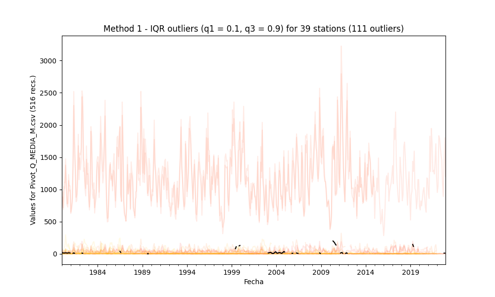
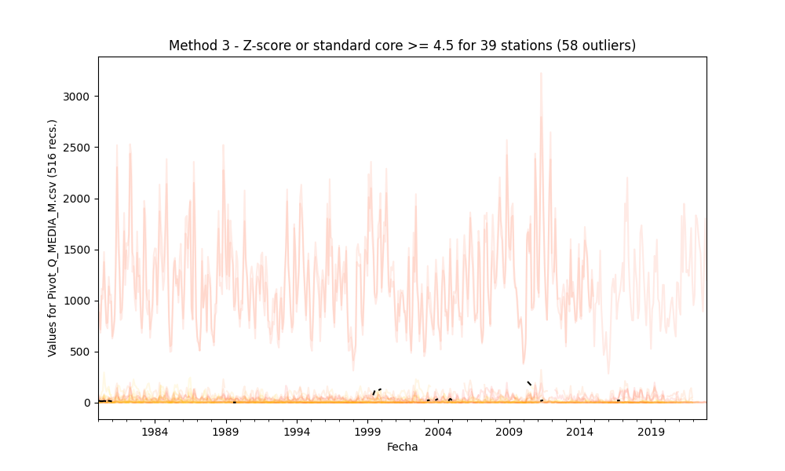

## Outliers detection and processing through statistical methods

* Processed file: [C:/JLGC/R.LTWB/.datasets/IDEAM_EDA/Pivot_Q_MEDIA_M.csv](../IDEAM_EDA/Pivot_Q_MEDIA_M.csv)
* Execution date: 2023-09-15 11:28:02.815641
* Python version: 3.11.5 (tags/v3.11.5:cce6ba9, Aug 24 2023, 14:38:34) [MSC v.1936 64 bit (AMD64)]
* Python path: ['C:\\JLGC\\R.LTWB\\.src', 'C:\\Python311\\python311.zip', 'C:\\Python311\\DLLs', 'C:\\Python311\\Lib', 'C:\\Python311']
* matplotlib version: 3.6.0
* pandas version: 2.1.0
* numpy version: 1.25.2
* Stations exclude: ['28017140', '25027020', '25027410', '25027490', '25027330', '25027390', '25027630', '25027360', '25027320', '16067010', '25027420']
* Print table sample: True
* Instructions & script: https://github.com/rcfdtools/R.LTWB/tree/main/Section03/Outlier
* License: https://github.com/rcfdtools/R.LTWB/blob/main/LICENSE.md
* Credits: r.cfdtools@gmail.com

### General dataframe information with 516 IDEAM records for 39 stations

Dataframe records head sample

| Fecha               |   21197080 |   21197110 |   21197150 |   21197210 |   21207960 |   21209200 |   21209920 |   21227010 |   21237010 |   21237020 |   21237040 |   21257090 |   23017020 |   23017030 |   23017060 |   23017090 |   23067050 |   23067070 |   23067080 |   23067090 |   24017150 |   24017610 |   35027020 |   35027100 |   35027190 |   35027200 |   35027220 |   35027500 |   35027510 |   35037100 |   35037110 |   35067020 |   35067030 |   35067040 |   35067050 |   35067090 |   35067120 |   35077070 |   35077140 |
|:--------------------|-----------:|-----------:|-----------:|-----------:|-----------:|-----------:|-----------:|-----------:|-----------:|-----------:|-----------:|-----------:|-----------:|-----------:|-----------:|-----------:|-----------:|-----------:|-----------:|-----------:|-----------:|-----------:|-----------:|-----------:|-----------:|-----------:|-----------:|-----------:|-----------:|-----------:|-----------:|-----------:|-----------:|-----------:|-----------:|-----------:|-----------:|-----------:|-----------:|
| 1980-01-01 00:00:00 |        nan |      2.108 |      7.445 |        nan |      30.82 |        nan |        nan |      3.296 |      707.4 |      761.2 |      1.149 |        nan |      0.385 |      26.87 |        nan |        nan |      36.58 |        nan |      9.746 |     10.73  |       1.43 |      0.631 |      8.824 |       1.67 |        nan |        nan |        nan |        nan |        nan |      43.04 |      0.191 |      16.35 |      2.629 |      8.445 |        nan |      1.588 |      1.189 |      124.8 |        nan |
| 1980-02-01 00:00:00 |        nan |      4.184 |     58.15  |        nan |      40.89 |        nan |        nan |      2.575 |      883.8 |      964   |      3.722 |        nan |      0.336 |      40.98 |        nan |        nan |      73.58 |        nan |     16.12  |      7.09  |      18.13 |      0.857 |      5.75  |       1.3  |        nan |        nan |        nan |        nan |        nan |      23.18 |      0.161 |      12.83 |      1.257 |      5.3   |        nan |      1.24  |      1     |      nan   |        nan |
| 1980-03-01 00:00:00 |        nan |      1.824 |      5.842 |        nan |      26.83 |        nan |        nan |      2.127 |      683.8 |      715.7 |      0.541 |        nan |      0.307 |      35.24 |        nan |        nan |      46.08 |        nan |      9.036 |      9.018 |      14.57 |      0.296 |      5.329 |       1.24 |        nan |        nan |        nan |        nan |        nan |      35.86 |      0.133 |      15.31 |      1.216 |      7.403 |        nan |      2.056 |      1.638 |      nan   |        nan |

Dataframe records tail sample

| Fecha               |   21197080 |   21197110 |   21197150 |   21197210 |   21207960 |   21209200 |   21209920 |   21227010 |   21237010 |   21237020 |   21237040 |   21257090 |   23017020 |   23017030 |   23017060 |   23017090 |   23067050 |   23067070 |   23067080 |   23067090 |   24017150 |   24017610 |   35027020 |   35027100 |   35027190 |   35027200 |   35027220 |   35027500 |   35027510 |   35037100 |   35037110 |   35067020 |   35067030 |   35067040 |   35067050 |   35067090 |   35067120 |   35077070 |   35077140 |
|:--------------------|-----------:|-----------:|-----------:|-----------:|-----------:|-----------:|-----------:|-----------:|-----------:|-----------:|-----------:|-----------:|-----------:|-----------:|-----------:|-----------:|-----------:|-----------:|-----------:|-----------:|-----------:|-----------:|-----------:|-----------:|-----------:|-----------:|-----------:|-----------:|-----------:|-----------:|-----------:|-----------:|-----------:|-----------:|-----------:|-----------:|-----------:|-----------:|-----------:|
| 2022-10-01 00:00:00 |        nan |    9.16945 |        nan |        nan |        nan |        nan |    5.16083 |        nan |    1354.78 |        nan |        nan |        nan |   0.378024 |        nan |        nan |        nan |        nan |        nan |        nan |        nan |   11.9729  |        nan |        nan |        nan |        nan |        nan |        nan |        nan |        nan |        nan |        nan |        nan |        nan |        nan |        nan |        nan |        nan |        nan |        nan |
| 2022-11-01 00:00:00 |        nan |    3.46566 |        nan |        nan |        nan |        nan |    7.45085 |        nan |    1804.28 |        nan |        nan |        nan |   0.409437 |        nan |        nan |        nan |        nan |        nan |        nan |        nan |   12.5421  |        nan |        nan |        nan |        nan |        nan |        nan |        nan |        nan |        nan |        nan |        nan |        nan |        nan |        nan |        nan |        nan |        nan |        nan |
| 2022-12-01 00:00:00 |        nan |    2.6174  |        nan |        nan |        nan |        nan |    3.39069 |        nan |    1201.38 |        nan |        nan |        nan |   0.296714 |        nan |        nan |        nan |        nan |        nan |        nan |        nan |    3.22877 |        nan |        nan |        nan |        nan |        nan |        nan |        nan |        nan |        nan |        nan |        nan |        nan |        nan |        nan |        nan |        nan |        nan |        nan |

Datatypes for station and nulls values in the initial file

|       | 21197080   | 21197110   | 21197150   | 21197210   | 21207960   | 21209200   | 21209920   | 21227010   | 21237010   | 21237020   | 21237040   | 21257090   | 23017020   | 23017030   | 23017060   | 23017090   | 23067050   | 23067070   | 23067080   | 23067090   | 24017150   | 24017610   | 35027020   | 35027100   | 35027190   | 35027200   | 35027220   | 35027500   | 35027510   | 35037100   | 35037110   | 35067020   | 35067030   | 35067040   | 35067050   | 35067090   | 35067120   | 35077070   | 35077140   |
|:------|:-----------|:-----------|:-----------|:-----------|:-----------|:-----------|:-----------|:-----------|:-----------|:-----------|:-----------|:-----------|:-----------|:-----------|:-----------|:-----------|:-----------|:-----------|:-----------|:-----------|:-----------|:-----------|:-----------|:-----------|:-----------|:-----------|:-----------|:-----------|:-----------|:-----------|:-----------|:-----------|:-----------|:-----------|:-----------|:-----------|:-----------|:-----------|:-----------|
| Dtype | float64    | float64    | float64    | float64    | float64    | float64    | float64    | float64    | float64    | float64    | float64    | float64    | float64    | float64    | float64    | float64    | float64    | float64    | float64    | float64    | float64    | float64    | float64    | float64    | float64    | float64    | float64    | float64    | float64    | float64    | float64    | float64    | float64    | float64    | float64    | float64    | float64    | float64    | float64    |
| Nulls | 239        | 9          | 60         | 419        | 125        | 454        | 436        | 82         | 0          | 97         | 71         | 189        | 13         | 226        | 156        | 501        | 38         | 81         | 43         | 397        | 13         | 42         | 379        | 80         | 139        | 241        | 88         | 453        | 426        | 420        | 257        | 432        | 54         | 365        | 335        | 40         | 467        | 512        | 115        |

General statistics table - Initial file

|          |   count |         mean |        std |         min |         25% |          50% |        75% |         max |
|---------:|--------:|-------------:|-----------:|------------:|------------:|-------------:|-----------:|------------:|
| 21197080 |     277 |    1.86245   |   1.59961  |   0.065     |   0.718     |    1.455     |    2.37194 |    9.964    |
| 21197110 |     507 |    3.16785   |   2.27201  |   0.173     |   1.4435    |    2.633     |    4.27    |   12.53     |
| 21197150 |     456 |   46.7217    |  33.4942   |   2.97008   |  23.98      |   37.35      |   58.9725  |  198.13     |
| 21197210 |      97 |    0.130938  |   0.370101 |   0         |   0.021     |    0.077     |    0.114   |    2.701    |
| 21207960 |     391 |   41.6968    |  23.0798   |   4.912     |  26.57      |   37.12      |   49.88    |  158.1      |
| 21209200 |      62 |   54.8575    |  29.8516   |  18.2143    |  33.3872    |   45.4749    |   68.4543  |  136.429    |
| 21209920 |      80 |    5.18556   |   1.81466  |   2.49827   |   3.7647    |    4.88099   |    5.97305 |   11.4413   |
| 21227010 |     434 |    5.11946   |   4.62075  |   0.42529   |   2.2885    |    3.691     |    6.5035  |   49.8      |
| 21237010 |     516 | 1148.51      | 410.094    | 283.819     | 851.2       | 1095.5       | 1371.23    | 2794        |
| 21237020 |     419 | 1242.84      | 452.952    | 390.9       | 895.45      | 1176         | 1499.5     | 3225        |
| 21237040 |     445 |    3.1017    |   3.96989  |   0.022     |   0.577     |    1.572     |    3.979   |   36.46     |
| 21257090 |     327 |   23.8117    |  22.1808   |   1.105     |   8.705     |   17.04      |   30.51    |  147.012    |
| 23017020 |     503 |    1.38209   |   4.21794  |   0.088     |   0.311503  |    0.429383  |    0.6635  |   38.34     |
| 23017030 |     290 |   43.673     |  20.9662   |  12.69      |  30.2025    |   39.545     |   53.06    |  147.5      |
| 23017060 |     360 |    5.30829   |   2.83702  |   1.054     |   3.31638   |    4.83209   |    6.50313 |   19.85     |
| 23017090 |      15 |   37.2285    |  17.1674   |   2.317     |  24.355     |   41.25      |   48.095   |   65.91     |
| 23067050 |     478 |   65.7898    |  46.8881   |   3.80699   |  27.5775    |   55.47      |   97.63    |  321.7      |
| 23067070 |     435 |    8.79385   |   9.82833  |   0.0569231 |   2.617     |    6.36      |   11.74    |  111.5      |
| 23067080 |     473 |   21.9258    |  14.6475   |   2.458     |  10.74      |   17.7752    |   31.0289  |   93.38     |
| 23067090 |     119 |   10.0613    |   7.35104  |   0.456     |   4.304     |    7.503     |   13.415   |   35.72     |
| 24017150 |     503 |    1.61754   |   2.80678  |   0.161     |   0.498     |    0.72      |    1.236   |   18.43     |
| 24017610 |     474 |    1.68286   |   2.60675  |   0.041     |   0.51525   |    0.869408  |    1.68426 |   22.73     |
| 35027020 |     137 |   16.8444    |  12.1479   |   0.2       |   7.2       |   13.7       |   24.02    |   69.9      |
| 35027100 |     436 |    5.2973    |   3.89788  |   0.213512  |   2.43082   |    4.413     |    7.1105  |   21.33     |
| 35027190 |     377 |   26.9053    |  17.7764   |   1.373     |  11.47      |   23.12      |   39.1     |   86.62     |
| 35027200 |     275 |   55.2528    |  37.4051   |   7.971     |  28.23      |   45.59      |   74.73    |  230.1      |
| 35027220 |     428 |    0.116606  |   0.103317 |   0         |   0.04775   |    0.0915    |    0.1585  |    0.65191  |
| 35027500 |      63 |    0.0743068 |   0.121623 |   0.001     |   0.0153623 |    0.0368667 |    0.0735  |    0.738353 |
| 35027510 |      90 |    0.912644  |   0.890301 |   0.0155811 |   0.357546  |    0.657674  |    1.07851 |    4.97331  |
| 35037100 |      96 |   85.5894    |  58.5653   |   5.111     |  35.4125    |   72.475     |  130.05    |  296.5      |
| 35037110 |     259 |    0.350486  |   0.204491 |   0.015     |   0.182     |    0.314     |    0.4965  |    1.035    |
| 35067020 |      84 |   56.6568    |  43.4662   |   5.452     |  22.3125    |   50.965     |   77.26    |  246.7      |
| 35067030 |     462 |    4.59839   |   3.68884  |   0.112     |   2.00181   |    3.5485    |    6.448   |   31.9288   |
| 35067040 |     151 |   27.9689    |  21.3219   |   1.142     |  11.735     |   24.3       |   36.43    |  115.3      |
| 35067050 |     181 |   24.0287    |  30.5738   |   0.431     |   7.187     |   14.33      |   29.53    |  200.8      |
| 35067090 |     476 |    7.18974   |  10.5787   |   0.317     |   3.012     |    5.7265    |    8.62625 |  131.7      |
| 35067120 |      49 |    6.08939   |   6.58127  |   0         |   2.475     |    5.018     |    6.942   |   39.96     |
| 35077070 |       4 |  101.498     |  27.046    |  76.73      |  78.7775    |  102.13      |  124.85    |  125        |
| 35077140 |     401 |   10.0971    |   8.52372  |   0.14      |   3.66      |    7.73506   |   14.4     |   68.14     |

### Method 1 - Outliers processing using the interquartile range IQR (q1 = 0.1, q3 = 0.9)

Since the data doesn`t follow a normal distribution, we will calculate the outlier data points using the statistical method called interquartile range (IQR) instead of using Z-score. Using the IQR, the outlier data points are the ones falling below Q1 - 1.5 IQR or above Q3 + 1.5 IQR. The Q1 could be the 25th percentile and Q3 could be the 75th percentile of the dataset, and IQR represents the interquartile range calculated by Q3 minus Q1 (Q3-Q1). [^1]

Outliers parameters:
* mean: mean value
* std: standard deviation value
* q1: quartile 0.1
* q3: quartile 0.9
* IQR: interquartile range (q3-q1)
* OlLowerLim: outlier bottom limit (q1-1.5*IQR)
* OlUpperLim: outlier top limit (q3+1.5*IQR)
* OlMinVal: minimum outlier value founded
* OlMaxVal: maximum outlier value founded
* OlCount: # outliers founded
* CapLowerLim: capped lower limit for outliers replacement ( $\mu$ - 4.5 * $\sigma$ )
* CapUpperLim: capped upper limit for outliers replacement ( $\mu$ + 4.5 * $\sigma$ )

|          |         mean |        std |           q1 |          q3 |         IQR |   OlLowerLim |   OlUpperLim |   OlMinVal |   OlMaxVal |   OlCount |   CapLowerLim |   CapUpperLim |
|---------:|-------------:|-----------:|-------------:|------------:|------------:|-------------:|-------------:|-----------:|-----------:|----------:|--------------:|--------------:|
| 21197080 |    1.86245   |   1.59961  |   0.4316     |    3.7402   |    3.3086   |     5.3945   |     8.7031   |   9.964    |   9.964    |         1 |     -5.33578  |      9.06068  |
| 21197110 |    3.16785   |   2.27201  |   0.772116   |    6.24454  |    5.47242  |     8.98075  |    14.4532   | nan        | nan        |         0 |     -7.05621  |     13.3919   |
| 21197150 |   46.7217    |  33.4942   |  14.565      |   88.89     |   74.325    |   126.053    |   200.377    | nan        | nan        |         0 |   -104.002    |    197.445    |
| 21197210 |    0.130938  |   0.370101 |   0          |    0.1576   |    0.1576   |     0.2364   |     0.394    |   0.435    |   2.701    |         3 |     -1.53452  |      1.79639  |
| 21207960 |   41.6968    |  23.0798   |  20.12       |   68.49     |   48.37     |    92.675    |   141.045    | 141.1      | 158.1      |         3 |    -62.1622   |    145.556    |
| 21209200 |   54.8575    |  29.8516   |  23.6679     |  100.409    |   76.7414   |   138.78     |   215.521    | nan        | nan        |         0 |    -79.4747   |    189.19     |
| 21209920 |    5.18556   |   1.81466  |   3.28289    |    7.47389  |    4.19101  |     9.5694   |    13.7604   | nan        | nan        |         0 |     -2.98043  |     13.3515   |
| 21227010 |    5.11946   |   4.62075  |   1.42929    |   10.462    |    9.03271  |    14.9784   |    24.0111   |  24.8      |  49.8      |         3 |    -15.6739   |     25.9128   |
| 21237010 | 1148.51      | 410.094    | 674.8        | 1707.73     | 1032.93     |  2224.2      |  3257.13     | nan        | nan        |         0 |   -696.914    |   2993.93     |
| 21237020 | 1242.84      | 452.952    | 727.62       | 1844.2      | 1116.58     |  2402.49     |  3519.07     | nan        | nan        |         0 |   -795.448    |   3281.12     |
| 21237040 |    3.1017    |   3.96989  |   0.2412     |    8.25447  |    8.01327  |    12.2611   |    20.2744   |  21.63     |  36.46     |         2 |    -14.7628   |     20.9662   |
| 21257090 |   23.8117    |  22.1808   |   4.8168     |   49.562    |   44.7452   |    71.9346   |   116.68     | 116.75     | 147.012    |         2 |    -76.0017   |    123.625    |
| 23017020 |    1.38209   |   4.21794  |   0.233      |    1.3144   |    1.0814   |     1.8551   |     2.9365   |   4.27281  |  38.34     |        25 |    -17.5987   |     20.3628   |
| 23017030 |   43.673     |  20.9662   |  22.649      |   67.389    |   44.74     |    89.759    |   134.499    | 134.8      | 147.5      |         4 |    -50.6748   |    138.021    |
| 23017060 |    5.30829   |   2.83702  |   2.3384     |    8.8427   |    6.5043   |    12.0949   |    18.5992   |  18.99     |  19.85     |         2 |     -7.45831  |     18.0749   |
| 23017090 |   37.2285    |  17.1674   |  19.834      |   57.188    |   37.354    |    75.865    |   113.219    | nan        | nan        |         0 |    -40.0248   |    114.482    |
| 23067050 |   65.7898    |  46.8881   |  14.9857     |  129.107    |  114.122    |   186.168    |   300.29     | 321.7      | 321.7      |         1 |   -145.207    |    276.786    |
| 23067070 |    8.79385   |   9.82833  |   1.06729    |   18.2256   |   17.1583   |    26.8047   |    43.963    |  50.55     | 111.5      |         3 |    -35.4336   |     53.0213   |
| 23067080 |   21.9258    |  14.6475   |   6.4506     |   42.15     |   35.6994   |    59.9997   |    95.6991   | nan        | nan        |         0 |    -43.9878   |     87.8395   |
| 23067090 |   10.0613    |   7.35104  |   2.7976     |   19.932    |   17.1344   |    28.4992   |    45.6336   | nan        | nan        |         0 |    -23.0184   |     43.1409   |
| 24017150 |    1.61754   |   2.80678  |   0.3436     |    3.27295  |    2.92935  |     4.73763  |     7.66698  |   9.166    |  18.43     |        20 |    -11.013    |     14.2481   |
| 24017610 |    1.68286   |   2.60675  |   0.3303     |    3.1329   |    2.8026   |     4.5342   |     7.3368   |   7.642    |  22.73     |        19 |    -10.0475   |     13.4133   |
| 35027020 |   16.8444    |  12.1479   |   4.7        |   32.732    |   28.032    |    46.748    |    74.78     | nan        | nan        |         0 |    -37.8211   |     71.51     |
| 35027100 |    5.2973    |   3.89788  |   1.255      |   10.285    |    9.03     |    14.8      |    23.83     | nan        | nan        |         0 |    -12.2432   |     22.8378   |
| 35027190 |   26.9053    |  17.7764   |   6.97       |   50.382    |   43.412    |    72.088    |   115.5      | nan        | nan        |         0 |    -53.0885   |    106.899    |
| 35027200 |   55.2528    |  37.4051   |  18.202      |  107.68     |   89.478    |   152.419    |   241.897    | nan        | nan        |         0 |   -113.07     |    223.576    |
| 35027220 |    0.116606  |   0.103317 |   0.022      |    0.2465   |    0.2245   |     0.35875  |     0.58325  |   0.65191  |   0.65191  |         1 |     -0.348322 |      0.581534 |
| 35027500 |    0.0743068 |   0.121623 |   0.00561985 |    0.132126 |    0.126506 |     0.195379 |     0.321885 |   0.387206 |   0.738353 |         3 |     -0.472996 |      0.62161  |
| 35027510 |    0.912644  |   0.890301 |   0.267262   |    1.77228  |    1.50501  |     2.52478  |     4.02979  |   4.7039   |   4.97331  |         2 |     -3.09371  |      4.919    |
| 35037100 |   85.5894    |  58.5653   |  24          |  165.05     |  141.05     |   235.575    |   376.625    | nan        | nan        |         0 |   -177.955    |    349.133    |
| 35037110 |    0.350486  |   0.204491 |   0.1122     |    0.6302   |    0.518    |     0.8892   |     1.4072   | nan        | nan        |         0 |     -0.569722 |      1.27069  |
| 35067020 |   56.6568    |  43.4662   |  13.444      |  100.024    |   86.58     |   143.314    |   229.894    | 246.7      | 246.7      |         1 |   -138.941    |    252.255    |
| 35067030 |    4.59839   |   3.68884  |   1.1775     |    9.4215   |    8.244    |    13.5435   |    21.7875   |  22.2228   |  31.9288   |         2 |    -12.0014   |     21.1982   |
| 35067040 |   27.9689    |  21.3219   |   6.51       |   57.44     |   50.93     |    82.905    |   133.835    | nan        | nan        |         0 |    -67.9795   |    123.917    |
| 35067050 |   24.0287    |  30.5738   |   3.5        |   48.6      |   45.1      |    71.15     |   116.25     | 138.4      | 200.8      |         5 |   -113.554    |    161.611    |
| 35067090 |    7.18974   |  10.5787   |   1.5685     |   11.96     |   10.3915   |    17.1558   |    27.5473   |  31.64     | 131.7      |         5 |    -40.4146   |     54.7941   |
| 35067120 |    6.08939   |   6.58127  |   1.4738     |   10.25     |    8.7762   |    14.6381   |    23.4143   |  24.11     |  39.96     |         2 |    -23.5263   |     35.7051   |
| 35077070 |  101.498     |  27.046    |  77.549      |  124.94     |   47.391    |   148.635    |   196.026    | nan        | nan        |         0 |    -20.2094   |    223.204    |
| 35077140 |   10.0971    |   8.52372  |   2.19       |   20.93     |   18.74     |    30.3      |    49.04     |  53.4      |  68.14     |         2 |    -28.2596   |     48.4539   |

#### Identified and cleaning tables for 111 IQR outliers founded
* Outliers identified file: [Outlier_IQR_Pivot_Q_MEDIA_M.csv](../../.datasets/IDEAM_Outlier/Outlier_IQR_Pivot_Q_MEDIA_M.csv)
* Outliers dropped file: [Outlier_IQR_Drop_Pivot_Q_MEDIA_M.csv](../../.datasets/IDEAM_Outlier/Outlier_IQR_Drop_Pivot_Q_MEDIA_M.csv)
* Outliers capped file: [Outlier_IQR_Cap_Pivot_Q_MEDIA_M.csv](../../.datasets/IDEAM_Outlier/Outlier_IQR_Cap_Pivot_Q_MEDIA_M.csv)
* Outliers imputed file: [Outlier_IQR_Impute_Pivot_Q_MEDIA_M.csv](../../.datasets/IDEAM_Outlier/Outlier_IQR_Impute_Pivot_Q_MEDIA_M.csv)

#### Statistical values for the capped and imputed file

IQR - General statistics table - Capped file

|          |   count |         mean |        std |         min |         25% |          50% |        75% |         max |
|---------:|--------:|-------------:|-----------:|------------:|------------:|-------------:|-----------:|------------:|
| 21197080 |     277 |    1.85919   |   1.58387  |   0.065     |   0.718     |    1.455     |    2.37194 |    9.06068  |
| 21197110 |     507 |    3.16785   |   2.27201  |   0.173     |   1.4435    |    2.633     |    4.27    |   12.53     |
| 21197150 |     456 |   46.7217    |  33.4942   |   2.97008   |  23.98      |   37.35      |   58.9725  |  198.13     |
| 21197210 |      97 |    0.128074  |   0.306391 |   0         |   0.021     |    0.077     |    0.114   |    1.79639  |
| 21207960 |     391 |   41.673     |  22.9619   |   4.912     |  26.57      |   37.12      |   49.88    |  145.556    |
| 21209200 |      62 |   54.8575    |  29.8516   |  18.2143    |  33.3872    |   45.4749    |   68.4543  |  136.429    |
| 21209920 |      80 |    5.18556   |   1.81466  |   2.49827   |   3.7647    |    4.88099   |    5.97305 |   11.4413   |
| 21227010 |     434 |    5.06939   |   4.23539  |   0.42529   |   2.2885    |    3.691     |    6.5035  |   25.9128   |
| 21237010 |     516 | 1148.51      | 410.094    | 283.819     | 851.2       | 1095.5       | 1371.23    | 2794        |
| 21237020 |     419 | 1242.84      | 452.952    | 390.9       | 895.45      | 1176         | 1499.5     | 3225        |
| 21237040 |     445 |    3.0654    |   3.73052  |   0.022     |   0.577     |    1.572     |    3.979   |   20.9662   |
| 21257090 |     327 |   23.7612    |  21.91     |   1.105     |   8.705     |   17.04      |   30.51    |  123.625    |
| 23017020 |     503 |    1.5147    |   4.32988  |   0.088     |   0.311503  |    0.429383  |    0.6635  |   20.3628   |
| 23017030 |     290 |   43.6509    |  20.8567   |  12.69      |  30.2025    |   39.545     |   53.06    |  138.021    |
| 23017060 |     360 |    5.30082   |   2.80111  |   1.054     |   3.31638   |    4.83209   |    6.50313 |   18.0749   |
| 23017090 |      15 |   37.2285    |  17.1674   |   2.317     |  24.355     |   41.25      |   48.095   |   65.91     |
| 23067050 |     478 |   65.6959    |  46.4169   |   3.80699   |  27.5775    |   55.47      |   97.63    |  276.786    |
| 23067070 |     435 |    8.60022   |   8.34647  |   0.0569231 |   2.617     |    6.36      |   11.74    |   53.0213   |
| 23067080 |     473 |   21.9258    |  14.6475   |   2.458     |  10.74      |   17.7752    |   31.0289  |   93.38     |
| 23067090 |     119 |   10.0613    |   7.35104  |   0.456     |   4.304     |    7.503     |   13.415   |   35.72     |
| 24017150 |     503 |    1.63653   |   2.82943  |   0.161     |   0.498     |    0.72      |    1.236   |   14.2481   |
| 24017610 |     474 |    1.71931   |   2.64119  |   0.041     |   0.51525   |    0.869408  |    1.68426 |   13.4133   |
| 35027020 |     137 |   16.8444    |  12.1479   |   0.2       |   7.2       |   13.7       |   24.02    |   69.9      |
| 35027100 |     436 |    5.2973    |   3.89788  |   0.213512  |   2.43082   |    4.413     |    7.1105  |   21.33     |
| 35027190 |     377 |   26.9053    |  17.7764   |   1.373     |  11.47      |   23.12      |   39.1     |   86.62     |
| 35027200 |     275 |   55.2528    |  37.4051   |   7.971     |  28.23      |   45.59      |   74.73    |  230.1      |
| 35027220 |     428 |    0.116442  |   0.102516 |   0         |   0.04775   |    0.0915    |    0.1585  |    0.581534 |
| 35027500 |      63 |    0.0785342 |   0.134214 |   0.001     |   0.0153623 |    0.0368667 |    0.0735  |    0.62161  |
| 35027510 |      90 |    0.91443   |   0.898084 |   0.0155811 |   0.357546  |    0.657674  |    1.07851 |    4.919    |
| 35037100 |      96 |   85.5894    |  58.5653   |   5.111     |  35.4125    |   72.475     |  130.05    |  296.5      |
| 35037110 |     259 |    0.350486  |   0.204491 |   0.015     |   0.182     |    0.314     |    0.4965  |    1.035    |
| 35067020 |      84 |   56.723     |  43.762    |   5.452     |  22.3125    |   50.965     |   77.26    |  252.255    |
| 35067030 |     462 |    4.57294   |   3.53671  |   0.112     |   2.00181   |    3.5485    |    6.448   |   21.2772   |
| 35067040 |     151 |   27.9689    |  21.3219   |   1.142     |  11.735     |   24.3       |   36.43    |  115.3      |
| 35067050 |     181 |   23.7544    |  29.0132   |   0.431     |   7.187     |   14.33      |   29.53    |  161.611    |
| 35067090 |     476 |    6.83266   |   6.56806  |   0.317     |   3.012     |    5.7265    |    8.62625 |   54.7941   |
| 35067120 |      49 |    6.23919   |   7.01212  |   0         |   2.475     |    5.018     |    6.942   |   35.7051   |
| 35077070 |       4 |  101.498     |  27.046    |  76.73      |  78.7775    |  102.13      |  124.85    |  125        |
| 35077140 |     401 |   10.0357    |   8.17899  |   0.14      |   3.66      |    7.73506   |   14.4     |   48.4539   |

IQR - General statistics table - Imputed file

|          |   count |         mean |         std |         min |         25% |          50% |        75% |         max |
|---------:|--------:|-------------:|------------:|------------:|------------:|-------------:|-----------:|------------:|
| 21197080 |     277 |    1.8332    |   1.52318   |   0.065     |   0.718     |    1.455     |    2.31    |    8.062    |
| 21197110 |     507 |    3.16785   |   2.27201   |   0.173     |   1.4435    |    2.633     |    4.27    |   12.53     |
| 21197150 |     456 |   46.7217    |  33.4942    |   2.97008   |  23.98      |   37.35      |   58.9725  |  198.13     |
| 21197210 |      97 |    0.0765651 |   0.064939  |   0         |   0.021     |    0.077     |    0.114   |    0.335    |
| 21207960 |     391 |   40.8761    |  21.0618    |   4.912     |  26.57      |   37.12      |   48.895   |  138.5      |
| 21209200 |      62 |   54.8575    |  29.8516    |  18.2143    |  33.3872    |   45.4749    |   68.4543  |  136.429    |
| 21209920 |      80 |    5.18556   |   1.81466   |   2.49827   |   3.7647    |    4.88099   |    5.97305 |   11.4413   |
| 21227010 |     434 |    4.92565   |   3.86106   |   0.42529   |   2.2885    |    3.691     |    6.17575 |   23.7      |
| 21237010 |     516 | 1148.51      | 410.094     | 283.819     | 851.2       | 1095.5       | 1371.23    | 2794        |
| 21237020 |     419 | 1242.84      | 452.952     | 390.9       | 895.45      | 1176         | 1499.5     | 3225        |
| 21237040 |     445 |    2.98511   |   3.53085   |   0.022     |   0.577     |    1.572     |    3.963   |   19.19     |
| 21257090 |     327 |   23.1507    |  20.4571    |   1.105     |   8.705     |   17.04      |   29.345   |  110.522    |
| 23017020 |     503 |    0.571322  |   0.406351  |   0.088     |   0.311503  |    0.429383  |    0.6635  |    2.473    |
| 23017030 |     290 |   42.3496    |  17.6079    |  12.69      |  30.2025    |   39.545     |   52.4325  |  117        |
| 23017060 |     360 |    5.22989   |   2.63289   |   1.054     |   3.31638   |    4.83209   |    6.46175 |   15.92     |
| 23017090 |      15 |   37.2285    |  17.1674    |   2.317     |  24.355     |   41.25      |   48.095   |   65.91     |
| 23067050 |     478 |   65.2545    |  45.3973    |   3.80699   |  27.5775    |   55.47      |   97.3425  |  230.3      |
| 23067070 |     435 |    8.29521   |   7.47869   |   0.0569231 |   2.617     |    6.36      |   11.45    |   42.95     |
| 23067080 |     473 |   21.9258    |  14.6475    |   2.458     |  10.74      |   17.7752    |   31.0289  |   93.38     |
| 23067090 |     119 |   10.0613    |   7.35104   |   0.456     |   4.304     |    7.503     |   13.415   |   35.72     |
| 24017150 |     503 |    1.13432   |   1.19009   |   0.161     |   0.498     |    0.72      |    1.236   |    6.986    |
| 24017610 |     474 |    1.2491    |   1.12309   |   0.041     |   0.51525   |    0.869408  |    1.68115 |    6.75     |
| 35027020 |     137 |   16.8444    |  12.1479    |   0.2       |   7.2       |   13.7       |   24.02    |   69.9      |
| 35027100 |     436 |    5.2973    |   3.89788   |   0.213512  |   2.43082   |    4.413     |    7.1105  |   21.33     |
| 35027190 |     377 |   26.9053    |  17.7764    |   1.373     |  11.47      |   23.12      |   39.1     |   86.62     |
| 35027200 |     275 |   55.2528    |  37.4051    |   7.971     |  28.23      |   45.59      |   74.73    |  230.1      |
| 35027220 |     428 |    0.115355  |   0.100009  |   0         |   0.04775   |    0.0915    |    0.158   |    0.579302 |
| 35027500 |      63 |    0.0524722 |   0.0552562 |   0.001     |   0.0153623 |    0.0368667 |    0.0735  |    0.306459 |
| 35027510 |      90 |    0.8254    |   0.661942  |   0.0155811 |   0.357546  |    0.657674  |    1.03676 |    3.53976  |
| 35037100 |      96 |   85.5894    |  58.5653    |   5.111     |  35.4125    |   72.475     |  130.05    |  296.5      |
| 35037110 |     259 |    0.350486  |   0.204491  |   0.015     |   0.182     |    0.314     |    0.4965  |    1.035    |
| 35067020 |      84 |   54.3944    |  38.0656    |   5.452     |  22.3125    |   50.965     |   76.845   |  229        |
| 35067030 |     462 |    4.50108   |   3.36214   |   0.112     |   2.00181   |    3.5485    |    6.329   |   21.2772   |
| 35067040 |     151 |   27.9689    |  21.3219    |   1.142     |  11.735     |   24.3       |   36.43    |  115.3      |
| 35067050 |     181 |   19.9538    |  17.3015    |   0.431     |   7.187     |   14.33      |   27.46    |   88.88     |
| 35067090 |     476 |    6.33261   |   4.32164   |   0.317     |   3.012     |    5.7265    |    8.524   |   25.42     |
| 35067120 |      49 |    5.03038   |   3.39152   |   0         |   2.475     |    5.018     |    6.08939 |   15.88     |
| 35077070 |       4 |  101.498     |  27.046     |  76.73      |  78.7775    |  102.13      |  124.85    |  125        |
| 35077140 |     401 |    9.84441   |   7.71229   |   0.14      |   3.66      |    7.73506   |   14.05    |   47.31     |

### Method 2 - Outliers processing through empirical rule - ER or _k-sigma_ ( $\mu$ - _k_ * $\sigma$ ) with _k_ = 4.5

The empirical rule, also referred to as the three-sigma rule or 68-95-99.7 rule, is a statistical rule which states that for a normal distribution, almost all observed data will fall within three standard deviations (denoted by $\sigma$) of the mean or average (denoted by $\mu$). In particular, the empirical rule predicts that 68% of observations falls within the first standard deviation ( $\mu$ ± $\sigma$ ), 95% within the first two standard deviations ( $\mu$ ± 2 $\sigma$ ), and 99.7% within the first three standard deviations ( $\mu$ ± 3 $\sigma$ ).[^2]

Outliers parameters:
* mean: mean value
* std: standard deviation value
* OlMinVal: minimum outlier value founded
* OlMaxVal: maximum outlier value founded
* OlCount: # outliers founded
* CapLowerLim: capped lower limit for outliers replacement ( $\mu$ - 4.5 * $\sigma$ )
* CapUpperLim: capped upper limit for outliers replacement ( $\mu$ + 4.5 * $\sigma$ )

|          |         mean |        std |   OlMinVal |   OlMaxVal |   OlCount |   CapLowerLim |   CapUpperLim |
|---------:|-------------:|-----------:|-----------:|-----------:|----------:|--------------:|--------------:|
| 21197080 |    1.86245   |   1.59961  |   9.964    |   9.964    |         1 |     -5.33578  |      9.06068  |
| 21197110 |    3.16785   |   2.27201  | nan        | nan        |         0 |     -7.05621  |     13.3919   |
| 21197150 |   46.7217    |  33.4942   | 198.13     | 198.13     |         1 |   -104.002    |    197.445    |
| 21197210 |    0.130938  |   0.370101 |   2.531    |   2.701    |         2 |     -1.53452  |      1.79639  |
| 21207960 |   41.6968    |  23.0798   | 146.8      | 158.1      |         2 |    -62.1622   |    145.556    |
| 21209200 |   54.8575    |  29.8516   | nan        | nan        |         0 |    -79.4747   |    189.19     |
| 21209920 |    5.18556   |   1.81466  | nan        | nan        |         0 |     -2.98043  |     13.3515   |
| 21227010 |    5.11946   |   4.62075  |  49.8      |  49.8      |         1 |    -15.6739   |     25.9128   |
| 21237010 | 1148.51      | 410.094    | nan        | nan        |         0 |   -696.914    |   2993.93     |
| 21237020 | 1242.84      | 452.952    | nan        | nan        |         0 |   -795.448    |   3281.12     |
| 21237040 |    3.1017    |   3.96989  |  21.63     |  36.46     |         2 |    -14.7628   |     20.9662   |
| 21257090 |   23.8117    |  22.1808   | 147.012    | 147.012    |         1 |    -76.0017   |    123.625    |
| 23017020 |    1.38209   |   4.21794  |  22.55     |  38.34     |         8 |    -17.5987   |     20.3628   |
| 23017030 |   43.673     |  20.9662   | 140.6      | 147.5      |         2 |    -50.6748   |    138.021    |
| 23017060 |    5.30829   |   2.83702  |  18.99     |  19.85     |         2 |     -7.45831  |     18.0749   |
| 23017090 |   37.2285    |  17.1674   | nan        | nan        |         0 |    -40.0248   |    114.482    |
| 23067050 |   65.7898    |  46.8881   | 321.7      | 321.7      |         1 |   -145.207    |    276.786    |
| 23067070 |    8.79385   |   9.82833  |  81.24     | 111.5      |         2 |    -35.4336   |     53.0213   |
| 23067080 |   21.9258    |  14.6475   |  93.38     |  93.38     |         1 |    -43.9878   |     87.8395   |
| 23067090 |   10.0613    |   7.35104  | nan        | nan        |         0 |    -23.0184   |     43.1409   |
| 24017150 |    1.61754   |   2.80678  |  14.25     |  18.43     |        10 |    -11.013    |     14.2481   |
| 24017610 |    1.68286   |   2.60675  |  14.39     |  22.73     |         6 |    -10.0475   |     13.4133   |
| 35027020 |   16.8444    |  12.1479   | nan        | nan        |         0 |    -37.8211   |     71.51     |
| 35027100 |    5.2973    |   3.89788  | nan        | nan        |         0 |    -12.2432   |     22.8378   |
| 35027190 |   26.9053    |  17.7764   | nan        | nan        |         0 |    -53.0885   |    106.899    |
| 35027200 |   55.2528    |  37.4051   | 230.1      | 230.1      |         1 |   -113.07     |    223.576    |
| 35027220 |    0.116606  |   0.103317 |   0.65191  |   0.65191  |         1 |     -0.348322 |      0.581534 |
| 35027500 |    0.0743068 |   0.121623 |   0.738353 |   0.738353 |         1 |     -0.472996 |      0.62161  |
| 35027510 |    0.912644  |   0.890301 |   4.97331  |   4.97331  |         1 |     -3.09371  |      4.919    |
| 35037100 |   85.5894    |  58.5653   | nan        | nan        |         0 |   -177.955    |    349.133    |
| 35037110 |    0.350486  |   0.204491 | nan        | nan        |         0 |     -0.569722 |      1.27069  |
| 35067020 |   56.6568    |  43.4662   | nan        | nan        |         0 |   -138.941    |    252.255    |
| 35067030 |    4.59839   |   3.68884  |  21.2772   |  31.9288   |         3 |    -12.0014   |     21.1982   |
| 35067040 |   27.9689    |  21.3219   | nan        | nan        |         0 |    -67.9795   |    123.917    |
| 35067050 |   24.0287    |  30.5738   | 175.9      | 200.8      |         3 |   -113.554    |    161.611    |
| 35067090 |    7.18974   |  10.5787   | 121.5      | 131.7      |         3 |    -40.4146   |     54.7941   |
| 35067120 |    6.08939   |   6.58127  |  39.96     |  39.96     |         1 |    -23.5263   |     35.7051   |
| 35077070 |  101.498     |  27.046    | nan        | nan        |         0 |    -20.2094   |    223.204    |
| 35077140 |   10.0971    |   8.52372  |  53.4      |  68.14     |         2 |    -28.2596   |     48.4539   |

#### Identified and cleaning tables for 58 ER or k-sigma outliers founded
* Outliers identified file: [Outlier_ER_Pivot_Q_MEDIA_M.csv](../../.datasets/IDEAM_Outlier/Outlier_ER_Pivot_Q_MEDIA_M.csv)
* Outliers dropped file: [Outlier_ER_Drop_Pivot_Q_MEDIA_M.csv](../../.datasets/IDEAM_Outlier/Outlier_ER_Drop_Pivot_Q_MEDIA_M.csv)
* Outliers capped file: [Outlier_ER_Cap_Pivot_Q_MEDIA_M.csv](../../.datasets/IDEAM_Outlier/Outlier_ER_Cap_Pivot_Q_MEDIA_M.csv)
* Outliers imputed file: [Outlier_ER_Impute_Pivot_Q_MEDIA_M.csv](../../.datasets/IDEAM_Outlier/Outlier_ER_Impute_Pivot_Q_MEDIA_M.csv)

#### Statistical values for the capped and imputed file

ER - General statistics table - Capped file

|          |   count |         mean |        std |         min |         25% |          50% |        75% |         max |
|---------:|--------:|-------------:|-----------:|------------:|------------:|-------------:|-----------:|------------:|
| 21197080 |     277 |    1.85919   |   1.58387  |   0.065     |   0.718     |    1.455     |    2.37194 |    9.06068  |
| 21197110 |     507 |    3.16785   |   2.27201  |   0.173     |   1.4435    |    2.633     |    4.27    |   12.53     |
| 21197150 |     456 |   46.7202    |  33.4874   |   2.97008   |  23.98      |   37.35      |   58.9725  |  197.445    |
| 21197210 |      97 |    0.114039  |   0.256252 |   0         |   0.021     |    0.077     |    0.114   |    1.79639  |
| 21207960 |     391 |   41.6616    |  22.9112   |   4.912     |  26.57      |   37.12      |   49.88    |  145.556    |
| 21209200 |      62 |   54.8575    |  29.8516   |  18.2143    |  33.3872    |   45.4749    |   68.4543  |  136.429    |
| 21209920 |      80 |    5.18556   |   1.81466  |   2.49827   |   3.7647    |    4.88099   |    5.97305 |   11.4413   |
| 21227010 |     434 |    5.06442   |   4.21145  |   0.42529   |   2.2885    |    3.691     |    6.5035  |   25.9128   |
| 21237010 |     516 | 1148.51      | 410.094    | 283.819     | 851.2       | 1095.5       | 1371.23    | 2794        |
| 21237020 |     419 | 1242.84      | 452.952    | 390.9       | 895.45      | 1176         | 1499.5     | 3225        |
| 21237040 |     445 |    3.0654    |   3.73052  |   0.022     |   0.577     |    1.572     |    3.979   |   20.9662   |
| 21257090 |     327 |   23.7402    |  21.817    |   1.105     |   8.705     |   17.04      |   30.51    |  123.625    |
| 23017020 |     503 |    1.26243   |   3.44691  |   0.088     |   0.311503  |    0.429383  |    0.6635  |   20.3628   |
| 23017030 |     290 |   43.6315    |  20.7695   |  12.69      |  30.2025    |   39.545     |   53.06    |  138.021    |
| 23017060 |     360 |    5.30082   |   2.80111  |   1.054     |   3.31638   |    4.83209   |    6.50313 |   18.0749   |
| 23017090 |      15 |   37.2285    |  17.1674   |   2.317     |  24.355     |   41.25      |   48.095   |   65.91     |
| 23067050 |     478 |   65.6959    |  46.4169   |   3.80699   |  27.5775    |   55.47      |   97.63    |  276.786    |
| 23067070 |     435 |    8.59454   |   8.31696  |   0.0569231 |   2.617     |    6.36      |   11.74    |   53.0213   |
| 23067080 |     473 |   21.9141    |  14.5923   |   2.458     |  10.74      |   17.7752    |   31.0289  |   87.8395   |
| 23067090 |     119 |   10.0613    |   7.35104  |   0.456     |   4.304     |    7.503     |   13.415   |   35.72     |
| 24017150 |     503 |    1.57782   |   2.59643  |   0.161     |   0.498     |    0.72      |    1.236   |   14.2481   |
| 24017610 |     474 |    1.63301   |   2.30498  |   0.041     |   0.51525   |    0.869408  |    1.68426 |   13.4133   |
| 35027020 |     137 |   16.8444    |  12.1479   |   0.2       |   7.2       |   13.7       |   24.02    |   69.9      |
| 35027100 |     436 |    5.2973    |   3.89788  |   0.213512  |   2.43082   |    4.413     |    7.1105  |   21.33     |
| 35027190 |     377 |   26.9053    |  17.7764   |   1.373     |  11.47      |   23.12      |   39.1     |   86.62     |
| 35027200 |     275 |   55.2291    |  37.2957   |   7.971     |  28.23      |   45.59      |   74.73    |  223.576    |
| 35027220 |     428 |    0.116442  |   0.102516 |   0         |   0.04775   |    0.0915    |    0.1585  |    0.581534 |
| 35027500 |      63 |    0.0724537 |   0.111838 |   0.001     |   0.0153623 |    0.0368667 |    0.0735  |    0.62161  |
| 35027510 |      90 |    0.91204   |   0.887532 |   0.0155811 |   0.357546  |    0.657674  |    1.07851 |    4.919    |
| 35037100 |      96 |   85.5894    |  58.5653   |   5.111     |  35.4125    |   72.475     |  130.05    |  296.5      |
| 35037110 |     259 |    0.350486  |   0.204491 |   0.015     |   0.182     |    0.314     |    0.4965  |    1.035    |
| 35067020 |      84 |   56.6568    |  43.4662   |   5.452     |  22.3125    |   50.965     |   77.26    |  246.7      |
| 35067030 |     462 |    4.57277   |   3.5359   |   0.112     |   2.00181   |    3.5485    |    6.448   |   21.1982   |
| 35067040 |     151 |   27.9689    |  21.3219   |   1.142     |  11.735     |   24.3       |   36.43    |  115.3      |
| 35067050 |     181 |   23.5842    |  28.246    |   0.431     |   7.187     |   14.33      |   29.53    |  161.611    |
| 35067090 |     476 |    6.73865   |   6.01701  |   0.317     |   3.012     |    5.7265    |    8.62625 |   54.7941   |
| 35067120 |      49 |    6.00255   |   6.13822  |   0         |   2.475     |    5.018     |    6.942   |   35.7051   |
| 35077070 |       4 |  101.498     |  27.046    |  76.73      |  78.7775    |  102.13      |  124.85    |  125        |
| 35077140 |     401 |   10.0357    |   8.17899  |   0.14      |   3.66      |    7.73506   |   14.4     |   48.4539   |

ER - General statistics table - Imputed file

|          |   count |         mean |         std |         min |         25% |          50% |        75% |         max |
|---------:|--------:|-------------:|------------:|------------:|------------:|-------------:|-----------:|------------:|
| 21197080 |     277 |    1.8332    |   1.52318   |   0.065     |   0.718     |    1.455     |    2.31    |    8.062    |
| 21197110 |     507 |    3.16785   |   2.27201   |   0.173     |   1.4435    |    2.633     |    4.27    |   12.53     |
| 21197150 |     456 |   46.3897    |  32.7317    |   2.97008   |  23.98      |   37.35      |   58.425   |  196.3      |
| 21197210 |      97 |    0.0796998 |   0.0742606 |   0         |   0.021     |    0.077     |    0.114   |    0.435    |
| 21207960 |     391 |   41.1303    |  21.663     |   4.912     |  26.57      |   37.12      |   49.02    |  141.1      |
| 21209200 |      62 |   54.8575    |  29.8516    |  18.2143    |  33.3872    |   45.4749    |   68.4543  |  136.429    |
| 21209920 |      80 |    5.18556   |   1.81466   |   2.49827   |   3.7647    |    4.88099   |    5.97305 |   11.4413   |
| 21227010 |     434 |    5.01651   |   4.09026   |   0.42529   |   2.2885    |    3.691     |    6.434   |   24.87     |
| 21237010 |     516 | 1148.51      | 410.094     | 283.819     | 851.2       | 1095.5       | 1371.23    | 2794        |
| 21237020 |     419 | 1242.84      | 452.952     | 390.9       | 895.45      | 1176         | 1499.5     | 3225        |
| 21237040 |     445 |    2.98511   |   3.53085   |   0.022     |   0.577     |    1.572     |    3.963   |   19.19     |
| 21257090 |     327 |   23.435     |  21.1018    |   1.105     |   8.705     |   17.04      |   29.505   |  116.75     |
| 23017020 |     503 |    0.960551  |   2.44461   |   0.088     |   0.311503  |    0.429383  |    0.6635  |   19.98     |
| 23017030 |     290 |   42.9808    |  19.2169    |  12.69      |  30.2025    |   39.545     |   52.7575  |  135.6      |
| 23017060 |     360 |    5.22989   |   2.63289   |   1.054     |   3.31638   |    4.83209   |    6.46175 |   15.92     |
| 23017090 |      15 |   37.2285    |  17.1674    |   2.317     |  24.355     |   41.25      |   48.095   |   65.91     |
| 23067050 |     478 |   65.2545    |  45.3973    |   3.80699   |  27.5775    |   55.47      |   97.3425  |  230.3      |
| 23067070 |     435 |    8.3912    |   7.74822   |   0.0569231 |   2.617     |    6.36      |   11.59    |   50.55     |
| 23067080 |     473 |   21.7748    |  14.2726    |   2.458     |  10.74      |   17.7752    |   30.94    |   74.39     |
| 23067090 |     119 |   10.0613    |   7.35104   |   0.456     |   4.304     |    7.503     |   13.415   |   35.72     |
| 24017150 |     503 |    1.32671   |   1.86559   |   0.161     |   0.498     |    0.72      |    1.236   |   13.77     |
| 24017610 |     474 |    1.48452   |   1.87897   |   0.041     |   0.51525   |    0.869408  |    1.68115 |   13.38     |
| 35027020 |     137 |   16.8444    |  12.1479    |   0.2       |   7.2       |   13.7       |   24.02    |   69.9      |
| 35027100 |     436 |    5.2973    |   3.89788   |   0.213512  |   2.43082   |    4.413     |    7.1105  |   21.33     |
| 35027190 |     377 |   26.9053    |  17.7764    |   1.373     |  11.47      |   23.12      |   39.1     |   86.62     |
| 35027200 |     275 |   54.617     |  35.877     |   7.971     |  28.23      |   45.59      |   73.445   |  218.5      |
| 35027220 |     428 |    0.115355  |   0.100009  |   0         |   0.04775   |    0.0915    |    0.158   |    0.579302 |
| 35027500 |      63 |    0.0637664 |   0.0869886 |   0.001     |   0.0153623 |    0.0368667 |    0.0735  |    0.472943 |
| 35027510 |      90 |    0.867525  |   0.778015  |   0.0155811 |   0.357546  |    0.657674  |    1.04775 |    4.7039   |
| 35037100 |      96 |   85.5894    |  58.5653    |   5.111     |  35.4125    |   72.475     |  130.05    |  296.5      |
| 35037110 |     259 |    0.350486  |   0.204491  |   0.015     |   0.182     |    0.314     |    0.4965  |    1.035    |
| 35067020 |      84 |   56.6568    |  43.4662    |   5.452     |  22.3125    |   50.965     |   77.26    |  246.7      |
| 35067030 |     462 |    4.46498   |   3.2699    |   0.112     |   2.00181   |    3.5485    |    6.29125 |   19.7966   |
| 35067040 |     151 |   27.9689    |  21.3219    |   1.142     |  11.735     |   24.3       |   36.43    |  115.3      |
| 35067050 |     181 |   21.3038    |  21.7966    |   0.431     |   7.187     |   14.33      |   28.6     |  154        |
| 35067090 |     476 |    6.43862   |   4.64007   |   0.317     |   3.012     |    5.7265    |    8.6     |   33.2      |
| 35067120 |      49 |    5.39815   |   4.35028   |   0         |   2.475     |    5.018     |    6.326   |   24.11     |
| 35077070 |       4 |  101.498     |  27.046     |  76.73      |  78.7775    |  102.13      |  124.85    |  125        |
| 35077140 |     401 |    9.84441   |   7.71229   |   0.14      |   3.66      |    7.73506   |   14.05    |   47.31     |

### Method 3 - Outliers processing through Z-score >= 4.5 or standard core

Z score is an important concept in statistics. Z score is also called standard score. This score helps to understand if each data value is greater or smaller than mean and how far away it is from the mean. More specifically, Z score tells how many standard deviations away a data point is from the mean. Z = ( x - $\mu$ ) / $\sigma$.[^3]

> Altought with this method, the identified outliers are the same obtained in Method 2 that uses the empirical rule when the Z-score threshold is the same _k-sigma_ value, the Method 3 creates the Z-score table values. Use this method to compare the identified outliers with differents _k-sigma_ values.

Outliers parameters:
* mean: mean value
* std: standard deviation value
* OlMinVal: minimum outlier value founded
* OlMaxVal: maximum outlier value founded
* OlCount: # outliers founded
* CapLowerLim: capped lower limit for outliers replacement ( $\mu$ - 4.5 * $\sigma$ )
* CapUpperLim: capped upper limit for outliers replacement ( $\mu$ + 4.5 * $\sigma$ )

|          |         mean |        std |   OlMinVal |   OlMaxVal |   OlCount |   CapLowerLim |   CapUpperLim |
|---------:|-------------:|-----------:|-----------:|-----------:|----------:|--------------:|--------------:|
| 21197080 |    1.86245   |   1.59961  |   9.964    |   9.964    |         1 |     -5.33578  |      9.06068  |
| 21197110 |    3.16785   |   2.27201  | nan        | nan        |         0 |     -7.05621  |     13.3919   |
| 21197150 |   46.7217    |  33.4942   | 198.13     | 198.13     |         1 |   -104.002    |    197.445    |
| 21197210 |    0.130938  |   0.370101 |   2.531    |   2.701    |         2 |     -1.53452  |      1.79639  |
| 21207960 |   41.6968    |  23.0798   | 146.8      | 158.1      |         2 |    -62.1622   |    145.556    |
| 21209200 |   54.8575    |  29.8516   | nan        | nan        |         0 |    -79.4747   |    189.19     |
| 21209920 |    5.18556   |   1.81466  | nan        | nan        |         0 |     -2.98043  |     13.3515   |
| 21227010 |    5.11946   |   4.62075  |  49.8      |  49.8      |         1 |    -15.6739   |     25.9128   |
| 21237010 | 1148.51      | 410.094    | nan        | nan        |         0 |   -696.914    |   2993.93     |
| 21237020 | 1242.84      | 452.952    | nan        | nan        |         0 |   -795.448    |   3281.12     |
| 21237040 |    3.1017    |   3.96989  |  21.63     |  36.46     |         2 |    -14.7628   |     20.9662   |
| 21257090 |   23.8117    |  22.1808   | 147.012    | 147.012    |         1 |    -76.0017   |    123.625    |
| 23017020 |    1.38209   |   4.21794  |  22.55     |  38.34     |         8 |    -17.5987   |     20.3628   |
| 23017030 |   43.673     |  20.9662   | 140.6      | 147.5      |         2 |    -50.6748   |    138.021    |
| 23017060 |    5.30829   |   2.83702  |  18.99     |  19.85     |         2 |     -7.45831  |     18.0749   |
| 23017090 |   37.2285    |  17.1674   | nan        | nan        |         0 |    -40.0248   |    114.482    |
| 23067050 |   65.7898    |  46.8881   | 321.7      | 321.7      |         1 |   -145.207    |    276.786    |
| 23067070 |    8.79385   |   9.82833  |  81.24     | 111.5      |         2 |    -35.4336   |     53.0213   |
| 23067080 |   21.9258    |  14.6475   |  93.38     |  93.38     |         1 |    -43.9878   |     87.8395   |
| 23067090 |   10.0613    |   7.35104  | nan        | nan        |         0 |    -23.0184   |     43.1409   |
| 24017150 |    1.61754   |   2.80678  |  14.25     |  18.43     |        10 |    -11.013    |     14.2481   |
| 24017610 |    1.68286   |   2.60675  |  14.39     |  22.73     |         6 |    -10.0475   |     13.4133   |
| 35027020 |   16.8444    |  12.1479   | nan        | nan        |         0 |    -37.8211   |     71.51     |
| 35027100 |    5.2973    |   3.89788  | nan        | nan        |         0 |    -12.2432   |     22.8378   |
| 35027190 |   26.9053    |  17.7764   | nan        | nan        |         0 |    -53.0885   |    106.899    |
| 35027200 |   55.2528    |  37.4051   | 230.1      | 230.1      |         1 |   -113.07     |    223.576    |
| 35027220 |    0.116606  |   0.103317 |   0.65191  |   0.65191  |         1 |     -0.348322 |      0.581534 |
| 35027500 |    0.0743068 |   0.121623 |   0.738353 |   0.738353 |         1 |     -0.472996 |      0.62161  |
| 35027510 |    0.912644  |   0.890301 |   4.97331  |   4.97331  |         1 |     -3.09371  |      4.919    |
| 35037100 |   85.5894    |  58.5653   | nan        | nan        |         0 |   -177.955    |    349.133    |
| 35037110 |    0.350486  |   0.204491 | nan        | nan        |         0 |     -0.569722 |      1.27069  |
| 35067020 |   56.6568    |  43.4662   | nan        | nan        |         0 |   -138.941    |    252.255    |
| 35067030 |    4.59839   |   3.68884  |  21.2772   |  31.9288   |         3 |    -12.0014   |     21.1982   |
| 35067040 |   27.9689    |  21.3219   | nan        | nan        |         0 |    -67.9795   |    123.917    |
| 35067050 |   24.0287    |  30.5738   | 175.9      | 200.8      |         3 |   -113.554    |    161.611    |
| 35067090 |    7.18974   |  10.5787   | 121.5      | 131.7      |         3 |    -40.4146   |     54.7941   |
| 35067120 |    6.08939   |   6.58127  |  39.96     |  39.96     |         1 |    -23.5263   |     35.7051   |
| 35077070 |  101.498     |  27.046    | nan        | nan        |         0 |    -20.2094   |    223.204    |
| 35077140 |   10.0971    |   8.52372  |  53.4      |  68.14     |         2 |    -28.2596   |     48.4539   |

#### Identified and cleaning tables for 58 Z-score or standard core outliers founded
* Outliers Z-score values file: [Outlier_ZScore_Value_Pivot_Q_MEDIA_M.csv](../../.datasets/IDEAM_Outlier/Outlier_ZScore_Value_Pivot_Q_MEDIA_M.csv)
* Outliers identified file: [Outlier_ZScore_Pivot_Q_MEDIA_M.csv](../../.datasets/IDEAM_Outlier/Outlier_ZScore_Pivot_Q_MEDIA_M.csv)
* Outliers dropped file: [Outlier_ZScore_Drop_Pivot_Q_MEDIA_M.csv](../../.datasets/IDEAM_Outlier/Outlier_ZScore_Drop_Pivot_Q_MEDIA_M.csv)
* Outliers capped file: [Outlier_ZScore_Cap_Pivot_Q_MEDIA_M.csv](../../.datasets/IDEAM_Outlier/Outlier_ZScore_Cap_Pivot_Q_MEDIA_M.csv)
* Outliers imputed file: [Outlier_ZScore_Impute_Pivot_Q_MEDIA_M.csv](../../.datasets/IDEAM_Outlier/Outlier_ZScore_Impute_Pivot_Q_MEDIA_M.csv)

#### Statistical values for the capped and imputed file

Z-score - General statistics table - Capped file

|          |   count |         mean |        std |         min |         25% |          50% |        75% |         max |
|---------:|--------:|-------------:|-----------:|------------:|------------:|-------------:|-----------:|------------:|
| 21197080 |     277 |    1.85919   |   1.58387  |   0.065     |   0.718     |    1.455     |    2.37194 |    9.06068  |
| 21197110 |     507 |    3.16785   |   2.27201  |   0.173     |   1.4435    |    2.633     |    4.27    |   12.53     |
| 21197150 |     456 |   46.7202    |  33.4874   |   2.97008   |  23.98      |   37.35      |   58.9725  |  197.445    |
| 21197210 |      97 |    0.114039  |   0.256252 |   0         |   0.021     |    0.077     |    0.114   |    1.79639  |
| 21207960 |     391 |   41.6616    |  22.9112   |   4.912     |  26.57      |   37.12      |   49.88    |  145.556    |
| 21209200 |      62 |   54.8575    |  29.8516   |  18.2143    |  33.3872    |   45.4749    |   68.4543  |  136.429    |
| 21209920 |      80 |    5.18556   |   1.81466  |   2.49827   |   3.7647    |    4.88099   |    5.97305 |   11.4413   |
| 21227010 |     434 |    5.06442   |   4.21145  |   0.42529   |   2.2885    |    3.691     |    6.5035  |   25.9128   |
| 21237010 |     516 | 1148.51      | 410.094    | 283.819     | 851.2       | 1095.5       | 1371.23    | 2794        |
| 21237020 |     419 | 1242.84      | 452.952    | 390.9       | 895.45      | 1176         | 1499.5     | 3225        |
| 21237040 |     445 |    3.0654    |   3.73052  |   0.022     |   0.577     |    1.572     |    3.979   |   20.9662   |
| 21257090 |     327 |   23.7402    |  21.817    |   1.105     |   8.705     |   17.04      |   30.51    |  123.625    |
| 23017020 |     503 |    1.26243   |   3.44691  |   0.088     |   0.311503  |    0.429383  |    0.6635  |   20.3628   |
| 23017030 |     290 |   43.6315    |  20.7695   |  12.69      |  30.2025    |   39.545     |   53.06    |  138.021    |
| 23017060 |     360 |    5.30082   |   2.80111  |   1.054     |   3.31638   |    4.83209   |    6.50313 |   18.0749   |
| 23017090 |      15 |   37.2285    |  17.1674   |   2.317     |  24.355     |   41.25      |   48.095   |   65.91     |
| 23067050 |     478 |   65.6959    |  46.4169   |   3.80699   |  27.5775    |   55.47      |   97.63    |  276.786    |
| 23067070 |     435 |    8.59454   |   8.31696  |   0.0569231 |   2.617     |    6.36      |   11.74    |   53.0213   |
| 23067080 |     473 |   21.9141    |  14.5923   |   2.458     |  10.74      |   17.7752    |   31.0289  |   87.8395   |
| 23067090 |     119 |   10.0613    |   7.35104  |   0.456     |   4.304     |    7.503     |   13.415   |   35.72     |
| 24017150 |     503 |    1.57782   |   2.59643  |   0.161     |   0.498     |    0.72      |    1.236   |   14.2481   |
| 24017610 |     474 |    1.63301   |   2.30498  |   0.041     |   0.51525   |    0.869408  |    1.68426 |   13.4133   |
| 35027020 |     137 |   16.8444    |  12.1479   |   0.2       |   7.2       |   13.7       |   24.02    |   69.9      |
| 35027100 |     436 |    5.2973    |   3.89788  |   0.213512  |   2.43082   |    4.413     |    7.1105  |   21.33     |
| 35027190 |     377 |   26.9053    |  17.7764   |   1.373     |  11.47      |   23.12      |   39.1     |   86.62     |
| 35027200 |     275 |   55.2291    |  37.2957   |   7.971     |  28.23      |   45.59      |   74.73    |  223.576    |
| 35027220 |     428 |    0.116442  |   0.102516 |   0         |   0.04775   |    0.0915    |    0.1585  |    0.581534 |
| 35027500 |      63 |    0.0724537 |   0.111838 |   0.001     |   0.0153623 |    0.0368667 |    0.0735  |    0.62161  |
| 35027510 |      90 |    0.91204   |   0.887532 |   0.0155811 |   0.357546  |    0.657674  |    1.07851 |    4.919    |
| 35037100 |      96 |   85.5894    |  58.5653   |   5.111     |  35.4125    |   72.475     |  130.05    |  296.5      |
| 35037110 |     259 |    0.350486  |   0.204491 |   0.015     |   0.182     |    0.314     |    0.4965  |    1.035    |
| 35067020 |      84 |   56.6568    |  43.4662   |   5.452     |  22.3125    |   50.965     |   77.26    |  246.7      |
| 35067030 |     462 |    4.57277   |   3.5359   |   0.112     |   2.00181   |    3.5485    |    6.448   |   21.1982   |
| 35067040 |     151 |   27.9689    |  21.3219   |   1.142     |  11.735     |   24.3       |   36.43    |  115.3      |
| 35067050 |     181 |   23.5842    |  28.246    |   0.431     |   7.187     |   14.33      |   29.53    |  161.611    |
| 35067090 |     476 |    6.73865   |   6.01701  |   0.317     |   3.012     |    5.7265    |    8.62625 |   54.7941   |
| 35067120 |      49 |    6.00255   |   6.13822  |   0         |   2.475     |    5.018     |    6.942   |   35.7051   |
| 35077070 |       4 |  101.498     |  27.046    |  76.73      |  78.7775    |  102.13      |  124.85    |  125        |
| 35077140 |     401 |   10.0357    |   8.17899  |   0.14      |   3.66      |    7.73506   |   14.4     |   48.4539   |

Z-score - General statistics table - Imputed file

|          |   count |         mean |         std |         min |         25% |          50% |        75% |         max |
|---------:|--------:|-------------:|------------:|------------:|------------:|-------------:|-----------:|------------:|
| 21197080 |     277 |    1.8332    |   1.52318   |   0.065     |   0.718     |    1.455     |    2.31    |    8.062    |
| 21197110 |     507 |    3.16785   |   2.27201   |   0.173     |   1.4435    |    2.633     |    4.27    |   12.53     |
| 21197150 |     456 |   46.3897    |  32.7317    |   2.97008   |  23.98      |   37.35      |   58.425   |  196.3      |
| 21197210 |      97 |    0.0796998 |   0.0742606 |   0         |   0.021     |    0.077     |    0.114   |    0.435    |
| 21207960 |     391 |   41.1303    |  21.663     |   4.912     |  26.57      |   37.12      |   49.02    |  141.1      |
| 21209200 |      62 |   54.8575    |  29.8516    |  18.2143    |  33.3872    |   45.4749    |   68.4543  |  136.429    |
| 21209920 |      80 |    5.18556   |   1.81466   |   2.49827   |   3.7647    |    4.88099   |    5.97305 |   11.4413   |
| 21227010 |     434 |    5.01651   |   4.09026   |   0.42529   |   2.2885    |    3.691     |    6.434   |   24.87     |
| 21237010 |     516 | 1148.51      | 410.094     | 283.819     | 851.2       | 1095.5       | 1371.23    | 2794        |
| 21237020 |     419 | 1242.84      | 452.952     | 390.9       | 895.45      | 1176         | 1499.5     | 3225        |
| 21237040 |     445 |    2.98511   |   3.53085   |   0.022     |   0.577     |    1.572     |    3.963   |   19.19     |
| 21257090 |     327 |   23.435     |  21.1018    |   1.105     |   8.705     |   17.04      |   29.505   |  116.75     |
| 23017020 |     503 |    0.960551  |   2.44461   |   0.088     |   0.311503  |    0.429383  |    0.6635  |   19.98     |
| 23017030 |     290 |   42.9808    |  19.2169    |  12.69      |  30.2025    |   39.545     |   52.7575  |  135.6      |
| 23017060 |     360 |    5.22989   |   2.63289   |   1.054     |   3.31638   |    4.83209   |    6.46175 |   15.92     |
| 23017090 |      15 |   37.2285    |  17.1674    |   2.317     |  24.355     |   41.25      |   48.095   |   65.91     |
| 23067050 |     478 |   65.2545    |  45.3973    |   3.80699   |  27.5775    |   55.47      |   97.3425  |  230.3      |
| 23067070 |     435 |    8.3912    |   7.74822   |   0.0569231 |   2.617     |    6.36      |   11.59    |   50.55     |
| 23067080 |     473 |   21.7748    |  14.2726    |   2.458     |  10.74      |   17.7752    |   30.94    |   74.39     |
| 23067090 |     119 |   10.0613    |   7.35104   |   0.456     |   4.304     |    7.503     |   13.415   |   35.72     |
| 24017150 |     503 |    1.32671   |   1.86559   |   0.161     |   0.498     |    0.72      |    1.236   |   13.77     |
| 24017610 |     474 |    1.48452   |   1.87897   |   0.041     |   0.51525   |    0.869408  |    1.68115 |   13.38     |
| 35027020 |     137 |   16.8444    |  12.1479    |   0.2       |   7.2       |   13.7       |   24.02    |   69.9      |
| 35027100 |     436 |    5.2973    |   3.89788   |   0.213512  |   2.43082   |    4.413     |    7.1105  |   21.33     |
| 35027190 |     377 |   26.9053    |  17.7764    |   1.373     |  11.47      |   23.12      |   39.1     |   86.62     |
| 35027200 |     275 |   54.617     |  35.877     |   7.971     |  28.23      |   45.59      |   73.445   |  218.5      |
| 35027220 |     428 |    0.115355  |   0.100009  |   0         |   0.04775   |    0.0915    |    0.158   |    0.579302 |
| 35027500 |      63 |    0.0637664 |   0.0869886 |   0.001     |   0.0153623 |    0.0368667 |    0.0735  |    0.472943 |
| 35027510 |      90 |    0.867525  |   0.778015  |   0.0155811 |   0.357546  |    0.657674  |    1.04775 |    4.7039   |
| 35037100 |      96 |   85.5894    |  58.5653    |   5.111     |  35.4125    |   72.475     |  130.05    |  296.5      |
| 35037110 |     259 |    0.350486  |   0.204491  |   0.015     |   0.182     |    0.314     |    0.4965  |    1.035    |
| 35067020 |      84 |   56.6568    |  43.4662    |   5.452     |  22.3125    |   50.965     |   77.26    |  246.7      |
| 35067030 |     462 |    4.46498   |   3.2699    |   0.112     |   2.00181   |    3.5485    |    6.29125 |   19.7966   |
| 35067040 |     151 |   27.9689    |  21.3219    |   1.142     |  11.735     |   24.3       |   36.43    |  115.3      |
| 35067050 |     181 |   21.3038    |  21.7966    |   0.431     |   7.187     |   14.33      |   28.6     |  154        |
| 35067090 |     476 |    6.43862   |   4.64007   |   0.317     |   3.012     |    5.7265    |    8.6     |   33.2      |
| 35067120 |      49 |    5.39815   |   4.35028   |   0         |   2.475     |    5.018     |    6.326   |   24.11     |
| 35077070 |       4 |  101.498     |  27.046     |  76.73      |  78.7775    |  102.13      |  124.85    |  125        |
| 35077140 |     401 |    9.84441   |   7.71229   |   0.14      |   3.66      |    7.73506   |   14.05    |   47.31     |

> The _drop files_ contains the database values without the outliers identified.
>
> The _capped files_ contains the database values and the outliers has been replaced with the lower or upper capped value calculated. Lower outliers could be replaced with negative values because the limit is defined with (mean() - cap_multiplier * std()). In some cases like _temperature analysis_, the upper outliers values could be replaced with values over the original values and you can try to fix this issue changing the parameter _cap_multiplier_ that defines the stripe values range.
>
> The imputation method replace each outlier value with the mean value that contains the original outliers values.

[^1]: Adapted from: https://careerfoundry.com/en/blog/data-analytics/how-to-find-outliers/
[^2]: https://www.investopedia.com/terms/e/empirical-rule.asp
[^3]: Adapted from: https://www.geeksforgeeks.org/z-score-for-outlier-detection-python/
