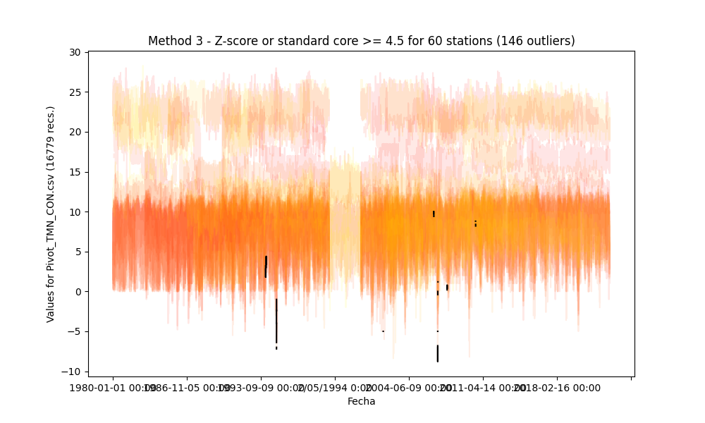

## Outliers detection and processing through statistical methods

* Processed file: [C:/JLGC/R.LTWB/.datasets/IDEAM_EDA/Pivot_TMN_CON.csv](../IDEAM_EDA/Pivot_TMN_CON.csv)
* Execution date: 2023-09-15 11:35:16.731048
* Python version: 3.11.5 (tags/v3.11.5:cce6ba9, Aug 24 2023, 14:38:34) [MSC v.1936 64 bit (AMD64)]
* Python path: ['C:\\JLGC\\R.LTWB\\.src', 'C:\\Python311\\python311.zip', 'C:\\Python311\\DLLs', 'C:\\Python311\\Lib', 'C:\\Python311']
* matplotlib version: 3.6.0
* pandas version: 2.1.0
* numpy version: 1.25.2
* Stations exclude: ['28017140', '25027020', '25027410', '25027490', '25027330', '25027390', '25027630', '25027360', '25027320', '16067010', '25027420']
* Print table sample: True
* Instructions & script: https://github.com/rcfdtools/R.LTWB/tree/main/Section03/Outlier
* License: https://github.com/rcfdtools/R.LTWB/blob/main/LICENSE.md
* Credits: r.cfdtools@gmail.com

### General dataframe information with 16779 IDEAM records for 60 stations

Dataframe records head sample

| Fecha            |   21185040 |   21195080 |   21195120 |   21195190 |   21205012 |   21205160 |   21205230 |   21205420 |   21205520 |   21205580 |   21205660 |   21205670 |   21205700 |   21205710 |   21205720 |   21205740 |   21205770 |   21205791 |   21205910 |   21205940 |   21205970 |   21205980 |   21206050 |   21206160 |   21206180 |   21206190 |   21206200 |   21206230 |   21206260 |   21206280 |   21206500 |   21206510 |   21206550 |   21206560 |   21206570 |   21206600 |   21206610 |   21206620 |   21206630 |   21206640 |   21206650 |   21206660 |   21206670 |   21206680 |   21206690 |   21206700 |   21206970 |   21235010 |   21255080 |   23065060 |   23065100 |   23065120 |   23065200 |   23125070 |   23125170 |   24015380 |   35025050 |   35025060 |   35035030 |   35065010 |
|:-----------------|-----------:|-----------:|-----------:|-----------:|-----------:|-----------:|-----------:|-----------:|-----------:|-----------:|-----------:|-----------:|-----------:|-----------:|-----------:|-----------:|-----------:|-----------:|-----------:|-----------:|-----------:|-----------:|-----------:|-----------:|-----------:|-----------:|-----------:|-----------:|-----------:|-----------:|-----------:|-----------:|-----------:|-----------:|-----------:|-----------:|-----------:|-----------:|-----------:|-----------:|-----------:|-----------:|-----------:|-----------:|-----------:|-----------:|-----------:|-----------:|-----------:|-----------:|-----------:|-----------:|-----------:|-----------:|-----------:|-----------:|-----------:|-----------:|-----------:|-----------:|
| 1980-01-01 00:00 |      nan   |        nan |        nan |        nan |        nan |        nan |        nan |        6.8 |        8   |       10   |        nan |        nan |        nan |       10.4 |        8.2 |       10.4 |        nan |        8   |        6.6 |        3.4 |        nan |      nan   |        nan |        nan |        nan |        nan |        nan |        nan |        nan |        nan |        nan |        nan |        nan |        nan |        nan |        nan |        nan |        nan |        nan |        nan |        nan |        nan |        nan |        nan |        nan |        nan |        nan |        nan |         24 |        nan |        nan |        nan |        nan |       12.4 |        nan |        nan |        nan |        nan |        nan |        nan |
| 1980-01-02 00:00 |       22.8 |        nan |        nan |        nan |        nan |        nan |        nan |       10.4 |        8.8 |        9.6 |        nan |        nan |        nan |        9.4 |        9.8 |      nan   |        nan |       10.5 |      nan   |        4   |        nan |        6.2 |        nan |        nan |        nan |        nan |        nan |        nan |        nan |        nan |        nan |        nan |        nan |        nan |        nan |        nan |        nan |        nan |        nan |        nan |        nan |        nan |        nan |        nan |        nan |        nan |        nan |        nan |         23 |        nan |        nan |        nan |        nan |       12   |        nan |        nan |        nan |        nan |        nan |        nan |
| 1980-01-03 00:00 |       22   |        nan |        nan |        nan |        nan |        nan |        nan |        5   |        6.8 |        8   |        nan |        nan |        nan |        6.8 |        6.2 |       10.2 |        nan |        7.4 |        6   |      nan   |        nan |        3.8 |        nan |        nan |        nan |        nan |        nan |        nan |        nan |        nan |        nan |        nan |        nan |        nan |        nan |        nan |        nan |        nan |        nan |        nan |        nan |        nan |        nan |        nan |        nan |        nan |        nan |        nan |         22 |        nan |        nan |        nan |        nan |       11.4 |        nan |        nan |        nan |        nan |        nan |        nan |

Dataframe records tail sample

| Fecha            |   21185040 |   21195080 |   21195120 |   21195190 |   21205012 |   21205160 |   21205230 |   21205420 |   21205520 |   21205580 |   21205660 |   21205670 |   21205700 |   21205710 |   21205720 |   21205740 |   21205770 |   21205791 |   21205910 |   21205940 |   21205970 |   21205980 |   21206050 |   21206160 |   21206180 |   21206190 |   21206200 |   21206230 |   21206260 |   21206280 |   21206500 |   21206510 |   21206550 |   21206560 |   21206570 |   21206600 |   21206610 |   21206620 |   21206630 |   21206640 |   21206650 |   21206660 |   21206670 |   21206680 |   21206690 |   21206700 |   21206970 |   21235010 |   21255080 |   23065060 |   23065100 |   23065120 |   23065200 |   23125070 |   23125170 |   24015380 |   35025050 |   35025060 |   35035030 |   35065010 |
|:-----------------|-----------:|-----------:|-----------:|-----------:|-----------:|-----------:|-----------:|-----------:|-----------:|-----------:|-----------:|-----------:|-----------:|-----------:|-----------:|-----------:|-----------:|-----------:|-----------:|-----------:|-----------:|-----------:|-----------:|-----------:|-----------:|-----------:|-----------:|-----------:|-----------:|-----------:|-----------:|-----------:|-----------:|-----------:|-----------:|-----------:|-----------:|-----------:|-----------:|-----------:|-----------:|-----------:|-----------:|-----------:|-----------:|-----------:|-----------:|-----------:|-----------:|-----------:|-----------:|-----------:|-----------:|-----------:|-----------:|-----------:|-----------:|-----------:|-----------:|-----------:|
| 2022-12-28 00:00 |        nan |        nan |       15.4 |       10.2 |        nan |        nan |        nan |        1.4 |        nan |        nan |       19   |        nan |        nan |        5.6 |        3.8 |        4.2 |        nan |        nan |        2.4 |        2   |        nan |        5.2 |        nan |        nan |        nan |        nan |        nan |        nan |        nan |        nan |        nan |        nan |        nan |        nan |        nan |        4.6 |        nan |        nan |        nan |        nan |        5.2 |        nan |        nan |        nan |        nan |        nan |        nan |       19   |        nan |        nan |        nan |        nan |        nan |        nan |        nan |        nan |        nan |        nan |        nan |        nan |
| 2022-12-29 00:00 |        nan |        nan |       17   |       10.6 |        nan |        nan |        nan |        4.2 |        nan |        nan |       20.2 |        nan |        nan |        9.6 |        5.4 |        5   |        nan |        nan |       10.2 |        8.2 |        nan |        8.6 |        nan |        nan |        nan |        nan |        nan |        nan |        nan |        nan |        nan |        nan |        nan |        nan |        nan |        7.2 |        nan |        nan |        nan |        nan |        4.8 |        nan |        nan |        nan |        nan |        nan |        nan |       20.2 |        nan |        nan |        nan |        nan |        nan |        nan |        nan |        nan |        nan |        nan |        nan |        nan |
| 2022-12-30 00:00 |        nan |        nan |       17   |       11   |        nan |        nan |        nan |        4.8 |        nan |        nan |       20.6 |        nan |        nan |       10   |        6   |        6   |        nan |        nan |        6   |        5.6 |        nan |        6   |        nan |        nan |        nan |        nan |        nan |        nan |        nan |        nan |        nan |        nan |        nan |        nan |        nan |        8.4 |        nan |        nan |        nan |        nan |        4.5 |        nan |        nan |        nan |        nan |        nan |        nan |       21.2 |        nan |        nan |        nan |        nan |        nan |        nan |        nan |        nan |        nan |        nan |        nan |        nan |

Datatypes for station and nulls values in the initial file

|       | 21185040   | 21195080   | 21195120   | 21195190   | 21205012   | 21205160   | 21205230   | 21205420   | 21205520   | 21205580   | 21205660   | 21205670   | 21205700   | 21205710   | 21205720   | 21205740   | 21205770   | 21205791   | 21205910   | 21205940   | 21205970   | 21205980   | 21206050   | 21206160   | 21206180   | 21206190   | 21206200   | 21206230   | 21206260   | 21206280   | 21206500   | 21206510   | 21206550   | 21206560   | 21206570   | 21206600   | 21206610   | 21206620   | 21206630   | 21206640   | 21206650   | 21206660   | 21206670   | 21206680   | 21206690   | 21206700   | 21206970   | 21235010   | 21255080   | 23065060   | 23065100   | 23065120   | 23065200   | 23125070   | 23125170   | 24015380   | 35025050   | 35025060   | 35035030   | 35065010   |
|:------|:-----------|:-----------|:-----------|:-----------|:-----------|:-----------|:-----------|:-----------|:-----------|:-----------|:-----------|:-----------|:-----------|:-----------|:-----------|:-----------|:-----------|:-----------|:-----------|:-----------|:-----------|:-----------|:-----------|:-----------|:-----------|:-----------|:-----------|:-----------|:-----------|:-----------|:-----------|:-----------|:-----------|:-----------|:-----------|:-----------|:-----------|:-----------|:-----------|:-----------|:-----------|:-----------|:-----------|:-----------|:-----------|:-----------|:-----------|:-----------|:-----------|:-----------|:-----------|:-----------|:-----------|:-----------|:-----------|:-----------|:-----------|:-----------|:-----------|:-----------|
| Dtype | float64    | float64    | float64    | float64    | float64    | float64    | float64    | float64    | float64    | float64    | float64    | float64    | float64    | float64    | float64    | float64    | float64    | float64    | float64    | float64    | float64    | float64    | float64    | float64    | float64    | float64    | float64    | float64    | float64    | float64    | float64    | float64    | float64    | float64    | float64    | float64    | float64    | float64    | float64    | float64    | float64    | float64    | float64    | float64    | float64    | float64    | float64    | float64    | float64    | float64    | float64    | float64    | float64    | float64    | float64    | float64    | float64    | float64    | float64    | float64    |
| Nulls | 4377       | 13828      | 7905       | 3006       | 10288      | 13886      | 13024      | 1780       | 11439      | 5054       | 3501       | 15930      | 15839      | 5207       | 3927       | 3183       | 16198      | 3653       | 2002       | 3544       | 3075       | 1419       | 9236       | 14579      | 6157       | 14257      | 15860      | 9941       | 6983       | 16228      | 13840      | 15732      | 14532      | 10500      | 15078      | 10688      | 16523      | 14673      | 15286      | 15953      | 11686      | 13783      | 16191      | 16125      | 11861      | 16653      | 15391      | 7426       | 4897       | 9221       | 7219       | 15896      | 15110      | 9742       | 16674      | 16547      | 4805       | 16034      | 13902      | 16058      |

General statistics table - Initial file

|          |   count |     mean |      std |   min |    25% |   50% |   75% |   max |
|---------:|--------:|---------:|---------:|------:|-------:|------:|------:|------:|
| 21185040 |   12402 | 23.1218  | 1.34456  |  18.4 | 22.2   |  23.2 |  24   |  28   |
| 21195080 |    2951 | 21.6934  | 1.53169  |  12   | 20.8   |  22   |  22.8 |  27.4 |
| 21195120 |    8874 | 16.271   | 1.24412  |  11   | 15.4   |  16.4 |  17.2 |  20   |
| 21195190 |   13773 | 11.3845  | 1.52981  |   1.8 | 10.4   |  11.6 |  12.4 |  15.4 |
| 21205012 |    6491 |  9.41536 | 2.24236  |  -4   |  8.2   |   9.8 |  11   |  14.5 |
| 21205160 |    2893 |  8.22713 | 3.45499  |   0   |  6     |   8   |  10.1 |  18.2 |
| 21205230 |    3755 |  8.89225 | 2.35759  |   0   |  7.5   |   9.6 |  10.6 |  21.1 |
| 21205420 |   14999 |  6.96662 | 2.7951   |  -5.1 |  5     |   7.4 |   9.2 |  13.2 |
| 21205520 |    5340 |  7.25987 | 2.77866  |  -6.4 |  5.5   |   7.8 |   9.4 |  13   |
| 21205580 |   11725 |  9.05359 | 1.39839  |   3   |  8.2   |   9.2 |  10   |  15   |
| 21205660 |   13278 | 19.6202  | 2.13323  |   8.8 | 19.1   |  20   |  21   |  24.4 |
| 21205670 |     849 | 13.4852  | 1.11826  |  10   | 12.8   |  13.4 |  14.2 |  17.6 |
| 21205700 |     940 |  7.73138 | 2.25708  |   1   |  6.4   |   8.2 |   9.5 |  15   |
| 21205710 |   11572 |  8.90053 | 1.94058  |  -0.4 |  7.6   |   9   |  10.2 |  14.6 |
| 21205720 |   12852 |  7.14088 | 1.76482  |   0   |  6     |   7.2 |   8.4 |  12.2 |
| 21205740 |   13596 |  7.99823 | 2.37803  |  -3.8 |  6.4   |   8.6 |  10   |  15.8 |
| 21205770 |     581 |  6.47694 | 2.69307  |  -0.9 |  4.6   |   6.6 |   8.6 |  12.1 |
| 21205791 |   13126 |  8.04737 | 2.5196   |  -6.4 |  6.6   |   8.6 |   9.9 |  13.2 |
| 21205910 |   14777 |  7.16593 | 2.69761  |  -6   |  5.3   |   7.2 |   9.4 |  15.1 |
| 21205940 |   13235 |  6.65414 | 2.71181  |  -3.2 |  4.8   |   7   |   8.8 |  13.8 |
| 21205970 |   13704 |  6.67226 | 3.03603  |  -8.2 |  4.6   |   7   |   9.2 |  18   |
| 21205980 |   15360 |  7.16415 | 2.96328  |  -8.8 |  5.3   |   7.6 |   9.5 |  13.3 |
| 21206050 |    7543 |  8.04681 | 2.30106  |  -2.8 |  6.6   |   8.6 |   9.8 |  13.4 |
| 21206160 |    2200 | 14.429   | 1.49035  |   8.2 | 14     |  14.8 |  15.4 |  19   |
| 21206180 |   10622 | 14.2303  | 0.996128 |   8.2 | 13.6   |  14.3 |  14.8 |  17.6 |
| 21206190 |    2522 | 10.2632  | 1.71766  |   3   |  9.5   |  10.5 |  11.4 |  19.4 |
| 21206200 |     919 |  6.92916 | 2.82252  |  -2.5 |  5     |   7   |   9   |  12.5 |
| 21206230 |    6838 |  7.96208 | 2.45288  |  -2   |  6.4   |   8.4 |   9.8 |  13   |
| 21206260 |    9796 |  7.48721 | 2.31388  |  -2   |  6.2   |   7.8 |   9.2 |  13.2 |
| 21206280 |     551 |  9.69927 | 1.52569  |   2   |  9     |  10   |  10.6 |  13.6 |
| 21206500 |    2939 |  6.64733 | 2.02725  |   0   |  5.2   |   6.4 |   8   |  14   |
| 21206510 |    1047 | 10.5186  | 1.66155  |   0.9 |  9.5   |  10.8 |  11.7 |  18.8 |
| 21206550 |    2247 |  6.38883 | 3.10609  |  -8.4 |  4.3   |   6.6 |   8.8 |  16   |
| 21206560 |    6279 | 10.289   | 1.98381  |  -2.8 |  9.2   |  10.6 |  11.8 |  15   |
| 21206570 |    1701 |  8.46696 | 1.98066  |   0.5 |  7     |   8.6 |  10   |  13.1 |
| 21206600 |    6091 |  8.10038 | 2.15673  |  -2.6 |  6.8   |   8.4 |   9.8 |  13.6 |
| 21206610 |     256 |  8.28281 | 1.55912  |  -1.6 |  7.4   |   8.4 |   9.2 |  11.6 |
| 21206620 |    2106 |  8.93457 | 2.77564  |  -6.4 |  7.1   |   9.8 |  11   |  16.4 |
| 21206630 |    1493 |  9.46437 | 1.71194  |   3.2 |  8     |   9.8 |  10.8 |  13.2 |
| 21206640 |     826 |  8.49843 | 2.19218  |  -0.6 |  6.8   |   8.7 |  10.2 |  15   |
| 21206650 |    5093 |  6.59672 | 1.60985  |   0.2 |  5.4   |   6.8 |   7.8 |  13   |
| 21206660 |    2996 | 10.1397  | 2.25273  |   0.4 |  9.2   |  10.6 |  11.8 |  15.4 |
| 21206670 |     588 |  7.84388 | 2.67422  |  -3.8 |  6.1   |   8   |  10   |  14.6 |
| 21206680 |     654 |  8.74434 | 1.56984  |   1.8 |  8     |   9   |   9.8 |  13.6 |
| 21206690 |    4918 |  8.44888 | 2.20248  |  -0.8 |  7.6   |   9   |   9.8 |  13.6 |
| 21206700 |     126 |  9.10397 | 2.59505  |  -1.3 |  7.575 |  10   |  11   |  13.1 |
| 21206970 |    1388 |  9.79978 | 1.34533  |   3.6 |  9     |  10   |  10.8 |  13   |
| 21235010 |    9353 | 22.1203  | 1.43296  |  17.2 | 21.2   |  22.4 |  23.2 |  26   |
| 21255080 |   11882 | 22.9545  | 1.47535  |  19   | 22     |  23   |  24   |  26.5 |
| 23065060 |    7558 | 12.542   | 1.1517   |   7   | 11.8   |  12.6 |  13.4 |  17   |
| 23065100 |    9560 |  9.81143 | 1.18133  |   3.2 |  9.1   |  10   |  10.6 |  13.8 |
| 23065120 |     883 | 13.3379  | 1.24338  |   8.9 | 12.6   |  13.2 |  14   |  18   |
| 23065200 |    1669 | 18.0316  | 1.20378  |  13.4 | 17.2   |  18   |  18.8 |  23.4 |
| 23125070 |    7037 | 11.8876  | 1.41965  |   1   | 11     |  12   |  13   |  16.2 |
| 23125170 |     105 |  7.69143 | 1.81554  |   1   |  6.8   |   7.6 |   9   |  11   |
| 24015380 |     232 |  6.91466 | 1.94953  |   0.4 |  5.6   |   7.2 |   8.4 |  10.6 |
| 35025050 |   11974 |  6.56405 | 1.9491   |  -1.2 |  6     |   7   |   8   |  10.4 |
| 35025060 |     745 |  5.03812 | 1.47534  |  -2.4 |  4.2   |   5.2 |   6   |   8.8 |
| 35035030 |    2877 | 19.6525  | 1.5646   |  14   | 18.8   |  19.6 |  20.4 |  28.3 |
| 35065010 |     721 | 13.2244  | 2.19913  |   4.6 | 12     |  13.8 |  15   |  17.2 |

### Method 1 - Outliers processing using the interquartile range IQR (q1 = 0.1, q3 = 0.9)

Since the data doesn`t follow a normal distribution, we will calculate the outlier data points using the statistical method called interquartile range (IQR) instead of using Z-score. Using the IQR, the outlier data points are the ones falling below Q1 - 1.5 IQR or above Q3 + 1.5 IQR. The Q1 could be the 25th percentile and Q3 could be the 75th percentile of the dataset, and IQR represents the interquartile range calculated by Q3 minus Q1 (Q3-Q1). [^1]

Outliers parameters:
* mean: mean value
* std: standard deviation value
* q1: quartile 0.1
* q3: quartile 0.9
* IQR: interquartile range (q3-q1)
* OlLowerLim: outlier bottom limit (q1-1.5*IQR)
* OlUpperLim: outlier top limit (q3+1.5*IQR)
* OlMinVal: minimum outlier value founded
* OlMaxVal: maximum outlier value founded
* OlCount: # outliers founded
* CapLowerLim: capped lower limit for outliers replacement ( $\mu$ - 4.5 * $\sigma$ )
* CapUpperLim: capped upper limit for outliers replacement ( $\mu$ + 4.5 * $\sigma$ )

|          |     mean |      std |    q1 |    q3 |   IQR |   OlLowerLim |   OlUpperLim |   OlMinVal |   OlMaxVal |   OlCount |   CapLowerLim |   CapUpperLim |
|---------:|---------:|---------:|------:|------:|------:|-------------:|-------------:|-----------:|-----------:|----------:|--------------:|--------------:|
| 21185040 | 23.1218  | 1.34456  | 21.4  | 24.8  |  3.4  |       26.5   |       29.9   |      nan   |      nan   |         0 |   17.0713     |       29.1723 |
| 21195080 | 21.6934  | 1.53169  | 19.8  | 23.4  |  3.6  |       25.2   |       28.8   |       12   |       12   |         1 |   14.8008     |       28.586  |
| 21195120 | 16.271   | 1.24412  | 14.6  | 17.8  |  3.2  |       19.4   |       22.6   |      nan   |      nan   |         0 |   10.6724     |       21.8695 |
| 21195190 | 11.3845  | 1.52981  |  9.6  | 13    |  3.4  |       14.7   |       18.1   |        1.8 |        4.4 |        36 |    4.50042    |       18.2687 |
| 21205012 |  9.41536 | 2.24236  |  6.4  | 11.8  |  5.4  |       14.5   |       19.9   |       -4   |       -2.4 |         4 |   -0.675257   |       19.506  |
| 21205160 |  8.22713 | 3.45499  |  4    | 12.5  |  8.5  |       16.75  |       25.25  |      nan   |      nan   |         0 |   -7.32032    |       23.7746 |
| 21205230 |  8.89225 | 2.35759  |  5.6  | 11.4  |  5.8  |       14.3   |       20.1   |       21.1 |       21.1 |         1 |   -1.71693    |       19.5014 |
| 21205420 |  6.96662 | 2.7951   |  3    | 10.4  |  7.4  |       14.1   |       21.5   |      nan   |      nan   |         0 |   -5.61135    |       19.5446 |
| 21205520 |  7.25987 | 2.77866  |  3.2  | 10.4  |  7.2  |       14     |       21.2   |      nan   |      nan   |         0 |   -5.24409    |       19.7638 |
| 21205580 |  9.05359 | 1.39839  |  7.2  | 10.6  |  3.4  |       12.3   |       15.7   |      nan   |      nan   |         0 |    2.76082    |       15.3464 |
| 21205660 | 19.6202  | 2.13323  | 16.6  | 21.6  |  5    |       24.1   |       29.1   |        8.8 |        9.1 |         2 |   10.0207     |       29.2198 |
| 21205670 | 13.4852  | 1.11826  | 12    | 15    |  3    |       16.5   |       19.5   |      nan   |      nan   |         0 |    8.45298    |       18.5173 |
| 21205700 |  7.73138 | 2.25708  |  4.4  | 10.4  |  6    |       13.4   |       19.4   |      nan   |      nan   |         0 |   -2.42549    |       17.8883 |
| 21205710 |  8.90053 | 1.94058  |  6.2  | 11.2  |  5    |       13.7   |       18.7   |      nan   |      nan   |         0 |    0.167934   |       17.6331 |
| 21205720 |  7.14088 | 1.76482  |  4.6  |  9.4  |  4.8  |       11.8   |       16.6   |      nan   |      nan   |         0 |   -0.80083    |       15.0826 |
| 21205740 |  7.99823 | 2.37803  |  4.8  | 10.6  |  5.8  |       13.5   |       19.3   |      nan   |      nan   |         0 |   -2.70289    |       18.6993 |
| 21205770 |  6.47694 | 2.69307  |  3    | 10    |  7    |       13.5   |       20.5   |      nan   |      nan   |         0 |   -5.64189    |       18.5958 |
| 21205791 |  8.04737 | 2.5196   |  4.4  | 10.8  |  6.4  |       14     |       20.4   |       -6.4 |       -6.4 |         1 |   -3.29081    |       19.3856 |
| 21205910 |  7.16593 | 2.69761  |  4    | 10.4  |  6.4  |       13.6   |       20     |       -6   |       -6   |         1 |   -4.9733     |       19.3052 |
| 21205940 |  6.65414 | 2.71181  |  2.8  | 10    |  7.2  |       13.6   |       20.8   |      nan   |      nan   |         0 |   -5.549      |       18.8573 |
| 21205970 |  6.67226 | 3.03603  |  2.3  | 10.2  |  7.9  |       14.15  |       22.05  |      nan   |      nan   |         0 |   -6.98988    |       20.3344 |
| 21205980 |  7.16415 | 2.96328  |  3    | 10.6  |  7.6  |       14.4   |       22     |       -8.8 |       -8.8 |         1 |   -6.17061    |       20.4989 |
| 21206050 |  8.04681 | 2.30106  |  4.8  | 10.6  |  5.8  |       13.5   |       19.3   |      nan   |      nan   |         0 |   -2.30796    |       18.4016 |
| 21206160 | 14.429   | 1.49035  | 12.2  | 15.8  |  3.6  |       17.6   |       21.2   |      nan   |      nan   |         0 |    7.72248    |       21.1356 |
| 21206180 | 14.2303  | 0.996128 | 13    | 15.4  |  2.4  |       16.6   |       19     |        8.2 |        9.3 |        10 |    9.74777    |       18.7129 |
| 21206190 | 10.2632  | 1.71766  |  8    | 12    |  4    |       14     |       18     |       19.4 |       19.4 |         1 |    2.53371    |       17.9926 |
| 21206200 |  6.92916 | 2.82252  |  3    | 10.5  |  7.5  |       14.25  |       21.75  |      nan   |      nan   |         0 |   -5.7722     |       19.6305 |
| 21206230 |  7.96208 | 2.45288  |  4.6  | 10.6  |  6    |       13.6   |       19.6   |      nan   |      nan   |         0 |   -3.07589    |       19.0001 |
| 21206260 |  7.48721 | 2.31388  |  4.4  | 10.2  |  5.8  |       13.1   |       18.9   |      nan   |      nan   |         0 |   -2.92526    |       17.8997 |
| 21206280 |  9.69927 | 1.52569  |  7.6  | 11.2  |  3.6  |       13     |       16.6   |        2   |        2   |         1 |    2.83365    |       16.5649 |
| 21206500 |  6.64733 | 2.02725  |  4.2  |  9.8  |  5.6  |       12.6   |       18.2   |      nan   |      nan   |         0 |   -2.47531    |       15.77   |
| 21206510 | 10.5186  | 1.66155  |  8.4  | 12.4  |  4    |       14.4   |       18.4   |        0.9 |       18.8 |         2 |    3.04167    |       17.9956 |
| 21206550 |  6.38883 | 3.10609  |  2    | 10    |  8    |       14     |       22     |      nan   |      nan   |         0 |   -7.58858    |       20.3662 |
| 21206560 | 10.289   | 1.98381  |  7.6  | 12.4  |  4.8  |       14.8   |       19.6   |       -2.8 |        0.2 |         4 |    1.36191    |       19.2162 |
| 21206570 |  8.46696 | 1.98066  |  6    | 11    |  5    |       13.5   |       18.5   |      nan   |      nan   |         0 |   -0.445996   |       17.3799 |
| 21206600 |  8.10038 | 2.15673  |  5    | 10.6  |  5.6  |       13.4   |       19     |      nan   |      nan   |         0 |   -1.60492    |       17.8057 |
| 21206610 |  8.28281 | 1.55912  |  6.2  | 10    |  3.8  |       11.9   |       15.7   |       -1.6 |       -1.6 |         1 |    1.26679    |       15.2988 |
| 21206620 |  8.93457 | 2.77564  |  5    | 11.8  |  6.8  |       15.2   |       22     |       -6.4 |       -6.4 |         1 |   -3.55579    |       21.4249 |
| 21206630 |  9.46437 | 1.71194  |  7    | 11.6  |  4.6  |       13.9   |       18.5   |      nan   |      nan   |         0 |    1.76063    |       17.1681 |
| 21206640 |  8.49843 | 2.19218  |  5.6  | 11.1  |  5.5  |       13.85  |       19.35  |      nan   |      nan   |         0 |   -1.36636    |       18.3632 |
| 21206650 |  6.59672 | 1.60985  |  4.2  |  8.4  |  4.2  |       10.5   |       14.7   |      nan   |      nan   |         0 |   -0.647615   |       13.8411 |
| 21206660 | 10.1397  | 2.25273  |  7.2  | 12.4  |  5.2  |       15     |       20.2   |      nan   |      nan   |         0 |    0.00242463 |       20.277  |
| 21206670 |  7.84388 | 2.67422  |  4.4  | 11.2  |  6.8  |       14.6   |       21.4   |      nan   |      nan   |         0 |   -4.19009    |       19.8778 |
| 21206680 |  8.74434 | 1.56984  |  6.46 | 10.4  |  3.94 |       12.37  |       16.31  |      nan   |      nan   |         0 |    1.68006    |       15.8086 |
| 21206690 |  8.44888 | 2.20248  |  5.6  | 10.4  |  4.8  |       12.8   |       17.6   |      nan   |      nan   |         0 |   -1.46228    |       18.36   |
| 21206700 |  9.10397 | 2.59505  |  5.4  | 11.55 |  6.15 |       14.625 |       20.775 |      nan   |      nan   |         0 |   -2.57377    |       20.7817 |
| 21206970 |  9.79978 | 1.34533  |  8    | 11.3  |  3.3  |       12.95  |       16.25  |      nan   |      nan   |         0 |    3.7458     |       15.8538 |
| 21235010 | 22.1203  | 1.43296  | 20.2  | 23.8  |  3.6  |       25.6   |       29.2   |      nan   |      nan   |         0 |   15.672      |       28.5686 |
| 21255080 | 22.9545  | 1.47535  | 21    | 25    |  4    |       27     |       31     |      nan   |      nan   |         0 |   16.3154     |       29.5936 |
| 23065060 | 12.542   | 1.1517   | 11    | 14    |  3    |       15.5   |       18.5   |      nan   |      nan   |         0 |    7.35939    |       17.7247 |
| 23065100 |  9.81143 | 1.18133  |  8.2  | 11.2  |  3    |       12.7   |       15.7   |        3.2 |        3.2 |         1 |    4.49544    |       15.1274 |
| 23065120 | 13.3379  | 1.24338  | 11.8  | 15    |  3.2  |       16.6   |       19.8   |      nan   |      nan   |         0 |    7.74274    |       18.9331 |
| 23065200 | 18.0316  | 1.20378  | 16.6  | 19.6  |  3    |       21.1   |       24.1   |      nan   |      nan   |         0 |   12.6146     |       23.4486 |
| 23125070 | 11.8876  | 1.41965  | 10    | 13.6  |  3.6  |       15.4   |       19     |        1   |        1   |         1 |    5.49921    |       18.2761 |
| 23125170 |  7.69143 | 1.81554  |  6.2  | 10    |  3.8  |       11.9   |       15.7   |      nan   |      nan   |         0 |   -0.478489   |       15.8613 |
| 24015380 |  6.91466 | 1.94953  |  4.4  |  9.2  |  4.8  |       11.6   |       16.4   |      nan   |      nan   |         0 |   -1.85821    |       15.6875 |
| 35025050 |  6.56405 | 1.9491   |  3.4  |  8.6  |  5.2  |       11.2   |       16.4   |      nan   |      nan   |         0 |   -2.2069     |       15.335  |
| 35025060 |  5.03812 | 1.47534  |  3    |  6.8  |  3.8  |        8.7   |       12.5   |      nan   |      nan   |         0 |   -1.60092    |       11.6772 |
| 35035030 | 19.6525  | 1.5646   | 18    | 21.6  |  3.6  |       23.4   |       27     |       28.3 |       28.3 |         1 |   12.6118     |       26.6932 |
| 35065010 | 13.2244  | 2.19913  | 10    | 15.4  |  5.4  |       18.1   |       23.5   |      nan   |      nan   |         0 |    3.32832    |       23.1205 |

#### Identified and cleaning tables for 70 IQR outliers founded
* Outliers identified file: [Outlier_IQR_Pivot_TMN_CON.csv](../../.datasets/IDEAM_Outlier/Outlier_IQR_Pivot_TMN_CON.csv)
* Outliers dropped file: [Outlier_IQR_Drop_Pivot_TMN_CON.csv](../../.datasets/IDEAM_Outlier/Outlier_IQR_Drop_Pivot_TMN_CON.csv)
* Outliers capped file: [Outlier_IQR_Cap_Pivot_TMN_CON.csv](../../.datasets/IDEAM_Outlier/Outlier_IQR_Cap_Pivot_TMN_CON.csv)
* Outliers imputed file: [Outlier_IQR_Impute_Pivot_TMN_CON.csv](../../.datasets/IDEAM_Outlier/Outlier_IQR_Impute_Pivot_TMN_CON.csv)

#### Statistical values for the capped and imputed file

IQR - General statistics table - Capped file

|          |   count |     mean |      std |      min |    25% |   50% |   75% |     max |
|---------:|--------:|---------:|---------:|---------:|-------:|------:|------:|--------:|
| 21185040 |   12402 | 23.1218  | 1.34456  | 18.4     | 22.2   |  23.2 |  24   | 28      |
| 21195080 |    2951 | 21.6943  | 1.52654  | 14.8008  | 20.8   |  22   |  22.8 | 27.4    |
| 21195120 |    8874 | 16.271   | 1.24412  | 11       | 15.4   |  16.4 |  17.2 | 20      |
| 21195190 |   13773 | 11.3879  | 1.51272  |  4.50042 | 10.4   |  11.6 |  12.4 | 15.4    |
| 21205012 |    6491 |  9.41692 | 2.23438  | -1       |  8.2   |   9.8 |  11   | 14.5    |
| 21205160 |    2893 |  8.22713 | 3.45499  |  0       |  6     |   8   |  10.1 | 18.2    |
| 21205230 |    3755 |  8.89182 | 2.35553  |  0       |  7.5   |   9.6 |  10.6 | 19.5014 |
| 21205420 |   14999 |  6.96662 | 2.7951   | -5.1     |  5     |   7.4 |   9.2 | 13.2    |
| 21205520 |    5340 |  7.25987 | 2.77866  | -6.4     |  5.5   |   7.8 |   9.4 | 13      |
| 21205580 |   11725 |  9.05359 | 1.39839  |  3       |  8.2   |   9.2 |  10   | 15      |
| 21205660 |   13278 | 19.6204  | 2.13246  |  9.2     | 19.1   |  20   |  21   | 24.4    |
| 21205670 |     849 | 13.4852  | 1.11826  | 10       | 12.8   |  13.4 |  14.2 | 17.6    |
| 21205700 |     940 |  7.73138 | 2.25708  |  1       |  6.4   |   8.2 |   9.5 | 15      |
| 21205710 |   11572 |  8.90053 | 1.94058  | -0.4     |  7.6   |   9   |  10.2 | 14.6    |
| 21205720 |   12852 |  7.14088 | 1.76482  |  0       |  6     |   7.2 |   8.4 | 12.2    |
| 21205740 |   13596 |  7.99823 | 2.37803  | -3.8     |  6.4   |   8.6 |  10   | 15.8    |
| 21205770 |     581 |  6.47694 | 2.69307  | -0.9     |  4.6   |   6.6 |   8.6 | 12.1    |
| 21205791 |   13126 |  8.04761 | 2.51838  | -4.6     |  6.6   |   8.6 |   9.9 | 13.2    |
| 21205910 |   14777 |  7.166   | 2.69728  | -5       |  5.3   |   7.2 |   9.4 | 15.1    |
| 21205940 |   13235 |  6.65414 | 2.71181  | -3.2     |  4.8   |   7   |   8.8 | 13.8    |
| 21205970 |   13704 |  6.67226 | 3.03603  | -8.2     |  4.6   |   7   |   9.2 | 18      |
| 21205980 |   15360 |  7.16432 | 2.96243  | -7.2     |  5.3   |   7.6 |   9.5 | 13.3    |
| 21206050 |    7543 |  8.04681 | 2.30106  | -2.8     |  6.6   |   8.6 |   9.8 | 13.4    |
| 21206160 |    2200 | 14.429   | 1.49035  |  8.2     | 14     |  14.8 |  15.4 | 19      |
| 21206180 |   10622 | 14.2313  | 0.991534 |  9.4     | 13.6   |  14.3 |  14.8 | 17.6    |
| 21206190 |    2522 | 10.2626  | 1.71491  |  3       |  9.5   |  10.5 |  11.4 | 17.9926 |
| 21206200 |     919 |  6.92916 | 2.82252  | -2.5     |  5     |   7   |   9   | 12.5    |
| 21206230 |    6838 |  7.96208 | 2.45288  | -2       |  6.4   |   8.4 |   9.8 | 13      |
| 21206260 |    9796 |  7.48721 | 2.31388  | -2       |  6.2   |   7.8 |   9.2 | 13.2    |
| 21206280 |     551 |  9.70079 | 1.51844  |  2.83365 |  9     |  10   |  10.6 | 13.6    |
| 21206500 |    2939 |  6.64733 | 2.02725  |  0       |  5.2   |   6.4 |   8   | 14      |
| 21206510 |    1047 | 10.5199  | 1.6473   |  3       |  9.5   |  10.8 |  11.7 | 17.9956 |
| 21206550 |    2247 |  6.38883 | 3.10609  | -8.4     |  4.3   |   6.6 |   8.8 | 16      |
| 21206560 |    6279 | 10.2905  | 1.97626  |  0.4     |  9.2   |  10.6 |  11.8 | 15      |
| 21206570 |    1701 |  8.46696 | 1.98066  |  0.5     |  7     |   8.6 |  10   | 13.1    |
| 21206600 |    6091 |  8.10038 | 2.15673  | -2.6     |  6.8   |   8.4 |   9.8 | 13.6    |
| 21206610 |     256 |  8.29401 | 1.49691  |  1       |  7.4   |   8.4 |   9.2 | 11.6    |
| 21206620 |    2106 |  8.93592 | 2.76885  | -3.55579 |  7.1   |   9.8 |  11   | 16.4    |
| 21206630 |    1493 |  9.46437 | 1.71194  |  3.2     |  8     |   9.8 |  10.8 | 13.2    |
| 21206640 |     826 |  8.49843 | 2.19218  | -0.6     |  6.8   |   8.7 |  10.2 | 15      |
| 21206650 |    5093 |  6.59672 | 1.60985  |  0.2     |  5.4   |   6.8 |   7.8 | 13      |
| 21206660 |    2996 | 10.1397  | 2.25273  |  0.4     |  9.2   |  10.6 |  11.8 | 15.4    |
| 21206670 |     588 |  7.84388 | 2.67422  | -3.8     |  6.1   |   8   |  10   | 14.6    |
| 21206680 |     654 |  8.74434 | 1.56984  |  1.8     |  8     |   9   |   9.8 | 13.6    |
| 21206690 |    4918 |  8.44888 | 2.20248  | -0.8     |  7.6   |   9   |   9.8 | 13.6    |
| 21206700 |     126 |  9.10397 | 2.59505  | -1.3     |  7.575 |  10   |  11   | 13.1    |
| 21206970 |    1388 |  9.79978 | 1.34533  |  3.6     |  9     |  10   |  10.8 | 13      |
| 21235010 |    9353 | 22.1203  | 1.43296  | 17.2     | 21.2   |  22.4 |  23.2 | 26      |
| 21255080 |   11882 | 22.9545  | 1.47535  | 19       | 22     |  23   |  24   | 26.5    |
| 23065060 |    7558 | 12.542   | 1.1517   |  7       | 11.8   |  12.6 |  13.4 | 17      |
| 23065100 |    9560 |  9.81157 | 1.18065  |  3.8     |  9.1   |  10   |  10.6 | 13.8    |
| 23065120 |     883 | 13.3379  | 1.24338  |  8.9     | 12.6   |  13.2 |  14   | 18      |
| 23065200 |    1669 | 18.0316  | 1.20378  | 13.4     | 17.2   |  18   |  18.8 | 23.4    |
| 23125070 |    7037 | 11.8883  | 1.41575  |  5.49921 | 11     |  12   |  13   | 16.2    |
| 23125170 |     105 |  7.69143 | 1.81554  |  1       |  6.8   |   7.6 |   9   | 11      |
| 24015380 |     232 |  6.91466 | 1.94953  |  0.4     |  5.6   |   7.2 |   8.4 | 10.6    |
| 35025050 |   11974 |  6.56405 | 1.9491   | -1.2     |  6     |   7   |   8   | 10.4    |
| 35025060 |     745 |  5.03812 | 1.47534  | -2.4     |  4.2   |   5.2 |   6   |  8.8    |
| 35035030 |    2877 | 19.652   | 1.5618   | 14       | 18.8   |  19.6 |  20.4 | 26.6932 |
| 35065010 |     721 | 13.2244  | 2.19913  |  4.6     | 12     |  13.8 |  15   | 17.2    |

IQR - General statistics table - Imputed file

|          |   count |     mean |      std |   min |    25% |   50% |   75% |   max |
|---------:|--------:|---------:|---------:|------:|-------:|------:|------:|------:|
| 21185040 |   12402 | 23.1218  | 1.34456  |  18.4 | 22.2   |  23.2 |  24   |  28   |
| 21195080 |    2951 | 21.6967  | 1.52125  |  15.3 | 20.8   |  22   |  22.8 |  27.4 |
| 21195120 |    8874 | 16.271   | 1.24412  |  11   | 15.4   |  16.4 |  17.2 |  20   |
| 21195190 |   13773 | 11.4059  | 1.47106  |   4.6 | 10.4   |  11.6 |  12.4 |  15.4 |
| 21205012 |    6491 |  9.42313 | 2.22028  |  -1   |  8.2   |   9.8 |  11   |  14.5 |
| 21205160 |    2893 |  8.22713 | 3.45499  |   0   |  6     |   8   |  10.1 |  18.2 |
| 21205230 |    3755 |  8.889   | 2.34916  |   0   |  7.5   |   9.6 |  10.6 |  14.6 |
| 21205420 |   14999 |  6.96662 | 2.7951   |  -5.1 |  5     |   7.4 |   9.2 |  13.2 |
| 21205520 |    5340 |  7.25987 | 2.77866  |  -6.4 |  5.5   |   7.8 |   9.4 |  13   |
| 21205580 |   11725 |  9.05359 | 1.39839  |   3   |  8.2   |   9.2 |  10   |  15   |
| 21205660 |   13278 | 19.6219  | 2.12921  |   9.2 | 19.1   |  20   |  21   |  24.4 |
| 21205670 |     849 | 13.4852  | 1.11826  |  10   | 12.8   |  13.4 |  14.2 |  17.6 |
| 21205700 |     940 |  7.73138 | 2.25708  |   1   |  6.4   |   8.2 |   9.5 |  15   |
| 21205710 |   11572 |  8.90053 | 1.94058  |  -0.4 |  7.6   |   9   |  10.2 |  14.6 |
| 21205720 |   12852 |  7.14088 | 1.76482  |   0   |  6     |   7.2 |   8.4 |  12.2 |
| 21205740 |   13596 |  7.99823 | 2.37803  |  -3.8 |  6.4   |   8.6 |  10   |  15.8 |
| 21205770 |     581 |  6.47694 | 2.69307  |  -0.9 |  4.6   |   6.6 |   8.6 |  12.1 |
| 21205791 |   13126 |  8.04847 | 2.51644  |  -4.6 |  6.6   |   8.6 |   9.9 |  13.2 |
| 21205910 |   14777 |  7.16682 | 2.69543  |  -5   |  5.3   |   7.2 |   9.4 |  15.1 |
| 21205940 |   13235 |  6.65414 | 2.71181  |  -3.2 |  4.8   |   7   |   8.8 |  13.8 |
| 21205970 |   13704 |  6.67226 | 3.03603  |  -8.2 |  4.6   |   7   |   9.2 |  18   |
| 21205980 |   15360 |  7.16519 | 2.96048  |  -7.2 |  5.3   |   7.6 |   9.5 |  13.3 |
| 21206050 |    7543 |  8.04681 | 2.30106  |  -2.8 |  6.6   |   8.6 |   9.8 |  13.4 |
| 21206160 |    2200 | 14.429   | 1.49035  |   8.2 | 14     |  14.8 |  15.4 |  19   |
| 21206180 |   10622 | 14.2355  | 0.981934 |   9.4 | 13.6   |  14.3 |  14.8 |  17.6 |
| 21206190 |    2522 | 10.2595  | 1.70798  |   3   |  9.5   |  10.5 |  11.4 |  15.6 |
| 21206200 |     919 |  6.92916 | 2.82252  |  -2.5 |  5     |   7   |   9   |  12.5 |
| 21206230 |    6838 |  7.96208 | 2.45288  |  -2   |  6.4   |   8.4 |   9.8 |  13   |
| 21206260 |    9796 |  7.48721 | 2.31388  |  -2   |  6.2   |   7.8 |   9.2 |  13.2 |
| 21206280 |     551 |  9.71325 | 1.48989  |   3.4 |  9     |  10   |  10.6 |  13.6 |
| 21206500 |    2939 |  6.64733 | 2.02725  |   0   |  5.2   |   6.4 |   8   |  14   |
| 21206510 |    1047 | 10.5199  | 1.61453  |   3   |  9.5   |  10.7 |  11.7 |  14.8 |
| 21206550 |    2247 |  6.38883 | 3.10609  |  -8.4 |  4.3   |   6.6 |   8.8 |  16   |
| 21206560 |    6279 | 10.2962  | 1.96336  |   0.4 |  9.2   |  10.6 |  11.8 |  15   |
| 21206570 |    1701 |  8.46696 | 1.98066  |   0.5 |  7     |   8.6 |  10   |  13.1 |
| 21206600 |    6091 |  8.10038 | 2.15673  |  -2.6 |  6.8   |   8.4 |   9.8 |  13.6 |
| 21206610 |     256 |  8.32142 | 1.4305   |   1   |  7.4   |   8.4 |   9.2 |  11.6 |
| 21206620 |    2106 |  8.94185 | 2.75543  |  -3.2 |  7.1   |   9.8 |  11   |  16.4 |
| 21206630 |    1493 |  9.46437 | 1.71194  |   3.2 |  8     |   9.8 |  10.8 |  13.2 |
| 21206640 |     826 |  8.49843 | 2.19218  |  -0.6 |  6.8   |   8.7 |  10.2 |  15   |
| 21206650 |    5093 |  6.59672 | 1.60985  |   0.2 |  5.4   |   6.8 |   7.8 |  13   |
| 21206660 |    2996 | 10.1397  | 2.25273  |   0.4 |  9.2   |  10.6 |  11.8 |  15.4 |
| 21206670 |     588 |  7.84388 | 2.67422  |  -3.8 |  6.1   |   8   |  10   |  14.6 |
| 21206680 |     654 |  8.74434 | 1.56984  |   1.8 |  8     |   9   |   9.8 |  13.6 |
| 21206690 |    4918 |  8.44888 | 2.20248  |  -0.8 |  7.6   |   9   |   9.8 |  13.6 |
| 21206700 |     126 |  9.10397 | 2.59505  |  -1.3 |  7.575 |  10   |  11   |  13.1 |
| 21206970 |    1388 |  9.79978 | 1.34533  |   3.6 |  9     |  10   |  10.8 |  13   |
| 21235010 |    9353 | 22.1203  | 1.43296  |  17.2 | 21.2   |  22.4 |  23.2 |  26   |
| 21255080 |   11882 | 22.9545  | 1.47535  |  19   | 22     |  23   |  24   |  26.5 |
| 23065060 |    7558 | 12.542   | 1.1517   |   7   | 11.8   |  12.6 |  13.4 |  17   |
| 23065100 |    9560 |  9.81212 | 1.17939  |   3.8 |  9.1   |  10   |  10.6 |  13.8 |
| 23065120 |     883 | 13.3379  | 1.24338  |   8.9 | 12.6   |  13.2 |  14   |  18   |
| 23065200 |    1669 | 18.0316  | 1.20378  |  13.4 | 17.2   |  18   |  18.8 |  23.4 |
| 23125070 |    7037 | 11.8892  | 1.4137   |   6   | 11     |  12   |  13   |  16.2 |
| 23125170 |     105 |  7.69143 | 1.81554  |   1   |  6.8   |   7.6 |   9   |  11   |
| 24015380 |     232 |  6.91466 | 1.94953  |   0.4 |  5.6   |   7.2 |   8.4 |  10.6 |
| 35025050 |   11974 |  6.56405 | 1.9491   |  -1.2 |  6     |   7   |   8   |  10.4 |
| 35025060 |     745 |  5.03812 | 1.47534  |  -2.4 |  4.2   |   5.2 |   6   |   8.8 |
| 35035030 |    2877 | 19.6495  | 1.55627  |  14   | 18.8   |  19.6 |  20.4 |  25   |
| 35065010 |     721 | 13.2244  | 2.19913  |   4.6 | 12     |  13.8 |  15   |  17.2 |

### Method 2 - Outliers processing through empirical rule - ER or _k-sigma_ ( $\mu$ - _k_ * $\sigma$ ) with _k_ = 4.5

The empirical rule, also referred to as the three-sigma rule or 68-95-99.7 rule, is a statistical rule which states that for a normal distribution, almost all observed data will fall within three standard deviations (denoted by $\sigma$) of the mean or average (denoted by $\mu$). In particular, the empirical rule predicts that 68% of observations falls within the first standard deviation ( $\mu$ ± $\sigma$ ), 95% within the first two standard deviations ( $\mu$ ± 2 $\sigma$ ), and 99.7% within the first three standard deviations ( $\mu$ ± 3 $\sigma$ ).[^2]

Outliers parameters:
* mean: mean value
* std: standard deviation value
* OlMinVal: minimum outlier value founded
* OlMaxVal: maximum outlier value founded
* OlCount: # outliers founded
* CapLowerLim: capped lower limit for outliers replacement ( $\mu$ - 4.5 * $\sigma$ )
* CapUpperLim: capped upper limit for outliers replacement ( $\mu$ + 4.5 * $\sigma$ )

|          |     mean |      std |   OlMinVal |   OlMaxVal |   OlCount |   CapLowerLim |   CapUpperLim |
|---------:|---------:|---------:|-----------:|-----------:|----------:|--------------:|--------------:|
| 21185040 | 23.1218  | 1.34456  |      nan   |      nan   |         0 |   17.0713     |       29.1723 |
| 21195080 | 21.6934  | 1.53169  |       12   |       12   |         1 |   14.8008     |       28.586  |
| 21195120 | 16.271   | 1.24412  |      nan   |      nan   |         0 |   10.6724     |       21.8695 |
| 21195190 | 11.3845  | 1.52981  |        1.8 |        4.4 |        36 |    4.50042    |       18.2687 |
| 21205012 |  9.41536 | 2.24236  |       -4   |       -1   |         5 |   -0.675257   |       19.506  |
| 21205160 |  8.22713 | 3.45499  |      nan   |      nan   |         0 |   -7.32032    |       23.7746 |
| 21205230 |  8.89225 | 2.35759  |       21.1 |       21.1 |         1 |   -1.71693    |       19.5014 |
| 21205420 |  6.96662 | 2.7951   |      nan   |      nan   |         0 |   -5.61135    |       19.5446 |
| 21205520 |  7.25987 | 2.77866  |       -6.4 |       -6.4 |         1 |   -5.24409    |       19.7638 |
| 21205580 |  9.05359 | 1.39839  |      nan   |      nan   |         0 |    2.76082    |       15.3464 |
| 21205660 | 19.6202  | 2.13323  |        8.8 |       10   |        21 |   10.0207     |       29.2198 |
| 21205670 | 13.4852  | 1.11826  |      nan   |      nan   |         0 |    8.45298    |       18.5173 |
| 21205700 |  7.73138 | 2.25708  |      nan   |      nan   |         0 |   -2.42549    |       17.8883 |
| 21205710 |  8.90053 | 1.94058  |       -0.4 |        0.1 |         3 |    0.167934   |       17.6331 |
| 21205720 |  7.14088 | 1.76482  |      nan   |      nan   |         0 |   -0.80083    |       15.0826 |
| 21205740 |  7.99823 | 2.37803  |       -3.8 |       -2.8 |         3 |   -2.70289    |       18.6993 |
| 21205770 |  6.47694 | 2.69307  |      nan   |      nan   |         0 |   -5.64189    |       18.5958 |
| 21205791 |  8.04737 | 2.5196   |       -6.4 |       -4   |         4 |   -3.29081    |       19.3856 |
| 21205910 |  7.16593 | 2.69761  |       -6   |       -5   |        11 |   -4.9733     |       19.3052 |
| 21205940 |  6.65414 | 2.71181  |      nan   |      nan   |         0 |   -5.549      |       18.8573 |
| 21205970 |  6.67226 | 3.03603  |       -8.2 |       -8.2 |         1 |   -6.98988    |       20.3344 |
| 21205980 |  7.16415 | 2.96328  |       -8.8 |       -6.8 |         5 |   -6.17061    |       20.4989 |
| 21206050 |  8.04681 | 2.30106  |       -2.8 |       -2.8 |         1 |   -2.30796    |       18.4016 |
| 21206160 | 14.429   | 1.49035  |      nan   |      nan   |         0 |    7.72248    |       21.1356 |
| 21206180 | 14.2303  | 0.996128 |        8.2 |        9.6 |        13 |    9.74777    |       18.7129 |
| 21206190 | 10.2632  | 1.71766  |       19.4 |       19.4 |         1 |    2.53371    |       17.9926 |
| 21206200 |  6.92916 | 2.82252  |      nan   |      nan   |         0 |   -5.7722     |       19.6305 |
| 21206230 |  7.96208 | 2.45288  |      nan   |      nan   |         0 |   -3.07589    |       19.0001 |
| 21206260 |  7.48721 | 2.31388  |      nan   |      nan   |         0 |   -2.92526    |       17.8997 |
| 21206280 |  9.69927 | 1.52569  |        2   |        2   |         1 |    2.83365    |       16.5649 |
| 21206500 |  6.64733 | 2.02725  |      nan   |      nan   |         0 |   -2.47531    |       15.77   |
| 21206510 | 10.5186  | 1.66155  |        0.9 |       18.8 |         3 |    3.04167    |       17.9956 |
| 21206550 |  6.38883 | 3.10609  |       -8.4 |       -7.8 |         2 |   -7.58858    |       20.3662 |
| 21206560 | 10.289   | 1.98381  |       -2.8 |        1.3 |        16 |    1.36191    |       19.2162 |
| 21206570 |  8.46696 | 1.98066  |      nan   |      nan   |         0 |   -0.445996   |       17.3799 |
| 21206600 |  8.10038 | 2.15673  |       -2.6 |       -2.2 |         2 |   -1.60492    |       17.8057 |
| 21206610 |  8.28281 | 1.55912  |       -1.6 |        1   |         2 |    1.26679    |       15.2988 |
| 21206620 |  8.93457 | 2.77564  |       -6.4 |       -6.4 |         1 |   -3.55579    |       21.4249 |
| 21206630 |  9.46437 | 1.71194  |      nan   |      nan   |         0 |    1.76063    |       17.1681 |
| 21206640 |  8.49843 | 2.19218  |      nan   |      nan   |         0 |   -1.36636    |       18.3632 |
| 21206650 |  6.59672 | 1.60985  |      nan   |      nan   |         0 |   -0.647615   |       13.8411 |
| 21206660 | 10.1397  | 2.25273  |      nan   |      nan   |         0 |    0.00242463 |       20.277  |
| 21206670 |  7.84388 | 2.67422  |      nan   |      nan   |         0 |   -4.19009    |       19.8778 |
| 21206680 |  8.74434 | 1.56984  |      nan   |      nan   |         0 |    1.68006    |       15.8086 |
| 21206690 |  8.44888 | 2.20248  |      nan   |      nan   |         0 |   -1.46228    |       18.36   |
| 21206700 |  9.10397 | 2.59505  |      nan   |      nan   |         0 |   -2.57377    |       20.7817 |
| 21206970 |  9.79978 | 1.34533  |        3.6 |        3.6 |         1 |    3.7458     |       15.8538 |
| 21235010 | 22.1203  | 1.43296  |      nan   |      nan   |         0 |   15.672      |       28.5686 |
| 21255080 | 22.9545  | 1.47535  |      nan   |      nan   |         0 |   16.3154     |       29.5936 |
| 23065060 | 12.542   | 1.1517   |        7   |        7.2 |         3 |    7.35939    |       17.7247 |
| 23065100 |  9.81143 | 1.18133  |        3.2 |        3.8 |         4 |    4.49544    |       15.1274 |
| 23065120 | 13.3379  | 1.24338  |      nan   |      nan   |         0 |    7.74274    |       18.9331 |
| 23065200 | 18.0316  | 1.20378  |      nan   |      nan   |         0 |   12.6146     |       23.4486 |
| 23125070 | 11.8876  | 1.41965  |        1   |        1   |         1 |    5.49921    |       18.2761 |
| 23125170 |  7.69143 | 1.81554  |      nan   |      nan   |         0 |   -0.478489   |       15.8613 |
| 24015380 |  6.91466 | 1.94953  |      nan   |      nan   |         0 |   -1.85821    |       15.6875 |
| 35025050 |  6.56405 | 1.9491   |      nan   |      nan   |         0 |   -2.2069     |       15.335  |
| 35025060 |  5.03812 | 1.47534  |       -2.4 |       -2   |         2 |   -1.60092    |       11.6772 |
| 35035030 | 19.6525  | 1.5646   |       28.3 |       28.3 |         1 |   12.6118     |       26.6932 |
| 35065010 | 13.2244  | 2.19913  |      nan   |      nan   |         0 |    3.32832    |       23.1205 |

#### Identified and cleaning tables for 146 ER or k-sigma outliers founded
* Outliers identified file: [Outlier_ER_Pivot_TMN_CON.csv](../../.datasets/IDEAM_Outlier/Outlier_ER_Pivot_TMN_CON.csv)
* Outliers dropped file: [Outlier_ER_Drop_Pivot_TMN_CON.csv](../../.datasets/IDEAM_Outlier/Outlier_ER_Drop_Pivot_TMN_CON.csv)
* Outliers capped file: [Outlier_ER_Cap_Pivot_TMN_CON.csv](../../.datasets/IDEAM_Outlier/Outlier_ER_Cap_Pivot_TMN_CON.csv)
* Outliers imputed file: [Outlier_ER_Impute_Pivot_TMN_CON.csv](../../.datasets/IDEAM_Outlier/Outlier_ER_Impute_Pivot_TMN_CON.csv)

#### Statistical values for the capped and imputed file

ER - General statistics table - Capped file

|          |   count |     mean |      std |       min |    25% |   50% |   75% |     max |
|---------:|--------:|---------:|---------:|----------:|-------:|------:|------:|--------:|
| 21185040 |   12402 | 23.1218  | 1.34456  | 18.4      | 22.2   |  23.2 |  24   | 28      |
| 21195080 |    2951 | 21.6943  | 1.52654  | 14.8008   | 20.8   |  22   |  22.8 | 27.4    |
| 21195120 |    8874 | 16.271   | 1.24412  | 11        | 15.4   |  16.4 |  17.2 | 20      |
| 21195190 |   13773 | 11.3879  | 1.51272  |  4.50042  | 10.4   |  11.6 |  12.4 | 15.4    |
| 21205012 |    6491 |  9.41697 | 2.23415  | -0.675257 |  8.2   |   9.8 |  11   | 14.5    |
| 21205160 |    2893 |  8.22713 | 3.45499  |  0        |  6     |   8   |  10.1 | 18.2    |
| 21205230 |    3755 |  8.89182 | 2.35553  |  0        |  7.5   |   9.6 |  10.6 | 19.5014 |
| 21205420 |   14999 |  6.96662 | 2.7951   | -5.1      |  5     |   7.4 |   9.2 | 13.2    |
| 21205520 |    5340 |  7.26009 | 2.77764  | -5.24409  |  5.5   |   7.8 |   9.4 | 13      |
| 21205580 |   11725 |  9.05359 | 1.39839  |  3        |  8.2   |   9.2 |  10   | 15      |
| 21205660 |   13278 | 19.6207  | 2.13101  | 10.0207   | 19.1   |  20   |  21   | 24.4    |
| 21205670 |     849 | 13.4852  | 1.11826  | 10        | 12.8   |  13.4 |  14.2 | 17.6    |
| 21205700 |     940 |  7.73138 | 2.25708  |  1        |  6.4   |   8.2 |   9.5 | 15      |
| 21205710 |   11572 |  8.9006  | 1.94026  |  0.167934 |  7.6   |   9   |  10.2 | 14.6    |
| 21205720 |   12852 |  7.14088 | 1.76482  |  0        |  6     |   7.2 |   8.4 | 12.2    |
| 21205740 |   13596 |  7.99832 | 2.37758  | -2.70289  |  6.4   |   8.6 |  10   | 15.8    |
| 21205770 |     581 |  6.47694 | 2.69307  | -0.9      |  4.6   |   6.6 |   8.6 | 12.1    |
| 21205791 |   13126 |  8.04782 | 2.51741  | -3.29081  |  6.6   |   8.6 |   9.9 | 13.2    |
| 21205910 |   14777 |  7.16601 | 2.6972   | -4.9733   |  5.3   |   7.2 |   9.4 | 15.1    |
| 21205940 |   13235 |  6.65414 | 2.71181  | -3.2      |  4.8   |   7   |   8.8 | 13.8    |
| 21205970 |   13704 |  6.67235 | 3.03562  | -6.98988  |  4.6   |   7   |   9.2 | 18      |
| 21205980 |   15360 |  7.16453 | 2.96143  | -6.17061  |  5.3   |   7.6 |   9.5 | 13.3    |
| 21206050 |    7543 |  8.04688 | 2.30076  | -2.30796  |  6.6   |   8.6 |   9.8 | 13.4    |
| 21206160 |    2200 | 14.429   | 1.49035  |  8.2      | 14     |  14.8 |  15.4 | 19      |
| 21206180 |   10622 | 14.2313  | 0.991162 |  9.74777  | 13.6   |  14.3 |  14.8 | 17.6    |
| 21206190 |    2522 | 10.2626  | 1.71491  |  3        |  9.5   |  10.5 |  11.4 | 17.9926 |
| 21206200 |     919 |  6.92916 | 2.82252  | -2.5      |  5     |   7   |   9   | 12.5    |
| 21206230 |    6838 |  7.96208 | 2.45288  | -2        |  6.4   |   8.4 |   9.8 | 13      |
| 21206260 |    9796 |  7.48721 | 2.31388  | -2        |  6.2   |   7.8 |   9.2 | 13.2    |
| 21206280 |     551 |  9.70079 | 1.51844  |  2.83365  |  9     |  10   |  10.6 | 13.6    |
| 21206500 |    2939 |  6.64733 | 2.02725  |  0        |  5.2   |   6.4 |   8   | 14      |
| 21206510 |    1047 | 10.5199  | 1.64712  |  3.04167  |  9.5   |  10.8 |  11.7 | 17.9956 |
| 21206550 |    2247 |  6.38928 | 3.10399  | -7.58858  |  4.3   |   6.6 |   8.8 | 16      |
| 21206560 |    6279 | 10.2913  | 1.97235  |  1.36191  |  9.2   |  10.6 |  11.8 | 15      |
| 21206570 |    1701 |  8.46696 | 1.98066  |  0.5      |  7     |   8.6 |  10   | 13.1    |
| 21206600 |    6091 |  8.10064 | 2.15551  | -1.60492  |  6.8   |   8.4 |   9.8 | 13.6    |
| 21206610 |     256 |  8.29505 | 1.49189  |  1.26679  |  7.4   |   8.4 |   9.2 | 11.6    |
| 21206620 |    2106 |  8.93592 | 2.76885  | -3.55579  |  7.1   |   9.8 |  11   | 16.4    |
| 21206630 |    1493 |  9.46437 | 1.71194  |  3.2      |  8     |   9.8 |  10.8 | 13.2    |
| 21206640 |     826 |  8.49843 | 2.19218  | -0.6      |  6.8   |   8.7 |  10.2 | 15      |
| 21206650 |    5093 |  6.59672 | 1.60985  |  0.2      |  5.4   |   6.8 |   7.8 | 13      |
| 21206660 |    2996 | 10.1397  | 2.25273  |  0.4      |  9.2   |  10.6 |  11.8 | 15.4    |
| 21206670 |     588 |  7.84388 | 2.67422  | -3.8      |  6.1   |   8   |  10   | 14.6    |
| 21206680 |     654 |  8.74434 | 1.56984  |  1.8      |  8     |   9   |   9.8 | 13.6    |
| 21206690 |    4918 |  8.44888 | 2.20248  | -0.8      |  7.6   |   9   |   9.8 | 13.6    |
| 21206700 |     126 |  9.10397 | 2.59505  | -1.3      |  7.575 |  10   |  11   | 13.1    |
| 21206970 |    1388 |  9.79989 | 1.34485  |  3.7458   |  9     |  10   |  10.8 | 13      |
| 21235010 |    9353 | 22.1203  | 1.43296  | 17.2      | 21.2   |  22.4 |  23.2 | 26      |
| 21255080 |   11882 | 22.9545  | 1.47535  | 19        | 22     |  23   |  24   | 26.5    |
| 23065060 |    7558 | 12.5422  | 1.15116  |  7.35939  | 11.8   |  12.6 |  13.4 | 17      |
| 23065100 |    9560 |  9.81179 | 1.1796   |  4.49544  |  9.1   |  10   |  10.6 | 13.8    |
| 23065120 |     883 | 13.3379  | 1.24338  |  8.9      | 12.6   |  13.2 |  14   | 18      |
| 23065200 |    1669 | 18.0316  | 1.20378  | 13.4      | 17.2   |  18   |  18.8 | 23.4    |
| 23125070 |    7037 | 11.8883  | 1.41575  |  5.49921  | 11     |  12   |  13   | 16.2    |
| 23125170 |     105 |  7.69143 | 1.81554  |  1        |  6.8   |   7.6 |   9   | 11      |
| 24015380 |     232 |  6.91466 | 1.94953  |  0.4      |  5.6   |   7.2 |   8.4 | 10.6    |
| 35025050 |   11974 |  6.56405 | 1.9491   | -1.2      |  6     |   7   |   8   | 10.4    |
| 35025060 |     745 |  5.03973 | 1.46771  | -1.60092  |  4.2   |   5.2 |   6   |  8.8    |
| 35035030 |    2877 | 19.652   | 1.5618   | 14        | 18.8   |  19.6 |  20.4 | 26.6932 |
| 35065010 |     721 | 13.2244  | 2.19913  |  4.6      | 12     |  13.8 |  15   | 17.2    |

ER - General statistics table - Imputed file

|          |   count |     mean |      std |   min |    25% |   50% |   75% |   max |
|---------:|--------:|---------:|---------:|------:|-------:|------:|------:|------:|
| 21185040 |   12402 | 23.1218  | 1.34456  |  18.4 | 22.2   |  23.2 |  24   |  28   |
| 21195080 |    2951 | 21.6967  | 1.52125  |  15.3 | 20.8   |  22   |  22.8 |  27.4 |
| 21195120 |    8874 | 16.271   | 1.24412  |  11   | 15.4   |  16.4 |  17.2 |  20   |
| 21195190 |   13773 | 11.4059  | 1.47106  |   4.6 | 10.4   |  11.6 |  12.4 |  15.4 |
| 21205012 |    6491 |  9.42474 | 2.2165   |  -0.4 |  8.2   |   9.8 |  11   |  14.5 |
| 21205160 |    2893 |  8.22713 | 3.45499  |   0   |  6     |   8   |  10.1 |  18.2 |
| 21205230 |    3755 |  8.889   | 2.34916  |   0   |  7.5   |   9.6 |  10.6 |  14.6 |
| 21205420 |   14999 |  6.96662 | 2.7951   |  -5.1 |  5     |   7.4 |   9.2 |  13.2 |
| 21205520 |    5340 |  7.26243 | 2.77236  |  -5   |  5.575 |   7.8 |   9.4 |  13   |
| 21205580 |   11725 |  9.05359 | 1.39839  |   3   |  8.2   |   9.2 |  10   |  15   |
| 21205660 |   13278 | 19.6359  | 2.09647  |  10.2 | 19.1   |  20   |  21   |  24.4 |
| 21205670 |     849 | 13.4852  | 1.11826  |  10   | 12.8   |  13.4 |  14.2 |  17.6 |
| 21205700 |     940 |  7.73138 | 2.25708  |   1   |  6.4   |   8.2 |   9.5 |  15   |
| 21205710 |   11572 |  8.90286 | 1.93515  |   0.2 |  7.6   |   9   |  10.2 |  14.6 |
| 21205720 |   12852 |  7.14088 | 1.76482  |   0   |  6     |   7.2 |   8.4 |  12.2 |
| 21205740 |   13596 |  8.00068 | 2.37226  |  -2.4 |  6.4   |   8.6 |  10   |  15.8 |
| 21205770 |     581 |  6.47694 | 2.69307  |  -0.9 |  4.6   |   6.6 |   8.6 |  12.1 |
| 21205791 |   13126 |  8.05127 | 2.50961  |  -2.4 |  6.6   |   8.6 |   9.9 |  13.2 |
| 21205910 |   14777 |  7.17505 | 2.67677  |  -4   |  5.3   |   7.2 |   9.4 |  15.1 |
| 21205940 |   13235 |  6.65414 | 2.71181  |  -3.2 |  4.8   |   7   |   8.8 |  13.8 |
| 21205970 |   13704 |  6.67335 | 3.03337  |  -6.2 |  4.6   |   7   |   9.2 |  18   |
| 21205980 |   15360 |  7.16888 | 2.95164  |  -6   |  5.3   |   7.6 |   9.5 |  13.3 |
| 21206050 |    7543 |  8.04825 | 2.29767  |  -2.2 |  6.6   |   8.6 |   9.8 |  13.4 |
| 21206160 |    2200 | 14.429   | 1.49035  |   8.2 | 14     |  14.8 |  15.4 |  19   |
| 21206180 |   10622 | 14.2368  | 0.978656 |   9.8 | 13.6   |  14.3 |  14.8 |  17.6 |
| 21206190 |    2522 | 10.2595  | 1.70798  |   3   |  9.5   |  10.5 |  11.4 |  15.6 |
| 21206200 |     919 |  6.92916 | 2.82252  |  -2.5 |  5     |   7   |   9   |  12.5 |
| 21206230 |    6838 |  7.96208 | 2.45288  |  -2   |  6.4   |   8.4 |   9.8 |  13   |
| 21206260 |    9796 |  7.48721 | 2.31388  |  -2   |  6.2   |   7.8 |   9.2 |  13.2 |
| 21206280 |     551 |  9.71325 | 1.48989  |   3.4 |  9     |  10   |  10.6 |  13.6 |
| 21206500 |    2939 |  6.64733 | 2.02725  |   0   |  5.2   |   6.4 |   8   |  14   |
| 21206510 |    1047 | 10.5271  | 1.59769  |   3.5 |  9.5   |  10.7 |  11.7 |  14.8 |
| 21206550 |    2247 |  6.40173 | 3.07581  |  -4.6 |  4.4   |   6.6 |   8.8 |  16   |
| 21206560 |    6279 | 10.3141  | 1.92001  |   1.6 |  9.2   |  10.6 |  11.8 |  15   |
| 21206570 |    1701 |  8.46696 | 1.98066  |   0.5 |  7     |   8.6 |  10   |  13.1 |
| 21206600 |    6091 |  8.10383 | 2.14832  |  -1   |  6.8   |   8.4 |   9.8 |  13.6 |
| 21206610 |     256 |  8.34987 | 1.35474  |   4   |  7.4   |   8.4 |   9.2 |  11.6 |
| 21206620 |    2106 |  8.94185 | 2.75543  |  -3.2 |  7.1   |   9.8 |  11   |  16.4 |
| 21206630 |    1493 |  9.46437 | 1.71194  |   3.2 |  8     |   9.8 |  10.8 |  13.2 |
| 21206640 |     826 |  8.49843 | 2.19218  |  -0.6 |  6.8   |   8.7 |  10.2 |  15   |
| 21206650 |    5093 |  6.59672 | 1.60985  |   0.2 |  5.4   |   6.8 |   7.8 |  13   |
| 21206660 |    2996 | 10.1397  | 2.25273  |   0.4 |  9.2   |  10.6 |  11.8 |  15.4 |
| 21206670 |     588 |  7.84388 | 2.67422  |  -3.8 |  6.1   |   8   |  10   |  14.6 |
| 21206680 |     654 |  8.74434 | 1.56984  |   1.8 |  8     |   9   |   9.8 |  13.6 |
| 21206690 |    4918 |  8.44888 | 2.20248  |  -0.8 |  7.6   |   9   |   9.8 |  13.6 |
| 21206700 |     126 |  9.10397 | 2.59505  |  -1.3 |  7.575 |  10   |  11   |  13.1 |
| 21206970 |    1388 |  9.80425 | 1.33498  |   4   |  9     |  10   |  10.8 |  13   |
| 21235010 |    9353 | 22.1203  | 1.43296  |  17.2 | 21.2   |  22.4 |  23.2 |  26   |
| 21255080 |   11882 | 22.9545  | 1.47535  |  19   | 22     |  23   |  24   |  26.5 |
| 23065060 |    7558 | 12.5442  | 1.14652  |   7.8 | 11.8   |  12.6 |  13.4 |  17   |
| 23065100 |    9560 |  9.81401 | 1.17457  |   4.8 |  9.1   |  10   |  10.6 |  13.8 |
| 23065120 |     883 | 13.3379  | 1.24338  |   8.9 | 12.6   |  13.2 |  14   |  18   |
| 23065200 |    1669 | 18.0316  | 1.20378  |  13.4 | 17.2   |  18   |  18.8 |  23.4 |
| 23125070 |    7037 | 11.8892  | 1.4137   |   6   | 11     |  12   |  13   |  16.2 |
| 23125170 |     105 |  7.69143 | 1.81554  |   1   |  6.8   |   7.6 |   9   |  11   |
| 24015380 |     232 |  6.91466 | 1.94953  |   0.4 |  5.6   |   7.2 |   8.4 |  10.6 |
| 35025050 |   11974 |  6.56405 | 1.9491   |  -1.2 |  6     |   7   |   8   |  10.4 |
| 35025060 |     745 |  5.05755 | 1.42665  |  -1   |  4.2   |   5.2 |   6   |   8.8 |
| 35035030 |    2877 | 19.6495  | 1.55627  |  14   | 18.8   |  19.6 |  20.4 |  25   |
| 35065010 |     721 | 13.2244  | 2.19913  |   4.6 | 12     |  13.8 |  15   |  17.2 |

### Method 3 - Outliers processing through Z-score >= 4.5 or standard core

Z score is an important concept in statistics. Z score is also called standard score. This score helps to understand if each data value is greater or smaller than mean and how far away it is from the mean. More specifically, Z score tells how many standard deviations away a data point is from the mean. Z = ( x - $\mu$ ) / $\sigma$.[^3]

> Altought with this method, the identified outliers are the same obtained in Method 2 that uses the empirical rule when the Z-score threshold is the same _k-sigma_ value, the Method 3 creates the Z-score table values. Use this method to compare the identified outliers with differents _k-sigma_ values.

Outliers parameters:
* mean: mean value
* std: standard deviation value
* OlMinVal: minimum outlier value founded
* OlMaxVal: maximum outlier value founded
* OlCount: # outliers founded
* CapLowerLim: capped lower limit for outliers replacement ( $\mu$ - 4.5 * $\sigma$ )
* CapUpperLim: capped upper limit for outliers replacement ( $\mu$ + 4.5 * $\sigma$ )

|          |     mean |      std |   OlMinVal |   OlMaxVal |   OlCount |   CapLowerLim |   CapUpperLim |
|---------:|---------:|---------:|-----------:|-----------:|----------:|--------------:|--------------:|
| 21185040 | 23.1218  | 1.34456  |      nan   |      nan   |         0 |   17.0713     |       29.1723 |
| 21195080 | 21.6934  | 1.53169  |       12   |       12   |         1 |   14.8008     |       28.586  |
| 21195120 | 16.271   | 1.24412  |      nan   |      nan   |         0 |   10.6724     |       21.8695 |
| 21195190 | 11.3845  | 1.52981  |        1.8 |        4.4 |        36 |    4.50042    |       18.2687 |
| 21205012 |  9.41536 | 2.24236  |       -4   |       -1   |         5 |   -0.675257   |       19.506  |
| 21205160 |  8.22713 | 3.45499  |      nan   |      nan   |         0 |   -7.32032    |       23.7746 |
| 21205230 |  8.89225 | 2.35759  |       21.1 |       21.1 |         1 |   -1.71693    |       19.5014 |
| 21205420 |  6.96662 | 2.7951   |      nan   |      nan   |         0 |   -5.61135    |       19.5446 |
| 21205520 |  7.25987 | 2.77866  |       -6.4 |       -6.4 |         1 |   -5.24409    |       19.7638 |
| 21205580 |  9.05359 | 1.39839  |      nan   |      nan   |         0 |    2.76082    |       15.3464 |
| 21205660 | 19.6202  | 2.13323  |        8.8 |       10   |        21 |   10.0207     |       29.2198 |
| 21205670 | 13.4852  | 1.11826  |      nan   |      nan   |         0 |    8.45298    |       18.5173 |
| 21205700 |  7.73138 | 2.25708  |      nan   |      nan   |         0 |   -2.42549    |       17.8883 |
| 21205710 |  8.90053 | 1.94058  |       -0.4 |        0.1 |         3 |    0.167934   |       17.6331 |
| 21205720 |  7.14088 | 1.76482  |      nan   |      nan   |         0 |   -0.80083    |       15.0826 |
| 21205740 |  7.99823 | 2.37803  |       -3.8 |       -2.8 |         3 |   -2.70289    |       18.6993 |
| 21205770 |  6.47694 | 2.69307  |      nan   |      nan   |         0 |   -5.64189    |       18.5958 |
| 21205791 |  8.04737 | 2.5196   |       -6.4 |       -4   |         4 |   -3.29081    |       19.3856 |
| 21205910 |  7.16593 | 2.69761  |       -6   |       -5   |        11 |   -4.9733     |       19.3052 |
| 21205940 |  6.65414 | 2.71181  |      nan   |      nan   |         0 |   -5.549      |       18.8573 |
| 21205970 |  6.67226 | 3.03603  |       -8.2 |       -8.2 |         1 |   -6.98988    |       20.3344 |
| 21205980 |  7.16415 | 2.96328  |       -8.8 |       -6.8 |         5 |   -6.17061    |       20.4989 |
| 21206050 |  8.04681 | 2.30106  |       -2.8 |       -2.8 |         1 |   -2.30796    |       18.4016 |
| 21206160 | 14.429   | 1.49035  |      nan   |      nan   |         0 |    7.72248    |       21.1356 |
| 21206180 | 14.2303  | 0.996128 |        8.2 |        9.6 |        13 |    9.74777    |       18.7129 |
| 21206190 | 10.2632  | 1.71766  |       19.4 |       19.4 |         1 |    2.53371    |       17.9926 |
| 21206200 |  6.92916 | 2.82252  |      nan   |      nan   |         0 |   -5.7722     |       19.6305 |
| 21206230 |  7.96208 | 2.45288  |      nan   |      nan   |         0 |   -3.07589    |       19.0001 |
| 21206260 |  7.48721 | 2.31388  |      nan   |      nan   |         0 |   -2.92526    |       17.8997 |
| 21206280 |  9.69927 | 1.52569  |        2   |        2   |         1 |    2.83365    |       16.5649 |
| 21206500 |  6.64733 | 2.02725  |      nan   |      nan   |         0 |   -2.47531    |       15.77   |
| 21206510 | 10.5186  | 1.66155  |        0.9 |       18.8 |         3 |    3.04167    |       17.9956 |
| 21206550 |  6.38883 | 3.10609  |       -8.4 |       -7.8 |         2 |   -7.58858    |       20.3662 |
| 21206560 | 10.289   | 1.98381  |       -2.8 |        1.3 |        16 |    1.36191    |       19.2162 |
| 21206570 |  8.46696 | 1.98066  |      nan   |      nan   |         0 |   -0.445996   |       17.3799 |
| 21206600 |  8.10038 | 2.15673  |       -2.6 |       -2.2 |         2 |   -1.60492    |       17.8057 |
| 21206610 |  8.28281 | 1.55912  |       -1.6 |        1   |         2 |    1.26679    |       15.2988 |
| 21206620 |  8.93457 | 2.77564  |       -6.4 |       -6.4 |         1 |   -3.55579    |       21.4249 |
| 21206630 |  9.46437 | 1.71194  |      nan   |      nan   |         0 |    1.76063    |       17.1681 |
| 21206640 |  8.49843 | 2.19218  |      nan   |      nan   |         0 |   -1.36636    |       18.3632 |
| 21206650 |  6.59672 | 1.60985  |      nan   |      nan   |         0 |   -0.647615   |       13.8411 |
| 21206660 | 10.1397  | 2.25273  |      nan   |      nan   |         0 |    0.00242463 |       20.277  |
| 21206670 |  7.84388 | 2.67422  |      nan   |      nan   |         0 |   -4.19009    |       19.8778 |
| 21206680 |  8.74434 | 1.56984  |      nan   |      nan   |         0 |    1.68006    |       15.8086 |
| 21206690 |  8.44888 | 2.20248  |      nan   |      nan   |         0 |   -1.46228    |       18.36   |
| 21206700 |  9.10397 | 2.59505  |      nan   |      nan   |         0 |   -2.57377    |       20.7817 |
| 21206970 |  9.79978 | 1.34533  |        3.6 |        3.6 |         1 |    3.7458     |       15.8538 |
| 21235010 | 22.1203  | 1.43296  |      nan   |      nan   |         0 |   15.672      |       28.5686 |
| 21255080 | 22.9545  | 1.47535  |      nan   |      nan   |         0 |   16.3154     |       29.5936 |
| 23065060 | 12.542   | 1.1517   |        7   |        7.2 |         3 |    7.35939    |       17.7247 |
| 23065100 |  9.81143 | 1.18133  |        3.2 |        3.8 |         4 |    4.49544    |       15.1274 |
| 23065120 | 13.3379  | 1.24338  |      nan   |      nan   |         0 |    7.74274    |       18.9331 |
| 23065200 | 18.0316  | 1.20378  |      nan   |      nan   |         0 |   12.6146     |       23.4486 |
| 23125070 | 11.8876  | 1.41965  |        1   |        1   |         1 |    5.49921    |       18.2761 |
| 23125170 |  7.69143 | 1.81554  |      nan   |      nan   |         0 |   -0.478489   |       15.8613 |
| 24015380 |  6.91466 | 1.94953  |      nan   |      nan   |         0 |   -1.85821    |       15.6875 |
| 35025050 |  6.56405 | 1.9491   |      nan   |      nan   |         0 |   -2.2069     |       15.335  |
| 35025060 |  5.03812 | 1.47534  |       -2.4 |       -2   |         2 |   -1.60092    |       11.6772 |
| 35035030 | 19.6525  | 1.5646   |       28.3 |       28.3 |         1 |   12.6118     |       26.6932 |
| 35065010 | 13.2244  | 2.19913  |      nan   |      nan   |         0 |    3.32832    |       23.1205 |

#### Identified and cleaning tables for 146 Z-score or standard core outliers founded
* Outliers Z-score values file: [Outlier_ZScore_Value_Pivot_TMN_CON.csv](../../.datasets/IDEAM_Outlier/Outlier_ZScore_Value_Pivot_TMN_CON.csv)
* Outliers identified file: [Outlier_ZScore_Pivot_TMN_CON.csv](../../.datasets/IDEAM_Outlier/Outlier_ZScore_Pivot_TMN_CON.csv)
* Outliers dropped file: [Outlier_ZScore_Drop_Pivot_TMN_CON.csv](../../.datasets/IDEAM_Outlier/Outlier_ZScore_Drop_Pivot_TMN_CON.csv)
* Outliers capped file: [Outlier_ZScore_Cap_Pivot_TMN_CON.csv](../../.datasets/IDEAM_Outlier/Outlier_ZScore_Cap_Pivot_TMN_CON.csv)
* Outliers imputed file: [Outlier_ZScore_Impute_Pivot_TMN_CON.csv](../../.datasets/IDEAM_Outlier/Outlier_ZScore_Impute_Pivot_TMN_CON.csv)

#### Statistical values for the capped and imputed file

Z-score - General statistics table - Capped file

|          |   count |     mean |      std |       min |    25% |   50% |   75% |     max |
|---------:|--------:|---------:|---------:|----------:|-------:|------:|------:|--------:|
| 21185040 |   12402 | 23.1218  | 1.34456  | 18.4      | 22.2   |  23.2 |  24   | 28      |
| 21195080 |    2951 | 21.6943  | 1.52654  | 14.8008   | 20.8   |  22   |  22.8 | 27.4    |
| 21195120 |    8874 | 16.271   | 1.24412  | 11        | 15.4   |  16.4 |  17.2 | 20      |
| 21195190 |   13773 | 11.3879  | 1.51272  |  4.50042  | 10.4   |  11.6 |  12.4 | 15.4    |
| 21205012 |    6491 |  9.41697 | 2.23415  | -0.675257 |  8.2   |   9.8 |  11   | 14.5    |
| 21205160 |    2893 |  8.22713 | 3.45499  |  0        |  6     |   8   |  10.1 | 18.2    |
| 21205230 |    3755 |  8.89182 | 2.35553  |  0        |  7.5   |   9.6 |  10.6 | 19.5014 |
| 21205420 |   14999 |  6.96662 | 2.7951   | -5.1      |  5     |   7.4 |   9.2 | 13.2    |
| 21205520 |    5340 |  7.26009 | 2.77764  | -5.24409  |  5.5   |   7.8 |   9.4 | 13      |
| 21205580 |   11725 |  9.05359 | 1.39839  |  3        |  8.2   |   9.2 |  10   | 15      |
| 21205660 |   13278 | 19.6207  | 2.13101  | 10.0207   | 19.1   |  20   |  21   | 24.4    |
| 21205670 |     849 | 13.4852  | 1.11826  | 10        | 12.8   |  13.4 |  14.2 | 17.6    |
| 21205700 |     940 |  7.73138 | 2.25708  |  1        |  6.4   |   8.2 |   9.5 | 15      |
| 21205710 |   11572 |  8.9006  | 1.94026  |  0.167934 |  7.6   |   9   |  10.2 | 14.6    |
| 21205720 |   12852 |  7.14088 | 1.76482  |  0        |  6     |   7.2 |   8.4 | 12.2    |
| 21205740 |   13596 |  7.99832 | 2.37758  | -2.70289  |  6.4   |   8.6 |  10   | 15.8    |
| 21205770 |     581 |  6.47694 | 2.69307  | -0.9      |  4.6   |   6.6 |   8.6 | 12.1    |
| 21205791 |   13126 |  8.04782 | 2.51741  | -3.29081  |  6.6   |   8.6 |   9.9 | 13.2    |
| 21205910 |   14777 |  7.16601 | 2.6972   | -4.9733   |  5.3   |   7.2 |   9.4 | 15.1    |
| 21205940 |   13235 |  6.65414 | 2.71181  | -3.2      |  4.8   |   7   |   8.8 | 13.8    |
| 21205970 |   13704 |  6.67235 | 3.03562  | -6.98988  |  4.6   |   7   |   9.2 | 18      |
| 21205980 |   15360 |  7.16453 | 2.96143  | -6.17061  |  5.3   |   7.6 |   9.5 | 13.3    |
| 21206050 |    7543 |  8.04688 | 2.30076  | -2.30796  |  6.6   |   8.6 |   9.8 | 13.4    |
| 21206160 |    2200 | 14.429   | 1.49035  |  8.2      | 14     |  14.8 |  15.4 | 19      |
| 21206180 |   10622 | 14.2313  | 0.991162 |  9.74777  | 13.6   |  14.3 |  14.8 | 17.6    |
| 21206190 |    2522 | 10.2626  | 1.71491  |  3        |  9.5   |  10.5 |  11.4 | 17.9926 |
| 21206200 |     919 |  6.92916 | 2.82252  | -2.5      |  5     |   7   |   9   | 12.5    |
| 21206230 |    6838 |  7.96208 | 2.45288  | -2        |  6.4   |   8.4 |   9.8 | 13      |
| 21206260 |    9796 |  7.48721 | 2.31388  | -2        |  6.2   |   7.8 |   9.2 | 13.2    |
| 21206280 |     551 |  9.70079 | 1.51844  |  2.83365  |  9     |  10   |  10.6 | 13.6    |
| 21206500 |    2939 |  6.64733 | 2.02725  |  0        |  5.2   |   6.4 |   8   | 14      |
| 21206510 |    1047 | 10.5199  | 1.64712  |  3.04167  |  9.5   |  10.8 |  11.7 | 17.9956 |
| 21206550 |    2247 |  6.38928 | 3.10399  | -7.58858  |  4.3   |   6.6 |   8.8 | 16      |
| 21206560 |    6279 | 10.2913  | 1.97235  |  1.36191  |  9.2   |  10.6 |  11.8 | 15      |
| 21206570 |    1701 |  8.46696 | 1.98066  |  0.5      |  7     |   8.6 |  10   | 13.1    |
| 21206600 |    6091 |  8.10064 | 2.15551  | -1.60492  |  6.8   |   8.4 |   9.8 | 13.6    |
| 21206610 |     256 |  8.29505 | 1.49189  |  1.26679  |  7.4   |   8.4 |   9.2 | 11.6    |
| 21206620 |    2106 |  8.93592 | 2.76885  | -3.55579  |  7.1   |   9.8 |  11   | 16.4    |
| 21206630 |    1493 |  9.46437 | 1.71194  |  3.2      |  8     |   9.8 |  10.8 | 13.2    |
| 21206640 |     826 |  8.49843 | 2.19218  | -0.6      |  6.8   |   8.7 |  10.2 | 15      |
| 21206650 |    5093 |  6.59672 | 1.60985  |  0.2      |  5.4   |   6.8 |   7.8 | 13      |
| 21206660 |    2996 | 10.1397  | 2.25273  |  0.4      |  9.2   |  10.6 |  11.8 | 15.4    |
| 21206670 |     588 |  7.84388 | 2.67422  | -3.8      |  6.1   |   8   |  10   | 14.6    |
| 21206680 |     654 |  8.74434 | 1.56984  |  1.8      |  8     |   9   |   9.8 | 13.6    |
| 21206690 |    4918 |  8.44888 | 2.20248  | -0.8      |  7.6   |   9   |   9.8 | 13.6    |
| 21206700 |     126 |  9.10397 | 2.59505  | -1.3      |  7.575 |  10   |  11   | 13.1    |
| 21206970 |    1388 |  9.79989 | 1.34485  |  3.7458   |  9     |  10   |  10.8 | 13      |
| 21235010 |    9353 | 22.1203  | 1.43296  | 17.2      | 21.2   |  22.4 |  23.2 | 26      |
| 21255080 |   11882 | 22.9545  | 1.47535  | 19        | 22     |  23   |  24   | 26.5    |
| 23065060 |    7558 | 12.5422  | 1.15116  |  7.35939  | 11.8   |  12.6 |  13.4 | 17      |
| 23065100 |    9560 |  9.81179 | 1.1796   |  4.49544  |  9.1   |  10   |  10.6 | 13.8    |
| 23065120 |     883 | 13.3379  | 1.24338  |  8.9      | 12.6   |  13.2 |  14   | 18      |
| 23065200 |    1669 | 18.0316  | 1.20378  | 13.4      | 17.2   |  18   |  18.8 | 23.4    |
| 23125070 |    7037 | 11.8883  | 1.41575  |  5.49921  | 11     |  12   |  13   | 16.2    |
| 23125170 |     105 |  7.69143 | 1.81554  |  1        |  6.8   |   7.6 |   9   | 11      |
| 24015380 |     232 |  6.91466 | 1.94953  |  0.4      |  5.6   |   7.2 |   8.4 | 10.6    |
| 35025050 |   11974 |  6.56405 | 1.9491   | -1.2      |  6     |   7   |   8   | 10.4    |
| 35025060 |     745 |  5.03973 | 1.46771  | -1.60092  |  4.2   |   5.2 |   6   |  8.8    |
| 35035030 |    2877 | 19.652   | 1.5618   | 14        | 18.8   |  19.6 |  20.4 | 26.6932 |
| 35065010 |     721 | 13.2244  | 2.19913  |  4.6      | 12     |  13.8 |  15   | 17.2    |

Z-score - General statistics table - Imputed file

|          |   count |     mean |      std |   min |    25% |   50% |   75% |   max |
|---------:|--------:|---------:|---------:|------:|-------:|------:|------:|------:|
| 21185040 |   12402 | 23.1218  | 1.34456  |  18.4 | 22.2   |  23.2 |  24   |  28   |
| 21195080 |    2951 | 21.6967  | 1.52125  |  15.3 | 20.8   |  22   |  22.8 |  27.4 |
| 21195120 |    8874 | 16.271   | 1.24412  |  11   | 15.4   |  16.4 |  17.2 |  20   |
| 21195190 |   13773 | 11.4059  | 1.47106  |   4.6 | 10.4   |  11.6 |  12.4 |  15.4 |
| 21205012 |    6491 |  9.42474 | 2.2165   |  -0.4 |  8.2   |   9.8 |  11   |  14.5 |
| 21205160 |    2893 |  8.22713 | 3.45499  |   0   |  6     |   8   |  10.1 |  18.2 |
| 21205230 |    3755 |  8.889   | 2.34916  |   0   |  7.5   |   9.6 |  10.6 |  14.6 |
| 21205420 |   14999 |  6.96662 | 2.7951   |  -5.1 |  5     |   7.4 |   9.2 |  13.2 |
| 21205520 |    5340 |  7.26243 | 2.77236  |  -5   |  5.575 |   7.8 |   9.4 |  13   |
| 21205580 |   11725 |  9.05359 | 1.39839  |   3   |  8.2   |   9.2 |  10   |  15   |
| 21205660 |   13278 | 19.6359  | 2.09647  |  10.2 | 19.1   |  20   |  21   |  24.4 |
| 21205670 |     849 | 13.4852  | 1.11826  |  10   | 12.8   |  13.4 |  14.2 |  17.6 |
| 21205700 |     940 |  7.73138 | 2.25708  |   1   |  6.4   |   8.2 |   9.5 |  15   |
| 21205710 |   11572 |  8.90286 | 1.93515  |   0.2 |  7.6   |   9   |  10.2 |  14.6 |
| 21205720 |   12852 |  7.14088 | 1.76482  |   0   |  6     |   7.2 |   8.4 |  12.2 |
| 21205740 |   13596 |  8.00068 | 2.37226  |  -2.4 |  6.4   |   8.6 |  10   |  15.8 |
| 21205770 |     581 |  6.47694 | 2.69307  |  -0.9 |  4.6   |   6.6 |   8.6 |  12.1 |
| 21205791 |   13126 |  8.05127 | 2.50961  |  -2.4 |  6.6   |   8.6 |   9.9 |  13.2 |
| 21205910 |   14777 |  7.17505 | 2.67677  |  -4   |  5.3   |   7.2 |   9.4 |  15.1 |
| 21205940 |   13235 |  6.65414 | 2.71181  |  -3.2 |  4.8   |   7   |   8.8 |  13.8 |
| 21205970 |   13704 |  6.67335 | 3.03337  |  -6.2 |  4.6   |   7   |   9.2 |  18   |
| 21205980 |   15360 |  7.16888 | 2.95164  |  -6   |  5.3   |   7.6 |   9.5 |  13.3 |
| 21206050 |    7543 |  8.04825 | 2.29767  |  -2.2 |  6.6   |   8.6 |   9.8 |  13.4 |
| 21206160 |    2200 | 14.429   | 1.49035  |   8.2 | 14     |  14.8 |  15.4 |  19   |
| 21206180 |   10622 | 14.2368  | 0.978656 |   9.8 | 13.6   |  14.3 |  14.8 |  17.6 |
| 21206190 |    2522 | 10.2595  | 1.70798  |   3   |  9.5   |  10.5 |  11.4 |  15.6 |
| 21206200 |     919 |  6.92916 | 2.82252  |  -2.5 |  5     |   7   |   9   |  12.5 |
| 21206230 |    6838 |  7.96208 | 2.45288  |  -2   |  6.4   |   8.4 |   9.8 |  13   |
| 21206260 |    9796 |  7.48721 | 2.31388  |  -2   |  6.2   |   7.8 |   9.2 |  13.2 |
| 21206280 |     551 |  9.71325 | 1.48989  |   3.4 |  9     |  10   |  10.6 |  13.6 |
| 21206500 |    2939 |  6.64733 | 2.02725  |   0   |  5.2   |   6.4 |   8   |  14   |
| 21206510 |    1047 | 10.5271  | 1.59769  |   3.5 |  9.5   |  10.7 |  11.7 |  14.8 |
| 21206550 |    2247 |  6.40173 | 3.07581  |  -4.6 |  4.4   |   6.6 |   8.8 |  16   |
| 21206560 |    6279 | 10.3141  | 1.92001  |   1.6 |  9.2   |  10.6 |  11.8 |  15   |
| 21206570 |    1701 |  8.46696 | 1.98066  |   0.5 |  7     |   8.6 |  10   |  13.1 |
| 21206600 |    6091 |  8.10383 | 2.14832  |  -1   |  6.8   |   8.4 |   9.8 |  13.6 |
| 21206610 |     256 |  8.34987 | 1.35474  |   4   |  7.4   |   8.4 |   9.2 |  11.6 |
| 21206620 |    2106 |  8.94185 | 2.75543  |  -3.2 |  7.1   |   9.8 |  11   |  16.4 |
| 21206630 |    1493 |  9.46437 | 1.71194  |   3.2 |  8     |   9.8 |  10.8 |  13.2 |
| 21206640 |     826 |  8.49843 | 2.19218  |  -0.6 |  6.8   |   8.7 |  10.2 |  15   |
| 21206650 |    5093 |  6.59672 | 1.60985  |   0.2 |  5.4   |   6.8 |   7.8 |  13   |
| 21206660 |    2996 | 10.1397  | 2.25273  |   0.4 |  9.2   |  10.6 |  11.8 |  15.4 |
| 21206670 |     588 |  7.84388 | 2.67422  |  -3.8 |  6.1   |   8   |  10   |  14.6 |
| 21206680 |     654 |  8.74434 | 1.56984  |   1.8 |  8     |   9   |   9.8 |  13.6 |
| 21206690 |    4918 |  8.44888 | 2.20248  |  -0.8 |  7.6   |   9   |   9.8 |  13.6 |
| 21206700 |     126 |  9.10397 | 2.59505  |  -1.3 |  7.575 |  10   |  11   |  13.1 |
| 21206970 |    1388 |  9.80425 | 1.33498  |   4   |  9     |  10   |  10.8 |  13   |
| 21235010 |    9353 | 22.1203  | 1.43296  |  17.2 | 21.2   |  22.4 |  23.2 |  26   |
| 21255080 |   11882 | 22.9545  | 1.47535  |  19   | 22     |  23   |  24   |  26.5 |
| 23065060 |    7558 | 12.5442  | 1.14652  |   7.8 | 11.8   |  12.6 |  13.4 |  17   |
| 23065100 |    9560 |  9.81401 | 1.17457  |   4.8 |  9.1   |  10   |  10.6 |  13.8 |
| 23065120 |     883 | 13.3379  | 1.24338  |   8.9 | 12.6   |  13.2 |  14   |  18   |
| 23065200 |    1669 | 18.0316  | 1.20378  |  13.4 | 17.2   |  18   |  18.8 |  23.4 |
| 23125070 |    7037 | 11.8892  | 1.4137   |   6   | 11     |  12   |  13   |  16.2 |
| 23125170 |     105 |  7.69143 | 1.81554  |   1   |  6.8   |   7.6 |   9   |  11   |
| 24015380 |     232 |  6.91466 | 1.94953  |   0.4 |  5.6   |   7.2 |   8.4 |  10.6 |
| 35025050 |   11974 |  6.56405 | 1.9491   |  -1.2 |  6     |   7   |   8   |  10.4 |
| 35025060 |     745 |  5.05755 | 1.42665  |  -1   |  4.2   |   5.2 |   6   |   8.8 |
| 35035030 |    2877 | 19.6495  | 1.55627  |  14   | 18.8   |  19.6 |  20.4 |  25   |
| 35065010 |     721 | 13.2244  | 2.19913  |   4.6 | 12     |  13.8 |  15   |  17.2 |

> The _drop files_ contains the database values without the outliers identified.
>
> The _capped files_ contains the database values and the outliers has been replaced with the lower or upper capped value calculated. Lower outliers could be replaced with negative values because the limit is defined with (mean() - cap_multiplier * std()). In some cases like _temperature analysis_, the upper outliers values could be replaced with values over the original values and you can try to fix this issue changing the parameter _cap_multiplier_ that defines the stripe values range.
>
> The imputation method replace each outlier value with the mean value that contains the original outliers values.

[^1]: Adapted from: https://careerfoundry.com/en/blog/data-analytics/how-to-find-outliers/
[^2]: https://www.investopedia.com/terms/e/empirical-rule.asp
[^3]: Adapted from: https://www.geeksforgeeks.org/z-score-for-outlier-detection-python/
