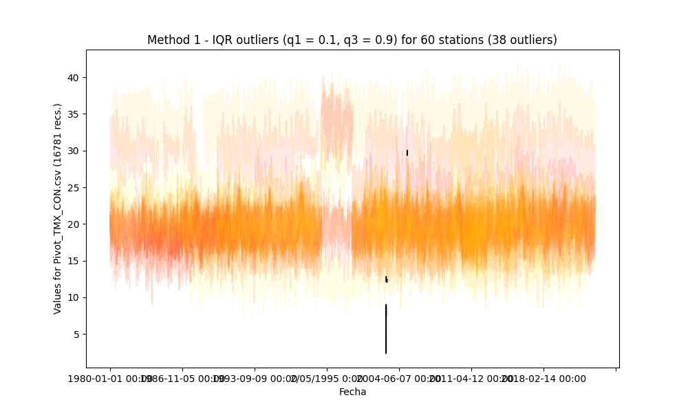

## Outliers detection and processing through statistical methods

* Processed file: [C:/JLGC/R.LTWB/.datasets/IDEAM_EDA/Pivot_TMX_CON.csv](../IDEAM_EDA/Pivot_TMX_CON.csv)
* Execution date: 2023-09-15 11:41:03.145420
* Python version: 3.11.5 (tags/v3.11.5:cce6ba9, Aug 24 2023, 14:38:34) [MSC v.1936 64 bit (AMD64)]
* Python path: ['C:\\JLGC\\R.LTWB\\.src', 'C:\\Python311\\python311.zip', 'C:\\Python311\\DLLs', 'C:\\Python311\\Lib', 'C:\\Python311']
* matplotlib version: 3.6.0
* pandas version: 2.1.0
* numpy version: 1.25.2
* Stations exclude: ['28017140', '25027020', '25027410', '25027490', '25027330', '25027390', '25027630', '25027360', '25027320', '16067010', '25027420']
* Print table sample: True
* Instructions & script: https://github.com/rcfdtools/R.LTWB/tree/main/Section03/Outlier
* License: https://github.com/rcfdtools/R.LTWB/blob/main/LICENSE.md
* Credits: r.cfdtools@gmail.com

### General dataframe information with 16781 IDEAM records for 60 stations

Dataframe records head sample

| Fecha            |   21185040 |   21195080 |   21195120 |   21195190 |   21205012 |   21205160 |   21205230 |   21205420 |   21205520 |   21205580 |   21205660 |   21205670 |   21205700 |   21205710 |   21205720 |   21205740 |   21205750 |   21205770 |   21205791 |   21205910 |   21205940 |   21205980 |   21206050 |   21206160 |   21206180 |   21206190 |   21206200 |   21206230 |   21206260 |   21206280 |   21206500 |   21206510 |   21206550 |   21206560 |   21206570 |   21206600 |   21206610 |   21206620 |   21206630 |   21206640 |   21206650 |   21206660 |   21206670 |   21206680 |   21206690 |   21206700 |   21206970 |   21235010 |   21255080 |   23065060 |   23065100 |   23065120 |   23065200 |   23125070 |   23125170 |   24015380 |   35025050 |   35025060 |   35035030 |   35065010 |
|:-----------------|-----------:|-----------:|-----------:|-----------:|-----------:|-----------:|-----------:|-----------:|-----------:|-----------:|-----------:|-----------:|-----------:|-----------:|-----------:|-----------:|-----------:|-----------:|-----------:|-----------:|-----------:|-----------:|-----------:|-----------:|-----------:|-----------:|-----------:|-----------:|-----------:|-----------:|-----------:|-----------:|-----------:|-----------:|-----------:|-----------:|-----------:|-----------:|-----------:|-----------:|-----------:|-----------:|-----------:|-----------:|-----------:|-----------:|-----------:|-----------:|-----------:|-----------:|-----------:|-----------:|-----------:|-----------:|-----------:|-----------:|-----------:|-----------:|-----------:|-----------:|
| 1980-01-01 00:00 |        nan |        nan |        nan |        nan |        nan |        nan |         20 |       18.6 |         19 |        nan |      nan   |       19.2 |        nan |       20   |       16.8 |       16.2 |        nan |        nan |       19.6 |        nan |        nan |        nan |        nan |        nan |        nan |        nan |        nan |        nan |        nan |        nan |        nan |        nan |        nan |        nan |        nan |        nan |        nan |        nan |        nan |        nan |        nan |        nan |        nan |        nan |        nan |        nan |        nan |        nan |        nan |        nan |        nan |       21.2 |        nan |       19.8 |        nan |        nan |        nan |        nan |        nan |       23.4 |
| 1980-01-02 00:00 |        nan |        nan |        nan |        nan |        nan |        nan |        nan |       19   |         19 |        nan |      nan   |       19.2 |        nan |       19.6 |       14.4 |       16.2 |        nan |        nan |       18.6 |        nan |        nan |        nan |        nan |        nan |        nan |        nan |        nan |        nan |        nan |        nan |        nan |        nan |        nan |        nan |        nan |        nan |        nan |        nan |        nan |        nan |        nan |        nan |        nan |        nan |        nan |        nan |        nan |        nan |        nan |        nan |        nan |       20.6 |        nan |       20.4 |        nan |        nan |        nan |        nan |        nan |       23.2 |
| 1980-01-03 00:00 |        nan |        nan |        nan |        nan |        nan |        nan |        nan |       20.2 |         20 |        nan |       30.4 |       21.4 |         18 |       20.4 |       16   |       17   |        nan |        nan |       20.2 |        nan |        nan |        nan |        nan |        nan |        nan |        nan |        nan |        nan |        nan |        nan |        nan |        nan |        nan |        nan |        nan |        nan |        nan |        nan |        nan |        nan |        nan |        nan |        nan |        nan |        nan |        nan |        nan |        nan |        nan |        nan |        nan |       20.6 |        nan |       22.6 |        nan |        nan |        nan |        nan |        nan |       25   |

Dataframe records tail sample

| Fecha            |   21185040 |   21195080 |   21195120 |   21195190 |   21205012 |   21205160 |   21205230 |   21205420 |   21205520 |   21205580 |   21205660 |   21205670 |   21205700 |   21205710 |   21205720 |   21205740 |   21205750 |   21205770 |   21205791 |   21205910 |   21205940 |   21205980 |   21206050 |   21206160 |   21206180 |   21206190 |   21206200 |   21206230 |   21206260 |   21206280 |   21206500 |   21206510 |   21206550 |   21206560 |   21206570 |   21206600 |   21206610 |   21206620 |   21206630 |   21206640 |   21206650 |   21206660 |   21206670 |   21206680 |   21206690 |   21206700 |   21206970 |   21235010 |   21255080 |   23065060 |   23065100 |   23065120 |   23065200 |   23125070 |   23125170 |   24015380 |   35025050 |   35025060 |   35035030 |   35065010 |
|:-----------------|-----------:|-----------:|-----------:|-----------:|-----------:|-----------:|-----------:|-----------:|-----------:|-----------:|-----------:|-----------:|-----------:|-----------:|-----------:|-----------:|-----------:|-----------:|-----------:|-----------:|-----------:|-----------:|-----------:|-----------:|-----------:|-----------:|-----------:|-----------:|-----------:|-----------:|-----------:|-----------:|-----------:|-----------:|-----------:|-----------:|-----------:|-----------:|-----------:|-----------:|-----------:|-----------:|-----------:|-----------:|-----------:|-----------:|-----------:|-----------:|-----------:|-----------:|-----------:|-----------:|-----------:|-----------:|-----------:|-----------:|-----------:|-----------:|-----------:|-----------:|
| 2022-12-28 00:00 |        nan |        nan |       24.8 |        nan |        nan |        nan |        nan |       21.8 |        nan |        nan |       29.6 |       23.6 |       20.2 |       20.4 |        nan |       19.6 |        nan |        nan |        nan |        nan |       17.6 |       20   |        nan |        nan |        nan |        nan |        nan |        nan |        nan |        nan |        nan |        nan |        nan |        nan |        nan |       23.2 |        nan |        nan |        nan |        nan |       16.6 |        nan |        nan |        nan |        nan |        nan |        nan |       35.6 |        nan |        nan |        nan |        nan |        nan |        nan |        nan |        nan |        nan |        nan |        nan |        nan |
| 2022-12-29 00:00 |        nan |        nan |       25   |        nan |        nan |        nan |        nan |       22.2 |        nan |        nan |       30.2 |      nan   |       21.4 |       21   |        nan |       19.2 |        nan |        nan |        nan |        nan |       17.4 |       21   |        nan |        nan |        nan |        nan |        nan |        nan |        nan |        nan |        nan |        nan |        nan |        nan |        nan |       23.2 |        nan |        nan |        nan |        nan |       16.2 |        nan |        nan |        nan |        nan |        nan |        nan |       34.8 |        nan |        nan |        nan |        nan |        nan |        nan |        nan |        nan |        nan |        nan |        nan |        nan |
| 2022-12-30 00:00 |        nan |        nan |       25.6 |        nan |        nan |        nan |        nan |       22.8 |        nan |        nan |       30.8 |       22.6 |       19.6 |       21   |        nan |       19   |        nan |        nan |        nan |        nan |       18   |       21.2 |        nan |        nan |        nan |        nan |        nan |        nan |        nan |        nan |        nan |        nan |        nan |        nan |        nan |       22.8 |        nan |        nan |        nan |        nan |       15.8 |        nan |        nan |        nan |        nan |        nan |        nan |       36.4 |        nan |        nan |        nan |        nan |        nan |        nan |        nan |        nan |        nan |        nan |        nan |        nan |

Datatypes for station and nulls values in the initial file

|       | 21185040   | 21195080   | 21195120   | 21195190   | 21205012   | 21205160   | 21205230   | 21205420   | 21205520   | 21205580   | 21205660   | 21205670   | 21205700   | 21205710   | 21205720   | 21205740   | 21205750   | 21205770   | 21205791   | 21205910   | 21205940   | 21205980   | 21206050   | 21206160   | 21206180   | 21206190   | 21206200   | 21206230   | 21206260   | 21206280   | 21206500   | 21206510   | 21206550   | 21206560   | 21206570   | 21206600   | 21206610   | 21206620   | 21206630   | 21206640   | 21206650   | 21206660   | 21206670   | 21206680   | 21206690   | 21206700   | 21206970   | 21235010   | 21255080   | 23065060   | 23065100   | 23065120   | 23065200   | 23125070   | 23125170   | 24015380   | 35025050   | 35025060   | 35035030   | 35065010   |
|:------|:-----------|:-----------|:-----------|:-----------|:-----------|:-----------|:-----------|:-----------|:-----------|:-----------|:-----------|:-----------|:-----------|:-----------|:-----------|:-----------|:-----------|:-----------|:-----------|:-----------|:-----------|:-----------|:-----------|:-----------|:-----------|:-----------|:-----------|:-----------|:-----------|:-----------|:-----------|:-----------|:-----------|:-----------|:-----------|:-----------|:-----------|:-----------|:-----------|:-----------|:-----------|:-----------|:-----------|:-----------|:-----------|:-----------|:-----------|:-----------|:-----------|:-----------|:-----------|:-----------|:-----------|:-----------|:-----------|:-----------|:-----------|:-----------|:-----------|:-----------|
| Dtype | float64    | float64    | float64    | float64    | float64    | float64    | float64    | float64    | float64    | float64    | float64    | float64    | float64    | float64    | float64    | float64    | float64    | float64    | float64    | float64    | float64    | float64    | float64    | float64    | float64    | float64    | float64    | float64    | float64    | float64    | float64    | float64    | float64    | float64    | float64    | float64    | float64    | float64    | float64    | float64    | float64    | float64    | float64    | float64    | float64    | float64    | float64    | float64    | float64    | float64    | float64    | float64    | float64    | float64    | float64    | float64    | float64    | float64    | float64    | float64    |
| Nulls | 15895      | 16482      | 8383       | 4941       | 16406      | 13889      | 12966      | 2056       | 11909      | 16149      | 4023       | 5059       | 4146       | 5091       | 4651       | 3208       | 16605      | 9358       | 3659       | 16212      | 12472      | 4051       | 9362       | 15346      | 6478       | 16658      | 15854      | 16372      | 7410       | 9981       | 15126      | 15900      | 15535      | 11540      | 15260      | 10805      | 16551      | 14866      | 15249      | 16729      | 11810      | 14092      | 16327      | 16087      | 12518      | 16760      | 16698      | 3625       | 15956      | 8956       | 9607       | 4779       | 15128      | 9802       | 16739      | 13442      | 4945       | 16143      | 16578      | 6261       |

General statistics table - Initial file

|          |   count |    mean |      std |   min |   25% |   50% |    75% |   max |
|---------:|--------:|--------:|---------:|------:|------:|------:|-------:|------:|
| 21185040 |     886 | 33.7822 | 2.17714  |  26.6 | 32.4  |  33.8 | 35.4   |  40   |
| 21195080 |     299 | 33.6448 | 1.9994   |  28.8 | 32.2  |  33.6 | 35     |  40.2 |
| 21195120 |    8398 | 24.8846 | 1.70992  |  18.4 | 24    |  25   | 26     |  33.2 |
| 21195190 |   11840 | 19.6264 | 1.56657  |  13.8 | 18.6  |  19.6 | 20.4   |  28.5 |
| 21205012 |     375 | 19.596  | 1.5595   |  15   | 18.4  |  19.6 | 20.6   |  24.5 |
| 21205160 |    2892 | 19.8776 | 2.31969  |  12   | 18.1  |  19.8 | 21     |  27.6 |
| 21205230 |    3815 | 19.9726 | 1.6014   |   9.4 | 18.8  |  20   | 21     |  29.6 |
| 21205420 |   14725 | 19.6246 | 1.47187  |   8.6 | 18.6  |  19.6 | 20.6   |  26   |
| 21205520 |    4872 | 19.5169 | 1.41912  |  14.1 | 18.5  |  19.5 | 20.5   |  25.8 |
| 21205580 |     632 | 18.6293 | 1.79813  |  12.2 | 17.5  |  18.6 | 20     |  24.8 |
| 21205660 |   12758 | 30.2407 | 2.01732  |  21.6 | 29    |  30.2 | 31.4   |  36.8 |
| 21205670 |   11722 | 21.0124 | 1.51143  |  16   | 20    |  20.8 | 22     |  29.2 |
| 21205700 |   12635 | 18.362  | 1.88514  |   9   | 17    |  18.4 | 19.6   |  25.2 |
| 21205710 |   11690 | 20.3463 | 1.51239  |  11.2 | 19.4  |  20.2 | 21.4   |  26.8 |
| 21205720 |   12130 | 16.7332 | 1.72974  |   9.4 | 15.4  |  16.8 | 18     |  24.6 |
| 21205740 |   13573 | 17.14   | 1.95096  |  10.8 | 15.8  |  17.2 | 18.4   |  24   |
| 21205750 |     176 | 19.0028 | 1.34366  |  14.2 | 18.1  |  18.8 | 19.925 |  24   |
| 21205770 |    7423 | 18.8351 | 1.55108  |  12.2 | 17.9  |  18.8 | 19.9   |  25   |
| 21205791 |   13122 | 19.3358 | 1.47377  |  13.1 | 18.4  |  19.3 | 20.3   |  24.9 |
| 21205910 |     569 | 18.3239 | 1.75862  |  14.4 | 17    |  18.1 | 19.2   |  24   |
| 21205940 |    4309 | 18.4058 | 1.31904  |  12.8 | 17.6  |  18.4 | 19.4   |  24   |
| 21205980 |   12730 | 19.7304 | 1.64828  |  12.6 | 18.6  |  19.8 | 20.8   |  25.5 |
| 21206050 |    7419 | 19.7894 | 1.87419  |  14.4 | 18.5  |  19.7 | 21     |  26.6 |
| 21206160 |    1435 | 22.0752 | 1.71308  |  14.4 | 21    |  22   | 23.2   |  30   |
| 21206180 |   10303 | 21.172  | 1.34988  |  15.6 | 20.2  |  21.2 | 22.1   |  25.6 |
| 21206190 |     123 | 20.339  | 2.04689  |  16.4 | 18.8  |  20.2 | 22     |  25   |
| 21206200 |     927 | 19.623  | 1.46277  |  14.8 | 18.5  |  19.5 | 20.5   |  24   |
| 21206230 |     409 | 19.7232 | 1.12711  |  15   | 19    |  19.6 | 20.4   |  23.4 |
| 21206260 |    9371 | 19.5752 | 1.5259   |  13   | 18.6  |  19.4 | 20.4   |  25.8 |
| 21206280 |    6800 | 15.9969 | 1.31588  |  11.6 | 15    |  15.8 | 16.8   |  22.2 |
| 21206500 |    1655 | 19.548  | 2.02335  |  14.2 | 18    |  19.6 | 21     |  24.8 |
| 21206510 |     881 | 19.3826 | 1.649    |  10   | 18.4  |  19.3 | 20.4   |  25   |
| 21206550 |    1246 | 21.0705 | 1.68281  |  15.6 | 20    |  21   | 22     |  29.4 |
| 21206560 |    5241 | 20.0637 | 1.60136  |  13.2 | 19    |  20   | 21     |  25.8 |
| 21206570 |    1521 | 19.7842 | 1.38881  |  13.4 | 19    |  20   | 20.6   |  24.2 |
| 21206600 |    5976 | 21.2209 | 1.60383  |  13.2 | 20.2  |  21.2 | 22.2   |  30.6 |
| 21206610 |     230 | 18.6052 | 2.03181  |  10.2 | 17.2  |  18.7 | 19.95  |  25.8 |
| 21206620 |    1915 | 21.0522 | 1.96791  |   2.4 | 20.05 |  21.2 | 22.2   |  31.5 |
| 21206630 |    1532 | 20.3187 | 1.47641  |  13   | 19.4  |  20.2 | 21.2   |  25.8 |
| 21206640 |      52 | 20.975  | 2.39049  |  15   | 19.4  |  21.1 | 23     |  25.3 |
| 21206650 |    4971 | 15.4342 | 2.06785  |   8.4 | 14    |  15   | 16.8   |  30.1 |
| 21206660 |    2689 | 21.4064 | 1.78074  |  12   | 20.3  |  21.4 | 22.4   |  30.2 |
| 21206670 |     454 | 21.0377 | 1.8728   |  13   | 20    |  21.2 | 22.1   |  28.4 |
| 21206680 |     694 | 21.433  | 2.62198  |  11   | 20    |  21.4 | 23.2   |  29.2 |
| 21206690 |    4263 | 21.5217 | 1.92064  |  12   | 20.2  |  21.6 | 22.8   |  33   |
| 21206700 |      21 | 21.4333 | 1.59321  |  17.2 | 20.6  |  21.4 | 22     |  24.2 |
| 21206970 |      83 | 20.0024 | 1.76952  |  14   | 18.9  |  20   | 21.15  |  24.2 |
| 21235010 |   13156 | 34.7281 | 2.3423   |  25.4 | 33.2  |  34.8 | 36.4   |  41.8 |
| 21255080 |     825 | 34.3236 | 2.6096   |  25   | 32.5  |  34.3 | 36.2   |  40.6 |
| 23065060 |    7825 | 18.8163 | 1.26143  |  14.6 | 18    |  18.8 | 19.6   |  23.6 |
| 23065100 |    7174 | 17.7605 | 1.48513  |  12.4 | 16.8  |  17.8 | 18.8   |  22.5 |
| 23065120 |   12002 | 21.7483 | 1.84587  |  12.6 | 20.6  |  21.8 | 23     |  28   |
| 23065200 |    1653 | 29.2151 | 2.08216  |  21.6 | 27.8  |  29.2 | 30.6   |  36   |
| 23125070 |    6979 | 20.629  | 1.73572  |  14.4 | 19.6  |  20.6 | 21.6   |  27.6 |
| 23125170 |      42 | 13.8952 | 0.640485 |  12.4 | 13.45 |  13.8 | 14.4   |  15.2 |
| 24015380 |    3339 | 17.0555 | 1.65967  |  11.4 | 15.8  |  17   | 18.2   |  23.4 |
| 35025050 |   11836 | 13.7644 | 1.78959  |   7.4 | 12.6  |  13.8 | 15     |  21.2 |
| 35025060 |     638 | 12.348  | 1.49165  |   7.6 | 11.4  |  12.3 | 13.35  |  17.2 |
| 35035030 |     203 | 28.13   | 1.89304  |  21.6 | 27.2  |  28.2 | 29.2   |  33   |
| 35065010 |   10520 | 24.0121 | 1.99982  |  16.4 | 22.8  |  24.2 | 25.4   |  31.4 |

### Method 1 - Outliers processing using the interquartile range IQR (q1 = 0.1, q3 = 0.9)

Since the data doesn`t follow a normal distribution, we will calculate the outlier data points using the statistical method called interquartile range (IQR) instead of using Z-score. Using the IQR, the outlier data points are the ones falling below Q1 - 1.5 IQR or above Q3 + 1.5 IQR. The Q1 could be the 25th percentile and Q3 could be the 75th percentile of the dataset, and IQR represents the interquartile range calculated by Q3 minus Q1 (Q3-Q1). [^1]

Outliers parameters:
* mean: mean value
* std: standard deviation value
* q1: quartile 0.1
* q3: quartile 0.9
* IQR: interquartile range (q3-q1)
* OlLowerLim: outlier bottom limit (q1-1.5*IQR)
* OlUpperLim: outlier top limit (q3+1.5*IQR)
* OlMinVal: minimum outlier value founded
* OlMaxVal: maximum outlier value founded
* OlCount: # outliers founded
* CapLowerLim: capped lower limit for outliers replacement ( $\mu$ - 4.5 * $\sigma$ )
* CapUpperLim: capped upper limit for outliers replacement ( $\mu$ + 4.5 * $\sigma$ )

|          |    mean |      std |    q1 |    q3 |   IQR |   OlLowerLim |   OlUpperLim |   OlMinVal |   OlMaxVal |   OlCount |   CapLowerLim |   CapUpperLim |
|---------:|--------:|---------:|------:|------:|------:|-------------:|-------------:|-----------:|-----------:|----------:|--------------:|--------------:|
| 21185040 | 33.7822 | 2.17714  | 31    | 36.6  |  5.6  |       39.4   |       45     |      nan   |      nan   |         0 |      23.985   |       43.5793 |
| 21195080 | 33.6448 | 1.9994   | 31.2  | 36.2  |  5    |       38.7   |       43.7   |      nan   |      nan   |         0 |      24.6475  |       42.6421 |
| 21195120 | 24.8846 | 1.70992  | 23    | 27    |  4    |       29     |       33     |       33.2 |       33.2 |         1 |      17.1899  |       32.5793 |
| 21195190 | 19.6264 | 1.56657  | 17.8  | 21.6  |  3.8  |       23.5   |       27.3   |       28.5 |       28.5 |         1 |      12.5769  |       26.676  |
| 21205012 | 19.596  | 1.5595   | 17.6  | 21.8  |  4.2  |       23.9   |       28.1   |      nan   |      nan   |         0 |      12.5782  |       26.6138 |
| 21205160 | 19.8776 | 2.31969  | 17    | 23    |  6    |       26     |       32     |      nan   |      nan   |         0 |       9.43898 |       30.3162 |
| 21205230 | 19.9726 | 1.6014   | 18    | 22    |  4    |       24     |       28     |        9.4 |       29.6 |         2 |      12.7663  |       27.1789 |
| 21205420 | 19.6246 | 1.47187  | 17.8  | 21.5  |  3.7  |       23.35  |       27.05  |        8.6 |        8.6 |         1 |      13.0011  |       26.248  |
| 21205520 | 19.5169 | 1.41912  | 17.8  | 21.4  |  3.6  |       23.2   |       26.8   |      nan   |      nan   |         0 |      13.1309  |       25.9029 |
| 21205580 | 18.6293 | 1.79813  | 16.4  | 20.7  |  4.3  |       22.85  |       27.15  |      nan   |      nan   |         0 |      10.5377  |       26.7208 |
| 21205660 | 30.2407 | 2.01732  | 27.8  | 32.8  |  5    |       35.3   |       40.3   |      nan   |      nan   |         0 |      21.1628  |       39.3187 |
| 21205670 | 21.0124 | 1.51143  | 19.2  | 22.8  |  3.6  |       24.6   |       28.2   |       28.4 |       29.2 |         4 |      14.2109  |       27.8138 |
| 21205700 | 18.362  | 1.88514  | 15.8  | 20.6  |  4.8  |       23     |       27.8   |      nan   |      nan   |         0 |       9.87885 |       26.8451 |
| 21205710 | 20.3463 | 1.51239  | 18.4  | 22.2  |  3.8  |       24.1   |       27.9   |       11.2 |       11.2 |         1 |      13.5406  |       27.1521 |
| 21205720 | 16.7332 | 1.72974  | 14.6  | 19    |  4.4  |       21.2   |       25.6   |      nan   |      nan   |         0 |       8.94941 |       24.517  |
| 21205740 | 17.14   | 1.95096  | 14.6  | 19.6  |  5    |       22.1   |       27.1   |      nan   |      nan   |         0 |       8.36069 |       25.9193 |
| 21205750 | 19.0028 | 1.34366  | 17.55 | 20.9  |  3.35 |       22.575 |       25.925 |      nan   |      nan   |         0 |      12.9564  |       25.0493 |
| 21205770 | 18.8351 | 1.55108  | 17    | 20.8  |  3.8  |       22.7   |       26.5   |      nan   |      nan   |         0 |      11.8552  |       25.815  |
| 21205791 | 19.3358 | 1.47377  | 17.5  | 21.2  |  3.7  |       23.05  |       26.75  |      nan   |      nan   |         0 |      12.7038  |       25.9677 |
| 21205910 | 18.3239 | 1.75862  | 16.1  | 20.5  |  4.4  |       22.7   |       27.1   |      nan   |      nan   |         0 |      10.4101  |       26.2377 |
| 21205940 | 18.4058 | 1.31904  | 16.8  | 20    |  3.2  |       21.6   |       24.8   |      nan   |      nan   |         0 |      12.4701  |       24.3414 |
| 21205980 | 19.7304 | 1.64828  | 17.7  | 21.8  |  4.1  |       23.85  |       27.95  |      nan   |      nan   |         0 |      12.3132  |       27.1477 |
| 21206050 | 19.7894 | 1.87419  | 17.5  | 22.2  |  4.7  |       24.55  |       29.25  |      nan   |      nan   |         0 |      11.3555  |       28.2233 |
| 21206160 | 22.0752 | 1.71308  | 20    | 24.4  |  4.4  |       26.6   |       31     |      nan   |      nan   |         0 |      14.3664  |       29.784  |
| 21206180 | 21.172  | 1.34988  | 19.4  | 22.9  |  3.5  |       24.65  |       28.15  |      nan   |      nan   |         0 |      15.0976  |       27.2465 |
| 21206190 | 20.339  | 2.04689  | 17.42 | 23    |  5.58 |       25.79  |       31.37  |      nan   |      nan   |         0 |      11.128   |       29.55   |
| 21206200 | 19.623  | 1.46277  | 18    | 21.5  |  3.5  |       23.25  |       26.75  |      nan   |      nan   |         0 |      13.0405  |       26.2054 |
| 21206230 | 19.7232 | 1.12711  | 18.6  | 21.2  |  2.6  |       22.5   |       25.1   |      nan   |      nan   |         0 |      14.6513  |       24.7952 |
| 21206260 | 19.5752 | 1.5259   | 17.8  | 21.6  |  3.8  |       23.5   |       27.3   |      nan   |      nan   |         0 |      12.7086  |       26.4417 |
| 21206280 | 15.9969 | 1.31588  | 14.6  | 17.8  |  3.2  |       19.4   |       22.6   |      nan   |      nan   |         0 |      10.0754  |       21.9183 |
| 21206500 | 19.548  | 2.02335  | 17    | 22.2  |  5.2  |       24.8   |       30     |      nan   |      nan   |         0 |      10.4429  |       28.6531 |
| 21206510 | 19.3826 | 1.649    | 17.4  | 21.4  |  4    |       23.4   |       27.4   |       10   |       10   |         1 |      11.9622  |       26.8031 |
| 21206550 | 21.0705 | 1.68281  | 19    | 23    |  4    |       25     |       29     |       29.4 |       29.4 |         1 |      13.4978  |       28.6431 |
| 21206560 | 20.0637 | 1.60136  | 18    | 22    |  4    |       24     |       28     |      nan   |      nan   |         0 |      12.8576  |       27.2699 |
| 21206570 | 19.7842 | 1.38881  | 18    | 21.6  |  3.6  |       23.4   |       27     |      nan   |      nan   |         0 |      13.5346  |       26.0339 |
| 21206600 | 21.2209 | 1.60383  | 19.2  | 23.2  |  4    |       25.2   |       29.2   |       30.6 |       30.6 |         1 |      14.0036  |       28.4381 |
| 21206610 | 18.6052 | 2.03181  | 16.2  | 21    |  4.8  |       23.4   |       28.2   |      nan   |      nan   |         0 |       9.46205 |       27.7484 |
| 21206620 | 21.0522 | 1.96791  | 19    | 23    |  4    |       25     |       29     |        2.4 |       31.5 |        15 |      12.1966  |       29.9078 |
| 21206630 | 20.3187 | 1.47641  | 18.5  | 22.2  |  3.7  |       24.05  |       27.75  |      nan   |      nan   |         0 |      13.6748  |       26.9625 |
| 21206640 | 20.975  | 2.39049  | 17.28 | 23.76 |  6.48 |       27     |       33.48  |      nan   |      nan   |         0 |      10.2178  |       31.7322 |
| 21206650 | 15.4342 | 2.06785  | 13.3  | 18.2  |  4.9  |       20.65  |       25.55  |       25.8 |       30.1 |         4 |       6.12892 |       24.7396 |
| 21206660 | 21.4064 | 1.78074  | 19.2  | 23.4  |  4.2  |       25.5   |       29.7   |       12   |       30.2 |         3 |      13.393   |       29.4197 |
| 21206670 | 21.0377 | 1.8728   | 19    | 23.2  |  4.2  |       25.3   |       29.5   |      nan   |      nan   |         0 |      12.6101  |       29.4653 |
| 21206680 | 21.433  | 2.62198  | 18.2  | 24.2  |  6    |       27.2   |       33.2   |      nan   |      nan   |         0 |       9.63407 |       33.2319 |
| 21206690 | 21.5217 | 1.92064  | 19    | 23.8  |  4.8  |       26.2   |       31     |       33   |       33   |         2 |      12.8789  |       30.1646 |
| 21206700 | 21.4333 | 1.59321  | 20.4  | 23.2  |  2.8  |       24.6   |       27.4   |      nan   |      nan   |         0 |      14.2639  |       28.6028 |
| 21206970 | 20.0024 | 1.76952  | 17.64 | 22.24 |  4.6  |       24.54  |       29.14  |      nan   |      nan   |         0 |      12.0396  |       27.9653 |
| 21235010 | 34.7281 | 2.3423   | 31.6  | 37.8  |  6.2  |       40.9   |       47.1   |      nan   |      nan   |         0 |      24.1878  |       45.2685 |
| 21255080 | 34.3236 | 2.6096   | 31    | 37.8  |  6.8  |       41.2   |       48     |      nan   |      nan   |         0 |      22.5805  |       46.0668 |
| 23065060 | 18.8163 | 1.26143  | 17.2  | 20.4  |  3.2  |       22     |       25.2   |      nan   |      nan   |         0 |      13.1398  |       24.4927 |
| 23065100 | 17.7605 | 1.48513  | 15.8  | 19.6  |  3.8  |       21.5   |       25.3   |      nan   |      nan   |         0 |      11.0774  |       24.4436 |
| 23065120 | 21.7483 | 1.84587  | 19.6  | 24    |  4.4  |       26.2   |       30.6   |       12.6 |       12.6 |         1 |      13.4419  |       30.0547 |
| 23065200 | 29.2151 | 2.08216  | 26.6  | 31.8  |  5.2  |       34.4   |       39.6   |      nan   |      nan   |         0 |      19.8454  |       38.5848 |
| 23125070 | 20.629  | 1.73572  | 18.4  | 22.8  |  4.4  |       25     |       29.4   |      nan   |      nan   |         0 |      12.8183  |       28.4398 |
| 23125170 | 13.8952 | 0.640485 | 13.2  | 14.78 |  1.58 |       15.57  |       17.15  |      nan   |      nan   |         0 |      11.0131  |       16.7774 |
| 24015380 | 17.0555 | 1.65967  | 15    | 19    |  4    |       21     |       25     |      nan   |      nan   |         0 |       9.58693 |       24.524  |
| 35025050 | 13.7644 | 1.78959  | 11.6  | 16    |  4.4  |       18.2   |       22.6   |      nan   |      nan   |         0 |       5.71128 |       21.8176 |
| 35025060 | 12.348  | 1.49165  | 10.6  | 14.2  |  3.6  |       16     |       19.6   |      nan   |      nan   |         0 |       5.63555 |       19.0604 |
| 35035030 | 28.13   | 1.89304  | 26    | 30    |  4    |       32     |       36     |      nan   |      nan   |         0 |      19.6114  |       36.6487 |
| 35065010 | 24.0121 | 1.99982  | 21.4  | 26.4  |  5    |       28.9   |       33.9   |      nan   |      nan   |         0 |      15.0129  |       33.0113 |

#### Identified and cleaning tables for 38 IQR outliers founded
* Outliers identified file: [Outlier_IQR_Pivot_TMX_CON.csv](../../.datasets/IDEAM_Outlier/Outlier_IQR_Pivot_TMX_CON.csv)
* Outliers dropped file: [Outlier_IQR_Drop_Pivot_TMX_CON.csv](../../.datasets/IDEAM_Outlier/Outlier_IQR_Drop_Pivot_TMX_CON.csv)
* Outliers capped file: [Outlier_IQR_Cap_Pivot_TMX_CON.csv](../../.datasets/IDEAM_Outlier/Outlier_IQR_Cap_Pivot_TMX_CON.csv)
* Outliers imputed file: [Outlier_IQR_Impute_Pivot_TMX_CON.csv](../../.datasets/IDEAM_Outlier/Outlier_IQR_Impute_Pivot_TMX_CON.csv)

#### Statistical values for the capped and imputed file

IQR - General statistics table - Capped file

|          |   count |    mean |      std |     min |   25% |   50% |    75% |     max |
|---------:|--------:|--------:|---------:|--------:|------:|------:|-------:|--------:|
| 21185040 |     886 | 33.7822 | 2.17714  | 26.6    | 32.4  |  33.8 | 35.4   | 40      |
| 21195080 |     299 | 33.6448 | 1.9994   | 28.8    | 32.2  |  33.6 | 35     | 40.2    |
| 21195120 |    8398 | 24.8845 | 1.70958  | 18.4    | 24    |  25   | 26     | 32.5793 |
| 21195190 |   11840 | 19.6263 | 1.56579  | 13.8    | 18.6  |  19.6 | 20.4   | 26.676  |
| 21205012 |     375 | 19.596  | 1.5595   | 15      | 18.4  |  19.6 | 20.6   | 24.5    |
| 21205160 |    2892 | 19.8776 | 2.31969  | 12      | 18.1  |  19.8 | 21     | 27.6    |
| 21205230 |    3815 | 19.9729 | 1.59314  | 12.7663 | 18.8  |  20   | 21     | 27.1789 |
| 21205420 |   14725 | 19.6249 | 1.47008  | 13.0011 | 18.6  |  19.6 | 20.6   | 26      |
| 21205520 |    4872 | 19.5169 | 1.41912  | 14.1    | 18.5  |  19.5 | 20.5   | 25.8    |
| 21205580 |     632 | 18.6293 | 1.79813  | 12.2    | 17.5  |  18.6 | 20     | 24.8    |
| 21205660 |   12758 | 30.2407 | 2.01732  | 21.6    | 29    |  30.2 | 31.4   | 36.8    |
| 21205670 |   11722 | 21.012  | 1.50988  | 16      | 20    |  20.8 | 22     | 27.8138 |
| 21205700 |   12635 | 18.362  | 1.88514  |  9      | 17    |  18.4 | 19.6   | 25.2    |
| 21205710 |   11690 | 20.3465 | 1.51133  | 13.5406 | 19.4  |  20.2 | 21.4   | 26.8    |
| 21205720 |   12130 | 16.7332 | 1.72974  |  9.4    | 15.4  |  16.8 | 18     | 24.6    |
| 21205740 |   13573 | 17.14   | 1.95096  | 10.8    | 15.8  |  17.2 | 18.4   | 24      |
| 21205750 |     176 | 19.0028 | 1.34366  | 14.2    | 18.1  |  18.8 | 19.925 | 24      |
| 21205770 |    7423 | 18.8351 | 1.55108  | 12.2    | 17.9  |  18.8 | 19.9   | 25      |
| 21205791 |   13122 | 19.3358 | 1.47377  | 13.1    | 18.4  |  19.3 | 20.3   | 24.9    |
| 21205910 |     569 | 18.3239 | 1.75862  | 14.4    | 17    |  18.1 | 19.2   | 24      |
| 21205940 |    4309 | 18.4058 | 1.31904  | 12.8    | 17.6  |  18.4 | 19.4   | 24      |
| 21205980 |   12730 | 19.7304 | 1.64828  | 12.6    | 18.6  |  19.8 | 20.8   | 25.5    |
| 21206050 |    7419 | 19.7894 | 1.87419  | 14.4    | 18.5  |  19.7 | 21     | 26.6    |
| 21206160 |    1435 | 22.0752 | 1.71308  | 14.4    | 21    |  22   | 23.2   | 30      |
| 21206180 |   10303 | 21.172  | 1.34988  | 15.6    | 20.2  |  21.2 | 22.1   | 25.6    |
| 21206190 |     123 | 20.339  | 2.04689  | 16.4    | 18.8  |  20.2 | 22     | 25      |
| 21206200 |     927 | 19.623  | 1.46277  | 14.8    | 18.5  |  19.5 | 20.5   | 24      |
| 21206230 |     409 | 19.7232 | 1.12711  | 15      | 19    |  19.6 | 20.4   | 23.4    |
| 21206260 |    9371 | 19.5752 | 1.5259   | 13      | 18.6  |  19.4 | 20.4   | 25.8    |
| 21206280 |    6800 | 15.9969 | 1.31588  | 11.6    | 15    |  15.8 | 16.8   | 22.2    |
| 21206500 |    1655 | 19.548  | 2.02335  | 14.2    | 18    |  19.6 | 21     | 24.8    |
| 21206510 |     881 | 19.3849 | 1.63759  | 11.9622 | 18.4  |  19.3 | 20.4   | 25      |
| 21206550 |    1246 | 21.0699 | 1.67994  | 15.6    | 20    |  21   | 22     | 28.8    |
| 21206560 |    5241 | 20.0637 | 1.60136  | 13.2    | 19    |  20   | 21     | 25.8    |
| 21206570 |    1521 | 19.7842 | 1.38881  | 13.4    | 19    |  20   | 20.6   | 24.2    |
| 21206600 |    5976 | 21.2205 | 1.60196  | 13.2    | 20.2  |  21.2 | 22.2   | 28.4381 |
| 21206610 |     230 | 18.6052 | 2.03181  | 10.2    | 17.2  |  18.7 | 19.95  | 25.8    |
| 21206620 |    1915 | 21.0606 | 1.90944  | 12.1966 | 20.05 |  21.2 | 22.2   | 29.9078 |
| 21206630 |    1532 | 20.3187 | 1.47641  | 13      | 19.4  |  20.2 | 21.2   | 25.8    |
| 21206640 |      52 | 20.975  | 2.39049  | 15      | 19.4  |  21.1 | 23     | 25.3    |
| 21206650 |    4971 | 15.4323 | 2.05759  |  8.4    | 14    |  15   | 16.8   | 25.5    |
| 21206660 |    2689 | 21.4064 | 1.77582  | 13.393  | 20.3  |  21.4 | 22.4   | 29.4197 |
| 21206670 |     454 | 21.0377 | 1.8728   | 13      | 20    |  21.2 | 22.1   | 28.4    |
| 21206680 |     694 | 21.433  | 2.62198  | 11      | 20    |  21.4 | 23.2   | 29.2    |
| 21206690 |    4263 | 21.5204 | 1.91365  | 12      | 20.2  |  21.6 | 22.8   | 30.1646 |
| 21206700 |      21 | 21.4333 | 1.59321  | 17.2    | 20.6  |  21.4 | 22     | 24.2    |
| 21206970 |      83 | 20.0024 | 1.76952  | 14      | 18.9  |  20   | 21.15  | 24.2    |
| 21235010 |   13156 | 34.7281 | 2.3423   | 25.4    | 33.2  |  34.8 | 36.4   | 41.8    |
| 21255080 |     825 | 34.3236 | 2.6096   | 25      | 32.5  |  34.3 | 36.2   | 40.6    |
| 23065060 |    7825 | 18.8163 | 1.26143  | 14.6    | 18    |  18.8 | 19.6   | 23.6    |
| 23065100 |    7174 | 17.7605 | 1.48513  | 12.4    | 16.8  |  17.8 | 18.8   | 22.5    |
| 23065120 |   12002 | 21.7484 | 1.84554  | 13.4419 | 20.6  |  21.8 | 23     | 28      |
| 23065200 |    1653 | 29.2151 | 2.08216  | 21.6    | 27.8  |  29.2 | 30.6   | 36      |
| 23125070 |    6979 | 20.629  | 1.73572  | 14.4    | 19.6  |  20.6 | 21.6   | 27.6    |
| 23125170 |      42 | 13.8952 | 0.640485 | 12.4    | 13.45 |  13.8 | 14.4   | 15.2    |
| 24015380 |    3339 | 17.0555 | 1.65967  | 11.4    | 15.8  |  17   | 18.2   | 23.4    |
| 35025050 |   11836 | 13.7644 | 1.78959  |  7.4    | 12.6  |  13.8 | 15     | 21.2    |
| 35025060 |     638 | 12.348  | 1.49165  |  7.6    | 11.4  |  12.3 | 13.35  | 17.2    |
| 35035030 |     203 | 28.13   | 1.89304  | 21.6    | 27.2  |  28.2 | 29.2   | 33      |
| 35065010 |   10520 | 24.0121 | 1.99982  | 16.4    | 22.8  |  24.2 | 25.4   | 31.4    |

IQR - General statistics table - Imputed file

|          |   count |    mean |      std |   min |   25% |   50% |    75% |   max |
|---------:|--------:|--------:|---------:|------:|------:|------:|-------:|------:|
| 21185040 |     886 | 33.7822 | 2.17714  |  26.6 | 32.4  |  33.8 | 35.4   |  40   |
| 21195080 |     299 | 33.6448 | 1.9994   |  28.8 | 32.2  |  33.6 | 35     |  40.2 |
| 21195120 |    8398 | 24.8836 | 1.70751  |  18.4 | 24    |  25   | 26     |  32.5 |
| 21195190 |   11840 | 19.6257 | 1.56445  |  13.8 | 18.6  |  19.6 | 20.4   |  26.4 |
| 21205012 |     375 | 19.596  | 1.5595   |  15   | 18.4  |  19.6 | 20.6   |  24.5 |
| 21205160 |    2892 | 19.8776 | 2.31969  |  12   | 18.1  |  19.8 | 21     |  27.6 |
| 21205230 |    3815 | 19.9729 | 1.58457  |  14   | 18.8  |  20   | 21     |  26   |
| 21205420 |   14725 | 19.6253 | 1.46907  |  13.7 | 18.6  |  19.6 | 20.6   |  26   |
| 21205520 |    4872 | 19.5169 | 1.41912  |  14.1 | 18.5  |  19.5 | 20.5   |  25.8 |
| 21205580 |     632 | 18.6293 | 1.79813  |  12.2 | 17.5  |  18.6 | 20     |  24.8 |
| 21205660 |   12758 | 30.2407 | 2.01732  |  21.6 | 29    |  30.2 | 31.4   |  36.8 |
| 21205670 |   11722 | 21.0097 | 1.50464  |  16   | 20    |  20.8 | 22     |  27.6 |
| 21205700 |   12635 | 18.362  | 1.88514  |   9   | 17    |  18.4 | 19.6   |  25.2 |
| 21205710 |   11690 | 20.3471 | 1.51002  |  14   | 19.4  |  20.2 | 21.4   |  26.8 |
| 21205720 |   12130 | 16.7332 | 1.72974  |   9.4 | 15.4  |  16.8 | 18     |  24.6 |
| 21205740 |   13573 | 17.14   | 1.95096  |  10.8 | 15.8  |  17.2 | 18.4   |  24   |
| 21205750 |     176 | 19.0028 | 1.34366  |  14.2 | 18.1  |  18.8 | 19.925 |  24   |
| 21205770 |    7423 | 18.8351 | 1.55108  |  12.2 | 17.9  |  18.8 | 19.9   |  25   |
| 21205791 |   13122 | 19.3358 | 1.47377  |  13.1 | 18.4  |  19.3 | 20.3   |  24.9 |
| 21205910 |     569 | 18.3239 | 1.75862  |  14.4 | 17    |  18.1 | 19.2   |  24   |
| 21205940 |    4309 | 18.4058 | 1.31904  |  12.8 | 17.6  |  18.4 | 19.4   |  24   |
| 21205980 |   12730 | 19.7304 | 1.64828  |  12.6 | 18.6  |  19.8 | 20.8   |  25.5 |
| 21206050 |    7419 | 19.7894 | 1.87419  |  14.4 | 18.5  |  19.7 | 21     |  26.6 |
| 21206160 |    1435 | 22.0752 | 1.71308  |  14.4 | 21    |  22   | 23.2   |  30   |
| 21206180 |   10303 | 21.172  | 1.34988  |  15.6 | 20.2  |  21.2 | 22.1   |  25.6 |
| 21206190 |     123 | 20.339  | 2.04689  |  16.4 | 18.8  |  20.2 | 22     |  25   |
| 21206200 |     927 | 19.623  | 1.46277  |  14.8 | 18.5  |  19.5 | 20.5   |  24   |
| 21206230 |     409 | 19.7232 | 1.12711  |  15   | 19    |  19.6 | 20.4   |  23.4 |
| 21206260 |    9371 | 19.5752 | 1.5259   |  13   | 18.6  |  19.4 | 20.4   |  25.8 |
| 21206280 |    6800 | 15.9969 | 1.31588  |  11.6 | 15    |  15.8 | 16.8   |  22.2 |
| 21206500 |    1655 | 19.548  | 2.02335  |  14.2 | 18    |  19.6 | 21     |  24.8 |
| 21206510 |     881 | 19.3933 | 1.61834  |  14.7 | 18.4  |  19.3 | 20.4   |  25   |
| 21206550 |    1246 | 21.0638 | 1.66616  |  15.6 | 20    |  21   | 22     |  28.8 |
| 21206560 |    5241 | 20.0637 | 1.60136  |  13.2 | 19    |  20   | 21     |  25.8 |
| 21206570 |    1521 | 19.7842 | 1.38881  |  13.4 | 19    |  20   | 20.6   |  24.2 |
| 21206600 |    5976 | 21.2193 | 1.59923  |  13.2 | 20.2  |  21.2 | 22.2   |  28.2 |
| 21206610 |     230 | 18.6052 | 2.03181  |  10.2 | 17.2  |  18.7 | 19.95  |  25.8 |
| 21206620 |    1915 | 21.0745 | 1.74096  |  13   | 20.1  |  21.2 | 22.2   |  28.8 |
| 21206630 |    1532 | 20.3187 | 1.47641  |  13   | 19.4  |  20.2 | 21.2   |  25.8 |
| 21206640 |      52 | 20.975  | 2.39049  |  15   | 19.4  |  21.1 | 23     |  25.3 |
| 21206650 |    4971 | 15.4249 | 2.04057  |   8.4 | 14    |  15   | 16.8   |  25.5 |
| 21206660 |    2689 | 21.4034 | 1.75552  |  15   | 20.3  |  21.4 | 22.4   |  29.4 |
| 21206670 |     454 | 21.0377 | 1.8728   |  13   | 20    |  21.2 | 22.1   |  28.4 |
| 21206680 |     694 | 21.433  | 2.62198  |  11   | 20    |  21.4 | 23.2   |  29.2 |
| 21206690 |    4263 | 21.5163 | 1.90447  |  12   | 20.2  |  21.6 | 22.8   |  30   |
| 21206700 |      21 | 21.4333 | 1.59321  |  17.2 | 20.6  |  21.4 | 22     |  24.2 |
| 21206970 |      83 | 20.0024 | 1.76952  |  14   | 18.9  |  20   | 21.15  |  24.2 |
| 21235010 |   13156 | 34.7281 | 2.3423   |  25.4 | 33.2  |  34.8 | 36.4   |  41.8 |
| 21255080 |     825 | 34.3236 | 2.6096   |  25   | 32.5  |  34.3 | 36.2   |  40.6 |
| 23065060 |    7825 | 18.8163 | 1.26143  |  14.6 | 18    |  18.8 | 19.6   |  23.6 |
| 23065100 |    7174 | 17.7605 | 1.48513  |  12.4 | 16.8  |  17.8 | 18.8   |  22.5 |
| 23065120 |   12002 | 21.749  | 1.84398  |  14.6 | 20.6  |  21.8 | 23     |  28   |
| 23065200 |    1653 | 29.2151 | 2.08216  |  21.6 | 27.8  |  29.2 | 30.6   |  36   |
| 23125070 |    6979 | 20.629  | 1.73572  |  14.4 | 19.6  |  20.6 | 21.6   |  27.6 |
| 23125170 |      42 | 13.8952 | 0.640485 |  12.4 | 13.45 |  13.8 | 14.4   |  15.2 |
| 24015380 |    3339 | 17.0555 | 1.65967  |  11.4 | 15.8  |  17   | 18.2   |  23.4 |
| 35025050 |   11836 | 13.7644 | 1.78959  |   7.4 | 12.6  |  13.8 | 15     |  21.2 |
| 35025060 |     638 | 12.348  | 1.49165  |   7.6 | 11.4  |  12.3 | 13.35  |  17.2 |
| 35035030 |     203 | 28.13   | 1.89304  |  21.6 | 27.2  |  28.2 | 29.2   |  33   |
| 35065010 |   10520 | 24.0121 | 1.99982  |  16.4 | 22.8  |  24.2 | 25.4   |  31.4 |

### Method 2 - Outliers processing through empirical rule - ER or _k-sigma_ ( $\mu$ - _k_ * $\sigma$ ) with _k_ = 4.5

The empirical rule, also referred to as the three-sigma rule or 68-95-99.7 rule, is a statistical rule which states that for a normal distribution, almost all observed data will fall within three standard deviations (denoted by $\sigma$) of the mean or average (denoted by $\mu$). In particular, the empirical rule predicts that 68% of observations falls within the first standard deviation ( $\mu$ ± $\sigma$ ), 95% within the first two standard deviations ( $\mu$ ± 2 $\sigma$ ), and 99.7% within the first three standard deviations ( $\mu$ ± 3 $\sigma$ ).[^2]

Outliers parameters:
* mean: mean value
* std: standard deviation value
* OlMinVal: minimum outlier value founded
* OlMaxVal: maximum outlier value founded
* OlCount: # outliers founded
* CapLowerLim: capped lower limit for outliers replacement ( $\mu$ - 4.5 * $\sigma$ )
* CapUpperLim: capped upper limit for outliers replacement ( $\mu$ + 4.5 * $\sigma$ )

|          |    mean |      std |   OlMinVal |   OlMaxVal |   OlCount |   CapLowerLim |   CapUpperLim |
|---------:|--------:|---------:|-----------:|-----------:|----------:|--------------:|--------------:|
| 21185040 | 33.7822 | 2.17714  |      nan   |      nan   |         0 |      23.985   |       43.5793 |
| 21195080 | 33.6448 | 1.9994   |      nan   |      nan   |         0 |      24.6475  |       42.6421 |
| 21195120 | 24.8846 | 1.70992  |       33.2 |       33.2 |         1 |      17.1899  |       32.5793 |
| 21195190 | 19.6264 | 1.56657  |       28.5 |       28.5 |         1 |      12.5769  |       26.676  |
| 21205012 | 19.596  | 1.5595   |      nan   |      nan   |         0 |      12.5782  |       26.6138 |
| 21205160 | 19.8776 | 2.31969  |      nan   |      nan   |         0 |       9.43898 |       30.3162 |
| 21205230 | 19.9726 | 1.6014   |        9.4 |       29.6 |         2 |      12.7663  |       27.1789 |
| 21205420 | 19.6246 | 1.47187  |        8.6 |        8.6 |         1 |      13.0011  |       26.248  |
| 21205520 | 19.5169 | 1.41912  |      nan   |      nan   |         0 |      13.1309  |       25.9029 |
| 21205580 | 18.6293 | 1.79813  |      nan   |      nan   |         0 |      10.5377  |       26.7208 |
| 21205660 | 30.2407 | 2.01732  |      nan   |      nan   |         0 |      21.1628  |       39.3187 |
| 21205670 | 21.0124 | 1.51143  |       28.4 |       29.2 |         4 |      14.2109  |       27.8138 |
| 21205700 | 18.362  | 1.88514  |        9   |        9   |         1 |       9.87885 |       26.8451 |
| 21205710 | 20.3463 | 1.51239  |       11.2 |       11.2 |         1 |      13.5406  |       27.1521 |
| 21205720 | 16.7332 | 1.72974  |       24.6 |       24.6 |         1 |       8.94941 |       24.517  |
| 21205740 | 17.14   | 1.95096  |      nan   |      nan   |         0 |       8.36069 |       25.9193 |
| 21205750 | 19.0028 | 1.34366  |      nan   |      nan   |         0 |      12.9564  |       25.0493 |
| 21205770 | 18.8351 | 1.55108  |      nan   |      nan   |         0 |      11.8552  |       25.815  |
| 21205791 | 19.3358 | 1.47377  |      nan   |      nan   |         0 |      12.7038  |       25.9677 |
| 21205910 | 18.3239 | 1.75862  |      nan   |      nan   |         0 |      10.4101  |       26.2377 |
| 21205940 | 18.4058 | 1.31904  |      nan   |      nan   |         0 |      12.4701  |       24.3414 |
| 21205980 | 19.7304 | 1.64828  |      nan   |      nan   |         0 |      12.3132  |       27.1477 |
| 21206050 | 19.7894 | 1.87419  |      nan   |      nan   |         0 |      11.3555  |       28.2233 |
| 21206160 | 22.0752 | 1.71308  |       30   |       30   |         1 |      14.3664  |       29.784  |
| 21206180 | 21.172  | 1.34988  |      nan   |      nan   |         0 |      15.0976  |       27.2465 |
| 21206190 | 20.339  | 2.04689  |      nan   |      nan   |         0 |      11.128   |       29.55   |
| 21206200 | 19.623  | 1.46277  |      nan   |      nan   |         0 |      13.0405  |       26.2054 |
| 21206230 | 19.7232 | 1.12711  |      nan   |      nan   |         0 |      14.6513  |       24.7952 |
| 21206260 | 19.5752 | 1.5259   |      nan   |      nan   |         0 |      12.7086  |       26.4417 |
| 21206280 | 15.9969 | 1.31588  |       22   |       22.2 |         2 |      10.0754  |       21.9183 |
| 21206500 | 19.548  | 2.02335  |      nan   |      nan   |         0 |      10.4429  |       28.6531 |
| 21206510 | 19.3826 | 1.649    |       10   |       10   |         1 |      11.9622  |       26.8031 |
| 21206550 | 21.0705 | 1.68281  |       28.8 |       29.4 |         2 |      13.4978  |       28.6431 |
| 21206560 | 20.0637 | 1.60136  |      nan   |      nan   |         0 |      12.8576  |       27.2699 |
| 21206570 | 19.7842 | 1.38881  |       13.4 |       13.4 |         1 |      13.5346  |       26.0339 |
| 21206600 | 21.2209 | 1.60383  |       13.2 |       30.6 |         2 |      14.0036  |       28.4381 |
| 21206610 | 18.6052 | 2.03181  |      nan   |      nan   |         0 |       9.46205 |       27.7484 |
| 21206620 | 21.0522 | 1.96791  |        2.4 |       31.5 |         7 |      12.1966  |       29.9078 |
| 21206630 | 20.3187 | 1.47641  |       13   |       13   |         1 |      13.6748  |       26.9625 |
| 21206640 | 20.975  | 2.39049  |      nan   |      nan   |         0 |      10.2178  |       31.7322 |
| 21206650 | 15.4342 | 2.06785  |       24.8 |       30.1 |        12 |       6.12892 |       24.7396 |
| 21206660 | 21.4064 | 1.78074  |       12   |       30.2 |         3 |      13.393   |       29.4197 |
| 21206670 | 21.0377 | 1.8728   |      nan   |      nan   |         0 |      12.6101  |       29.4653 |
| 21206680 | 21.433  | 2.62198  |      nan   |      nan   |         0 |       9.63407 |       33.2319 |
| 21206690 | 21.5217 | 1.92064  |       12   |       33   |         3 |      12.8789  |       30.1646 |
| 21206700 | 21.4333 | 1.59321  |      nan   |      nan   |         0 |      14.2639  |       28.6028 |
| 21206970 | 20.0024 | 1.76952  |      nan   |      nan   |         0 |      12.0396  |       27.9653 |
| 21235010 | 34.7281 | 2.3423   |      nan   |      nan   |         0 |      24.1878  |       45.2685 |
| 21255080 | 34.3236 | 2.6096   |      nan   |      nan   |         0 |      22.5805  |       46.0668 |
| 23065060 | 18.8163 | 1.26143  |      nan   |      nan   |         0 |      13.1398  |       24.4927 |
| 23065100 | 17.7605 | 1.48513  |      nan   |      nan   |         0 |      11.0774  |       24.4436 |
| 23065120 | 21.7483 | 1.84587  |       12.6 |       12.6 |         1 |      13.4419  |       30.0547 |
| 23065200 | 29.2151 | 2.08216  |      nan   |      nan   |         0 |      19.8454  |       38.5848 |
| 23125070 | 20.629  | 1.73572  |      nan   |      nan   |         0 |      12.8183  |       28.4398 |
| 23125170 | 13.8952 | 0.640485 |      nan   |      nan   |         0 |      11.0131  |       16.7774 |
| 24015380 | 17.0555 | 1.65967  |      nan   |      nan   |         0 |       9.58693 |       24.524  |
| 35025050 | 13.7644 | 1.78959  |      nan   |      nan   |         0 |       5.71128 |       21.8176 |
| 35025060 | 12.348  | 1.49165  |      nan   |      nan   |         0 |       5.63555 |       19.0604 |
| 35035030 | 28.13   | 1.89304  |      nan   |      nan   |         0 |      19.6114  |       36.6487 |
| 35065010 | 24.0121 | 1.99982  |      nan   |      nan   |         0 |      15.0129  |       33.0113 |

#### Identified and cleaning tables for 48 ER or k-sigma outliers founded
* Outliers identified file: [Outlier_ER_Pivot_TMX_CON.csv](../../.datasets/IDEAM_Outlier/Outlier_ER_Pivot_TMX_CON.csv)
* Outliers dropped file: [Outlier_ER_Drop_Pivot_TMX_CON.csv](../../.datasets/IDEAM_Outlier/Outlier_ER_Drop_Pivot_TMX_CON.csv)
* Outliers capped file: [Outlier_ER_Cap_Pivot_TMX_CON.csv](../../.datasets/IDEAM_Outlier/Outlier_ER_Cap_Pivot_TMX_CON.csv)
* Outliers imputed file: [Outlier_ER_Impute_Pivot_TMX_CON.csv](../../.datasets/IDEAM_Outlier/Outlier_ER_Impute_Pivot_TMX_CON.csv)

#### Statistical values for the capped and imputed file

ER - General statistics table - Capped file

|          |   count |    mean |      std |      min |   25% |   50% |    75% |     max |
|---------:|--------:|--------:|---------:|---------:|------:|------:|-------:|--------:|
| 21185040 |     886 | 33.7822 | 2.17714  | 26.6     | 32.4  |  33.8 | 35.4   | 40      |
| 21195080 |     299 | 33.6448 | 1.9994   | 28.8     | 32.2  |  33.6 | 35     | 40.2    |
| 21195120 |    8398 | 24.8845 | 1.70958  | 18.4     | 24    |  25   | 26     | 32.5793 |
| 21195190 |   11840 | 19.6263 | 1.56579  | 13.8     | 18.6  |  19.6 | 20.4   | 26.676  |
| 21205012 |     375 | 19.596  | 1.5595   | 15       | 18.4  |  19.6 | 20.6   | 24.5    |
| 21205160 |    2892 | 19.8776 | 2.31969  | 12       | 18.1  |  19.8 | 21     | 27.6    |
| 21205230 |    3815 | 19.9729 | 1.59314  | 12.7663  | 18.8  |  20   | 21     | 27.1789 |
| 21205420 |   14725 | 19.6249 | 1.47008  | 13.0011  | 18.6  |  19.6 | 20.6   | 26      |
| 21205520 |    4872 | 19.5169 | 1.41912  | 14.1     | 18.5  |  19.5 | 20.5   | 25.8    |
| 21205580 |     632 | 18.6293 | 1.79813  | 12.2     | 17.5  |  18.6 | 20     | 24.8    |
| 21205660 |   12758 | 30.2407 | 2.01732  | 21.6     | 29    |  30.2 | 31.4   | 36.8    |
| 21205670 |   11722 | 21.012  | 1.50988  | 16       | 20    |  20.8 | 22     | 27.8138 |
| 21205700 |   12635 | 18.362  | 1.88481  |  9.87885 | 17    |  18.4 | 19.6   | 25.2    |
| 21205710 |   11690 | 20.3465 | 1.51133  | 13.5406  | 19.4  |  20.2 | 21.4   | 26.8    |
| 21205720 |   12130 | 16.7332 | 1.72971  |  9.4     | 15.4  |  16.8 | 18     | 24.517  |
| 21205740 |   13573 | 17.14   | 1.95096  | 10.8     | 15.8  |  17.2 | 18.4   | 24      |
| 21205750 |     176 | 19.0028 | 1.34366  | 14.2     | 18.1  |  18.8 | 19.925 | 24      |
| 21205770 |    7423 | 18.8351 | 1.55108  | 12.2     | 17.9  |  18.8 | 19.9   | 25      |
| 21205791 |   13122 | 19.3358 | 1.47377  | 13.1     | 18.4  |  19.3 | 20.3   | 24.9    |
| 21205910 |     569 | 18.3239 | 1.75862  | 14.4     | 17    |  18.1 | 19.2   | 24      |
| 21205940 |    4309 | 18.4058 | 1.31904  | 12.8     | 17.6  |  18.4 | 19.4   | 24      |
| 21205980 |   12730 | 19.7304 | 1.64828  | 12.6     | 18.6  |  19.8 | 20.8   | 25.5    |
| 21206050 |    7419 | 19.7894 | 1.87419  | 14.4     | 18.5  |  19.7 | 21     | 26.6    |
| 21206160 |    1435 | 22.075  | 1.71239  | 14.4     | 21    |  22   | 23.2   | 29.784  |
| 21206180 |   10303 | 21.172  | 1.34988  | 15.6     | 20.2  |  21.2 | 22.1   | 25.6    |
| 21206190 |     123 | 20.339  | 2.04689  | 16.4     | 18.8  |  20.2 | 22     | 25      |
| 21206200 |     927 | 19.623  | 1.46277  | 14.8     | 18.5  |  19.5 | 20.5   | 24      |
| 21206230 |     409 | 19.7232 | 1.12711  | 15       | 19    |  19.6 | 20.4   | 23.4    |
| 21206260 |    9371 | 19.5752 | 1.5259   | 13       | 18.6  |  19.4 | 20.4   | 25.8    |
| 21206280 |    6800 | 15.9968 | 1.31564  | 11.6     | 15    |  15.8 | 16.8   | 21.9183 |
| 21206500 |    1655 | 19.548  | 2.02335  | 14.2     | 18    |  19.6 | 21     | 24.8    |
| 21206510 |     881 | 19.3849 | 1.63759  | 11.9622  | 18.4  |  19.3 | 20.4   | 25      |
| 21206550 |    1246 | 21.0697 | 1.67936  | 15.6     | 20    |  21   | 22     | 28.6431 |
| 21206560 |    5241 | 20.0637 | 1.60136  | 13.2     | 19    |  20   | 21     | 25.8    |
| 21206570 |    1521 | 19.7843 | 1.38841  | 13.5346  | 19    |  20   | 20.6   | 24.2    |
| 21206600 |    5976 | 21.2206 | 1.60132  | 14.0036  | 20.2  |  21.2 | 22.2   | 28.4381 |
| 21206610 |     230 | 18.6052 | 2.03181  | 10.2     | 17.2  |  18.7 | 19.95  | 25.8    |
| 21206620 |    1915 | 21.0605 | 1.90298  | 12.1966  | 20.05 |  21.2 | 22.2   | 29.9078 |
| 21206630 |    1532 | 20.3191 | 1.47432  | 13.6748  | 19.4  |  20.2 | 21.2   | 25.8    |
| 21206640 |      52 | 20.975  | 2.39049  | 15       | 19.4  |  21.1 | 23     | 25.3    |
| 21206650 |    4971 | 15.4319 | 2.05537  |  8.4     | 14    |  15   | 16.8   | 24.7396 |
| 21206660 |    2689 | 21.4064 | 1.77582  | 13.393   | 20.3  |  21.4 | 22.4   | 29.4197 |
| 21206670 |     454 | 21.0377 | 1.8728   | 13       | 20    |  21.2 | 22.1   | 28.4    |
| 21206680 |     694 | 21.433  | 2.62198  | 11       | 20    |  21.4 | 23.2   | 29.2    |
| 21206690 |    4263 | 21.5206 | 1.91268  | 12.8789  | 20.2  |  21.6 | 22.8   | 30.1646 |
| 21206700 |      21 | 21.4333 | 1.59321  | 17.2     | 20.6  |  21.4 | 22     | 24.2    |
| 21206970 |      83 | 20.0024 | 1.76952  | 14       | 18.9  |  20   | 21.15  | 24.2    |
| 21235010 |   13156 | 34.7281 | 2.3423   | 25.4     | 33.2  |  34.8 | 36.4   | 41.8    |
| 21255080 |     825 | 34.3236 | 2.6096   | 25       | 32.5  |  34.3 | 36.2   | 40.6    |
| 23065060 |    7825 | 18.8163 | 1.26143  | 14.6     | 18    |  18.8 | 19.6   | 23.6    |
| 23065100 |    7174 | 17.7605 | 1.48513  | 12.4     | 16.8  |  17.8 | 18.8   | 22.5    |
| 23065120 |   12002 | 21.7484 | 1.84554  | 13.4419  | 20.6  |  21.8 | 23     | 28      |
| 23065200 |    1653 | 29.2151 | 2.08216  | 21.6     | 27.8  |  29.2 | 30.6   | 36      |
| 23125070 |    6979 | 20.629  | 1.73572  | 14.4     | 19.6  |  20.6 | 21.6   | 27.6    |
| 23125170 |      42 | 13.8952 | 0.640485 | 12.4     | 13.45 |  13.8 | 14.4   | 15.2    |
| 24015380 |    3339 | 17.0555 | 1.65967  | 11.4     | 15.8  |  17   | 18.2   | 23.4    |
| 35025050 |   11836 | 13.7644 | 1.78959  |  7.4     | 12.6  |  13.8 | 15     | 21.2    |
| 35025060 |     638 | 12.348  | 1.49165  |  7.6     | 11.4  |  12.3 | 13.35  | 17.2    |
| 35035030 |     203 | 28.13   | 1.89304  | 21.6     | 27.2  |  28.2 | 29.2   | 33      |
| 35065010 |   10520 | 24.0121 | 1.99982  | 16.4     | 22.8  |  24.2 | 25.4   | 31.4    |

ER - General statistics table - Imputed file

|          |   count |    mean |      std |   min |   25% |   50% |    75% |   max |
|---------:|--------:|--------:|---------:|------:|------:|------:|-------:|------:|
| 21185040 |     886 | 33.7822 | 2.17714  |  26.6 | 32.4  |  33.8 | 35.4   |  40   |
| 21195080 |     299 | 33.6448 | 1.9994   |  28.8 | 32.2  |  33.6 | 35     |  40.2 |
| 21195120 |    8398 | 24.8836 | 1.70751  |  18.4 | 24    |  25   | 26     |  32.5 |
| 21195190 |   11840 | 19.6257 | 1.56445  |  13.8 | 18.6  |  19.6 | 20.4   |  26.4 |
| 21205012 |     375 | 19.596  | 1.5595   |  15   | 18.4  |  19.6 | 20.6   |  24.5 |
| 21205160 |    2892 | 19.8776 | 2.31969  |  12   | 18.1  |  19.8 | 21     |  27.6 |
| 21205230 |    3815 | 19.9729 | 1.58457  |  14   | 18.8  |  20   | 21     |  26   |
| 21205420 |   14725 | 19.6253 | 1.46907  |  13.7 | 18.6  |  19.6 | 20.6   |  26   |
| 21205520 |    4872 | 19.5169 | 1.41912  |  14.1 | 18.5  |  19.5 | 20.5   |  25.8 |
| 21205580 |     632 | 18.6293 | 1.79813  |  12.2 | 17.5  |  18.6 | 20     |  24.8 |
| 21205660 |   12758 | 30.2407 | 2.01732  |  21.6 | 29    |  30.2 | 31.4   |  36.8 |
| 21205670 |   11722 | 21.0097 | 1.50464  |  16   | 20    |  20.8 | 22     |  27.6 |
| 21205700 |   12635 | 18.3627 | 1.8833   |  12.2 | 17    |  18.4 | 19.6   |  25.2 |
| 21205710 |   11690 | 20.3471 | 1.51002  |  14   | 19.4  |  20.2 | 21.4   |  26.8 |
| 21205720 |   12130 | 16.7326 | 1.72826  |   9.4 | 15.4  |  16.8 | 18     |  24.4 |
| 21205740 |   13573 | 17.14   | 1.95096  |  10.8 | 15.8  |  17.2 | 18.4   |  24   |
| 21205750 |     176 | 19.0028 | 1.34366  |  14.2 | 18.1  |  18.8 | 19.925 |  24   |
| 21205770 |    7423 | 18.8351 | 1.55108  |  12.2 | 17.9  |  18.8 | 19.9   |  25   |
| 21205791 |   13122 | 19.3358 | 1.47377  |  13.1 | 18.4  |  19.3 | 20.3   |  24.9 |
| 21205910 |     569 | 18.3239 | 1.75862  |  14.4 | 17    |  18.1 | 19.2   |  24   |
| 21205940 |    4309 | 18.4058 | 1.31904  |  12.8 | 17.6  |  18.4 | 19.4   |  24   |
| 21205980 |   12730 | 19.7304 | 1.64828  |  12.6 | 18.6  |  19.8 | 20.8   |  25.5 |
| 21206050 |    7419 | 19.7894 | 1.87419  |  14.4 | 18.5  |  19.7 | 21     |  26.6 |
| 21206160 |    1435 | 22.0697 | 1.70024  |  14.4 | 21    |  22   | 23.2   |  28   |
| 21206180 |   10303 | 21.172  | 1.34988  |  15.6 | 20.2  |  21.2 | 22.1   |  25.6 |
| 21206190 |     123 | 20.339  | 2.04689  |  16.4 | 18.8  |  20.2 | 22     |  25   |
| 21206200 |     927 | 19.623  | 1.46277  |  14.8 | 18.5  |  19.5 | 20.5   |  24   |
| 21206230 |     409 | 19.7232 | 1.12711  |  15   | 19    |  19.6 | 20.4   |  23.4 |
| 21206260 |    9371 | 19.5752 | 1.5259   |  13   | 18.6  |  19.4 | 20.4   |  25.8 |
| 21206280 |    6800 | 15.9951 | 1.31171  |  11.6 | 15    |  15.8 | 16.8   |  21.8 |
| 21206500 |    1655 | 19.548  | 2.02335  |  14.2 | 18    |  19.6 | 21     |  24.8 |
| 21206510 |     881 | 19.3933 | 1.61834  |  14.7 | 18.4  |  19.3 | 20.4   |  25   |
| 21206550 |    1246 | 21.0576 | 1.65166  |  15.6 | 20    |  21   | 22     |  27   |
| 21206560 |    5241 | 20.0637 | 1.60136  |  13.2 | 19    |  20   | 21     |  25.8 |
| 21206570 |    1521 | 19.7884 | 1.37912  |  14   | 19    |  20   | 20.6   |  24.2 |
| 21206600 |    5976 | 21.2206 | 1.59587  |  14.8 | 20.2  |  21.2 | 22.2   |  28.2 |
| 21206610 |     230 | 18.6052 | 2.03181  |  10.2 | 17.2  |  18.7 | 19.95  |  25.8 |
| 21206620 |    1915 | 21.0651 | 1.82604  |  12.2 | 20.1  |  21.2 | 22.2   |  29.6 |
| 21206630 |    1532 | 20.3234 | 1.4645   |  14.3 | 19.4  |  20.2 | 21.2   |  25.8 |
| 21206640 |      52 | 20.975  | 2.39049  |  15   | 19.4  |  21.1 | 23     |  25.3 |
| 21206650 |    4971 | 15.4094 | 2.00371  |   8.4 | 14    |  15   | 16.8   |  24.2 |
| 21206660 |    2689 | 21.4034 | 1.75552  |  15   | 20.3  |  21.4 | 22.4   |  29.4 |
| 21206670 |     454 | 21.0377 | 1.8728   |  13   | 20    |  21.2 | 22.1   |  28.4 |
| 21206680 |     694 | 21.433  | 2.62198  |  11   | 20    |  21.4 | 23.2   |  29.2 |
| 21206690 |    4263 | 21.5186 | 1.89888  |  13.2 | 20.2  |  21.6 | 22.8   |  30   |
| 21206700 |      21 | 21.4333 | 1.59321  |  17.2 | 20.6  |  21.4 | 22     |  24.2 |
| 21206970 |      83 | 20.0024 | 1.76952  |  14   | 18.9  |  20   | 21.15  |  24.2 |
| 21235010 |   13156 | 34.7281 | 2.3423   |  25.4 | 33.2  |  34.8 | 36.4   |  41.8 |
| 21255080 |     825 | 34.3236 | 2.6096   |  25   | 32.5  |  34.3 | 36.2   |  40.6 |
| 23065060 |    7825 | 18.8163 | 1.26143  |  14.6 | 18    |  18.8 | 19.6   |  23.6 |
| 23065100 |    7174 | 17.7605 | 1.48513  |  12.4 | 16.8  |  17.8 | 18.8   |  22.5 |
| 23065120 |   12002 | 21.749  | 1.84398  |  14.6 | 20.6  |  21.8 | 23     |  28   |
| 23065200 |    1653 | 29.2151 | 2.08216  |  21.6 | 27.8  |  29.2 | 30.6   |  36   |
| 23125070 |    6979 | 20.629  | 1.73572  |  14.4 | 19.6  |  20.6 | 21.6   |  27.6 |
| 23125170 |      42 | 13.8952 | 0.640485 |  12.4 | 13.45 |  13.8 | 14.4   |  15.2 |
| 24015380 |    3339 | 17.0555 | 1.65967  |  11.4 | 15.8  |  17   | 18.2   |  23.4 |
| 35025050 |   11836 | 13.7644 | 1.78959  |   7.4 | 12.6  |  13.8 | 15     |  21.2 |
| 35025060 |     638 | 12.348  | 1.49165  |   7.6 | 11.4  |  12.3 | 13.35  |  17.2 |
| 35035030 |     203 | 28.13   | 1.89304  |  21.6 | 27.2  |  28.2 | 29.2   |  33   |
| 35065010 |   10520 | 24.0121 | 1.99982  |  16.4 | 22.8  |  24.2 | 25.4   |  31.4 |

### Method 3 - Outliers processing through Z-score >= 4.5 or standard core

Z score is an important concept in statistics. Z score is also called standard score. This score helps to understand if each data value is greater or smaller than mean and how far away it is from the mean. More specifically, Z score tells how many standard deviations away a data point is from the mean. Z = ( x - $\mu$ ) / $\sigma$.[^3]

> Altought with this method, the identified outliers are the same obtained in Method 2 that uses the empirical rule when the Z-score threshold is the same _k-sigma_ value, the Method 3 creates the Z-score table values. Use this method to compare the identified outliers with differents _k-sigma_ values.

Outliers parameters:
* mean: mean value
* std: standard deviation value
* OlMinVal: minimum outlier value founded
* OlMaxVal: maximum outlier value founded
* OlCount: # outliers founded
* CapLowerLim: capped lower limit for outliers replacement ( $\mu$ - 4.5 * $\sigma$ )
* CapUpperLim: capped upper limit for outliers replacement ( $\mu$ + 4.5 * $\sigma$ )

|          |    mean |      std |   OlMinVal |   OlMaxVal |   OlCount |   CapLowerLim |   CapUpperLim |
|---------:|--------:|---------:|-----------:|-----------:|----------:|--------------:|--------------:|
| 21185040 | 33.7822 | 2.17714  |      nan   |      nan   |         0 |      23.985   |       43.5793 |
| 21195080 | 33.6448 | 1.9994   |      nan   |      nan   |         0 |      24.6475  |       42.6421 |
| 21195120 | 24.8846 | 1.70992  |       33.2 |       33.2 |         1 |      17.1899  |       32.5793 |
| 21195190 | 19.6264 | 1.56657  |       28.5 |       28.5 |         1 |      12.5769  |       26.676  |
| 21205012 | 19.596  | 1.5595   |      nan   |      nan   |         0 |      12.5782  |       26.6138 |
| 21205160 | 19.8776 | 2.31969  |      nan   |      nan   |         0 |       9.43898 |       30.3162 |
| 21205230 | 19.9726 | 1.6014   |        9.4 |       29.6 |         2 |      12.7663  |       27.1789 |
| 21205420 | 19.6246 | 1.47187  |        8.6 |        8.6 |         1 |      13.0011  |       26.248  |
| 21205520 | 19.5169 | 1.41912  |      nan   |      nan   |         0 |      13.1309  |       25.9029 |
| 21205580 | 18.6293 | 1.79813  |      nan   |      nan   |         0 |      10.5377  |       26.7208 |
| 21205660 | 30.2407 | 2.01732  |      nan   |      nan   |         0 |      21.1628  |       39.3187 |
| 21205670 | 21.0124 | 1.51143  |       28.4 |       29.2 |         4 |      14.2109  |       27.8138 |
| 21205700 | 18.362  | 1.88514  |        9   |        9   |         1 |       9.87885 |       26.8451 |
| 21205710 | 20.3463 | 1.51239  |       11.2 |       11.2 |         1 |      13.5406  |       27.1521 |
| 21205720 | 16.7332 | 1.72974  |       24.6 |       24.6 |         1 |       8.94941 |       24.517  |
| 21205740 | 17.14   | 1.95096  |      nan   |      nan   |         0 |       8.36069 |       25.9193 |
| 21205750 | 19.0028 | 1.34366  |      nan   |      nan   |         0 |      12.9564  |       25.0493 |
| 21205770 | 18.8351 | 1.55108  |      nan   |      nan   |         0 |      11.8552  |       25.815  |
| 21205791 | 19.3358 | 1.47377  |      nan   |      nan   |         0 |      12.7038  |       25.9677 |
| 21205910 | 18.3239 | 1.75862  |      nan   |      nan   |         0 |      10.4101  |       26.2377 |
| 21205940 | 18.4058 | 1.31904  |      nan   |      nan   |         0 |      12.4701  |       24.3414 |
| 21205980 | 19.7304 | 1.64828  |      nan   |      nan   |         0 |      12.3132  |       27.1477 |
| 21206050 | 19.7894 | 1.87419  |      nan   |      nan   |         0 |      11.3555  |       28.2233 |
| 21206160 | 22.0752 | 1.71308  |       30   |       30   |         1 |      14.3664  |       29.784  |
| 21206180 | 21.172  | 1.34988  |      nan   |      nan   |         0 |      15.0976  |       27.2465 |
| 21206190 | 20.339  | 2.04689  |      nan   |      nan   |         0 |      11.128   |       29.55   |
| 21206200 | 19.623  | 1.46277  |      nan   |      nan   |         0 |      13.0405  |       26.2054 |
| 21206230 | 19.7232 | 1.12711  |      nan   |      nan   |         0 |      14.6513  |       24.7952 |
| 21206260 | 19.5752 | 1.5259   |      nan   |      nan   |         0 |      12.7086  |       26.4417 |
| 21206280 | 15.9969 | 1.31588  |       22   |       22.2 |         2 |      10.0754  |       21.9183 |
| 21206500 | 19.548  | 2.02335  |      nan   |      nan   |         0 |      10.4429  |       28.6531 |
| 21206510 | 19.3826 | 1.649    |       10   |       10   |         1 |      11.9622  |       26.8031 |
| 21206550 | 21.0705 | 1.68281  |       28.8 |       29.4 |         2 |      13.4978  |       28.6431 |
| 21206560 | 20.0637 | 1.60136  |      nan   |      nan   |         0 |      12.8576  |       27.2699 |
| 21206570 | 19.7842 | 1.38881  |       13.4 |       13.4 |         1 |      13.5346  |       26.0339 |
| 21206600 | 21.2209 | 1.60383  |       13.2 |       30.6 |         2 |      14.0036  |       28.4381 |
| 21206610 | 18.6052 | 2.03181  |      nan   |      nan   |         0 |       9.46205 |       27.7484 |
| 21206620 | 21.0522 | 1.96791  |        2.4 |       31.5 |         7 |      12.1966  |       29.9078 |
| 21206630 | 20.3187 | 1.47641  |       13   |       13   |         1 |      13.6748  |       26.9625 |
| 21206640 | 20.975  | 2.39049  |      nan   |      nan   |         0 |      10.2178  |       31.7322 |
| 21206650 | 15.4342 | 2.06785  |       24.8 |       30.1 |        12 |       6.12892 |       24.7396 |
| 21206660 | 21.4064 | 1.78074  |       12   |       30.2 |         3 |      13.393   |       29.4197 |
| 21206670 | 21.0377 | 1.8728   |      nan   |      nan   |         0 |      12.6101  |       29.4653 |
| 21206680 | 21.433  | 2.62198  |      nan   |      nan   |         0 |       9.63407 |       33.2319 |
| 21206690 | 21.5217 | 1.92064  |       12   |       33   |         3 |      12.8789  |       30.1646 |
| 21206700 | 21.4333 | 1.59321  |      nan   |      nan   |         0 |      14.2639  |       28.6028 |
| 21206970 | 20.0024 | 1.76952  |      nan   |      nan   |         0 |      12.0396  |       27.9653 |
| 21235010 | 34.7281 | 2.3423   |      nan   |      nan   |         0 |      24.1878  |       45.2685 |
| 21255080 | 34.3236 | 2.6096   |      nan   |      nan   |         0 |      22.5805  |       46.0668 |
| 23065060 | 18.8163 | 1.26143  |      nan   |      nan   |         0 |      13.1398  |       24.4927 |
| 23065100 | 17.7605 | 1.48513  |      nan   |      nan   |         0 |      11.0774  |       24.4436 |
| 23065120 | 21.7483 | 1.84587  |       12.6 |       12.6 |         1 |      13.4419  |       30.0547 |
| 23065200 | 29.2151 | 2.08216  |      nan   |      nan   |         0 |      19.8454  |       38.5848 |
| 23125070 | 20.629  | 1.73572  |      nan   |      nan   |         0 |      12.8183  |       28.4398 |
| 23125170 | 13.8952 | 0.640485 |      nan   |      nan   |         0 |      11.0131  |       16.7774 |
| 24015380 | 17.0555 | 1.65967  |      nan   |      nan   |         0 |       9.58693 |       24.524  |
| 35025050 | 13.7644 | 1.78959  |      nan   |      nan   |         0 |       5.71128 |       21.8176 |
| 35025060 | 12.348  | 1.49165  |      nan   |      nan   |         0 |       5.63555 |       19.0604 |
| 35035030 | 28.13   | 1.89304  |      nan   |      nan   |         0 |      19.6114  |       36.6487 |
| 35065010 | 24.0121 | 1.99982  |      nan   |      nan   |         0 |      15.0129  |       33.0113 |

#### Identified and cleaning tables for 48 Z-score or standard core outliers founded
* Outliers Z-score values file: [Outlier_ZScore_Value_Pivot_TMX_CON.csv](../../.datasets/IDEAM_Outlier/Outlier_ZScore_Value_Pivot_TMX_CON.csv)
* Outliers identified file: [Outlier_ZScore_Pivot_TMX_CON.csv](../../.datasets/IDEAM_Outlier/Outlier_ZScore_Pivot_TMX_CON.csv)
* Outliers dropped file: [Outlier_ZScore_Drop_Pivot_TMX_CON.csv](../../.datasets/IDEAM_Outlier/Outlier_ZScore_Drop_Pivot_TMX_CON.csv)
* Outliers capped file: [Outlier_ZScore_Cap_Pivot_TMX_CON.csv](../../.datasets/IDEAM_Outlier/Outlier_ZScore_Cap_Pivot_TMX_CON.csv)
* Outliers imputed file: [Outlier_ZScore_Impute_Pivot_TMX_CON.csv](../../.datasets/IDEAM_Outlier/Outlier_ZScore_Impute_Pivot_TMX_CON.csv)

#### Statistical values for the capped and imputed file

Z-score - General statistics table - Capped file

|          |   count |    mean |      std |      min |   25% |   50% |    75% |     max |
|---------:|--------:|--------:|---------:|---------:|------:|------:|-------:|--------:|
| 21185040 |     886 | 33.7822 | 2.17714  | 26.6     | 32.4  |  33.8 | 35.4   | 40      |
| 21195080 |     299 | 33.6448 | 1.9994   | 28.8     | 32.2  |  33.6 | 35     | 40.2    |
| 21195120 |    8398 | 24.8845 | 1.70958  | 18.4     | 24    |  25   | 26     | 32.5793 |
| 21195190 |   11840 | 19.6263 | 1.56579  | 13.8     | 18.6  |  19.6 | 20.4   | 26.676  |
| 21205012 |     375 | 19.596  | 1.5595   | 15       | 18.4  |  19.6 | 20.6   | 24.5    |
| 21205160 |    2892 | 19.8776 | 2.31969  | 12       | 18.1  |  19.8 | 21     | 27.6    |
| 21205230 |    3815 | 19.9729 | 1.59314  | 12.7663  | 18.8  |  20   | 21     | 27.1789 |
| 21205420 |   14725 | 19.6249 | 1.47008  | 13.0011  | 18.6  |  19.6 | 20.6   | 26      |
| 21205520 |    4872 | 19.5169 | 1.41912  | 14.1     | 18.5  |  19.5 | 20.5   | 25.8    |
| 21205580 |     632 | 18.6293 | 1.79813  | 12.2     | 17.5  |  18.6 | 20     | 24.8    |
| 21205660 |   12758 | 30.2407 | 2.01732  | 21.6     | 29    |  30.2 | 31.4   | 36.8    |
| 21205670 |   11722 | 21.012  | 1.50988  | 16       | 20    |  20.8 | 22     | 27.8138 |
| 21205700 |   12635 | 18.362  | 1.88481  |  9.87885 | 17    |  18.4 | 19.6   | 25.2    |
| 21205710 |   11690 | 20.3465 | 1.51133  | 13.5406  | 19.4  |  20.2 | 21.4   | 26.8    |
| 21205720 |   12130 | 16.7332 | 1.72971  |  9.4     | 15.4  |  16.8 | 18     | 24.517  |
| 21205740 |   13573 | 17.14   | 1.95096  | 10.8     | 15.8  |  17.2 | 18.4   | 24      |
| 21205750 |     176 | 19.0028 | 1.34366  | 14.2     | 18.1  |  18.8 | 19.925 | 24      |
| 21205770 |    7423 | 18.8351 | 1.55108  | 12.2     | 17.9  |  18.8 | 19.9   | 25      |
| 21205791 |   13122 | 19.3358 | 1.47377  | 13.1     | 18.4  |  19.3 | 20.3   | 24.9    |
| 21205910 |     569 | 18.3239 | 1.75862  | 14.4     | 17    |  18.1 | 19.2   | 24      |
| 21205940 |    4309 | 18.4058 | 1.31904  | 12.8     | 17.6  |  18.4 | 19.4   | 24      |
| 21205980 |   12730 | 19.7304 | 1.64828  | 12.6     | 18.6  |  19.8 | 20.8   | 25.5    |
| 21206050 |    7419 | 19.7894 | 1.87419  | 14.4     | 18.5  |  19.7 | 21     | 26.6    |
| 21206160 |    1435 | 22.075  | 1.71239  | 14.4     | 21    |  22   | 23.2   | 29.784  |
| 21206180 |   10303 | 21.172  | 1.34988  | 15.6     | 20.2  |  21.2 | 22.1   | 25.6    |
| 21206190 |     123 | 20.339  | 2.04689  | 16.4     | 18.8  |  20.2 | 22     | 25      |
| 21206200 |     927 | 19.623  | 1.46277  | 14.8     | 18.5  |  19.5 | 20.5   | 24      |
| 21206230 |     409 | 19.7232 | 1.12711  | 15       | 19    |  19.6 | 20.4   | 23.4    |
| 21206260 |    9371 | 19.5752 | 1.5259   | 13       | 18.6  |  19.4 | 20.4   | 25.8    |
| 21206280 |    6800 | 15.9968 | 1.31564  | 11.6     | 15    |  15.8 | 16.8   | 21.9183 |
| 21206500 |    1655 | 19.548  | 2.02335  | 14.2     | 18    |  19.6 | 21     | 24.8    |
| 21206510 |     881 | 19.3849 | 1.63759  | 11.9622  | 18.4  |  19.3 | 20.4   | 25      |
| 21206550 |    1246 | 21.0697 | 1.67936  | 15.6     | 20    |  21   | 22     | 28.6431 |
| 21206560 |    5241 | 20.0637 | 1.60136  | 13.2     | 19    |  20   | 21     | 25.8    |
| 21206570 |    1521 | 19.7843 | 1.38841  | 13.5346  | 19    |  20   | 20.6   | 24.2    |
| 21206600 |    5976 | 21.2206 | 1.60132  | 14.0036  | 20.2  |  21.2 | 22.2   | 28.4381 |
| 21206610 |     230 | 18.6052 | 2.03181  | 10.2     | 17.2  |  18.7 | 19.95  | 25.8    |
| 21206620 |    1915 | 21.0605 | 1.90298  | 12.1966  | 20.05 |  21.2 | 22.2   | 29.9078 |
| 21206630 |    1532 | 20.3191 | 1.47432  | 13.6748  | 19.4  |  20.2 | 21.2   | 25.8    |
| 21206640 |      52 | 20.975  | 2.39049  | 15       | 19.4  |  21.1 | 23     | 25.3    |
| 21206650 |    4971 | 15.4319 | 2.05537  |  8.4     | 14    |  15   | 16.8   | 24.7396 |
| 21206660 |    2689 | 21.4064 | 1.77582  | 13.393   | 20.3  |  21.4 | 22.4   | 29.4197 |
| 21206670 |     454 | 21.0377 | 1.8728   | 13       | 20    |  21.2 | 22.1   | 28.4    |
| 21206680 |     694 | 21.433  | 2.62198  | 11       | 20    |  21.4 | 23.2   | 29.2    |
| 21206690 |    4263 | 21.5206 | 1.91268  | 12.8789  | 20.2  |  21.6 | 22.8   | 30.1646 |
| 21206700 |      21 | 21.4333 | 1.59321  | 17.2     | 20.6  |  21.4 | 22     | 24.2    |
| 21206970 |      83 | 20.0024 | 1.76952  | 14       | 18.9  |  20   | 21.15  | 24.2    |
| 21235010 |   13156 | 34.7281 | 2.3423   | 25.4     | 33.2  |  34.8 | 36.4   | 41.8    |
| 21255080 |     825 | 34.3236 | 2.6096   | 25       | 32.5  |  34.3 | 36.2   | 40.6    |
| 23065060 |    7825 | 18.8163 | 1.26143  | 14.6     | 18    |  18.8 | 19.6   | 23.6    |
| 23065100 |    7174 | 17.7605 | 1.48513  | 12.4     | 16.8  |  17.8 | 18.8   | 22.5    |
| 23065120 |   12002 | 21.7484 | 1.84554  | 13.4419  | 20.6  |  21.8 | 23     | 28      |
| 23065200 |    1653 | 29.2151 | 2.08216  | 21.6     | 27.8  |  29.2 | 30.6   | 36      |
| 23125070 |    6979 | 20.629  | 1.73572  | 14.4     | 19.6  |  20.6 | 21.6   | 27.6    |
| 23125170 |      42 | 13.8952 | 0.640485 | 12.4     | 13.45 |  13.8 | 14.4   | 15.2    |
| 24015380 |    3339 | 17.0555 | 1.65967  | 11.4     | 15.8  |  17   | 18.2   | 23.4    |
| 35025050 |   11836 | 13.7644 | 1.78959  |  7.4     | 12.6  |  13.8 | 15     | 21.2    |
| 35025060 |     638 | 12.348  | 1.49165  |  7.6     | 11.4  |  12.3 | 13.35  | 17.2    |
| 35035030 |     203 | 28.13   | 1.89304  | 21.6     | 27.2  |  28.2 | 29.2   | 33      |
| 35065010 |   10520 | 24.0121 | 1.99982  | 16.4     | 22.8  |  24.2 | 25.4   | 31.4    |

Z-score - General statistics table - Imputed file

|          |   count |    mean |      std |   min |   25% |   50% |    75% |   max |
|---------:|--------:|--------:|---------:|------:|------:|------:|-------:|------:|
| 21185040 |     886 | 33.7822 | 2.17714  |  26.6 | 32.4  |  33.8 | 35.4   |  40   |
| 21195080 |     299 | 33.6448 | 1.9994   |  28.8 | 32.2  |  33.6 | 35     |  40.2 |
| 21195120 |    8398 | 24.8836 | 1.70751  |  18.4 | 24    |  25   | 26     |  32.5 |
| 21195190 |   11840 | 19.6257 | 1.56445  |  13.8 | 18.6  |  19.6 | 20.4   |  26.4 |
| 21205012 |     375 | 19.596  | 1.5595   |  15   | 18.4  |  19.6 | 20.6   |  24.5 |
| 21205160 |    2892 | 19.8776 | 2.31969  |  12   | 18.1  |  19.8 | 21     |  27.6 |
| 21205230 |    3815 | 19.9729 | 1.58457  |  14   | 18.8  |  20   | 21     |  26   |
| 21205420 |   14725 | 19.6253 | 1.46907  |  13.7 | 18.6  |  19.6 | 20.6   |  26   |
| 21205520 |    4872 | 19.5169 | 1.41912  |  14.1 | 18.5  |  19.5 | 20.5   |  25.8 |
| 21205580 |     632 | 18.6293 | 1.79813  |  12.2 | 17.5  |  18.6 | 20     |  24.8 |
| 21205660 |   12758 | 30.2407 | 2.01732  |  21.6 | 29    |  30.2 | 31.4   |  36.8 |
| 21205670 |   11722 | 21.0097 | 1.50464  |  16   | 20    |  20.8 | 22     |  27.6 |
| 21205700 |   12635 | 18.3627 | 1.8833   |  12.2 | 17    |  18.4 | 19.6   |  25.2 |
| 21205710 |   11690 | 20.3471 | 1.51002  |  14   | 19.4  |  20.2 | 21.4   |  26.8 |
| 21205720 |   12130 | 16.7326 | 1.72826  |   9.4 | 15.4  |  16.8 | 18     |  24.4 |
| 21205740 |   13573 | 17.14   | 1.95096  |  10.8 | 15.8  |  17.2 | 18.4   |  24   |
| 21205750 |     176 | 19.0028 | 1.34366  |  14.2 | 18.1  |  18.8 | 19.925 |  24   |
| 21205770 |    7423 | 18.8351 | 1.55108  |  12.2 | 17.9  |  18.8 | 19.9   |  25   |
| 21205791 |   13122 | 19.3358 | 1.47377  |  13.1 | 18.4  |  19.3 | 20.3   |  24.9 |
| 21205910 |     569 | 18.3239 | 1.75862  |  14.4 | 17    |  18.1 | 19.2   |  24   |
| 21205940 |    4309 | 18.4058 | 1.31904  |  12.8 | 17.6  |  18.4 | 19.4   |  24   |
| 21205980 |   12730 | 19.7304 | 1.64828  |  12.6 | 18.6  |  19.8 | 20.8   |  25.5 |
| 21206050 |    7419 | 19.7894 | 1.87419  |  14.4 | 18.5  |  19.7 | 21     |  26.6 |
| 21206160 |    1435 | 22.0697 | 1.70024  |  14.4 | 21    |  22   | 23.2   |  28   |
| 21206180 |   10303 | 21.172  | 1.34988  |  15.6 | 20.2  |  21.2 | 22.1   |  25.6 |
| 21206190 |     123 | 20.339  | 2.04689  |  16.4 | 18.8  |  20.2 | 22     |  25   |
| 21206200 |     927 | 19.623  | 1.46277  |  14.8 | 18.5  |  19.5 | 20.5   |  24   |
| 21206230 |     409 | 19.7232 | 1.12711  |  15   | 19    |  19.6 | 20.4   |  23.4 |
| 21206260 |    9371 | 19.5752 | 1.5259   |  13   | 18.6  |  19.4 | 20.4   |  25.8 |
| 21206280 |    6800 | 15.9951 | 1.31171  |  11.6 | 15    |  15.8 | 16.8   |  21.8 |
| 21206500 |    1655 | 19.548  | 2.02335  |  14.2 | 18    |  19.6 | 21     |  24.8 |
| 21206510 |     881 | 19.3933 | 1.61834  |  14.7 | 18.4  |  19.3 | 20.4   |  25   |
| 21206550 |    1246 | 21.0576 | 1.65166  |  15.6 | 20    |  21   | 22     |  27   |
| 21206560 |    5241 | 20.0637 | 1.60136  |  13.2 | 19    |  20   | 21     |  25.8 |
| 21206570 |    1521 | 19.7884 | 1.37912  |  14   | 19    |  20   | 20.6   |  24.2 |
| 21206600 |    5976 | 21.2206 | 1.59587  |  14.8 | 20.2  |  21.2 | 22.2   |  28.2 |
| 21206610 |     230 | 18.6052 | 2.03181  |  10.2 | 17.2  |  18.7 | 19.95  |  25.8 |
| 21206620 |    1915 | 21.0651 | 1.82604  |  12.2 | 20.1  |  21.2 | 22.2   |  29.6 |
| 21206630 |    1532 | 20.3234 | 1.4645   |  14.3 | 19.4  |  20.2 | 21.2   |  25.8 |
| 21206640 |      52 | 20.975  | 2.39049  |  15   | 19.4  |  21.1 | 23     |  25.3 |
| 21206650 |    4971 | 15.4094 | 2.00371  |   8.4 | 14    |  15   | 16.8   |  24.2 |
| 21206660 |    2689 | 21.4034 | 1.75552  |  15   | 20.3  |  21.4 | 22.4   |  29.4 |
| 21206670 |     454 | 21.0377 | 1.8728   |  13   | 20    |  21.2 | 22.1   |  28.4 |
| 21206680 |     694 | 21.433  | 2.62198  |  11   | 20    |  21.4 | 23.2   |  29.2 |
| 21206690 |    4263 | 21.5186 | 1.89888  |  13.2 | 20.2  |  21.6 | 22.8   |  30   |
| 21206700 |      21 | 21.4333 | 1.59321  |  17.2 | 20.6  |  21.4 | 22     |  24.2 |
| 21206970 |      83 | 20.0024 | 1.76952  |  14   | 18.9  |  20   | 21.15  |  24.2 |
| 21235010 |   13156 | 34.7281 | 2.3423   |  25.4 | 33.2  |  34.8 | 36.4   |  41.8 |
| 21255080 |     825 | 34.3236 | 2.6096   |  25   | 32.5  |  34.3 | 36.2   |  40.6 |
| 23065060 |    7825 | 18.8163 | 1.26143  |  14.6 | 18    |  18.8 | 19.6   |  23.6 |
| 23065100 |    7174 | 17.7605 | 1.48513  |  12.4 | 16.8  |  17.8 | 18.8   |  22.5 |
| 23065120 |   12002 | 21.749  | 1.84398  |  14.6 | 20.6  |  21.8 | 23     |  28   |
| 23065200 |    1653 | 29.2151 | 2.08216  |  21.6 | 27.8  |  29.2 | 30.6   |  36   |
| 23125070 |    6979 | 20.629  | 1.73572  |  14.4 | 19.6  |  20.6 | 21.6   |  27.6 |
| 23125170 |      42 | 13.8952 | 0.640485 |  12.4 | 13.45 |  13.8 | 14.4   |  15.2 |
| 24015380 |    3339 | 17.0555 | 1.65967  |  11.4 | 15.8  |  17   | 18.2   |  23.4 |
| 35025050 |   11836 | 13.7644 | 1.78959  |   7.4 | 12.6  |  13.8 | 15     |  21.2 |
| 35025060 |     638 | 12.348  | 1.49165  |   7.6 | 11.4  |  12.3 | 13.35  |  17.2 |
| 35035030 |     203 | 28.13   | 1.89304  |  21.6 | 27.2  |  28.2 | 29.2   |  33   |
| 35065010 |   10520 | 24.0121 | 1.99982  |  16.4 | 22.8  |  24.2 | 25.4   |  31.4 |

> The _drop files_ contains the database values without the outliers identified.
>
> The _capped files_ contains the database values and the outliers has been replaced with the lower or upper capped value calculated. Lower outliers could be replaced with negative values because the limit is defined with (mean() - cap_multiplier * std()). In some cases like _temperature analysis_, the upper outliers values could be replaced with values over the original values and you can try to fix this issue changing the parameter _cap_multiplier_ that defines the stripe values range.
>
> The imputation method replace each outlier value with the mean value that contains the original outliers values.

[^1]: Adapted from: https://careerfoundry.com/en/blog/data-analytics/how-to-find-outliers/
[^2]: https://www.investopedia.com/terms/e/empirical-rule.asp
[^3]: Adapted from: https://www.geeksforgeeks.org/z-score-for-outlier-detection-python/
